## 多线程进阶——JUC并发编程

> 准备工作

1. 新建一个maven项目。


2. 检查准备环境。

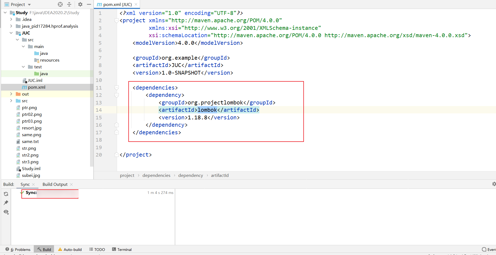

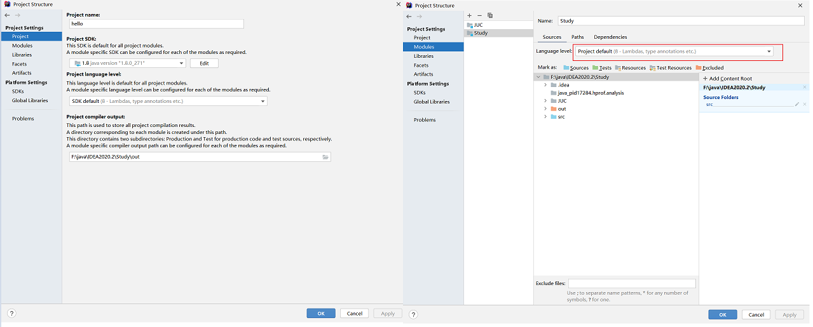

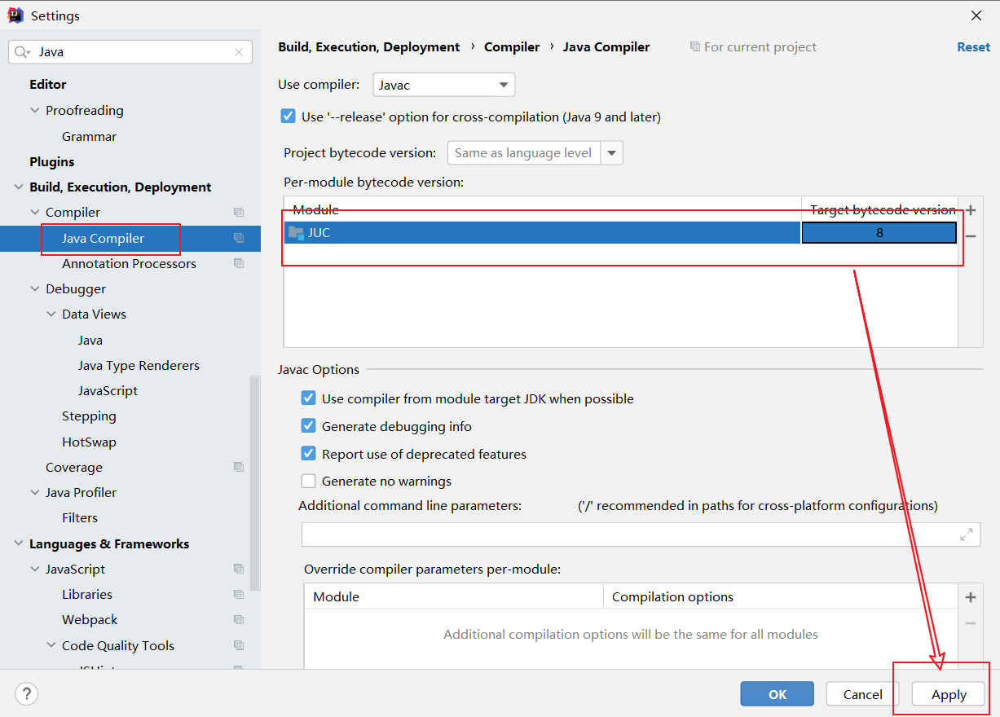

### 1.什么是JUC 

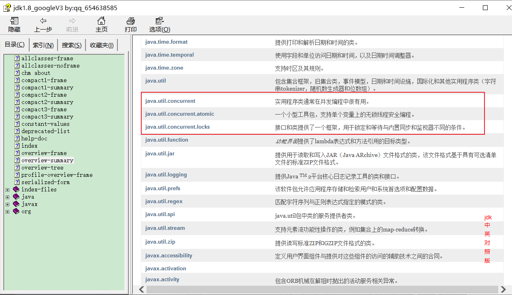

- Java.util工具包。
- 业务：普通的线程代码——Thread。
- Runnable：没有返回值、效率相比于Callable相对较低！

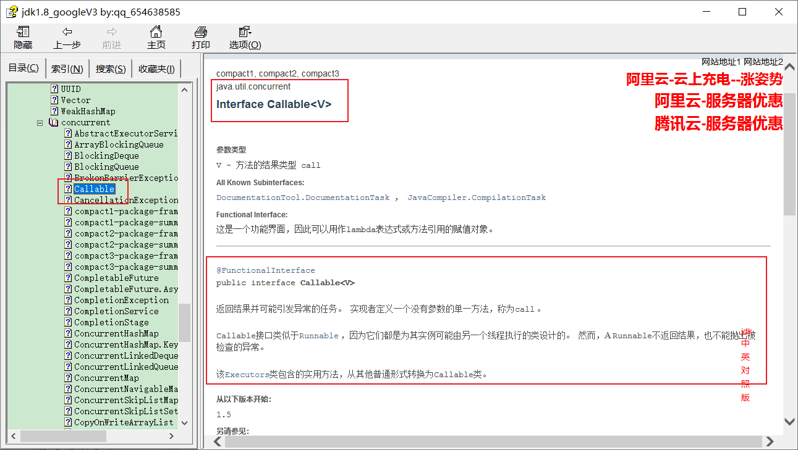

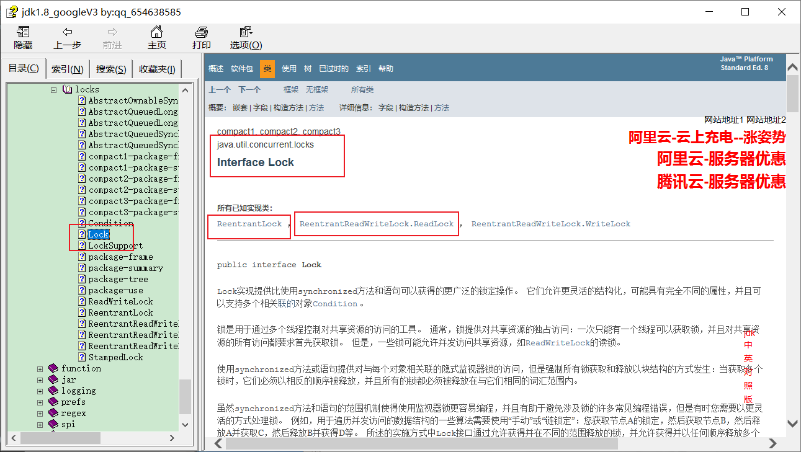

### 2.线程和进程 

> 线程、进程。

- 进程：一个程序，QQ.exe Music.exe，程序的集合。
  - 一个进程可以包含几个线程，至少包含一个。
  - Java默认有几个线程？
    - 两个，main、GC
-  线程： 开了一个进程——Typora软件，写字、自动保存(线程负责)。
  - 对于Java而言：Thread、Runnable、Callable。
  - Java真的可以开启线程吗？
    - 开不了的！
  -  Java是没有权限去开启线程、操作硬件的，这是一个native的一个本地方法，它调用的底层的C++代码。 

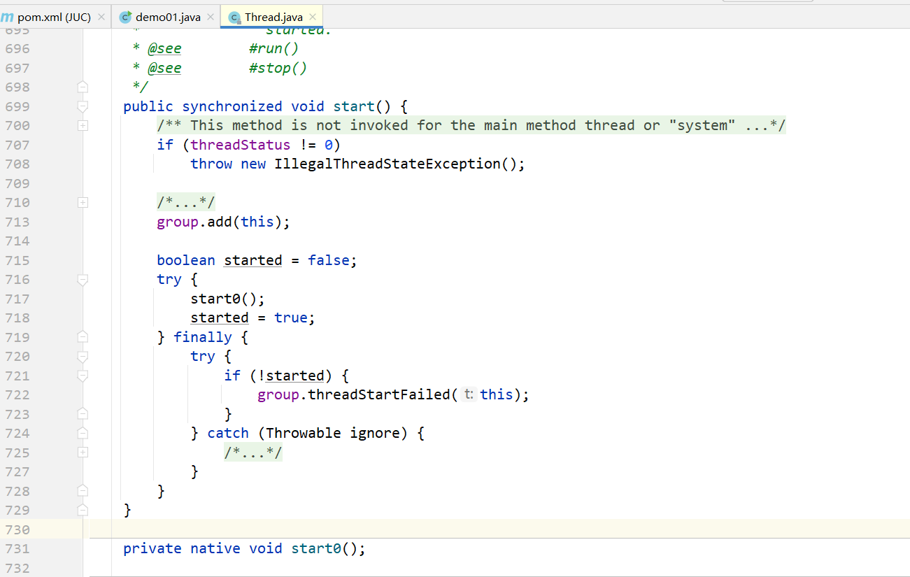

> 并发、并行。

- 并发编程：并发、并行。
- 并发：多线程操作同一个资源。
  - CPU一核，模拟出来多条线程，快速交替。
- 并行：多人一起行走。
  - CPU多核，多个线程可以同时执行。可以考虑线程池。

```java
public class demo01 {
    public static void main(String[] args) {
        // 获取CPU核数，CPU密集型，IO密集型
        System.out.println(Runtime.getRuntime().availableProcessors());
    }
}
```

- 并发编程的本质：==充分利用CPU资源==。

> 线程有几个状态？6个

```java
public enum State {
        /**
         * Thread state for a thread which has not yet started.
         */
    // 新建
        NEW,

        /**
         * Thread state for a runnable thread.  A thread in the runnable
         * state is executing in the Java virtual machine but it may
         * be waiting for other resources from the operating system
         * such as processor.
         */
    // 运行
        RUNNABLE,

        /**
         * Thread state for a thread blocked waiting for a monitor lock.
         * A thread in the blocked state is waiting for a monitor lock
         * to enter a synchronized block/method or
         * reenter a synchronized block/method after calling
         * {@link Object#wait() Object.wait}.
         */
    // 阻塞
        BLOCKED,

        /**
         * Thread state for a waiting thread.
         * A thread is in the waiting state due to calling one of the
         * following methods:
         * <ul>
         *   <li>{@link Object#wait() Object.wait} with no timeout</li>
         *   <li>{@link #join() Thread.join} with no timeout</li>
         *   <li>{@link LockSupport#park() LockSupport.park}</li>
         * </ul>
         *
         * <p>A thread in the waiting state is waiting for another thread to
         * perform a particular action.
         *
         * For example, a thread that has called <tt>Object.wait()</tt>
         * on an object is waiting for another thread to call
         * <tt>Object.notify()</tt> or <tt>Object.notifyAll()</tt> on
         * that object. A thread that has called <tt>Thread.join()</tt>
         * is waiting for a specified thread to terminate.
         */
    // 等待
        WAITING,

        /**
         * Thread state for a waiting thread with a specified waiting time.
         * A thread is in the timed waiting state due to calling one of
         * the following methods with a specified positive waiting time:
         * <ul>
         *   <li>{@link #sleep Thread.sleep}</li>
         *   <li>{@link Object#wait(long) Object.wait} with timeout</li>
         *   <li>{@link #join(long) Thread.join} with timeout</li>
         *   <li>{@link LockSupport#parkNanos LockSupport.parkNanos}</li>
         *   <li>{@link LockSupport#parkUntil LockSupport.parkUntil}</li>
         * </ul>
         */
    // 超时等待
        TIMED_WAITING,

        /**
         * Thread state for a terminated thread.
         * The thread has completed execution.
         */
    // 终止
        TERMINATED;
    }
```

> wait/sleep的区别：

1. 来自不同的类；

   1. wait---> Object
   2. sleep---> Thread
   3. 一般情况下，企业中使用休眠的是：

   ```java
   import java.util.concurrent.TimeUnit;
   
   public class Demo01 {
       public static void main(String[] args) throws InterruptedException {
           TimeUnit.DAYS.sleep(1); 	// 休眠1天
           TimeUnit.SECONDS.sleep(1); 	// 休眠1s
       }
   }
   ```

2. 关于锁的释放；

   1. wait 会释放锁；
   2. sleep睡觉了，不会释放锁；

3. 使用的范围是不同的；

   1. wait 必须在同步代码块中；
   2. sleep 可以在任何地方睡；

4. 是否需要捕获异常。

   1. wait是不需要捕获异常；
   2. sleep必须要捕获异常；

### 3.Lock锁（重点） 

-  传统的Synchronized。

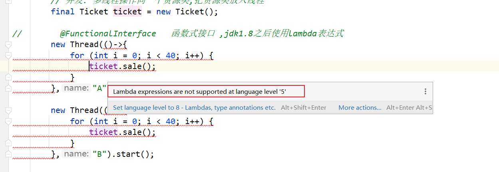

```java
package github.subei.demo01;

/**
 * 基本的卖票例子
 * @author subeiLY
 * @create 2021-06-09 08:39
 */
/*
真正的多线程开发——公司中的开发
线程就是一个单独的资源类，没有任何附属操作。
1.属性、方法
 */
public class SaleTicketDemo01 {
    public static void main(String[] args) {
        // 多线程操作
        // 并发: 多线程操作同一个资源类,把资源类放入线程
        Ticket ticket = new Ticket();

//        @FunctionalInterface   // 函数式接口 ,jdk1.8之后使用lambda表达式
        new Thread(()->{
            for (int i = 0; i < 40; i++) {
                ticket.sale();
            }
        },"A").start();

        new Thread(()->{
            for (int i = 0; i < 40; i++) {
                ticket.sale();
            }
        },"B").start();

        new Thread(()->{
            for (int i = 0; i < 40; i++) {
                ticket.sale();
            }
        },"C").start();
    }
}

// 资源类 OOP
// 属性 + 方法
class Ticket{
    private int number = 60;

    // 卖票的方式
    // synchronized 本质:队列、锁
    public synchronized void sale(){
        if(number>0){
            System.out.println(Thread.currentThread().getName() + "卖出了第" + number + "张票,还有" + number + "张票。");
            number--;
        }
    }
}
```


- Lock接口。

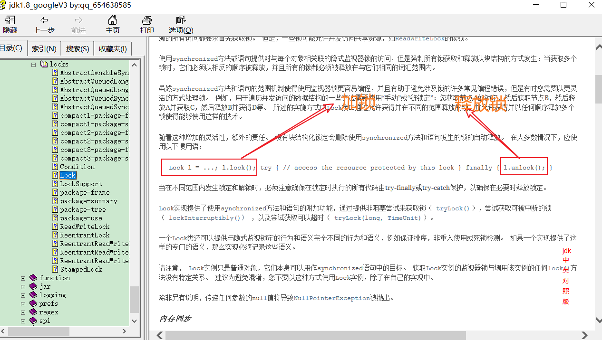

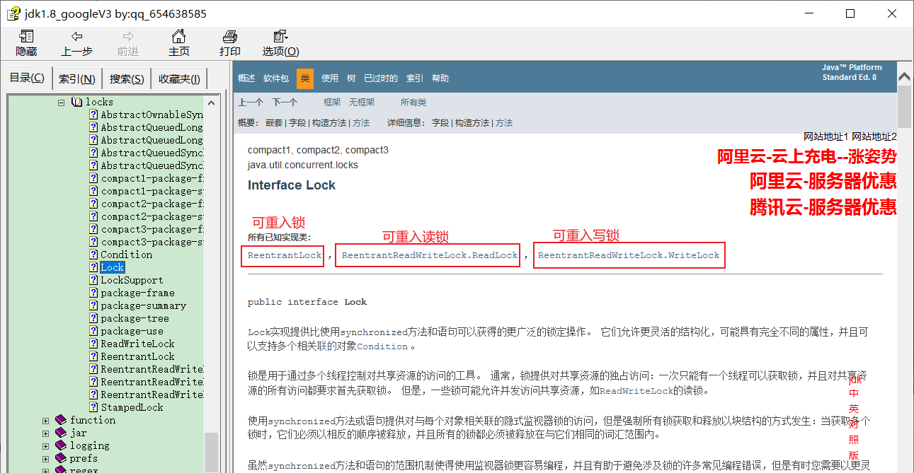

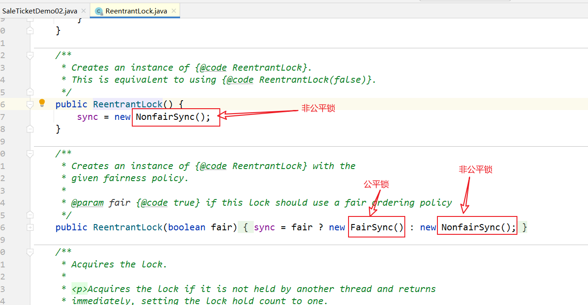

- 公平锁： 十分公平，必须先来后到；
- 非公平锁：十分不公平，可以插队；**(默认为非公平锁)**

```java
package github.subei.demo01;

import java.util.concurrent.locks.Lock;
import java.util.concurrent.locks.ReentrantLock;

/**
 * 基本的卖票例子
 * @author subeiLY
 * @create 2021-06-09 08:39
 */
/*
真正的多线程开发——公司中的开发
线程就是一个单独的资源类，没有任何附属操作。
1.属性、方法
 */
public class SaleTicketDemo02 {
    public static void main(String[] args) {
        // 多线程操作
        // 并发: 多线程操作同一个资源类,把资源类放入线程
        Ticket02 ticket = new Ticket02();
        new Thread(()->{
            for (int i = 0; i < 40; i++) {
                ticket.sale();
            }
        },"A").start();

        new Thread(()->{
            for (int i = 0; i < 40; i++) {
                ticket.sale();
            }
        },"B").start();

        new Thread(()->{
            for (int i = 0; i < 40; i++) {
                ticket.sale();
            }
        },"C").start();
    }
}

/*
lock三部曲
1.Lock lock=new ReentrantLock();
2.lock.lock() 加锁
3.finally=> 解锁：lock.unlock();
 */
class Ticket02{
    private int number = 40;

    Lock lock = new ReentrantLock();

    // 卖票的方式
    // 使用lock锁
    public void sale(){
        // 加锁
        lock.lock();
        try{
            // 业务代码
            if(number>0){
                System.out.println(Thread.currentThread().getName() + "卖出了第" + number + "张票,还有" + number + "张票。");
                number--;
            }
        }catch (Exception e){
            e.printStackTrace();
        }finally {
            // 解锁
            lock.unlock();
        }
    }
}
```

- Synchronized 和 Lock区别：

  1. Synchronized 内置的Java关键字，Lock是一个Java类；

  2. Synchronized 无法判断获取锁的状态，Lock可以判断；

  3. Synchronized 会自动释放锁，lock必须要手动加锁和手动释放锁！可能会遇到死锁；

  4. Synchronized 线程1(获得锁->阻塞)、线程2(等待)；而lock就不一定会一直等待下去，因为lock会有一个trylock去尝试获取锁，不会造成长久的等待；

  5. Synchronized 是可重入锁，不可以中断的，非公平的；Lock，可重入的，可以判断锁，可以自己设置公平锁和非公平锁；

  6. Synchronized 适合锁少量的代码同步问题，Lock适合锁大量的同步代码。

- 锁到底是什么？ 如何判断锁的是谁？ 
  - 


### 4.生产者和消费者问题 


### 5.8锁现象 


### 6.集合类不安全 


### 7.Callable 常用的辅助类(必会) 


### 8.读写锁 


### 9.阻塞队列 


### 10.线程池(重点) 


### 11.四大函数式接口（必需掌握） 


### 12.Stream流式计算 


### 13.ForkJoin 


### 14.异步回调 


### 15.JMM 


### 16.Volatile 


### 17.彻底玩转单例模式 


### 18.深入理解CAS 


### 19.原子引用 


### 20.各种锁的理解：公平锁、非公平锁、可重入锁、自旋锁、死锁


