## JVM探究

**面试常见**：

1. 请你谈谈你对JVM的理解?
2. java8虚拟机和之前的变化更新?
3. 什么是OOM，什么是栈溢出StackOverFlowError? 怎么分析?
4. JVM的常用调优参数有哪些?
5. 内存快照如何抓取？怎么分析Dump文件？
6. 谈谈JVM中，类加载器你的认识？

### 1.JVM的位置

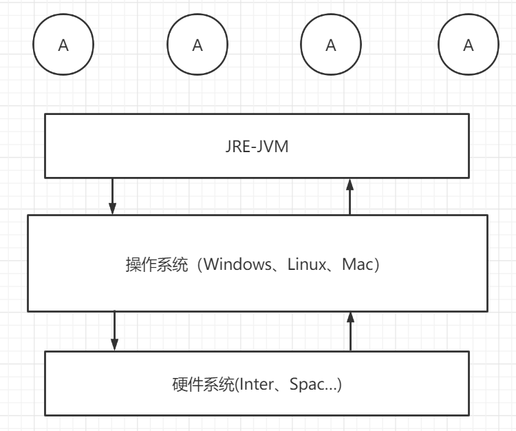

**三种JVM:**

- Sun公司：HotSpot 用的最多
- BEA：JRockit
- IBM：J9VM

我们学习都是：**HotSpot**

### 2.JVM的体系结构


- **jvm调优：99%都是在方法区和堆，大部分时间调堆。** JNI（java native interface）本地方法接口。 

 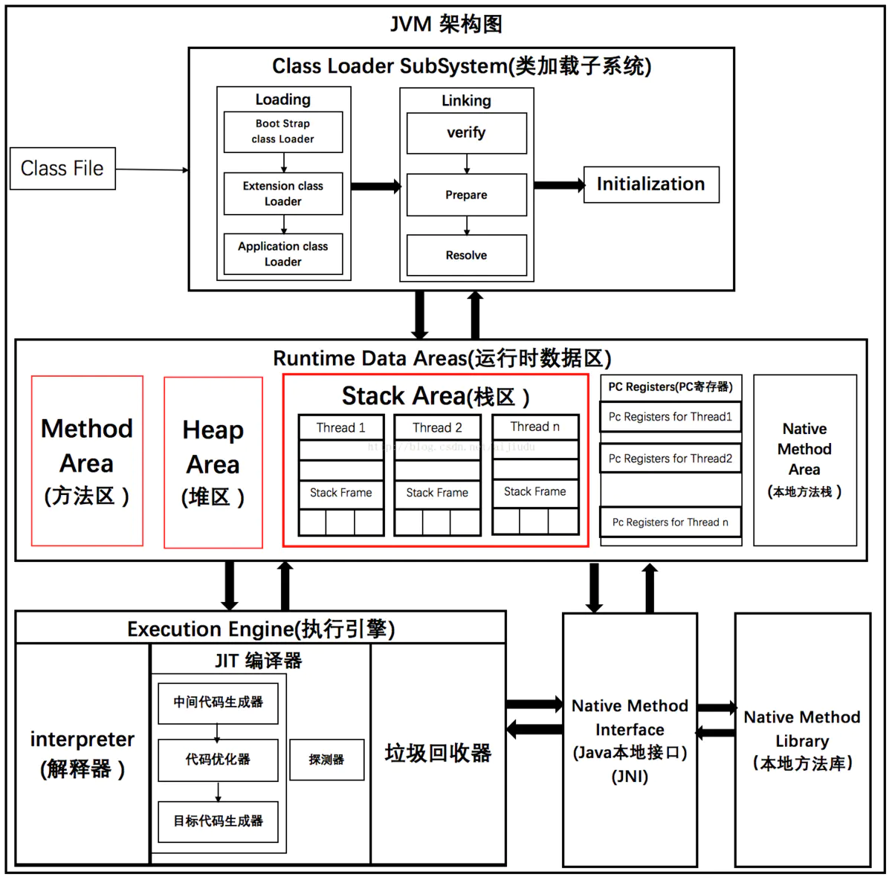 

### 3.类加载器

-  作用：加载Class文件——如果new Student();（具体实例在堆里，引用变量名放栈里） 。
-  先来看看一个类加载到 JVM 的一个基本结构：

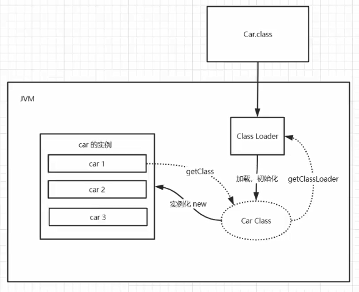

- 类是模板，对象是具体的，通过new来实例化对象。car1，car2，car3，名字在栈里面，真正的实例，具体的数据在堆里面，栈只是引用地址。

1. 虚拟机自带的加载器
2. 启动类（根）加载器
3. 扩展类加载器
4. 应用程序加载器

```java
package github.JVM.Demo01;

/**
 * @author subeiLY
 * @create 2021-06-08 07:42
 */
public class Test01 {
    public static void main(String[] args) {
        Test01 test01 = new Test01();
        Test01 test02 = new Test01();
        Test01 test03 = new Test01();

        System.out.println(test01.hashCode());
        System.out.println(test02.hashCode());
        System.out.println(test03.hashCode());
/*
1836019240
325040804
1173230247
 */

        Class<? extends Test01> aClass1 = test01.getClass();

        ClassLoader classLoader = aClass1.getClassLoader();
        System.out.println(classLoader);
        System.out.println(classLoader.getParent());
        System.out.println(classLoader.getParent().getParent());
/*
sun.misc.Launcher$AppClassLoader@18b4aac2
sun.misc.Launcher$ExtClassLoader@330bedb4
null
 */

        Class<? extends Test01> aClass2 = test02.getClass();
        Class<? extends Test01> aClass3 = test03.getClass();

        System.out.println(aClass1.hashCode());
        System.out.println(aClass2.hashCode());
        System.out.println(aClass3.hashCode());
        /*
        2133927002
        2133927002
        2133927002
         */
    }
}
```

**类加载器的分类**

- Bootstrap ClassLoader 启动类加载器
- Extention ClassLoader 标准扩展类加载器
- Application ClassLoader 应用类加载器
- User ClassLoader 用户自定义类加载器

### 4.双亲委派机制

```java
package java.lang;

/**
 * @author subeiLY
 * @create 2021-06-08 08:06
 */
public class String {
    /*
    双亲委派机制:安全
    1.APP-->EXC-->BOOT(最终执行)
    BOOT
    EXC
    APP
     */
    public String toString() {
        return "Hello";
    }

    public static void main(String[] args) {
        String s = new String();
        System.out.println(s.getClass());
        s.toString();
    }
    /*
    1.类加载器收到类加载的请求
    2.将这个请求向上委托给父类加载器去完成，一直向上委托，知道启动类加载
    3.启动加载器检查是否能够加载当前这个类，能加载就结束，使用当前的加载器，否则，抛出异常，适知子加载器进行加载
    4.重复步骤3
     */
}
```

- idea报了一个错误：

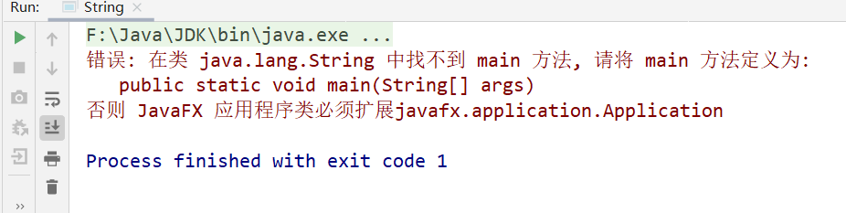

> 这是因为，在运行一个类之前，首先会在应用程序加载器(APP)中找，如果APP中有这个类，继续向上在扩展类加载器EXC中找，然后再向上，在启动类( 根 )加载器BOOT中找。如果在BOOT中有这个类的话，最终执行的就是根加载器中的。如果BOOT中没有的话，就会倒找往回找。

**过程总结**

- 1.类加载器收到类加载的请求

- 2.将这个请求向上委托给父类加载器去完成，一直向上委托，直到启动类加载器

- 3.启动类加载器检查是否能够加载当前这个类，能加载就结束，使用当前的加载器，否则，抛出异常，一层一层向下，通知子加载器进行加载

- 4.重复步骤3

- 关于**双亲委派机制**的博客：

  [你确定你真的理解“双亲委派“了吗？！](https://hollis.blog.csdn.net/article/details/112462198?utm_medium=distribute.pc_relevant.none-task-blog-2%7Edefault%7EBlogCommendFromMachineLearnPai2%7Edefault-11.control&dist_request_id=1329188.24840.16179780332075587&depth_1-utm_source=distribute.pc_relevant.none-task-blog-2%7Edefault%7EBlogCommendFromMachineLearnPai2%7Edefault-11.control) 

-----

[面试官：java双亲委派机制及作用](https://www.jianshu.com/p/1e4011617650)

- ==概念==：当某个类加载器需要加载某个.class文件时，它首先把这个任务委托给他的上级类加载器，递归这个操作，如果上级的类加载器没有加载，自己才会去加载这个类。

- ==例子==：当一个Hello.class这样的文件要被加载时。不考虑我们自定义类加载器，首先会在AppClassLoader中检查是否加载过，如果有那就无需再加载了。如果没有，那么会拿到父加载器，然后调用父加载器的loadClass方法。父类中同理也会先检查自己是否已经加载过，如果没有再往上。注意这个类似递归的过程，直到到达Bootstrap classLoader之前，都是在检查是否加载过，并不会选择自己去加载。直到BootstrapClassLoader，已经没有父加载器了，这时候开始考虑自己是否能加载了，如果自己无法加载，会下沉到子加载器去加载，一直到最底层，如果没有任何加载器能加载，就会抛出ClassNotFoundException。

  

==作用==：

1. 防止重复加载同一个.class。通过委托去向上面问一问，加载过了，就不用再加载一遍。保证数据安全。
2. 保证核心.class不能被篡改。通过委托方式，不会去篡改核心.class，即使篡改也不会去加载，即使加载也不会是同一个.class对象了。不同的加载器加载同一个.class也不是同一个Class对象。这样保证了Class执行安全。

> 比如：如果有人想替换系统级别的类：String.java。篡改它的实现，在这种机制下这些系统的类已经被Bootstrap classLoader加载过了（为什么？因为当一个类需要加载的时候，最先去尝试加载的就是BootstrapClassLoader），所以其他类加载器并没有机会再去加载，从一定程度上防止了危险代码的植入。

### 5.沙箱安全机制

​	Java安全模型的核心就是Java沙箱(sandbox)，什么是沙箱?沙箱是一个限制程序运行的环境。沙箱机制就是将Java代码限定在虚拟机(JVM)特定的运行范围中，并且严格限制代码对本地系统资源访问，通过这样的措施来保证对代码的有效隔离，防止对本地系统造成破坏。沙箱**主要限制系统资源访问**，那系统资源包括什么?CPU、内存、文件系统、网络。不同级别的沙箱对这些资源访问的限制也可以不一样。

​	所有的Java程序运行都可以指定沙箱，可以定制安全策略。

​	在]ava中将执行程序分成本地代码和远程代码两种，本地代码默认视为可信任的，而远程代码则被看作是不受信的。对于授信的本地代码，可以访问一切本地资源。而对于非授信的远程代码在早期的ava实现中，安全依赖于沙箱(Sandbox)机制。如下图所示JDK1.0安全模型。

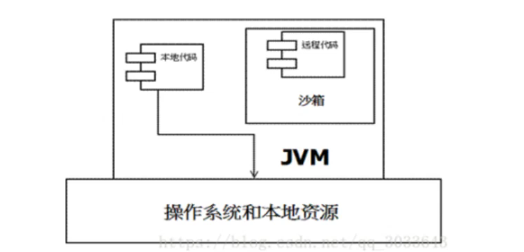

​	 但如此严格的安全机制也给程序的功能扩展带来障碍，比如当用户希望远程代码访问本地系统的文件时候，就无法实现。因此在后续的Java1.1 版本中，针对安全机制做了改进，增加了安全策略，允许用户指定代码对本地资源的访问权限。如下图所示JDK1.1安全模型。


​	在Java1.2版本中，再次改进了安全机制，增加了代码签名。不论本地代码或是远程代码，都会按照用户的安全策略设定，由类加载器加载到虚拟机中权限不同的运行空间，来实现差异化的代码执行权限控制。如下图所示JDK1.2安全模型。


​	当前最新的安全机制实现，则引入了域(Domain)的概念。虚拟机会把所有代码加载到不同的系统域和应用域，系统域部分专门负责与关键资源进行交互，而各个应用域部分则通过系统域的部分代理来对各种需要的资源进行访问。虚拟机中不同的受保护域(Protected Domain)，对应不一样的权限(Permission)。存在于不同域中的类文件就具有了当前域的全部权限，如下图所示最新的安全模型(jdk 1.6)。


**组成沙箱的基本组件**:

- `字节码校验器`(bytecode verifier)︰确保Java类文件遵循lava语言规范。这样可以帮助lava程序实现内存保护。但并不是所有的类文件都会经过字节码校验，比如核心类。

- 类装载器(class loader) :其中类装载器在3个方面对Java沙箱起作用：

  。它防止恶意代码去干涉善意的代码;
  。它守护了被信任的类库边界;
  。它将代码归入保护域，确定了代码可以进行哪些操作。

​        虚拟机为不同的类加载器载入的类提供不同的命名空间，命名空间由一系列唯一的名称组成，每一个被装载的类将有一个名字，这个命名空间是由Java虚拟机为每一个类装载器维护的，它们互相之间甚至不可见。

**类装载器采用的机制是双亲委派模式。**

1.从最内层VM自带类加载器开始加载，外层恶意同名类得不到加载从而无法使用;

2.由于严格通过包来区分了访问域，外层恶意的类通过内置代码也无法获得权限访问到内层类，破坏代码就自然无法生效。

- 存取控制器(access controller)︰存取控制器可以控制核心API对操作系统的存取权限，而这个控制的策略设定，可以由用户指定。
- 安全管理器(security manager)︰是核心API和操作系统之间的主要接口。实现权限控制，比存取控制器优先级高。
- 安全软件包(security package) : java.security下的类和扩展包下的类，允许用户为自己的应用增加新的安全特性，包括:
  - 安全提供者
  - 消息摘要
  - 数字签名
  - 加密
  - 鉴别

### 6.Native

- 编写一个多线程类启动。

```java
 public static void main(String[] args) { 
            new Thread(()->{ },"your thread name").start(); 
 }
```

- 点进去看start方法的源码：

```java
public synchronized void start() {
      
        if (threadStatus != 0)
            throw new IllegalThreadStateException();

        group.add(this);

        boolean started = false;
        try {
            start0();	// 调用了一个start0方法
            started = true;
        } finally {
            try {
                if (!started) {
                    group.threadStartFailed(this);
                }
            } catch (Throwable ignore) {
              
            }
        }
    }
	// 这个Thread是一个类，这个方法定义在这里是不是很诡异！看这个关键字native；
    private native void start0();
```

- **凡是带了native关键字的，说明 java的作用范围达不到，去调用底层C语言的库！**

- **JNI：Java Native Interface（Java本地方法接口）**

- 凡是带了native关键字的方法就会进入本地方法栈；

- **Native Method Stack** 本地方法栈

- 本地接口的作用是融合不同的编程语言为Java所用，它的初衷是融合C/C++程序，Java在诞生的时候是C/C++横行的时候，想要立足，必须有调用C、C++的程序，于是就在内存中专门开辟了一块区域处理标记为native的代码，它的具体做法是 在 Native Method Stack 中登记native方法，在 ( ExecutionEngine ) 执行引擎执行的时候加载Native Libraies。

- 目前该方法使用的越来越少了，除非是与硬件有关的应用，比如通过Java程序驱动打印机或者Java系统管理生产设备，在企业级应用中已经比较少见。因为现在的异构领域间通信很发达，比如可以使用Socket通信，也可以使用Web Service等等，不多做介绍！

### 7.PC寄存器

**程序计数器：**Program Counter Register

- 每个线程都有一个程序计数器，是线程私有的，就是一个指针，指向方法区中的方法字节码(用来存储指向像一条指令的地址，也即将要执行的指令代码)，在执行引擎读取下一条指令，是一个非常小的内存空间，几乎可以忽略不计。

### 8.方法区

**Method Area 方法区**


- 方法区是被所有线程共享，所有字段和方法字节码，以及一些特殊方法，如构造函数，接口代码也在此定义，简单说，所有定义的方法的信息都保存在该区域，**此区域属于共享区间;**

- ==静态变量、常量、类信息(构造方法、接口定义)、运行时的常量池存在方法区中，但是实例变量存在堆内存中，和方法区无关==。

- static ，final ，Class ，常量池~

### 9.栈

- 在计算机流传有一句废话： 程序 = 算法 + 数据结构

- 但是对于大部分同学都是： 程序 = 框架 + 业务逻辑
- 栈：后进先出 / 先进后出

- 队列：先进先出（FIFO : First Input First Output）

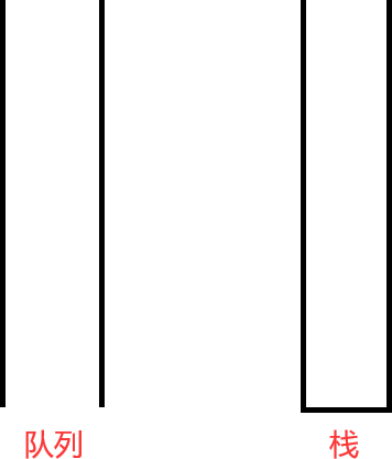

**栈管理程序运行**

- 存储一些基本类型的值、对象的引用、方法等。

- **栈的优势是，存取速度比堆要快，仅次于寄存器，栈数据可以共享。**

思考：为什么main方法最后执行！为什么一个test() 方法执行完了，才会继续走main方法！


> **喝多了吐就是栈，吃多了拉就是队列**。

说明：

- 1、栈也叫栈内存，主管Java程序的运行，是在线程创建时创建，它的生命期是跟随线程的生命期，线程结束栈内存也就释放。

- 2、**对于栈来说不存在垃圾回收问题**，只要线程一旦结束，该栈就Over，生命周期和线程一致，是线程私有的。

- 3、方法自己调自己就会导致栈溢出（递归死循环测试）。

**栈里面会放什么东西那？**

- 8大基本类型 + 对象的引用 + 实例的方法

> **栈运行原理**

- Java栈的组成元素——栈帧。

- 栈帧是一种用于帮助虚拟机执行方法调用与方法执行的数据结构。他是独立于线程的，一个线程有自己的一个栈帧。封装了方法的局部变量表、动态链接信息、方法的返回地址以及操作数栈等信息。

- 第一个方法从调用开始到执行完成，就对应着一个栈帧在虚拟机栈中从入栈到出栈的过程。

> 当一个方法A被调用时就产生了一个栈帧F1，并被压入到栈中，A方法又调用了B方法，于是产生了栈帧F2也被压入栈中，B方法又调用了C方法，于是产生栈帧F3也被压入栈中	执行完毕后，先弹出F3， 然后弹出F2，在弹出F1........

- 遵循 “先进后出” / "后进先出" 的原则。

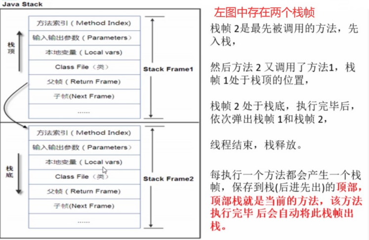

- 栈满了，抛出异常：stackOverflowError

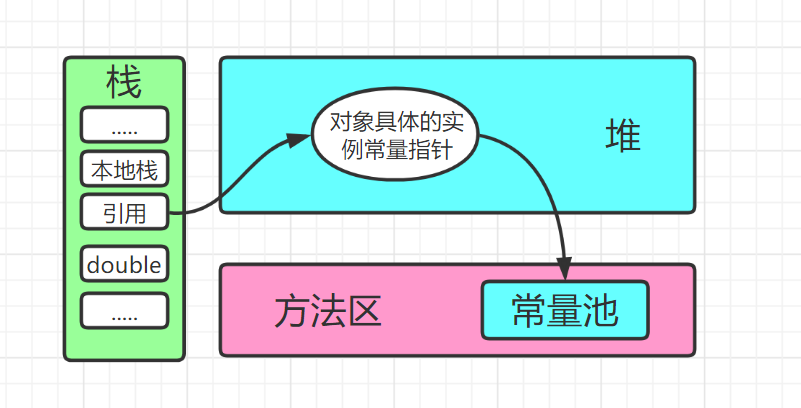

- 对象实例化的过程。

### 10.三种JVM

- Sun公司HotSpot java Hotspot™64-Bit server vw (build 25.181-b13，mixed mode)
- BEA JRockit
- IBM 39 VM
- 我们学习都是：Hotspot


### 11.堆

**Java7**之前

- Heap 堆，一个JVM实例只存在一个堆内存，堆内存的大小是可以调节的。
- 类加载器读取了类文件后，需要把类，方法，常变量放到堆内存中，保存所有引用类型的真实信息，以方便执行器执行。
- 堆内存分为三部分：
  - 新生区 Young Generation Space Young/New
  - 养老区 Tenure generation space Old/Tenure

  - 永久区 Permanent Space Perm

- 堆内存逻辑上分为三部分：新生，养老，永久（元空间 : JDK8 以后名称）。


**谁空谁是to**

- **GC**垃圾回收主要是在新生区和养老区，又分为轻GC 和 重GC，如果内存不够，或者存在死循环，就会导致
- 在JDK8以后，永久存储区改了个名字(元空间)。

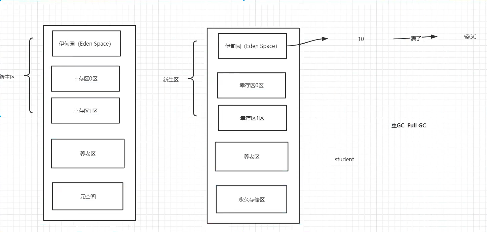

### 12.新生区、养老区

- 新生区是类诞生，成长，消亡的区域，一个类在这里产生，应用，最后被垃圾回收器收集，结束生命。

- 新生区又分为两部分：伊甸区（Eden Space）和幸存者区（Survivor Space），所有的类都是在伊甸区被new出来的，幸存区有两个：0区 和 1区，当伊甸园的空间用完时，程序又需要创建对象，JVM的垃圾回收器将对伊甸园区进行垃圾回收（Minor GC）。将伊甸园中的剩余对象移动到幸存0区，若幸存0区也满了，再对该区进行垃圾回收，然后移动到1区，那如果1区也满了呢？（这里幸存0区和1区是一个互相交替的过程）再移动到养老区，若养老区也满了，那么这个时候将产生MajorGC（Full GC），进行养老区的内存清理，若养老区执行了Full GC后发现依然无法进行对象的保存，就会产生OOM异常 “OutOfMemoryError ”。如果出现 java.lang.OutOfMemoryError：java heap space异常，说明Java虚拟机的堆内存不够，原因如下：
  - 1、Java虚拟机的堆内存设置不够，可以通过参数 -Xms（初始值大小），-Xmx（最大大小）来调整。

  - 2、代码中创建了大量大对象，并且长时间不能被垃圾收集器收集（存在被引用）或者死循环。

### 13.永久区（Perm）

- 永久存储区是一个常驻内存区域，用于存放JDK自身所携带的Class，Interface的元数据，也就是说它存储的是运行环境必须的类信息，被装载进此区域的数据是不会被垃圾回收器回收掉的，关闭JVM才会释放此区域所占用的内存。
- 如果出现 java.lang.OutOfMemoryError：PermGen space，说明是 Java虚拟机对永久代Perm内存设置不够。一般出现这种情况，都是程序启动需要加载大量的第三方jar包，
- 例如：在一个Tomcat下部署了太多的应用。或者大量动态反射生成的类不断被加载，最终导致Perm区被占满。

**注意：**

- JDK1.6之前： 有永久代，常量池1.6在方法区；
- JDK1.7： 有永久代，但是已经逐步 “去永久代”，常量池1.7在堆；
- JDK1.8及之后：无永久代，常量池1.8在元空间。

**熟悉三区结构后方可学习**JVM垃圾回收机制

- 实际而言，方法区（Method Area）和堆一样，是各个线程共享的内存区域，它用于存储虚拟机加载的：类信息+普通常量+静态常量+编译器编译后的代码，虽然JVM规范将方法区描述为**堆的一个逻辑部分，但它却还有一个别名，叫做Non-Heap（非堆），目的就是要和堆分开**。

- 对于HotSpot虚拟机，很多开发者习惯将方法区称之为 “永久代（Parmanent Gen）”，但严格本质上说两者不同，或者说使用永久代实现方法区而已，永久代是方法区（相当于是一个接口interface）的一个实现，Jdk1.7的版本中，已经将原本放在永久代的字符串常量池移走。

- 常量池（Constant Pool）是方法区的一部分，Class文件除了有类的版本，字段，方法，接口描述信息外，还有一项信息就是常量池，这部分内容将在类加载后进入方法区的运行时常量池中存放！


### 14.堆内存调优

- ==-Xms==：设置初始分配大小，默认为物理内存的 “1/64”。
- ==-Xmx==：最大分配内存，默认为物理内存的 “1/4”。
- ==-XX:+PrintGCDetails==：输出详细的GC处理日志。

> 测试1

**代码测试**

```java
public class Demo01 {
    public static void main(String[] args) {
        // 返回虚拟机试图使用的最大内存
        long max = Runtime.getRuntime().maxMemory();    // 字节：1024*1024
        // 返回jvm的总内存
        long total = Runtime.getRuntime().totalMemory();

        System.out.println("max=" + max + "字节\t" + (max/(double)1024/1024) + "MB");

        System.out.println("total=" + total + "字节\t" + (total/(double)1024/1024) + "MB");

        // 默认情况下:分配的总内存是电脑内存的1/4,初始化的内存是电脑的1/64

    }
}
```

- **IDEA**中进行VM调优参数设置，然后启动。


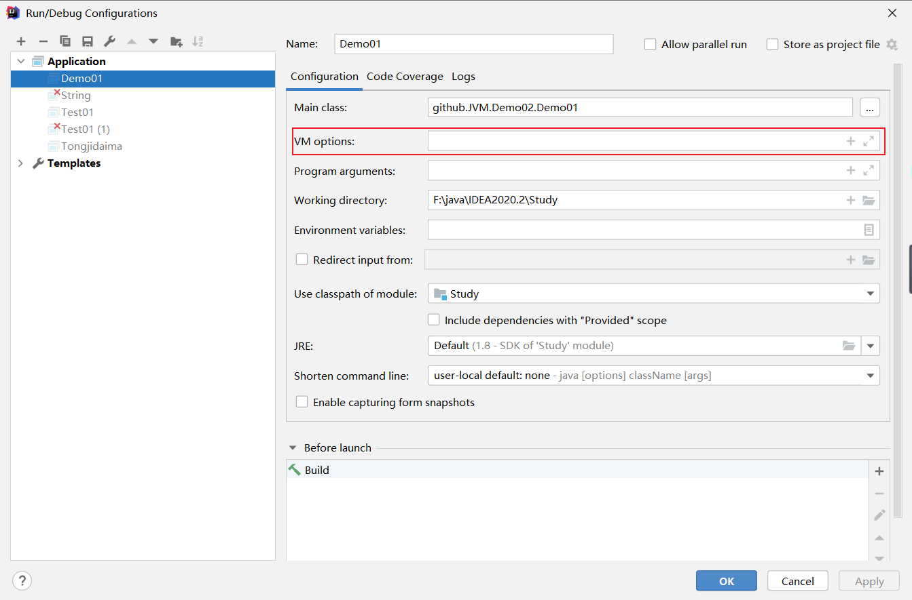

- 发现，默认的情况下分配的内存是总内存的 1/4，而初始化的内存为 1/64 ！

```java
-Xms1024m -Xmx1024m -XX:+PrintGCDetails
```

- VM参数调优：把初始内存，和总内存都调为 1024M，运行，查看结果！


- 来大概计算分析一下！ 


- 再次证明：元空间并不在虚拟机中，而是使用本地内存。

> 测试2

代码：

```java
package github.JVM.Demo02;

import java.util.Random;

/**
 * @author subeiLY
 * @create 2021-06-08 10:22
 */
public class Demo02 {
    public static void main(String[] args) {
        String str = "suneiLY";
        while (true) {
            str += str + new Random().nextInt(88888888)
                    + new Random().nextInt(999999999);
        }
    }
}
```

- vm参数：

```java
-Xms8m -Xmx8m -XX:+PrintGCDetails
```

- 测试，查看结果！

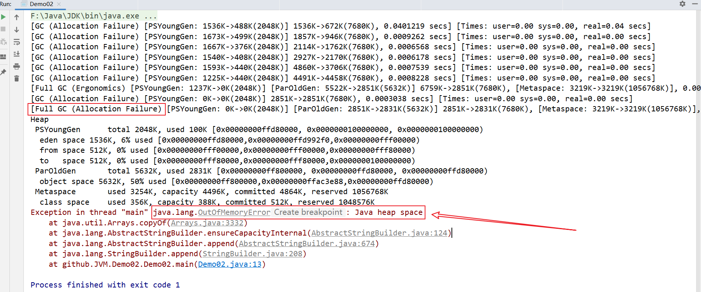

- 这是一个young 区域撑爆的JAVA 内存日志，其中 PSYoungGen 表示 youngGen分区的变化1536k 表示 GC 之前的大小。

- 488k 表示GC 之后的大小。

- 整个Young区域的大小从 1536K 到 672K , young代的总大小为 7680K。

   

- user – 总计本次 GC 总线程所占用的总 CPU 时间。

- sys – OS 调用 or 等待系统时间。

- real – 应用暂停时间。

- 如果GC 线程是 Serial Garbage Collector 串行搜集器的方式的话（只有一条GC线程,）， real time 等于user 和 system 时间之和。

- 通过日志发现Young的区域到最后 GC 之前后都是0，old 区域 无法释放，最后报堆溢出错误。

**其他文章链接**

- [一文读懂 - 元空间和永久代](https://juejin.cn/post/684490402096480257)
- [Java方法区、永久代、元空间、常量池详解](https://blog.csdn.net/u011635492/article/details/81046174?utm_medium=distribute.pc_relevant.none-task-blog-2%7Edefault%7EBlogCommendFromMachineLearnPai2%7Edefault-2.control&dist_request_id=1331647.219.16183160373688617&depth_1-utm_source=distribute.pc_relevant.none-task-blog-2%7Edefault%7EBlogCommendFromMachineLearnPai2%7Edefault-2.control)

### 15.GC
#### 1.Dump内存快照

​        在运行java程序的时候，有时候想测试运行时占用内存情况，这时候就需要使用测试工具查看了。在eclipse里面有 **Eclipse Memory Analyzer tool(MAT)**插件可以测试，而在idea中也有这么一个插件，就是**JProfiler**，一款性能瓶颈分析工具！

**作用**：

- 分析Dump文件，快速定位内存泄漏；

- 获得堆中对象的统计数据

- 获得对象相互引用的关系

- 采用树形展现对象间相互引用的情况


> 安装JProfiler

1. IDEA插件安装

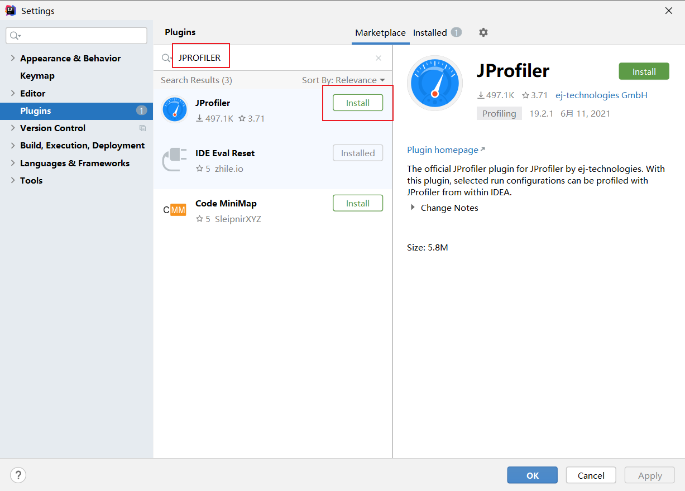

2. 安装JProfiler监控软件

- 下载地址：[https://www.ej-technologies.com/download/jprofiler/version_92](https://www.ej-technologies.com/download/jprofiler/version_92)

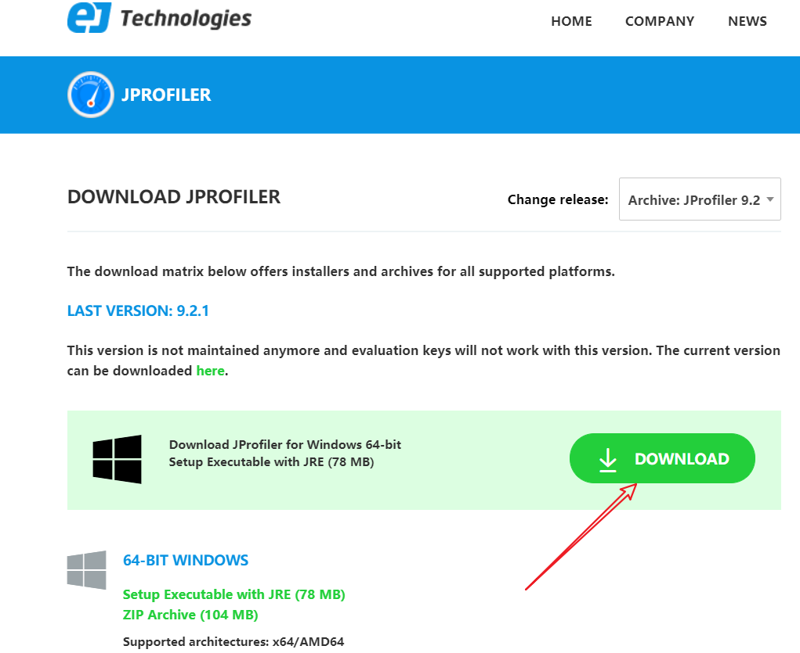

3. 下载完双击运行，选择自定义目录安装，点击Next。

- 注意：安装路径，**建议选择一个文件名中没有中文，没有空格的路径** ，否则识别不了。然后一直点Next。


4. 注册

```java
// 注册码仅供大家参考
L-Larry_Lau@163.com#23874-hrwpdp1sh1wrn#0620
L-Larry_Lau@163.com#36573-fdkscp15axjj6#25257
L-Larry_Lau@163.com#5481-ucjn4a16rvd98#6038
L-Larry_Lau@163.com#99016-hli5ay1ylizjj#27215
L-Larry_Lau@163.com#40775-3wle0g1uin5c1#0674
```

5. 配置IDEA运行环境

- Settings–Tools–JProflier–JProflier executable选择JProfile安装可执行文件。（如果系统只装了一个版本， 启动IDEA时会默认选择）保存。


- 代码测试：

```java
package github.JVM.Demo02;

import java.util.ArrayList;

/**
 * @author subeiLY
 * @create 2021-06-08 11:13
 */
public class Demo03 {
    byte[] byteArray = new byte[1*1024*1024]; // 1M = 1024K


    public static void main(String[] args) {
        ArrayList<Demo03> list = new ArrayList<>();
        int count = 0;
        try {
            while (true) {
                list.add(new Demo03());  // 问题所在
                count = count + 1;
            }
        } catch (Error e) {
            System.out.println("count:" + count);
            e.printStackTrace();
        }
    }
}
```

- vm参数 ： `-Xms1m -Xmx8m -XX:+HeapDumpOnOutOfMemoryError`

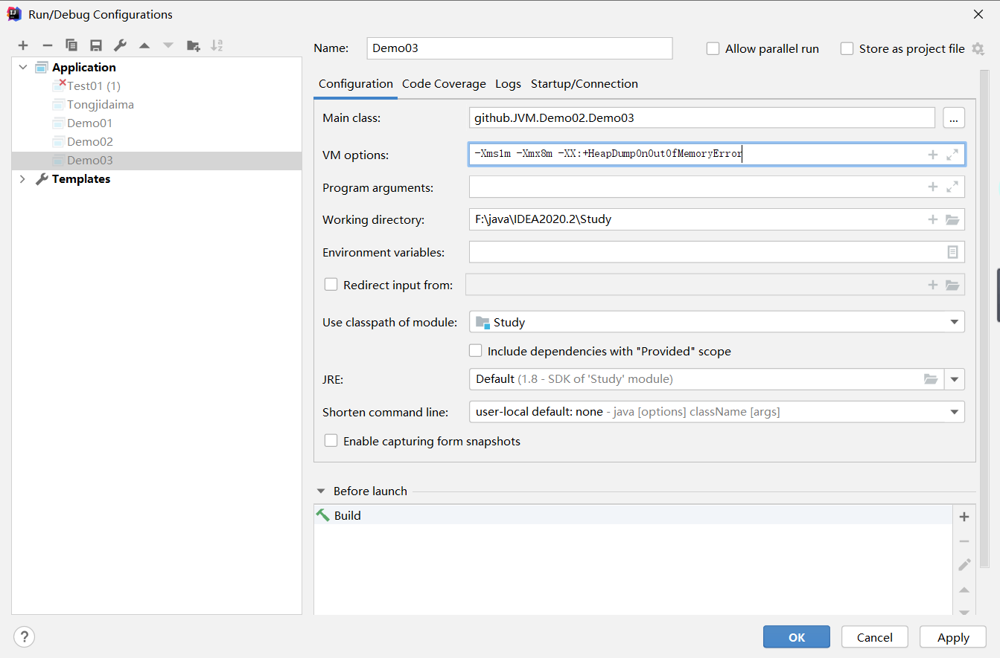

- 寻找文件：

   

> 使用 Jprofiler 工具分析查看

双击这个文件默认使用 Jprofiler 进行 Open大的对象！

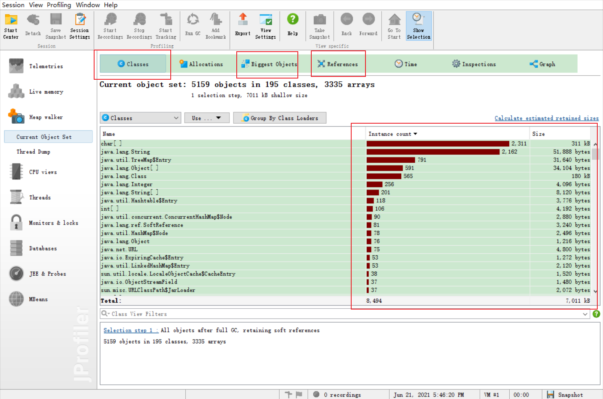


- 从软件开发的角度上，dump文件就是当程序产生异常时，用来记录当时的程序状态信息（例如堆栈的状态），用于程序开发定位问题。

#### 2.GC四大算法

##### 1.引用计数法

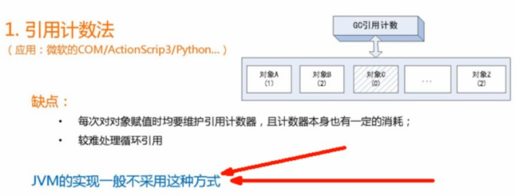

- 每个对象有一个引用计数器，当对象被引用一次则计数器加1，当对象引用失效一次，则计数器减1，对于计数器为0的对象意味着是垃圾对象，可以被GC回收。

- 目前虚拟机基本都是采用可达性算法，从GC  Roots  作为起点开始搜索，那么整个连通图中的对象边都是活对象，对于GC Roots 无法到达的对象变成了垃圾回收对象，随时可被GC回收。

##### 2.复制算法

- 年轻代中使用的是Minor GC，采用的就是复制算法（Copying）。

**什么是复制算法？**

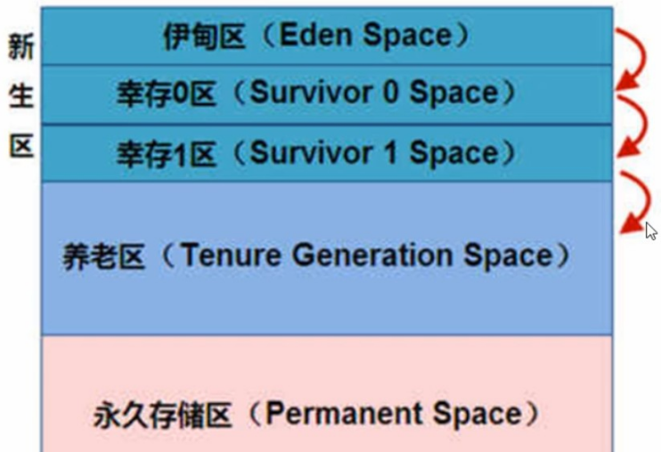

- Minor GC 会把Eden中的所有活的对象都移到Survivor区域中，如果Survivor区中放不下，那么剩下的活的对象就被移动到Old generation中，**也就是说，一旦收集后，Eden就是变成空的了**

- 当对象在Eden（包括一个Survivor区域，这里假设是From区域）出生后，在经过一次Minor GC后，如果对象还存活，并且能够被另外一块Survivor区域所容纳 （上面已经假设为from区域，这里应为to区域，即to区域有足够的内存空间来存储Eden 和 From 区域中存活的对象），则使用**复制算法**将这些仍然还活着的对象复制到另外一块Survivor区域（即 to 区域）中，然后清理所使用过的Eden 以及Survivor 区域（即form区域），并且将这些对象的年龄设置为1，以后对象在Survivor区，每熬过一次MinorGC，就将这个对象的年龄 + 1，当这个对象的年龄达到某一个值的时候（默认是15岁，通过- XX:MaxTenuringThreshold 设定参数）这些对象就会成为老年代。

- `-XX:MaxTenuringThreshold`	任期门槛=>设置对象在新生代中存活的次数

> 面试题：如何判断哪个是to区呢？一句话：**谁空谁是to**

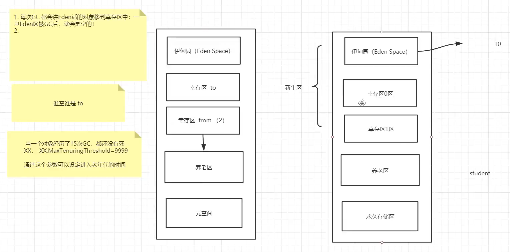

**原理解释：**

- 年轻代中的GC，主要是复制算法（Copying）

- HotSpot JVM 把年轻代分为了三部分：一个 Eden 区 和 2 个Survivor区（from区 和 to区）。默认比例为 8:1:1，一般情况下，新创建的对象都会被分配到Eden区（一些大对象特殊处理），这些对象经过第一次Minor GC后，如果仍然存活，将会被移到Survivor区，对象在Survivor中每熬过一次Minor GC ， 年龄就会增加1岁，当它的年龄增加到一定程度时，就会被移动到年老代中，因为年轻代中的对象基本上  都是朝生夕死，所以在年轻代的垃圾回收算法使用的是复制算法！复制算法的思想就是将内存分为两块，每次只用其中一块，当这一块内存用完，就将还活着的对象复制到另外一块上面。复制算法不会产  生内存碎片！

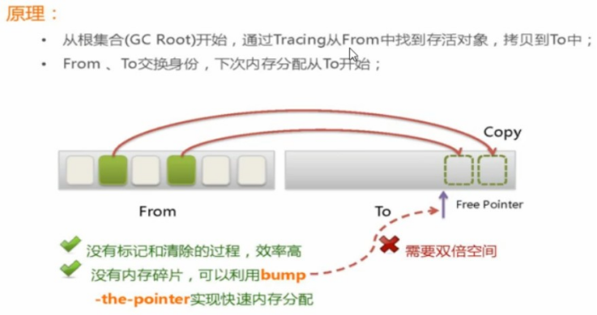

- 在GC开始的时候，对象只会在Eden区和名为 “From” 的Survivor区，Survivor区“TO” 是空的，紧接着进行GC，Eden区中所有存活的对象都会被复制到 “To”，而在 “From” 区中，仍存活的对象会更具他们的年龄值来决定去向。
- 年龄达到一定值的对象会被移动到老年代中，没有达到阈值的对象会被复制到  “To 区域”，经过这次GC后，Eden区和From区已经被清空，这个时候， “From” 和 “To” 会交换他们的角色， 也就是新的 “To” 就是GC前的“From” ， 新的 “From” 就是上次GC前的 “To”。
- 不管怎样，都会保证名为To 的Survicor区域是空的。 Minor GC会一直重复这样的过程。直到 To 区 被填满 ，“To” 区被填满之后，会将所有的对象移动到老年代中。


- 因为Eden区对象一般存活率较低，一般的，使用两块10%的内存作为空闲和活动区域，而另外80%的内存，则是用来给新建对象分配内存的。一旦发生GC，将10%的from活动区间与另外80%中存活的Eden 对象转移到10%的to空闲区域，接下来，将之前的90%的内存，全部释放，以此类推；

- 好处：没有内存碎片；坏处：浪费内存空间。


**劣势：** 

- 复制算法它的缺点也是相当明显的。
  - 1、他浪费了一半的内存，这太要命了。
  - 2、如果对象的存活率很高，我们可以极端一点，假设是100%存活，那么我们需要将所有对象都复制一遍，并将所有引用地址重置一遍。复制这一工作所花费的时间，在对象存活率达到一定程度时，将会变的不可忽视，所以从以上描述不难看出。复制算法要想使用，最起码对象的存活率要非常低才行，而且  最重要的是，我们必须要克服50%的内存浪费。

> 标记清除（Mark-Sweep）

- 回收时，对需要存活的对象进行标记； 

- 回收不是绿色的对象。


- 当堆中的有效内存空间被耗尽的时候，就会停止整个程序（也被称为stop the world），然后进行两项工作，第一项则是标记，第二项则是清除。

- 标记：从引用根节点开始标记所有被引用的对象，标记的过程其实就是遍历所有的GC  Roots  ，然后将所有GC Roots 可达的对象，标记为存活的对象。

- 清除： 遍历整个堆，把未标记的对象清除。

- 缺点：这个算法需要暂停整个应用，会产生内存碎片。两次扫描，严重浪费时间。

> 用通俗的话解释一下  标记/清除算法，就是当程序运行期间，若可以使用的内存被耗尽的时候，GC线程就会被触发并将程序暂停，随后将依旧存活的对象标记一遍，最终再将堆中所有没被标记的对象全部清  除掉，接下来便让程序恢复运行。

**劣势：**

1. 首先、它的缺点就是效率比较低（递归与全堆对象遍历），而且在进行GC的时候，需要停止应用  程序，这会导致用户体验非常差劲

2. 其次、主要的缺点则是这种方式清理出来的空闲内存是不连续的，这点不难理解，我们的死亡对象  都是随机的出现在内存的各个角落，现在把他们清除之后，内存的布局自然乱七八糟，而为了应付  这一点，JVM就不得不维持一个内存空间的空闲列表，这又是一种开销。而且在分配数组对象的时  候，寻找连续的内存空间会不太好找。

##### 3.标记压缩

- 标记整理说明：老年代一般是由标记清除或者是标记清除与标记整理的混合实现。

**什么是标记压缩？**

**原理：**


- 在整理压缩阶段，不再对标记的对象作回收，而是通过所有存活对象都像一端移动，然后直接清除边界以外的内存。可以看到，标记的存活对象将会被整理，按照内存地址依次排列，而未被标记的内存会被  清理掉，如此一来，当我们需要给新对象分配内存时，JVM只需要持有一个内存的起始地址即可，这比维护一个空闲列表显然少了许多开销。

- 标记、整理算法  不仅可以弥补  标记、清除算法当中，内存区域分散的缺点，也消除了复制算法当中，内存减半的高额代价；

##### 4.标记清除压缩

- 先标记清除几次，再压缩。


#### 3.总结

- 内存效率：复制算法 > 标记清除算法 > 标记压缩算法 （时间复杂度）； 

- 内存整齐度：复制算法 = 标记压缩算法 > 标记清除算法；
- 内存利用率：标记压缩算法 = 标记清除算法 > 复制算法；

​        可以看出，效率上来说，复制算法是当之无愧的老大，但是却浪费了太多内存，而为了尽量兼顾上面所  提到的三个指标，标记压缩算法相对来说更平滑一些 ， 但是效率上依然不尽如人意，它比复制算法多了一个标记的阶段，又比标记清除多了一个整理内存的过程。

> 难道就没有一种最优算法吗？
>
> 答案： 无，没有最好的算法，只有最合适的算法 。	-----------> 分代收集算法

**年轻代：**（Young Gen）

- 年轻代特点是区域相对老年代较小，对象存活低。
- 这种情况复制算法的回收整理，速度是最快的。复制算法的效率只和当前存活对象大小有关，因而很适  用于年轻代的回收。而复制算法内存利用率不高的问题，通过hotspot中的两个survivor的设计得到缓解。 

**老年代：**（Tenure Gen）

- 老年代的特点是区域较大，对象存活率高！
- 这种情况，存在大量存活率高的对象，复制算法明显变得不合适。一般是由标记清除或者是标记清除与标记整理的混合实现。Mark阶段的开销与存活对象的数量成正比，这点来说，对于老年代，标记清除或  者标记整理有一些不符，但可以通过多核多线程利用，对并发，并行的形式提标记效率。Sweep阶段的   开销与所管理里区域的大小相关，但Sweep “就地处决”  的  特点，回收的过程没有对象的移动。使其相对其他有对象移动步骤的回收算法，仍然是是效率最好的，但是需要解决内存碎片的问题。

### 16.JMM

1. 什么是JMM？

   - JMM：（java Memory Model的缩写）

2. 他干嘛的？官方，其他人的博客，对应的视频！

   - 作用：缓存一致性协议，用于定义数据读写的规则(遵守，找到这个规则)。		

   - JMM定义了线程工作内存和主内存之间的抽象关系∶线程之间的共享变量存储在主内存(Main Memory)中，每个线程都有一个私有的本地内存（Local Memory)。


- 解决共享对象可见性这个问题：volilate

3. 它该如何学习？

   - JMM：抽象的概念，理论。

- [JMM对这八种指令的使用](https://www.cnblogs.com/null-qige/p/9481900.html)，制定了如下规则：
  - 不允许read和load、store和write操作之一单独出现。即使用了read必须load，使用了store必须write。
  - 不允许线程丢弃他最近的assign操作，即工作变量的数据改变了之后，必须告知主存。
  - 不允许一个线程将没有assign的数据从工作内存同步回主内存。
  - 一个新的变量必须在主内存中诞生，不允许工作内存直接使用一个未被初始化的变量。就是怼变量实施use、store操作之前，必须经过assign和load操作。
  - 一个变量同一时间只有一个线程能对其进行lock。多次lock后，必须执行相同次数的unlock才能解锁。
  - 如果对一个变量进行lock操作，会清空所有工作内存中此变量的值，在执行引擎使用这个变量前，必须重新load或assign操作初始化变量的值。
  - 如果一个变量没有被lock，就不能对其进行unlock操作。也不能unlock一个被其他线程锁住的变量。
  - 对一个变量进行unlock操作之前，必须把此变量同步回主内存。

　　JMM对这八种操作规则和对[volatile的一些特殊规则](https://www.cnblogs.com/null-qige/p/8569131.html)就能确定哪里操作是线程安全，哪些操作是线程不安全的了。但是这些规则实在复杂，很难在实践中直接分析。所以一般我们也不会通过上述规则进行分析。更多的时候，使用java的happen-before规则来进行分析。


