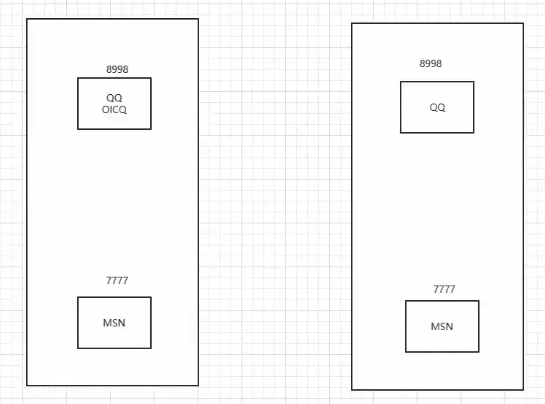
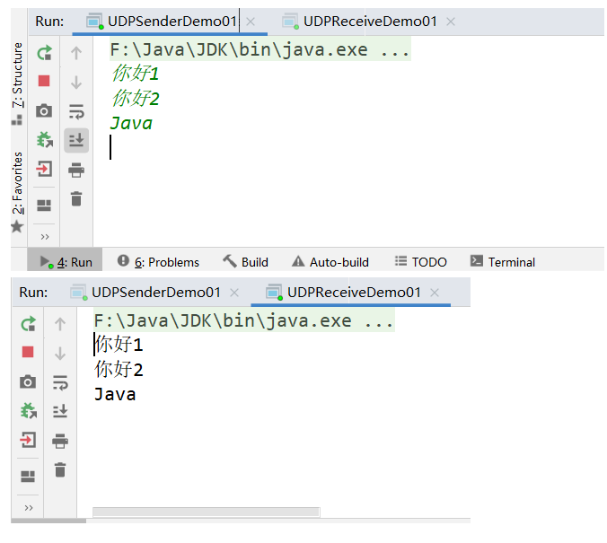
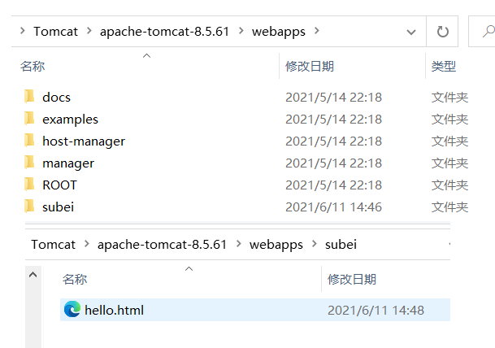

## 网络编程

### 1.概述

邮件：


- 计算机网络： 计算机网络是指将[地理](https://baike.baidu.com/item/地理)位置不同的具有独立功能的多台[计算机](https://baike.baidu.com/item/计算机/140338)及其外部设备，通过通信线路连接起来，在[网络操作系统](https://baike.baidu.com/item/网络操作系统/3997)，[网络管理软件](https://baike.baidu.com/item/网络管理软件/6579078)及[网络通信协议](https://baike.baidu.com/item/网络通信协议/4438611)的管理和协调下，实现[资源共享](https://baike.baidu.com/item/资源共享/233480)和信息传递的计算机系统。 
- 网络编程的目的：无线电台…传播交流信息，数据交换，通信。
- **想要达到这个效果需要什么：**
  1. 如何让准确的定位网络上的一台主机 192.168.16.124：端口， 定位上这个计算机上的某个资源。
  2. 找到了这个主机，如何传输数据呢？
- Javaweb:网页编程 、 B/S架构
- 网络编程：TCP/IP 、 C/S

### 2.网络通信要素

**如何实现网络的通信？**

- 通信双方的地址：
  - ip：192.168.16.124
  - 端口：5900
- **规则：网络通信的协议**：TCP/IP


> 小结：

1. 网络编程中有两个主要的问题：
   - 如何让准确的定位到网络上的一台或多台主机；
   - 找到主机之后如何通信；
2. 网络编程中的要素：
   - IP和端口号：IP
   - 网络通信协议：UDP、TCP
3. 万物皆对象

### 3.IP

IP 地址：InetAddress

- 唯一定位一台网络上的计算机

- 127.0.0.1： 本机localhost

- ip地址的父类
  - ==IPV4==： 127.0.0.1 ,4个字节组成。，0~255， 42亿~；30亿都在北美，亚洲4亿。2011年就用尽；
  - ==IPV6==： fe80::f0e0:7383:ad8e:f32f%3 ，128位。8个无符号整数

  ```java
  2406:da18:ddf:4000:67d5:b226:cad7:125b
  ```

- 公网（互联网）--私网（局域网）

  - [ABCD地址](https://www.jb51.net/network/579228.html)

  - 192.168.xx.xx,专门给组织内部使用。

- 域名：记忆IP问题！
  
  - IP：www.vip.com

```java
package github.Web;

import java.net.InetAddress;
import java.net.UnknownHostException;

/**
 * @author subeiLY
 * @create 2021-06-06 10:09
 */
public class TestInetAddress {
    public static void main(String[] args) {
        try{
            // 查询本机地址
            InetAddress inetAddress1 = InetAddress.getByName("127.0.0.1");
            System.out.println(inetAddress1);
            InetAddress inetAddress2 = InetAddress.getByName("localhost");
            System.out.println(inetAddress2);
            InetAddress inetAddress3 = InetAddress.getLocalHost();
            System.out.println(inetAddress3);

            // 查询网站IP地址
            InetAddress inetAddress = InetAddress.getByName("www.taobao.com");
            System.out.println(inetAddress);

            // 常用方法
//            System.out.println(inetAddress.getAddress());   // 返回的是一个字节数组  无用
            System.out.println(inetAddress.getCanonicalHostName());    // 规范的名字
            System.out.println(inetAddress.getHostAddress());  // IP
            System.out.println(inetAddress.getHostName()); // 域名，或者自己电脑的名字

        }catch (UnknownHostException e) {
            e.printStackTrace();
        }

    }
}
```

### 4.端口

- 端口表示计算机上一个程序的进程；

- 不同的进程有不同的端口号！用来区分软件！

- 被规定0~65535

- TCP，UDP：65535*2个端口 tcp：80 udp：80 单个协议下，端口号不能冲突

- 端口分类
  - 共有端口 0~1023 内置的进程使用
    - HTTP：80
    - HTTP：443 如访问https：//www.baidu.com:443 访问的还是百度
    - FTP：21
    - TELENT：23
  - 程序注册端口：1014-49151，分配给用户和程序
    - Tomcat：8080
    - MySql：3306
    - Oracle：1521
  - 动态、私有端口：49152~65535

```cmd
netstat -ano #查看所有的端口
netstat -nao|findstr "7808" #查看指定的端口
tasklist|findstr "8696"
```


```java
package github.Web;

import java.net.InetSocketAddress;

/**
 * @author subeiLY
 * @create 2021-06-06 10:34
 */
public class TestInetSocketAddress {
    public static void main(String[] args) {
        InetSocketAddress socketAddress = new InetSocketAddress("127.0.0.1", 8080);
        InetSocketAddress socketAddress2 = new InetSocketAddress("localhost", 8080);
        System.out.println(socketAddress);
        System.out.println(socketAddress2);

        System.out.println(socketAddress.getAddress());
        System.out.println(socketAddress.getHostName());    // 地址
        System.out.println(socketAddress.getPort());    // 端口
    }
}
```



### 5.通信协议

协议：约定，就好比中国人交流说的是普通话

**网络通信协议：** 速率，传输码率，代码结构，传输控制…

**问题**：非常的复杂

大事化小：分层

**TCP/IP协议簇：实际上是一组协议**

重要：

- TCP：用户传输协议
- UDP：用户数据报协议

出名的协议：

- TCP：
- IP：网络互联协议


**TCP UDP 对比**

- TCP：打电话

  - 连接，稳定

  - 三次握手，四次挥手

    ```java
    最少需要三次，保证稳定连接！
    A：你瞅啥？
    B：瞅你咋地？
    A：干一场
    
    A：我要分手了
    B：我知道你要分手了
    B：你真的要分手吗？
    A：我真的要分手了
    ```

  - 客户端、服务器

  - 传输完成，释放连接，效率低

- UDP;发短信
  - 不连接，不稳定
  - 客户端、服务端：没有明确的解现
  - 不管有没有准备好，都可以发给你
  - DDOS：洪水攻击！ 发垃圾包 堵塞线路 （饱和攻击）

### 6.TCP

> **先启动服务端，再启动客户端！！！！**

**客户端**

- 连接服务器 Socket
- 发送消息

```java
package github.Web.Demo02;

import java.io.IOException;
import java.io.OutputStream;
import java.net.InetAddress;
import java.net.Socket;

/**
 * @author subeiLY
 * @create 2021-06-06 11:08
 */
// 客户端
public class TCPClientDemo01 {
    public static void main(String[] args) {
        Socket accept = null;
        OutputStream os = null;

        try {
            // 1.要知道服务器的地址
            InetAddress inetAddress = InetAddress.getByName("127.0.0.1");
            int port = 9999;
            // 2.创建一个socket链接
            accept = new Socket(inetAddress,port);
            // 3.发送信息IO流
            os = accept.getOutputStream();
            os.write("就这吧，什么鬼？".getBytes());
        }catch (Exception e){
            e.printStackTrace();
        } finally {
            // 关闭资源
            if(os != null){
                try {
                    os.close();
                } catch (IOException e) {
                    e.printStackTrace();
                }
            }
            if(accept != null){
                try {
                    accept.close();
                } catch (IOException e) {
                    e.printStackTrace();
                }
            }
        }
    }
}
```

**服务器端**

- 建立服务的端口 ServerSocket
- 等待的用户的连接 accept
- 接收用户的消息

```java
package github.Web.Demo02;

import java.io.ByteArrayOutputStream;
import java.io.IOException;
import java.io.InputStream;
import java.net.ServerSocket;
import java.net.Socket;

/**
 * @author subeiLY
 * @create 2021-06-06 11:22
 */
// 服务端
public class TCPServerDemo01 {
    public static void main(String[] args) {

        ServerSocket serverSocket = null;
        Socket socket = null;
        InputStream is = null;
        ByteArrayOutputStream baos = null;

        try{
            // 1.有一个地址
            serverSocket = new ServerSocket(9999);
            // 2.等待客户端连接过来
            socket = serverSocket.accept();
            // 3.读取客户端的消息
            is = socket.getInputStream();

           /*
           //弃用 会有中文乱码
           byte[] buffer = new byte[1024];
            int len = 0;
            while ((len = is.read(bytes)) != -1){
                String s = new String(buffer,0,len);
                System.out.println(s);
            }
            */

            // 管道流
            baos = new ByteArrayOutputStream();

            byte[] buffer = new byte[1024];
            int len = 0;
            while ((len = is.read(buffer)) != -1) {
                baos.write(buffer, 0, len);
            }
            System.out.println(baos.toString());

        } catch (IOException e) {
            e.printStackTrace();
        } finally {
            // 关闭资源
            if (baos != null) {
                try {
                    baos.close();
                } catch (IOException e) {
                    e.printStackTrace();
                }
            }
            if (is != null) {
                try {
                    is.close();
                } catch (IOException e) {
                    e.printStackTrace();
                }
            }
            if (socket != null) {
                try {
                    socket.close();
                } catch (IOException e) {
                    e.printStackTrace();
                }
            }
            if (serverSocket != null) {
                try {
                    serverSocket.close();
                } catch (IOException e) {
                    e.printStackTrace();
                }
            }
        }
    }
}
```

#### 1.文件上传

- 客户端

```java
package github.Web.Demo02;

import java.io.*;
import java.net.InetAddress;
import java.net.Socket;

/**
 * @author subeiLY
 * @create 2021-06-06 13:13
 */
// 客户端
public class TCPClientDemo02 {
    public static void main(String[] args) throws Exception {
        // 1.建立连接
        Socket socket = new Socket(InetAddress.getByName("127.0.0.1"),9000);
        // 2.创建输出流
        OutputStream os = socket.getOutputStream();
        // 3.读取文件
        FileInputStream stream = new FileInputStream(new File("subei.jpg"));
        // 4.输出测试文件
        byte[] buffer = new byte[1024];
        int len = 0;
        while((len = stream.read(buffer)) != -1){
            os.write(buffer,0,len);
        }
        // 5.通知服务器已发送完成
        socket.shutdownOutput();
        // 6.确定服务器已经收到，断开连接
        InputStream inputStream = socket.getInputStream();

        ByteArrayOutputStream byteArrayOutputStream = new ByteArrayOutputStream();
        byte[] buffer2 = new byte[1024];
        int len2 = 0;
        while((len2 = stream.read(buffer2)) != -1){
            byteArrayOutputStream.write(buffer2,0,len2);
        }

        System.out.println(byteArrayOutputStream);

        // 7.关闭流
        byteArrayOutputStream.close();
        inputStream.close();
        stream.close();
        os.close();
        socket.close();

    }
}
```

- 服务端

```java
package github.Web.Demo02;

import java.io.FileOutputStream;
import java.io.InputStream;
import java.io.OutputStream;
import java.net.ServerSocket;
import java.net.Socket;

/**
 * @author subeiLY
 * @create 2021-06-06 13:13
 */
// 服务器
public class TCPServerDemo02 {
    public static void main(String[] args) throws Exception{
        // 1.创建一个服务器地址
        ServerSocket socket = new ServerSocket(9000);
        // 2.监听客户连接
        Socket accept = socket.accept();    // 阻塞式监听，能等待用户连进来
        // 3.获取输入流
        InputStream is = accept.getInputStream();
        // 4.确定存放文件的位置
        FileOutputStream fileOutputStream = new FileOutputStream("resort.jpg");

        // 5.写入文件
        byte[] buffer = new byte[1024];
        int len = 0;
        while((len = is.read(buffer)) != -1){
            fileOutputStream.write(buffer,0,len);
        }

        // 6.通知客户端收集完毕
        OutputStream outputStream = accept.getOutputStream();
        outputStream.write("服务器已经收集成功，请断开连接！".getBytes());

        // 7.关闭流
        outputStream.close();
        fileOutputStream.close();
        is.close();
        accept.close();
        socket.close();

    }
}
```


#### 2.初识Tomcat

### Tomcat

> Tomcat乱码： conf\logging.properties 把UTF-8改为GBK

服务端

- 自定义 S
- Tomcat服务器 S ：Java后台开发

客户端

- 自定义 C
- 浏览器 B

### 7.UDP

 发短信：不用连接，需要知道对方的地址 

#### 1.发送消息

```java
package github.Web.Demo03;

import java.net.DatagramPacket;
import java.net.DatagramSocket;
import java.net.InetAddress;

/**
 * @author subeiLY
 * @create 2021-06-06 13:25
 */
// 不需要连接服务器
public class UDPClientDemo01 {
    public static void main(String[] args) throws Exception{
        // 1.建立一个Socket
        DatagramSocket socket = new DatagramSocket();
        // 2.建个包
        String msg = "服务器，你好！";
        InetAddress localhost = InetAddress.getByName("localhost");
        int port = 9090;

        // 数据，数据的长度起始，要发送给谁
        DatagramPacket packet = new DatagramPacket(msg.getBytes(), 0,msg.getBytes().length,localhost,port);

        // 3.发送包
        socket.send(packet);

        // 4.关闭流
        socket.close();

    }
}
```

```java
package github.Web.Demo03;

import java.net.DatagramPacket;
import java.net.DatagramSocket;

/**
 * @author subeiLY
 * @create 2021-06-06 13:26
 */
// 还是需要客户端的链接
public class UDPServerDemo01 {
    public static void main(String[] args) throws Exception{
        // 1.开放端口
        DatagramSocket socket = new DatagramSocket(9090);
        // 2.接收数据包
        byte[] buffer = new byte[1024];
        DatagramPacket packet = new DatagramPacket(buffer, 0, buffer.length);

        socket.receive(packet); // 阻塞接受
        System.out.println(packet.getAddress().getHostAddress());
        System.out.println(new String(packet.getData()));
        // 3.关闭连接
        socket.close();

    }
}
```

#### 2.循环发送消息

```java
package github.Web.Demo03;

import java.io.BufferedReader;
import java.io.InputStreamReader;
import java.net.DatagramPacket;
import java.net.DatagramSocket;
import java.net.InetSocketAddress;

/**
 * @author subeiLY
 * @create 2021-06-06 14:06
 */
public class UDPSenderDemo01 {
    public static void main(String[] args) throws Exception{
        DatagramSocket socket = new DatagramSocket(8888);

        // 准备数据：控制台读取
        BufferedReader reader = new BufferedReader(new InputStreamReader(System.in));

        while(true) {
            String data = reader.readLine();
            byte[] buffer = data.getBytes();
            DatagramPacket packet = new DatagramPacket(buffer, 0, buffer.length, new InetSocketAddress("localhost", 9090));

            // 发送包
            socket.send(packet);
            if (data.equals("bye")) {
                break;
            }
        }

        // 关闭socket
        socket.close();

    }
}
```

```java
package github.Web.Demo03;

import java.net.DatagramPacket;
import java.net.DatagramSocket;

/**
 * @author subeiLY
 * @create 2021-06-06 14:06
 */
public class UDPReceiveDemo01 {
    public static void main(String[] args) throws Exception{
        // 开放端口
        DatagramSocket socket = new DatagramSocket(6666);

        while (true) {

            // 准备接收包裹
            byte[] container = new byte[1024];
            DatagramPacket packet = new DatagramPacket(container, 0, container.length);
            socket.receive(packet);


            byte[] data = packet.getData();
            String receiveData = new String(data);
            System.out.println(receiveData);


            if (receiveData.equals("bye")) {
                break;
            }
        }

        // 关闭socket
        socket.close();

    }
}
```



> 在线咨询： **两个人都可以是发送方，也可以是接收方(配合多线程)** 


- 发信端

```java
package github.Web.Demo04;

import java.io.BufferedReader;
import java.io.IOException;
import java.io.InputStreamReader;
import java.net.DatagramPacket;
import java.net.DatagramSocket;
import java.net.InetSocketAddress;
import java.net.SocketException;

/**
 * @author subeiLY
 * @create 2021-06-06 14:22
 */
public class TalkSend implements Runnable {
    DatagramSocket socket = null;
    BufferedReader reader = null;

    private int    formPort;
    private String hostname;
    private int    toPort;

    public TalkSend(int formPort, String hostname, int toPort) {
        this.formPort = formPort;
        this.hostname = hostname;
        this.toPort = toPort;

        try {
            socket = new DatagramSocket(formPort);
            reader = new BufferedReader(new InputStreamReader(System.in));
        } catch (SocketException e) {
            e.printStackTrace();
        }
    }

    @Override
    public void run() {

        while (true) {
            try {
                String s = reader.readLine();
                byte[] buffer = s.getBytes();
                DatagramPacket packet = new DatagramPacket(buffer, 0, buffer.length,
                        new InetSocketAddress(hostname, toPort));

                // 发送包
                socket.send(packet);
                if (s.equals("bye")) {
                    break;
                }
            } catch (IOException e) {
                e.printStackTrace();
            }
        }

        // 关闭socket
        socket.close();
    }
}
```

- 接收端

```java
package github.Web.Demo04;

import java.io.IOException;
import java.net.DatagramPacket;
import java.net.DatagramSocket;
import java.net.SocketException;

/**
 * @author subeiLY
 * @create 2021-06-06 14:22
 */
public class TalkReceive implements Runnable{
    DatagramSocket socket = null;

    private int port;

    public TalkReceive(int port) {
        this.port = port;
        try {
            socket =  new DatagramSocket(port);
        } catch (SocketException e) {
            e.printStackTrace();
        }
    }

    @Override
    public void run() {
        //开放端口

        // 接收包
        while (true){
            try {
                byte[] container = new byte[1024];
                DatagramPacket packet = new DatagramPacket(container,0,container.length);

                // 接收
                socket.receive(packet);


                byte[] data = packet.getData();
                String receiveData = new String(data);
                System.out.println(Thread.currentThread().getName() + ":" + receiveData);


                if (receiveData.equals("bye")){
                    break;
                }
            } catch (IOException e) {
                e.printStackTrace();
            }
        }

        socket.close();
    }
}
```

- 教师端

```java
package github.Web.Demo04;

/**
 * @author subeiLY
 * @create 2021-06-11 18:23
 */
public class StudentClient {
    public static void main(String[] args) {
        new Thread(new TalkSend(7777,"localhost",8900)).start();
        new Thread(new TalkReceive(9999),"老师").start();

    }
}
```

- 学生端

```java
package github.Web.Demo04;

/**
 * @author subeiLY
 * @create 2021-06-11 18:23
 */
public class TeacherClient {
    public static void main(String[] args) {
        new Thread(new TalkSend(5555,"localhost",9999)).start();
        new Thread(new TalkReceive(8900),"学生").start();

    }
}
```


### 8.URL

- https://www.baidu.com

- 统一资源定位符：定位互联网上的某一个资源

- DNS域名解析 www.baidu.com —> xxx.xxx.xxxx.xxx…xxx

```java
协议：// ip地址：端口号/项目名/资源
```

----

```java
package github.Web.Demo05;

import java.net.MalformedURLException;
import java.net.URL;

/**
 * @author subeiLY
 * @create 2021-06-06 15:16
 */
public class URLDemo01 {
    public static void main(String[] args) throws MalformedURLException {

        URL url = new URL("http://localhost:8080/helloworld/insex" +
                ".jsp?username=subeily&password=123");

        System.out.println(url.getProtocol());  // 协议
        System.out.println(url.getHost());  // 主机IP
        System.out.println(url.getPort());  // 端口
        System.out.println(url.getPath());  // 路径
        System.out.println(url.getFile());  // 文件名
        System.out.println(url.getQuery()); // 参数

    }
}
```

- **下载网页上的文件** 

  - 1.启动tomcat服务器；
  - 2.在tomcat中放好文件；

  

  - 3.进行相关测试。

```java
package github.Web.Demo05;

import java.io.File;
import java.io.FileOutputStream;
import java.io.InputStream;
import java.net.HttpURLConnection;
import java.net.URL;

/**
 * @author subeiLY
 * @create 2021-06-06 15:16
 */
public class URLDemo02 {
    public static void main(String[] args) throws Exception{

        // 1.下载地址
        URL url = new URL("http://localhost:8080/subei/hello.html");

        // 2.连接到这个资源 HTTP
        HttpURLConnection urlConnection = (HttpURLConnection) url.openConnection();

        InputStream is = urlConnection.getInputStream();

        FileOutputStream stream = new FileOutputStream(new File("same.txt"));

        byte[] bytes = new byte[1024];
        int len = 0;
        while ((len = is.read(bytes)) != -1){
            stream.write(bytes,0,len);
        }

        stream.close();
        is.close();
        urlConnection.disconnect();

    }
}
```

