# HTML5入门

## 1.初识HTML

- HyperTextMarkupLanguage（超文本标记语言）
  - 超文本包括：文字、图片、音频、视频、动画。

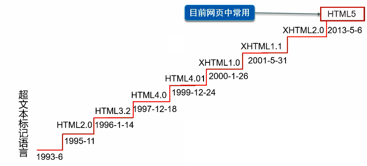

- HTML5的优势
  - 世界知名浏览器厂商对HTML5的支持
  - 市场的需求
  - 跨平台
- W3C标准
  - W3C
    - 万维网联盟 **（World Wide Web Consortium）** 。
    - 成立于1994年，Web领域最权威和最具影响力的国际中立性技术标准机构。
    - https://www.w3.org/
    - https://www.chinaw3c.org/
  - W3C标准包括
    - 结构化标准语言(HTML、XML)
    - 表现标准语言(CSS)
    - 行为标准语言(DOM、ECMAScript)
- 常见IDE
  - 记事本
  - Dreamweaver
  - IDEA
  - WebStorm
  - ……
- < body >、< /body>等成对的标签，分别叫做开放标签和闭合标签。
- 单独呈现的标签（空元素），如< hr/ >;意为用/来关闭空元素。

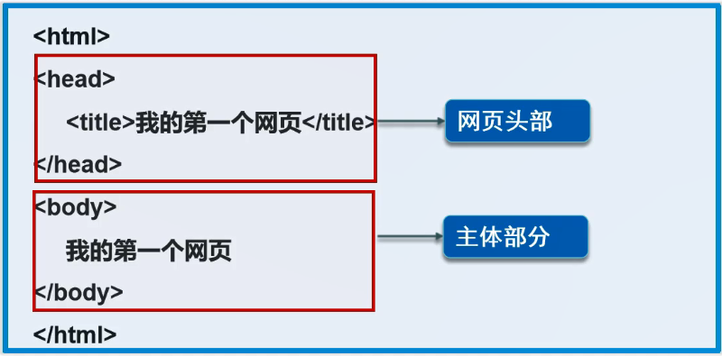

- html注释：< !–注释内容–>

```html
<!DOCTYPE html>
<!--DOCTYPE：告诉浏览器使用什么规范（默认是html）-->
<html lang="en">
<!--语言 zh中文 en英文-->
<head>
    <!--head标签代表网页头部-->
    <meta charset="UTF-8">
    <meta name="subeiLY" content="一起学HTML5">
    <meta name="some" content="一起学前端">
    <!--meta 描述性标签，表示用来描述网站的一些信息-->
    <!--一般用来做SEO-->
    <title>Title</title>
    <!--网站标题-->
</head>
<!--body代表主体-->
<body>
Hello HTML5!
</body>
</html>
```

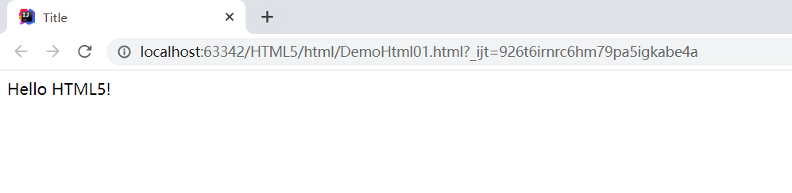


## 2.网页基本标签

- 标题标签
- 段落标签
- 换行标签
- 水平线标签
- 字体样式标签
- 注释和特殊符号

```html
<!DOCTYPE html>
<html lang="en">
<head>
    <meta charset="UTF-8">
    <title>基本标签</title>
</head>
<body>
<!--标题标签 -->
<h1>一级标签</h1>
<h2>二级标签</h2>
<h3>三级标签</h3>
<h4>四级标签</h4>
<h5>五级标签</h5>
<h6>六级标签</h6>

<!--段落标签-->
<p>p换行1</p>
<p>p换行2</p>

<!--水平线标签-->
<hr/>

<!--换行标签-->
换行1 <br/>
换行2 <br/>
<!--换行标签比较紧凑，段落标签有明显段间距-->

<!--粗体 斜体-->
<h1>字体样式标签</h1>
粗体:<strong>I am CSS. </strong><br/>
斜体:<em>HTML5 and CSS3 </em><br/>

<!--特殊符号-->
空格:1&nbsp;2&nbsp;&nbsp;3&nbsp;&nbsp;&nbsp;4<br/>
空格:1 2  3   4<br/>
大于号:&gt;<br/>
小于号:&lt;<br/>
版权符号:&copy;<br/>
<!--特殊符号记忆：'&'开头;结尾，只要在idea中&敲出后就有提示-->

</body>
</html>
```

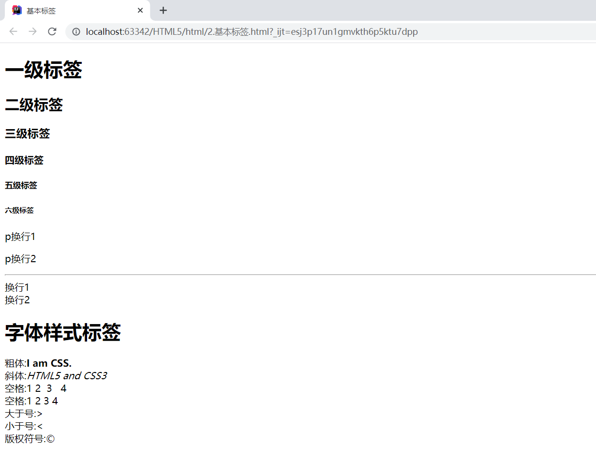

## 3.图像，超链接，网页布局

- 图像标签

  ```html
  
  ```

- 链接标签

  - **href**： 必填，表示要跳转到那个页面；
  - **target**：表示窗口在哪里打开；
  - **_blank**：在新标签中打开；
  - **_self**： 在自己的网页中打开；

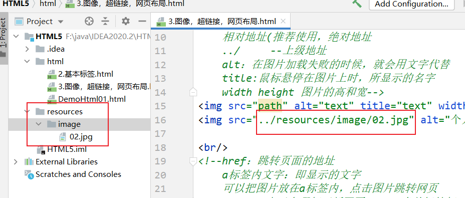

```html
<!DOCTYPE html>
<html lang="en">
<head>
    <meta charset="UTF-8">
    <title>Title</title>
</head>
<body>
<!--img学习
    src:资源地址
    相对地址(推荐使用，绝对地址
    ../     --上级地址
    alt：在图片加载失败的时候，就会用文字代替
    title:鼠标悬停在图片上时，所显示的名字
    width height 图片的高和宽-->


<br/>
<!--href：跳转页面的地址
    a标签内文字：即显示的文字
    可以把图片放在a标签内，点击图片跳转网页
    target:表示在哪打开新网页
	_self:当前标签打开 
	_blank:新的页面中打开-->
<a href="https://www.baidu.com" target="_blank" title="123">请咨询百度</a>
<br/>

<!--锚链接
    1.需要一个标记锚
    2.跳转到标记
    #页面内跳转-->
<a name="top"></a>
<a href="#top">回到顶部</a>
<br/>

<!--可以在网址后添加#号跳到对应网站的对应位置-->
<a href="https://www.baidu.com#down">百度底部</a> <br/>

<!--功能性链接
    邮箱链接：mailto
    qq链接
-->
<a href="mailto:29*******4qq.com">点击联系我</a>
<a target="_blank"
   href="http://wpa.qq.com/msgrd?v=xxx&uin=&site=qq&menu=yes"/>


<a target="_blank" href="http://wpa.qq.com/msgrd?v=3&uin=294****594&site=qq&menu=yes">
    
</a>

</body>
</html>
```

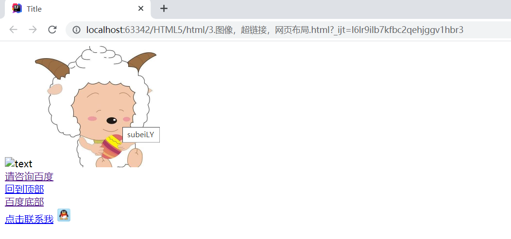

**行内元素和块元素**

- 块元素

  - 无论内容多少，该元素独占一行。

  ```html
  <p></p><hr/> <h1>...<h6>
  ```

  - 行内元素：内容撑开宽度，左右都是行内元素的可以排在一行。

  ```html
  <a><strong><em>
  ```


## 4.列表、表格、媒体元素

### 1.列表

> 什么是列表

- 列表就是信息资源的一种展示形式。它可以使信息结构化和条理化，并以列表的样式显示出来，以便浏览者能更快捷地获得相应的信息。 

> 列表的分类

- 无序列表
- 有序列表
- 自定义列表

```html
<!DOCTYPE html>
<html lang="en">
<head>
    <meta charset="UTF-8">
    <title>列表学习</title>
</head>
<body>
<!--
    有序列表
    应用范围:试卷,问答……
-->
<ol>
    <li>Java</li>
    <li>Python</li>
    <li>前端</li>
    <li>运维</li>
    <li>C/C++</li>
    <li>Android</li>
</ol>

<hr/>

<!--
    无序列表
    应用范围:导航,侧边栏……
-->
<ul>
    <li>Java</li>
    <li>Python</li>
    <li>前端</li>
    <li>运维</li>
    <li>C/C++</li>
    <li>Android</li>
</ul>

<hr/>

<!--
    自定义列表
    dl:标签
    dt:列表名称
    dd:列表内容
-->
<dl>
    <dt>dt</dt>

    <dd>dd1</dd>
    <dd>dd2</dd>
    <dd>dd3</dd>
    <dd>dd4</dd>
    <dd>dd5</dd>
</dl>

</body>
</html>
```

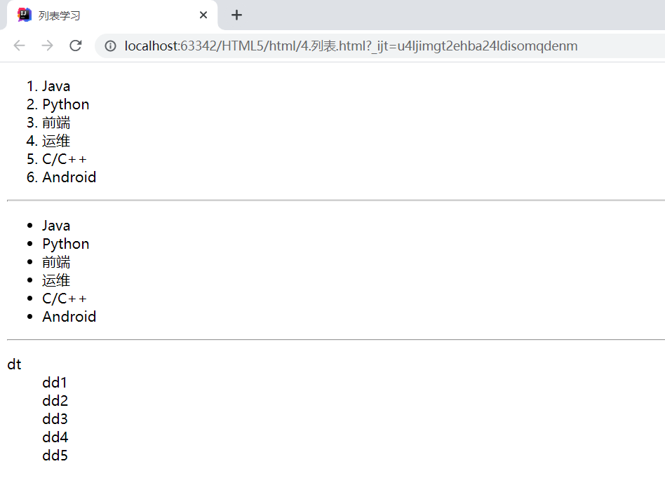

### 2.表格

> 为什么使用表格：
>
> - 简单通用
> - 结构稳定

----

> 表格的基本结构：
>
> - 单元格
> - 行
> - 列
> - 跨行
> - 跨列

```html
<!DOCTYPE html>
<html lang="en">
<head>
    <meta charset="UTF-8">
    <title>表格学习</title>
</head>
<body>
<!--
    表格table
    行:tr
    列:td
-->

<table border="1px">
    <tr><!--colspan 跨列-->
        <td colspan="5">1-1</td>
        <td>1-2</td>
        <td>1-3</td>
        <td>1-4</td>
    </tr>
    <tr><!--rowspan 跨行-->
        <td rowspan="2">2-1</td>
        <td>2-2</td>
        <td>2-3</td>
        <td>2-4</td>
    </tr>
    <tr>
        <td>3-1</td>
        <td>3-2</td>
        <td>3-3</td>
        <td>3-4</td>
    </tr>
</table>

</body>
</html>
```

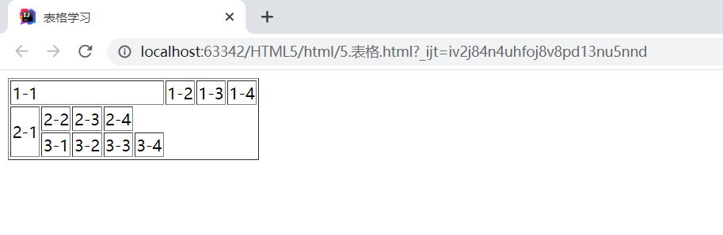

### 3.媒体元素

> 视频和音频
>
> - video
> - audio

```html
<!DOCTYPE html>
<html lang="en">
<head>
    <meta charset="UTF-8">
    <title>媒体元素的学习</title>
</head>
<body>
<!--
    视频
    src:资源路径
    controls:控制面板
    autoplay:自动播放
-->
<video src="xxx/xxx/xxx" controls autoplay></video>

<!--音频-->
<audio src="xxx/xxx/xxx" controls autoplay></audio>

</body>
</html>
```

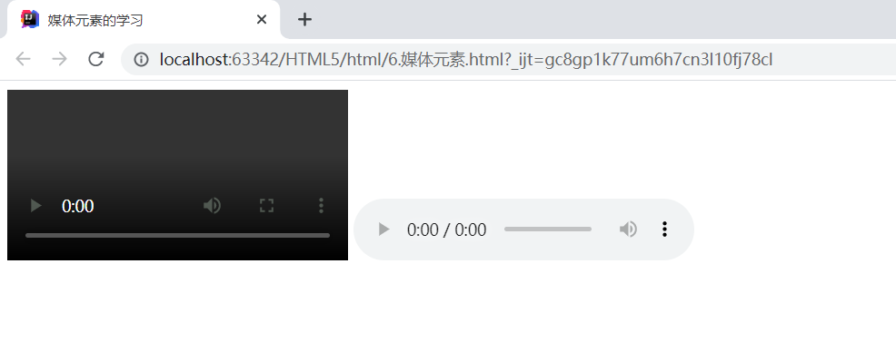

> 页面结构

| 元素名  | 描述                                               |
| :-----: | -------------------------------------------------- |
| header  | 标题头部区域的内容（用于页面或者页面中的一块区域） |
| footer  | 标记脚部区域的内容（用于整个页面或页面的一块区域） |
| section | Web页面中的一块独立区域                            |
| article | 独立的文章内容                                     |
|  aside  | 相关内容或应用                                     |
|   nav   | 导航类辅助内容                                     |

```html
<!DOCTYPE html>
<html lang="en">
<head>
    <meta charset="UTF-8">
    <title>页面结构</title>
</head>
<body>
<!--页面结构-->
<head>
    <h2>页面头部</h2>
</head>

<section>
    <h2>页面主体</h2>
</section>

<footer>
    <h2>页面脚部</h2>
</footer>
</body>
</html>
```

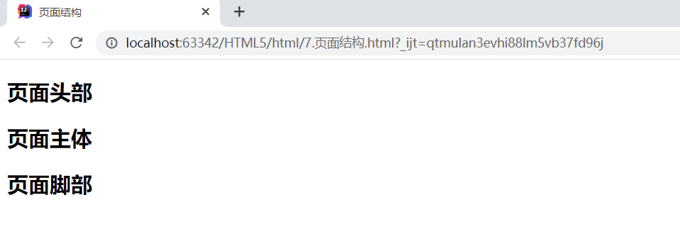

> iframe内联框架
>
> - ifram标签，必须要有src属性即引用页面的地址。
> - 给标签加上name属性后，可以做a标签的target属性，即在内联窗口中打开链接。

```html
<!DOCTYPE html>
<html lang="en">
<head>
    <meta charset="UTF-8">
    <title>iframe内联框架</title>
</head>
<body>

<iframe src="path" name="mainFrame"></iframe>

<hr/>

<iframe src="//player.bilibili.com/player.html?aid=55631961&bvid=BV1x4411V75C&cid=97257967&page=11" scrolling="no" border="0" frameborder="no" framespacing="0" allowfullscreen="true"> </iframe>

</body>
</html>
```

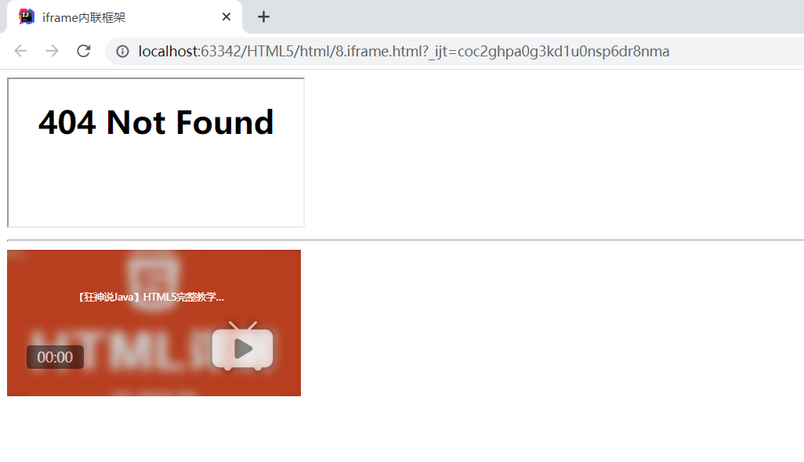

## 5.表单及表单应用

|   标签   | 说明                                                         |
| :------: | ------------------------------------------------------------ |
|  input   | 大部分表单元素对应的标签有text、password、checkbox、radio、submit、reset、file、hidden、image和button，**默认为text**，可以提交用户名、密码等等 |
|  select  | 下拉选择框                                                   |
| textarea | 文本域                                                       |

- from标签，action属性为所提交的目的地址，method选择提交方式，可以选择使用post或者get方式提交。
  - get效率高，但在url中可以看到提交的内容，不安全，不能提交大文件；
  - post比较安全且可以提交大文件。

```html
<!DOCTYPE html>
<html lang="en">
<head>
    <meta charset="UTF-8">
    <title>登陆注册</title>
</head>
<body>
<h1>注册</h1>

<!--
    form表单
    action:表单提交的动作，可以是交给一个网址，也可以是交给一个请求处理地址
    method:post / get 请求方式
        get方式提交：我们可以在ur1中看到我们提交的信息，不安全，高效
        post：比较安全，可以传输大文件
-->
<form action="DemoHtml01.html" method="get">
    <!--文本输入框:input type="text" -->
    <p>名字:<input type="text" name="username"> </p>
    <!--密码框:input type="pwd" -->
    <p>密码:<input type="password" name="password"> </p>

    <p>
        <input type="submit">   <!--提交-->
        <input type="reset">    <!--重置-->
    </p>

</form>

</body>
</html>
```

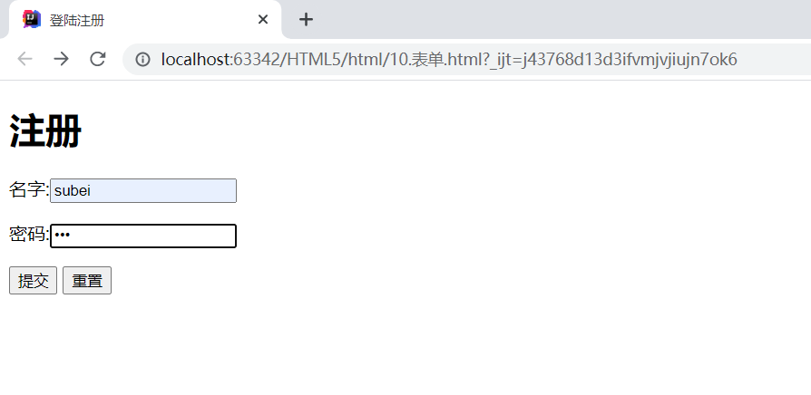

> 文本框和单选框	

|   属性    | 说明                                                         |
| :-------: | ------------------------------------------------------------ |
|   type    | 指定元素的类型。text、password、checkbox、radio、submit、reset、file、hidden、image和button，默认为text。 |
|   name    | 指定表单元素的名称（提交时所对应的key）。                    |
|   value   | 元素的初始值，radio必须提供。                                |
|   size    | 指定表单元素的初始宽度。当type为text或者password时，以字符为单位；其他type以像素为单位。 |
| maxlength | type为text或者password时，输入的最大字符数。                 |
|   check   | type为radio或者checkbox时，指定按钮是否被选中。              |

```html
<!DOCTYPE html>
<html lang="en">
<head>
    <meta charset="UTF-8">
    <title>登陆注册</title>
</head>
<body>
<h1>注册</h1>

<!--
    form表单
    action:表单提交的动作，可以是交给一个网址，也可以是交给一个请求处理地址
    method:post / get 请求方式
        get方式提交：我们可以在ur1中看到我们提交的信息，不安全，高效
        post：比较安全，可以传输大文件
-->
<form action="DemoHtml01.html" method="post">
    <!--
        文本输入框:input type="text"
        value="前端" 默认初始值
        maxlength="8" 最长能写几个字符
        size="30" 文本框的长度
    -->
    <p>名字:<input type="text" name="username"> </p>
    <!--
        密码框:input type="pwd"
    -->
    <p>密码:<input type="password" name="password"> </p>

    <!--
        单选框标签:input type="radio"
        value:单选框的值
        name:表示组
    -->
    <p>性别:
        <input type="radio" value="man" name="sex">男
        <input type="radio" value="woman" name="sex">女
    </p>

    <p>
        <input type="submit">   <!--提交-->
        <input type="reset">    <!--重置-->
    </p>

</form>


</body>
</html>
```

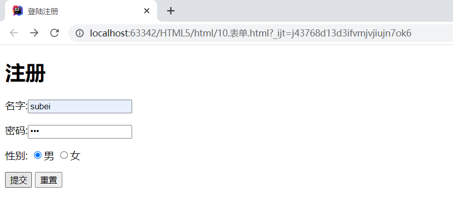

> 按钮和多选框

```html
<!DOCTYPE html>
<html lang="en">
<head>
    <meta charset="UTF-8">
    <title>登陆注册</title>
</head>
<body>
<h1>注册</h1>

<!--
    form表单
    action:表单提交的动作，可以是交给一个网址，也可以是交给一个请求处理地址
    method:post / get 请求方式
        get方式提交：我们可以在ur1中看到我们提交的信息，不安全，高效
        post：比较安全，可以传输大文件
-->
<form action="DemoHtml01.html" method="post">
    <!--
        文本输入框:input type="text"
        value="前端" 默认初始值
        maxlength="8" 最长能写几个字符
        size="30" 文本框的长度
    -->
    <p>名字:<input type="text" name="username"> </p>
    <!--
        密码框:input type="pwd"
    -->
    <p>密码:<input type="password" name="password"> </p>

    <!--
        单选框标签:input type="radio"
        value:单选框的值
        name:表示组
    -->
    <p>性别:
        <input type="radio" value="man" name="sex">男
        <input type="radio" value="woman" name="sex">女
    </p>

    <!--
        多选框:input type="checkbox"
    -->
    <p>爱好:
        <input type="checkbox" value="sleep" name="hobby">睡觉
        <input type="checkbox" value="code" name="hobby">敲代码
        <input type="checkbox" value="chat" name="hobby">聊天
        <input type="checkbox" value="game" name="hobby">游戏
    </p>

    <!--
        按钮:
        input type="button" 普通按钮
        input type="image"  图像按钮
        input type="submit" 提交按钮
        input type="reset" 重置按钮
    -->
    <p>
        <input type="button" name="btn" value="点击变长">
        <input type="image" src="../resources/image/02.jpg" width="200px" height="200px">
    </p>

    <p>
        <input type="submit">   <!--提交-->
        <input type="reset">    <!--重置-->
    </p>

</form>

</body>
</html>
```

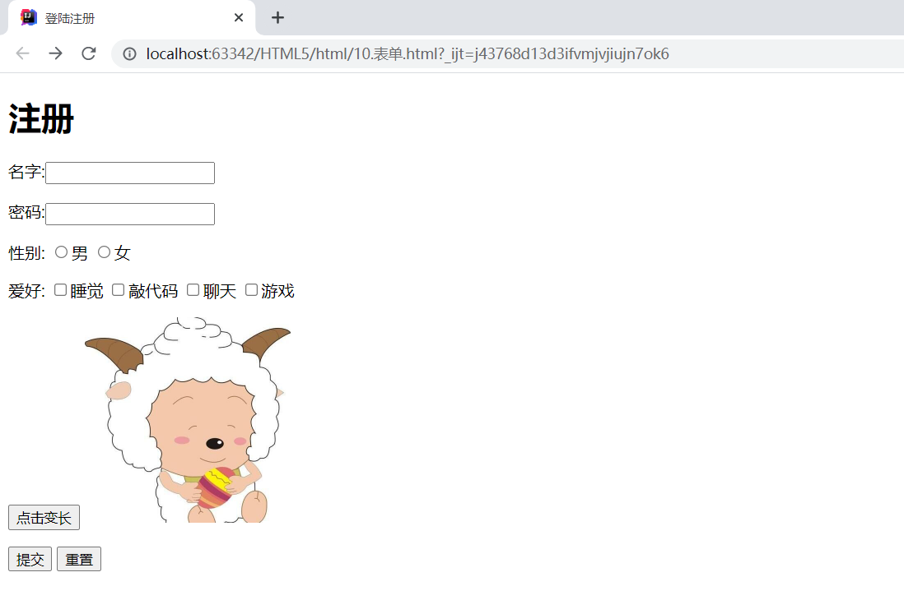

> 列表文本框和文件域

```html
<!DOCTYPE html>
<html lang="en">
<head>
    <meta charset="UTF-8">
    <title>登陆注册</title>
</head>
<body>
<h1>注册</h1>

<!--
    form表单
    action:表单提交的动作，可以是交给一个网址，也可以是交给一个请求处理地址
    method:post / get 请求方式
        get方式提交：我们可以在ur1中看到我们提交的信息，不安全，高效
        post：比较安全，可以传输大文件
-->
<form action="DemoHtml01.html" method="post">
    <!--
        文本输入框:input type="text"
        value="前端" 默认初始值
        maxlength="8" 最长能写几个字符
        size="30" 文本框的长度
    -->
    <p>名字:<input type="text" name="username"> </p>
    <!--
        密码框:input type="pwd"
    -->
    <p>密码:<input type="password" name="password"> </p>

    <!--
        单选框标签:input type="radio"
        value:单选框的值
        name:表示组
        checked:默认选中
    -->
    <p>性别:
        <input type="radio" value="man" name="sex" checked>男
        <input type="radio" value="woman" name="sex">女
    </p>

    <!--
        多选框:input type="checkbox"
    -->
    <p>爱好:
        <input type="checkbox" value="sleep" name="hobby">睡觉
        <input type="checkbox" value="code" name="hobby" checked>敲代码
        <input type="checkbox" value="chat" name="hobby">聊天
        <input type="checkbox" value="game" name="hobby">游戏
    </p>

    <!--
        按钮:
        input type="button" 普通按钮
        input type="image"  图像按钮
        input type="submit" 提交按钮
        input type="reset" 重置按钮
    -->
    <p>
        <input type="button" name="btn" value="点击变长">
        <input type="image" src="../resources/image/02.jpg" width="200px" height="200px">
    </p>

    <!--
        下拉框,列表框
    -->
    <p>国家:
        <select name="列表名称">
            <option value="China">中国</option>
            <option value="USA">美国</option>
            <option value="Russia">俄罗斯</option>
            <option value="UK">英国</option>
            <option value="France">法国</option>
        </select>
    </p>

    <!--
        文本域
        textarea name="textarea"
        cols="40" rows="10"
    -->
    <p>反馈:
        <textarea name="textarea" cols="40" rows="10">文本内容</textarea>
    </p>

    <!--
        文件域
        input type="file" name="files"
    -->
    <p>
        <input type="file" name="files">
        <input type="button" name="upload" value="上传">
    </p>

    <p>
        <input type="submit">   <!--提交-->
        <input type="reset" value="清空表单">    <!--重置-->
    </p>

</form>

</body>
</html>
```

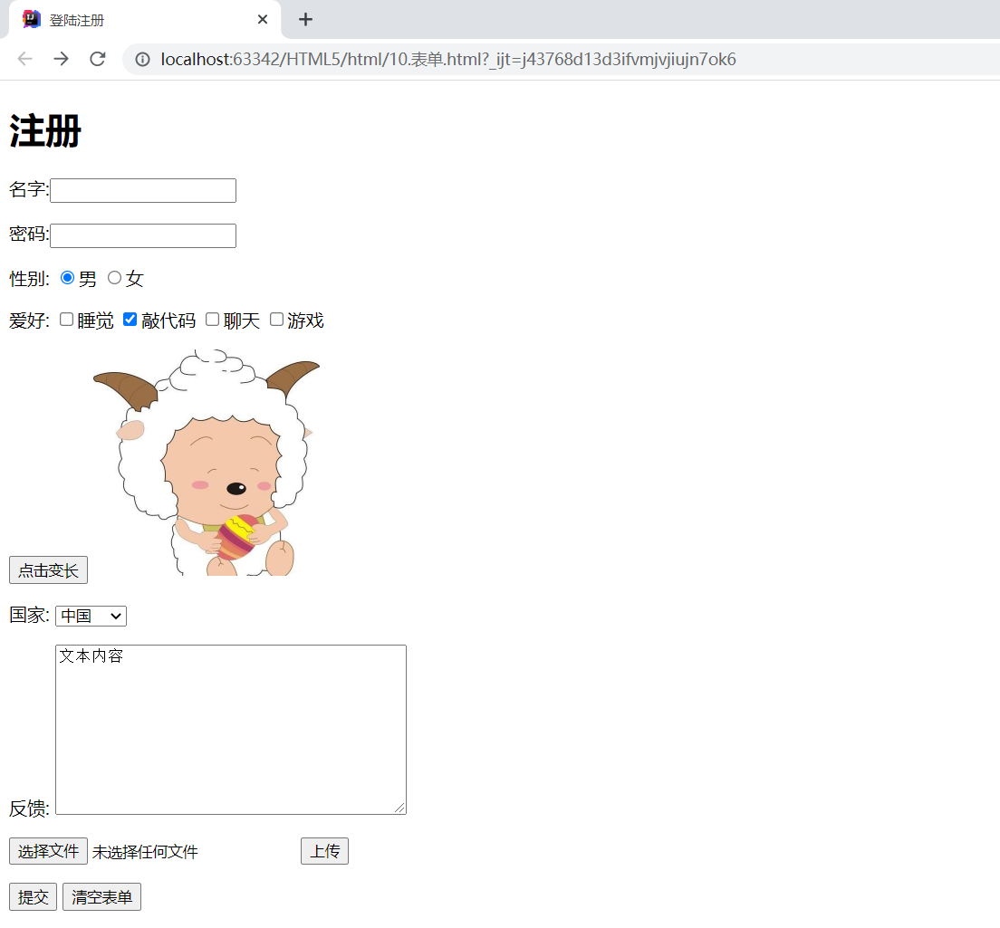

> 搜索框滑块和简单验证

```html
<!DOCTYPE html>
<html lang="en">
<head>
    <meta charset="UTF-8">
    <title>登陆注册</title>
</head>
<body>
<h1>注册</h1>

<!--
    form表单
    action:表单提交的动作，可以是交给一个网址，也可以是交给一个请求处理地址
    method:post / get 请求方式
        get方式提交：我们可以在ur1中看到我们提交的信息，不安全，高效
        post：比较安全，可以传输大文件
-->
<form action="DemoHtml01.html" method="post">
    <!--
        文本输入框:input type="text"
        value="前端" 默认初始值
        maxlength="8" 最长能写几个字符
        size="30" 文本框的长度
    -->
    <p>名字:<input type="text" name="username"> </p>
    <!--
        密码框:input type="pwd"
    -->
    <p>密码:<input type="password" name="password"> </p>

    <!--
        单选框标签:input type="radio"
        value:单选框的值
        name:表示组
        checked:默认选中
    -->
    <p>性别:
        <input type="radio" value="man" name="sex" checked>男
        <input type="radio" value="woman" name="sex">女
    </p>

    <!--
        多选框:input type="checkbox"
    -->
    <p>爱好:
        <input type="checkbox" value="sleep" name="hobby">睡觉
        <input type="checkbox" value="code" name="hobby" checked>敲代码
        <input type="checkbox" value="chat" name="hobby">聊天
        <input type="checkbox" value="game" name="hobby">游戏
    </p>

    <!--
        按钮:
        input type="button" 普通按钮
        input type="image"  图像按钮
        input type="submit" 提交按钮
        input type="reset" 重置按钮
    -->
    <p>
        <input type="button" name="btn" value="点击变长">
        <input type="image" src="../resources/image/02.jpg" width="200px" height="200px">
    </p>

    <!--
        下拉框,列表框
    -->
    <p>国家:
        <select name="列表名称">
            <option value="China">中国</option>
            <option value="USA">美国</option>
            <option value="Russia">俄罗斯</option>
            <option value="UK">英国</option>
            <option value="France">法国</option>
        </select>
    </p>

    <!--
        文本域
        textarea name="textarea"
        cols="40" rows="10"
    -->
    <p>反馈:
        <textarea name="textarea" cols="40" rows="10">文本内容</textarea>
    </p>

    <!--
        文件域
        input type="file" name="files"
    -->
    <p>
        <input type="file" name="files">
        <input type="button" name="upload" value="上传">
    </p>

    <!--
        邮件: 会简单验证是否是邮箱地址
		url: 会简单验证是否是网络地址
        number: 数字验证
    -->
    <p>
        邮箱：<input type="email" name="email">
        url：<input type="url">
    </p>

    <!--
        数字验证
        max: 最大数量
        min: 最小数量
        step: 每次点击增加或减少的数量
    -->
    <p>
        商品数量:<input type="number" name="数量" max="100" min="1" step="1">
    </p>

    <!--滑块-->
    <p>
        音量:<input type="range" min="0" max="100" name="voice" step="2">
    </p>
    
    <!--搜索框-->
    <p>
        搜索:<input type="search">
    </p>

    <p>
        <input type="submit">   <!--提交-->
        <input type="reset" value="清空表单">    <!--重置-->
    </p>

</form>

</body>
</html>
```

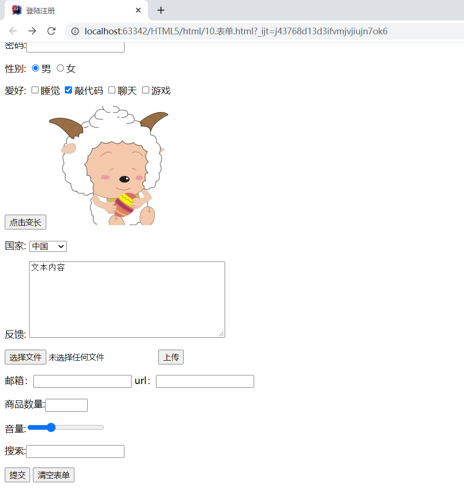

> 表单的应用

|    属性    | 说明                                           |
| :--------: | ---------------------------------------------- |
|  readonly  | 只读，不可更改                                 |
|  disable   | 禁用                                           |
|   hidden   | 隐藏，虽然不可见但是会提交                     |
|     id     | 标识符，可以配合label的for属性增加鼠标的可用性 |
| placehoder | text 文字域等输入框内的提示信息                |
|  required  | 不能为空                                       |
|   patten   | 正则表达式验证                                 |

```html
<!DOCTYPE html>
<html lang="en">
<head>
    <meta charset="UTF-8">
    <title>登陆注册</title>
</head>
<body>
<h1>注册</h1>

<!--
    form表单
    action:表单提交的动作，可以是交给一个网址，也可以是交给一个请求处理地址
    method:post / get 请求方式
        get方式提交：我们可以在ur1中看到我们提交的信息，不安全，高效
        post：比较安全，可以传输大文件
-->
<form action="DemoHtml01.html" method="post">
    <!--
        文本输入框:input type="text"
        value="前端" 默认初始值
        maxlength="8" 最长能写几个字符
        size="30" 文本框的长度
    -->
    <p>名字:<input type="text" name="username"> </p>
    <!--
        密码框:input type="pwd"
    -->
    <p>密码:<input type="password" hidden name="password"> </p>

    <!--
        单选框标签:input type="radio"
        value:单选框的值
        name:表示组
        checked:默认选中
    -->
    <p>性别:
        <input type="radio" value="man" name="sex" checked>男
        <input type="radio" value="woman" name="sex">女
    </p>

    <!--
        多选框:input type="checkbox"
    -->
    <p>爱好:
        <input type="checkbox" value="sleep" name="hobby">睡觉
        <input type="checkbox" value="code" name="hobby" checked>敲代码
        <input type="checkbox" value="chat" name="hobby">聊天
        <input type="checkbox" value="game" name="hobby">游戏
    </p>

    <!--
        按钮:
        input type="button" 普通按钮
        input type="image"  图像按钮
        input type="submit" 提交按钮
        input type="reset" 重置按钮
    -->
    <p>
        <input type="button" name="btn" value="点击变长">
        <input type="image" src="../resources/image/02.jpg" width="200px" height="200px">
    </p>

    <!--
        下拉框,列表框
    -->
    <p>国家:
        <select name="列表名称">
            <option value="China">中国</option>
            <option value="USA">美国</option>
            <option value="Russia">俄罗斯</option>
            <option value="UK">英国</option>
            <option value="France">法国</option>
        </select>
    </p>

    <!--
        文本域
        textarea name="textarea"
        cols="40" rows="10"
    -->
    <p>反馈:
        <textarea name="textarea" cols="40" rows="10">文本内容</textarea>
    </p>

    <!--
        文件域
        input type="file" name="files"
    -->
    <p>
        <input type="file" name="files">
        <input type="button" name="upload" value="上传">
    </p>

    <!--
        邮件: 会简单验证是否是邮箱地址
		url: 会简单验证是否是网络地址
        number: 数字验证
    -->
    <p>
        邮箱：<input type="email" name="email">
        url：<input type="url">
    </p>

    <!--
        数字验证
        max: 最大数量
        min: 最小数量
        step: 每次点击增加或减少的数量
    -->
    <p>
        商品数量:<input type="number" name="数量" max="100" min="1" step="1">
    </p>

    <!--滑块-->
    <p>
        音量:<input type="range" min="0" max="100" name="voice" step="2">
    </p>

    <!--搜索框-->
    <p>
        搜索:<input type="search">
    </p>

    <!--增强鼠标可用性-->
    <p>
        <label for="mark">你点我试试!</label>
        <input type="text" id="mark">
    </p>

    <p>
        <input type="submit">   <!--提交-->
        <input type="reset" value="清空表单">    <!--重置-->
    </p>

</form>

</body>
</html>
```

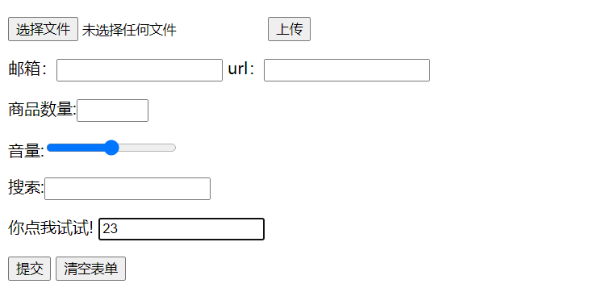


## 6.表单初级验证

- 常用方式
  - placeholder 提示信息
  - required 非空判断
  - pattern 正则表达式

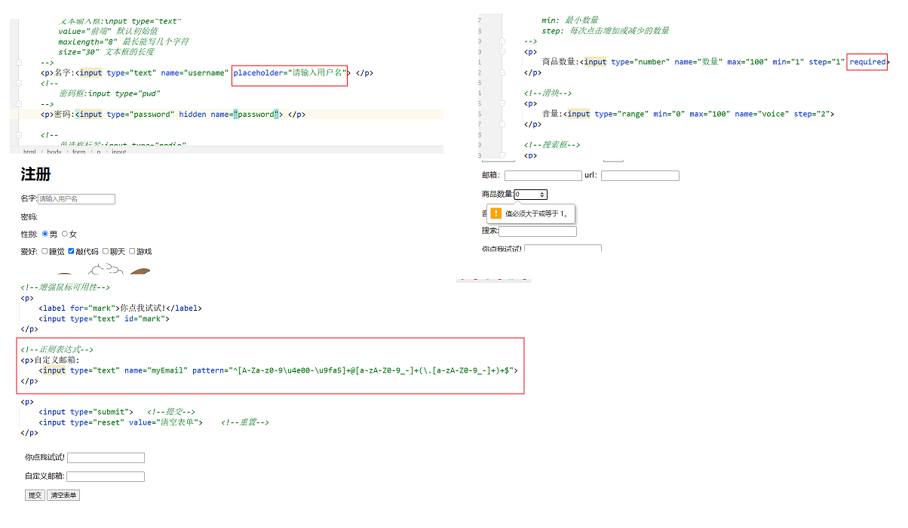

```html
    <!--正则表达式-->
    <p>自定义邮箱:
        <input type="text" name="myEmail" pattern="^[A-Za-z0-9\u4e00-\u9fa5]+@[a-zA-Z0-9_-]+(\.[a-zA-Z0-9_-]+)+$">
    </p>
```

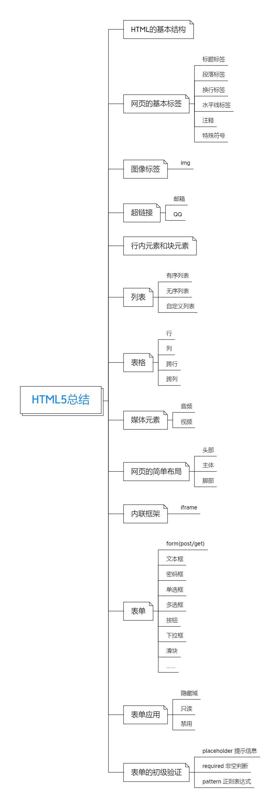

# HTML5快速入门完结🎉🎉🎉

> 深入学习，请参考：[Web前端HTML5&CSS3初学者零基础入门全套完整版](https://www.bilibili.com/video/BV1XJ411X7Ud)


