# JavaScript快速入门

## 1.前端知识体系

 &nbsp;  &nbsp; 想要成为真正的“互联网Java全栈工程师”还有很长的一段路要走，其中前端是绕不开的一门必修课。本阶段课程的主要目的就是带领Java后台程序员认识前端、了解前端、掌握前端，为实现成为“互联网Java全栈工程师”再向前迈进一步。

### 1.前端三要素

- HTML（结构）：超文本标记语言（Hyper Text Markup Language），决定网页的结构和内容。

- CSS（表现）：层叠样式表（Cascading Style Sheets），设定网页的表现样式。

- JavaScript（行为）：是一种弱类型脚本语言，其源码不需经过编译，而是由浏览器解释运行，用于控制网页的行为


### 2.结构层（HTML）
 - 略

### 3.表现层（CSS）
&emsp;&emsp;CSS层叠样式表是一门标记语言，并不是编程语言，因此不可以自定义变量，不可以引用等，换句话说就是不具备任何语法支持，它主要缺陷如下：

- 语法不够强大，比如无法嵌套书写，导致模块化开发中需要书写很多重复的选择器；
- 没有变量和合理的样式复用机制，使得逻辑上相关的属性值必须以字面量的形式重复输出，导致难以维护；

&emsp;&emsp;这就导致了我们在工作中无端增加了许多工作量。为了解决这个问题，前端开发人员会使用一种称之为【**CSS预处理器**】的工具,提供CSS缺失的样式层复用机制、减少冗余代码，提高样式代码的可维护性。大大的提高了前端在样式上的开发效率。

> 什么是CSS预处理器？
>
> - CSS预处理器定义了一种新的语言，其基本思想是，用一种专门的编程语言，为CSS增加了一些编程的特性，将CSS作为目标生成文件，然后开发者就只需要使用这种语言进行CSS的编码工作。转化成通俗易懂的话来说就是“用一种专门的编程语言，进行Web页面样式设计，再通过编译器转化为正常的CSS文件，以供项目使用”。

- 常用的CSS预处理器有哪些：
  - SASS：基于Ruby ，通过服务端处理，功能强大。解析效率高。需要学习Ruby语言，上手难度高于LESS。
  - LESS：基于NodeJS，通过客户端处理，使用简单。功能比SASS简单，解析效率也低于SASS，但在实际开发中足够了，所以如果我们后台人员如果需要的话，建议使用LESS。

### 4.行为层（JavaScript）

&emsp;&emsp;JavaScript一门弱类型脚本语言，其源代码在发往客户端运行之前不需要经过编译，而是将文本格式的字符代码发送给浏览器，由浏览器解释运行。

- **JavaScript框架**：
  - JQuery：大家熟知的JavaScript库，优点就是简化了DOM操作，缺点就是DOM操作太频繁，影响前端性能；在前端眼里使用它仅仅是为了兼容IE6，7，8；
  - Angular：Google收购的前端框架，由一群Java程序员开发，其特点是将后台的MVC模式搬到了前端并增加了模块化开发的理念，与微软合作，采用了TypeScript语法开发；对后台程序员友好，对前端程序员不太友好；最大的缺点是版本迭代不合理（如1代–>2 代，除了名字，基本就是两个东西；截止发表博客时已推出了Angular6）；
  - React：Facebook 出品，一款高性能的JS前端框架；特点是提出了新概念 【虚拟DOM】用于减少真实 DOM 操作，在内存中模拟 DOM操作，有效的提升了前端渲染效率；缺点是使用复杂，因为需要额外学习一门【JSX】语言；
  - Vue：一款渐进式 JavaScript 框架，所谓渐进式就是逐步实现新特性的意思，如实现模块化开发、路由、状态管理等新特性。其特点是综合了 Angular（模块化）和React(虚拟 DOM) 的优点；
  - Axios：前端通信框架；因为 Vue 的边界很明确，就是为了处理 DOM，所以并不具备通信能力，此时就需要额外使用一个通信框架与服务器交互；当然也可以直接选择使用jQuery 提供的AJAX 通信功能。

- **UI框架**：
  - Ant-Design：阿里巴巴出品，基于React的UI框架；
  - ElementUI、iview、ice：饿了么出品，基于Vue的UI框架；
  - BootStrap：Teitter推出的一个用于前端开发的开源工具包；
  - AmazeUI：又叫“妹子UI”，一款HTML5跨屏前端框架。
- JavaScript构建工具：
  - Babel：JS编译工具，主要用于浏览器不支持的ES新特性，比如用于编译TypeScript。
  - WebPack：模块打包器，主要作用就是打包、压缩、合并及按序加载。

### 5.三端同一

- **混合开发**（Hybrid App）
- 主要目的是实现一套代码三端统一（PC、Android：.apk、iOS：.ipa）并能够调用到设备底层硬件（如：传感器、GPS、摄像头等），打包方式主要有以下两种：
  - 云打包：HBuild -> HBuildX，DCloud 出品；API Cloud
  - 本地打包： Cordova（前身是 PhoneGap）

## 2.什么是JavaScript

### 1.概述

- javaScript是一门世界上最流行的脚本语言。
- 开发历程10天。
- ==一个合格的后端人员，必须精通JavaScript==！

### 2.历史

- [百度词条](https://baike.baidu.com/item/JavaScript/321142)
- [ECMAScript](https://baike.baidu.com/item/ECMAScript/1889420)它可以理解为JavaScript的一个标准。最新版本已经到ES6版本！但是大部分浏览器还只停留在支持ES5代码上！
- 开发环境——线上环境，版本不一致。

## 3.快速入门

### 1.引入JS

- 内部标签

```javascript
<!DOCTYPE html>
<html lang="en">
<head>
    <meta charset="UTF-8">
    <title>JS01</title>
    <!-- script标签内，写JavaScript代码 -->
    <script>
        alert('hello,world!');
    </script>
</head>
<body>


<!--这里也可以存放JS代码-->
</body>
</html>
```

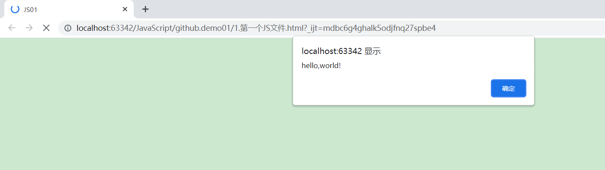

- 外部引入

```js
<script src="js/qj.js"></script>
```


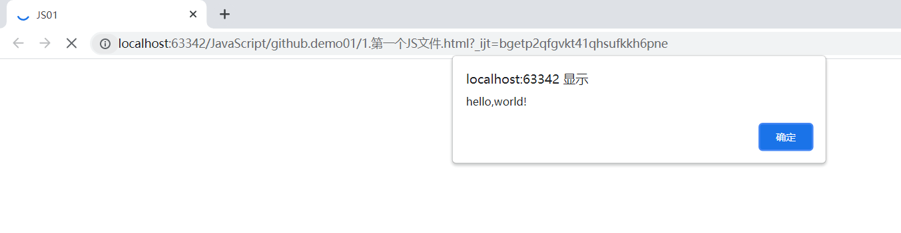

### 2.基本语法入门

```html
<!DOCTYPE html>
<html lang="en">
<head>
    <meta charset="UTF-8">
    <title>基本语法</title>
    <!-- JavaScript严格区分大小写 -->
    <script>
        // 1. 定义变量   变量类型 变量名 = 变量值
        var score = 46;

        // 2. 条件控制
        // alert(num);
        if (score > 60 && score < 70){
            alert("成绩为:60~70");
        }else if(score > 70 && score < 80){
            alert("成绩为:70~80");
        }else{
            alert("other");
        }

        console.log(score); // 在浏览器的控制台打印输出变量
    </script>
</head>
<body>

</body>
</html>
```

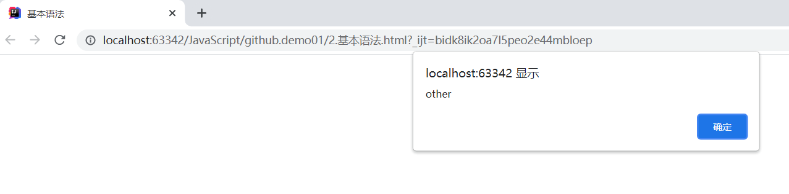

- 浏览器必备调试须知。

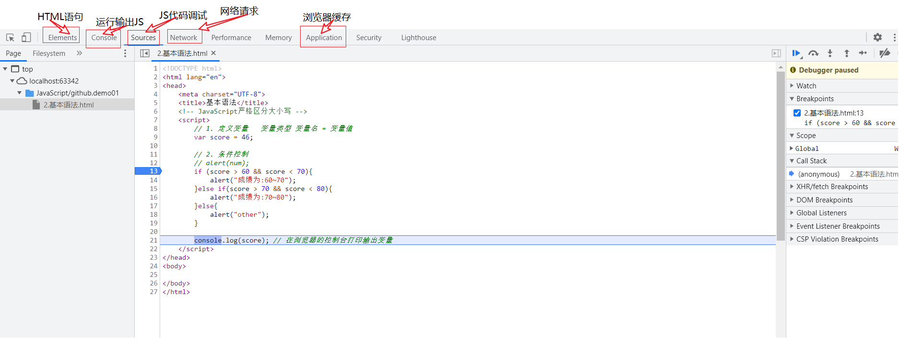

### 3.数据类型

> 数值，文本，图形，音频，视频

- 变量：var a
- JS不区分小数和整数，Number。

```js
123 // 整数123
123.1 // 浮点数123.1
1.123e3 // 科学计数法
-99 // 负数
NaN	// not a number
Infinity // 表示无限大
```

- 字符串：‘abc’ “abc”

- 布尔值：true，false

- 逻辑运算符

  - && 两个都为真，结果为真
  - || 一个为真，结果为真 
  - ! 	真即假，假即真 

- 比较运算符

  - =，如：1与"1"
  - == 等于（类型不一样，值一样，也会判断为true）
  - === 绝对等于（类型一样，值一样，结果为true）
  - 尽量不要使用 == 比较，因为：
    - NaN === NaN，这个与所有的数值都不相等，包括自己。
    - 只能通过isNaN（NaN）来判断这个数是否是NaN。

- 浮点数

  - 尽量避免使用浮点数进行运算，存在精度问题！ 

  ```js
  console.log((1/3) === (1-2/3));
  Math.abs(1/3-(1-2/3))<0.00000001;
  ```

  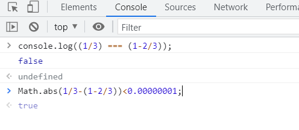

- null 和 undefined

  - null 空；
  - undefined 未定义；

- 数组
  
  - Java的数组必须是相同类型的对象，JS中不需要这样。

```js
// 保证代码的可读性，尽量使用[]
var arr = [1,2,3,4,5,'hello',null,true];
// 第二种定义方法
new Array(1,2,3,4,5,'hello');
```

- 取数字下标：如果越界了，就会报undefined。

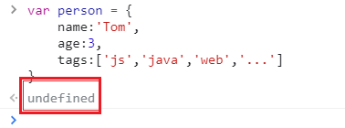

- 对象：是大括号，数组是中括号。
  - 每个属性之间使用逗号隔开，最后一个属性不需要逗号。

```js
// Person person = new Person(1,2,3,4,5);

var person = {
	name:'Tom',
	age:3,
	tags:['js','java','web','...']
}
```

- 取对象值。

```js
person.name
// "Tom"
person.age
// 3
```

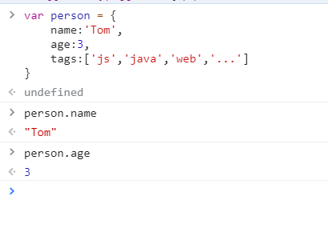

### 4.检查格式

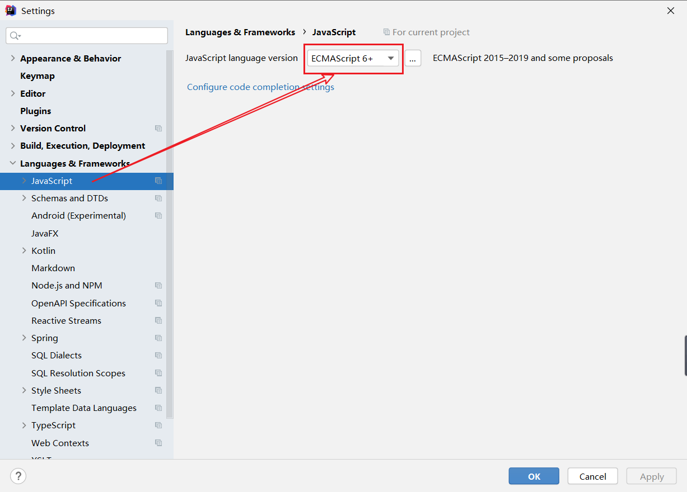

```html
<!DOCTYPE html>
<html lang="en">
<head>
    <meta charset="UTF-8">
    <title>格式</title>
    <!--
    前提:IDEA需要设置支持ES6语法，'use strict';
        严格检查模式，预防JavaScript的随意性导致产生的一些问题
        必须写在JavaScript的第一行！
        局部变量建议都使用let去定义。
    -->
    <script>
        'use strict';
        // 全局变量
        let i=1;
        // ES6 let
    </script>
</head>
<body>

</body>
</html>
```


## 4.数据类型

### 1.字符串

-  正常字符串我们使用 单引号，或者双引号包裹；
- 注意转义字符 \ 

```js
<!DOCTYPE html>
<html lang="en">
<head>
    <meta charset="UTF-8">
    <title>字符串</title>
    <script>
        console.log('Test01\'测试');
        console.log('Test02\n测试');
        console.log('Test03\t测试');
        console.log('Test04\u4e2d测试');
    </script>
</head>
<body>

</body>
</html>
```

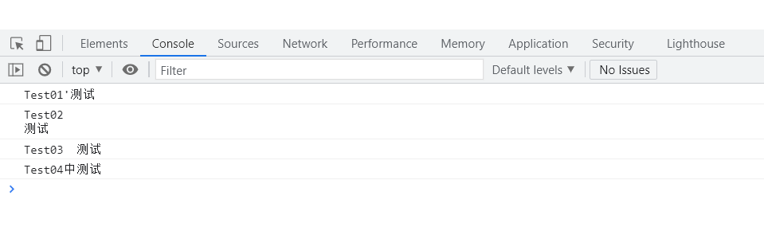

- 多行字符串编写

```js
// tab 上面 esc下面
var msg=
    `hello
            world
           你好呀
           JavaScript`;
```

- 模板字符串

```js
let name='Subei';
let age=6;
var msg=`哇哈哈，${name}`;
```

- 字符串长度

```js
str.length;
```

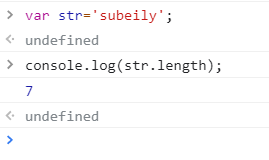

- 字符串的可变性，不可变。

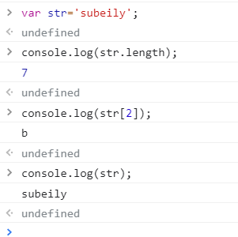

- 大小写转换。

```js
var str='subeily';
// 注意，这里是方法，不是属性了
str.toUpperCase();
str.toLowerCase();
```

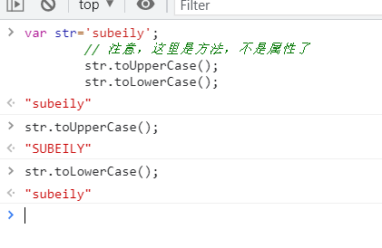

- console.log(str.indexOf('b'));
- substring，从0开始。

```js
str.substring(1); // 从第一个字符串截取到最后一个字符串
str.substring(1,3); // [1,3)
```

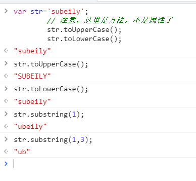

### 2.数组

- Array可以包含任意的数据类型。
  - 长度：arr.length；
    - 注意：假如给arr.lennth赋值，数组大小就会发生变化，如果赋值过小，元素就会丢失；
  - indexOf，通过元素获得下标索引；
    - 字符串的"1"和数字 1 是不同的；
  - slice（）：截取Array的一部分，返回的一个新数组，类似于String中substring；
  - **push()，pop()尾部**；
  - **unshift(),shift() 头部**；
  - 排序：sort()；
  - 元素反转：reverse()；
  - concat()；
    - 注意：concat()并没有修改数组，只是会返回一个新的数组。
  - 连接符：join()；打印拼接数组，使用特定的字符串连接。
  - 多维数组。

```js
var arr = [1,2,3,4,5,6];	// 通过下标取值和赋值
arr.length;	// 长度
arr.indexOf(2);	// 通过元素获得下标索引
arr.slice(2,5);
arr.push(42);
arr;
arr.pop();
arr;
arr.unshift(92);
arr;
arr.concat;
arr;
arr.shift();
arr;
arr.sort();
arr.reverse();
arr.concat(["a","b","c"]);
arr;
arr.join('+');
var arr2 = [[1,2],[3,6],[9,12]];
arr2[1][1];
```

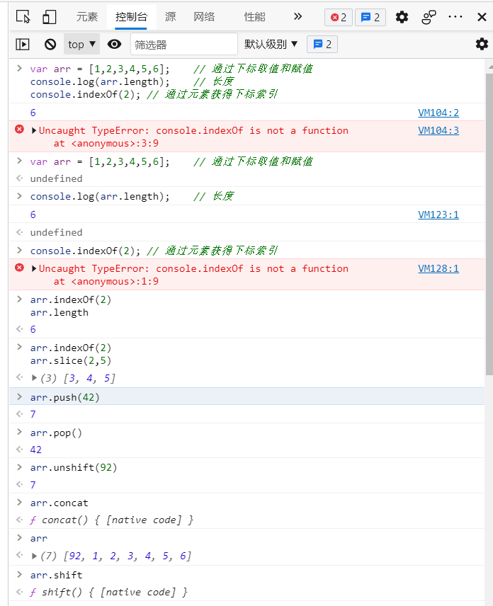

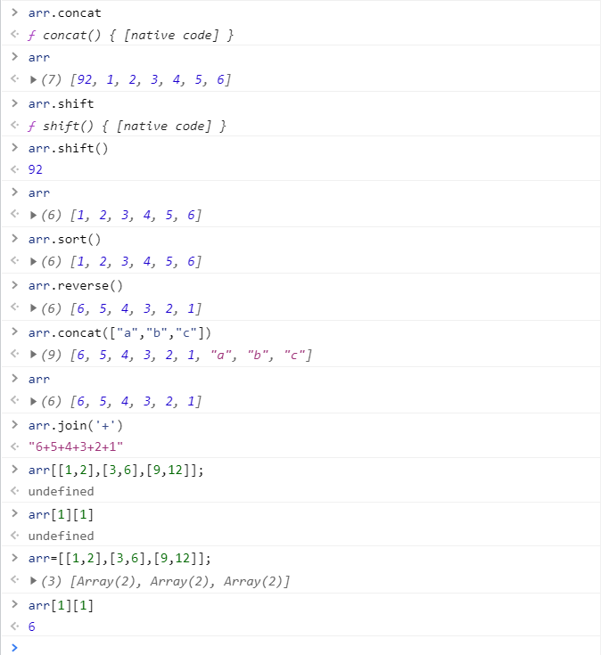

### 3.对象

```js
var 对象名 = {
	属性名：属性值，
	属性名：属性值，
	属性名：属性值
}
// 定义了一个person对象，它有四个属性
var person = {
	name:"subei",
	age:20,
	email:"294563152@QQ.com",
	score:72
};
person.name = "subeiLY";
person.name
person.str;
delete person.name;
person;
person.str = "num23";
person;
'score' in person
// 继承
'toString' in person;
person.hasOwnProperty('toString');
person.hasOwnProperty('age');
```

- JS中对象，{…}表示一个对象，建制对描述属性xxx：xxx，多个属性之间用逗号隔开，最后一个属性不加逗号！
- JavaScript中的所有的键都是字符串，值是任意对象！
- 对象赋值：

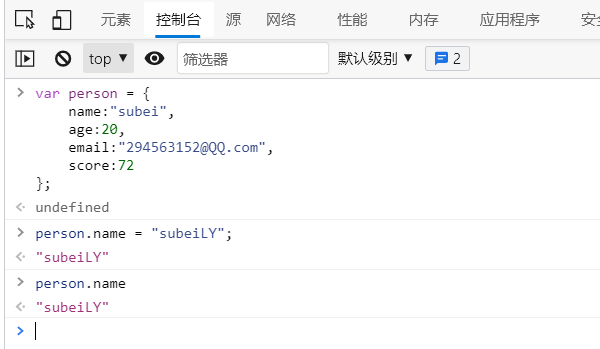

- 使用一个不存在的对象属性，不会报错！undefined。

- 动态的删减属性，通过delete删除对象的属性。

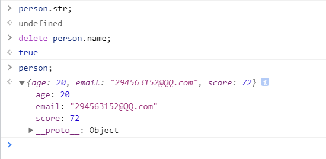

- 动态的添加，直接给新的属性添加值即可。

- 判断属性值是否在这个对象中！xxx in xxx。

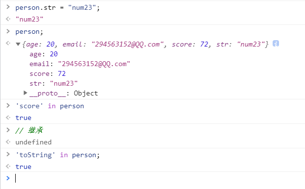

- 判断一个属性是否是这个对象自身拥有的 hasOwnProperty()。

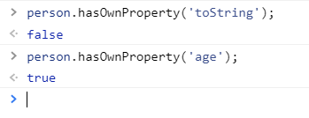

### 4.流程控制

- IF判断。

```html
<!DOCTYPE html>
<html lang="en">
<head>
    <meta charset="UTF-8">
    <title>Title01</title>
    <script>
        var age = 12;
        if(age<=12){ // 第一个判断
            alert("subei");
        }else if(age<18){   // 第二个判断
            alert("subeiLY");
        }else{  // 否则
            alert("NULL~~~");
        }
    </script>
</head>
<body>

</body>
</html>
```

- while循环判断，注意避免死循环！

```html
<!DOCTYPE html>
<html lang="en">
<head>
    <meta charset="UTF-8">
    <title>Title</title>
    <script>
        var age = 12;
        while(age<100){
            age = age + 1;
            console.log(age);
        }
        
        do{
            age = age + 1;
            console.log(age);
        }while(age<100);
    </script>
</head>
<body>

</body>
</html>
```

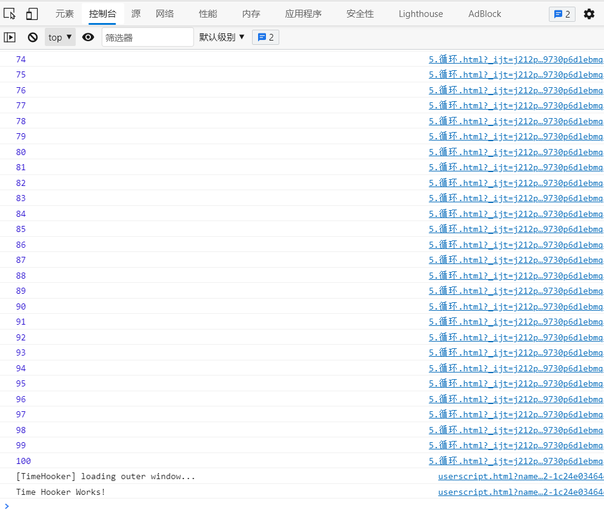

- for循环判断。

```JS
for(let i=0;i<100;i++){
    console.log(i);
}
```

- for-each循环。

  - ES5.1特征：

  ```js
  var age = [12,99,56,34,75,128,69];
  // 函数
  age.forEach(function (value){
  	console.log(value);
  })
  ```

  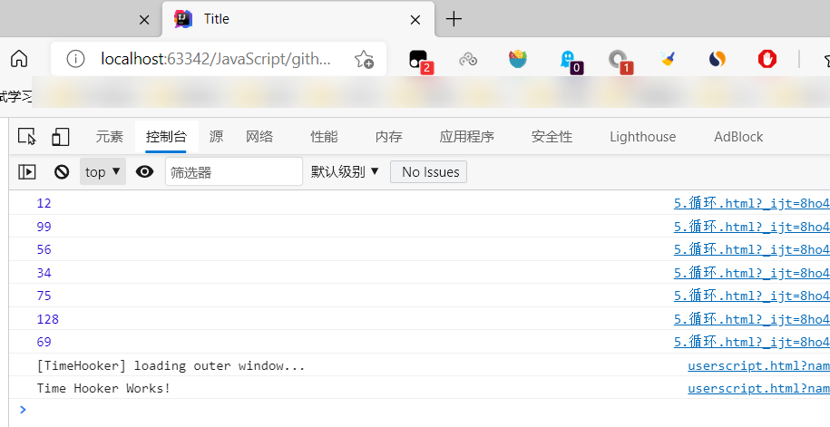

  - for……in——下标：

  ```html
  <!DOCTYPE html>
  <html lang="en">
  <head>
      <meta charset="UTF-8">
      <title>Title</title>
      <script>
          var age = [12,99,56,34,75,128,69];
  
          for(var num in age){
              if(age.hasOwnProperty(num)){
                  console.log("存在！");
                  console.log(age[num]);
              }
          }
      </script>
  </head>
  <body>
  
  </body>
  </html>
  ```

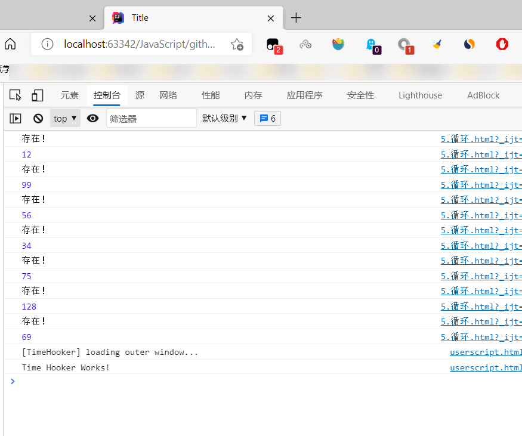

### 5.Map和Set

- Map

```html
<!DOCTYPE html>
<html lang="en">
<head>
    <meta charset="UTF-8">
    <title>Title</title>
    <script>
        // ES6 Map
        // 学生成绩，学生姓名
        // var names = ["Tone","jay","sony"];
        // var scores = [92,84,96];
        
        var map = new Map([['Tone',92],['jay',84],['sony',96]]);
        var name = map.get('Tone'); // 通过key获得value
        map.set('admin',123456);    // 新增
        map.delete('Tone'); //删除  
        
    </script>
</head>
<body>

</body>
</html>
```

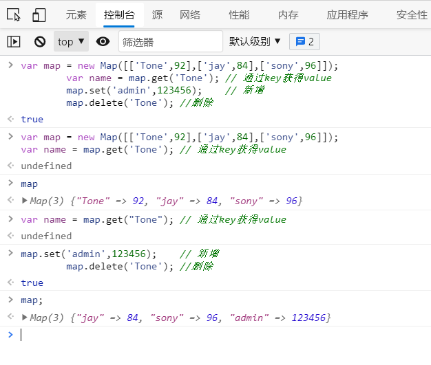

- Set：无序不重复的集合。

```js
var set = new Set([1,2,3,4,5,6,7,8]);
set.add(2); // 添加
set.delete(1);   // 删除
console.log(set.has(3));    // 是否包含某个元素
```

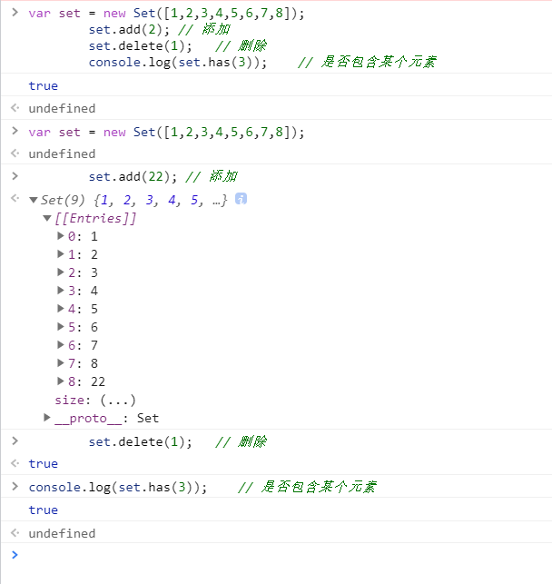

### 6.iterator

- 使用iterator来遍历迭代我们Map，Set！
- 遍历数组

```js
var arr = [3,4,5,6,7,8,12];
for(var x of arr){
	console.log(x);
}
```

- 遍历Map

```js
var map = new Map([['Tone',92],['jay',84],['sony',96]]);
for (let x of map){
	console.log(x);
}
```

- 遍历Set

```js
var set = new Set([15,66,45,16,72]);
for(let x of set){
	console.log(x);
}
```

## 5.函数

### 1.定义函数

> 方式一

- 绝对值函数

```html
<!DOCTYPE html>
<html lang="en">
<head>
    <meta charset="UTF-8">
    <title>函数</title>
    <script>
        function abs(x) {
            if(x>=0){
                return x;
            }else{
                return -x;
            }
        }
    </script>
</head>
<body>

</body>
</html>
```

- 一旦执行到return代表函数结束，返回结果！如果没有执行return，函数执行完也会返回结果，结果就是undefined。

> 方式二

```js
var abs = function (x){
	if(x>=0){
    	return x;
    }else{
        return -x;
    }
}
```

- function(x){…}这是一个匿名函数。但是可以吧结果赋值给abs，通过abs就可以调用函数！
- 方式一和方式二等价！

>调用函数

```js
abs(12);	// 12
abs(-36);	// 36
```


- 参数问题：javaScript可以传任意个参数，也可以不传递参数。
- 参数进来是否存在问题？假设不存在参数，如何规避？

```js
var abs = function(x){
	// 手动抛出异常来判断
    if(typeof x!== 'number'){
    	throw 'Not a Number';
    }
    if(x>=0){
       return x;
    }else{
    	return -x;
    }
}
```

> arguments

- `arguments`是一个JS免费赠送的关键字；
- 代表：传递进来的所有参数，是一个数组！

```js
var abs = function(x){
    console.log("x=>"+x);
    for (var i = 0; i < arguments.length; i++) {
        console.log(arguments[i]);
    }
    if(x>=0){
        return x;
    }else{
        return -x;
    }
}
```

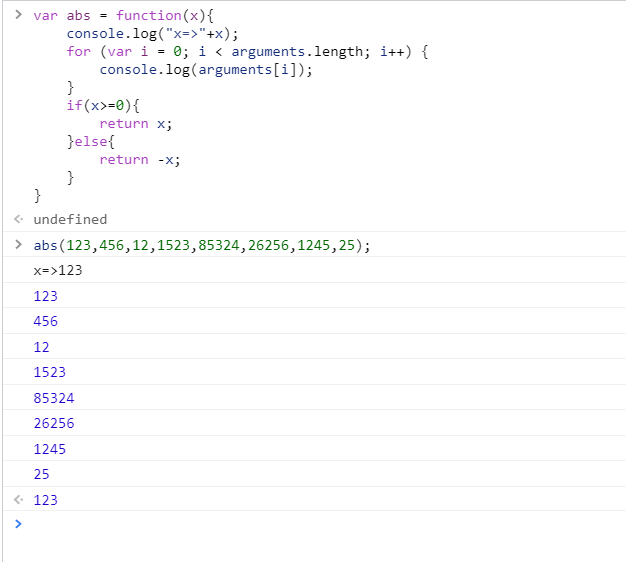

- 问题：arguments包含所有的参数，我们有时候想使用多余的参数来进行附加操作。需要排除已有参数。

> rest

```js
// 以前
if(arguments.length>2){
    for (var i = 2; i<arguments.length;i++){
        // ....
    }
}

// ES6引入的新特性，获取除了已经定义的参数之外的所有参数
function aaa(a,b,...rest){
    console.log("a=>" + a);
    console.log("b=>" + b);
    console.log(rest);
}

aaa();
```

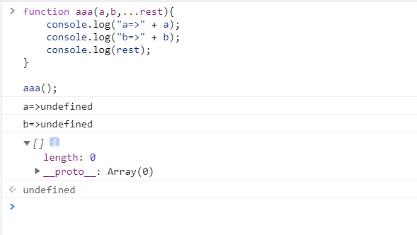

- rest参数只能写在最后面，必须用…标识。

### 2.变量的作用域

- 在javascript中，var定义变量实际是有作用于的。假设在函数体重声明，则在函数体外不可以使用。

```js
function str(){
	var x = 1;
    x = x + 1;
}
x = x + 2; // Uncaught ReferenceError: x is not defined
```

- 如果两个函数使用了相同的变量名，只要在函数内部就不冲突。

```js
function str(){
	var x = 1;
    x = x + 1;
}
function str2(){
	var x = 'A';
    x = x + 1;
}
```

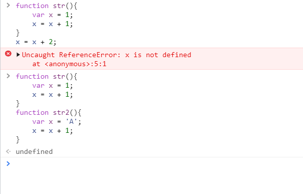

- 内部函数可以访问外部函数的成员，反之则不行。

```js
function num() {
    var x = 1;

    // 内部函数可以访问外部函数的成员，反之则不行
    function num2(){
        var y = x + 1;  // 2
    }

    var z = y + 1;  // Uncaught ReferenceError: y is not defined
}
console.log(z);
```

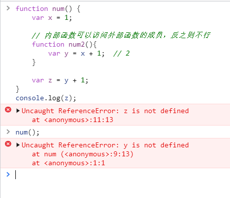

- 假设，内部函数变量和外部函数变量，重名！

```js
function num(){
    var x=1;
    function num2(){
        var x = 'A';
        console.log('inner' + x);
    }
    console.log('outer' + x);
    num2();
}

num();
```

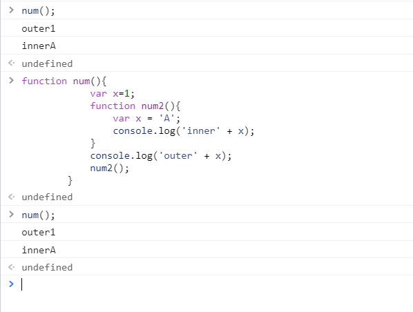

- 假设在JavaScript中，函数查找变量从自身函数开始~， 由“内”向“外”查找，假设外部存在这个同名的函数变量，则内部函数会屏蔽外部函数的变量。

> 提升变量的作用域

```js
function f2() {
    var y;
    var x = "x"+y;
    console.log(x);
    y = 'y';
}

f2();
// 输出:xundefined
```

- 说明：js执行引擎，自动提升了y的声明，但是不会提升变量y的赋值；

```js
function ft2() {
    var y;
    var x = "x" + y;
    console.log(x);
    y = 'y';
}
```

- 这个是在javascript建立之初就存在的特性。 养成规范：所有 的变量定义都放在函数的头部，不要乱放，便于代码维护；

```js
function de() {
    var x = 1,
    y=x+1,
        z,i,a;
}
```

> 全局变量

```js
// 全局变量
x = 1;
function f() {
    console.log(x);
}
f();
console.log(x);
```

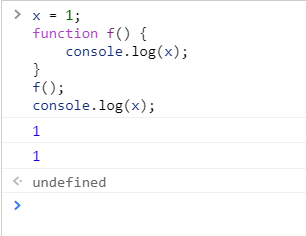

- 全局对象Windows

```js
var x = 'xxx';
alert(x);
alert(window.x);
```

- alert() 这个函数本身也是一个window的变量；

```js
var x = 'xxx';
window.alert(x);
var old_alter = window.alert;
window.alert = function () {
    
};
// alter()失效了
window.alert(123);

// 恢复
window.alert = old_alter;
window.alert(453);
```

- javascript实际上只有一个全局作用域，任何变量（函数也可以视为变量），假设没有在函数作用范围内找到，就会向外查找，如果在全局作用域都没有找到，就会报错 Refrence。

> 规范

- 由于我们的所有变量都会绑定到window上。如果不同的JS文件，使用了相同的全局变量，就会产生冲突—>如何减少这样的冲突？

```js
// 唯一全局变量
var subei = {};

// 定义全局变量
subei.name = 'subeiLY';
subei.add = function (a,b){
    return a+b;
}
```

- 自己的代码全部放入自己定义的唯一空间名字中，降低全局命名冲突问题~
  jQuery中就是使用的该方法：jQuery.name，简便写法：**$()**

> 局部作用域

```js
function bbb() {
    for (var i = 0; i < 100; i++) {
        console.log(i);
    }
    console.log(i+1);
}
bbb();
```

- ES6的let关键字，解决了局部作用域冲突的问题！

```js
function bbb() {
    for (let i = 0; i < 100; i++) {
        console.log(i);
    }
    console.log(i+1);	// Uncaught ReferenceError: i is not defined
}

bbb();
```

- 建议大家都用let去定义局部作用域的变量；

> 常量

- 在ES6之前，怎么定义常量：只有用全部大写字母命名的变量就是常量；建议不要修改这样的值。

```js
var PI='3.14';
console.log(PI);
PI='213';
console.log(PI);
```

- 在ES6引入了常量关键字 `const`。

```js
const PI = '3.14';
console.log(PI);
PI = '123';	// Uncaught SyntaxError: Identifier 'PI' has already been declared
console.log(PI);
```

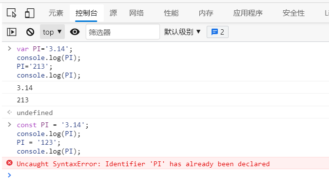

### 3.方法

> 定义方法
>
> - 方法就是把函数放在对象的里面，对象只有两个东西：属性和方法。

```js
var subeily = {
    name:'哇哈哈',
    birth:2000,
    // 方法
    age:function () {
        // 今年-出生年
        var now = new Date().getFullYear();
        return now-this.birth;
    }
}
// 属性
subeily.name;
// 方法，注意带()
subeily.age();
```

- this.代表什么？拆开上main的代码看看。

```js
function getAge() {
    // 今年-出生年
    var now = new Date().getFullYear();
    return now -this.birth;
}
var subei = {
    name:'可乐',
    birth: 2002,
    age:getAge
}

subei.age();
getAge();
```

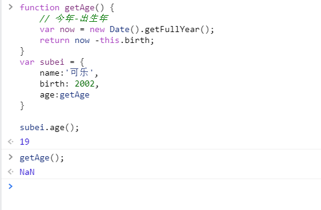

- this是无法指向的，是默认指向调用它的那个对象的；

> apply

- 在JS中可以控制this指向

```js
function getAge() {
    // 今年-出生年
    var now = new Date().getFullYear();
    return now -this.birth;
}
var subei = {
    name:'可乐',
    birth: 2002,
    age:getAge
}

// subei.age();

var xiaosan = {
    name:'xiaosan',
    birth:2001,
    age:getAge
}

getAge.apply(xiaosan,[]);

```

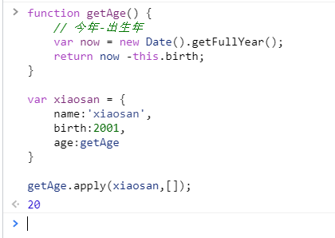

## 6.内部对象

> 标准对象

```js
typeof 123
typeof '123'
typeof true
typeof NaN
typeof []
typeof {}
typeof Math.abs
typeof undefined
```


### 1.Date

```js
var now = new Date();
now.getFullYear();  // 年
now.getMonth(); // 月
now.getData();  // 日
now.getDay();   // 星期
now.getHours(); // 时
now.getMinutes();   // 分
now.getSeconds();   // 秒

now.getTime();  // 时间戳
console.log(new Date());    // 时间戳转时间
```

- 转换

```js
now = new Date(1625895623770);
now.toLocaleString;    // 注意：调用是一个方式是，不是一个属性。
now.toLocaleString();
now.toGMTString();
```

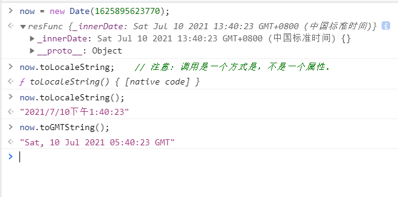

### 2.JSON

> [JSON](https://baike.baidu.com/item/JSON)是什么？
>
> - 早期，所有数据传输习惯使用XML文件！
> - [JSON](https://baike.baidu.com/item/JSON)**(**[JavaScript](https://baike.baidu.com/item/JavaScript) **Object Notation, JS 对象简谱) 是一种轻量级的数据交换格式。**。
> - 简洁和清晰的层次结构使得JSON成为理想的数据交换语言。
> - 易于人阅读和编写，同时也易于机器解析和生成，并有效地提升网络传输效率。

- 在javascript中，一切皆为对象，任何js支持的类型都可以用JSON表示。
- 格式：
  - 对象都用{}
  - 数组都用[]
  - 所有的键值对，都是用key:value
- JSON字符串和js对象转化

```js
var admin = {
    name:"admin",
    age:31,
    sex:'M'
}

// 对象转化为JSON字符
var jsonAdmin = JSON.stringify(admin);

// JSON字符转化为对象，参数为 JSON字符
var obj = JSON.parse('{"name":"subei","age":"22","sex":"W"}');

```

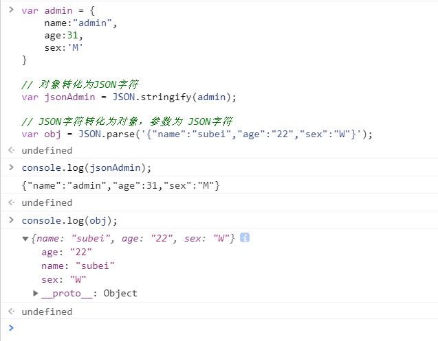

- JSON和JS对象的区别：

```js
var obj = {a:'hello',b:'javaScript'};

var json = '{"a":"hello","b":"javaScript"}';
```

### 3.AJAX

- 原生的JS写法，xhr异步请求；
- jQuery封装好的方法$(#name).ajax("")；
- axios请求；

## 7.面向对象编程

### 1.什么是面向对象

> javaScript、java、c#------面向对象；但是javaScript有些区别！

- 类：模板
- 对象：具体实例

- 原型：

```js
var Student = {
    name:"subeiLY",
    age:20,
    run:function () {
        console.log(this.name + " run....");
    }
};
var xiaoming = {
    name:"xiaoming",
};

var bird = {
    fly:function (){
        console.log(this.name + " fly....")
    }
}

// 原型对象
// xiaoming.__proto__ = Student;
xiaoming.__proto__ = bird;
```

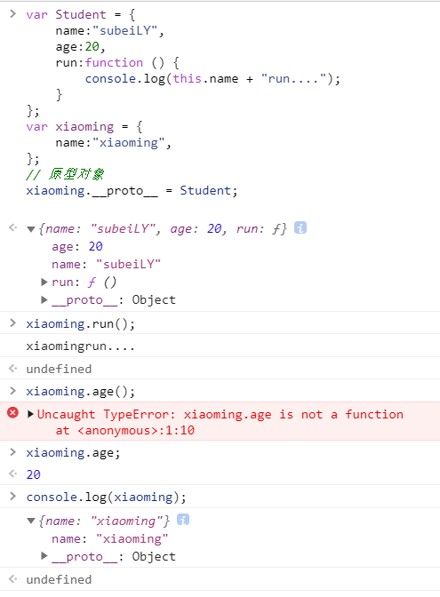

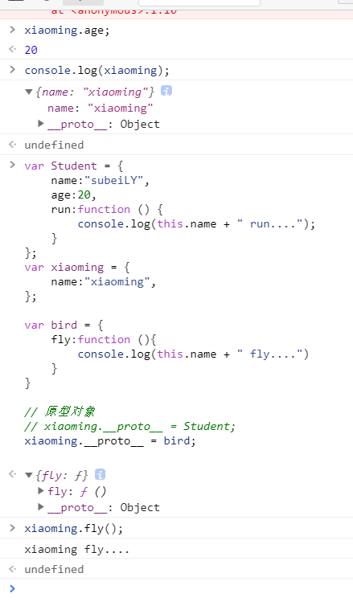

```js
// ES6之前========================
function Student(name){
    this.name = name;
}
// 给Student新增一个方法
Student.prototype.hello = function () {
    alert('Hello');
}
```

> Typora快速调整代码块格式快捷键：
>
> - 使用 **‘Shift + Tab’** 快速**格式化**代码。

> class集继承

- class关键字，是在ES6引入的
  1. 定义一个类、属性、方法。

```js
<script>
    // ES6之后========================
    // 定义一个学生的类
    class Student{
        constructor(name){
            this.name = name;
        }
        hello(){
            alert('hello');
        }
    }

    var xiaoming = new Student("xiaoming");
    var xiaohong = new Student("xiaohong");
</script>
```

 	2. 继承
 	 - 本质：查看对象原型。

```js
<script>
    // ES6之后========================
    // 定义一个学生的类
    class Student{
        constructor(name){
            this.name = name;
        }
        hello(){
            alert('hello');
        }
    }

    class XStudent extends Student{
        constructor(name,grade) {
            super(name);
            this.grade = grade;
        }
        myGrade(){
            alert('2021级小学生入学');
        }
    }

    var xiaoming = new Student("xiaoming");
    var xiaohong = new XStudent("xiaohong",2);
</script>
```

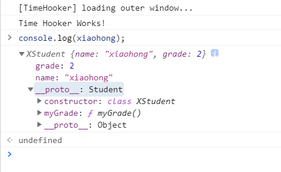

> 原型链：

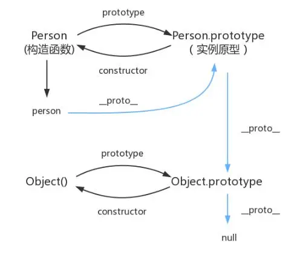

## 8.操作BOM对象

> 浏览器介绍

javaScript和浏览器关系？

- JavaScript的诞生就是为了能在浏览器中运行！！！

BOM：浏览器对象模型

- IE6~**Edge**
- Chrome
- Vivaldi
- FireFox
- Opera

第三方浏览器

- QQ浏览器
- 360浏览器

> window

```js
// window代表浏览器窗口
window.alert(1);
undefined
window.innerHeight;
699
window.innerWidth
158
window.outerHeight
818
window.outerWidth
1065
```

> Navigator（不建议使用）

```js
// Navigator封装了浏览器的信息
navigator.appName

navigator.appVersion

navigator.userAgent

navigator.platform
```

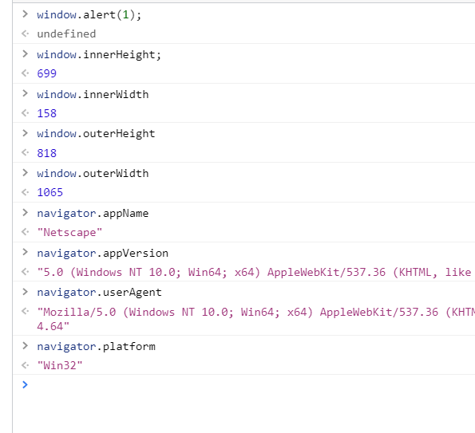

- 大多数时候，不会使用`navigator`对象，因为会被认为修改!
- 不建议使用这些属性来判断和编写代码。

> screen：代表屏幕尺寸。

```js
screen.width

screen.height
```

> location(重要)：代表当前页面的URL  信息。

```js
location;
// 设置新的地址
location.assign('https://blog.csdn.net/m0_46153949');
```

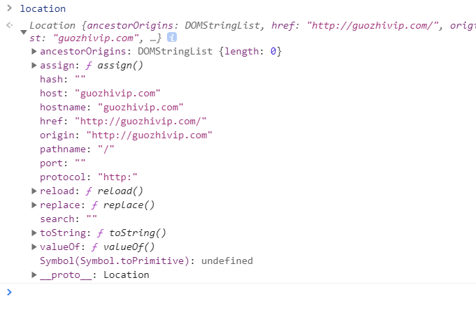

>document（内容DOM）：document代表当前的页面，HTML DOM文档树。

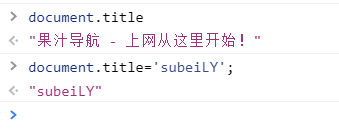

- 获取具体的文档树节点。

```js
<!DOCTYPE html>
<html lang="en">
<head>
    <meta charset="UTF-8">
    <title>DOM</title>
    <script>
        var dl = document.getElementById('app');
    </script>
</head>
<body>

<dl id="app">
    <dt>java</dt>
    <dd>javaSE</dd>
    <dd>javaWeb</dd>
    <dd>javaEE</dd>
</dl>

</body>
</html>
```

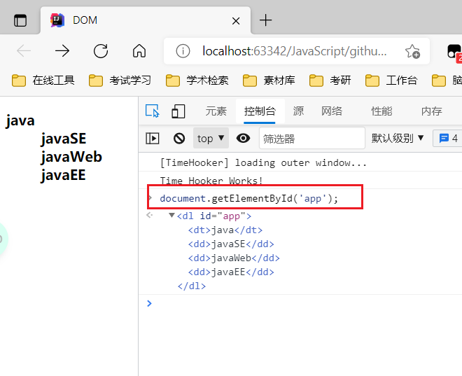

- 获取cookie

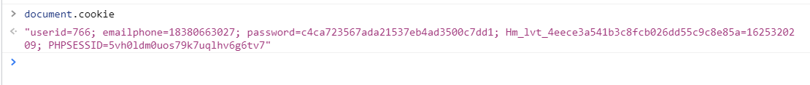

- 劫持cookie原理：

```js
<script src="str.js"></script>
<!--恶意人员获取本机cookie上传至其私人服务器 -->
```

- 服务器端可以设置cookie为httpOnly。

> history（不建议使用 ）：代表浏览器的历史记录。

```js
history.back();	// 后退
history.forward();	// 前进
```

## 9.DOM对象

> 核心

浏览器网页就是一个Dom树形结构！

- 更新：更新Dom节点
- 遍历Dom节点：得到Dom节点
- 删除：删除一个Dom节点
- 添加：添加一个新的节点

==要操作一个Dom节点，就必须要先获得这个Dom节点==。

> 获得Dom节点

```js
<!DOCTYPE html>
<html lang="en">
<head>
    <meta charset="UTF-8">
    <title>Title</title>
</head>
<body>


<div id="father">
    <h1>标题一</h1>
    <p id="p1">p1</p>
    <p class="p2">p2</p>
</div>


<script>
    // 对应CSS选择器
    var h1 = document.getElementsByTagName('h1');
    var p1 = document.getElementById('p1');
    var p2 = document.getElementsByClassName('p2');
    var father = document.getElementById('father');

    var childerns = father.children;    // 获取父节点下所有的子节点
    father.firstChild;
    father.lastChild;
</script>

</body>
</html>
```

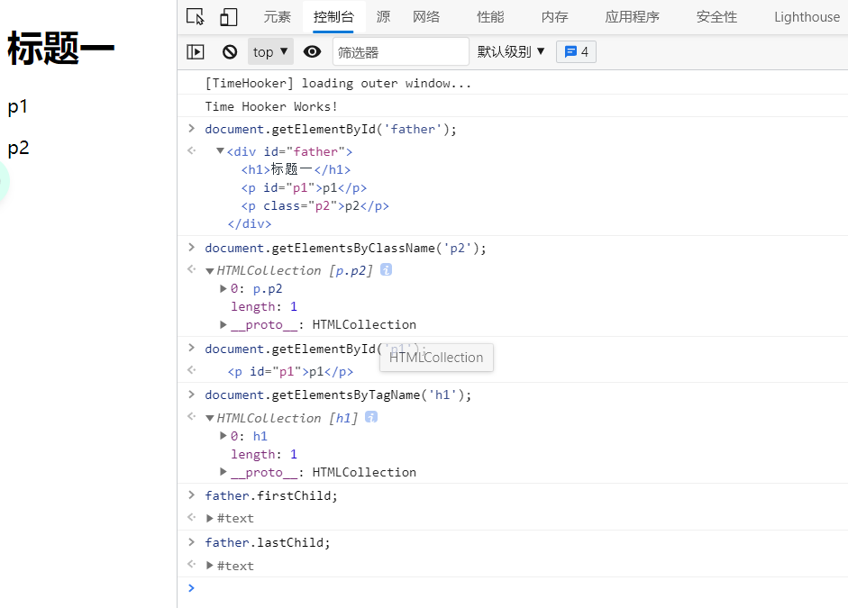

- 之后尽量都使用jQuery();

> 更新节点

```html
<!DOCTYPE html>
<html lang="en">
<head>
    <meta charset="UTF-8">
    <title>Title</title>
</head>
<body>

<div id="id1">
    123
</div>

<script>
    var id1 = document.getElementById('id1');
</script>

</body>
</html>
```

- 操作
  - `id1.innerText='456';` 修改文本的值。
  - `id1.innerHTML='<strong>123</strong>';` 可以解析HTML文本的标签。
- 操作CSS
  - `id1.style.color = 'blue';` 修改文本颜色；
  - `id1.style.fontSize='22px';` 修改文字大小；
  - `id1.style.padding='2em';` 修改文本位置；

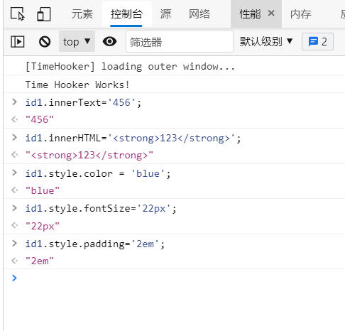

> 删除节点
>
> - 删除节点的步骤：先获取父节点，再通过父节点删除自己。

```html
<!DOCTYPE html>
<html lang="en">
<head>
    <meta charset="UTF-8">
    <title>Title</title>
</head>
<body>

<div id="father">
    <h1>标题一</h1>
    <p id="p1">p1</p>
    <p class="p2">p2</p>
</div>

<script>
    var self = document.getElementById('p1');
    var father = p1.parentElement;
    father.removeChild(self);

    // 删除是一个动态过程
    father.removeChild(father.children[0]);
    // father.removeChild(father.children[1]);
    // father.removeChild(father.children[2]);
</script>

</body>
</html>
```

- 注意：当==删除多个节点==时，children是在时刻变化的，删除节点的时候一定要注意。

> 插入节点

- 当获得了某个Dom节点，假设这个dom节点是空的，通过innerHTML就可以增加一个元素了，但是这个Dom节点已经存在元素了，就不能这么干了！会产生覆盖。

```html
<!DOCTYPE html>
<html lang="en">
<head>
    <meta charset="UTF-8">
    <title>Title</title>
</head>
<body>

<p id="js">JavaScript</p>
<div id="list">
    <p id="se">javaSE</p>
    <p id="me">javaME</p>
    <p id="ee">javaEE</p>
</div>

<script>
    var js = document.getElementById('js');
    var list = document.getElementById('list');
    list.appendChild(js);   // 追加到最后
</script>

</body>
</html>
```

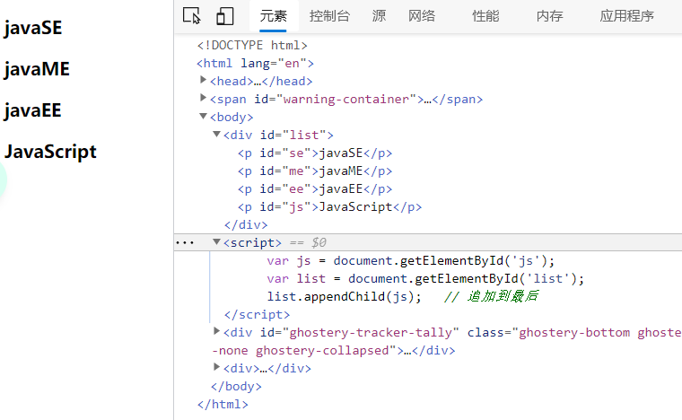

> 创建一个新的标签

```html
<!DOCTYPE html>
<html lang="en">
<head>
    <meta charset="UTF-8">
    <title>Title</title>
</head>
<body>

<p id="js">JavaScript</p>
<div id="list">
    <p id="se">javaSE</p>
    <p id="me">javaME</p>
    <p id="ee">javaEE</p>
</div>

<script>
    var js = document.getElementById('js'); // 已经存在的节点
    var list = document.getElementById('list');
    // 通过JS创建一个新的节点
    var newP = document.creatElement('p');  // 创建一个p标签
    newP.id = 'newP';
    newP.innerText = 'Hello,subeiLY';
    // 创建一个标签节点
    var myScript = document.creatElement('script');
    myScript.setAttribute('type','text/javascript');

    // 可以创建一个style标签
    var myStyle = document.creatElement('style');   // 创建了一个空style标签
    myStyle.setAttribute('type','text/css');
    myStyle.innerHTML = 'body{background-color:chartreuse;}';   // 设置标签内容

    document.getElementByTagName('head')[0].appendChild(myStyle);
</script>

</body>
</html>
```

> insertBefore

```js
var ee = document.getElementById('ee');
var js = document.getElementById('js');
var list = document.getElementById('list');
// 要包含的节点.insertBefore(newNode,targetNode)
list.insertBefore(js,ee);
```

## 10.操作表单

> 表单是什么？
>
> - form-----DOM树

- 文本框----text
- 下拉框----select
- 单选框----radio
- 多选框----checkbox
- 隐藏域----hidden
- 密码框----password
- …

- 表单的目的提交信息

> 获得要提交的信息

```html
<!DOCTYPE html>
<html lang="en">
<head>
    <meta charset="UTF-8">
    <title>Title</title>
</head>
<body>

<form action = "post">
    <p>
        <span>用户名：</span>
        <input type="text" id = "username" />
    </p>
    <!-- 多选框的值就是定义好的value -->
    <p>
        <span>性别：</span>
        <input type = "radio" name = "sex" value = "man" id = "boy"/>男
        <input type = "radio" name = "sex" value = "woman" id = "girl"/>女
    </p>
</form>

<script>
    var input_text = document.getElementById("username");
    var boy_radio = document.getElementById("boy");
    var girl_radio = document.getElementById("girl");
    // 得到输入框的值
    // input_text.value;
    // 修改输入框的值
    input_text.value="admin";

    // 对于单选框，多选框等等固定的值，boy_radio.value只能取到当前的值
    boy_radio.checked = true;  // 赋值
    // girl_radio.checked;  // 查看返回的结果，是否为true，如果为true，则被选中。
</script>

</body>
</html>
```

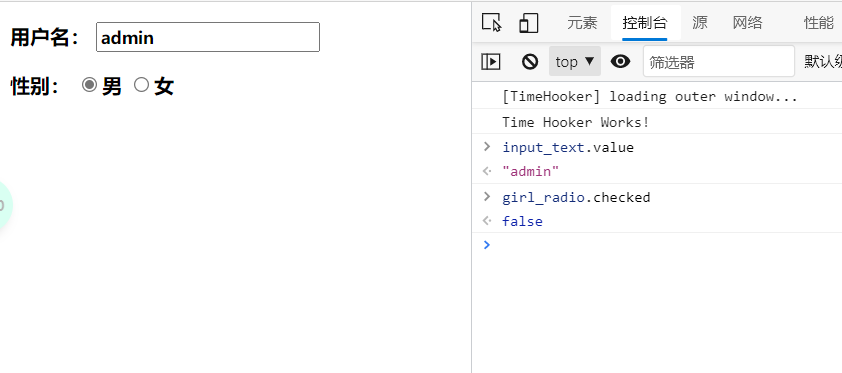

- 提交表单。md5加密密码，表单优化。

```html
<!DOCTYPE html>
<html lang="en">
<head>
    <meta charset="UTF-8">
    <title>Title</title>
    <!-- MD5加密工具类 -->
    <script src = "https://cdn.bootcss.com/blueimp-md5/2.10.0/js/md5.min.js">

    </script>
</head>
<body>

    <!--
        表达绑定提交事件
		οnsubmit= 绑定一个提交检测的函数，true;false
		将这个结果返回给表单，使用onsubmit接收
	-->
<form action="http://guozhivip.com/" method="post" onsubmit="return aaa()">
    <p>
        <span>用户名：</span>
        <input type="text" id="username" name="username"/>
    </p>
    <p>
        <span>密码：</span>
        <input type="password" id="password" />
    </p>
    <input type="hidden" id="md5-password" name="password">

    <!--绑定事件,onclick被点击-->
    <button type="submit">提交</button>

</form>

<script>
    function aaa(){
        alert(1);
        var username = document.getElementById("username");
        var pwd = document.getElementById("password");
        // console.log(uname.value);
        // console.log(pwd.value);
        var md5pwd = document.getElementById("md5-password");
        // MD5 算法
        // pwd.value = md5(pwd,value);
        md5pwd.value = mad5(pwd.value);
        // console.log(pwd.value);
        // 可以校验判断表单内容，true就是通过提交，false就是阻止提交
        return false;
    }
</script>

</body>
</html>
```

## 11.jQuery

JavaScript和jQuery的关系？

- [jQuery](https://baike.baidu.com/item/jQuery)库，里面存在大量的JavaScript函数

> 获取[jQuery](https://code.jquery.com)


- **公式**：$(selector).action()
  - jquery-3.5.1.js：官网[获取地址](https://www.jq22.com/jquery-info122)，本地导入CDN。
  - 直接引用[在线CDN](https://www.bootcdn.cn/jquery/)。

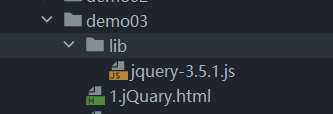

```html
<!DOCTYPE html>
<html lang="en">
<head>
    <meta charset="UTF-8">
    <title>Title</title>
    <script src="lib/jquery-3.5.1.js"></script>
<!--    <script src="https://cdn.bootcdn.net/ajax/libs/jquery/3.6.0/jquery.js"></script>-->
</head>
<body>

<a href="" id="test-jquery">点我</a>

<script>
    // document.getElementById('id');
    // 选择器为CSS选择器
    $('#test-jquery').click(function () {
        alert('hello,jQuery!');
    })
</script>

</body>
</html>
```

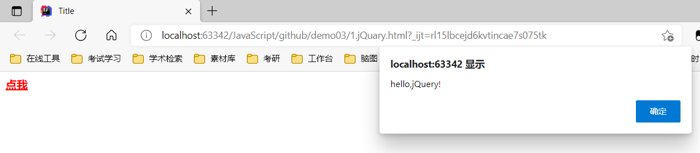

> 选择器

```js
// 原生JS，选择器少，不方便记忆
// 标签
document.getElementByTagName();
// id
document.getElementById();
// class
document.getElementByClassName();

// jQuery CSS中的选择器它全部都能用！
$('p').click();	// 标签选择器
$('#id1').click();	// id选择器
$('.class1').click;	// class选择器
```

- 文档工具站：[http://jquery.cuishifeng.cn/](http://jquery.cuishifeng.cn/)

> 事件：鼠标事件、键盘事件，其他事件。

```js
mousedown()(jQuery) ----按下
mouseenter()(jQuery)
mouseleave()(jQuery)
mousemove()(jQuery) ----移动
mouseout()(jQuery)
mouseover()(jQuery)
mouseup()(jQuery)
```

```html
<!DOCTYPE html>
<html lang="en">
<head>
    <meta charset="UTF-8">
    <title>Title</title>
    <script src="https://cdn.bootcdn.net/ajax/libs/jquery/3.6.0/jquery.js"></script>
    <style>
        #divMove{
            width: 120px;
            height: 120px;
            border: 1px solid deepskyblue;
        }
    </style>
</head>
<body>

<!--获取当前鼠标坐标-->
mouse:<span id="mouseMove"></span>
<div id="divMove">
    移动一下试试！
</div>

<script>
    // 加载完成后，响应事件
    $(function () {
       $('#divMove').mousemove(function (e) {
           $('#mouseMove').text("x: "+e.pageX + ",y: "+e.pageY);
       });
    });
</script>

</body>
</html>
```

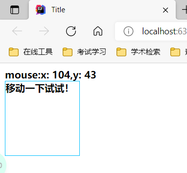

> 操作DOM

- 节点文本操作

```js
<!DOCTYPE html>
<html lang="en">
<head>
    <meta charset="UTF-8">
    <title>Title</title>
    <script src="lib/jquery-3.5.1.js"></script>
</head>
<body>

<ul id="test-ul">
    <li class="js">JavaScript</li>
    <li name="python">Python</li>

</ul>

<script>
    $('#test-ul li[name=python]').text(); // 获得值
    $('#test-ul li[name=python]').text('设置值'); // 设置值
    $('#test-ul').html(); // 获得值
    $('#test-ul').html('<strong>123</strong>'); // 设置值
</script>

</body>
</html>
```

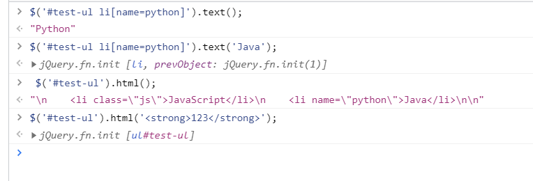

- CSS的操作

```js
$('#test-ul li[name=python]').css("color","red");
```

- 元素的显示和隐藏；本质——display:none;

```js
$('#test-ul li[name=python]').show();
$('#test-ul li[name=python]').hide();
```

- 娱乐测试

```js
$(window).width();
$(window).height();
$('#test-ul li[name=python]').toggle();
```

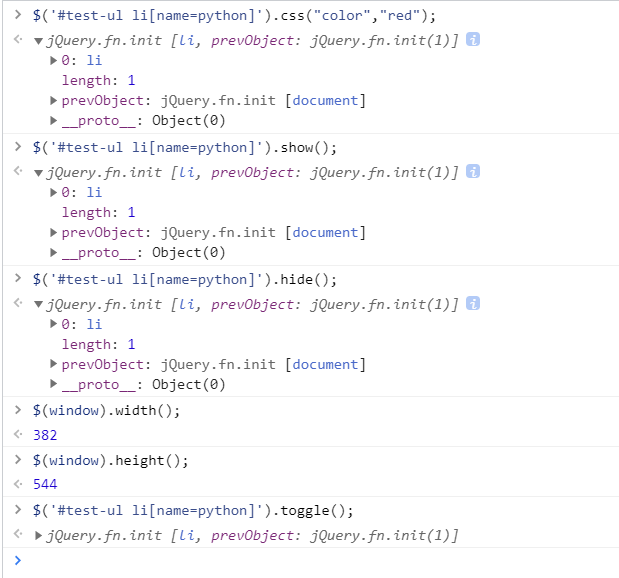

- 未来ajax()；

```js
$('#form').ajax();

$.ajax({url:"test.html",context:document.body,success:function(){
	$(this).addClass("done");
}});
```

## 12.总结

- jQuery小游戏网站：[网站①](https://www.jq22.com/jquery-plugins%E6%B8%B8%E6%88%8F-1-jq)，[网站②](http://www.jqueryfuns.com/xiaoyouxi)。
- jQuery小游戏——学生抽奖界面。

```js
<!DOCTYPE html>
<html>
	<head>
		<meta charset="utf-8">
		<title>学生抽奖界面</title>
		<style>
			*{
				padding: 0px;
				margin: 0px;
				font-size: 20px;
				font-family: "宋体";
				color: #00ff00;
				text-shadow: 7px 10px 1px #008800;
			}
			body{
				background-color: #000000;
			}
			.all{
				width: 100%;
				height: 100vh;
				perspective: 500px;
				overflow: hidden;
				perspective: 500px;
			}
			.strs{
				display: flex;
				width: 100%;
				height: 100vh;
				transition: 3s;
			}
			.strs div{
				width: 30px;
				text-align: center;
				height: 100vh;
			}
			.cz{
				width: 100px;
				height: 10vh;
				position: absolute;
				top: 90vh;
				left: 48%;
				font-size: 2em;
				font-weight: 900;
				color: red;
				text-shadow: 1px 1px 1px red;
			}
			.cz:hover{
				color: #00ff00;
				text-shadow: 1px 1px 1px #008800;
			}
			.result{
				width: 40%;
				height: 80px;
				position: absolute;
				top: 40vh;
				left: 30%;
				color: #00ff00;
				text-shadow: 1px 1px 1px #008800;
				font-size: 3em;
				font-weight: 900;
				opacity: 0;
				transition: 2s;
				text-align: center;
			}
			.rank{
				width: 200px;
				border: 2px solid #00FF00;
				position: absolute;
				top: 65vh;
				left: 85%;
			}
			.rank p{
				width: 100%;
				text-align: center;
				text-shadow: 0px 0px 0px transparent;
			}
			.rank p:hover{
				color: yellow;
			}
			.update{
				width: 500px;
				height: 30vh;
				position: absolute;
				top: -35vh;
				left: 38%;
				background-color: black;
				border: 1px solid #00FF00;
				display: flex;
				justify-content: center;
				transition: 1s;
			}
			.tx{
				background: transparent;
				margin-top: 15vh;
				text-align: center;
			}
		</style>
	</head>
	<body>
		<div class="all" ondblclick="update()" onmousemove="moves(event)">
			<div class="strs" id="strs"></div>
			<div class="cz" id="cz" onclick="starts()">开始</div>
			<div class="result" id="result"></div>
			<div class="rank" id="rank" onmousedown="rankdown()" onmouseup="rankup()"><p>历史记录</p></div>
			<div class="update" id="update">
				<p>
					<input type="text" list="updatelist" class="tx" id="tx"/>
					<datalist id="updatelist"></datalist>
					<input type="button" value="删除" class="tx" onclick="update1()"/>
					<input type="button" value="添加" class="tx" onclick="update2()"/>
					<input type="button" value="取消" class="tx" onclick="update3()"/>
				</p>
			</div>
		</div>
		<script>
			var names = [
				"刘欣",
				"程贤政",
				"谢行",
				"邱思宇",
				"廖永胜",
				"刘东",
				"刘向鸿",
				"朱美琳",
				"刘佳",
				"董金杰",
				"张瑞",
				"赵文豪",
				"黄俊涛",
				"李小华",
				"黄建军",
				"余洋",
				"江琳",
				"张羽",
				"肖怀智",
				"王文宇",
				"向俊瑾",
				"秦渝均",
				"邓桂兰",
				"何洁",
				"陈广",
				"张士杰",
				"李丹",
				"肖晴",
				"张渝",
				"王子晓",
				"陆恋钰",
				"周兴怡",
				"黎雪彬",
				"刘琳",
				"杜涛",
				"米俊龙",
				"陈益巧",
				"周雪",
				"许小祥",
				"李林",
				"邓东华",
				"杨雪"
			];
			var namess = [];
			bg();
			function bg(){
				document.getElementById("strs").innerHTML='';
				for(var i=0;i<51;i++){
					var rdmnum = Math.floor(Math.random()*names.length);
					var str = '';
					str+='<div>';
					var rdmnum1 = Math.floor(Math.random()*10)+1;
					for(var h=rdmnum1;h>0;h--){
						str+='<font style="opacity: '+h/10+';">'+names[rdmnum]+'</font>';
					}
					str+='</div>';
					document.getElementById("strs").innerHTML+=str;
				}
			}
			var start1 = null;
			var num1 = 0;
			function starts(){
				if(num1==0){
					start1=setInterval(bg,100);
					document.getElementById("cz").innerText="停止";
					document.getElementById("strs").style.transform="translateZ(0px) translateY(0px)";
					document.getElementById("result").style.opacity="0";
					num1=1;
				}else{
					clearInterval(start1);
					document.getElementById("cz").innerText="开始";
					document.getElementById("strs").style.transform="translateZ(450px) translateY(350px)";
					document.getElementById("result").style.opacity="1";
					var rdmname = document.getElementById("strs").childNodes[25].firstChild.innerText;
					document.getElementById("result").innerText='恭喜'+rdmname+'同学中奖了';
					namess.unshift(rdmname+' 中奖');
					rank();
					num1=0;
				}
			}
			function rank(){
				document.getElementById("rank").innerHTML='<p>历史记录</p>';
				for(var i=0;i<namess.length;i++){
					if(i==10){
						break;
					}
					document.getElementById("rank").innerHTML+='<p>'+namess[i]+'</p>';
				}
			}
			function update(){
				document.getElementById("update").style.top="18vh";
			}
			function updatelist(){
				document.getElementById("updatelist").innerHTML='';
				for(var i=0;i<names.length;i++){
					document.getElementById("updatelist").innerHTML+='<option>'+names[i]+'</option>'
				}
			}
			updatelist();
			function update3(){
				document.getElementById("update").style.top="-35vh";
				document.getElementById("tx").value='';
			}
			function update1(){
				var str = document.getElementById("tx").value;
				for(var i=0;i<names.length;i++){
					if(names[i]==str){
						namess.unshift(names[i]+' 删除');
						names.splice(i,1);
						updatelist();
						document.getElementById("tx").value='';
						rank();
						break;
					}
				}
			}
			function update2(){
				var str = document.getElementById("tx").value;
				namess.unshift(str+' 添加');
				names.push(str);
				updatelist();
				rank();
				document.getElementById("tx").value='';
			}
			var x,y,start2;
			function rankdown(){
				start2 = setInterval(rankmove);
			}
			function rankup(){
				clearInterval(start2);
			}
			function rankmove(){
				document.getElementById("rank").style.left=x-20+'px';
				document.getElementById("rank").style.top=y-10+'px';
			}
			function moves(xy){
				x=xy.clientX;
				y=xy.clientY;
			}
		</script>
	</body>
</html>
```

- 如何巩固JS：看jQuery源码、游戏源码。
- 巩固HTML、CSS：扒网站。

