[TOC]

# Spring MVC

> > 参考视频：[B站狂神](https://www.bilibili.com/video/BV1aE41167Tu)，写这个只是方便个人复习，怎么写是我自己的事，我能看懂就行，没要求非要让你看！白嫖还挑刺，是很没有风度的事情。希望做个有风度的“五好青年”！
>

---

## 1、回顾MVC架构

### 1.1 什么是MVC

- MVC 设计不仅限于 [Java](http://c.biancheng.net/java/) Web 应用，还包括许多应用，比如前端、[PHP](http://c.biancheng.net/php/)、.NET 等语言。之所以那么做的根本原因在于解耦各个模块。 

> MVC 是 Model、View 和 Controller 的缩写，分别代表 Web 应用程序中的 3 种职责。
>
> - ==(Model)模型==：用于存储数据以及处理用户请求的业务逻辑。
> - ==(View)视图==：向控制器提交数据，显示模型中的数据。
> - ==(Controller)控制器==：根据视图提出的请求判断将请求和数据交给哪个模型处理，将处理后的有关结果交给哪个视图更新显示。

- MVC是一种软件设计规范。 
- 是将业务逻辑、数据、显示分离的方法来组织代码。 
- MVC主要作用是降低了视图与业务逻辑间的双向偶合。 
- MVC不是一种设计模式，MVC是一种架构模式。当然不同的MVC存在差异。 

> 基于 Servlet 的 MVC 模式的具体实现如下。

- **模型**：一个或多个 JavaBean 对象，用于存储数据（实体模型，由 JavaBean 类创建）和处理业务逻辑（业务模型，由一般的 Java 类创建）。
- **视图**：一个或多个 JSP 页面，向控制器提交数据和为模型提供数据显示，JSP 页面主要使用 HTML 标记和 JavaBean 标记来显示数据。
- **控制器**：一个或多个 Servlet 对象，根据视图提交的请求进行控制，即将请求转发给处理业务逻辑的 JavaBean，并将处理结果存放到实体模型 JavaBean 中，输出给视图显示。

> 基于 Servlet 的 MVC 模式的流程如图所示。 

 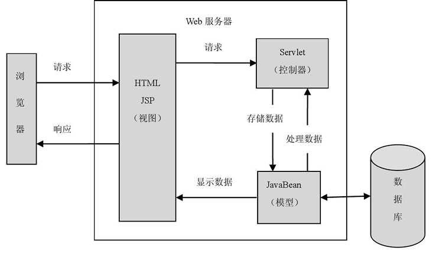 

> **最典型的MVC就是JSP + servlet + javabean的模式。**


### 1.2 Model1时代

- 在web早期的开发中，通常采用的都是Model1。
- Model1中，主要分为两层，视图层和模型层。

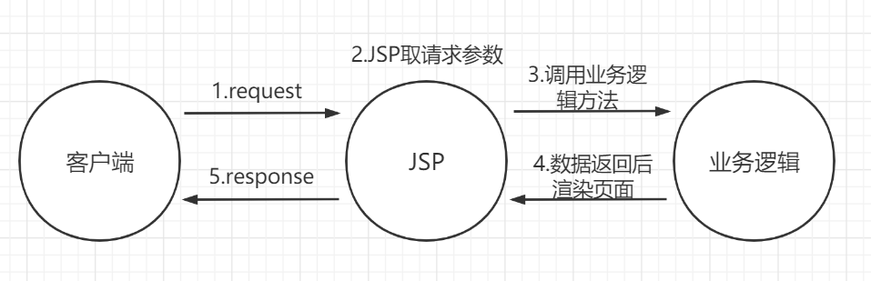

- Model1优点：架构简单，比较适合小型项目开发；

- Model1缺点：JSP职责不单一，职责过重，不便于维护；

### 1.3 Model2时代

- Model2把一个项目分成三部分，包括**视图、控制、模型。**

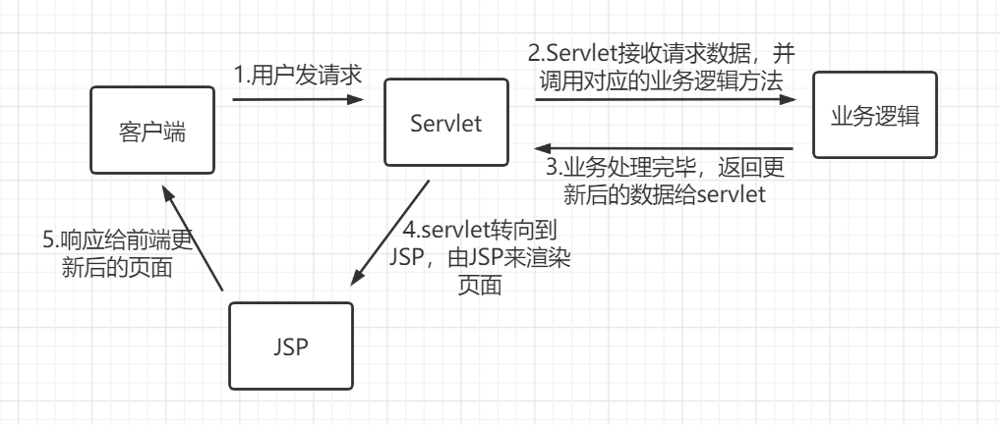

**职责分析：**

**Controller：控制器**

- 取得表单数据
- 调用业务逻辑
- 转向指定的页面

**Model：模型**

- 业务逻辑
- 保存数据的状态

**View：视图**

- 显示页面

> Model2这样不仅提高的代码的复用率与项目的扩展性，且大大降低了项目的维护成本。Model 1模式的实现比较简单，适用于快速开发小规模项目，Model1中JSP页面身兼View和Controller两种角色，将控制逻辑和表现逻辑混杂在一起，从而导致代码的重用性非常低，增加了应用的扩展性和维护的难度。Model2消除了Model1的缺点。

### 1.4 回顾Servlet

1. 新建一个Maven工程当做父工程！pom依赖！

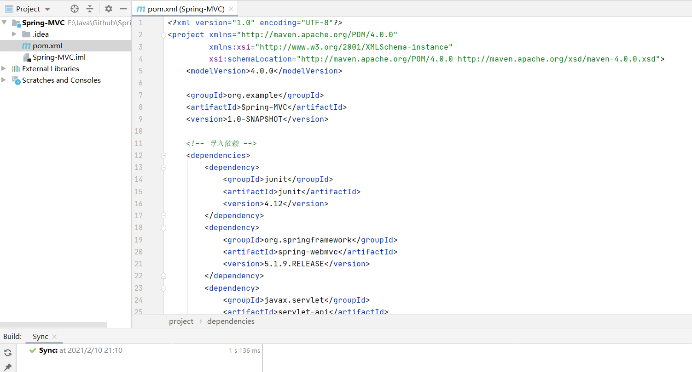

```xml
    <!-- 导入依赖 -->
    <dependencies>
        <dependency>
            <groupId>junit</groupId>
            <artifactId>junit</artifactId>
            <version>4.12</version>
        </dependency>
        <dependency>
            <groupId>org.springframework</groupId>
            <artifactId>spring-webmvc</artifactId>
            <version>5.1.9.RELEASE</version>
        </dependency>
        <dependency>
            <groupId>javax.servlet</groupId>
            <artifactId>servlet-api</artifactId>
            <version>2.5</version>
        </dependency>
        <dependency>
            <groupId>javax.servlet.jsp</groupId>
            <artifactId>jsp-api</artifactId>
            <version>2.2</version>
        </dependency>
        <dependency>
            <groupId>javax.servlet</groupId>
            <artifactId>jstl</artifactId>
            <version>1.2</version>
        </dependency>
    </dependencies>
```

2. 建立一个Moudle：springmvc-01-servlet ， 添加Web app的支持！

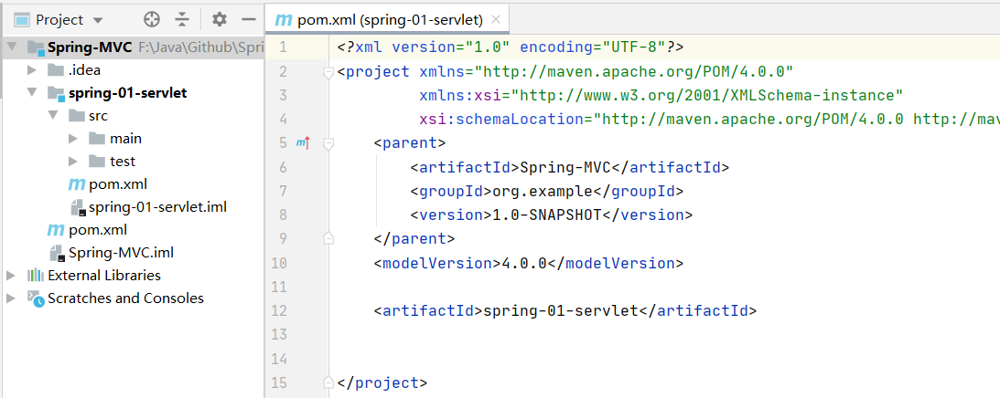

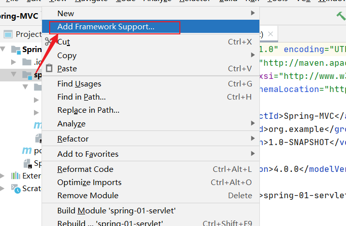

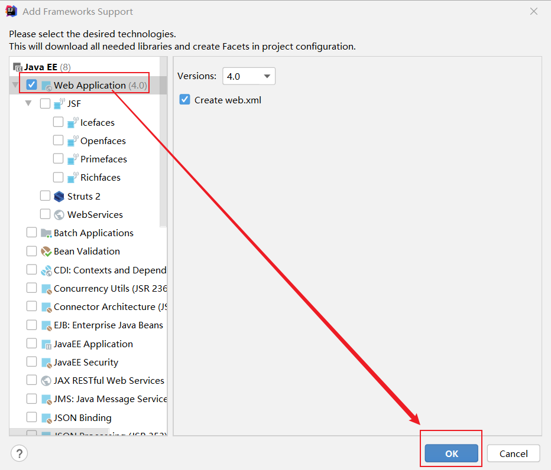

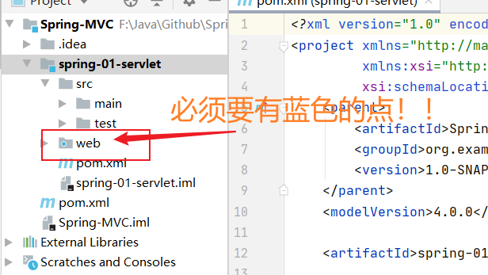

3. 导入servlet 和 jsp 的 jar 依赖

```xml
    <!-- 导入servlet和jsp的依赖 -->
    <dependencies>
        <dependency>
            <groupId>javax.servlet</groupId>
            <artifactId>servlet-api</artifactId>
            <version>2.5</version>
        </dependency>
        <dependency>
            <groupId>javax.servlet.jsp</groupId>
            <artifactId>jsp-api</artifactId>
            <version>2.2</version>
        </dependency>
    </dependencies>
```

4. 编写一个Servlet类，用来处理用户的请求

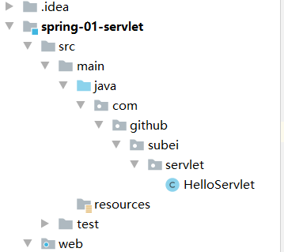

```java
package com.github.subei.servlet;

import javax.servlet.ServletException;
import javax.servlet.http.HttpServlet;
import javax.servlet.http.HttpServletRequest;
import javax.servlet.http.HttpServletResponse;
import java.io.IOException;

// 实现Servlet接口
public class HelloServlet extends HttpServlet {

    @Override
    protected void doGet(HttpServletRequest req, HttpServletResponse resp) throws ServletException, IOException {
        // 1.获取前端参数
        String method = req.getParameter("method");
        if (method.equals("add")){
            req.getSession().setAttribute("msg","执行add方法");
        }
        if (method.equals("delete")){
            req.getSession().setAttribute("msg","执行delete方法");
        }
        // 2.调用业务逻辑层

        // 3.视图转发或重定向
        req.getRequestDispatcher("/WEB-INF/jsp/Hello.jsp").forward(req,resp);
    }

    @Override
    protected void doPost(HttpServletRequest req, HttpServletResponse resp) throws ServletException, IOException {
        doGet(req,resp);
    }
}
```

5. 编写Hello.jsp，在WEB-INF目录下新建一个jsp的文件夹，新建Hello.jsp、Form.jsp

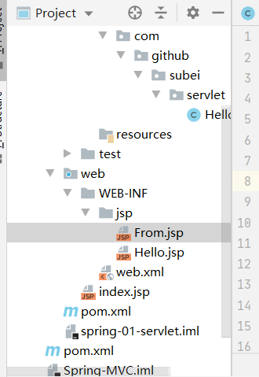

- Hello.jsp

```jsp
<%@ page contentType="text/html;charset=UTF-8" language="java" %>
<html>
<head>
    <title>subeiLY</title>
</head>
<body>
${msg}
</body>
</html>
```

- Form.jsp

```jsp
<%@ page contentType="text/html;charset=UTF-8" language="java" %>
<html>
<head>
    <title>Title</title>
</head>
<body>

<form action="/hello" method="post">
    <input type="text" name="method">
    <input type="submit">
</form>

</body>
</html>
```


6. 在web.xml中注册Servlet

```xml
<?xml version="1.0" encoding="UTF-8"?>
<web-app xmlns="http://xmlns.jcp.org/xml/ns/javaee"
         xmlns:xsi="http://www.w3.org/2001/XMLSchema-instance"
         xsi:schemaLocation="http://xmlns.jcp.org/xml/ns/javaee http://xmlns.jcp.org/xml/ns/javaee/web-app_4_0.xsd"
         version="4.0">

    <servlet>
        <servlet-name>HelloServlet</servlet-name>
        <servlet-class>com.github.subei.servlet.HelloServlet</servlet-class>
    </servlet>
    <servlet-mapping>
        <servlet-name>HelloServlet</servlet-name>
        <url-pattern>/hello</url-pattern>
    </servlet-mapping>

</web-app>
```

7. 配置Tomcat，并启动测试

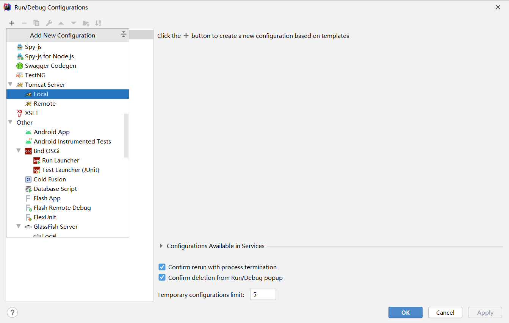

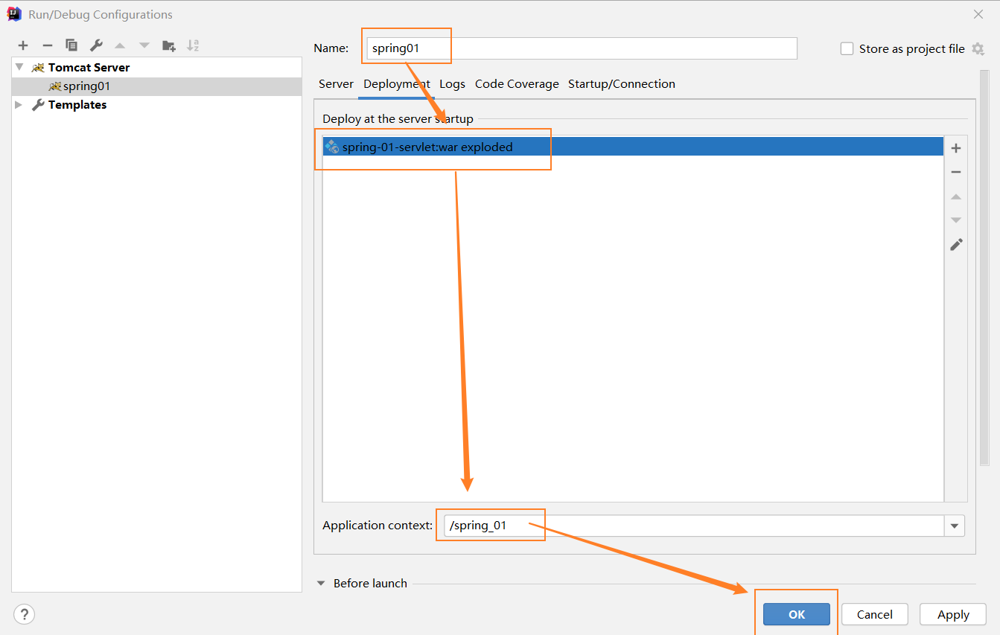


   - http://localhost:8080/spring_01/hello?method=add

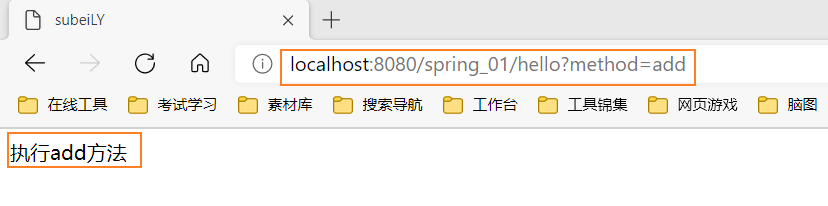


   - http://localhost:8080/spring_01/hello?method=delete

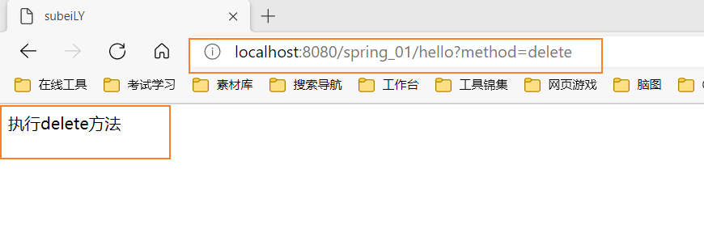

**MVC框架要做哪些事情**

1. 将url映射到java类或java类的方法。
2. 封装用户提交的数据。
3. 处理请求--调用相关的业务处理--封装响应数据。
4. 将响应的数据进行渲染 . jsp / html 等表示层数据。

> 常见的服务器端MVC框架有：Struts、Spring MVC、ASP.NET MVC、Zend Framework、JSF；常见前端MVC框架：vue、angularjs、react、backbone；由MVC演化出了另外一些模式如：MVP、MVVM 等等....

#### MVVM扫盲

> 参考于：https://www.jianshu.com/p/0ae3c0d830e5

- MVVM是Model-View-ViewModel的简写。它==本质上就是MVC 的改进版==。 
- MVVM（Model–View–Viewmodel）是一种软件架构模式。 

---

**MVC**中的**M**就是单纯的从网络获取回来的数据模型，**V**指的我们的视图界面，而**C**就是我们的ViewController。

在其中，ViewController负责View和Model之间调度，View发生交互事件会通过target-action或者delegate方式回调给ViewController，与此同时ViewController还要承担把Model通过KVO、Notification方式传来的数据传输给View用于展示的责任。

**随着业务越来越复杂，视图交互越复杂，导致Controller越来越臃肿，负重前行。脏活累活都它干了，到头来还一点不讨好。福报修多了的结果就是，不行了就重构你，重构不了就换掉你。**

- MVC架构图

 

所以，为了解决这个问题，MVVM就闪亮登场了。他把View和Contrller都放在了View层（相当于把Controller一部分逻辑抽离了出来），Model层依然是服务端返回的数据模型。

**而ViewModel充当了一个UI适配器的角色，也就是说View中每个UI元素都应该在ViewModel找到与之对应的属性。除此之外，从Controller抽离出来的与UI有关的逻辑都放在了ViewModel中，这样就减轻了Controller的负担。**

- MVVM的架构图 

 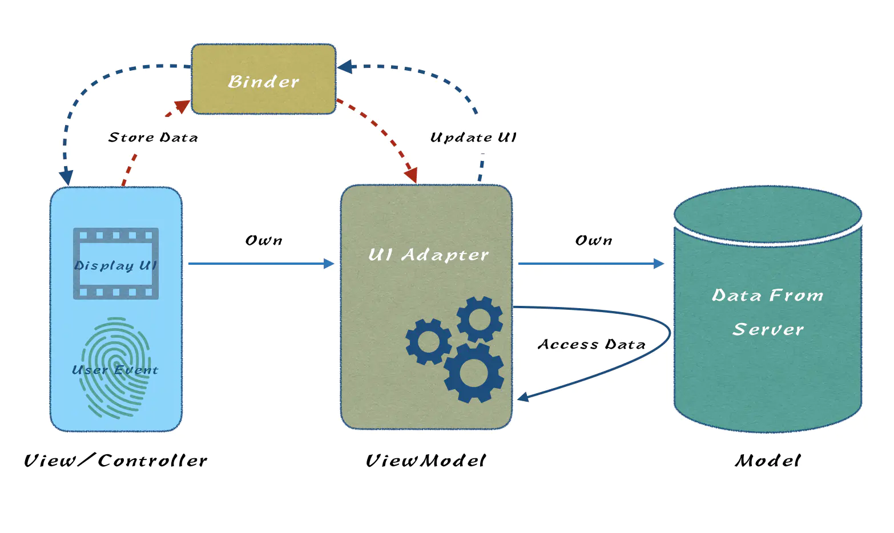

> 从以上的架构图中，我们可以很清晰的梳理出各自的分工。

-  **View层**：视图展示。包含UIView以及UIViewController，View层是可以持有ViewModel的。
-  **ViewModel层**：视图适配器。暴露属性与View元素显示内容或者元素状态一一对应。一般情况下ViewModel暴露的属性建议是readOnly的，至于为什么，我们在实战中会去解释。还有一点，ViewModel层是可以持有Model的。
-  **Model层**：数据模型与持久化抽象模型。数据模型很好理解，就是从服务器拉回来的JSON数据。而持久化抽象模型暂时放在Model层，是因为MVVM诞生之初就没有对这块进行很细致的描述。按照经验，我们通常把数据库、文件操作封装成Model，并对外提供操作接口。（有些公司把数据存取操作单拎出来一层，称之为**DataAdapter层**，所以在业内会有很多MVVM的变种，但其本质上都是MVVM）。
-  **Binder**：MVVM的灵魂。可惜在MVVM这几个英文单词中并没有它的一席之地，它的最主要作用是在View和ViewModel之间做了双向数据绑定。如果MVVM没有Binder，那么它与MVC的差异不是很大。

> 我们发现，正是因为View、ViewModel以及Model间的清晰的持有关系，所以在三个模块间的数据流转有了很好的控制。 

## 2、什么是SpringMVC

### 2.1 概述


> Spring MVC是Spring Framework的一部分，是基于Java实现MVC的轻量级Web框架。

- 官方文档：https://docs.spring.io/spring-framework/docs/4.3.24.RELEASE/spring-framework-reference/html/
- 中文官方文档：https://www.w3cschool.cn/spring_mvc_documentation_linesh_translation/spring_mvc_documentation_linesh_translation-y2ud27r5.html
- 中文文档下载地址：https://www.jb51.net/books/593599.html

> **为什么要学习SpringMVC呢?**

 Spring MVC的特点：

1. 轻量级，简单易学
2. 高效 , 基于请求响应的MVC框架
3. 与Spring兼容性好，无缝结合
4. 约定优于配置
5. 功能强大：RESTful、数据验证、格式化、本地化、主题等
6. 简洁灵活

> Spring的web框架围绕**DispatcherServlet** [ 调度Servlet ] 设计。

- DispatcherServlet的作用是将请求分发到不同的处理器。从Spring 2.5开始，使用Java 5或者以上版本的用户可以采用基于注解形式进行开发，十分简洁；

- 正因为SpringMVC好 , 简单 , 便捷 , 易学 , 天生和Spring无缝集成(使用SpringIoC和Aop) , 使用约定优于配置 . 能够进行简单的junit测试 . 支持Restful风格 .异常处理 , 本地化 , 国际化 , 数据验证 , 类型转换 , 拦截器 等等......所以要学习。

- **最重要的一点还是用的人多 , 使用的公司多 .** 

### 2.2 中心控制器

> Spring的web框架围绕DispatcherServlet设计。DispatcherServlet的作用是将请求分发到不同的处理器。从Spring 2.5开始，使用Java 5或者以上版本的用户可以采用基于注解的controller声明方式。

> Spring MVC框架像许多其他MVC框架一样, **以请求为驱动** , **围绕一个中心Servlet分派请求及提供其他功能**，**DispatcherServlet是一个实际的Servlet (它继承自HttpServlet 基类)**。

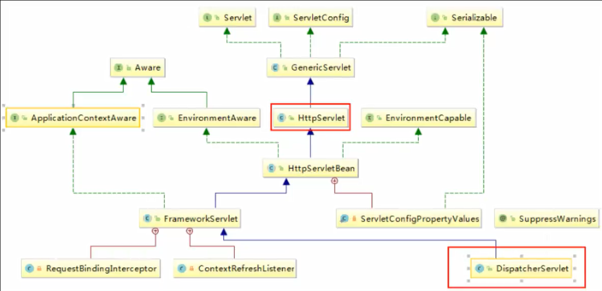

- SpringMVC的原理如下图所示： 

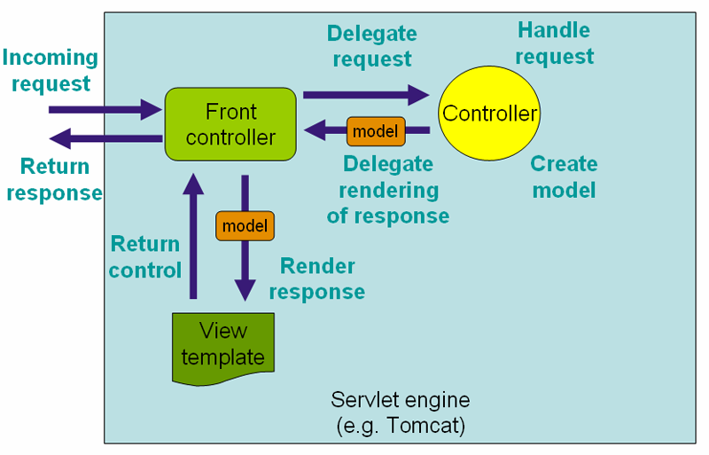 

> 当发起请求时被前置的控制器拦截到请求，根据请求参数生成代理请求，找到请求对应的实际控制器，控制器处理请求，创建数据模型，访问数据库，将模型响应给中心控制器，控制器使用模型与视图渲染视图结果，将结果返回给中心控制器，再将结果返回给请求者。 

 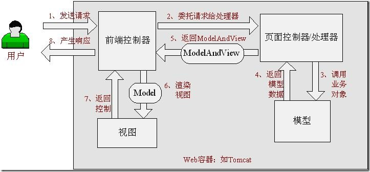 

### 2.3 SpringMVC执行原理

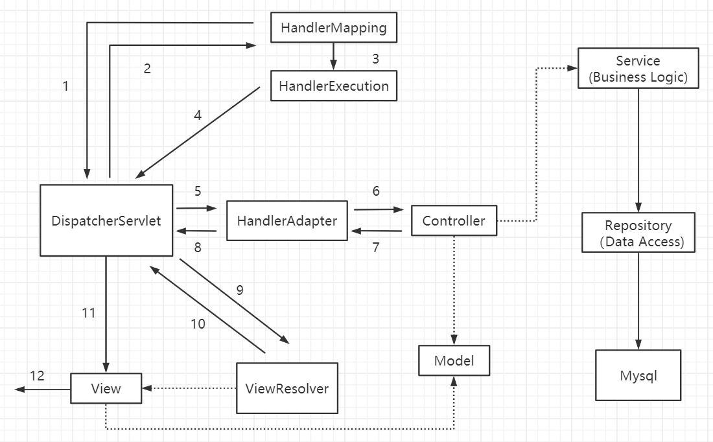

> 图为SpringMVC的一个较完整的流程图，实线表示SpringMVC框架提供的技术，不需要开发者实现，虚线表示需要开发者实现。 

**简要分析执行流程**

1. DispatcherServlet表示前置控制器，是整个SpringMVC的控制中心。用户发出请求，DispatcherServlet接收请求并拦截请求。

   假设请求的url为 : http://localhost:8080/SpringMVC/hello

   **如上url拆分成三部分：**

   http://localhost:8080：服务器域名

   SpringMVC：部署在服务器上的web站点

   hello：控制器

   通过分析，如上url表示为：请求位于服务器localhost:8080上的SpringMVC站点的hello控制器。

2. HandlerMapping为处理器映射。DispatcherServlet调用HandlerMapping,HandlerMapping根据请求url查找Handler。

3. HandlerExecution表示具体的Handler,其主要作用是根据url查找控制器，如上url被查找控制器为：hello。

4. HandlerExecution将解析后的信息传递给DispatcherServlet,如解析控制器映射等。

5. HandlerAdapter表示处理器适配器，其按照特定的规则去执行Handler。

6. Handler让具体的Controller执行。

7. Controller将具体的执行信息返回给HandlerAdapter,如ModelAndView。

8. HandlerAdapter将视图逻辑名或模型传递给DispatcherServlet。

9. DispatcherServlet调用视图解析器(ViewResolver)来解析HandlerAdapter传递的逻辑视图名。

10. 视图解析器将解析的逻辑视图名传给DispatcherServlet。

11. DispatcherServlet根据视图解析器解析的视图结果，调用具体的视图。

12. 最终视图呈现给用户。

## 3、HelloSpring

> 提一句：==IDEA版本不建议使用2020.1，版本不稳定会经常报错==。本节因为报错排错半个月！！！

### 3.1 配置版

1. 新建一个Moudle ， springmvc-02-hellomvc ， 添加web的支持！ 

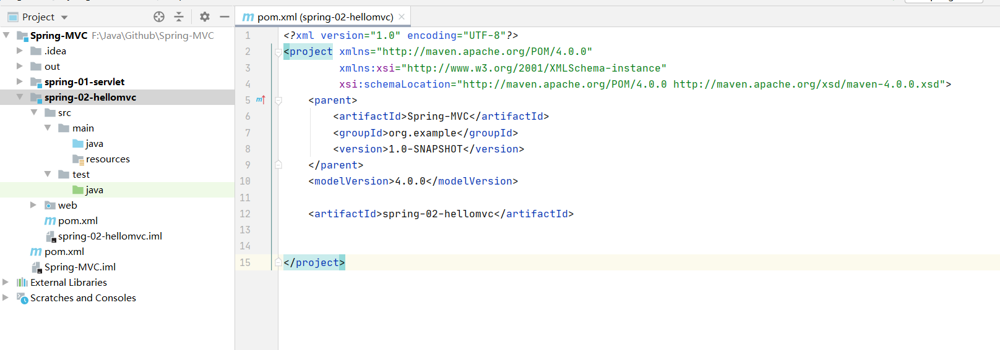

2. 确定导入了SpringMVC 的依赖！

3. 配置web.xml ， 注册DispatcherServlet 

```xml
<?xml version="1.0" encoding="UTF-8"?>
<web-app xmlns="http://xmlns.jcp.org/xml/ns/javaee"
        xmlns:xsi="http://www.w3.org/2001/XMLSchema-instance"
        xsi:schemaLocation="http://xmlns.jcp.org/xml/ns/javaee http://xmlns.jcp.org/xml/ns/javaee/web-app_4_0.xsd"
        version="4.0">

   <!--1.注册DispatcherServlet-->
   <servlet>
       <servlet-name>springmvc</servlet-name>
       <servlet-class>org.springframework.web.servlet.DispatcherServlet</servlet-class>
       <!--关联一个springmvc的配置文件:【servlet-name】-servlet.xml-->
       <init-param>
           <param-name>contextConfigLocation</param-name>
           <param-value>classpath:springmvc-servlet.xml</param-value>
       </init-param>
       <!--启动级别-1-->
       <load-on-startup>1</load-on-startup>
   </servlet>

   <!--/ 匹配所有的请求；（不包括.jsp）-->
   <!--/* 匹配所有的请求；（包括.jsp）-->
   <servlet-mapping>
       <servlet-name>springmvc</servlet-name>
       <url-pattern>/</url-pattern>
   </servlet-mapping>

</web-app>
```

4. 编写SpringMVC 的 配置文件！名称：springmvc-servlet.xml  : [servletname]-servlet.xml 

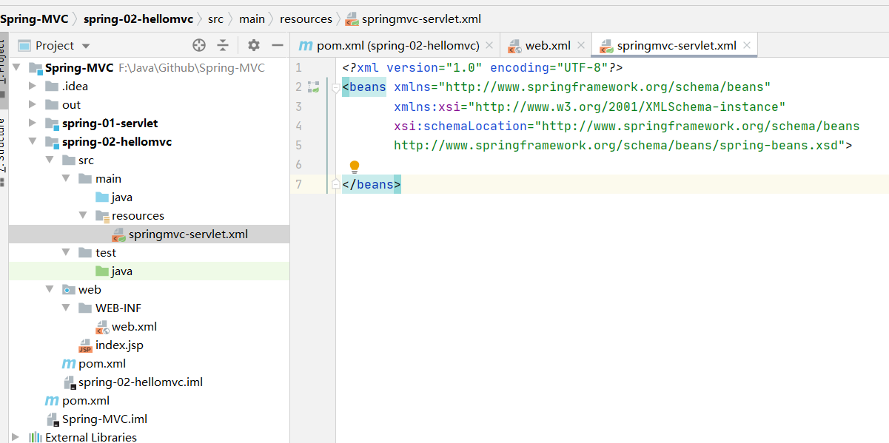

```xml
<?xml version="1.0" encoding="UTF-8"?>
<beans xmlns="http://www.springframework.org/schema/beans"
       xmlns:xsi="http://www.w3.org/2001/XMLSchema-instance"
       xsi:schemaLocation="http://www.springframework.org/schema/beans
       http://www.springframework.org/schema/beans/spring-beans.xsd">

</beans>
```

5. 添加处理映射器、 处理器适配器、 视图解析器 

```xml
<?xml version="1.0" encoding="UTF-8"?>
<beans xmlns="http://www.springframework.org/schema/beans"
       xmlns:xsi="http://www.w3.org/2001/XMLSchema-instance"
       xsi:schemaLocation="http://www.springframework.org/schema/beans
       http://www.springframework.org/schema/beans/spring-beans.xsd">

    <!-- 处理映射器 -->
    <bean class="org.springframework.web.servlet.handler.BeanNameUrlHandlerMapping"/>

    <!-- 处理器适配器 -->
    <bean class="org.springframework.web.servlet.mvc.SimpleControllerHandlerAdapter"/>

    <!-- 视图解析器:DispatcherServlet给他的ModelAndView -->
    <bean class="org.springframework.web.servlet.view.InternalResourceViewResolver" id="InternalResourceViewResolver">
        <!--前缀-->
        <property name="prefix" value="/WEB-INF/jsp/"/>
        <!--后缀-->
        <property name="suffix" value=".jsp"/>
    </bean>

</beans>
```

6. 编写要操作业务Controller ，要么实现Controller接口，要么增加注解；需要返回一个ModelAndView，装数据，封视图； 

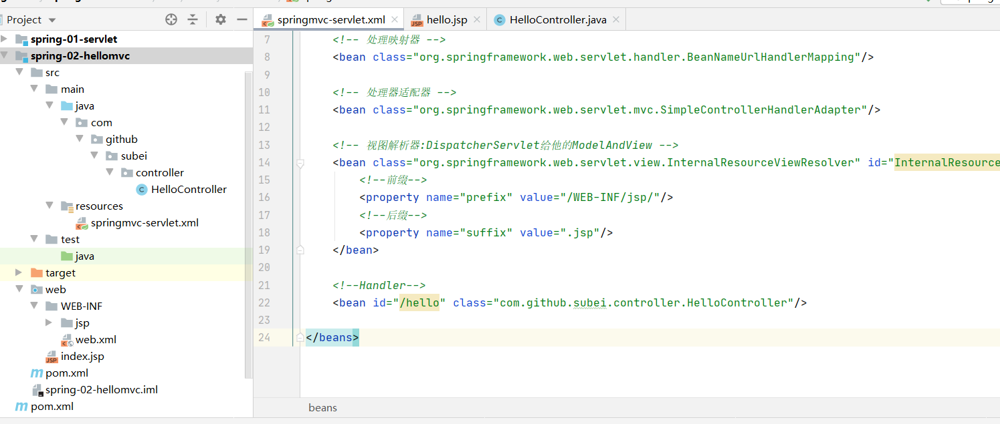

  ```java
package com.github.subei.controller;

import org.springframework.web.servlet.ModelAndView;
import org.springframework.web.servlet.mvc.Controller;

import javax.servlet.http.HttpServletRequest;
import javax.servlet.http.HttpServletResponse;

//注意：这里我们先导入Controller接口
public class HelloController implements Controller {

    public ModelAndView handleRequest(HttpServletRequest request, HttpServletResponse response) throws Exception {
        //ModelAndView 模型和视图
        ModelAndView mv = new ModelAndView();

        //封装对象，放在ModelAndView中。Model
        mv.addObject("msg","HelloSpringMVC!");
        //封装要跳转的视图，放在ModelAndView中
        mv.setViewName("hello"); //: /WEB-INF/jsp/hello.jsp
        return mv;
    }

}
  ```

7. 将自己的类交给SpringIOC容器，注册bean，添加到springmvc-servlet.xml中。

```xml
    <!--Handler-->
    <bean id="/hello" class="com.github.subei.controller.HelloController"/>
```

8. 写要跳转的jsp页面，显示ModelandView存放的数据，以及正常页面； 

```jsp
<%@ page contentType="text/html;charset=UTF-8" language="java" %>
<html>
<head>
    <title>HelloSpringMVC</title>
</head>
<body>
    ${msg}
</body>
</html>
```

9. 配置Tomcat，启动测试！ 

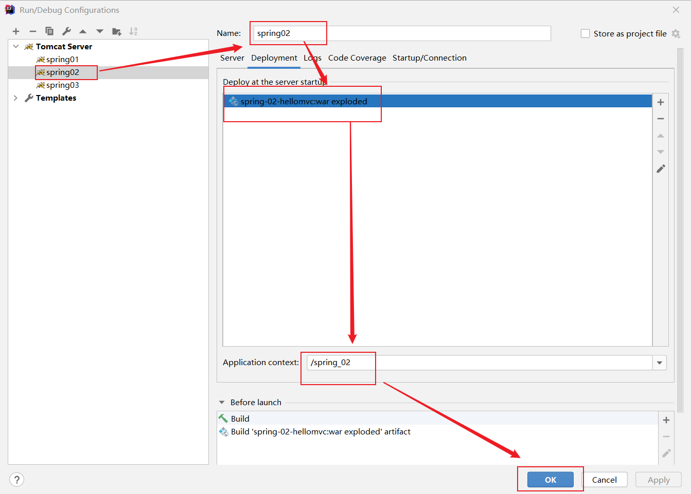

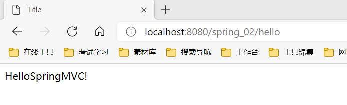

---

> 报错：Error:(3, 39) java: 程序包org.springframework.web.servlet不存在

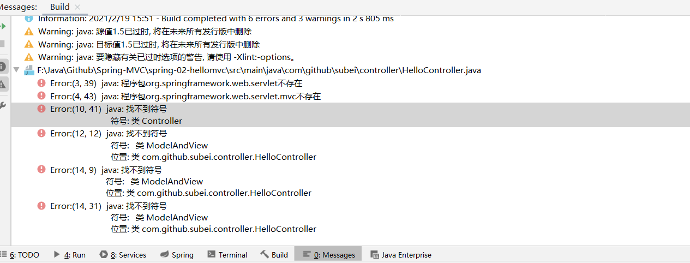

- 解决方法：在WEB-INF中添加lib文件夹，手动加入spring-web-5.1.9.RELEASE.jar、spring-webmvc-5.1.9.RELEASE.jar的jar包。

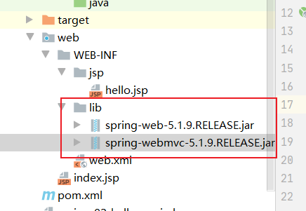

> 报错：404，如下图：

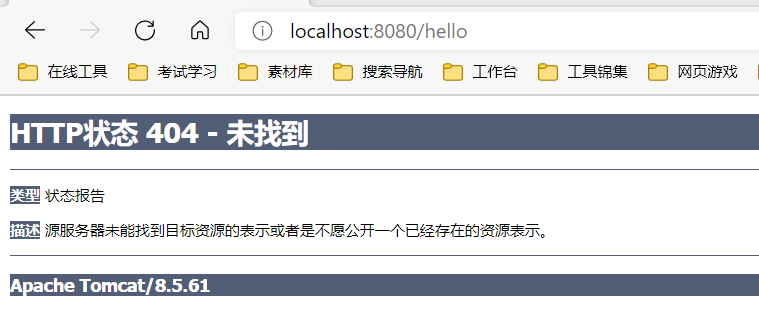

- 解决方法：


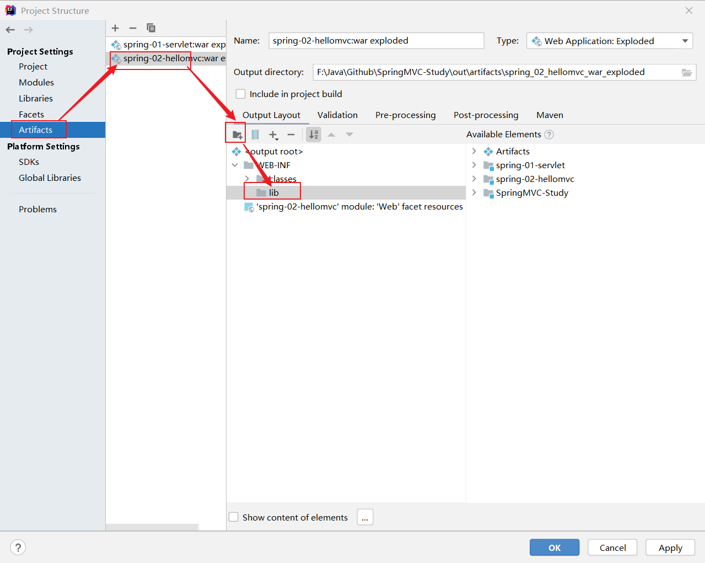

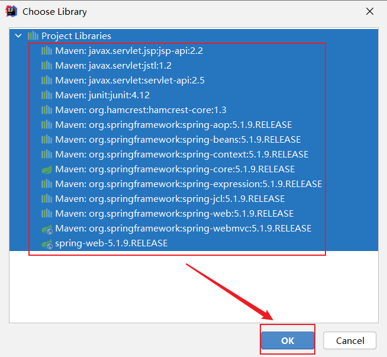

- 导入后运行，**如果仍无法解决404问题。可以考虑更换IDEA版本**。笔者之前的IDEA版本为2020.1经常报错。更换为IDEA 2020.2版本之后，完美解决！！！
- IDEA2020软件地址：https://pan.baidu.com/s/1L6q0ZD2f0e7Re1669dtR3A 
- 提取码：ae4m 

### 3.2 注解版

1. 新建一个Moudle，springmvc-03-hello-annotation ，添加web支持！

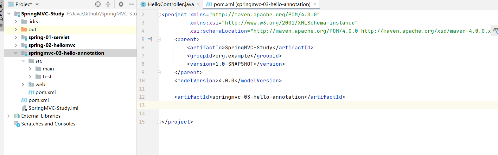

2. 由于Maven可能存在资源过滤的问题，将配置完善，在pom.xml中添加如下：

```xml
<build>
   <resources>
       <resource>
           <directory>src/main/java</directory>
           <includes>
               <include>**/*.properties</include>
               <include>**/*.xml</include>
           </includes>
           <filtering>false</filtering>
       </resource>
       <resource>
           <directory>src/main/resources</directory>
           <includes>
               <include>**/*.properties</include>
               <include>**/*.xml</include>
           </includes>
           <filtering>false</filtering>
       </resource>
   </resources>
</build>
```

3. 在pom.xml文件引入相关的依赖：主要有Spring框架核心库、Spring MVC、servlet , JSTL等。==在父依赖中已经引入了==！

4. 配置web.xml

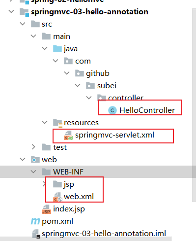

```xml
<?xml version="1.0" encoding="UTF-8"?>
<web-app xmlns="http://xmlns.jcp.org/xml/ns/javaee"
         xmlns:xsi="http://www.w3.org/2001/XMLSchema-instance"
         xsi:schemaLocation="http://xmlns.jcp.org/xml/ns/javaee http://xmlns.jcp.org/xml/ns/javaee/web-app_4_0.xsd"
         version="4.0">

    <!--1.注册servlet-->
    <servlet>
        <servlet-name>SpringMVC</servlet-name>
        <servlet-class>org.springframework.web.servlet.DispatcherServlet</servlet-class>
        <!--通过初始化参数指定SpringMVC配置文件的位置，进行关联-->
        <init-param>
            <param-name>contextConfigLocation</param-name>
            <param-value>classpath:springmvc-servlet.xml</param-value>
        </init-param>
        <!-- 启动顺序，数字越小，启动越早 -->
        <load-on-startup>1</load-on-startup>
    </servlet>

    <!--所有请求都会被springmvc拦截 -->
    <servlet-mapping>
        <servlet-name>SpringMVC</servlet-name>
        <url-pattern>/</url-pattern>
    </servlet-mapping>

</web-app>
```

- 注意/ 和 /\* 的区别：< url-pattern > / </ url-pattern > 不会匹配到.jsp， 只针对我们编写的请求；即：.jsp 不会进入spring的 DispatcherServlet类 。< url-pattern > /* </ url-pattern > 会匹配 *.jsp，会出现返回 jsp视图 时再次进入spring的DispatcherServlet 类，导致找不到对应的controller所以报404错。

   - 注意web.xml版本问题，要最新版！
   - 注册DispatcherServlet
   - 关联SpringMVC的配置文件
   - 启动级别为1
   - 映射路径为 / 【不要用/*，会404】

5. 添加Spring MVC配置文件

      > 在resource目录下添加springmvc-servlet.xml配置文件，配置的形式与Spring容器配置基本类似，为了支持基于注解的IOC，设置了自动扫描包的功能，具体配置信息如下：

```xml
<?xml version="1.0" encoding="UTF-8"?>
<beans xmlns="http://www.springframework.org/schema/beans"
       xmlns:xsi="http://www.w3.org/2001/XMLSchema-instance"
       xmlns:context="http://www.springframework.org/schema/context"
       xmlns:mvc="http://www.springframework.org/schema/mvc"
       xsi:schemaLocation="http://www.springframework.org/schema/beans
       http://www.springframework.org/schema/beans/spring-beans.xsd
       http://www.springframework.org/schema/context
       https://www.springframework.org/schema/context/spring-context.xsd
       http://www.springframework.org/schema/mvc
       https://www.springframework.org/schema/mvc/spring-mvc.xsd">

    <!-- 自动扫描包，让指定包下的注解生效,由IOC容器统一管理 -->
    <context:component-scan base-package="com.github.subei.controller"/>
    <!-- 让Spring MVC不处理静态资源 -->
    <mvc:default-servlet-handler />
    <!--
    支持mvc注解驱动
        在spring中一般采用@RequestMapping注解来完成映射关系
        要想使@RequestMapping注解生效
        必须向上下文中注册DefaultAnnotationHandlerMapping
        和一个AnnotationMethodHandlerAdapter实例
        这两个实例分别在类级别和方法级别处理。
        而annotation-driven配置帮助我们自动完成上述两个实例的注入。
     -->
    <mvc:annotation-driven />

    <!-- 视图解析器 -->
    <bean class="org.springframework.web.servlet.view.InternalResourceViewResolver"
          id="internalResourceViewResolver">
        <!-- 前缀 -->
        <property name="prefix" value="/WEB-INF/jsp/" />
        <!-- 后缀 -->
        <property name="suffix" value=".jsp" />
    </bean>

</beans>
```

6. 创建Controller，编写一个Java控制类：com.github.subei.controller.HelloController , 注意编码规范

```java
package com.github.subei.controller;

import org.springframework.stereotype.Controller;
import org.springframework.ui.Model;
import org.springframework.web.bind.annotation.RequestMapping;

@Controller
@RequestMapping("/HelloController")
public class HelloController {

    // 真实访问地址 : 项目名/HelloController/hello
    @RequestMapping("/hello")
    public String sayHello(Model model){
        // 向模型中添加属性msg与值，可以在JSP页面中取出并渲染
        model.addAttribute("msg","hello,SpringMVC");
        // web-inf/jsp/hello.jsp
        return "hello";
    }
}
```

- @Controller是为了让Spring IOC容器初始化时自动扫描到；
- @RequestMapping是为了映射请求路径，这里因为类与方法上都有映射所以访问时应该是/HelloController/hello；
- 方法中声明Model类型的参数是为了把Action中的数据带到视图中；
- 方法返回的结果是视图的名称hello，加上配置文件中的前后缀变成WEB-INF/jsp/hello.jsp。

7. 创建视图层

- 在WEB-INF/ jsp目录中创建hello.jsp ， 视图可以直接取出并展示从Controller带回的信息；

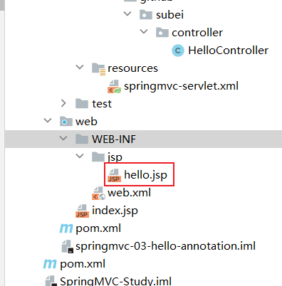

- 可以通过EL表示取出Model中存放的值，或者对象；

```jsp
<%@ page contentType="text/html;charset=UTF-8" language="java" %>
<html>
<head>
    <title>SpringMVC</title>
</head>
<body>
${msg}
</body>
</html>
```

8. 还要手动配置lib包。

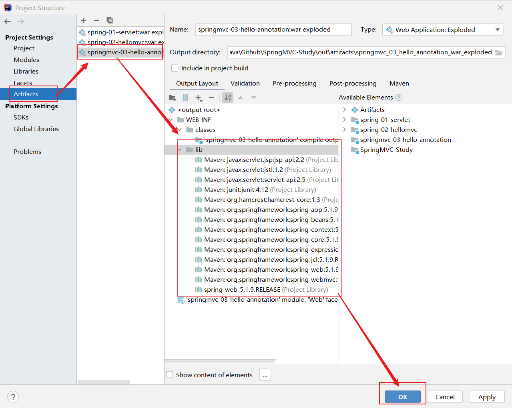

9. 配置Tomcat运行，开启服务器，访问对应的请求路径！


- 运行成功！！！
- http://localhost:8080/springmvc_03/HelloController/hello

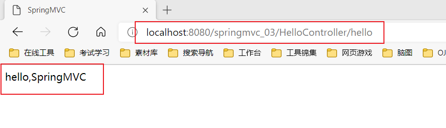

### 3.3 小结

> 实现步骤：

1. 新建一个web项目
2. 导入相关jar包
3. 编写web.xml , 注册DispatcherServlet
4. 编写springmvc配置文件
5. 接下来就是去创建对应的控制类 , controller
6. 最后完善前端视图和controller之间的对应
7. 测试运行调试.

> 使用springMVC必须配置的三大件：

- **处理器映射器、处理器适配器、视图解析器**

> 通常，我们只需要**手动配置视图解析器**，而**处理器映射器**和**处理器适配器**只需要开启**注解驱动**即可，而省去了大段的xml配置。


## 4、RestFul和Controller

### 1.控制器Controller

- 控制器复杂提供访问应用程序的行为，通常可以通过接口定义或注解定义两种方法实现。
- 控制器负责解析用户的请求并将其转换为一个模型。
- 在Spring MVC中一个控制器类可以包含多个方法
- 在Spring MVC中，对于Controller的配置方式有很多种

### 2.实现Controller接口

Controller是一个接口，在org.springframework.web.servlet.mvc包下，接口中只有一个方法；

```java
// 实现该接口的类获得控制器功能
public interface Controller {
   // 处理请求且返回一个模型与视图对象
   ModelAndView handleRequest(HttpServletRequest var1, HttpServletResponse var2) throws Exception;
}
```

1. 新建一个Moudle，springmvc-04-controller 。将刚才的03拷贝一份, 进行操作！

   - 删掉HelloController。

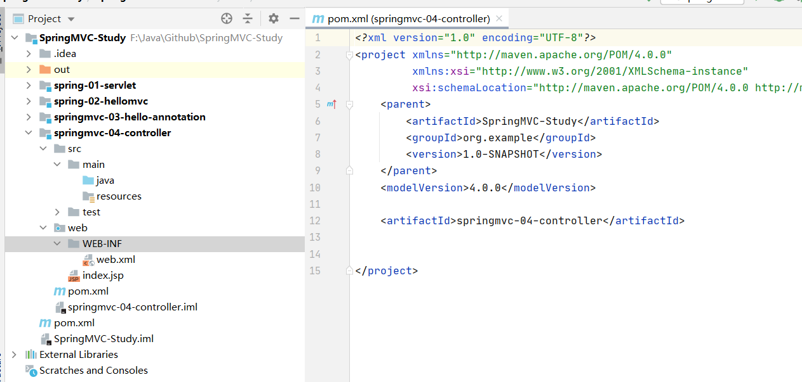

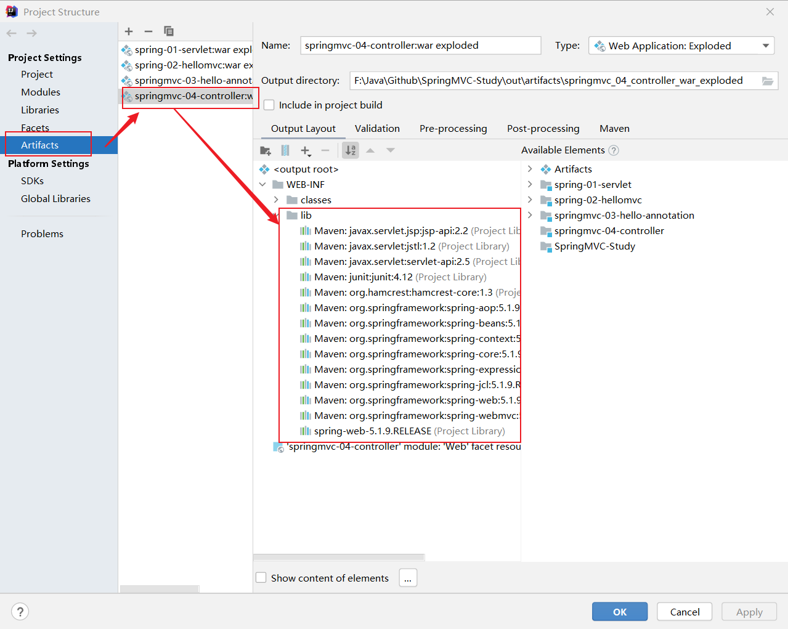

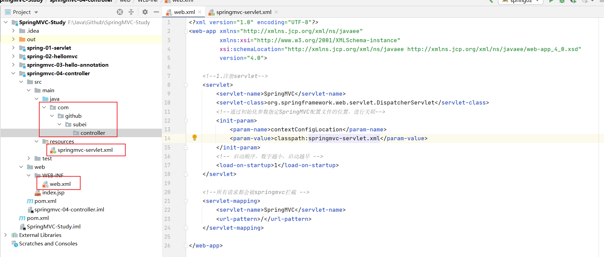

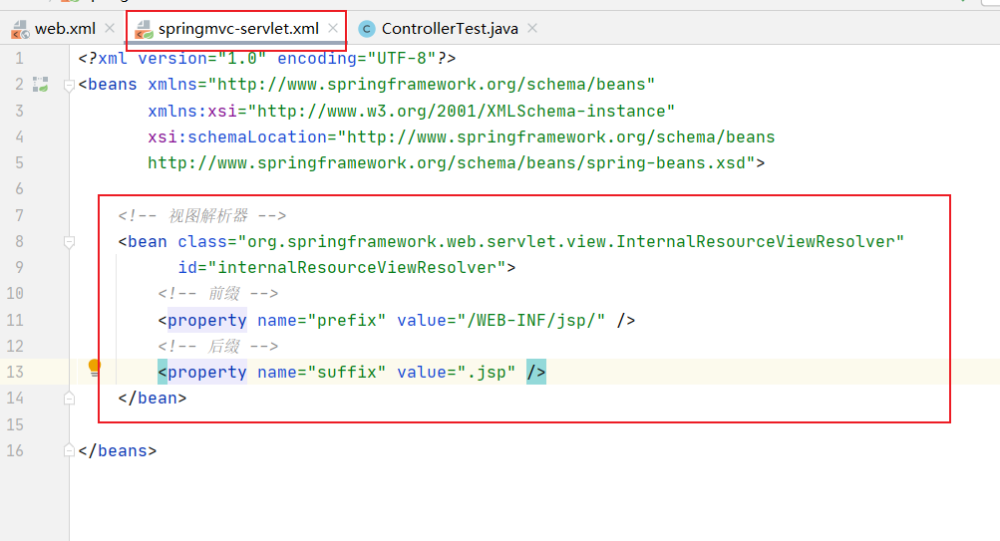

- web.xml

```xml
<?xml version="1.0" encoding="UTF-8"?>
<web-app xmlns="http://xmlns.jcp.org/xml/ns/javaee"
         xmlns:xsi="http://www.w3.org/2001/XMLSchema-instance"
         xsi:schemaLocation="http://xmlns.jcp.org/xml/ns/javaee http://xmlns.jcp.org/xml/ns/javaee/web-app_4_0.xsd"
         version="4.0">

    <!--1.注册servlet-->
    <servlet>
        <servlet-name>SpringMVC</servlet-name>
        <servlet-class>org.springframework.web.servlet.DispatcherServlet</servlet-class>
        <!--通过初始化参数指定SpringMVC配置文件的位置，进行关联-->
        <init-param>
            <param-name>contextConfigLocation</param-name>
            <param-value>classpath:springmvc-servlet.xml</param-value>
        </init-param>
        <!-- 启动顺序，数字越小，启动越早 -->
        <load-on-startup>1</load-on-startup>
    </servlet>

    <!--所有请求都会被springmvc拦截 -->
    <servlet-mapping>
        <servlet-name>SpringMVC</servlet-name>
        <url-pattern>/</url-pattern>
    </servlet-mapping>

</web-app>
```

- springmvc-servlet.xml，mvc的配置文件只留下视图解析器！

```xml
<?xml version="1.0" encoding="UTF-8"?>
<beans xmlns="http://www.springframework.org/schema/beans"
       xmlns:xsi="http://www.w3.org/2001/XMLSchema-instance"
       xsi:schemaLocation="http://www.springframework.org/schema/beans
       http://www.springframework.org/schema/beans/spring-beans.xsd">

    <!-- 视图解析器 -->
    <bean class="org.springframework.web.servlet.view.InternalResourceViewResolver"
          id="internalResourceViewResolver">
        <!-- 前缀 -->
        <property name="prefix" value="/WEB-INF/jsp/" />
        <!-- 后缀 -->
        <property name="suffix" value=".jsp" />
    </bean>

</beans>
```

2. 编写一个Controller类，ControllerTest.java

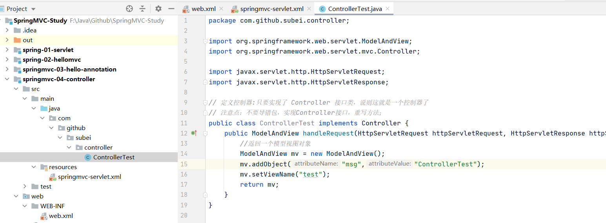

```java
package com.github.subei.controller;

import org.springframework.web.servlet.ModelAndView;
import org.springframework.web.servlet.mvc.Controller;

import javax.servlet.http.HttpServletRequest;
import javax.servlet.http.HttpServletResponse;

// 定义控制器:只要实现了 Controller 接口类，说则这就是一个控制器了
// 注意点：不要导错包，实现Controller接口，重写方法；
public class ControllerTest implements Controller {
    public ModelAndView handleRequest(HttpServletRequest httpServletRequest, HttpServletResponse httpServletResponse) throws Exception {
        //返回一个模型视图对象
        ModelAndView mv = new ModelAndView();
        mv.addObject("msg","ControllerTest");
        mv.setViewName("test");
        return mv;
    }
}
```

3. 编写完毕后，去Spring配置文件中注册请求的bean；name对应请求路径，class对应处理请求的类。

   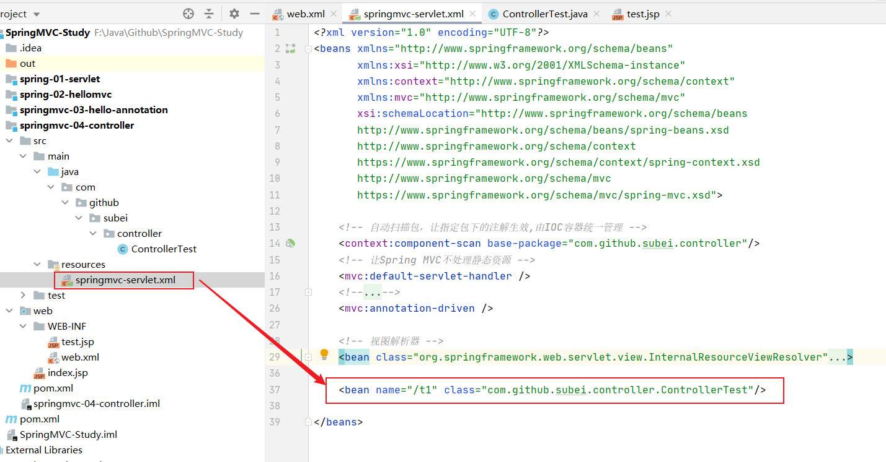

   ```xml
       <bean name="/t1" class="com.github.subei.controller.ControllerTest"/>
   ```

4. 编写前端test.jsp，注意在WEB-INF/jsp目录下编写，方便对应视图解析器。

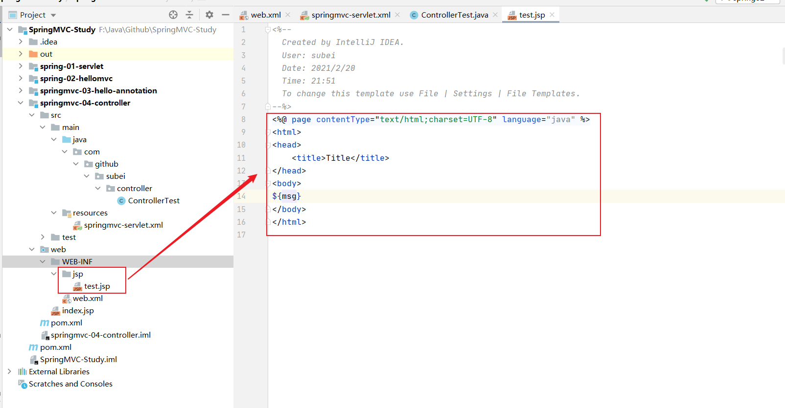

```jsp
<%@ page contentType="text/html;charset=UTF-8" language="java" %>
<html>
<head>
    <title>Title</title>
</head>
<body>
${msg}
</body>
</html>
```

5. 配置Tomcat运行测试，我这里项目发布名配置是/springmvc_04，如果没写，只是一个 / ，则请求不用加项目名，直接运行即可。不影响！


- 测试访问路径：http://localhost:8080/springmvc_04/t1
- 测试成功！！！

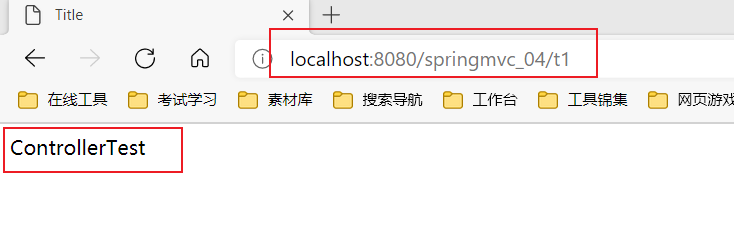

- ==注==
  - 实现接口Controller定义控制器是较老的办法；
  - 缺点是：一个控制器中只有一个方法，如果要多个方法则需要定义多个Controller；定义的方式比较麻烦。

### 3.使用注解@Controller

- @Controller注解类型用于声明Spring类的实例是一个控制器；

1. Spring可以使用扫描机制来找到应用程序中所有基于注解的控制器类，为了保证Spring能找到你的控制器，需要在配置文件中声明组件扫描。

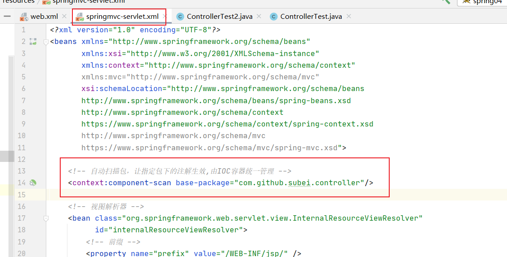

```xml
    <!-- 自动扫描包，让指定包下的注解生效,由IOC容器统一管理 -->
    <context:component-scan base-package="com.github.subei.controller"/>
```

2. 增加一个ControllerTest2类，使用注解实现； 

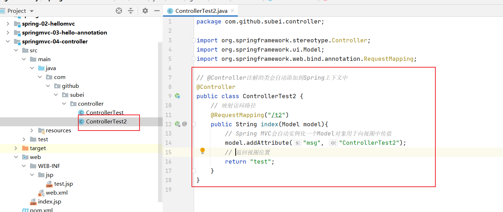

```java
package com.github.subei.controller;

import org.springframework.stereotype.Controller;
import org.springframework.ui.Model;
import org.springframework.web.bind.annotation.RequestMapping;

@Controller//代表这个类会被spring接管
// 被这个注解的类，中的所有方法，如果返问值是string，并且有具体页面可以跳转，那么就会被视图解析器解析；
public class ControllerTest2 {
    // 映射访问路径
    @RequestMapping("/t2")
    public String index(Model model){
        // Spring MVC会自动实例化一个Model对象用于向视图中传值
        model.addAttribute("msg", "ControllerTest2");
        // 返回视图位置
        return "test";
    }
}
```

3. 运行tomcat测试。测试路径：http://localhost:8080/springmvc_04/t2

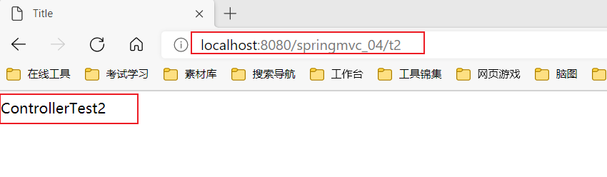

**可以发现：两个请求都可以指向一个视图，但是页面结果的结果是不一样的，从这里可以看出视图是被复用的，而控制器与视图之间是弱偶合关系。**

> **注解方式是平时使用的最多的方式！**

### 4.RequestMapping

> **@RequestMapping**

- @RequestMapping注解用于映射url到控制器类或一个特定的处理程序方法。可用于类或方法上。用于类上，表示类中的所有响应请求的方法都是以该地址作为父路径。
- 只注解在方法上面。

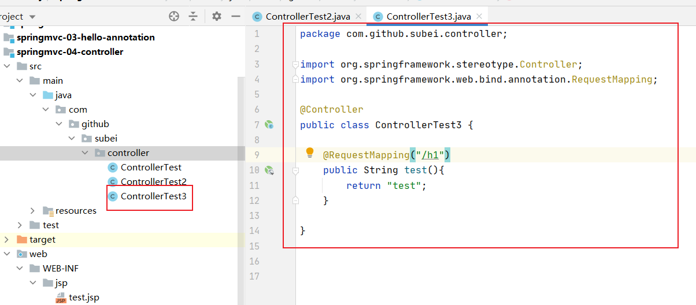

```java
package com.github.subei.controller;

import org.springframework.stereotype.Controller;
import org.springframework.web.bind.annotation.RequestMapping;

@Controller
public class ControllerTest3 {

    @RequestMapping("/h1")
    public String test(){
        return "test";
    }

}
```

- 访问路径：http://localhost:8080 / 项目名 /h1
- http://localhost:8080/springmvc_04/h1


- 同时注解类与方法 

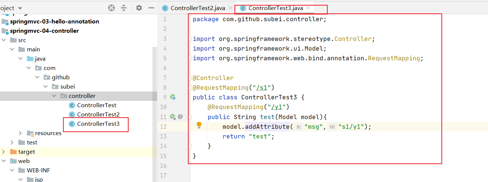

```java
package com.github.subei.controller;

import org.springframework.stereotype.Controller;
import org.springframework.ui.Model;
import org.springframework.web.bind.annotation.RequestMapping;

@Controller
@RequestMapping("/s1")
public class ControllerTest3 {
    @RequestMapping("/y1")
    public String test(Model model){
        model.addAttribute("msg","s1/y1");
        return "test";
    }
}
```

- 访问路径：http://localhost:8080 / 项目名/ s1/y1  , 需要先指定类的路径再指定方法的路径； 
- http://localhost:8080/springmvc_04/s1/y1

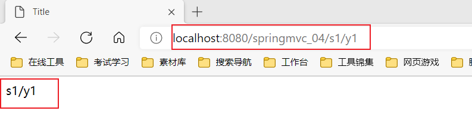

### 5.RestFul

> Restful就是一个资源定位及资源操作的风格。不是标准也不是协议，只是一种风格。基于这个风格设计的软件可以更简洁，更有层次，更易于实现缓存等机制。

---

> **功能**

- 资源：互联网所有的事物都可以被抽象为资源；
- 资源操作：使用POST、DELETE、PUT、GET，使用不同方法对资源进行操作。分别对应 添加、 删除、修改、查询。

> **传统方式操作资源**  ：通过不同的参数来实现不同的效果！方法单一，post 和 get

- http://127.0.0.1/item/queryItem.action?id=1 查询,GET
- http://127.0.0.1/item/saveItem.action 新增,POST
- http://127.0.0.1/item/updateItem.action 更新,POST
- http://127.0.0.1/item/deleteItem.action?id=1 删除,GET或POST

> **使用RESTful操作资源** ：可以通过不同的请求方式来实现不同的效果！如下：请求地址一样，但是功能可以不同！

- http://127.0.0.1/item/1 查询,GET
- http://127.0.0.1/item 新增,POST
- http://127.0.0.1/item 更新,PUT
- http://127.0.0.1/item/1 删除,DELETE

> 案例测试

1. 再新建一个类 RestFulController。

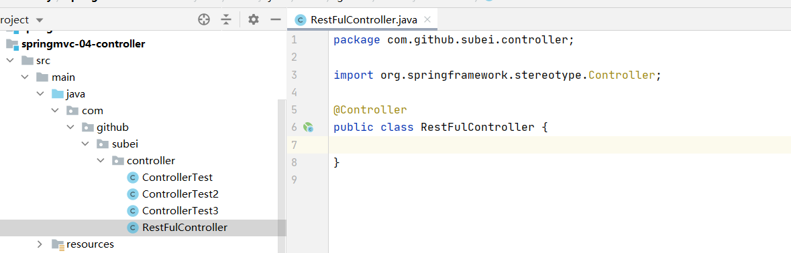

```java
package com.github.subei.controller;

import org.springframework.stereotype.Controller;

@Controller
public class RestFulController {
    
}
```

- 原来的方式！

```java
package com.github.subei.controller;

import org.springframework.stereotype.Controller;
import org.springframework.ui.Model;
import org.springframework.web.bind.annotation.RequestMapping;

@Controller
public class RestFulController {

    // 原来的：http://localhost:8080/springmvc_04/add?p1=1&p2=9

    // 映射访问路径
    @RequestMapping("/add")
    public String index( int p1, int p2, Model model){

        int result = p1+p2;
        // Spring MVC会自动实例化一个Model对象用于向视图中传值
        model.addAttribute("msg", "加法结果："+result);
        // 返回视图位置
        return "test";

    }
}
```

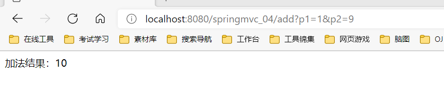


2. 在Spring MVC中可以使用  @PathVariable 注解，让方法参数的值对应绑定到一个URI模板变量上。 

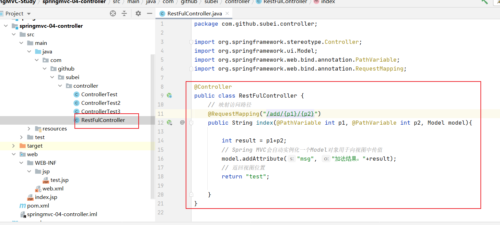

```java
package com.github.subei.controller;

import org.springframework.stereotype.Controller;
import org.springframework.ui.Model;
import org.springframework.web.bind.annotation.PathVariable;
import org.springframework.web.bind.annotation.RequestMapping;

@Controller
public class RestFulController {

    // 原来的：http://localhost:8080/springmvc_04/add?p1=1&p2=9
    // 现在的：http://localhost:8080/springmvc_04/add/45/66

    @RequestMapping("/add/{p1}/{p2}")
    public String index(@PathVariable int p1, @PathVariable int p2, Model model){

        int result = p1+p2;
        // Spring MVC会自动实例化一个Model对象用于向视图中传值
        model.addAttribute("msg", "加法结果："+result);
        // 返回视图位置
        return "test";

    }
}
```

3. 测试请求并查看。 

- http://localhost:8080/springmvc_04/add/45/66

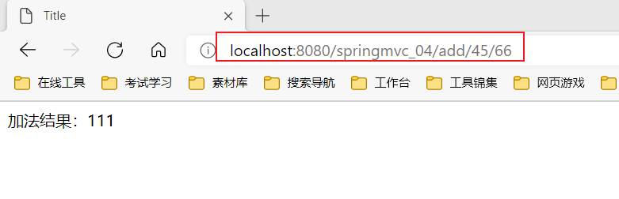

> 思考：使用路径变量的好处？

   - 使路径变得更加简洁；
   - 获得参数更加方便，框架会自动进行类型转换。
   - 通过路径变量的类型可以约束访问参数，如果类型不一样，则访问不到对应的请求方法，如这里访问是的路径是/add/9/k，则路径与方法不匹配，而不会是参数转换失败。

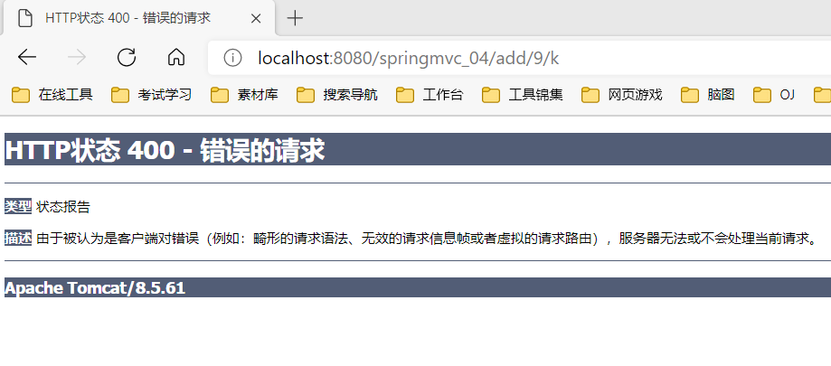

4. 修改下对应的参数类型，再次测试 

```java
package com.github.subei.controller;

import org.springframework.stereotype.Controller;
import org.springframework.ui.Model;
import org.springframework.web.bind.annotation.PathVariable;
import org.springframework.web.bind.annotation.RequestMapping;

@Controller
public class RestFulController {

    // 原来的：http://localhost:8080/springmvc_04/add?p1=1&p2=9
    // 现在的：http://localhost:8080/springmvc_04/add/45/66

    @RequestMapping("/add/{p1}/{p2}")
    public String index(@PathVariable int p1, @PathVariable String p2, Model model){

        String result = p1+p2;
        // Spring MVC会自动实例化一个Model对象用于向视图中传值
        model.addAttribute("msg", "字符结果："+result);
        // 返回视图位置
        return "test";

    }
}
```

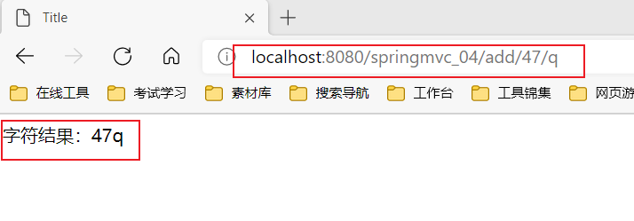

> **使用method属性指定请求类型**

- 用于约束请求的类型，可以收窄请求范围。指定请求谓词的类型如GET, POST, HEAD, OPTIONS, PUT, PATCH, DELETE, TRACE等。

> 案例测试：

- 增加一个方法

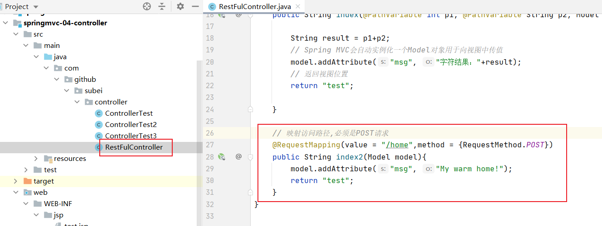

```java
    // 映射访问路径,必须是POST请求
    @RequestMapping(value = "/home",method = {RequestMethod.POST})
    public String index2(Model model){
        model.addAttribute("msg", "My warm home!");
        return "test";
    }
```

- 使用浏览器地址栏进行访问默认是Get请求，会报错405： 

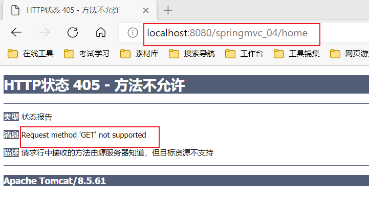

- 将POST修改为GET则正常了； 

```java
    // 映射访问路径,必须是GET请求
    @RequestMapping(value = "/home",method = {RequestMethod.GET})
    public String index2(Model model){
        model.addAttribute("msg", "My warm home!");
        return "test";
    }
```


> Spring MVC 的 @RequestMapping 注解能够处理 HTTP 请求的方法, 比如 GET, PUT, POST, DELETE 以及 PATCH。

- **所有的地址栏请求默认都会是 HTTP GET 类型的。**
- 方法级别的注解变体有如下几个：组合注解

```java
@GetMapping
@PostMapping
@PutMapping
@DeleteMapping
@PatchMapping
```

> @GetMapping 是一个组合注解，平时使用的会比较多！它所扮演的是 @RequestMapping(method =RequestMethod.GET) 的一个快捷方式。

### 6.每个程序员都要知道的：小黄鸭调试法

> 转载自《程序员的那些事》

花了一下午（或一天）在试图解决某个 Bug，后来才知道解决方案很简单，当时就是没有想到。

有个同事正好路过，看到你愁眉苦脸的，问你“怎么了呀？”

“噢，是这样的。我遇到了一个问题，点击这个控件的时……” 当你正准备和同事详细解释的时候，突然灵光一现，你话都没说完，就中断了和同事的倾诉，继续干活了。

同事微微一笑，又走开了。他并没有怪你。

---

「程序员的那些事」主页君相信大家都有类似的经历。遇到 Bug/问题被卡住了，拉个人过来，和他 blablabla 讲了一通，很多时候中途你就找到了解决办法。

有时候，并不一定要和人倾诉，还可以像其他东西倾诉，强迫自己把遇到的问题，详细地解释出来（一定要说出来）。

其实呢。这种方法，有一个术语：**小黄鸭调试法**（Rubber Duck Debugging）。

> 维基百科有解释：小黄鸭调试法是软件工程中使用的调试代码方法之一。就是**在程序的调试、纠错或测试过程中，耐心地向小黄鸭解释每一行程序的作用，以此来激发灵感**。

**名称由来**

此概念是参照于一个故事。故事中程序大师随身携带一只小黄鸭，在调试代码的时候会在桌上放上这只小黄鸭，然后详细地向鸭子解释每行代码。

  

## 5、数据处理及跳转

### 1.ModelAndView

- 设置ModelAndView对象 , 根据view的名称 , 和视图解析器跳到指定的页面；
- 页面 : {视图解析器前缀} + viewName +{视图解析器后缀}

```xml
<!-- 视图解析器 -->
<bean class="org.springframework.web.servlet.view.InternalResourceViewResolver"
     id="internalResourceViewResolver">
   <!-- 前缀 -->
   <property name="prefix" value="/WEB-INF/jsp/" />
   <!-- 后缀 -->
   <property name="suffix" value=".jsp" />
</bean>
```

- 对应的controller类 

```java
public class ControllerTest implements Controller {

   public ModelAndView handleRequest(HttpServletRequest httpServletRequest, HttpServletResponse httpServletResponse) throws Exception {
       // 返回一个模型视图对象
       ModelAndView mv = new ModelAndView();
       mv.addObject("msg","ControllerTest1");
       mv.setViewName("test");
       return mv;
  }
}
```

### 2.ServletAPI

> 通过设置ServletAPI , 不需要视图解析器。

1. 通过HttpServletResponse进行输出；
2. 通过HttpServletResponse实现重定向；
3. 通过HttpServletResponse实现转发。

```java
package com.github.subei.controller;

import org.springframework.stereotype.Controller;
import org.springframework.web.bind.annotation.RequestMapping;

import javax.servlet.http.HttpServletRequest;
import javax.servlet.http.HttpServletResponse;
import javax.servlet.http.HttpSession;
import java.io.IOException;

@Controller
public class ModelTest1 {

    @RequestMapping("/m1/t1")
    public String test(HttpServletRequest request, HttpServletResponse response){
        HttpSession session = request.getSession();
        System.out.println(session.getId());
        return "test";
    }

    @RequestMapping("/m2/t1")
    public void test1(HttpServletRequest req, HttpServletResponse rsp) throws IOException {
        rsp.getWriter().println("Hello,Spring BY servlet API");
    }

    @RequestMapping("/m2/t2")
    public void test2(HttpServletRequest req, HttpServletResponse rsp) throws IOException {
        rsp.sendRedirect("/index.jsp");
    }

    @RequestMapping("/m2/t3")
    public void test3(HttpServletRequest req, HttpServletResponse rsp) throws Exception {
        // 转发
        req.setAttribute("msg","/result/t3");
        req.getRequestDispatcher("/WEB-INF/jsp/test.jsp").forward(req,rsp);
    }
}
```

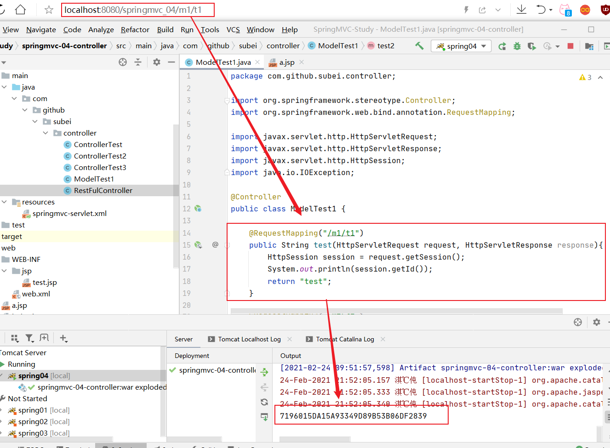

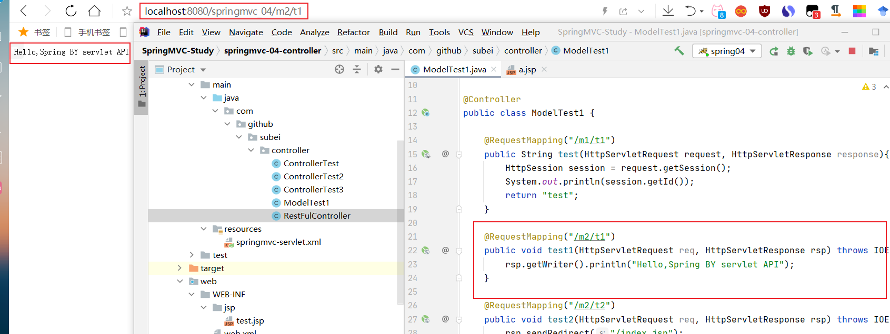

### 3.SpringMVC

> **通过SpringMVC来实现转发和重定向 - 无需视图解析器；**

- 测试前，需要将视图解析器注释掉。

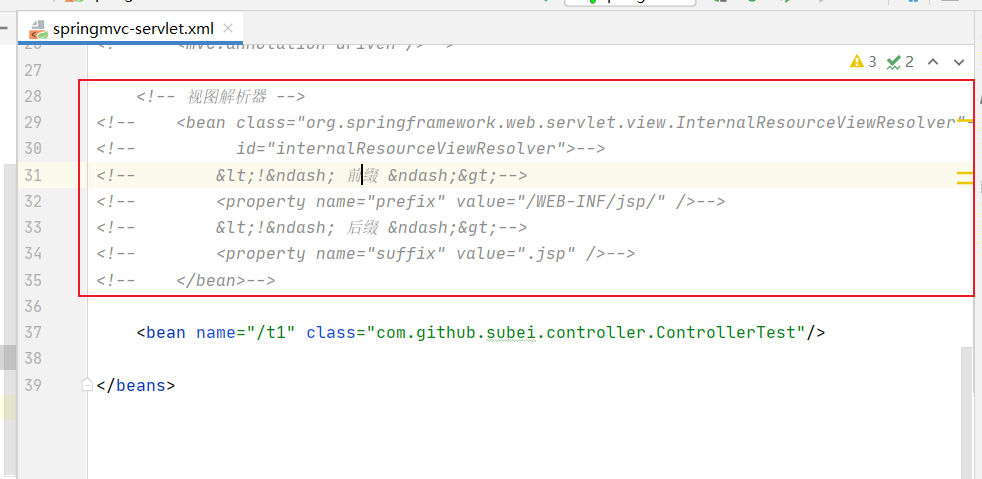

```java
package com.github.subei.controller;

import org.springframework.stereotype.Controller;
import org.springframework.ui.Model;
import org.springframework.web.bind.annotation.RequestMapping;

@Controller
public class ResultSpringMVC {
    @RequestMapping("/k1/t1")
    public String test(Model model){
        model.addAttribute("msg","ResultSpringMVC1");
        // 转发
        return "/WEB-INF/jsp/test.jsp";
    }

    @RequestMapping("/k1/t2")
    public String test2(Model model){
        // 转发2
        model.addAttribute("msg","ResultSpringMVC2");
        return "forward:/WEB-INF/jsp/test.jsp";
    }

    @RequestMapping("/k1/t3")
    public String test3(Model model){
        // 重定向
        model.addAttribute("msg","ResultSpringMVC3");
        return "redirect:/index.jsp";
    }
}
```

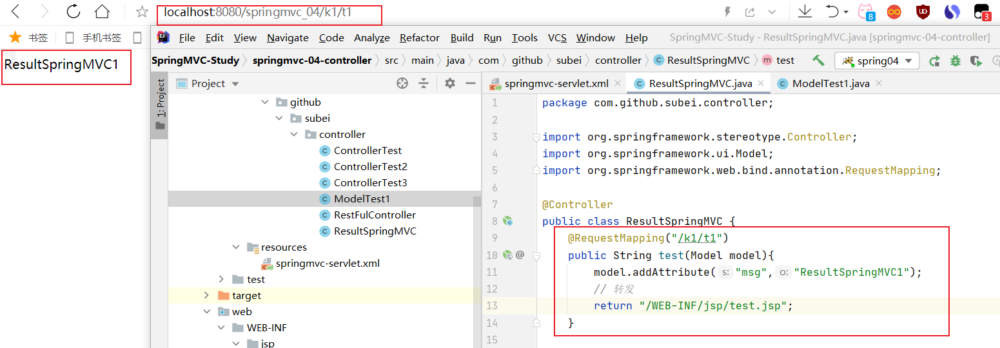

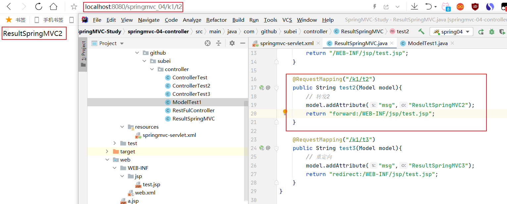

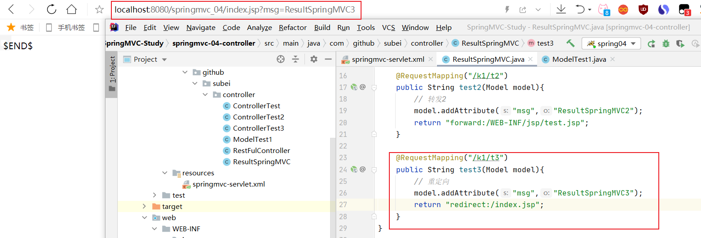

> **通过SpringMVC来实现转发和重定向 - 有视图解析器；**

- 重定向 , 不需要视图解析器 , 本质就是重新请求一个新地方嘛 , 所以注意路径问题。
- 可以重定向到另外一个请求实现。

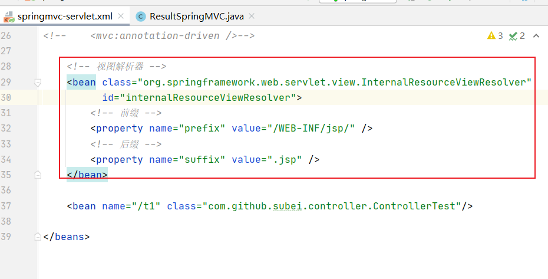

```java
package com.github.subei.controller;

import org.springframework.stereotype.Controller;
import org.springframework.ui.Model;
import org.springframework.web.bind.annotation.RequestMapping;

@Controller
public class ResultSpringMVC {

    @RequestMapping("/p1/t1")
    public String test4(Model model){
        // 转发
        model.addAttribute("msg","ResultSpringMVC4");
        return "test";
    }

    @RequestMapping("/p1/t2")
    public String test5(Model model){
        // 重定向
        model.addAttribute("msg","ResultSpringMVC5");
        return "redirect:/index.jsp";
        //return "redirect:hello.do"; //hello.do为另一个请求/
    }
}
```

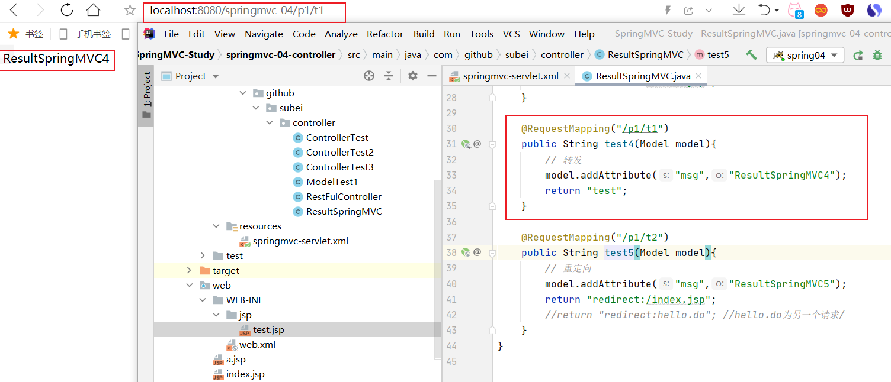

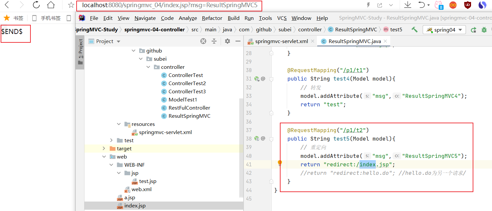

### 4.处理提交数据

> **1、提交的域名称和处理方法的参数名一致**

- 提交数据 : http://localhost:8080/springmvc_04/user/t1?name=subei
- 处理方法 :

```java
package com.github.subei.controller;

import org.springframework.stereotype.Controller;
import org.springframework.ui.Model;
import org.springframework.web.bind.annotation.GetMapping;
import org.springframework.web.bind.annotation.RequestMapping;

@Controller
@RequestMapping("user")
public class UserController {

    @GetMapping("/t1")
    public String test(String name, Model model){
        // 1.接收前端参数
        System.out.println("接收到前端的参数为:" + name);
        // 2.将返回的值传递给前端
        model.addAttribute("msg","name");
        // 3.跳转视图
        return "test";
    }
}
```

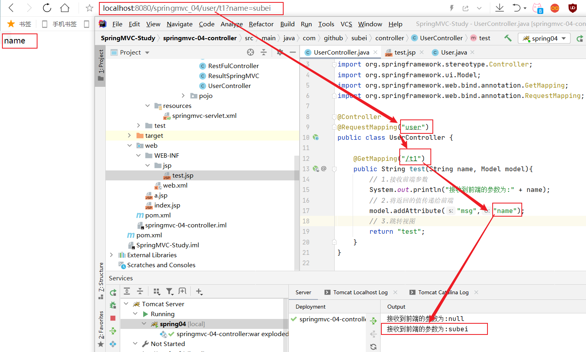

> **2、提交的域名称和处理方法的参数名不一致**

- 提交数据 : http://localhost:8080/springmvc_04/user/t2?username=subei
- 处理方法 :

```java
package com.github.subei.controller;

import org.springframework.stereotype.Controller;
import org.springframework.ui.Model;
import org.springframework.web.bind.annotation.GetMapping;
import org.springframework.web.bind.annotation.RequestMapping;
import org.springframework.web.bind.annotation.RequestParam;

@Controller
@RequestMapping("user")
public class UserController {

    // @RequestParam("username") : username提交的域的名称 .
    @GetMapping("/t2")
    public String hello(@RequestParam("username") String name, Model model){
        // 1.接收前端参数
        System.out.println("接收到前端的参数为:" + name);
        // 2.将返回的值传递给前端
        model.addAttribute("msg","username");
        // 3.跳转视图
        return "test";
    }
}
```

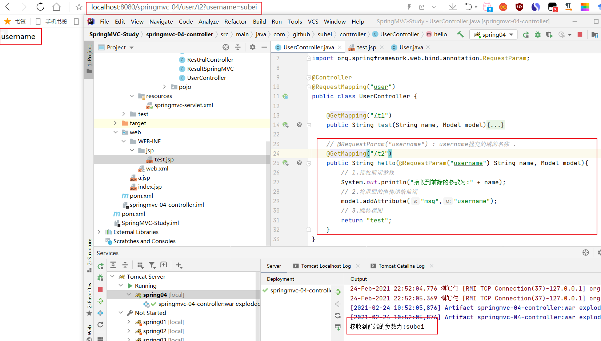

> **3、提交的是一个对象**

- 要求提交的表单域和对象的属性名一致  , 参数使用对象即可

1. 实体类

```java
package com.github.subei.pojo;

public class User {
    private int id;
    private String name;
    private int age;

    public int getId() {
        return id;
    }

    public void setId(int id) {
        this.id = id;
    }

    public String getName() {
        return name;
    }

    public void setName(String name) {
        this.name = name;
    }

    public int getAge() {
        return age;
    }

    public void setAge(int age) {
        this.age = age;
    }

    public User() {
    }

    public User(int id, String name, int age) {
        this.id = id;
        this.name = name;
        this.age = age;
    }

    @Override
    public String toString() {
        return "User{" +
                "id=" + id +
                ", name='" + name + '\'' +
                ", age=" + age +
                '}';
    }
}
```

2. 提交数据：http://localhost:8080/springmvc_04/user/t3?name=subei&id=4&age=21

3. 处理方法 :

```java
package com.github.subei.controller;

import com.github.subei.pojo.User;
import org.springframework.stereotype.Controller;
import org.springframework.ui.Model;
import org.springframework.web.bind.annotation.GetMapping;
import org.springframework.web.bind.annotation.RequestMapping;
import org.springframework.web.bind.annotation.RequestParam;

@Controller
@RequestMapping("user")
public class UserController {

    @GetMapping("/t3")
    public String user(User user, Model model){
        // 1.接收前端参数
        System.out.println("接收到前端的参数为:" + user);
        // 2.将返回的值传递给前端
        model.addAttribute("msg","user");
        // 3.跳转视图
        return "test";
    }
}
```

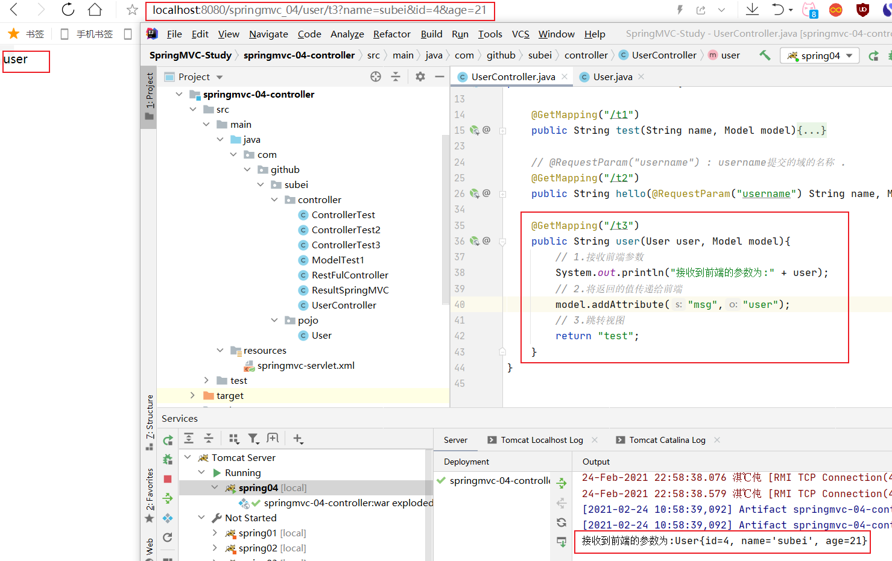

> 说明：如果使用对象的话，**前端传递的参数名和对象名必须一致**，否则就是null。 

----

### 5.数据显示到前端

> **第一种 : 通过ModelAndView**，最普遍的一种。

```java
public class ControllerTest implements Controller {
    public ModelAndView handleRequest(HttpServletRequest httpServletRequest, HttpServletResponse httpServletResponse) throws Exception {
        // 返回一个模型视图对象
        ModelAndView mv = new ModelAndView();
        mv.addObject("msg","ControllerTest");
        mv.setViewName("test");
        return mv;
    }
}
```

> **第二种 : 通过Model**

```java
    @GetMapping("/t2")
    public String hello(@RequestParam("username") String name, Model model){
        // 封装要显示到视图中的数据
        // 相当于req.setAttribute("name",name);
        // 1.接收前端参数
        System.out.println("接收到前端的参数为:" + name);
        // 2.将返回的值传递给前端
        model.addAttribute("msg","username");
        // 3.跳转视图
        return "test";
    }
```

> **第三种 : 通过ModelMap** 

```java
package com.github.subei.controller;

import com.github.subei.pojo.User;
import org.springframework.stereotype.Controller;
import org.springframework.ui.Model;
import org.springframework.ui.ModelMap;
import org.springframework.web.bind.annotation.GetMapping;
import org.springframework.web.bind.annotation.RequestMapping;
import org.springframework.web.bind.annotation.RequestParam;

@Controller
@RequestMapping("user")
public class UserController {

    @GetMapping("/t4")
    public String test2(@RequestParam("username") String name, ModelMap model){
        // 封装要显示到视图中的数据
        // 相当于req.setAttribute("name",name);
        // 1.接收前端参数
        System.out.println("接收到前端的参数为:" + name);
        // 2.将返回的值传递给前端
        model.addAttribute("msg","username2");
        // 3.跳转视图
        return "test";
    }
}

```

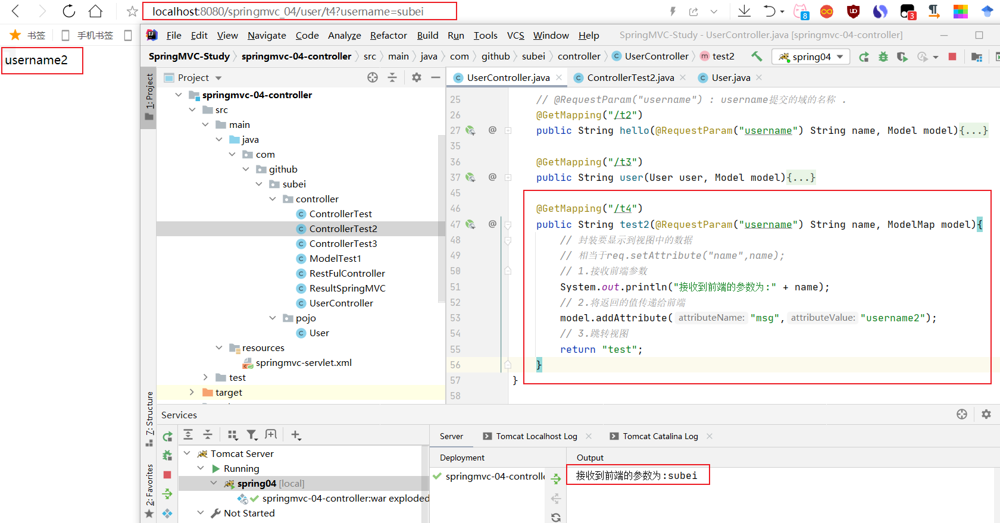

----

> 简单来说使用区别就是： 

- Model 只有寥寥几个方法只适合用于储存数据，简化了新手对于Model对象的操作和理解；
- ==ModelMap 继承了 LinkedMap==，除了实现了自身的一些方法，同样的继承 LinkedMap 的方法和特性；
- ModelAndView 可以在储存数据的同时，可以进行设置返回的逻辑视图，进行控制展示层的跳转。

> ==**请使用80%的时间打好扎实的基础，剩下18%的时间研究框架，2%的时间去学点英文，框架的官方文档永远是最好的教程。**==

### 6.乱码问题

> 案例

1. 在首页编写一个提交的表单。 

```jsp
<%@ page contentType="text/html;charset=UTF-8" language="java" %>
<html>
<head>
    <title>Title</title>
</head>
<body>
<form action="/springmvc_04/e/t1" method="post">
    <input type="text" name="name">
    <input type="submit">
</form>
</body>
</html>
```

2. 在后台编写对应的处理类。

```java
package com.github.subei.controller;

import org.springframework.stereotype.Controller;
import org.springframework.ui.Model;
import org.springframework.web.bind.annotation.PostMapping;

@Controller
public class EncodingController {
    @PostMapping("/e/t1")
    public String test(Model model, String name){
        // 获取表单提交的值
        model.addAttribute("msg",name);
        // 跳转到test页面显示输入的值
        return "test";
    }
}
```

3. 输入中文测试，发现乱码。

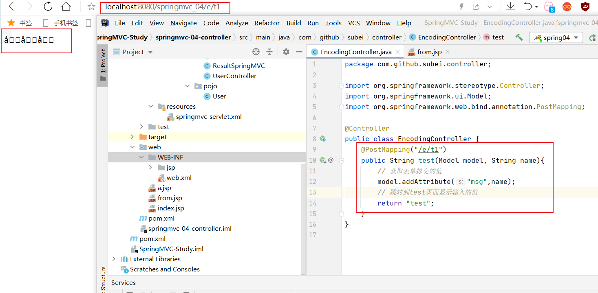

>以前乱码问题通过过滤器解决 , 而SpringMVC给我们提供了一个过滤器 , 可以在web.xml中配置。

- 修改web.xml文件，重启服务器！

```xml
    <filter>
        <filter-name>encoding</filter-name>
        <filter-class>org.springframework.web.filter.CharacterEncodingFilter</filter-class>
        <init-param>
            <param-name>encoding</param-name>
            <param-value>utf-8</param-value>
        </init-param>
    </filter>
    <filter-mapping>
        <filter-name>encoding</filter-name>
        <url-pattern>/*</url-pattern>
    </filter-mapping>
```

- 但是会发现：有些极端情况下，这个过滤器对get的支持不好。
- 处理方法 :

1. 修改tomcat配置文件，设置编码！ 

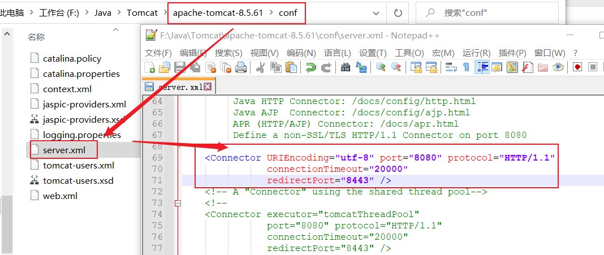

```xml
<Connector URIEncoding="utf-8" port="8080" protocol="HTTP/1.1"
          connectionTimeout="20000"
          redirectPort="8443" />
```

2. 自定义过滤器，修改web.xml文件

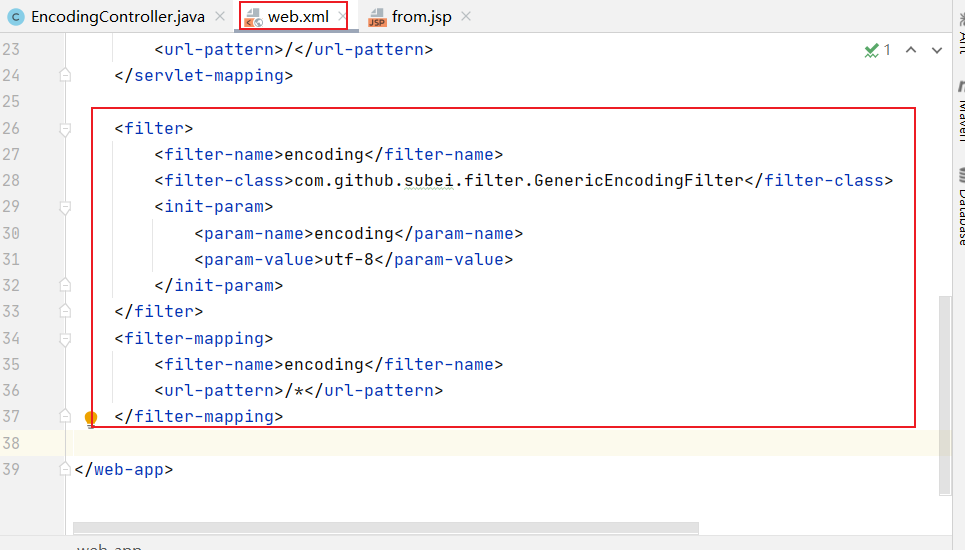

```java
package com.github.subei.filter;

import javax.servlet.*;
import javax.servlet.http.HttpServletRequest;
import javax.servlet.http.HttpServletRequestWrapper;
import javax.servlet.http.HttpServletResponse;
import java.io.IOException;
import java.io.UnsupportedEncodingException;
import java.util.Map;

/**
 * 解决get和post请求 全部乱码的过滤器
 */
public class GenericEncodingFilter implements Filter {
    
    public void destroy() {
    }
    
    public void doFilter(ServletRequest request, ServletResponse response, FilterChain chain) throws IOException, ServletException {
        // 处理response的字符编码
        HttpServletResponse myResponse=(HttpServletResponse) response;
        myResponse.setContentType("text/html;charset=UTF-8");

        // 转型为与协议相关对象
        HttpServletRequest httpServletRequest = (HttpServletRequest) request;
        // 对request包装增强
        HttpServletRequest myrequest = new MyRequest(httpServletRequest);
        chain.doFilter(myrequest, response);
    }

    public void init(FilterConfig filterConfig) throws ServletException {
    }

}

// 自定义request对象，HttpServletRequest的包装类
class MyRequest extends HttpServletRequestWrapper {

    private HttpServletRequest request;
    // 是否编码的标记
    private boolean hasEncode;
    // 定义一个可以传入HttpServletRequest对象的构造函数，以便对其进行装饰
    public MyRequest(HttpServletRequest request) {
        super(request);// super必须写
        this.request = request;
    }

    // 对需要增强方法 进行覆盖
    @Override
    public Map getParameterMap() {
        // 先获得请求方式
        String method = request.getMethod();
        if (method.equalsIgnoreCase("post")) {
            // post请求
            try {
                // 处理post乱码
                request.setCharacterEncoding("utf-8");
                return request.getParameterMap();
            } catch (UnsupportedEncodingException e) {
                e.printStackTrace();
            }
        } else if (method.equalsIgnoreCase("get")) {
            // get请求
            Map<String, String[]> parameterMap = request.getParameterMap();
            if (!hasEncode) { // 确保get手动编码逻辑只运行一次
                for (String parameterName : parameterMap.keySet()) {
                    String[] values = parameterMap.get(parameterName);
                    if (values != null) {
                        for (int i = 0; i < values.length; i++) {
                            try {
                                // 处理get乱码
                                values[i] = new String(values[i]
                                        .getBytes("ISO-8859-1"), "utf-8");
                            } catch (UnsupportedEncodingException e) {
                                e.printStackTrace();
                            }
                        }
                    }
                }
                hasEncode = true;
            }
            return parameterMap;
        }
        return super.getParameterMap();
    }

    // 取一个值
    @Override
    public String getParameter(String name) {
        Map<String, String[]> parameterMap = getParameterMap();
        String[] values = parameterMap.get(name);
        if (values == null) {
            return null;
        }
        return values[0]; // 取回参数的第一个值
    }

    // 取所有值
    @Override
    public String[] getParameterValues(String name) {
        Map<String, String[]> parameterMap = getParameterMap();
        String[] values = parameterMap.get(name);
        return values;
    }
}
```

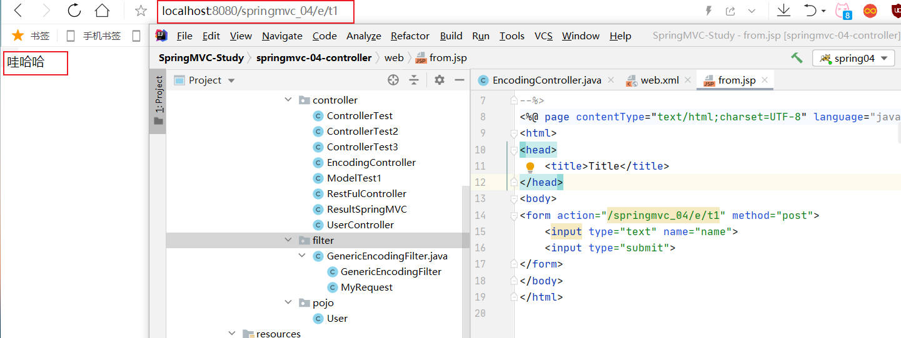

>- 一般情况下，SpringMVC默认的乱码处理就已经能够很好的解决了
>- **然后在web.xml中配置这个过滤器即可！**
>- 乱码问题，需要平时多注意，在尽可能能设置编码的地方，都设置为统一编码 UTF-8！

## 6、Json交互处理

### 1.Json 

> 什么是JSON？

- JSON(JavaScript Object Notation, JS 对象标记) 是一种轻量级的数据交换格式，目前使用特别广泛。
- 采用完全独立于编程语言的**文本格式**来存储和表示数据。
- 简洁和清晰的层次结构使得 JSON 成为理想的数据交换语言。
- 易于人阅读和编写，同时也易于机器解析和生成，并有效地提升网络传输效率。

> 在 JavaScript 语言中，一切都是对象。因此，任何JavaScript 支持的类型都可以通过 JSON 来表示，例如字符串、数字、对象、数组等。看看他的要求和语法格式：

- 对象表示为键值对，数据由逗号分隔
- 花括号保存对象
- 方括号保存数组

> **JSON 键值对**是用来保存 JavaScript 对象的一种方式，和 JavaScript 对象的写法也大同小异，键/值对组合中的键名写在前面并用双引号 "" 包裹，使用冒号 : 分隔，然后紧接着值：

```js
{"name": "subei"}
{"age": "4"}
{"sex": "man"}
```

---

> JSON 和 JavaScript 对象的关系：

- JSON 是 JavaScript 对象的字符串表示法，它使用文本表示一个 JS 对象的信息，本质是一个字符串。 

```js
var obj = {a: 'Hello', b: 'World'}; // 这是一个对象，注意键名也是可以使用引号包裹的
var json = '{"a": "Hello", "b": "World"}'; // 这是一个 JSON 字符串，本质是一个字符串
```

>**JSON 和 JavaScript 对象互转**

- 要实现从JSON字符串转换为JavaScript 对象，使用 JSON.parse() 方法：

```js
var obj = JSON.parse('{"a": "Hello", "b": "World"}');
// 结果是 {a: 'Hello', b: 'World'}
```

- 要实现从JavaScript 对象转换为JSON字符串，使用 JSON.stringify() 方法： 

```js
var json = JSON.stringify({a: 'Hello', b: 'World'});
// 结果是 '{"a": "Hello", "b": "World"}'
```


----

### 2.JSON案例

1. 新建一个module，springmvc-05-json ， 添加web的支持

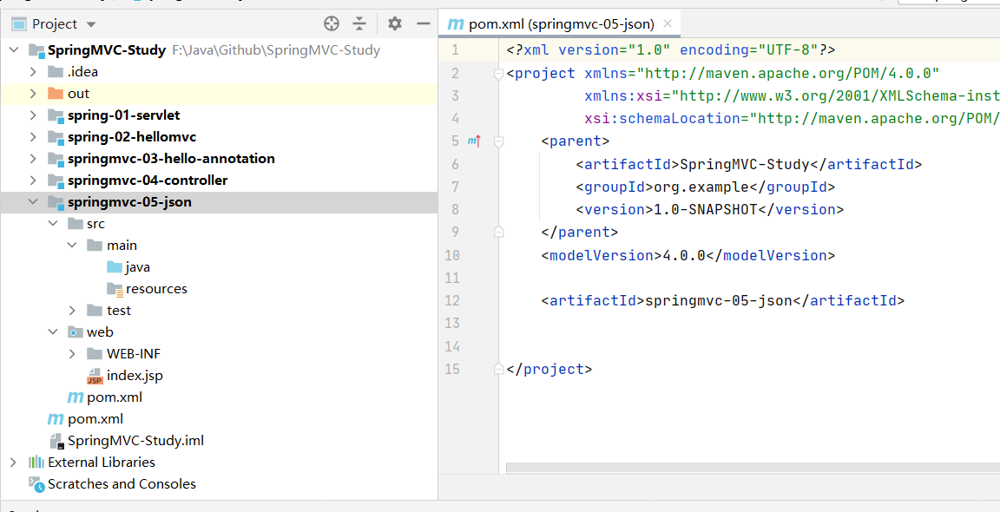

2. 在web目录下新建一个 jsontest.html ， 编写测试内容：

```html
<!DOCTYPE html>
<html lang="en">
<head>
    <meta charset="UTF-8">
    <title>JSON_苏北</title>
</head>
<body>

<script type="text/javascript">
    // 编写一个JavaScript对象
    var user = {
        name:"subei",
        age:4,
        sex:"man"
    }
    console.log(user);
</script>

</body>
</html>
```

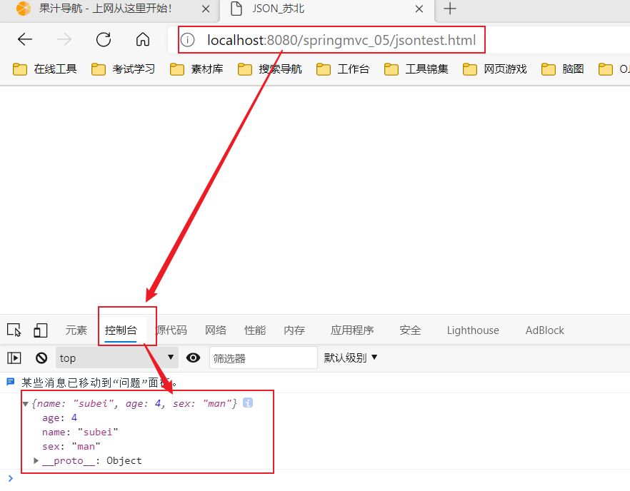

- 将js对象转换为json对象

```html
<!DOCTYPE html>
<html lang="en">
<head>
    <meta charset="UTF-8">
    <title>JSON_苏北</title>
</head>
<body>

<script type="text/javascript">
    // 编写一个JavaScript对象
    var user = {
        name:"subei",
        age:4,
        sex:"man"
    }
    // 将js对象转换为json对象
    var json = JSON.stringify(user);
    console.log(json);

    console.log(user);
</script>

</body>
</html>
```

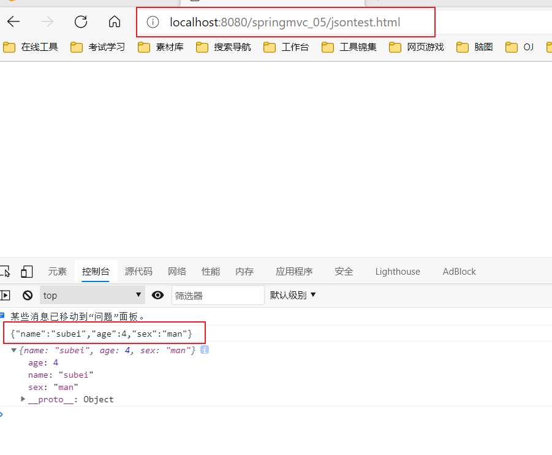

- 将JSON字符串转换为JavaScript对象

```html
<!DOCTYPE html>
<html lang="en">
<head>
    <meta charset="UTF-8">
    <title>JSON_苏北</title>
</head>
<body>

<script type="text/javascript">
    // 编写一个JavaScript对象
    var user = {
        name:"subei",
        age:4,
        sex:"man"
    }
    console.log(user);

    // 将js对象转换为json对象
    var json = JSON.stringify(user);
    console.log(json);

    console.log("------------------");

    // 将JSON字符串转换为JavaScript对象
    var obj = JSON.parse(json);
    console.log(obj);

</script>

</body>
</html>
```

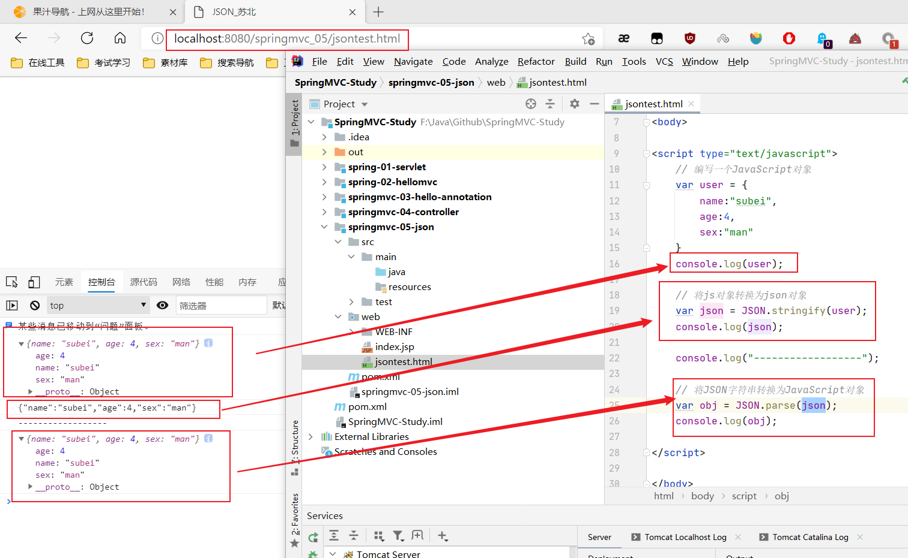

### 3.Jackson使用
> Jackson应该是一种使用比较好的json解析工具。 类似工具很多，如阿里巴巴的 fastjson 等 ，不做过多赘述！

#### 1.案例说明

1. 导入它的jar包到pom.xml； 

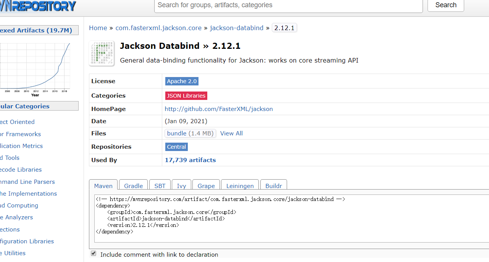

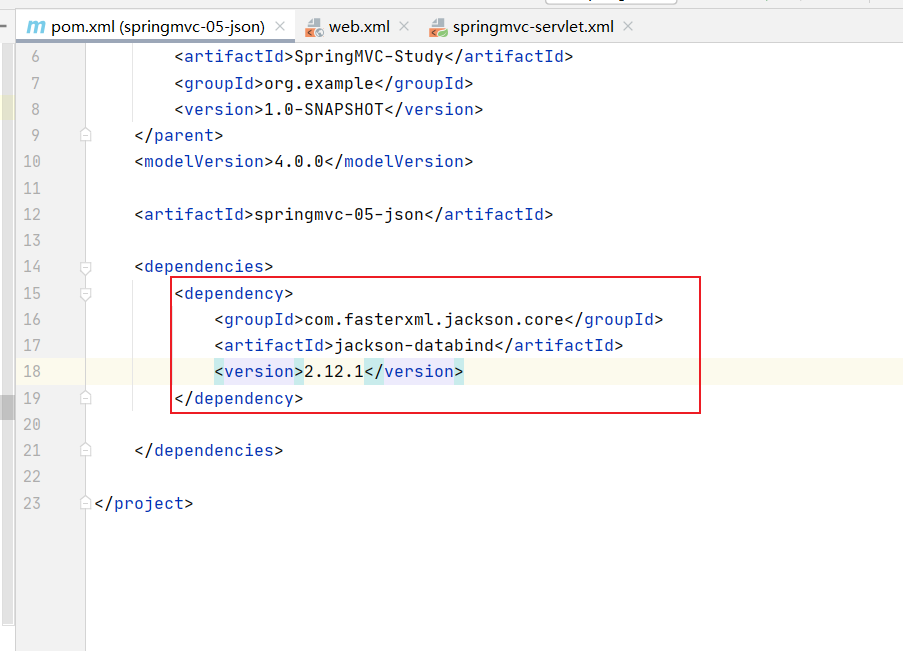

```xml
    <dependencies>
        <dependency>
            <groupId>com.fasterxml.jackson.core</groupId>
            <artifactId>jackson-databind</artifactId>
            <version>2.12.1</version>
        </dependency>
    </dependencies>
```

2. 配置SpringMVC需要的配置：web.xml

```xml
<?xml version="1.0" encoding="UTF-8"?>
<web-app xmlns="http://xmlns.jcp.org/xml/ns/javaee"
         xmlns:xsi="http://www.w3.org/2001/XMLSchema-instance"
         xsi:schemaLocation="http://xmlns.jcp.org/xml/ns/javaee http://xmlns.jcp.org/xml/ns/javaee/web-app_4_0.xsd"
         version="4.0">

    <!--1.注册servlet-->
    <servlet>
        <servlet-name>SpringMVC</servlet-name>
        <servlet-class>org.springframework.web.servlet.DispatcherServlet</servlet-class>
        <!--通过初始化参数指定SpringMVC配置文件的位置，进行关联-->
        <init-param>
            <param-name>contextConfigLocation</param-name>
            <param-value>classpath:springmvc-servlet.xml</param-value>
        </init-param>
        <!-- 启动顺序，数字越小，启动越早 -->
        <load-on-startup>1</load-on-startup>
    </servlet>

    <!--所有请求都会被springmvc拦截 -->
    <servlet-mapping>
        <servlet-name>SpringMVC</servlet-name>
        <url-pattern>/</url-pattern>
    </servlet-mapping>

    <filter>
        <filter-name>encoding</filter-name>
        <filter-class>org.springframework.web.filter.CharacterEncodingFilter</filter-class>
        <init-param>
            <param-name>encoding</param-name>
            <param-value>utf-8</param-value>
        </init-param>
    </filter>
    <filter-mapping>
        <filter-name>encoding</filter-name>
        <url-pattern>/</url-pattern>
    </filter-mapping>

</web-app>
```

3. 创建相关Java包，和springmvc-servlet.xml文件。

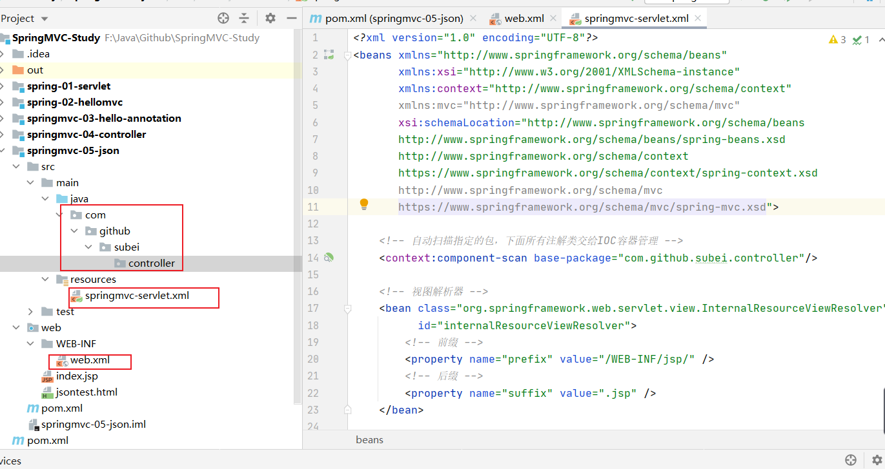

```xml
<?xml version="1.0" encoding="UTF-8"?>
<beans xmlns="http://www.springframework.org/schema/beans"
       xmlns:xsi="http://www.w3.org/2001/XMLSchema-instance"
       xmlns:context="http://www.springframework.org/schema/context"
       xmlns:mvc="http://www.springframework.org/schema/mvc"
       xsi:schemaLocation="http://www.springframework.org/schema/beans
       http://www.springframework.org/schema/beans/spring-beans.xsd
       http://www.springframework.org/schema/context
       https://www.springframework.org/schema/context/spring-context.xsd
       http://www.springframework.org/schema/mvc
       https://www.springframework.org/schema/mvc/spring-mvc.xsd">

    <!-- 自动扫描指定的包，下面所有注解类交给IOC容器管理 -->
    <context:component-scan base-package="com.github.subei.controller"/>

    <!-- 视图解析器 -->
    <bean class="org.springframework.web.servlet.view.InternalResourceViewResolver"
          id="internalResourceViewResolver">
        <!-- 前缀 -->
        <property name="prefix" value="/WEB-INF/jsp/" />
        <!-- 后缀 -->
        <property name="suffix" value=".jsp" />
    </bean>

</beans>
```

4. 编写一个User的实体类，然后去编写的测试Controller；

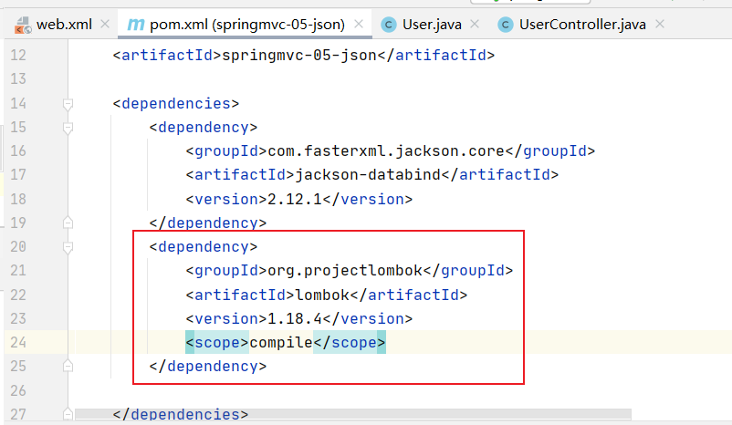

```java
package com.github.subei.pojo;

import lombok.AllArgsConstructor;
import lombok.Data;
import lombok.NoArgsConstructor;

@Data
@AllArgsConstructor
@NoArgsConstructor
public class User {
    private String name;
    private int age;
    private String sex;

}
```

5. 编写一个Controller； 

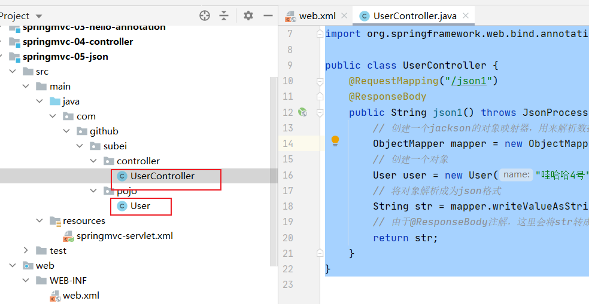

```java
package com.github.subei.controller;

import com.fasterxml.jackson.core.JsonProcessingException;
import com.fasterxml.jackson.databind.ObjectMapper;
import com.github.subei.pojo.User;
import org.springframework.stereotype.Controller;
import org.springframework.web.bind.annotation.RequestMapping;
import org.springframework.web.bind.annotation.ResponseBody;

@Controller
public class UserController {
    @RequestMapping("/j1")
    @ResponseBody
    public String json1() throws JsonProcessingException {
        // 创建一个jackson的对象映射器，用来解析数据
        ObjectMapper mapper = new ObjectMapper();
        // 创建一个对象
        User user = new User("哇哈哈4号", 22, "man");
        // 将对象解析成为json格式
        String str = mapper.writeValueAsString(user);
        // 由于@ResponseBody注解，这里会将str转成json格式返回；十分方便
        return str;
    }
}
```

6. 配置Tomcat ， 启动测试：http://localhost:8080/springmvc_05/j1

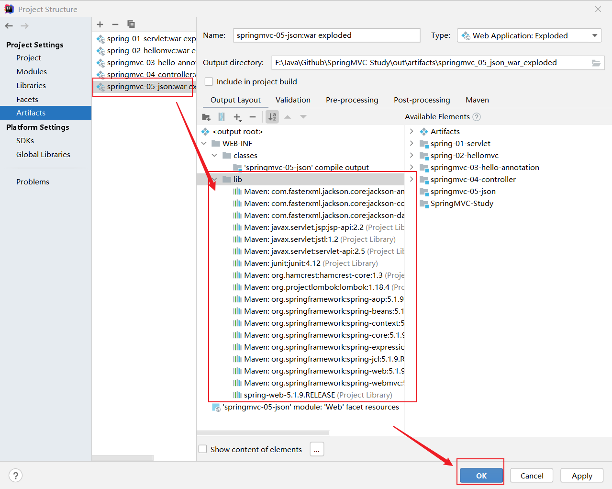

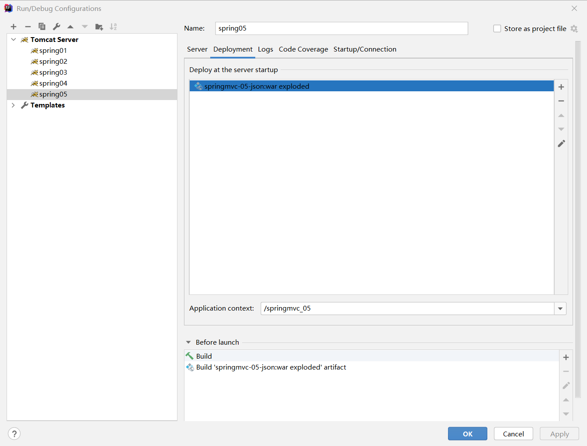

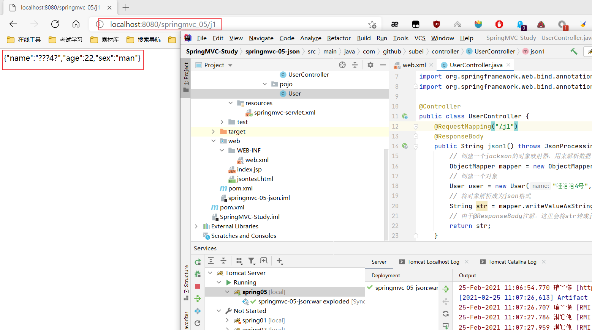

7. 发现出现了乱码问题，需要设置一下它的编码格式为utf-8，以及它返回的类型； 

> 通过@RequestMaping的produces属性来实现，修改下代码 

```java
    // produces:指定响应体返回类型和编码
    @RequestMapping(value = "/j1",produces = "application/json;charset=utf-8")
```

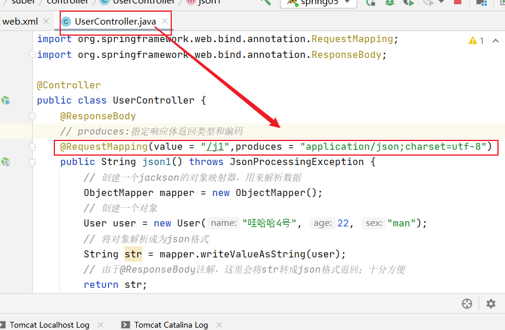

8. 再次测试，乱码问题解决！ 

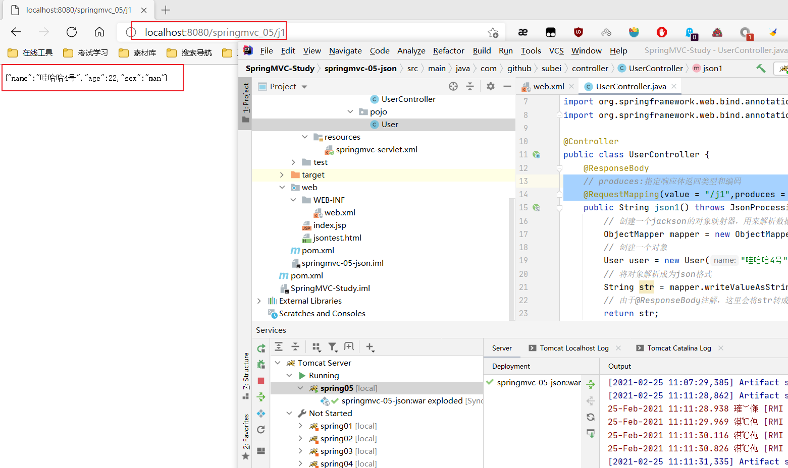

> ==注意：使用json记得处理乱码问题==。

----

#### 2.代码优化

1. **乱码统一解决**

- 上一种方法比较麻烦，如果项目中有许多请求则每一个都要添加，可以通过Spring配置统一指定，这样就不用每次都去处理了！
- 我们可以在springmvc的配置文件上添加一段消息StringHttpMessageConverter转换配置！

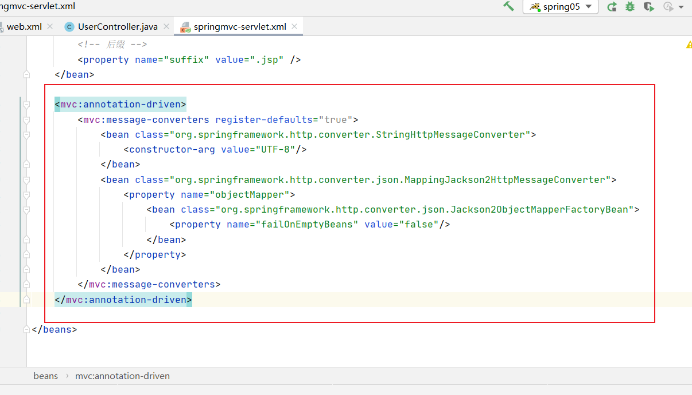

```xml
    <!-- JSON乱码问题 -->
    <mvc:annotation-driven>
        <mvc:message-converters register-defaults="true">
            <bean class="org.springframework.http.converter.StringHttpMessageConverter">
                <constructor-arg value="UTF-8"/>
            </bean>
            <bean class="org.springframework.http.converter.json.MappingJackson2HttpMessageConverter">
                <property name="objectMapper">
                    <bean class="org.springframework.http.converter.json.Jackson2ObjectMapperFactoryBean">
                        <property name="failOnEmptyBeans" value="false"/>
                    </bean>
                </property>
            </bean>
        </mvc:message-converters>
    </mvc:annotation-driven>
```

2. **返回json字符串统一解决**

- 在类上直接使用 **@RestController** ，这样子，里面所有的方法都只会返回 json 字符串了，不用再每一个都添加@ResponseBody ！我们在前后端分离开发中，一般都使用 @RestController ，十分便捷！

```java
package com.github.subei.controller;

import com.fasterxml.jackson.core.JsonProcessingException;
import com.fasterxml.jackson.databind.ObjectMapper;
import com.github.subei.pojo.User;
import org.springframework.stereotype.Controller;
import org.springframework.web.bind.annotation.RequestMapping;
import org.springframework.web.bind.annotation.ResponseBody;
import org.springframework.web.bind.annotation.RestController;

@Controller
@RestController
public class UserController {
    @ResponseBody
    // produces:指定响应体返回类型和编码
    @RequestMapping(value = "/j1")
    public String json1() throws JsonProcessingException {
        // 创建一个jackson的对象映射器，用来解析数据
        ObjectMapper mapper = new ObjectMapper();
        // 创建一个对象
        User user = new User("哇哈哈4号", 22, "man");
        // 将对象解析成为json格式
        String str = mapper.writeValueAsString(user);
        // 由于@ResponseBody注解，这里会将str转成json格式返回；十分方便
        return str;
    }
}
```

- 启动tomcat测试 

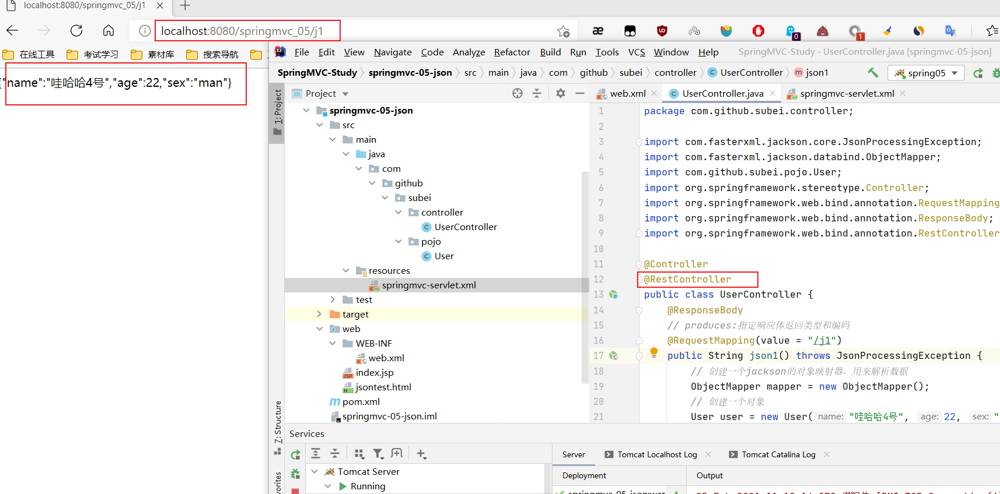

-----

#### 3.测试集合输出 

1. 增加一个新的方法

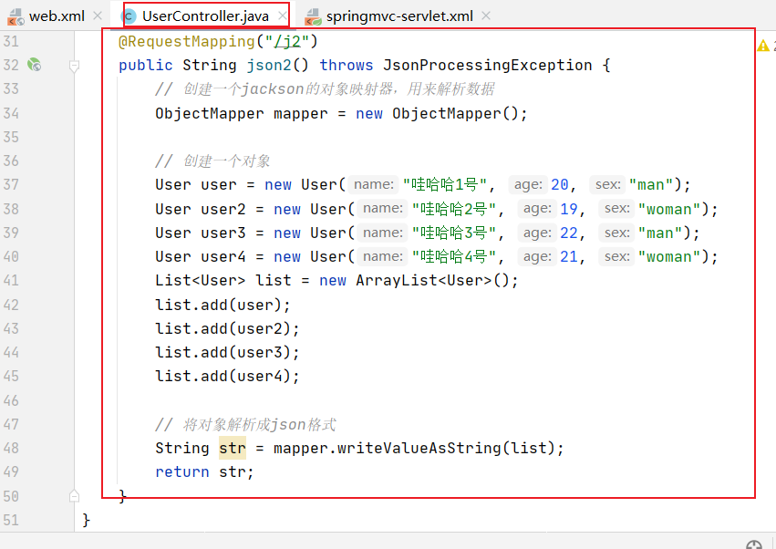

```java
    @RequestMapping("/j2")
    public String json2() throws JsonProcessingException {
        // 创建一个jackson的对象映射器，用来解析数据
        ObjectMapper mapper = new ObjectMapper();
        
        // 创建一个对象
        User user = new User("哇哈哈1号", 20, "man");
        User user2 = new User("哇哈哈2号", 19, "woman");
        User user3 = new User("哇哈哈3号", 22, "man");
        User user4 = new User("哇哈哈4号", 21, "woman");
        List<User> list = new ArrayList<User>();
        list.add(user);
        list.add(user2);
        list.add(user3);
        list.add(user4);

        // 将对象解析成json格式
        String str = mapper.writeValueAsString(list);
        return str;
    }
```

- 代码测试！

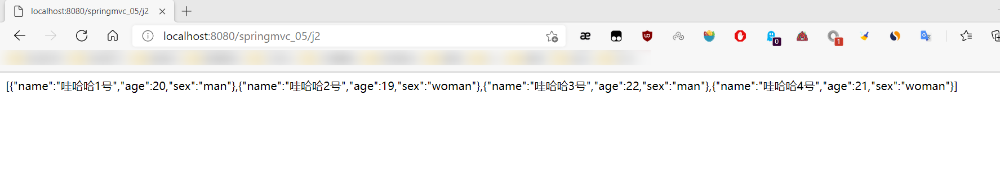

----

#### 4.输出时间对象

- 增加一个新的方法 

```java
    @RequestMapping("/j3")
    public String json3() throws JsonProcessingException {

        ObjectMapper mapper = new ObjectMapper();

        // 创建时间一个对象，java.util.Date
        Date date = new Date();
        // 将对象解析成json格式
        String str = mapper.writeValueAsString(date);
        return str;
    }
```

- 代码测试！

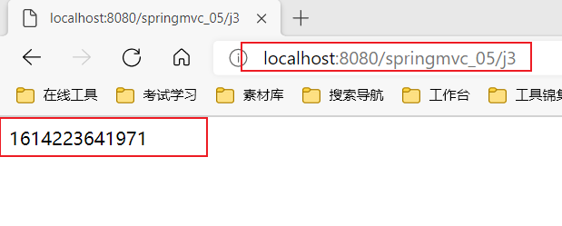

- 默认日期格式会变成一个数字，是1970年1月1日到当前日期的毫秒数！
- Jackson 默认是会把时间转成timestamps形式。

> **解决方案：取消timestamps形式 ， 自定义时间格式**。

- 在UserController.java中添加如下代码：

```java
    @RequestMapping("/j4")
    public String json4() throws JsonProcessingException {

        ObjectMapper mapper = new ObjectMapper();

        // 不使用时间戳的方式
        mapper.configure(SerializationFeature.WRITE_DATES_AS_TIMESTAMPS, false);
        // 自定义日期格式对象
        SimpleDateFormat sdf = new SimpleDateFormat("yyyy-MM-dd HH:mm:ss");
        // 设置指定日期格式
        mapper.setDateFormat(sdf);

        Date date = new Date();
        String str = mapper.writeValueAsString(date);
        return str;
    }
```

- 代码测试！

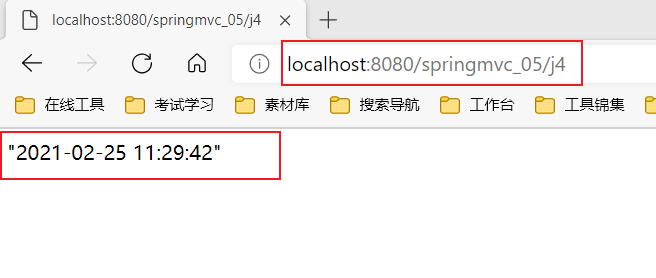

---

#### 5.抽取上述方法为工具类 

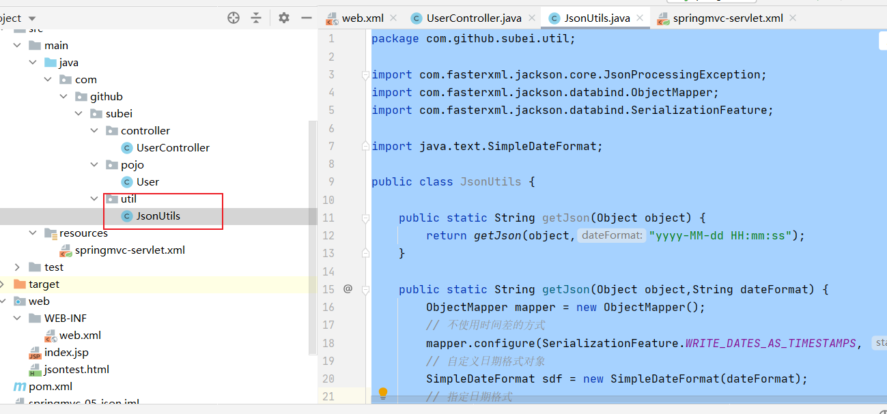

```java
package com.github.subei.util;

import com.fasterxml.jackson.core.JsonProcessingException;
import com.fasterxml.jackson.databind.ObjectMapper;
import com.fasterxml.jackson.databind.SerializationFeature;

import java.text.SimpleDateFormat;

public class JsonUtils {

    public static String getJson(Object object) {
        return getJson(object,"yyyy-MM-dd HH:mm:ss");
    }

    public static String getJson(Object object,String dateFormat) {
        ObjectMapper mapper = new ObjectMapper();
        // 不使用时间差的方式
        mapper.configure(SerializationFeature.WRITE_DATES_AS_TIMESTAMPS, false);
        // 自定义日期格式对象
        SimpleDateFormat sdf = new SimpleDateFormat(dateFormat);
        // 指定日期格式
        mapper.setDateFormat(sdf);
        try {
            return mapper.writeValueAsString(object);
        } catch (JsonProcessingException e) {
            e.printStackTrace();
        }
        return null;
    }
}
```

- 在Java中调用工具类。

```java
    @RequestMapping("/j5")
    public String json5() throws JsonProcessingException {
        Date date = new Date();
        String json = JsonUtils.getJson(date);
        return json;
    }
```

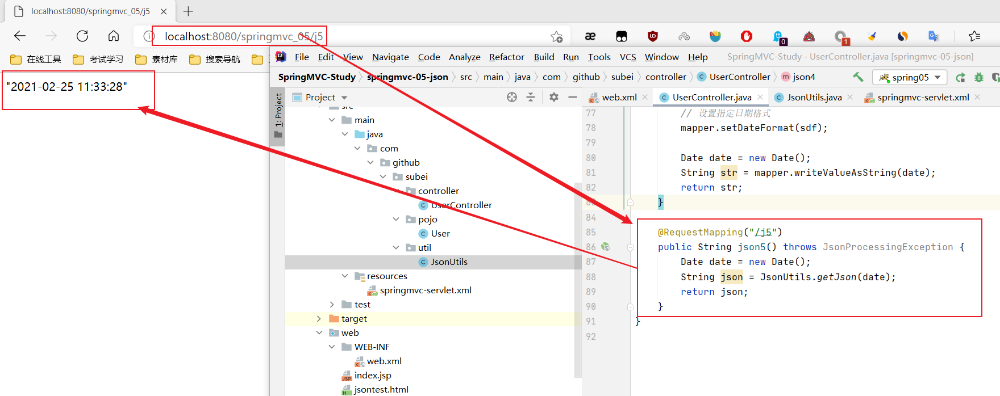

### 4.FastJson

> [fastjson.jar](https://mvnrepository.com/artifact/com.alibaba/fastjson)是阿里开发的一款专门用于Java开发的包，可以方便的实现json对象与JavaBean对象的转换，实现JavaBean对象与json字符串的转换，实现json对象与json字符串的转换。实现json的转换方法很多，最后的实现结果都是一样的。 

- fastjson的pom依赖！ 

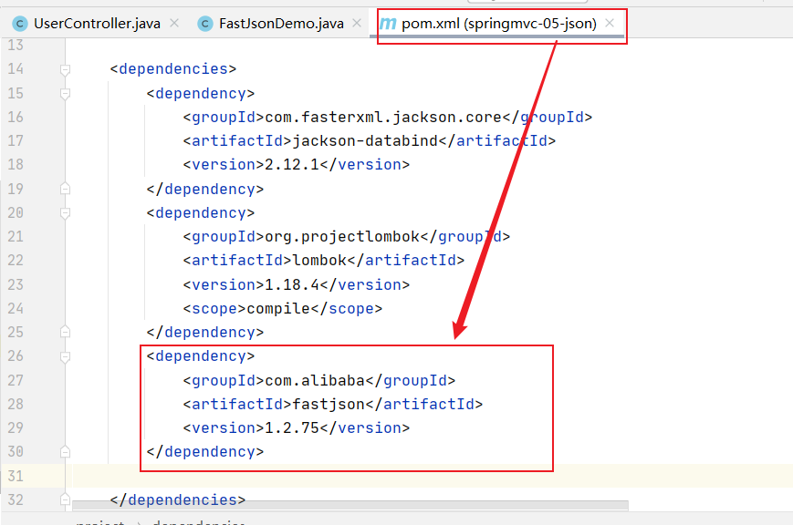

```xml
<!-- https://mvnrepository.com/artifact/com.alibaba/fastjson -->
<dependency>
    <groupId>com.alibaba</groupId>
    <artifactId>fastjson</artifactId>
    <version>1.2.75</version>
</dependency>
```

> fastjson 三个主要的类：

**JSONObject  代表 json 对象** 

- JSONObject实现了Map接口, 猜想 JSONObject底层操作是由Map实现的。
- JSONObject对应json对象，通过各种形式的get()方法可以获取json对象中的数据，也可利用诸如size()，isEmpty()等方法获取"键：值"对的个数和判断是否为空。其本质是通过实现Map接口并调用接口中的方法完成的。

**JSONArray  代表 json 对象数组**

- 内部是有List接口中的方法来完成操作的。

**JSON代表 JSONObject和JSONArray的转化**

- JSON类源码分析与使用
- 仔细观察这些方法，主要是实现json对象，json对象数组，javabean对象，json字符串之间的相互转化。

----

> 代码测试，**新建一个FastJsonDemo 类**。

```java
package com.github.subei.controller;

import com.alibaba.fastjson.JSON;
import com.alibaba.fastjson.JSONObject;
import com.github.subei.pojo.User;

import java.util.ArrayList;
import java.util.List;

public class FastJsonDemo {
    public static void main(String[] args) {
        // 创建一个对象
        User user = new User("哇哈哈1号", 20, "man");
        User user2 = new User("哇哈哈2号", 19, "woman");
        User user3 = new User("哇哈哈3号", 22, "man");
        User user4 = new User("哇哈哈4号", 21, "woman");
        List<User> list = new ArrayList<User>();
        list.add(user);
        list.add(user2);
        list.add(user3);
        list.add(user4);

        System.out.println("*******Java对象 转 JSON字符串*******");
        String str1 = JSON.toJSONString(list);
        System.out.println("JSON.toJSONString(list)==>"+str1);
        String str2 = JSON.toJSONString(user);
        System.out.println("JSON.toJSONString(user1)==>"+str2);

        System.out.println("\n****** JSON字符串 转 Java对象*******");
        User jp_user1=JSON.parseObject(str2,User.class);
        System.out.println("JSON.parseObject(str2,User.class)==>"+jp_user1);

        System.out.println("\n****** Java对象 转 JSON对象 ******");
        JSONObject jsonObject1 = (JSONObject) JSON.toJSON(user2);
        System.out.println("(JSONObject) JSON.toJSON(user2)==>"+jsonObject1.getString("name"));

        System.out.println("\n****** JSON对象 转 Java对象 ******");
        User to_java_user = JSON.toJavaObject(jsonObject1, User.class);
        System.out.println("JSON.toJavaObject(jsonObject1, User.class)==>"+to_java_user);
    }
}
```

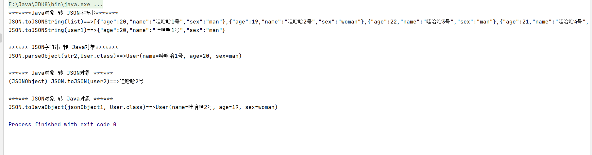

> 这种工具类，只需要掌握使用就好了，在使用的时候在根据具体的业务去找对应的实现。 

## 7、整合SSM框架

> 环境要求：

- IDEA 2020.2
- MySQL 5.7.19
- Tomcat 8.5
- Maven 3.6

> 技术要求：

- 需要熟练掌握MySQL数据库，Spring，JavaWeb及MyBatis知识，简单的前端知识；

> 数据库环境：

  创建一个存放书籍数据的数据库表：

```mysql
CREATE DATABASE `ssmbuild`;
USE `ssmbuild`;
DROP TABLE
IF
	EXISTS `books`;
CREATE TABLE `books` (
	`bookID` INT ( 10 ) NOT NULL AUTO_INCREMENT COMMENT '书id',
	`bookName` VARCHAR ( 100 ) NOT NULL COMMENT '书名',
	`bookCounts` INT ( 11 ) NOT NULL COMMENT '数量',
	`detail` VARCHAR ( 200 ) NOT NULL COMMENT '描述',
	KEY `bookID` ( `bookID` ) 
) ENGINE = INNODB DEFAULT CHARSET = utf8;

INSERT INTO `books` ( `bookID`, `bookName`, `bookCounts`, `detail` )
VALUES
	( 1, 'Java', 1, '从入门到放弃' ),
	( 2, 'MySQL', 10, '从删库到跑路' ),
	( 3, 'Linux', 5, '从进门到进牢' );
```

### 1.基本环境搭建

1. 新建一Maven项目！ssmbuild ， 添加web的支持

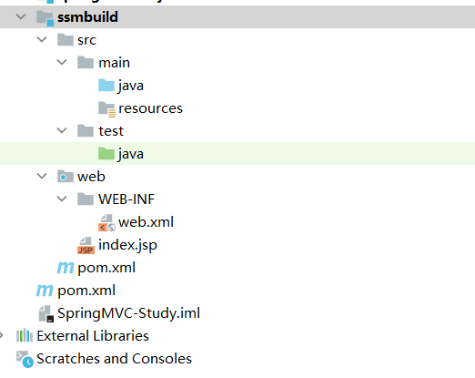

2. 导入相关的pom依赖！

```xml
<dependencies>
   <!--Junit-->
   <dependency>
       <groupId>junit</groupId>
       <artifactId>junit</artifactId>
       <version>4.12</version>
   </dependency>
   <!--数据库驱动-->
   <dependency>
       <groupId>mysql</groupId>
       <artifactId>mysql-connector-java</artifactId>
       <version>5.1.47</version>
   </dependency>
   <!-- 数据库连接池 -->
   <dependency>
       <groupId>com.mchange</groupId>
       <artifactId>c3p0</artifactId>
       <version>0.9.5.2</version>
   </dependency>

   <!--Servlet - JSP -->
   <dependency>
       <groupId>javax.servlet</groupId>
       <artifactId>servlet-api</artifactId>
       <version>2.5</version>
   </dependency>
   <dependency>
       <groupId>javax.servlet.jsp</groupId>
       <artifactId>jsp-api</artifactId>
       <version>2.2</version>
   </dependency>
   <dependency>
       <groupId>javax.servlet</groupId>
       <artifactId>jstl</artifactId>
       <version>1.2</version>
   </dependency>

   <!--Mybatis-->
   <dependency>
       <groupId>org.mybatis</groupId>
       <artifactId>mybatis</artifactId>
       <version>3.5.2</version>
   </dependency>
   <dependency>
       <groupId>org.mybatis</groupId>
       <artifactId>mybatis-spring</artifactId>
       <version>2.0.2</version>
   </dependency>

   <!--Spring-->
   <dependency>
       <groupId>org.springframework</groupId>
       <artifactId>spring-webmvc</artifactId>
       <version>5.1.9.RELEASE</version>
   </dependency>
   <dependency>
       <groupId>org.springframework</groupId>
       <artifactId>spring-jdbc</artifactId>
       <version>5.1.9.RELEASE</version>
   </dependency>
</dependencies>
```

3. Maven资源过滤设置

 ```xml
<build>
   <resources>
       <resource>
           <directory>src/main/java</directory>
           <includes>
               <include>**/*.properties</include>
               <include>**/*.xml</include>
           </includes>
           <filtering>false</filtering>
       </resource>
       <resource>
           <directory>src/main/resources</directory>
           <includes>
               <include>**/*.properties</include>
               <include>**/*.xml</include>
           </includes>
           <filtering>false</filtering>
       </resource>
   </resources>
</build>
 ```

4. 建立基本结构和配置框架！

- com.github.subei.pojo
- com.github.subei.dao
- com.github.subei.service
- com.github.subei.controller
- mybatis-config.xml


```xml
<?xml version="1.0" encoding="UTF-8" ?>
<!DOCTYPE configuration
        PUBLIC "-//mybatis.org//DTD Config 3.0//EN"
        "http://mybatis.org/dtd/mybatis-3-config.dtd">
<configuration>

</configuration>
```

- applicationContext.xml 

```xml
<?xml version="1.0" encoding="UTF-8"?>
<beans xmlns="http://www.springframework.org/schema/beans"
      xmlns:xsi="http://www.w3.org/2001/XMLSchema-instance"
      xsi:schemaLocation="http://www.springframework.org/schema/beans
       http://www.springframework.org/schema/beans/spring-beans.xsd">

</beans>
```

### 2.Mybatis层

1. 数据库配置文件 **database.properties** 

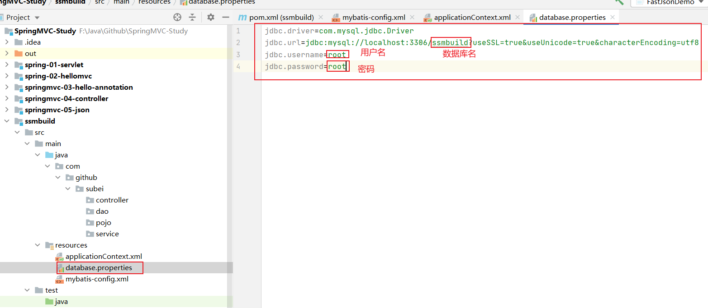

```mysql
jdbc.driver=com.mysql.jdbc.Driver
# 如果使用的是MySQL8.0+,增加一个时区的配置。
jdbc.url=jdbc:mysql://localhost:3306/ssmbuild?useSSL=true&useUnicode=true&characterEncoding=utf8
jdbc.username=root
jdbc.password=root
```

2. IDEA关联数据库

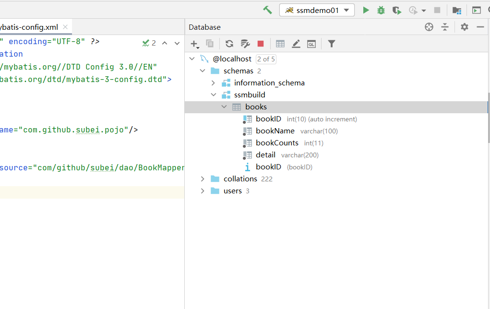

3. 编写MyBatis的核心配置文件

```xml
<?xml version="1.0" encoding="UTF-8" ?>
<!DOCTYPE configuration
        PUBLIC "-//mybatis.org//DTD Config 3.0//EN"
        "http://mybatis.org/dtd/mybatis-3-config.dtd">
<configuration>

    <typeAliases>
        <package name="com.github.subei.pojo"/>
    </typeAliases>
    
    <mappers>
        <mapper class="com.github.subei.dao.BookMapper"/>
    </mappers>

</configuration>
```

4. 编写数据库对应的实体类 com.github.subei.pojo.Books，使用lombok插件！

```java
package com.github.subei.pojo;

import lombok.AllArgsConstructor;
import lombok.Data;
import lombok.NoArgsConstructor;

@Data
@AllArgsConstructor
@NoArgsConstructor
public class Books {
    private int bookID;
    private String bookName;
    private int bookCounts;
    private String detail;

}
```

5. 编写Dao层的 Mapper接口！ 

```java
package com.github.subei.dao;

import com.github.subei.pojo.Books;
import org.apache.ibatis.annotations.Param;

import java.util.List;

public interface BookMapper {
    // 增加一个Book
    int addBook(Books book);

    // 根据id删除一个Book
    int deleteBookById(@Param("bookID") int id);

    // 更新一个Book
    int updateBook(Books books);

    // 根据id查询,返回一个Book
    Books queryBookById(@Param("bookID") int id);

    // 查询全部Book,返回list集合
    List<Books> queryAllBook();
}
```

6. 编写接口对应的Mapper.xml 文件。需要导入MyBatis的包； 

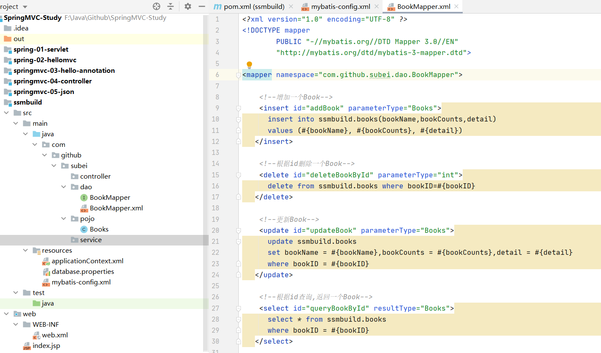

```xml
<?xml version="1.0" encoding="UTF-8" ?>
<!DOCTYPE mapper
        PUBLIC "-//mybatis.org//DTD Mapper 3.0//EN"
        "http://mybatis.org/dtd/mybatis-3-mapper.dtd">

<mapper namespace="com.github.subei.dao.BookMapper">

    <!--增加一个Book-->
    <insert id="addBook" parameterType="Books">
      insert into ssmbuild.books(bookName,bookCounts,detail)
      values (#{bookName}, #{bookCounts}, #{detail});
   </insert>

    <!--根据id删除一个Book-->
    <delete id="deleteBookById" parameterType="int">
      delete from ssmbuild.books where bookID=#{bookID};
   </delete>

    <!--更新Book-->
    <update id="updateBook" parameterType="Books">
      update ssmbuild.books
      set bookName = #{bookName},bookCounts = #{bookCounts},detail = #{detail}
      where bookID = #{bookID};
   </update>

    <!--根据id查询,返回一个Book-->
    <select id="queryBookById" resultType="Books">
      select * from ssmbuild.books
      where bookID = #{bookID};
   </select>

    <!--查询全部Book-->
    <select id="queryAllBook" resultType="Books">
      SELECT * from ssmbuild.books;
   </select>

</mapper>
```

7. 编写Service层的接口和实现类

- 接口：

```java
package com.github.subei.service;

import com.github.subei.pojo.Books;

import java.util.List;

// BookService:底下需要去实现,调用dao层
public interface BookService {
    // 增加一个Book
    int addBook(Books book);
    // 根据id删除一个Book
    int deleteBookById(int id);
    // 更新Book
    int updateBook(Books books);
    // 根据id查询,返回一个Book
    Books queryBookById(int id);
    // 查询全部Book,返回list集合
    List<Books> queryAllBook();
}
```

- 实现类： 

```java
package com.github.subei.service;

import com.github.subei.dao.BookMapper;
import com.github.subei.pojo.Books;

import java.util.List;

public class BookServiceImpl implements BookService {

    // 调用dao层的操作，设置一个set接口，方便Spring管理
    private BookMapper bookMapper;

    public void setBookMapper(BookMapper bookMapper) {
        this.bookMapper = bookMapper;
    }

    public int addBook(Books book) {
        return bookMapper.addBook(book);
    }

    public int deleteBookById(int id) {
        return bookMapper.deleteBookById(id);
    }

    public int updateBook(Books books) {
        return bookMapper.updateBook(books);
    }

    public Books queryBookById(int id) {
        return bookMapper.queryBookById(id);
    }

    public List<Books> queryAllBook() {
        return bookMapper.queryAllBook();
    }
}
```

> **OK，到此，底层需求操作编写完毕！** 

### 3.Spring层

1. 配置**Spring整合MyBatis**，这里数据源使用c3p0连接池；

2. 编写Spring整合Mybatis的相关的配置文件；spring-dao.xml

```xml
<?xml version="1.0" encoding="UTF-8"?>
<beans xmlns="http://www.springframework.org/schema/beans"
       xmlns:xsi="http://www.w3.org/2001/XMLSchema-instance"
       xmlns:context="http://www.springframework.org/schema/context"
       xsi:schemaLocation="http://www.springframework.org/schema/beans
       http://www.springframework.org/schema/beans/spring-beans.xsd
       http://www.springframework.org/schema/context
       https://www.springframework.org/schema/context/spring-context.xsd">

    <!-- 配置整合mybatis -->
    <!-- 1.关联数据库文件 -->
    <context:property-placeholder location="classpath:database.properties"/>

    <!-- 2.数据库连接池 -->
    <!--数据库连接池
        dbcp 半自动化操作 不能自动连接
        c3p0 自动化操作（自动的加载配置文件 并且设置到对象里面）
    -->
    <bean id="dataSource" class="com.mchange.v2.c3p0.ComboPooledDataSource">
        <!-- 配置连接池属性 -->
        <property name="driverClass" value="${jdbc.driver}"/>
        <property name="jdbcUrl" value="${jdbc.url}"/>
        <property name="user" value="${jdbc.username}"/>
        <property name="password" value="${jdbc.password}"/>

        <!-- c3p0连接池的私有属性 -->
        <property name="maxPoolSize" value="30"/>
        <property name="minPoolSize" value="10"/>
        <!-- 关闭连接后不自动commit -->
        <property name="autoCommitOnClose" value="false"/>
        <!-- 获取连接超时时间 -->
        <property name="checkoutTimeout" value="10000"/>
        <!-- 当获取连接失败重试次数 -->
        <property name="acquireRetryAttempts" value="2"/>
    </bean>

    <!-- 3.配置SqlSessionFactory对象 -->
    <bean id="sqlSessionFactory" class="org.mybatis.spring.SqlSessionFactoryBean">
        <!-- 注入数据库连接池 -->
        <property name="dataSource" ref="dataSource"/>
        <!-- 配置MyBaties全局配置文件:mybatis-config.xml -->
        <property name="configLocation" value="classpath:mybatis-config.xml"/>
    </bean>

    <!-- 4.配置扫描Dao接口包，动态实现Dao接口注入到spring容器中 -->
    <!--解释 ：https://www.cnblogs.com/jpfss/p/7799806.html-->
    <bean class="org.mybatis.spring.mapper.MapperScannerConfigurer">
        <!-- 注入sqlSessionFactory -->
        <property name="sqlSessionFactoryBeanName" value="sqlSessionFactory"/>
        <!-- 给出需要扫描Dao接口包 -->
        <property name="basePackage" value="com.github.subei.dao"/>
    </bean>

</beans>
```

3. **Spring整合service层** 

```xml
<?xml version="1.0" encoding="UTF-8"?>
<beans xmlns="http://www.springframework.org/schema/beans"
       xmlns:xsi="http://www.w3.org/2001/XMLSchema-instance"
       xmlns:context="http://www.springframework.org/schema/context"
       xsi:schemaLocation="http://www.springframework.org/schema/beans
   http://www.springframework.org/schema/beans/spring-beans.xsd
   http://www.springframework.org/schema/context
   http://www.springframework.org/schema/context/spring-context.xsd">

    <!-- 扫描service相关的bean -->
    <context:component-scan base-package="com.github.subei.service" />

    <!--BookServiceImpl注入到IOC容器中-->
    <bean id="BookServiceImpl" class="com.github.subei.service.BookServiceImpl">
        <property name="bookMapper" ref="bookMapper"/>
    </bean>

    <!-- 配置事务管理器 -->
    <bean id="transactionManager" class="org.springframework.jdbc.datasource.DataSourceTransactionManager">
        <!-- 注入数据库连接池 -->
        <property name="dataSource" ref="dataSource" />
    </bean>

</beans>
```

### 4.SpringMVC层

1. **web.xml** 

```xml
<?xml version="1.0" encoding="UTF-8"?>
<web-app xmlns="http://xmlns.jcp.org/xml/ns/javaee"
         xmlns:xsi="http://www.w3.org/2001/XMLSchema-instance"
         xsi:schemaLocation="http://xmlns.jcp.org/xml/ns/javaee http://xmlns.jcp.org/xml/ns/javaee/web-app_4_0.xsd"
         version="4.0">

    <!--DispatcherServlet-->
    <servlet>
        <servlet-name>DispatcherServlet</servlet-name>
        <servlet-class>org.springframework.web.servlet.DispatcherServlet</servlet-class>
        <init-param>
            <param-name>contextConfigLocation</param-name>
            <!--一定要注意:我们这里加载的是总的配置文件，之前被这里坑了！-->
            <param-value>classpath:applicationContext.xml</param-value>
        </init-param>
        <load-on-startup>1</load-on-startup>
    </servlet>
    <servlet-mapping>
        <servlet-name>DispatcherServlet</servlet-name>
        <url-pattern>/</url-pattern>
    </servlet-mapping>

    <!--encodingFilter-->
    <filter>
        <filter-name>encodingFilter</filter-name>
        <filter-class>
            org.springframework.web.filter.CharacterEncodingFilter
        </filter-class>
        <init-param>
            <param-name>encoding</param-name>
            <param-value>utf-8</param-value>
        </init-param>
    </filter>
    <filter-mapping>
        <filter-name>encodingFilter</filter-name>
        <url-pattern>/*</url-pattern>
    </filter-mapping>

    <!--Session过期时间-->
    <session-config>
        <session-timeout>15</session-timeout>
    </session-config>

</web-app>
```

2. **spring-mvc.xml** 

```xml
<?xml version="1.0" encoding="UTF-8"?>
<beans xmlns="http://www.springframework.org/schema/beans"
       xmlns:xsi="http://www.w3.org/2001/XMLSchema-instance"
       xmlns:context="http://www.springframework.org/schema/context"
       xmlns:mvc="http://www.springframework.org/schema/mvc"
       xsi:schemaLocation="http://www.springframework.org/schema/beans
   http://www.springframework.org/schema/beans/spring-beans.xsd
   http://www.springframework.org/schema/context
   http://www.springframework.org/schema/context/spring-context.xsd
   http://www.springframework.org/schema/mvc
   https://www.springframework.org/schema/mvc/spring-mvc.xsd">

    <!-- 配置SpringMVC -->
    <!-- 1.开启SpringMVC注解驱动 -->
    <mvc:annotation-driven />
    <!-- 2.静态资源默认servlet配置-->
    <mvc:default-servlet-handler/>

    <!-- 3.配置jsp 显示ViewResolver视图解析器 -->
    <bean class="org.springframework.web.servlet.view.InternalResourceViewResolver">
        <property name="viewClass" value="org.springframework.web.servlet.view.JstlView" />
        <property name="prefix" value="/WEB-INF/jsp/" />
        <property name="suffix" value=".jsp" />
    </bean>

    <!-- 4.扫描web相关的bean -->
    <context:component-scan base-package="com.github.subei.controller" />

</beans>
```

3. **Spring配置整合文件，applicationContext.xml** 

```xml
<?xml version="1.0" encoding="UTF-8"?>
<beans xmlns="http://www.springframework.org/schema/beans"
       xmlns:xsi="http://www.w3.org/2001/XMLSchema-instance"
       xsi:schemaLocation="http://www.springframework.org/schema/beans
       http://www.springframework.org/schema/beans/spring-beans.xsd">

    <import resource="spring-dao.xml"/>
    <import resource="spring-service.xml"/>
    <import resource="spring-mvc.xml"/>

</beans>
```

> **配置文件，暂时结束！Controller 和 视图层编写** 

### 5.案例实现

1. BookController 类编写 ， 方法一：查询全部书籍 

```java
package com.github.subei.controller;

import com.github.subei.pojo.Books;
import com.github.subei.service.BookService;
import org.springframework.beans.factory.annotation.Autowired;
import org.springframework.beans.factory.annotation.Qualifier;
import org.springframework.stereotype.Controller;
import org.springframework.ui.Model;
import org.springframework.web.bind.annotation.RequestMapping;

import java.util.List;

@Controller
@RequestMapping("/book")
public class BookController {

    @Autowired
    @Qualifier("BookServiceImpl")
    private BookService bookService;

    @RequestMapping("/allBook")
    public String list(Model model) {
        List<Books> list = bookService.queryAllBook();
        model.addAttribute("list", list);
        return "allBook";
    }
}
```

 2、编写首页 **index.jsp** 

```jsp
<%@ page language="java" contentType="text/html; charset=UTF-8" pageEncoding="UTF-8" %>
<!DOCTYPE HTML>
<html>
<head>
  <title>首页</title>
  <style type="text/css">
    a {
      text-decoration: none;
      color: black;
      font-size: 18px;
    }
    h3 {
      width: 180px;
      height: 38px;
      margin: 100px auto;
      text-align: center;
      line-height: 38px;
      background: deepskyblue;
      border-radius: 4px;
    }
  </style>
</head>
<body>

<h3>
  <a href="${pageContext.request.contextPath}/book/allBook">点击进入列表页</a>
</h3>
</body>
</html>
```

3. 书籍列表页面 **allbook.jsp** 

```jsp
<%@ taglib prefix="c" uri="http://java.sun.com/jsp/jstl/core" %>
<%@ page contentType="text/html;charset=UTF-8" language="java" %>
<html>
<head>
   <title>书籍列表</title>
   <meta name="viewport" content="width=device-width, initial-scale=1.0">
   <!-- 引入 Bootstrap -->
   <link href="https://cdn.bootcss.com/bootstrap/3.3.7/css/bootstrap.min.css" rel="stylesheet">
</head>
<body>

<div class="container">

   <div class="row clearfix">
       <div class="col-md-12 column">
           <div class="page-header">
               <h1>
                   <small>书籍列表 —— 显示所有书籍</small>
               </h1>
           </div>
       </div>
   </div>

   <div class="row">
       <div class="col-md-4 column">
           <a class="btn btn-primary" href="${pageContext.request.contextPath}/book/toAddBook">新增书籍</a>
       </div>
   </div>

   <div class="row clearfix">
       <div class="col-md-12 column">
           <table class="table table-hover table-striped">
               <thead>
               <tr>
                   <th>书籍编号</th>
                   <th>书籍名字</th>
                   <th>书籍数量</th>
                   <th>书籍详情</th>
                   <th>操作</th>
               </tr>
               </thead>

               <tbody>
               <c:forEach var="book" items="${requestScope.get('list')}">
                   <tr>
                       <td>${book.getBookID()}</td>
                       <td>${book.getBookName()}</td>
                       <td>${book.getBookCounts()}</td>
                       <td>${book.getDetail()}</td>
                       <td>
                           <a href="${pageContext.request.contextPath}/book/toUpdateBook?id=${book.getBookID()}">更改</a> |
                           <a href="${pageContext.request.contextPath}/book/del/${book.getBookID()}">删除</a>
                       </td>
                   </tr>
               </c:forEach>
               </tbody>
           </table>
       </div>
   </div>
</div>
```

4. BookController 类编写 ， 方法二：添加书籍 

```java
    @RequestMapping("/toAddBook")
    public String toAddPaper() {
        return "addBook";
    }

    @RequestMapping("/addBook")
    public String addPaper(Books books) {
        System.out.println(books);
        bookService.addBook(books);
        return "redirect:/book/allBook";
    }
```

5. 添加书籍页面：**addBook.jsp**

```jsp
<%@ taglib prefix="c" uri="http://java.sun.com/jsp/jstl/core" %>
<%@ page contentType="text/html;charset=UTF-8" language="java" %>

<html>
<head>
   <title>新增书籍</title>
   <meta name="viewport" content="width=device-width, initial-scale=1.0">
   <!-- 引入 Bootstrap -->
   <link href="https://cdn.bootcss.com/bootstrap/3.3.7/css/bootstrap.min.css" rel="stylesheet">
</head>
<body>
<div class="container">

   <div class="row clearfix">
       <div class="col-md-12 column">
           <div class="page-header">
               <h1>
                   <small>新增书籍</small>
               </h1>
           </div>
       </div>
   </div>
   <form action="${pageContext.request.contextPath}/book/addBook" method="post">
      书籍名称：<input type="text" name="bookName"><br><br><br>
      书籍数量：<input type="text" name="bookCounts"><br><br><br>
      书籍详情：<input type="text" name="detail"><br><br><br>
       <input type="submit" value="添加">
   </form>

</div>
```

6. BookController 类编写 ， 方法三：修改书籍 

```java
    @RequestMapping("/toUpdateBook")
    public String toUpdateBook(Model model, int id) {
        Books books = bookService.queryBookById(id);
        System.out.println(books);
        model.addAttribute("book",books );
        return "updateBook";
    }

    @RequestMapping("/updateBook")
    public String updateBook(Model model, Books book) {
        System.out.println(book);
        bookService.updateBook(book);
        Books books = bookService.queryBookById(book.getBookID());
        model.addAttribute("books", books);
        return "redirect:/book/allBook";
    }
```

7. 修改书籍页面  **updateBook.jsp** 

```jsp
<%--
  Created by IntelliJ IDEA.
  User: subei
  Date: 2021/2/27
  Time: 17:53
  To change this template use File | Settings | File Templates.
--%>
<%@ taglib prefix="c" uri="http://java.sun.com/jsp/jstl/core" %>
<%@ page contentType="text/html;charset=UTF-8" language="java" %>
<html>
<head>
    <title>修改信息</title>
    <meta name="viewport" content="width=device-width, initial-scale=1.0">
    <!-- 引入 Bootstrap -->
    <link href="https://cdn.bootcss.com/bootstrap/3.3.7/css/bootstrap.min.css" rel="stylesheet">
</head>
<body>
<div class="container">

    <div class="row clearfix">
        <div class="col-md-12 column">
            <div class="page-header">
                <h1>
                    <small>修改信息</small>
                </h1>
            </div>
        </div>
    </div>

    <form action="${pageContext.request.contextPath}/book/updateBook" method="post">
        <input type="hidden" name="bookID" value="${book.getBookID()}"/>
        书籍名称：<input type="text" name="bookName" value="${book.getBookName()}"/>
        书籍数量：<input type="text" name="bookCounts" value="${book.getBookCounts()}"/>
        书籍详情：<input type="text" name="detail" value="${book.getDetail() }"/>
        <input type="submit" value="提交"/>
    </form>

</div>
```

8. BookController 类编写 ， 方法四：删除书籍 

```java
    @RequestMapping("/del/{bookID}")
    public String deleteBook(@PathVariable("bookID") int id) {
        bookService.deleteBookById(id);
        return "redirect:/book/allBook";
    }
```

----

9. 书籍查询功能

- 修改前端页面，allBook.jsp页面

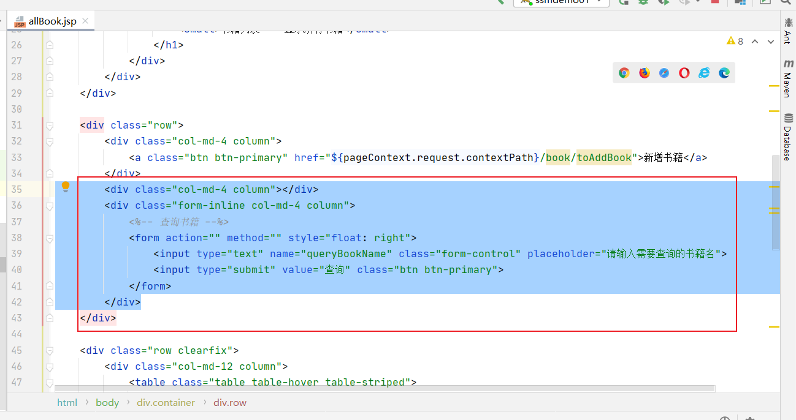

```jsp
        <div class="col-md-4 column"></div>
        <div class="form-inline">
            <%-- 查询书籍 --%>
            <form action="" method="" style="float: right">
                <input type="text" name="queryBookName" class="form-control" placeholder="请输入需要查询的书籍名">
                <input type="submit" value="查询" class="btn btn-primary">
            </form>
        </div>
```

- 修改DAO层：BookMapper.java

```java
    // 查询，搜索书籍
    Books queryBookByName(@Param("bookName")String bookName);
```

- 修改DAO层：BookMapper.xml

```xml
    <!--搜索Book-->
    <select id="queryBookByName" resultType="Books">
      SELECT * from ssmbuild.books where bookName = #{bookName};
   </select>
```

- 修改service层：BookService.java

```java
    // 查询，搜索书籍
    Books queryBookByName(String bookName);
```

- 修改service层：BookServiceImpl.java

```java
    public Books queryBookByName(String bookName) {
        return bookMapper.queryBookByName(bookName);
    }
```

- 修改controller层：BookController.java

```java
    // 查询书籍
    @RequestMapping("/queryBook")
    public String queryBook(String queryBookName,Model model){
        Books books = bookService.queryBookByName(queryBookName);
        List<Books> list = new ArrayList<Books>();
        list.add(books);
        model.addAttribute("list", list);
        return "allBook";
    }
```

- 修改前端：allBook.jsp

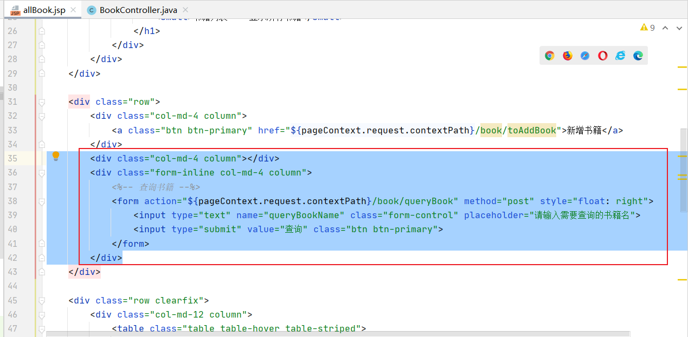

```jsp
        <div class="col-md-4 column"></div>
        <div class="form-inline">
            <%-- 查询书籍 --%>
            <form action="${pageContext.request.contextPath}/book/queryBook" method="post" style="float: right">
                <input type="text" name="queryBookName" class="form-control" placeholder="请输入需要查询的书籍名">
                <input type="submit" value="查询" class="btn btn-primary">
            </form>
        </div>
```

- 运行测试：

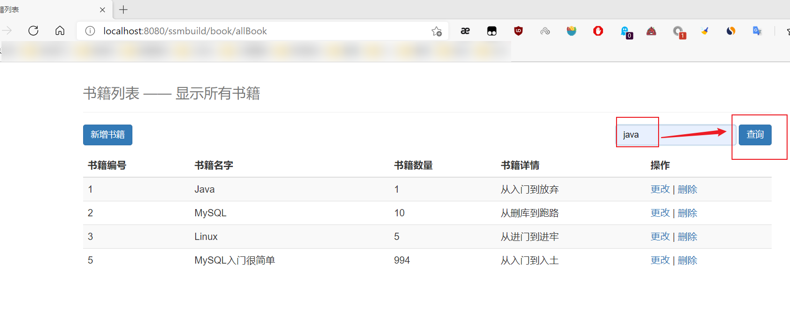

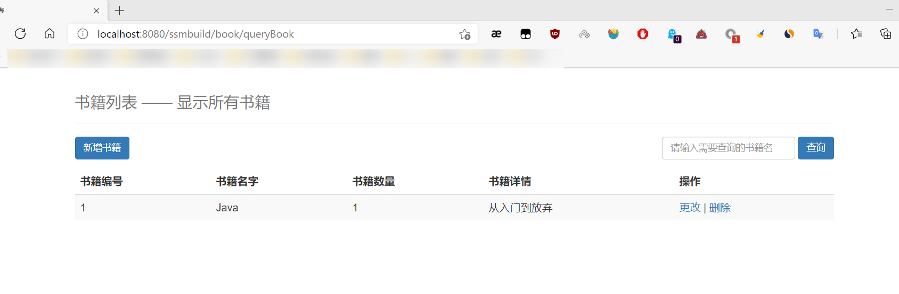

> 如果查询失败，需要显示全部书籍页面？

- 修改前端页面allBook.jsp

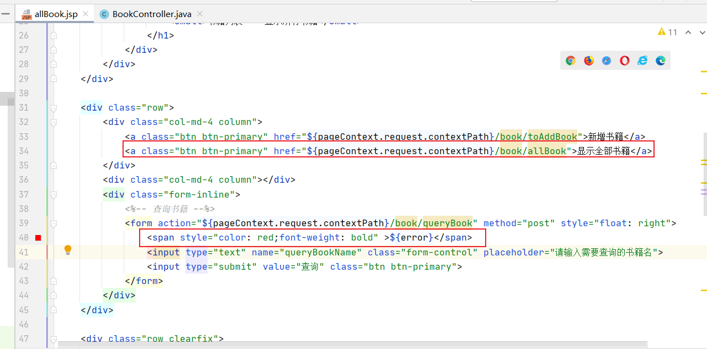

```jsp
    <div class="row">
        <div class="col-md-4 column">
            <a class="btn btn-primary" href="${pageContext.request.contextPath}/book/toAddBook">新增书籍</a>
            <a class="btn btn-primary" href="${pageContext.request.contextPath}/book/allBook">显示全部书籍</a>
        </div>
        <div class="col-md-4 column"></div>
        <div class="form-inline">
            <%-- 查询书籍 --%>
            <form action="${pageContext.request.contextPath}/book/queryBook" method="post" style="float: right">
                <span style="color: red;font-weight: bold" >${error}</span>
                <input type="text" name="queryBookName" class="form-control" placeholder="请输入需要查询的书籍名">
                <input type="submit" value="查询" class="btn btn-primary">
            </form>
        </div>
    </div>
```

- 修改后台BookController.java

```java
    // 查询书籍
    @RequestMapping("/queryBook")
    public String queryBook(String queryBookName,Model model){
        Books books = bookService.queryBookByName(queryBookName);
        List<Books> list = new ArrayList<Books>();
        list.add(books);

        if(books==null){
            list = bookService.queryAllBook();
            model.addAttribute("error","未查到");
        }

        model.addAttribute("list", list);
        return "allBook";
    }
```


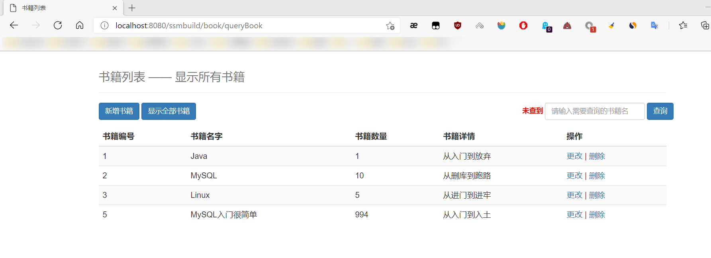


> **配置Tomcat，进行运行！** 

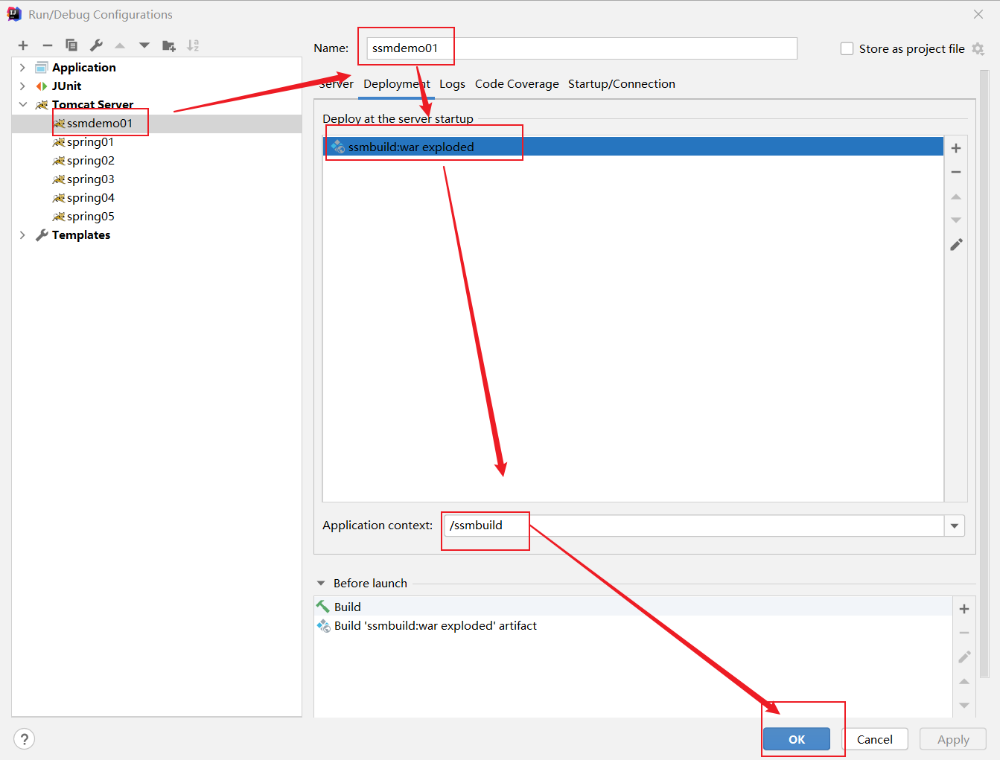

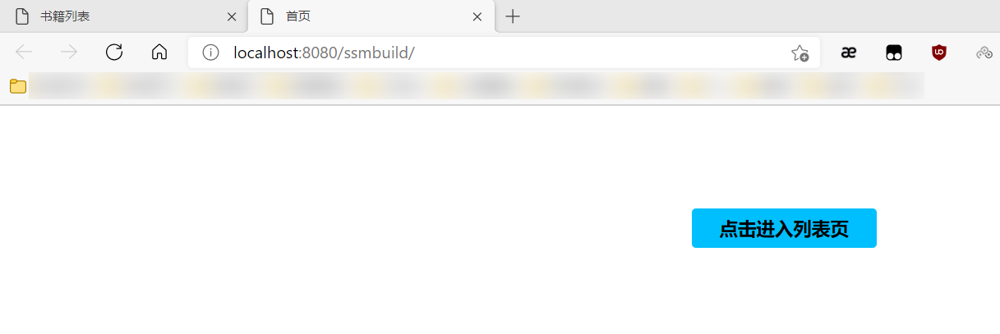

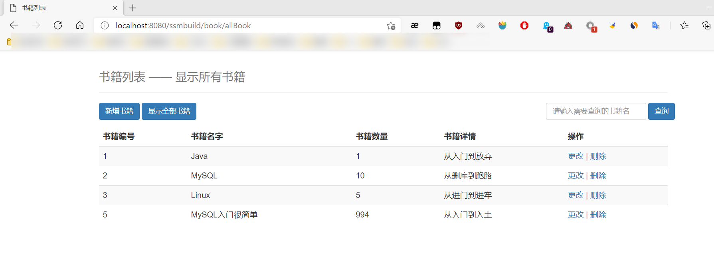

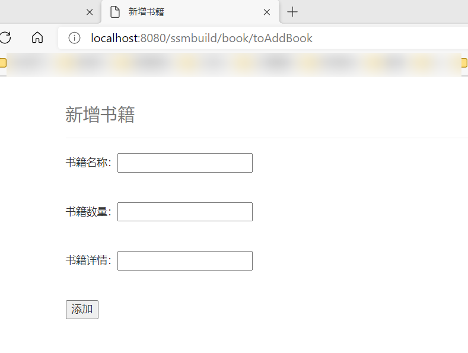

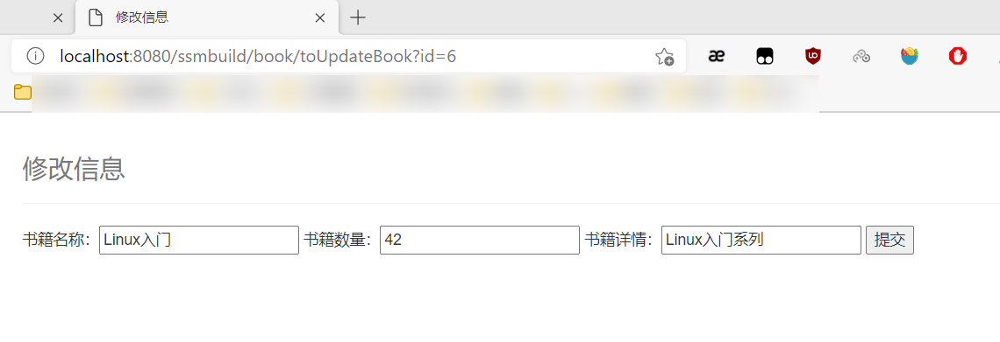

> **项目结构图**：

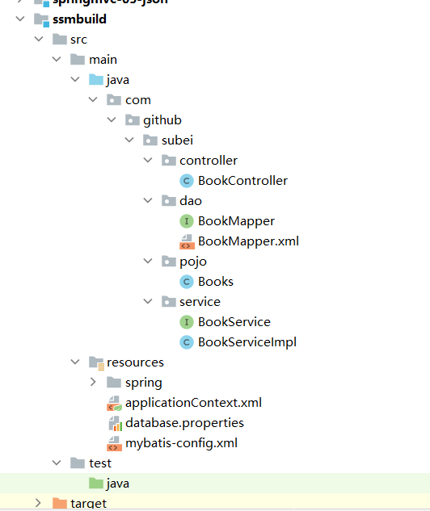

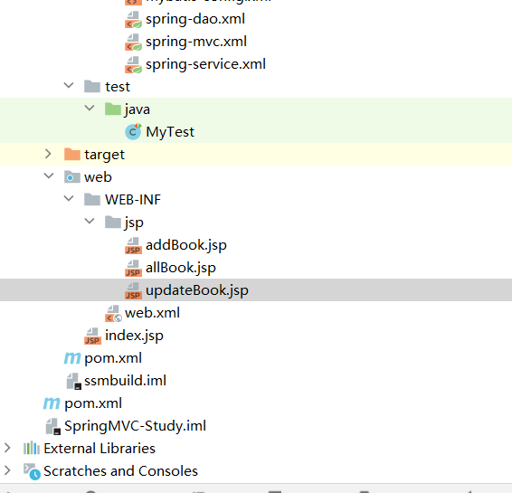

> 推荐一个前端可视化布局设计网站：https://www.bootcss.com/p/layoutit/

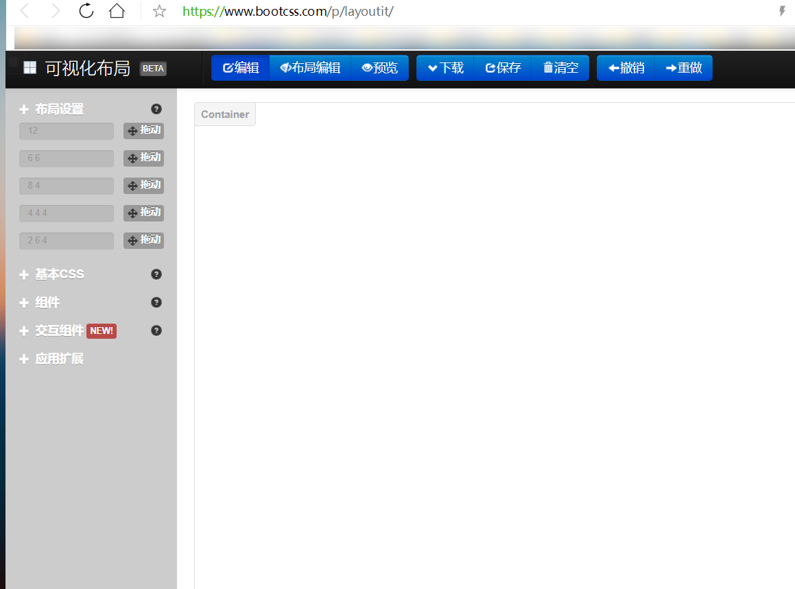

## 8、Ajax技术

### 1.Ajax初体验

> 简介

- **AJAX = Asynchronous JavaScript and XML（异步的 JavaScript 和 XML）。**
- AJAX 是一种在无需重新加载整个网页的情况下，能够更新部分网页的技术。
- **Ajax 不是一种新的编程语言，而是一种用于创建更好更快以及交互性更强的Web应用程序的技术。**
- 在 2005 年，Google 通过其 Google Suggest 使 AJAX 变得流行起来。Google Suggest能够自动帮你完成搜索单词。
- Google Suggest 使用 AJAX 创造出动态性极强的 web 界面：当您在谷歌的搜索框输入关键字时，JavaScript 会把这些字符发送到服务器，然后服务器会返回一个搜索建议的列表。
- 和国内百度的搜索框一样!

- 传统的网页(即不用ajax技术的网页)，想要更新内容或者提交一个表单，都需要重新加载整个网页。
- 使用ajax技术的网页，通过在后台服务器进行少量的数据交换，就可以实现异步局部更新。
- 使用Ajax，用户可以创建接近本地桌面应用的直接、高可用、更丰富、更动态的Web用户界面。

> 伪造Ajax
>
> - 可以使用前端的一个标签来伪造一个ajax的样子。iframe标签

1. 新建一个module ：springmvc-06-ajax ， 导入web支持！

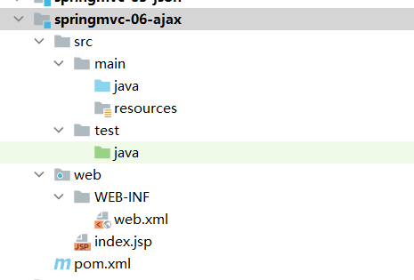

2. 测试项目是否成功！

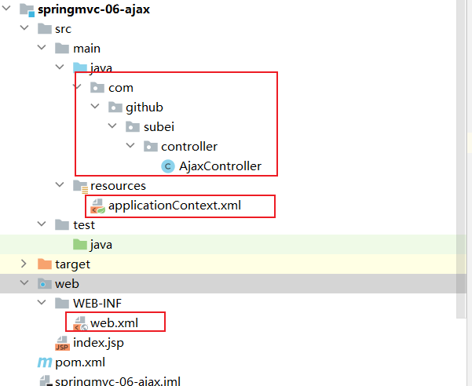

- 配置web.xml

```xml
<?xml version="1.0" encoding="UTF-8"?>
<web-app xmlns="http://xmlns.jcp.org/xml/ns/javaee"
         xmlns:xsi="http://www.w3.org/2001/XMLSchema-instance"
         xsi:schemaLocation="http://xmlns.jcp.org/xml/ns/javaee http://xmlns.jcp.org/xml/ns/javaee/web-app_4_0.xsd"
         version="4.0">
    <servlet>
        <servlet-name>springmvc</servlet-name>
        <servlet-class>org.springframework.web.servlet.DispatcherServlet</servlet-class>
        <init-param>
            <param-name>contextConfigLocation</param-name>
            <param-value>classpath:applicationContext.xml</param-value>
        </init-param>
        <load-on-startup>1</load-on-startup>
    </servlet>
    <servlet-mapping>
        <servlet-name>springmvc</servlet-name>
        <url-pattern>/</url-pattern>
    </servlet-mapping>
    
    <filter>
        <filter-name>encoding</filter-name>
        <filter-class>org.springframework.web.filter.CharacterEncodingFilter</filter-class>
        <init-param>
            <param-name>encoding</param-name>
            <param-value>utf-8</param-value>
        </init-param>
    </filter>
    <filter-mapping>
        <filter-name>encoding</filter-name>
        <url-pattern>/*</url-pattern>
    </filter-mapping>

</web-app>
```

- 配置applicationContext.xml

```xml
<?xml version="1.0" encoding="UTF-8"?>
<beans xmlns="http://www.springframework.org/schema/beans"
       xmlns:xsi="http://www.w3.org/2001/XMLSchema-instance"
       xmlns:context="http://www.springframework.org/schema/context"
       xmlns:mvc="http://www.springframework.org/schema/mvc"
       xsi:schemaLocation="http://www.springframework.org/schema/beans
       http://www.springframework.org/schema/beans/spring-beans.xsd
       http://www.springframework.org/schema/context
       https://www.springframework.org/schema/context/spring-context.xsd
       http://www.springframework.org/schema/mvc
       https://www.springframework.org/schema/mvc/spring-mvc.xsd">

    <!-- 自动扫描指定的包，下面所有注解类交给IOC容器管理 -->
    <context:component-scan base-package="com.github.subei.controller"/>

    <!-- 视图解析器 -->
    <bean class="org.springframework.web.servlet.view.InternalResourceViewResolver"
          id="internalResourceViewResolver">
        <!-- 前缀 -->
        <property name="prefix" value="/WEB-INF/jsp/" />
        <!-- 后缀 -->
        <property name="suffix" value=".jsp" />
    </bean>

    <!-- JSON乱码问题 -->
    <mvc:annotation-driven>
        <mvc:message-converters register-defaults="true">
            <bean class="org.springframework.http.converter.StringHttpMessageConverter">
                <constructor-arg value="UTF-8"/>
            </bean>
            <bean class="org.springframework.http.converter.json.MappingJackson2HttpMessageConverter">
                <property name="objectMapper">
                    <bean class="org.springframework.http.converter.json.Jackson2ObjectMapperFactoryBean">
                        <property name="failOnEmptyBeans" value="false"/>
                    </bean>
                </property>
            </bean>
        </mvc:message-converters>
    </mvc:annotation-driven>

</beans>
```

- 配置AjaxController.java

```java
package com.github.subei.controller;

import org.springframework.web.bind.annotation.RequestMapping;
import org.springframework.web.bind.annotation.RestController;

@RestController
public class AjaxController {

    @RequestMapping("k1")
    public String test(){
        return "hello";
    }
}
```

- 这一步很关键，手动添加lib

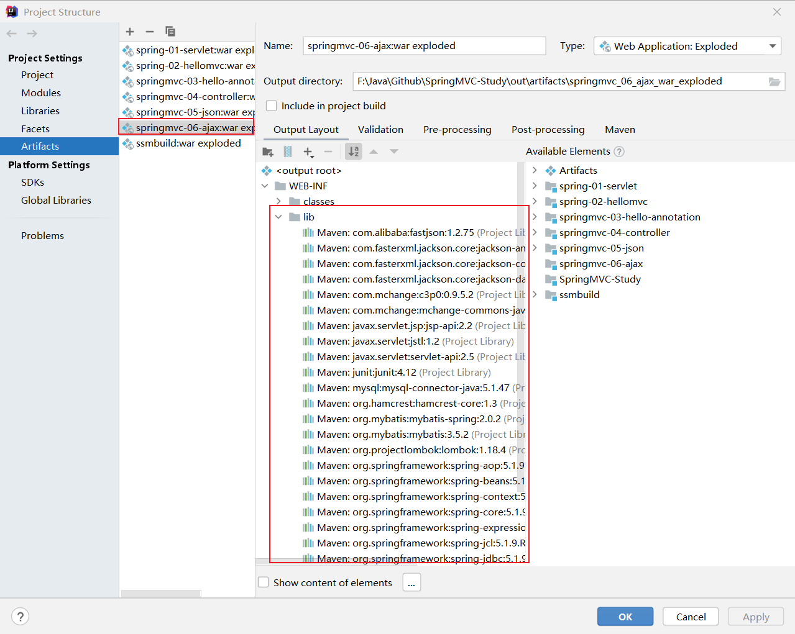

- 测试文件！

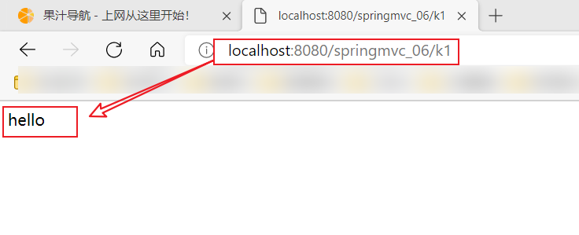


3. 编写一个 ajax-frame.html 使用 iframe 测试，感受下效果。

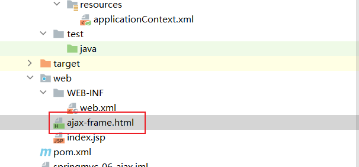

```html
<!DOCTYPE html>
<html lang="en">
<head>
    <meta charset="UTF-8">
    <title>subei</title>
</head>
<body>
<script type="text/javascript">
    window.onload = function(){
        var myDate = new Date();
        document.getElementById('currentTime').innerText = myDate.getTime();
    };

    function LoadPage(){
        var targetUrl =  document.getElementById('url').value;
        console.log(targetUrl);
        document.getElementById("iframePosition").src = targetUrl;
    }

</script>

<div>
    <p>请输入要加载的地址：<span id="currentTime"></span></p>
    <p>
        <input id="url" type="text" value="https://www.dogedoge.com/"/>
        <input type="button" value="提交" onclick="LoadPage()">
    </p>
</div>

<div>
    <h3>加载页面位置：</h3>
    <iframe id="iframePosition" style="width: 100%;height: 500px;"></iframe>
</div>
</body>
</html>
```

3. 使用IDEA开浏览器测试一下！ 

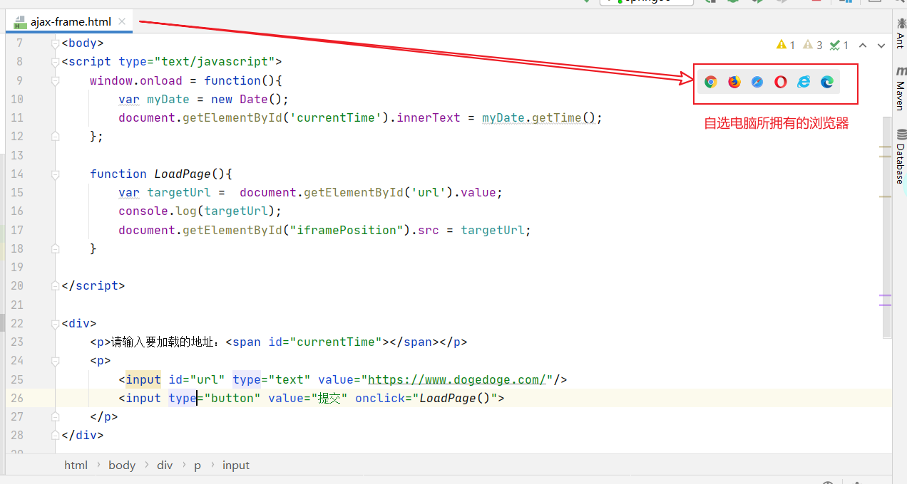

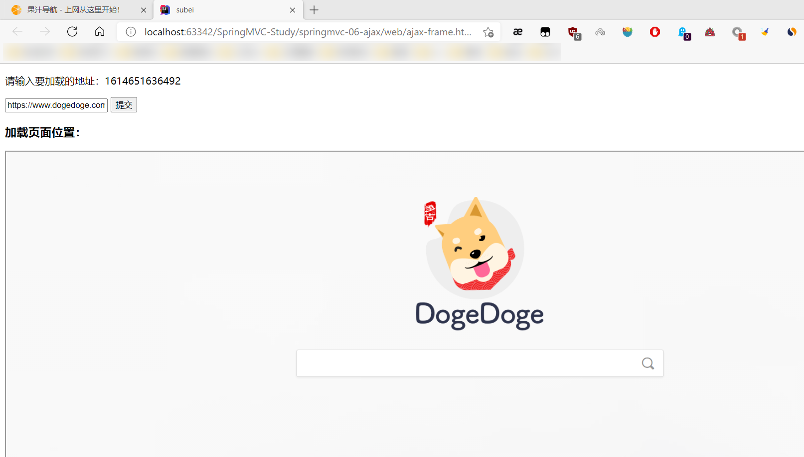

> **利用AJAX可以做：**

- 注册时，输入用户名自动检测用户是否已经存在。
- 登陆时，提示用户名密码错误
- 删除数据行时，将行ID发送到后台，后台在数据库中删除，数据库删除成功后，在页面DOM中将数据行也删除。
- ....等等

### 2.jQuery

- 纯JS原生实现Ajax不作详细赘述，直接使用jquery提供的，方便学习和使用，避免重复造轮子，有兴趣的同学可以去了解下==JS原生XMLHttpRequest== ！

- Ajax的核心是XMLHttpRequest对象(XHR)。XHR为向服务器发送请求和解析服务器响应提供了接口。能够以异步方式从服务器获取新数据。

- jQuery 提供多个与 AJAX 有关的方法。

- 通过 jQuery AJAX 方法，您能够使用 HTTP Get 和 HTTP Post 从远程服务器上请求文本、HTML、XML 或 JSON – 同时您能够把这些外部数据直接载入网页的被选元素中。

- jQuery 不是生产者，而是大自然搬运工。

- jQuery Ajax本质就是 XMLHttpRequest，对他进行了封装，方便调用！

```js
jQuery.ajax(...)
      部分参数：
            url：请求地址
            type：请求方式，GET、POST（1.9.0之后用method）
        headers：请求头
            data：要发送的数据
    contentType：即将发送信息至服务器的内容编码类型(默认: "application/x-www-form-urlencoded; charset=UTF-8")
          async：是否异步
        timeout：设置请求超时时间（毫秒）
      beforeSend：发送请求前执行的函数(全局)
        complete：完成之后执行的回调函数(全局)
        success：成功之后执行的回调函数(全局)
          error：失败之后执行的回调函数(全局)
        accepts：通过请求头发送给服务器，告诉服务器当前客户端可接受的数据类型
        dataType：将服务器端返回的数据转换成指定类型
          "xml": 将服务器端返回的内容转换成xml格式
          "text": 将服务器端返回的内容转换成普通文本格式
          "html": 将服务器端返回的内容转换成普通文本格式，在插入DOM中时，如果包含JavaScript标签，则会尝试去执行。
        "script": 尝试将返回值当作JavaScript去执行，然后再将服务器端返回的内容转换成普通文本格式
          "json": 将服务器端返回的内容转换成相应的JavaScript对象
        "jsonp": JSONP 格式使用 JSONP 形式调用函数时，如 "myurl?callback=?" jQuery 将自动替换 ? 为正确的函数名，以执行回调函数
```

- 项目06中引用jQuary，下载地址：https://jquery.com/download/

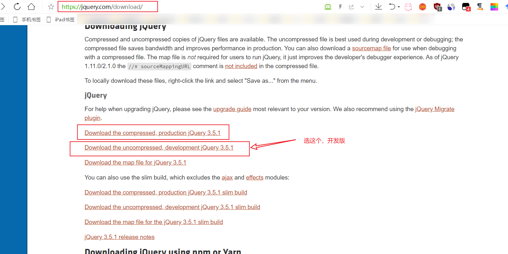

- 放入项目

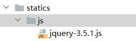

> 案例测试

1. 配置web.xml 和 springmvc的配置文件，复制上面案例的即可 【记得静态资源过滤和注解驱动配置上】 

```xml
<?xml version="1.0" encoding="UTF-8"?>
<beans xmlns="http://www.springframework.org/schema/beans"
       xmlns:xsi="http://www.w3.org/2001/XMLSchema-instance"
       xmlns:context="http://www.springframework.org/schema/context"
       xmlns:mvc="http://www.springframework.org/schema/mvc"
       xsi:schemaLocation="http://www.springframework.org/schema/beans
       http://www.springframework.org/schema/beans/spring-beans.xsd
       http://www.springframework.org/schema/context
       https://www.springframework.org/schema/context/spring-context.xsd
       http://www.springframework.org/schema/mvc
       https://www.springframework.org/schema/mvc/spring-mvc.xsd">

    <!-- 自动扫描指定的包，下面所有注解类交给IOC容器管理 -->
    <context:component-scan base-package="com.github.subei.controller"/>
    <!-- 静态资源过滤 -->
    <mvc:default-servlet-handler />
    <mvc:annotation-driven />

    <!-- 视图解析器 -->
    <bean class="org.springframework.web.servlet.view.InternalResourceViewResolver"
          id="internalResourceViewResolver">
        <!-- 前缀 -->
        <property name="prefix" value="/WEB-INF/jsp/" />
        <!-- 后缀 -->
        <property name="suffix" value=".jsp" />
    </bean>

    <!-- JSON乱码问题 -->
    <mvc:annotation-driven>
        <mvc:message-converters register-defaults="true">
            <bean class="org.springframework.http.converter.StringHttpMessageConverter">
                <constructor-arg value="UTF-8"/>
            </bean>
            <bean class="org.springframework.http.converter.json.MappingJackson2HttpMessageConverter">
                <property name="objectMapper">
                    <bean class="org.springframework.http.converter.json.Jackson2ObjectMapperFactoryBean">
                        <property name="failOnEmptyBeans" value="false"/>
                    </bean>
                </property>
            </bean>
        </mvc:message-converters>
    </mvc:annotation-driven>

</beans>
```

2. 编写一个AjaxController 

```java
package com.github.subei.controller;

import org.springframework.web.bind.annotation.RequestMapping;
import org.springframework.web.bind.annotation.RestController;

import javax.servlet.http.HttpServletResponse;
import java.io.IOException;

@RestController
public class AjaxController {

    @RequestMapping("/a1")
    public void a1(String name , HttpServletResponse response) throws IOException {
        System.out.println("a1:param=>"+name);
        if ("subei".equals(name)){
            response.getWriter().print("true");
        }else{
            response.getWriter().print("false");
        }
    }
}
```

3. 导入jquery

```html
    <script src="${pageContext.request.contextPath}/statics/js/jquery-3.5.1.js"></script>
```

4. 编写index.jsp测试 

```js
<%@ page contentType="text/html;charset=UTF-8" language="java" %>
<html>
  <head>
    <title>$Title$</title>

    <script src="${pageContext.request.contextPath}/statics/js/jquery-3.5.1.js"></script>

    <script>
      function a(){
        $.post({
          url:"${pageContext.request.contextPath}/a1",
          data:{'name':$("#username").val()},
          success:function (data,status) {
            console.log("data=" + data);
            console.log("status=" + status);
          }
        });
      }
    </script>
  </head>
  <body>

  <%-- 失去焦点的时候，发起一个请求到后台 --%>
  用户名：<input type="text" id="txtName" onblur="a()"/>

  </body>
</html>
```

5. 启动tomcat测试！打开浏览器的控制台，当我们鼠标离开输入框的时候，可以看到发出了一个ajax的请求！是后台返回给我们的结果！测试成功！ 

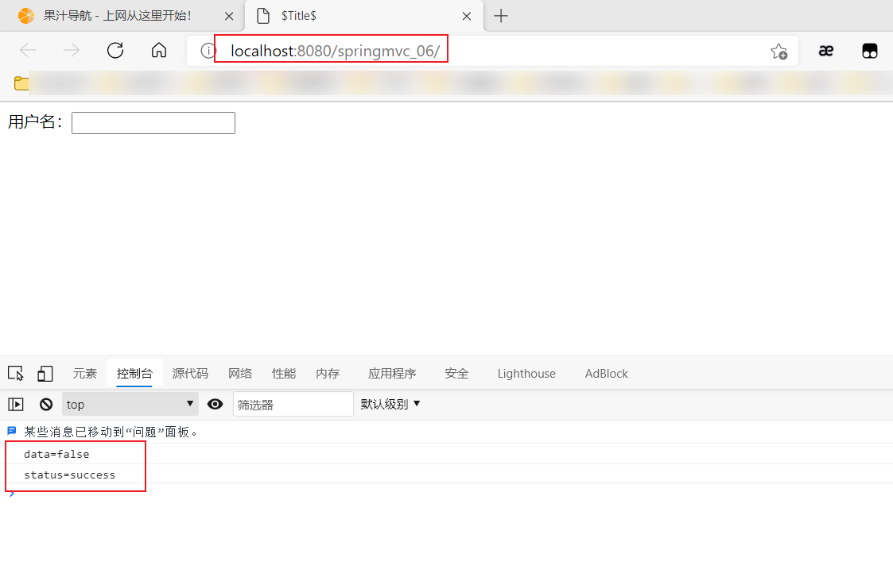

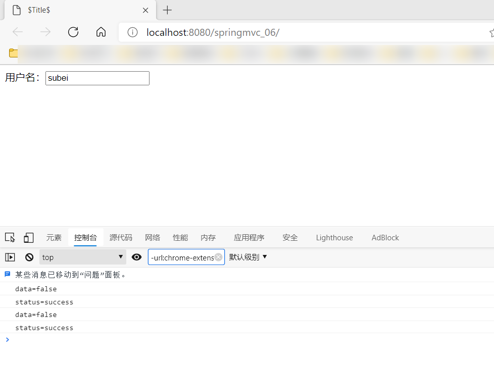

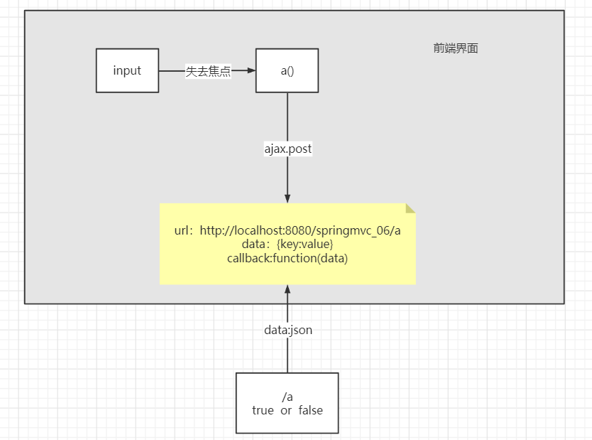

### 3.Ajax异步加载数据

- 实体类user 

````java
package com.github.subei.pojo;

import lombok.AllArgsConstructor;
import lombok.Data;
import lombok.NoArgsConstructor;

@Data
@AllArgsConstructor
@NoArgsConstructor
public class User {
    private String name;
    private int age;
    private String sex;

}
````

- 获取一个集合对象，展示到前端页面 

```java
    @RequestMapping("/a2")
    public List<User> a2(){
        List<User> list = new ArrayList<User>();
        list.add(new User("哇哈哈1号",9,"男"));
        list.add(new User("哇哈哈2号",6,"男"));
        list.add(new User("哇哈哈3号",1,"男"));
        return list; // 由于@RestController注解，将list转成json格式返回
    }
```

- 前端页面 

```html
<%@ page contentType="text/html;charset=UTF-8" language="java" %>
<html>
<head>
    <title>Title</title>
</head>
<body>
<input type="button" id="btn" value="获取数据"/>
<table width="80%" align="center">
    <tr>
        <td>姓名</td>
        <td>年龄</td>
        <td>性别</td>
    </tr>
    <tbody id="content">
    </tbody>
</table>

<script src="${pageContext.request.contextPath}/statics/js/jquery-3.5.1.js"></script>
<script>

    $(function () {
        $("#btn").click(function () {
            $.post("${pageContext.request.contextPath}/a2",function (data) {
                console.log(data)
                var html="";
                for (var i = 0; i <data.length ; i++) {
                    html+= "<tr>" +
                        "<td>" + data[i].name + "</td>" +
                        "<td>" + data[i].age + "</td>" +
                        "<td>" + data[i].sex + "</td>" +
                        "</tr>"
                }
                $("#content").html(html);
            });
        })
    })
</script>
</body>
</html>
```

- 测试服务器

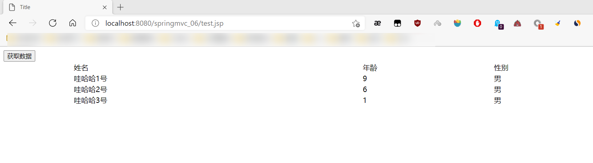

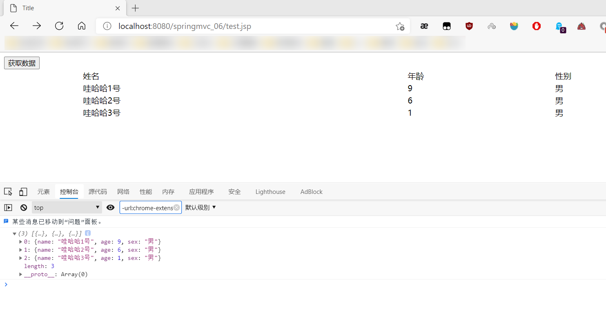

### 4.Ajax验证用户名体验

- 编写Controller 

```java
    @RequestMapping("/a3")
    public String a3(String name,String pwd){
        String msg = "";
        //模拟数据库中存在数据
        if (name!=null){
            if ("admin".equals(name)){
                msg = "OK";
            }else {
                msg = "用户名输入错误";
            }
        }
        if (pwd!=null){
            if ("123456".equals(pwd)){
                msg = "OK";
            }else {
                msg = "密码输入有误";
            }
        }
        return msg; //由于@RestController注解，将msg转成json格式返回
    }
```

- 前端页面 login.jsp 

```jsp
<%@ page contentType="text/html;charset=UTF-8" language="java" %>
<html>
<head>
    <title>ajax</title>
    <script src="${pageContext.request.contextPath}/statics/js/jquery-3.5.1.js"></script>
    <script>

        function a1(){
            $.post({
                url:"${pageContext.request.contextPath}/a3",
                data:{'name':$("#name").val()},
                success:function (data) {
                    if (data.toString()=='OK'){
                        $("#userInfo").css("color","green");
                    }else {
                        $("#userInfo").css("color","red");
                    }
                    $("#userInfo").html(data);
                }
            });
        }
        function a2(){
            $.post({
                url:"${pageContext.request.contextPath}/a3",
                data:{'pwd':$("#pwd").val()},
                success:function (data) {
                    if (data.toString()=='OK'){
                        $("#pwdInfo").css("color","green");
                    }else {
                        $("#pwdInfo").css("color","red");
                    }
                    $("#pwdInfo").html(data);
                }
            });
        }

    </script>
</head>
<body>
<p>
    用户名:<input type="text" id="name" onblur="a1()"/>
    <span id="userInfo"></span>
</p>
<p>
    密码:<input type="text" id="pwd" onblur="a2()"/>
    <span id="pwdInfo"></span>
</p>
</body>
</html>
```

- 测试一下效果 

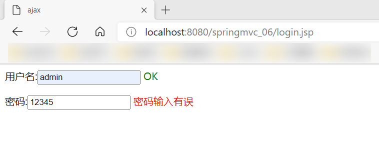

### 5.获取baidu接口Demo 

```html
<!DOCTYPE HTML>
<html>
<head>
    <meta http-equiv="Content-Type" content="text/html; charset=utf-8">
    <title>JSONP百度搜索</title>
    <style>
        #q{
            width: 500px;
            height: 30px;
            border:1px solid #ddd;
            line-height: 30px;
            display: block;
            margin: 0 auto;
            padding: 0 10px;
            font-size: 14px;
        }
        #ul{
            width: 520px;
            list-style: none;
            margin: 0 auto;
            padding: 0;
            border:1px solid #ddd;
            margin-top: -1px;
            display: none;
        }
        #ul li{
            line-height: 30px;
            padding: 0 10px;
        }
        #ul li:hover{
            background-color: #f60;
            color: #fff;
        }
    </style>
    <script>

        // 2.步骤二
        // 定义demo函数 (分析接口、数据)
        function demo(data){
            var Ul = document.getElementById('ul');
            var html = '';
            // 如果搜索数据存在 把内容添加进去
            if (data.s.length) {
                // 隐藏掉的ul显示出来
                Ul.style.display = 'block';
                // 搜索到的数据循环追加到li里
                for(var i = 0;i<data.s.length;i++){
                    html += '<li>'+data.s[i]+'</li>';
                }
                // 循环的li写入ul
                Ul.innerHTML = html;
            }
        }

        // 1.步骤一
        window.onload = function(){
            // 获取输入框和ul
            var Q = document.getElementById('q');
            var Ul = document.getElementById('ul');

            // 事件鼠标抬起时候
            Q.onkeyup = function(){
                // 如果输入框不等于空
                if (this.value != '') {
                    // 创建标签
                    var script = document.createElement('script');
                    //给定要跨域的地址 赋值给src
                    //这里是要请求的跨域的地址 我写的是百度搜索的跨域地址
                    script.src = 'https://sp0.baidu.com/5a1Fazu8AA54nxGko9WTAnF6hhy/su?wd='+this.value+'&cb=demo';
                    // 将组合好的带src的script标签追加到body里
                    document.body.appendChild(script);
                }
            }
        }
    </script>
</head>

<body>
<input type="text" id="q" />
<ul id="ul">

</ul>
</body>
</html>
```

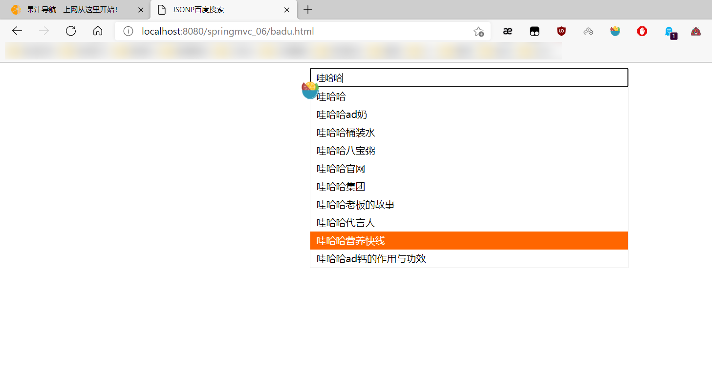

## 9、拦截器

### 1.概述

SpringMVC的处理器拦截器类似于Servlet开发中的过滤器Filter,用于对处理器进行预处理和后处理。开发者可以自己定义一些拦截器来实现特定的功能。

- **过滤器与拦截器的区别：**拦截器是AOP思想的具体应用。

> **过滤器**

- servlet规范中的一部分，任何java web工程都可以使用
- 在url-pattern中配置了/*之后，可以对所有要访问的资源进行拦截

> **拦截器** 

- 拦截器是SpringMVC框架自己的，只有使用了SpringMVC框架的工程才能使用
- 拦截器只会拦截访问的控制器方法， 如果访问的是jsp/html/css/image/js是不会进行拦截的

### 2.自定义拦截器

那如何实现拦截器呢？

想要自定义拦截器，必须实现 HandlerInterceptor 接口。

1、新建一个Moudule ， springmvc-07-Interceptor  ， 添加web支持。

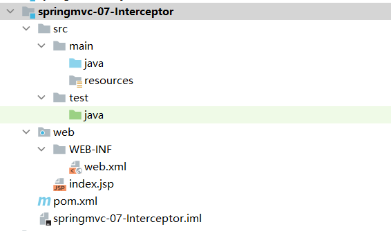

2、配置web.xml 和 applicationContext.xml 文件

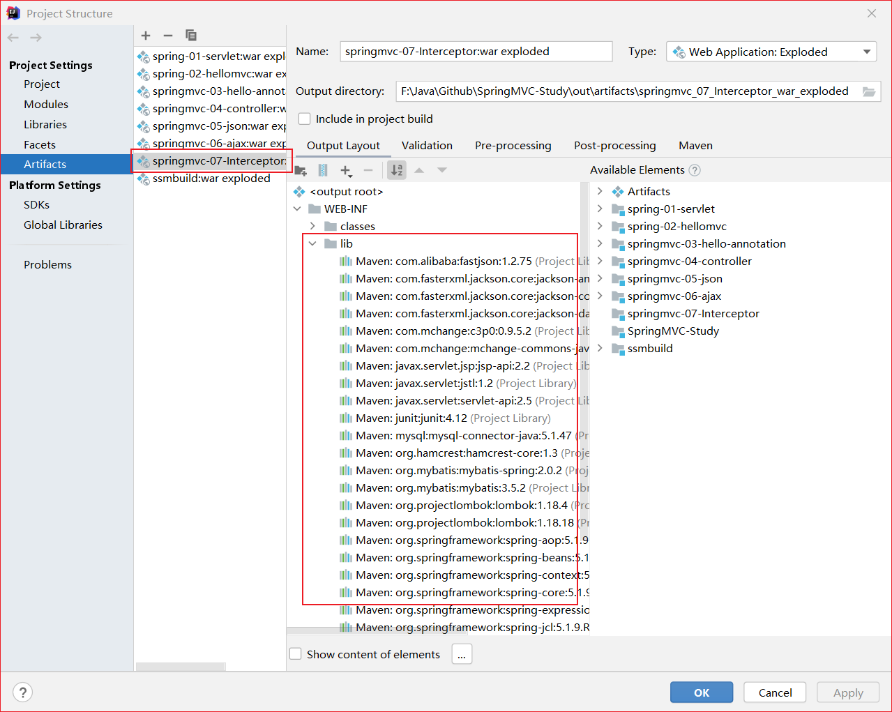

- web.xml

```xml
<?xml version="1.0" encoding="UTF-8"?>
<web-app xmlns="http://xmlns.jcp.org/xml/ns/javaee"
         xmlns:xsi="http://www.w3.org/2001/XMLSchema-instance"
         xsi:schemaLocation="http://xmlns.jcp.org/xml/ns/javaee http://xmlns.jcp.org/xml/ns/javaee/web-app_4_0.xsd"
         version="4.0">
    <servlet>
        <servlet-name>springmvc</servlet-name>
        <servlet-class>org.springframework.web.servlet.DispatcherServlet</servlet-class>
        <init-param>
            <param-name>contextConfigLocation</param-name>
            <param-value>classpath:applicationContext.xml</param-value>
        </init-param>
        <load-on-startup>1</load-on-startup>
    </servlet>
    <servlet-mapping>
        <servlet-name>springmvc</servlet-name>
        <url-pattern>/</url-pattern>
    </servlet-mapping>

    <filter>
        <filter-name>encoding</filter-name>
        <filter-class>org.springframework.web.filter.CharacterEncodingFilter</filter-class>
        <init-param>
            <param-name>encoding</param-name>
            <param-value>utf-8</param-value>
        </init-param>
    </filter>
    <filter-mapping>
        <filter-name>encoding</filter-name>
        <url-pattern>/*</url-pattern>
    </filter-mapping>

</web-app>
```

- applicationContext.xml

```xml
<?xml version="1.0" encoding="UTF-8"?>
<beans xmlns="http://www.springframework.org/schema/beans"
       xmlns:xsi="http://www.w3.org/2001/XMLSchema-instance"
       xmlns:context="http://www.springframework.org/schema/context"
       xmlns:mvc="http://www.springframework.org/schema/mvc"
       xsi:schemaLocation="http://www.springframework.org/schema/beans
       http://www.springframework.org/schema/beans/spring-beans.xsd
       http://www.springframework.org/schema/context
       https://www.springframework.org/schema/context/spring-context.xsd
       http://www.springframework.org/schema/mvc
       https://www.springframework.org/schema/mvc/spring-mvc.xsd">

    <!-- 自动扫描指定的包，下面所有注解类交给IOC容器管理 -->
    <context:component-scan base-package="com.github.subei.controller"/>
    <!-- 静态资源过滤 -->
    <mvc:default-servlet-handler />
    <mvc:annotation-driven />

    <!-- 视图解析器 -->
    <bean class="org.springframework.web.servlet.view.InternalResourceViewResolver"
          id="internalResourceViewResolver">
        <!-- 前缀 -->
        <property name="prefix" value="/WEB-INF/jsp/" />
        <!-- 后缀 -->
        <property name="suffix" value=".jsp" />
    </bean>

    <!-- JSON乱码问题 -->
    <mvc:annotation-driven>
        <mvc:message-converters register-defaults="true">
            <bean class="org.springframework.http.converter.StringHttpMessageConverter">
                <constructor-arg value="UTF-8"/>
            </bean>
            <bean class="org.springframework.http.converter.json.MappingJackson2HttpMessageConverter">
                <property name="objectMapper">
                    <bean class="org.springframework.http.converter.json.Jackson2ObjectMapperFactoryBean">
                        <property name="failOnEmptyBeans" value="false"/>
                    </bean>
                </property>
            </bean>
        </mvc:message-converters>
    </mvc:annotation-driven>

</beans>
```

3. 编写一个拦截器

```java
package com.github.subei.interceptor;

import org.springframework.web.servlet.HandlerInterceptor;
import org.springframework.web.servlet.ModelAndView;

import javax.servlet.http.HttpServletRequest;
import javax.servlet.http.HttpServletResponse;

package com.github.subei.interceptor;

import org.springframework.web.servlet.HandlerInterceptor;
import org.springframework.web.servlet.ModelAndView;

import javax.servlet.http.HttpServletRequest;
import javax.servlet.http.HttpServletResponse;

public class Interceptor implements HandlerInterceptor {

    // 在请求处理的方法之前执行
    // 如果返回true执行下一个拦截器
    // 如果返回false就不执行下一个拦截器
    public boolean preHandle(HttpServletRequest httpServletRequest, HttpServletResponse httpServletResponse, Object o) throws Exception {
        System.out.println("------------处理前------------");
        return true;
    }

    // 在请求处理方法执行之后执行
    public void postHandle(HttpServletRequest httpServletRequest, HttpServletResponse httpServletResponse, Object o, ModelAndView modelAndView) throws Exception {
        System.out.println("------------处理后------------");
    }

    // 在dispatcherServlet处理后执行,做清理工作.
    public void afterCompletion(HttpServletRequest httpServletRequest, HttpServletResponse httpServletResponse, Object o, Exception e) throws Exception {
        System.out.println("------------清理------------");
    }
}
```

4. 在applicationContext.xml的配置文件中配置拦截器 

```xml
    <!--关于拦截器的配置-->
    <mvc:interceptors>
        <mvc:interceptor>
            <!--/** 包括路径及其子路径-->
            <!--/admin/* 拦截的是/admin/add等等这种 , /admin/add/user不会被拦截-->
            <!--/admin/** 拦截的是/admin/下的所有-->
            <mvc:mapping path="/**"/>
            <!--bean配置的就是拦截器-->
            <bean class="com.github.subei.interceptor.Interceptor"/>
        </mvc:interceptor>
    </mvc:interceptors>
```

5. 编写一个Controller，接收请求 

```java
package com.github.subei.controller;

import org.springframework.stereotype.Controller;
import org.springframework.web.bind.annotation.RequestMapping;
import org.springframework.web.bind.annotation.ResponseBody;

// 测试拦截器的控制器
@Controller
public class InterceptorController {
    @RequestMapping("/k1")
    @ResponseBody
    public String testFunction() {
        System.out.println("控制器中的方法执行了==》");
        return "hello";
    }
}
```

6. 前端 index.jsp 

```jsp
<%@ page contentType="text/html;charset=UTF-8" language="java" %>
<html>
  <head>
    <title>$Title$</title>
  </head>
  <body>
  <a href="${pageContext.request.contextPath}/k1">拦截器测试</a>
  </body>
</html>
```

 7、启动tomcat 测试一下！ 

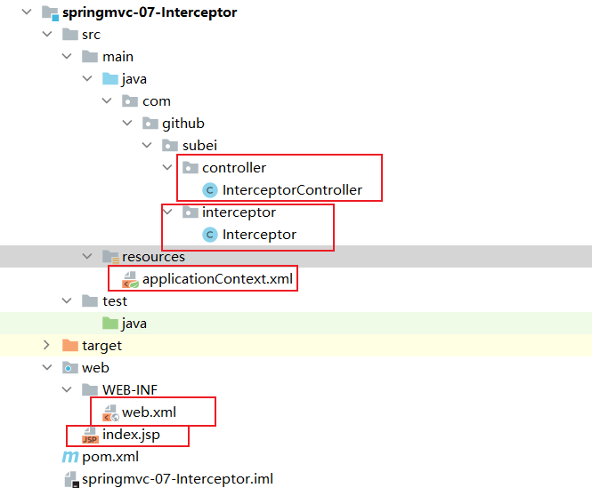

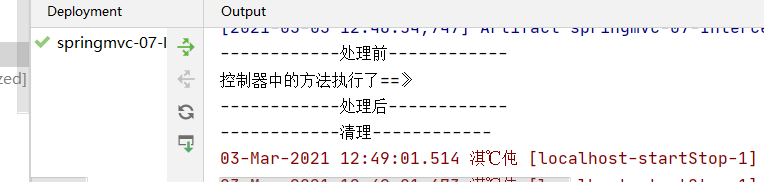

### 3.验证用户是否登录

> **实现思路**

1. 有一个登陆页面，需要写一个controller访问页面。
2. 登陆页面有一提交表单的动作。需要在controller中处理。判断用户名密码是否正确。如果正确，向session中写入用户信息。返回登陆成功。
3. 拦截用户请求，判断用户是否登陆。如果用户已经登陆。放行， 如果用户未登陆，跳转到登陆页面

> **案例测试：**

1. 编写一个登陆页面  login.jsp

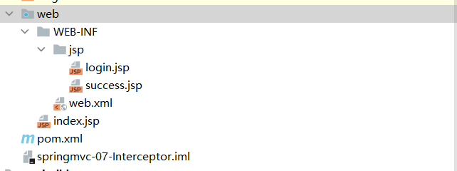

```jsp
<%@ page contentType="text/html;charset=UTF-8" language="java" %>
<html>
<head>
    <title>Title</title>
</head>

<h1>登录页面</h1>
<hr>

<body>
<form action="${pageContext.request.contextPath}/user/login">
    用户名：<input type="text" name="username"> <br>
    密码：<input type="password" name="pwd"> <br>
    <input type="submit" value="提交">
</form>
</body>
</html>
```

2. 编写一个Controller处理请求 

```java
package com.github.subei.controller;

import org.springframework.stereotype.Controller;
import org.springframework.web.bind.annotation.RequestMapping;

import javax.servlet.http.HttpSession;

@Controller
@RequestMapping("/user")
public class UserController {

    // 跳转到登陆页面
    @RequestMapping("/jumplogin")
    public String jumpLogin() throws Exception {
        return "login";
    }

    // 跳转到成功页面
    @RequestMapping("/jumpSuccess")
    public String jumpSuccess() throws Exception {
        return "success";
    }

    // 登陆提交
    @RequestMapping("/login")
    public String login(HttpSession session, String username, String pwd) throws Exception {
        // 向session记录用户身份信息
        System.out.println("接收前端==="+username);
        session.setAttribute("user", username);
        return "success";
    }

    // 退出登陆
    @RequestMapping("logout")
    public String logout(HttpSession session) throws Exception {
        // session 过期
        session.invalidate();
        return "login";
    }
}
```

3. 编写一个登陆成功的页面 success.jsp 

```jsp
<%@ page contentType="text/html;charset=UTF-8" language="java" %>
<html>
<head>
    <title>Title</title>
</head>
<body>

<h1>登录成功页面</h1>
<hr>

${user}
<a href="${pageContext.request.contextPath}/user/logout">注销</a>
</body>
</html>
```

4. 在 index.jsp 页面上测试跳转！启动Tomcat 测试，未登录也可以进入主页！ 

```jsp
<%@ page contentType="text/html;charset=UTF-8" language="java" %>
<html>
  <head>
    <title>$Title$</title>
  </head>
  <body>
  <%--登录--%>
  <a href="${pageContext.request.contextPath}/user/jumplogin">登录</a>
  <a href="${pageContext.request.contextPath}/user/jumpSuccess">成功页面</a>
  </body>
</html>
```

5. 编写用户登录拦截器 

```java
package com.github.subei.interceptor;

import org.springframework.web.servlet.HandlerInterceptor;
import org.springframework.web.servlet.ModelAndView;

import javax.servlet.ServletException;
import javax.servlet.http.HttpServletRequest;
import javax.servlet.http.HttpServletResponse;
import javax.servlet.http.HttpSession;
import java.io.IOException;

public class LoginInterceptor implements HandlerInterceptor {

    public boolean preHandle(HttpServletRequest request, HttpServletResponse response, Object handler) throws ServletException, IOException, ServletException, IOException {
        // 如果是登陆页面则放行
        System.out.println("uri: " + request.getRequestURI());
        if (request.getRequestURI().contains("login")) {
            return true;
        }

        HttpSession session = request.getSession();

        // 如果用户已登陆也放行
        if(session.getAttribute("user") != null) {
            return true;
        }

        // 用户没有登陆跳转到登陆页面
        request.getRequestDispatcher("/WEB-INF/jsp/login.jsp").forward(request, response);
        return false;
    }

    public void postHandle(HttpServletRequest httpServletRequest, HttpServletResponse httpServletResponse, Object o, ModelAndView modelAndView) throws Exception {

    }

    public void afterCompletion(HttpServletRequest httpServletRequest, HttpServletResponse httpServletResponse, Object o, Exception e) throws Exception {

    }
}
```

6. 在applicationContext.xml的配置文件中注册拦截器 

```jsp
    <!--关于拦截器的配置-->
    <mvc:interceptors>
        <mvc:interceptor>
            <!--/** 包括路径及其子路径-->
            <!--/admin/* 拦截的是/admin/add等等这种 , /admin/add/user不会被拦截-->
            <!--/admin/** 拦截的是/admin/下的所有-->
            <mvc:mapping path="/**"/>
            <!--bean配置的就是拦截器-->
            <bean class="com.github.subei.interceptor.LoginInterceptor"/>
        </mvc:interceptor>
    </mvc:interceptors>
```

7. 再次重启Tomcat测试！ 

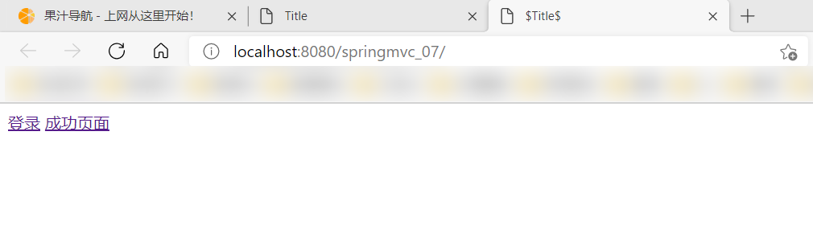

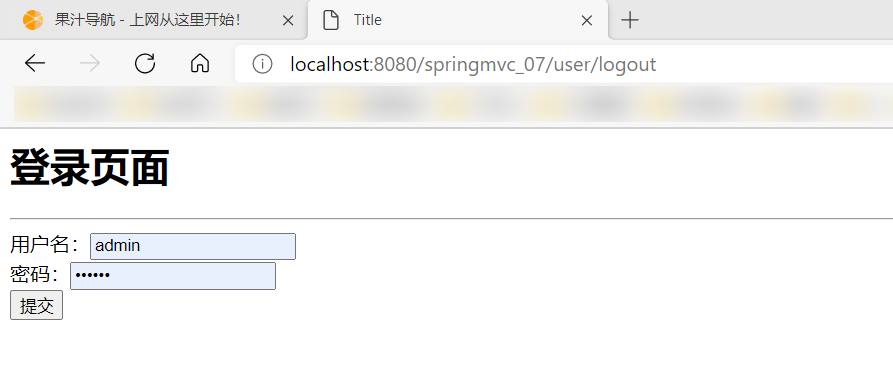

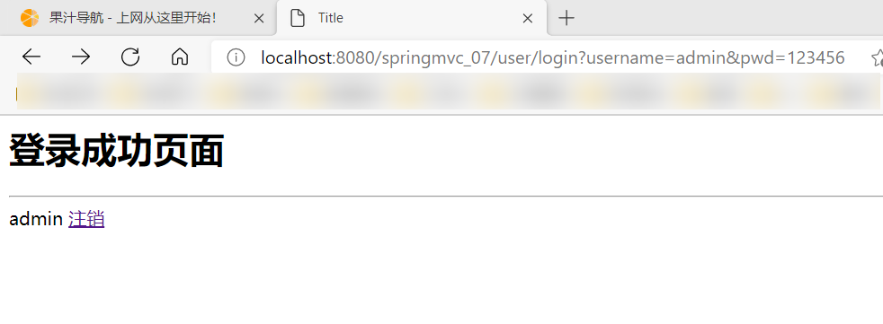


## 10、文件上传和下载

### 1.准备工作 

- 文件上传是项目开发中最常见的功能之一 ,springMVC 可以很好的支持文件上传，但是SpringMVC上下文中默认没有装配MultipartResolver，因此默认情况下其不能处理文件上传工作。如果想使用Spring的文件上传功能，则需要在上下文中配置MultipartResolver。

- 前端表单要求：为了能上传文件，必须将表单的method设置为POST，并将enctype设置为multipart/form-data。只有在这样的情况下，浏览器才会把用户选择的文件以二进制数据发送给服务器；

> **对表单中的 enctype 属性做个详细的说明：**

- application/x-www=form-urlencoded：默认方式，只处理表单域中的 value 属性值，采用这种编码方式的表单会将表单域中的值处理成 URL 编码方式。
- multipart/form-data：这种编码方式会以二进制流的方式来处理表单数据，这种编码方式会把文件域指定文件的内容也封装到请求参数中，不会对字符编码。
- text/plain：除了把空格转换为 "+" 号外，其他字符都不做编码处理，这种方式适用直接通过表单发送邮件。

```jsp
<form action="" enctype="multipart/form-data" method="post">
   <input type="file" name="file"/>
   <input type="submit">
</form>
```

> 一旦设置了enctype为multipart/form-data，浏览器即会采用二进制流的方式来处理表单数据，而对于文件上传的处理则涉及在服务器端解析原始的HTTP响应。在2003年，Apache Software Foundation发布了开源的Commons FileUpload组件，其很快成为Servlet/JSP程序员上传文件的最佳选择。

- Servlet3.0规范已经提供方法来处理文件上传，但这种上传需要在Servlet中完成。
- 而Spring MVC则提供了更简单的封装。
- Spring MVC为文件上传提供了直接的支持，这种支持是用即插即用的MultipartResolver实现的。
- Spring MVC使用Apache Commons FileUpload技术实现了一个MultipartResolver实现类：
- CommonsMultipartResolver。因此，SpringMVC的文件上传还需要依赖Apache Commons FileUpload的组件。

### 2.文件上传

1. 导入文件上传的jar包，commons-fileupload ， Maven会自动帮我们导入依赖包 commons-io包； 

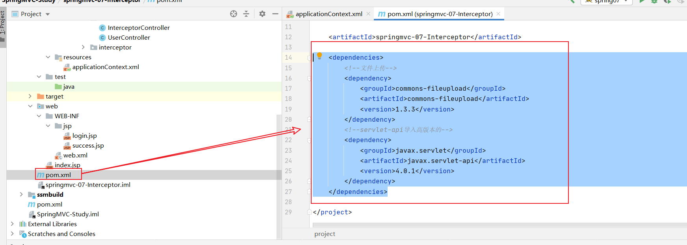

```xml
    <dependencies>
        <!--文件上传-->
        <dependency>
            <groupId>commons-fileupload</groupId>
            <artifactId>commons-fileupload</artifactId>
            <version>1.3.3</version>
        </dependency>
        <dependency>
            <groupId>javax.servlet</groupId>
            <artifactId>javax.servlet-api</artifactId>
            <version>3.0.1</version>
            <scope>provided</scope>
        </dependency>
        
    </dependencies>
```

2. 配置bean：multipartResolver，在 applicationContext.xml 中配置。

> 【**注意！！！这个bena的id必须为：multipartResolver ， 否则上传文件会报400的错误！在这里栽过坑,教训！**】

```xml
<?xml version="1.0" encoding="UTF-8"?>
<beans xmlns="http://www.springframework.org/schema/beans"
       xmlns:xsi="http://www.w3.org/2001/XMLSchema-instance"
       xmlns:context="http://www.springframework.org/schema/context"
       xmlns:mvc="http://www.springframework.org/schema/mvc"
       xsi:schemaLocation="http://www.springframework.org/schema/beans
       http://www.springframework.org/schema/beans/spring-beans.xsd
       http://www.springframework.org/schema/context
       https://www.springframework.org/schema/context/spring-context.xsd
       http://www.springframework.org/schema/mvc
       https://www.springframework.org/schema/mvc/spring-mvc.xsd">

    <!-- 自动扫描指定的包，下面所有注解类交给IOC容器管理 -->
    <context:component-scan base-package="com.github.subei.controller"/>
    <!-- 静态资源过滤 -->
    <mvc:default-servlet-handler />
    <mvc:annotation-driven />

    <!-- 视图解析器 -->
    <bean class="org.springframework.web.servlet.view.InternalResourceViewResolver"
          id="internalResourceViewResolver">
        <!-- 前缀 -->
        <property name="prefix" value="/WEB-INF/jsp/" />
        <!-- 后缀 -->
        <property name="suffix" value=".jsp" />
    </bean>

    <!--文件上传配置-->
    <bean id="multipartResolver"  class="org.springframework.web.multipart.commons.CommonsMultipartResolver">
        <!-- 请求的编码格式，必须和jSP的pageEncoding属性一致，以便正确读取表单的内容，默认为ISO-8859-1 -->
        <property name="defaultEncoding" value="utf-8"/>
        <!-- 上传文件大小上限，单位为字节（10485760=10M） -->
        <property name="maxUploadSize" value="10485760"/>
        <property name="maxInMemorySize" value="40960"/>
    </bean>

    <!-- JSON乱码问题 -->
    <mvc:annotation-driven>
        <mvc:message-converters register-defaults="true">
            <bean class="org.springframework.http.converter.StringHttpMessageConverter">
                <constructor-arg value="UTF-8"/>
            </bean>
            <bean class="org.springframework.http.converter.json.MappingJackson2HttpMessageConverter">
                <property name="objectMapper">
                    <bean class="org.springframework.http.converter.json.Jackson2ObjectMapperFactoryBean">
                        <property name="failOnEmptyBeans" value="false"/>
                    </bean>
                </property>
            </bean>
        </mvc:message-converters>
    </mvc:annotation-driven>

</beans>
```

> CommonsMultipartFile 的 常用方法：

- **String getOriginalFilename()：获取上传文件的原名**
- **InputStream getInputStream()：获取文件流**
- **void transferTo(File dest)：将上传文件保存到一个目录文件中**

3. 编写前端页面，index.jsp

```jsp
<%@ page contentType="text/html;charset=UTF-8" language="java" %>
<html>
  <head>
    <title>$Title$</title>
  </head>
  <body>
  <form action="${pageContext.request.contextPath}/upload" enctype="multipart/form-data" method="post">
    <input type="file" name="file"/>
    <input type="submit" value="upload">
  </form>
  </body>
</html>
```

4. **Controller** 

```java
package com.github.subei.controller;

import org.springframework.stereotype.Controller;
import org.springframework.web.bind.annotation.RequestMapping;
import org.springframework.web.bind.annotation.RequestParam;
import org.springframework.web.multipart.commons.CommonsMultipartFile;

import javax.servlet.http.HttpServletRequest;
import java.io.*;

@Controller
public class FileController {
    // @RequestParam("file") 将name=file控件得到的文件封装成CommonsMultipartFile 对象
    // 批量上传CommonsMultipartFile则为数组即可
    @RequestMapping("/upload")
    public String fileUpload(@RequestParam("file") CommonsMultipartFile file , HttpServletRequest request) throws IOException {

        // 获取文件名 : file.getOriginalFilename();
        String uploadFileName = file.getOriginalFilename();

        // 如果文件名为空，直接回到首页！
        if ("".equals(uploadFileName)){
            return "redirect:/index.jsp";
        }
        System.out.println("上传文件名 : "+uploadFileName);

        // 上传路径保存设置
        String path = request.getServletContext().getRealPath("/upload");
        // 如果路径不存在，创建一个
        File realPath = new File(path);
        if (!realPath.exists()){
            realPath.mkdir();
        }
        System.out.println("上传文件保存地址："+realPath);

        InputStream is = file.getInputStream(); //文件输入流
        OutputStream os = new FileOutputStream(new File(realPath,uploadFileName)); //文件输出流

        // 读取写出
        int len=0;
        byte[] buffer = new byte[1024];
        while ((len=is.read(buffer))!=-1){
            os.write(buffer,0,len);
            os.flush();
        }
        os.close();
        is.close();
        return "redirect:/index.jsp";
    }
}
```

#### 报错：Cannot resolve method 'getServletContext' in 'HttpServletRequest'

- 这个报错原因是因为pom依赖导包`servlet-api`的版本错误：
- 在调用request.getServletContext()的方法需要`servlet-api`的版本3.0以上才可以。
- 所以把之前的版本修改一下就可以了，修改为4.0.1版本即可。如下：

```xml
        <dependency>
            <groupId>javax.servlet</groupId>
            <artifactId>javax.servlet-api</artifactId>
            <version>4.0.1</version>
            <scope>provided</scope>
        </dependency>
```

5. 测试上传，成功！！！

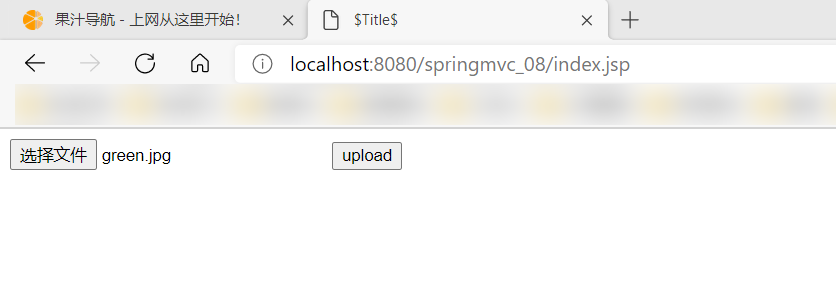

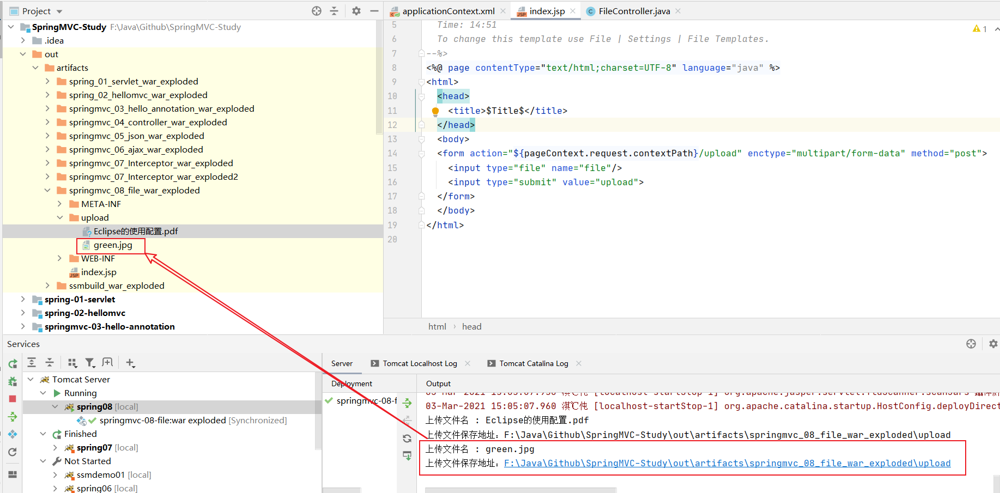

---

> **采用file.Transto 来保存上传的文件**

1. 编写Controller

```java
    /*
     * 采用file.Transto 来保存上传的文件
     */
    @RequestMapping("/upload2")
    public String  fileUpload2(@RequestParam("file") CommonsMultipartFile file, HttpServletRequest request) throws IOException {

        //上传路径保存设置
        String path = request.getServletContext().getRealPath("/upload");
        File realPath = new File(path);
        if (!realPath.exists()){
            realPath.mkdir();
        }
        //上传文件地址
        System.out.println("上传文件保存地址："+realPath);

        //通过CommonsMultipartFile的方法直接写文件（注意这个时候）
        file.transferTo(new File(realPath +"/"+ file.getOriginalFilename()));

        return "redirect:/index.jsp";
    }
```

2. 前端表单提交地址修改

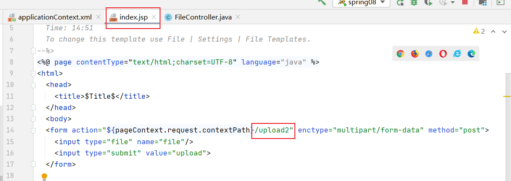

3. 访问提交测试，OK！

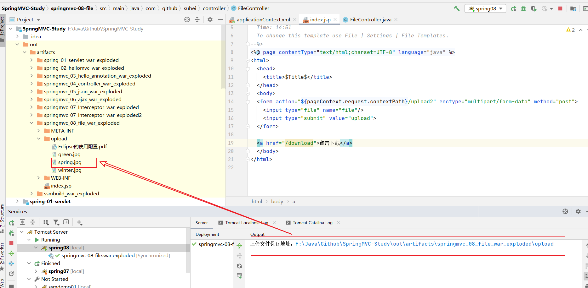

### 3.文件下载

> **文件下载步骤：**

1. 设置 response 响应头

2. 读取文件 -- InputStream

3. 写出文件 -- OutputStream

4. 执行操作

5. 关闭流 （先开后关）

> **代码实现：** 

```java
@RequestMapping(value="/download")
public String downloads(HttpServletResponse response ,HttpServletRequest request) throws Exception{
   // 要下载的图片地址
   String  path = request.getServletContext().getRealPath("/upload");
   String  fileName = "winter.jpg";

   // 1、设置response 响应头
   response.reset(); // 设置页面不缓存,清空buffer
   response.setCharacterEncoding("UTF-8"); // 字符编码
   response.setContentType("multipart/form-data"); // 二进制传输数据
   // 设置响应头
   response.setHeader("Content-Disposition",
           "attachment;fileName="+URLEncoder.encode(fileName, "UTF-8"));

   File file = new File(path,fileName);
   // 2、 读取文件--输入流
   InputStream input=new FileInputStream(file);
   // 3、 写出文件--输出流
   OutputStream out = response.getOutputStream();

   byte[] buff =new byte[1024];
   int index=0;
   // 4、执行 写出操作
   while((index= input.read(buff))!= -1){
       out.write(buff, 0, index);
       out.flush();
  }
   out.close();
   input.close();
   return null;
}
```

- 前端

```jsp
  <a href="${pageContext.request.contextPath}/download">点击下载</a>
```

- 测试，文件下载OK 

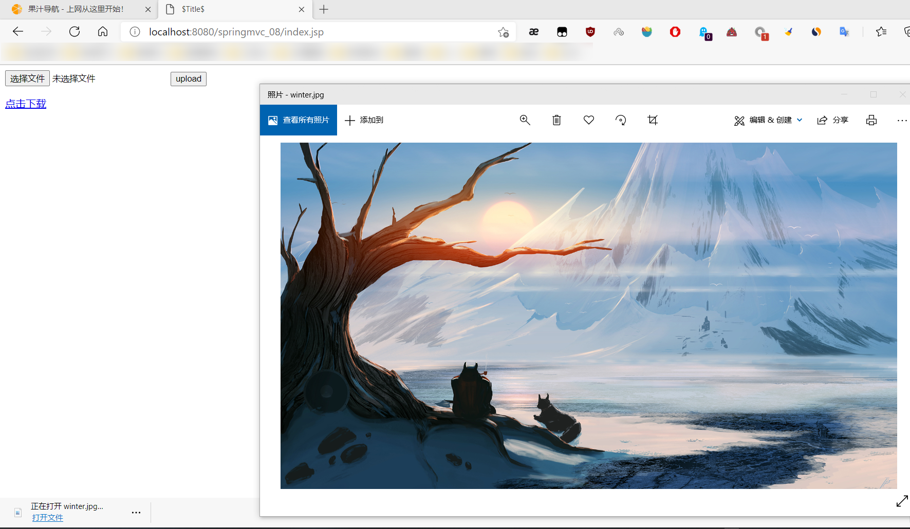