[TOC]

# Spring

## 1、Spring

### 1.1 简介

- [Spring](https://spring.io/)：春天 ------> 软件行业带来春天
- 2002，首次推出了[Spring了框架](https://baike.baidu.com/item/spring%E6%A1%86%E6%9E%B6/2853288?fr=aladdin)的雏形：[interface21框架](https://www.interface21.io/)！
- Spring框架即以interface21框架为基础,经过重新设计,并不断丰富其内涵,于2004年3月24日,发布了1.0正式版。
- **Rod Johnson**，Spring Framework创始人，著名作者。很难想象Rod Johnson的学历，真的让好多人大吃一惊，他是[悉尼大学](https://baike.baidu.com/item/悉尼大学)的博士，然而他的专业不是计算机，而是音乐学。
-  Spring理念：使现有的技术更加容易使用，本身是一个大杂烩；整合了现有的技术框架。
- SSH：Struct2 + Spring + Hibernate！
- SSM：SpringMVC + Spring + Mybatis！

---

1. 官网：[https://spring.io/projects/spring-framework#overview](https://spring.io/projects/spring-framework#overview)
2. 官方下载地址： [http://repo.spring.io/release/org/springframework/spring](https://repo.spring.io/release/org/springframework/spring)
3. 官方文档：[https://docs.spring.io/spring-framework/docs/current/reference/html/core.html](https://docs.spring.io/spring-framework/docs/current/reference/html/core.html)
4. 中文版官方文档：[https://www.docs4dev.com/docs/zh/spring-framework/5.1.3.RELEASE/reference](https://www.docs4dev.com/docs/zh/spring-framework/5.1.3.RELEASE/reference)

```xml
<!-- https://mvnrepository.com/artifact/org.springframework/spring-webmvc -->
<dependency>
    <groupId>org.springframework</groupId>
    <artifactId>spring-webmvc</artifactId>
    <version>5.2.12.RELEASE</version>
</dependency>

<!-- https://mvnrepository.com/artifact/org.springframework/spring-webmvc -->
<dependency>
    <groupId>org.springframework</groupId>
    <artifactId>spring-jdbc</artifactId>
    <version>5.2.12.RELEASE</version>
</dependency>
```

### 1.2 优点

- Spring是一个开源免费的框架（容器）！
- Spring是一个轻量级的、非入侵式的框架！
- 控制反转（IOC），面向切面编程（AOP）！
- 支持事务的处理，对框架整合的支持！

> 总结：==Spring就是一个轻量级的控制反转（IOC）和面向切面编程（AOP）的框架==。

### 1.3 组成

> 参考：[https://docs.spring.io/spring-framework/docs/4.2.x/spring-framework-reference/html/overview.html](https://docs.spring.io/spring-framework/docs/4.2.x/spring-framework-reference/html/overview.html)

 

> Spring 框架是一个分层架构，由 7 个定义良好的模块组成。 

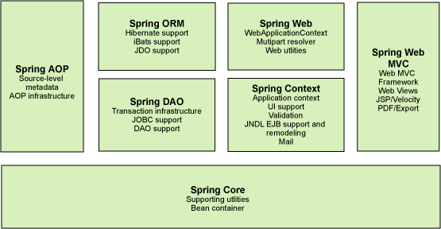 

### 1.4 拓展

- 在[Spring的官网](https://spring.io.xy2401.com/)有这个介绍：现代化的Java开发！说白了就是基于Spring的开发！

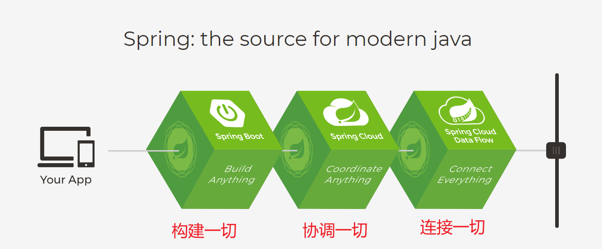

- Spring Boot
  - 一个快速开发的脚手架。
  - 基于Spring Boot 可以快速开发单个微服务。
  - 约定大于配置！
- Spring Cloud
  - Spring Clound 是基于Spring Boot 实现的。

> **为什么要学Spring?**
>
> 因为：现在大多数公司都在使用 Spring Boot 进行快速开发，学习 Spring Boot 的前提，需要完全掌握 Spring 及 Spring MVC！承上启下的作用！

> 弊端：发展了太久之后，违背了原来的理念！配置十分繁琐，人称：“配置地狱！”。

----

## 2、IOC理论推导

### 2.1 引例

> 先构建下图基本框架，并导入maven环境文件。

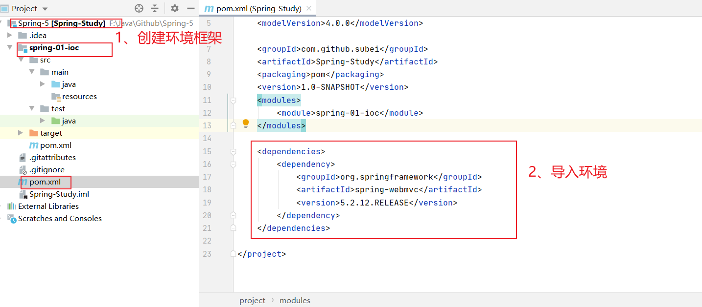


1. UserDao 接口

   ```java
   package com.github.subei.dao;
   
   public interface UserDao {
       void getUser();
   }
   ```

2. UserDaoImpl 实现类

   ```java
   package com.github.subei.dao;
   
   public class UserDaoImpl implements UserDao{
       public void getUser() {
           System.out.println("默认获取用户的数据……");
       }
   }
   ```

3. UserService 业务接口

   ```java
   package com.github.subei.service;
   
   public interface UserService {
       void getUser();
   }
   ```

4. UserServiceImpl 业务实现类

   ```java
   package com.github.subei.service;
   
   import com.github.subei.dao.UserDao;
   import com.github.subei.dao.UserDaoImpl;
   
   public class UserServiceImpl implements UserService{
       private UserDao userDao = new UserDaoImpl();
   
       public void getUser() {
           userDao.getUser();
       }
   }
   ```

5. 测试类MyTest

   ```java
   import com.github.subei.service.UserServiceImpl;
   
   public class MyTest {
       public static void main(String[] args) {
           // 用户实际调用的是业务层，dao层不需要接触
           UserServiceImpl userService = new UserServiceImpl();
   
           userService.getUser();
       }
   }
   ```

   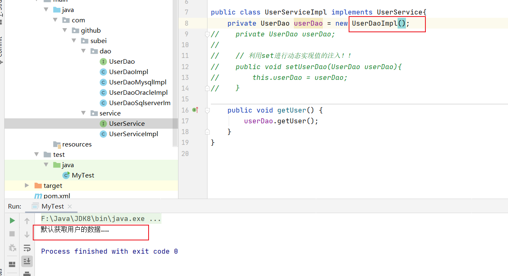

   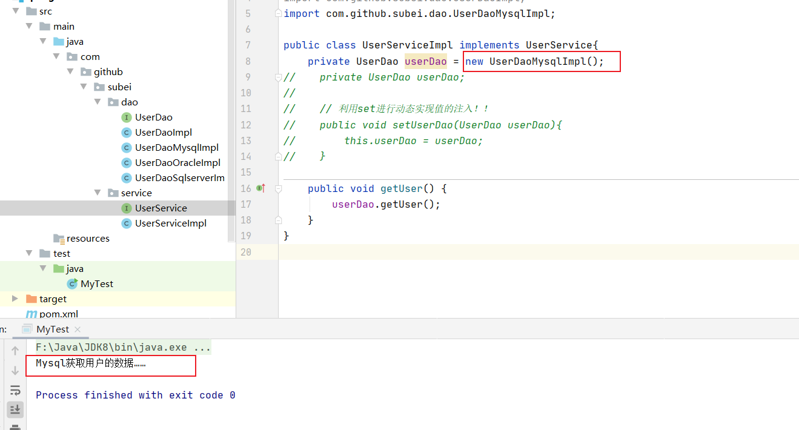

   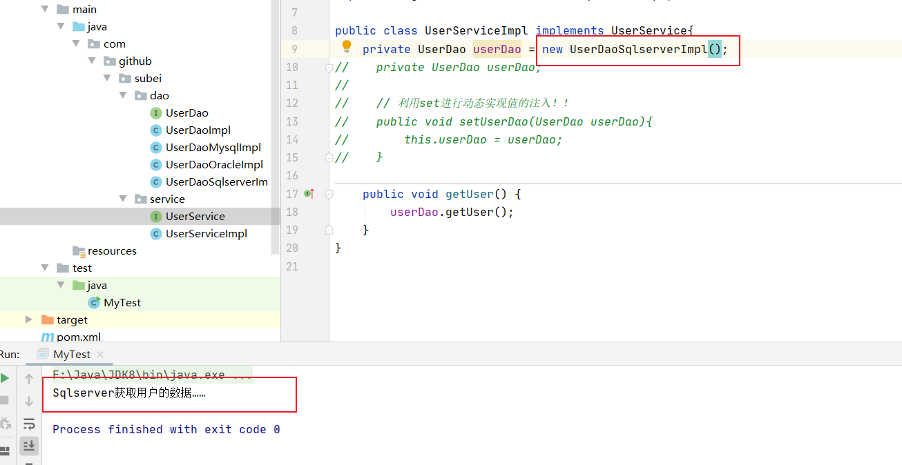

> 在我们之前的业务中，用户的需求可能会影响我们原来的代码，我们需要根据用户的需求去修改原代码！如果程序代码量十分大，修改一次的成本十分昂贵。

- 我们使用一个set接口实现。修改UserServiceImpl.java文件

```java
package com.github.subei.service;

import com.github.subei.dao.UserDao;

public class UserServiceImpl implements UserService{
//    private UserDao userDao = new UserDaoImpl();
    private UserDao userDao;

    // 利用set进行动态实现值的注入！！
    public void setUserDao(UserDao userDao){
        this.userDao = userDao;
    }

    public void getUser() {
        userDao.getUser();
    }
}
```

- 测试类

```java
import com.github.subei.dao.UserDaoSqlserverImpl;
import com.github.subei.service.UserServiceImpl;

public class MyTest {
    public static void main(String[] args) {
        // 用户实际调用的是业务层，dao层不需要接触
        UserServiceImpl userService = new UserServiceImpl();

        userService.setUserDao(new UserDaoSqlserverImpl());
        userService.getUser();
    }
}
```

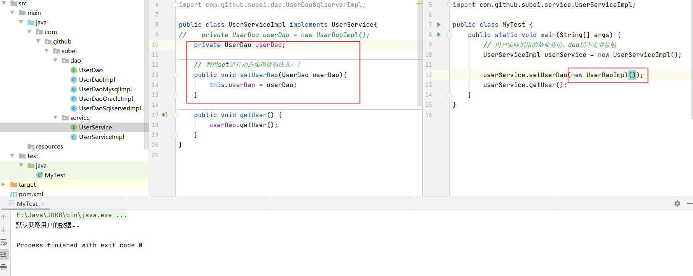

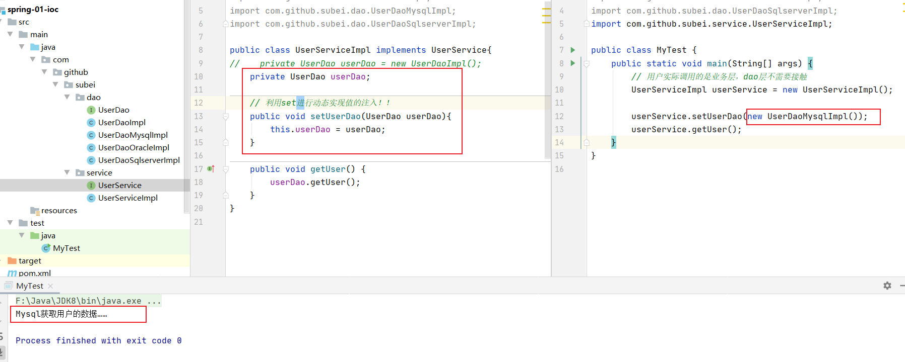

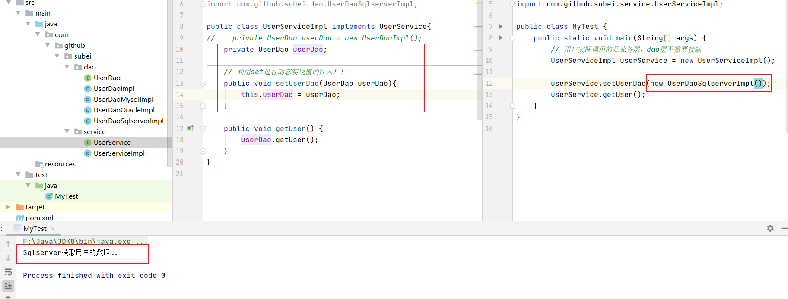

- 之前，程序是主动创建对象！控制权在程序猿手上！
- 使用了set注入后，程序不再具有主动性，而是变成了被动的接受对象！

> 这种思想，从本质上解决了问题，我们程序猿不用再去管理对象的创建了。系统的耦合性大大降低，可以更加专注的在业务的实现上！==这是IOC的原型==。

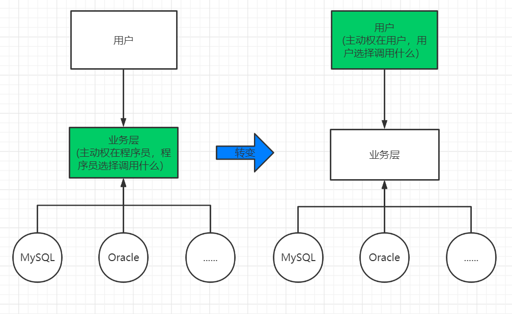

### 2.2 IOC的本质

> **控制反转loC(Inversion of Control)，是一种设计思想，DI（依赖注入）是实现loC的一种方法**，也有人认为DI只是loC的另一种说法。没有loC的程序中，我们使用面向对象编程，对象的创建与对象间的依赖关系完全硬编码在程序中，对象的创建由程序自己控制，控制反转后将对象的创建转移给第三方，个人认为所谓控制反转就是：获得依赖对象的方式反转了。

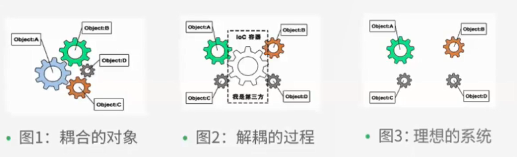

- **IoC是Spring框架的核心内容**，使用多种方式完美的实现了IoC，可以使用XML配置，也可以使用注解，新版本的Spring也可以零配置实现IoC。

- Spring容器在初始化时先读取配置文件，根据配置文件或元数据创建与组织对象存入容器中，程序使用时再从Ioc容器中取出需要的对象。

  

- 采用XML方式配置Bean的时候，Bean的定义信息是和实现分离的，而采用注解的方式可以把两者合为一体，Bean的定义信息直接以注解的形式定义在实现类中，从而达到了零配置的目的。
- **控制反转是一种通过描述（XML或注解）并通过第三方去生产或获取特定对象的方式。在Spring中实现控制反转的是IoC容器，其实现方法是依赖注入（Dependency Injection,DI）。**

## 3、HelloSpring

> 新建项目，导入Jar包


- 注 : spring 需要导入commons-logging进行日志记录 . 利用maven , 它会自动下载对应的依赖项。

```xml
    <dependencies>
        <dependency>
            <groupId>org.springframework</groupId>
            <artifactId>spring-webmvc</artifactId>
            <version>5.2.12.RELEASE</version>
        </dependency>
    </dependencies>
```

> 编写代码：

1. 编写一个Hello实体类 

```java
package com.github.subei.pojo;

public class Hello {
    private String src;

    public String getSrc() {
        return src;
    }

    public void setSrc(String src) {
        this.src = src;
    }

    @Override
    public String toString() {
        return "Hello{" +
                "src='" + src + '\'' +
                '}';
    }
}
```

2. 编写spring文件 , 这里命名为beans.xml

```xml
<?xml version="1.0" encoding="UTF-8"?>
<beans xmlns="http://www.springframework.org/schema/beans"
       xmlns:xsi="http://www.w3.org/2001/XMLSchema-instance"
       xsi:schemaLocation="http://www.springframework.org/schema/beans
        http://www.springframework.org/schema/beans/spring-beans.xsd">

    <!--使用Spring来创建对象，在spring这些部称Bean-->
    <bean id="hello" class="com.github.subei.pojo.Hello">
        <property name="src" value="Spring"/>
    </bean>

</beans>
```

3、我们可以去进行测试了 .

```java
import com.github.subei.pojo.Hello;
import org.springframework.context.ApplicationContext;
import org.springframework.context.support.ClassPathXmlApplicationContext;

public class MyTest {
    public static void main(String[] args) {
        //解析beans.xml文件 , 生成管理相应的Bean对象
        ApplicationContext context = new ClassPathXmlApplicationContext("beans.xml");
        //getBean : 参数即为spring配置文件中bean的id .
        Hello hello = (Hello) context.getBean("hello");
        System.out.println(hello.toString());
    }
}
```

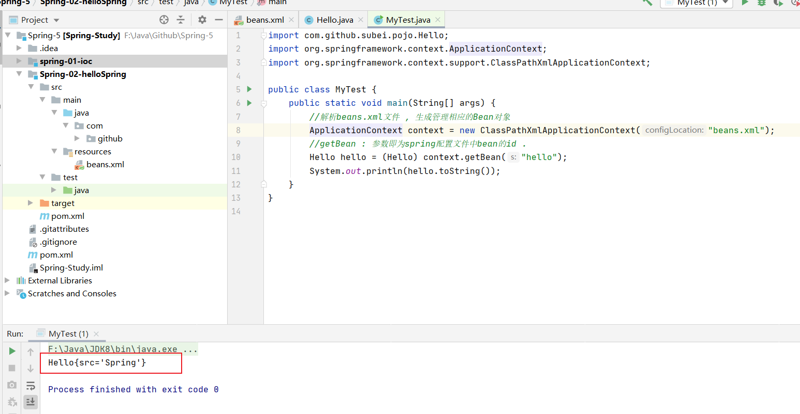

> 思考：

- Hello 对象是谁创建的 ?  
  - hello 对象是由Spring创建的。
- Hello 对象的属性是怎么设置的 ?  
  - hello 对象的属性是由Spring容器设置的。

> 这个过程就叫控制反转：

- 控制 : 谁来控制对象的创建 , 传统应用程序的对象是由程序本身控制创建的 , 使用Spring后 , 对象是由Spring来创建的。
- 反转 : 程序本身不创建对象 , 而变成被动的接收对象。

> 依赖注入 : 就是利用set方法来进行注入的。

- IOC是一种编程思想，由主动的编程变成被动的接收。

- 可以通过new ClassPathXmlApplicationContext去浏览一下底层源码。

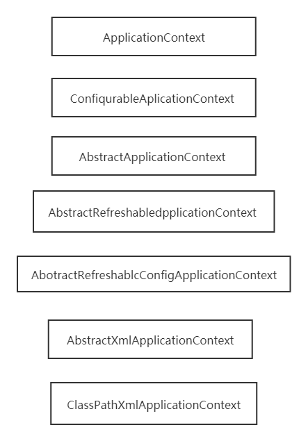

> 修改案例一：

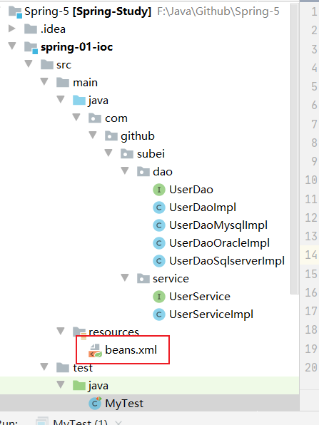

- 在案例一中， 新增一个Spring配置文件beans.xml

```xml
<?xml version="1.0" encoding="UTF-8"?>
<beans xmlns="http://www.springframework.org/schema/beans"
       xmlns:xsi="http://www.w3.org/2001/XMLSchema-instance"
       xsi:schemaLocation="http://www.springframework.org/schema/beans
        http://www.springframework.org/schema/beans/spring-beans.xsd">

    <bean id="mysqlImpl" class="com.github.subei.dao.UserDaoMysqlImpl"/>
    <bean id="oracleImpl" class="com.github.subei.dao.UserDaoOracleImpl"/>

    <bean id="UserServiceImpl" class="com.github.subei.service.UserServiceImpl">
        <!--
        ref:引用spring容器中创建好的对象!
        value:具体的值，基本数帮类型！
        -->
        <property name="userDao" ref="mysqlImpl"/>
    </bean>

</beans>
```

- 测试！

```java
    @Test
    public void test2(){
        // 获取AppLicationcontext;拿到Spring容器
        ApplicationContext context = new ClassPathXmlApplicationContext("beans.xml");
        UserServiceImpl serviceImpl = (UserServiceImpl) context.getBean("UserServiceImpl");
        serviceImpl.getUser();
    }
```

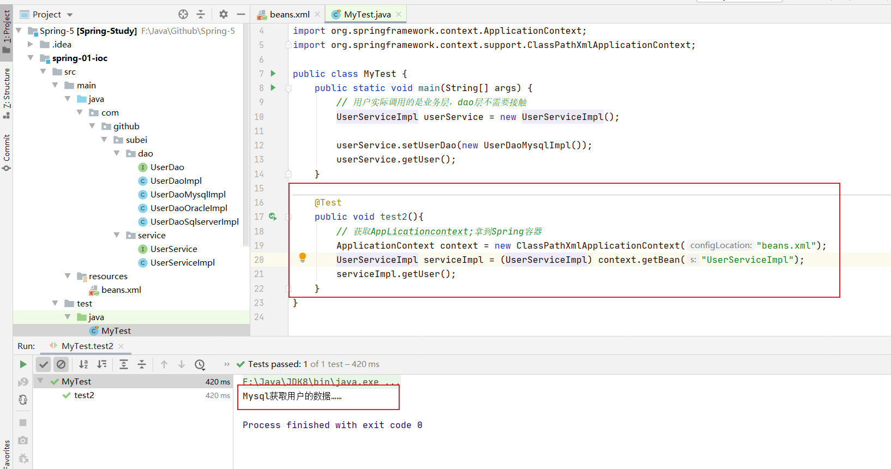

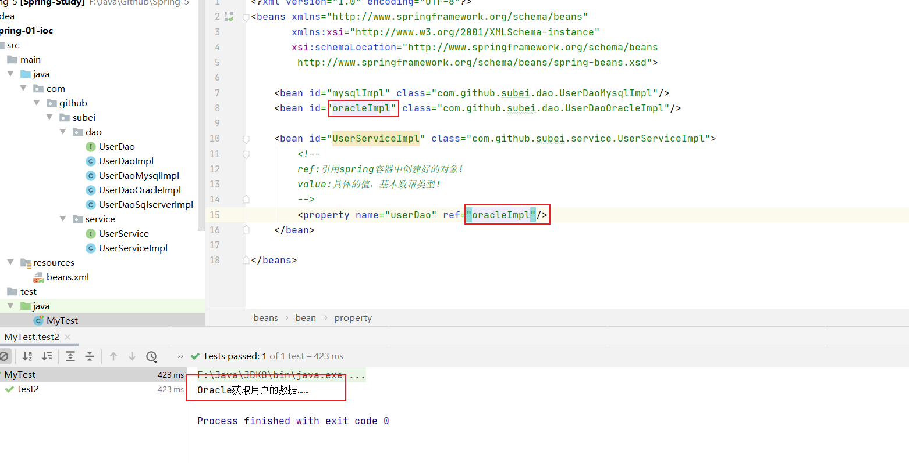

- ==OK , 到了现在 , 彻底不用再程序中去改动了 , 要实现不同的操作 , 只需要在xml配置文件中进行修改 , 所谓的IoC，一句话搞定 : 对象由Spring 来创建 , 管理 , 装配 !== 

## 4、IOC创建对象方式

### 4.1 方式一

> 方式一：通过无参构造方法来创建。

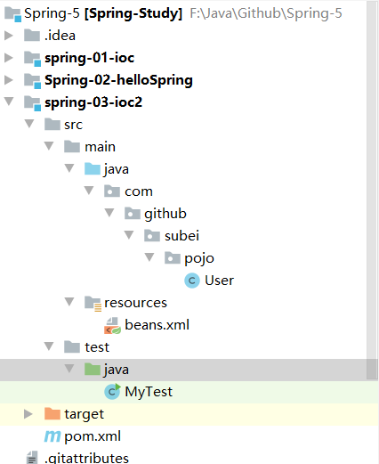

1. User.java

```java
package com.github.subei.pojo;

public class User {
    private String name;

    public User() {
        System.out.println("User的无参构造！");
    }

    public String getName() {
        return name;
    }

    public void setName(String name) {
        this.name = name;
    }

    public void show(){
        System.out.println("name="+ name );
    }
}
```

2. beans.xml

```xml
<?xml version="1.0" encoding="UTF-8"?>
<beans xmlns="http://www.springframework.org/schema/beans"
       xmlns:xsi="http://www.w3.org/2001/XMLSchema-instance"
       xsi:schemaLocation="http://www.springframework.org/schema/beans
        http://www.springframework.org/schema/beans/spring-beans.xsd">

    <bean id="user" class="com.github.subei.pojo.User">
        <property name="name" value="subei"/>
    </bean>

</beans>
```

3. 测试类

```java
import com.github.subei.pojo.User;
import org.springframework.context.ApplicationContext;
import org.springframework.context.support.ClassPathXmlApplicationContext;

public class MyTest {
    public static void main(String[] args) {
        ApplicationContext context = new ClassPathXmlApplicationContext("beans.xml");
        // 在执行getBean的时候, user已经创建好, 通过无参构造
        User user = (User) context.getBean("user");
        // 调用对象的方法 .
        user.show();
    }
}
```

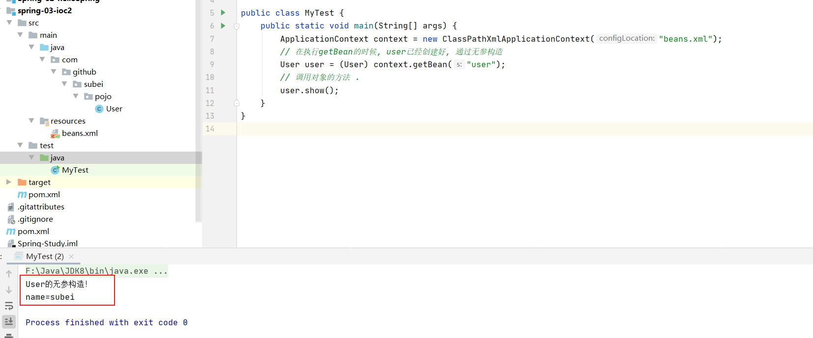

- 通过debug可以发现，在调用show方法之前，User对象已经通过无参构造初始化了！

---

### 4.2 方式二

> 方式二：通过有参构造方法来创建。

1.UserT . java

```java
package com.github.subei.pojo;

public class UserT {
    private String name;

    public UserT(String name) {
        this.name = name;
    }

    public UserT() {
        System.out.println("UserT被创建了");
    }

    public String getName() {
        return name;
    }

    public void setName(String name) {
        this.name = name;
    }

    public void show() {
        System.out.println("name=" + name);
    }

}
```

2、beans.xml 有三种方式编写

```xml
<?xml version="1.0" encoding="UTF-8"?>
<beans xmlns="http://www.springframework.org/schema/beans"
       xmlns:xsi="http://www.w3.org/2001/XMLSchema-instance"
       xsi:schemaLocation="http://www.springframework.org/schema/beans
        http://www.springframework.org/schema/beans/spring-beans.xsd">

    <!-- 第一种：根据index参数下标设置 -->
<!--    <bean id="userT" class="com.github.subei.pojo.UserT">-->
<!--        <constructor-arg index="0" value="subeily——"/>-->
<!--    </bean>-->


    <!-- 第二种：根据参数类型设置，不建议使用 -->
<!--    <bean id="userT" class="com.github.subei.pojo.UserT">-->
<!--        <constructor-arg type="java.lang.String" value="subeily2——"/>-->
<!--    </bean>-->

    <!-- 第三种：根据参数名字设置 -->
    <bean id="userT" class="com.github.subei.pojo.UserT">
        <!-- name指参数名 -->
        <constructor-arg name="name" value="subeily3——"/>
    </bean>

</beans>
```

3、测试

```java
    @Test
    public void test(){
        ApplicationContext context = new ClassPathXmlApplicationContext("beans.xml");
        // 在执行getBean的时候, user已经创建好, 通过无参构造
        UserT user = (UserT) context.getBean("userT");
        // 调用对象的方法 .
        user.show();
    }
```

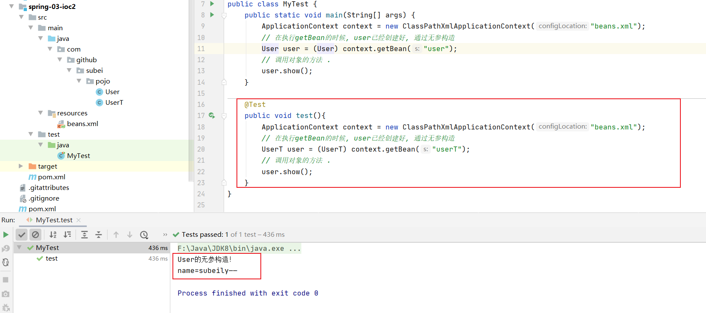

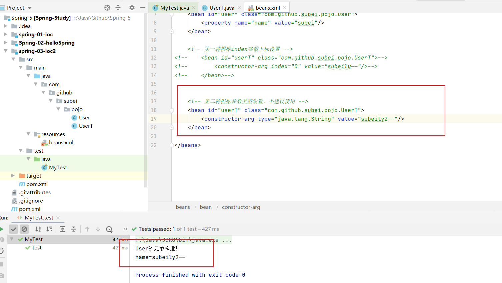

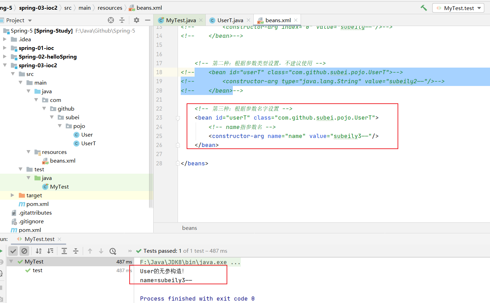

> 总结：在配置文件加载的时候，容器中管理的对象就已经初始化了！

## 5、Spring配置

### 5.1 别名

- alias 设置别名 , 为bean设置别名 , 可以设置多个别名。

```xml
<!--别名，如果添加了别名，我们也可以使用别名获取到这个对象-->
<alias name="userT" alias="userNew"/>
```

### 5.2 Bean的配置

```xml
    <!--
       id:bean 的唯一标识符，也就是相当于我们学的对象名
       class:bean 对象所对应的全限定名：包名+类型
       name:也是别名,而且name可以同时取多个别名
    -->
    <bean id="user2" class="com.github.subei.pojo.UserT" name="user2,u2,u3">
        <property name="name" value="懒羊羊的蛋糕店！"/>
    </bean>
```

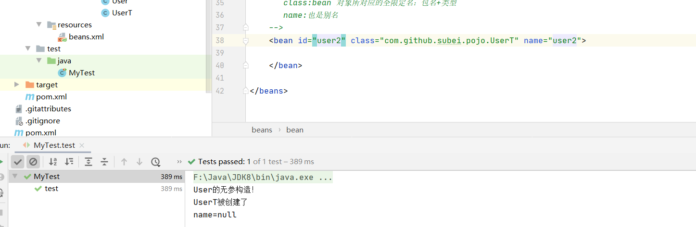

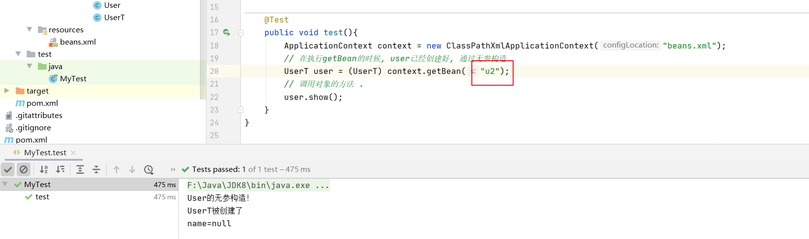

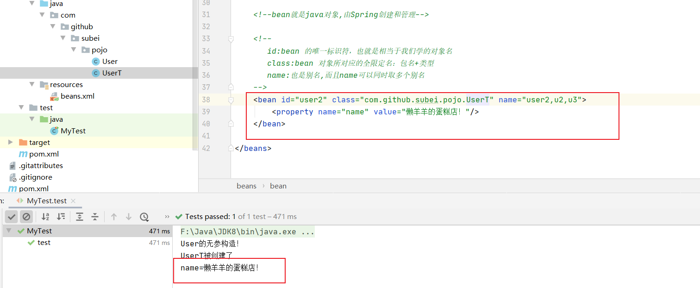

### 5.3 import

> 这个import，一般用于团队开发使用，他可以将多个配置文件，导入合并为一个。

```xml
<import resource="{path}/beans.xml"/>
```

```xml
<?xml version="1.0" encoding="UTF-8"?>
<beans xmlns="http://www.springframework.org/schema/beans"
       xmlns:xsi="http://www.w3.org/2001/XMLSchema-instance"
       xsi:schemaLocation="http://www.springframework.org/schema/beans
        http://www.springframework.org/schema/beans/spring-beans.xsd">

    <import resource="beans.xml"/>
    <import resource="beans2.xml"/>
    <import resource="beans3.xml"/>

</beans>
```

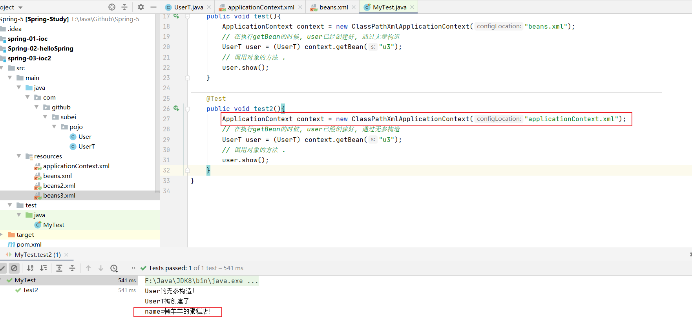

## 6、依赖注入

### 6.1 构造器注入

- 之前的案例已经说过了。

### 6.2 Set 注入 （重点）

> 依赖注入（Set注入！）。

- 依赖 : Bean对象的创建依赖于容器！
- 注入 : Bean对象中的所有属性，由容器来设置和装配。

> 【环境搭建】

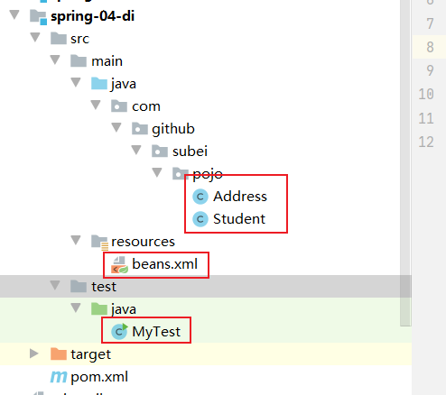

1. 复杂类型

- Address.java

```java
package com.github.subei.pojo;

public class Address {
    private String address;

    public String getAddress() {
        return address;
    }

    public void setAddress(String address) {
        this.address = address;
    }

    @Override
    public String toString() {
        return "Address{" +
                "address='" + address + '\'' +
                '}';
    }
}
```

2. 真实测试对象

- Student.java

```java
package com.github.subei.pojo;

import java.util.*;

public class Student {
    private String name;
    private Address address;
    private String[] books;
    private List<String> hobby;
    private Map<String,String> card;
    private Set<String> games;
    private String wife;
    private Properties info;

    public String getName() {
        return name;
    }

    public void setName(String name) {
        this.name = name;
    }

    public Address getAddress() {
        return address;
    }

    public void setAddress(Address address) {
        this.address = address;
    }

    public String[] getBooks() {
        return books;
    }

    public void setBooks(String[] books) {
        this.books = books;
    }

    public List<String> getHobby() {
        return hobby;
    }

    public void setHobby(List<String> hobby) {
        this.hobby = hobby;
    }

    public Map<String, String> getCard() {
        return card;
    }

    public void setCard(Map<String, String> card) {
        this.card = card;
    }

    public Set<String> getGames() {
        return games;
    }

    public void setGames(Set<String> games) {
        this.games = games;
    }

    public String getWife() {
        return wife;
    }

    public void setWife(String wife) {
        this.wife = wife;
    }

    public Properties getInfo() {
        return info;
    }

    public void setInfo(Properties info) {
        this.info = info;
    }

    @Override
    public String toString() {
        return "Student{" +
                "name='" + name + '\'' +
                ", address=" + address +
                ", books=" + Arrays.toString(books) +
                ", hobby=" + hobby +
                ", card=" + card +
                ", games=" + games +
                ", wife='" + wife + '\'' +
                ", info=" + info +
                '}';
    }
}
```

3. beans.xml

```xml
<?xml version="1.0" encoding="UTF-8"?>
<beans xmlns="http://www.springframework.org/schema/beans"
       xmlns:xsi="http://www.w3.org/2001/XMLSchema-instance"
       xsi:schemaLocation="http://www.springframework.org/schema/beans
        http://www.springframework.org/schema/beans/spring-beans.xsd">

    <bean id="student" class="com.github.subei.pojo.Student">
        <!-- 第一种：普通值注入，value -->
        <property name="name" value="subei"/>
    </bean>

</beans>
```

4. 测试类

```java
import com.github.subei.pojo.Student;
import org.springframework.context.ApplicationContext;
import org.springframework.context.support.ClassPathXmlApplicationContext;

public class MyTest {
    public static void main(String[] args) {
        ApplicationContext context = new ClassPathXmlApplicationContext("beans.xml");
        Student student = (Student) context.getBean("student");
        System.out.println(student.getName());
    }
}
```

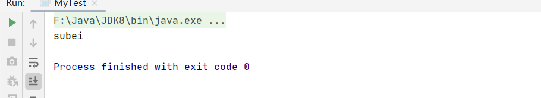

----

2、**Bean注入** 

- 注意点：这里的值是一个引用，ref

```xml
    <bean id="address" class="com.github.subei.pojo.Address">
        <property name="address" value="成都"/>
    </bean>

    <bean id="student" class="com.github.subei.pojo.Student">
        <!-- 第一种：普通值注入，value -->
        <property name="name" value="subei"/>
        <!-- 第二种：Bean注入，ref -->
        <property name="address" ref="address"/>
        
    </bean>
```

----

3、**数组注入**

```xml
    <bean id="student" class="com.github.subei.pojo.Student">
        <!-- 第三种：数组注入 -->
        <property name="books">
            <array>
                <value>Mybatis</value>
                <value>Spring</value>
                <value>SpringMVC</value>
            </array>
        </property>
    </bean>
```

-----

4、**List注入**

```xml
    <bean id="student" class="com.github.subei.pojo.Student">
        <!-- 第四种：list注入 -->
        <property name="hobby">
            <list>
                <value>家里蹲</value>
                <value>精神萎靡</value>
                <value>无法沟通</value>
            </list>
        </property>
    </bean>
```

-----

5、**Map注入**

```xml
    <bean id="student" class="com.github.subei.pojo.Student">
		<!-- 第五种：Map注入 -->
        <property name="card">
            <map>
                <entry key="学生证" value="20201014"/>
                <entry key="身份证" value="14253686"/>
            </map>
        </property>

    </bean>
```

-----

6、**set注入**

```xml
    <bean id="student" class="com.github.subei.pojo.Student">
		<!-- 第六种：set注入 -->
        <property name="games">
            <set>
                <value>保卫萝卜1</value>
                <value>保卫萝卜2</value>
                <value>保卫萝卜3</value>
            </set>
        </property>

    </bean>
```

-----

7、**Null注入**

```xml
    <bean id="student" class="com.github.subei.pojo.Student">
		<!-- 第七种：null注入 -->
        <property name="wife">
            <null/>
        </property>

    </bean>
```

------

8、**Properties注入**

```xml
    <bean id="student" class="com.github.subei.pojo.Student">
        <!-- 第八种：Properties注入 -->
        <property name="info">
            <props>
                <prop key="学号">20210106</prop>
                <prop key="性别">保密</prop>
                <prop key="姓名">subei</prop>
            </props>
        </property>
    </bean>
```

- 测试

```java
import com.github.subei.pojo.Student;
import org.springframework.context.ApplicationContext;
import org.springframework.context.support.ClassPathXmlApplicationContext;

public class MyTest {
    public static void main(String[] args) {
        ApplicationContext context = new ClassPathXmlApplicationContext("beans.xml");
        Student student = (Student) context.getBean("student");
        System.out.println(student.toString());
    }
}
```

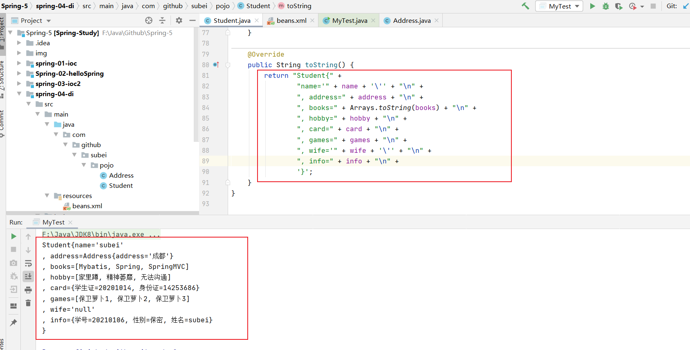

-----

### 6.3 拓展方式注入

- 我们可以使用p命令空间和c命令空间进行注入
- 官方解释：

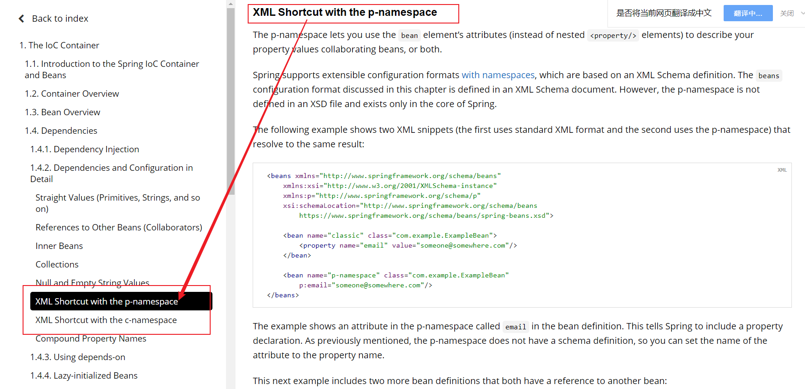

> p命名和c命名注入翻译：
>
> - p-namespace 允许使用`bean`元素的属性(而不是嵌套的` <property/> `元素)来描述协作 Bean 的属性值，或同时使用这两者。 
> - c-namespace 允许使用内联属性来配置构造函数参数，而不是嵌套的`constructor-arg`元素。 

- User.java 

```java
package com.github.subei.pojo;

public class User {
    private String name;
    private int age;

    public String getName() {
        return name;
    }

    public void setName(String name) {
        this.name = name;
    }

    public int getAge() {
        return age;
    }

    public void setAge(int age) {
        this.age = age;
    }

    @Override
    public String toString() {
        return "User{" +
                "name='" + name + '\'' +
                ", age=" + age +
                '}';
    }

}
```

1. P命名空间注入 : 需要在头文件中加入约束文件

```xml
 导入约束 : xmlns:p="http://www.springframework.org/schema/p"
 
    <!-- p命名空间注入，可以直接注入属性的值: property -->
    <bean id="user" class="com.github.subei.pojo.User"
          p:name="subei"
          p:age="21" />
```

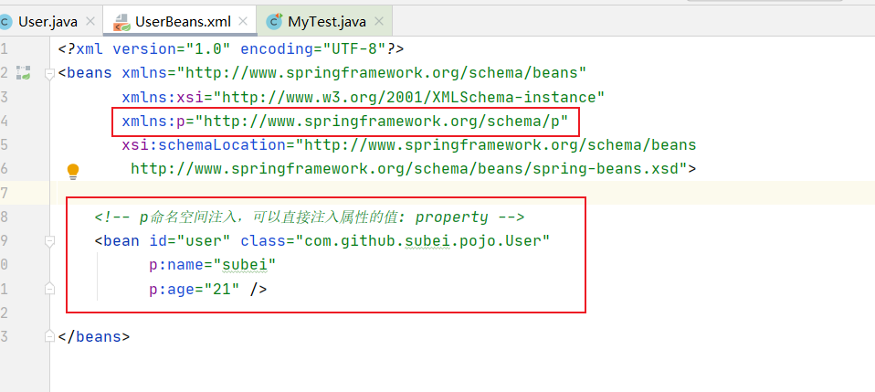

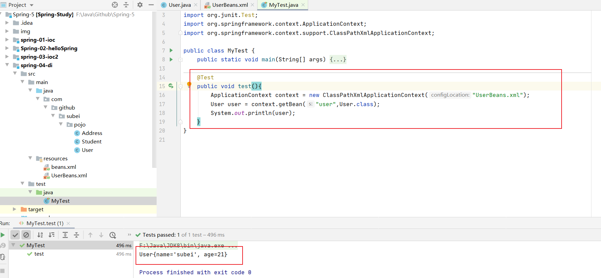

----

2. c 命名空间注入 : 需要在头文件中加入约束文件

```xml
 导入约束 : xmlns:c="http://www.springframework.org/schema/c"

    <!-- c命名空间注入，可以通过构造器注入: construct-args -->
    <bean id="user2" class="com.github.subei.pojo.User"
          c:name="subei"
          c:age="22" />
```

- 发现问题：爆红了，没有写有参构造！

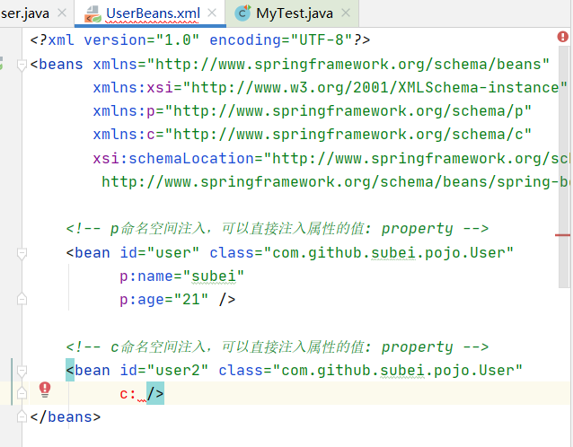

- 解决：把有参、无参构造器加上。
- 由此可知：c 就是所谓的构造器注入！

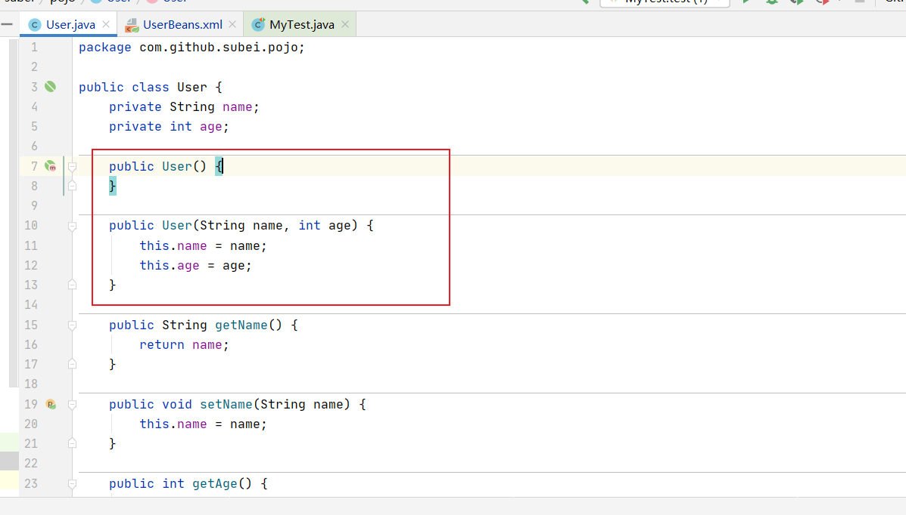

- 测试代码

```java
    @Test
    public void test(){
        ApplicationContext context = new ClassPathXmlApplicationContext("UserBeans.xml");
        User user = context.getBean("user2",User.class);
        System.out.println(user);
    }
```

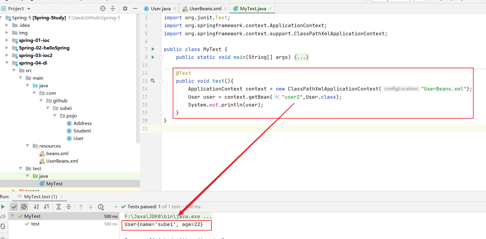

### 6.4 Bean的作用域

> 在Spring中，那些组成应用程序的主体及由Spring IoC容器所管理的对象，被称之为bean。
>
> 简单地讲，bean就是由IoC容器初始化、装配及管理的对象。

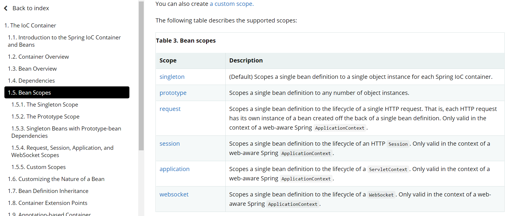

| Scope                                                        | Description                                                  |
| :----------------------------------------------------------- | ------------------------------------------------------------ |
| [singleton](https://www.docs4dev.com/docs/zh/spring-framework/5.1.3.RELEASE/reference/core.html#beans-factory-scopes-singleton) | (默认)将每个 Spring IoC 容器的单个 bean 定义范围限定为单个对象实例。 |
| [prototype](https://www.docs4dev.com/docs/zh/spring-framework/5.1.3.RELEASE/reference/core.html#beans-factory-scopes-prototype) | 将单个 bean 定义的作用域限定为任意数量的对象实例。           |
| [request](https://www.docs4dev.com/docs/zh/spring-framework/5.1.3.RELEASE/reference/core.html#beans-factory-scopes-request) | 将单个 bean 定义的范围限定为单个 HTTP 请求的生命周期。也就是说，每个 HTTP 请求都有一个在单个 bean 定义后面创建的 bean 实例。仅在可感知网络的 Spring `ApplicationContext`中有效。 |
| [session](https://www.docs4dev.com/docs/zh/spring-framework/5.1.3.RELEASE/reference/core.html#beans-factory-scopes-session) | 将单个 bean 定义的范围限定为 HTTP `Session`的生命周期。仅在可感知网络的 Spring `ApplicationContext`上下文中有效。 |
| [application](https://www.docs4dev.com/docs/zh/spring-framework/5.1.3.RELEASE/reference/core.html#beans-factory-scopes-application) | 将单个 bean 定义的范围限定为`ServletContext`的生命周期。仅在可感知网络的 Spring `ApplicationContext`上下文中有效。 |
| [websocket](https://www.docs4dev.com/docs/zh/spring-framework/5.1.3.RELEASE/reference/web.html#websocket-stomp-websocket-scope) | 将单个 bean 定义的范围限定为`WebSocket`的生命周期。仅在可感知网络的 Spring `ApplicationContext`上下文中有效。 |

#### 6.4.1 Singleton(单例)

>单例模式（Spring默认机制）
>
>- 下图显示了单例作用域如何工作：

 

> 当一个bean的作用域为Singleton，那么Spring IoC容器中只会存在一个共享的bean实例，并且所有对bean的请求，只要id与该bean定义相匹配，则只会返回bean的同一实例。Singleton是单例类型，就是在创建起容器时就同时自动创建了一个bean的对象，不管你是否使用，他都存在了，每次获取到的对象都是同一个对象。

---

> - 注意，Singleton作用域是Spring中的缺省作用域。
>
> - 要在XML中将bean定义成singleton，可以这样配置：

```xml
    <bean id="user" class="com.github.subei.pojo.User"/>

    <!-- 以下内容是等价的，尽管是多余的(默认为单例作用域) -->
    <bean id="user2" class="com.github.subei.pojo.User"
          scope="singleton"/>
```

- 测试

```java
    @Test
    public void test(){
        ApplicationContext context = new ClassPathXmlApplicationContext("UserBeans.xml");
        User user = context.getBean("user2",User.class);
        User user2 = context.getBean("user2",User.class);
        System.out.println(user);

        System.out.println(user==user2);
    }
```

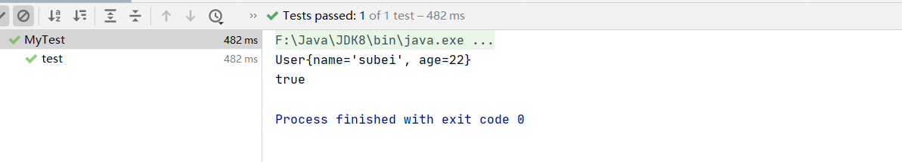

#### 6.4.2 Prototype(原型)

> 原型模式：每次从容器中get的时候，都会产生一个新对象！

> 每次对特定 bean 提出请求时，bean 部署的非单一原型范围都会导致创建一个新 bean 实例。也就是说，将 Bean 注入到另一个 Bean 中，或者您可以通过容器上的`getBean()`方法调用来请求它。通常，应将原型作用域用于所有有状态 Bean，将单例作用域用于 StatelessBean。
>
> 下图说明了 Spring 原型范围：

  

----

> 在XML中将bean定义成prototype，可以这样配置：

```xml
    <bean id="user2" class="com.github.subei.pojo.User"
          scope="prototype"/>  
```

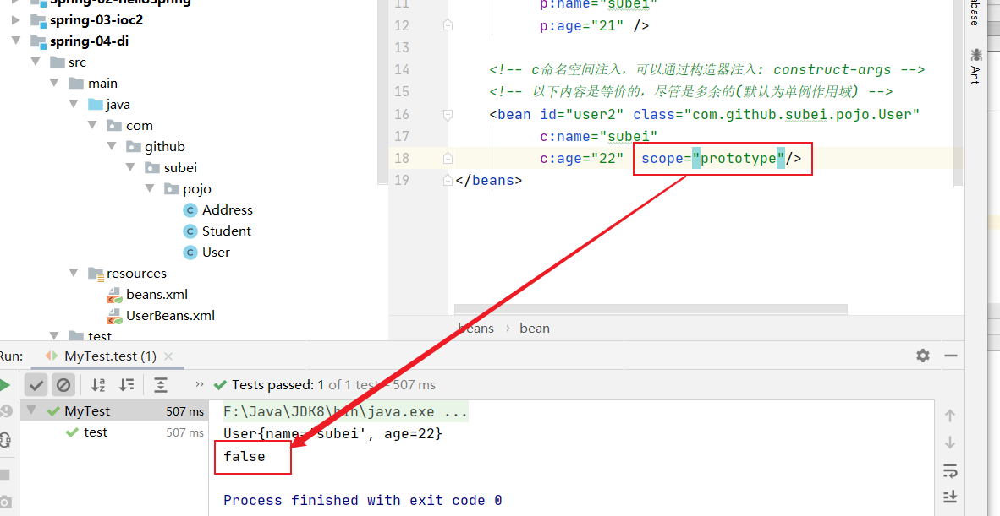

- 其余的request、session、application、这些个只能在web开发中使用到！

#### 6.4.3 Request

> Spring 容器通过为每个 HTTP 请求使用`loginAction` bean 定义来创建`LoginAction` bean 的新实例。也就是说，`loginAction` bean 的作用域是 HTTP 请求级别。您可以根据需要更改创建实例的内部状态，因为从同一`loginAction` bean 定义创建的其他实例看不到这些状态更改。它们特定于单个请求。当请求完成处理时，将限制作用于该请求的 Bean。 

- 考虑以下 XML 配置来定义 bean ：

```xml
<bean id="loginAction" class="com.something.LoginAction" scope="request"/>
```

> 使用注解驱动的组件或 Java 配置时，可以使用`@RequestScope`注解 将组件分配给`request`范围。以下示例显示了如何执行此操作： 

```java
@RequestScope
@Component
public class LoginAction {
    // ...
}
```

#### 6.4.4 Session

> 当一个bean的作用域为Session，表示在一个HTTP Session中，一个bean定义对应一个实例。该作用域仅在基于web的Spring ApplicationContext情形下有效。

- 考虑下面bean定义：

```xml
 <bean id="userPreferences" class="com.foo.UserPreferences" scope="session"/>
```

> 在单个 HTTP `Session`的生存期内，Spring 容器通过使用`userPreferences` bean 定义来创建`UserPreferences` bean 的新实例。换句话说，`userPreferences` bean 的作用域实际上是 HTTP `Session`级别。与请求范围的 Bean 一样，您可以根据需要任意更改所创建实例的内部状态，因为知道其他 HTTP `Session`实例(也使用从相同`userPreferences` Bean 定义创建的实例)不会看到这些状态更改，因为它们特定于单个 HTTP `Session`。当最终丢弃 HTTP `Session`时，也将丢弃作用于该特定 HTTP `Session`的 bean。 

- 使用注解驱动的组件或 Java 配置时，可以使用`@SessionScope`注解 将组件分配给`session`范围。 

```java
@SessionScope
@Component
public class UserPreferences {
    // ...
}
```

----

## 7、自动装配Bean

- 自动装配是Spring满足bean依赖一种方式！
- Spring会在上下文中自动寻找，并自动给bean装配属性！

> 在Spring中有三种自动装配的方式：
>
> 1. 在xml中显示的配置；
> 2. 在java中显示配置；
> 3. 隐式的自动装配bean。【重要！】

### 7.1 测试

- 环境搭建：一个人有两个宠物！

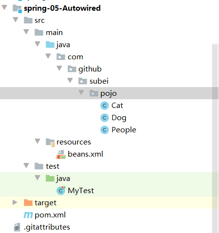

- Cat.java

```java
package com.github.subei.pojo;

public class Cat {
    public void shout(){
        System.out.println("喵！喵！喵！");
    }
}
```

- Dog.java

```java
package com.github.subei.pojo;

public class Dog {
    public void shout(){
        System.out.println("汪！汪！汪！");
    }
}
```

- People.java

```java
package com.github.subei.pojo;

public class People {
    private Cat cat;
    private Dog dog;
    private String name;

    public Cat getCat() {
        return cat;
    }

    public void setCat(Cat cat) {
        this.cat = cat;
    }

    public Dog getDog() {
        return dog;
    }

    public void setDog(Dog dog) {
        this.dog = dog;
    }

    public String getName() {
        return name;
    }

    public void setName(String name) {
        this.name = name;
    }

    @Override
    public String toString() {
        return "People{" +
                "cat=" + cat +
                ", dog=" + dog +
                ", name='" + name + '\'' +
                '}';
    }
}
```

- beans.xml

```java
<?xml version="1.0" encoding="UTF-8"?>
<beans xmlns="http://www.springframework.org/schema/beans"
       xmlns:xsi="http://www.w3.org/2001/XMLSchema-instance"
       xsi:schemaLocation="http://www.springframework.org/schema/beans
        http://www.springframework.org/schema/beans/spring-beans.xsd">

    <bean id="cat" class="com.github.subei.pojo.Cat"/>
    <bean id="dog" class="com.github.subei.pojo.Dog"/>

    <bean id="people" class="com.github.subei.pojo.People">
        <property name="name" value="哇哈哈"/>
        <property name="cat" ref="cat"/>
        <property name="dog" ref="dog"/>

    </bean>

</beans>
```

- 测试类

```java
import com.github.subei.pojo.People;
import org.junit.Test;
import org.springframework.context.support.ClassPathXmlApplicationContext;

public class MyTest {
    @Test
    public void test(){
        ClassPathXmlApplicationContext context = new ClassPathXmlApplicationContext("beans.xml");
        People people = context.getBean("people", People.class);
        people.getCat().shout();
        people.getDog().shout();
    }
}
```

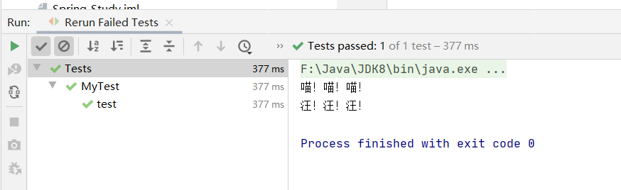

### 7.2 ByName自动装配

```java
    <!--
    byName:会自动在容器上下文中查找，和自己对象set方法后而的值对应的beanid！
    -->
    <bean id="people" class="com.github.subei.pojo.People" autowire="byName">
        <property name="name" value="哇哈哈"/>

    </bean>
```

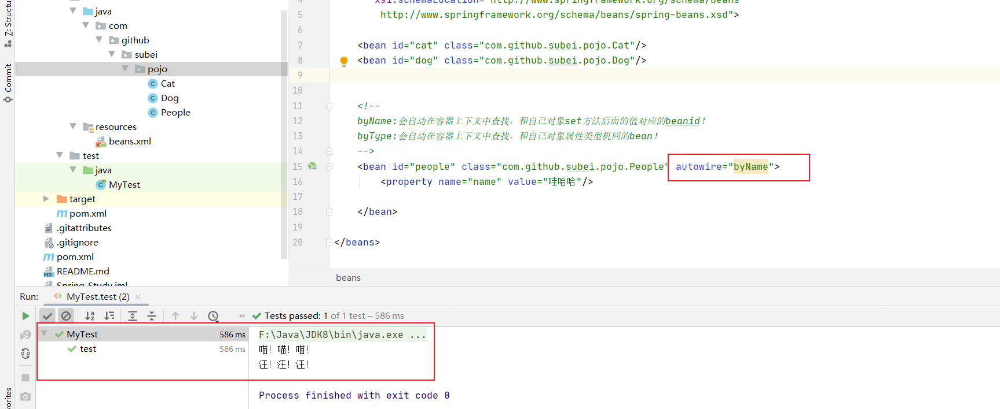

### 7.3 ByType自动装配

```java
    <bean class="com.github.subei.pojo.Cat"/>
    <bean class="com.github.subei.pojo.Dog"/>


    <!--
    byName:会自动在容器上下文中查找，和自己对象set方法后而的值对应的beanid！
    byType:会自动在容器上下文中查找，和自己对象属性类型机同的bean！
    -->
    <bean id="people" class="com.github.subei.pojo.People" autowire="byType">
        <property name="name" value="哇哈哈"/>

    </bean>
```

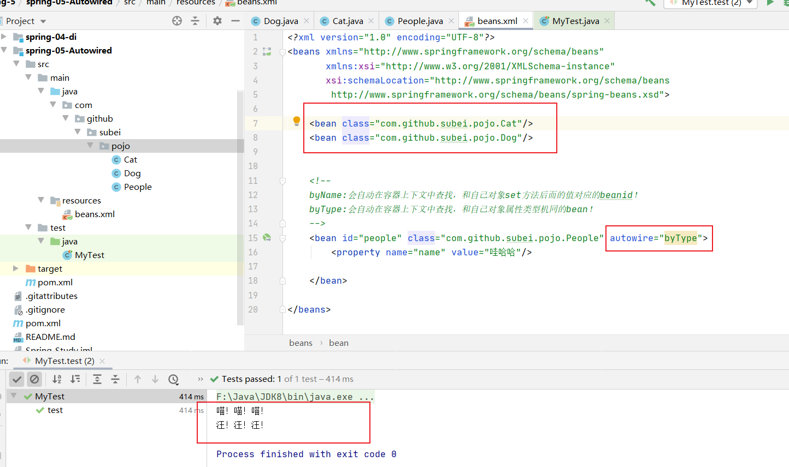

> 小结：
>
> - byname的时候，需要保证所有bean的id唯一，并且这个bean需要和自动注入的属性的set方法的值一致！
> - bytype的时候，需要保证所有bean的class唯一，并且这个bean需要和自动注入的属性的类型一致！

### 7.4 使用注解实现自动装配

> - JDK 1.5支持的注解，Spring2.5就支持注解了！
> - The introduction of annotation-based configuration raised the question of whether this approach is “better” than XML.  

- 要使用注解须知：
  - 导入约束，context约束
  - ==配置注解的支持；<context:annotation-config/>==

```xml
<?xml version="1.0" encoding="UTF-8"?>
<beans xmlns="http://www.springframework.org/schema/beans"
    xmlns:xsi="http://www.w3.org/2001/XMLSchema-instance"
    xmlns:context="http://www.springframework.org/schema/context"
    xsi:schemaLocation="http://www.springframework.org/schema/beans
        https://www.springframework.org/schema/beans/spring-beans.xsd
        http://www.springframework.org/schema/context
        https://www.springframework.org/schema/context/spring-context.xsd">

    <context:annotation-config/>

</beans>
```

#### @Autowired

- 修改beans.xml

```xml
<?xml version="1.0" encoding="UTF-8"?>
<beans xmlns="http://www.springframework.org/schema/beans"
       xmlns:xsi="http://www.w3.org/2001/XMLSchema-instance"
       xmlns:context="http://www.springframework.org/schema/context"
       xmlns:aop="http://www.springframework.org/schema/aop"
       xsi:schemaLocation="http://www.springframework.org/schema/beans
        http://www.springframework.org/schema/beans/spring-beans.xsd
        http://www.springframework.org/schema/context
        https://www.springframework.org/schema/context/spring-context.xsd
        http://www.springframework.org/schema/aop
        https://www.springframework.org/schema/context/spring-aop.xsd">

    <!-- 开启注解的支持 -->
    <context:annotation-config/>

    <bean id="cat" class="com.github.subei.pojo.Cat"/>
    <bean id="dog" class="com.github.subei.pojo.Dog"/>
    <bean id="people" class="com.github.subei.pojo.People"/>


</beans>
```

- 修改People.java文件

```java
package com.github.subei.pojo;

import org.springframework.beans.factory.annotation.Autowired;

public class People {
    @Autowired
    private Cat cat;
    @Autowired
    private Dog dog;
    private String name;

    public Cat getCat() {
        return cat;
    }

    public Dog getDog() {
        return dog;
    }

    public String getName() {
        return name;
    }

    @Override
    public String toString() {
        return "People{" +
                "cat=" + cat +
                ", dog=" + dog +
                ", name='" + name + '\'' +
                '}';
    }
}
```

- 运行

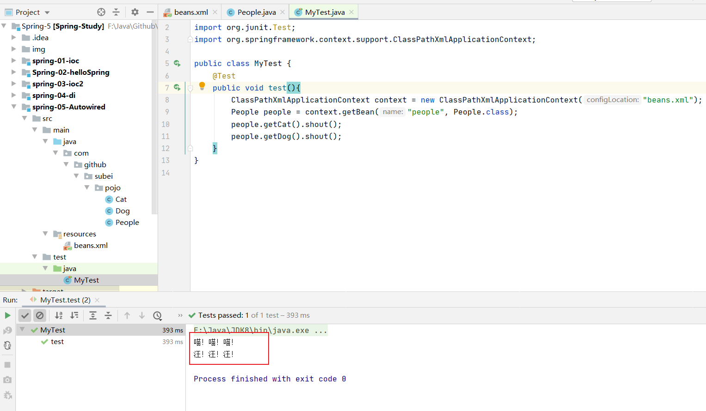

- 直接在属性上使用！也可以在set方式上使用！
- 使用Autowired我们可以不用编写Set方法了，前提是你这个自动装配的属性在IOC（Spring)容器中存在，且符合名字byname！
- 科普一下：

```java
@Nullable  字段标记了这个注解，说明这个字段可以为null
```

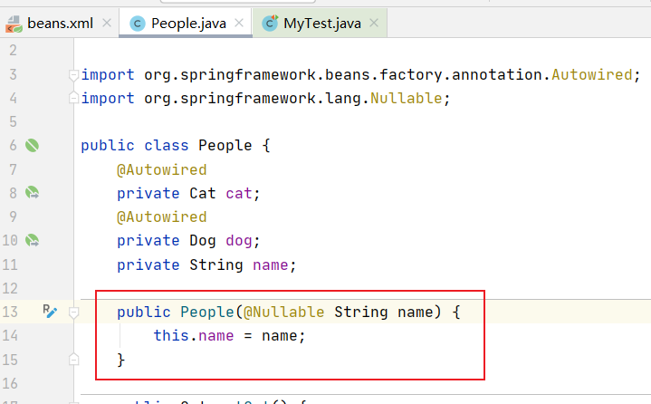

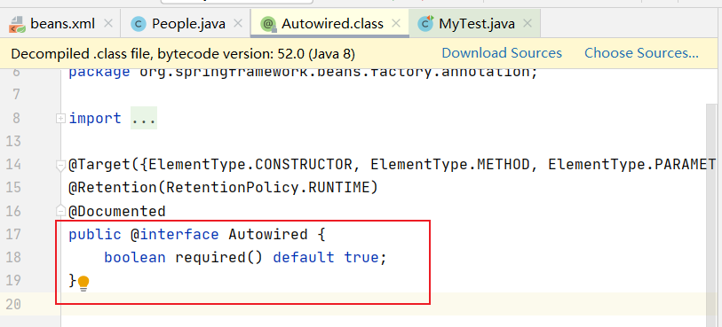

- 测试代码

```java
package com.github.subei.pojo;

import org.springframework.beans.factory.annotation.Autowired;

public class People {
    // 如果显示定义了Autowtred的requtred属性为false，说明这个对象可以为null.否则不允许为空。
    @Autowired(required = false)
    private Cat cat;
    @Autowired
    private Dog dog;
    private String name;

    public Cat getCat() {
        return cat;
    }

    public Dog getDog() {
        return dog;
    }

    public String getName() {
        return name;
    }

    @Override
    public String toString() {
        return "People{" +
                "cat=" + cat +
                ", dog=" + dog +
                ", name='" + name + '\'' +
                '}';
    }
}
```

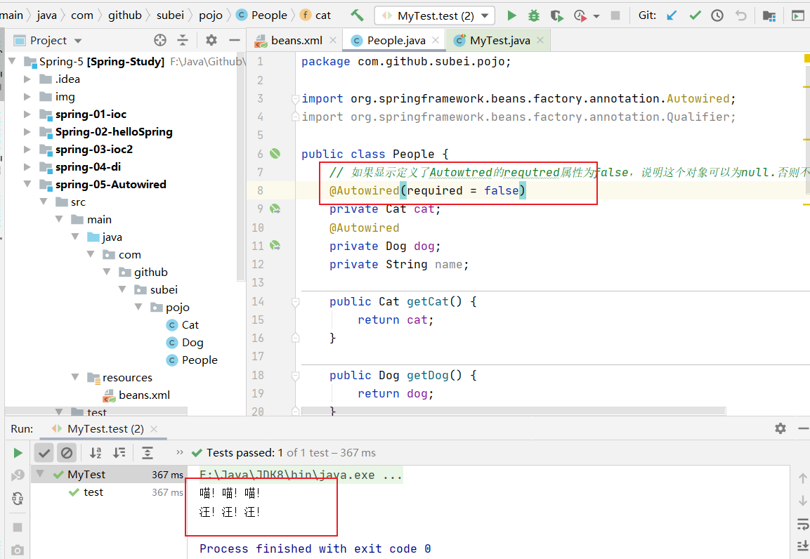

- 如果@Autowired自动装配的环境比较复杂，自动装配无法通过一个注解【@Autowired】完成的时候、我们可以使用@Qualifier(value="xxx")去配置@Autowired的使用，指定一个唯一的bean对象注入！

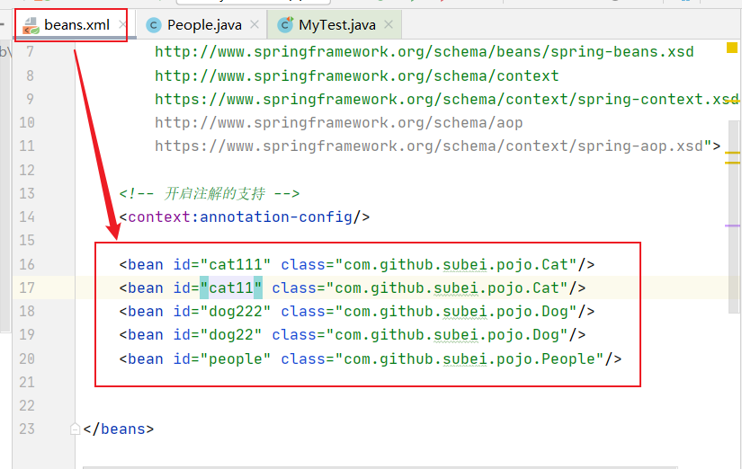

```java
package com.github.subei.pojo;

import org.springframework.beans.factory.annotation.Autowired;
import org.springframework.beans.factory.annotation.Qualifier;

public class People {

    @Autowired
    @Qualifier(value = "cat111")
    private Cat cat;
    @Autowired
    @Qualifier(value = "dog222")
    private Dog dog;
    private String name;

    public Cat getCat() {
        return cat;
    }

    public Dog getDog() {
        return dog;
    }

    public String getName() {
        return name;
    }

    @Override
    public String toString() {
        return "People{" +
                "cat=" + cat +
                ", dog=" + dog +
                ", name='" + name + '\'' +
                '}';
    }
}
```

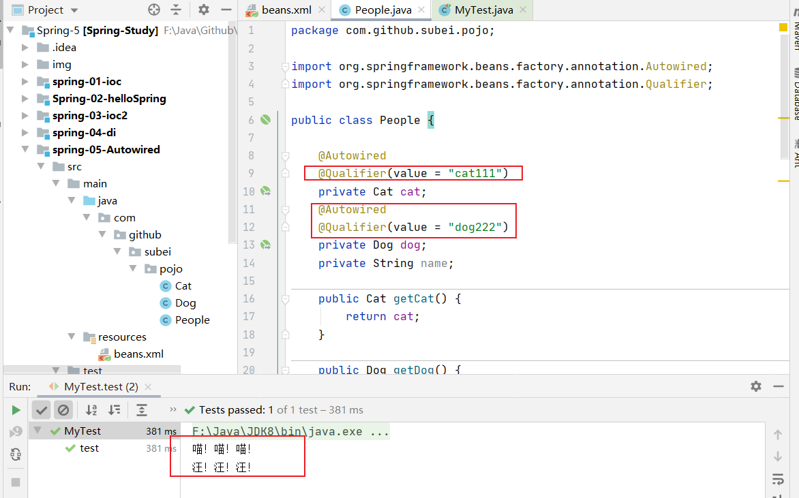

#### @Resource

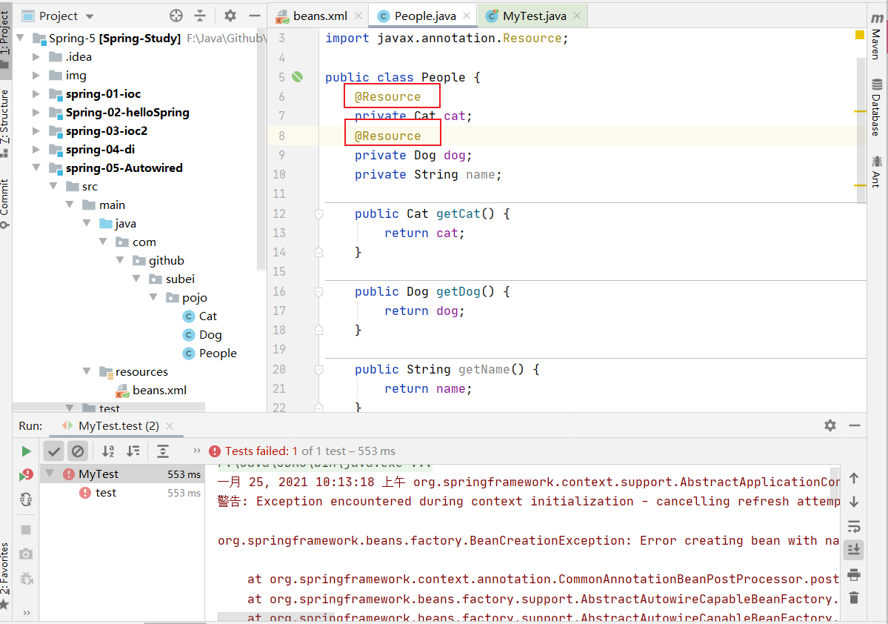

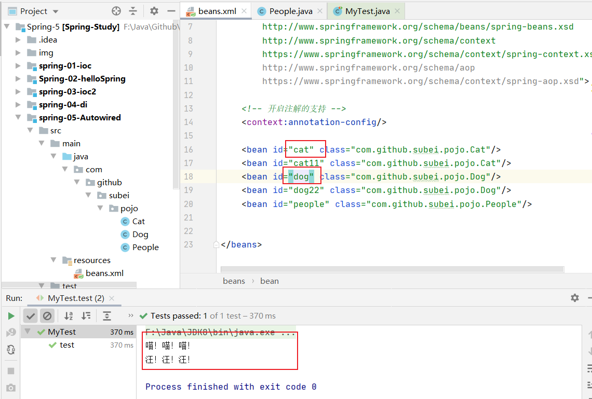

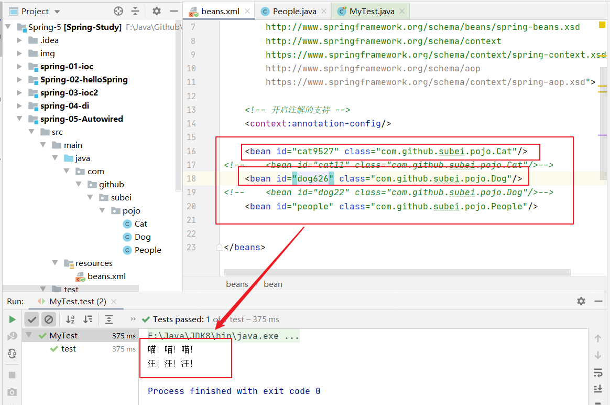

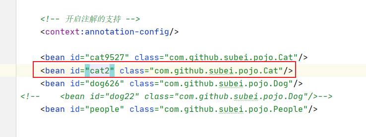

```java
package com.github.subei.pojo;

import javax.annotation.Resource;

public class People {
    @Resource(name="cat2")
    private Cat cat;
    @Resource
    private Dog dog;
    private String name;

    public Cat getCat() {
        return cat;
    }

    public Dog getDog() {
        return dog;
    }

    public String getName() {
        return name;
    }

    @Override
    public String toString() {
        return "People{" +
                "cat=" + cat +
                ", dog=" + dog +
                ", name='" + name + '\'' +
                '}';
    }
}
```

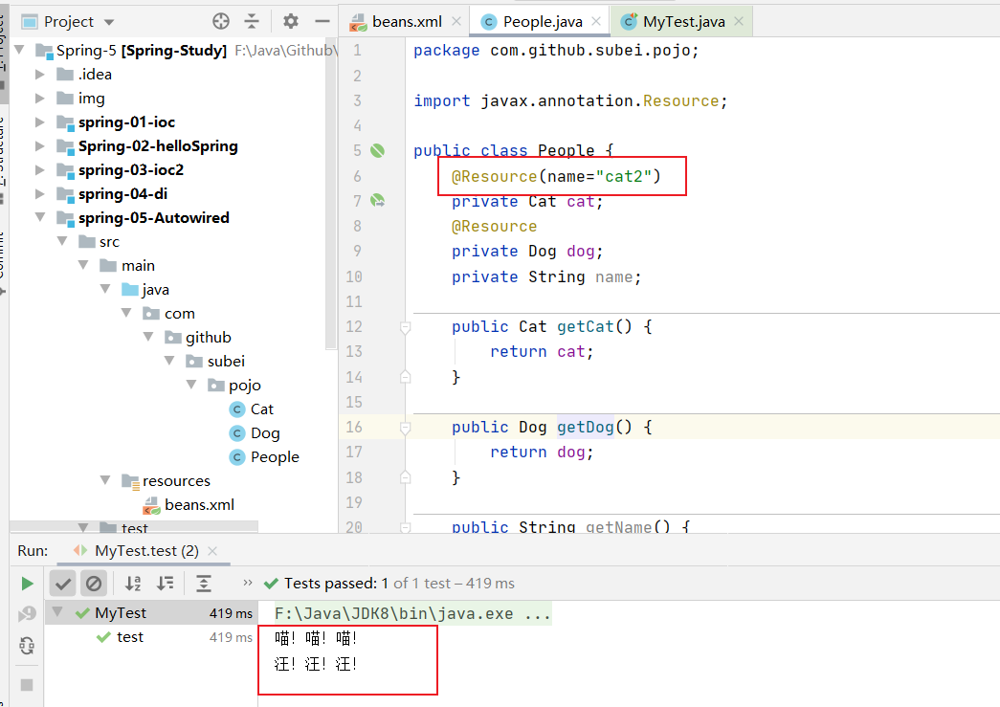

> 小结，@Resource 和@Autowired的区别：
>
> - 都是用来自动装配的，都可以放在属性字段上！
> - @Autowired 通过byType的方式实现，而且必须要求这个对象存在！
> - @Resource默认通过byname的方式实现，如果找不到名字，则通过byType实现！如果两个都找不到的倩况下，就报错！==【常用】==
> - 执行顺序不同：@Autowired通过byType的方式实现。@Resource默认通过byname的方式实现。

#### 注解一时爽，维护火葬场！！！！

## 8、使用注解开发

> 在Spring4之后，要使用注解开发，必须要保证 aop的包导入了。

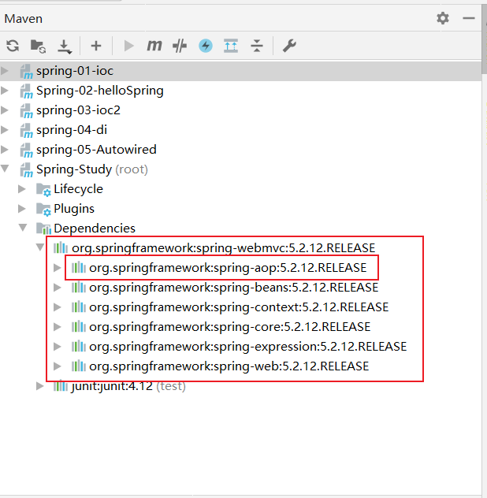

- 使用注解需要导入context约束，增加注解的支持！

```xml
<?xml version="1.0" encoding="UTF-8"?>
<beans xmlns="http://www.springframework.org/schema/beans"
      xmlns:xsi="http://www.w3.org/2001/XMLSchema-instance"
      xmlns:context="http://www.springframework.org/schema/context"
      xsi:schemaLocation="http://www.springframework.org/schema/beans
       http://www.springframework.org/schema/beans/spring-beans.xsd
       http://www.springframework.org/schema/context
       http://www.springframework.org/schema/context/spring-context.xsd">

</beans>
```

### 8.1 bean

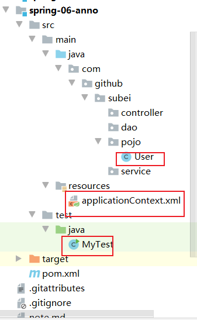

-  配置扫描包下的注解

```xml
    <!-- 指定要扫描的包，这个包下的注解就会生效！ -->
    <context:component-scan base-package="com.github.subei.pojo"/>
```

- 在指定包下编写类，增加注解 

```java
package com.github.subei.pojo;

import org.springframework.stereotype.Component;

// 等价于  <bean id="user" class="com.github.subei.pojo.User"/>
// @Component 组件
@Component
public class User {
    public String name = "哇哈哈";
}
```

- 测试类

```java
import com.github.subei.pojo.User;
import org.springframework.context.ApplicationContext;
import org.springframework.context.support.ClassPathXmlApplicationContext;

public class MyTest {
    public static void main(String[] args) {
        ApplicationContext context = new ClassPathXmlApplicationContext("applicationContext.xml");
        User user = (User)context.getBean("user",User.class);

        System.out.println(user.name);
    }
}
```

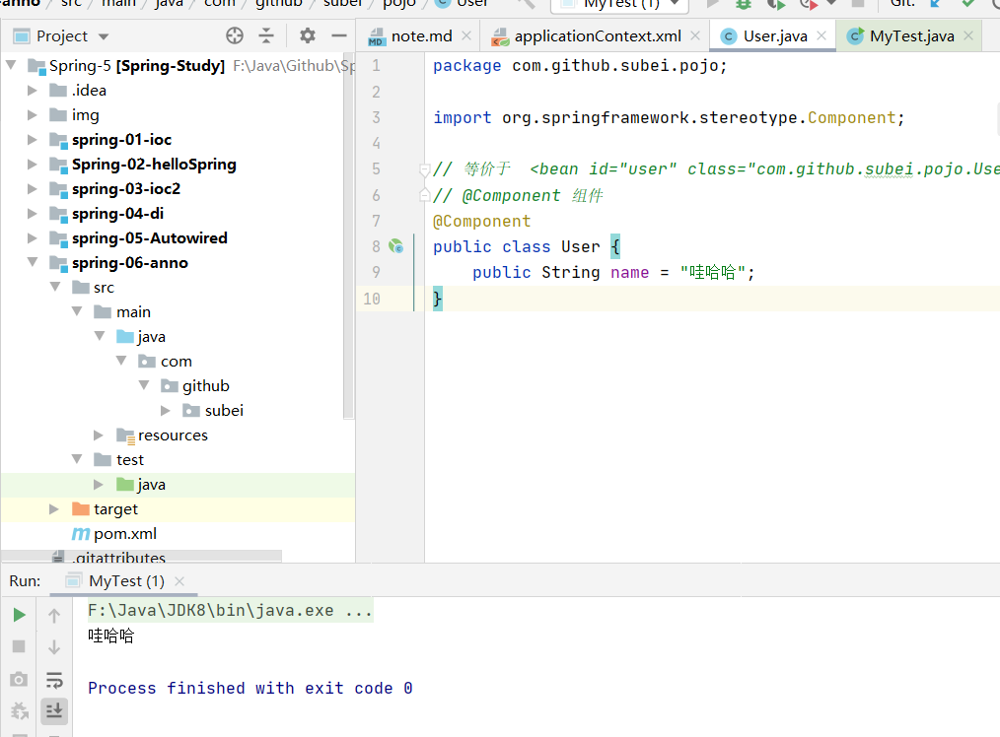

### 8.2 属性如何注入

```java
package com.github.subei.pojo;

import org.springframework.beans.factory.annotation.Value;
import org.springframework.stereotype.Component;

// 等价于  <bean id="user" class="com.github.subei.pojo.User"/>
// @Component 组件
@Component
public class User {

    // 相当于  <property name="name" value="subeiLY"/>
    @Value("subeiLY")
    public String name;

    public void setName(String name) {
        this.name = name;
    }
}
```

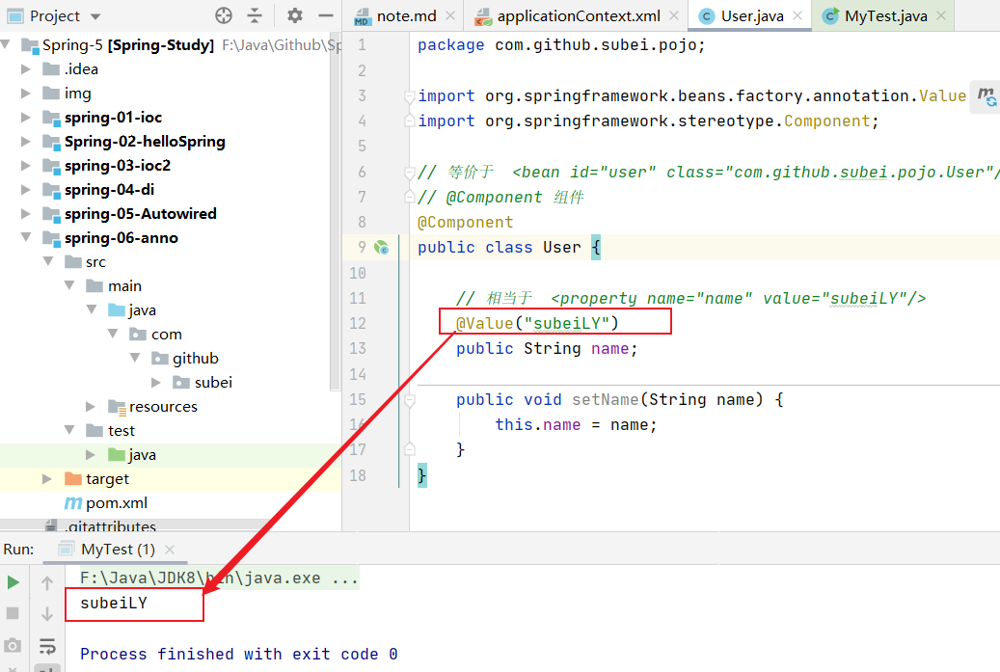

### 8.3 衍生的注解

- @Component 有几个衍生注解，我们在web开发中，会按照mvc三层架构分层！
  - dao：【@Repository】
  - service：【@Service】
  - controller：【@Controller】

- 这四个注解功能都是一样的，都是代表将某个类注册到Spring中，装配Bean。

### 8.4 自动装配置

> 参考Bean的自动装配！
>
> - @Autowired:自动装配通过类型。名字
>     如果Autowired不能唯一自动装配上属性，则需要通过@Qualifier(value="xxx")
> - @Nullable字段标记了这个注解，说明这个字段可以为null；
> - @Resource:自动装配通过名字。类型。

### 8.5 作用域

> @Scope

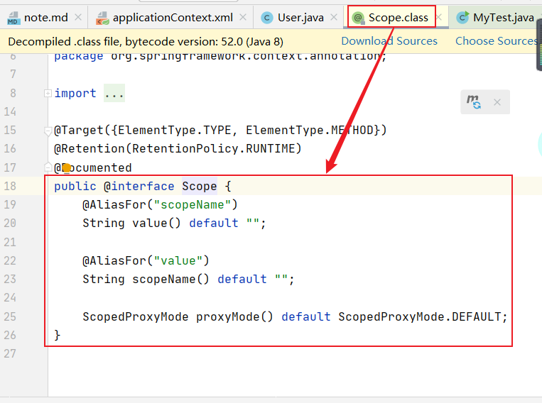

- singleton：默认的，Spring会采用单例模式创建这个对象。关闭工厂 ，所有的对象都会销毁。
- prototype：原型模式。关闭工厂 ，所有的对象不会销毁。内部的垃圾回收机制会回收

```java
package com.github.subei.pojo;

import org.springframework.beans.factory.annotation.Value;
import org.springframework.context.annotation.Scope;
import org.springframework.stereotype.Component;

// 等价于  <bean id="user" class="com.github.subei.pojo.User"/>
// @Component 组件
@Component
//@Scope("singleton") //单例模式
@Scope("prototype") //原型模式
public class User {

    // 相当于  <property name="name" value="subeiLY"/>
    @Value("subeiLY")
    public String name;

    public void setName(String name) {
        this.name = name;
    }
}
```

### 8.6 小结

> **XML与注解比较**

- XML可以适用任何场景 ，结构清晰，维护方便。
- 注解，不是自己提供的类使用不了，维护相对复杂。

> **xml与注解整合开发** ：

- xml用来管理Bean。
- 注解只负责完成属性注入。
- 在使用过程中， 只需要注意一个问题：必须让注解生效，就需要开启注解的支持。

```xml
    <!-- 指定要扫描的包，这个包下的注解就会生效！ -->
    <context:component-scan base-package="com.github.subei"/>
    <context:annotation-config/>
```

## 9、使用Java的方式进行配置

- 我们现在要完全不使用Spring的xml配置了，全权交给Java来做！
- JavaConfig 原来是 Spring 的一个子项目，在 Spring4 的版本， JavaConfig 已正式成为 Spring4 的核心功能 。 

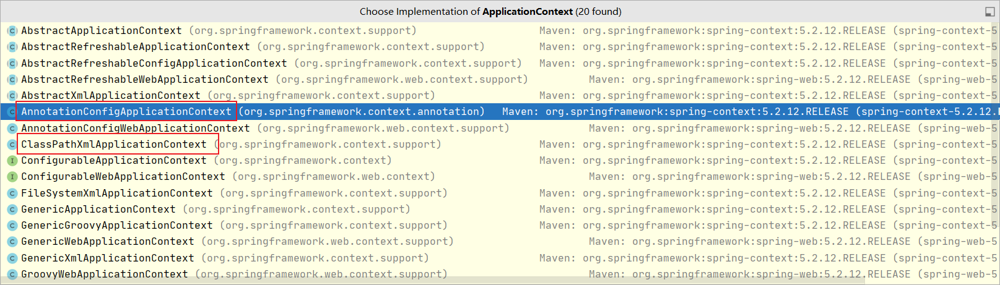

> 测试类

1. 编写一个实体类，User

```java
package com.github.subei.pojo;

import org.springframework.beans.factory.annotation.Value;
import org.springframework.stereotype.Component;

@Component  // 将这个类标注为Spring的一个组件，放到容器中！
public class User {
    private String name;

    public String getName() {
        return name;
    }

    @Value("KANGSHIFU") //属性注入值
    public void setName(String name) {
        this.name = name;
    }

    @Override
    public String toString() {
        return "User{" +
                "name='" + name + '\'' +
                '}';
    }
}
```

2. 新建一个config配置包，编写一个SunConfig配置类

```java
package com.github.subei.config;

import com.github.subei.pojo.User;
import org.springframework.context.annotation.Bean;
import org.springframework.context.annotation.ComponentScan;
import org.springframework.context.annotation.Configuration;

// 这个也会Spring容器托管，注册到容器中，因为他本来就是一个@Component
// @Configuration代表这是一个配置类，就和我们之前看的beans.xml
@Configuration  // 代表这是一个配置类
@ComponentScan("com.github.subei.pojo")
public class SunConfig {
    // 注册一个bean，就相当于我们之前写的一个bean标签;
    // 这个方法的名字，就相当bean标签中的id属性;
    // 这个方法的返回值，就相当bean标签中的cLass属性;

    @Bean
    public User getUser(){
        return new User(); // 就是返回要注入到bean的对象
    }
}

```

3. 测试类

```java
import com.github.subei.config.SunConfig;
import com.github.subei.pojo.User;
import org.springframework.context.ApplicationContext;
import org.springframework.context.annotation.AnnotationConfigApplicationContext;

public class MyTest {
    // 如果完全使用了配置类方式去做，我们就只能通过Annotationconfig 上下文来获收容器，通过配置类的class对象加载！
    public static void main(String[] args) {
        ApplicationContext applicationContext =
                new AnnotationConfigApplicationContext(SunConfig.class);
        User user = (User) applicationContext.getBean("getUser");
        System.out.println(user.getName());
    }
}
```

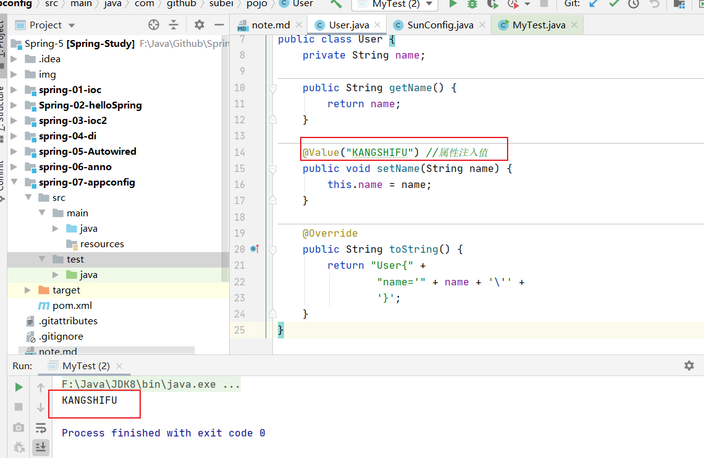

> **导入其他配置如何做呢？**

1. 再编写一个配置类！

```java
package com.github.subei.config;

import org.springframework.context.annotation.Configuration;

@Configuration //代表这是一个配置类
public class SunConfig2 {
}
```

2. 在之前的配置类中我们来选择导入这个配置类

```java
package com.github.subei.config;

import com.github.subei.pojo.User;
import org.springframework.context.annotation.Bean;
import org.springframework.context.annotation.ComponentScan;
import org.springframework.context.annotation.Configuration;
import org.springframework.context.annotation.Import;

// 这个也会Spring容器托管，注册到容器中，因为他本来就是一个@Component
// @Configuration代表这是一个配置类，就和我们之前看的beans.xml
@Configuration  // 代表这是一个配置类
@ComponentScan("com.github.subei.pojo")
@Import(SunConfig2.class) // 导入合并其他配置类，类似于配置文件中的 inculde 标签
public class SunConfig {
    // 注册一个bean，就相当于我们之前写的一个bean标签;
    // 这个方法的名字，就相当bean标签中的id属性;
    // 这个方法的返回值，就相当bean标签中的cLass属性;

    @Bean
    public User getUser(){
        return new User(); // 就是返回要注入到bean的对象
    }
}
```

- 这种纯ava的配置方式，在SpringBoot中随处可见！

## 10、代理模式

>    为什么要学习代理模式？因为这就是Spring AOP的底层！
>
>    - SpringAOp和SpringMVc】代理模式的分类：
>      - 静态代理
>      - 动态代理

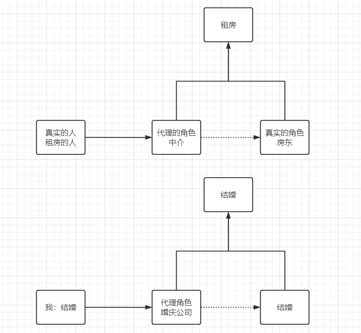

### 10.1 静态代理

> 角色分析：

- 抽象角色：一般会使用接口或者抽象类来解决；
- 真实角色：被代理的角色；
- 代理角色：代理真实角色，代理真实角色后，我们一般会做一些附属操作；
- 客户：访问代理角色的人！

---

1.接口

```java
package com.github.subei.demo;

// 租房
public interface Rent {
    public void rent();
}
```

2. 真实角色

```java
package com.github.subei.demo;

public class Host implements Rent{
    public void rent(){
        System.out.println("房东要出租房子？");
    }
}
```

3. 代理角色

```java
package com.github.subei.demo;

public class Proxy {
    private Host host;

    public Proxy() {
    }

    public Proxy(Host host) {
        this.host = host;
    }

    public void rent(){
        seeHouse();
        host.rent();
        contract();
        fare();
    }

    // 看房
    public void seeHouse(){
        System.out.println("中介带你看房！");
    }

    // 收中介费
    public void fare(){
        System.out.println("收中介费！");
    }

    // 签合同
    public void contract(){
        System.out.println("和你签合同！");
    }
}
```

4. 客户端访问代理角色

```java
package com.github.subei.demo;

public class Client {
    public static void main(String[] args) {
        // 房东要租房子
        Host host = new Host();
//        host.rent();
        // 代理，中介帮房东租房子，但是呢？代理角一般会有一些附属操作！
        Proxy proxy = new Proxy(host);
        // 直接找中介租房
        proxy.rent();
    }
}
```

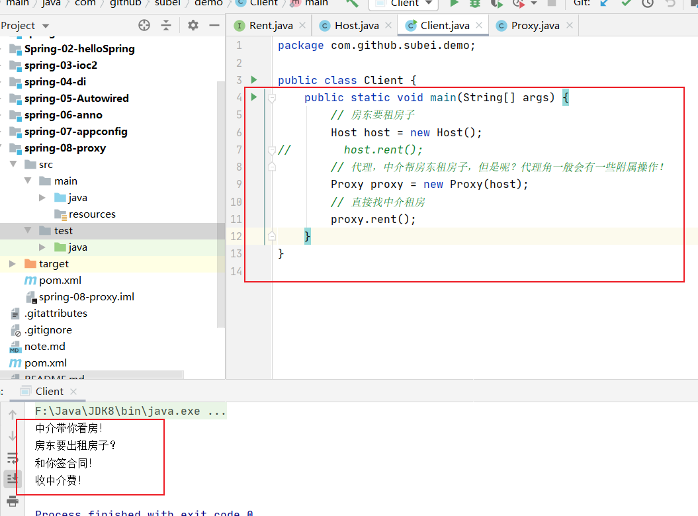

> **代理模式的好处:**

- 可以使得我们的真实角色更加纯粹，不再去关注一些公共的事情。
- 公共的业务由代理来完成，实现了业务的分工。
- 公共业务发生扩展时，方便集中管理。

> **缺点：** 

- 一个真实角色就会产生一个代理角色；代码量会翻倍，开发效率会变低。

### 10.2 静态代理再理解

1. 创建一个抽象角色，比如平时开发做的用户业务，抽象起来就是增删改查！ 

```java
package com.github.subei.demo2;

// 实现增删改查业务
public interface UserService {
    public void add();
    public void delete();
    public void update();
    public void query();
}
```

2. 需要一个真实对象来完成这些增删改查操作。

```java
package com.github.subei.demo2;

public class UserServiceImpl implements UserService{
    public void add() {
        System.out.println("添加用户");
    }

    public void delete() {
        System.out.println("删除用户");
    }

    public void update() {
        System.out.println("更新用户");
    }

    public void query() {
        System.out.println("查询用户");
    }
}
```

3. 设置一个代理类来处理日志！代理角色

```java
package com.github.subei.demo2;

public class UserServiceProxy implements UserService{
    private UserServiceImpl userService;

    public void setUserService(UserServiceImpl userService) {
        this.userService = userService;
    }

    public void add() {
        login("add");
        userService.add();
    }

    public void delete() {
        login("delete");
        userService.delete();
    }

    public void update() {
        login("update");
        userService.update();
    }

    public void query() {
        login("query");
        userService.query();
    }

    // 日志方法
    public void login(String msg){
        System.out.println("执行了"+msg+"方法");
    }
}
```

4. 测试类

```java
package com.github.subei.demo2;

public class Client {
    public static void main(String[] args) {
        // 真实业务
        UserServiceImpl userService = new UserServiceImpl();
        // 代理类
        UserServiceProxy proxy = new UserServiceProxy();
        // 代理类实现
        proxy.setUserService(userService);

        proxy.add();
        proxy.query();
    }
}
```

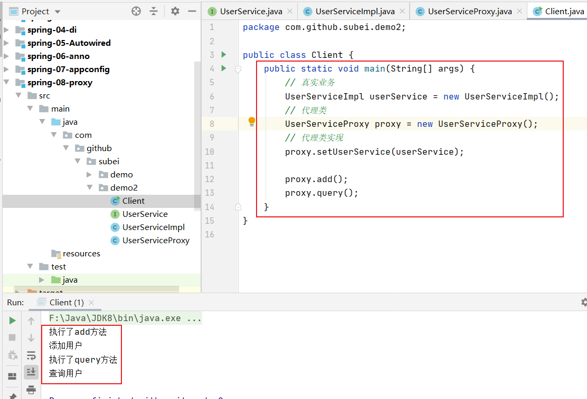

> AOP：纵向开发，横向开发。

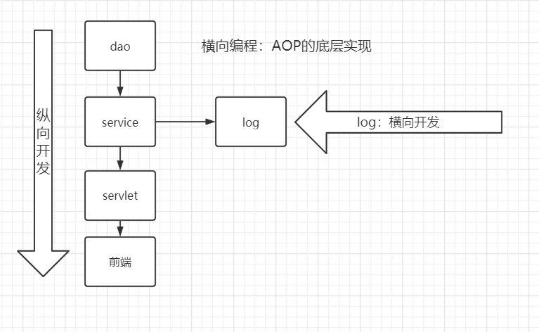

> 我们想要静态代理的好处，又不想要静态代理的缺点，所以 , 就有了动态代理 !

### 10.3 动态代理

- 动态代理和静态代理角色一样；
- 动态代理的代理类是动态生成的，不是我们直接写好的；
- 动态代理分为两大类：基于接口的动态代理，基于类的动态代理。
  - 基于接口——JDK动态代理【我们在这里使用】
  - 基于类——cglib
  - Java字节码实现：javasist

- **需要了解两个类**: InvocationHandler、Proxy，打开[JDK帮助文档](https://www.matools.com/api/java8)。

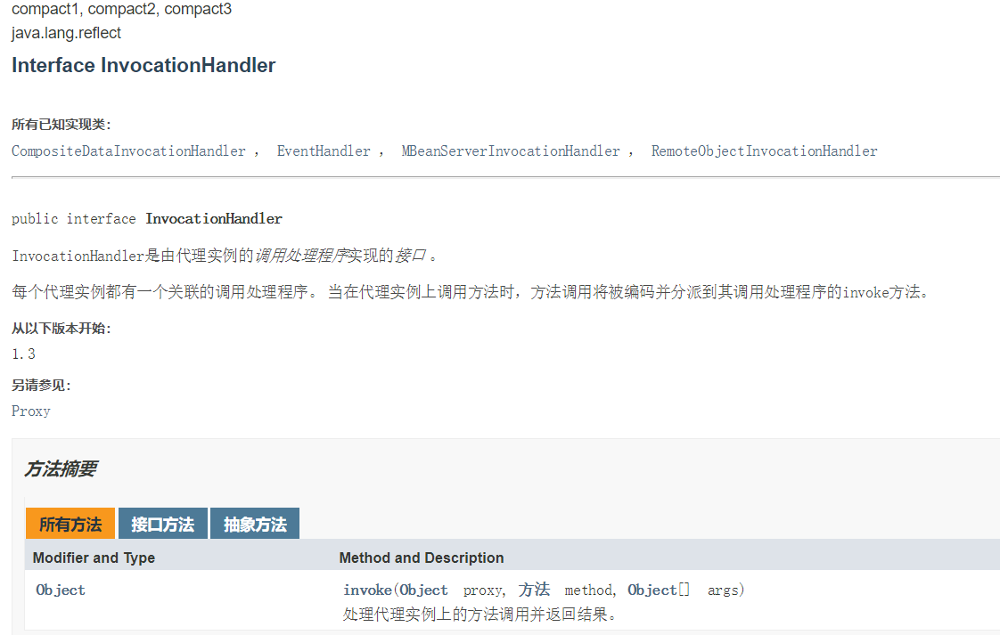

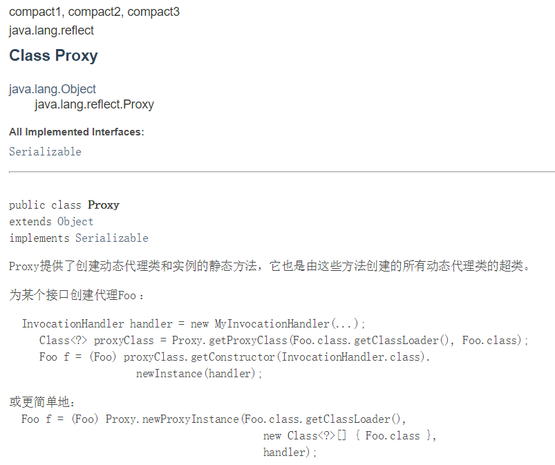

----

> 案例实现：

1. 抽象角色

```java
package com.github.subei.demo3;

// 租房
public interface Rent {
    public void rent();
}
```

2. 真实角色

```java
package com.github.subei.demo3;
// 房东
public class Host implements Rent {
    public void rent(){
        System.out.println("房东要出租房子？");
    }
}
```

3. 代理角色

```java
package com.github.subei.demo3;

import java.lang.reflect.InvocationHandler;
import java.lang.reflect.Method;
import java.lang.reflect.Proxy;

// 会用这个类，自动生成代理类
public class ProxyInvocationHandler implements InvocationHandler {

    // 被代理的接口
    private Rent rent;

    public void setRent(Rent rent){
        this.rent = rent;
    }

//            Foo f = (Foo) Proxy.newProxyInstance(Foo.class.getClassLoader(),
//            new Class<?>[] { Foo.class },
//            handler);

    // 生成得到代理类
    public Object getProxy(){
        return Proxy.newProxyInstance(this.getClass().getClassLoader(),rent.getClass().getInterfaces(),this);
    }

    // 处理代理实例，并返回代理结果
    public Object invoke(Object proxy, Method method, Object[] args) throws Throwable {
        // 动态代理本质：利用反射机制实现！
        Object result = method.invoke(rent, args);
        seeHouse();
        fare();
        return result;
    }

    // 看房
    public void seeHouse(){
        System.out.println("中介带你看房！");
    }

    // 收中介费
    public void fare(){
        System.out.println("收中介费！");
    }

    // 签合同
    public void contract(){
        System.out.println("和你签合同！");
    }

}
```

4. 测试类

```java
package com.github.subei.demo3;

public class Client {
    public static void main(String[] args) {
        // 真实角色
        Host host = new Host();

        // 代理角色
        ProxyInvocationHandler handler = new ProxyInvocationHandler();

        // 通过调用程序来处理角色，来处理我们要调用的接口对象！
        handler.setRent(host);

        Rent proxy = (Rent) handler.getProxy(); // 动态生成对应的代理类！

        proxy.rent();
    }
}
```

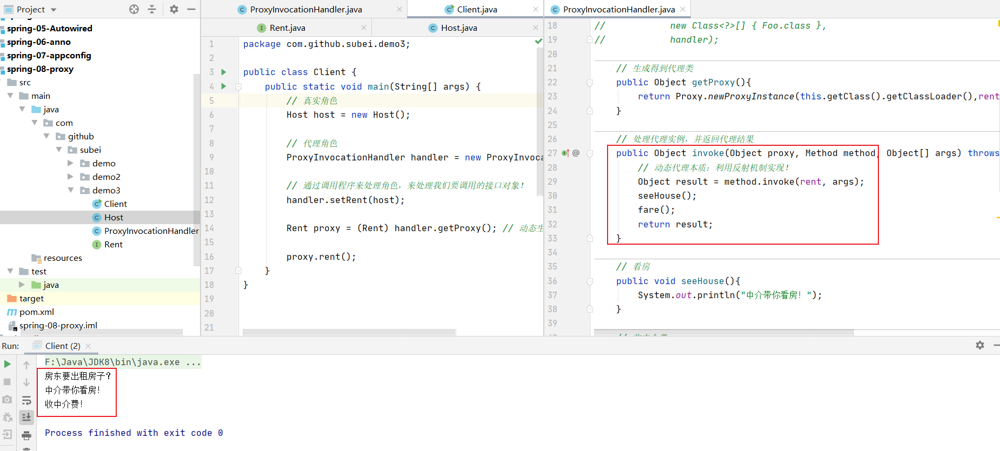

> 核心：**一个动态代理 , 一般代理某一类业务 , 一个动态代理可以代理多个类，代理的是接口！** 

### 10.4 动态代理再理解

> 觉得上面比较麻烦，可以编写一个通用的动态代理实现的类！所有的代理对象设置为Object即可！ 

```java
package com.github.subei.Demo4;

import com.github.subei.demo3.Rent;

import java.lang.reflect.InvocationHandler;
import java.lang.reflect.Method;
import java.lang.reflect.Proxy;

// 会用这个类，自动生成代理类
public class ProxyInvocationHandler implements InvocationHandler {

    // 被代理的接口
    private Object target;

    public void setTarget(Object target){
        this.target = target;
    }

    // 生成得到代理类
    public Object getProxy(){
        return Proxy.newProxyInstance(this.getClass().getClassLoader(),target.getClass().getInterfaces(),this);
    }

    // 处理代理实例，并返回代理结果
    public Object invoke(Object proxy, Method method, Object[] args) throws Throwable {
        // 动态代理本质：利用反射机制实现！
        log(method.getName());
        Object result = method.invoke(target, args);
        return result;
    }

    public void log(String methodName){
        System.out.println("执行了"+methodName+"方法");
    }
}
```

- 测试类

```java
package com.github.subei.Demo4;

import com.github.subei.demo2.UserService;
import com.github.subei.demo2.UserServiceImpl;

public class Client {
    public static void main(String[] args) {
        // 真实角色
        UserServiceImpl userService = new UserServiceImpl();
        // 代理角色，不存在
        ProxyInvocationHandler pih = new ProxyInvocationHandler();
        // 设置要代理的对象
        pih.setTarget(userService);
        // 动态生成代理类！
        UserService proxy = (UserService)pih.getProxy();

        proxy.add();
    }
```

> **动态代理的好处**

- 可以使得我们的真实角色更加纯粹，不再去关注一些公共的事情。
- 公共的业务由代理来完成，实现了业务的分工。
- 公共业务发生扩展时，方便集中管理。
- 一个动态代理，一般代理某一类业务。
- 一个动态代理可以代理多个类，代理的是接口！

## 11、AOP

### 11.1 什么是AOP

> AOP（Aspect Oriented Programming)意为：面向切面编程，通过预编译方式和运行期动态代理实现程序功能的统一维护的一种技术。
>
> AOP是OOP的延续，是软件开发中的一个热点，也是Spring框架中的一个重要内容，是函数式编程的一种衍生范型。
>
> 利用AOP可以对业务逻辑的各个部分进行隔离，从而使得业务逻辑各部分之间的耦合度降低，提高程序的可重用性，同时提高了开发的效率。

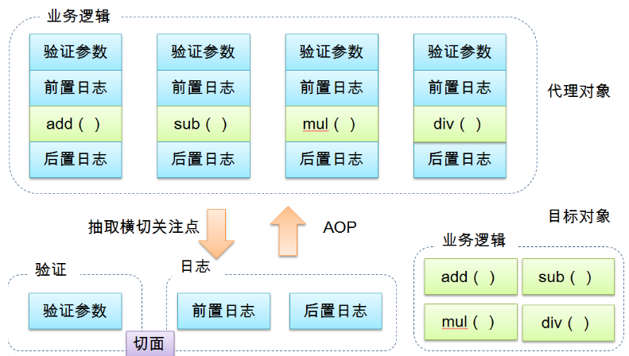

### 11.2 Aop在Spring中的作用

> ==提供声明式事务；允许用户自定义切面==

- 横切关注点：跨越应用程序多个模块的方法或功能。即是，与我们业务逻辑无关的，但是我们需要关注的部分，就是横切关注点。如日志 , 安全 , 缓存 , 事务等等 ....
- 切面（ASPECT）：横切关注点 被模块化 的特殊对象。即，它是一个类。
- 通知（Advice）：切面必须要完成的工作。即，它是类中的一个方法。
- 目标（Target）：被通知对象。
- 代理（Proxy）：向目标对象应用通知之后创建的对象。
- 切入点（PointCut）：切面通知 执行的 “地点”的定义。
- 连接点（JointPoint）：与切入点匹配的执行点。


- SpringAOP中，通过Advice定义横切逻辑，Spring中支持5种类型的Advice: 

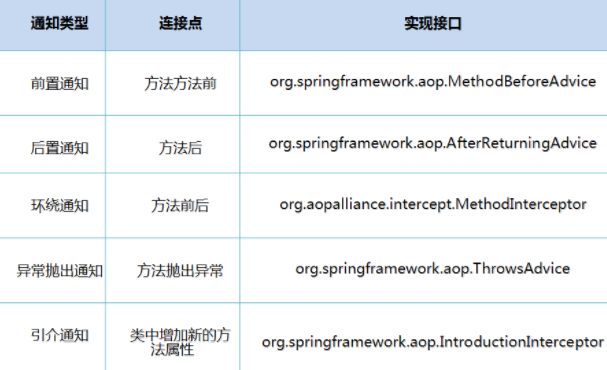

- 即 Aop 在 不改变原有代码的情况下 , 去增加新的功能。

### 11.3 使用Spring实现Aop

> 使用AOP织入，需要导入一个依赖包！

```xml
        <dependency>
            <groupId>org.aspectj</groupId>
            <artifactId>aspectjweaver</artifactId>
            <version>1.9.4</version>
        </dependency>
```

#### 方式一：使用Spring接口

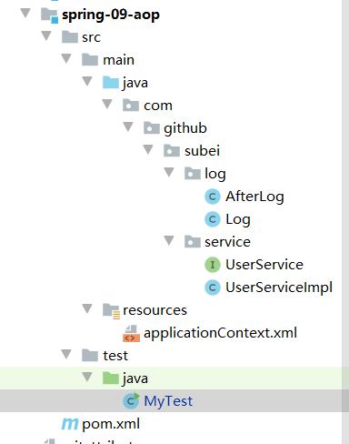

- 编写业务接口和实现类 

```java
package com.github.subei.service;

public interface UserService {
    public void add();
    public void delete();
    public void select();
    public void update();
}
```

```java
package com.github.subei.service;

public class UserServiceImpl implements UserService{

    public void add() {
        System.out.println("增加了一个用户");
    }

    public void delete() {
        System.out.println("删除了一个用户");
    }

    public void select() {
        System.out.println("查询了一个用户");
    }

    public void update() {
        System.out.println("更新了一个用户");
    }
}
```

-  前置增强类，后置增强类 

```java
package com.github.subei.log;

import org.springframework.aop.MethodBeforeAdvice;

import java.lang.reflect.Method;

public class Log implements MethodBeforeAdvice {
    // method:要执行的目标对象的方法
    // args:参数
    // target:目标对象
    public void before(Method method, Object[] args, Object target) throws Throwable {
        System.out.println(target.getClass().getName() + "的" + method.getName() + "方法被执行了！");
    }
}
```

```java
package com.github.subei.log;

import org.springframework.aop.AfterReturningAdvice;

import java.lang.reflect.Method;

public class AfterLog implements AfterReturningAdvice {
    // returnValue:返回值
    // method:被调用的方法
    // args:被调用的方法的对象的参数
    // target:被调用的目标对象
    public void afterReturning(Object returnValue, Method method, Object[] args, Object target) throws Throwable {
        System.out.println("执行了" + method.getName() + target.getClass().getName()
                +"的"+ "返回结果为:" + returnValue);
    }
}
```

- 在spring的文件中注册 , 并实现AOP切入实现 , 注意导入约束。

```xml
<?xml version="1.0" encoding="UTF-8"?>
<beans xmlns="http://www.springframework.org/schema/beans"
       xmlns:xsi="http://www.w3.org/2001/XMLSchema-instance"
       xmlns:aop="http://www.springframework.org/schema/aop"
       xsi:schemaLocation="http://www.springframework.org/schema/beans
       http://www.springframework.org/schema/beans/spring-beans.xsd
       http://www.springframework.org/schema/aop
       http://www.springframework.org/schema/aop/spring-aop.xsd">

    <!-- 注册bean -->
    <bean id="userService" class="com.github.subei.service.UserServiceImpl"/>
    <bean id="log" class="com.github.subei.log.Log"/>
    <bean id="afterLog" class="com.github.subei.log.AfterLog"/>

    <!-- 方式一:使用原生Spring API接口 -->
    <!-- 配置AOP:需要导入AOP的约束 -->
    <aop:config>
        <!-- 切入点:expression:表达式 , execution(要执行的位置！* * * *) -->
        <aop:pointcut id="pointcut" expression="execution(* com.github.subei.service.UserServiceImpl.*(..))"/>
        <!-- 执行环绕增加! advice-ref执行方法 , pointcut-ref切入点 -->
        <aop:advisor advice-ref="log" pointcut-ref="pointcut"/>
        <aop:advisor advice-ref="afterLog" pointcut-ref="pointcut"/>
    </aop:config>

</beans>
```

- 测试类

```java
import com.github.subei.service.UserService;
import org.springframework.context.ApplicationContext;
import org.springframework.context.support.ClassPathXmlApplicationContext;

public class MyTest {
    public static void main(String[] args) {
        ApplicationContext context = new ClassPathXmlApplicationContext("applicationContext.xml");
        // 动态代理代理的是接口
        UserService userService = context.getBean("userService", UserService.class);
        userService.select();
    }
}
```

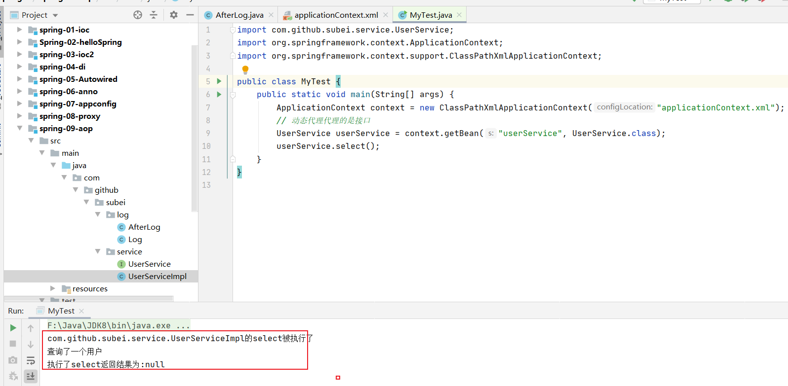

> Spring的Aop就是将公共的业务 (日志，安全等) 和领域业务结合起来，当执行领域业务时，将会把公共业务加进来。实现公共业务的重复利用，其本质还是动态代理。

-----

#### 第二种方式：自定义类来实现Aop

> 主要是切面定义。

- 第一步 : 写一个切入类 

```java
package com.github.subei.diy;

public class DiyPointCut {
    public void before(){
        System.out.println("---------方法执行前---------");
    }
    public void after(){
        System.out.println("---------方法执行后---------");
    }
}
```

- 在spring中配置 

```xml
    <!--  第二种：自定义类  -->
    <bean id="diy" class="com.github.subei.diy.DiyPointCut"/>

    <aop:config>
        <!--  自定义切面，ref要引用的类  -->
        <aop:aspect ref="diy">
            <!--  切入点  -->
            <aop:pointcut id="point" expression="execution(* com.github.subei.service.UserServiceImpl.*(..))"/>
            <!--  通知  -->
            <aop:before method="before" pointcut-ref="point" />
            <aop:after method="after" pointcut-ref="point"/>
        </aop:aspect>
    </aop:config>
```

- 测试类

```java
import com.github.subei.service.UserService;
import org.springframework.context.ApplicationContext;
import org.springframework.context.support.ClassPathXmlApplicationContext;

public class MyTest {
    public static void main(String[] args) {
        ApplicationContext context = new ClassPathXmlApplicationContext("applicationContext.xml");
        // 动态代理代理的是接口
        UserService userService = context.getBean("userService", UserService.class);
        userService.select();
    }
}
```

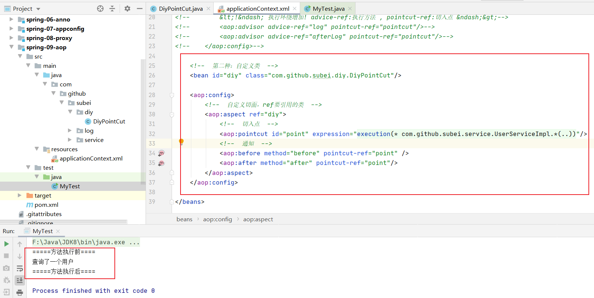

---

#### 第三种方式：使用注解实现

- 第一步：编写一个注解实现的增强类 

```java
package com.github.subei.diy;

import org.aspectj.lang.ProceedingJoinPoint;
import org.aspectj.lang.Signature;
import org.aspectj.lang.annotation.After;
import org.aspectj.lang.annotation.Around;
import org.aspectj.lang.annotation.Aspect;
import org.aspectj.lang.annotation.Before;

// 使用注解方式实现AOP
@Aspect // 标注这个类是一个切面
public class AnnotationPointCut {
    @Before("execution(* com.github.subei.service.UserServiceImpl.*(..))")
    public void before(){
        System.out.println("---------方法执行前---------");
    }

    @After("execution(* com.github.subei.service.UserServiceImpl.*(..))")
    public void after(){
        System.out.println("---------方法执行后---------");
    }

    // 在环绕增强中，我们可以给定一个参数，代表我们要获取处理切入的点
    @Around("execution(* com.github.subei.service.UserServiceImpl.*(..))")
    public void around(ProceedingJoinPoint jp) throws Throwable {
        System.out.println("环绕前");
        Signature signature = jp.getSignature();
        System.out.println("签名:"+ signature); // 获得签名

        // 执行目标方法:proceed
        Object proceed = jp.proceed();
        System.out.println("环绕后");

        System.out.println(proceed);
    }
}
```

- 第二步：在Spring配置文件中，注册bean，并增加支持注解的配置。

```xml
    <!-- 第三种方法:使用注解方式实现 -->
    <bean id="annotationPointCut" class="com.github.subei.diy.DiyPointCut"/>
    <!-- 开启注解支持！ -->
    <aop:aspectj-autoproxy/>
```

- 这里不知怎么回事，出现了如下情况，**未解决**……

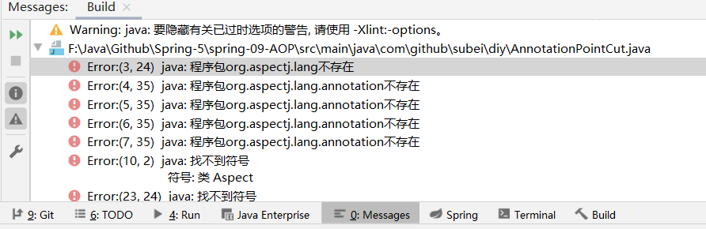

- aop:aspectj-autoproxy——说明 

> 通过aop命名空间的<aop:aspectj-autoproxy />声明自动为spring容器中那些配置@aspectJ切面的bean创建代理，织入切面。当然，spring 在内部依旧采用AnnotationAwareAspectJAutoProxyCreator进行自动代理的创建工作，但具体实现的细节已经被<aop:aspectj-autoproxy />隐藏起来了

> <aop:aspectj-autoproxy />有一个proxy-target-class属性，默认为false，表示使用jdk动态代理织入增强，当配为<aop:aspectj-autoproxy  poxy-target-class="true"/>时，表示使用CGLib动态代理技术织入增强。不过即使proxy-target-class设置为false，如果目标类没有声明接口，则spring将自动使用CGLib动态代理。

## 12、整合MyBatis

> 步骤：

- 导入相关jar包

  - junit

  ```xml
          <dependency>
              <groupId>junit</groupId>
              <artifactId>junit</artifactId>
              <version>4.12</version>
          </dependency>
  ```

  - mybatis

  ```xml
  <!-- https://mvnrepository.com/artifact/org.mybatis/mybatis -->
  <dependency>
      <groupId>org.mybatis</groupId>
      <artifactId>mybatis</artifactId>
      <version>3.5.3</version>
  </dependency>
  ```
- mysql数据库
  
  ```xml
          <dependency>
              <groupId>mysql</groupId>
              <artifactId>mysql-connector-java</artifactId>
              <version>5.1.47</version>
          </dependency>
  ```

- spring相关 
  
  ```xml
          <dependency>
              <groupId>org.springframework</groupId>
              <artifactId>spring-webmvc</artifactId>
              <version>5.2.12.RELEASE</version>
          </dependency>
          <dependency>
              <groupId>org.springframework</groupId>
              <artifactId>spring-jdbc</artifactId>
              <version>5.1.10.RELEASE</version>
          </dependency>
  ```
- AOP 织入器
  
  ```xml
          <dependency>
              <groupId>org.aspectj</groupId>
              <artifactId>aspectjweaver</artifactId>
              <version>1.9.6</version>
          </dependency>
  ```

- mybatis-spring【整合包】

  ```xml
  <dependency>
      <groupId>org.mybatis</groupId>
      <artifactId>mybatis-spring</artifactId>
      <version>2.0.6</version>
  </dependency>
  ```
- 配置Maven静态资源过滤问题！  
  
    ```xml
      <build>
         <resources>
             <resource>
                 <directory>src/main/java</directory>
                 <includes>
                     <include>**/*.properties</include>
                     <include>**/*.xml</include>
                 </includes>
                 <filtering>true</filtering>
             </resource>
         </resources>
      </build>
    ```

- 编写配置文件
- 测试

----

#### 12.1 回忆MyBatis

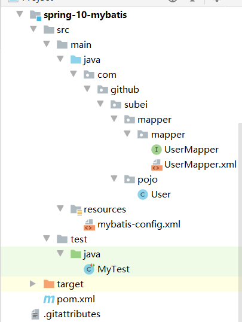

1. 编写实体类

```java
package com.github.subei.pojo;

import lombok.Data;

@Data
public class User {
    private int id;
    private String name;
    private String pwd;

    public User() {
    }

    public User(int id, String name, String pwd) {
        this.id = id;
        this.name = name;
        this.pwd = pwd;
    }

    public int getId() {
        return id;
    }

    public void setId(int id) {
        this.id = id;
    }

    public String getName() {
        return name;
    }

    public void setName(String name) {
        this.name = name;
    }

    public String getPwd() {
        return pwd;
    }

    public void setPwd(String pwd) {
        this.pwd = pwd;
    }

    @Override
    public String toString() {
        return "User{" +
                "id=" + id +
                ", name='" + name + '\'' +
                ", pwd='" + pwd + '\'' +
                '}';
    }
}
```

2. 编写MyBatis核心配置文件

```xml
<?xml version="1.0" encoding="UTF-8" ?>
<!DOCTYPE configuration
        PUBLIC "-//mybatis.org//DTD Config 3.0//EN"
        "http://mybatis.org/dtd/mybatis-3-config.dtd">
<!--configuration核心配置文件-->
<configuration>

    <typeAliases>
        <package name="com.github.subei.pojo"/>
    </typeAliases>

    <environments default="development">
        <environment id="development">
            <transactionManager type="JDBC"/>
            <dataSource type="POOLED">
                <property name="driver" value="com.mysql.jdbc.Driver"/>
                <property name="url" value="jdbc:mysql://localhost:3306/mybatis?characterEncoding=UTF-8"/>
                <property name="username" value="root"/>
                <property name="password" value="root"/>
            </dataSource>
        </environment>
    </environments>

    <mappers>
        <package name="com.github.subei.mapper"/>
    </mappers>
    
</configuration>
```

3. 编写接口

```java
package com.github.subei.mapper.mapper;

import com.github.subei.pojo.User;

import java.util.List;

public interface UserMapper {
    public List<User> selectUser();
}
```

4. 编写Mapper.xml

```xml
<?xml version="1.0" encoding="UTF-8" ?>
<!DOCTYPE mapper
        PUBLIC "-//mybatis.org//DTD Config 3.0//EN"
        "http://mybatis.org/dtd/mybatis-3-mapper.dtd">
<mapper namespace="com.github.subei.mapper.mapper.UserMapper">

    <select id="selectUser" resultType="user">
        select * from user;
    </select>

</mapper>
```

5. 测试类

```java
import com.github.subei.mapper.mapper.UserMapper;
import com.github.subei.pojo.User;
import org.apache.ibatis.io.Resources;
import org.apache.ibatis.session.SqlSession;
import org.apache.ibatis.session.SqlSessionFactory;
import org.apache.ibatis.session.SqlSessionFactoryBuilder;
import org.junit.Test;

import java.io.IOException;
import java.io.InputStream;
import java.util.List;

public class MyTest {
    @Test
    public void selectUser() throws IOException {
        String resource = "mybatis-config.xml";
        InputStream inputStream = Resources.getResourceAsStream(resource);
        SqlSessionFactory sqlSessionFactory = new SqlSessionFactoryBuilder().build(inputStream);
        SqlSession sqlSession = sqlSessionFactory.openSession();
        UserMapper mapper = sqlSession.getMapper(UserMapper.class);

        List<User> userList = mapper.selectUser();
        for(User user : userList){
            System.out.println(user);
        }

        sqlSession.close();
    }
}
```

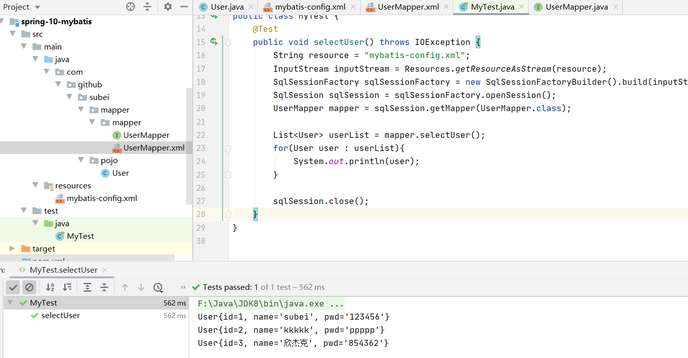

#### 12.2 MyBatis-Spring学习

- 引入Spring之前需要了解mybatis-spring包中的一些重要类；

- http://www.mybatis.org/spring/zh/index.html

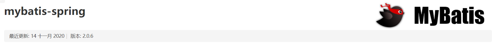

> **什么是 MyBatis-Spring？**

- MyBatis-Spring 会帮助你将 MyBatis 代码无缝地整合到 Spring 中。

> **知识基础**

- 在开始使用 MyBatis-Spring 之前，你需要先熟悉 Spring 和 MyBatis 这两个框架和有关它们的术语。这很重要

> MyBatis-Spring 需要以下版本：

| MyBatis-Spring | MyBatis | Spring 框架 | Spring Batch | Java    |
| :------------- | :------ | :---------- | :----------- | :------ |
| 2.0            | 3.5+    | 5.0+        | 4.0+         | Java 8+ |
| 1.3            | 3.4+    | 3.2.2+      | 2.1+         | Java 6+ |

> 如果使用 Maven 作为构建工具，仅需要在 pom.xml 中加入以下代码即可：

```xml
        <dependency>
            <groupId>org.mybatis</groupId>
            <artifactId>mybatis-spring</artifactId>
            <version>2.0.6</version>
        </dependency>
```

- 要和 Spring 一起使用 MyBatis，需要在 Spring 应用上下文中定义至少两样东西：一个 SqlSessionFactory 和至少一个数据映射器类。

- 在 MyBatis-Spring 中，可使用SqlSessionFactoryBean来创建 SqlSessionFactory。 要创建工厂 bean，将下面的代码放到 Spring 的 XML 配置文件中： 

```xml
<bean id="sqlSessionFactory" class="org.mybatis.spring.SqlSessionFactoryBean">
  <property name="dataSource" ref="dataSource" />
</bean>
```

- SqlSessionFactory需要一个 DataSource（数据源）。这可以是任意的 DataSource，只需要和配置其它 Spring 数据库连接一样配置它就可以了。  

- 在基础的 MyBatis 用法中，是通过 SqlSessionFactoryBuilder 来创建 SqlSessionFactory 的。而在 MyBatis-Spring 中，则使用 SqlSessionFactoryBean 来创建。

- 在 MyBatis 中，你可以使用 SqlSessionFactory 来创建 SqlSession。一旦你获得一个 session 之后，你可以使用它来执行映射了的语句，提交或回滚连接，最后，当不再需要它的时候，你可以关闭 session。

- `SqlSessionFactory` 有一个唯一的必要属性：用于 JDBC 的 `DataSource`。这可以是任意的 `DataSource` 对象，它的配置方法和其它 Spring 数据库连接是一样的。

- 一个常用的属性是 `configLocation`，它用来指定 MyBatis 的 XML 配置文件路径。它在需要修改 MyBatis 的基础配置非常有用。通常，基础配置指的是**< settings>** 或 **< typeAliases>**元素。
- 需要注意的是，这个配置文件**并不需要**是一个完整的 MyBatis 配置。确切地说，任何环境配置（<environments>），数据源（<DataSource>）和 MyBatis 的事务管理器（<transactionManager>）都会被忽略。SqlSessionFactoryBean **会创建它自有的 MyBatis 环境配置**（Environment），并按要求设置自定义环境的值。

---

- `SqlSessionTemplate` 是 MyBatis-Spring 的核心。作为 `SqlSession` 的一个实现，这意味着可以使用它无缝代替你代码中已经在使用的 `SqlSession`。 `SqlSessionTemplate` 是线程安全的，可以被多个 DAO 或映射器所共享使用。

- 当调用 SQL 方法时（包括由 `getMapper()` 方法返回的映射器中的方法），`SqlSessionTemplate` 将会保证使用的 `SqlSession` 与当前 Spring 的事务相关。 此外，它管理 session 的生命周期，包含必要的关闭、提交或回滚操作。另外，它也负责将 MyBatis 的异常翻译成 Spring 中的 `DataAccessExceptions`。

- 由于模板可以参与到 Spring 的事务管理中，并且由于其是线程安全的，可以供多个映射器类使用，你应该**总是**用 `SqlSessionTemplate` 来替换 MyBatis 默认的 `DefaultSqlSession` 实现。在同一应用程序中的不同类之间混杂使用可能会引起数据一致性的问题。

- 可以使用 `SqlSessionFactory` 作为构造方法的参数来创建 `SqlSessionTemplate` 对象。

```xml
<bean id="sqlSession" class="org.mybatis.spring.SqlSessionTemplate">
  <constructor-arg index="0" ref="sqlSessionFactory" />
</bean>
```

- 现在，这个 bean 就可以直接注入到你的 DAO bean 中了。你需要在你的 bean 中添加一个 SqlSession 属性，就像下面这样： 

```java
public class UserDaoImpl implements UserDao {

  private SqlSession sqlSession;

  public void setSqlSession(SqlSession sqlSession) {
    this.sqlSession = sqlSession;
  }

  public User getUser(String userId) {
    return sqlSession.selectOne("org.mybatis.spring.sample.mapper.UserMapper.getUser", userId);
  }
}
```

- 按下面这样，注入 `SqlSessionTemplate`： 

```xml
<bean id="userDao" class="org.mybatis.spring.sample.dao.UserDaoImpl">
  <property name="sqlSession" ref="sqlSession" />
</bean>
```

#### 12.3 整合实现一

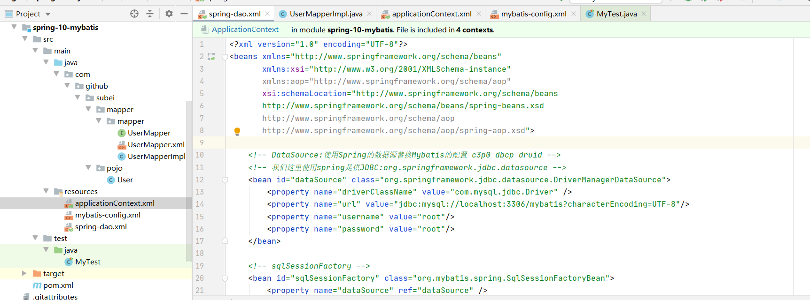

1. 引入Spring配置文件spring-dao.xml。

```xml
<?xml version="1.0" encoding="UTF-8"?>
<beans xmlns="http://www.springframework.org/schema/beans"
       xmlns:xsi="http://www.w3.org/2001/XMLSchema-instance"
       xmlns:aop="http://www.springframework.org/schema/aop"
       xsi:schemaLocation="http://www.springframework.org/schema/beans
       http://www.springframework.org/schema/beans/spring-beans.xsd
       http://www.springframework.org/schema/aop
       http://www.springframework.org/schema/aop/spring-aop.xsd">
```

2. 配置数据源替换mybaits的数据源，spring-dao.xml文件

```xml
    <!-- DataSource:使用Spring的数据源替换Mybatis的配置 c3p0 dbcp druid -->
    <!-- 我们这里使用spring是供JDBC:org.springframework.jdbc.datasource -->
    <bean id="dataSource" class="org.springframework.jdbc.datasource.DriverManagerDataSource">
        <property name="driverClassName" value="com.mysql.jdbc.Driver" />
        <property name="url" value="jdbc:mysql://localhost:3306/mybatis?characterEncoding=UTF-8"/>
        <property name="username" value="root"/>
        <property name="password" value="root"/>
    </bean>
```

3. 配置SqlSessionFactory，关联MyBatis，spring-dao.xml文件

```xml
    <!-- sqlSessionFactory -->
    <bean id="sqlSessionFactory" class="org.mybatis.spring.SqlSessionFactoryBean">
        <property name="dataSource" ref="dataSource" />
        <!-- 绑定mybatis配置文件 -->
        <property name="configLocation" value="classpath:mybatis-config.xml"/>
        <property name="mapperLocations" value="classpath:com/github/subei/mapper/mapper/*.xml"/>
    </bean>
```

4. 注册sqlSessionTemplate，关联sqlSessionFactory；spring-dao.xml文件

```xml
    <!-- SqlSessionTemplate:就是我们使用的sqLSession -->
    <bean id="SqlSession" class="org.mybatis.spring.SqlSessionTemplate">
        <!-- 只能使用构造器注入sqlSessionFactory，因为它没有set方法 -->
        <constructor-arg index="0" ref="sqlSessionFactory"/>
    </bean>
```

5. 增加Dao接口的实现类；私有化sqlSessionTemplate，UserMapperImpl.java文件

```java
package com.github.subei.mapper.mapper;

import com.github.subei.pojo.User;
import org.mybatis.spring.SqlSessionTemplate;

import java.util.List;

public class UserMapperImpl implements UserMapper{

    // 我们的所有操作，都使用sqlSession来执行，在原来，现在都使用SqlSessionTemplate；
    private SqlSessionTemplate sqlSession;

    public void setSqlSession(SqlSessionTemplate sqlSession) {
        this.sqlSession = sqlSession;
    }

    public List<User> selectUser() {
        UserMapper mapper = sqlSession.getMapper(UserMapper.class);
        return mapper.selectUser();

    }
}
```

6. 注册bean实现，applicationContext.xml文件

```xml
<?xml version="1.0" encoding="UTF-8"?>
<beans xmlns="http://www.springframework.org/schema/beans"
       xmlns:xsi="http://www.w3.org/2001/XMLSchema-instance"
       xmlns:aop="http://www.springframework.org/schema/aop"
       xsi:schemaLocation="http://www.springframework.org/schema/beans
       http://www.springframework.org/schema/beans/spring-beans.xsd
       http://www.springframework.org/schema/aop
       http://www.springframework.org/schema/aop/spring-aop.xsd">

    <import resource="spring-dao.xml"/>

    <!-- -->
    <bean id="userMapper" class="com.github.subei.mapper.mapper.UserMapperImpl">
        <property name="sqlSession" ref="SqlSession"/>
    </bean>

</beans>
```

7. 测试

```java
import com.github.subei.mapper.mapper.UserMapper;
import com.github.subei.pojo.User;
import org.apache.ibatis.io.Resources;
import org.apache.ibatis.session.SqlSession;
import org.apache.ibatis.session.SqlSessionFactory;
import org.apache.ibatis.session.SqlSessionFactoryBuilder;
import org.junit.Test;
import org.springframework.context.ApplicationContext;
import org.springframework.context.support.ClassPathXmlApplicationContext;

import java.io.IOException;
import java.io.InputStream;
import java.util.List;

public class MyTest {
    @Test
    public void selectUser() throws IOException {
        ApplicationContext context = new ClassPathXmlApplicationContext("applicationContext.xml");
        UserMapper userMapper = context.getBean("userMapper", UserMapper.class);
        for (User user : userMapper.selectUser()){
            System.out.println(user);
        }
    }
}
```

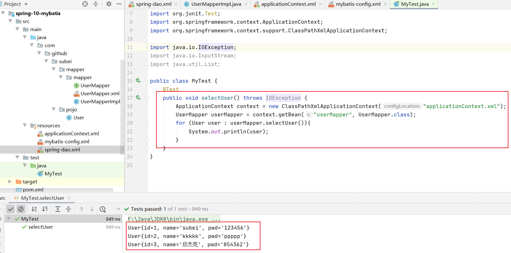

- 结果成功输出！现在我们的Mybatis配置文件的状态！发现都可以被Spring整合！mybatis-config.xml文件。

```xml
<?xml version="1.0" encoding="UTF-8" ?>
<!DOCTYPE configuration
        PUBLIC "-//mybatis.org//DTD Config 3.0//EN"
        "http://mybatis.org/dtd/mybatis-3-config.dtd">
<!--configuration核心配置文件-->
<configuration>

    <typeAliases>
        <package name="com.github.subei.pojo"/>
    </typeAliases>

    <!-- 设置 -->

    
</configuration>
```

#### 12.4 整合实现二

> mybatis-spring1.2.3版以上的才有这个。

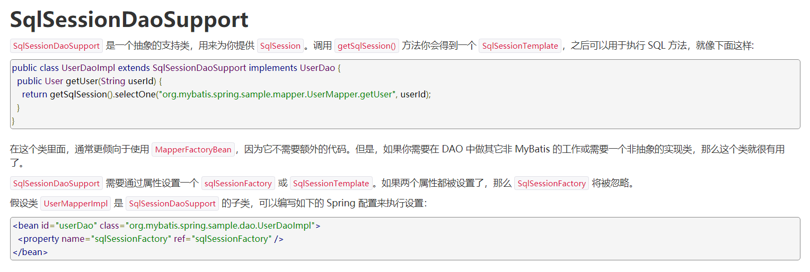

- dao继承Support类，直接利用 getSqlSession() 获得，然后直接注入SqlSessionFactory。比起方式1，不需要管理SqlSessionTemplate , 而且对事务的支持更加友好。可跟踪源码查看！！！

> 测试：

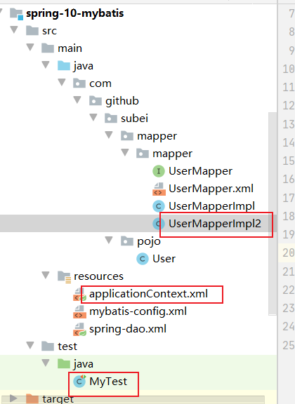

1. 将上面写的UserMapperImpl.java修改一下

```java
package com.github.subei.mapper.mapper;

import com.github.subei.pojo.User;
import org.mybatis.spring.support.SqlSessionDaoSupport;

import java.util.List;

public class UserMapperImpl2 extends SqlSessionDaoSupport implements UserMapper{

    public List<User> selectUser() {
        UserMapper mapper = getSqlSession().getMapper(UserMapper.class);
        return mapper.selectUser();
    }
}
```

2. 修改bean的配置

```xml
    <bean id="userMapper2" class="com.github.subei.mapper.mapper.UserMapperImpl2">
        <property name="sqlSessionFactory" ref="sqlSessionFactory" />
    </bean>
```

3. 测试

```java
import com.github.subei.mapper.mapper.UserMapper;
import com.github.subei.pojo.User;
import org.apache.ibatis.io.Resources;
import org.apache.ibatis.session.SqlSession;
import org.apache.ibatis.session.SqlSessionFactory;
import org.apache.ibatis.session.SqlSessionFactoryBuilder;
import org.junit.Test;
import org.springframework.context.ApplicationContext;
import org.springframework.context.support.ClassPathXmlApplicationContext;

import java.io.IOException;
import java.io.InputStream;
import java.util.List;

public class MyTest {
    @Test
    public void selectUser() throws IOException {
        ApplicationContext context = new ClassPathXmlApplicationContext("applicationContext.xml");
        UserMapper userMapper = context.getBean("userMapper2", UserMapper.class);
        for (User user : userMapper.selectUser()){
            System.out.println(user);
        }
    }
}
```

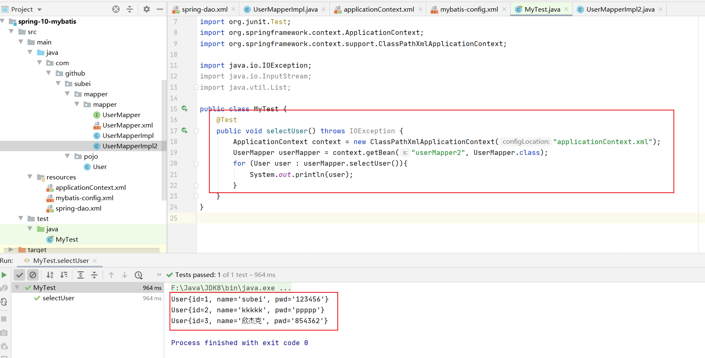

> 总结 : 整合到spring以后可以完全不要mybatis的配置文件，除了这些方式可以实现整合之外，还可以使用注解来实现！

## 13、声明式事务

#### 13.1 回顾事务

- 把一组业务当成一个业务来做；要么都成功，要么都失败！
- 事务在项目开发中，十分的重要，涉及到数据的一致性问题，不能马虎！
- 确保完整性和一致性；

> **事务就是把一系列的动作当成一个独立的工作单元，这些动作要么全部完成，要么全部不起作用**。

- **事务的ACID原则**

1. 原子性（atomicity）

2. - 事务是原子性操作，由一系列动作组成，事务的原子性确保动作要么全部完成，要么完全不起作用。

3. 一致性（consistency）

4. - 一旦所有事务动作完成，事务就要被提交。数据和资源处于一种满足业务规则的一致性状态中。

5. 隔离性（isolation）

6. - 可能多个事务会同时处理相同的数据，因此每个事务都应该与其他事务隔离开来，防止数据损坏。

7. 持久性（durability）

8. - 事务一旦完成，无论系统发生什么错误，结果都不会受到影响。通常情况下，事务的结果被写到持久化存储器中。

#### 13.2 测试

> 将上面的代码拷贝到一个新项目中：

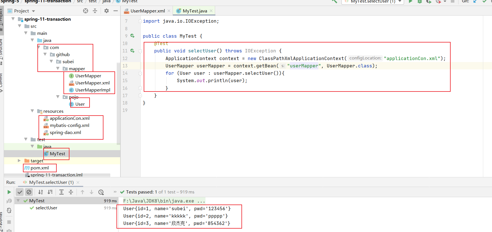

- 在之前的案例中，在userDao接口新增两个方法，删除和增加用户； 

```java
package com.github.subei.mapper;

import com.github.subei.pojo.User;

import java.util.List;

public interface UserMapper {
    public List<User> selectUser();

    // 添加一个用户
    public int addUser(User user);

    // 根据id删除用户
    public int deleteUser(int id);
}
```

- UserMapper.xml文件，故意把 deletes 写错，用于测试！ 

```xml
<?xml version="1.0" encoding="UTF-8" ?>
<!DOCTYPE mapper
        PUBLIC "-//mybatis.org//DTD Config 3.0//EN"
        "http://mybatis.org/dtd/mybatis-3-mapper.dtd">
<mapper namespace="com.github.subei.mapper.UserMapper">

    <select id="selectUser" resultType="user">
        select * from user;
    </select>

    <insert id="addUser" parameterType="com.kuang.pojo.User">
        insert into user (id,name,pwd) values (#{id},#{name},#{pwd});
    </insert>

    <delete id="deleteUser" parameterType="int">
        deletes from user where id = #{id};
    </delete>

</mapper>
```

- 编写接口的实现类UserMapperImpl.java文件

```java
package com.github.subei.mapper;

import com.github.subei.pojo.User;
import org.mybatis.spring.SqlSessionTemplate;
import org.mybatis.spring.support.SqlSessionDaoSupport;

import java.util.List;

public class UserMapperImpl extends SqlSessionDaoSupport implements UserMapper{

    // 增加一些操作
    public List<User> selectUser() {
        User user = new User(6,"维维","123456");
        UserMapper mapper = getSqlSession().getMapper(UserMapper.class);
        mapper.addUser(user);
        mapper.deleteUser(6);
        return mapper.selectUser();
    }

    public int addUser(User user) {
        return getSqlSession().getMapper(UserMapper.class).addUser(user);
    }

    public int deleteUser(int id) {
        return getSqlSession().getMapper(UserMapper.class).deleteUser(id);
    }
}
```

- 测试类

```java
import com.github.subei.mapper.UserMapper;
import com.github.subei.pojo.User;
import org.junit.Test;
import org.springframework.context.ApplicationContext;
import org.springframework.context.support.ClassPathXmlApplicationContext;

import java.io.IOException;
import java.util.List;

public class MyTest {
    @Test
    public void selectUser() throws IOException {
        ApplicationContext context = new ClassPathXmlApplicationContext("applicationCon.xml");
        UserMapper userMapper = context.getBean("userMapper", UserMapper.class);

        List<User> userList = userMapper.selectUser();
        for (User user : userList) {
            System.out.println(user);
        }
    }
}
```

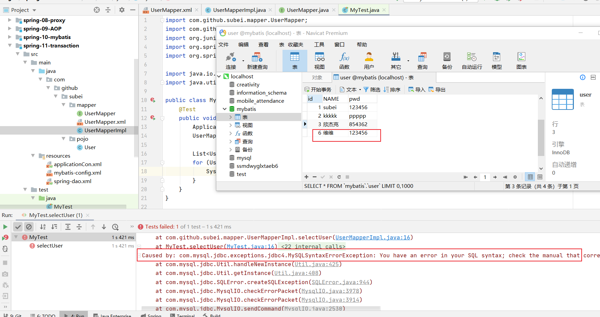

- 报错：sql异常，delete写错了。结果 ：插入成功！

#### 13.3  Spring中的事务管理 

> Spring在不同的事务管理API之上定义了一个抽象层，使得开发人员不必了解底层的事务管理API就可以使用Spring的事务管理机制。Spring支持编程式事务管理和声明式的事务管理。

**[编程式事务管理](http://mybatis.org/spring/zh/transactions.html#programmatic)**

- 将事务管理代码嵌到业务方法中来控制事务的提交和回滚
- 缺点：必须在每个事务操作业务逻辑中包含额外的事务管理代码

**声明式事务管理**==([交由容器管理事务](http://mybatis.org/spring/zh/transactions.html#container))

- 一般情况下比编程式事务好用。
- 将事务管理代码从业务方法中分离出来，以声明的方式来实现事务管理。
- 将事务管理作为横切关注点，通过aop方法模块化。Spring中通过Spring AOP框架支持声明式事务管理。

---

- **配置声明式事务** 

```xml
    <!-- 配置声明式事务 -->
    <bean id="transactionManager" class="org.springframework.jdbc.datasource.DataSourceTransactionManager">
        <property name="dataSource" ref="dataSource" />
    </bean>
```

- **使用Spring管理事务，注意头文件的约束导入 : tx**

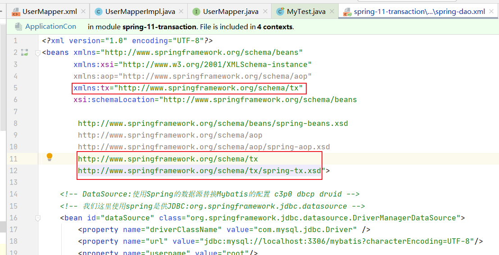

```xml
       xmlns:tx="http://www.springframework.org/schema/tx"

        http://www.springframework.org/schema/tx
        http://www.springframework.org/schema/tx/spring-tx.xsd
```


- **配置好事务管理器后，去配置事务的通知** 

```xml
    <!-- 结合AOP实现事物的织入 -->
    <!-- 配置事务的通知: -->
    <tx:advice id="txAdvice" transaction-manager="transactionManager">
        <tx:attributes>
            <!-- 配置哪些方法使用什么样的事务,配置事务的传播特性 -->
            <tx:method name="add" propagation="REQUIRED"/>
            <tx:method name="delete" propagation="REQUIRED"/>
            <tx:method name="update" propagation="REQUIRED"/>
            <tx:method name="search*" propagation="REQUIRED"/>
            <tx:method name="get" read-only="true"/>
            <tx:method name="*" propagation="REQUIRED"/>
        </tx:attributes>
    </tx:advice>
```

- **spring事务传播特性：**

> 事务传播行为就是多个事务方法相互调用时，事务如何在这些方法间传播。spring支持7种事务传播行为：

- propagation_requierd：如果当前没有事务，就新建一个事务，如果已存在一个事务中，加入到这个事务中，这是最常见的选择。
- propagation_supports：支持当前事务，如果没有当前事务，就以非事务方法执行。
- propagation_mandatory：使用当前事务，如果没有当前事务，就抛出异常。
- propagation_required_new：新建事务，如果当前存在事务，把当前事务挂起。
- propagation_not_supported：以非事务方式执行操作，如果当前存在事务，就把当前事务挂起。
- propagation_never：以非事务方式执行操作，如果当前事务存在则抛出异常。
- propagation_nested：如果当前存在事务，则在嵌套事务内执行。如果当前没有事务，则执行与propagation_required类似的操作

> Spring 默认的事务传播行为是 PROPAGATION_REQUIRED，它适合于绝大多数的情况。

- **配置AOP**
  - 导入aop的头文件！

```xml
    <!-- 配置事务的切入 -->
    <aop:config>
        <aop:pointcut id="txPointcut" expression="execution(* com.github.subei.mapper.*.*(..))"/>
        <aop:advisor advice-ref="txAdvice" pointcut-ref="txPointcut"/>
    </aop:config>
```

- **进行测试**
  - ==删掉刚才插入的数据==，再次测试！

```java
import com.github.subei.mapper.UserMapper;
import com.github.subei.pojo.User;
import org.junit.Test;
import org.springframework.context.ApplicationContext;
import org.springframework.context.support.ClassPathXmlApplicationContext;

import java.io.IOException;
import java.util.List;

public class MyTest {
    @Test
    public void selectUser() throws IOException {
        ApplicationContext context = new ClassPathXmlApplicationContext("applicationCon.xml");
        UserMapper userMapper = context.getBean("userMapper", UserMapper.class);

        List<User> userList = userMapper.selectUser();
        for (User user : userList) {
            System.out.println(user);
        }
    }
}
```


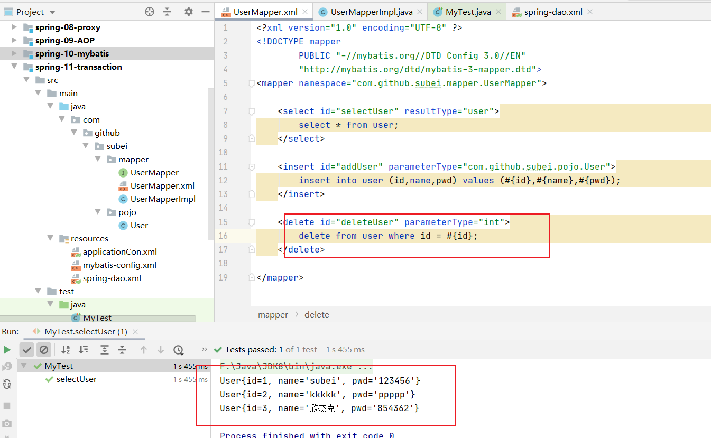

> 为什么需要配置事务？

- 如果不配置事务，可能存在数据提交不一致的情况下；
- 如果我们不在SPRING中去配置声明式事务，就需要手动提交控制事务；
- 事务在项目开发过程非常重要，涉及到数据的一致性的问题，不容马虎！