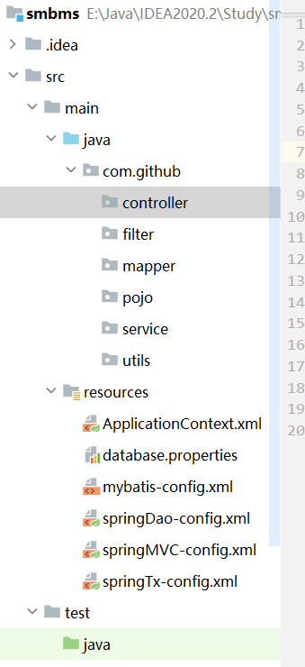

# SSM整合改造超市订单管理系统

> 环境要求：

- IDEA 2020.2
- MySQL 5.7.19
- Tomcat 9.0
- Maven 3.6

>技术要求：

- 需要熟练掌握MySQL数据库，Spring，JavaWeb及MyBatis知识，简单的前端知识；

> 整合思路？
>
> - Spring MVC+Spring+ Mybatis框架，核心框架是 Spring，通过 spring ioc\di和aop

- 管理 mybatis对象、 spring mvc对象；
- 管理 controller依赖于service； service依赖于dao；dao依赖于 mybatis。

> 整合步骤如下，MySQL及素材文件建议参考前文：[Servlet版](https://subeily.blog.csdn.net/article/details/119752416)。

## 1.搭建框架，导入配置文件

- 新建一个maven项目，添加web的支持。


- 导入项目中需要的jar包——在==pom.xml==中，以maven方式导入；

```xml
<?xml version="1.0" encoding="UTF-8"?>
<project xmlns="http://maven.apache.org/POM/4.0.0"
         xmlns:xsi="http://www.w3.org/2001/XMLSchema-instance"
         xsi:schemaLocation="http://maven.apache.org/POM/4.0.0 http://maven.apache.org/xsd/maven-4.0.0.xsd">
    <modelVersion>4.0.0</modelVersion>

    <groupId>org.example</groupId>
    <artifactId>smbms</artifactId>
    <version>1.0-SNAPSHOT</version>

    <dependencies>
        <dependency>
            <groupId>mysql</groupId>
            <artifactId>mysql-connector-java</artifactId>
            <version>5.1.47</version>
        </dependency>
        <dependency>
            <groupId>org.mybatis</groupId>
            <artifactId>mybatis</artifactId>
            <version>3.5.7</version>
        </dependency>
        <dependency>
            <groupId>org.projectlombok</groupId>
            <artifactId>lombok</artifactId>
            <version>1.18.4</version>
        </dependency>
        <dependency>
            <groupId>junit</groupId>
            <artifactId>junit</artifactId>
            <version>4.13</version>
            <scope>test</scope>
        </dependency>
        <dependency>
            <groupId>org.mybatis</groupId>
            <artifactId>mybatis-spring</artifactId>
            <version>2.0.6</version>
        </dependency>
        <dependency>
            <groupId>log4j</groupId>
            <artifactId>log4j</artifactId>
            <version>1.2.17</version>
        </dependency>
        <dependency>
            <groupId>org.springframework</groupId>
            <artifactId>spring-webmvc</artifactId>
            <version>5.3.9</version>
        </dependency>
        <dependency>
            <groupId>org.springframework</groupId>
            <artifactId>spring-jdbc</artifactId>
            <version>5.3.9</version>
        </dependency>
        <dependency>
            <groupId>org.aspectj</groupId>
            <artifactId>aspectjweaver</artifactId>
            <version>1.9.6</version>
        </dependency>
        <dependency>
            <groupId>javax.servlet</groupId>
            <artifactId>servlet-api</artifactId>
            <version>2.5</version>
        </dependency>
        <dependency>
            <groupId>jstl</groupId>
            <artifactId>jstl</artifactId>
            <version>1.2</version>
        </dependency>
        <dependency>
            <groupId>javax.servlet.jsp</groupId>
            <artifactId>jsp-api</artifactId>
            <version>2.2</version>
        </dependency>
        <!--文件上传-->
        <dependency>
            <groupId>commons-fileupload</groupId>
            <artifactId>commons-fileupload</artifactId>
            <version>1.3.3</version>
        </dependency>
        <!--servlet-api导入高版本的-->
        <dependency>
            <groupId>javax.servlet</groupId>
            <artifactId>javax.servlet-api</artifactId>
            <version>4.0.1</version>
        </dependency>
        <dependency>
            <groupId>com.mchange</groupId>
            <artifactId>c3p0</artifactId>
            <version>0.9.5.2</version>
        </dependency>
        <dependency>
            <groupId>com.fasterxml.jackson.core</groupId>
            <artifactId>jackson-databind</artifactId>
            <version>2.12.3</version>
        </dependency>
    </dependencies>

    <!--防止IDEA默认1.5的JDK-->
    <properties>
        <maven.compiler.source>1.9</maven.compiler.source>
        <maven.compiler.target>1.9</maven.compiler.target>
    </properties>

    <!-- 如果不添加此节点mybatis的mapper.xml文件都会被漏掉。 -->
    <build>
        <resources>
            <resource>
                <directory>src/main/java</directory>
                <includes>
                    <include>**/*.properties</include>
                    <include>**/*.xml</include>
                </includes>
                <filtering>false</filtering>
            </resource>
        </resources>
    </build>

</project>
```

- 导入相关前端素材；

1. 链接：https://pan.baidu.com/s/1d0UT_pMhft7HOk5T1hvLFw 
2. 提取码：fqhd 

## 2.Mybatis层

1. 创建项目包结构

    - `pojo/entity`——实体类；
    - `dao/mapper`——具体数据库操作层(增删改查)；
    - `service`——业务层；
    - `test/view`——表示层 / 测试层；
    - `utils`——工具类；
    - `filter`——过滤层，放置过滤器；
    - `servlet/controller`——控制层，调用业务层代码；

- 添加配置文件



2. 数据库配置文件——database.properties

```java
jdbc.driver=com.mysql.jdbc.Driver
# 如果使用的是MySQL8.0+,增加一个时区的配置。
jdbc.url=jdbc:mysql://localhost:3306/smbms?useSSL=true&useUnicode=true&characterEncoding=utf8
jdbc.username=root
jdbc.password=root
```

3. 编写MyBatis的核心配置文件——mybatis-config.xml

```java
<?xml version="1.0" encoding="UTF-8" ?>
<!DOCTYPE configuration
        PUBLIC "-//mybatis.org//DTD Config 3.0//EN"
        "http://mybatis.org/dtd/mybatis-3-config.dtd">
<configuration>

    <settings>
        <!--日志输出-->
        <setting name="logImpl" value="STDOUT_LOGGING"/>
        <!--自动驼峰映射-->
        <setting name="mapUnderscoreToCamelCase" value="true"/>
    </settings>

    <mappers>
        <mapper class="com.github.mapper.ProviderMapper"/>
        <mapper class="com.github.mapper.BillMapper"/>
        <mapper class="com.github.mapper.RoleMapper"/>
        <mapper class="com.github.mapper.UserMapper"/>
    </mappers>
</configuration>
```

4. 编写数据库对应的实体类 com.github.pojo.User，使用lombok插件！

```java
package com.github.pojo;

import lombok.AllArgsConstructor;
import lombok.Data;
import lombok.NoArgsConstructor;

import java.util.Date;

@Data
@AllArgsConstructor
@NoArgsConstructor
public class User {
    private long id; // 主键ID
    private String userCode;    // 用户编码
    private String userName;    // 用户名称
    private String userPassword;    // 用户密码
    private int gender; // 性别
    private Date birthday;  // 出生日期
    private String phone;   // 手机
    private String address; // 地址
    private long userRole;   // 用户角色
    private long createdBy;  // 创建者
    private Date creationDate;  // 创建时间
    private long modifyBy;   // 更新者
    private Date modifyDate;    // 更新时间

    private int age; //年龄
    private String userRoleName; //用户角色名称

    public int getAge() {
        Date date = new Date();
        int age = date.getYear()-birthday.getYear();
        return age;
    }

    public String getUserRoleName(){
        if (userRole==1){
            return "系统管理员";
        }else if (userRole==2){
            return "经理";
        }else if (userRole==3){
            return "普通员工";
        }
        return "";
    }
}
```

```java
package com.github.pojo;

import lombok.AllArgsConstructor;
import lombok.Data;
import lombok.NoArgsConstructor;

import java.sql.Date;

@Data
@NoArgsConstructor
@AllArgsConstructor
public class Role {
    // ID
    private long id;
    // 角色编码
    private String roleCode;
    // 角色名称
    private String roleName;
    // 创建者
    private long createdBy;
    // 创建时间
    private Date creationDate;
    // 更新者
    private long modifyBy;
    // 更新时间
    private Date modifyDate;
}
```

```java
package com.github.pojo;

import lombok.AllArgsConstructor;
import lombok.Data;
import lombok.NoArgsConstructor;

import java.sql.Date;

@Data
@AllArgsConstructor
@NoArgsConstructor
public class Provider {
    private long id;
    // 供应商编码
    private String proCode;
    // 供应商名称
    private String proName;
    // 供应商描述
    private String proDesc;
    // 供应商联系人
    private String proContact;
    // 供应商电话
    private String proPhone;
    // 供应商地址
    private String proAddress;
    // 供应商传真
    private String proFax;
    // 创建者
    private long createdBy;
    // 创建时间
    private Date creationDate;
    // 更新时间
    private Date modifyDate;
    // 更新者
    private long modifyBy;
}
```

```java
package com.github.pojo;

import lombok.AllArgsConstructor;
import lombok.Data;
import lombok.NoArgsConstructor;

import java.math.BigDecimal;
import java.sql.Date;

@Data
@AllArgsConstructor
@NoArgsConstructor
public class Bill {
    private long id;
    // 账单编码
    private String billCode;
    // 商品名称
    private String productName;
    // 商品描述
    private String productDesc;
    // 商品单位
    private String productUnit;
    // 商品数量
    private BigDecimal productCount;
    // 总金额
    private BigDecimal totalPrice;
    // 是否支付
    private int isPayment;
    // 创建者
    private long createdBy;
    // 创建时间
    private Date creationDate;
    // 更新者
    private long modifyBy;
    // 更新时间
    private Date modifyDate;
    // 供应商ID
    private long providerId;
    // 提供者的姓名
    private String providerName; 
}
```

5. 编写Dao层的 Mapper接口！ 
   - UserMapper.java

```java
package com.github.mapper;

import com.github.pojo.User;
import org.apache.ibatis.annotations.Param;

import java.util.List;

public interface UserMapper {
    public User findById(@Param("id") long id);

    public User findByNameAndPassword(@Param("userName") String userName,@Param("password") String password);

    public int updatePasswordById(@Param("id") long id,@Param("password") String password);

    public int findUserCountByRoleIdAndUsername(@Param("id") long id,@Param("username") String username);

    public List<User> findUserByRoleIdAndUsernameAndPageLimit(@Param("id") long id, @Param("username") String username, @Param("startIndex") int startIndex, @Param("pageSize") int pageSize);

    public int insertUser(User user);

    public List<User> findAll();

    public int deleteById(@Param("id") long id);

    public int updateUser(User user);
}
```

- RoleMapper.java

```java
package com.github.mapper;

import com.github.pojo.Role;
import org.apache.ibatis.annotations.Param;

import java.util.List;

public interface RoleMapper {
    public Role findById(@Param("id") long id);
    public List<Role> findAll();
}
```

- ProviderMapper.java

```java
package com.github.mapper;

import com.github.pojo.Provider;
import org.apache.ibatis.annotations.Param;

import java.util.List;

public interface ProviderMapper {
    public Provider findById(@Param("id") long id);

    public List<Provider> findByCodeAndName(@Param("proCode") String proCode,@Param("proName") String proName);

    public int insertProvider(Provider provider);

    public int deleteById(long id);

    public int updateProvider(Provider provider);

    public List<Provider> findAll();
}
```

- BillMapper.java

```java
package com.github.mapper;

import com.github.pojo.Bill;
import org.apache.ibatis.annotations.Param;

import java.util.List;

public interface BillMapper {
    public Bill findById(@Param("id") long id);

    public List<Bill> findByProductNameAndProviderIdAndIsPayment(@Param("productName") String productName,@Param("providerId") long providerId,@Param("isPayment") int isPayment);

    public int insertBill(Bill bill);

    public int deleteBill(@Param("id") long id);

    public int updateBill(Bill bill);
}
```

6. 编写接口对应的Mapper.xml 文件。需要导入MyBatis的包；
   - UserMapper.xml

```xml
<?xml version="1.0" encoding="UTF-8" ?>
<!DOCTYPE mapper
        PUBLIC "-//mybatis.org//DTD Config 3.0//EN"
        "http://mybatis.org/dtd/mybatis-3-mapper.dtd">

<mapper namespace="com.github.mapper.UserMapper">

    <insert id="insertUser">
        insert into smbms_user(id,userCode,userName,userPassword,gender,birthday,phone,address,userRole,createdBy,creationDate)
        values(null ,#{userCode},#{userName},#{userPassword},#{gender},#{birthday},#{phone},#{address},#{userRole},#{createdBy},#{creationDate});
    </insert>

    <update id="updatePasswordById">
        update smbms_user set userPassword = #{password} where id = #{id};
    </update>

    <update id="updateUser">
        update smbms_user set userName = #{userName} ,gender = #{gender},birthday = #{birthday},phone=#{phone},address=#{address},userRole = #{userRole},modifyBy=#{modifyBy},modifyDate=#{modifyDate}
        where id = #{id};
    </update>

    <delete id="deleteById">
        delete from smbms_user where id = #{id};
    </delete>

    <select id="findById" resultType="com.github.pojo.User">
        select * from smbms_user where id = #{id};
    </select>

    <select id="findByNameAndPassword" resultType="com.github.pojo.User">
        select * from smbms_user where userCode = #{userName} and userPassword=#{password};
    </select>

    <select id="findUserCountByRoleIdAndUsername" resultType="java.lang.Integer">
        select count(1) from smbms_user u ,smbms_role r where u.userRole = r.id
        <if test="id != 0">
            and r.id = #{id}
        </if>
        <if test="username != null">
            and u.userName like "%"#{username}"%"
        </if>
    </select>

    <select id="findUserByRoleIdAndUsernameAndPageLimit" resultType="com.github.pojo.User">
        select * from smbms_user u ,smbms_role r where u.userRole = r.id
        <if test="id != 0">
            and r.id = #{id}
        </if>
        <if test="username != null">
            and u.userName like "%"#{username}"%"
        </if>
        LIMIT #{startIndex},#{pageSize};
    </select>

    <select id="findAll" resultType="com.github.pojo.User">
        select * from smbms_user;
    </select>

</mapper>
```

- RoleMapper.xml

```xml
<?xml version="1.0" encoding="UTF-8" ?>
<!DOCTYPE mapper
        PUBLIC "-//mybatis.org//DTD Config 3.0//EN"
        "http://mybatis.org/dtd/mybatis-3-mapper.dtd">

<mapper namespace="com.github.mapper.RoleMapper">

    <select id="findById" resultType="com.github.pojo.Role">
        select * from smbms_role where id = #{id};
    </select>
    <select id="findAll" resultType="com.github.pojo.Role">
        select *
        from smbms_role;
    </select>
</mapper>
```

- ProviderMapper.xml

```xml
<?xml version="1.0" encoding="UTF-8" ?>
<!DOCTYPE mapper
        PUBLIC "-//mybatis.org//DTD Config 3.0//EN"
        "http://mybatis.org/dtd/mybatis-3-mapper.dtd">

<mapper namespace="com.github.mapper.ProviderMapper">

    <insert id="insertProvider">
        insert into smbms_provider(id,proCode,proName,proDesc,proContact,proPhone,proAddress,proFax,createdBy,creationDate)
        values(null,#{proCode},#{proName},#{proDesc},#{proContact},#{proPhone},#{proAddress},#{proFax},#{createdBy},#{creationDate});
    </insert>

    <update id="updateProvider">
        update smbms_provider set proCode=#{proCode},proName =#{proName},proDesc=#{proDesc},proContact=#{proContact},
                                proPhone=#{proPhone},proAddress = #{proAddress},proFax=#{proFax},modifyDate=#{modifyDate},
                                modifyBy=#{modifyBy}
        where id = #{id};
    </update>

    <delete id="deleteById">
        delete from smbms_provider where id =#{id};
    </delete>

    <select id="findById" resultType="com.github.pojo.Provider">
        select * from smbms_provider where id = #{id};
    </select>

    <select id="findByCodeAndName" resultType="com.github.pojo.Provider">
        select * from smbms_provider
        <where>
            <if test="proCode != null">
                and proCode like "%"#{proCode}"%"
            </if>
            <if test="proName != null">
                and proName like "%"#{proName}"%"
            </if>
        </where>
    </select>

    <select id="findAll" resultType="com.github.pojo.Provider">
        select * from smbms_provider;
    </select>

</mapper>
```

- BillMapper.xml

```xml
<?xml version="1.0" encoding="UTF-8" ?>
<!DOCTYPE mapper
        PUBLIC "-//mybatis.org//DTD Config 3.0//EN"
        "http://mybatis.org/dtd/mybatis-3-mapper.dtd">

<mapper namespace="com.github.mapper.BillMapper">

    <insert id="insertBill">
        insert into smbms_bill(id,billCode,productName,productDesc,productUnit,productCount,totalPrice,isPayment,createdBy,creationDate,providerId)
        values(null ,#{billCode},#{productName},#{productDesc},#{productUnit},#{productCount},#{totalPrice},#{isPayment},#{createdBy},#{creationDate},#{providerId});
    </insert>

    <update id="updateBill">
        update smbms_bill set billCode=#{billCode},productName=#{productName},productDesc=#{productDesc},
                                productUnit=#{productUnit},productCount=#{productCount},
                              totalPrice=#{totalPrice},isPayment=#{isPayment},modifyBy=#{modifyBy},
                              modifyDate=#{modifyDate},providerId=#{providerId}
        where id = #{id};
    </update>

    <delete id="deleteBill">
        delete from smbms_bill where id = #{id};
    </delete>

    <select id="findById" resultType="com.github.pojo.Bill">
        select * from smbms_bill where id = #{id};
    </select>

    <select id="findByProductNameAndProviderIdAndIsPayment" resultType="com.github.pojo.Bill">
        select * from smbms_bill
        <where>
            <if test="isPayment > 0">
                and isPayment = #{isPayment}
            </if>
            <if test="productName != null">
                and productName like "%"#{productName}"%"
            </if>
            <if test="providerId >0">
                and providerId = #{providerId}
            </if>
        </where>
    </select>

</mapper>
```

7. 编写Service层实现类
   - UserService.java

```java
package com.github.service;

import com.github.mapper.UserMapper;
import com.github.pojo.User;
import org.springframework.beans.factory.annotation.Autowired;
import org.springframework.stereotype.Service;

import java.util.List;

@Service
public class UserService {
    @Autowired
    private UserMapper userMapper;
    public User login(String username,String password){
        User byNameAndPassword = userMapper.findByNameAndPassword(username, password);
        if (byNameAndPassword == null){
            return null;
        }else {
            return byNameAndPassword;
        }
    }

    public boolean updatePasswordById(String password,long id){
        int i = userMapper.updatePasswordById(id, password);
        if (i>0){
            return true;
        }else {
            return false;
        }
    }

    public int findUserCountByRoleIdAndUsername(long id,String username){
        return userMapper.findUserCountByRoleIdAndUsername(id,username);
    }

    public List<User> findUserByRoleIdAndUsernameAndPageLimit(long id, String username, int startIndex, int pageSize){
        return userMapper.findUserByRoleIdAndUsernameAndPageLimit(id,username,startIndex,pageSize);
    }

    public int insertUser(User user){
        return userMapper.insertUser(user);
    }

    public List<User> findAll(){
        return userMapper.findAll();
    }

    public int deleteById(long id){
        return userMapper.deleteById(id);
    }

    public User findById(long id){
        return userMapper.findById(id);
    }

    public int updateUser(User user){
        return userMapper.updateUser(user);
    }
}
```

- RoleService.java

```java
package com.github.service;

import com.github.mapper.RoleMapper;
import com.github.pojo.Role;
import org.springframework.beans.factory.annotation.Autowired;
import org.springframework.stereotype.Service;

import java.util.List;

@Service
public class RoleService {

    @Autowired
    private RoleMapper roleMapper;

    public List<Role> findAll(){
        return roleMapper.findAll();
    }
}
```

- ProviderService.java

```java
package com.github.service;

import com.github.mapper.ProviderMapper;
import com.github.pojo.Provider;
import org.springframework.beans.factory.annotation.Autowired;
import org.springframework.stereotype.Controller;

import java.util.List;

@Controller
public class ProviderService {
    @Autowired
    private ProviderMapper providerMapper;

    public Provider findById(long id){
        return providerMapper.findById(id);
    }

    public List<Provider> findByCodeAndName(String proCode, String proName){
        return providerMapper.findByCodeAndName(proCode,proName);
    }

    public int insertProvider(Provider provider){
        return providerMapper.insertProvider(provider);
    }

    public int deleteById(long id){
        return providerMapper.deleteById(id);
    }

    public int updateProvider(Provider provider){
        return providerMapper.updateProvider(provider);
    }

    public List<Provider> findAll(){
        return providerMapper.findAll();
    }

}
```

- BillService.java

```java
package com.github.service;

import com.github.mapper.BillMapper;
import com.github.mapper.ProviderMapper;
import com.github.pojo.Bill;
import org.springframework.beans.factory.annotation.Autowired;
import org.springframework.stereotype.Controller;

import java.util.List;

@Controller
public class BillService {
    
    @Autowired
    private BillMapper billMapper;
    
    @Autowired
    private ProviderMapper providerMapper;

    public Bill findById(long id){
        Bill bill = billMapper.findById(id);
        bill.setProviderName(providerMapper.findById(bill.getProviderId()).getProName());
        return bill;
    }

    public List<Bill> findByProductNameAndProviderIdAndIsPayment(String productName, long providerId, int isPayment){
        List<Bill> billList = billMapper.findByProductNameAndProviderIdAndIsPayment(productName, providerId, isPayment);
        for (Bill bill : billList) {
            bill.setProviderName(providerMapper.findById(bill.getProviderId()).getProName());
        }
        return billList;
    }

    public int insertBill(Bill bill){
        return billMapper.insertBill(bill);
    }

    public int deleteBill(long id){
        return billMapper.deleteBill(id);
    }

    public int updateBill(Bill bill){
        return billMapper.updateBill(bill);
    }
    
}
```

8. 添加工具类

- Constants.java

```java
package com.github.utils;

public class Constants {
    public final static String USER_SESSION = "userSession";
    public final static int PAGE_SIZE = 5;
}
```

- PageSupport.java

```java
package com.github.utils;

public class PageSupport {
    /**
     * 当前页码-来自于用户输入
     */
    private int currentPageNo = 1;

    /**
     * 总记录数
     */
    private int totalCount = 0;

    // 页面容量
    private int pageSize = 0;

    /**
     * 总页数-totalCount/pageSize（+1）
     */
    private int totalPageCount = 1;

    public int getCurrentPageNo() {
        return currentPageNo;
    }

    public void setCurrentPageNo(int currentPageNo) {
        if(currentPageNo > 0){
            this.currentPageNo = currentPageNo;
        }
    }

    public int getTotalCount() {
        return totalCount;
    }

    public void setTotalCount(int totalCount) {
        if(totalCount > 0){
            this.totalCount = totalCount;
            // 设置总页数
            this.setTotalPageCountByRs();
        }
    }
    public int getPageSize() {
        return pageSize;
    }

    public void setPageSize(int pageSize) {
        if(pageSize > 0){
            this.pageSize = pageSize;
        }
    }

    public int getTotalPageCount() {
        return totalPageCount;
    }

    public void setTotalPageCount(int totalPageCount) {
        this.totalPageCount = totalPageCount;
    }

    public void setTotalPageCountByRs(){
        if(this.totalCount % this.pageSize == 0){
            this.totalPageCount = this.totalCount / this.pageSize;
        }else if(this.totalCount % this.pageSize > 0){
            this.totalPageCount = this.totalCount / this.pageSize + 1;
        }else{
            this.totalPageCount = 0;
        }
    }

}
```

- LoginFilter.java

```java
package com.github.filter;

import javax.servlet.*;
import javax.servlet.http.HttpServletRequest;
import javax.servlet.http.HttpServletResponse;
import javax.servlet.http.HttpSession;
import java.io.IOException;

public class LoginFilter implements Filter {

    @Override
    public void init(FilterConfig filterConfig) throws ServletException {

    }

    @Override
    public void doFilter(ServletRequest servletRequest, ServletResponse servletResponse, FilterChain filterChain) throws IOException, ServletException {
        HttpServletRequest request = (HttpServletRequest) servletRequest;
        HttpServletResponse response = (HttpServletResponse) servletResponse;
        HttpSession session = request.getSession();
        Object userSession = session.getAttribute("userSession");
        if (userSession==null){
            response.sendRedirect("/error.jsp");
        }else {
            filterChain.doFilter(request,response);
        }
    }

    @Override
    public void destroy() {

    }
}
```

> **OK，到此，底层需求操作编写完毕！** 

## 3.Spring层

1. 配置**Spring整合MyBatis**，这里数据源使用dataSource连接池；

2. 编写Spring整合Mybatis的相关的配置文件;

- springDao-config.xml

```xml
<?xml version="1.0" encoding="UTF-8"?>
<beans xmlns="http://www.springframework.org/schema/beans"
       xmlns:xsi="http://www.w3.org/2001/XMLSchema-instance"
       xmlns:context="http://www.springframework.org/schema/context"
       xsi:schemaLocation="http://www.springframework.org/schema/beans 
       http://www.springframework.org/schema/beans/spring-beans.xsd 
       http://www.springframework.org/schema/context 
       https://www.springframework.org/schema/context/spring-context.xsd">
    
    <!--导入配置文件-->
    <context:property-placeholder location="classpath*:database.properties" />

    <!--扫描包-->
    <context:component-scan base-package="com.github"/>
    <!--配置数据源,c3p0和druid也可以-->
    <bean id="dataSource" class="org.springframework.jdbc.datasource.DriverManagerDataSource">
        <property name="driverClassName" value="${jdbc.driver}"/>
        <property name="url" value="${jdbc.url}"/>
        <property name="username" value="${jdbc.username}"/>
        <property name="password" value="${jdbc.password}"/>
    </bean>

    <!--sqlFactory-->
    <bean id="sqlSessionFactory" class="org.mybatis.spring.SqlSessionFactoryBean">
        <property name="dataSource" ref="dataSource"/>
        <property name="configLocation" value="classpath:mybatis-config.xml"/>
    </bean>
    <!--配置mapper包扫描-->
    <bean class="org.mybatis.spring.mapper.MapperScannerConfigurer">
        <property name="basePackage" value="com.github.mapper"/>
    </bean>
</beans>
```

- springTx-config.xml

```xml
<?xml version="1.0" encoding="UTF-8"?>
<beans xmlns="http://www.springframework.org/schema/beans"
       xmlns:xsi="http://www.w3.org/2001/XMLSchema-instance" xmlns:tx="http://www.springframework.org/schema/tx"
       xmlns:aop="http://www.springframework.org/schema/aop"
       xsi:schemaLocation="http://www.springframework.org/schema/beans http://www.springframework.org/schema/beans/spring-beans.xsd http://www.springframework.org/schema/tx http://www.springframework.org/schema/tx/spring-tx.xsd http://www.springframework.org/schema/aop https://www.springframework.org/schema/aop/spring-aop.xsd">

    <!--事务管理器-->
    <bean id="transactionManager" class="org.springframework.jdbc.datasource.DataSourceTransactionManager">
        <property name="dataSource" ref="dataSource"/>
    </bean>

    <!--配置通知-->
    <tx:advice id="interceptor" transaction-manager="transactionManager">
        <tx:attributes>
            <tx:method name="*"/>
        </tx:attributes>
    </tx:advice>

    <!--配置aop切入-->
    <aop:config>
        <aop:pointcut id="pointcut" expression="execution(* com.github..*.*(..))"/>
        <aop:advisor advice-ref="interceptor" pointcut-ref="pointcut"/>
    </aop:config>
</beans>
```

## 4.SpringMVC层

- springMVC-config.xml

```xml
<?xml version="1.0" encoding="UTF-8"?>
<beans xmlns="http://www.springframework.org/schema/beans"
       xmlns:xsi="http://www.w3.org/2001/XMLSchema-instance"
       xmlns:mvc="http://www.springframework.org/schema/mvc"
       xsi:schemaLocation="http://www.springframework.org/schema/beans
       http://www.springframework.org/schema/beans/spring-beans.xsd
       http://www.springframework.org/schema/mvc
       https://www.springframework.org/schema/mvc/spring-mvc.xsd">

    <!--静态资源放行-->
    <mvc:default-servlet-handler/>

    <!--json乱码处理,包括处理器映射器,处理器适配器,必须包含jackson的包-->
    <mvc:annotation-driven>
        <mvc:message-converters register-defaults="true">
            <bean class="org.springframework.http.converter.StringHttpMessageConverter">
                <constructor-arg value="UTF-8"/>
            </bean>
            <bean class="org.springframework.http.converter.json.MappingJackson2HttpMessageConverter">
                <property name="objectMapper">
                    <bean class="org.springframework.http.converter.json.Jackson2ObjectMapperFactoryBean">
                        <property name="failOnEmptyBeans" value="false"/>
                    </bean>
                </property>
            </bean>
        </mvc:message-converters>
    </mvc:annotation-driven>

    <!--视图解析器-->
    <bean class="org.springframework.web.servlet.view.InternalResourceViewResolver">
        <property name="suffix" value=".jsp"/>
    </bean>

</beans>
```

- ApplicationContext.xml

```xml
<?xml version="1.0" encoding="UTF-8"?>
<beans xmlns="http://www.springframework.org/schema/beans"
       xmlns:xsi="http://www.w3.org/2001/XMLSchema-instance"
       xsi:schemaLocation="http://www.springframework.org/schema/beans 
       http://www.springframework.org/schema/beans/spring-beans.xsd">

    <import resource="classpath:springDao-config.xml"/>
    <import resource="classpath:springTx-config.xml"/>
    <import resource="classpath:springMVC-config.xml"/>
</beans>
```

- web.xml

```xml
<?xml version="1.0" encoding="UTF-8"?>
<web-app xmlns="http://xmlns.jcp.org/xml/ns/javaee"
         xmlns:xsi="http://www.w3.org/2001/XMLSchema-instance"
         xsi:schemaLocation="http://xmlns.jcp.org/xml/ns/javaee 
         http://xmlns.jcp.org/xml/ns/javaee/web-app_4_0.xsd"
         version="4.0">
  <servlet>
    <servlet-name>springmvc</servlet-name>
    <servlet-class>org.springframework.web.servlet.DispatcherServlet</servlet-class>
    <init-param>
      <param-name>contextConfigLocation</param-name>
      <param-value>classpath:ApplicationContext.xml</param-value>
    </init-param>
    <load-on-startup>1</load-on-startup>
  </servlet>
  <servlet-mapping>
    <servlet-name>springmvc</servlet-name>
    <url-pattern>/</url-pattern>
  </servlet-mapping>
  <!--乱码过滤-->
  <filter>
    <filter-name>encoding</filter-name>
    <filter-class>org.springframework.web.filter.CharacterEncodingFilter</filter-class>
    <init-param>
      <param-name>encoding</param-name>
      <param-value>utf-8</param-value>
    </init-param>
  </filter>
  <filter-mapping>
    <filter-name>encoding</filter-name>
    <url-pattern>/*</url-pattern>
  </filter-mapping>

  <filter>
    <filter-name>Login</filter-name>
    <filter-class>com.github.filter.LoginFilter</filter-class>
  </filter>
  <filter-mapping>
    <filter-name>Login</filter-name>
    <url-pattern>/jsp/*</url-pattern>
  </filter-mapping>

  <welcome-file-list>
    <welcome-file>/login.jsp</welcome-file>
  </welcome-file-list>
</web-app>
```

> **配置文件，暂时结束！Controller 和 视图层编写** 

## 5.案例实现

1. UserController.java

```java
package com.github.controller;

import com.fasterxml.jackson.core.JsonProcessingException;
import com.fasterxml.jackson.databind.ObjectMapper;
import com.github.pojo.Role;
import com.github.pojo.User;
import com.github.service.RoleService;
import com.github.service.UserService;
import com.github.utils.Constants;
import com.github.utils.PageSupport;
import org.springframework.beans.factory.annotation.Autowired;
import org.springframework.stereotype.Controller;
import org.springframework.ui.Model;
import org.springframework.web.bind.annotation.RequestMapping;
import org.springframework.web.bind.annotation.ResponseBody;

import javax.servlet.http.HttpServletRequest;
import javax.servlet.http.HttpSession;
import java.text.ParseException;
import java.text.SimpleDateFormat;
import java.util.Date;
import java.util.HashMap;
import java.util.List;
import java.util.Map;

@Controller
public class UserController {

    @Autowired
    private UserService userService;

    @Autowired
    private RoleService roleService;

    @RequestMapping("login.do")
    public String login(String userCode , String userPassword, HttpSession session, HttpServletRequest request){
        User user = userService.login(userCode, userPassword);
        if (user!=null){
            session.setAttribute(Constants.USER_SESSION,user);
            return "redirect:/jsp/frame.jsp";
        }
        request.setAttribute("error","用户名或者密码错误");
        return "/login";
    }

    @RequestMapping("/jsp/logout.do")
    public String logout(HttpSession session){
        session.removeAttribute(Constants.USER_SESSION);
        return "redirect:/login.jsp";
    }

    @RequestMapping("/jsp/updatePassword")
    public String updatePassword(String newPassword,HttpSession session,HttpServletRequest request){
        System.out.println("newpassword=>"+newPassword);
        User attribute = (User) session.getAttribute(Constants.USER_SESSION);
        boolean flag = userService.updatePasswordById(request.getParameter("newPassword"), attribute.getId());
        if (flag==true){
            session.removeAttribute(Constants.USER_SESSION);
            return "redirect:/login.jsp";
        }else {
            request.setAttribute("message","修改密码失败");
            return "/jsp/pwdmodify";
        }
    }

    @RequestMapping("/jsp/verificationPassword")
    @ResponseBody
    public String verificationPassword(String oldpassword,HttpSession session) throws JsonProcessingException {
        User attribute = (User) session.getAttribute(Constants.USER_SESSION);
        Map<String,String> map = new HashMap<String,String>();

        if (attribute==null){
            map.put("result","sessionerror");
        }else if (oldpassword==null||oldpassword.length()==0){
            map.put("result","error");
        }else if (!attribute.getUserPassword().equals(oldpassword)){
            map.put("result","false");
        }
        map.put("result","true");
        ObjectMapper mapper = new ObjectMapper();
        String s = mapper.writeValueAsString(map);
        return s;
    }

    @RequestMapping("/jsp/queryUser")
    public String queryUser(Model model,Integer queryUserRole,String queryname,Integer pageIndex){
        // 1. 查询出列表
        // 2. 查询出总人数
        // 3. 查询出role列表
        // 4. 分页的支持
        // 5. 回写数据
        // 6. 跳转页面
        if (queryUserRole==null){
            queryUserRole = 0;
        }
        if (pageIndex == null){
            pageIndex = 1;
        }
        int template = (pageIndex-1)*Constants.PAGE_SIZE;
        List<User> userList = userService.findUserByRoleIdAndUsernameAndPageLimit(queryUserRole, queryname, template, Constants.PAGE_SIZE);
        int totalCount = userService.findUserCountByRoleIdAndUsername(queryUserRole, queryname);
        List<Role> roleList = roleService.findAll();
        PageSupport pageSupport = new PageSupport();
        pageSupport.setPageSize(Constants.PAGE_SIZE);
        pageSupport.setTotalCount(totalCount);
        int totalPageCount = pageSupport.getTotalPageCount();


        model.addAttribute("queryUserName",queryname);
        model.addAttribute("roleList",roleList);
        model.addAttribute("queryUserRole",queryUserRole);
        model.addAttribute("userList",userList);
        model.addAttribute("totalCount",totalCount);
        model.addAttribute("currentPageNo","");
        model.addAttribute("totalPageCount",totalPageCount);
        model.addAttribute("currentPageNo",pageIndex);

        return "/jsp/userlist";
    }

    @RequestMapping("/jsp/AddUser")
    public String addUser(String userCode, String userName, String userPassword,
                          String ruserPassword, int gender, String birthday,
                          String phone, String address,long userRole,Model model,HttpSession session) throws ParseException {
        if (ruserPassword==null||userPassword==null||!userPassword.equals(ruserPassword)){
            model.addAttribute("message","输入异常,请重新输入");
            return "/jsp/useradd";
        }
        User user = new User();
        user.setUserCode(userCode);
        user.setUserName(userName);
        user.setUserPassword(userPassword);
        user.setGender(gender);
        // 把字符串转换为日期对象
        SimpleDateFormat dateFormat = new SimpleDateFormat("yyyy-MM-dd");
        Date parse = dateFormat.parse(birthday);
        user.setBirthday(parse);
        user.setPhone(phone);
        user.setAddress(address);
        user.setUserRole(userRole);
        User userSession = (User) session.getAttribute(Constants.USER_SESSION);
        user.setCreatedBy(userSession.getId());
        user.setCreationDate(new Date());
        userService.insertUser(user);
        System.out.println("======================>"+user);
        model.addAttribute("message","添加成功");
        return "/jsp/useradd";
    }


    @RequestMapping("/jsp/toUserAdd")
    public String toUserAdd(Model model){
        List<Role> all = roleService.findAll();
        model.addAttribute("roleList",all);
        return "/jsp/useradd";
    }

    // 验证账户名是否一样
    @RequestMapping("/jsp/verifyAccount")
    @ResponseBody
    public String verifyAccount(String userCode) throws JsonProcessingException {
        Map<String, String> map = new HashMap<String, String>();
        if (userCode==null||userCode.equals("")){
            map.put("userCode","exist");
        }
        List<User> userList = userService.findAll();
        for (User user : userList) {
            if (user.getUserCode().equals(userCode)){
                map.put("userCode","exist");
            }
        }
        ObjectMapper mapper = new ObjectMapper();
        return mapper.writeValueAsString(map);
    }

    @RequestMapping("/jsp/deleteUser")
    @ResponseBody
    public String deleteUser(long uid) throws JsonProcessingException {
        System.out.println("==========="+"进入方法了"+"===========");
        Map<String,String> map = new HashMap<String, String>();
        int i = userService.deleteById(uid);
        if (i<1){
            map.put("delResult","false");
        }else {
            map.put("delResult","true");
        }
        ObjectMapper mapper = new ObjectMapper();
        return mapper.writeValueAsString(map);
    }

    @RequestMapping("/jsp/viewUser")
    public String viewUser(long uid,Model model){
        User user = userService.findById(uid);
        model.addAttribute("user",user);
        return "/jsp/userview";
    }

    @RequestMapping("/jsp/toUpdateUser")
    public String toUpdateUser(long uid,Model model){
        User user = userService.findById(uid);
        model.addAttribute("user",user);
        List<Role> roleList = roleService.findAll();
        model.addAttribute("roleList",roleList);
        return "/jsp/usermodify";
    }

    @RequestMapping("/jsp/updateUser")
    public String updateUser(long uid,String userName,int gender,String birthday,
                             String phone,String address,long userRole,HttpSession session) throws ParseException {
        User user = new User();
        user.setId(uid);
        user.setUserName(userName);
        user.setGender(gender);
        // 转换一下日期,因为前端不可以传日期对象
        SimpleDateFormat dateFormat = new SimpleDateFormat("yyyy-MM-dd");
        Date parse = dateFormat.parse(birthday);
        user.setBirthday(parse);
        user.setPhone(phone);
        user.setAddress(address);
        user.setUserRole(userRole);
        User userSession = (User) session.getAttribute(Constants.USER_SESSION);
        user.setModifyBy(userSession.getId());
        user.setModifyDate(new Date());
        userService.updateUser(user);
        return "redirect:/jsp/queryUser";
    }
}
```

- TestController.java

```java
package com.github.controller;

import org.springframework.stereotype.Controller;
import org.springframework.web.bind.annotation.RequestMapping;
import org.springframework.web.bind.annotation.ResponseBody;

@Controller
@RequestMapping("test")
public class TestController {
    @ResponseBody
    @RequestMapping("theText")
    public String text(){
        return "hello world";
    }
}
```

- ProviderController.java

```java
package com.github.controller;

import com.fasterxml.jackson.core.JsonProcessingException;
import com.fasterxml.jackson.databind.ObjectMapper;
import com.github.pojo.Provider;
import com.github.pojo.User;
import com.github.service.ProviderService;
import com.github.utils.Constants;
import org.springframework.beans.factory.annotation.Autowired;
import org.springframework.stereotype.Controller;
import org.springframework.ui.Model;
import org.springframework.web.bind.annotation.RequestMapping;
import org.springframework.web.bind.annotation.ResponseBody;

import javax.servlet.http.HttpSession;
import java.sql.Date;
import java.util.HashMap;
import java.util.List;
import java.util.Map;

@Controller
public class ProviderController {

    @Autowired
    private ProviderService providerService;
    @RequestMapping("/jsp/queryProvider")
    public String queryProvider(String queryProCode, String queryProName, Model model){
        List<Provider> providerList = providerService.findByCodeAndName(queryProCode, queryProName);

        model.addAttribute("queryProCode",queryProCode);
        model.addAttribute("queryProName",queryProName);
        model.addAttribute("providerList",providerList);
        return "/jsp/providerlist";
    }

    @RequestMapping("/jsp/providerAdd")
    public String providerAdd(Model model,Provider provider, HttpSession session){
        provider.setId(1);
        User userSession = (User) session.getAttribute(Constants.USER_SESSION);
        provider.setCreatedBy(userSession.getId());
        provider.setCreationDate(new Date(new java.util.Date().getTime()));
        int i = providerService.insertProvider(provider);
        if(i>0){
            model.addAttribute("message","添加成功");
        }else {
            model.addAttribute("message","添加失败");
        }

        return "/jsp/provideradd";
    }

    @RequestMapping("/jsp/deleteProvider")
    @ResponseBody
    public String deleteProvider(long proid) throws JsonProcessingException {
        int flag = providerService.deleteById(proid);
        Map<String, String> map = new HashMap<String,String>();
        if (flag>0){
            map.put("delResult","true");
        }else {
            map.put("delResult","false");
        }
        ObjectMapper mapper = new ObjectMapper();
        return mapper.writeValueAsString(map);
    }

    @RequestMapping("/jsp/viewProvider")
    public String viewProvider(long proid,Model model){
        Provider provider = providerService.findById(proid);
        model.addAttribute("provider",provider);
        return "/jsp/providerview";
    }

    @RequestMapping("/jsp/updateProvider")
    public String updateProvider(Provider provider, HttpSession session){
        User userSession = (User) session.getAttribute(Constants.USER_SESSION);
        provider.setModifyBy(userSession.getId());
        provider.setModifyDate(new Date(new java.util.Date().getTime()));
        int i = providerService.updateProvider(provider);
        return "redirect:/jsp/queryProvider";
    }

    @RequestMapping("/jsp/toUpdateProvider")
    public String toUpdateProvider(long proid, Model model){
        Provider provider = providerService.findById(proid);
        model.addAttribute("provider",provider);
        return "/jsp/providermodify";
    }
}
```

- BillController.java

```java
package com.github.controller;

import com.fasterxml.jackson.core.JsonProcessingException;
import com.fasterxml.jackson.databind.ObjectMapper;
import com.github.pojo.Bill;
import com.github.pojo.Provider;
import com.github.pojo.User;
import com.github.service.BillService;
import com.github.service.ProviderService;
import com.github.utils.Constants;
import org.springframework.beans.factory.annotation.Autowired;
import org.springframework.stereotype.Controller;
import org.springframework.ui.Model;
import org.springframework.web.bind.annotation.RequestMapping;
import org.springframework.web.bind.annotation.ResponseBody;

import javax.servlet.http.HttpSession;
import java.sql.Date;
import java.util.HashMap;
import java.util.List;
import java.util.Map;

@Controller
public class BillController {

    @Autowired
    private BillService billService;

    @Autowired
    private ProviderService providerService;

    @RequestMapping("/jsp/queryBill")
    public String queryBill(Model model,String queryProductName, Integer queryProviderId, Integer queryIsPayment){

        if (queryProviderId==null){
            queryProviderId = 0;
        }
        if (queryIsPayment == null){
            queryIsPayment = 0;
        }
        List<Provider> providerList = providerService.findAll();
        List<Bill> billList = billService.findByProductNameAndProviderIdAndIsPayment(queryProductName, queryProviderId, queryIsPayment);
        model.addAttribute("queryProductName",queryProductName);
        model.addAttribute("queryProviderId",queryProviderId);
        model.addAttribute("queryIsPayment",queryIsPayment);
        model.addAttribute("billList",billList);
        model.addAttribute("providerList",providerList);
        return "/jsp/billlist";
    }

    @RequestMapping("/jsp/toBillAdd")
    public String toBillAdd(Model model){
        List<Provider> providerList = providerService.findAll();
        model.addAttribute("providerList",providerList);
        return "/jsp/billadd";
    }

    @RequestMapping("/jsp/billAdd")
    public String billAdd(Bill bill, HttpSession session){
        bill.setId(0);
        User userSession = (User) session.getAttribute(Constants.USER_SESSION);
        bill.setCreatedBy(userSession.getId());
        bill.setCreationDate(new Date(new java.util.Date().getTime()));
        billService.insertBill(bill);
        return "redirect:/jsp/queryBill";
    }

    @RequestMapping("/jsp/deleteBill")
    @ResponseBody
    public String deleteBill(long billid) throws JsonProcessingException {
        Map<String, String> map = new HashMap<String, String>();
        if (billService.deleteBill(billid)>0){
            map.put("delResult","true");
        }else {
            map.put("delResult","false");
        }
        ObjectMapper mapper = new ObjectMapper();
        return mapper.writeValueAsString(map);
    }

    @RequestMapping("/jsp/viewBill")
    public String viewBill(long billid,Model model){
        Bill b = billService.findById(billid);
        model.addAttribute("bill",b);
        return "/jsp/billview";
    }

    @RequestMapping("/jsp/toUpdateBill")
    public String toUpdateBill(long billid,Model model){
        Bill b = billService.findById(billid);
        model.addAttribute("bill",b);
        List<Provider> providerList = providerService.findAll();
        model.addAttribute("providerList",providerList);
        return "/jsp/billmodify";
    }

    @RequestMapping("/jsp/updateBill")
    public String updateBill(Bill bill, Model model, HttpSession session){
        User userSession = (User) session.getAttribute(Constants.USER_SESSION);
        bill.setModifyBy(userSession.getId());
        bill.setModifyDate(new Date(new java.util.Date().getTime()));

        int i = billService.updateBill(bill);
        if (i>0){
            model.addAttribute("message","修改成功");
        }else {
            model.addAttribute("message","修改失败");
        }

        return "/jsp/billmodify";
    }
}
```

> 运行结果如下：


## 6.遇到的问题

> 1.报错：Artifact smbms:war exploded: Error during artifact deployment. See server log for details.

- 解决：将所有的xml文件中的中文注释删除，重新配置Artifacts。


- 将原来的smbms:war exploded删除，然后再次更新下Build即可。


> 2.IDEA默认1.5导致代码错误

- 解决：在pom.xml中添加如下代码

```xml
    <!--防止IDEA默认1.5的JDK-->
    <properties>
        <maven.compiler.source>1.9</maven.compiler.source>
        <maven.compiler.target>1.9</maven.compiler.target>
    </properties>
```

> 3.mybatis的mapper.xml文件被漏掉

- 解决：在pom.xml中添加代码：

```xml
<build>
        <resources>
            <resource>
                <directory>src/main/java</directory>
                <includes>
                    <include>**/*.properties</include>
                    <include>**/*.xml</include>
                </includes>
                <filtering>false</filtering>
            </resource>
        </resources>
    </build>
```

> 4.字节的UTF-8序列的字节2失效：Invalid byte 2 of 2-byte UTF-8 sequence

- 原因：utf-8中xml文件中可能存在中文注解，可能在编译的时候出现乱码，导致无法识别。网上的大多办法是把utf-8改程gbk，不可行，因为我们项目的本身就是utf-8编码格式。
- 解决：在pom文件中添加

```xml
    <properties>
        <project.build.sourceEncoding>UTF-8</project.build.sourceEncoding>
    </properties>
```

> 5.格林尼治时间转换问题

- 例如类型为 “Wed Apr 11 16:18:42 +0800 2012”，则对应掩码为 “EEE MMM dd HH:mm:ss z yyyy”;
  - EEE-三位星期
  - d-天
  - MMM-月
  - yyyy-四位年
  - HH-24小时制消息
  - mm-分钟
  - ss-秒
  - ‘GMT’-GMT字符串
  - 别忘了加上单引号！

```java
SimpleDateFormat format = new SimpleDateFormat("EEE MMM dd HH:mm:ss z yyyy",Locale.US);

map.put("birthday",format.parse(request.getParameter("birthday")));
```

## 🎉🎉全剧终🎉🎉

