# MyBatisPlus快速入门

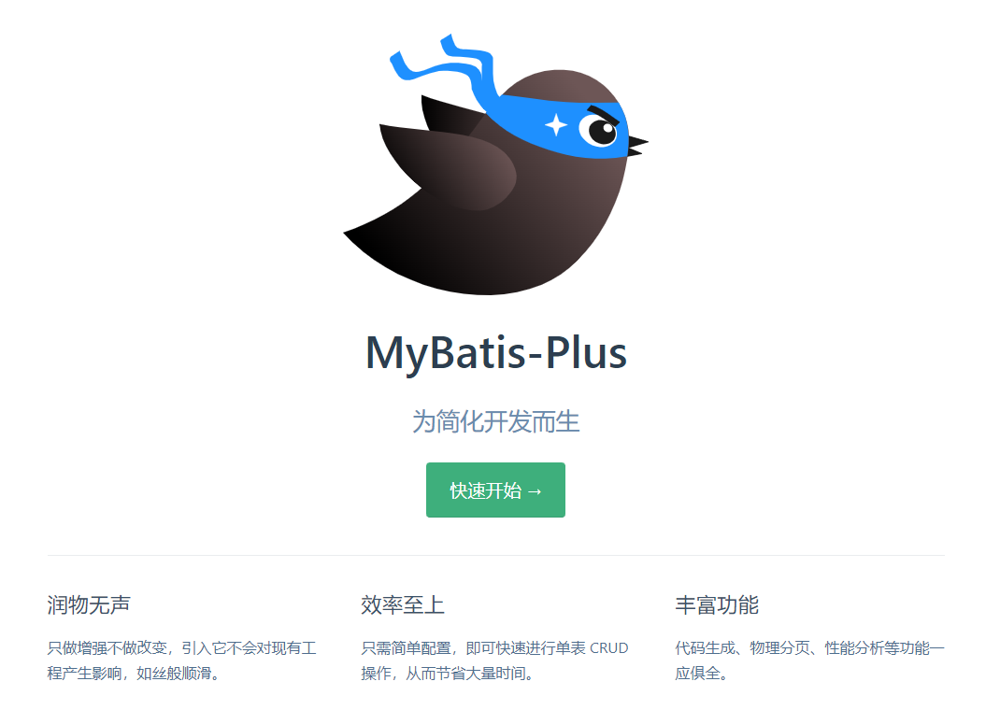

> 需要的基础：
>
> - MyBatis
> - Spring
> - SpringMVC

- 是什么？ 
  - MyBatis 本来就是简化 JDBC 操作的！ 
  - 官网：https://mp.baomidou.com/ MyBatis Plus，==简化 MyBatis== 

----

## 1.MyBatisPlus概述

> [MyBatis-Plus](https://github.com/baomidou/mybatis-plus)（简称 MP）是一个 [MyBatis](https://www.mybatis.org/mybatis-3/)的增强工具，在 MyBatis 的基础上只做增强不做改变，为简化开发、提高效率而生。


>愿景

- 是成为 MyBatis 最好的搭档，就像 [魂斗罗](https://mp.baomidou.com/img/contra.jpg) 中的 1P、2P，基友搭配，效率翻倍。

> 特性

- **无侵入**：只做增强不做改变，引入它不会对现有工程产生影响，如丝般顺滑
- **损耗小**：启动即会自动注入基本 CURD，性能基本无损耗，直接面向对象操作
- **强大的 CRUD 操作**：内置通用 Mapper、通用 Service，仅仅通过少量配置即可实现单表大部分 CRUD 操作，更有强大的条件构造器，满足各类使用需求
- **支持 Lambda 形式调用**：通过 Lambda 表达式，方便的编写各类查询条件，无需再担心字段写错
- **支持主键自动生成**：支持多达 4 种主键策略（内含分布式唯一 ID 生成器 - Sequence），可自由配置，完美解决主键问题
- **支持 ActiveRecord 模式**：支持 ActiveRecord 形式调用，实体类只需继承 Model 类即可进行强大的 CRUD 操作
- **支持自定义全局通用操作**：支持全局通用方法注入（ Write once, use anywhere ）
- **内置代码生成器**：采用代码或者 Maven 插件可快速生成 Mapper 、 Model 、 Service 、 Controller 层代码，支持模板引擎，更有超多自定义配置等您来使用
- **内置分页插件**：基于 MyBatis 物理分页，开发者无需关心具体操作，配置好插件之后，写分页等同于普通 List 查询
- **分页插件支持多种数据库**：支持 MySQL、MariaDB、Oracle、DB2、H2、HSQL、SQLite、Postgre、SQLServer 等多种数据库
- **内置性能分析插件**：可输出 SQL 语句以及其执行时间，建议开发测试时启用该功能，能快速揪出慢查询
- **内置全局拦截插件**：提供全表 delete 、 update 操作智能分析阻断，也可自定义拦截规则，预防误操作

> 框架结构


- 总结：扫描实体类型,分析数据库的表和字段直接把sql注入到mybatis的容器中不用写sql

  (不用写mapper.xml 秀儿))，简化了mybatis的开发。

> 代码托管

- **[Gitee](https://gitee.com/baomidou/mybatis-plus)**| **[Github](https://github.com/baomidou/mybatis-plus)**

> 相关链接

- [文档](https://baomidou.com/)
- [代码生成](https://github.com/baomidou/generator)
- [功能示例](https://gitee.com/baomidou/mybatis-plus-samples)
- [展示](https://github.com/baomidou/awesome-mybatis-plus)
- [企业版 Mybatis-Mate 高级特性](https://gitee.com/baomidou/mybatis-mate-examples)

>教程

- [MyBatis-Plus 入门 - 视频教程 - 慕课网](https://www.imooc.com/learn/1130)
- [MyBatis-Plus 进阶 - 视频教程 - 慕课网](https://www.imooc.com/learn/1171)
- [MyBatis-Plus + SpringBoot实现简单权限管理 - 视频教程 - 慕课网](https://www.imooc.com/learn/1294)

> 原理

- [Mybatis-Plus 实践及架构原理](https://gitee.com/baomidou/mybatis-plus/attach_files)

## 2.快速入门

- 教程地址：https://mp.baomidou.com/guide/quick-start.html
- 以下将通过一个简单的 Demo 来阐述 MyBatis-Plus 的强大功能，在此之前，我们假设您已经：
  - 拥有 Java 开发环境以及相应 IDE
  - 熟悉 Spring Boot
  - 熟悉 Maven

----

1. 创建一个数据库mybatis_plus

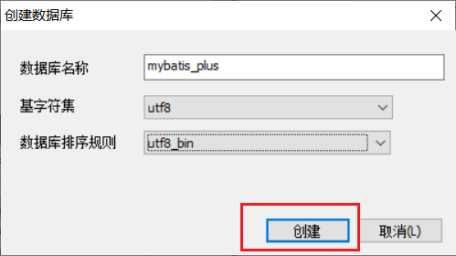

2. 操作如下语句，创建数据表，插入数据。

```mysql
DROP TABLE IF EXISTS USER;

CREATE TABLE USER
(
	id BIGINT(20) NOT NULL COMMENT '主键ID',
	NAME VARCHAR(30) NULL DEFAULT NULL COMMENT '姓名',
	age INT(11) NULL DEFAULT NULL COMMENT '年龄',
	email VARCHAR(50) NULL DEFAULT NULL COMMENT '邮箱',
	PRIMARY KEY (id)
);

DELETE FROM USER;

INSERT INTO USER (id, NAME, age, email) VALUES
(1, 'Jone', 18, 'test1@baomidou.com'),
(2, 'Jack', 20, 'test2@baomidou.com'),
(3, 'Tom', 28, 'test3@baomidou.com'),
(4, 'Sandy', 21, 'test4@baomidou.com'),
(5, 'Billie', 24, 'test5@baomidou.com');

-- 真实开发中，version（乐观锁）、deleted（逻辑删除）、gmt_create、gmt_modified
```

>如果从零开始用 MyBatis-Plus 来实现该表的增删改查我们需要做什么呢？

- 导入对应的依赖 

- 研究依赖如何配置 

- 代码如何编写 

- 提高扩展技术能力！

----

3. 创建一个空的 Spring Boot 工程（工程将以 H2 作为默认数据库进行演示）

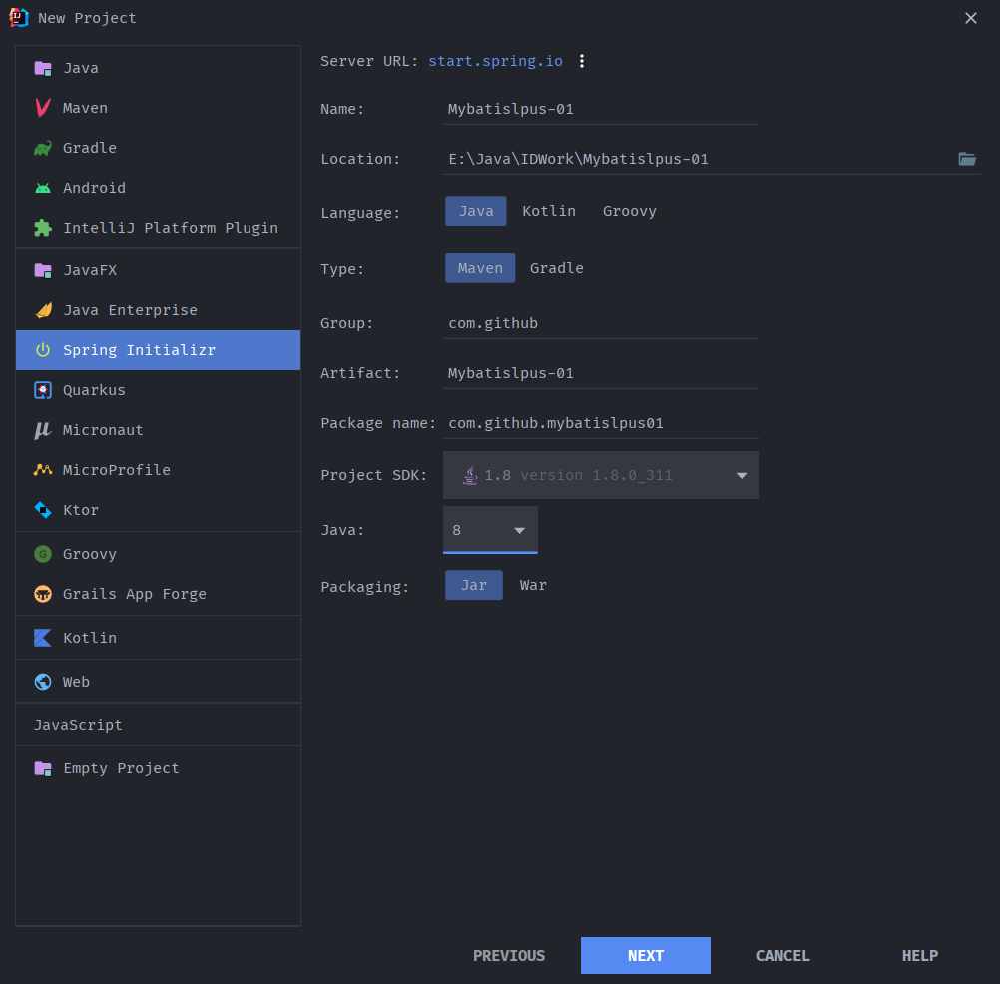


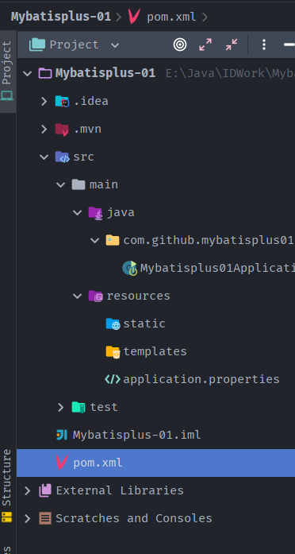

4. 导入依赖，引入 `spring-boot-starter`、`spring-boot-starter-test`、`mybatis-plus-boot-starter`、`h2` 依赖：

```xml
    <dependencies>
        <!--    数据库驱动    -->
        <dependency>
            <groupId>mysql</groupId>
            <artifactId>mysql-connector-java</artifactId>
        </dependency>
        <!--    lombok    -->
        <dependency>
            <groupId>org.projectlombok</groupId>
            <artifactId>lombok</artifactId>
        </dependency>
        <dependency>
            <groupId>org.springframework.boot</groupId>
            <artifactId>spring-boot-starter-web</artifactId>
        </dependency>
        <!--    springboot    -->
        <dependency>
            <groupId>org.springframework.boot</groupId>
            <artifactId>spring-boot-starter</artifactId>
        </dependency>
        <dependency>
            <groupId>org.springframework.boot</groupId>
            <artifactId>spring-boot-starter-test</artifactId>
            <scope>test</scope>
        </dependency>
        <!--    mybatis-plus  版本很重要3.0.5    -->
        <dependency>
            <groupId>com.baomidou</groupId>
            <artifactId>mybatis-plus-boot-starter</artifactId>
            <version>3.0.5</version>
        </dependency>
        <!--    h2    -->
        <dependency>
            <groupId>com.h2database</groupId>
            <artifactId>h2</artifactId>
            <scope>runtime</scope>
        </dependency>
    </dependencies>
```

- 说明：我们使用 mybatis-plus 可以节省我们大量的代码，尽量不要同时导入 mybatis 和 mybatis plus！版本的差异！ 

5. 连接数据库！这一步和 mybatis 相同！

```yaml
# mysql 5 驱动不同 com.mysql.jdbc.Driver

# mysql 8 驱动不同com.mysql.cj.jdbc.Driver、需要增加时区的配置
serverTimezone=GMT%2B8
spring.datasource.username=root
spring.datasource.password=root
spring.datasource.url=jdbc:mysql://localhost:3306/mybatis_plus?useSSL=false&useUnicode=true&characterEncoding=utf-8&serverTimezone=GMT%2B8
spring.datasource.driver-class-name=com.mysql.cj.jdbc.Driver
```

6. ==传统方式pojo-dao（连接mybatis，配置mapper.xml文件）-service-controller==，使用了mybatis-plus 之后：

- pojo

```java
package com.github.pojo;

import lombok.AllArgsConstructor;
import lombok.Data;
import lombok.NoArgsConstructor;

@Data
@AllArgsConstructor
@NoArgsConstructor
public class User {
    private Long id;
    private String name;
    private String email;
    private Integer age;
}
```

- mapper接口

```java
package com.github.mapper;

import com.baomidou.mybatisplus.core.mapper.BaseMapper;
import com.github.pojo.User;
import org.springframework.stereotype.Repository;

@Repository // 持久层
public interface UserMapper extends BaseMapper<User> {
    // 无需添加CRUD操作
}
```

- 在 Spring Boot 启动类中添加 `@MapperScan` 注解，扫描Mapper包下的所有接口：

```java
@SpringBootApplication
@MapperScan("com.github.mapper")
public class Mybatisplus01Application {

    public static void main(String[] args) {
        SpringApplication.run(Mybatisplus01Application.class, args);
    }

}
```

- 测试类中测试：

```java
@SpringBootTest
class Mybatisplus01ApplicationTests {

    //  继承了 BaseMapper ，所有的方法都来自己父类
    @Autowired
    private UserMapper userMapper;

    @Test
    void contextLoads() {
        // 参数是一个wrapper，条件是构造器，先使用null
        // 查询全部用户
        List<User> users = userMapper.selectList(null);
        users.forEach(System.out::println);
    }

}
```

> 提示：UserMapper 中的 `selectList()` 方法的参数为 MP 内置的条件封装器 `Wrapper`，所以不填写就是无任何条件。

- 控制台输出：

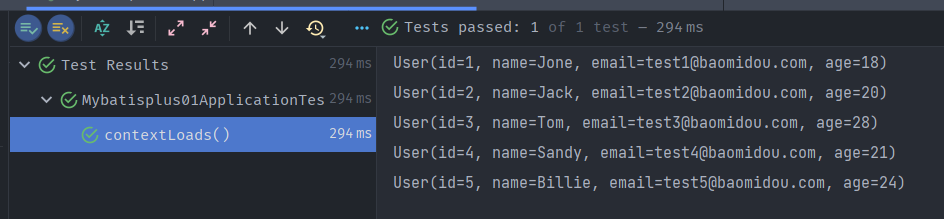

> 小结一下：

- 通过以上几个简单的步骤，我们就实现了 User 表的 CRUD 功能，甚至连 XML 文件都不用编写！
- 从以上步骤中，我们可以看到集成`MyBatis-Plus`非常的简单，只需要引入 starter 工程，并配置 mapper 扫描路径即可。

> 思考问题：

1. sql谁帮我们写的?—mybatis-plus
2. 方法谁帮我们写的?—mybatis-plus

## 3.配置日志 

- 所有的sql现在是不可见的，如果我想知道它是怎么执行的，所以我必须要看日志！

```yaml
# 配置日志
mybatis-plus.configuration.log-impl=org.apache.ibatis.logging.stdout.StdOutImpl
```

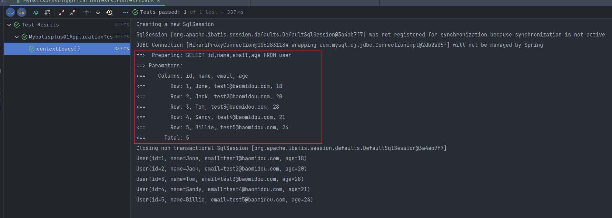

- 配置完毕日志之后，后面的学习就需要注意这个自动生成的SQL，我们就会喜欢上 MyBatis-Plus！

## 4.CRUD

### 1.插入操作

```java
    // 测试插入
    @Test
    public void insertTest(){
        User user = new User();
        user.setName("哇哈哈");
        user.setAge(22);
        user.setEmail("2589654784@qq.com");
        // 自动生成id
        Integer insert = userMapper.insert(user);
        // 受影响的行数
        System.out.println(insert);
        // 通过日志发现id会自动回填
        System.out.println(user);
    }
```

- 输出测试：

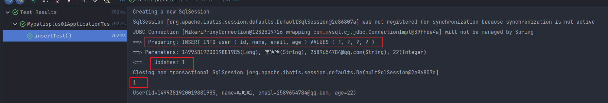

- **数据库插入的id的默认值为:全局的唯—id**。

### 2.主键生成策略

> 默认 ID_WORKER 全局唯一id

- 分布式系统唯一id生成：[查看博客园](https://www.cnblogs.com/haoxinyue/p/5208136.html)
- 分布式id生成算法的有很多种，Twitter的SnowFlake就是其中经典的一种。

**雪花算法**：

- snowflake是Twitter开源的分布式ID生成算法，结果是一个long型的ID。==SnowFlake算法生成id的结果是一个64bit大小的整数==。
- 其核心思想是：使用41bit作为毫秒数，10bit作为机器的ID（5个bit是数据中心，5个bit的机器ID），12bit作为毫秒内的流水号（意味着每个节点在每毫秒可以产生 4096 个 ID），最后还有一个符号位，永远是0。可以保证几乎全球唯一！

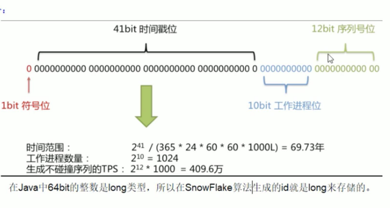

**算法实现**：

- [Twitter官方给出的算法实现](https://github.com/twitter-archive/snowflake/blob/snowflake-2010/src/main/scala/com/twitter/service/snowflake/IdWorker.scala) 是用Scala写的，这里不做分析，可自行查看。

```java
/** Copyright 2010-2012 Twitter, Inc.*/
package com.twitter.service.snowflake

import com.twitter.ostrich.stats.Stats
import com.twitter.service.snowflake.gen._
import java.util.Random
import com.twitter.logging.Logger

/**
 * An object that generates IDs.
 * This is broken into a separate class in case
 * we ever want to support multiple worker threads
 * per process
 */
class IdWorker(val workerId: Long, val datacenterId: Long, private val reporter: Reporter, var sequence: Long = 0L)
extends Snowflake.Iface {
  private[this] def genCounter(agent: String) = {
    Stats.incr("ids_generated")
    Stats.incr("ids_generated_%s".format(agent))
  }
  private[this] val exceptionCounter = Stats.getCounter("exceptions")
  private[this] val log = Logger.get
  private[this] val rand = new Random

  val twepoch = 1288834974657L

  private[this] val workerIdBits = 5L
  private[this] val datacenterIdBits = 5L
  private[this] val maxWorkerId = -1L ^ (-1L << workerIdBits)
  private[this] val maxDatacenterId = -1L ^ (-1L << datacenterIdBits)
  private[this] val sequenceBits = 12L

  private[this] val workerIdShift = sequenceBits
  private[this] val datacenterIdShift = sequenceBits + workerIdBits
  private[this] val timestampLeftShift = sequenceBits + workerIdBits + datacenterIdBits
  private[this] val sequenceMask = -1L ^ (-1L << sequenceBits)

  private[this] var lastTimestamp = -1L

  // sanity check for workerId
  if (workerId > maxWorkerId || workerId < 0) {
    exceptionCounter.incr(1)
    throw new IllegalArgumentException("worker Id can't be greater than %d or less than 0".format(maxWorkerId))
  }

  if (datacenterId > maxDatacenterId || datacenterId < 0) {
    exceptionCounter.incr(1)
    throw new IllegalArgumentException("datacenter Id can't be greater than %d or less than 0".format(maxDatacenterId))
  }

  log.info("worker starting. timestamp left shift %d, datacenter id bits %d, worker id bits %d, sequence bits %d, workerid %d",
    timestampLeftShift, datacenterIdBits, workerIdBits, sequenceBits, workerId)

  def get_id(useragent: String): Long = {
    if (!validUseragent(useragent)) {
      exceptionCounter.incr(1)
      throw new InvalidUserAgentError
    }

    val id = nextId()
    genCounter(useragent)

    reporter.report(new AuditLogEntry(id, useragent, rand.nextLong))
    id
  }

  def get_worker_id(): Long = workerId
  def get_datacenter_id(): Long = datacenterId
  def get_timestamp() = System.currentTimeMillis

  protected[snowflake] def nextId(): Long = synchronized {
    var timestamp = timeGen()

    if (timestamp < lastTimestamp) {
      exceptionCounter.incr(1)
      log.error("clock is moving backwards.  Rejecting requests until %d.", lastTimestamp);
      throw new InvalidSystemClock("Clock moved backwards.  Refusing to generate id for %d milliseconds".format(
        lastTimestamp - timestamp))
    }

    if (lastTimestamp == timestamp) {
      sequence = (sequence + 1) & sequenceMask
      if (sequence == 0) {
        timestamp = tilNextMillis(lastTimestamp)
      }
    } else {
      sequence = 0
    }

    lastTimestamp = timestamp
    ((timestamp - twepoch) << timestampLeftShift) |
      (datacenterId << datacenterIdShift) |
      (workerId << workerIdShift) | 
      sequence
  }

  protected def tilNextMillis(lastTimestamp: Long): Long = {
    var timestamp = timeGen()
    while (timestamp <= lastTimestamp) {
      timestamp = timeGen()
    }
    timestamp
  }

  protected def timeGen(): Long = System.currentTimeMillis()

  val AgentParser = """([a-zA-Z][a-zA-Z\-0-9]*)""".r

  def validUseragent(useragent: String): Boolean = useragent match {
    case AgentParser(_) => true
    case _ => false
  }
}
```

- Java版算法实现：[搬运自犀牛饲养员](https://blog.csdn.net/pony_maggie/article/details/103380116)

```java
public class SnowflakeIdWorker {
    /** 开始时间截 (这个用自己业务系统上线的时间) */
    private final long twepoch = 1575365018000L;

    /** 机器id所占的位数 */
    private final long workerIdBits = 10L;

    /** 支持的最大机器id，结果是31 (这个移位算法可以很快的计算出几位二进制数所能表示的最大十进制数) */
    private final long maxWorkerId = -1L ^ (-1L << workerIdBits);
    
    /** 序列在id中占的位数 */
    private final long sequenceBits = 12L;

    /** 机器ID向左移12位 */
    private final long workerIdShift = sequenceBits;

    /** 时间截向左移22位(10+12) */
    private final long timestampLeftShift = sequenceBits + workerIdBits;

    /** 生成序列的掩码，这里为4095 (0b111111111111=0xfff=4095) */
    private final long sequenceMask = -1L ^ (-1L << sequenceBits);

    /** 工作机器ID(0~1024) */
    private long workerId;

    /** 毫秒内序列(0~4095) */
    private long sequence = 0L;

    /** 上次生成ID的时间截 */
    private long lastTimestamp = -1L;

    //==============================Constructors=====================================
    /**
     * 构造函数
     * @param workerId 工作ID (0~1024)
     */
    public SnowflakeIdWorker(long workerId) {
        if (workerId > maxWorkerId || workerId < 0) {
            throw new IllegalArgumentException(String.format("workerId can't be greater than %d or less than 0", maxWorkerId));
        }
        this.workerId = workerId;
    }

    // ==============================Methods==========================================
    /**
     * 获得下一个ID (该方法是线程安全的)
     * @return SnowflakeId
     */
    public synchronized long nextId() {
        long timestamp = timeGen();

        //如果当前时间小于上一次ID生成的时间戳，说明系统时钟回退过这个时候应当抛出异常
        if (timestamp < lastTimestamp) {
            throw new RuntimeException(
                    String.format("Clock moved backwards.  Refusing to generate id for %d milliseconds", lastTimestamp - timestamp));
        }

        //如果是同一时间生成的，则进行毫秒内序列
        if (lastTimestamp == timestamp) {
            sequence = (sequence + 1) & sequenceMask;
            //毫秒内序列溢出
            if (sequence == 0) {
                //阻塞到下一个毫秒,获得新的时间戳
                timestamp = tilNextMillis(lastTimestamp);
            }
        }
        //时间戳改变，毫秒内序列重置
        else {
            sequence = 0L;
        }

        //上次生成ID的时间截
        lastTimestamp = timestamp;

        //移位并通过或运算拼到一起组成64位的ID
        return ((timestamp - twepoch) << timestampLeftShift) //
                | (workerId << workerIdShift) //
                | sequence;
    }

    /**
     * 阻塞到下一个毫秒，直到获得新的时间戳
     * @param lastTimestamp 上次生成ID的时间截
     * @return 当前时间戳
     */
    protected long tilNextMillis(long lastTimestamp) {
        long timestamp = timeGen();
        while (timestamp <= lastTimestamp) {
            timestamp = timeGen();
        }
        return timestamp;
    }

    /**
     * 返回以毫秒为单位的当前时间
     * @return 当前时间(毫秒)
     */
    protected long timeGen() {
        return System.currentTimeMillis();
    }
}
```

> 主键自增

- 需要配置主键自增：

1. 实体类字段上 `@TableId(type = IdType.AUTO)`

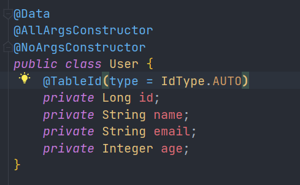

2. 数据库字段一定要是自增！

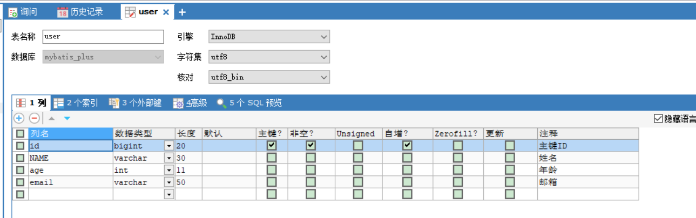

3. 再次测试插入！

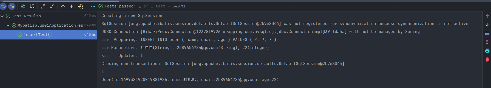

> 相关源码解释：

```java
public enum IdType {
    AUTO(0),	// 数据库id自增
    NONE(1),	// 未设置主键
    INPUT(2),	// 手动输入
    ID_WORKER(3),	// 默认的全局唯一id
    UUID(4),	// 全局唯一id uuid
    ID_WORKER_STR(5);	// ID_WORKER 字符串表示法
}
```

### 3.更新操作

```java
    // 更新操作
    @Test
    public void UpdateTest(){
        User user = new User();
        // 通过条件自动拼接SQL
        user.setId(7L);
        user.setName("KYDH,开源导航");
        user.setAge(26);
        // 注意：updateById的参数是一个对象！
        Integer i = userMapper.updateById(user);
        System.out.println(i);
    }
```

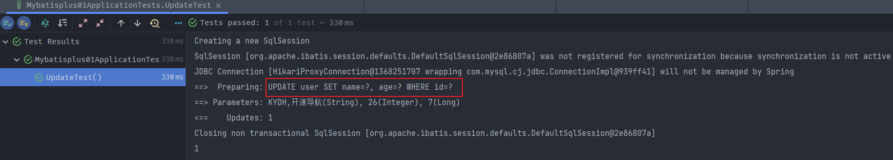

- 所有的sql都是自动帮我们动态配置的！

### 4.自动填充

创建时间、更改时间！ 这些操作一般都是自动化完成，我们不希望手动更新。

阿里巴巴开发手册︰几乎所有的表都要配置 gmt_create、gmt_modified ！而且需要自动化。

> 方式一：数据库级别（工作中不允许修改数据库级别）

1. 在表中增加字段：`create_time,update_time`

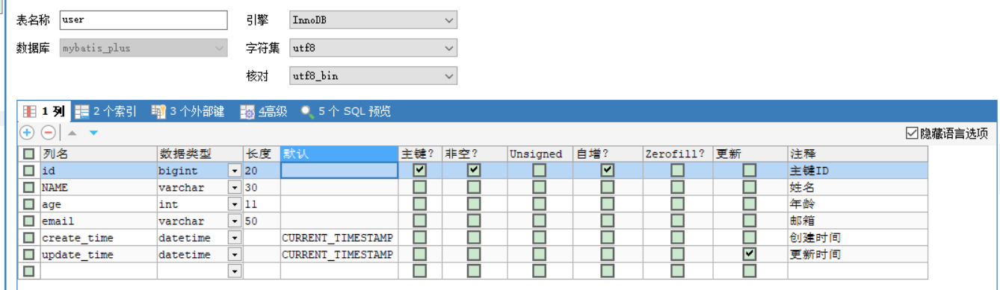

2. 再次测试插入或更新方法，需要在实体类中同步！

```java
private Date createTime; // 驼峰命名
private Date updateTime;
```

3. 查看结果

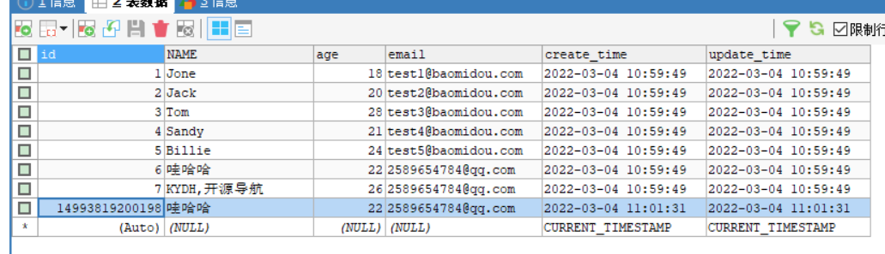

> 方式二：代码级别

1. 删除数据库的默认值，更新操作！

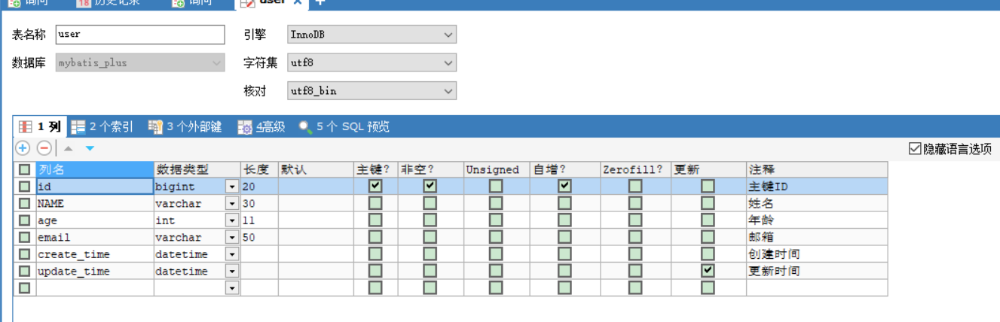

2. 实体类字段属性上需要增加注解

```java
@TableField(fill = FieldFill.INSERT)
private Date createTime;   // 驼峰命名
@TableField(fill = FieldFill.INSERT_UPDATE)
private Date updateTime;
```

3. 编写处理器来处理这个注解即可！

```java
package com.github.handler;

import com.baomidou.mybatisplus.core.handlers.MetaObjectHandler;
import lombok.extern.slf4j.Slf4j;
import org.apache.ibatis.reflection.MetaObject;
import org.springframework.stereotype.Component;

/**
 * @author subeiLY
 * @create 2022-03-04 11:05
 */
@Slf4j  // 日志
@Component  // 不要忘记把处理器加到IOC容器中！
public class MyMetaObjectHandler implements MetaObjectHandler {
    // 插入时的填充策略
    @Override
    public void insertFill(MetaObject metaObject) {
        log.info("start insert fill......");
//         setFieldValByName(String fieldName, Object fieldVal, MetaObject metaObject)
        this.setFieldValByName("createTime",new Date(),metaObject);
        this.setFieldValByName("updateTime",new Date(),metaObject);
    }

    // 更新时的填充策略
    @Override
    public void updateFill(MetaObject metaObject) {
        log.info("start update fill……");
        this.setFieldValByName("updateTime",new Date(),metaObject);
    }
}

```

4. 测试插入/更新，观察时间

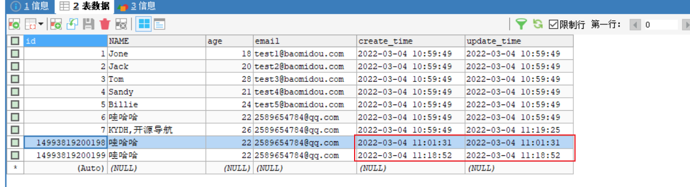

### 5.乐观锁和悲观锁

> 乐观锁：顾名思义十分乐观,他总是认为不会出现问题,无论干什么都不上锁!如果出现了问题,再次更新值测试。
>
> 悲观锁：顾名思义十分悲观,他总是认为出现问题,无论干什么都会上锁!再去操作!

**这里主要讲解：乐观锁机制**!

乐观锁实现方式:

- 取出记录时,获取当前version
- 更新时,带上这个version
- 执行更新时,set version = newVersion where version = oldVersion
- 如果version不对,就更新失败

```sql
乐观锁：1、先查询，获得版本号 version = 1
-- A
update user set name = "哇哈哈", version = version + 1
where id = 2 and version = 1
-- B 线程抢先完成，这个时候 version = 2，会导致 A 修改失败！
update user set name = "哇哈哈", version = version + 1
where id = 2 and version = 1
```

> 测试一下Mybatis-Plus乐观锁插件

1. 给数据库中增加version字段

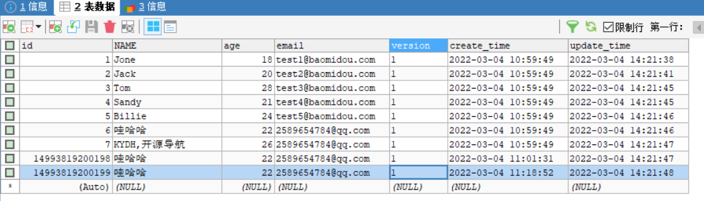

2. 实体类加对应的字段

```java
    @Version // 乐观锁Version注解
    private Integer version;
```

3. 注册组件

```java
package com.github.config;

import com.baomidou.mybatisplus.extension.plugins.OptimisticLockerInterceptor;
import org.mybatis.spring.annotation.MapperScan;
import org.springframework.context.annotation.Bean;
import org.springframework.context.annotation.Configuration;
import org.springframework.transaction.annotation.EnableTransactionManagement;

// 扫描 mapper 文件夹
@MapperScan("com.github.mapper")
@EnableTransactionManagement
@Configuration // 配置类
public class MyBatisPlusConfig {
    // 注册乐观锁插件
    @Bean
    public OptimisticLockerInterceptor optimisticLockerInterceptor() {
        return new OptimisticLockerInterceptor();
    }
}
```

4. 测试一下：

```java
// 测试乐观锁
@Test
public void testOptimisticLocker(){
    // 1.查询用户信息
    User user = userMapper.selectById(1L);
    // 2.修改用户信息
    user.setName("金顶");
    user.setEmail("2451367@qq.com");
    // 3.执行更新操作
    userMapper.updateById(user);
}

// 测试乐观锁失败！多线程下
@Test
public void testOptimisticLocker2(){
    // 线程 1
    User user = userMapper.selectById(1L);
    user.setName("夸父1");
    user.setEmail("2451367@qq.com");
    // 模拟另外一个线程执行了插队操作
    User user2 = userMapper.selectById(1L);
    user2.setName("夸父2");
    user2.setEmail("2451367@qq.com");
    userMapper.updateById(user2);
    // 自旋锁来多次尝试提交！
    userMapper.updateById(user); // 如果没有乐观锁就会覆盖插队线程的值！
}
```


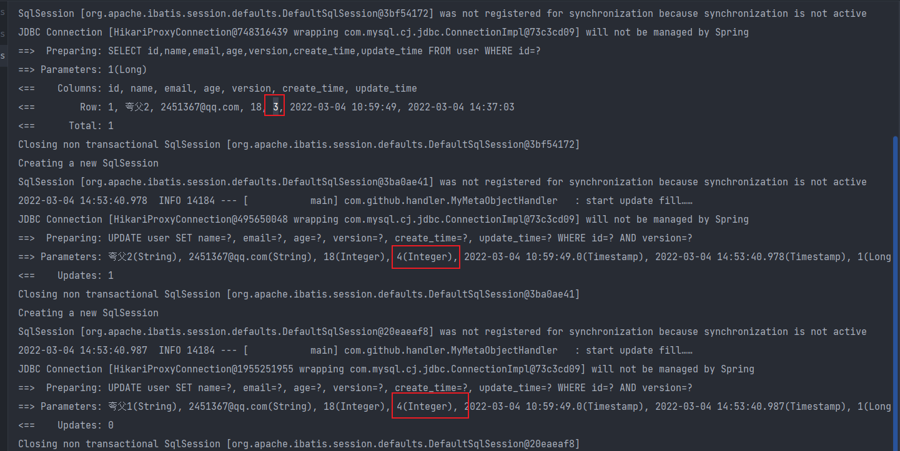

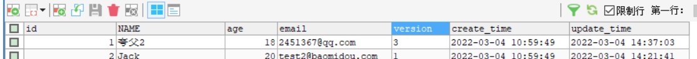

### 6.查询操作

```java
    // 查询测试
    @Test
    public void SelectByIdTest(){
        User user = userMapper.selectById(1L);
        System.out.println(user);
    }

    // 批量查询
    @Test
    public void SelectByBatchIdTest(){
        List<User> users = userMapper.selectBatchIds(Arrays.asList(1, 2, 3));
        users.forEach(System.out::println);
    }

    // 按条件查询之一使用map操作
    @Test
    public void SelectByBatchIds(){
        HashMap<String, Object> map = new HashMap<>();
        // 自定义查询
        map.put("name","哇哈哈");
        map.put("age",22);

        List<User> users = userMapper.selectByMap(map);
        users.forEach(System.out::println);
    }
```

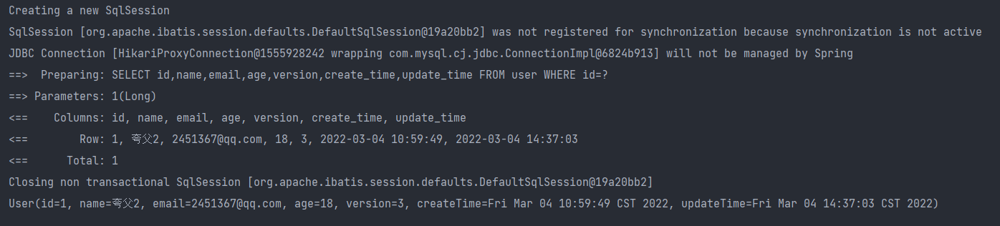

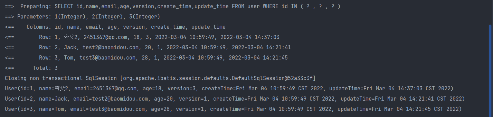

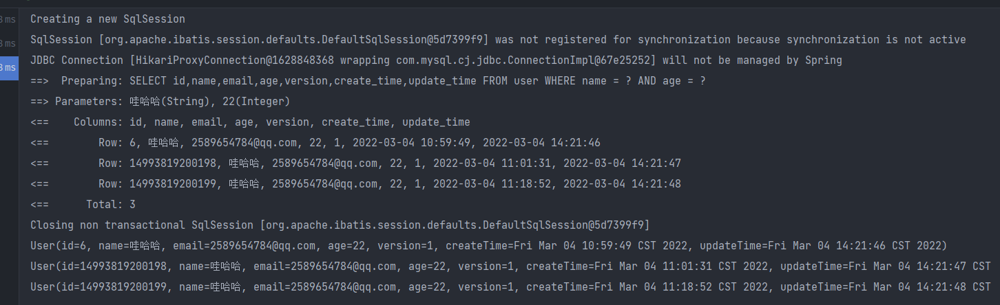

### 7.分页查询

> 分页在网站使用的十分之多！

1. 原始的 limit 进行分页
2. pageHelper 第三方插件
3. MP 其实也内置了分页插件！

> 具体使用：

1. 配置拦截器组件即可！

```java
// 扫描 mapper 文件夹
@MapperScan("com.github.mapper")
@EnableTransactionManagement
@Configuration // 配置类
public class MyBatisPlusConfig {
    // 注册乐观锁插件
    @Bean
    public OptimisticLockerInterceptor optimisticLockerInterceptor() {
        return new OptimisticLockerInterceptor();
    }

    // 分页插件
    @Bean
    public PaginationInterceptor paginationInterceptor(){
        return new PaginationInterceptor();
    }

}
```

2. 直接使用Page对象即可！

```java
    // 分页查询
    @Test
    public void testPage(){
        // 参数一 current：当前页   
        // 参数二 size：页面大小
        // 使用了分页插件之后，所有的分页操作都变得简单了
        Page<User> page = new Page<>(2,5);
        userMapper.selectPage(page,null);
        page.getRecords().forEach(System.out::println);
        System.out.println("总页数==>"+page.getTotal());
    }
```

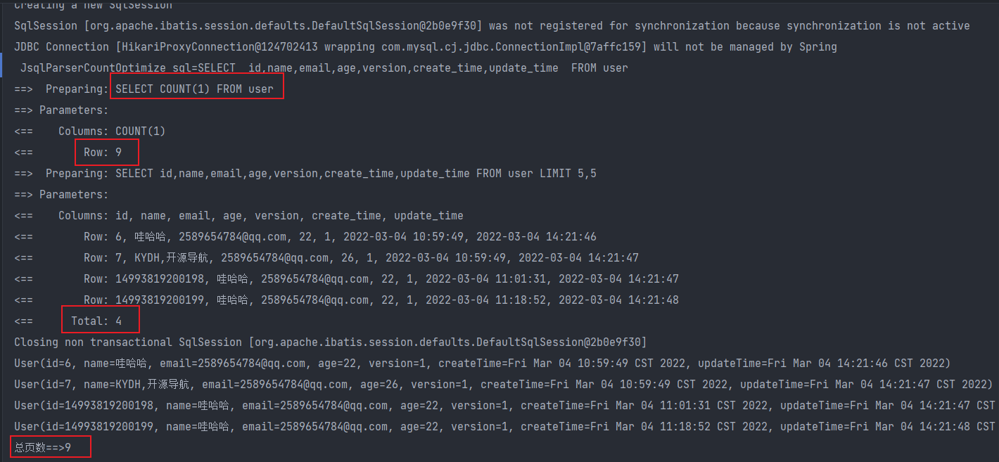

### 8.删除操作

> 根据 id 删除记录

```java
    // 基本删除操作
    @Test
    public void DeleteTest(){
        userMapper.deleteById(14993819200198L);
    }

    // 通过id批量删除
    @Test
    public void DeleteByIdTest(){
        userMapper.deleteBatchIds(Arrays.asList(14993819200199L,6));
    }
```

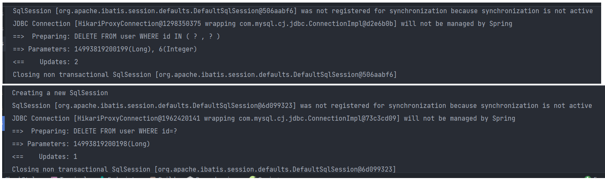

> 通过map删除

```java
    // 通过Map删除
    @Test
    public void DeleteMapTest(){
        HashMap<String, Object> map = new HashMap<>();
        map.put("name","KYDH,开源导航");
        userMapper.deleteByMap(map);
    }
```

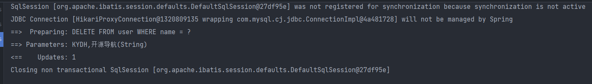

### 9.逻辑删除

> 物理删除 ：从数据库中直接移除；
>
> 逻辑删除 ：再数据库中没有被移除，而是通过一个变量来让他失效！ deleted = 0 => deleted = 1；

- 管理员可以查看被删除的记录！防止数据的丢失，类似于回收站！

**测试一下**：

1. 在数据表中增加一个 deleted 字段

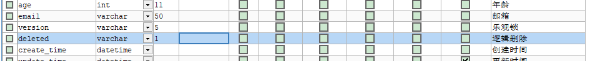

2. 实体类中增加属性

```java
    @TableLogic // 逻辑删除
    private Integer deleted;
```

3. 配置

```java
    // 逻辑删除组件
    @Bean
    public ISqlInjector sqlInjector(){
        return new LogicSqlInjector();
    }
```

```yaml
# 配置逻辑删除
mybatis-plus.global-config.db-config.logic-delete-value=1
mybatis-plus.global-config.db-config.logic-not-delete-value=0
```

4.测试！

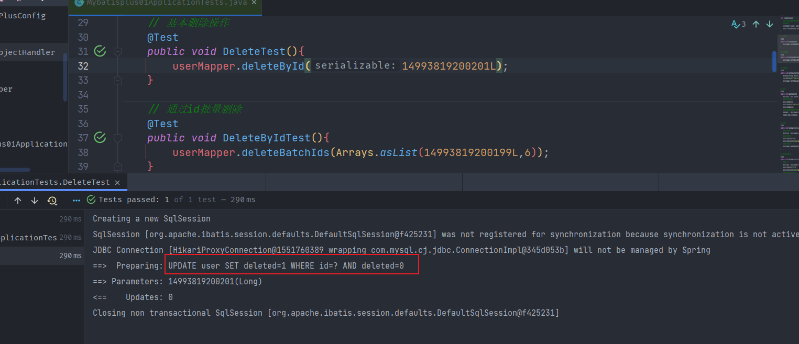

- 走的是更新，不是删除操作！记录依旧在数据库，但是值确已经变化了！

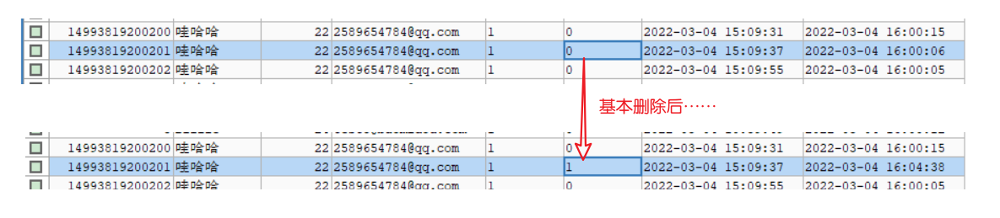

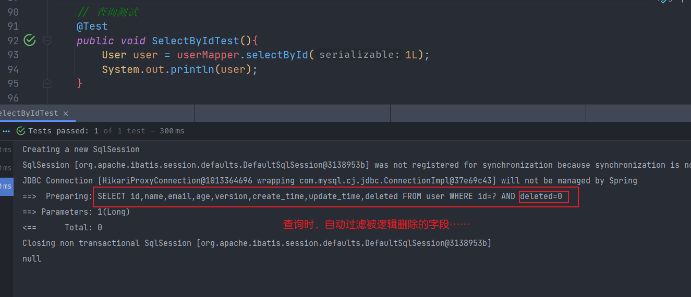

- ==以上的所有CRUD操作及其扩展操作，都必须精通掌握==！会大大提高你的工作和写项目的效率！

## 5.性能分析插件

- 在平时的开发中，会遇到一些慢sql。测试！ druid,,,,,
- 作用：性能分析拦截器，用于输出每条 SQL 语句及其执行时间
- MP也提供性能分析插件，如果超过这个时间就停止运行！

1. 导入插件

```java
    // SQL执行效率插件
    @Bean
    @Profile({"dev","test"})// 设置 dev test 环境开启，保证我们的效率
    public PerformanceInterceptor performanceInterceptor() {
        PerformanceInterceptor performanceInterceptor = new PerformanceInterceptor();
        // ms设置sql执行的最大时间，如果超过了则不执行
        performanceInterceptor.setMaxTime(100);
        // 是否格式化代码
        performanceInterceptor.setFormat(true);
        return performanceInterceptor;
    }
```

- 注意：要在SpringBoot中配置环境为dev或者 test 环境！

```properties
# 设置开发环境
spring.profiles.active=dev
```

2. 测试一下！

```java
    @Test
    void contextLoads() {
        // 参数是一个wrapper，条件是构造器，先使用null
        // 查询全部用户
        List<User> users = userMapper.selectList(null);
        users.forEach(System.out::println);
    }
```

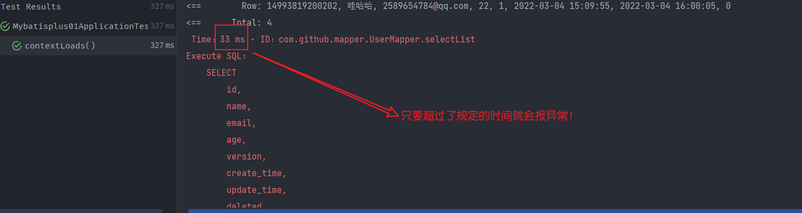

- 使用性能分析插件，可以帮助我们提高效率！

## 6.条件构造器Wrapper

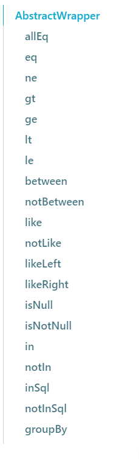

> 测试一

```java
    @Test
    void contextLoads2() {
        // 查询name不为空的用户，并且邮箱不为空的用户，年龄大于等于12
        QueryWrapper<User> wrapper = new QueryWrapper<>();
        wrapper
                .isNotNull("name")
                .isNotNull("email")
                .ge("age",12);
        userMapper.selectList(wrapper).forEach(System.out::println); // 与map对比一下
    }
```

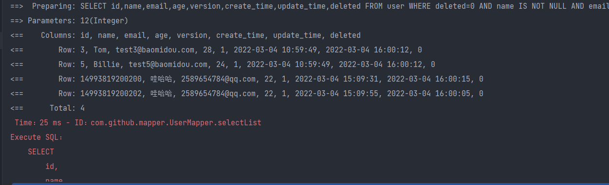

> 测试二

```java
    @Test
    void test2(){
        // 查询名字Jack
        QueryWrapper<User> wrapper = new QueryWrapper<>();
        wrapper.eq("name","Jack");
        User user = userMapper.selectOne(wrapper); // 查询一个数据，出现多个结果使用List或者Map
        System.out.println(user);
    }
```

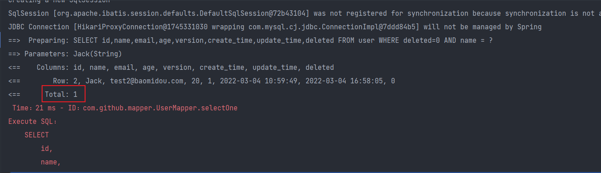

>测试三

```java
@Test
void test3(){
   // 查询年龄在 20 ~ 30 岁之间的用户
   QueryWrapper<User> wrapper = new QueryWrapper<>();
   wrapper.between("age",20,30); // 区间
   Integer count = userMapper.selectCount(wrapper); // 查询结果数
   System.out.println(count);
}
```

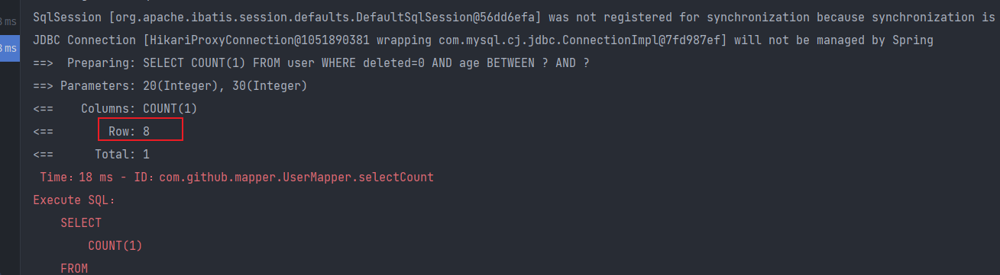

>测试四

```java
// 模糊查询
@Test
void test4(){
   // 查询年龄在 20 ~ 30 岁之间的用户
   QueryWrapper<User> wrapper = new QueryWrapper<>();
   // 左和右 t%
   wrapper
          .notLike("name","e")
          .likeRight("email","t");
   List<Map<String, Object>> maps = userMapper.selectMaps(wrapper);
   maps.forEach(System.out::println);
}
```

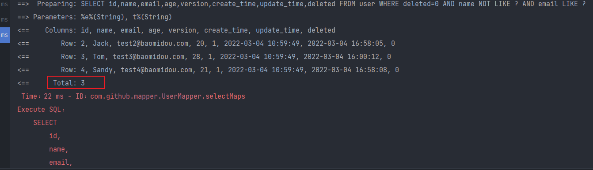

> 测试五（）

```java
    @Test
    public void testWrapper5() {
        //模糊查询
        // SELECT id,name,age,email,version,deleted,create_time,update_time
        // FROM user
        // WHERE deleted=0 AND id IN
        // (select id from user where id<5)
        QueryWrapper<User> wrapper = new QueryWrapper<>();
        // id 在子查询中查出来
        wrapper.inSql("id","select id from user where id<5");
        List<Object> objects = userMapper.selectObjs(wrapper);
        objects.forEach(System.out::println);
    }
```

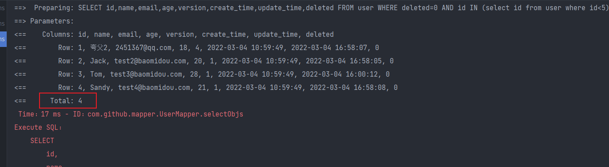

> 测试六

```java
@Test
public void testWrapper6() {
    QueryWrapper<User> wrapper = new QueryWrapper<>();
    // 通过id进行降序排序
    wrapper.orderByDesc("id");
    List<User> userList = userMapper.selectList(wrapper);
    userList.forEach(System.out::println);
}
```

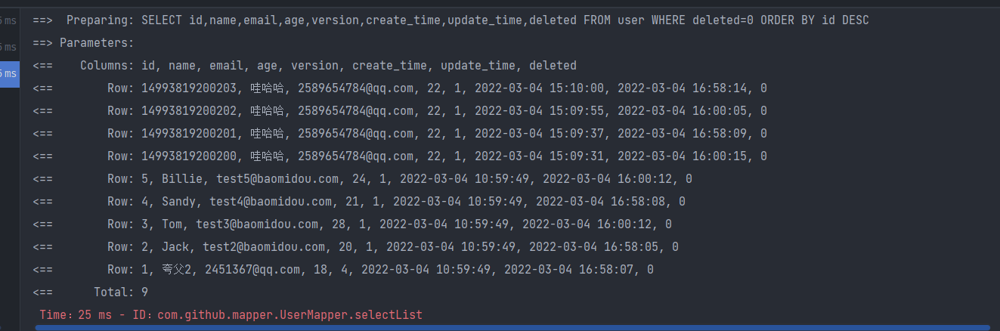

## 7.代码自动生成器

- `AutoGenerator` 是 MyBatis-Plus 的代码生成器，通过 AutoGenerator 可以快速生成 Entity、Mapper、Mapper XML、Service、Controller等各个模块的代码，极大的提升了开发效率。

> 旧版测试：

```java
package com.github;

import com.baomidou.mybatisplus.annotation.DbType;
import com.baomidou.mybatisplus.annotation.FieldFill;
import com.baomidou.mybatisplus.annotation.IdType;
import com.baomidou.mybatisplus.generator.AutoGenerator;
import com.baomidou.mybatisplus.generator.config.DataSourceConfig;
import com.baomidou.mybatisplus.generator.config.GlobalConfig;
import com.baomidou.mybatisplus.generator.config.PackageConfig;
import com.baomidou.mybatisplus.generator.config.StrategyConfig;
import com.baomidou.mybatisplus.generator.config.po.TableFill;
import com.baomidou.mybatisplus.generator.config.rules.DateType;
import com.baomidou.mybatisplus.generator.config.rules.NamingStrategy;

import java.util.ArrayList;

/**
 * 代码自动生成器
 * @author subeiLY
 */
public class WskCode {
    public static void main(String[] args) {
        // 构建一个代码生成器对象
        AutoGenerator mpg = new AutoGenerator();
        // 如何去执行，配置策略
        // 1、全局配置
        GlobalConfig gc = new GlobalConfig();
        // 获取当前目录
        String projectPath = System.getProperty("user.dir");
        // 输出到哪个目录
        gc.setOutputDir(projectPath+"/src/main/java");
        gc.setAuthor("github");
        gc.setOpen(false);
        // 是否覆盖
        gc.setFileOverride(false);
        // 去Service的I前缀
        gc.setServiceName("%sService");
        gc.setIdType(IdType.ID_WORKER);
        gc.setDateType(DateType.ONLY_DATE);
        gc.setSwagger2(true);
        mpg.setGlobalConfig(gc);
        // 2、设置数据源
        DataSourceConfig dsc = new DataSourceConfig();
        dsc.setUsername("root");
        dsc.setPassword("root");
        dsc.setUrl("jdbc:mysql://localhost:3306/github?useSSL=false&serverTimezone=GMT%2B8&useUnicode=true&characterEncoding=utf-8");
        dsc.setDriverName("com.mysql.cj.jdbc.Driver");
        dsc.setDbType(DbType.MYSQL);
        mpg.setDataSource(dsc);
        // 3、包的配置
        PackageConfig pc = new PackageConfig();
        pc.setModuleName("study");
        pc.setParent("com.github");
        pc.setEntity("pojo");
        pc.setMapper("mapper");
        pc.setService("service");
        pc.setController("controller");
        mpg.setPackageInfo(pc);
        // 4、策略配置
        StrategyConfig strategy = new StrategyConfig();
        // 设置要映射的表名,只需改这里即可
        strategy.setInclude("admin","Banyan","building","room");
        strategy.setNaming(NamingStrategy.underline_to_camel);
        strategy.setColumnNaming(NamingStrategy.underline_to_camel);
        // 是否使用lombok开启注解
        strategy.setEntityLombokModel(true);
        strategy.setLogicDeleteFieldName("deleted");
        // 自动填充配置
        TableFill gmtCreate = new TableFill("gmt_create", FieldFill.INSERT);
        TableFill gmtUpdate = new TableFill("gmt_update", FieldFill.INSERT_UPDATE);
        ArrayList<TableFill> tableFills = new ArrayList<>();
        tableFills.add(gmtCreate);
        tableFills.add(gmtUpdate);
        strategy.setTableFillList(tableFills);
        // 乐观锁配置
        strategy.setVersionFieldName("version");
        // 开启驼峰命名
        strategy.setRestControllerStyle(true);
        // localhost:8080/hello_id_2
        strategy.setControllerMappingHyphenStyle(true);
        mpg.setStrategy(strategy);
        mpg.execute(); // 执行
    }
}
```

> 新版测试

- 导入依赖

```xml
        <dependency>
            <groupId>com.baomidou</groupId>
            <artifactId>mybatis-plus-generator</artifactId>
            <version>3.5.1</version>
        </dependency>
        <dependency>
            <groupId>org.freemarker</groupId>
            <artifactId>freemarker</artifactId>
            <version>2.3.31</version>
        </dependency>
```

- java

```java
package com.github;

import com.baomidou.mybatisplus.generator.FastAutoGenerator;
import com.baomidou.mybatisplus.generator.config.OutputFile;
import com.baomidou.mybatisplus.generator.engine.FreemarkerTemplateEngine;

import java.util.Collections;

// 代码生成器(新版)
public class QuaryCode {
    public static void main(String[] args) {
        FastAutoGenerator.create("url", "username", "password")
                .globalConfig(builder -> {
                    builder.author("subei") // 设置作者
                            .enableSwagger() // 开启 swagger 模式
                            .fileOverride() // 覆盖已生成文件
                            .outputDir("D://"); // 指定输出目录
                })
                .packageConfig(builder -> {
                    builder.parent("com.github.mybatisplus.samples.generator") // 设置父包名
                            .moduleName("system") // 设置父包模块名
                            .pathInfo(Collections.singletonMap(OutputFile.mapperXml, "D://")); // 设置mapperXml生成路径
                })
                .strategyConfig(builder -> {
                    builder.addInclude("t_simple") // 设置需要生成的表名
                            .addTablePrefix("t_", "c_"); // 设置过滤表前缀
                })
                .templateEngine(new FreemarkerTemplateEngine()) // 使用Freemarker引擎模板，默认的是Velocity引擎模板
                .execute();
    }
}
```

## 8.多数据源

> - 适用于多种场景：纯粹多库、 读写分离、 一主多从、混合模式等。
> - 目前我们就来模拟一个纯粹多库的一个场景，其他场景类似。
> - 场景说明：
>   - 创建两个库，分别为：mybatis_plus（以前的库不动）与mybatis_plus_1（新建）；
>   - 将mybatis_plus库的product表移动到mybatis_plus_1库，这样每个库一张表；
>   - 通过一个测试用例分别获取用户数据与商品数据，如果获取到说明多库模拟成功。

----

> 创建数据库mybatis_plus_1和表product

```mysql
CREATE DATABASE `mybatis_plus` /*!40100 DEFAULT CHARACTER SET utf8mb4 */;
use `mybatis_plus`;
CREATE TABLE `user` (
`id` bigint(20) NOT NULL COMMENT '主键ID',
`name` varchar(30) DEFAULT NULL COMMENT '姓名',
`age` int(11) DEFAULT NULL COMMENT '年龄',
`email` varchar(50) DEFAULT NULL COMMENT '邮箱',
PRIMARY KEY (`id`)
) ENGINE=InnoDB DEFAULT CHARSET=utf8;

INSERT INTO user (id, name, age, email) VALUES
(1, 'Jone', 18, 'test1@baomidou.com'),
(2, 'Jack', 20, 'test2@baomidou.com'),
(3, 'Tom', 28, 'test3@baomidou.com'),
(4, 'Sandy', 21, 'test4@baomidou.com'),
(5, 'Billie', 24, 'test5@baomidou.com');
```

```mysql
CREATE DATABASE `mybatis_plus_1` /*!40100 DEFAULT CHARACTER SET utf8mb4 */;
use `mybatis_plus_1`;
CREATE TABLE product
(
  id BIGINT(20) NOT NULL COMMENT '主键ID',
  name VARCHAR(30) NULL DEFAULT NULL COMMENT '商品名称',
  price INT(11) DEFAULT 0 COMMENT '价格',
  version INT(11) DEFAULT 0 COMMENT '乐观锁版本号',
  PRIMARY KEY (id)
);

# 添加测试数据
INSERT INTO product (id, NAME, price) VALUES (1, '外星人笔记本', 100);

# 删除mybatis_plus库product表
use mybatis_plus;
DROP TABLE IF EXISTS product;
```

> 新建一个spring boot项目，引入依赖:

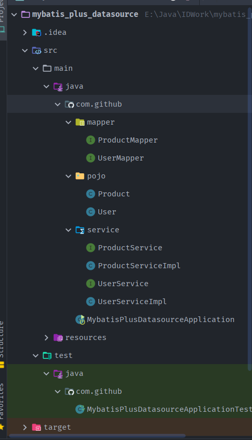

```xml
<dependencies>
    <dependency>
        <groupId>org.springframework.boot</groupId>
        <artifactId>spring-boot-starter-web</artifactId>
    </dependency>
    <dependency>
        <groupId>com.baomidou</groupId>
        <artifactId>mybatis-plus-boot-starter</artifactId>
        <version>3.5.1</version>
    </dependency>
    <dependency>
        <groupId>mysql</groupId>
        <artifactId>mysql-connector-java</artifactId>
        <scope>runtime</scope>
    </dependency>
    <dependency>
        <groupId>com.baomidou</groupId>
        <artifactId>dynamic-datasource-spring-boot-starter</artifactId>
        <version>3.5.0</version>
    </dependency>
    <dependency>
        <groupId>org.projectlombok</groupId>
        <artifactId>lombok</artifactId>
        <optional>true</optional>
    </dependency>
    <dependency>
        <groupId>org.springframework.boot</groupId>
        <artifactId>spring-boot-starter-test</artifactId>
        <scope>test</scope>
    </dependency>
</dependencies>
```

> 配置多数据源

```yaml
spring:
  # 配置数据源信息
  datasource:
    dynamic:
      # 设置默认的数据源或者数据源组,默认值即为master
      primary: master
      # 严格匹配数据源,默认false.true未匹配到指定数据源时抛异常,false使用默认数据源
      strict: false
      datasource:
        master:
          url: jdbc:mysql://localhost:3306/mybatis_plus?characterEncoding=utf-8&useSSL=false
          driver-class-name: com.mysql.cj.jdbc.Driver
          username: root
          password: root
        slave_1:
          url: jdbc:mysql://localhost:3306/mybatis_plus_1?characterEncoding=utf-8&useSSL=false
          driver-class-name: com.mysql.cj.jdbc.Driver
          username: root
          password: root
```

> 创建实体类

```java
@Data // lombok注解
@TableName("user")
public class User {
    @TableField
    private Long id;
    private String name;
    private Integer age;
    private String email;
}
```

```java
@Data
public class Product {
    private Integer id;
    private String name;
    private Integer price;
    private Integer version;
}
```

> 创建mapper

```java
@Repository
public interface UserMapper extends BaseMapper<User> {
}
```

```java
@Repository
public interface ProductMapper extends BaseMapper<Product> {
}
```

> 启动类

```java
@SpringBootApplication
@MapperScan("com.github.mapper")
public class MybatisPlusDatasourceApplication {

    public static void main(String[] args) {
        SpringApplication.run(MybatisPlusDatasourceApplication.class, args);
    }

}
```

> 创建用户service

```java
public interface UserService extends IService<User> {
}
```

```java
@DS("master") //指定所操作的数据源
@Service
public class UserServiceImpl extends ServiceImpl<UserMapper, User> implements UserService {
}
```

> 创建商品service

```java
public interface ProductService extends IService<Product> {
}
```

```java
@DS("slave_1")
@Service
public class ProductServiceImpl extends ServiceImpl<ProductMapper, Product> implements ProductService {
}
```

> 测试

```java
@SpringBootTest
class MybatisPlusDatasourceApplicationTests {

    @Autowired
    private UserService userService;

    @Autowired
    private ProductService productService;

    @Test
    public void testDynamicDataSource(){
        System.out.println(userService.getById(1L));
        System.out.println(productService.getById(1L));
    }

}
```

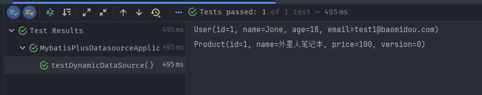

## 9.MyBatisX插件

> MyBatis-Plus为我们提供了强大的mapper和service模板，能够大大的提高开发效率。但是在真正开发过程中，MyBatis-Plus并不能为我们解决所有问题，例如一些复杂的SQL，多表联查，我们就需要自己去编写代码和SQL语句，我们该如何快速的解决这个问题呢，这个时候可以使用MyBatisX插件MyBatisX一款基于 IDEA 的快速开发插件，为效率而生。

- MyBatisX插件用法：https://baomidou.com/pages/ba5b24

> 安装方法：打开 IDEA，进入 File -> Settings -> Plugins -> Browse Repositories，输入 `mybatisx` 搜索并安装。

**功能**：

- **XML 跳转** 

- **生成代码(需先在 idea 配置 Database 配置数据源)** 

- **重置模板** 

> **JPA 提示**

- 生成新增
  

- 生成查询
  

- 生成修改
  

- 生成删除
  


## 🎉结束了🎉


