# SpringBoot快速入门


## 1.什么是SpringBoot

> 回顾什么是Spring？

- Spring是一个开源框架，2003 年兴起的一个轻量级的Java 开发框架，作者：Rod Johnson  。
- **Spring是为了解决企业级应用开发的复杂性而创建的，简化开发**。

> Spring是如何简化Java开发的？

为了降低Java开发的复杂性，Spring采用了以下4种关键策略：

1、基于POJO的轻量级和最小侵入性编程，所有东西都是bean；

2、通过IOC，依赖注入（DI）和面向接口实现松耦合；

3、基于切面（AOP）和惯例进行声明式编程；

4、通过切面和模版减少样式代码，RedisTemplate，xxxTemplate；

> 什么是SpringBoot？

学过javaweb的同学就知道，开发一个web应用，从最初开始接触Servlet结合Tomcat, 跑出一个Hello Wolrld程序，是要经历特别多的步骤；后来就用了框架Struts，再后来是SpringMVC，到了现在的SpringBoot，过一两年又会有其他web框架出现；你们有经历过框架不断的演进，然后自己开发项目所有的技术也在不断的变化、改造吗？建议都可以去经历一遍；

言归正传，什么是SpringBoot呢，就是一个javaweb的开发框架，和SpringMVC类似，对比其他javaweb框架的好处，官方说是简化开发，约定大于配置，  you can "just run"，能迅速的开发web应用，几行代码开发一个http接口。

所有的技术框架的发展似乎都遵循了一条主线规律：从一个复杂应用场景 衍生 一种规范框架，人们只需要进行各种配置而不需要自己去实现它，这时候强大的配置功能成了优点；发展到一定程度之后，人们根据实际生产应用情况，选取其中实用功能和设计精华，重构出一些轻量级的框架；之后为了提高开发效率，嫌弃原先的各类配置过于麻烦，于是开始提倡“约定大于配置”，进而衍生出一些一站式的解决方案。

是的，这就是Java企业级应用->J2EE->spring->springboot的过程。

随着 Spring 不断的发展，涉及的领域越来越多，项目整合开发需要配合各种各样的文件，慢慢变得不那么易用简单，违背了最初的理念，甚至人称配置地狱。Spring Boot 正是在这样的一个背景下被抽象出来的开发框架，目的为了让大家更容易的使用 Spring 、更容易的集成各种常用的中间件、开源软件；

Spring Boot 基于 Spring 开发，Spirng Boot 本身并不提供 Spring 框架的核心特性以及扩展功能，只是用于快速、敏捷地开发新一代基于 Spring 框架的应用程序。也就是说，它并不是用来替代 Spring 的解决方案，而是和 Spring 框架紧密结合用于提升 Spring 开发者体验的工具。Spring Boot 以**约定大于配置的核心思想**，默认帮我们进行了很多设置，多数 Spring Boot 应用只需要很少的 Spring 配置。同时它集成了大量常用的第三方库配置（例如 Redis、MongoDB、Jpa、RabbitMQ、Quartz 等等），Spring Boot 应用中这些第三方库几乎可以零配置的开箱即用。

简单来说就是SpringBoot其实不是什么新的框架，它默认配置了很多框架的使用方式，就像maven整合了所有的jar包，spring boot整合了所有的框架 。

Spring Boot 出生名门，从一开始就站在一个比较高的起点，又经过这几年的发展，生态足够完善，Spring Boot 已经当之无愧成为 Java 领域最热门的技术。

> **Spring Boot的主要优点**：

- 为所有Spring开发者更快的入门；
- **开箱即用**，提供各种默认配置来简化项目配置；
- 内嵌式容器简化Web项目；
- 没有冗余代码生成和XML配置的要求；

## 2.什么是微服务架构

- [参考原文](https://martinfowler.com/articles/microservices.html)
- [参考译文](https://www.cnblogs.com/liuning8023/p/4493156.html)

> 什么是微服务？

微服务是一种架构风格，它要求我们在开发一个应用时，将单个应用程序开发为一组小服务的方法，每个小服务都在自己的进程中运行，并与轻量级机制（通常是 HTTP 资源 API）进行通信。简单说：==每个功能元素最终都是一个可独立替换和独立升级的软件单元==。

> 单体应用架构

- 所谓单体应用架构（ all in one）是指，我们将一个应用的中的所有应用服务都封装在一个应用中。
- 无论是ERP、CRM或是其他什么系统，你都把数据库访问，web访问，等等各个功能放到一个war包内。
- 这样做的好处是，易于开发和测试；也十分方便部罢；当需要扩展时，只需要将war复制多份，然后放到多个服务器上，再做个负载均衡就可以了。
- 单体应用架构的缺点是，哪怕我要修改一个非常小的地方，我都需要停掉整个服务，重新打包、部署这个应用war包。特别是对于一个大型应用，我们不可能吧所有内容都放在一个应用里面，我们如何维护、如何分工合作都是问题。

- 例如：[Apache Dubbo](https://dubbo.apache.org/zh/)


> 微服务架构

all in one的架构方式，我们把所有的功能单元放在一个应用里面。然后我们把整个应用部罢到服务器上。如果负载能力不行，我们将整个应用进行水平复制，进行扩展，然后在负载均衡。

所谓微服务架构，就是打破之前 all in one的架构方式，把每个功能元素独立出来，肥独立出来的功能元素的动态组合，需要的功能元素才去拿来组合，需要多一些时可以整合多个功能元素。所以微服务架构是对功能元素进行复制，而没有对整个应用进行复制。

这样做的好处是：

- 节省了调用资源。
- 每个功能元素的服都是一个可替换的、可独立升吸的软件代码。

<center>图1：单体和微服务</center>

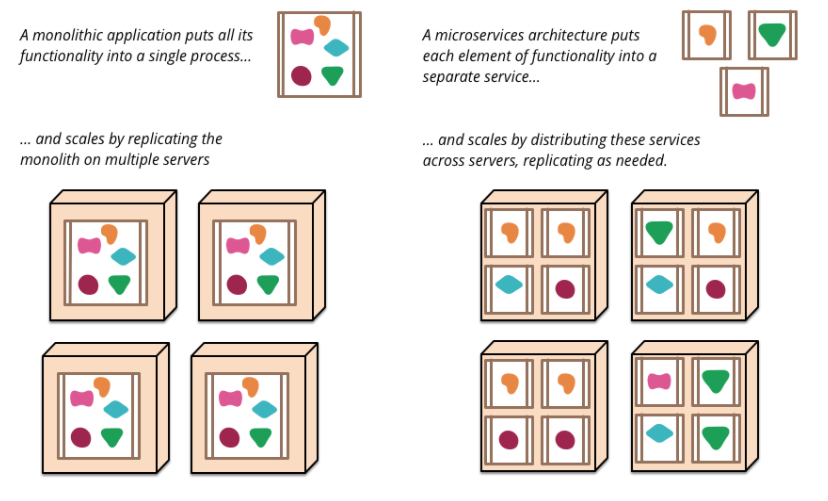

> 微服务技术栈有那些？

| 微服务技术条目                         | 落地技术                                                     |
| -------------------------------------- | ------------------------------------------------------------ |
| 服务开发                               | SpringBoot、Spring、SpringMVC等                              |
| 服务配置与管理                         | Netfix公司的Archaius、阿里的Diamond等                        |
| 服务注册与发现                         | Eureka、Consul、Zookeeper等                                  |
| 服务调用                               | Rest、PRC、gRPC                                              |
| 服务熔断器                             | Hystrix、Envoy等                                             |
| 负载均衡                               | Ribbon、Nginx等                                              |
| 服务接口调用(客户端调用服务的简化工具) | Fegin等                                                      |
| 消息队列                               | Kafka、RabbitMQ、ActiveMQ等                                  |
| 服务配置中心管理                       | SpringCloudConfig、Chef等                                    |
| 服务路由(API网关)                      | Zuul等                                                       |
| 服务监控                               | Zabbix、Nagios、Metrics、Specatator等                        |
| 全链路追踪                             | Zipkin、Brave、Dapper等                                      |
| 数据流操作开发包                       | SpringCloud Stream(封装与Redis，Rabbit，Kafka等发送接收消息) |
| 时间消息总栈                           | SpringCloud Bus                                              |
| 服务部署                               | Docker、OpenStack、Kubernetes等                              |

- [各微服务框架对比](https://www.cnblogs.com/wangju/p/11813141.html)

> 如何构建微服务？

一个大型系统的微服务架构，就像一个复杂交织的神经网络，每一个神经元就是一个功能元素，它们各自完成自己的功能，然后通过http相互请求调用。比如一个电商系统，查缓存、连数据库、浏览页面、结账、支付等服务都是一个个独立的功能服务，都被微化了，它们作为一个个微服务共同构建了个庞大的系统。如果修改其中的一个功能，只需要更新升级其中一个功能服务单元即可。
但是这种庞大的系统架构给部罢和运维带来很大的难度。于是， spring为我们带来了构建大型分布式微服务的全套、全程产品：

- 构建一个个功能独立的微服务应用单元，可以使用 Spring boot，可以帮我们快速构建一个应用；
- 大型分布式网络服务的调用，这部分由 Spring cloud来完成，实现分布式；
- 在分布式中间，进行流式数据计算、批处理，我们有 Spring cloud data flow。
- Spring为我们想清楚了整个从开始构建应用到大型分布式应用全流程方案。


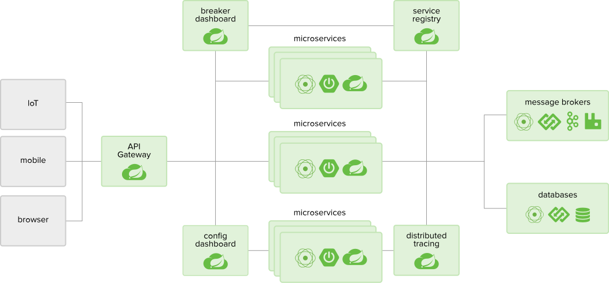

## 3.第一个springboot程序

> 基本环境

- JDK 1.8
- maven 3.8.2
- [Spring Boot 2.5.5](https://spring.io/projects/spring-boot#learn)
- IDEA 2020

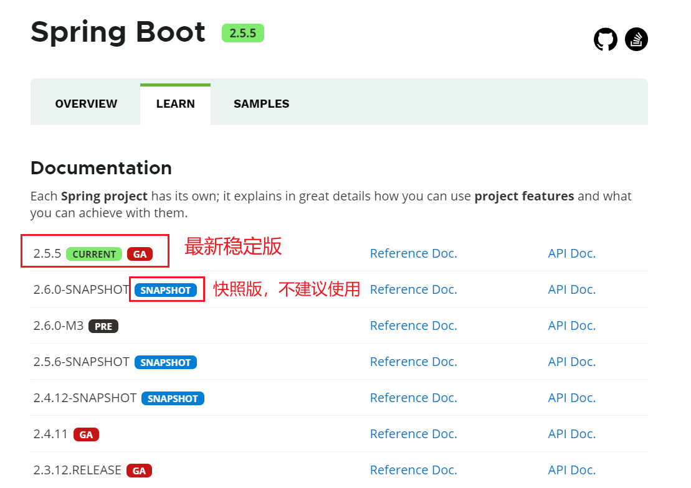

> 创建基础项目说明

- Spring官方提供了非常方便的工具让我们快速构建应用

- Spring Initializr：https://start.spring.io/

**项目创建方式一**：使用Spring Initializr 的 Web页面创建项目

1. 打开  https://start.spring.io/

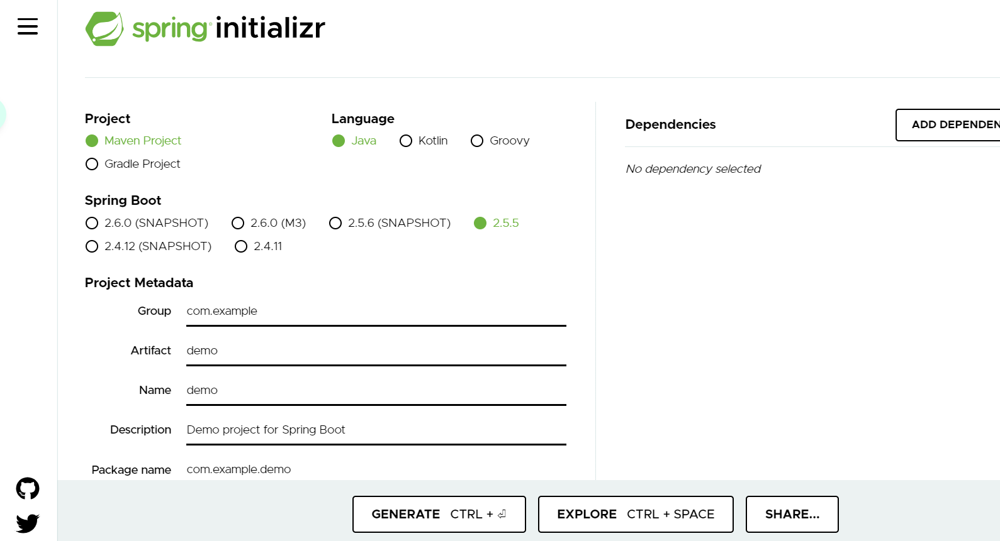

2. 填写项目信息

   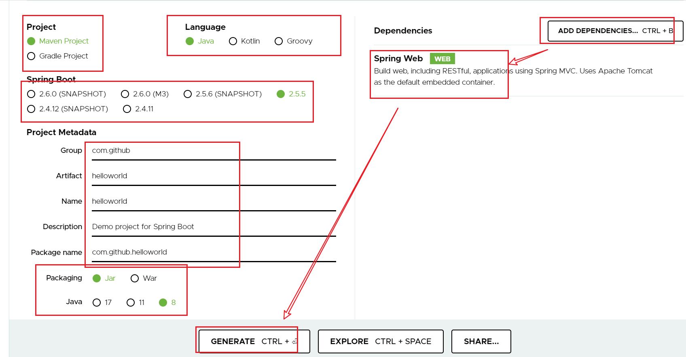

3. 点击”Generate Project“按钮生成项目；下载此项目

   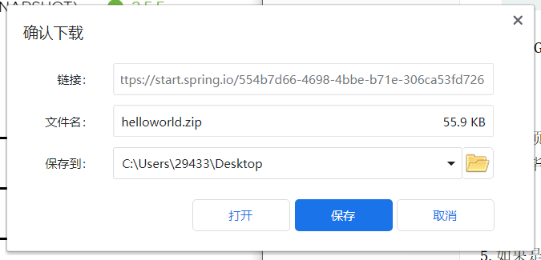

4. 解压项目包，并用IDEA以Maven项目导入，一路下一步即可，直到项目导入完毕。

5. 如果是第一次使用，可能速度会比较慢，包比较多、需要耐心等待一切就绪。

   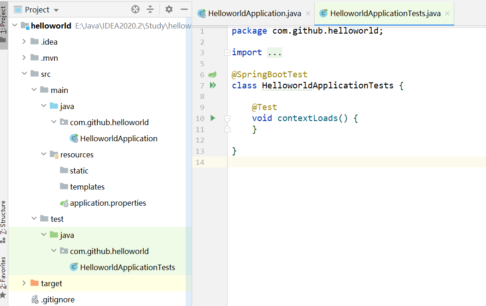
   
   
   
   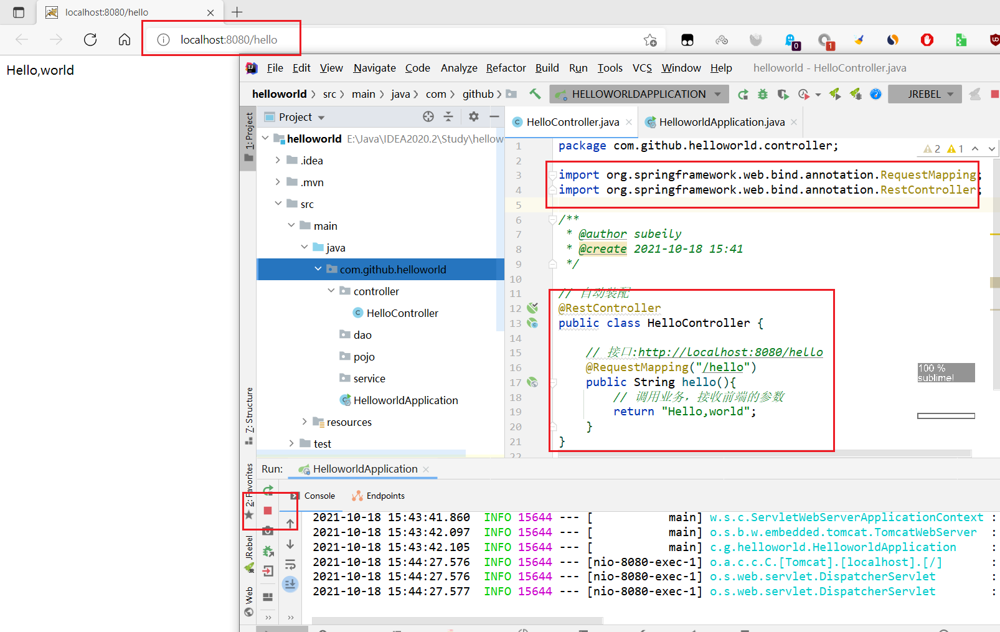

> 报错：Plugin ‘org.springframework.boot:spring-boot-maven-plugin:‘ not found

- 解决方法：==添加版本号即可==。

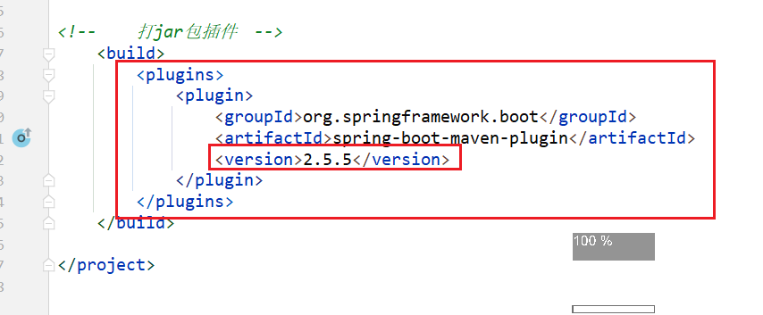


**项目创建方式二：**使用 IDEA 直接创建项目

1. 创建一个新项目

2. 选择spring initalizr ， 可以看到默认就是去官网的快速构建工具那里实现

   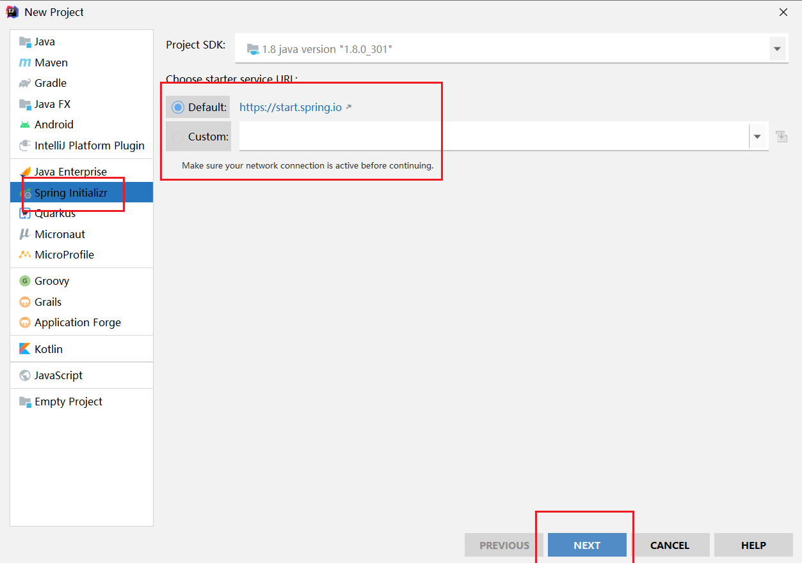

3. 填写项目信息

   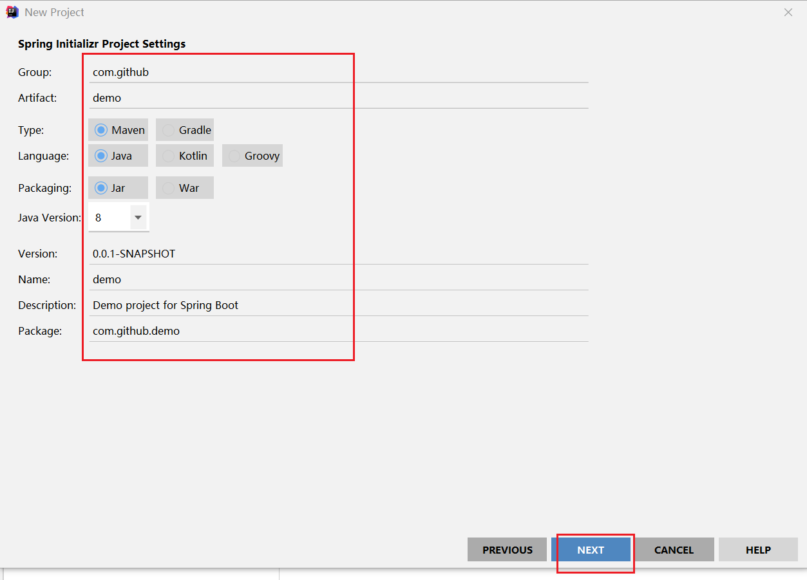

4. 选择初始化的组件（初学勾选 Web 即可）

   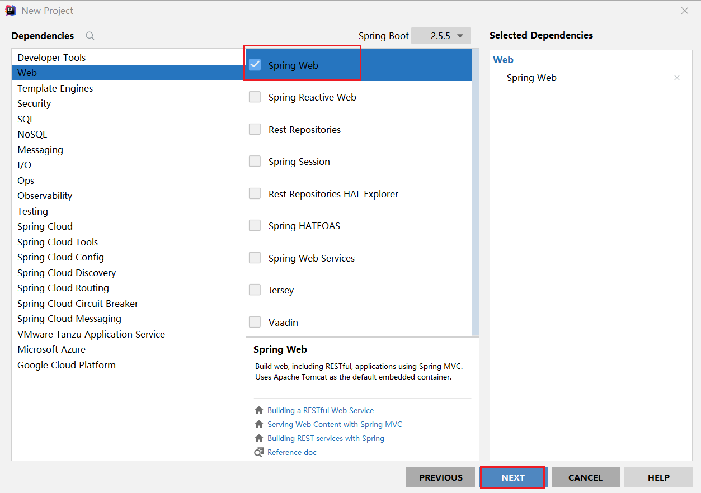

5. 填写项目路径

   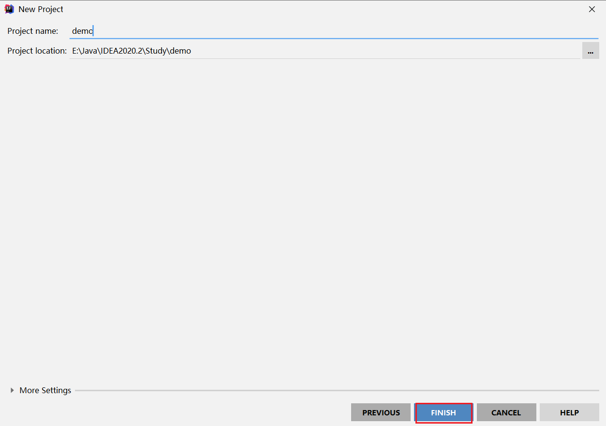

6. 等待项目构建成功

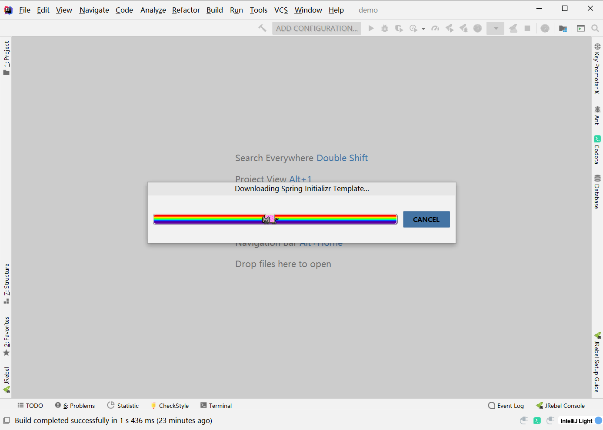

> 报错：Cannot download 'https://start.spring.io': Connection reset

- 解决办法：将 `https` 改为 `http`，或者使用阿里云：https://start.aliyun.com/ ，地址直接替代。

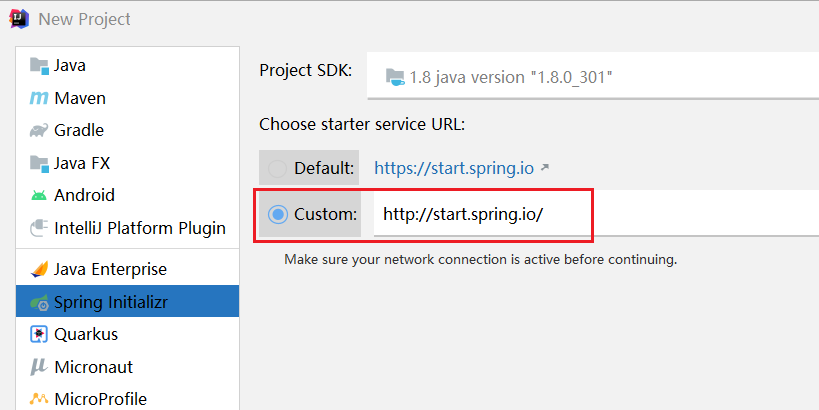

> **项目结构分析**：

通过上面步骤完成了基础项目的创建。就会自动生成以下文件：

1. 程序的主启动类；

2. 一个 application.properties 配置文件；

3. 一个 测试类；

4. 一个 pom.xml；

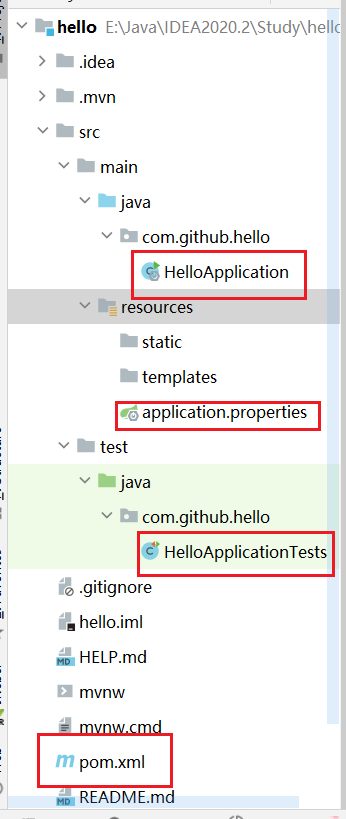

>pom.xml 分析

打开pom.xml，看看Spring Boot项目的依赖：

```xml
<?xml version="1.0" encoding="UTF-8"?>
<project xmlns="http://maven.apache.org/POM/4.0.0"
         xmlns:xsi="http://www.w3.org/2001/XMLSchema-instance"
         xsi:schemaLocation="http://maven.apache.org/POM/4.0.0
         https://maven.apache.org/xsd/maven-4.0.0.xsd">
    <modelVersion>4.0.0</modelVersion>
<!--    父依赖    -->
    <parent>
        <groupId>org.springframework.boot</groupId>
        <artifactId>spring-boot-starter-parent</artifactId>
        <version>2.5.5</version>
        <relativePath/>
        <!-- lookup parent from repository -->
    </parent>
    <groupId>com.github</groupId>
    <artifactId>demo</artifactId>
    <version>0.0.1-SNAPSHOT</version>
    <name>demo</name>
    <description>demo</description>
    <properties>
        <java.version>1.8</java.version>
    </properties>
    <dependencies>
<!--    web场景启动器    -->
        <dependency>
            <groupId>org.springframework.boot</groupId>
            <artifactId>spring-boot-starter-web</artifactId>
        </dependency>

        <!-- springboot单元测试 -->
        <dependency>
            <groupId>org.springframework.boot</groupId>
            <artifactId>spring-boot-starter-test</artifactId>
            <scope>test</scope>
        </dependency>
        
<!--    剔除依赖    -->
        <dependency>
            <groupId>org.springframework.boot</groupId>
            <artifactId>spring-boot-autoconfigure</artifactId>
            <version>2.1.0.RELEASE</version>
        </dependency>
        <dependency>
            <groupId>org.springframework.boot</groupId>
            <artifactId>spring-boot-autoconfigure</artifactId>
            <version>2.5.5</version>
        </dependency>
    </dependencies>

<!--    打包插件    -->
    <build>
        <plugins>
            <plugin>
                <groupId>org.springframework.boot</groupId>
                <artifactId>spring-boot-maven-plugin</artifactId>
            </plugin>
        </plugins>
    </build>

</project>
```

> 编写HTTP接口

1. 在主程序的同级目录下，新建一个controller包，一定要在同级目录下，否则识别不到；
2. 在包中新建一个HelloController类

```java
package com.github.demo.controller;

import org.springframework.web.bind.annotation.RequestMapping;
import org.springframework.web.bind.annotation.RestController;

/**
 * @author subeiLY
 * @create 2021-10-21 18:23
 */
@RestController
public class HelloController {
    @RequestMapping("/hello")
    public String hello() {
        return "hello,SpringBoot!";
    }
}
```

3. 编写完毕后，从主程序启动项目，浏览器发起请求，看页面返回；控制台输出了 Tomcat 访问的端口 号！

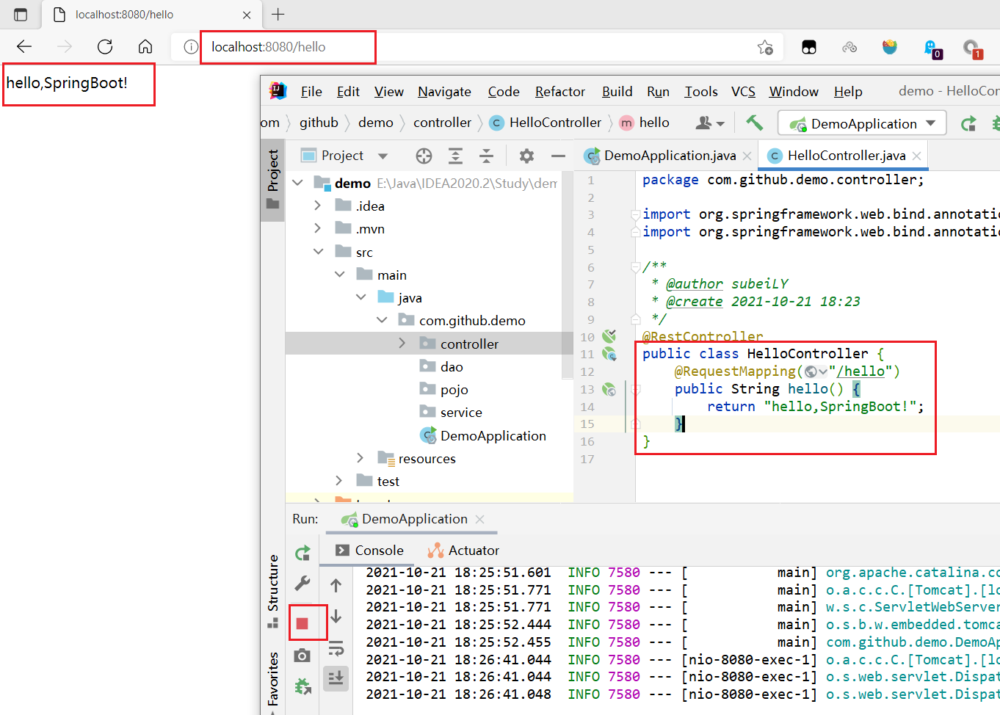

- 至此，就完成了一个web接口的开发，第一个Spring Boot完成。

> 将项目打成jar包，点击 maven的 package

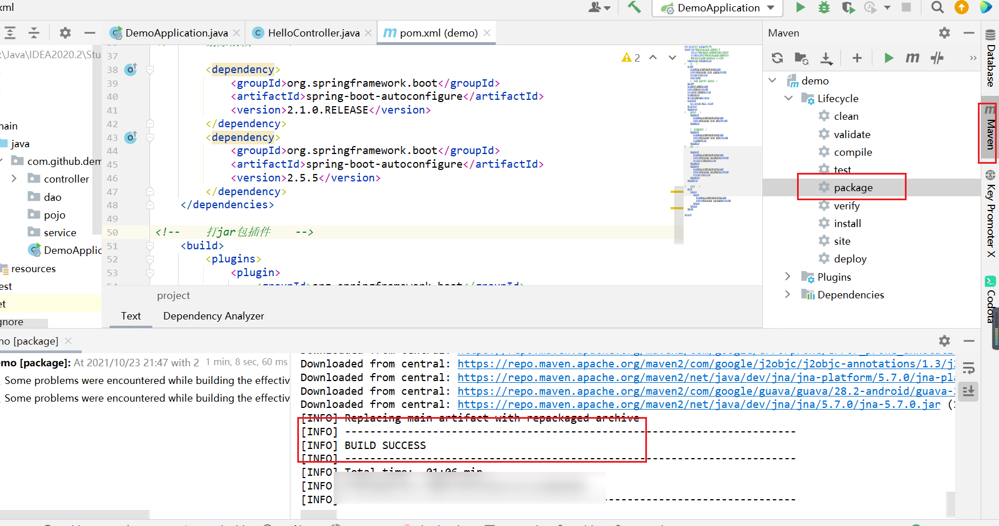

```java
运行jar包命令：java -jar xxx.jar
```

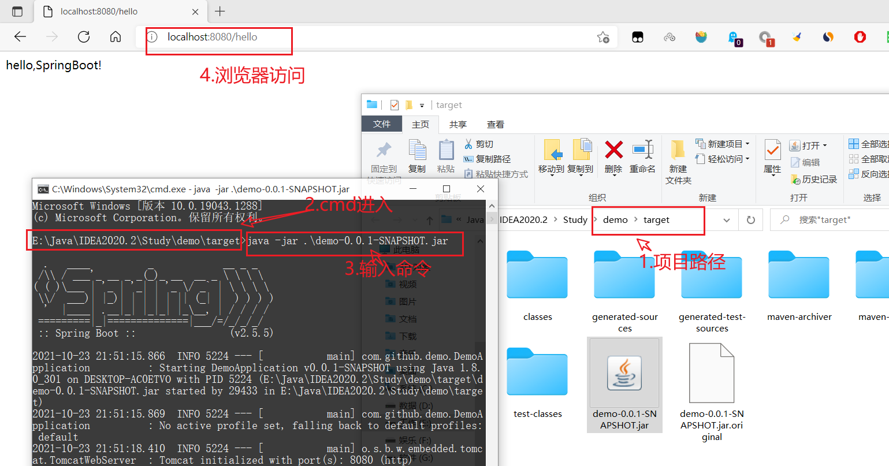

> 附注

- 如何更改启动时显示的字符拼成的字母，SpringBoot呢？ 
- 也就是 banner 图案； 只需一步：到项目下的 resources 目录下新建一个banner.txt 即可。 
- 图案可以到：[https://www.bootschool.net/ascii](https://www.bootschool.net/ascii) 这个网站生成，然后拷贝到文件中即可！


## 4.Springboot自动装配原理

- 对于Maven项目，我们一般从pom.xml文件探究起。

### 1.Pom.xml

> 父依赖——主要是管理项目的资源过滤及插件！

```xml
<parent>
        <groupId>org.springframework.boot</groupId>
        <artifactId>spring-boot-starter-parent</artifactId>
        <version>2.5.5</version>
    	<relativePath/>
        <!-- lookup parent from repository -->
</parent>
```

- 点进去，发现还有一个父依赖

```xml
<parent>
    <groupId>org.springframework.boot</groupId>
    <artifactId>spring-boot-dependencies</artifactId>
    <version>2.5.5</version>
</parent>
```

- 这里才是真正管理SpringBoot应用里面所有依赖版本的地方，SpringBoot的版本控制中心；
- spring-boot-dependencies：核心依赖在父工程中！所以，我们在写或引入一些SpringBoot依赖时，不需要指定版本，因为本身就有这些版本仓库。

> 启动器

```xml
<dependency>
    <groupId>org.springframework.boot</groupId>
    <artifactId>spring-boot-starter</artifactId>
</dependency>
```

- springboot-boot-starter-xxx：就是spring-boot的场景启动器； 
- 比如 spring-boot-starter-web：帮我们导入了web模块正常运行所依赖的组件； 
- SpringBoot将所有的功能场景都抽取出来，变成一个个的starter（启动器），只需要在项目中引入这些 starter即可，所有相关的依赖都会导入进来，我们要用什么功能就导入什么样的场景启动器即可；也可以自己自定义 starter。

### 2.主启动类

> 默认的主启动类——@SpringBootApplication

```java
// @SpringBootApplication 标注一个主程序类， 说明这是一个Spring Boot应用
@SpringBootApplication
public class DemoApplication {

    public static void main(String[] args) {
        // 启动一个服务
        SpringApplication.run(DemoApplication.class, args);
    }

}
```

- 进入这个注解，可以看到下面还有很多其他注解：

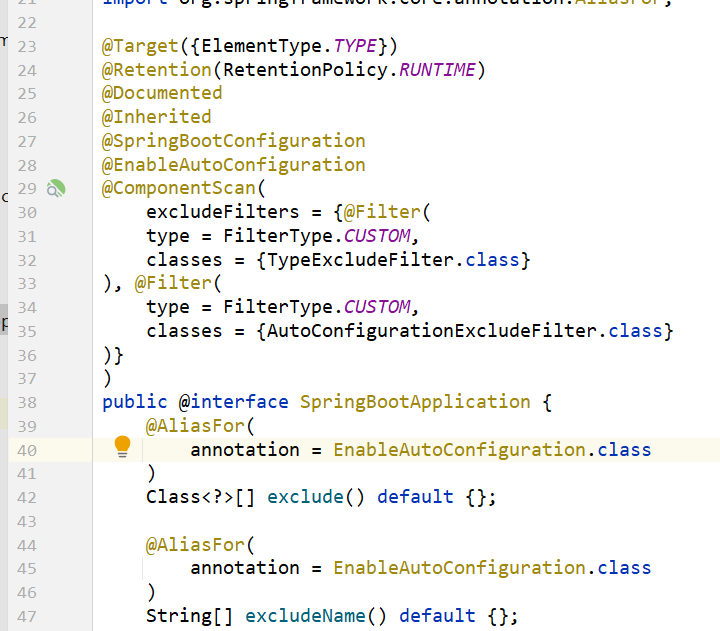

> @ComponentScan 

- 这个注解在Spring中对应XML配置中的元素。 
- 作用：自动扫描并加载符合条件的组件或者bean，将这个bean定义加载到IOC容器中。

> 依次按照如下层级点进去：

- @SpringBootConfiguration：spring boot的配置；
  - @Configuration：spring配置类，对应Spring的xml配置文件；
  - @Component：说明这是一个Spring组件，负责启动应用！
- @EnableAutoConfiguration：开启自动配置功能；
  - @AutoConfigurationPackage：自动配置包；
    - @Import({Registrar.class})：自动配置包注册；
  - @Import({AutoConfigurationImportSelector.class})：自动导入组件；

----

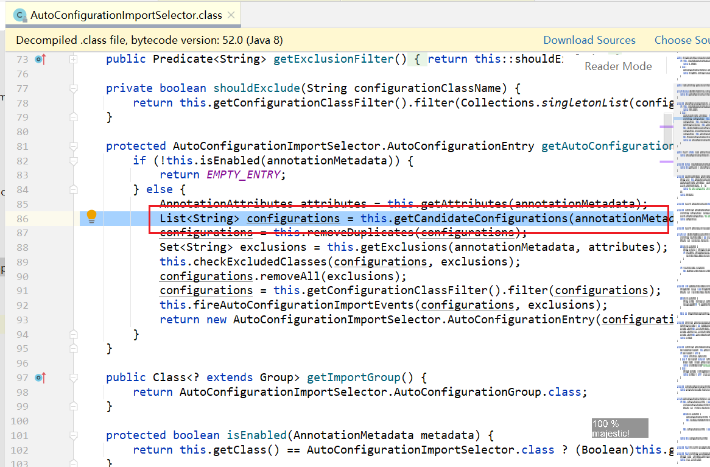

```java
// 获取所有的配置
List<String> configurations = this.getCandidateConfigurations(annotationMetadata, attributes);
```

- 类中有一个这样的方法

```java
// 获取候选的配置
protected List<String> getCandidateConfigurations(AnnotationMetadata metadata, AnnotationAttributes attributes) {
    // 此处的getSpringFactoriesLoaderFactoryClass（）方法
	// 返回的就是最开始看的启动自动导入配置文件的注解类；EnableAutoConfiguration
    List<String> configurations = SpringFactoriesLoader.loadFactoryNames(this.getSpringFactoriesLoaderFactoryClass(), this.getBeanClassLoader());
    Assert.notEmpty(configurations, "No auto configuration classes found in META-INF/spring.factories. If you are using a custom packaging, make sure that file is correct.");
    return configurations;
}
```

- 这个方法又调用了 SpringFactoriesLoader 类的静态方法！进入SpringFactoriesLoader类 loadFactoryNames() 方法

```java
    public static List<String> loadFactoryNames(Class<?> factoryType, @Nullable ClassLoader classLoader) {
        ClassLoader classLoaderToUse = classLoader;
        if (classLoader == null) {
            classLoaderToUse = SpringFactoriesLoader.class.getClassLoader();
        }

        String factoryTypeName = factoryType.getName();
        // 再次调用了 loadSpringFactories 方法
        return (List)loadSpringFactories(classLoaderToUse).getOrDefault(factoryTypeName, Collections.emptyList());
    }
```

- 继续点击查看 loadSpringFactories 方法

```java
private static Map<String, List<String>> loadSpringFactories(ClassLoader classLoader) {
    // 获得classLoader， 返回可以看到这里得到的就是EnableAutoConfiguration标注的类本身
    Map<String, List<String>> result = (Map)cache.get(classLoader);
    if (result != null) {
        return result;
    } else {
        HashMap result = new HashMap();

        try {
            // 获取一个资源 "META-INF/spring.factories"
            Enumeration urls = classLoader.getResources("META-INF/spring.factories");
			
            // 将读取到的资源遍历，封装成为一个Properties
            while(urls.hasMoreElements()) {
                URL url = (URL)urls.nextElement();
                UrlResource resource = new UrlResource(url);
                Properties properties = PropertiesLoaderUtils.loadProperties(resource);
                Iterator var6 = properties.entrySet().iterator();

                while(var6.hasNext()) {
                    Entry<?, ?> entry = (Entry)var6.next();
                    String factoryTypeName = ((String)entry.getKey()).trim();
                    String[] factoryImplementationNames = StringUtils.commaDelimitedListToStringArray((String)entry.getValue());
                    String[] var10 = factoryImplementationNames;
                    int var11 = factoryImplementationNames.length;

                    for(int var12 = 0; var12 < var11; ++var12) {
                        String factoryImplementationName = var10[var12];
                        ((List)result.computeIfAbsent(factoryTypeName, (key) -> {
                            return new ArrayList();
                        })).add(factoryImplementationName.trim());
                    }
                }
            }

            result.replaceAll((factoryType, implementations) -> {
                return (List)implementations.stream().distinct().collect(Collectors.collectingAndThen(Collectors.toList(), Collections::unmodifiableList));
            });
            cache.put(classLoader, result);
            return result;
        } catch (IOException var14) {
            throw new IllegalArgumentException("Unable to load factories from location [META-INF/spring.factories]", var14);
        }
    }
}
```

- 发现一个多次出现的文件： `spring.factories` ，全局搜索<kbd>Ctrl</kbd>+<kbd>N</kbd>它。

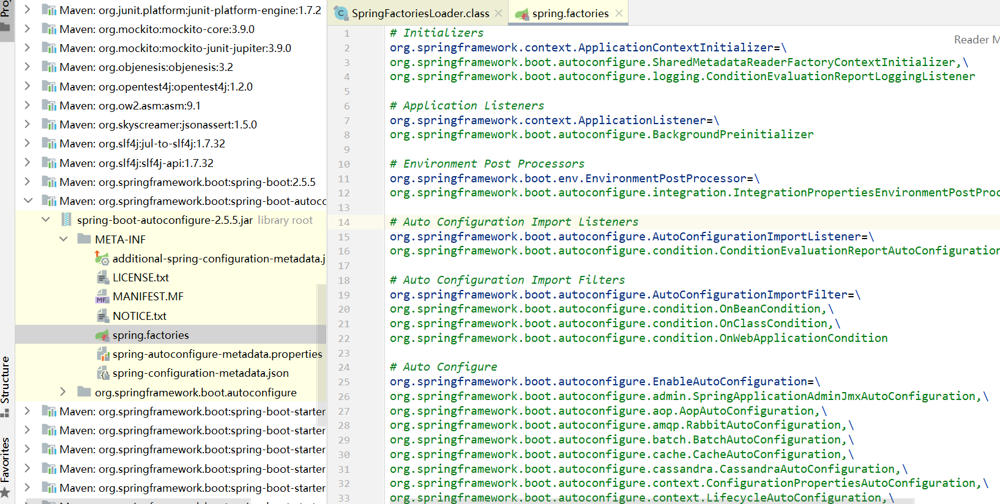

> WebMvcAutoConfiguration——在上面的自动配置类随便找一个打开看看，比如 ： WebMvcAutoConfiguration

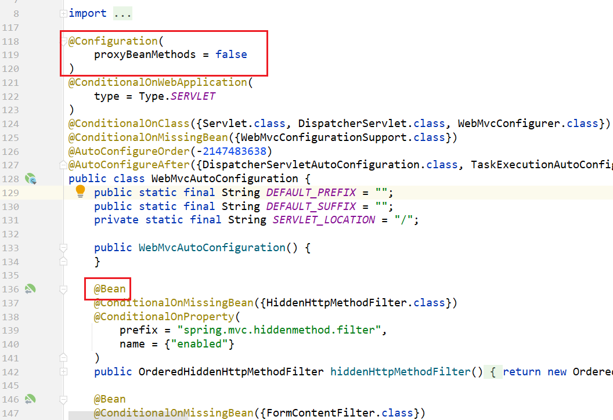

- 可以看到这些一个个的都是JavaConfig配置类，而且都注入了一些Bean，可以找一些自己认识的类，看着熟悉一下！
- 所以，自动配置真正实现是从classpath中搜寻所有的META-INF/spring.factories配置文件 ，并将其中对应的 org.springframework.boot.autoconfigure. 包下的配置项，通过反射实例化为对应标注了 @Configuration的JavaConfig形式的IOC容器配置类，然后将这些都汇总成为一个实例并加载到IOC容器中。

> 结论： 


1. SpringBoot在启动的时候从类路径下的META-INF/spring.factories中获取 EnableAutoConfiguration指定的值；
2. 将这些值作为自动配置类导入容器，自动配置类就生效，帮我们进行自动配置工作； 
3. 整个J2EE的整体解决方案和自动配置都在springboot-autoconfigure的jar包中； 
4. 它会把所有需要导入的组件，以类名的方式返回，这些组件就会被添加到容器；
5. 容器中也会存在非常多的 xxxAuto Configuration的文件（@Bean），就是这些类给容器中导入了这个场景需要的所有组件并自动配置，@Configuration, JavaConfig；
6. 有了自动配置类，免去了我们手动编写配置注入功能组件等的工作！

-----

### 3.SpringApplication

```java
@SpringBootApplication
public class DemoApplication {

    public static void main(String[] args) {
        // 启动一个服务
        SpringApplication.run(DemoApplication.class, args);
    }

}
```

- 该方法主要分两部分，一部分是SpringApplication的实例化，二是run方法的执行。

> 这个类主要做了以下四件事情： 

1. 推断应用的类型是普通的项目还是Web项目；
2. 查找并加载所有可用初始化器，设置到initializers属性中；
3. 找出所有的应用程序监听器，设置到listeners属性中；
4. 推断并设置main方法的定义类，找到运行的主类。

**查看构造器**：

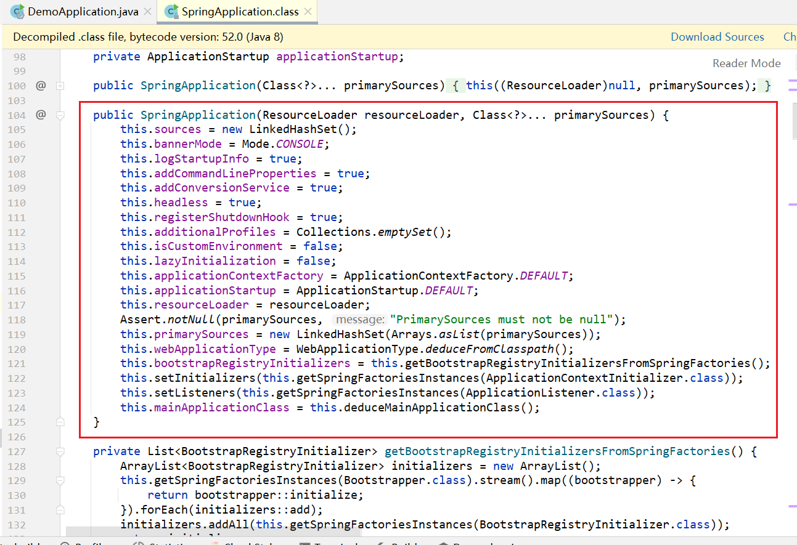

**run方法**：

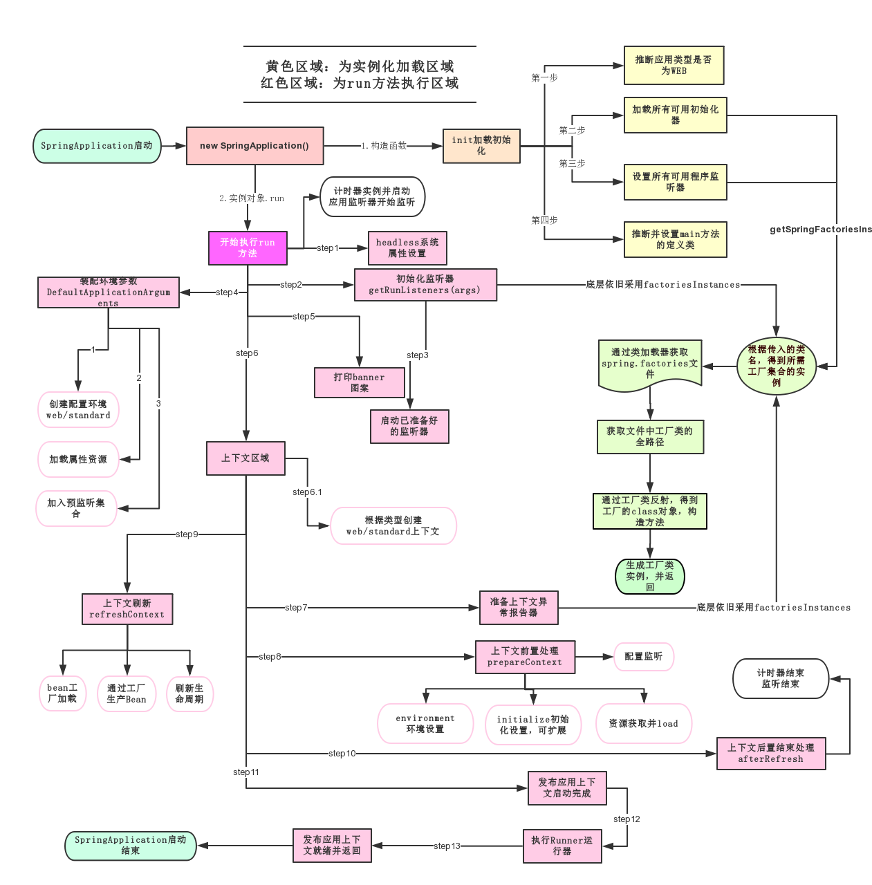

## 5.Yaml语法

> 配置文件 

SpringBoot使用一个全局的配置文件，配置文件名称是固定的。

- application.properties 
  - 语法结构：key=value 
- application.yml 
  - 语法结构：key：空格 value 

**配置文件的作用** ：修改SpringBoot自动配置的默认值，因为SpringBoot在底层都给我们自动配置好了； 

比如我们可以在配置文件中修改Tomcat 默认启动的端口号！测试一下！

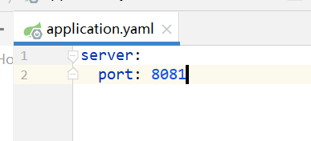

> [yaml](https://baike.baidu.com/item/YAML/1067697)概述 

- YAML是 "YAML Ain't a Markup Language" （YAML不是一种标记语言）的递归缩写。 

- 在开发的这种语言时，YAML 的意思其实是："Yet Another Markup Language"（仍是一种标记语言）。 
- 这种语言以数据做为中心，而不是以标记语言为重点！ 
- 以前的配置文件，大多数都是使用xml来配置；比如一个简单的端口配置，我们来对比下yaml和xml。
- 传统xml配置：

```xml
<server>
    <port>8081</port>
</server>
```

- yaml配置：

```yaml
server:
  port: 8081
```

> yml基础语法

1、空格不能省略。

2、以缩进来控制层级关系，只要是左边对齐的一列数据都是同一个层级的。 

3、属性和值的大小写都是十分敏感的。

- 字面量：普通的值 [ 数字，布尔值，字符串 ] 
- 字面量直接写在后面就可以 ， 字符串默认不用加上双引号或者单引号；

```yaml
k: v
```

> 注意： 

- “ ” 双引号，不会转义字符串里面的特殊字符 ， 特殊字符会作为本身想表示的意思； 比如 ： name: "github\n subei" 输出 ： github 换行 subei
- '' 单引号，会转义特殊字符 ， 特殊字符最终会变成和普通字符一样输出 比如 ： name: ‘github\n subei’ 输出 ： github\n subei

```yaml
# k=v

# 普通的key-value
name: github

# 对象
student:
  name: github
  age: 18

# 行内写法
student2: {name: github,age: 18}

# 数组 用 - 值表示数组中的一个元素

pets:
  - cat
  - dog
  - pig

pets2: [cat,dog,pig]
```

## 6.给属性赋值的几种方式

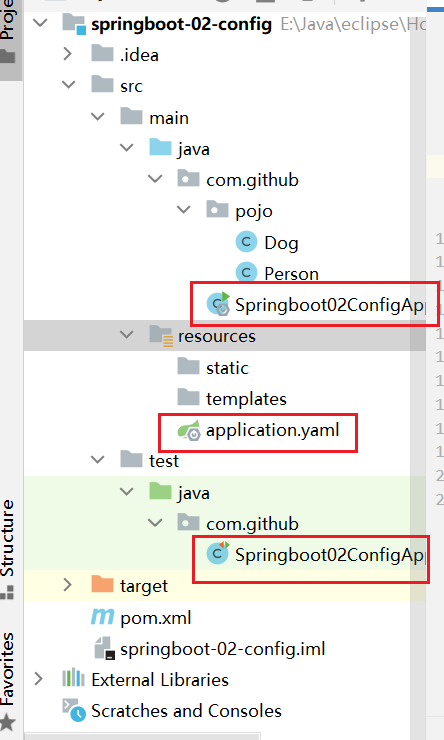

- yaml文件在于：可以直接给实体类直接注入匹配值！

> Yaml注入配置文件

1. 在springboot项目中的resources目录下新建一个文件 application.yaml
2. 编写一个实体类Dog；
   - getset方法，无参有参——快捷键：<kbd>alt</kbd>+<kbd>insert</kbd>

```java
package com.github.pojo;

import org.springframework.stereotype.Component;

@Component // 注册bean到容器中
public class Dog {
    private String name;
    private Integer age;

    // 有参无参构造、get、set方法、toString()方法
    
}
```

3. 思考：我们原来是如何给bean注入属性值的！ @Value，给宠物类测试一下：

```java
@Component
public class Dog {
    @Value("旺财")
    private String name;
    @Value("3")
    private Integer age;

    // 有参无参构造、get、set方法、toString()方法
}
```

4. 在SpringBoot的测试类下注入宠物类输出一下；

```java
@SpringBootTest
class Springboot02ConfigApplicationTests {

    @Autowired  // 将宠物类自动注入进来
    Dog dog;

    @Test
    void contextLoads() {
        System.out.println(dog);    // 打印一下宠物对象
    }

}
```

- 输出成功，@Value注入成功，这是之前的实现方式。

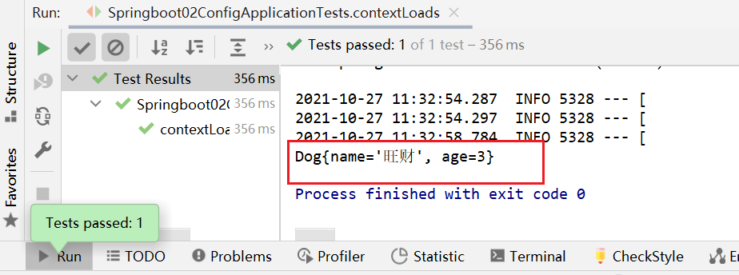

5. 再编写一个复杂一点的实体类：Person 类

```java
@Component
public class Person {
    private String name;
    private Integer age;
    private Boolean happy;
    private Date birth;
    private Map<String,Object> maps;
    private List<Object> list;
    private Dog dog;

    // 有参无参构造、get、set方法、toString()方法
    
}
```

6. 使用yaml配置的方式进行注入，注意区别和优势，编写一个yaml配置。

```yaml
person: 
  name: subeiLY
  age: 18
  happy: true
  birth: 2002/03/04
  maps: {k1: v1,k2: v2}
  lists:
    - code
    - book
    - music
  dog: 
    name: 来福
    age: 2
```

7. 将person类注入到类中！

```java
/*
@ConfigurationProperties作用：
将配置文件中配置的每一个属性的值，映射到这个组件中；
告诉SpringBoot将本类中的所有属性和配置文件中相关的配置进行绑定
参数 prefix = “person” : 将配置文件中的person下面的所有属性一一对应
*/

/**
 * 注册bean
 */

@Component
@ConfigurationProperties(prefix = "person")
public class Person {
    private String name;
    private Integer age;
    private Boolean happy;
    private Date birth;
    private Map<String,Object> maps;
    private List<Object> list;
    private Dog dog;

    // 有参无参构造、get、set方法、toString()方法
    
}
```

8. IDEA 提示，springboot配置注解处理器没有找到，让我们看文档，我们可以查看文档，找到一个依赖！但它打不开，不影响。导入如下配置即可。

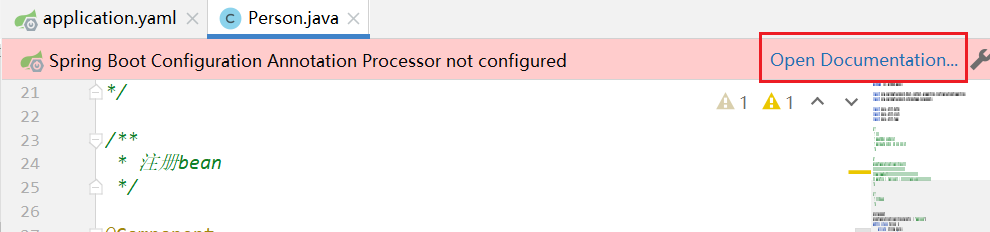

```xml
<!-- 导入配置文件处理器，配置文件进行绑定就会有提示，需要重启 -->
<dependency>
    <groupId>org.springframework.boot</groupId>
    <artifactId>spring-boot-configuration-processor</artifactId>
    <optional>true</optional>
</dependency>
```

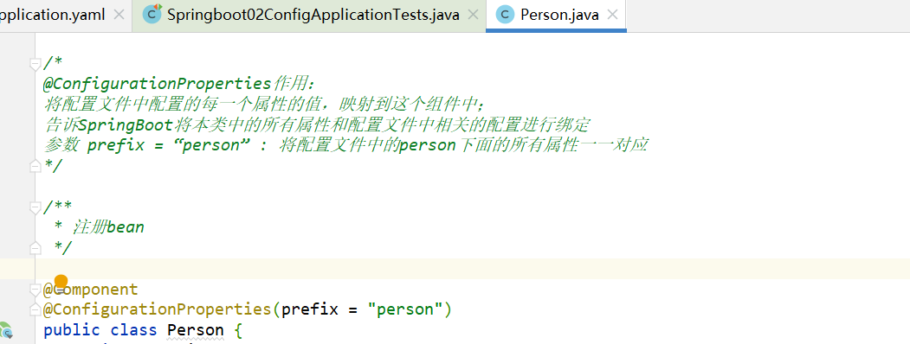

9. 确认以上配置都OK之后，去测试类中测试一下：

```java
@SpringBootTest
class Springboot02ConfigApplicationTests {

    @Autowired  // 将人类自动注入进来
    Person person;

    @Test
    void contextLoads() {
        System.out.println(person);    // 打印一下人物对象
    }

}
```

- 结果：所有值全部注入成功！

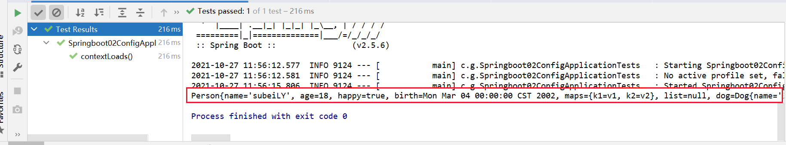

> yaml配置注入到实体类完全OK！

----

> 加载指定配置文件 

- @PropertySource ：加载指定的配置文件； 

- @configurationProperties：默认从全局配置文件中获取值； 

1. 在resources目录下新建一个person.properties文件。

```properties
name=subeiLY
```

2. 在我们的代码中指定加载person.properties文件。

   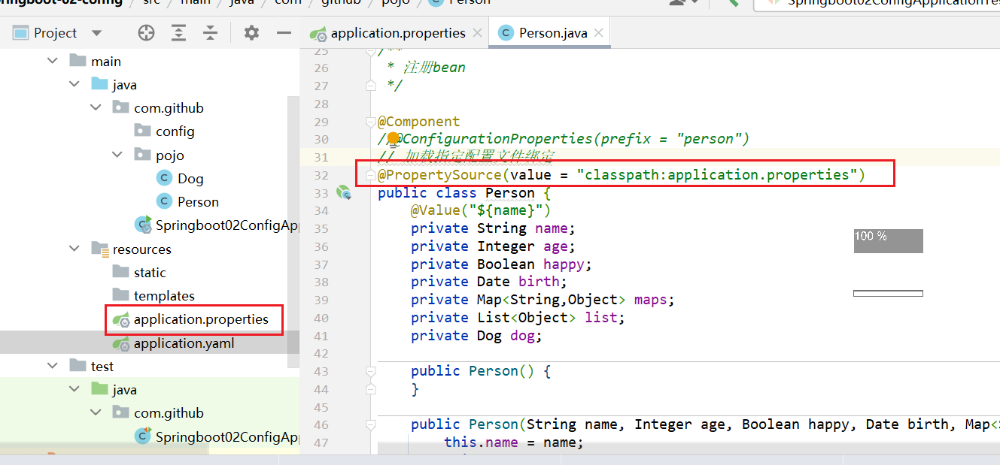

```java
@Component
//@ConfigurationProperties(prefix = "person")
// 指定配置文件绑定
@PropertySource(value = "classpath:application.properties")
public class Person {
    @Value("${name}")
    private String name;
    ......
}
```

3. 再次输出测试一下：指定配置文件绑定成功！

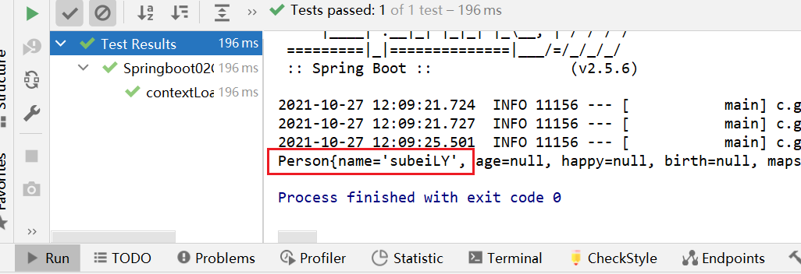

----

> 配置文件占位符

```yaml
person:
  name: subeiLY${random.uuid} # 随机uuid
  age: ${random.int}  # 随机int
  happy: true
  birth: 2002/03/04
  maps: {k1: v1,k2: v2}
  lists:
    - code
    - book
    - music
  dog:
    # 引用person.hello 的值，如果不存在就用 ：后面的值，即 other，然后拼接上_来福
    name: ${person.hello:other}_来福
    age: 2
```

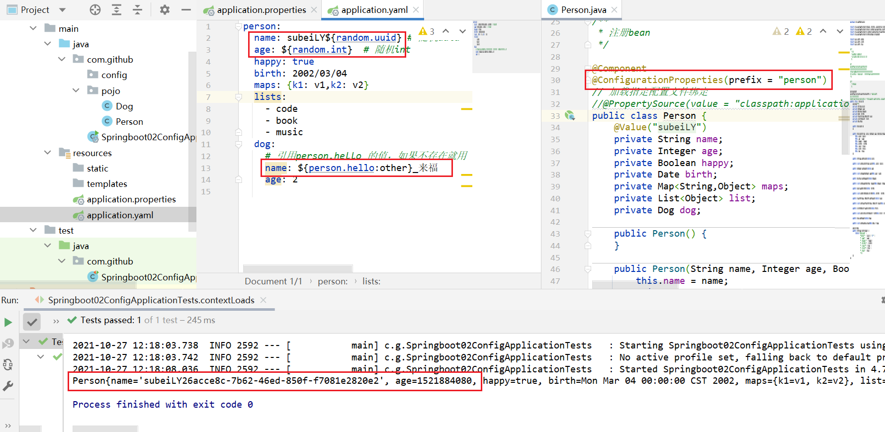

> 回顾properties配置

- 上面采用的yaml方法都是最简单的方式，开发中最常用的；也是springboot所推荐的！
- 对于其他的实现方式，道理都是相同的；写还是那样写；配置文件除了yml还有我们之前常用的properties。

- 【注意】properties配置文件在写中文的时候，会有乱码，我们需要去IDEA中设置编码格式为UTF-8；
  - settings-->FileEncodings 中配置；

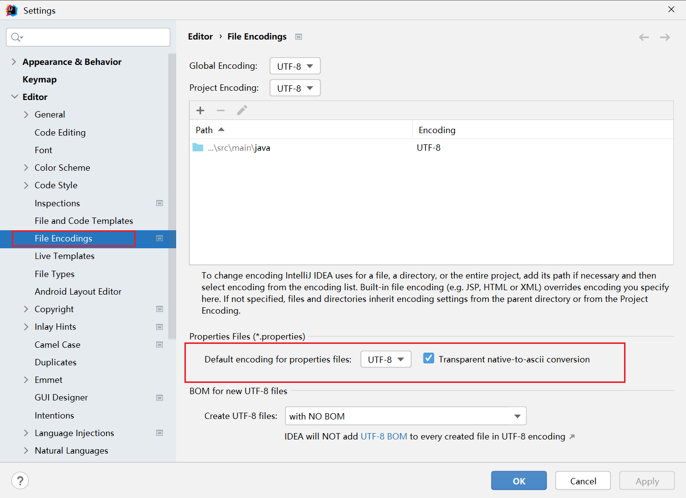

**测试步骤**：

1. 新建一个实体类User

```java
@Component //注册bean
public class User {
    private String name;
    private int age;
    private String sex;
    
    // 有参无参构造、get、set方法、toString()方法
}
```

2. 编辑配置文件 application.properties

```properties
user1.name=subei
user1.age=16
user1.sex=男
```

3. 在User类上使用@Value来进行注入！

```java
@Component //注册bean
@PropertySource(value = "classpath:application.properties")
public class User {
    @Value("${user1.name}") //从配置文件中取值
    private String name;
    @Value("#{8*2}") // #{SPEL} Spring表达式
    private int age;
    @Value("男") // 字面量
    private String sex;
}
// 这是三种不同获取值的方式，可以自选任意一种，也可混用！！！
```

4. Springboot测试

```java
@SpringBootTest
class Springboot02ConfigApplicationTests {

    @Autowired  
    User user;

    @Test
    void contextLoads() {
        System.out.println(user);    
    }

}
```

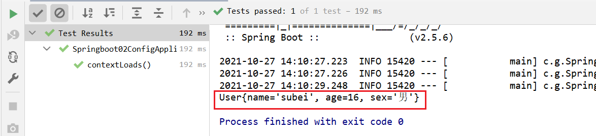

> 对比小结

- @Value这个使用起来并不友好！我们需要为每个属性单独注解赋值，比较麻烦；我们来看个功能对比图：

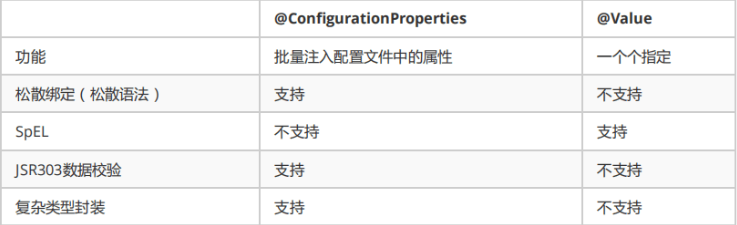

1. @ConfigurationProperties只需要写一次即可，@Value则需要每个字段都添加；
2. 松散绑定：这个什么意思呢? 比如我的yml中写的last-name，这个和lastName是一样的，`-`后面跟着的字母默认是大写的。这就是松散绑定。可以测试一下！
3. JSR303数据校验，这个就是我们可以在字段是增加一层过滤器验证，可以保证数据的合法性；
4. 复杂类型封装，yml中可以封装对象，使用value就不支持。

**结论**：

- 配置yml和配置properties都可以获取到值，强烈推荐yml；
- 如果我们在某个业务中，只需要获取配置文件中的某个值，可以使用一下@value； 
- 如果说，我们专门编写了一个JavaBean来和配置文件进行一一映射，就直接@configurationProperties，不要犹豫！

----

## 7.JSR303数据校验

- 在pom.xml中添加

```xml
<dependency>
    <groupId>org.springframework.boot</groupId>
    <artifactId>spring-boot-starter-validation</artifactId>
    <version>2.5.6</version>
</dependency>
```

- Springboot中可以用@validated来校验数据，如果数据异常则会统一抛出异常，方便异常中心统一处理。先写个注解让name只能支持Email格式；

```java
@Component
@ConfigurationProperties(prefix = "person")
@Validated  // 数据校验
public class Person {
    // name必须是邮箱格式
    @Email(message="邮箱格式错误")
    private String name;
    ......
}
```

- 运行结果：default message [name]；


- 使用数据校验，可以保证数据的正确性； 下面列出一些常见的使用：

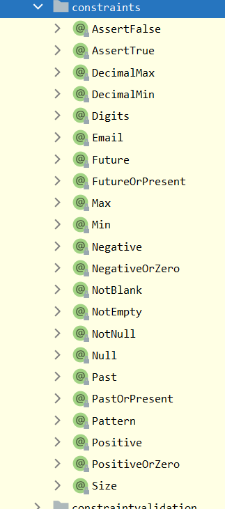

```properties
@NotNull(message="名字不能为空")
private String userName;
@Max(value=120,message="年龄最大不能查过120")
private int age;
@Email(message="邮箱格式错误")

// 空检查
@Null 验证对象是否为null
@NotNull 验证对象是否不为null, 无法查检长度为0的字符串
@NotBlank 检查约束字符串是不是Null还有被Trim的长度是否大于0,只对字符串,且会去掉前后空格.
@NotEmpty 检查约束元素是否为NULL或者是EMPTY.

// Booelan检查
@AssertTrue 验证 Boolean 对象是否为 true
@AssertFalse 验证 Boolean 对象是否为 false

// 长度检查
@Size(min=, max=) 验证对象（Array,Collection,Map,String）长度是否在给定的范围之内
@Length(min=, max=) string is between min and max included.

// 日期检查
@Past 验证 Date 和 Calendar 对象是否在当前时间之前
@Future 验证 Date 和 Calendar 对象是否在当前时间之后
@Pattern 验证 String 对象是否符合正则表达式的规则

.......等等
除此以外，我们还可以自定义一些数据校验规则
```

## 8.多环境配置及配置文件位置

- profile是Spring对不同环境提供不同配置功能的支持，可以通过激活不同的环境版本，实现快速切换环境；

> 多配置文件

- 在主配置文件编写的时候，文件名可以是 application-{profile}.properties/yml , 用来指定多个环境版本； 
- 例如：
  - application-test.properties 代表测试环境配置；
  - application-dev.properties 代表开发环境配置；
- 但是Springboot并不会直接启动这些配置文件，它默认使用application.properties主配置文件； 我们需要通过一个配置来选择需要激活的环境：

```properties
# 比如在配置文件中指定使用dev环境，我们可以通过设置不同的端口号进行测试；
# 我们启动SpringBoot，就可以看到已经切换到dev下的配置了；
spring.profiles.active=dev
```

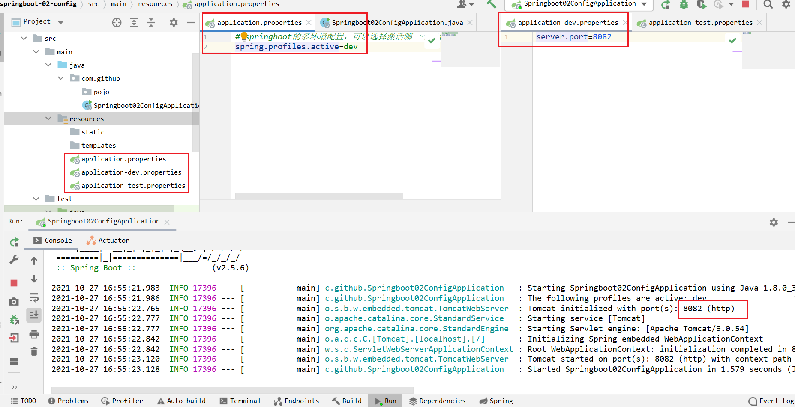

> yml的多文档块

- 和properties配置文件中一样，但是使用yml去实现不需要创建多个配置文件，更方便 !

```yaml
server:
  port: 8081

# 选择要激活那个环境块
spring:
  profiles:
    active: dev

---
server:
  port: 8082
spring:
  profiles: dev # 配置环境的名称

---
server:
  port: 8083
spring:
  profiles: test # 配置环境的名称
```

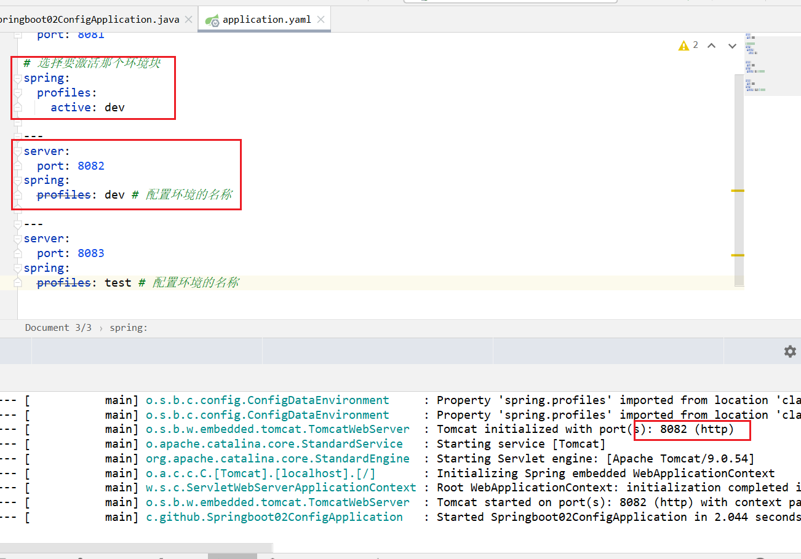

- 注意：如果yml和properties同时都配置了端口，并且没有激活其他环境 ， 默认会使用properties配置文件的！

> 配置文件加载位置

- [官方外部配置文档参考](https://docs.spring.io/spring-boot/docs/2.2.5.RELEASE/reference/htmlsingle/#boot-features-external-config-command-line-args)
- springboot 启动会扫描以下位置的application.properties或者application.yml文件作为Spring boot的 默认配置文件。

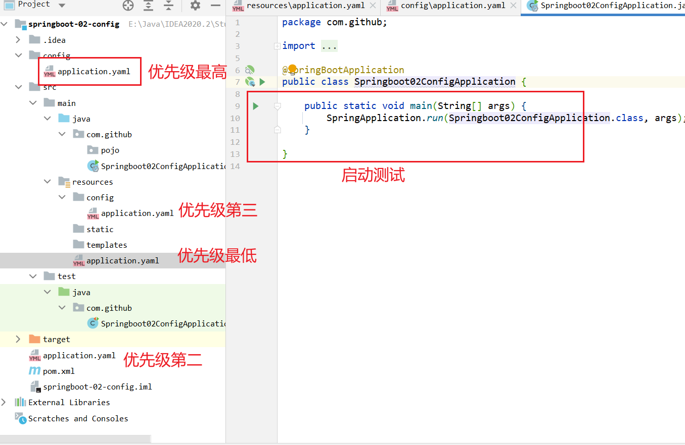

```xml
优先级1：项目路径下的config文件夹配置文件
优先级2：项目路径下配置文件
优先级3：资源路径下的config文件夹配置文件
优先级4：资源路径下配置文件
```

- SpringBoot会从这四个位置全部加载主配置文件；互补配置； 
- 我们在最低级的配置文件中设置一个项目访问路径的配置来测试互补问题；

```properties
# 配置项目的访问路径
server.servlet.context-path=/github
```

> 指定位置加载配置文件

- 可以通过spring.config.location来改变默认的配置文件位置；
- 项目打包好以后，我们可以使用命令行参数的形式，启动项目的时候来指定配置文件的新位置；这种情况，一般是后期运维做的多，相同配置，外部指定的配置文件优先级最高。

```properties
java -jar spring-boot-config.jar --
spring.config.location=F:/application.properties
```


## 9.自动配置原理再理解

- [spring boot官方文档](https://docs.spring.io/spring-boot/docs/2.5.6/reference/htmlsingle/#application-properties)

> 分析自动配置原理

- 以HttpEncodingAutoConfiguration（Http编码自动配置）为例解释自动配置原理。

```java
// 表示这是一个配置类，和以前编写的配置文件一样，也可以给容器中添加组件；
@Configuration
// 启动指定类的ConfigurationProperties功能；
// 进入这个HttpProperties查看，将配置文件中对应的值和HttpProperties绑定起来；
// 并把HttpProperties加入到ioc容器中
@EnableConfigurationProperties({HttpProperties.class})
// Spring底层@Conditional注解
// 根据不同的条件判断，如果满足指定的条件，整个配置类里面的配置就会生效；
// 这里的意思就是判断当前应用是否是web应用，如果是，当前配置类生效
@ConditionalOnWebApplication(
    type = Type.SERVLET
)
// 判断当前项目有没有这个类CharacterEncodingFilter；SpringMVC中进行乱码解决的过滤器；
@ConditionalOnClass({CharacterEncodingFilter.class})
// 判断配置文件中是否存在某个配置：spring.http.encoding.enabled；
// 如果不存在，判断也是成立的
// 即使我们配置文件中不配置pring.http.encoding.enabled=true，也是默认生效的；
@ConditionalOnProperty(
    prefix = "spring.http.encoding",
    value = {"enabled"},
    matchIfMissing = true
)
public class HttpEncodingAutoConfiguration {
    // 他已经和SpringBoot的配置文件映射了
    private final Encoding properties;
    // 只有一个有参构造器的情况下，参数的值就会从容器中拿
    public HttpEncodingAutoConfiguration(HttpProperties properties) {
        this.properties = properties.getEncoding();
    }
    // 给容器中添加一个组件，这个组件的某些值需要从properties中获取
    @Bean
    @ConditionalOnMissingBean // 判断容器没有这个组件？
    public CharacterEncodingFilter characterEncodingFilter() {
        CharacterEncodingFilter filter = new
            OrderedCharacterEncodingFilter();
        filter.setEncoding(this.properties.getCharset().name());
        filter.setForceRequestEncoding(this.properties.shouldForce(org.springframew
                                                                   ork.boot.autoconfigure.http.HttpProperties.Encoding.Type.REQUEST));
        filter.setForceResponseEncoding(this.properties.shouldForce(org.springframe
                                                                    work.boot.autoconfigure.http.HttpProperties.Encoding.Type.RESPONSE));
        return filter;
    }
    // 。。。。。。。
}
```

> 总结 ： ==根据当前不同的条件判断，决定这个配置类是否生效==！

- 一但这个配置类生效；这个配置类就会给容器中添加各种组件； 
- 这些组件的属性是从对应的properties类中获取的，这些类里面的每一个属性又是和配置文件绑定的；
- 所有在配置文件中能配置的属性都是在xxxxProperties类中封装着； 
- 配置文件能配置什么就可以参照某个功能对应的这个属性类

```java
// 从配置文件中获取指定的值和bean的属性进行绑定
@ConfigurationProperties(prefix = "spring.http")
public class HttpProperties {
	// .....
}
```

- 去配置文件里面试试前缀，看提示！

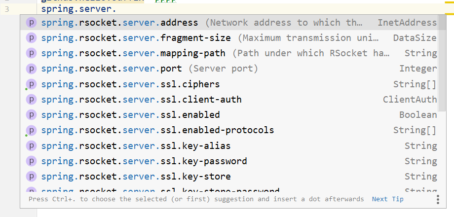

> 要点：

1. SpringBoot启动会加载大量的自动配置类。

2. 我们看我们需要的功能有没有在SpringBoot默认写好的自动配置类当中；
3. 我们再来看这个自动配置类中到底配置了哪些组件；（只要我们要用的组件存在在其中，我们就不需要再手动配置了）。
4. 给容器中自动配置类添加组件的时候，会从properties类中获取某些属性。我们只需要在配置文件中指定这些属性的值即可；
   1. xxxxAutoConfigurartion：自动配置类；给容器中添加组件；
   2. xxxxProperties:封装配置文件中相关属性。

> 了解：@Conditional
>
> - 关注一个细节问题：自动配置类必须在一定的条件下才能生效。
> - @Conditional派生注解（Spring注解版原生的@Conditional作用） 
> - 作用：必须是@Conditional指定的条件成立，才给容器中添加组件，配置配里面的所有内容才生效；

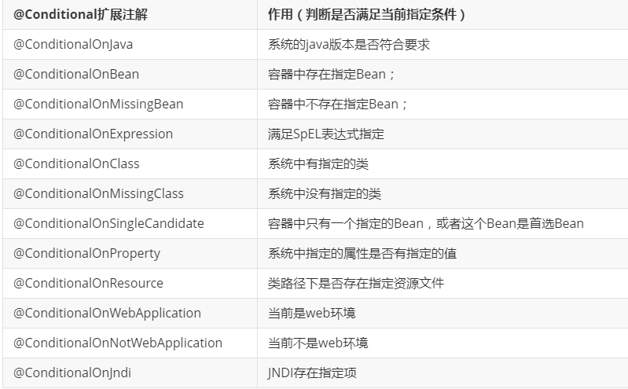

- 那么多的自动配置类，必须在一定的条件下才能生效；也就是说，加载了这么多的配置类，但不是所有的都生效了。
- 如何知道哪些自动配置类生效？
- 可以通过启用debug=true属性；来让控制台打印自动配置报告，这样就可以很方便的知道哪些自动配置类生效。

```properties
# 开启springboot的调试类
debug=true
```

- Positive matches:（自动配置类启用的：正匹配）; 
- Negative matches:（没有启动，没有匹配成功的自动配置类：负匹配）; 
- Unconditional classes:（没有条件的类）;

## 10.自定义starter

- 尝试自定义一个启动器。

> 说明

- 启动器模块是一个空jar文件，仅提供辅助性依赖管理，这些依赖可能用于自动装配或者其他类库。

> 命名归约： 

- 官方命名： 
  - 前缀： spring-boot-starter-xxx 
  - 比如：spring-boot-starter-web.... 
- 自定义命名： 
  - xxx-spring-boot-starter 
  - 比如：mybatis-spring-boot-starter

> 编写启动器

1. 在IDEA中新建一个空项目 spring-boot-starter-diy 
2. 新建一个普通Maven模块：spring-boot-starter

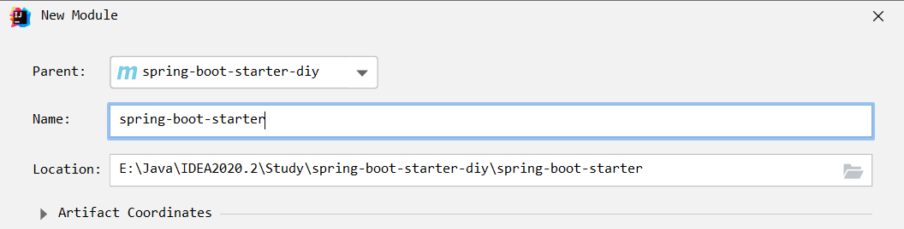

3. 新建一个Springboot模块：spring-boot-starter-autoconfigure

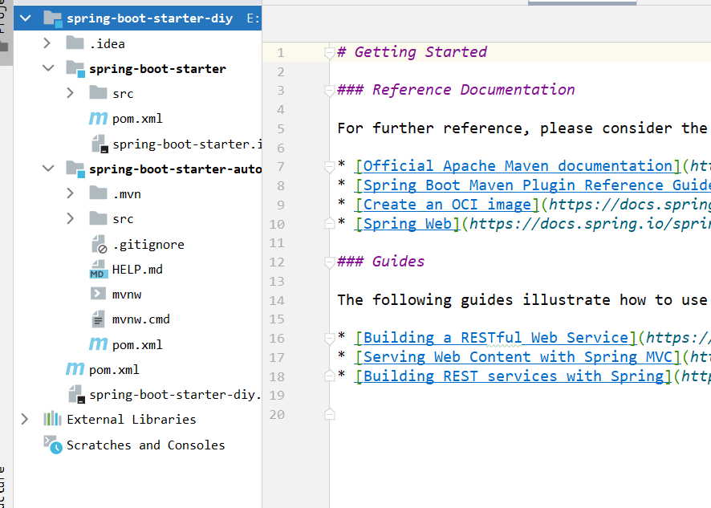

4. 在 starter 中 导入 autoconfigure 的依赖！spring-boot-starter无需编写什么代码，只需让该工程引入hello-spring-boot-starter-autoconfigure依赖：

```XML
<?xml version="1.0" encoding="UTF-8"?>
<project xmlns="http://maven.apache.org/POM/4.0.0"
         xmlns:xsi="http://www.w3.org/2001/XMLSchema-instance"
         xsi:schemaLocation="http://maven.apache.org/POM/4.0.0 http://maven.apache.org/xsd/maven-4.0.0.xsd">
    <modelVersion>4.0.0</modelVersion>

    <groupId>org.example</groupId>
    <artifactId>spring-boot-starter</artifactId>
    <version>1.0-SNAPSHOT</version>

    <properties>
        <maven.compiler.source>8</maven.compiler.source>
        <maven.compiler.target>8</maven.compiler.target>
    </properties>

    <dependencies>
        <!--引入自动配制包-->
        <dependency>
            <groupId>com.github</groupId>
            <artifactId>spring-boot-starter-autoconfigure</artifactId>
            <version>0.0.1-SNAPSHOT</version>
        </dependency>
    </dependencies>

</project>
```

- `spring-boot-starter-autoconfigure `的pom.xml如下：

```xml
<?xml version="1.0" encoding="UTF-8"?>
<project xmlns="http://maven.apache.org/POM/4.0.0" xmlns:xsi="http://www.w3.org/2001/XMLSchema-instance"
         xsi:schemaLocation="http://maven.apache.org/POM/4.0.0 https://maven.apache.org/xsd/maven-4.0.0.xsd">
    <modelVersion>4.0.0</modelVersion>
    <parent>
        <groupId>org.springframework.boot</groupId>
        <artifactId>spring-boot-starter-parent</artifactId>
        <version>2.5.6</version>
        <relativePath/> <!-- lookup parent from repository -->
    </parent>
    <groupId>com.github</groupId>
    <artifactId>spring-boot-starter-autoconfigure</artifactId>
    <version>0.0.1-SNAPSHOT</version>
    <name>spring-boot-starter-autoconfigure</name>
    <description>spring-boot-starter-autoconfigure</description>
    <properties>
        <java.version>1.8</java.version>
    </properties>

    <dependencies>
        <dependency>
            <groupId>org.springframework.boot</groupId>
            <artifactId>spring-boot-starter</artifactId>
        </dependency>
    </dependencies>

</project>
```

5. ==将autoconfigure项目下多余的文件都删掉，pom中只留下一个starter==，这是所有的启动器基本配置。

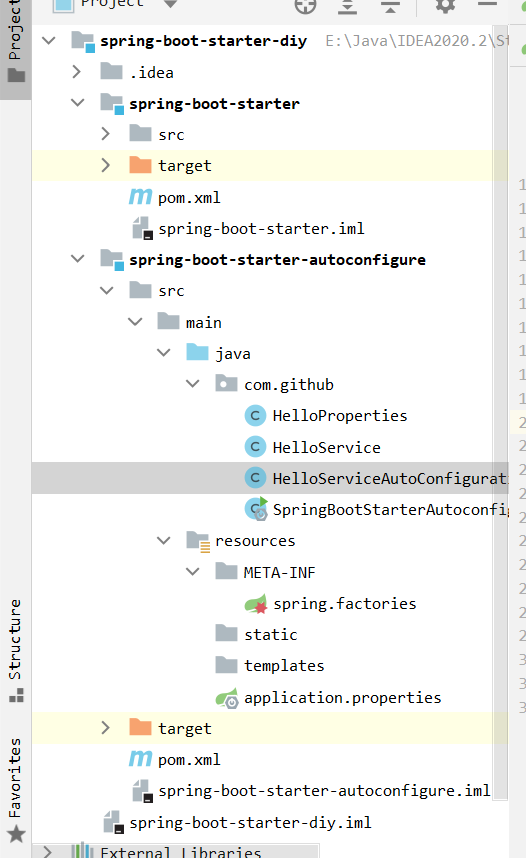

6. 编写一个个人的服务

```java
package com.github;

public class HelloService {

    HelloProperties helloProperties;

    public HelloProperties getHelloProperties() {
        return helloProperties;
    }

    public void setHelloProperties(HelloProperties helloProperties) {
        this.helloProperties = helloProperties;
    }

    public String sayHello(String name){
        return helloProperties.getPrefix() + name +
                helloProperties.getSuffix();
    }
}
```

7. 编写HelloProperties 配置类

```java
package com.github;

import org.springframework.boot.context.properties.ConfigurationProperties;

@ConfigurationProperties(prefix = "github.hello")
public class HelloProperties {
    private String prefix;
    private String suffix;

    public String getPrefix() {
        return prefix;
    }

    public void setPrefix(String prefix) {
        this.prefix = prefix;
    }

    public String getSuffix() {
        return suffix;
    }

    public void setSuffix(String suffix) {
        this.suffix = suffix;
    }
}
```

8. 编写自动配置类并注入bean，测试！

```java
package com.github;

import org.springframework.beans.factory.annotation.Autowired;
import org.springframework.boot.autoconfigure.condition.ConditionalOnMissingBean;
import org.springframework.boot.autoconfigure.condition.ConditionalOnWebApplication;
import org.springframework.boot.context.properties.EnableConfigurationProperties;
import org.springframework.context.annotation.Bean;
import org.springframework.context.annotation.Configuration;

/**
 * 自动配制类

 */

@Configuration
/**
 * EnableConfigurationProperties的作用
 * 1、开启HelloProperties配置绑定功能
 * 2、把这个HelloProperties这个组件自动注册到容器中
 */
@ConditionalOnWebApplication //web应用生效
@EnableConfigurationProperties(HelloProperties.class)
public class HelloServiceAutoConfiguration {
    @Autowired
    HelloProperties helloProperties;

    @Bean // @Bean 用在方法上，告诉Spring容器，你可以从下面这个方法中拿到一个Bean
    public HelloService helloService(){
        HelloService service = new HelloService();
        service.setHelloProperties(helloProperties);
        return service;
    }

}
```

9. 在resources编写一个自己的 META-INF\spring.factories

```properties
# Auto Configure
org.springframework.boot.autoconfigure.EnableAutoConfiguration=\
com.github.HelloServiceAutoConfiguration
```

10. 安装到maven仓库中！

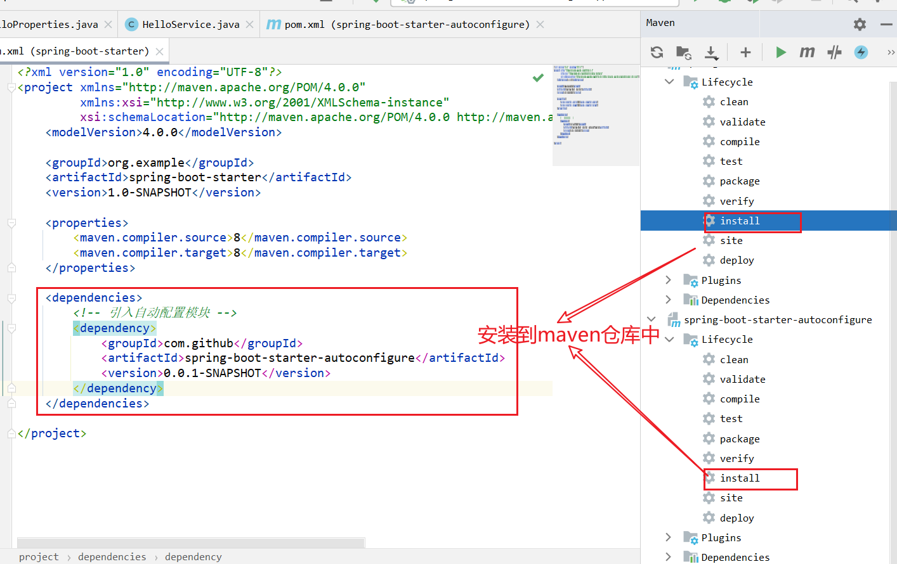

> 新建项目测试我们自己的写的启动器

1. 新建一个SpringBoot 项目。

2. 导入我们自己写的启动器。

```xml
<!--引入自动配制包-->
<dependency>
    <groupId>com.github</groupId>
    <artifactId>spring-boot-starter-autoconfigure</artifactId>
    <version>0.0.1-SNAPSHOT</version>
</dependency>
```

3. 编写一个 HelloController 进行测试自己的写的接口！

```java
@RestController
public class HelloController {
    @Autowired
    HelloService helloService;

    @RequestMapping("/hello")
    public String hello(){
        return helloService.sayHello("whh");
    }

}
```

4. 编写配置文件 application.properties

```properties
github.hello.prefix="qqqq"
github.hello.suffix="pppp"
```

5. 启动项目进行测试 !

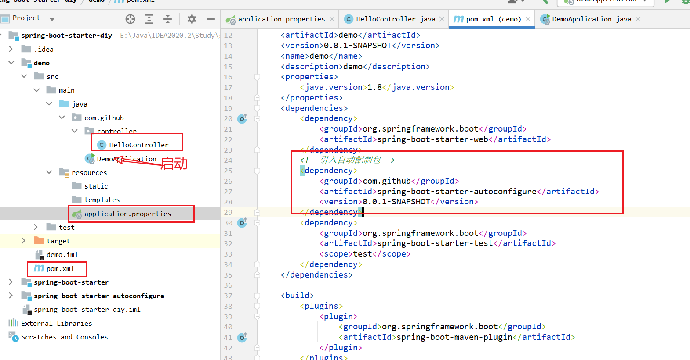

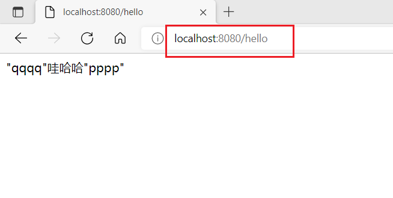

> 下一篇：SpringBoot开发单体应用


