# SpringBoot操作数据库

## 1.整合JDBC

> SpringData简介

- 对于数据访问层，无论是 SQL(关系型数据库) 还是 NOSQL(非关系型数据库)，Spring Boot 底层都是采用 Spring Data 的方式进行统一处理。

- Spring Boot 底层都是采用 Spring Data 的方式进行统一处理各种数据库，Spring Data 也是 Spring 中与 Spring Boot、Spring Cloud 等齐名的知名项目。

- Sping Data 官网：https://spring.io/projects/spring-data

- 数据库相关的启动器 ：[弹簧启动参考文档 (spring.io)](https://docs.spring.io/spring-boot/docs/2.6.3/reference/htmlsingle/#using.build-systems.starters)

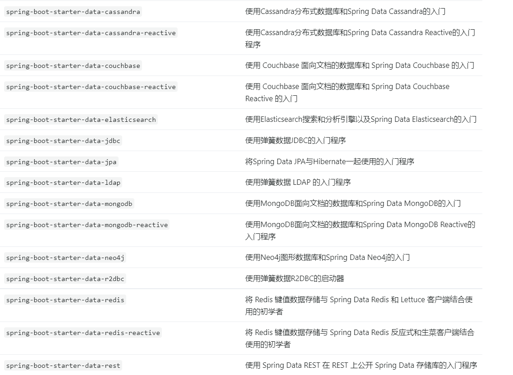

> 整合JDBC

1. 导入测试数据库

```mysql
CREATE DATABASE /*!32312 IF NOT EXISTS*/`springboot` /*!40100 DEFAULT
CHARACTER SET utf8 */;

USE `springboot`;

/*Table structure for table `department` */
DROP TABLE IF EXISTS `department`;

CREATE TABLE `department` (
`id` int(3) NOT NULL AUTO_INCREMENT COMMENT '部门id',
`department_name` varchar(20) NOT NULL COMMENT '部门名字',
PRIMARY KEY (`id`)
) ENGINE=InnoDB AUTO_INCREMENT=106 DEFAULT CHARSET=utf8;
/*Data for the table `department` */

insert into `department`(`id`,`department_name`) values (101,'技术部'),
(102,'销售部'),(103,'售后部'),(104,'后勤部'),(105,'运营部');

/*Table structure for table `employee` */
DROP TABLE IF EXISTS `employee`;

CREATE TABLE `employee` (
`id` int(5) NOT NULL AUTO_INCREMENT COMMENT '雇员id',
`last_name` varchar(100) NOT NULL COMMENT '名字',
`email` varchar(100) NOT NULL COMMENT '邮箱',
`gender` int(2) NOT NULL COMMENT '性别1 男, 0 女',
`department` int(3) NOT NULL COMMENT '部门id',
`birth` datetime NOT NULL COMMENT '生日',
PRIMARY KEY (`id`)
) ENGINE=InnoDB AUTO_INCREMENT=1006 DEFAULT CHARSET=utf8;
/*Data for the table `employee` */

insert into
`employee`(`id`,`last_name`,`email`,`gender`,`department`,`birth`) values
(1001,'张三','243357594@qq.com',1,101,'2021-03-06 15:04:33'),(1002,'李
四','243357594@qq.com',1,102,'2021-03-06 15:04:36'),(1003,'王
五','243357594@qq.com',0,103,'2021-03-06 15:04:37'),(1004,'赵
六','243357594@qq.com',1,104,'2021-03-06 15:04:39'),(1005,'孙
七','243357594@qq.com',0,105,'2021-03-06 15:04:45');
```

2. 新建一个项目测试：springboot-data-jdbc; 引入相应的模块！基础模块

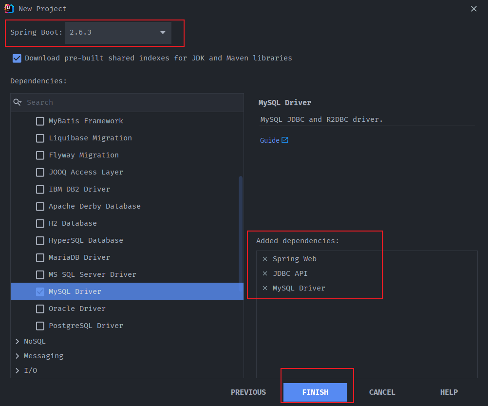

3. 项目建好之后，发现自动帮我们导入了如下的启动器：

```xml
<dependency>
    <groupId>org.springframework.boot</groupId>
    <artifactId>spring-boot-starter-jdbc</artifactId>
</dependency>
<dependency>
    <groupId>mysql</groupId>
    <artifactId>mysql-connector-java</artifactId>
    <scope>runtime</scope>
</dependency>
```

4. 编写yaml配置文件连接数据库；

```yaml
spring: 
  datasource:
    username: root
    password: root
    # ?serverTimezone=UTC解决时区的报错
    url: jdbc:mysql://localhost:3306/springboot?serverTimezone=UTC&useUnicode=true&characterEncoding=utf-8
    driver-class-name: com.mysql.cj.jdbc.Driver
```

5. 配置完这一些东西后，就可以直接去使用了！因为SpringBoot已经默认帮我们进行了自动配置；去测试类测试一下：

```java
@SpringBootTest
class Springboot05JdbcApplicationTests {
    // DI注入数据源
    @Autowired
    DataSource dataSource;
    
    @Test
    void contextLoads() throws SQLException {
        // 查看默认数据源
        System.out.println(dataSource.getClass());
        // 获得连接
        Connection connection = dataSource.getConnection();
        System.out.println(connection);
        // 关闭连接
        connection.close();
    }

}
```

- 结果：可以看到他默认给我们配置的数据源为: class com.zaxxer.hikari.HikariDataSource，我们并没有手动配置。

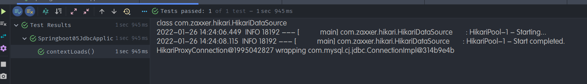

- 来全局搜索一下，找到数据源的所有自动配置都在：DataSourceAutoConfiguration文件：

```java
@Import({Hikari.class, Tomcat.class, Dbcp2.class, OracleUcp.class, Generic.class, DataSourceJmxConfiguration.class})
protected static class PooledDataSourceConfiguration {
    protected PooledDataSourceConfiguration() {
    }
}
```

- 这里导入的类都在 DataSourceConfiguration 配置类下，可以看出 Spring Boot 2.6.3默认使用 HikariDataSource 数据源，而以前版本，如 Spring Boot 1.5默认使用 org.apache.tomcat.jdbc.pool.DataSource 作为数据源； 
- ==HikariDataSource 号称 Java WEB 当前速度最快的数据源，相比于传统的 C3P0 、DBCP、Tomcat jdbc 等连接池更加优秀==；
- **可以使用 spring.datasource.type 指定自定义的数据源类型，值为要使用的连接池实现的完全限定名**。
- 关于数据源不做过多介绍，有了数据库连接，显然就可以CRUD操作数据库了。但是仍需要先了解一个对象——`JdbcTemplate`。

> JdbcTemplate

1. 有了数据源(com.zaxxer.hikari.HikariDataSource)，然后可以拿到数据库连接 (java.sql.Connection)，有了连接，就可以使用原生的 JDBC 语句来操作数据库； 
2. 即使不使用第三方第数据库操作框架，如 MyBatis等，Spring 本身也对原生的JDBC 做了轻量级的封装，即`JdbcTemplate`。 
3. 数据库操作的所有 CRUD 方法都在 JdbcTemplate 中。 
4. Spring Boot不仅提供了默认的数据源，同时默认已经配置好了 JdbcTemplate 放在了容器中，程序员只需自己注入即可使用。
5. JdbcTemplate 的自动配置是依赖 org.springframework.boot.autoconfigure.jdbc 包下的JdbcTemplateConfiguration类。

**JdbcTemplate主要提供以下几类方法**： 

- execute方法：可以用于执行任何SQL语句，一般用于执行DDL语句； 
- update方法及batchUpdate方法：update方法用于执行新增、修改、删除等语句；batchUpdate 方法用于执行批处理相关语句； 
- query方法及queryForXXX方法：用于执行查询相关语句； 
- call方法：用于执行存储过程、函数相关语句。

> 测试案例

- 编写一个Controller，注入jdbcTemplate，编写测试方法进行访问测试；

```java
package com.github.controller;

import org.springframework.beans.factory.annotation.Autowired;
import org.springframework.jdbc.core.JdbcTemplate;
import org.springframework.web.bind.annotation.GetMapping;
import org.springframework.web.bind.annotation.PathVariable;
import org.springframework.web.bind.annotation.RequestMapping;
import org.springframework.web.bind.annotation.RestController;

import java.util.Date;
import java.util.List;
import java.util.Map;

@RestController
@RequestMapping("/jdbc")
public class JdbcController {
    /**
     *  Spring Boot 默认提供了数据源，默认提供了 org.springframework.jdbc.core.JdbcTemplate
     *  JdbcTemplate 中会自己注入数据源，用于简化 JDBC操作
     *  还能避免一些常见的错误,使用起来也不用再自己来关闭数据库连接
     */
    @Autowired
    JdbcTemplate jdbcTemplate;

    /**
     *     查询employee表中所有数据
     *     List 中的1个 Map 对应数据库的 1行数据
     *     Map 中的 key 对应数据库的字段名，value 对应数据库的字段值
     */
    @GetMapping("/list")
    public List<Map<String, Object>> userList(){
        String sql = "select * from employee";
        List<Map<String, Object>> maps = jdbcTemplate.queryForList(sql);
        return maps;
    }

    /**
     * 新增一个用户
     */
    @GetMapping("/add")
    public String addUser(){
        // 插入语句，注意时间问题
        String sql = "insert into employee(last_name, email,gender,department,birth)" +
                " values ('夸克','243357594@qq.com',1,101,'"+ new Date().toLocaleString() +"')";
        jdbcTemplate.update(sql);
        // 查询
        return "addOk";
    }

    /**
     * 修改用户信息
     */
    @GetMapping("/update/{id}")
    public String updateUser(@PathVariable("id") int id){
        // 插入语句
        String sql = "update employee set last_name=?,email=? where id="+id;
        // 数据
        Object[] objects = new Object[2];
        objects[0] = "subei";
        objects[1] = "243357594@163.com";
        jdbcTemplate.update(sql,objects);
        // 查询
        return "updateOk";
    }

    /**
     * 删除用户
     */
    @GetMapping("/delete/{id}")
    public String delUser(@PathVariable("id") int id){
        // 删除语句
        String sql = "delete from employee where id=?";
        jdbcTemplate.update(sql,id);
        // 查询
        return "deleteOk";
    }
}
```

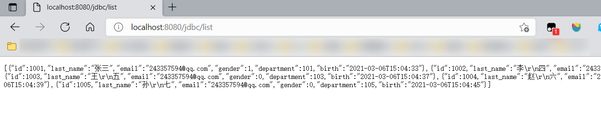

> 至此，CURD的基本操作，使用 JDBC 就搞定了。

## 2.整合Druid

> Druid 简介

- Java程序很大一部分要操作数据库，为了提高性能操作数据库的时候，又不得不使用数据库连接池。 
- Druid是阿里巴巴开源平台上一个数据库连接池实现，结合了 C3P0、DBCP 等DB池的优点，同时加入了日志监控。 
- Druid可以很好的监控 DB 池连接和 SQL 的执行情况，天生就是针对监控而生的DB连接池。 
- Spring Boot 2.0 以上默认使用Hikari数据源，可以说Hikari与Driud都是当前Java Web上最优秀的数据源，我们来重点介绍Spring Boot如何集成Druid数据源，如何实现数据库监控。 
- Github地址：https://github.com/alibaba/druid

> com.alibaba.druid.pool.DruidDataSource 基本配置参数如下：

| 配置                          | 缺省值             | 说明                                                         |
| ----------------------------- | ------------------ | ------------------------------------------------------------ |
| name                          |                    | 配置这个属性的意义在于，如果存在多个数据源，监控的时候可以通过名字来区分开来。如果没有配置，将会生成一个名字，格式是："DataSource-" + System.identityHashCode(this). |
| url                           |                    | 连接数据库的url，不同数据库不一样。例如： mysql: jdbc:mysql://10.20.153.104:3306/druid2 oracle: jdbc:oracle:thin:@10.20.149.85:1521:ocnauto |
| username                      |                    | 连接数据库的用户名                                           |
| password                      |                    | 连接数据库的密码。如果你不希望密码直接写在配置文件中，可以使用ConfigFilter。 |
| driverClassName               | 根据url自动识别    | 这一项可配可不配，如果不配置druid会根据url自动识别dbType，然后选择相应的driverClassName |
| initalSize                    | 0                  | 初始化时建立物理连接的个数。初始化发生在显示调用init方法，或者第一次getConnection时 |
| maxActive                     | 8                  | 最大连接池数量                                               |
| maxIdle                       | 8                  | ==已经不再使用，配置了也没效果==                             |
| minIdle                       |                    | 最小连接池数量                                               |
| maxWait                       |                    | 获取连接时最大等待时间，单位毫秒。配置了maxWait之后，缺省启用公平锁，并发效率会有所下降，如果需要可以通过配置useUnfairLock属性为true使用非公平锁。 |
| poolPreparedStatements        | false              | 是否缓存preparedStatement，也就是PSCache。PSCache对支持游标的数据库性能提升巨大，比如说oracle。在mysql下建议关闭。 |
| maxOpenPreparedStatements     | -1                 | 要启用PSCache，必须配置大于0，当大于0时，poolPreparedStatements自动触发修改为true。在Druid中，不会存在Oracle下PSCache占用内存过多的问题，可以把这个数值配置大一些，比如说100 |
| validationQuery               |                    | 用来检测连接是否有效的sql，要求是一个查询语句。如果validationQuery为null，testOnBorrow、testOnReturn、testWhileIdle都不会其作用。 |
| validationQueryTimeout        |                    | 单位：秒，检测连接是否有效的超时时间。底层调用jdbc Statement对象的void setQueryTimeout(int seconds)方法。 |
| testOnBorrow                  | true               | 申请连接时执行validationQuery检测连接是否有效，做了这个配置会降低性能。 |
| testOnReturn                  | false              | 归还连接时执行validationQuery检测连接是否有效，做了这个配置会降低性能 |
| testWhileIdle                 | false              | 建议配置为true，不影响性能，并且保证安全性。申请连接的时候检测，如果空闲时间大于timeBetweenEvictionRunsMillis，执行validationQuery检测连接是否有效。 |
| timeBetweenEvictionRunsMillis | 1分钟 （1.0.14）   | 有两个含义： 1) Destroy线程会检测连接的间隔时间，如果连接空闲时间大于等于minEvictableIdleTimeMillis则关闭物理连接 2) testWhileIdle的判断依据，详细看testWhileIdle属性的说明。 |
| numTestsPerEvictionRun        |                    | 不再使用，一个DruidDataSource只支持一个EvictionRun           |
| numTestsPerEvictionRun        | 30分钟 （1.0.14）  | 连接保持空闲而不被驱逐的最长时间                             |
| connectionInitSqls            |                    | 物理连接初始化的时候执行的sql                                |
| exceptionSorter               | 根据dbType自动识别 | 当数据库抛出一些不可恢复的异常时，抛弃连接                   |
| filters                       |                    | 属性类型是字符串，通过别名的方式配置扩展插件，常用 的插件有：监控统计用的filter:stat 日志用的filter:log4j 防御sql注入的filter:wall |
| proxyFilters                  |                    | 类型是List，如果同时配置了filters和proxyFilters，是组合关系，并非替换关系 |

> 配置数据源

1. 添加上Druid数据源依赖。

```xml
<!-- https://mvnrepository.com/artifact/com.alibaba/druid -->
<dependency>
    <groupId>com.alibaba</groupId>
    <artifactId>druid</artifactId>
    <version>1.1.21</version>
</dependency>
```

2. 切换数据源；之前已经说过 Spring Boot 2.0 以上默认使用com.zaxxer.hikari.HikariDataSource数据源，但可以通过spring.datasource.type指定数据源。

```yaml
spring:
  datasource:
    username: root
    password: root
    # ?serverTimezone=UTC解决时区的报错
    url: jdbc:mysql://localhost:3306/springboot?serverTimezone=UTC&useUnicode=true&characterEncoding=utf-8
    driver-class-name: com.mysql.cj.jdbc.Driver
    type: com.alibaba.druid.pool.DruidDataSource # 自定义数据源
```

3. 数据源切换之后，在测试类中注入DataSource，然后获取到它，输出一看便知是否成功切换；

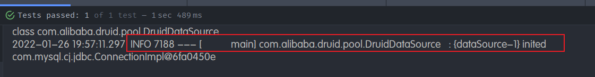

4. 切换成功！既然切换成功，就可以设置数据源连接初始化大小、最大连接数、等待时间、最小连接数 等设置项；可以查看源码。

```yaml
spring:
  datasource:
    username: root
    password: root
    # ?serverTimezone=UTC解决时区的报错
    url: jdbc:mysql://localhost:3306/springboot?serverTimezone=UTC&useUnicode=true&characterEncoding=utf-8
    driver-class-name: com.mysql.cj.jdbc.Driver
    type: com.alibaba.druid.pool.DruidDataSource # 自定义数据源

    #Spring Boot 默认是不注入这些属性值的，需要自己绑定
    #druid 数据源专有配置
    initialSize: 5
    minIdle: 5
    maxActive: 20
    maxWait: 60000
    timeBetweenEvictionRunsMillis: 60000
    minEvictableIdleTimeMillis: 300000
    validationQuery: SELECT 1 FROM DUAL
    testWhileIdle: true
    testOnBorrow: false
    testOnReturn: false
    poolPreparedStatements: true
    #配置监控统计拦截的filters，stat:监控统计、log4j：日志记录、wall：防御sql注入
    #如果允许时报错 java.lang.ClassNotFoundException: org.apache.log4j.Priority
      #则导入 log4j 依赖即可，Maven 地址：https://mvnrepository.com/artifact/log4j/log4j
    filters: stat,wall,log4j
    maxPoolPreparedStatementPerConnectionSize: 20
    useGlobalDataSourceStat: true
    connectionProperties: druid.stat.mergeSql=true;druid.stat.slowSqlMillis=500
```

5. 导入Log4j的依赖

```xml
<!-- https://mvnrepository.com/artifact/log4j/log4j -->
<dependency>
    <groupId>log4j</groupId>
    <artifactId>log4j</artifactId>
    <version>1.2.17</version>
</dependency>
```

6. 为DruidDataSource 绑定全局配置文件中的参数，再添加到容器中，而不再使用Spring Boot的自动生成了；需要自己添加DruidDataSource组件到容器中，并绑定属性；

```java
package com.github.controller;

import com.alibaba.druid.pool.DruidDataSource;
import org.springframework.boot.context.properties.ConfigurationProperties;
import org.springframework.context.annotation.Bean;
import org.springframework.context.annotation.Configuration;

import javax.sql.DataSource;

@Configuration
public class DruidConfig {

    /**
     *   将自定义的 Druid数据源添加到容器中，不再让 Spring Boot 自动创建
     *   绑定全局配置文件中的 druid 数据源属性到 com.alibaba.druid.pool.DruidDataSource从而让它们生效
     *   @ConfigurationProperties(prefix = "spring.datasource")：作用就是将 全局配置文件中
     *   前缀为 spring.datasource的属性值注入到 com.alibaba.druid.pool.DruidDataSource 的同名参数中
     */
    @ConfigurationProperties(prefix = "spring.datasource")
    @Bean
    public DataSource druidDataSource() {
        return new DruidDataSource();
    }

}
```

7. 去测试类中测试一下；看是否成功！

```java
@SpringBootTest
class SpringbootDataJdbcApplicationTests {
    // DI注入数据源
    @Autowired
    DataSource dataSource;

    @Test
    public void contextLoads() throws SQLException {
        // 查看默认数据源
        System.out.println(dataSource.getClass());
        // 获得连接
        Connection connection =   dataSource.getConnection();
        System.out.println(connection);

        DruidDataSource druidDataSource = (DruidDataSource) dataSource;
        System.out.println("druidDataSource 数据源最大连接数：" + druidDataSource.getMaxActive());
        System.out.println("druidDataSource 数据源初始化连接数：" + druidDataSource.getInitialSize());

        // 关闭连接
        connection.close();
    }
}
```

- 输出结果：可见配置参数已经生效！

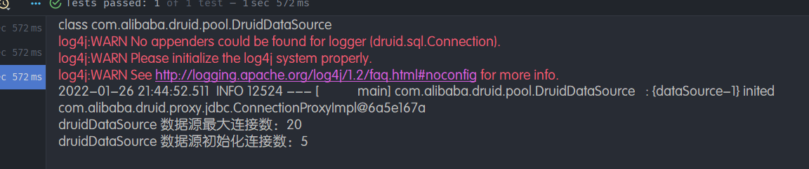

> 配置 Druid 数据源监控

- Druid 数据源具有监控的功能，并提供了一个web界面方便用户查看，类似安装路由器时，人家也提 供了一个默认的web页面。
- 所以第一步需要设置 Druid 的后台管理页面，比如登录账号、密码等；配置后台管理；

```java
    // 配置 Druid 监控管理后台的Servlet；
    // 内置 Servlet 容器时没有web.xml文件，所以使用 Spring Boot 的注册 Servlet 方式
    @Bean
    public ServletRegistrationBean statViewServlet() {
        ServletRegistrationBean bean = new ServletRegistrationBean(new StatViewServlet(), "/druid/*");

        // 这些参数可以在 com.alibaba.druid.support.http.StatViewServlet
        // 的父类 com.alibaba.druid.support.http.ResourceServlet 中找到
        Map<String, String> initParams = new HashMap<>();
        initParams.put("loginUsername", "admin"); //后台管理界面的登录账号
        initParams.put("loginPassword", "123456"); //后台管理界面的登录密码

        // 后台允许谁可以访问
        // initParams.put("allow", "localhost")：表示只有本机可以访问
        // initParams.put("allow", "")：为空或者为null时，表示允许所有访问
        initParams.put("allow", "");
        // deny：Druid 后台拒绝谁访问
        // initParams.put("kuangshen", "192.168.1.20");表示禁止此ip访问

        // 设置初始化参数
        bean.setInitParameters(initParams);
        return bean;
    }
```

- 配置完毕后，访问： http://localhost:8080/druid/login.html

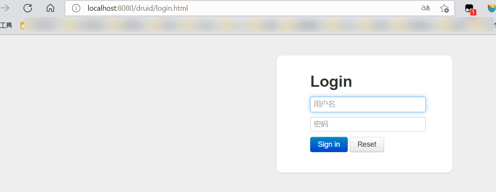

- 进入之后

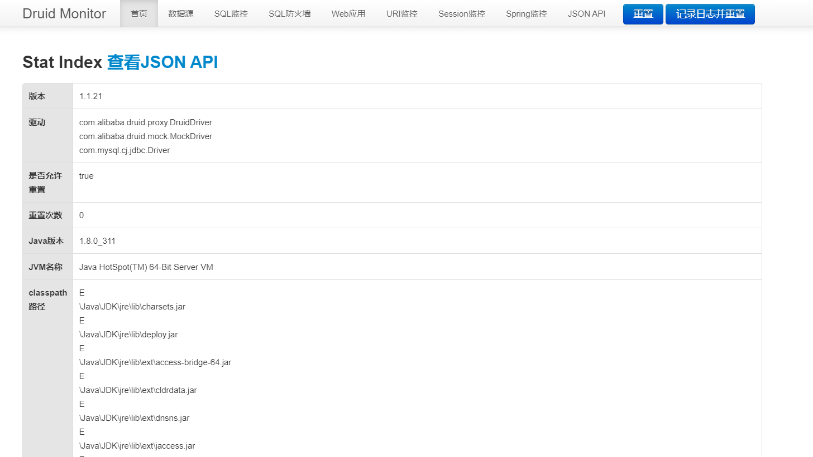

- 配置Druid web监控filter过滤器

```java
// 配置 Druid 监控 之  web 监控的 filter
// WebStatFilter：用于配置Web和Druid数据源之间的管理关联监控统计
@Bean
public FilterRegistrationBean webStatFilter() {
    FilterRegistrationBean bean = new FilterRegistrationBean();
    bean.setFilter(new WebStatFilter());

    // exclusions：设置哪些请求进行过滤排除掉，从而不进行统计
    Map<String, String> initParams = new HashMap<>();
    initParams.put("exclusions", "*.js,*.css,/druid/*,/jdbc/*");
    bean.setInitParameters(initParams);

    // "/*" 表示过滤所有请求
    bean.setUrlPatterns(Arrays.asList("/*"));
    return bean;
}
```

> 平时在工作中，按需求进行配置即可，主要用作监控！

## 3.整合MyBatis

- 官方文档：http://mybatis.org/spring-boot-starter/mybatis-spring-boot-autoconfigure/ 
- Maven仓库地址：[Maven Repository: org.mybatis.spring.boot » mybatis-spring-boot-starter » 2.2.1 (mvnrepository.com)](https://mvnrepository.com/artifact/org.mybatis.spring.boot/mybatis-spring-boot-starter/2.2.1)

> 整合测试

1. 导入MyBatis所需要的依赖

```xml
<dependency>
    <groupId>org.mybatis.spring.boot</groupId>
    <artifactId>mybatis-spring-boot-starter</artifactId>
    <version>2.2.1</version>
</dependency>
```

2. 配置数据库连接信息

```yaml
spring:
  datasource:
    username: root
    password: root
    # ?serverTimezone=UTC解决时区的报错
    url: jdbc:mysql://localhost:3306/springboot?serverTimezone=UTC&useUnicode=true&characterEncoding=utf-8
    driver-class-name: com.mysql.cj.jdbc.Driver
    type: com.alibaba.druid.pool.DruidDataSource # 自定义数据源

    #Spring Boot 默认是不注入这些属性值的，需要自己绑定
    #druid 数据源专有配置
    initialSize: 5
    minIdle: 5
    maxActive: 20
    maxWait: 60000
    timeBetweenEvictionRunsMillis: 60000
    minEvictableIdleTimeMillis: 300000
    validationQuery: SELECT 1 FROM DUAL
    testWhileIdle: true
    testOnBorrow: false
    testOnReturn: false
    poolPreparedStatements: true
    #配置监控统计拦截的filters，stat:监控统计、log4j：日志记录、wall：防御sql注入
    #如果允许时报错 java.lang.ClassNotFoundException: org.apache.log4j.Priority
      #则导入 log4j 依赖即可，Maven 地址：https://mvnrepository.com/artifact/log4j/log4j
    filters: stat,wall,log4j
    maxPoolPreparedStatementPerConnectionSize: 20
    useGlobalDataSourceStat: true
    connectionProperties: druid.stat.mergeSql=true;druid.stat.slowSqlMillis=500
```

3. 测试数据库是否连接成功！

```java
@SpringBootTest
class Springboot05MybatisApplicationTests {
    // DI注入数据源
    @Autowired
    DataSource dataSource;

    @Test
    void contextLoads() throws SQLException {
        // 查看默认数据源
        System.out.println(dataSource.getClass());
        System.out.println(dataSource.getConnection());
    }

}
```

4. 创建实体类，导入`Lombok`！

```java
@Data
@NoArgsConstructor
@AllArgsConstructor
public class Department {
    private Integer id;
    private String departmentName;
}
```

5. 创建mapper目录以及对应的Mapper接口——`DepartmentMapper.java`！

```java
// @Mapper: 表示本类是一个 MyBatis 的 Mapper
@Mapper
@Repository
public interface DepartmentMapper {

    // 获取所有部门信息
    List<Department> getDepartments();

    // 通过id获得部门
    Department getDepartment(Integer id);

}
```

6. 对应的Mapper映射文件——`DepartmentMapper.xml`

```xml
<?xml version="1.0" encoding="UTF-8" ?>
<!DOCTYPE mapper
        PUBLIC "-//mybatis.org//DTD Mapper 3.0//EN"
        "http://mybatis.org/dtd/mybatis-3-mapper.dtd">

<mapper namespace="com.github.mapper.DepartmentMapper">

    <select id="getDepartments" resultType="Department">
        select * from department;
    </select>

    <select id="getDepartment" resultType="Department" parameterType="int">
        select * from department where id = #{id};
    </select>

</mapper>
```

7. maven配置资源过滤问题

```xml
<resources>
    <resource>
        <directory>src/main/java</directory>
        <includes>
            <include>**/*.xml</include>
        </includes>
        <filtering>true</filtering>
    </resource>
</resources>
```

> 既然已经提供了MyBatis 的映射配置文件，自然要告诉spring boot这些文件的位置。

```yaml
# 指定myBatis的核心配置文件与Mapper映射文件
mybatis.mapper-locations=classpath:mybatis/mapper/*.xml
# 注意：对应实体类的路径
mybatis.type-aliases-package=com.github.pojo
```

8. 编写部门的DepartmentController进行测试！

```java
@RestController
public class DepartmentController {

    @Autowired
    DepartmentMapper departmentMapper;

    // 查询全部部门
    @GetMapping("/getDepartments")
    public List<Department> getDepartments(){
        return departmentMapper.getDepartments();
    }

    // 查询全部部门
    @GetMapping("/getDepartment/{id}")
    public Department getDepartment(@PathVariable("id") Integer id){
        return departmentMapper.getDepartment(id);
    }

}
```

- 启动项目访问进行测试！

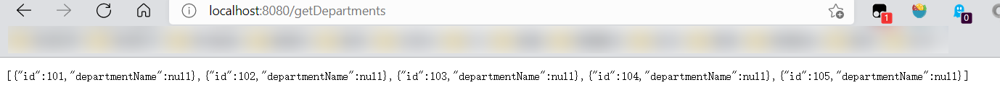

> 增加一个员工类再测试下，为之后做准备。

1. 新建一个pojo类Employee；

```java
@Data
@AllArgsConstructor
@NoArgsConstructor
public class Employee {

    private Integer id;
    private String lastName;
    private String email;
    //1 male, 0 female
    private Integer gender;
    private Integer department;
    private Date birth;

    private Department eDepartment; // 冗余设计

}
```

2. 新建一个EmployeeMapper接口

```java
// @Mapper: 表示本类是一个 MyBatis 的 Mapper
@Mapper
@Repository
public interface EmployeeMapper {

    // 获取所有员工信息
    List<Employee> getEmployees();

    // 新增一个员工
    int save(Employee employee);

    // 通过id获得员工信息
    Employee get(Integer id);

    // 通过id删除员工
    int delete(Integer id);

}
```

3. 编写EmployeeMapper.xml配置文件

```xml
<?xml version="1.0" encoding="UTF-8" ?>
<!DOCTYPE mapper
        PUBLIC "-//mybatis.org//DTD Mapper 3.0//EN"
        "http://mybatis.org/dtd/mybatis-3-mapper.dtd">

<mapper namespace="com.github.mapper.EmployeeMapper">

    <resultMap id="EmployeeMap" type="Employee">
        <id property="id" column="eid"/>
        <result property="lastName" column="last_name"/>
        <result property="email" column="email"/>
        <result property="gender" column="gender"/>
        <result property="birth" column="birth"/>
        <association property="eDepartment"  javaType="Department">
            <id property="id" column="did"/>
            <result property="departmentName" column="dname"/>
        </association>
    </resultMap>

    <select id="getEmployees" resultMap="EmployeeMap">
        select e.id as eid,last_name,email,gender,birth,d.id as did,d.department_name as dname
        from department d,employee e
        where d.id = e.department
    </select>

    <insert id="save" parameterType="Employee">
        insert into employee (last_name,email,gender,department,birth)
        values (#{lastName},#{email},#{gender},#{department},#{birth});
    </insert>

    <select id="get" resultType="Employee">
        select * from employee where id = #{id}
    </select>

    <delete id="delete" parameterType="int">
        delete from employee where id = #{id}
    </delete>

</mapper>
```

4. 编写EmployeeController类进行测试。

```java
@RestController
public class EmployeeController {

    @Autowired
    EmployeeMapper employeeMapper;

    // 获取所有员工信息
    @GetMapping("/getEmployees")
    public List<Employee> getEmployees(){
        return employeeMapper.getEmployees();
    }

    @GetMapping("/save")
    public int save(){
        Employee employee = new Employee();
        employee.setLastName("kuangshen");
        employee.setEmail("qinjiang@qq.com");
        employee.setGender(1);
        employee.setDepartment(101);
        employee.setBirth(new Date());
        return employeeMapper.save(employee);
    }

    // 通过id获得员工信息
    @GetMapping("/get/{id}")
    public Employee get(@PathVariable("id") Integer id){
        return employeeMapper.get(id);
    }

    // 通过id删除员工
    @GetMapping("/delete/{id}")
    public int delete(@PathVariable("id") Integer id){
        return employeeMapper.delete(id);
    }

}
```

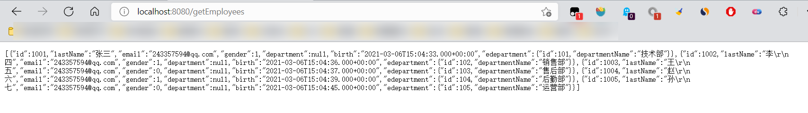

> 测试结果完成！！！

## 4.SpringSecurity权限控制

### 1.安全简介

> 在 Web 开发中，安全一直是非常重要的一个方面。安全虽然属于应用的非功能性需求，但是应该在应用开发的初期就考虑进来。如果在应用开发的后期才考虑安全的问题，就可能陷入一个两难的境地：一方面，应用存在严重的安全漏洞，无法满足用户的要求，并可能造成用户的隐私数据被攻击者窃取；另一方面，应用的基本架构已经确定，要修复安全漏洞，可能需要对系统的架构做出比较重大的调整，因而需要更多的开发时间，影响应用的发布进程。因此，从应用开发的第一天就应该把安全相关的因素考虑进来，并在整个应用的开发过程中。

- 市面上存在比较有名的：Shiro，Spring Security ！

- 这里需要阐述一下的是，每一个框架的出现都是为了解决某一问题而产生了，那么Spring Security框架的出现是为了解决什么问题呢？

- 首先我们看下它的官网介绍：[Spring Security官网地址](https://spring.io/projects/spring-security)

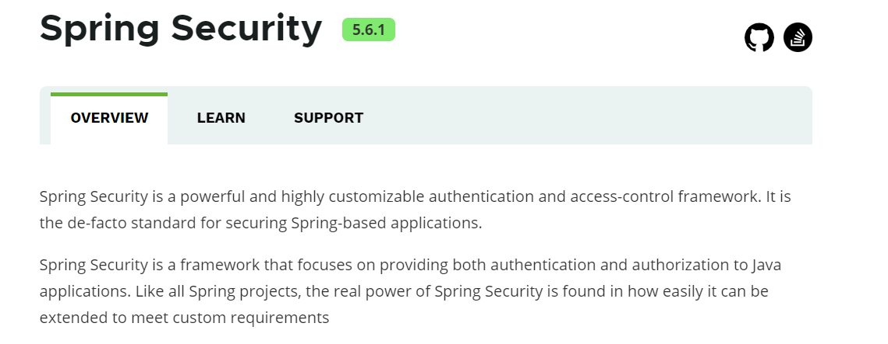

- Spring Security是一个功能强大且高度可定制的身份验证和访问控制框架。它实际上是保护基于spring的应用程序的标准。

- Spring Security是一个框架，侧重于为Java应用程序提供身份验证和授权。与所有Spring项目一样，Spring安全性的真正强大之处在于它可以轻松地扩展以满足定制需求。

- 从官网的介绍中可以知道这是一个权限框架。想我们之前做项目是没有使用框架是怎么控制权限的？对于权限 一般会细分为功能权限，访问权限，和菜单权限。代码会写的非常的繁琐，冗余。

> 怎么解决之前写权限代码繁琐，冗余的问题，一些主流框架就应运而生而Spring Scecurity就是其中的一种。

- Spring 是一个非常流行和成功的 Java 应用开发框架。Spring Security 基于 Spring 框架，提供了一套 Web 应用安全性的完整解决方案。一般来说，Web 应用的安全性包括用户认证（Authentication）和用户授权（Authorization）两个部分。用户认证指的是验证某个用户是否为系统中的合法主体，也就是说用户能否访问该系统。用户认证一般要求用户提供用户名和密码。系统通过校验用户名和密码来完成认证过程。用户授权指的是验证某个用户是否有权限执行某个操作。在一个系统中，不同用户所具有的权限是不同的。比如对一个文件来说，有的用户只能进行读取，而有的用户可以进行修改。一般来说，系统会为不同的用户分配不同的角色，而每个角色则对应一系列的权限。

- 对于上面提到的两种应用情景，Spring Security 框架都有很好的支持。在用户认证方面，Spring Security 框架支持主流的认证方式，包括 HTTP 基本认证、HTTP 表单验证、HTTP 摘要认证、OpenID 和 LDAP 等。在用户授权方面，Spring Security 提供了基于角色的访问控制和访问控制列表（Access Control List，ACL），可以对应用中的领域对象进行细粒度的控制。

### 2.实战测试

#### 1.实验环境搭建

1. 新建一个初始的springboot项目web模块，thymeleaf模块

```xml
<!--thymeleaf-->
<dependency>
	<groupId>org.springframework.boot</groupId>
	<artifactId>spring-boot-starter-thymeleaf</artifactId>
</dependency>
```

2. 导入静态资源

```xml
welcome.html
|views
|level1
1.html
2.html
3.html
|level2
1.html
2.html
3.html
|level3
1.html
2.html
3.html
Login.html
```

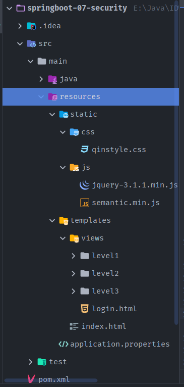

3. controller跳转！

```java
package com.github.controller;

import org.springframework.stereotype.Controller;
import org.springframework.web.bind.annotation.PathVariable;
import org.springframework.web.bind.annotation.RequestMapping;

@Controller
public class RouterController {

    @RequestMapping({"/","/index"})
    public String index(){
        return "index";
    }

    @RequestMapping("/toLogin")
    public String toLogin(){
        return "views/login";
    }

    @RequestMapping("/level1/{id}")
    public String level1(@PathVariable("id") int id){
        return "views/level1/"+id;
    }

    @RequestMapping("/level2/{id}")
    public String level2(@PathVariable("id") int id){
        return "views/level2/"+id;
    }

    @RequestMapping("/level3/{id}")
    public String level3(@PathVariable("id") int id){
        return "views/level3/"+id;
    }

}
```

4. 测试实验环境是否OK！

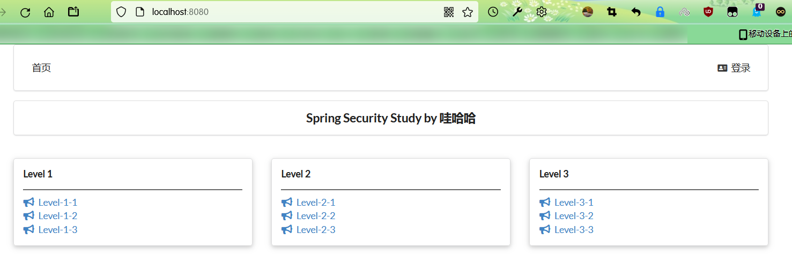

#### 2.认识SpringSecurity

> Spring Security 是针对Spring项目的安全框架，也是Spring Boot底层安全模块默认的技术选型，他可以实现强大的Web安全控制，对于安全控制，我们仅需要引入 spring-boot-starter-security 模块，进行少量的配置，即可实现强大的安全管理！

记住几个类：

- WebSecurityConfigurerAdapter：自定义Security策略
- AuthenticationManagerBuilder：自定义认证策略
- @EnableWebSecurity：开启WebSecurity模式

> Spring Security的两个主要目标是 “认证” 和 “授权”（访问控制）。

**“认证”（Authentication）**

- 身份验证是关于验证您的凭据，如用户名/用户ID和密码，以验证您的身份。

- 身份验证通常通过用户名和密码完成，有时与身份验证因素结合使用。

 **“授权” （Authorization）**

- 授权发生在系统成功验证您的身份后，最终会授予您访问资源（如信息，文件，数据库，资金，位置，几乎任何内容）的完全权限。

- 这个概念是通用的，而不是只在Spring Security 中存在。

#### 3.认证和授权

> 目前，我们的测试环境，是谁都可以访问的，只要使用 Spring Security 增加上认证和授权的功能。

1. 引入 Spring Security 模块

```xml
<dependency>
   <groupId>org.springframework.boot</groupId>
   <artifactId>spring-boot-starter-security</artifactId>
</dependency>
```

2. 编写 Spring Security 配置类

- 参考官网：https://spring.io/projects/spring-security 

- 查看个人项目中的版本，找到对应的帮助文档：[Spring Security Reference](https://docs.spring.io/spring-security/site/docs/5.3.0.RELEASE/reference/html5/#jc-custom-dsls)

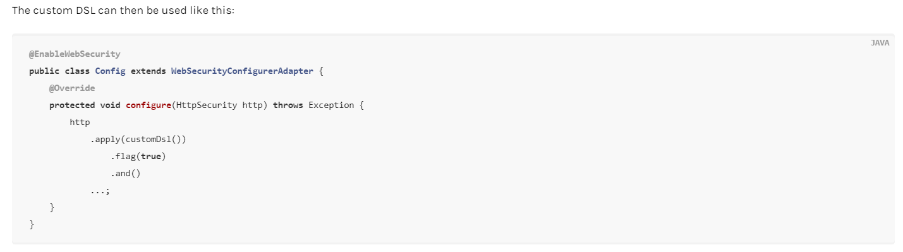

3. 编写基础配置类

```java
package com.github.config;

import org.springframework.security.config.annotation.web.builders.HttpSecurity;
import org.springframework.security.config.annotation.web.configuration.EnableWebSecurity;
import org.springframework.security.config.annotation.web.configuration.WebSecurityConfigurerAdapter;

@EnableWebSecurity // 开启WebSecurity模式
public class SecurityConfig extends WebSecurityConfigurerAdapter {

    @Override
    protected void configure(HttpSecurity http) throws Exception {

    }
}
```

4. 定制请求的授权规则

```java
@Override
protected void configure(HttpSecurity http) throws Exception {
   // 定制请求的授权规则
   // 首页所有人可以访问
   http.authorizeRequests().antMatchers("/").permitAll()
  .antMatchers("/level1/**").hasRole("vip1")
  .antMatchers("/level2/**").hasRole("vip2")
  .antMatchers("/level3/**").hasRole("vip3");
}
```

5. 测试一下：发现除了首页都进不去了！因为目前没有登录的角色，因为请求需要登录的角色拥有对应的权限才可以！


6. 在configure()方法中加入以下配置，开启自动配置的登录功能！

```java
// 开启自动配置的登录功能
// /login 请求来到登录页
// /login?error 重定向到这里表示登录失败
http.formLogin();
```

7. 测试一下：发现，没有权限的时候，会跳转到登录的页面！

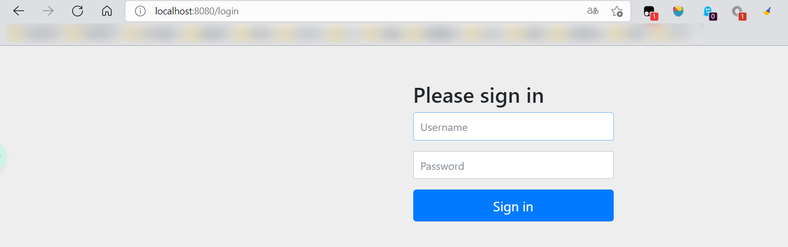

8. 查看刚才登录页的注释信息；

- 可以定义认证规则，重写configure(AuthenticationManagerBuilder auth)方法。

```java
// 定义认证规则
@Override
protected void configure(AuthenticationManagerBuilder auth) throws Exception {

// 在内存中定义，也可以在jdbc中去拿....
auth.inMemoryAuthentication()
.withUser("subei").password("123456").roles("vip2","vip3")
.and()
.withUser("root").password("123456").roles("vip1","vip2","vip3")
.and()
.withUser("guest").password("123456").roles("vip1","vip2");
}
```

9. 测试，使用这些账号登录进行测试！发现会报错！

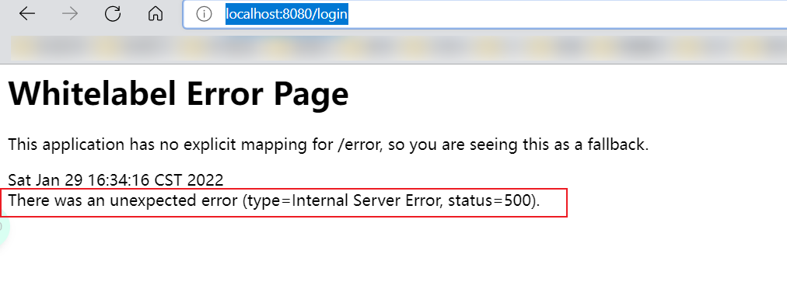

10. 原因：要将前端传过来的密码进行某种方式加密，否则就无法登录，修改代码。

```java
// 定义认证规则
@Override
protected void configure(AuthenticationManagerBuilder auth) throws Exception {
    // 在内存中定义，也可以在jdbc中去拿....
    // Spring security 5.0中新增了多种加密方式，也改变了密码的格式。
    // 要想我们的项目还能够正常登陆，需要修改一下configure中的代码。我们要将前端传过来的密码进行某种方式加密
    // spring security 官方推荐的是使用bcrypt加密方式。

    auth.inMemoryAuthentication().passwordEncoder(new BCryptPasswordEncoder())
        .withUser("subei").password(new BCryptPasswordEncoder().encode("123456")).roles("vip2","vip3")
        .and()
        .withUser("root").password(new BCryptPasswordEncoder().encode("123456")).roles("vip1","vip2","vip3")
        .and()
        .withUser("guest").password(new BCryptPasswordEncoder().encode("123456")).roles("vip1","vip2");
}
```

11. 测试，发现，登录成功，并且==每个角色只能访问自己认证下的规则==！

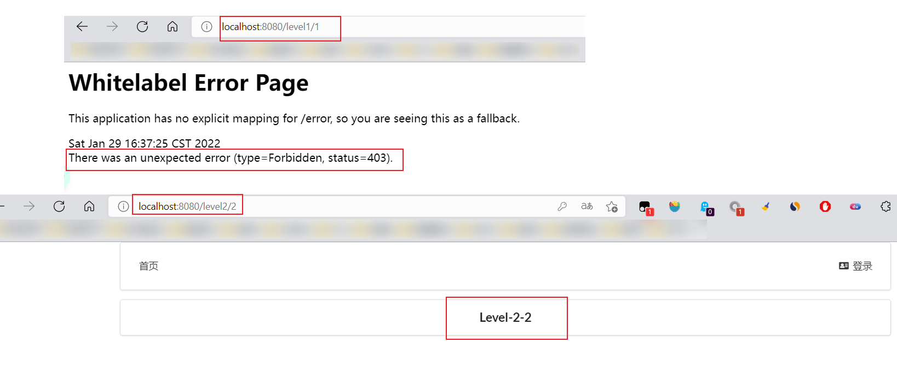

#### 4.权限控制和注销

1. 开启自动配置的注销的功能

```java
// 定制请求的授权规则
@Override
protected void configure(HttpSecurity http) throws Exception {
    //....
    // 开启自动配置的登录功能
    // /login 请求来到登录页
    // /login?error 重定向到这里表示登录失败
    http.formLogin();
    // /logout 注销请求
    http.logout();
}
```

2. 在前端，增加一个注销的按钮，index.html 导航栏中。

```html
<a class="item" th:href="@{/logout}">
   <i class="address card icon"></i> 注销
</a>
```

3. 去测试一下，登录成功后点击注销，发现注销完毕会跳转到登录页面！


4. 但是，当我们想让他注销成功后，依旧可以跳转到首页，该怎么处理呢？

```java
// .logoutSuccessUrl("/"); 注销成功来到首页
http.logout().logoutSuccessUrl("/");
```

5. 测试，注销完毕后，发现跳转到首页，OK！

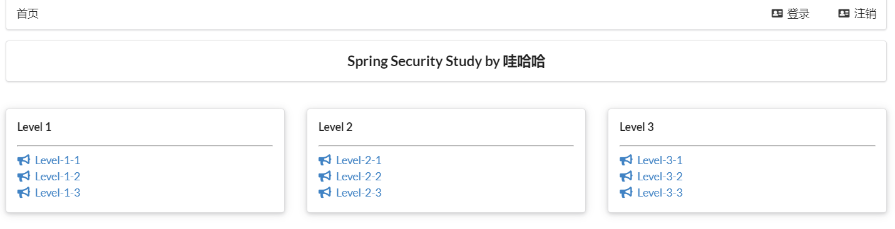

6. 现在又来一个需求：用户没有登录的时候，导航栏上只显示登录按钮，用户登录之后，导航栏可以显示登录的用户信息及注销按钮！还有就是，比如subei这个用户，它只有 vip2，vip3功能，那么登录则只显示这两个功能，而vip1的功能菜单不显示！这个就是真实的网站情况了！该如何做呢？

> 需要结合thymeleaf中的一些功能

- sec：authorize="isAuthenticated()":是否认证登录！来显示不同的页面。

- Maven依赖：

```
<!-- https://mvnrepository.com/artifact/org.thymeleaf.extras/thymeleaf-extras-springsecurity4 -->
<dependency>
   <groupId>org.thymeleaf.extras</groupId>
   <artifactId>thymeleaf-extras-springsecurity5</artifactId>
   <version>3.0.4.RELEASE</version>
</dependency>
```

7. 修改前端页面

- 导入命名空间

```xml
<!-- https://mvnrepository.com/artifact/org.thymeleaf.extras/thymeleaf-extras-springsecurity4 -->
<dependency>
   <groupId>org.thymeleaf.extras</groupId>
   <artifactId>thymeleaf-extras-springsecurity5</artifactId>
   <version>3.0.4.RELEASE</version>
</dependency>
```

- 修改导航栏，增加认证判断

```html
<!--登录注销-->
<div class="right menu">

   <!--如果未登录-->
   <div sec:authorize="!isAuthenticated()">
       <a class="item" th:href="@{/login}">
           <i class="address card icon"></i> 登录
       </a>
   </div>

   <!--如果已登录-->
   <div sec:authorize="isAuthenticated()">
       <a class="item">
           <i class="address card icon"></i>
          用户名：<span sec:authentication="principal.username"></span>
          角色：<span sec:authentication="principal.authorities"></span>
       </a>
   </div>

   <div sec:authorize="isAuthenticated()">
       <a class="item" th:href="@{/logout}">
           <i class="address card icon"></i> 注销
       </a>
   </div>
</div>
```

8. 重启测试，可以登录试试看，登录成功后确实，显示了我们想要的页面；

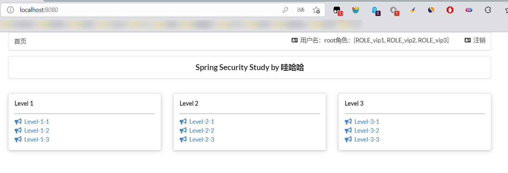

9. 如果注销404了，就是因为它默认防止csrf跨站请求伪造，因为会产生安全问题，可以将请求改为post表单提交，或者在spring security中关闭csrf功能；还可以试试：在配置中增加 `http.csrf().disable();`

```java
http.csrf().disable(); // 关闭csrf功能:跨站请求伪造,默认只能通过post方式提交logout请求
http.logout().logoutSuccessUrl("/");
```

10. 继续将下面的角色功能块认证完成！

```html
<!-- sec:authorize="hasRole('vip1')" -->
<div class="column" sec:authorize="hasRole('vip1')">
   <div class="ui raised segment">
       <div class="ui">
           <div class="content">
               <h5 class="content">Level 1</h5>
               <hr>
               <div><a th:href="@{/level1/1}"><i class="bullhorn icon"></i> Level-1-1</a></div>
               <div><a th:href="@{/level1/2}"><i class="bullhorn icon"></i> Level-1-2</a></div>
               <div><a th:href="@{/level1/3}"><i class="bullhorn icon"></i> Level-1-3</a></div>
           </div>
       </div>
   </div>
</div>

<div class="column" sec:authorize="hasRole('vip2')">
   <div class="ui raised segment">
       <div class="ui">
           <div class="content">
               <h5 class="content">Level 2</h5>
               <hr>
               <div><a th:href="@{/level2/1}"><i class="bullhorn icon"></i> Level-2-1</a></div>
               <div><a th:href="@{/level2/2}"><i class="bullhorn icon"></i> Level-2-2</a></div>
               <div><a th:href="@{/level2/3}"><i class="bullhorn icon"></i> Level-2-3</a></div>
           </div>
       </div>
   </div>
</div>

<div class="column" sec:authorize="hasRole('vip3')">
   <div class="ui raised segment">
       <div class="ui">
           <div class="content">
               <h5 class="content">Level 3</h5>
               <hr>
               <div><a th:href="@{/level3/1}"><i class="bullhorn icon"></i> Level-3-1</a></div>
               <div><a th:href="@{/level3/2}"><i class="bullhorn icon"></i> Level-3-2</a></div>
               <div><a th:href="@{/level3/3}"><i class="bullhorn icon"></i> Level-3-3</a></div>
           </div>
       </div>
   </div>
</div>
```

11. 测试一下！

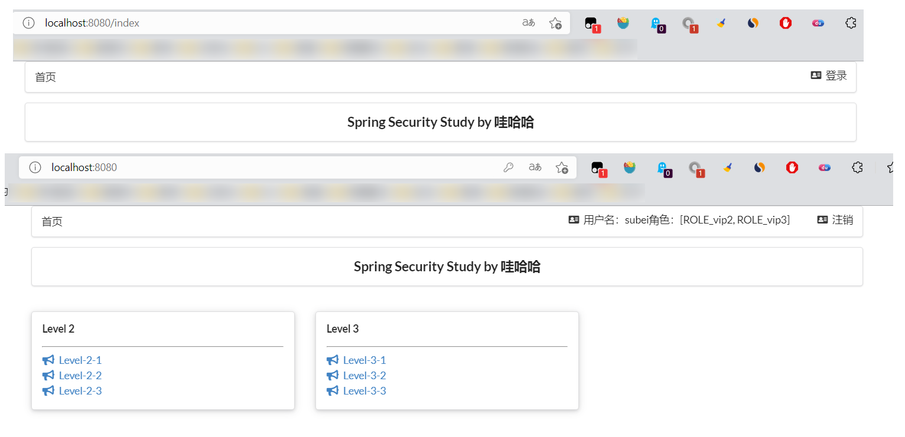

> 权限控制和注销搞定！

#### 5.记住我

> 现在的情况：只要登录之后，关闭浏览器，再登录，就会让我们重新登录，但是很多网站的情况，就是有一个记住密码的功能，这个该如何实现呢？很简单

1. 开启记住我功能

```java
// 定制请求的授权规则
@Override
protected void configure(HttpSecurity http) throws Exception {
//。。。。。。。。。。。
   // 记住我
   http.rememberMe();
}
```

2. 再次启动项目测试一下，发现登录页多了一个记住我功能，登录之后关闭浏览器，然后重新打开浏览器访问，发现用户依旧存在！

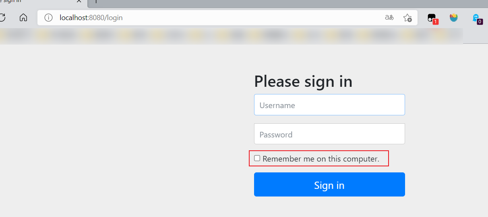

> 思考：如何实现的呢？其实非常简单

- 可以查看浏览器的cookie


3. 点击注销的时候，可以发现，spring security 帮我们自动删除了这个cookie。

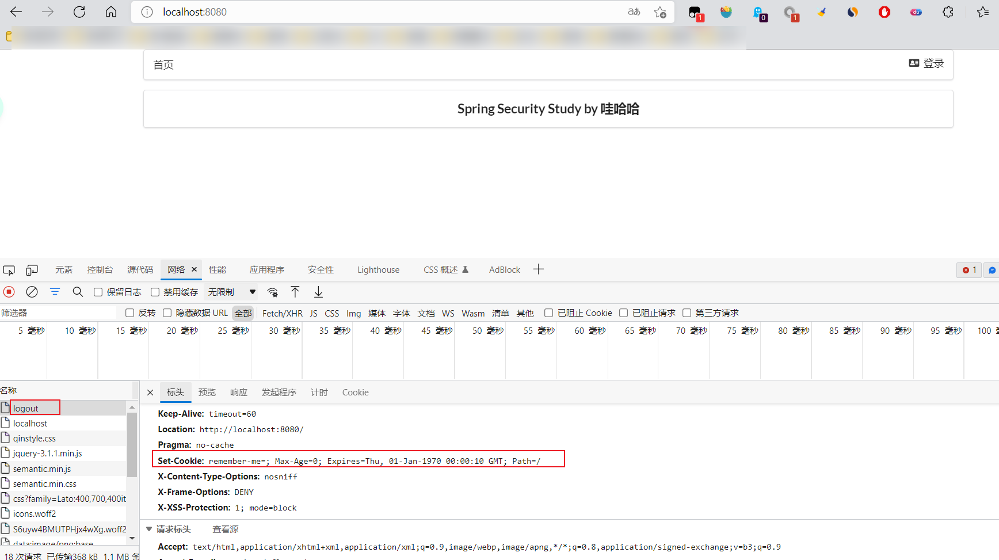

4. 结论：登录成功后，将cookie发送给浏览器保存，以后登录带上这个cookie，只要通过检查就可以免登录了。如果点击注销，则会删除这个cookie，具体的原理参考JavaWeb阶段！

#### 6.定制登录页

> 现在这个登录页面都是spring security 默认的，怎么样可以使用自己写的Login界面呢？

1. 在刚才的登录页配置后面指定 loginpage

```java
http.formLogin().loginPage("/toLogin");
```

2. 然后前端也需要指向我们自己定义的 login请求

```html
<a class="item" th:href="@{/toLogin}">
   <i class="address card icon"></i> 登录
</a>
```

3. 要登录，则需要将这些信息发送到哪里，我们也需要配置，login.html 配置提交请求及方式，方式必须为post:

- 在 loginPage()源码中的注释上有写明：

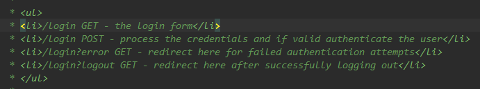

```html
<form th:action="@{/login}" method="post">
   <div class="field">
       <label>Username</label>
       <div class="ui left icon input">
           <input type="text" placeholder="Username" name="username">
           <i class="user icon"></i>
       </div>
   </div>
   <div class="field">
       <label>Password</label>
       <div class="ui left icon input">
           <input type="password" name="password">
           <i class="lock icon"></i>
       </div>
   </div>
   <input type="submit" class="ui blue submit button"/>
</form>
```

4、这个请求提交上来，我们还需要验证处理，怎么做呢？我们可以查看formLogin()方法的源码！我们配置接收登录的用户名和密码的参数！

```java
http.formLogin()
  .usernameParameter("username")
  .passwordParameter("password")
  .loginPage("/toLogin")
  .loginProcessingUrl("/login"); // 登陆表单提交请求
```

5、在登录页增加记住我的多选框

```html
<input type="checkbox" name="remember"> 记住我
```

6、后端验证处理！

```java
//定制记住我的参数！
http.rememberMe().rememberMeParameter("remember");
```

7. 测试，OK

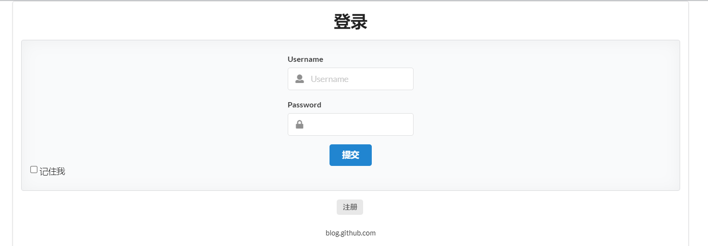

> 完整配置代码

```java
package com.github.config;

import org.springframework.security.config.annotation.authentication.builders.AuthenticationManagerBuilder;
import org.springframework.security.config.annotation.web.builders.HttpSecurity;
import org.springframework.security.config.annotation.web.configuration.EnableWebSecurity;
import org.springframework.security.config.annotation.web.configuration.WebSecurityConfigurerAdapter;
import org.springframework.security.crypto.bcrypt.BCryptPasswordEncoder;

@EnableWebSecurity // 开启WebSecurity模式
public class SecurityConfig extends WebSecurityConfigurerAdapter {
    // 定制请求的授权规则
    @Override
    protected void configure(HttpSecurity http) throws Exception {
        // 首页所有人可以访问
        http.authorizeRequests().antMatchers("/").permitAll()
                .antMatchers("/level1/**").hasRole("vip1")
                .antMatchers("/level2/**").hasRole("vip2")
                .antMatchers("/level3/**").hasRole("vip3");

        // 开启自动配置的登录功能
        // /login 请求来到登录页
        // /login?error 重定向到这里表示登录失败
        http.formLogin()
                .usernameParameter("username")
                .passwordParameter("password")
                .loginPage("/toLogin")
                .loginProcessingUrl("/login"); // 登陆表单提交请求

        //开启自动配置的注销的功能
        // /logout 注销请求
        // .logoutSuccessUrl("/"); 注销成功来到首页

        http.csrf().disable();//关闭csrf功能:跨站请求伪造,默认只能通过post方式提交logout请求
        http.logout().logoutSuccessUrl("/");

        //记住我
        http.rememberMe().rememberMeParameter("remember");
    }

    // 定义认证规则
    @Override
    protected void configure(AuthenticationManagerBuilder auth) throws Exception {
        // 在内存中定义，也可以在jdbc中去拿....
        // Spring security 5.0中新增了多种加密方式，也改变了密码的格式。
        // 要想我们的项目还能够正常登陆，需要修改一下configure中的代码。我们要将前端传过来的密码进行某种方式加密
        // spring security 官方推荐的是使用bcrypt加密方式。

        auth.inMemoryAuthentication().passwordEncoder(new BCryptPasswordEncoder())
                .withUser("subei").password(new BCryptPasswordEncoder().encode("123456")).roles("vip2","vip3")
                .and()
                .withUser("root").password(new BCryptPasswordEncoder().encode("123456")).roles("vip1","vip2","vip3")
                .and()
                .withUser("guest").password(new BCryptPasswordEncoder().encode("123456")).roles("vip1","vip2");
    }
}
```

## 5.整合Shiro

### 1.Shiro简介

#### 1.什么是Shiro？

- Apache Shiro 是一个Java 的安全（权限）框架。
- Shiro 可以非常容易的开发出足够好的应用，其不仅可以用在JavaSE环境，也可以用在JavaEE环
  境。
- Shiro可以完成，认证，授权，加密，会话管理，Web集成，缓存等。
- 下载地址：http://shiro.apache.org/

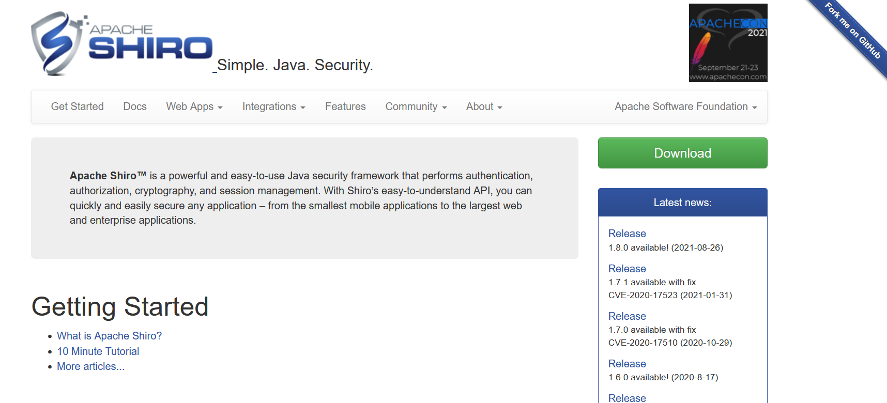

#### 2.有哪些功能？


### 2.Hello,Shiro


### 3.集成shiro


## 6.集成Swagger

> 官网：[API Documentation & Design Tools for Teams | Swagger](https://swagger.io/)

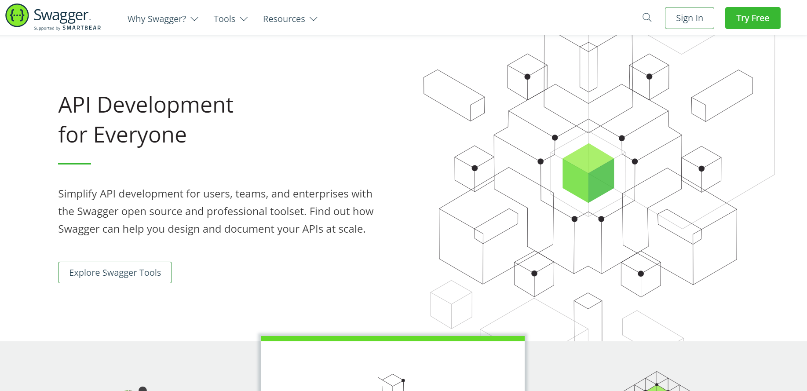

### 1.Swagger简介

**前后端分离**

- 前端 -> 前端控制层、视图层；
- 后端 -> 后端控制层、服务层、数据访问层；
- 前后端通过API进行交互；
- 前后端相对独立且松耦合。

**产生的问题**

- 前后端集成，前端或者后端无法做到“及时协商，尽早解决”，最终导致问题集中爆发。

**解决方案**

- 首先定义schema[计划的提纲]，并实时跟踪最新的API，降低集成风险。
- 早些年：指定word计划文档；
- 前后端分离：
  - 前端测试后端接口：postman
  - 后端提供接口，需要实时更新最新的消息及改动！

**Swagger**

- 号称世界上最流行的API框架；
- Restful API文档在线自动生成器 => **API 文档 与API 定义同步更新**。
- 直接运行，在线测试API；
- 支持多种语言（如：Java，PHP等）；
- 官网：https://swagger.io/

### 2.SpringBoot集成Swagger

**SpringBoot集成Swagger** => **springfox**，两个jar包

- **Springfox -> swagger2**；
- swagger -> springmvc。

**使用Swagger**

- 要求：JDK1.8 + 否则swagger2无法运行。

> 步骤：

1. 新建一个SpringBoot-web项目

   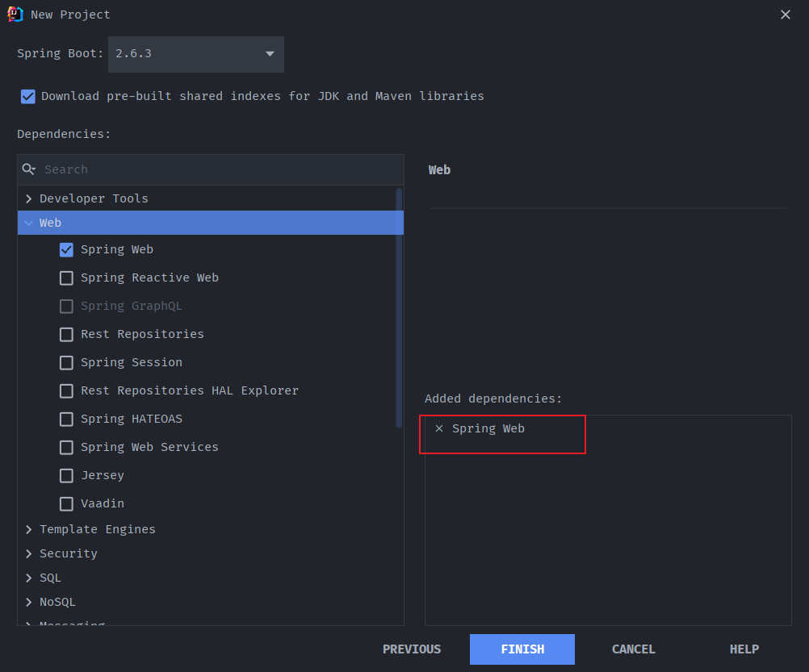

2. 添加Maven依赖

```xml
<!-- https://mvnrepository.com/artifact/io.springfox/springfox-swagger2 -->
<dependency>
    <groupId>io.springfox</groupId>
    <artifactId>springfox-swagger2</artifactId>
    <version>2.9.2</version>
</dependency>
<!-- https://mvnrepository.com/artifact/io.springfox/springfox-swagger-ui -->
<dependency>
    <groupId>io.springfox</groupId>
    <artifactId>springfox-swagger-ui</artifactId>
    <version>2.9.2</version>
</dependency>
```

3. 编写HelloController，测试确保运行成功！

```java
@RestController
public class HelloController {
    //  默认请求  -->  /error
    @RequestMapping(value = "/hello")
    public String hello(){
        return "Hello";
    }
}
```

4. 要使用Swagger，我们需要编写一个配置类-SwaggerConfig来配置 Swagger

```java
@Configuration // 配置类
@EnableSwagger2 // 开启Swagger2的自动配置
public class SwaggerConfig {
    
}
```

5. ==由于spring boot版本问题，如果启动项目报错空指针异常，将spring boot降级为2.5.5版本即可==。访问测试：http://localhost:8080/swagger-ui.html，可以看到swagger的界面。

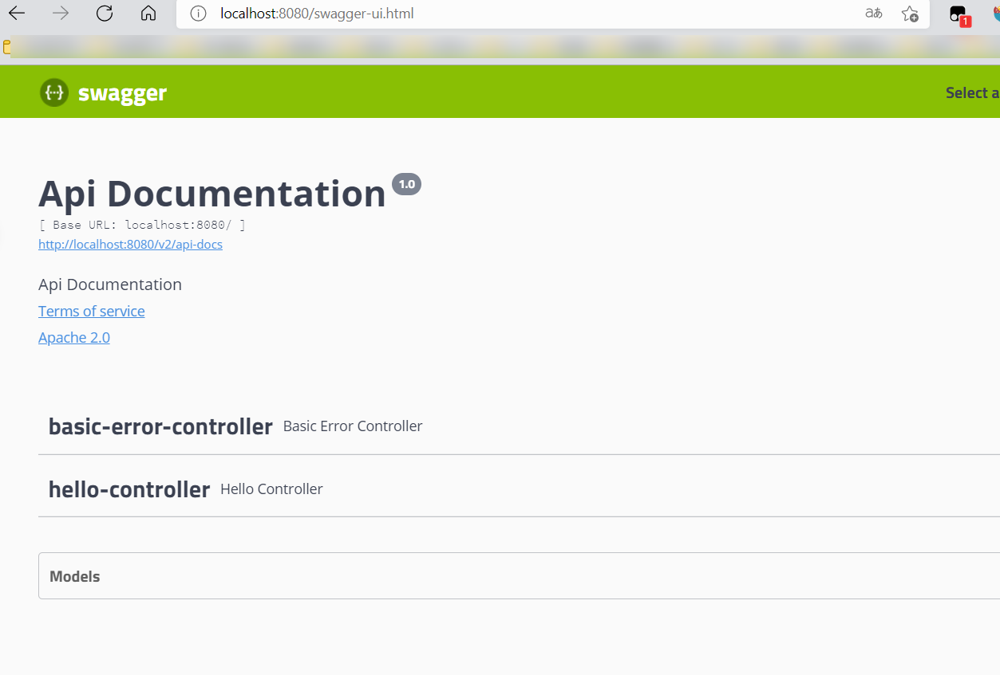

- 注：`3.0的jar访问不了，降级2.9.2就可以了`。

### 3.配置Swagger

1. Swagger实例Bean是Docket，所以通过配置Docket实例来配置Swaggger。

```java
@Configuration
// 配置类
@EnableSwagger2
// 开启Swagger2的自动配置
public class SwaggerConfig {
    // 配置docket以配置Swagger具体参数
    @Bean
    public Docket docket() {
        return new Docket(DocumentationType.SWAGGER_2);
    }
    
}
```

2. 可以通过apiInfo()属性配置文档信息；

```java
// 配置文档信息
private ApiInfo apiInfo() {
   Contact contact = new Contact("联系人名字", "http://xxx.xxx.com/联系人访问链接", "联系人邮箱");
   return new ApiInfo(
           "Swagger学习", // 标题
           "学习演示如何配置Swagger", // 描述
           "v1.0", // 版本
           "http://terms.service.url/组织链接", // 组织链接
           contact, // 联系人信息
           "Apach 2.0 许可", // 许可
           "许可链接", // 许可连接
           new ArrayList<>()// 扩展
  );
}
```

3. Docket实例关联上apiInfo()

```java
@Bean
public Docket docket() {
   return new Docket(DocumentationType.SWAGGER_2).apiInfo(apiInfo());
}
```

4. 重启项目，访问测试 http://localhost:8080/swagger-ui.html 效果如下：

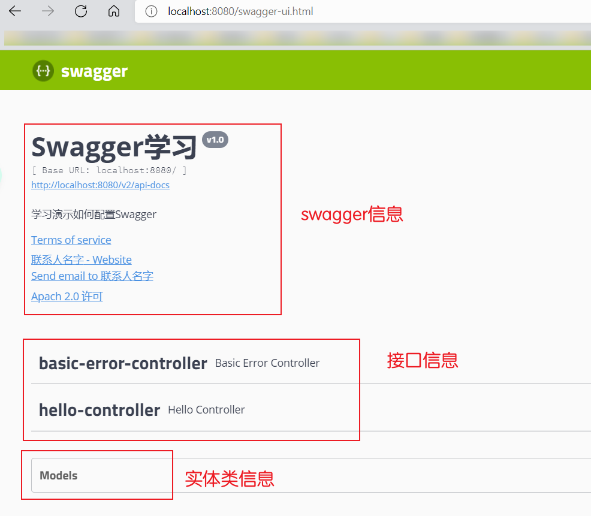

### 4.配置扫描端口

1. 构建Docket时通过select()方法配置怎么扫描接口。

```java
@Bean
public Docket docket() {
    return new Docket(DocumentationType.SWAGGER_2)
        .apiInfo(apiInfo())
        .select() // 通过.select()方法，去配置扫描接口,RequestHandlerSelectors配置如何扫描接口
        .apis(RequestHandlerSelectors.basePackage("com.github.controller"))
        .build();
}
```

2. 重启项目测试，由于我们配置根据包的路径扫描接口，所以只能看到一个类！！！

   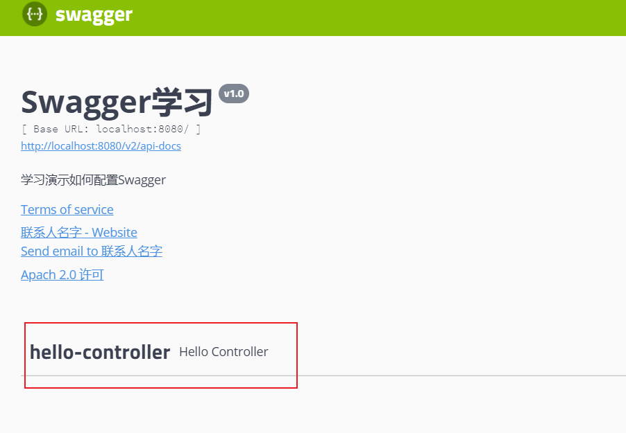

3. 除了通过包路径配置扫描接口外，还可以通过配置其他方式扫描接口，这里注释一下所有的配置方 式：

```yaml
any() // 扫描所有，项目中的所有接口都会被扫描到
none() // 不扫描接口
// 通过方法上的注解扫描，如withMethodAnnotation(GetMapping.class)只扫描get请求
withMethodAnnotation(final Class<? extends Annotation> annotation)
// 通过类上的注解扫描，如.withClassAnnotation(Controller.class)只扫描有controller注解的类中的接口
withClassAnnotation(final Class<? extends Annotation> annotation)
basePackage(final String basePackage) // 根据包路径扫描接口
```

4. 除此之外，还可以配置接口扫描过滤：

```java
@Bean
public Docket docket() {
    return new Docket(DocumentationType.SWAGGER_2)
        .apiInfo(apiInfo())
        .select()// 通过.select()方法，去配置扫描接口,RequestHandlerSelectors配置如何扫描接口
        .apis(RequestHandlerSelectors.basePackage("com.github.controller"))
        // 配置如何通过path过滤,即这里只扫描请求以/github开头的接口
        .paths(PathSelectors.ant("/github/**"))
        .build();
}
```

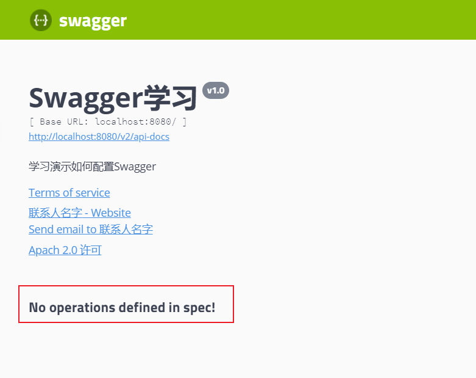

5. 可选值还有：

```xml
regex(final String pathRegex) // 通过正则表达式控制
ant(final String antPattern) // 通过ant()控制
```

### 5.配置Swagger开关

1. 通过enable()方法配置是否启用swagger，如果是false，swagger将不能在浏览器中访问了。

```java
@Bean
public Docket docket() {
   return new Docket(DocumentationType.SWAGGER_2)
      .apiInfo(apiInfo())
      .enable(false) //配置是否启用Swagger，如果是false，在浏览器将无法访问
      .select()// 通过.select()方法，去配置扫描接口,RequestHandlerSelectors配置如何扫描接口
      .apis(RequestHandlerSelectors.basePackage("com.github.controller"))
       // 配置如何通过path过滤,即这里只扫描请求以/kuang开头的接口
      .paths(PathSelectors.ant("/github/**"))
      .build();
}
```

2. 如何动态配置当项目处于test、dev环境时显示swagger，处于prod时不显示？
   - 在配置文件配置swaggerFlag的值，在dev、prod、stag的配置文件中配置，然后在swaggerConfig里面获取这个值，这样不管环境怎么变都不影响代码！

```java
@Bean
public Docket docket(Environment environment) {
   // 设置要显示swagger的环境
   Profiles of = Profiles.of("dev", "test");
   // 判断当前是否处于该环境
   // 通过 enable() 接收此参数判断是否要显示
   boolean b = environment.acceptsProfiles(of);
   
   return new Docket(DocumentationType.SWAGGER_2)
      .apiInfo(apiInfo())
      .enable(b) //配置是否启用Swagger，如果是false，在浏览器将无法访问
      .select()// 通过.select()方法，去配置扫描接口,RequestHandlerSelectors配置如何扫描接口
      .apis(RequestHandlerSelectors.basePackage("com.github.controller"))
       // 配置如何通过path过滤,即这里只扫描请求以/github开头的接口
      .paths(PathSelectors.ant("/github/**"))
      .build();
}
```

3. 在项目中增加一个dev的配置文件查看效果！

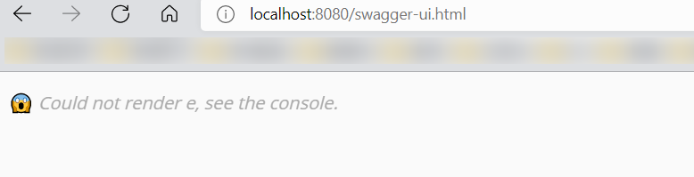

### 6.配置API分组

1. 如果没有配置分组，默认是default。通过groupName()方法即可配置分组：

```java
@Bean
public Docket docket(Environment environment) {
    return new Docket(DocumentationType.SWAGGER_2).apiInfo(apiInfo())
        .groupName("hello");  // 配置分组
    // 省略配置....
}
```

2. 重启项目查看分组

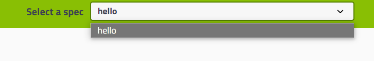

3. 如何配置多个分组？配置多个分组只需要配置多个docket即可：

```java
@Bean
public Docket docket1(){
    return new Docket(DocumentationType.SWAGGER_2).groupName("group1");
}
@Bean
public Docket docket2(){
    return new Docket(DocumentationType.SWAGGER_2).groupName("group2");
}
@Bean
public Docket docket3(){
    return new Docket(DocumentationType.SWAGGER_2).groupName("group3");
}
```

4. 重启项目查看。

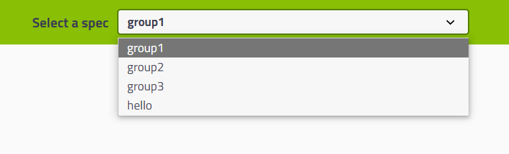

### 7.实体配置

1. 新建一个实体类

```java
@ApiModel("用户实体")
public class User {
    @ApiModelProperty("用户名")
    public String username;
    @ApiModelProperty("密码")
    public String password;
}
```

2. 只要这个实体在请求接口的返回值上（即使是泛型），都能映射到实体项中：

```java
// controller文件中……
@RequestMapping("/getUser")
public User getUser(){
   return new User();
}
```

3. 重启查看测试：

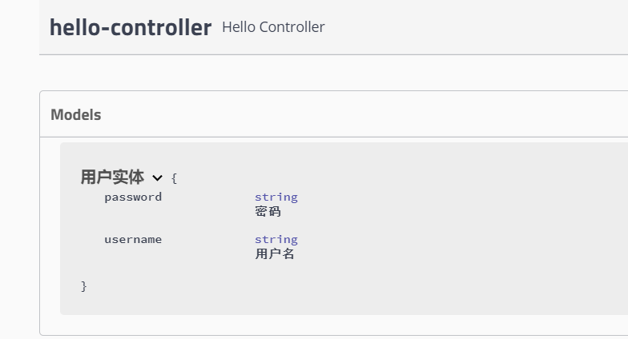

注：并不是因为@ApiModel这个注解让实体显示在这里了，而是只要出现在接口方法的返回值上的实体都会显示在这里，而@ApiModel和@ApiModelProperty这两个注解只是为实体添加注释的。

- @ApiModel为类添加注释；

- @ApiModelProperty为类属性添加注释；

### 8.常用注解

> Swagger的所有注解定义在io.swagger.annotations包下！

- 下面列一些经常用到的，未列举出来的可以另行查阅说明：

| Swagger注解                                            | 简单说明                                             |
| ------------------------------------------------------ | ---------------------------------------------------- |
| @Api(tags = "xxx模块说明")                             | 作用在模块类上                                       |
| @ApiOperation("xxx接口说明")                           | 作用在接口方法上                                     |
| @ApiModel("xxxPOJO说明")                               | 作用在模型类上：如VO、BO                             |
| @ApiModelProperty(value = "xxx属性说明",hidden = true) | 作用在类方法和属性上，hidden设置为true可以隐藏该属性 |
| @ApiParam("xxx参数说明")                               | 作用在参数、方法和字段上，类似@ApiModelProperty      |

- 也可以给请求的接口配置一些注释：

```java
// Operation接口，不是放在类上的，是方法
@ApiOperation("Github控制类")
@GetMapping(value = "/github")
@ResponseBody
public String github(@ApiParam("用户名") String username){
    return "Hay" + username;
}

@ApiOperation("Post测试类")
@PostMapping(value = "/postt")
@ResponseBody
public User postt(@ApiParam("用户名") User user){
    return user;
}
```

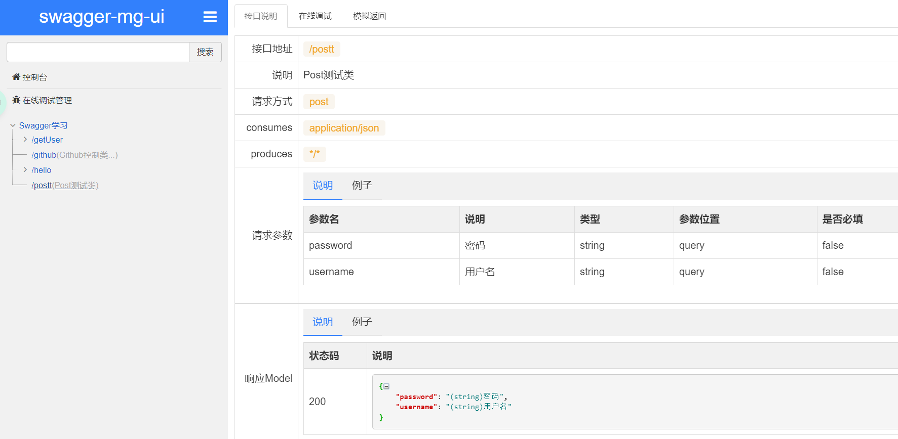

> 这样的话，可以给一些比较难理解的属性或者接口，增加一些配置信息，让人更容易阅读！

- 相较于传统的Postman或Curl方式测试接口，使用swagger简直就是傻瓜式操作，不需要额外说明文档(写得好本身就是文档)而且更不容易出错，只需要录入数据然后点击Execute，如果再配合自动化框架，可以说基本就不需要人为操作了。

- Swagger是个优秀的工具，现在国内已经有很多的中小型互联网公司都在使用它，相较于传统的要先出Word接口文档再测试的方式，显然这样也更符合现在的快速迭代开发行情。当然了，提醒下大家==在正式环境要记得关闭Swagger，一来出于安全考虑二来也可以节省运行时内存==。

### 9.其他皮肤

> 可以导入不同的包实现不同的皮肤定义：

1. **默认的**，访问 http://localhost:8080/swagger-ui.html

```xml
<dependency>
   <groupId>io.springfox</groupId>
   <artifactId>springfox-swagger-ui</artifactId>
   <version>2.9.2</version>
</dependency>
```

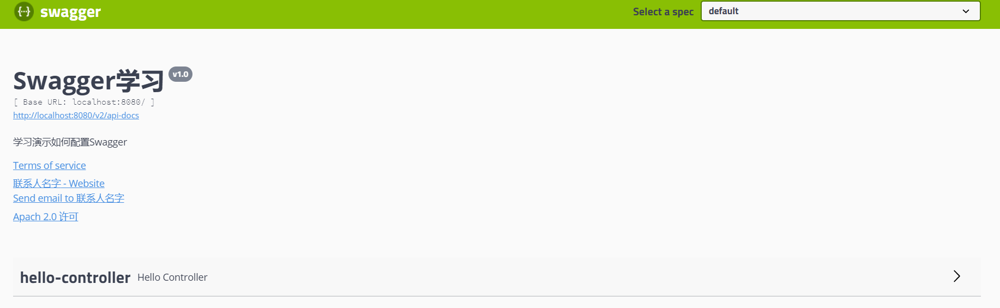

2. bootstrap-ui 访问 http://localhost:8080/doc.html

```xml
<!-- 引入swagger-bootstrap-ui包 /doc.html-->
<dependency>
   <groupId>com.github.xiaoymin</groupId>
   <artifactId>swagger-bootstrap-ui</artifactId>
   <version>1.9.1</version>
</dependency>
```

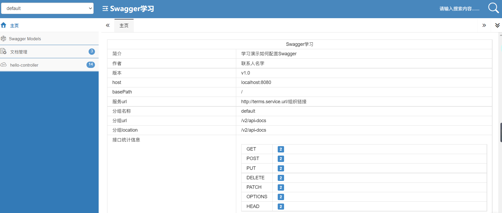

3. Layui-ui 访问 http://localhost:8080/docs.html

```xml
<!-- 引入swagger-ui-layer包 /docs.html-->
<dependency>
   <groupId>com.github.caspar-chen</groupId>
   <artifactId>swagger-ui-layer</artifactId>
   <version>1.1.3</version>
</dependency>
```

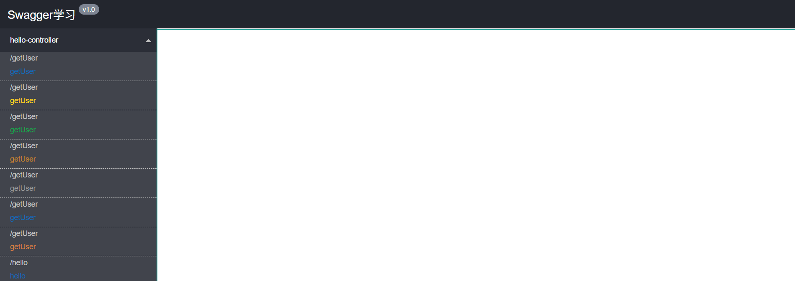

4. mg-ui 访问 http://localhost:8080/document.html

```xml
<!-- 引入swagger-ui-layer包 /document.html-->
<dependency>
   <groupId>com.zyplayer</groupId>
   <artifactId>swagger-mg-ui</artifactId>
   <version>1.0.6</version>
</dependency>
```

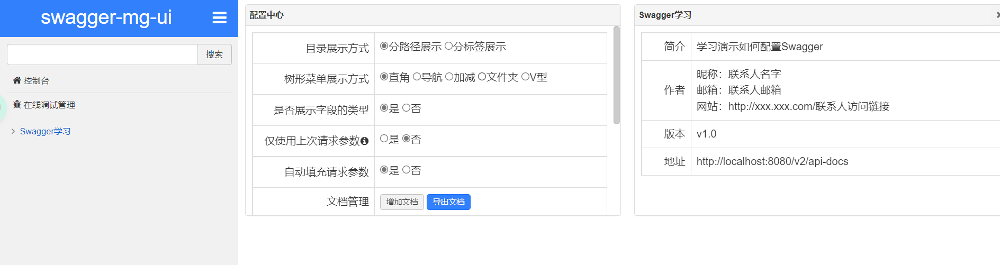

## 7.异步、定时、邮件任务

### 1.异步任务

1. 新建一个空spring boot项目，创建一个service包

2. 创建一个类AsyncService

异步处理还是非常常用的，比如我们在网站上发送邮件，后台会去发送邮件，此时前台会造成响应不动，直到邮件发送完毕，响应才会成功，所以我们一般会采用多线程的方式去处理这些任务。

编写方法，假装正在处理数据，使用线程设置一些延时，模拟同步等待的情况；

```java
@Service
public class AsyncService {

   public void hello(){
       try {
           Thread.sleep(3000);
      } catch (InterruptedException e) {
           e.printStackTrace();
      }
       System.out.println("业务进行中....");
  }
}
```

3. 编写controller包

4. 编写AsyncController类，去写一个Controller测试一下

```java
@RestController
public class AsyncController {

   @Autowired
   AsyncService asyncService;

   @GetMapping("/hello")
   public String hello(){
       asyncService.hello();
       return "success";
  }

}
```

5. 访问：http://localhost:8080/hello进行测试，3秒后出现success，这是同步等待的情况。

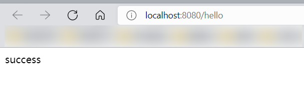

问题：我们如果想让用户直接得到消息，就在后台使用多线程的方式进行处理即可，但是每次都需要自己手动去编写多线程的实现的话，太麻烦了，我们只需要用一个简单的办法，在我们的方法上加一个简单的注解即可，如下：

6. 给hello方法添加@Async注解；

```java
// 告诉Spring这是一个异步方法
@Async
public void hello(){
   try {
       Thread.sleep(3000);
  } catch (InterruptedException e) {
       e.printStackTrace();
  }
   System.out.println("业务进行中....");
}
```

- SpringBoot就会自己开一个线程池，进行调用！但是要让这个注解生效，还需要在主程序上添加一个注解@EnableAsync，开启异步注解功能；

```java
@EnableAsync // 开启异步注解功能
@SpringBootApplication
public class SpringbootTaskApplication {

   public static void main(String[] args) {
       SpringApplication.run(SpringbootTaskApplication.class, args);
  }

}
```

7. 重启测试，网页瞬间响应，后台代码依旧执行！

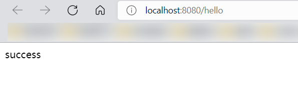


### 2.邮件任务

> 邮件发送，在日常开发中，使用非常的多，Springboot也帮我们做了支持！！！

- 邮件发送需要引入spring-boot-start-mail
- SpringBoot 自动配置MailSenderAutoConfiguration
- 定义MailProperties内容，配置在application.yml中
- 自动装配JavaMailSender
- 测试邮件发送

> **测试：**

1. 引入pom依赖

```xml
<dependency>
   <groupId>org.springframework.boot</groupId>
   <artifactId>spring-boot-starter-mail</artifactId>
</dependency>
```

- 看它引入的依赖，可以看到 jakarta.mail

```xml
<dependency>
   <groupId>com.sun.mail</groupId>
   <artifactId>jakarta.mail</artifactId>
   <version>1.6.4</version>
   <scope>compile</scope>
</dependency>
```

2. 查看自动配置类：MailSenderAutoConfiguration

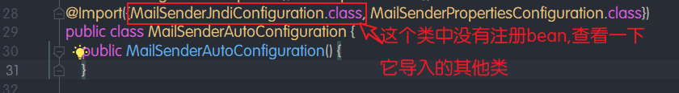

- 这个类中存在bean，JavaMailSenderImpl。

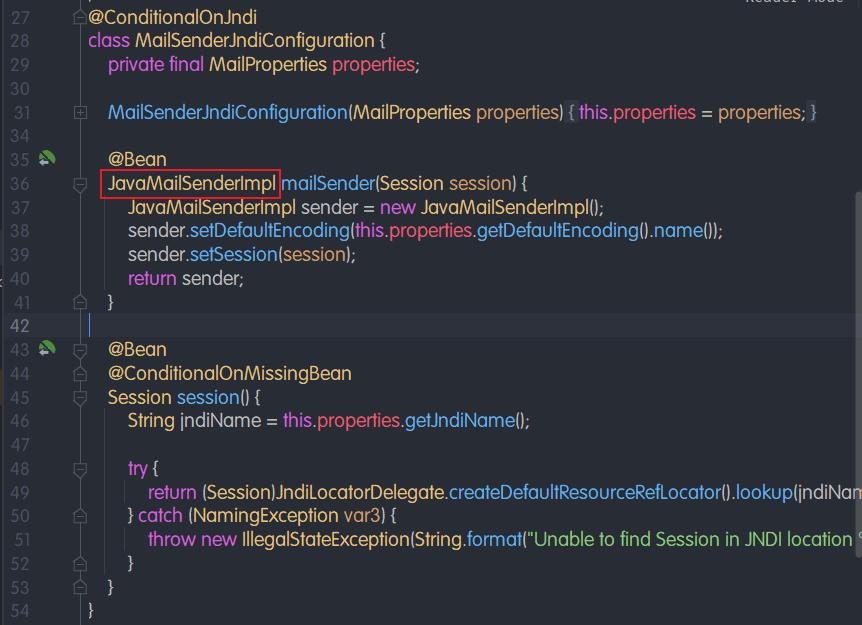

- 然后去看下配置文件

```java
@ConfigurationProperties(
    prefix = "spring.mail"
)
public class MailProperties {
    private static final Charset DEFAULT_CHARSET;
    private String host;
    private Integer port;
    private String username;
    private String password;
    private String protocol = "smtp";
    private Charset defaultEncoding;
    private Map<String, String> properties;
    private String jndiName;
}
```

3. 配置文件：

```yaml
spring.mail.username=2943357594@qq.com
spring.mail.password=你的qq授权码
spring.mail.host=smtp.qq.com
# qq需要配置ssl
spring.mail.properties.mail.smtp.ssl.enable=true
```

- 获取授权码：在QQ邮箱中的设置->账户->开启pop3和smtp服务。

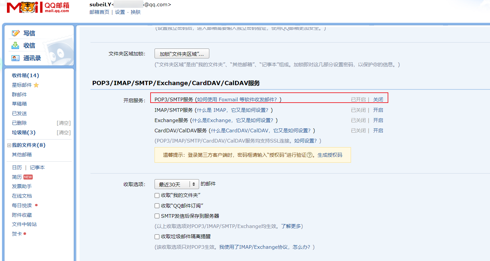

4. Spring单元测试

```java
@SpringBootTest
class Springboot09TestApplicationTests {

    @Autowired
    JavaMailSenderImpl mailSender;

    @Test
    public void contextLoads() {
        // 邮件设置1：一个简单的邮件
        SimpleMailMessage message = new SimpleMailMessage();
        message.setSubject("通知-明天学习Linux");
        message.setText("今晚7:30复习");

        message.setTo("2943357594@qq.com");
        message.setFrom("2943357594@qq.com");
        mailSender.send(message);
    }

    @Test
    public void contextLoads2() throws MessagingException {
        // 邮件设置2：一个复杂的邮件
        MimeMessage mimeMessage = mailSender.createMimeMessage();
        MimeMessageHelper helper = new MimeMessageHelper(mimeMessage, true);

        helper.setSubject("通知-明天学习Linux");
        helper.setText("<b style='color:red'>今天 7:30复习</b>",true);

        // 发送附件
        helper.addAttachment("1.jpg",new File("图片路径"));
        helper.addAttachment("2.jpg",new File("图片链接"));

        helper.setTo("2943357594@qq.com");
        helper.setFrom("2943357594@qq.com");

        mailSender.send(mimeMessage);
    }

}
```

- 查看邮箱，邮件接收成功！

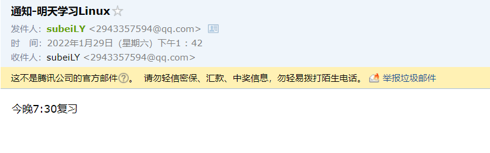

> 在后期开发中，只需要使用Thymeleaf进行前后端结合即可开发自己网站邮件收发功能了！

### 3.定时任务

> 项目开发中经常需要执行一些定时任务，比如需要在每天凌晨的时候，分析一次前一天的日志信息，Spring为我们提供了异步执行任务调度的方式，提供了两个接口。

- TaskExecutor接口
- TaskScheduler接口

> 两个注解：

- @EnableScheduling
- @Scheduled

> **cron表达式：**

| 字段 | 允许值                  | 允许的特殊字符 |
| ---- | ----------------------- | -------------- |
| 秒   | 0-59                    | ,-*/           |
| 分   | 0-59                    | ,-*/           |
| 小时 | 0-23                    | ,-*/           |
| 日期 | 1-31                    | ,-*?/L W C     |
| 月份 | 1-12                    | ,-*/           |
| 星期 | 0-7 或 SUN-SAT 0,7是SUN | ,-*?/L C #     |

| 特殊字符 | 代表含义                   |
| -------- | -------------------------- |
| ,        | 枚举                       |
| -        | 区间                       |
| *        | 任意                       |
| /        | 步长                       |
| ?        | 日/星期冲突匹配            |
| L        | 最后                       |
| W        | 工作日                     |
| C        | 和calendar联系后计算过的值 |
| #        | 星期，4#2，第二个星期三    |

> **测试步骤：**

1. 创建一个ScheduledService

- 里面存在一个hello方法，他需要定时执行，怎么处理呢？

```java
@Service
public class ScheduledService {
    // 秒 分 时 日 月 周几
    // 0 * * * * MON-FRI
    // 注意cron表达式的用法
    @Scheduled(cron = "0 * * * * 0-7")
    public void hello(){
        System.out.println("hello……");
    }
    
    @Scheduled(cron = "0/2 * * * * ?")
    public void hello2(){
        System.out.println("hello2……");
    }
    
}
```

2. 这里写完定时任务之后，需要`在主程序上增加@EnableScheduling开启定时任务功能`。

```java
@EnableAsync // 开启异步注解功能
@EnableScheduling // 开启基于注解的定时任务
@SpringBootApplication
public class Springboot09TestApplication {

    public static void main(String[] args) {
        SpringApplication.run(Springboot09TestApplication.class, args);
    }

}
```

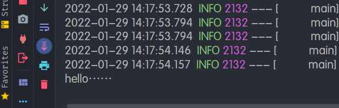

3. 详细了解下cron表达式：http://www.bejson.com/othertools/cron/
4. 常用的表达式:

```java
（1）0/2 * * * * ?   表示每2秒 执行任务
（1）0 0/2 * * * ?   表示每2分钟 执行任务
（1）0 0 2 1 * ?   表示在每月的1日的凌晨2点调整任务
（2）0 15 10 ? * MON-FRI   表示周一到周五每天上午10:15执行作业
（3）0 15 10 ? 6L 2002-2006   表示2002-2006年的每个月的最后一个星期五上午10:15执行作
（4）0 0 10,14,16 * * ?   每天上午10点，下午2点，4点
（5）0 0/30 9-17 * * ?   朝九晚五工作时间内每半小时
（6）0 0 12 ? * WED   表示每个星期三中午12点
（7）0 0 12 * * ?   每天中午12点触发
（8）0 15 10 ? * *   每天上午10:15触发
（9）0 15 10 * * ?     每天上午10:15触发
（10）0 15 10 * * ?   每天上午10:15触发
（11）0 15 10 * * ? 2005   2005年的每天上午10:15触发
（12）0 * 14 * * ?     在每天下午2点到下午2:59期间的每1分钟触发
（13）0 0/5 14 * * ?   在每天下午2点到下午2:55期间的每5分钟触发
（14）0 0/5 14,18 * * ?     在每天下午2点到2:55期间和下午6点到6:55期间的每5分钟触发
（15）0 0-5 14 * * ?   在每天下午2点到下午2:05期间的每1分钟触发
（16）0 10,44 14 ? 3 WED   每年三月的星期三的下午2:10和2:44触发
（17）0 15 10 ? * MON-FRI   周一至周五的上午10:15触发
（18）0 15 10 15 * ?   每月15日上午10:15触发
（19）0 15 10 L * ?   每月最后一日的上午10:15触发
（20）0 15 10 ? * 6L   每月的最后一个星期五上午10:15触发
（21）0 15 10 ? * 6L 2002-2005   2002年至2005年的每月的最后一个星期五上午10:15触发
（22）0 15 10 ? * 6#3   每月的第三个星期五上午10:15触发
```

## 8.富文本编辑器

### 1.简介

> 思考：我们平时在博客园，或者CSDN等平台进行写作的时候，有同学思考过他们的编辑器是怎么实现的吗？

- 在博客园后台的选项设置中，可以看到一个文本编辑器的选项：

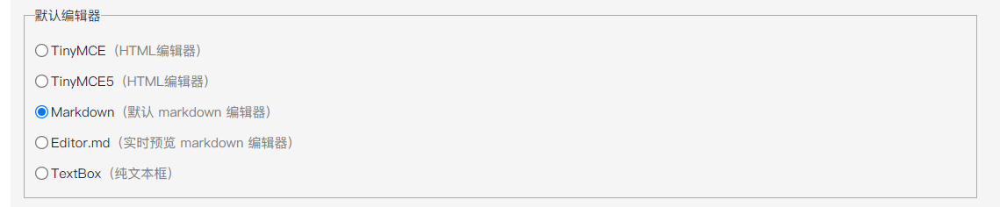

- 其实这个就是富文本编辑器，市面上有许多非常成熟的富文本编辑器，比如：

- **Editor.md**——功能非常丰富的编辑器，左端编辑，右端预览，非常方便，完全免费

- - 官网：https://pandao.github.io/editor.md/

- **wangEditor**——基于javascript和css开发的 Web富文本编辑器， 轻量、简洁、界面美观、易用、开源免费。

- - 官网：http://www.wangeditor.com/

- **TinyMCE**——TinyMCE是一个轻量级的基于浏览器的所见即所得编辑器，由JavaScript写成。它对IE6+和Firefox1.5+都有着非常良好的支持。功能齐全，界面美观，就是文档是英文的，对开发人员英文水平有一定要求。

- - 官网：https://www.tiny.cloud/docs/demo/full-featured/
  - 博客园

- **百度ueditor**——UEditor是由百度web前端研发部开发所见即所得富文本web编辑器，具有轻量，功能齐全，可定制，注重用户体验等特点，开源基于MIT协议，允许自由使用和修改代码，缺点是已经没有更新了

- - 官网：https://ueditor.baidu.com/website/onlinedemo.html

- **kindeditor**——界面经典。

- - 官网：http://kindeditor.net/demo.php

- **Textbox**——Textbox是一款极简但功能强大的在线文本编辑器，支持桌面设备和移动设备。主要功能包含内置的图像处理和存储、文件拖放、拼写检查和自动更正。此外，该工具还实现了屏幕阅读器等辅助技术，并符合WAI-ARIA可访问性标准。

- - 官网：https://textbox.io/

- **CKEditor**——国外的，界面美观。

- - 官网：https://ckeditor.com/ckeditor-5/demo/

- **quill**——功能强大，还可以编辑公式等

- - 官网：https://quilljs.com/

- **simditor**——界面美观，功能较全。

- - 官网：https://simditor.tower.im/

- **summernote**——UI好看，精美

- - 官网：https://summernote.org/

- **jodit**——功能齐全

- - 官网：https://xdsoft.net/jodit/

- **froala Editor**——界面非常好看，功能非常强大，非常好用（非免费）

- - 官网：https://www.froala.com/wysiwyg-editor

> 总之，目前可用的富文本编辑器有很多......这只是其中的一部分。

### 2.Editor.md

- 这里使用的就是`Editor.md`，作为一个资深码农，Mardown必然是我们程序猿最喜欢的格式，看下面，就爱上了！

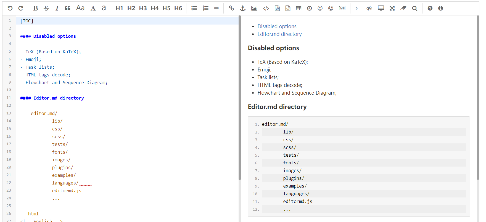

- 可以在官网下载它：https://pandao.github.io/editor.md/ ， 得到它的压缩包！

- 解压以后，在`examples`目录下面，可以看到他的很多案例使用！学习，其实就是看人家怎么写的，然后进行模仿就好了！

- 可以将整个解压的文件导入至我们的项目，将一些无用的测试和案例删掉即可！

### 3.基础工程搭建

> 数据库设计

article：文章表

| 字段    |          | 备注         |
| ------- | -------- | ------------ |
| id      | int      | 文章的唯一ID |
| author  | varchar  | 作者         |
| title   | varchar  | 标题         |
| content | longtext | 文章的内容   |

建表SQL：

```sql
use springboot;
CREATE TABLE `article` (
`id` int(10) NOT NULL AUTO_INCREMENT COMMENT 'int文章的唯一ID',
`author` varchar(50) NOT NULL COMMENT '作者',
`title` varchar(100) NOT NULL COMMENT '标题',
`content` longtext NOT NULL COMMENT '文章的内容',
PRIMARY KEY (`id`)
) ENGINE=InnoDB DEFAULT CHARSET=utf8;
```

> 基础项目搭建

1. 建一个SpringBoot项目配置。

```yaml
spring:
  datasource:
    username: root
    password: root
    # ?serverTimezone=UTC解决时区的报错
    url: jdbc:mysql://localhost:3306/springboot?serverTimezone=UTC&useUnicode=true&characterEncoding=utf-8
    driver-class-name: com.mysql.cj.jdbc.Driver
```

```xml
<dependency>
    <groupId>org.mybatis.spring.boot</groupId>
    <artifactId>mybatis-spring-boot-starter</artifactId>
    <version>2.2.1</version>
</dependency>
<dependency>
    <groupId>mysql</groupId>
    <artifactId>mysql-connector-java</artifactId>
    <scope>runtime</scope>
</dependency>
<dependency>
    <groupId>org.springframework.boot</groupId>
    <artifactId>spring-boot-starter-jdbc</artifactId>
</dependency>

<resources>
   <resource>
       <directory>src/main/java</directory>
       <includes>
           <include>**/*.xml</include>
       </includes>
       <filtering>true</filtering>
   </resource>
</resources>
```

2. 实体类：

```java
// 文章类
@Data
@NoArgsConstructor
@AllArgsConstructor
public class Article implements Serializable {
    private int id; // 文章的唯一ID
    private String author; // 作者名
    private String title; // 标题
    private String content; // 文章的内容

}
```

3、mapper接口：

```java
@Mapper
@Repository
public interface ArticleMapper {
   // 查询所有的文章
   List<Article> queryArticles();

   // 新增一个文章
   int addArticle(Article article);
 
   // 根据文章id查询文章
   Article getArticleById(int id);

   // 根据文章id删除文章
   int deleteArticleById(int id);

}
```

```xml
<?xml version="1.0" encoding="UTF-8"?>
<!DOCTYPE mapper PUBLIC "-//mybatis.org//DTD Mapper 3.0//EN"
        "http://mybatis.org/dtd/mybatis-3-mapper.dtd">

<mapper namespace="com.github.mapper.ArticleMapper">

    <select id="queryArticles" resultType="Article">
        select * from article
    </select>

    <select id="getArticleById" resultType="Article">
        select * from article where id = #{id}
    </select>

    <insert id="addArticle" parameterType="Article">
        insert into article (author,title,content) values (#{author},#{title},#{content});
    </insert>

    <delete id="deleteArticleById" parameterType="int">
        delete from article where id = #{id}
    </delete>

</mapper>
```

- **既然已经提供了 myBatis 的映射配置文件，自然要告诉 spring boot 这些文件的位置**

```assembly
# 指定myBatis的核心配置文件与Mapper映射文件
mybatis.mapper-locations=classpath:com/github/mapper/*.xml
# 注意：对应实体类的路径
mybatis.type-aliases-package=com.github.pojo
```

- 编写一个Controller测试下，是否ok；

```java
@RestController
public class ArticleController {
    // DI注入数据源
    @Autowired
    ArticleMapper articleMapper;

    // 查询全部内容
    @GetMapping("/queryArticles")
    public List<Article> queryArticles(){
        return articleMapper.queryArticles();
    }

}
```

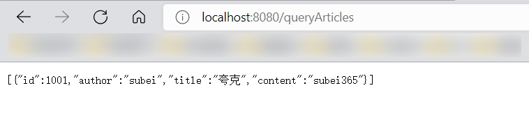

### 4.文章编辑整合

1. 导入 editor.md 资源 ，删除多余文件。

2. 编辑文章页面 editor.html、需要引入jQuery；

```html
<!DOCTYPE html>
<html class="x-admin-sm" lang="zh" xmlns:th="http://www.thymeleaf.org">

<head>
  <meta charset="UTF-8">
  <title>哇哈哈'Blog</title>
  <meta name="renderer" content="webkit">
  <meta http-equiv="X-UA-Compatible" content="IE=edge,chrome=1">
  <meta name="viewport" content="width=device-width,user-scalable=yes, minimum-scale=0.4, initial-scale=0.8,target-densitydpi=low-dpi" />
  <!--Editor.md-->
  <link rel="stylesheet" th:href="@{/css/editormd.css}"/>
  <link rel="shortcut icon" href="https://pandao.github.io/editor.md/favicon.ico" type="image/x-icon" />
</head>

<body>

<div class="layui-fluid">
  <div class="layui-row layui-col-space15">
    <div class="layui-col-md12">
      <!--博客表单-->
      <form name="mdEditorForm">
        <div>
          标题：<input type="text" name="title">
        </div>
        <div>
          作者：<input type="text" name="author">
        </div>
        <div id="article-content">
          <textarea name="content" id="content" style="display:none;"> </textarea>
        </div>
      </form>

    </div>
  </div>
</div>
</body>

<!--editormd-->
<script th:src="@{/lib/jquery.min.js}"></script>
<script th:src="@{/editormd.js}"></script>

<script type="text/javascript">
  var testEditor;

  //window.onload = function(){ }
  $(function() {
    testEditor = editormd("article-content", {
      width : "95%",
      height : 400,
      syncScrolling : "single",
      path : "../lib/",
      saveHTMLToTextarea : true,    // 保存 HTML 到 Textarea
      emoji: true,
      theme: "dark",//工具栏主题
      previewTheme: "dark",//预览主题
      editorTheme: "pastel-on-dark",//编辑主题
      tex : true,                   // 开启科学公式TeX语言支持，默认关闭
      flowChart : true,             // 开启流程图支持，默认关闭
      sequenceDiagram : true,       // 开启时序/序列图支持，默认关闭,
      //图片上传
      imageUpload : true,
      imageFormats : ["jpg", "jpeg", "gif", "png", "bmp", "webp"],
      imageUploadURL : "/article/file/upload",
      onload : function() {
        console.log('onload', this);
      },
      /*指定需要显示的功能按钮*/
      toolbarIcons : function() {
        return ["undo","redo","|",
          "bold","del","italic","quote","ucwords","uppercase","lowercase","|",
          "h1","h2","h3","h4","h5","h6","|",
          "list-ul","list-ol","hr","|",
          "link","reference-link","image","code","preformatted-text",
          "code-block","table","datetime","emoji","html-entities","pagebreak","|",
          "goto-line","watch","preview","fullscreen","clear","search","|",
          "help","info","releaseIcon", "index"]
      },

      /*自定义功能按钮，下面我自定义了2个，一个是发布，一个是返回首页*/
      toolbarIconTexts : {
        releaseIcon : "<span bgcolor=\"gray\">发布</span>",
        index : "<span bgcolor=\"red\">返回首页</span>",
      },

      /*给自定义按钮指定回调函数*/
      toolbarHandlers:{
        releaseIcon : function(cm, icon, cursor, selection) {
          //表单提交
          mdEditorForm.method = "post";
          mdEditorForm.action = "/article/addArticle";//提交至服务器的路径
          mdEditorForm.submit();
        },
        index : function(){
          window.location.href = '/';
        },
      }
    });
  });
</script>

</html>
```

3. 编写Controller，进行跳转，以及保存文章

```java
@RestController
@RequestMapping("/article")
public class ArticleController {
    // DI注入数据源
    @Autowired
    ArticleMapper articleMapper;

    // 查询全部内容
    @GetMapping("/queryArticles")
    public List<Article> queryArticles(){
        return articleMapper.queryArticles();
    }

    // 测试
    @GetMapping("/toEditor")
    public String toEditor(){
        return "editor";
    }

    // 添加文章
    @PostMapping("/addArticle")
    public String addArticle(Article article){
        articleMapper.addArticle(article);
        return "editor";
    }
    
}
```

> 图片上传问题

1. 前端js中添加配置

```js
// 图片上传
imageUpload : true,
imageFormats : ["jpg", "jpeg", "gif", "png", "bmp", "webp"],
imageUploadURL : "/article/file/upload",  // 这个是上传图片时的访问地址
```

2. 后端请求，接收保存这个图片, 需要导入 FastJson 的依赖！

```java
// 博客图片上传问题
@RequestMapping("/file/upload")
@ResponseBody
public JSONObject fileUpload(@RequestParam(value = "editormd-image-file", required = true) MultipartFile file, HttpServletRequest request) throws IOException {
   // 上传路径保存设置

   // 获得SpringBoot当前项目的路径：System.getProperty("user.dir")
   String path = System.getProperty("user.dir")+"/upload/";

   // 按照月份进行分类：
   Calendar instance = Calendar.getInstance();
   String month = (instance.get(Calendar.MONTH) + 1)+"月";
   path = path+month;

   File realPath = new File(path);
   if (!realPath.exists()){
       realPath.mkdir();
  }

   // 上传文件地址
   System.out.println("上传文件保存地址："+realPath);

   // 解决文件名字问题：我们使用uuid;
   String filename = "ks-"+UUID.randomUUID().toString().replaceAll("-", "");
   // 通过CommonsMultipartFile的方法直接写文件（注意这个时候）
   file.transferTo(new File(realPath +"/"+ filename));

   // 给editormd进行回调
   JSONObject res = new JSONObject();
   res.put("url","/upload/"+month+"/"+ filename);
   res.put("success", 1);
   res.put("message", "upload success!");

   return res;
}
```

3、解决文件回显显示的问题，设置虚拟目录映射！在我们自己拓展的MvcConfig中进行配置即可！

```java
@Configuration
public class MyMvcConfig implements WebMvcConfigurer {

   // 文件保存在真实目录/upload/下，
   // 访问的时候使用虚路径/upload，比如文件名为1.png，就直接/upload/1.png就ok了。
   @Override
   public void addResourceHandlers(ResourceHandlerRegistry registry) {
       registry.addResourceHandler("/upload/**")
          .addResourceLocations("file:"+System.getProperty("user.dir")+"/upload/");
  }

}
```

> 表情包问题

- 自己手动下载，emoji 表情包，放到图片路径下：

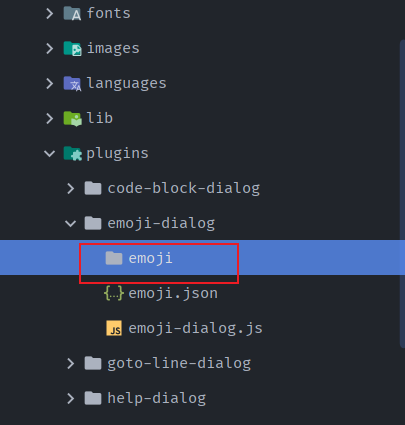

- 修改editormd.js文件

```
// Emoji graphics files url path
editormd.emoji     = {
   path : "../editormd/plugins/emoji-dialog/emoji/",
   ext   : ".png"
};
```

### 5.文章展示

1. Controller 中增加方法

```java
@GetMapping("/{id}")
public String show(@PathVariable("id") int id,Model model){
   Article article = articleMapper.getArticleById(id);
   model.addAttribute("article",article);
   return "article";
}
```

2. 编写页面 article.html

```html
<!DOCTYPE html>
<html lang="en" xmlns:th="http://www.thymeleaf.org">
<head>
   <meta charset="UTF-8">
   <meta name="viewport" content="width=device-width, initial-scale=1, maximum-scale=1">
   <title th:text="${article.title}"></title>
</head>
<body>

<div>
   <!--文章头部信息：标题，作者，最后更新日期，导航-->
   <h2 style="margin: auto 0" th:text="${article.title}"></h2>
  作者：<span style="float: left" th:text="${article.author}"></span>
   <!--文章主体内容-->
   <div id="doc-content">
       <textarea style="display:none;" placeholder="markdown" th:text="${article.content}"></textarea>
   </div>

</div>

<link rel="stylesheet" th:href="@{/editormd/css/editormd.preview.css}" />
<script th:src="@{/lib/jquery.min.js}"></script>
<script th:src="@{/lib/marked.min.js}"></script>
<script th:src="@{/lib/prettify.min.js}"></script>
<script th:src="@{/lib/raphael.min.js}"></script>
<script th:src="@{/lib/underscore.min.js}"></script>
<script th:src="@{/lib/sequence-diagram.min.js}"></script>
<script th:src="@{/lib/flowchart.min.js}"></script>
<script th:src="@{/lib/jquery.flowchart.min.js}"></script>
<script th:src="@{/editormd.js}"></script>

<script type="text/javascript">
   var testEditor;
   $(function () {
       testEditor = editormd.markdownToHTML("doc-content", {//注意：这里是上面DIV的id
           htmlDecode: "style,script,iframe",
           emoji: true,
           taskList: true,
           tocm: true,
           tex: true, // 默认不解析
           flowChart: true, // 默认不解析
           sequenceDiagram: true, // 默认不解析
           codeFold: true
      });});
</script>
</body>
</html>
```

- 重启项目，访问进行测试！大功告成！

## 9.整合Dubbo+Zookeeper


## 🎉🎉结束🎉🎉


