Spring Boot 开发单体应用

## 1.SpringBoot Web开发

**自动装配**

- spring boot到底帮我们配置了什么？我们能不能进行修改？能修改哪些东西25？能不能打展？
  - xxxxAutoConfiguraion.. 向容器中自动配置组件；
  - xxxxProperties：自动配置类，装配配置文件中自定义的一些内容！

## 2.静态资源处理

> 静态资源映射规则

- 搭建一个普通的SpringBoot项目。
  - 写请求非常简单，那我们要引入我们前端资源，我们项目中有许多的静态资源，比如css，js等文件，这 个SpringBoot怎么处理呢？ 
  - 如果我们是一个web应用，我们的main下会有一个webapp，我们以前都是将所有的页面导在这里面 的，对吧！但是我们现在的pom呢，打包方式是为jar的方式，那么这种方式SpringBoot能不能来给我们 写页面呢？当然是可以的，但是SpringBoot对于静态资源放置的位置，是有规定的！

- SpringBoot中，SpringMVC的web配置都在 WebMvcAutoConfiguration 这个配置类里面；有一个方法： `addResourceHandlers` 添加资源处理。

```java
public void addResourceHandlers(ResourceHandlerRegistry registry) {
    if (!this.resourceProperties.isAddMappings()) {
        // 已禁用默认资源处理
        logger.debug("Default resource handling disabled");
    } else {
        // 缓存处理
        Duration cachePeriod = this.resourceProperties.getCache().getPeriod();
        CacheControl cacheControl = this.resourceProperties.getCache().getCachecontrol().toHttpCacheControl();
        // webjars配置
        if (!registry.hasMappingForPattern("/webjars/**")) {
            this.customizeResourceHandlerRegistration(registry.addResourceHandler(new String[]{"/webjars/**"}).addResourceLocations(new String[]{"classpath:/META-INF/resources/webjars/"}).setCachePeriod(this.getSeconds(cachePeriod)).setCacheControl(cacheControl));
        }

        // 静态资源配置
        String staticPathPattern = this.mvcProperties.getStaticPathPattern();
        if (!registry.hasMappingForPattern(staticPathPattern)) {
            this.customizeResourceHandlerRegistration(registry.addResourceHandler(new String[]{staticPathPattern}).addResourceLocations(WebMvcAutoConfiguration.getResourceLocations(this.resourceProperties.getStaticLocations())).setCachePeriod(this.getSeconds(cachePeriod)).setCacheControl(cacheControl));
        }

    }
}
```

- 读一下源代码：比如所有的 /webjars/** ， 都需要去 classpath:/META-INF/resources/webjars/ 找对应的资源。

> 那什么是webjars呢？

- Webjars本质就是以jar包的方式引入我们的静态资源 ， 我们以前要导入一个静态资源文件，直接导入即 可。 
- 使用SpringBoot需要使用Webjars，我们可以去搜索一下： 
- 网站：https://www.webjars.org 【网站带看，并引入jQuery测试】
- 要使用jQuery，我们只要要引入jQuery对应版本的pom依赖即可！

```xml
<dependency>
    <groupId>org.webjars</groupId>
    <artifactId>jquery</artifactId>
    <version>3.4.1</version>
</dependency>
```

- 导入完毕，查看webjars目录结构，并访问Jquery.js文件！

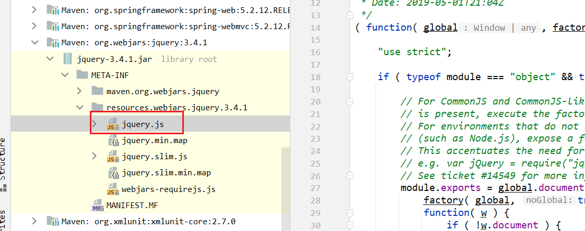

- 访问：只要是静态资源，SpringBoot就会去对应的路径寻找资源，这里访问 ： http://localhost:8080/webjars/jquery/3.4.1/jquery.js

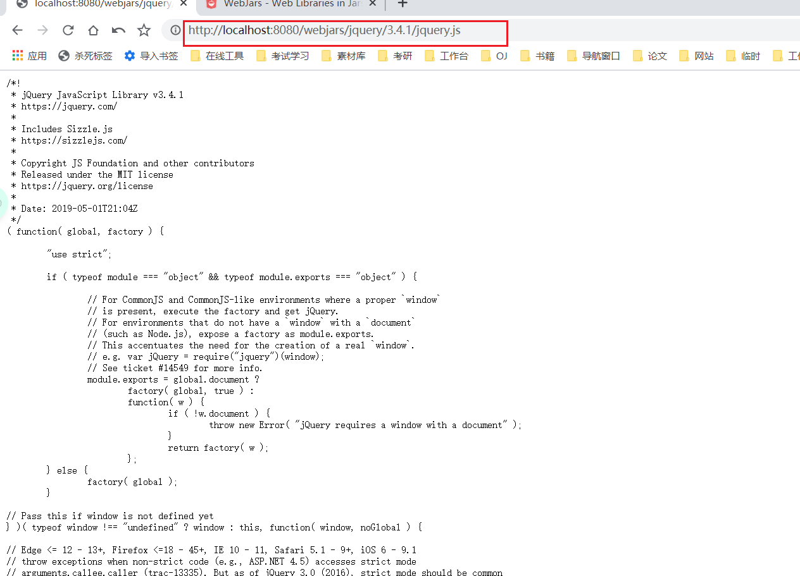

> 第二种静态资源映射规则

- 当项目中要是使用自己的静态资源该怎么导入呢？看下一行代码；
- 去找staticPathPattern发现第二种映射规则 ： /** , 访问当前的项目任意资源，它会去找 resourceProperties 这个类，我们可以点进去看一下分析：

```java
public class ResourceProperties {
    // 找到对应路径
    private static final String[] CLASSPATH_RESOURCE_LOCATIONS = new String[]{"classpath:/META-INF/resources/", "classpath:/resources/", "classpath:/static/", "classpath:/public/"};
    private String[] staticLocations;
    private boolean addMappings;
    private final ResourceProperties.Chain chain;
    private final ResourceProperties.Cache cache;

    public ResourceProperties() {
        // 找到对应的值
        this.staticLocations = CLASSPATH_RESOURCE_LOCATIONS;
        this.addMappings = true;
        this.chain = new ResourceProperties.Chain();
        this.cache = new ResourceProperties.Cache();
    }

    // 进入方法
    public String[] getStaticLocations() {
        return this.staticLocations;
    }
    
    ......
}
```

- ResourceProperties 可以设置和我们静态资源有关的参数；这里面指向了它会去寻找资源的文件夹，即上面数组的内容。 所以得出结论，以下四个目录存放的静态资源可以被我们识别：

```java
"classpath:/META-INF/resources/"
"classpath:/resources/"
"classpath:/static/"
"classpath:/public/"
```

- 在resources根目录下新建对应的文件夹，都可以存放我们的静态文件； 比如我们访问 http://localhost:8080/1.js , 他就会去这些文件夹中寻找对应的静态资源文件；

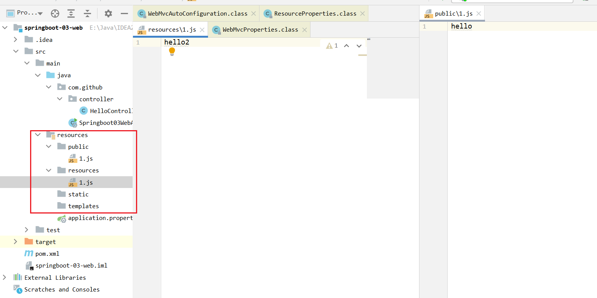

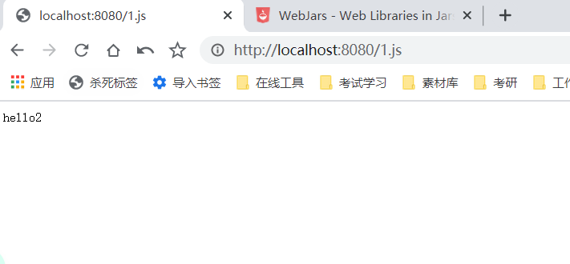

> 自定义静态资源路径 

- 也可以自己通过配置文件来指定一下，哪些文件夹是需要我们放静态资源文件的，在 application.properties中配置；

```properties
spring.resources.static-locations=classpath:/coding/,classpath:/github/
```

- 一旦自己定义了静态文件夹的路径，原来的自动配置就都会失效了！

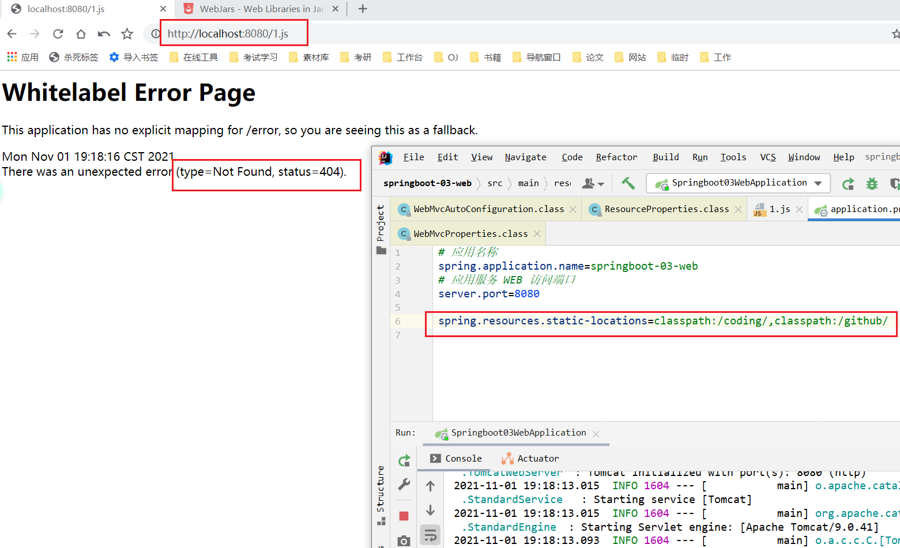

## 3.首页和图标定制

- 继续向下看源码！可以看到一个欢迎页的映射，就是我们的首页！

```java
@Bean
public WelcomePageHandlerMapping welcomePageHandlerMapping(ApplicationContext applicationContext, FormattingConversionService mvcConversionService, ResourceUrlProvider mvcResourceUrlProvider) {
    // getWelcomePage 获得欢迎页
    WelcomePageHandlerMapping welcomePageHandlerMapping = new WelcomePageHandlerMapping(new TemplateAvailabilityProviders(applicationContext), applicationContext, this.getWelcomePage(), this.mvcProperties.getStaticPathPattern());
    welcomePageHandlerMapping.setInterceptors(this.getInterceptors(mvcConversionService, mvcResourceUrlProvider));
    welcomePageHandlerMapping.setCorsConfigurations(this.getCorsConfigurations());
    return welcomePageHandlerMapping;
}
```

- 点击去继续

```java
private Optional<Resource> getWelcomePage() {
    String[] locations = WebMvcAutoConfiguration.getResourceLocations(this.resourceProperties.getStaticLocations());
    // ::是java8 中新引入的运算符
	// Class::function的时候function是属于Class的，应该是静态方法。
	// this::function的funtion是属于这个对象的。
	// 简而言之，就是一种语法糖而已，是一种简写
    return Arrays.stream(locations).map(this::getIndexHtml).filter(this::isReadable).findFirst();
}

// 欢迎页就是一个location下的的 index.html 而已
private Resource getIndexHtml(String location) {
    return this.resourceLoader.getResource(location + "index.html");
}
```

- 欢迎页，静态资源文件夹下的所有 index.html 页面；被 /** 映射。 
- 比如我访问 http://localhost:8080/ ，就会找静态资源文件夹下的 index.html 【可以测试一下】 
- 新建一个 index.html ，在我们上面的3个目录中任意一个；然后访问测试 http://localhost:8080/ 看结果！

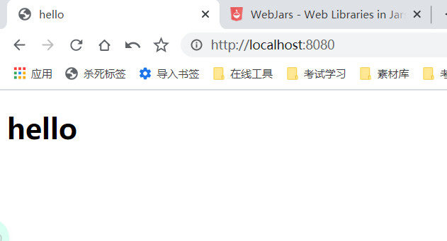

> 关于网站图标说明：

- ==2.2版本之后已删除==！！！

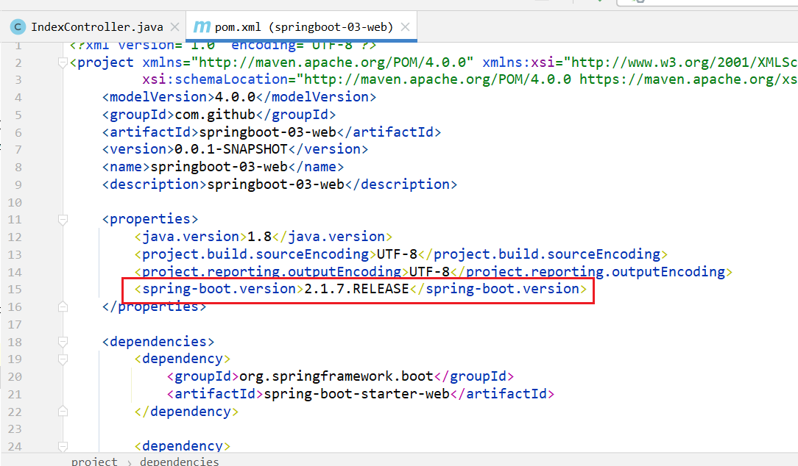

- 与其他静态资源一样，Spring Boot在配置的静态内容位置中查找 favicon.ico。如果存在这样的文件，它将自动用作应用程序的favicon。

1. 关闭SpringBoot默认图标

```properties
# 关闭默认图标
spring.mvc.favicon.enabled=false
```

2. 自己放一个图标在静态资源目录下，我放在 resources目录下，`图标的命名必须是favicon.ico`！
3. 清除浏览器缓存！刷新网页，发现图标已经变成自己的了！

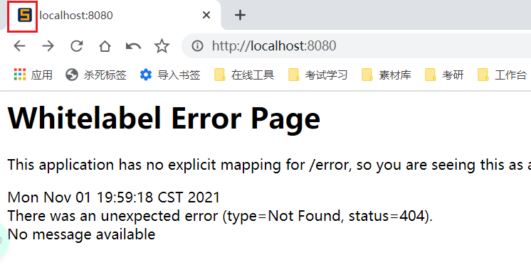

## 4.Thymeleaf模板引擎及语法

> 模板引擎

- 前端交给我们的页面，是html页面。如果是我们以前开发，我们需要把他们转成jsp页面，jsp好处就是当我们查出一些数据转发到JSP页面以后，我们可以用jsp轻松实现数据的显示，及交互等。

- jsp支持非常强大的功能，包括能写Java代码，但是呢，我们现在的这种情况，SpringBoot这个项目首先是以jar的方式，不是war，像第二，我们用的还是嵌入式的Tomcat，所以呢，他现在默认是不支持jsp 的。
- 那不支持jsp，如果我们直接用纯静态页面的方式，那给我们开发会带来非常大的麻烦，那怎么办呢？ 
- SpringBoot推荐你可以来使用模板引擎： 
- 模板引擎，我们其实大家听到很多，其实jsp就是一个模板引擎，还有以用的比较多的freemarker，包括 SpringBoot给我们推荐的Thymeleaf，模板引擎有非常多，但再多的模板引擎，他们的思想都是一样 的，什么样一个思想呢我们来看一下这张图：

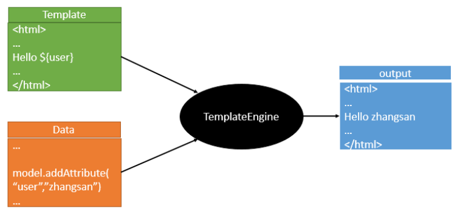

- 模板引擎的作用就是我们来写一个页面模板，比如有些值呢，是动态的，我们写一些表达式。而这些 值，从哪来呢，就是我们在后台封装一些数据。然后把这个模板和这个数据交给我们模板引擎，模板引擎按照我们这个数据帮你把这表达式解析、填充到我们指定的位置，然后把这个数据最终生成一个我们 想要的内容给我们写出去，这就是我们这个模板引擎，不管是jsp还是其他模板引擎，都是这个思想。只 不过呢，就是说不同模板引擎之间，他们可能这个语法有点不一样。其他的我就不介绍了，我主要来介 绍一下SpringBoot给我们推荐的Thymeleaf模板引擎，这模板引擎呢，是一个高级语言的模板引擎，他 的这个语法更简单。而且呢，功能更强大。
- 首先，我们来看SpringBoot里边怎么用。

> 引入Thymeleaf

- 怎么引入呢，对于springboot来说，什么事情不都是一个start的事情嘛，我们去在项目中引入一下。给如下三个网址：
- Thymeleaf 官网：https://www.thymeleaf.org/
- Thymeleaf 在Github 的主页：https://github.com/thymeleaf/thymeleaf
- Spring官方文档：  找到我们对应的版本，[Spring Boot Reference Documentation](https://docs.spring.io/spring-boot/docs/2.5.6/reference/htmlsingle/#using.build-systems.starters)
- 找到对应的pom依赖：可以适当点进源码看下本来的包！

```xml
<!--thymeleaf-->
<dependency>
	<groupId>org.springframework.boot</groupId>
	<artifactId>spring-boot-starter-thymeleaf</artifactId>
</dependency>
```

- Maven会自动下载jar包，我们可以去看下下载的东西；

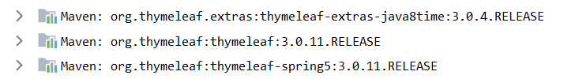

> thymeleaf 分析

- 前面已经引入了Thymeleaf，那这个要怎么使用呢？ 
- 我们首先得按照SpringBoot的自动配置原理看一下我们这个Thymeleaf的自动配置规则，在按照那个规则，我们进行使用。 
- 先去找一下Thymeleaf的自动配置类：ThymeleafProperties

```java
@ConfigurationProperties(
    prefix = "spring.thymeleaf"
)
public class ThymeleafProperties {
    private static final Charset DEFAULT_ENCODING;
    public static final String DEFAULT_PREFIX = "classpath:/templates/";
    public static final String DEFAULT_SUFFIX = ".html";
    private boolean checkTemplate = true;
    private boolean checkTemplateLocation = true;
    private String prefix = "classpath:/templates/";
    private String suffix = ".html";
    private String mode = "HTML";
    private Charset encoding;
    private boolean cache;
    private Integer templateResolverOrder;
    private String[] viewNames;
    private String[] excludedViewNames;
    private boolean enableSpringElCompiler;
    private boolean renderHiddenMarkersBeforeCheckboxes;
    private boolean enabled;
    private final ThymeleafProperties.Servlet servlet;
    private final ThymeleafProperties.Reactive reactive;
}
```

- 可以在其中看到默认的前缀和后缀！ 

- 我们只需要把我们的html页面放在类路径下的templates下，thymeleaf就可以帮我们自动渲染了。 

- 使用thymeleaf什么都不需要配置，只需要将他放在指定的文件夹下即可！ 

**测试**：

1. 编写一个TestController

```java
@Controller
public class TestController {
    @RequestMapping("/t1")
    public String test(){
        // classpath:/templates/test.html
        return "test";
    }
}
```

2. 编写一个测试页面 test.html 放在 templates 目录下

```html
<!DOCTYPE html>
<html lang="en">
<head>
    <meta charset="UTF-8">
    <title>测试</title>
</head>
<body>

  <h1>测试页</h1>
</body>
</html>
```

3. 启动项目请求测试

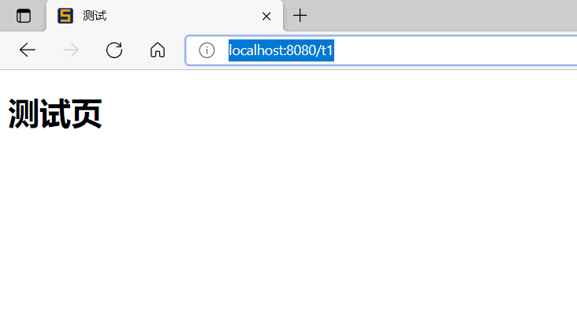

> Thymeleaf 语法学习

- 语法学习，参考官网：[Thymeleaf](https://www.thymeleaf.org/)
- 做个最简单的练习 ： 我们需要查出一些数据，在页面中展示。

1. 修改测试请求，增加数据传输；

```java
@Controller
public class TestController {
    @RequestMapping("/t1")
    public String test(Model model){
        // 存入数据
        // 注：不被转移就是字符串，转义了才是页面
        model.addAttribute("msg","hello,Thymeleaf");
        // classpath:/templates/test.html
        return "test";
    }
}
```

2. 要使用thymeleaf，需要在html文件中导入命名空间的约束，方便提示。可以去官方文档的#3中看一下命名空间拿来过来：

```java
<html xmlns:th="http://www.thymeleaf.org">
```

3. 编写前端页面

```html
<!DOCTYPE html>
<html lang="en" xmlns:th="http://www.thymeleaf.org">
<head>
    <meta charset="UTF-8">
    <title>测试</title>
</head>
<body>

  <h1>测试页</h1>
  <!-- 所有的html元素都可以被thymeleaf替换接管： th:元素名
  th:text就是将div中的内容设置为它指定的值 -->
  <div th:text="${msg}"></div>

</body>
</html>
```

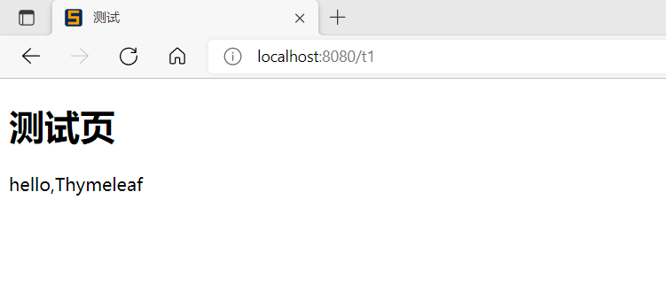

- OK，入门搞定，我们来认真研习一下Thymeleaf的使用语法！ 

1. 可以使用任意的 th:attr 来替换Html中原生属性的值！[参考官网文档#10； th语法](https://www.thymeleaf.org/doc/tutorials/3.0/usingthymeleaf.html#attribute-precedence)

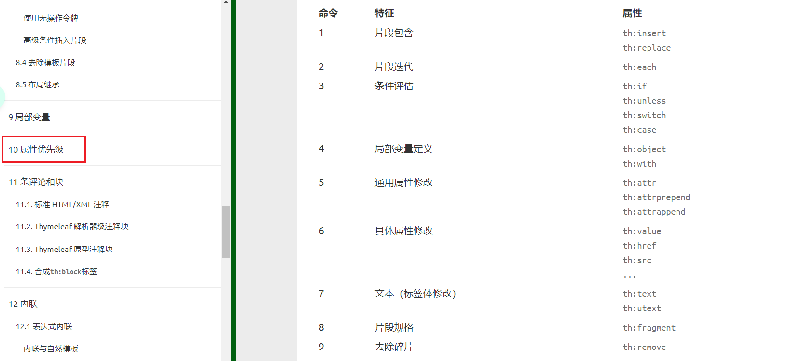

2. 具体能写那些表达式呢？可以参考官方文档 #4

```java
Simple expressions:（表达式语法）
Variable Expressions: ${...}：获取变量值；OGNL；
  1）、获取对象的属性、调用方法
  2）、使用内置的基本对象： #18
      #ctx : the context object.
      #vars: the context variables.
      #locale : the context locale.
      #request : (only in Web Contexts) the HttpServletRequest object.
      #response : (only in Web Contexts) the HttpServletResponse object.
      #session : (only in Web Contexts) the HttpSession object.
      #servletContext : (only in Web Contexts) the ServletContext object.
  3）、内置的一些工具对象：
      #execInfo : information about the template being processed.
      #uris : methods for escaping parts of URLs/URIs
      #conversions : methods for executing the configured conversion
  service (if any).
  	  #dates : methods for java.util.Date objects: formatting, component
  extraction, etc.
  	  #calendars : analogous to #dates , but for java.util.Calendar
  objects.
      #numbers : methods for formatting numeric objects.
      #strings : methods for String objects: contains, startsWith,
  prepending/appending, etc.
      #objects : methods for objects in general.
      #bools : methods for boolean evaluation.
      #arrays : methods for arrays.
      #lists : methods for lists.
      #sets : methods for sets.
      #maps : methods for maps.
      #aggregates : methods for creating aggregates on arrays or
  collections.
  ============================================================================
  ======
          
      Selection Variable Expressions: *{...}：选择表达式：和${}在功能上是一样；
      Message Expressions: #{...}：获取国际化内容
      Link URL Expressions: @{...}：定义URL；
      Fragment Expressions: ~{...}：片段引用表达式
  Literals（字面量）
      Text literals: 'one text' , 'Another one!' ,…
      Number literals: 0 , 34 , 3.0 , 12.3 ,…
      Boolean literals: true , false
      Null literal: null
      Literal tokens: one , sometext , main ,…
  Text operations:（文本操作）
      String concatenation: +
      Literal substitutions: |The name is ${name}|
  Arithmetic operations:（数学运算）
      Binary operators: + , - , * , / , %
      Minus sign (unary operator): -
  Boolean operations:（布尔运算）
      Binary operators: and , or
      Boolean negation (unary operator): ! , not
  Comparisons and equality:（比较运算）
      Comparators: > , < , >= , <= ( gt , lt , ge , le )
	  Equality operators: == , != ( eq , ne )
  Conditional operators:条件运算（三元运算符）
      If-then: (if) ? (then)
      If-then-else: (if) ? (then) : (else)
      Default: (value) ?: (defaultvalue)
  Special tokens:
  	  No-Operation: _
```


**练习测试**： 

1. 编写一个Controller，放一些数据。

```java
@RequestMapping("/t2")
public String test2(Map<String, Object> map) {
    // 存入数据
    map.put("msg","<h1>MSD</h1>");
    map.put("users", Arrays.asList("subei","github"));
    return "test";
}
```

2. 编写前端页面

```html
<!DOCTYPE html>
<html lang="en" xmlns:th="http://www.thymeleaf.org">
<head>
    <meta charset="UTF-8">
    <title>测试</title>
</head>
<body>

  <h1>测试页</h1>
  <!-- 所有的html元素都可以被thymeleaf替换接管： th:元素名
  th:text就是将div中的内容设置为它指定的值 -->
  <div th:text="${msg}"></div>

<!--  不转义  -->
  <div th:utext="${msg}"></div>

<!--遍历数据-->
<!--th:each每次遍历都会生成当前这个标签：官网#9-->
<h3 th:each="user :${users}" th:text="${user}"></h3>

</body>
</html>
```

3. 启动测试！

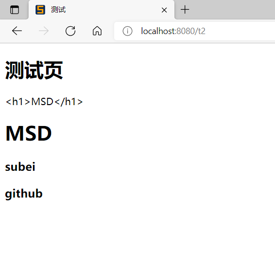


==根据官方文档来查询，才是最重要的，要熟练使用官方文档！==

## 5.Spring MVC 配置原理

> 阅读官网

在进行项目编写前，还需要知道一个东西，就是SpringBoot对我们的SpringMVC还做了哪些配置，包括如何扩展，如何定制。 

只有把这些都搞清楚了，在之后的使用才会更加得心应手。 

- 途径一：源码分析；

- 途径二：官方文档！ 地址 ：[Spring Boot Reference Documentation](https://docs.spring.io/spring-boot/docs/2.5.6/reference/htmlsingle/#features.developing-web-applications.spring-mvc.auto-configuration)

```java
Spring MVC Auto-configuration
// Spring Boot为Spring MVC提供了自动配置，它可以很好地与大多数应用程序一起工作。
Spring Boot provides auto-configuration for Spring MVC that works well with most applications.
// 自动配置在Spring默认设置的基础上添加了以下功能：
The auto-configuration adds the following features on top of Spring’s defaults:
// 包含视图解析器
Inclusion of ContentNegotiatingViewResolver and BeanNameViewResolver beans.
// 支持静态资源文件夹的路径，以及webjars
Support for serving static resources, including support for WebJars 
// 自动注册了Converter：
// 转换器，这就是我们网页提交数据到后台自动封装成为对象的东西，比如把"1"字符串自动转换为int类型
// Formatter：【格式化器，比如页面给我们了一个2019-8-10，它会给我们自动格式化为Date对象】
Automatic registration of Converter, GenericConverter, and Formatter beans.
// HttpMessageConverters
// SpringMVC用来转换Http请求和响应的的，比如我们要把一个User对象转换为JSON字符串，可以去看官网文档解释；
Support for HttpMessageConverters (covered later in this document).
// 定义错误代码生成规则的
Automatic registration of MessageCodesResolver (covered later in this document).
// 首页定制
Static index.html support.
// 图标定制
Custom Favicon support (covered later in this document).
// 初始化数据绑定器：帮我们把请求数据绑定到JavaBean中！
Automatic use of a ConfigurableWebBindingInitializer bean (covered later in this document).

/*
如果您希望保留Spring Boot MVC功能，并且希望添加其他MVC配置（拦截器、格式化程序、视图控制器和其他功能），则可以添加自己
的@configuration类，类型为webmvcconfiguer，但不添加@EnableWebMvc。如果希望提供
RequestMappingHandlerMapping、RequestMappingHandlerAdapter或ExceptionHandlerExceptionResolver的自定义
实例，则可以声明WebMVCregistrationAdapter实例来提供此类组件。
*/
If you want to keep Spring Boot MVC features and you want to add additional MVC configuration 
(interceptors, formatters, view controllers, and other features), you can add your own 
@Configuration class of type WebMvcConfigurer but without @EnableWebMvc. If you wish to provide 
custom instances of RequestMappingHandlerMapping, RequestMappingHandlerAdapter, or 
ExceptionHandlerExceptionResolver, you can declare a WebMvcRegistrationsAdapter instance to provide such components.

// 如果您想完全控制Spring MVC，可以添加自己的@Configuration，并用@EnableWebMvc进行注释。
If you want to take complete control of Spring MVC, you can add your own @Configuration annotated with @EnableWebMvc.
```

- 仔细对照，看一下它怎么实现的，它告诉我们SpringBoot已经帮我们自动配置好了SpringMVC，然后自动配置了哪些东西呢？

> **ContentNegotiatingViewResolver 内容协商视图解析器** 

自动配置了ViewResolver，就是之前学习的SpringMVC的视图解析器；

即根据方法的返回值取得视图对象（View），然后由视图对象决定如何渲染（转发，重定向）。

- 去看看这里的源码：我们找到 WebMvcAutoConfiguration ， 然后搜索ContentNegotiatingViewResolver。找到如下方法！

```java
@Bean
@ConditionalOnBean(ViewResolver.class)
@ConditionalOnMissingBean(name = "viewResolver", value = ContentNegotiatingViewResolver.class)
public ContentNegotiatingViewResolver viewResolver(BeanFactory beanFactory) {
    ContentNegotiatingViewResolver resolver = new ContentNegotiatingViewResolver();
    resolver.setContentNegotiationManager(beanFactory.getBean(ContentNegotiationManager.class));
    // ContentNegotiatingViewResolver使用所有其他视图解析器来定位视图，因此它应该具有较高的优先级
    resolver.setOrder(Ordered.HIGHEST_PRECEDENCE);
    return resolver;
}
```

- 点进这类看看！找到对应的解析视图的代码；

```java
@Nullable // 注解说明：@Nullable 即参数可为null
public View resolveViewName(String viewName, Locale locale) throws Exception {
    RequestAttributes attrs = RequestContextHolder.getRequestAttributes();
    Assert.state(attrs instanceof ServletRequestAttributes, "No current ServletRequestAttributes");
    List<MediaType> requestedMediaTypes = this.getMediaTypes(((ServletRequestAttributes)attrs).getRequest());
    if (requestedMediaTypes != null) {
        // 获取候选的视图对象
        List<View> candidateViews = this.getCandidateViews(viewName, locale, requestedMediaTypes);
        // 选择一个最适合的视图对象，然后把这个对象返回
        View bestView = this.getBestView(candidateViews, requestedMediaTypes, attrs);
        if (bestView != null) {
            return bestView;
        }
    }

    String mediaTypeInfo = this.logger.isDebugEnabled() && requestedMediaTypes != null ? " given " + requestedMediaTypes.toString() : "";
    if (this.useNotAcceptableStatusCode) {
        if (this.logger.isDebugEnabled()) {
            this.logger.debug("Using 406 NOT_ACCEPTABLE" + mediaTypeInfo);
        }

        return NOT_ACCEPTABLE_VIEW;
    } else {
        this.logger.debug("View remains unresolved" + mediaTypeInfo);
        return null;
    }
}
```

- 继续点进去看，他是怎么获得候选的视图的呢？

- getCandidateViews中看到他是把所有的视图解析器拿来，进行while循环，挨个解析！

```java
Iterator var5 = this.viewResolvers.iterator();
```

- 所以得出结论：**ContentNegotiatingViewResolver 这个视图解析器就是用来组合所有的视图解析器的** 

- 再去研究下他的组合逻辑，看到有个属性viewResolvers，看看它是在哪里进行赋值的！

```java
protected void initServletContext(ServletContext servletContext) {
    // 这里它是从beanFactory工具中获取容器中的所有视图解析器
    // ViewRescolver.class 把所有的视图解析器来组合的
    Collection<ViewResolver> matchingBeans = BeanFactoryUtils.beansOfTypeIncludingAncestors(this.obtainApplicationContext(), ViewResolver.class).values();
    ViewResolver viewResolver;
    if (this.viewResolvers == null) {
        this.viewResolvers = new ArrayList(matchingBeans.size());
    }
    // ...............
}
```

- 既然它是在容器中去找视图解析器，是否可以猜想，可以去实现一个视图解析器了呢？

- 可以自己给容器中去添加一个视图解析器；这个类就会帮我们自动的将它组合进来；

1. 在主程序中去写一个视图解析器来试试；

```java
```

2. 看我们自己写的视图解析器有没有起作用呢？ 我们给 DispatcherServlet 中的doDispatch方法加个断点进行调试一下，因为所有的请求都会走到这个方法中。

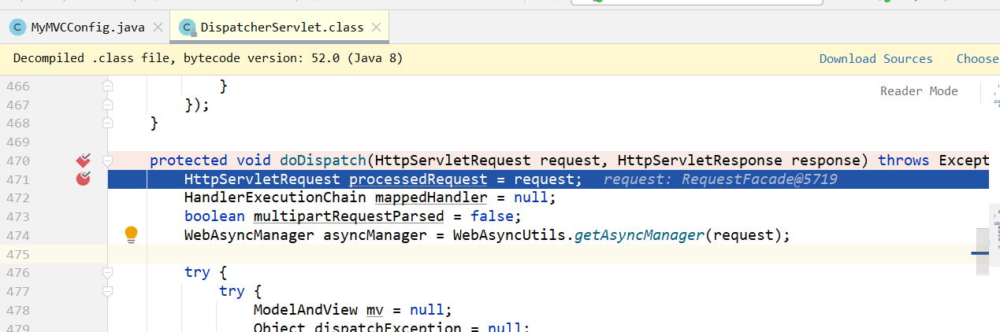

3. 启动我们的项目，然后随便访问一个页面，看一下Debug信息；

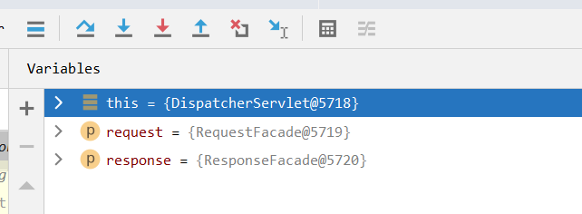

- 找到视图解析器，看到我们自己定义的就在这里了；

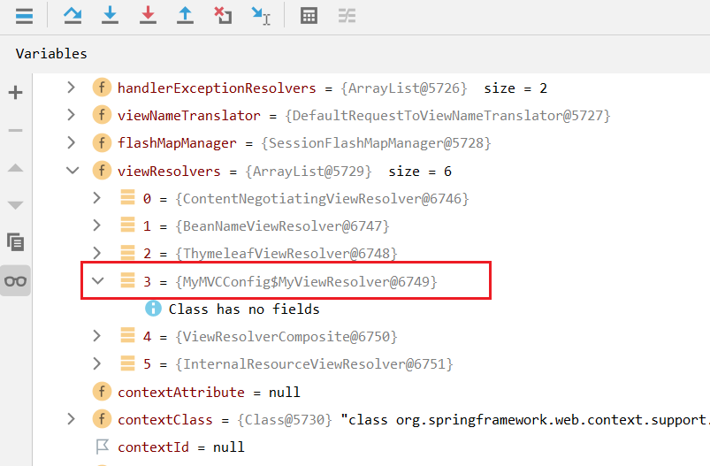

- 所以说，如果想要使用自己定制化的东西，只需要给容器中添加这个组件就好了！剩下的事情SpringBoot就会帮我们做了！

> 转换器和格式化器

- 找到格式化转换器：

```java
@Bean
public FormattingConversionService mvcConversionService() {
    // 拿到配置文件中的格式化规则
    WebConversionService conversionService = new WebConversionService(this.mvcProperties.getDateFormat());
    this.addFormatters(conversionService);
    return conversionService;
}
```

- 点进去：

```java
public String getDateFormat() {
    return this.dateFormat;
}

public void setDateFormat(String dateFormat) {
    this.dateFormat = dateFormat;
}

// Date format to use. For instance, `dd/MM/yyyy`. 默认的
private String dateFormat;
```

- 可以看到在Properties文件中，我们可以进行自动配置它！

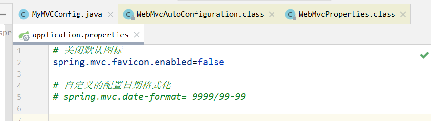

> 修改SpringBoot的默认配置

这么多的自动配置，原理都是一样的，通过这个WebMVC的自动配置原理分析，我们要学会一种学习方式，通过源码探究，得出结论；这个结论一定是属于自己的，而且一通百通。

SpringBoot的底层，大量用到了这些设计细节思想，所以，没事需要多阅读源码！得出结论；

SpringBoot在自动配置很多组件的时候，先看容器中有没有用户自己配置的（如果用户自己配置@bean），如果有就用用户配置的，如果没有就用自动配置的；

如果有些组件可以存在多个，比如我们的视图解析器，就将用户配置的和自己默认的组合起来！

**扩展使用SpringMVC**  官方文档如下：

```java
If you want to keep Spring Boot MVC features and you want to add additional MVC configuration (interceptors, formatters, view controllers, and other features), you can add your own @Configuration class of type WebMvcConfigurer but without @EnableWebMvc. If you wish to provide custom instances of RequestMappingHandlerMapping, RequestMappingHandlerAdapter, or ExceptionHandlerExceptionResolver, you can declare a WebMvcRegistrationsAdapter instance to provide such components.
```

----

- 要做的就是编写一个@Configuration注解类，并且类型要为WebMvcConfigurer，还不能标注@EnableWebMvc注解；我们去自己写一个；我们新建一个包叫config，写一个类MyMvcConfig；

```java
// 扩展springmvc Dispacherservle
//可以使用自定义类扩展MVC的功能
@Configuration
public class MyMVCConfig implements WebMvcConfigurer {

    @Override
    public void addViewControllers(ViewControllerRegistry registry){
        // 浏览器发送/test ， 就会跳转到test页面；
        registry.addViewController("/test").setViewName("test");
    }
}
```

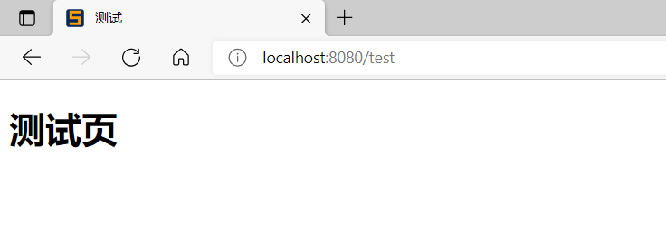


> 确实也跳转过来了！所以说，要扩展SpringMVC，官方就推荐我们这么去使用，既保SpringBoot 留所有的自动配置，也能用我们扩展的配置！ 

- 具体可以去分析一下原理： 
  1. WebMvcAutoConfiguration 是 SpringMVC的自动配置类，里面有一个类 WebMvcAutoConfigurationAdapter
  2. 这个类上有一个注解，在做其他自动配置时会导入： @Import(EnableWebMvcConfiguration.class) 
  3. 当点进EnableWebMvcConfiguration这个类看一下，它继承了一个父类： DelegatingWebMvcConfiguration

```java
@Configuration
public class DelegatingWebMvcConfiguration extends WebMvcConfigurationSupport {
    private final WebMvcConfigurerComposite configurers = new WebMvcConfigurerComposite();

    public DelegatingWebMvcConfiguration() {
    }

    // 从容器中获取所有的webmvcConfigurer
    @Autowired(
        required = false
    )
    public void setConfigurers(List<WebMvcConfigurer> configurers) {
        if (!CollectionUtils.isEmpty(configurers)) {
            this.configurers.addWebMvcConfigurers(configurers);
        }

    }
}
```

4. 可以在这个类中去寻找一个上面刚才设置的viewController当做参考，发现它调用了一个。

```java
public void addWebMvcConfigurers(List<WebMvcConfigurer> configurers) {
    if (!CollectionUtils.isEmpty(configurers)) {
        this.delegates.addAll(configurers);
    }

}
```

5. 点进去：

```java
public void addFormatters(FormatterRegistry registry) {
    Iterator var2 = this.delegates.iterator();

    while(var2.hasNext()) {
        // 将所有的WebMvcConfigurer相关配置来一起调用！包括我们自己配置的和Spring给我们配置的
        WebMvcConfigurer delegate = (WebMvcConfigurer)var2.next();
        delegate.addFormatters(registry);
    }

}
```

- 所以得出结论：所有的WebMvcConfiguration都会被作用，不止Spring自己的配置类，我们自己的配置类当然也会被调用；

> 全面接管SpringMVC

- 官方文档：

```xml
If you want to take complete control of Spring MVC
you can add your own @Configuration annotated with @EnableWebMvc.
```

- 全面接管即：SpringBoot对SpringMVC的自动配置不需要了，所有都是我们自己去配置！
- 只需在我们的配置类中要加一个@EnableWebMvc。
- 看下如果我们全面接管了SpringMVC了，我们之前SpringBoot给我们配置的静态资源映射一定会无效，我们可以去测试一下；
- 不加注解之前，访问首页：

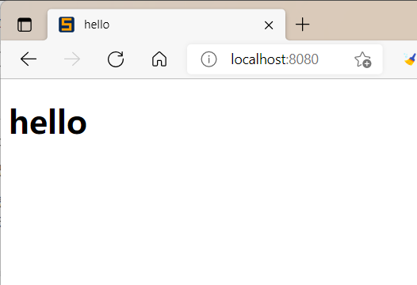

- 给配置类加上注解：`@EnableWebMvc`：

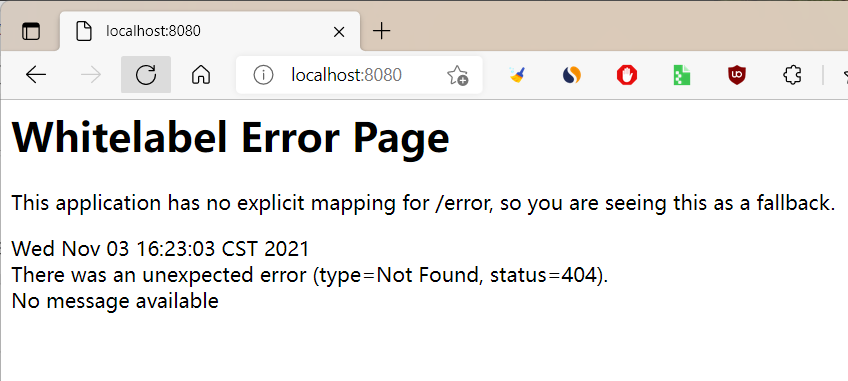

- 发现所有的SpringMVC自动配置都失效了！回归到了最初的样子；
- 所以，开发中不推荐使用全面接管SpringMVC。

> 为什么加了一个注解，自动配置就失效了！看下源码：

1. 可以发现它是导入了一个类，可以继续进去看：

```java
@Retention(RetentionPolicy.RUNTIME)
@Target({ElementType.TYPE})
@Documented
@Import({DelegatingWebMvcConfiguration.class})
public @interface EnableWebMvc {
}
```

2. 它继承了一个父类`WebMvcConfigurationSupport`：

```java
@Configuration
public class DelegatingWebMvcConfiguration extends WebMvcConfigurationSupport {
    private final WebMvcConfigurerComposite configurers = new WebMvcConfigurerComposite();
.......
}
```

3. 来回顾一下Webmvc自动配置类：

```java
@Configuration
@ConditionalOnWebApplication(
    type = Type.SERVLET
)
@ConditionalOnClass({Servlet.class, DispatcherServlet.class, WebMvcConfigurer.class})
// 容器中没有这个组件的时候，这个自动配置类才生效
@ConditionalOnMissingBean({WebMvcConfigurationSupport.class})
@AutoConfigureOrder(-2147483638)
@AutoConfigureAfter({DispatcherServletAutoConfiguration.class, TaskExecutionAutoConfiguration.class, ValidationAutoConfiguration.class})
public class WebMvcAutoConfiguration {
    public static final String DEFAULT_PREFIX = "";
    public static final String DEFAULT_SUFFIX = "";
    private static final String[] SERVLET_LOCATIONS = new String[]{"/"};

    public WebMvcAutoConfiguration() {
    }
    ......
}
```

- 总结一句话：@EnableWebMvc将WebMvcConfigurationSupport组件导入进来了；而导入的WebMvcConfigurationSupport只是SpringMVC最基本的功能！

----

## 6.配置环境及首页

1. 新建spring boot项目，导入依赖包。

```xml
<?xml version="1.0" encoding="UTF-8"?>
<project xmlns="http://maven.apache.org/POM/4.0.0"
         xmlns:xsi="http://www.w3.org/2001/XMLSchema-instance"
         xsi:schemaLocation="http://maven.apache.org/POM/4.0.0
         https://maven.apache.org/xsd/maven-4.0.0.xsd">
    <modelVersion>4.0.0</modelVersion>
    <parent>
        <groupId>org.springframework.boot</groupId>
        <artifactId>spring-boot-starter-parent</artifactId>
        <version>2.1.7.RELEASE</version>
        <relativePath/>
        <!-- lookup parent from repository -->
    </parent>
    <groupId>com.github</groupId>
    <artifactId>springboot-04-demo</artifactId>
    <version>0.0.1-SNAPSHOT</version>
    <name>springboot-04-demo</name>
    <description>springboot-04-demo</description>
    <properties>
        <java.version>1.8</java.version>
        <project.build.sourceEncoding>UTF-8</project.build.sourceEncoding>
        <project.reporting.outputEncoding>UTF-8</project.reporting.outputEncoding>
    </properties>
    <dependencies>
        <dependency>
            <groupId>org.springframework.boot</groupId>
            <artifactId>spring-boot-starter-web</artifactId>
        </dependency>
        <!--thymeleaf-->
        <dependency>
            <groupId>org.springframework.boot</groupId>
            <artifactId>spring-boot-starter-thymeleaf</artifactId>
        </dependency>
<!--   lombok     -->
        <dependency>
            <groupId>org.projectlombok</groupId>
            <artifactId>lombok</artifactId>
        </dependency>
<!--    数据层    -->
        <dependency>
            <groupId>org.mybatis.spring.boot</groupId>
            <artifactId>mybatis-spring-boot-starter</artifactId>
            <version>2.1.4</version>
        </dependency>
        <dependency>
            <groupId>mysql</groupId>
            <artifactId>mysql-connector-java</artifactId>
            <scope>runtime</scope>
        </dependency>
        <dependency>
            <groupId>org.webjars</groupId>
            <artifactId>jquery</artifactId>
            <version>3.6.0</version>
        </dependency>
        <dependency>
            <groupId>org.springframework.boot</groupId>
            <artifactId>spring-boot-starter-test</artifactId>
            <scope>test</scope>
        </dependency>
    </dependencies>

    <build>
        <plugins>
            <plugin>
                <groupId>org.springframework.boot</groupId>
                <artifactId>spring-boot-maven-plugin</artifactId>
            </plugin>
        </plugins>
    </build>

</project>
```

2. 导入实体类

```java
// 部门类
@Data
@AllArgsConstructor
@NoArgsConstructor
public class Department {
    private Integer id;
    private String departmentName;

}
```

```java
// 员工类
@Data
@AllArgsConstructor
@NoArgsConstructor
public class Employee {
    private Integer id;
    private String lastName;
    private String email;
    private Integer gender;
    private Department department;
    private Date birth;

}
```

3. 配置dao层

```java
package com.github.dao;

import com.github.pojo.Department;
import org.springframework.stereotype.Repository;

import java.util.Collection;
import java.util.HashMap;
import java.util.Map;

/**
 * 部门dao
 * @author subeiLY
 * @create 2021-11-05 14:52
 */
@Repository
public class DepartmentDao {
    // 模拟数据库中的数据
    private static Map<Integer, Department> departments=null;

    static {
        departments = new HashMap<Integer, Department>();   // 创建一个部门

        departments.put(101,new Department(101,"运营部"));
        departments.put(102,new Department(102,"策划部"));
        departments.put(103,new Department(103,"法务部"));
        departments.put(104,new Department(104,"开发部"));
        departments.put(105,new Department(105,"宣传部"));

    }

    // 获得所有部门的信息
    public Collection<Department> getDepartments(){
        return departments.values();
    }

    // 通过ID查询部门
    public Department getDepartment(Integer id){
        return departments.get(id);
    }

}
```

```java
package com.github.dao;

import com.github.pojo.Department;
import com.github.pojo.Employee;
import org.springframework.beans.factory.annotation.Autowired;
import org.springframework.stereotype.Repository;

import java.util.Collection;
import java.util.Date;
import java.util.HashMap;
import java.util.Map;

/**
 * @author subeiLY
 * @create 2021-11-05 14:58
 */
@Repository
public class EmployeeDao {
    // 模拟数据库中的数据
    private static Map<Integer, Employee> employees=null;

    // 员工所属部门
    @Autowired
    private DepartmentDao departmentDao;

    static {
        employees = new HashMap<>();   // 创建一个部门

        employees.put(1001,new Employee(1001,"Quary","A2835467@qq.com",1,new Department(1001,"运营部"),new Date()));
        employees.put(1002,new Employee(1002,"Quary","B2835467@qq.com",0,new Department(1002,"策划部"),new Date()));
        employees.put(1003,new Employee(1003,"Quary","C2835467@qq.com",1,new Department(1003,"法务部"),new Date()));
        employees.put(1004,new Employee(1004,"Quary","D2835467@qq.com",0,new Department(1004,"开发部"),new Date()));
        employees.put(1005,new Employee(1005,"Quary","F2835467@qq.com",1,new Department(1005,"宣传部"),new Date()));

    }

    // 增加员工,主键自增
    private static Integer initid=1006;

    public void save(Employee employee){
        if(employee.getId()==null){
            employee.setId(initid);
        }
        employee.setDepartment(departmentDao.getDepartment(employee.getDepartment().getId()));

        employees.put(employee.getId(),employee);

    }

    // 查询全部员工信息
    public Collection<Employee> getAll(){
        return employees.values();
    }

    // 通过ID查询员工
    public Employee getEmployee(Integer id){
        return employees.get(id);
    }

    // 删除员工
    public void delete(Integer id){
        employees.remove(id);
    }

}
```

4. 导入静态资源
   - css，js等放在static文件夹下
   - html 放在 templates文件夹下 
5. 启动类由于是未连接数据库，需要修改为如下：

```java
package com.github;

import org.springframework.boot.SpringApplication;
import org.springframework.boot.autoconfigure.SpringBootApplication;
import org.springframework.boot.autoconfigure.jdbc.DataSourceAutoConfiguration;

@SpringBootApplication(exclude = {DataSourceAutoConfiguration.class})
public class Springboot04DemoApplication {

    public static void main(String[] args) {
        SpringApplication.run(Springboot04DemoApplication.class, args);
    }

}
```

- 最终结构如下：

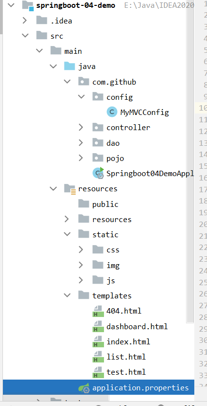

----

> 报错 ：java: 程序包org.junit.jupiter.api不存在

- 在pom.xml中添加

```xml
<dependency>
    <groupId>org.junit.jupiter</groupId>
    <artifactId>junit-jupiter-api</artifactId>
    <version>5.5.0</version>
    <scope>test</scope>
</dependency>
```

> IDEA springboot启动报错:APPLICATION FAILED TO START : Failed to configure a DataSource

- 原因：基于IDEA自带的spring Initializr 来创建springboot项目的,选取了MySQL Driver的依赖包配置,但却没有在配置文件(.yml/.properties/.yaml)中配置过数据源等相关信息,因此就会报错,无法找到数据源Datasource的路径。这里由于我是为了掩饰nacos的某些功能，因此暂时不需要用到数据库。

- 解决方法:

  1. 在配置文件里面,配置数据源

  2. 如果你不需要使用到数据库的话,可以直接在启动类的注解上修改即可:

  ```java
  @SpringBootApplication(exclude = {DataSourceAutoConfiguration.class})
  ```

----

> 首页实现

- 方式一：写一个controller实现！

```java
import org.springframework.stereotype.Controller;
import org.springframework.web.bind.annotation.RequestMapping;

@Controller
public class IndexController {
    /**
     * 会解析到templates目录下的index.html页面
     * @return
     */
    @RequestMapping({"/","/index.html"})
    public String index(){
        return "index";
    }
}
```

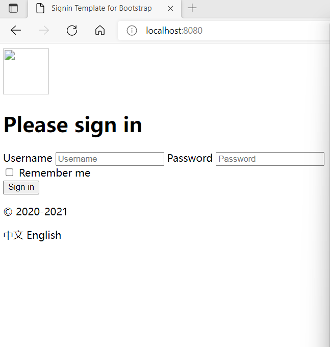

- 方式二：自己编写MVC的扩展配置

```java
package com.github.controller;

import org.springframework.stereotype.Controller;
import org.springframework.web.servlet.config.annotation.ViewControllerRegistry;
import org.springframework.web.servlet.config.annotation.WebMvcConfigurer;

@Controller
public class IndexController implements WebMvcConfigurer {
    @Override
    public void addViewControllers(ViewControllerRegistry registry) {
        registry.addViewController("/").setViewName("index");
        registry.addViewController("/index.html").setViewName("index");
    }
}
```

- 解决了首页问题，还需要解决一个资源导入的问题；为了保证资源导入稳定，建议在所有资源导入时候使用 th:去替换原有的资源路径！这也是模板规范。

```html
<html lang="en" xmlns:th="http://www.thymeleaf.org">
<link th:href="@{/asserts/css/bootstrap.min.css}" rel="stylesheet">
```

```html
<!DOCTYPE html>
<html lang="en" xmlns:th="http://www.thymeleaf.org">
	<head>
		<meta http-equiv="Content-Type" content="text/html; charset=UTF-8">
		<meta name="viewport" content="width=device-width, initial-scale=1, shrink-to-fit=no">
		<meta name="description" content="">
		<meta name="author" content="">
		<title>Signin Template for Bootstrap</title>
		<!-- Bootstrap core CSS -->
		<link th:href="@{/css/bootstrap.min.css}" rel="stylesheet">
		<!-- Custom styles for this template -->
		<link th:href="@{/css/signin.css}" rel="stylesheet">
	</head>

	<body class="text-center">
		<form class="form-signin" action="dashboard.html">
			
			<h1 class="h3 mb-3 font-weight-normal">Please sign in</h1>
			<label class="sr-only">Username</label>
			<input type="text" class="form-control" placeholder="Username" required="" autofocus="">
			<label class="sr-only">Password</label>
			<input type="password" class="form-control" placeholder="Password" required="">
			<div class="checkbox mb-3">
				<label>
          <input type="checkbox" value="remember-me"> Remember me
        </label>
			</div>
			<button class="btn btn-lg btn-primary btn-block" type="submit">Sign in</button>
			<p class="mt-5 mb-3 text-muted">© 2020-2021</p>
			<a class="btn btn-sm">中文</a>
			<a class="btn btn-sm">English</a>
		</form>

	</body>

</html>
```

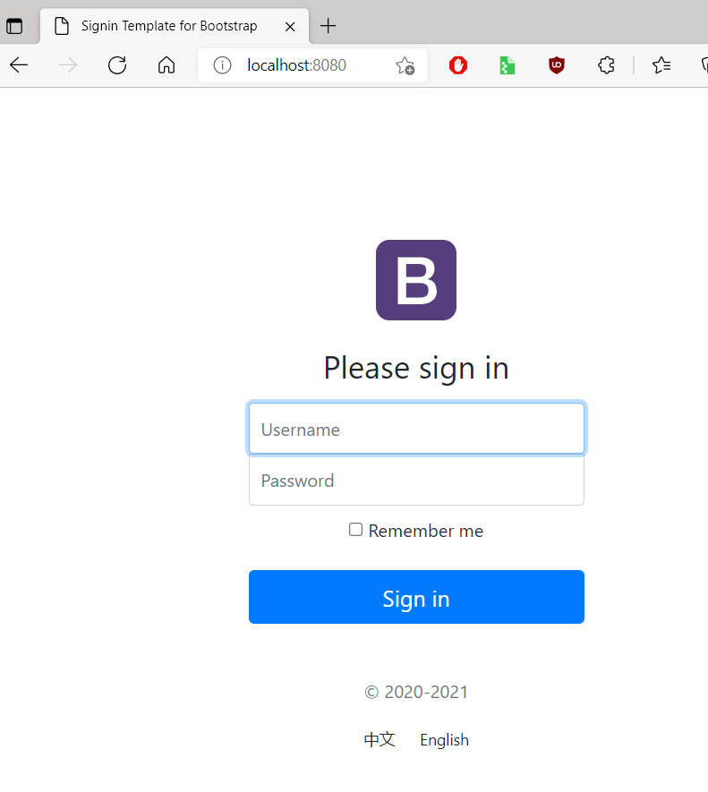

## 7.页面国际化

- 有的时候，我们的网站会去涉及中英文甚至多语言的切换，这时候我们就需要学习国际化了！

> 准备工作

- 先在IDEA中统一设置properties的编码问题！

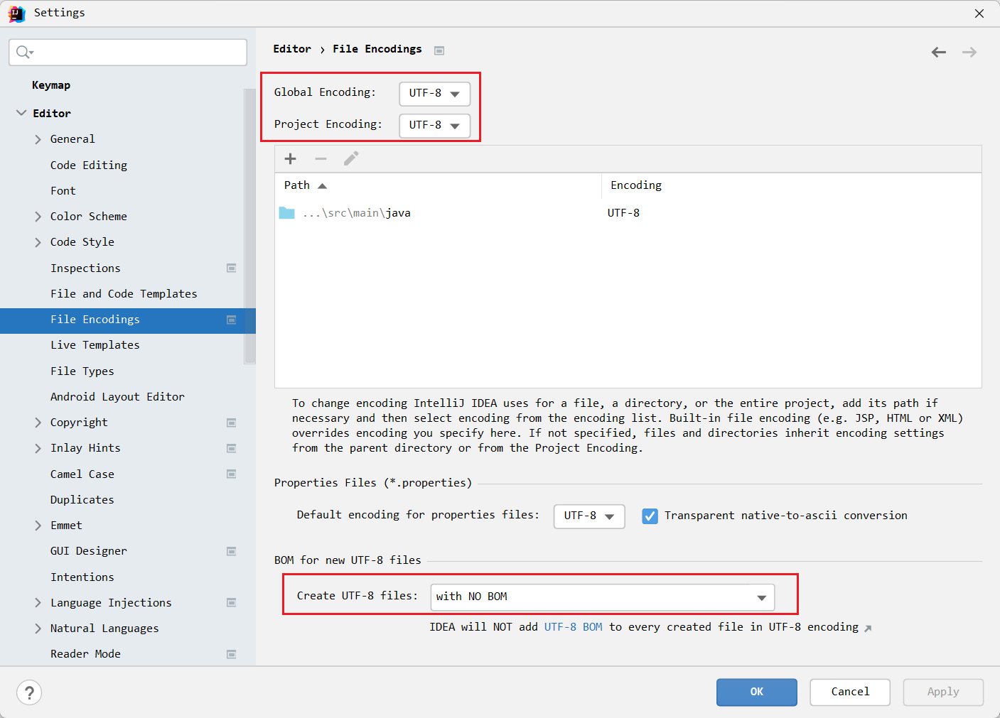

- 编写国际化配置文件，抽取页面需要显示的国际化页面消息。

> 配置文件编写

1. 在resources资源文件下新建一个i18n目录，存放国际化配置文件 

2. 建立一个login.properties文件，还有一个login_zh_CN.properties；发现IDEA自动识别了我们要做 国际化操作；文件夹变了！

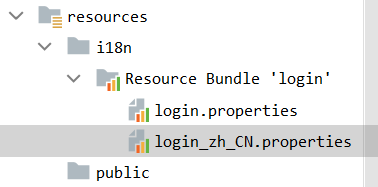

3. 在这上面去新建一个文件；

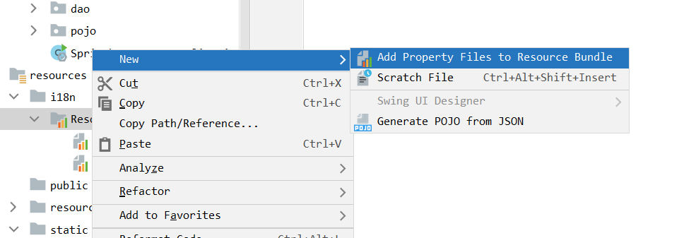

- 弹出如下页面：再添加一个英文的；

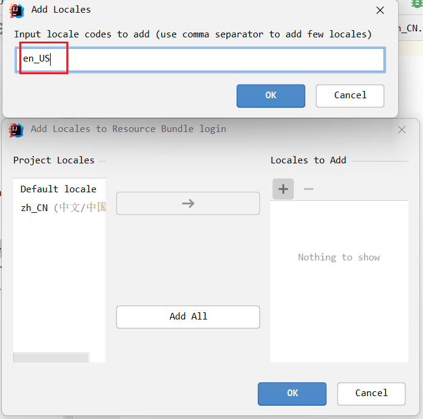

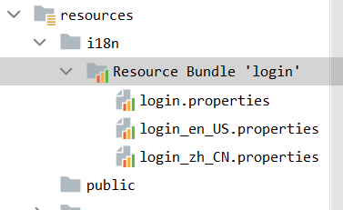

4. 编写配置，依次添加其他页面内容即可！

- login.properties ： 默认

```xml
login.btn=登录
login.password=密码
login.remember=记住我
login.tip=请登录
login.username=用户名
```

- 英文

```xml
login.btn=Sign in
login.password=Password
login.remember=Remember me
login.tip=Please sign in
login.username=Username
```

- 中文

```xml
login.btn=登录
login.password=密码
login.remember=记住我
login.tip=请登录
login.username=用户名
```

- 配置文件完成。

> 配置文件生效探究

- 去看一下SpringBoot对国际化的自动配置！这里又涉及到一个类： `MessageSourceAutoConfiguration` 里面有一个方法，这里发现SpringBoot已经自动配置好了管理我们国际化资源文件的组件 ResourceBundleMessageSource；

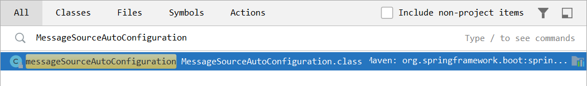

```java
// 获取 properties 传递过来的值进行判断   
@Bean
public MessageSource messageSource(MessageSourceProperties properties) {
    ResourceBundleMessageSource messageSource = new ResourceBundleMessageSource();
    if (StringUtils.hasText(properties.getBasename())) {
        // 设置国际化文件的基础名（去掉语言国家代码的）
        messageSource.setBasenames(StringUtils.commaDelimitedListToStringArray(StringUtils.trimAllWhitespace(properties.getBasename())));
    }

    if (properties.getEncoding() != null) {
        messageSource.setDefaultEncoding(properties.getEncoding().name());
    }

    messageSource.setFallbackToSystemLocale(properties.isFallbackToSystemLocale());
    Duration cacheDuration = properties.getCacheDuration();
    if (cacheDuration != null) {
        messageSource.setCacheMillis(cacheDuration.toMillis());
    }

    messageSource.setAlwaysUseMessageFormat(properties.isAlwaysUseMessageFormat());
    messageSource.setUseCodeAsDefaultMessage(properties.isUseCodeAsDefaultMessage());
    return messageSource;
}
```

- 真实的情况是放在了i18n目录下，所以要去配置这个messages的路径；

```properties
spring.messages.basename=i18n.login
```

> 配置页面国际化值

- 去页面获取国际化的值，查看Thymeleaf的文档，找到message取值操作为： #{...}。我们去页面测试下：

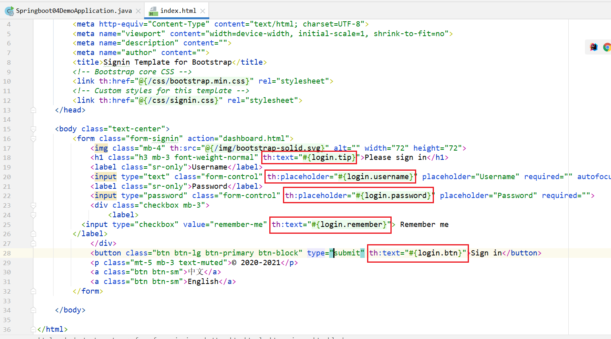

- 可以去启动项目，访问一下，发现已经自动识别为中文的了！

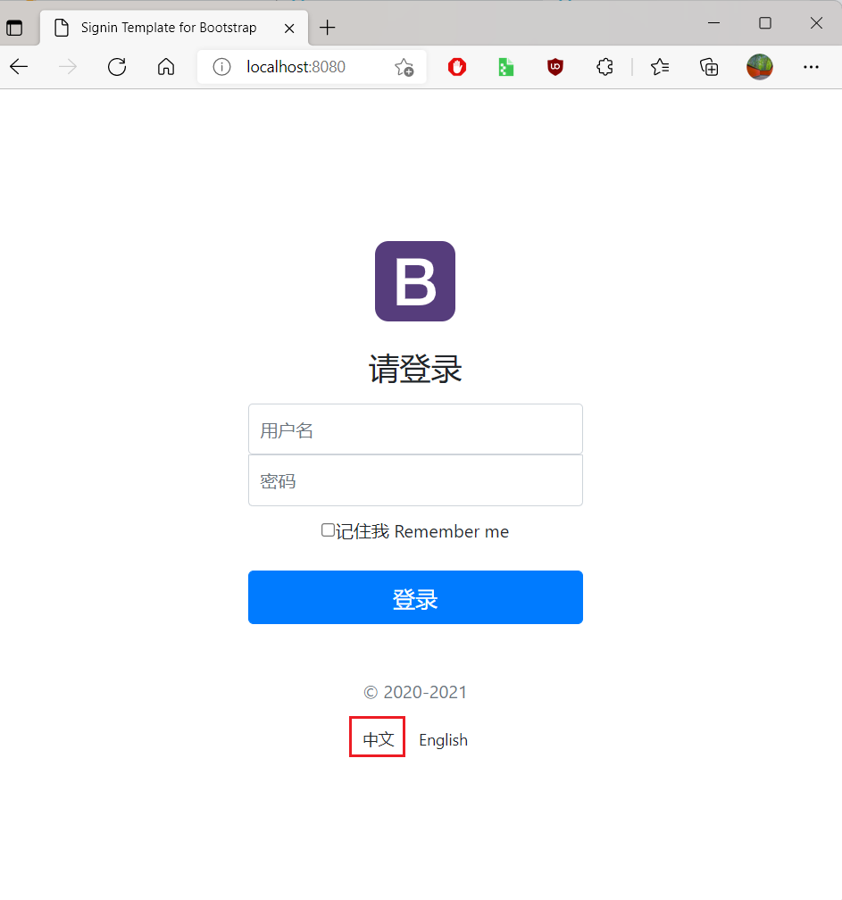

> 配置国际化解析

- 在Spring中有一个国际化的Locale （区域信息对象）；里面有一个叫做LocaleResolver （获取区域信息 对象）的解析器！去webmvc自动配置文件找一下！看到SpringBoot默认配置：

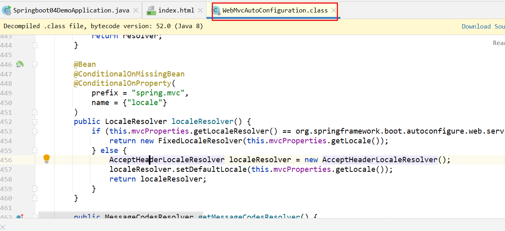

```java
@Bean
@ConditionalOnMissingBean
@ConditionalOnProperty(
    prefix = "spring.mvc",
    name = {"locale"}
)
public LocaleResolver localeResolver() {
    // 容器中没有就自己配，有的话就用用户配置的
    if (this.mvcProperties.getLocaleResolver() == org.springframework.boot.autoconfigure.web.servlet.WebMvcProperties.LocaleResolver.FIXED) {
        return new FixedLocaleResolver(this.mvcProperties.getLocale());
    } else {
        // 接收头国际化分解
        AcceptHeaderLocaleResolver localeResolver = new AcceptHeaderLocaleResolver();
        localeResolver.setDefaultLocale(this.mvcProperties.getLocale());
        return localeResolver;
    }
}
```

- AcceptHeaderLocaleResolver 这个类中有一个方法。

```java
public Locale resolveLocale(HttpServletRequest request) {
    Locale defaultLocale = this.getDefaultLocale();
    // 默认的就是根据请求头带来的区域信息获取Locale进行国际化
    if (defaultLocale != null && request.getHeader("Accept-Language") == null) {
        return defaultLocale;
    } else {
        Locale requestLocale = request.getLocale();
        List<Locale> supportedLocales = this.getSupportedLocales();
        if (!supportedLocales.isEmpty() && !supportedLocales.contains(requestLocale)) {
            Locale supportedLocale = this.findSupportedLocale(request, supportedLocales);
            if (supportedLocale != null) {
                return supportedLocale;
            } else {
                return defaultLocale != null ? defaultLocale : requestLocale;
            }
        } else {
            return requestLocale;
        }
    }
}
```

- 如果我们想点击链接让个人的国际化资源生效，就需要让我们自己的Locale生效！ 需要去自己写一个自己的LocaleResolver，可以在链接上携带区域信息！
- 先修改一下前端页面的跳转：

```html
<!-- 这里传入参数不需要使用 ？ 使用 （key=value）-->
<a class="btn btn-sm" th:href="@{/index.html(l='zh_CN')}">中文</a>
<a class="btn btn-sm" th:href="@{/index.html(l='en_US')}">English</a>
```

- 写一个处理的组件类！

```java
package com.github.component;

import org.springframework.util.StringUtils;
import org.springframework.web.servlet.LocaleResolver;

import javax.servlet.http.HttpServletRequest;
import javax.servlet.http.HttpServletResponse;
import java.util.Locale;

/**
 * 可以在链接上携带区域信息
 */
public class MyLocaleResolver implements LocaleResolver {

    // 解析请求
    @Override
    public Locale resolveLocale(HttpServletRequest request) {
        String language = request.getParameter("l");
        Locale locale = Locale.getDefault(); // 如果没有获取到就使用系统默认的
        // 如果请求链接不为空
        if (!StringUtils.isEmpty(language)) {
            // 分割请求参数
            String[] split = language.split("_");
            // 国家，地区
            locale = new Locale(split[0], split[1]);
        }
        return locale;

    }

    @Override
    public void setLocale(HttpServletRequest httpServletRequest, HttpServletResponse httpServletResponse, Locale locale) {

    }
}
```

- 为了让区域化信息能够生效，需要再配置一下这个组件！在个人的MvcConofig下添加 bean；

```java
@Bean
public LocaleResolver localeResolver(){
    return new MyLocaleResolver();
}
```

- 重启项目，访问一下，发现点击按钮可以实现成功切换！

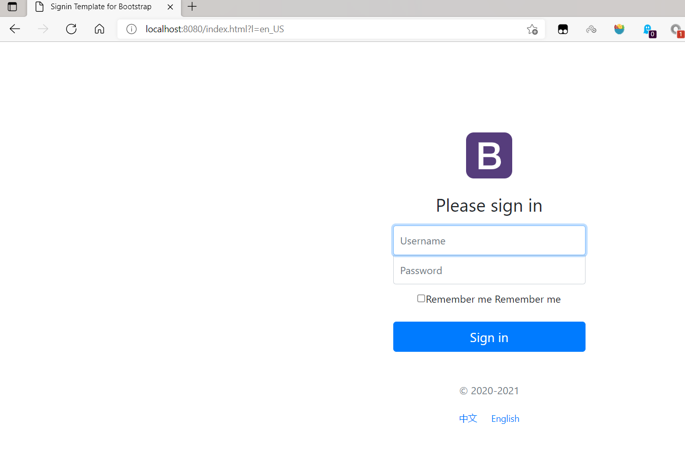

## 8.登录功能实现

> 禁用模板缓存

- 页面存在缓存，所以我们需要禁用模板引擎的缓存。

```properties
# 禁用模板缓存
spring.thymeleaf.cache=false
```

- 模板引擎修改后，想要实时生效！页面修改完毕后，<kbd>Ctrl</kbd> + <kbd>F9</kbd> 重新编译！即可生效！

> 登录

- 先不连接数据库了，输入任意用户名都可以登录成功！

1. 把登录页面的表单提交地址写一个controller！

```java
<form class="form-signin" th:action="@{/user/login}" method="post">
    //这里面的所有表单标签都需要加上一个name属性
</form>
```

2. 编写对应的controller

```java
@Controller
public class LoginController {
    //
    @PostMapping("/user/login")
    public String login(@RequestParam("username") String username,
                        @RequestParam("password") String password,
                        Model model, HttpSession session){
        if (!StringUtils.isEmpty(username) && "123456".equals(password)){
            // 登录成功！将用户信息放入session
            session.setAttribute("loginUser",username);
            return "dashboard"; // 跳转到首页
        }else {
            // 登录失败！存放错误信息
            model.addAttribute("msg","用户名密码错误");
            return "index";
        }
    }
}
```

- 测试登录，默认用户名：admin，密码：123456

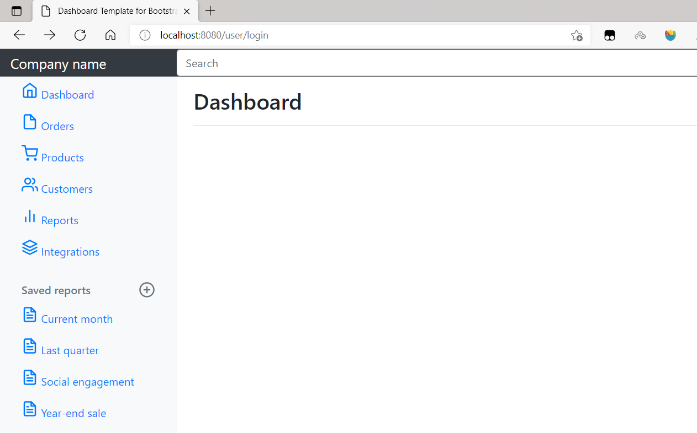

3. 登录失败的话，需要将后台信息输出到前台，可以在首页标题下面加上判断！

```html
<!--判断是否显示，使用if, ${}可以使用工具类，可以看thymeleaf的中文文档-->
<p style="color: red" th:text="${msg}" th:if="${not #strings.isEmpty(msg)}">
</p>
```

- 重启登陆失败测试：

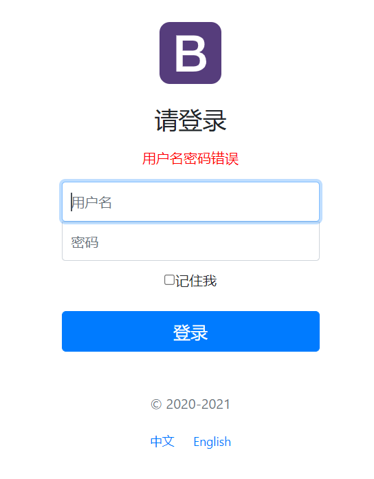

- 优化，登录成功后，由于是转发，链接不变，可以重定向到首页！

4.  再添加一个视图控制映射，在的自己的MyMvcConfig中：

```java
registry.addViewController("/main.html").setViewName("dashboard");
```

5. 将 Controller 的代码改为重定向；

```java
//登录成功！防止表单重复提交，我们重定向
return "redirect:/main.html";
```

- 重启测试，重定向成功！后台主页正常显示！

> 登录拦截器

- 使用拦截器机制，实现登录检查！

1. 先自定义一个拦截器：

```java
package com.github.controller;

import org.springframework.web.servlet.HandlerInterceptor;

import javax.servlet.http.HttpServletRequest;
import javax.servlet.http.HttpServletResponse;

/**
 * 登录拦截器
 * @author subeiLY
 * @create 2021-11-06 23:57
 */
public class LoginHandlerInterceptor implements HandlerInterceptor {
    @Override
    public boolean preHandle(HttpServletRequest request, HttpServletResponse
            response, Object handler) throws Exception {
        // 获取 loginuser 信息进行判断
        Object user = request.getSession().getAttribute("loginUser");
        if(user==null){
            // 未登录，返回首页
            request.setAttribute("msg","没有权限，请登录账户");
            request.getRequestDispatcher("/index.html").forward(request,response);
            return false;
        }else {
            // 登录，放行
            return true;
        }

    }
}
```

2. 然后将拦截器注册到SpringMVC配置类当中——`MyMVCConfig.java`！

```java
@Override
public void addInterceptors(InterceptorRegistry registry) {
    // 注册拦截器，及拦截请求和要剔除哪些请求!
    // 还需要过滤静态资源文件，否则样式显示不出来
    registry.addInterceptor(new LoginHandlerInterceptor())
        .addPathPatterns("/**")
        .excludePathPatterns("/index.html","/","/user/login","/static/**");
}
```

3. 然后在后台主页，获取用户登录的信息——`dashboard.html`。

```html
<!--后台主页显示登录用户的信息-->
[[${session.loginUser}]]
```

- 登录测试拦截！成功！

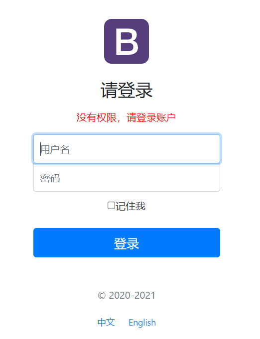

----

> 报错：No mapping for GET /css/bootstrap.min.css

- 在MyMvcConfig.java内加上这两个函数

```java
   private static final String[] CLASSPATH_RESOURCE_LOCATIONS = {
            "classpath:/META-INF/resources/", "classpath:/resources/",
            "classpath:/static/", "classpath:/public/" };
 
 
    @Override
    public void addResourceHandlers(ResourceHandlerRegistry registry) {
        if (!registry.hasMappingForPattern("/webjars/**")) {
            registry.addResourceHandler("/webjars/**").addResourceLocations(
                    "classpath:/META-INF/resources/webjars/");
        }
        if (!registry.hasMappingForPattern("/**")) {
            registry.addResourceHandler("/**").addResourceLocations(
                    CLASSPATH_RESOURCE_LOCATIONS);
        }
 
    }
```

## 9.员工列表实现

> RestFul 风格

- 要求 ： 需要使用 Restful风格实现CRUD操作！

|      | 普通CRUD（uri来区分操作） | RestfulCRUD       |
| :--: | ------------------------- | ----------------- |
| 查询 | getEmp                    | emp--GET          |
| 添加 | addEmp?xxx                | emp--POST         |
| 修改 | updateEmp?id=xxx&xxx=xx   | emp/{id}--PUT     |
| 删除 | deleteEmp?id=1            | emp/{id}---DELETE |

- 看看一些具体的要求，就是需要实现的架构；

| 实验功能                             | 请求URI | 请求方式 |
| ------------------------------------ | ------- | -------- |
| 查询所有员工                         | emps    | GET      |
| 查询某个员工（来到修改页面）         | emp/1   | GET      |
| 来到添加页面                         | emp     | GET      |
| 添加员工                             | emp     | POST     |
| 来到修改页面（查出员工进行信息回显） | emp/1   | GET      |
| 修改员工                             | emp     | PUT      |
| 删除员工                             | emp/1   | DELETE   |

- 根据这些要求，来完成第一个功能，即员工列表功能！

> 员工列表的跳转

- 在主页点击Customers，就显示列表页面；

1. 修改首页侧边栏的Customers为员工管理。

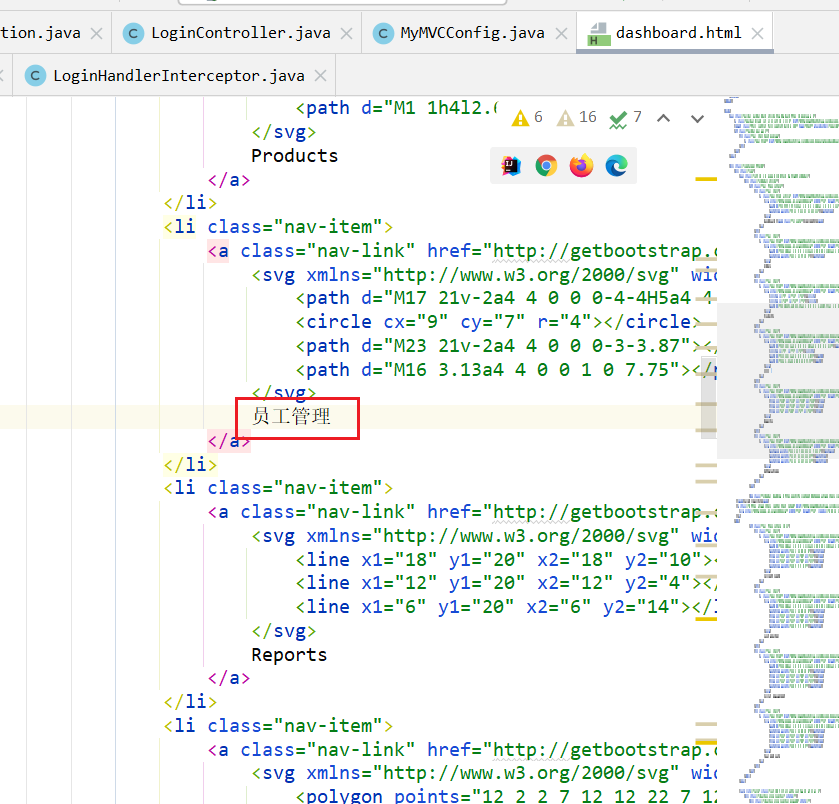

2. a链接添加请求

```html
<li class="nav-item">
    <a class="nav-link" th:href="@{/emps}">
        <svg xmlns="http://www.w3.org/2000/svg" width="24" height="24" viewBox="0 0 24 24" fill="none" stroke="currentColor" stroke-width="2" stroke-linecap="round" stroke-linejoin="round" class="feather feather-users">
            <path d="M17 21v-2a4 4 0 0 0-4-4H5a4 4 0 0 0-4 4v2"></path>
            <circle cx="9" cy="7" r="4"></circle>
            <path d="M23 21v-2a4 4 0 0 0-3-3.87"></path>
            <path d="M16 3.13a4 4 0 0 1 0 7.75"></path>
        </svg>
        员工管理
    </a>
</li>
```

3. 将list文件放到emp文件夹下

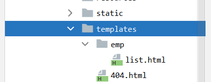

4. 编写Controller

```java
@Controller
public class EmployeeController {
    @Autowired
    EmployeeDao employeeDao;

    /**
     * 查询所有员工，返回列表页面
     * @param model
     * @return
     */
    @RequestMapping("/emps")
    public String list(Model model){
        Collection<Employee> employees = employeeDao.getAll();
        // 结果返回前端
        model.addAttribute("emps",employees);
        return "emp/list";
    }
}
```

5. 启动测试。

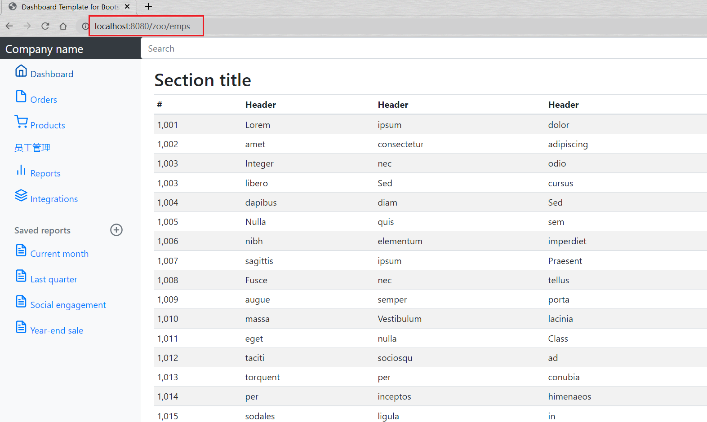

- 当侧边栏和顶部都相同时，如何将其抽取出来？

> Thymeleaf 公共页面元素抽取

步骤： 

1. 抽取公共片段 th:fragment 定义模板名；
2. 引入公共片段 th:insert 插入模板名；

实现： 

1. 使用list列表做演示！要抽取头部nav标签，在dashboard中将nav部分定义一个模板名；

- 在`templates`目录下新建一个`commons`包，其中新建`commons.html`用来放置公共页面代码。

```html
<!DOCTYPE html>
<html lang="en" xmlns:th="http://www.thymeleaf.org">

<!--顶部导航栏,利用th:fragment提取出来,命名为topbar-->
<nav class="navbar navbar-dark sticky-top bg-dark flex-md-nowrap p-0" th:fragment="topbar">
  <a class="navbar-brand col-sm-3 col-md-2 mr-0" href="http://getbootstrap.com/docs/4.0/examples/dashboard/#">[[${session.loginUser}]]</a>
  <input class="form-control form-control-dark w-100" type="text" placeholder="Search" aria-label="Search">
  <ul class="navbar-nav px-3">
    <li class="nav-item text-nowrap">
      <a class="nav-link" href="http://getbootstrap.com/docs/4.0/examples/dashboard/#">Sign out</a>
    </li>
  </ul>
</nav>

<!--侧边栏,利用th:fragment提取出来,命名为sidebar-->
<nav class="col-md-2 d-none d-md-block bg-light sidebar" th:fragment="siderbar">
  <div class="sidebar-sticky">
    <ul class="nav flex-column">
      <li class="nav-item">
        <a class="nav-link active" href="http://getbootstrap.com/docs/4.0/examples/dashboard/#">
          <svg xmlns="http://www.w3.org/2000/svg" width="24" height="24" viewBox="0 0 24 24"
               fill="none" stroke="currentColor" stroke-width="2" stroke-linecap="round"
               stroke-linejoin="round" class="feather feather-home">
            <path d="M3 9l9-7 9 7v11a2 2 0 0 1-2 2H5a2 2 0 0 1-2-2z"></path>
            <polyline points="9 22 9 12 15 12 15 22"></polyline>
          </svg>
          Dashboard <span class="sr-only">(current)</span>
        </a>
      </li>
      <li class="nav-item">
        <a class="nav-link" href="http://getbootstrap.com/docs/4.0/examples/dashboard/#">
          <svg xmlns="http://www.w3.org/2000/svg" width="24" height="24" viewBox="0 0 24 24"
               fill="none" stroke="currentColor" stroke-width="2" stroke-linecap="round"
               stroke-linejoin="round" class="feather feather-file">
            <path d="M13 2H6a2 2 0 0 0-2 2v16a2 2 0 0 0 2 2h12a2 2 0 0 0 2-2V9z"></path>
            <polyline points="13 2 13 9 20 9"></polyline>
          </svg>
          Orders
        </a>
      </li>
      <li class="nav-item">
        <a class="nav-link" href="http://getbootstrap.com/docs/4.0/examples/dashboard/#">
          <svg xmlns="http://www.w3.org/2000/svg" width="24" height="24" viewBox="0 0 24 24"
               fill="none" stroke="currentColor" stroke-width="2" stroke-linecap="round"
               stroke-linejoin="round" class="feather feather-shopping-cart">
            <circle cx="9" cy="21" r="1"></circle>
            <circle cx="20" cy="21" r="1"></circle>
            <path d="M1 1h4l2.68 13.39a2 2 0 0 0 2 1.61h9.72a2 2 0 0 0 2-1.61L23 6H6"></path>
          </svg>
          Products
        </a>
      </li>
      <li class="nav-item">
        <a class="nav-link" th:href="@{/emps}">
          <svg xmlns="http://www.w3.org/2000/svg" width="24" height="24" viewBox="0 0 24 24"
               fill="none" stroke="currentColor" stroke-width="2" stroke-linecap="round"
               stroke-linejoin="round" class="feather feather-users">
            <path d="M17 21v-2a4 4 0 0 0-4-4H5a4 4 0 0 0-4 4v2"></path>
            <circle cx="9" cy="7" r="4"></circle>
            <path d="M23 21v-2a4 4 0 0 0-3-3.87"></path>
            <path d="M16 3.13a4 4 0 0 1 0 7.75"></path>
          </svg>
          员工管理
        </a>
      </li>
      <li class="nav-item">
        <a class="nav-link" href="http://getbootstrap.com/docs/4.0/examples/dashboard/#">
          <svg xmlns="http://www.w3.org/2000/svg" width="24" height="24" viewBox="0 0 24 24"
               fill="none" stroke="currentColor" stroke-width="2" stroke-linecap="round"
               stroke-linejoin="round" class="feather feather-bar-chart-2">
            <line x1="18" y1="20" x2="18" y2="10"></line>
            <line x1="12" y1="20" x2="12" y2="4"></line>
            <line x1="6" y1="20" x2="6" y2="14"></line>
          </svg>
          Reports
        </a>
      </li>
      <li class="nav-item">
        <a class="nav-link" href="http://getbootstrap.com/docs/4.0/examples/dashboard/#">
          <svg xmlns="http://www.w3.org/2000/svg" width="24" height="24" viewBox="0 0 24 24"
               fill="none" stroke="currentColor" stroke-width="2" stroke-linecap="round"
               stroke-linejoin="round" class="feather feather-layers">
            <polygon points="12 2 2 7 12 12 22 7 12 2"></polygon>
            <polyline points="2 17 12 22 22 17"></polyline>
            <polyline points="2 12 12 17 22 12"></polyline>
          </svg>
          Integrations
        </a>
      </li>
    </ul>

    <h6 class="sidebar-heading d-flex justify-content-between align-items-center px-3 mt-4 mb-1 text-muted">
      <span>Saved reports</span>
      <a class="d-flex align-items-center text-muted"
         href="http://getbootstrap.com/docs/4.0/examples/dashboard/#">
        <svg xmlns="http://www.w3.org/2000/svg" width="24" height="24" viewBox="0 0 24 24" fill="none"
             stroke="currentColor" stroke-width="2" stroke-linecap="round" stroke-linejoin="round"
             class="feather feather-plus-circle">
          <circle cx="12" cy="12" r="10"></circle>
          <line x1="12" y1="8" x2="12" y2="16"></line>
          <line x1="8" y1="12" x2="16" y2="12"></line>
        </svg>
      </a>
    </h6>
    <ul class="nav flex-column mb-2">
      <li class="nav-item">
        <a class="nav-link" href="http://getbootstrap.com/docs/4.0/examples/dashboard/#">
          <svg xmlns="http://www.w3.org/2000/svg" width="24" height="24" viewBox="0 0 24 24"
               fill="none" stroke="currentColor" stroke-width="2" stroke-linecap="round"
               stroke-linejoin="round" class="feather feather-file-text">
            <path d="M14 2H6a2 2 0 0 0-2 2v16a2 2 0 0 0 2 2h12a2 2 0 0 0 2-2V8z"></path>
            <polyline points="14 2 14 8 20 8"></polyline>
            <line x1="16" y1="13" x2="8" y2="13"></line>
            <line x1="16" y1="17" x2="8" y2="17"></line>
            <polyline points="10 9 9 9 8 9"></polyline>
          </svg>
          Current month
        </a>
      </li>
      <li class="nav-item">
        <a class="nav-link" href="http://getbootstrap.com/docs/4.0/examples/dashboard/#">
          <svg xmlns="http://www.w3.org/2000/svg" width="24" height="24" viewBox="0 0 24 24"
               fill="none" stroke="currentColor" stroke-width="2" stroke-linecap="round"
               stroke-linejoin="round" class="feather feather-file-text">
            <path d="M14 2H6a2 2 0 0 0-2 2v16a2 2 0 0 0 2 2h12a2 2 0 0 0 2-2V8z"></path>
            <polyline points="14 2 14 8 20 8"></polyline>
            <line x1="16" y1="13" x2="8" y2="13"></line>
            <line x1="16" y1="17" x2="8" y2="17"></line>
            <polyline points="10 9 9 9 8 9"></polyline>
          </svg>
          Last quarter
        </a>
      </li>
      <li class="nav-item">
        <a class="nav-link" href="http://getbootstrap.com/docs/4.0/examples/dashboard/#">
          <svg xmlns="http://www.w3.org/2000/svg" width="24" height="24" viewBox="0 0 24 24"
               fill="none" stroke="currentColor" stroke-width="2" stroke-linecap="round"
               stroke-linejoin="round" class="feather feather-file-text">
            <path d="M14 2H6a2 2 0 0 0-2 2v16a2 2 0 0 0 2 2h12a2 2 0 0 0 2-2V8z"></path>
            <polyline points="14 2 14 8 20 8"></polyline>
            <line x1="16" y1="13" x2="8" y2="13"></line>
            <line x1="16" y1="17" x2="8" y2="17"></line>
            <polyline points="10 9 9 9 8 9"></polyline>
          </svg>
          Social engagement
        </a>
      </li>
      <li class="nav-item">
        <a class="nav-link" href="http://getbootstrap.com/docs/4.0/examples/dashboard/#">
          <svg xmlns="http://www.w3.org/2000/svg" width="24" height="24" viewBox="0 0 24 24"
               fill="none" stroke="currentColor" stroke-width="2" stroke-linecap="round"
               stroke-linejoin="round" class="feather feather-file-text">
            <path d="M14 2H6a2 2 0 0 0-2 2v16a2 2 0 0 0 2 2h12a2 2 0 0 0 2-2V8z"></path>
            <polyline points="14 2 14 8 20 8"></polyline>
            <line x1="16" y1="13" x2="8" y2="13"></line>
            <line x1="16" y1="17" x2="8" y2="17"></line>
            <polyline points="10 9 9 9 8 9"></polyline>
          </svg>
          Year-end sale
        </a>
      </li>
    </ul>
  </div>
</nav>
</html>
```

- 删除`dashboard.html`和`list.html`中顶部导航栏和侧边栏的代码。

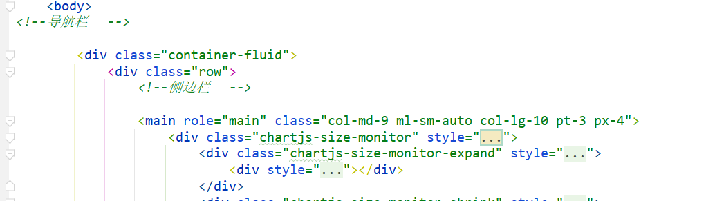

- 分别在`dashboard.html`和`list.html`删除的部分插入提取出来的公共部分`topbar`和`sidebar`。

```html
	<!--导航栏-->
	<div th:replace="~{commons/commons::topbar}" }></div>
	
		<div class="container-fluid">
			<div class="row">
				<!--侧边栏-->
				<div th:replace="~{commons/commons::siderbar}"></div>
```

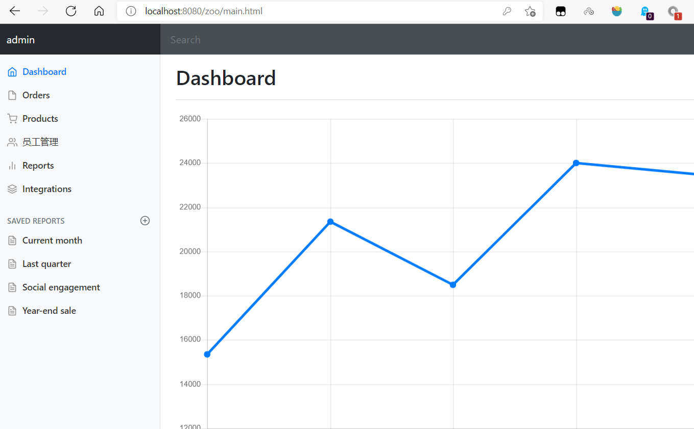

> 点亮高亮

- 在页面中，使高亮的代码是`class="nav-link active"`属性。


- 可以通过传递参数判断点击了哪个标签实现相应的高亮，首先在`dashboard.html`的侧边栏标签传递参数`active`为`dashboard.html`。

```html
<!--侧边栏-->
<div th:replace="~{commons/commons::siderbar(active='dashboard.html')}"></div>
```

- 同样在`list.html`的侧边栏标签传递参数`active`为`list.html`。

```html
<!--侧边栏-->
<div th:replace="~{commons/commons::siderbar(active='list.html')}"></div>
```

- 在公共页面`commons.html`相应标签部分利用thymeleaf接收参数`active`，利用三元运算符判断决定是否高亮。

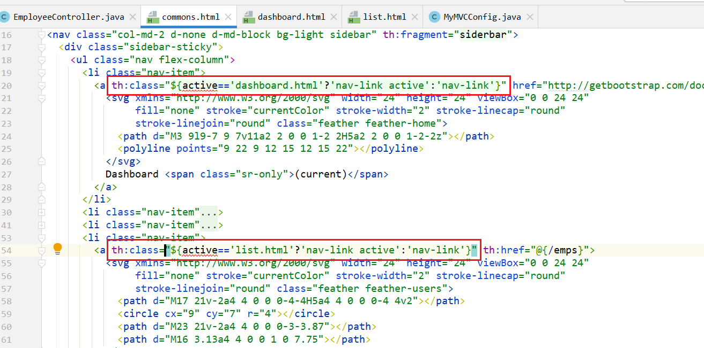

- 重启主程序测试，登录成功后，高亮显示。

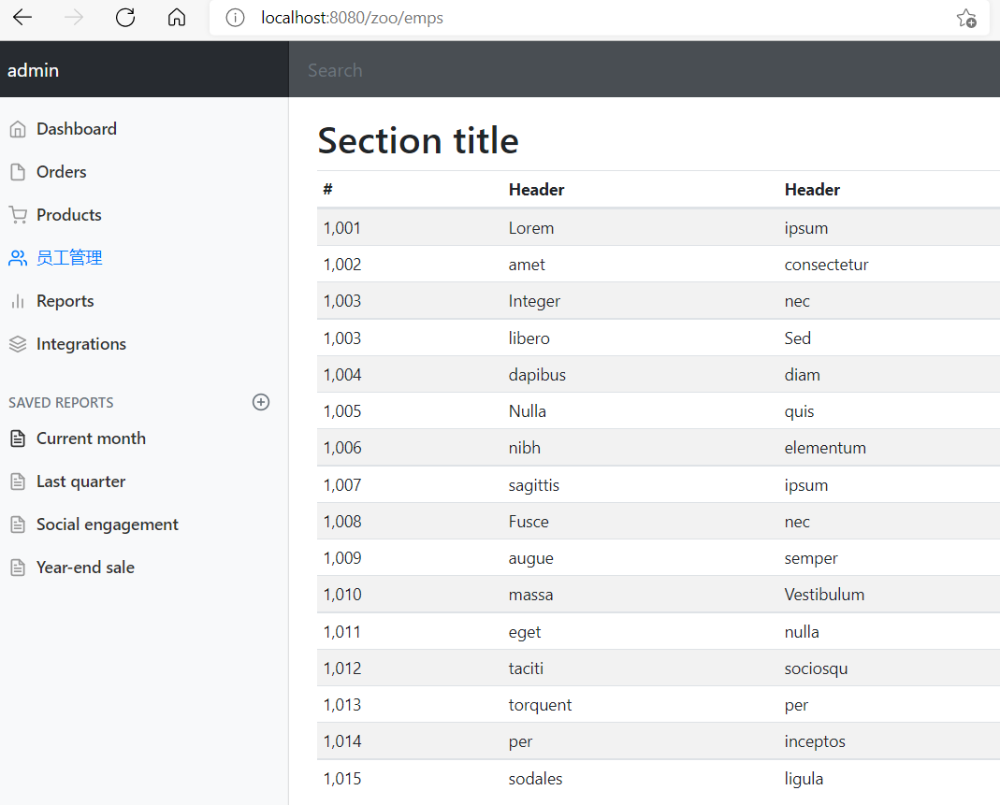

> 显示员工信息

- 修改`list.html`页面，显示自己的数据值。

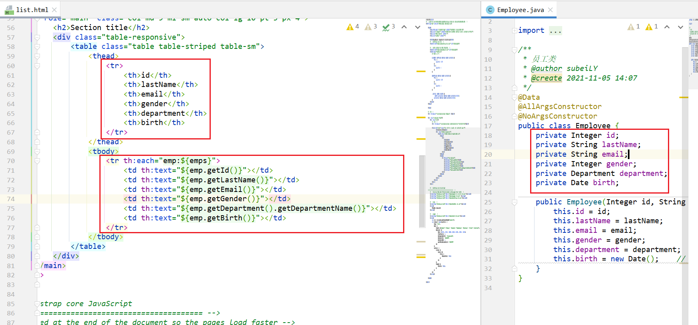

- 运行测试

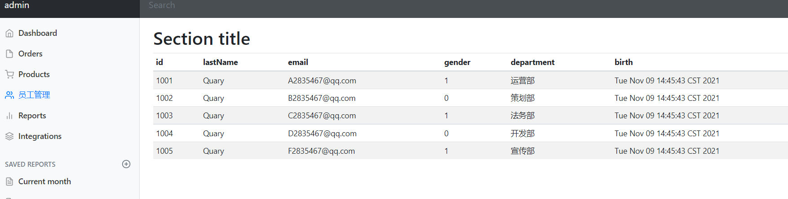

> 修改性别的显示和date的显示，并添加`编辑`和`删除`两个标签。

```html
<table class="table table-striped table-sm">
    <thead>
        <tr>
            <th>id</th>
            <th>lastName</th>
            <th>email</th>
            <th>gender</th>
            <th>department</th>
            <th>birth</th>
            <th>操作</th>
        </tr>
    </thead>
    <tbody>
        <tr th:each="emp:${emps}">
            <td th:text="${emp.getId()}"></td>
            <td th:text="${emp.getLastName()}"></td>
            <td th:text="${emp.getEmail()}"></td>
            <td th:text="${emp.getGender()==0?'女':'男'}"></td>
            <td th:text="${emp.getDepartment().getDepartmentName()}"></td>
            <td th:text="${#dates.format(emp.getBirth(),'yyyy-MM-dd HH:mm')}"></td>
            <td>
                <a class="btn btn-sm btn-primary">编辑</a>
                <a class="btn btn-sm btn-danger">删除</a>
            </td>

        </tr>
    </tbody>
</table>
```

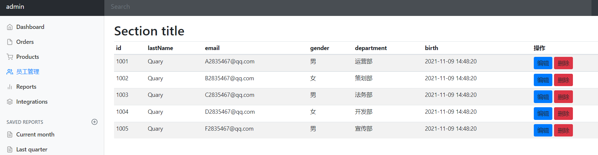

## 10.增加员工实现

1. 在`list.html`页面增添一个`增加员工`按钮，点击该按钮时发起一个请求`/add`。

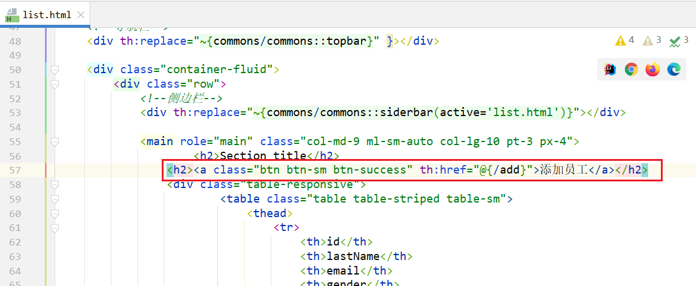

2. 编写对应的controller。

```java
// 添加页面
@GetMapping("/add")
public String add(Model model){
    return "emp/add";
}
```

3. 创建添加员工页面add

- 在`templates/emp`下新建一个`add.html`。
- bootstrap官网文档 ： https://v4.bootcss.com/docs/4.0/components/forms/，去可以里面找自己喜欢的样式！这里提供了编辑好的：

```html
<form>
    <div class="form-group">
        <label>LastName</label>
        <input type="text" class="form-control" placeholder="quary">
    </div>
    <div class="form-group">
        <label>Email</label>
        <input type="email" class="form-control"
               placeholder="1524368@qq.com">
    </div>
    <div class="form-group">
        <label>Gender</label><br/>
        <div class="form-check form-check-inline">
            <input class="form-check-input" type="radio" name="gender"
                   value="1">
            <label class="form-check-label">男</label>
        </div>
        <div class="form-check form-check-inline">
            <input class="form-check-input" type="radio" name="gender"
                   value="0">
            <label class="form-check-label">女</label>
        </div>
    </div>
    <div class="form-group">
        <label>department</label>
        <select class="form-control">
            <option>1</option>
            <option>2</option>
            <option>3</option>
            <option>4</option>
            <option>5</option>
        </select>
    </div>
    <div class="form-group">
        <label>Birth</label>
        <input type="text" class="form-control" placeholder="quary">
    </div>
    <button type="submit" class="btn btn-primary">添加</button>
</form>  
```

4. 修改一下前端和后端，处理点击`添加员工`的请求。通过`get`方式提交请求，在`EmployeeController`中添加一个方法`add`用来处理`list`页面点击提交按钮的操作，返回到`add.html`添加员工页面。
   - Controller

```java
@Autowired
DepartmentDao departmentDao;

@GetMapping("/add")
public String add(Model model){
    // 查出所有的部门信息
    Collection<Department> departments = departmentDao.getDepartments();
    model.addAttribute("departments",departments);
    return "emp/add";
}
```

- 前端

```html
<main role="main" class="col-md-9 ml-sm-auto col-lg-10 pt-3 px-4">
    <!--    添加成员        -->
    <form>
        <div class="form-group">
            <label>LastName</label>
            <input type="text" name="lastName" class="form-control" placeholder="quary">
        </div>
        <div class="form-group">
            <label>Email</label>
            <input type="email" name="email" class="form-control"
                   placeholder="15243685@qq.com">
        </div>
        <div class="form-group">
            <label>Gender</label><br/>
            <div class="form-check form-check-inline">
                <input class="form-check-input" type="radio" name="gender"
                       value="1">
                <label class="form-check-label">男</label>
            </div>
            <div class="form-check form-check-inline">
                <input class="form-check-input" type="radio" name="gender"
                       value="0">
                <label class="form-check-label">女</label>
            </div>
        </div>
        <div class="form-group">
            <label>department</label>
            <!--注意这里的name是department.id，因为传入的参数为id-->
            <select class="form-control" name="department.id">
                <option th:each="department:${departments}" th:text="${department.getDepartmentName()}" th:value="${department.getId()}"></option>
            </select>
        </div>
        <div class="form-group">
            <label>Birth</label>
            <input type="text" name="birth" class="form-control" placeholder="birth:yyyy/MM/dd">
        </div>
        <button type="submit" class="btn btn-primary">添加</button>
    </form>

</main>
```

- 重启主程序，点击添加员工，成功跳转到`add.html`页面。

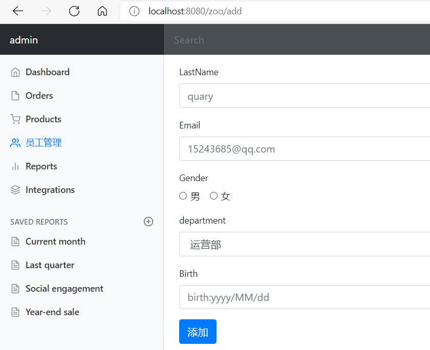

> 完整增加员工功能
>
> - 由于在`add.html`页面，当我们填写完信息，点击`添加`按钮，应该完成添加返回到`list`页面，展示新的员工信息；因此在`add.html`点击`添加`按钮的一瞬间，我们同样发起一个请求`/add`，与上述`提交按钮`发出的请求路径一样，但这里发出的是`post`请求。

1. 修改add页面form表单提交地址和方式

```html
<form th:action="@{/add}" method="post">
```

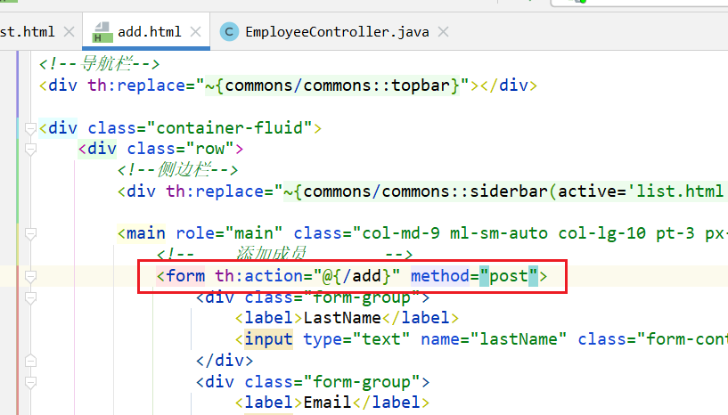

2. 编写对应的controller，在`EmployeeController`中添加一个方法`addEmp`用来处理点击`添加按钮`的操作。

```java
@PostMapping("/add")
public String addEmp(Employee employee) {

    return "redirect:/emps";
}
```

----

- 原理探究 ： ThymeleafViewResolver

```java
public static final String REDIRECT_URL_PREFIX = "redirect:";
public static final String FORWARD_URL_PREFIX = "forward:";

protected View createView(String viewName, Locale locale) throws Exception {
    if (!this.alwaysProcessRedirectAndForward && !this.canHandle(viewName, locale)) {
        vrlogger.trace("[THYMELEAF] View \"{}\" cannot be handled by ThymeleafViewResolver. Passing on to the next resolver in the chain.", viewName);
        return null;
    } else {
        String forwardUrl;
        if (viewName.startsWith("redirect:")) {
            vrlogger.trace("[THYMELEAF] View \"{}\" is a redirect, and will not be handled directly by ThymeleafViewResolver.", viewName);
            forwardUrl = viewName.substring("redirect:".length(), viewName.length());
            RedirectView view = new RedirectView(forwardUrl, this.isRedirectContextRelative(), this.isRedirectHttp10Compatible());
            return (View)this.getApplicationContext().getAutowireCapableBeanFactory().initializeBean(view, viewName);
        } else if (viewName.startsWith("forward:")) {
            vrlogger.trace("[THYMELEAF] View \"{}\" is a forward, and will not be handled directly by ThymeleafViewResolver.", viewName);
            forwardUrl = viewName.substring("forward:".length(), viewName.length());
            return new InternalResourceView(forwardUrl);
        } else if (this.alwaysProcessRedirectAndForward && !this.canHandle(viewName, locale)) {
            vrlogger.trace("[THYMELEAF] View \"{}\" cannot be handled by ThymeleafViewResolver. Passing on to the next resolver in the chain.", viewName);
            return null;
        } else {
            vrlogger.trace("[THYMELEAF] View {} will be handled by ThymeleafViewResolver and a {} instance will be created for it", viewName, this.getViewClass().getSimpleName());
            return this.loadView(viewName, locale);
        }
    }
}
```

----

3. 编写controller接收调试打印。

```java
@PostMapping("/add")
public String addEmp(Employee employee) {
    System.out.println(employee);
    // 添加员工
    employeeDao.save(employee);
    return "redirect:/emps";
}
```

- 重启主程序，进行测试，进入添加页面，填写相关信息，注意日期格式默认为`yyyy/MM/dd`。

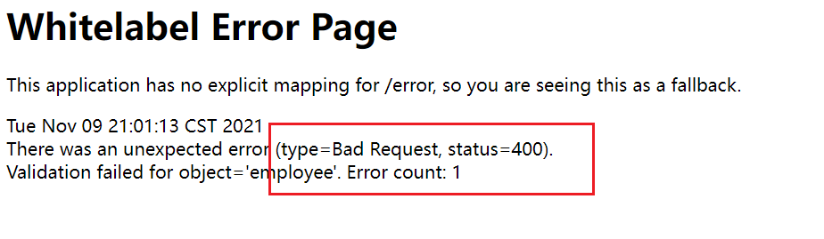

- 提交发现页面出现了400错误！
- 生日是我们提交的是一个日期， 第一次使用的 / 正常提交成功了，后面使用 - 就错误了，所以这里面应该存在一个日期格式化的问题； SpringMVC会将页面提交的值转换为指定的类型，默认日期是按照 / 的方式提交 ； 比如将2021/11/09 转换为一个date对象。 那思考一个问题？那能不能修改这个默认的格式呢？ 先去看webmvc的自动配置文件；找到一个日期格式化的方法：

```java
@Bean
public FormattingConversionService mvcConversionService() {
    WebConversionService conversionService = new WebConversionService(this.mvcProperties.getDateFormat());
    this.addFormatters(conversionService);
    return conversionService;
}
```

- 调用了 getDateFormat 方法；

```java
public String getDateFormat() {
    return this.dateFormat;
}
```

- 所以可以自定义的去修改这个时间格式化问题，在配置文件中修改一 下；

```properties
# 日期格式化
spring.mvc.date-format=yyyy-MM-dd
```


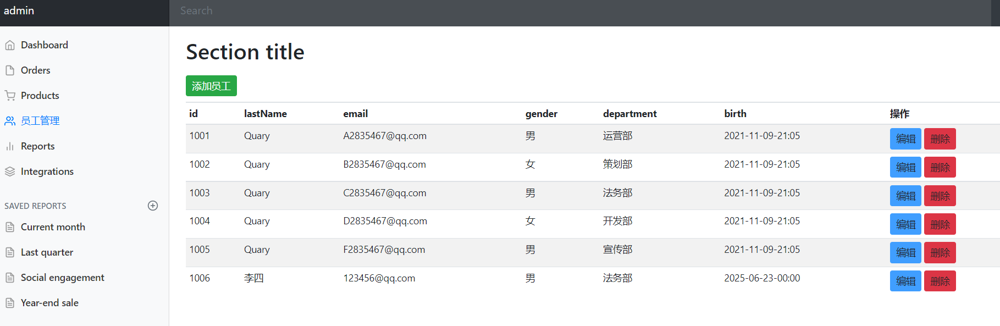

## 11.修改员工信息

1. list页面编辑按钮增添请求。

- 当用户点击`编辑`标签时，应该跳转到编辑页面`update.html`（开始创建）进行编辑。将`list.html`页面的编辑标签添加`href`属性，实现点击请求`/edit/id号`到编辑页面。

```html
<a class="btn btn-sm btn-primary" th:href="@{/edit/{id}(id=${emp.getId()})}">编辑</a>
```

2. 编写对应的controller

```java
    @RequestMapping("/edit/{id}")
    public String toUpdateAll(@PathVariable("id") int id, Model model) {
        // 查询指定id的员工,添加到emp中,用于前端接收
        Employee employee = employeeDao.getEmployee(id);
        model.addAttribute("emp", employee);
        // 查出所有的部门信息,添加到departments中,用于前端接收
        Collection<Department> departments = departmentDao.getDepartments();
        model.addAttribute("departments", departments);
        return "/emp/update";
        // 返回到编辑员工页面
    }
```

3. 将add页面复制一份，改为update页面；需要修改页面，将后台查询数据回显。

```html
<form th:action="@{/edit}" method="post">
    <div class="form-group">
        <label>LastName</label>
        <input th:value="${emp.getLastName()}" type="text" name="lastName" class="form-control"
               placeholder="lastname:zsr">
    </div>
    <div class="form-group">
        <label>Email</label>
        <input th:value="${emp.getEmail()}" type="email" name="email" class="form-control"
               placeholder="email:xxxxx@qq.com">
    </div>
    <div class="form-group">
        <label>Gender</label><br/>
        <div class="form-check form-check-inline">
            <input th:checked="${emp.getGender()==1}" class="form-check-input" type="radio"
                   name="gender" value="1">
            <label class="form-check-label">男</label>
        </div>
        <div class="form-check form-check-inline">
            <input th:checked="${emp.getGender()==0}" class="form-check-input" type="radio"
                   name="gender" value="0">
            <label class="form-check-label">女</label>
        </div>
    </div>
    <div class="form-group">
        <label>department</label>
        <!--注意这里的name是department.id，因为传入的参数为id-->
        <select class="form-control" name="department.id">
            <option th:selected="${department.getId()==emp.department.getId()}"
                    th:each="department:${departments}" th:text="${department.getDepartmentName()}"
                    th:value="${department.getId()}">
            </option>
        </select>
    </div>
    <div class="form-group">
        <label>Birth</label>
        <!--springboot默认的日期格式为yy/MM/dd-->
        <input th:value="${emp.getBirth()}" type="text" name="birth" class="form-control" placeholder="birth:yyyy/MM/dd">
    </div>
    <button type="submit" class="btn btn-primary">修改</button>
</form>
```

- 启动程序测试

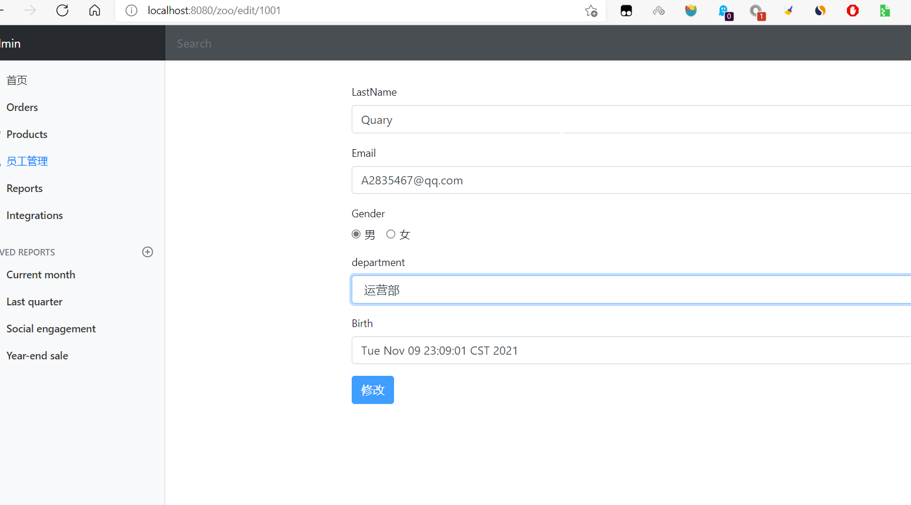

- 规定一下显示的日期格式。

```html
<!--springboot默认的日期格式为yy/MM/dd-->
<input th:value="${#dates.format(emp.getBirth(),'yyyy-MM-dd')}" type="text" name="date" class="form-control"
       placeholder="birth:yy/MM/dd">
```

4. 修改表单提交的地址：

```html
<form th:action="@{/updateEmp}" method="post">
```

5. 编写对应的controller

```java
    @PostMapping("/updateEmp")
    public String updateEmp(Employee employee){
        employeeDao.save(employee);
        // 回到员工列表页面
        return "redirect:/emps";
    }
```

6. 指定修改人的id。

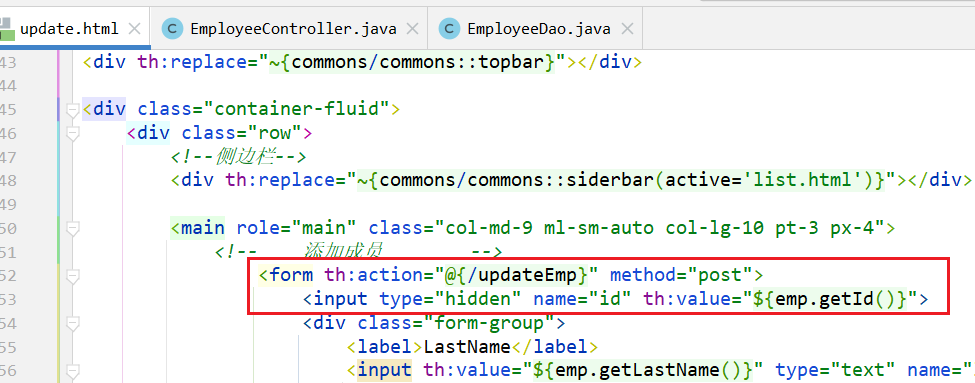

- 重启测试。

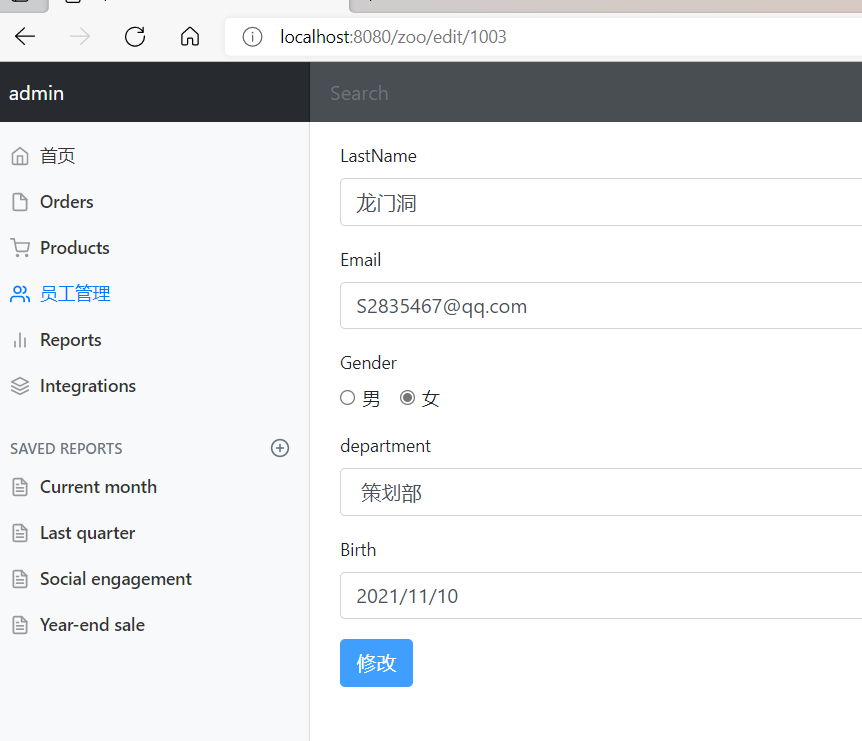

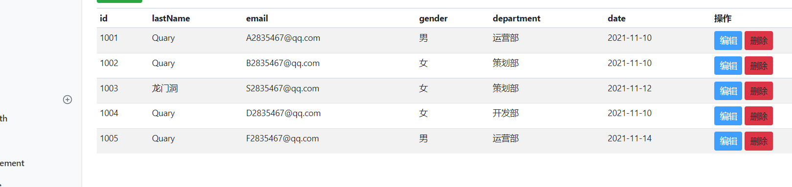

## 12.删除员工

1. list页面，编写提交地址。点击`删除`标签时，应该发起一个请求，删除指定的用户，然后重新返回到`list`页面显示员工数据。

```html
<a class="btn btn-sm btn-danger" th:href="@{/delete/{id}(id=${emp.getId()})}">删除</a>
```

2. 编写Controller

```java
    @GetMapping("/delete/{id}")
    public String delete(@PathVariable("id") Integer id) {
        employeeDao.delete(id);
        return "redirect:/emps";
    }
```

- 重启测试，点击删除按钮即可删除指定员工。

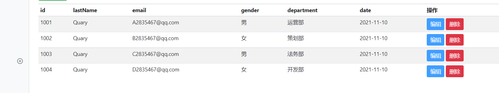

> 404页面

- 在模板目录下添加一个error文件夹，文件夹中存放我们相应的错误页面；比如404.html 或者 4xx.html 等等，SpringBoot就会帮我们自动使用了！

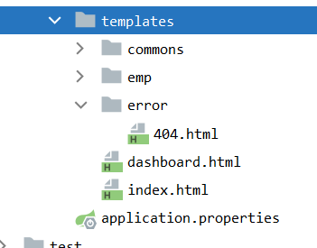

- 测试使用！

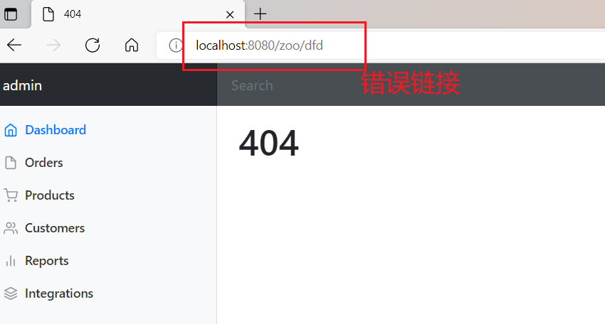

## 13.注销页面

1. 注销请求，在提取出来的公共`commons`页面，顶部导航栏处中的标签添加`href`属性，实现点击发起请求`/user/logout`。

```html
<a class="nav-link" href="#" th:href="@{/user/loginOut}">Sign out</a>
```

2. 编写对应的controller，处理点击`注销`标签的请求，在`LoginController`中编写对应的方法，清除session，并重定向到首页。

```java
    @RequestMapping("/user/loginOut")
    public String logout(HttpSession session) {
        session.invalidate();
        return "redirect:/index.html";
    }
```

- 测试登录。


## 14.定制错误数据


