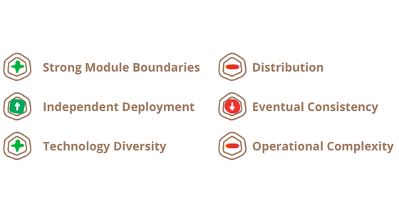
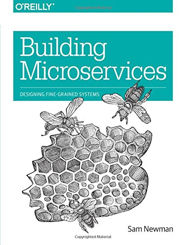

# 微服务

这个新建筑术语的定义

*“微服务架构”一词在过去几年中如雨后春笋般涌现，用来描述将软件应用程序设计为可独立部署的服务套件的特定方式。虽然这种架构风格没有精确的定义，但围绕业务能力、自动化部署、端点智能以及语言和数据的分散控制，围绕组织存在某些共同特征。*

2014 年 3 月 25 日

------

[詹姆斯·刘易斯](https://twitter.com/boicy)

James Lewis 是 Thoughtworks 的首席顾问，也是技术咨询委员会的成员。James 对从小型协作服务构建应用程序的兴趣源于大规模集成企业系统的背景。他使用微服务构建了许多系统，并且多年来一直是不断发展的社区的积极参与者。

[马丁福勒](https://martinfowler.com/)

Martin Fowler 是软件开发领域的作家、演说家和大佬。长期以来，他一直对如何将软件系统组件化的问题感到困惑，因为他听到的含糊不清的说法比他满意的要多。他希望微服务能够兑现其倡导者发现的早期承诺。

[受欢迎的](https://martinfowler.com/tags/popular.html)

[应用架构](https://martinfowler.com/tags/application architecture.html)

[微服务](https://martinfowler.com/tags/microservices.html)

## 内容

- 微服务架构的特征
  - [通过服务组件化](https://martinfowler.com/articles/microservices.html#ComponentizationViaServices)
  - [围绕业务能力组织](https://martinfowler.com/articles/microservices.html#OrganizedAroundBusinessCapabilities)
  - [产品不是项目](https://martinfowler.com/articles/microservices.html#ProductsNotProjects)
  - [智能端点和哑管道](https://martinfowler.com/articles/microservices.html#SmartEndpointsAndDumbPipes)
  - [去中心化治理](https://martinfowler.com/articles/microservices.html#DecentralizedGovernance)
  - [去中心化数据管理](https://martinfowler.com/articles/microservices.html#DecentralizedDataManagement)
  - [基础设施自动化](https://martinfowler.com/articles/microservices.html#InfrastructureAutomation)
  - [为失败而设计](https://martinfowler.com/articles/microservices.html#DesignForFailure)
  - [进化设计](https://martinfowler.com/articles/microservices.html#EvolutionaryDesign)
- [微服务是未来吗？](https://martinfowler.com/articles/microservices.html#AreMicroservicesTheFuture)

### 侧边栏

- [微服务有多大？](https://martinfowler.com/articles/microservices.html#HowBigIsAMicroservice)
- [微服务和 SOA](https://martinfowler.com/articles/microservices.html#MicroservicesAndSoa)
- [多种语言，多种选择](https://martinfowler.com/articles/microservices.html#ManyLanguagesManyOptions)
- [久经考验的标准和强制标准](https://martinfowler.com/articles/microservices.html#Battle-testedStandardsAndEnforcedStandards)
- [让做正确的事变得容易](https://martinfowler.com/articles/microservices.html#MakeItEasyToDoTheRightThing)
- [断路器和生产就绪代码](https://martinfowler.com/articles/microservices.html#TheCircuitBreakerAndProductionReadyCode)
- [被认为有害的同步调用](https://martinfowler.com/articles/microservices.html#SynchronousCallsConsideredHarmful)

------

“微服务”——又一个出现在拥挤的软件架构街道上的新术语。尽管我们自然倾向于轻蔑地瞥一眼这些东西，但这个术语描述了一种我们发现越来越有吸引力的软件系统风格。在过去的几年里，我们已经看到许多项目使用这种风格，到目前为止的结果是积极的，以至于对于我们的许多同事来说，这正在成为构建企业应用程序的默认风格。然而，遗憾的是，没有太多信息概述微服务风格是什么以及如何去做。

简而言之，微服务架构风格[[1\]](https://martinfowler.com/articles/microservices.html#footnote-etymology)是一种将单个应用程序开发为一组小服务的方法，每个小服务都在自己的进程中运行，并与轻量级机制（通常是 HTTP 资源 API）进行通信。这些服务是围绕业务能力构建的，并且可以通过完全自动化的部署机制独立部署。这些服务的集中管理极少，可以用不同的编程语言编写并使用不同的数据存储技术。

在开始解释微服务风格，将其与单体风格进行比较是很有用的：单体应用程序构建为单个单元。企业应用程序通常由三个主要部分构建： 客户端用户界面（由 HTML 页面和在用户机器上的浏览器中运行的 javascript 组成） 数据库（由插入到公共的、通常是关系的数据库管理中的许多表组成系统）和服务器端应用程序。服务器端应用程序将处理 HTTP 请求、执行域逻辑、从数据库检索和更新数据，以及选择和填充要发送到浏览器的 HTML 视图。这个服务器端应用程序是一个*整体*——一个单一的逻辑可执行文件[[2\]](https://martinfowler.com/articles/microservices.html#footnote-monolith). 对系统的任何更改都涉及构建和部署服务器端应用程序的新版本。

这样的单体服务器是构建这样一个系统的自然方式。处理请求的所有逻辑都在单个进程中运行，允许您使用语言的基本功能将应用程序划分为类、函数和命名空间。小心一点，您可以在开发人员的笔记本电脑上运行和测试应用程序，并使用部署管道来确保正确测试更改并将其部署到生产中。您可以通过在负载均衡器后面运行多个实例来水平扩展单体应用。

单体应用程序可能会成功，但越来越多的人对它们感到沮丧——尤其是当越来越多的应用程序被部署到云时。变更周期是紧密联系在一起的——对应用程序的一小部分进行的变更需要重新构建和部署整个整体。随着时间的推移，通常很难保持良好的模块化结构，从而更难保持应该只影响该模块中的一个模块的更改。扩展需要扩展整个应用程序，而不是需要更多资源的部分。

图 1：单体和微服务

这些挫折导致了微服务架构风格：将应用程序构建为服务套件。除了服务可独立部署和扩展的事实外，每个服务还提供了一个牢固的模块边界，甚至允许使用不同的编程语言编写不同的服务。它们也可以由不同的团队管理。

我们并不声称微服务风格是新颖的或创新的，它的根源至少可以追溯到 Unix 的设计原则。但是我们确实认为没有足够的人考虑微服务架构，如果他们使用它，许多软件开发会更好。

## 微服务架构的特征

我们不能说微服务架构风格有一个正式的定义，但我们可以尝试描述我们认为适合该标签的架构的共同特征。与概述共同特征的任何定义一样，并非所有微服务架构都具有所有特征，但我们确实希望大多数微服务架构表现出最多的特征。虽然我们的作者一直是这个相当松散的社区的活跃成员，但我们的目的是尝试描述我们在自己的工作和我们认识的团队的类似努力中看到的内容。特别是我们没有制定一些定义来符合。

### 通过服务组件化

自从我们涉足软件行业以来，就一直希望通过将组件连接在一起来构建系统，这很像我们在物理世界中看到的东西。在过去的几十年里，我们看到了作为大多数语言平台一部分的大型公共库纲要取得了相当大的进步。

在谈论组件时，我们遇到了组件构成的困难定义。[我们的定义](https://martinfowler.com/bliki/SoftwareComponent.html)是， **组件**是可独立替换和升级的软件单元。

微服务架构将使用库，但它们将自己的软件组件化的主要方式是分解为服务。我们将**库**定义 为链接到程序中并使用内存中的函数调用进行调用的组件，而**服务**是与诸如 Web 服务请求或远程过程调用之类的机制进行通信的进程外组件。（这与许多 OO 程序[[3\]](https://martinfowler.com/articles/microservices.html#footnote-service-object)中的服务对象的概念不同。）

使用服务作为组件（而不是库）的一个主要原因是服务是可独立部署的。如果您的应用程序[[4\]](https://martinfowler.com/articles/microservices.html#footnote-application)由单个进程中的多个库组成，则对任何单个组件的更改都会导致必须重新部署整个应用程序。但是，如果该应用程序分解为多个服务，您可以预期许多单个服务更改只需要重新部署该服务。这不是绝对的，一些变化会改变服务接口导致一些协调，但是一个好的微服务架构的目标是通过服务契约中的内聚服务边界和演化机制来最小化这些。

使用服务作为组件的另一个结果是更明确的组件接口。大多数语言没有定义显式[发布接口](https://martinfowler.com/bliki/PublishedInterface.html)的良好机制。通常，只有文档和纪律才能防止客户端破坏组件的封装，从而导致组件之间的耦合过于紧密。通过使用显式远程调用机制，服务可以更轻松地避免这种情况。

使用这样的服务确实有缺点。远程调用比进程内调用更昂贵，因此远程 API 需要更粗粒度，这通常更难使用。如果您需要更改组件之间的职责分配，当您跨越流程边界时，这种行为移动就更难做到了。

在第一次近似时，我们可以观察到服务映射到运行时进程，但这只是第一次近似。一个服务可能由多个进程组成，这些进程总是一起开发和部署，例如一个应用程序进程和一个仅由该服务使用的数据库。

### 围绕业务能力组织

在寻求将大型应用程序拆分为多个部分时，管理通常侧重于技术层，导致 UI 团队、服务器端逻辑团队和数据库团队。当团队按照这些方式分开时，即使是简单的更改也会导致跨团队项目需要时间和预算批准。一个聪明的团队将围绕这一点进行优化，并针对两害相权取其轻——只需将逻辑强加到他们有权访问的任何应用程序中即可。换句话说，逻辑无处不在。这是康威定律[[5\] 的](https://martinfowler.com/articles/microservices.html#footnote-conwayslaw)一个例子。

> 任何设计系统（广义定义）的组织都会产生一个设计，其结构是该组织通信结构的副本。
>
> ——梅尔文·康威，1968

图 2：康威定律在起作用

微服务的划分方法不同，划分为围绕**业务能力**组织的服务 。此类服务为该业务领域采用广泛的软件实现，包括用户界面、持久性存储和任何外部协作。因此，团队是跨职能的，包括开发所需的全部技能：用户体验、数据库和项目管理。

图 3：团队边界强化的服务边界

### 微服务有多大？

虽然“微服务”已经成为这种架构风格的流行名称，但它的名字确实导致了对服务规模的不幸关注，以及关于什么构成“微”的争论。在与微服务从业者的对话中，我们看到了各种规模的服务。报告的最大尺寸遵循亚马逊的两个比萨团队的概念（即整个团队可以用两个比萨饼喂饱），这意味着不超过十二人。在较小的规模上，我们已经看到了一个由六人组成的团队将支持六项服务的设置。

这就引出了一个问题，即在这个规模范围内是否存在足够大的差异，以至于每打人服务和每人服务的规模不应该被归为一个微服务标签。目前我们认为最好将它们组合在一起，但随着我们进一步探索这种风格，我们肯定会改变主意。

以这种方式组织的一家公司是[www.comparethemarket.com](http://www.comparethemarket.com/)。跨职能团队负责构建和运营每个产品，每个产品被拆分为多个通过消息总线进行通信的单独服务。

大型单体应用程序也始终可以围绕业务功能进行模块化，尽管这不是常见情况。当然，我们会敦促构建单体应用程序的大型团队按照业务线划分自己。我们在这里看到的主要问题是，它们往往围绕*太多*上下文进行组织。如果单体应用跨越许多这些模块化边界，团队中的个别成员就很难将它们融入他们的短期记忆中。此外，我们看到模块化生产线需要大量的纪律来执行。服务组件所需的更明确的分离使得更容易保持团队边界清晰。

### 产品不是项目

我们看到的大多数应用程序开发工作都使用项目模型：目的是交付一些软件，然后将其视为已完成。完成后，软件将移交给维护组织，而构建它的项目团队将被解散。

微服务支持者倾向于避免这种模式，而是更喜欢团队应该在其整个生命周期内拥有产品的概念。对此的一个共同灵感是亚马逊的[“您构建，您运行”](https://queue.acm.org/detail.cfm?id=1142065)的概念，其中开发团队对生产中的软件负全部责任。这使开发人员能够每天接触他们的软件在生产中的行为方式，并增加与用户的联系，因为他们必须至少承担一些支持负担。

产品心态与业务能力联系在一起。不是将软件视为一组要完成的功能，而是存在一种持续的关系，其中的问题是软件如何帮助其用户增强业务能力。

没有理由不能对单体应用程序采用相同的方法，但服务的较小粒度可以更容易地在服务开发人员与其用户之间建立个人关系。

### 智能端点和哑管道

在不同流程之间构建通信结构时，我们已经看到许多产品和方法强调将重要的智能融入通信机制本身。一个很好的例子是企业服务总线 (ESB)，其中 ESB 产品通常包括用于消息路由、编排、转换和应用业务规则的复杂设施。

### 微服务和 SOA

当我们谈论微服务时，一个常见的问题是这是否只是我们十年前看到的面向服务的架构 (SOA)。这一点是有好处的，因为微服务风格与某些 SOA 倡导者所支持的风格非常相似。然而，问题是 SOA 意味着[太多不同的东西](https://martinfowler.com/bliki/ServiceOrientedAmbiguity.html)，而且大多数时候我们遇到一种叫做“SOA”的东西，它与我们在这里描述的风格有很大不同，通常是由于对 ESB 的关注。集成单片应用程序。

特别是，我们已经看到了如此多的面向服务的拙劣实现——从在 ESB 的[[6\] 中](https://martinfowler.com/articles/microservices.html#footnote-esb)隐藏复杂性的趋势，到耗资数百万但没有产生价值的多年计划失败，再到积极抑制变革的集中治理模型，有时很难超越这些问题。

当然，微服务社区中使用的许多技术都源自开发人员在大型组织中集成服务的经验。的[容错阅读器](https://martinfowler.com/bliki/TolerantReader.html)模式是这样的一个例子。使用网络的努力有所贡献，使用简单的协议是从这些经验中衍生出来的另一种方法 - 一种对中心标准的反应，这种反应已经达到了一种复杂的程度，[坦率地说，令人叹为观止](http://wiki.apache.org/ws/WebServiceSpecifications)。（任何时候你需要一个本体来管理你的本体，你知道你遇到了很大的麻烦。）

SOA 的这种普遍表现导致一些微服务倡导者完全拒绝 SOA 标签，尽管其他人认为微服务是 SOA [[7\] 的](https://martinfowler.com/articles/microservices.html#footnote-fine-grained)一种形式，也许*服务导向做得对*。无论哪种方式，SOA 意味着如此不同的事物这一事实意味着有一个更清晰地定义这种架构风格的术语是有价值的。

微服务社区倾向于另一种方法： *智能端点和哑管道*。从微服务构建的应用程序旨在尽可能地解耦和内聚——它们拥有自己的域逻辑，并且更像是经典 Unix 意义上的过滤器——接收请求，适当地应用逻辑并产生响应。这些是使用简单的 RESTish 协议而不是复杂的协议（例如 WS-Choreography 或 BPEL 或由中央工具进行编排）编排的。

最常用的两种协议是带有资源 API 的 HTTP 请求-响应和轻量级消息传递[[8\]](https://martinfowler.com/articles/microservices.html#footnote-protobufs)。第一个最好的表达是

> 成为网络，而不是在网络背后
>
> ——[伊恩·罗宾逊](https://www.amazon.com/gp/product/0596805829/ref=as_li_tl?ie=UTF8&camp=1789&creative=9325&creativeASIN=0596805829&linkCode=as2&tag=martinfowlerc-20)

微服务团队使用万维网（以及在很大程度上，Unix）所基于的原则和协议。开发人员或操作人员只需很少的努力就可以缓存经常使用的资源。

第二种常用的方法是通过轻量级消息总线进行消息传递。选择的基础设施通常是愚蠢的（愚蠢的只是作为一个消息路由器）——像 RabbitMQ 或 ZeroMQ 这样的简单实现除了提供一个可靠的异步结构之外没有做更多的事情——智能仍然存在于正在生产和消费消息；在服务中。

在单体应用中，组件在进程内执行，它们之间的通信是通过方法调用或函数调用进行的。将单体转变为微服务的最大问题在于改变通信模式。从内存中方法调用到 RPC 的幼稚转换会导致性能不佳的喋喋不休的通信。相反，您需要用更粗粒度的方法替换细粒度的通信。

### 去中心化治理

集中治理的后果之一是在单一技术平台上标准化的趋势。经验表明，这种方法是有限制的——不是每个问题都是钉子，也不是每个解决方案都是锤子。我们更喜欢使用正确的工具来完成这项工作，虽然单体应用程序可以在一定程度上利用不同的语言，但这并不常见。

在构建每个组件时，我们可以选择将单体应用的组件拆分为服务。您想使用 Node.js 来建立一个简单的报告页面吗？去吧。C++ 用于特别粗糙的近实时组件？美好的。您想换入一种更适合一个组件的读取行为的不同风格的数据库吗？我们拥有重建他的技术。

当然，仅仅因为您*可以*做某事，并不意味着您*应该*这样做- 但以这种方式对您的系统进行分区意味着您可以选择。

构建微服务的团队也更喜欢采用不同的标准方法。与其使用在纸上某处写下的一组定义标准，他们更喜欢生产有用工具的想法，其他开发人员可以使用这些工具来解决与他们面临的问题类似的问题。这些工具通常从实现中获得并与更广泛的群体共享，有时但不完全使用内部开源模型。现在 git 和 github 已成为事实上的首选版本控制系统，开源实践在内部变得越来越普遍。

Netflix 是遵循这一理念的组织的一个很好的例子。将有用的、最重要的是经过实战测试的代码作为库共享，鼓励其他开发人员以类似的方式解决类似的问题，但如果需要，也可以选择不同的方法。共享库倾向于关注数据存储、进程间通信以及我们在下面进一步讨论的基础设施自动化等常见问题。

对于微服务社区来说，开销尤其没有吸引力。这并不是说社区不重视服务合同。恰恰相反，因为它们往往更多。只是他们正在寻找管理这些合同的不同方式。像 [Tolerant Reader](https://martinfowler.com/bliki/TolerantReader.html)和[Consumer-Driven Contracts 这样的模式](https://martinfowler.com/articles/consumerDrivenContracts.html)通常应用于微服务。这些援助服务合同独立发展。作为构建的一部分执行消费者驱动的合同可以增加信心并提供有关您的服务是否正常运行的快速反馈。事实上，我们知道澳大利亚的一个团队通过消费者驱动的合同推动新服务的构建。他们使用允许他们定义服务合同的简单工具。在编写新服务的代码之前，这成为自动构建的一部分。然后仅在满足合同的点上构建服务 - 一种避免“YAGNI”的优雅方法[[9\]](https://martinfowler.com/articles/microservices.html#footnote-YAGNI)构建新软件时的困境。这些技术和围绕它们发展的工具通过减少服务之间的时间耦合来限制对中央合同管理的需求。

### 多种语言，多种选择

JVM 作为平台的增长只是在公共平台内混合语言的最新例子。几十年来，使用更高级别的语言来利用更高级别的抽象是一种常见的做法。正如下降到金属并在较低级别编写性能敏感代码一样。然而，许多单体不需要这种级别的性能优化，DSL 和更高级别的抽象也不是常见的（令我们感到沮丧）。相反，单体应用通常是单一语言，并且倾向于限制使用中的技术数量[[10\]](https://martinfowler.com/articles/microservices.html#footnote-many-languages)。

也许去中心化治理的最高点是亚马逊推广的构建/运行它的精神。团队负责他们构建的软件的所有方面，包括 24/7 全天候运行软件。这种级别的责任下放绝对不是常态，但我们确实看到越来越多的公司将责任推给开发团队。Netflix 是另一个采用这种精神的组织[[11\]](https://martinfowler.com/articles/microservices.html#footnote-netflix-flowcon)。每天凌晨 3 点被您的寻呼机唤醒无疑是在编写代码时专注于质量的强大动力。这些想法与传统的中心化治理模型尽可能相去甚远。

### 去中心化数据管理

数据管理的分散化以多种不同的方式呈现。在最抽象的层面上，这意味着世界的概念模型将因系统而异。这是跨大型企业集成时的常见问题，客户的销售视图将与支持视图不同。一些在销售视图中称为客户的东西可能根本不会出现在支持视图中。那些确实可能具有不同的属性和（更糟糕的）具有微妙不同语义的公共属性。

### 久经考验的标准和强制标准

微服务团队倾向于避开企业架构团队制定的那种严格的强制标准，但会乐于使用甚至宣传使用开放标准，如 HTTP、ATOM 和其他微格式，这有点二分法。

主要区别在于标准的制定方式和执行方式。由 IETF 等组织管理的标准只有在更广阔的世界中有多个实时实施并且通常从成功的开源项目中发展起来时才会*成为*标准。

这些标准与企业界中的许多标准不同，企业界通常由最近很少有编程经验或受供应商影响过大的团体开发。

这个问题在应用程序之间很常见，但也可能发生*在*应用程序*内部*，特别是当该应用程序被划分为单独的组件时。一种有用的思考方式是[有界上下文](https://martinfowler.com/bliki/BoundedContext.html)的领域驱动设计概念 。DDD 将一个复杂的域划分为多个有界上下文，并映射出它们之间的关系。这个过程对单体架构和微服务架构都很有用，但服务和上下文边界之间存在自然关联，有助于澄清，正如我们在业务能力部分所述，加强分离。

除了分散有关概念模型的决策外，微服务还分散了数据存储决策。虽然单体应用程序更喜欢单个逻辑数据库来存储持久性数据，但企业通常更喜欢跨一系列应用程序的单个数据库 - 其中许多决策是由供应商围绕许可的商业模型驱动的。微服务更喜欢让每个服务管理自己的数据库，要么是同一数据库技术的不同实例，要么是完全不同的数据库系统——一种称为[Polyglot Persistence](https://martinfowler.com/bliki/PolyglotPersistence.html)的方法。您可以在单体应用中使用多语言持久性，但它在微服务中出现的频率更高。

跨微服务分散数据责任对管理更新有影响。处理更新的常用方法是在更新多个资源时使用事务来保证一致性。这种方法通常用于单体应用中。

使用这样的事务有助于保持一致性，但会带来显着的时间耦合，这在多个服务之间是有问题的。众所周知，分布式事务难以实现，因此微服务架构[强调服务之间的无事务协调](http://www.eaipatterns.com/ramblings/18_starbucks.html)，明确认识到一致性可能只是最终的一致性，问题通过补偿操作来处理。

选择以这种方式管理不一致对许多开发团队来说是一个新挑战，但它通常与业务实践相匹配。企业通常会处理一定程度的不一致以快速响应需求，同时有某种逆转过程来处理错误。只要在更高的一致性下修复错误的成本低于丢失业务的成本，这种权衡是值得的。

### 基础设施自动化

基础设施自动化技术在过去几年里发生了巨大的发展——云和 AWS 的发展尤其降低了构建、部署和操作微服务的操作复杂性。

许多使用微服务构建的产品或系统都是由在[持续交付](https://martinfowler.com/bliki/ContinuousDelivery.html)及其前身[持续集成](https://martinfowler.com/articles/continuousIntegration.html)方面具有丰富经验的团队构建的。以这种方式构建软件的团队会广泛使用基础设施自动化技术。这在下面显示的构建管道中进行了说明。

图 5：基本构建管道

由于这不是一篇关于持续交付的文章，因此我们将在这里仅关注几个关键特性。我们希望尽可能多地确信我们的软件正在运行，因此我们运行了大量**自动化测试**。提升工作软件“向上”管道意味着我们可以**自动部署** 到每个新环境。

### 让做正确的事变得容易

我们发现，持续交付和部署带来的自动化程度提高的一个副作用是创建了有用的工具来帮助开发人员和运营人员。用于创建人工制品、管理代码库、建立简单服务或添加标准监控和日志记录的工具现在非常普遍。网络上最好的例子可能是[Netflix 的一套开源工具](http://netflix.github.io/)，但还有其他[工具](http://netflix.github.io/)，包括我们广泛使用的[Dropwizard](http://dropwizard.codahale.com/)。

单体应用程序将非常愉快地构建、测试和推送通过这些环境。事实证明，一旦您对单体应用的生产路径自动化进行了投资，那么部署*更多*应用程序似乎就不再那么可怕了。记住，CD 的目的之一就是让部署变得无聊，所以无论是一个还是三个应用程序，只要它仍然无聊就无所谓[[12\]](https://martinfowler.com/articles/microservices.html#footnote-trickycd)。

我们看到团队使用广泛的基础设施自动化的另一个领域是在生产中管理微服务。与我们上面的断言相反，只要部署很乏味，单体应用和微服务之间就没有太大区别，但两者的运营环境可能截然不同。

图 6：模块部署通常不同

### 为失败而设计

使用服务作为组件的结果是，应用程序需要设计成可以容忍服务失败。任何服务调用都可能因供应商不可用而失败，客户必须尽可能优雅地响应。与单片设计相比，这是一个缺点，因为它引入了额外的复杂性来处理它。结果是微服务团队不断反思服务故障如何影响用户体验。Netflix 的[Simian Army](https://github.com/Netflix/SimianArmy) 在工作日内引发服务甚至数据中心的故障，以测试应用程序的弹性和监控。

### 断路器和生产就绪代码

[断路器](https://martinfowler.com/bliki/CircuitBreaker.html)出现在[发布它！](https://www.amazon.com/gp/product/B00A32NXZO/ref=as_li_tl?ie=UTF8&camp=1789&creative=9325&creativeASIN=B00A32NXZO&linkCode=as2&tag=martinfowlerc-20)与其他模式一起使用，例如 Bulkhead 和 Timeout。一起实施时，这些模式在构建通信应用程序时至关重要。这个[Netflix 博客条目](http://techblog.netflix.com/2012/02/fault-tolerance-in-high-volume.html)很好地解释了它们的应用。

生产中的这种自动化测试足以让大多数运营团队在一周下班前感到不寒而栗。这并不是说单体架构风格不能进行复杂的监控设置——只是在我们的经验中不太常见。

由于服务随时可能出现故障，因此能够快速检测故障并在可能的情况下自动恢复服务非常重要。微服务应用程序非常重视应用程序的实时监控，检查架构元素（数据库每秒收到多少请求）和业务相关指标（例如每分钟收到多少订单）。语义监控可以提供错误的早期预警系统，触发开发团队跟进和调查。

这对于微服务架构尤其重要，因为微服务对编排和[事件协作的](https://martinfowler.com/eaaDev/EventCollaboration.html)偏好 会导致紧急行为。虽然许多专家称赞偶然出现的价值，但事实是，紧急行为有时可能是一件坏事。监控对于快速发现不良的紧急行为并加以修复至关重要。

### 被认为有害的同步调用

任何时候您在服务之间有许多同步调用时，您都会遇到停机的倍增效应。简而言之，这就是系统停机时间成为各个组件停机时间的产物。您面临着选择，使您的呼叫异步或管理停机时间。在 www.guardian.co.uk，他们在新平台上实施了一个简单的规则——每个用户请求一个同步调用，而在 Netflix，他们的平台 API 重新设计已将异步性构建到 API 结构中。

单体应用可以像微服务一样透明——事实上，它们应该如此。不同之处在于您绝对需要知道在不同进程中运行的服务何时断开连接。对于同一流程中的库，这种透明度不太可能有用。

微服务团队希望看到针对每个单独服务的复杂监控和日志记录设置，例如显示启动/关闭状态的仪表板以及各种运营和业务相关指标。有关断路器状态、当前吞吐量和延迟的详细信息是我们在野外经常遇到的其他示例。

### 进化设计

微服务从业者通常具有进化设计背景，并将服务分解视为一种进一步的工具，使应用程序开发人员能够在不减缓更改的情况下控制其应用程序中的更改。变更控制并不一定意味着减少变更——通过正确的态度和工具，您可以对软件进行频繁、快速且控制良好的变更。

每当您尝试将软件系统分解为多个组件时，您都会面临如何分割各个部分的决定——我们决定分割应用程序的原则是什么？组件的关键属性是独立替换和可升级性的概念[[13\]](https://martinfowler.com/articles/microservices.html#footnote-RCA) - 这意味着我们寻找可以想象在不影响其协作者的情况下重写组件的点。事实上，许多微服务团队通过明确预期许多服务将被废弃而不是从长远来看更进一步。

Guardian 网站是一个很好的例子，它被设计和构建为一个整体，但一直在向微服务方向发展。单体仍然是网站的核心，但他们更喜欢通过构建使用单体 API 的微服务来添加新功能。这种方法对于本质上是临时的功能特别方便，例如处理体育赛事的专用页面。网站的这一部分可以使用快速开发语言快速组合在一起，并在活动结束后删除。我们在一家金融机构中看到了类似的方法，在这些机构中，为市场机会添加新服务并在几个月甚至几周后将其丢弃。

这种对可替换性的强调是模块化设计的更一般原则的一个特例，即通过更改模式来驱动模块化[[14\]](https://martinfowler.com/articles/microservices.html#footnote-beck-rate-of-change)。您希望将同时更改的内容保留在同一模块中。系统中很少更改的部分应该位于与当前正在经历大量流失的服务不同的服务中。如果您发现自己反复同时更改两个服务，则表明它们应该合并。

将组件放入服务为更精细的发布计划提供了机会。对于单体应用，任何更改都需要完整构建和部署整个应用程序。但是，对于微服务，您只需要重新部署您修改过的服务。这可以简化和加快发布过程。缺点是您必须担心一项服务的更改会破坏其消费者。传统的集成方法是尝试使用版本控制来处理这个问题，但微服务世界中的偏好是[只将版本控制作为最后的手段](https://martinfowler.com/articles/enterpriseREST.html#versioning)。我们可以通过设计服务尽可能容忍供应商的变化来避免大量的版本控制。

## 微服务是未来吗？

我们写这篇文章的主要目的是解释微服务的主要思想和原则。通过花时间做这件事，我们清楚地认为微服务架构风格是一个重要的想法——一个值得企业应用认真考虑的想法。我们最近使用这种风格构建了几个系统，并且知道其他人使用并支持这种方法。

### [微服务权衡](https://martinfowler.com/articles/microservice-trade-offs.html)

许多开发团队发现微服务架构风格是单体架构的一种优越方法。但其他团队发现它们会降低生产力。与任何架构风格一样，微服务带来成本和收益。要做出明智的选择，您必须了解这些并将它们应用于您的特定环境。

通过马丁福勒

2015 年 7 月 1 日

[阅读更多…](https://martinfowler.com/articles/microservice-trade-offs.html)

文章

[微服务](https://martinfowler.com/tags/microservices.html)

我们所知道的在某种程度上开创了建筑风格的人包括亚马逊、Netflix、[卫报](http://www.theguardian.com/)、[英国政府数字服务](https://gds.blog.gov.uk/)、[realestate.com.au](https://martinfowler.com/articles/realestate.com.au)、Forward 和[comparethemarket.com](http://www.comparethemarket.com/)。2013 年的会议上到处都是一些公司正在转向微服务的例子——包括 Travis CI。此外，还有很多组织长期以来一直在做我们将其归类为微服务的工作，但从未使用过这个名称。（通常这被标记为 SOA - 尽管正如我们所说，SOA 有许多相互矛盾的形式。[[15\]](https://martinfowler.com/articles/microservices.html#footnote-already)）

然而，尽管有这些积极的经验，但我们并不是说我们确信微服务是软件架构的未来方向。虽然到目前为止我们的经验与单体应用程序相比是积极的，但我们意识到还没有足够的时间来做出完整的判断。

通常，您的架构决策的真正后果只有在您做出决策几年后才会显现出来。我们已经看到一个优秀的团队对模块化有着强烈的渴望，他们构建了一个多年来已经衰败的单体架构。许多人认为，微服务不太可能出现这种衰减，因为服务边界是明确的且难以修补。然而，在我们看到足够多的系统和足够长的时间之前，我们无法真正评估微服务架构如何成熟。

人们可能会认为微服务不成熟，这当然是有原因的。在组件化的任何努力中，成功取决于软件与组件的匹配程度。很难弄清楚组件边界应该在哪里。进化设计认识到正确设置边界的困难以及易于重构它们的重要性。但是当您的组件是具有远程通信的服务时，重构比使用进程内库要困难得多。跨服务边界移动代码很困难，任何接口更改都需要在参与者之间协调，需要添加向后兼容层，并且测试变得更加复杂。

我们的同事 Sam Newman 在 2014 年的大部分时间里都在写一本书，其中记录了我们构建微服务的经验。如果您想更深入地了解该主题，这应该是您的下一步。

另一个问题是，如果组件的组合不干净，那么您所做的就是将复杂性从组件内部转移到组件之间的连接上。这不仅会转移复杂性，还会将其转移到一个不那么明确且难以控制的地方。当您查看一个小的、简单的组件的内部时，很容易认为事情变得更好了，而忽略了服务之间的混乱连接。

最后，还有团队技能的因素。新技术往往会被更熟练的团队采用。但是，对于技术水平较高的团队更有效的技术不一定适用于技术水平较低的团队。我们已经看到很多技术水平较低的团队构建凌乱的单体架构的案例，但是当微服务发生这种混乱时会发生什么需要时间来看看。一个糟糕的团队总是会创建一个糟糕的系统——在这种情况下，很难判断微服务是减少了混乱还是让它变得更糟。

我们听到的一个合理的论点是，您不应该从微服务架构开始。相反， [从单体开始](https://martinfowler.com/bliki/MonolithFirst.html)，保持模块化，一旦单体成为问题，就将其拆分为微服务。（虽然 [这个建议并不理想](https://martinfowler.com/articles/dont-start-monolith.html)，因为一个好的进程内接口通常不是一个好的服务接口。）

所以我们以谨慎乐观的态度写这篇文章。到目前为止，我们已经了解了足够多的微服务风格，觉得这是 [一条值得踏上的道路](https://martinfowler.com/microservices/)。我们不能确定我们会在哪里结束，但软件开发的挑战之一是您只能根据当前必须掌握的不完善信息做出决策。

------

## 脚注

**1：** 2011 年 5 月在威尼斯附近的软件架构师研讨会上讨论了“微服务”一词，以描述参与者认为他们中的许多人最近一直在探索的常见架构风格。2012 年 5 月，同一个小组决定将“微服务”作为最合适的名称。James 于 2012 年 3 月在克拉科夫的第 33 届微服务[- Java、Unix 方式](http://2012.33degree.org/talk/show/67)的案例研究中介绍了其中一些想法， [大约在同一时间，](http://www.slideshare.net/fredgeorge/micro-service-architecure) Fred George[也是如此](http://www.slideshare.net/fredgeorge/micro-service-architecure). Netflix 的 Adrian Cockcroft 将这种方法描述为“细粒度 SOA”，就像本文中提到的许多其他人 - Joe Walnes、Daniel Terhorst-North、Evan Botcher 和 Graham Tackley 一样，开创了网络规模的风格。

**2：** Unix 社区已经使用了monolith 这个词有一段时间了。它出现在[The Art of Unix Programming 中](https://www.amazon.com/gp/product/B003U2T5BA/ref=as_li_tl?ie=UTF8&camp=1789&creative=9325&creativeASIN=B003U2T5BA&linkCode=as2&tag=martinfowlerc-20)来描述变得太大的系统。

**3：** 许多面向对象的设计师，包括我们自己，在[领域驱动设计](https://www.amazon.com/gp/product/0321125215/ref=as_li_tl?ie=UTF8&camp=1789&creative=9325&creativeASIN=0321125215&linkCode=as2&tag=martinfowlerc-20)意义上使用术语服务对象来表示执行与实体无关的重要过程的对象。这与我们在本文中使用“服务”的方式不同。可悲的是，服务一词有两种含义，我们不得不忍受多义词。

**4：** 我们认为[应用程序是一种社会结构](https://martinfowler.com/bliki/ApplicationBoundary.html)，它将代码库、功能组和资金主体结合在一起。

**5：** 原始论文可以在 Melvin Conway 的网站上[找到](http://www.melconway.com/Home/Committees_Paper.html)

**6：** 我们忍不住要提到 Jim Webber 的声明，即 ESB 代表[“Eggious Spaghetti Box”](http://www.infoq.com/presentations/soa-without-esb)。

**7：** Netflix 明确链接——直到最近将他们的架构风格称为细粒度 SOA。

**8：** 在极端规模下，组织经常转向二进制协议 -例如[protobufs](https://code.google.com/p/protobuf/)。使用这些的系统仍然表现出智能端点、哑管道的特征 - 并 为规模权衡*透明度*。大多数网络资产，当然绝大多数企业都不需要进行这种权衡——透明度可能是一个巨大的胜利。

**9：** “YAGNI”或“你不会需要它”是[XP 的原则](http://c2.com/cgi/wiki?YouArentGonnaNeedIt)和告诫，除非你知道你需要它们，否则不要添加它们。

**10：** 我们声称单体应用是单一语言有点不诚实——为了在当今的网络上构建系统，您可能需要了解 JavaScript 和 XHTML、CSS、您选择的服务器端语言、SQL 和 ORM 方言。几乎没有单一的语言，但你知道我们的意思。

**11：** Adrian Cockcroft在 2013 年 11 月在 Flowcon[上](http://www.slideshare.net/adrianco/flowcon-added-to-for-cmg-keynote-talk-on-how-speed-wins-and-how-netflix-is-doing-continuous-delivery)发表的[精彩演讲中](http://www.slideshare.net/adrianco/flowcon-added-to-for-cmg-keynote-talk-on-how-speed-wins-and-how-netflix-is-doing-continuous-delivery)特别提到了“开发人员自助服务”和“开发人员运行他们编写的内容”（原文如此）。

**12：** 我们在这里有点不诚实。显然，在更复杂的拓扑中部署更多服务比部署单个单体更困难。幸运的是，模式降低了这种复杂性——尽管如此，对工具的投资仍然是必须的。

**13：** 事实上，Daniel Terhorst-North 将这种风格称为*可替换组件架构*而不是微服务。由于这似乎与我们更喜欢后者的特征的一个子集有关。

**14：** Kent Beck 在《[Implementation Patterns》中](https://www.amazon.com/gp/product/0321413091/ref=as_li_tl?ie=UTF8&camp=1789&creative=9325&creativeASIN=0321413091&linkCode=as2&tag=martinfowlerc-20)强调这是他的设计原则之一 。

**15：** SOA 几乎不是这段历史的根源。我记得当 SOA 术语出现在本世纪初时，人们说“我们多年来一直在这样做”。一种观点认为，这种风格的根源在于 COBOL 程序在企业计算的早期通过数据文件进行通信的方式。在另一个方向上，人们可能会争辩说，微服务与 Erlang 编程模型是一回事，但适用于企业应用程序上下文。

## 参考

虽然这不是一个详尽的清单，但从业者从许多来源中汲取灵感，或信奉与本文所述相似的理念。

博客和在线文章

- [Clemens Vasters 关于微软云的博客](http://blogs.msdn.com/b/clemensv/)
- [David Morgantini 在他的博客上对该主题的介绍](http://davidmorgantini.blogspot.com/2013/08/micro-services-introduction.htm)
- [来自 Heroku 的 12 要素应用程序](http://12factor.net/)
- [英国政府数字服务设计原则](https://www.gov.uk/design-principles)
- [Jimmy Nilsson 的博客](http://jimmynilsson.com/blog/)[和关于 Cloud Chunk Computing 的 infoq 文章](http://www.infoq.com/articles/CCC-Jimmy-Nilsson)
- [Alistair Cockburn 谈六边形架构](http://alistair.cockburn.us/Hexagonal+architecture)

图书

- [释放它](https://www.amazon.com/gp/product/0978739213/ref=as_li_tl?ie=UTF8&camp=1789&creative=9325&creativeASIN=0978739213&linkCode=as2&tag=martinfowlerc-20)
- [在实践中休息](https://www.amazon.com/gp/product/0596805829/ref=as_li_tl?ie=UTF8&camp=1789&creative=9325&creativeASIN=0596805829&linkCode=as2&tag=martinfowlerc-20)
- [Web API 设计（免费电子书）](https://pages.apigee.com/web-api-design-ebook.html)。布赖恩·穆洛伊，Apigee。
- [企业集成模式](https://www.amazon.com/gp/product/0321200683/ref=as_li_tl?ie=UTF8&camp=1789&creative=9325&creativeASIN=0321200683&linkCode=as2&tag=martinfowlerc-20)
- [unix 编程艺术](https://www.amazon.com/gp/product/0131429019/ref=as_li_tl?ie=UTF8&camp=1789&creative=9325&creativeASIN=0131429019&linkCode=as2&tag=martinfowlerc-20)
- [不断增长的面向对象软件，以测试为指导](https://www.amazon.com/gp/product/0321503627/ref=as_li_tl?ie=UTF8&camp=1789&creative=9325&creativeASIN=0321503627&linkCode=as2&tag=martinfowlerc-20)
- [现代企业：绩效和增长的组织设计](https://www.amazon.com/gp/product/0198293755/ref=as_li_tl?ie=UTF8&camp=1789&creative=9325&creativeASIN=0198293755&linkCode=as2&tag=martinfowlerc-20)
- [持续交付：通过构建、测试和部署自动化实现可靠的软件发布](https://www.amazon.com/gp/product/0321601912/ref=as_li_tl?ie=UTF8&camp=1789&creative=9325&creativeASIN=0321601912&linkCode=as2&tag=martinfowlerc-20)
- [领域驱动设计：解决软件核心的复杂性](https://www.amazon.com/gp/product/0321125215/ref=as_li_tl?ie=UTF8&camp=1789&creative=9325&creativeASIN=0321125215&linkCode=as2&tag=martinfowlerc-20)

演示文稿

- [没有建筑师的建筑](https://www.youtube.com/watch?v=qVyt3qQ_7TA)。埃里克·多恩伯格
- [我的巴士看起来很大吗？](http://www.infoq.com/presentations/soa-without-esb). Jim Webber 和 Martin Fowler，QCon 2008
- [游击队 SOA](http://www.infoq.com/presentations/webber-guerilla-soa)。吉姆·韦伯，2006
- [有效交付的模式](http://vimeo.com/43659070)。丹尼尔·特霍斯特-诺斯，2011 年。
- [Adrian Cockcroft 的幻灯片共享频道](http://www.slideshare.net/adrianco)。
- [九头蛇和超媒体](http://vimeo.com/28608667)。伊恩·罗宾逊，JavaZone 2010
- [正义将采取一百万个复杂的动作](https://martinfowler.com/articles/microservices.html)。伦纳德理查森，Qcon 2008。
- [Java，UNIX 方式](http://vimeo.com/74452550)。詹姆斯·刘易斯，JavaZone 2012
- [微服务架构](http://yow.eventer.com/yow-2012-1012/micro-services-architecture-by-fred-george-1286)。弗雷德乔治，你！2012年
- [在 Guardian.co.uk 上民主化注意力数据](http://gotocon.com/video#18)。格雷厄姆·塔克利，转到奥胡斯 2013
- [使用 RxJava 进行函数式响应式编程](http://gotocon.com/video#6)。Ben Christensen, GOTO Aarhus 2013（需要注册）。
- [打破巨石](http://www.infoq.com/presentations/Breaking-the-Monolith)。斯特凡·蒂尔科夫，2012 年 5 月。

文件

- L. Lamport，“可靠分布式多进程系统的实现”，1978 http://research.microsoft.com/en-us/um/people/lamport/pubs/implementation.pdf
- L. Lamport、R. Shostak、M. Pease，“拜占庭将军问题”，1982（可在）http://www.cs.cornell.edu/courses/cs614/2004sp/papers/lsp82.pdf
- RT Fielding，“架构风格和基于网络的软件架构设计”，2000 http://www.ics.uci.edu/~fielding/pubs/dissertation/top.htm
- EA Brewer，“走向稳健的分布式系统”，2000 http://www.cs.berkeley.edu/~brewer/cs262b-2004/PODC-keynote.pdf
- E. Brewer，“CAP 十二年后：‘规则’如何改变”，2012 年，http://www.infoq.com/articles/cap-twelve-years-later-how-the-rules-have-changed