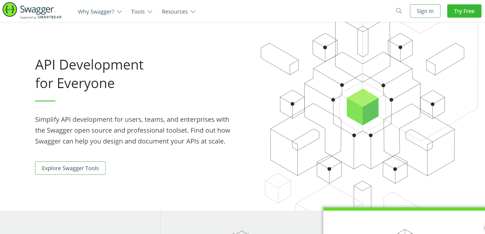

# Swagger快速入门

学习目标： 

- 了解Swagger的概念及作用
- 掌握在项目中集成Swagger自动生成API文档

## 1、Swagger简介 

- 前后端分离 
  - 前端 -> 前端控制层、视图层
  - 后端 -> 后端控制层、服务层、数据访问层
  - 前后端通过API进行交互 
  - 前后端相对独立且松耦合
- 产生的问题
  - 前后端集成，前端或者后端无法做到“及时协商，尽早解决”，最终导致问题集中爆发。
- 解决方案
  - 首先定义schema [ 计划的提纲 ]，并实时跟踪最新的API，降低集成风险。
- Swagger
  - 号称世界上最流行的API框架 
  - Restful Api 文档在线自动生成器 => API 文档 
  - 与API 定义同步更新 直接运行，在线测试API 
  - 支持多种语言 （如：Java，PHP等） 
  - 官网：https://swagger.io/
- 

