# SpringCloud快速入门

## 1.前言

> 学习前提

- 熟练使用SpringBoot 微服务快速开发框架
- 了解过Dubbo + Zookeeper 分布式基础
- 电脑配置内存不低于8G(个人是16G)

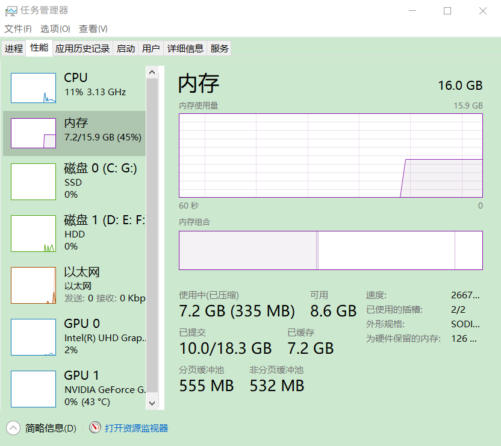

> SpringCloud五大组件

- 参考CSDN博文：https://blog.csdn.net/weixin_41217541/article/details/104718834

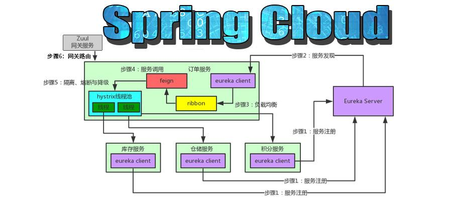

| 组件           | 选型                    | 备注                                                         |
| -------------- | ----------------------- | ------------------------------------------------------------ |
| 网关           | Zuul                    |                                                              |
| 服务注册与发现 | Eureka Consul zookeeper |                                                              |
| 服务调用       | Feign                   | 根据注解和选择机器,拼接Url地址,发起请求 简化服务调用         |
| 负载均衡       | Ribbon                  | 服务调用负载均衡，配合Feign和Euraka使用                      |
| 断路器         | Hystrix                 | 隔离、熔断以及降级的一个框架 服务线程池隔离，实现不同服务的调度隔离，避免服务雪崩 |

- Eureka:服务启动时,Eureka会将服务注册到EurekaService,并且EurakeClient还可以返回过来从EurekaService拉去注册表,从而知道服务在哪里。
- Ribbon:服务间发起请求的时候,基于Ribbon服务做到负载均衡,从一个服务的对台机器中选择一台。
- Feign:基于fegin的动态代理机制,根据注解和选择机器,拼接Url地址,发起请求。
- Hystrix:发起的请求是通过Hystrix的线程池来走,不同的服走不同的线程池,实现了不同的服务调度隔离,避免服务雪崩的问题。
- Zuul:如果前端后端移动端调用后台系统,统一走zull网关进入,有zull网关转发请求给对应的服务。

> 常见面试题

1. 什么是微服务？

2. 微服务之间是如何独立通讯的？

3. SpringCloud 和 Dubbo有哪些区别？ 

4. SpringBoot和SpringCloud，请你谈谈对他们的理解 

5. 什么是服务熔断？什么是服务降级 

6. 微服务的优缺点是分别是什么？说下你在项目开发中遇到的坑 

7. 你所知道的微服务技术栈有哪些？请列举一二 

8. eureka和zookeeper都可以提供服务注册与发现的功能，请说说两个的区别？

## 2.微服务概述

> 什么是微服务？

微服务（Microservice Architecture）是近几年流行的一种架构思想，关于它的概念很 难一言以蔽之。究竟什么是微服务呢？我们在此引用 ThoughtWorks 公司的首席科学家 Martin Fowler 于2014年提出的一段话：


- 原文：https://martinfowler.com/articles/microservices.html 
- 汉化：https://www.cnblogs.com/liuning8023/p/4493156.html

- 就目前而言，对于微服务，业界并没有一个统一的，标准的定义 

- 但通常而言，微服务架构是一种架构模式，或者说是一种架构风格， 它提倡将单一的应用程序划分成一组小的服务，每个服务运行在其独立的自己的进程内，服务之间互相协调，互相配置，为用户提供最终价值。服务之间采用轻量级的通信机制互相沟通，每个服务都围绕着具体的业务进行构建，并且能够被 独立的部署到生产环境中，另外，应尽量避免统一的，集中式的服务管理机制，对具体的一个服务而言，应根据业务上下文，选择合适的语言，工具对其进行构建，可以有一个非常轻量级的集中式管理来 协调这些服务，可以使用不同的语言来编写服务，也可以使用不同的数据存储； 

- 可能有的人觉得官方的话太过生涩，我们从技术维度来理解下：
- 微服务化的核心就是将传统的一站式应用，根据业务拆分成一个一个的服务，彻底地去耦合，每一个微服务提供单个业务功能的服务，一个服务做一件事情，从技术角度看就是一种小而独立的处理过程，类似进程的概念，能够自行单独启动或销毁，拥有自己独立的数据库。

> 微服务与微服务架构：

**微服务** 

- 强调的是服务的大小，他关注的是某一个点，是具体解决某一个问题/提供落地对应服务的一个服务应用，狭义的看，可以看做是IDEA中的一个个微服务工程，或者Moudel 

**微服务架构** 

- 一种新的架构形式，Martin Fowler，2014提出！ 

- 微服务架构是一种架构模式，它提倡将单一应用程序划分成一组小的服务，服务之间互相协调，互相配合，为用户提供最终价值。每个服务运行在其独立的进程中，服务于服务间采用轻量级的通信机制互相协作，每个服务都围绕着具体的业务进行构建，并且能够被独立的部署到生产环境中，另外，应尽量避免统一的，集中式的服务管理机制，对具体的一个服务而言，应根据业务上下文，选择合适的语言，工具对其进行构建。

**微服务优缺点**

- 优点：
  - 每个服务足够内聚，足够小，代码容易理解，这样能聚焦一个指定的业务功能或业务需求； 
  - 开发简单，开发效率提高，一个服务可能就是专一的只干一件事； 
  - 微服务能够被小团队单独开发，这个小团队是2~5人的开发人员组成； 
  - 微服务是松耦合的，是有功能意义的服务，无论是在开发阶段或部署阶段都是独立的。 微服务能使用不同的语言开发。 
  - 易于和第三方集成，微服务允许容易且灵活的方式集成自动部署，通过持续集成工具，如jenkins， Hudson，bamboo 
  - 微服务易于被一个开发人员理解，修改和维护，这样小团队能够更关注自己的工作成果。无需通过合作才能体现价值。 
  - 微服务允许你利用融合最新技术。 微服务只是业务逻辑的代码，不会和HTML，CSS或其他界面混合 
  - 每个微服务都有自己的存储能力，可以有自己的数据库，也可以有统一数据库

- 缺点： 
  - 开发人员要处理分布式系统的复杂性 
  - 多服务运维难度，随着服务的增加，运维的压力也在增大 
  - 系统部署依赖 
  - 服务间通信成本 
  - 数据一致性 
  - 系统集成测试 
  - 性能监控.....

> 微服务技术栈有哪些？

| 微服务条目                               | 落地技术                                                     |
| ---------------------------------------- | ------------------------------------------------------------ |
| 服务开发                                 | SpringBoot,Spring,SpringMVC                                  |
| 服务配置与管理                           | Netflix公司的Archaius、阿里的Diamond等                       |
| 服务注册与发现                           | Eureka、Consul、Zookeeper等                                  |
| 服务调用                                 | Rest、RPC、gRPC                                              |
| 服务熔断器                               | Hystrix、Envoy等                                             |
| 负载均衡                                 | Ribbon、Nginx等                                              |
| 服务接口调用（客户端调用服务的简化工具） | Feign等                                                      |
| 消息队列                                 | Kafka、RabbitMQ、ActiveMQ等                                  |
| 服务配置中心管理                         | SpringCloudConfig、Chef等                                    |
| 服务路由（API网关）                      | 服务监控                                                     |
| 服务监控                                 | Zabbix、Nagios、Metrics、Specatator等                        |
| 全链路追踪                               | Zipkin、Brave、Dapper等                                      |
| 服务部署                                 | Docker、OpenStack、Kubernetes等                              |
| 数据流操作开发包                         | SpringCloud Stream(封装与Redis，Rabbit，Kafka等发 送接收消息) |
| 事件消息总线                             | SpringCloud Bus                                              |

- Spring Cloud Alibaba


> 为什么选择SpringCloud作为微服务架构？

1、选型依据 

- 整体解决方案和框架成熟度 
- 社区热度 
- 可维护性 
- 学习曲线 

2、当前各大IT公司用的微服务架构有哪些？ 

- 阿里：dubbo+HFS 
- 京东：JSF 
- 新浪：Motan 
- 当当网 DubboX 
- ....... 

3、各微服务框架对比

| 功能点/ 服务框架 | Netflix/SpringCloud                                          | Motan                                                        | gRPC                        | Thrift   | Dubbo/DubboX                        |
| ---------------- | ------------------------------------------------------------ | ------------------------------------------------------------ | --------------------------- | -------- | ----------------------------------- |
| 功能定位         | 完整的微服务框架                                             | RPC框架，但整合了ZK或Consul，实现集群环境的基本服务注册/发现 | RPC框 架                    | RPC框架  | 服务框架                            |
| 支持Rest         | 是，Ribbon支持多种可插拔的序列化选择                         | 否                                                           | 否                          | 否       | 否                                  |
| 支持RPC          | 否                                                           | 是（Hession2）                                               | 是                          | 是       | 是                                  |
| 支持多语言       | 是（Rest形式）？                                             | 否                                                           | 是                          | 是       | 否                                  |
| 负载均衡         | 是（服务端zuul+客户端 Ribbon），zuul-服务，动态路由，云端负载均衡 Eureka（针对中间层服务器） | 是（客户端）                                                 | 否                          | 否       | 是（客户端）                        |
| 配置服务         | Netfix Archaius，Spring Cloud Config Server集中 配置         | 是（zookeeper提供）                                          | 否                          | 否       | 否                                  |
| 服务调用链监控   | 是（zuul），zuul提供边缘服务，API网关                        | 否                                                           | 否                          | 否       | 否                                  |
| 高可用/容错      | 是（服务端Hystrix+客户端Ribbon）                             | 是（客户端）                                                 | 否                          | 否       | 是（客户端）                        |
| 典型应用案例     | Netflix                                                      | Sina                                                         | Google                      | Facebook |                                     |
| 社区活跃程度     | 高                                                           | 一般                                                         | 高                          | 一般     | 2017年后重新开始维护，之前中断了5年 |
| 学习难度         | 中断                                                         | 低                                                           | 高                          | 高       | 低                                  |
| 文档丰富程度     | 高                                                           | 一般                                                         | 一般                        | 一般     | 高                                  |
| 其他             | Spring Cloud Bus为我们 的应用程序带来了更多管理端点          | 支持降级                                                     | Netflix 内部在开发集成 gRPC | IDL定义  | 实践的公司比较 多                   |

## 3.SpringCloud入门

> SpringCloud是什么？

- Spring官网:https://spring.io/
- 地址：[Spring (xy2401.com)](https://spring.io.xy2401.com/)

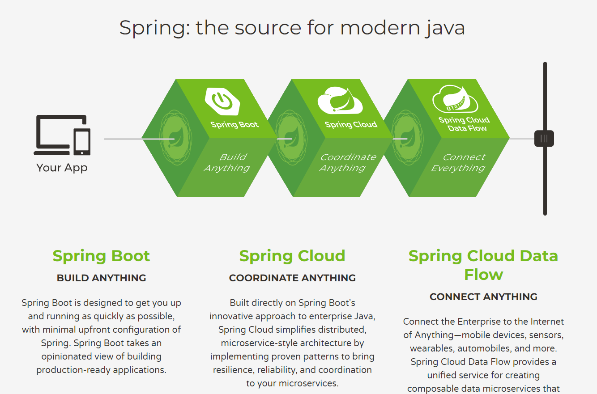


- SpringCloud, 基于SpringBoot提供了一套微服务解决方案，包括服务注册与发现，配置中心，全链路监控，服务网关，负载均衡，熔断器等组件，除了基于NetFlix的开源组件做高度抽象封装之外，还有一些选型中立的开源组件。 

- SpringCloud利用SpringBoot的开发便利性，巧妙地简化了分布式系统基础设施的开发，SpringCloud为开发人员提供了快速构建分布式系统的一些工具，==包括配置管理，服务发现，断路器，路由，微代理，事件总线，全局锁，决策竞选，分布式会话等等==，他们都可以用SpringBoot的开发风格做到一键启动和部署。
- SpringBoot并没有重复造轮子，它只是将目前各家公司开发的比较成熟，经得起实际考研的服务框架组合起来，通过SpringBoot风格进行再封装，屏蔽掉了复杂的配置和实现原理，最终给开发者留出了一套简单易懂，易部署和易维护的分布式系统开发工具包。
- SpringCloud是分布式微服务架构下的一站式解决方案，是各个微服务架构落地技术的集合体，俗称微 服务全家桶。

> SpringCloud和SpringBoot关系

- SpringBoot专注于快速方便的开发单个个体微服务。
- SpringCloud是关注全局的微服务协调整理治理框架，它将SpringBoot开发的一个个单体微服务整合并管理起来，为各个微服务之间提供：配置管理，服务发现，断路器，路由，微代理，事件总线，全局锁，决策竞选，分布式会话等等集成服务。
- SpringBoot可以离开SpringClooud独立使用，开发项目，但是SpringCloud离不开SpringBoot，属于依赖关系。
- SpringBoot专注于快速、方便的开发单个个体微服务，SpringCloud关注全局的服务治理框架。

> ##### 分布式+服务治理Dubbo

- 目前成熟的互联网架构，应用服务化拆分 + 消息中间件。

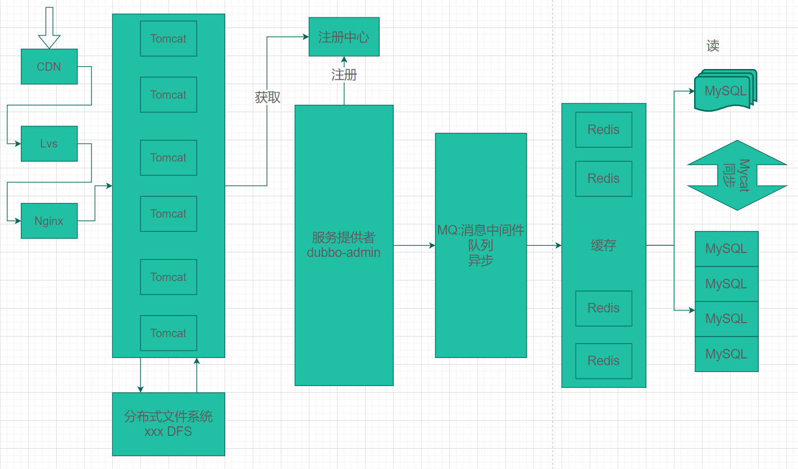

> Dubbo和SpringCloud对比

- 可以看一下社区活跃度：
  - https://github.com/dubbo
  - https://github.com/spring-cloud
- 对比结果：

|              | Dubbo         | SpringCloud                  |
| ------------ | ------------- | ---------------------------- |
| 服务注册中心 | Zookeeper     | Spring Cloud Netfilx Eureka  |
| 服务调用方式 | RPC           | REST API                     |
| 服务监控     | Dubbo-monitor | Spring Boot Admin            |
| 断路器       | 不完善        | Spring Cloud Netfilx Hystrix |
| 服务网关     | 无            | Spring Cloud Netfilx Zuul    |
| 分布式配置   | 无            | Spring Cloud Config          |
| 服务跟踪     | 无            | Spring Cloud Sleuth          |
| 消息总栈     | 无            | Spring Cloud Bus             |
| 数据流       | 无            | Spring Cloud Stream          |
| 批量任务     | 无            | Spring Cloud Task            |

- ==最大区别：SpringCloud抛弃了Dubbo的RPC通信，采用的是基于HTTP的REST方式==。 

- 严格来说，这两种方式各有优劣。虽然从一定程度上来说，后者牺牲了服务调用的性能，但也避免了上 面提到的原生RPC带来的问题。而且REST相比RPC更为灵活，服务提供方和调用方的依赖只依靠一纸契约，不存在代码级别的强依赖，这在强调快速演化的微服务环境下，显得更加合适。 

> 品牌机与组装机的区别 

- 很明显，Spring Cloud的功能比DUBBO更加强大，涵盖面更广，而且作为Spring的拳头项目，它也能够与Spring Framework、Spring Boot、Spring Data、Spring Batch等其他Spring项目完美融合，这些对 于微服务而言是至关重要的。使用Dubbo构建的微服务架构就像组装电脑，各环节我们的选择自由度很 高，但是最终结果很有可能因为一条内存质量不行就点不亮了，总是让人不怎么放心，但是如果你是一名高手，那这些都不是问题；而Spring Cloud就像品牌机，在Spring Source的整合下，做了大量的兼容性测试，保证了机器拥有更高的稳定性，但是如果要在使用非原装组件外的东西，就需要对其基础有足够的了解。 

> 社区支持与更新力度 

- 最为重要的是，DUBBO停止了5年左右的更新，虽然2017.7重启了。对于技术发展的新需求，需要由开发者自行拓展升级（比如当当网弄出了DubboX），这对于很多想要采用微服务架构的中小软件组织，显然是不太合适的，中小公司没有这么强大的技术能力去修改Dubbo源码+周边的一整套解决方案，并不是每一个公司都有阿里的大牛+真实的线上生产环境测试过。 
- 设计模式+微服务拆分思想。

> 总结： 

- 曾风靡国内的开源 RPC 服务框架Dubbo在重启维护后，令许多用户为之雀跃，但同时，也迎来了一些质疑的声音。互联网技术发展迅速，Dubbo是否还能跟上时代？Dubbo 与 Spring Cloud相比又有何优势和差异？是否会有相关举措保证Dubbo的后续更新频率？ 
- 人物：Dubbo重启维护开发的刘军，主要负责人之一。
  - 刘军，阿里巴巴中间件高级研发工程师，主导了Dubbo 重启维护以后的几个发版计划，专注于高性能 RPC 框架和微服务相关领域。曾负责网易考拉RPC框架的研发及指导在内部使用，参与了服务治理平台、分布式跟踪系统、分布式一致性框架等从无到有的设计与开发过程。 
- ==解决的问题域不一样：Dubbo的定位是一款RPC框架，Spring Cloud的目标是微服务架构下的一站式解决方案==。

> SpringCloud能干嘛？

- Distributed/versioned configuration （分布式/版本控制配置） 
- Service registration and discovery（服务注册与发现） 
- Routing（路由） 
- Service-to-service calls（服务到服务的调用） 
- Load balancing（负载均衡配置） 
- Circuit Breakers（断路器） 
- Distributed messaging（分布式消息管理） 
- ....

> SpringCloud在哪获取？

- 官网：http://projects.spring.io/spring-cloud/
- 它的版本号有点特别：

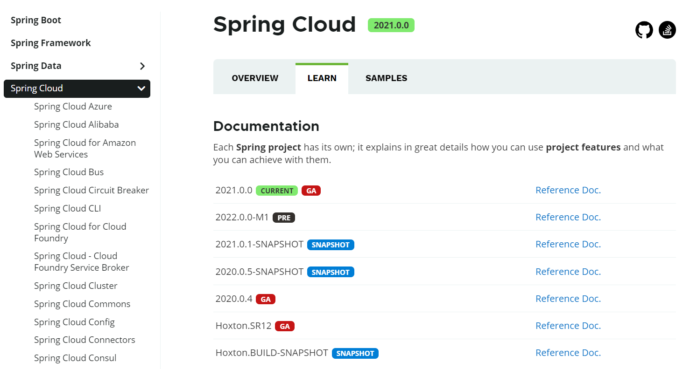

- Spring Cloud是一个由众多独立子项目组成的大型综合项目，每个子项目有不同的发行节奏，都维护着自己的发布版本号。Spring Cloud通过一个资源清单BOM（Bill of Materials）来管理每个版本的子项目清单。为避免与子项目的发布号混淆，所以`没有采用版本号的方式，而是通过命名的方式`。
- 这些版本名称的命名方式`采用了伦敦地铁站的名称，同时根据字母表的顺序来对应版本时间顺序`，比如：最早的Release版本：Angel，第二个Release版本：Brixton，然后是Camden、Dalston、Edgware，Finchley,目前最新的是Hoxton 版本。 

> 自学参考： 

- SpringCloud Netflix 中文文档：[https://springcloud.cc/spring-cloud-netflix.html](https://springcloud.cc/spring-cloud-netflix.html)
- SpringCloud 中文API文档(官方文档翻译版)：[https://springcloud.cc/spring-cloud-dalston.html](https://springcloud.cc/spring-cloud-dalston.html)
- SpringCloud中国社区：[http://docs.springcloud.cn/](http://docs.springcloud.cn/)
- SpringCloud中文网：[https://springcloud.cc](https://springcloud.cc)

## 4.Rest微服务构建

>介绍

- 使用一个Dept部门模块做一个微服务通用案例。 
- Consumer消费者（Client）通过REST调用Provider提供者（Server）提供的服务。 
- 回忆Spring，SpringMVC，MyBatis等以往学习的知识。。。 
- Maven的分包分模块架构复习

```xml
一个简单的Maven模块结构是这样的：
-- app-parent：一个父项目（app-parent）聚合很多子项目（app-util，app-dao，appweb...）
|-- pom.xml
|
|-- app-core
||----pom.xml
|
|-- app-web
||----pom.xml
......
```

一个父工程带着多个子Module子模块。

SpringCloud父工程（Project）下初次带着3个子模块（Module）

- springcloud-api 【封装的整体entity / 接口 / 公共配置等】 
- springcloud-provider-dept-8001【服务提供者】 
- springcloud-consumer-dept-80【服务消费者】

> SpringCloud版本选择

| SpringBoot | SpringCloud             | 关系                                     |
| ---------- | ----------------------- | ---------------------------------------- |
| 1.2.x      | Angel版本(天使)         | 兼容SpringBoot1.2x                       |
| 1.3.x      | Brixton版本(布里克斯顿) | 兼容SpringBoot1.3x，也兼容SpringBoot1.4x |
| 1.4.x      | Camden版本(卡姆登)      | 兼容SpringBoot1.4x，也兼容SpringBoot1.5x |
| 1.5.x      | Dalston版本(多尔斯顿)   | 兼容SpringBoot1.5x，不兼容SpringBoot2.0x |
| 1.5.x      | Edgware版本(埃奇韦尔)   | 兼容SpringBoot1.5x，不兼容SpringBoot2.0x |
| 2.0.x      | Finchley版本(芬奇利)    | 兼容SpringBoot2.0x，不兼容SpringBoot1.5x |
| 2.1.x      | Greenwich版本(格林威治) |                                          |

- **实际开发版本关系**

| spring-boot-starter-parent |              | spring-cloud-dependencles |              |
| -------------------------- | ------------ | ------------------------- | ------------ |
| **版本号**                 | **发布日期** | **版本号**                | **发布日期** |
| 1.5.2.RELEASE              | 2017-03      | Dalston.RC1               | 2017-x       |
| 1.5.9.RELEASE              | 2017-11      | Edgware.RELEASE           | 2017-11      |
| 1.5.16.RELEASE             | 2018-04      | Edgware.SR5               | 2018-10      |
| 1.5.20.RELEASE             | 2018-09      | Edgware.SR5               | 2018-10      |
| 2.0.2.RELEASE              | 2018-05      | Fomchiey.BULD-SNAPSHOT    | 2018-x       |
| 2.0.6.RELEASE              | 2018-10      | Fomchiey-SR2              | 2018-10      |
| 2.1.4.RELEASE              | 2019-04      | Greenwich.SR1             | 2019-03      |

- **使用后两个**

> 创建父工程

- 新建父工程Maven项目 springcloud-parent，切记Packageing是pom模式。
- 主要是定义POM文件，将后续各个子模块公用的jar包等统一提取出来，类似一个抽象父类。

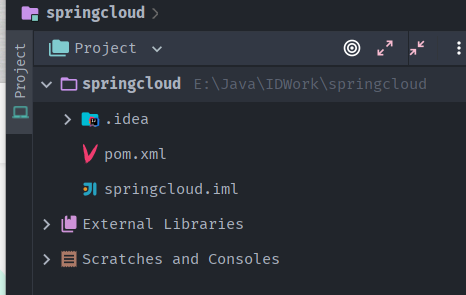

- pom.xml

```xml
<?xml version="1.0" encoding="UTF-8"?>
<project xmlns="http://maven.apache.org/POM/4.0.0"
         xmlns:xsi="http://www.w3.org/2001/XMLSchema-instance"
         xsi:schemaLocation="http://maven.apache.org/POM/4.0.0 http://maven.apache.org/xsd/maven-4.0.0.xsd">
    <modelVersion>4.0.0</modelVersion>

    <groupId>com.github</groupId>
    <artifactId>springcloud</artifactId>
    <version>1.0-SNAPSHOT</version>
    <modules>
    </modules>

    <properties>
        <project.build.sourceEncoding>UTF-8</project.build.sourceEncoding>
        <maven.compiler.source>8</maven.compiler.source>
        <maven.compiler.target>8</maven.compiler.target>
        <junit.version>4.13.2</junit.version>
        <log4j.version>1.2.17</log4j.version>
        <lombok.version>1.18.22</lombok.version>
    </properties>

    <!--打包方式  pom-->
    <packaging>pom</packaging>

    <dependencyManagement>
        <dependencies>
            <dependency>
                <groupId>org.springframework.cloud</groupId>
                <artifactId>spring-cloud-alibaba-dependencies</artifactId>
                <version>0.2.0.RELEASE</version>
                <type>pom</type>
                <scope>import</scope>
            </dependency>
            <!--springCloud的依赖-->
            <dependency>
                <groupId>org.springframework.cloud</groupId>
                <artifactId>spring-cloud-dependencies</artifactId>
                <version>Greenwich.SR1</version>
                <type>pom</type>
                <scope>import</scope>
            </dependency>
            <!--SpringBoot-->
            <dependency>
                <groupId>org.springframework.boot</groupId>
                <artifactId>spring-boot-dependencies</artifactId>
                <version>2.1.4.RELEASE</version>
                <type>pom</type>
                <scope>import</scope>
            </dependency>
            <!--数据库-->
            <dependency>
                <groupId>mysql</groupId>
                <artifactId>mysql-connector-java</artifactId>
                <version>5.1.47</version>
            </dependency>
            <dependency>
                <groupId>com.alibaba</groupId>
                <artifactId>druid</artifactId>
                <version>1.1.10</version>
            </dependency>
            <!--SpringBoot 启动器-->
            <dependency>
                <groupId>org.mybatis.spring.boot</groupId>
                <artifactId>mybatis-spring-boot-starter</artifactId>
                <version>1.3.2</version>
            </dependency>
            <!--日志测试~-->
            <dependency>
                <groupId>ch.qos.logback</groupId>
                <artifactId>logback-core</artifactId>
                <version>1.2.3</version>
            </dependency>
            <dependency>
                <groupId>junit</groupId>
                <artifactId>junit</artifactId>
                <version>${junit.version}</version>
            </dependency>
            <dependency>
                <groupId>log4j</groupId>
                <artifactId>log4j</artifactId>
                <version>${log4j.version}</version>
            </dependency>
            <dependency>
                <groupId>org.projectlombok</groupId>
                <artifactId>lombok</artifactId>
                <version>${lombok.version}</version>
            </dependency>
        </dependencies>
    </dependencyManagement>

</project>
```

> 创建api公共模块

- 新建springcloud-api模块

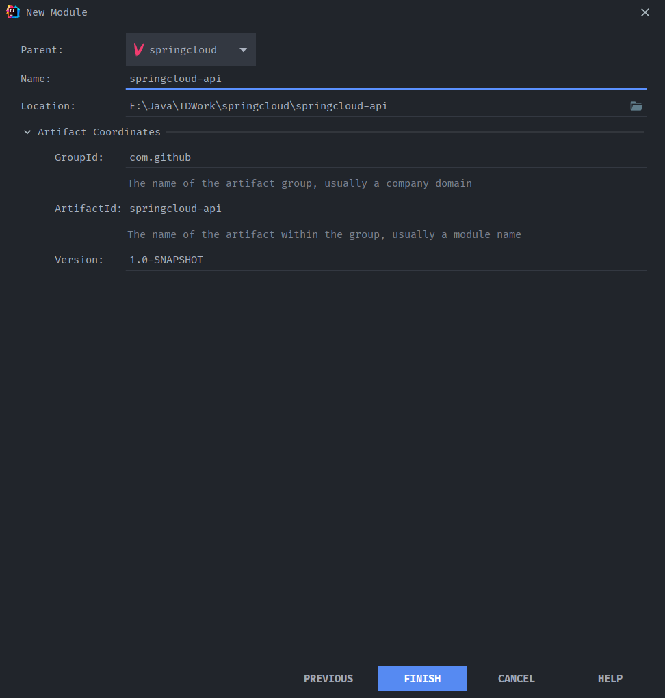

- 可以观察发现，在父工程中多了一个Modules。

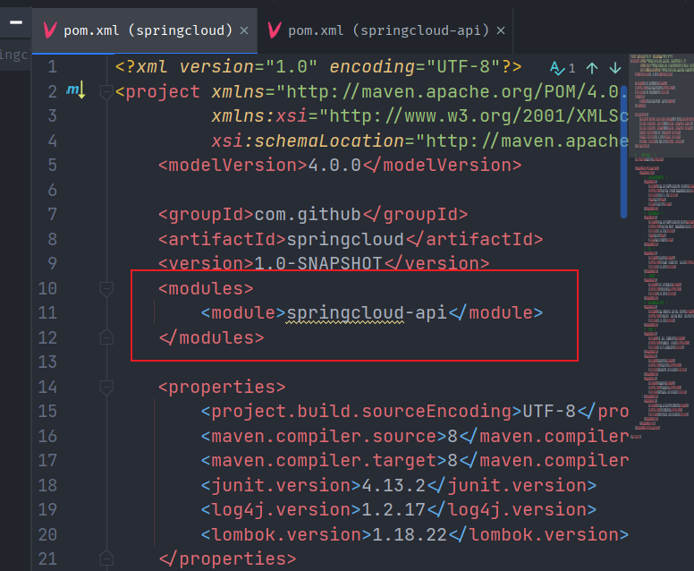

- 编写springcloud-api 的 pom.xml

```xml
<?xml version="1.0" encoding="UTF-8"?>
<project xmlns="http://maven.apache.org/POM/4.0.0"
         xmlns:xsi="http://www.w3.org/2001/XMLSchema-instance"
         xsi:schemaLocation="http://maven.apache.org/POM/4.0.0 http://maven.apache.org/xsd/maven-4.0.0.xsd">
    <parent>
        <artifactId>springcloud</artifactId>
        <groupId>com.github</groupId>
        <version>1.0-SNAPSHOT</version>
    </parent>
    <modelVersion>4.0.0</modelVersion>

    <!--当前Module的名字-->
    <artifactId>springcloud-api</artifactId>

    <!--当前Module需要到的jar包，按自己需求添加，如果父项目已经包含了，可以不用写版本号-->
    <dependencies>
        <dependency>
            <groupId>org.projectlombok</groupId>
            <artifactId>lombok</artifactId>
        </dependency>
    </dependencies>
    
    <properties>
        <maven.compiler.source>8</maven.compiler.source>
        <maven.compiler.target>8</maven.compiler.target>
    </properties>

</project>
```

- 创建部门数据库脚本，数据库名：springcloud

```mysql
CREATE TABLE dept ( deptno BIGINT NOT NULL PRIMARY KEY AUTO_INCREMENT, dname VARCHAR ( 60 ), db_source VARCHAR ( 60 ) );

INSERT INTO dept ( dname, db_source )
VALUES
	(
		'开发部',
	DATABASE ());
INSERT INTO dept ( dname, db_source )
VALUES
	(
		'人事部',
	DATABASE ());
INSERT INTO dept ( dname, db_source )
VALUES
	(
		'财务部',
	DATABASE ());
INSERT INTO dept ( dname, db_source )
VALUES
	(
		'市场部',
	DATABASE ());
INSERT INTO dept ( dname, db_source )
VALUES
	(
		'运维部',
	DATABASE ());
	
SELECT
	* 
FROM
	dept;
```

- 编写实体类，注意：实体类都序列化！

```java
package com.github.pojo;

import lombok.Data;
import lombok.NoArgsConstructor;
import lombok.experimental.Accessors;

import java.io.Serializable;

@NoArgsConstructor
@Data
@Accessors(chain = true) // 链式写法
public class Dept implements Serializable {
    // Dept(实体类) orm mysql->Dept(表) 类表关系映射
    private Long deptno; // 主键
    private String dname; // 部门名称
    // 来自哪个数据库，因为微服务架构可以一个服务对应一个数据库，同一个信息被存到多个不同的数据库
    private String db_source;
    public Dept(String dname) {
        this.dname = dname;
    }

    /*
    链式写法：
        Dept dept = new Dept()
        dept.setDeptno(11L).setDname("school").setDb_source("DB01");
     */
}
```

> 创建provider模块

- 新建springcloud-provider-dept-8001模块 
- 编辑pom.xml

```xml
<?xml version="1.0" encoding="UTF-8"?>
<project xmlns="http://maven.apache.org/POM/4.0.0"
         xmlns:xsi="http://www.w3.org/2001/XMLSchema-instance"
         xsi:schemaLocation="http://maven.apache.org/POM/4.0.0 http://maven.apache.org/xsd/maven-4.0.0.xsd">
    <parent>
        <artifactId>springcloud</artifactId>
        <groupId>com.github</groupId>
        <version>1.0-SNAPSHOT</version>
    </parent>
    <modelVersion>4.0.0</modelVersion>

    <artifactId>springcloud-provider-dept-8001</artifactId>

    <properties>
        <maven.compiler.source>8</maven.compiler.source>
        <maven.compiler.target>8</maven.compiler.target>
    </properties>

    <dependencies>
        <!--引入自定义的模块，我们就可以使用这个模块中的类了-->
        <dependency>
            <groupId>com.github</groupId>
            <artifactId>springcloud-api</artifactId>
            <version>1.0-SNAPSHOT</version>
        </dependency>
        <dependency>
            <groupId>junit</groupId>
            <artifactId>junit</artifactId>
        </dependency>
        <dependency>
            <groupId>mysql</groupId>
            <artifactId>mysql-connector-java</artifactId>
        </dependency>
        <dependency>
            <groupId>com.alibaba</groupId>
            <artifactId>druid</artifactId>
        </dependency>
        <dependency>
            <groupId>ch.qos.logback</groupId>
            <artifactId>logback-core</artifactId>
        </dependency>
        <dependency>
            <groupId>org.mybatis.spring.boot</groupId>
            <artifactId>mybatis-spring-boot-starter</artifactId>
        </dependency>
        <dependency>
            <groupId>org.springframework.boot</groupId>
            <artifactId>spring-boot-starter-jetty</artifactId>
        </dependency>
        <dependency>
            <groupId>org.springframework.boot</groupId>
            <artifactId>spring-boot-starter-web</artifactId>
        </dependency>
        <dependency>
            <groupId>org.springframework.boot</groupId>
            <artifactId>spring-boot-test</artifactId>
        </dependency>
        <!-- spring-boot-devtools热部署 -->
        <dependency>
            <groupId>org.springframework.boot</groupId>
            <artifactId>spring-boot-devtools</artifactId>
        </dependency>
    </dependencies>

</project>
```

- 编辑 application.yml

```yaml
server:
  port: 8001
# mybatis的配置
mybatis:
  config-location: classpath:mybatis/mybatis-config.xml
  type-aliases-package: com.github.pojo
  mapper-locations:
    - classpath:mybatis/mapper/**/*.xml
# spring的相关配置
spring:
  application:
    name: springcloud-provider-dept
  datasource:
    type: com.alibaba.druid.pool.DruidDataSource # 数据源
    driver-class-name: org.gjt.mm.mysql.Driver # mysql驱动
    url: jdbc:mysql://localhost:3306/springcloud #数据库名称
    username: root
    password: root
    dbcp2:
      min-idle: 5 #数据库连接池的最小维持连接数
      initial-size: 5 #初始化连接数
      max-total: 5 #最大连接数
      max-wait-millis: 200 #等待连接获取的最大超时时间
```

- 根据配置新建mybatis-config.xml文件

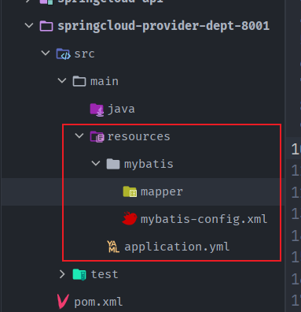

```xml
<?xml version="1.0" encoding="UTF-8" ?>
<!DOCTYPE configuration
        PUBLIC "-//mybatis.org//DTD Config 3.0//EN"
        "http://mybatis.org/dtd/mybatis-3-config.dtd">
<configuration>
    
    <settings>
        <!--开启二级缓存-->
        <setting name="cacheEnabled" value="true"/>
    </settings>
    
</configuration>
```

- 编写部门的dao接口

```java
@Mapper
public interface DeptDao {
    public boolean addDept(Dept dept); // 添加一个部门
    public Dept queryById(Long id); // 根据id查询部门
    public List<Dept> queryAll(); // 查询所有部门
}
```

- 接口对应的Mapper.xml文件 mybatis\mapper\DeptMapper.xml

```xml
<?xml version="1.0" encoding="UTF-8" ?>
<!DOCTYPE mapper
        PUBLIC "-//mybatis.org//DTD Mapper 3.0//EN"
        "http://mybatis.org/dtd/mybatis-3-mapper.dtd">
<mapper namespace="com.github.dao.DeptDao">
    
    <insert id="addDept" parameterType="Dept">
        insert into dept (dname,db_source) values (#{dname},DATABASE());
    </insert>
    
    <select id="queryById" resultType="Dept" parameterType="Long">
        select deptno,dname,db_source from dept where deptno = #{deptno};
    </select>
    
    <select id="queryAll" resultType="Dept">
        select deptno,dname,db_source from dept;
    </select>
</mapper>
```

- 创建Service服务层接口

```java
public interface DeptService {
    public boolean addDept(Dept dept); // 添加一个部门
    public Dept queryById(Long id); // 根据id查询部门
    public List<Dept> queryAll(); // 查询所有部门
}
```

- ServiceImpl实现类

```java
@Service
public class DeptServiceImpl implements DeptService {
    // 自动注入
    @Autowired
    private DeptDao deptDao;
    @Override
    public boolean addDept(Dept dept) {
        return deptDao.addDept(dept);
    }
    @Override
    public Dept queryById(Long id) {
        return deptDao.queryById(id);
    }
    @Override
    public List<Dept> queryAll() {
        return deptDao.queryAll();
    }
}
```

- ServiceImpl实现类

```java
@RestController
@RequestMapping("/dept")
public class DeptController {
    @Autowired
    private DeptService service;
    // @RequestBody
    // 如果参数是放在请求体中，传入后台的话，那么后台要用@RequestBody才能接收到
    @PostMapping("/add")
    public boolean addDept(@RequestBody Dept dept) {
        return service.addDept(dept);
    }
    @GetMapping("/get/{id}")
    public Dept get(@PathVariable("id") Long id) {
        return service.queryById(id);
    }
    @GetMapping("/list")
    public List<Dept> queryAll() {
        return service.queryAll();
    }
}
```

- 编写DeptProvider的主启动类

```java
@SpringBootApplication
public class DeptProvider8001 {
    public static void main(String[] args) {
        SpringApplication.run(DeptProvider8001.class,args);
    }
}
```

- 启动测试，注意编写细节：


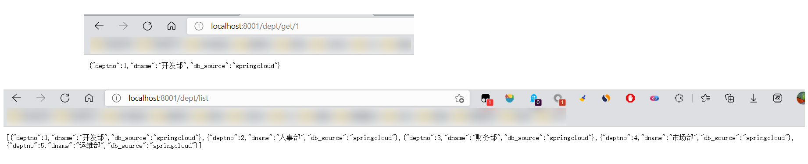

> 创建consumer模块

- 新建springcloud-consumer-dept-80模块 
- 编辑pom.xml

```xml
<?xml version="1.0" encoding="UTF-8"?>
<project xmlns="http://maven.apache.org/POM/4.0.0"
         xmlns:xsi="http://www.w3.org/2001/XMLSchema-instance"
         xsi:schemaLocation="http://maven.apache.org/POM/4.0.0 http://maven.apache.org/xsd/maven-4.0.0.xsd">
    <parent>
        <artifactId>springcloud</artifactId>
        <groupId>com.github</groupId>
        <version>1.0-SNAPSHOT</version>
    </parent>
    <modelVersion>4.0.0</modelVersion>

    <artifactId>springcloud-consumer-dept-80</artifactId>
    <description>部门微服务消费者</description>

    <properties>
        <maven.compiler.source>8</maven.compiler.source>
        <maven.compiler.target>8</maven.compiler.target>
    </properties>

    <dependencies>
        <dependency>
            <groupId>com.github</groupId>
            <artifactId>springcloud-api</artifactId>
            <version>1.0-SNAPSHOT</version>
        </dependency>
        <dependency>
            <groupId>org.springframework.boot</groupId>
            <artifactId>spring-boot-starter-web</artifactId>
        </dependency>
        <!--热部署-->
        <dependency>
            <groupId>org.springframework.boot</groupId>
            <artifactId>spring-boot-devtools</artifactId>
        </dependency>
    </dependencies>
    
</project>
```

- application.yml配置文件

```yaml
server:
  port: 80
```

- 新建一个ConfigBean包注入 RestTemplate！

```java
@Configuration
public class ConfigBean {

    @Bean
    public RestTemplate getRestTemplate(){
        return new RestTemplate();
    }
}
```

- 创建Controller包，编写DeptConsumerController类

```java
@RestController
public class DeptConsumerController {
    // 理解：消费者，不应该有service层
    // 使用RestTemplate访问restful接口非常的简单粗暴且无脑
    // （url，requestMap，ResponseBean.class） 这三个参数分别代表
    // REST请求地址，请求参数，Http响应转换被转换成的对象类型

    @Autowired
    private RestTemplate restTemplate;

    private static final String REST_URL_PREFIX = "http://localhost:8001";
    @RequestMapping("/consumer/dept/add")
    public boolean add(Dept dept){
        return
                restTemplate.postForObject(REST_URL_PREFIX+"/dept/add",dept,Boolean.class);
    }
    @RequestMapping("/consumer/dept/get/{id}")
    public Dept get(@PathVariable("id") Long id){
        return
                restTemplate.getForObject(REST_URL_PREFIX+"/dept/get/"+id,Dept.class);
    }
    @RequestMapping("/consumer/dept/list")
    public List<Dept> list(){
        return
                restTemplate.getForObject(REST_URL_PREFIX+"/dept/list",List.class);
    }
}
```

- 了解RestTemplate：
  - RestTemplate提供了多种便捷访问远程Http服务的方法，是一种简单便捷的访问restful服务模板类，是Spring提供的用于访问Rest服务的客户端模板工具集。
  - 使用RestTemplate访问restful接口非常的简单粗暴且无脑 （url，requsetMap，ResponseBean.class）这三个参数分别代表REST请求地址，请求参数，Http响应转换被转换成的对象类型。

- 主启动类

```java
@SpringBootApplication
public class DeptConsumer80 {
    public static void main(String[] args) {
        SpringApplication.run(DeptConsumer80.class,args);
    }
}
```

- 测试访问，`先启动服务方：DeptProvider8001，再启动消费方：DeptConsumer80`：

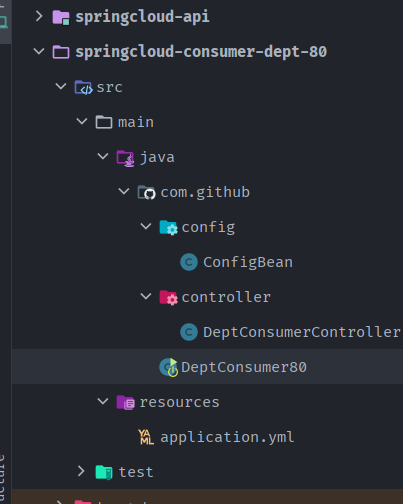

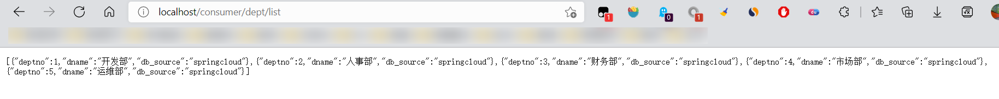

## 5.Eureka服务注册与发现

> 什么是[Eureka](https://baike.baidu.com/item/Eureka/22402835)？

- Eureka（服务发现框架）
- Netflix 在设计Eureka时，遵循的就是API原则！
- CAP原则又称CAP定理，指的是在一个分布式系统中，一致性（Consistency）、可用性（Availability）、分区容错性（Partition tolerance）。CAP 原则指的是，这三个要素最多只能同时实现两点，不可能三者兼顾。
- Eureka是Netflix的一个子模块，也是核心模块之一。Eureka是一个基于REST的服务，用于定位服务，以实现云端中间层服务发现和故障转移，服务注册与发现对于微服务来说是非常重要的，有了服务发现 与注册，只需要使用服务的标识符，就可以访问到服务，而不需要修改服务调用的配置文件了，功能类 似于Dubbo的注册中心，比如Zookeeper。

>Eureka的基本架构：

- Springcloud 封装了Netflix公司开发的Eureka模块来实现服务注册与发现 (对比Zookeeper)。
- SpringCloud将它集成在其子项目spring-cloud-netflix中，以实现SpringCloud的服务发现功能。
- Eureka采用了C-S的架构设计，EurekaServer作为服务注册功能的服务器，他是服务注册中心。
- 而系统中的其他微服务，使用Eureka的客户端连接到EurekaServer并维持心跳连接。这样系统的维护人员就可以通过EurekaServer来监控系统中各个微服务是否正常运行，Springcloud 的一些其他模块 (比如Zuul) 就可以通过EurekaServer来发现系统中的其他微服务，并执行相关的逻辑。

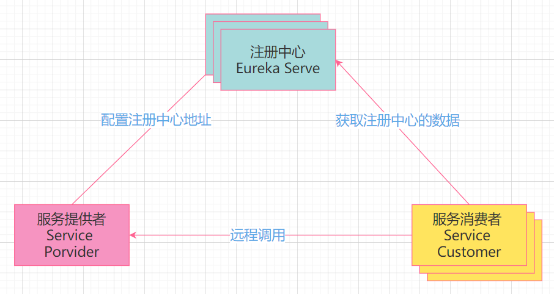

- 和Dubbo架构对比：


- Eureka包含两个组件：Eureka Server和Eureka Client。
- Eureka Server提供服务注册服务，各个节点启动后，会在Eureka Server中进行注册，这样EurekaServer中的服务注册表中将会存储所有可用服务节点的信息，服务节点的信息可以在界面中直观的看到。
- Eureka Client是一个[java](https://baike.baidu.com/item/java/85979)客户端，用于简化与Eureka Server的交互，客户端同时也就是一个内置的、使用轮询(round-robin)负载算法的[负载均衡器](https://baike.baidu.com/item/负载均衡器/8852239)。
- 在应用启动后，将会向Eureka Server发送心跳,默认周期为30秒，如果Eureka Server在多个心跳周期内没有接收到某个节点的心跳，Eureka Server将会从服务注册表中把这个服务节点移除(默认90秒)。

> 三大角色：

- Eureka Server：提供服务的注册于发现。 
- Service Provider：将自身服务注册到Eureka中，从而使消费方能够找到。 
- Service Consumer：服务消费方从Eureka中获取注册服务列表，从而找到消费服务。

> 服务构建

- 建立springcloud-eureka-7001模块 
- 编辑pom.xml

```xml
<?xml version="1.0" encoding="UTF-8"?>
<project xmlns="http://maven.apache.org/POM/4.0.0"
         xmlns:xsi="http://www.w3.org/2001/XMLSchema-instance"
         xsi:schemaLocation="http://maven.apache.org/POM/4.0.0 http://maven.apache.org/xsd/maven-4.0.0.xsd">
    <parent>
        <artifactId>springcloud</artifactId>
        <groupId>com.github</groupId>
        <version>1.0-SNAPSHOT</version>
    </parent>
    <modelVersion>4.0.0</modelVersion>

    <artifactId>springcloud-eureka-7001</artifactId>

    <properties>
        <maven.compiler.source>8</maven.compiler.source>
        <maven.compiler.target>8</maven.compiler.target>
    </properties>

    <dependencies>
        <!-- eureka-server服务端 -->
        <dependency>
            <groupId>org.springframework.cloud</groupId>
            <artifactId>spring-cloud-starter-eureka-server</artifactId>
            <version>1.4.6.RELEASE</version>
        </dependency>
        <!--热部署-->
        <dependency>
            <groupId>org.springframework.boot</groupId>
            <artifactId>spring-boot-devtools</artifactId>
        </dependency>
    </dependencies>

</project>
```

- application.yml

```yaml
server:
  port: 7001

# Eureka配置
eureka:
  instance:
    hostname: localhost #eureka服务端的实例名称
  client:
    register-with-eureka: false #是否将自己注册到Eureka服务器中，本身是服务器，无需注册
    fetch-registry: false #false表示自己端就是注册中心，职责是维护服务实例，并不需要检索服务
    service-url: 
      defaultzone: http://${eureka.instance.hostname}:${server.port}/eureka/
      # 设置与Eureka Server交互的地址查询服务和注册服务都需要依赖这个defaultzone地址
```

- 编写主启动类

```java
package com.github;

import org.springframework.boot.SpringApplication;
import org.springframework.boot.autoconfigure.SpringBootApplication;
import org.springframework.cloud.netflix.eureka.server.EnableEurekaServer;

@SpringBootApplication
@EnableEurekaServer // EurekaServer服务端启动类，接受其他微服务注册进来
public class EurekaServer7001 {
    public static void main(String[] args){
        SpringApplication.run(EurekaServer7001.class,args);
    }
}
```

- 启动，访问测试：

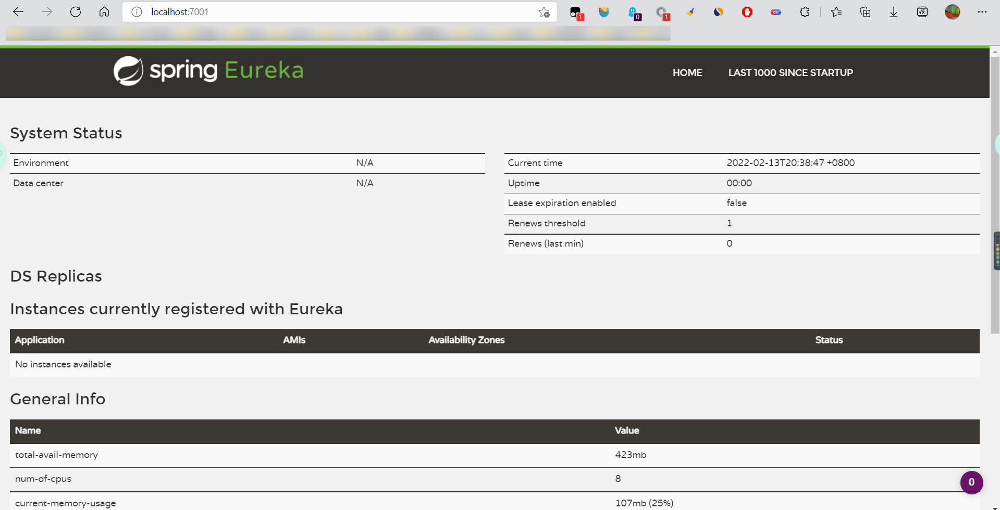

- System Status：系统信息；
- DS Replicas：服务器副本； 
- Instances currently registered with Eureka：已注册的微服务列表；
- General Info：一般信息；
- Instance Info：实例信息。

> Service Provider

- 将 8001 的服务入驻到 7001 的eureka中！ 

1. 修改8001服务的pom文件，增加eureka的支持！

```xml
<!--将服务的provider注册到eureka中-->
<!-- https://mvnrepository.com/artifact/org.springframework.cloud/spring-cloud-starter-eureka -->
<dependency>
    <groupId>org.springframework.cloud</groupId>
    <artifactId>spring-cloud-starter-eureka</artifactId>
    <version>1.4.6.RELEASE</version>
</dependency>
```

2. yaml 中配置 eureka 的支持

```yaml
# Eureka配置：配置服务注册中心地址
eureka:
  client:
    service-url:
      defaultZone: http://localhost:7001/eureka/
```

3. 8001 的主启动类注解支持

```java
@SpringBootApplication
@EnableEurekaClient // 本服务启动之后会自动注册进Eureka中！
public class DeptProvider8001 {
    public static void main(String[] args) {
        SpringApplication.run(DeptProvider8001.class,args);
    }
}
```

- 截止目前：服务端也有了，客户端也有了，`启动7001，再启动8001，测试访问`：

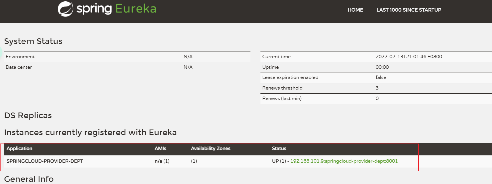

> actuator与注册微服务信息完善

- 主机名称：服务名称修改

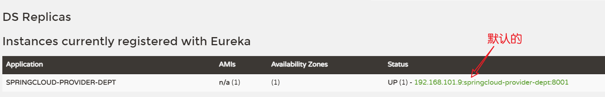

- 在8001的yaml中修改一下配置。

```yaml
# Eureka配置：配置服务注册中心地址
eureka:
  client:
    service-url:
      defaultZone: http://localhost:7001/eureka/
  instance:
    instance-id: springcloud-provider-dept8001 # 与client平级
```

- 重启，刷新后查看结果！

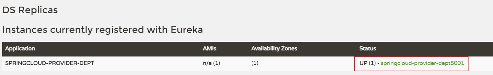

- 访问信息有IP信息提示

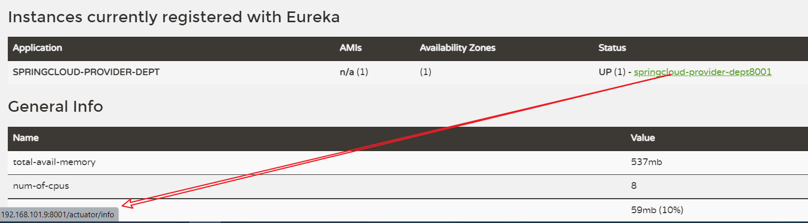

- yaml中在增加一个配置:

```yaml
# Eureka配置：配置服务注册中心地址
eureka:
  client:
    service-url:
      defaultZone: http://localhost:7001/eureka/
  instance:
    instance-id: springcloud-provider-dept8001 # 与client平级
    prefer-ip-address: true # true表示访问路径可以显示IP地址
```

- 现在点击info，出现ERROR页面:

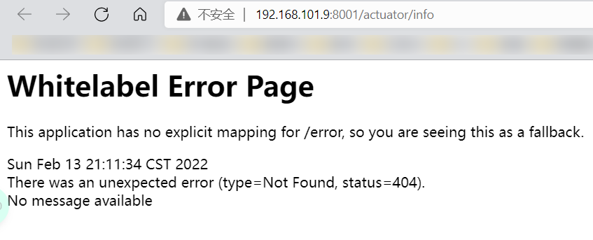

- 修改8001的pom文件，新增依赖！

```xml
<!--actuator监控信息完善-->
<dependency>
    <groupId>org.springframework.boot</groupId>
    <artifactId>spring-boot-starter-actuator</artifactId>
</dependency>
```

- 然后回到8001的yaml配置文件中修改增加信息：

```yaml
# info配置
info:
  app.name: subei-springcloud  # 项目的名称
  company.name: www.subeily.top  # 公司的名称
```

- 重启项目测试：7001、8001

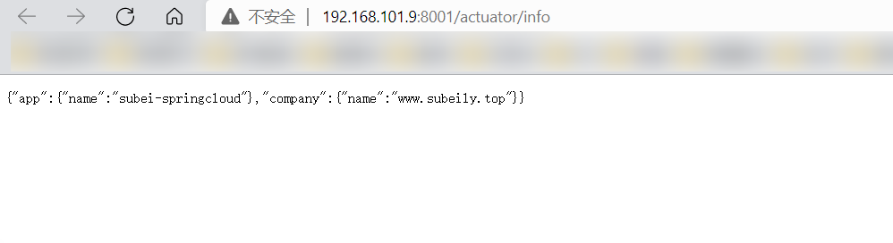

- 这里`没出来的可以将spring boot版本降级即可`！
- 如果还没出来，可以添加如下配置：

```yaml
management:
  endpoints:
    web:
      exposure:
        include: "*"
```

> Eureka的自我保护机制：好死不如赖活着

- 之前出现的这些红色情况，没出现的，修改一个服务名，故意制造错误！

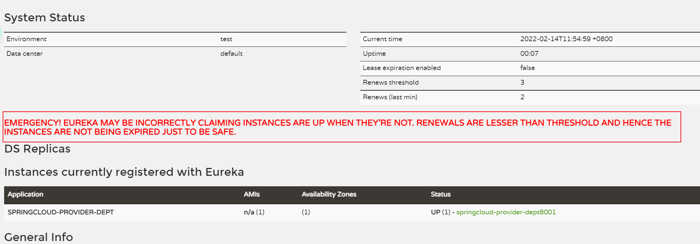

- 一句话总结就是：某时刻某一个微服务不可用，eureka不会立即清理，依旧会对该微服务的信息进行保存！
- 默认情况下，当eureka server在一定时间内没有收到实例的心跳，便会把该实例从注册表中删除（==默认是90秒==），但是，如果短时间内丢失大量的实例心跳，便会触发eureka server的自我保护机制，比如在开发测试时，需要频繁地重启微服务实例，但是我们很少会把eureka server一起重启（因为在开发过程中不会修改eureka注册中心），==当一分钟内收到的心跳数大量减少时，会触发该保护机制。可以在eureka管理界面看到Renews threshold和Renews(last min)，当后者（最后一分钟收到的心跳数）小于前者（心跳阈值）的时候，触发保护机制==，会出现红色的警告：`EMERGENCY!EUREKA MAY BE INCORRECTLY CLAIMING INSTANCES ARE UP WHEN THEY'RE NOT.RENEWALS ARE LESSER THAN THRESHOLD AND HENCE THE INSTANCES ARE NOT BEGING EXPIRED JUST TO BE SAFE.`
- 从警告中可以看到，eureka认为虽然收不到实例的心跳，但它认为实例还是健康的，eureka会保护这些实例，不会把它们从注册表中删掉。
- 该保护机制的目的是避免网络连接故障，在发生网络故障时，微服务和注册中心之间无法正常通信，但服务本身是健康的，不应该注销该服务，如果eureka因网络故障而把微服务误删了，那即使网络恢复了，该微服务也不会重新注册到eureka server了，因为只有在微服务启动的时候才会发起注册请求，后面只会发送心跳和服务列表请求，这样的话，该实例虽然是运行着，但永远不会被其它服务所感知。所以，eureka server在短时间内丢失过多的客户端心跳时，会进入自我保护模式，该模式下，eureka会保护注册表中的信息，不在注销任何微服务，当网络故障恢复后，eureka会自动退出保护模式。自我保护模式可以让集群更加健壮。
- 但是我们在开发测试阶段，需要频繁地重启发布，如果触发了保护机制，则旧的服务实例没有被删除，这时请求有可能跑到旧的实例中，而该实例已经关闭了，这就导致请求错误，影响开发测试。
- 所以，在开发测试阶段，可以把自我保护模式关闭，只需在eureka server配置文件中加上如下配置即可：`eureka.server.enable-self-preservation=false`【不推荐关闭自我保护机制】

- 详细可以参考：[博客](https://blog.csdn.net/wudiyong22/article/details/80827594)

> 8001服务发现Discovery

- 对于注册进eureka里面的微服务，可以通过服务发现来获得该服务的信息。【对外暴露服务】 
- 修改springcloud-provider-dept-8001工程中的DeptController，并新增一个方法。

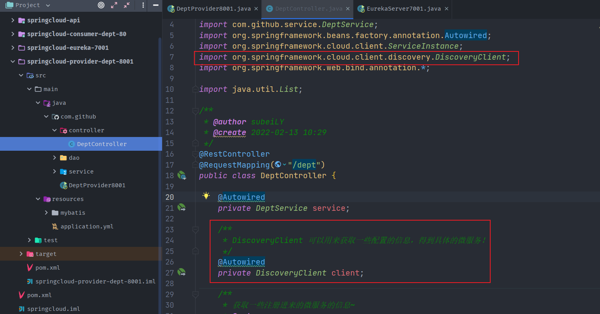

```java
/**
  * DiscoveryClient 可以用来获取一些配置的信息，得到具体的微服务！
  */
@Autowired
private DiscoveryClient client;

/**
  * 获取一些注册进来的微服务的信息~
  * @return
  */
@GetMapping("/discovery")
public Object discovery() {
    // 获取微服务列表的清单
    List<String> services = client.getServices();
    System.out.println("discovery=>services:" + services);
    // 得到一个具体的微服务信息,通过具体的微服务id，applicaioinName；
    List<ServiceInstance> instances = client.getInstances("SPRINGCLOUD-PROVIDER-DEPT");
    for (ServiceInstance instance : instances) {
        System.out.println(
            instance.getHost() + "\t" + // 主机名称
            instance.getPort() + "\t" + // 端口号
            instance.getUri() + "\t" + // uri
            instance.getServiceId() // 服务id
        );
    }
    return this.client;
}
```

- 主启动类增加一个注解：

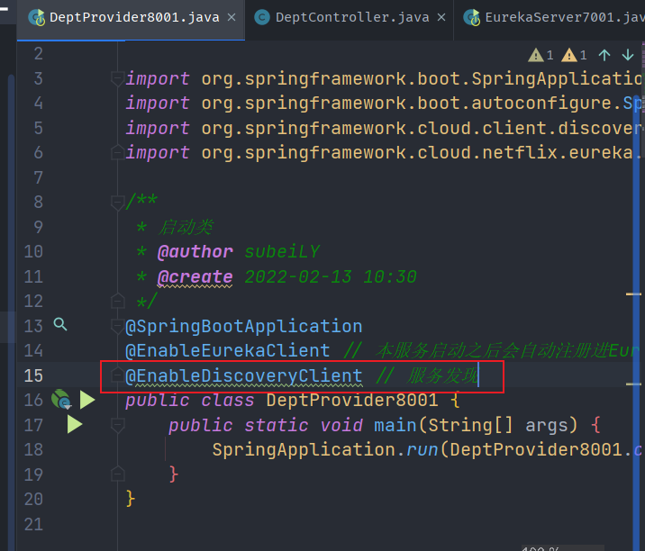

- 启动Eureka服务，启动8001提供者，访问测试 http://localhost:8001/dept/discovery 

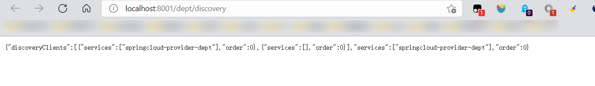

- 后台输出：

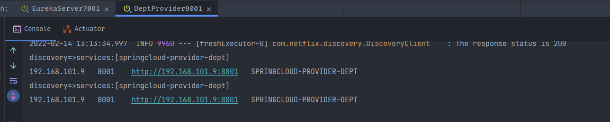

> consumer访问服务：

- 进入springcloud-consumer-dept-80，修改DeptConsumerController增加一个方法

```java
@GetMapping("/consumer/dept/discovery")
public Object discovery(){
    return restTemplate.getForObject(REST_URL_PREFIX+"/dept/discovery",Object.class);
}
```

- 启动 80 项目进行测试！`先启动8001服务，再启动80`

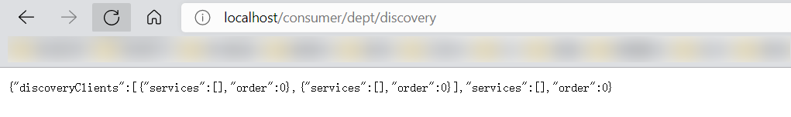

> Eureka：集群环境配置

- 集群配置分析：

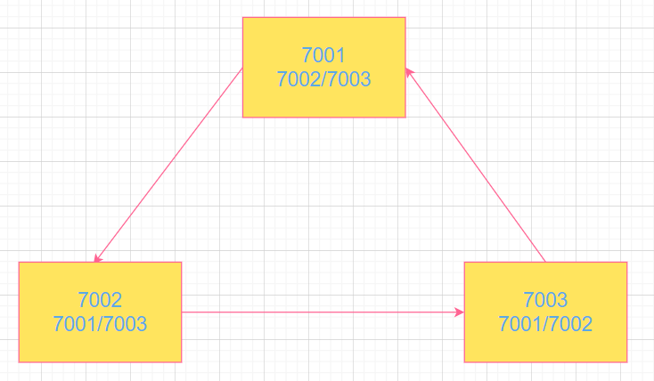

- 新建工程springcloud-eureka-7002、springcloud-eureka-7003；
- 为pom.xml添加依赖 (与springcloud-eureka-7001相同)

```xml
<dependencies>
    <!-- eureka-server服务端 -->
    <dependency>
        <groupId>org.springframework.cloud</groupId>
        <artifactId>spring-cloud-starter-eureka-server</artifactId>
        <version>1.4.6.RELEASE</version>
    </dependency>
    <!--热部署-->
    <dependency>
        <groupId>org.springframework.boot</groupId>
        <artifactId>spring-boot-devtools</artifactId>
    </dependency>
</dependencies>
```

- application.yml配置(与springcloud-eureka-7001相同)

```yaml
server:
  port: 7003

# Eureka配置
eureka:
  instance:
    hostname: localhost #eureka服务端的实例名称
  client:
    register-with-eureka: false #是否将自己注册到Eureka服务器中，本身是服务器，无需注册
    fetch-registry: false #false表示自己端就是注册中心，职责是维护服务实例，并不需要检索服务
    service-url:
      defaultzone: http://${eureka.instance.hostname}:${server.port}/eureka/
      # 设置与Eureka Server交互的地址查询服务和注册服务都需要依赖这个defaultzone地址
```

- 主启动类(与springcloud-eureka-7001相同)

```java
@SpringBootApplication
@EnableEurekaServer // EurekaServer服务端启动类，接受其他微服务注册进来
public class EurekaServer7003 {
    public static void main(String[] args){
        SpringApplication.run(EurekaServer7003.class,args);
    }
}
```

- 集群成员相互关联，修改映射配置 , windows域名映射。
- 配置一些自定义本机名字，找到本机hosts文件并打开：

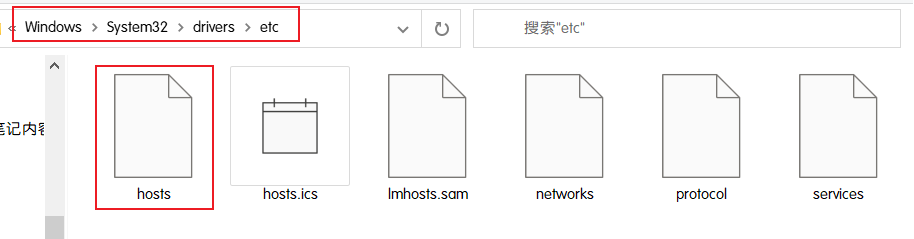

- 在hosts文件最后加上，要访问的本机名称，默认是localhost

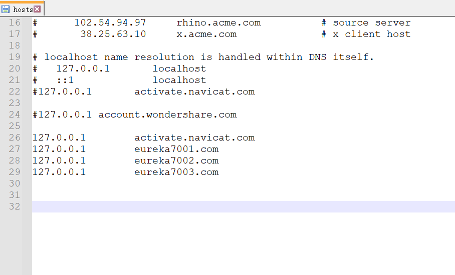

- 修改application.yml的配置，如图为springcloud-eureka-7001配置，springcloud-eureka-7002/springcloud-eureka-7003同样分别修改为其对应的名称即可。


- 在集群中使springcloud-eureka-7001关联springcloud-eureka-7002、springcloud-eureka-7003

- 完整的springcloud-eureka-7001下的application.yml如下

```yaml
server:
  port: 7001

# Eureka配置
eureka:
  instance:
    hostname: eureka7001.com #eureka服务端的实例名称
  client:
    register-with-eureka: false #是否将自己注册到Eureka服务器中，本身是服务器，无需注册
    fetch-registry: false #false表示自己端就是注册中心，职责是维护服务实例，并不需要检索服务
    service-url:
      # 单机 defaultZone: http://${eureka.instance.hostname}:${server.port}/eureka/
      # 设置与Eureka Server交互的地址查询服务和注册服务都需要依赖这个defaultZone地址
      defaultZone: http://eureka7002.com:7002/eureka/,http://eureka7003.com:7003/eureka/
```

- 7002

```yaml
server:
  port: 7002

# Eureka配置
eureka:
  instance:
    hostname: eureka7002.com #eureka服务端的实例名称
  client:
    register-with-eureka: false #是否将自己注册到Eureka服务器中，本身是服务器，无需注册
    fetch-registry: false #false表示自己端就是注册中心，职责是维护服务实例，并不需要检索服务
    service-url:
      # 单机 defaultZone: http://${eureka.instance.hostname}:${server.port}/eureka/
      # 设置与Eureka Server交互的地址查询服务和注册服务都需要依赖这个defaultZone地址
      defaultZone: http://eureka7001.com:7001/eureka/,http://eureka7003.com:7003/eureka/
```

- 7003

```yaml
server:
  port: 7003

# Eureka配置
eureka:
  instance:
    hostname: eureka7003.com #eureka服务端的实例名称
  client:
    register-with-eureka: false #是否将自己注册到Eureka服务器中，本身是服务器，无需注册
    fetch-registry: false #false表示自己端就是注册中心，职责是维护服务实例，并不需要检索服务
    service-url:
      # 单机 defaultZone: http://${eureka.instance.hostname}:${server.port}/eureka/
      # 设置与Eureka Server交互的地址查询服务和注册服务都需要依赖这个defaultZone地址
      defaultZone: http://eureka7001.com:7001/eureka/,http://eureka7002.com:7002/eureka/
```

- 将8001微服务发布到1台eureka集群配置中，发现在集群中的其余注册中心也可以看到，但是平时我们保险起见，都发布！`即通过springcloud-provider-dept-8001下的yml配置文件，修改Eureka配置：配置服务注册中心地址`：

```yaml
# Eureka配置：配置服务注册中心地址
eureka:
  client:
    service-url:
      # 注册中心地址7001-7003
      defaultZone: http://eureka7001.com:7001/eureka/,http://eureka7002.com:7002/eureka/,http://eureka7003.com:7003/eureka/
  instance:
    instance-id: springcloud-provider-dept-8001 # 与client平级
 #   prefer-ip-address: true # true表示访问路径可以显示IP地址
```

- 启动集群测试！`7001、7002、7003、8001都要启动哦`！

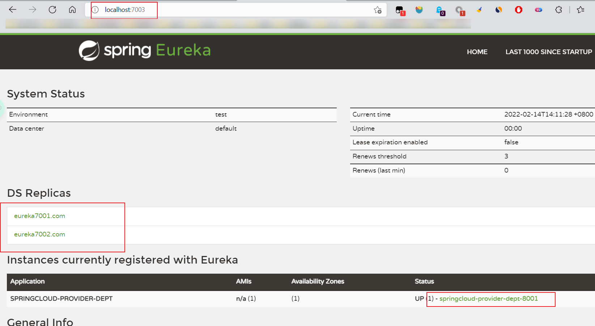

> 对比Zookeeper

1. 回顾CAP原则

  - RDBMS (MySQL、Oracle、sqlServer) ===> ACID

  - NoSQL (Redis、MongoDB) ===> CAP

2. ACID是什么？
  - A (Atomicity) 原子性
  - C (Consistency) 一致性
  - I (Isolation) 隔离性
  - D (Durability) 持久性
3. CAP是什么?
  - C (Consistency) 强一致性
  - A (Availability) 可用性
  - P (Partition tolerance) 分区容错性

4. CAP的三进二：CA、AP、CP
5. CAP理论的核心
  - 一个分布式系统不可能同时很好的满足一致性，可用性和分区容错性这三个需求；
  - 根据CAP原理，将NoSQL数据库分成了满足CA原则，满足CP原则和满足AP原则三大类；
    - CA：单点集群，满足一致性，可用性的系统，通常可扩展性较差；
    - CP：满足一致性，分区容错的系统，通常性能不是特别高；
    - AP：满足可用性，分区容错的系统，通常可能对一致性要求低一些；

> 作为服务注册中心，Eureka比Zookeeper好在哪里？

- 著名的CAP理论指出，一个分布式系统不可能同时满足C (一致性) 、A (可用性) 、P (容错性)，由于分区容错性P再分布式系统中是必须要保证的，因此我们只能再A和C之间进行权衡。
  - Zookeeper 保证的是 CP —> 满足一致性，分区容错的系统，通常性能不是特别高；
  - Eureka 保证的是 AP —> 满足可用性，分区容错的系统，通常可能对一致性要求低一些；
- `Zookeeper保证的是CP`
  - 当向注册中心查询服务列表时，我们可以容忍注册中心返回的是几分钟以前的注册信息，但不能接收服务直接down掉不可用。也就是说，服务注册功能对可用性的要求要高于一致性。但zookeeper会出现这样一种情况，当master节点因为网络故障与其他节点失去联系时，剩余节点会重新进行leader选举。问题在于，选举leader的时间太长，30-120s，且选举期间整个zookeeper集群是不可用的，这就导致在选举期间注册服务瘫痪。在云部署的环境下，因为网络问题使得zookeeper集群失去master节点是较大概率发生的事件，虽然服务最终能够恢复，但是，漫长的选举时间导致注册长期不可用，是不可容忍的。

- `Eureka保证的是AP`
  - Eureka看明白了这一点，因此在设计时就优先保证可用性。Eureka各个节点都是平等的，几个节点挂掉不会影响正常节点的工作，剩余的节点依然可以提供注册和查询服务。而Eureka的客户端在向某个Eureka注册时，如果发现连接失败，则会自动切换至其他节点，只要有一台Eureka还在，就能保住注册服务的可用性，只不过查到的信息可能不是最新的，除此之外，Eureka还有之中自我保护机制，如果在15分钟内超过85%的节点都没有正常的心跳，那么Eureka就认为客户端与注册中心出现了网络故障，此时会出现以下几种情况：
    1. Eureka不在从注册列表中移除因为长时间没收到心跳而应该过期的服务；
    2. Eureka仍然能够接受新服务的注册和查询请求，但是不会被同步到其他节点上 (即保证当前节点依然可用)；
    3. 当网络稳定时，当前实例新的注册信息会被同步到其他节点中。
- 因此，==Eureka可以很好的应对因网络故障导致部分节点失去联系的情况，而不会像zookeeper那样使整个注册服务瘫痪==。

## 6.Ribbon：负载均衡(基于客户端)

> Ribbon是什么？

- Spring Cloud Ribbon是基于Netflix Ribbon实现的一套客户端负载均衡的工具。 

- 简单的说，Ribbon是Netflix发布的开源项目，主要功能是提供客户端的软件负载均衡算法，将NetFlix的中间层服务连接在一起。Ribbon的客户端组件提供一系列完整的配置项如：连接超时、重试等等。简单的说，就是在配置文件中列出LoadBalancer（简称LB：负载均衡）后面所有的机器，Ribbon会自动的帮助你基于某种规则（如简单轮询，随机连接等等）去连接这些机器。我们也很容易使用Ribbon实现自定义的负载均衡算法！

> Ribbon能干嘛？

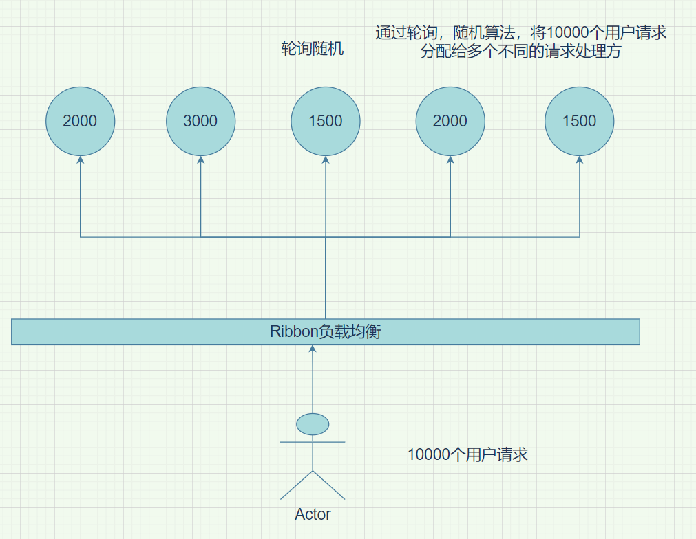

- LB，即负载均衡 (LoadBalancer) ，在微服务或分布式集群中经常用的一种应用。
- 负载均衡简单的说就是将用户的请求平摊的分配到多个服务上，从而达到系统的HA (高用)。
- 常见的负载均衡软件有 Nginx、Lvs等等。
- Dubbo、SpringCloud 中均给我们提供了负载均衡，SpringCloud 的负载均衡算法可以自定义。
- 负载均衡简单分类：
  - 集中式LB
    - 即在服务的提供方和消费方之间使用独立的LB设施，如Nginx(反向代理服务器)，由该设施负责把访问请求通过某种策略转发至服务的提供方！
  - 进程式 LB
    - 将LB逻辑集成到消费方，消费方从服务注册中心获知有哪些地址可用，然后自己再从这些地址中选出一个合适的服务器。
    - `Ribbon 就属于进程内LB`，它只是一个类库，集成于消费方进程，消费方通过它来获取到服务提供方的地址！
- Ribbon的github地址：https://github.com/NetFlix/ribbon

> 集成Ribbon

- springcloud-consumer-dept-80向pom.xml中添加Ribbon和Eureka依赖

  ```xml
  <!-- https://mvnrepository.com/artifact/org.springframework.cloud/spring-cloud-starter-ribbon -->
  <dependency>
      <groupId>org.springframework.cloud</groupId>
      <artifactId>spring-cloud-starter-ribbon</artifactId>
      <version>1.4.7.RELEASE</version>
  </dependency>
  <!-- https://mvnrepository.com/artifact/org.springframework.cloud/spring-cloud-starter-eureka -->
  <dependency>
      <groupId>org.springframework.cloud</groupId>
      <artifactId>spring-cloud-starter-eureka</artifactId>
      <version>1.4.7.RELEASE</version>
  </dependency>
  ```

- 在application.yml文件中配置Eureka

  ```yaml
  server:
    port: 80
  
  # Eureka配置
  eureka:
    client:
      register-with-eureka: false # false表示不向注册中心注册自己
      service-url:
        defaultZone: http://eureka7001.com:7001/eureka/,http://eureka7002.com:7002/eureka/,http://eureka7003.com:7003/eureka/
  ```

- 主启动类加上@EnableEurekaClient注解，开启Eureka

  ```java
  // Ribbon 和 Eureka 整合以后，客户端可以直接调用，不用关心IP地址和端口号
  @SpringBootApplication
  @EnableEurekaClient // 开启Eureka 客户端
  public class DeptConsumer80 {
      public static void main(String[] args) {
          SpringApplication.run(DeptConsumer80.class,args);
      }
  }
  ```

- 自定义Spring配置类：ConfigBean.java 配置负载均衡实现RestTemplate

  ```java
  @Bean
  @LoadBalanced // Spring Cloud Ribbon是基于Netflix Ribbon实现的一套客户端负载均衡的工具
  public RestTemplate getRestTemplate(){
      return new RestTemplate();
  }
  ```

- 修改conroller：DeptConsumerController.java

  ```java
  /**
       * 服务提供方地址前缀
       * <p>
       * Ribbon:我们这里的地址，应该是一个变量，通过服务名来访问
       */
  //    private static final String REST_URL_PREFIX = "http://localhost:8001";
  private static final String REST_URL_PREFIX = "http://SPRINGCLOUD-PROVIDER-DEPT";
  ```

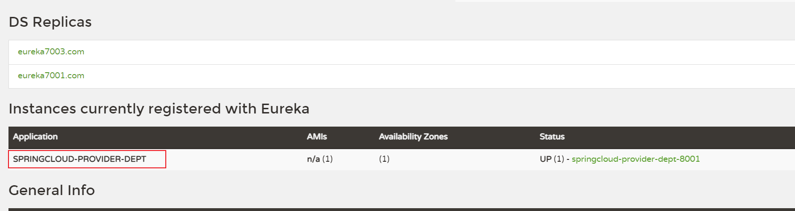

- 先启动3个Eureka集群后，再启动springcloud-provider-dept-8001并注册进eureka；
- 启动 DeptConsumerRibbon80；

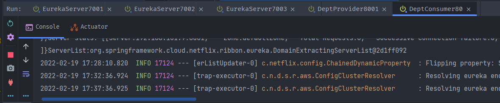

- 测试 
  - http://localhost/consumer/dept/get/1 
  - http://localhost/consumer/dept/list


- ==Ribbon和Eureka整合后Consumer可以直接调用服务而不用再关心地址和端口号==！

----

> Ribbon负载均衡

- 架构说明：

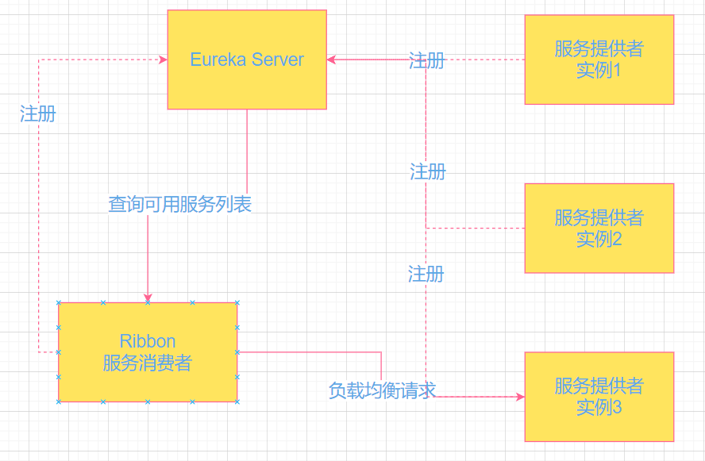

- Ribbon在工作时分成两步：
  - 第一步先选择EurekaServer，它优先选择在同一个区域内负载均衡较少的Server。 
  - 第二步在根据用户指定的策略，在从server去到的服务注册列表中选择一个地址。 
  - 其中Ribbon提供了多种策略，比如轮询（默认），随机和根据响应时间加权重,,,等等

- 测试： 
  - 参考springcloud-provider-dept-8001，新建两份，分别为8002,8003！ 
  - 参照springcloud-provider-dept-8001，依次为另外两个Moudle添加pom.xml依赖 、resourece下的mybatis和application.yml配置，Java代码；
  - 全部复制完毕，修改启动类名称，修改端口号名称！

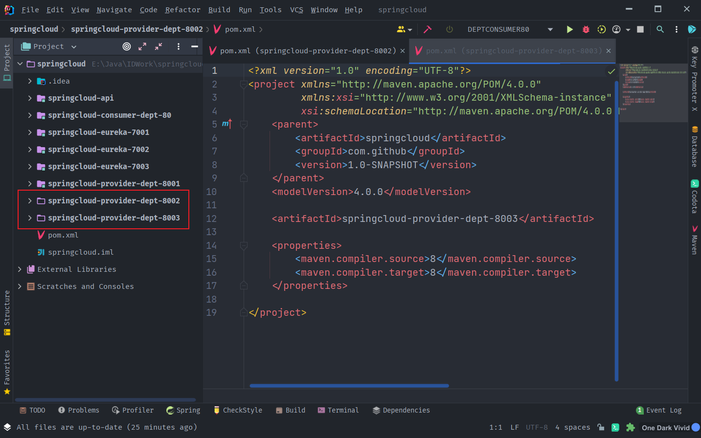

- 新建8002/8003数据库，各自微服务分别连接各自的数据库，复制springcloud！ 
  - 新建springcloud02 
  - 新建springcloud03

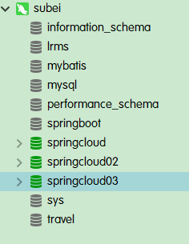

- 修改8002/8003各自的YML文件 
  - 端口 
  - 数据库连接 
  - 实例名也需要修改

```yaml
  instance:
    instance-id: springcloud-provider-dept-8003 # 与client平级
```

- 对外暴露的统一的服务实例名【三个服务名字必须一致！】

```yaml
application:
  name: springcloud-provider-dept
```

- 启动3个Eureka集群配置区 

- 启动3个Dept微服务并都测试通过 
  - http://localhost:8001/dept/list 
  - http://localhost:8002/dept/list 
  - http://localhost:8003/dept/list 
  
  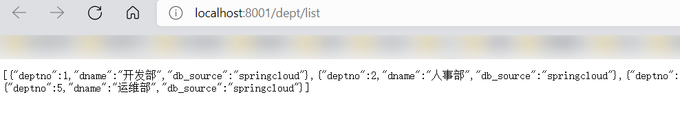
  
- 启动springcloud-consumer-dept-80 

- 客户端通过Ribbon完成负载均衡并访问上一步的Dept微服务 
  - http://localhost/consumer/dept/list 
  - 多刷新几次注意观察结果！
  
  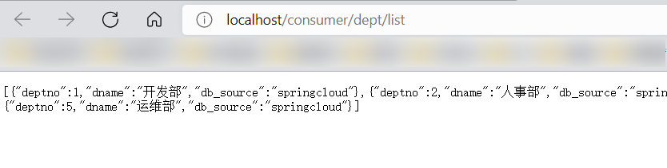
  
- 总结：
  - Ribbon其实就是一个软负载均衡的客户端组件，他可以和其他所需请求的客户端结合使用，和Eureka结合只是其中的一个实例。

> Ribbon核心组件IRule

- IRule：根据特定算法从服务列表中选取一个要访问的服务！
- RoundRobinRule【轮询】 
- RandomRule【随机】 
- AvailabilityFilterRule【会先过滤掉由于多次访问故障而处于断路器跳闸的服务，还有并发的连接 数量超过阈值的服务，然后对剩余的服务列表按照轮询策略进行访问】 
- WeightedResponseTimeRule【根据平均响应时间计算所有服务的权重，响应时间越快服务权重越大，被选中的概率越高，刚启动时如果统计信息不足，则使用RoundRobinRule策略，等待统计信息足够，会切换到WeightedResponseTimeRule】 
- RetryRule【先按照RoundRobinRule的策略获取服务，如果获取服务失败，则在指定时间内会进行重试，获取可用的服务】 
- BestAvailableRule【会先过滤掉由于多次访问故障而处于断路器跳闸状态的服务，然后选择一个并发量最小的服务】 
- ZoneAvoidanceRule【默认规则，复合判断server所在区域的性能和server的可用性选择服务器】
- 查看分析源码： 
  1. IRule 
  2. ILoadBalancer
  3. AbstractLoadBalancer
  4. AbstractLoadBalancerRule：这个抽象父类十分重要！核心
  5. RoundRobinRule 


分析一下方法：

```java
public Server choose(ILoadBalancer lb, Object key) {
    if (lb == null) {
        log.warn("no load balancer");
        return null;
    } else {
        Server server = null;
        int count = 0;

        while(true) {
            if (server == null && count++ < 10) {
                List<Server> reachableServers = lb.getReachableServers();
                List<Server> allServers = lb.getAllServers();
                int upCount = reachableServers.size();
                int serverCount = allServers.size();
                if (upCount != 0 && serverCount != 0) {
                    int nextServerIndex = this.incrementAndGetModulo(serverCount);
                    server = (Server)allServers.get(nextServerIndex);
                    if (server == null) {
                        Thread.yield();
                    } else {
                        if (server.isAlive() && server.isReadyToServe()) {
                            return server;
                        }

                        server = null;
                    }
                    continue;
                }

                log.warn("No up servers available from load balancer: " + lb);
                return null;
            }

            if (count >= 10) {
                log.warn("No available alive servers after 10 tries from load balancer: " + lb);
            }

            return server;
        }
    }
}
```

- 切换为随机策略实现试试，在ConfigBean中添加方法。

```java
@Bean
public IRule myRule(){
    // 使用我们重新选择的随机算法，替代默认的轮询！
    return new RandomRule();
}
```

- 重启80服务进行访问测试，查看运行结果！【注意，可能服务长时间不使用会崩】 
- 访问测试：http://localhost/consumer/dept/list

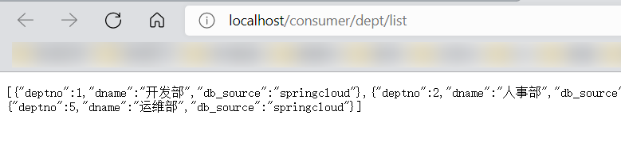

- 测试：new RetryRule() 算法 
- RetryRule【先按照RoundRobinRule的策略获取服务，如果获取服务失败，则在指定时间内会进行重试，获取可用的服务】
  1. 在运行期间关闭掉一个服务提供者8002 
  2. 消费者再次测试！发现404后继续访问测试！看结果！！！ 
- 其余的不再挨个测试了，大家有时间可以去测试玩玩； 
- 现在有一个新的需求，我们不需要这些默认的算法，我们需要自己重新定义，这该怎么办呢？

> 自定义Ribbon：

- 修改springcloud-consumer-dept-ribbon-80 
- 主启动类添加@RibbonClient注解；
- 在启动该微服务的时候就能去加载我们自定义的Ribbon配置类，从而使配置类生效，例如:

```java
@RibbonClient(name="SPRINGCLOUD-PROVIDERDEPT",configuration=MySelfRule.class)
```

**注意配置细节**:

- [官方文档](https://docs.spring.io/spring-cloud-netflix/docs/2.2.11.BUILD-SNAPSHOT/reference/html/#customizing-the-ribbon-client)明确给出了警告： 
- 这个自定义配置类不能放在@ComponentScan所扫描的当前包以及子包下，否则我们自定义的这个配置类就会被所有的Ribbon客户端所共享，也就是说达不到特殊化定制的目的了！

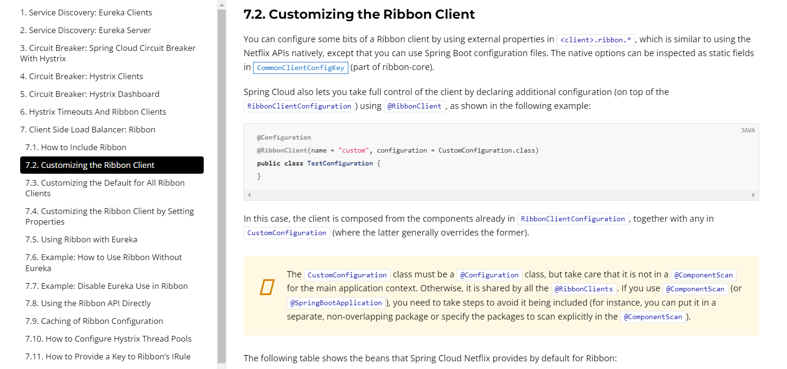

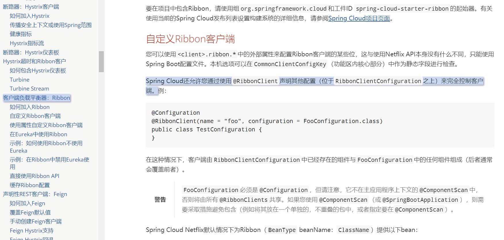

**步骤**：

1. 由于有以上配置细节原因，我们建立一个包：com.github.myrul，在这里新建一个自定义规则的Rubbion类。

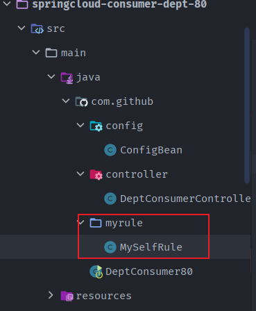

```java
@Configuration
public class MySelfRule {

    @Bean
    public IRule myRule(){
        // Ribbon默认是轮询，可以自定义为随机算法
        return new RandomRule();
    }
}
```

2. 在主启动类上配置自定义的Ribbon。

```java
@SpringBootApplication
@EnableEurekaClient // 开启Eureka 客户端
@RibbonClient(name="SPRINGCLOUD-PROVIDERDEPT",configuration= MySelfRule.class)
public class DeptConsumer80 {
    public static void main(String[] args) {
        SpringApplication.run(DeptConsumer80.class,args);
    }
}
```

3. 启动所有项目，访问测试，查看编写的随机算法，现在是否生效！


> 自定义规则深度解析 

1. 问题：依旧轮询策略，但是加上新需求，每个服务器要求被调用5次，就是以前每一个机器一次，现在每个机器5次； 
2. 解析源码：RandomRule.java ， IDEA直接点击进去，复制出来，变成我们自己的类 MyRondomRule

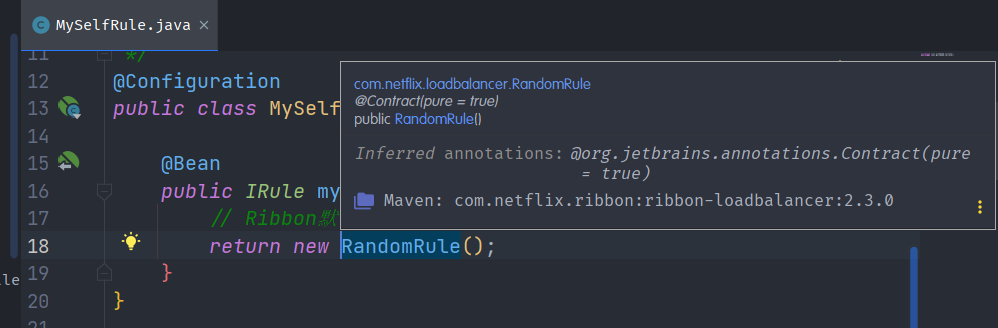

- 分析阅读源码：

```java
public class RandomRule extends AbstractLoadBalancerRule {
    public RandomRule() {
    }

    @SuppressWarnings({"RCN_REDUNDANT_NULLCHECK_OF_NULL_VALUE"})
    // ILoadBalancer选择的随机算法
    public Server choose(ILoadBalancer lb, Object key) {
        if (lb == null) {
            return null;
        } else {
            Server server = null;

            while(server == null) {
                // 查看线程是否中断了
                if (Thread.interrupted()) {
                    return null;
                }

                // Reachable： 可及；可到达；够得到
                List<Server> upList = lb.getReachableServers(); // 活着的服务
                List<Server> allList = lb.getAllServers(); // 获取所有的服务
                int serverCount = allList.size();
                if (serverCount == 0) {
                    return null;
                }

                // 生成区间随机数！
                int index = this.chooseRandomInt(serverCount);
                // 从活着的服务中，随机取出一个
                server = (Server)upList.get(index);
                if (server == null) {
                    Thread.yield();
                } else {
                    if (server.isAlive()) {
                        return server;
                    }

                    server = null;
                    Thread.yield();
                }
            }

            return server;
        }
    }

    // 随机
    protected int chooseRandomInt(int serverCount) {
        return ThreadLocalRandom.current().nextInt(serverCount);
    }

    public Server choose(Object key) {
        return this.choose(this.getLoadBalancer(), key);
    }

    public void initWithNiwsConfig(IClientConfig clientConfig) {
    }
}
```

- 参考源码修改为我们需求要求的MyRondomRule.java

```java
package com.github.myrule;

import com.netflix.client.config.IClientConfig;
import com.netflix.loadbalancer.AbstractLoadBalancerRule;
import com.netflix.loadbalancer.ILoadBalancer;
import com.netflix.loadbalancer.Server;

import java.util.List;
import java.util.concurrent.ThreadLocalRandom;

public class MyRondomRule extends AbstractLoadBalancerRule {
    public MyRondomRule() {
    }

    // total = 0 当total数等于5以后，我们指针才能往下走
    // index = 0 当前对外提供服务的服务器地址
    // 如果total等于5，则index+1，将total重置为0即可！
    // 问题：我们只有3台机器，所有total>3 则将total置为0；
    private int total = 0; //总共被调用的次数
    private int currentIndex = 0; //当前提供服务的机器序号！
    // ILoadBalancer选择的随机算法
    public Server choose(ILoadBalancer lb, Object key) {
        if (lb == null) {
            return null;
        } else {
            Server server = null;

            while(server == null) {
                // 查看线程是否中断了
                if (Thread.interrupted()) {
                    return null;
                }

                // Reachable： 可及；可到达；够得到
                List<Server> upList = lb.getReachableServers(); // 活着的服务
                List<Server> allList = lb.getAllServers(); // 获取所有的服务
                int serverCount = allList.size();
                if (serverCount == 0) {
                    return null;
                }

                // 生成区间随机数！
//                int index = this.chooseRandomInt(serverCount);
                // 从活着的服务中，随机取出一个
//                server = (Server)upList.get(index);

                // =====================================
                if (total<5){
                    server = upList.get(currentIndex);
                    total++;
                }else {
                    total = 0;
                    currentIndex++;
                    if (currentIndex>=upList.size()){
                        currentIndex = 0;
                    }
                    server = upList.get(currentIndex);
                }
                // =====================================

                if (server == null) {
                    Thread.yield();
                } else {
                    if (server.isAlive()) {
                        return server;
                    }

                    server = null;
                    Thread.yield();
                }
            }

            return server;
        }
    }

    // 随机
    protected int chooseRandomInt(int serverCount) {
        return ThreadLocalRandom.current().nextInt(serverCount);
    }

    @Override
    public Server choose(Object key) {
        return this.choose(this.getLoadBalancer(), key);
    }

    @Override
    public void initWithNiwsConfig(IClientConfig clientConfig) {
    }
}
```

- 调用，在我们自定义的IRule方法中返回刚才我们写好的随机算法类。

```java
@Configuration
public class MySelfRule {

    @Bean
    public IRule myRule(){
        // Ribbon默认是轮询，可以自定义为随机算法
        return new MyRondomRule();
    }
}
```

- 测试实现：


## 7.Feign：负载均衡(基于服务端)

> 简介

- Feign是声明式Web Service客户端，它让微服务之间的调用变得更简单，类似controller调用service。SpringCloud集成了Ribbon和Eureka，可以使用Feigin提供负载均衡的http客户端。

- **只需要创建一个接口，然后添加注解即可**！

Feign，主要是社区版，大家都习惯面向接口编程。这个是很多开发人员的规范。调用微服务访问两种方法：

1. 微服务名字 【ribbon】
2. 接口和注解 【feign】

**Feign能干什么？**

- Feign旨在使编写Java Http客户端变得更容易
- 前面在使用**Ribbon** + **RestTemplate**时，利用**RestTemplate**对Http请求的封装处理，形成了一套模板化的调用方法。但是在实际开发中，由于对服务依赖的调用可能不止一处，往往一个接口会被多处调用，所以通常都会针对每个微服务自行封装一个客户端类来包装这些依赖服务的调用。所以，**Feign**在此基础上做了进一步的封装，由他来帮助我们定义和实现依赖服务接口的定义，在Feign的实现下，我们只需要创建一个接口并使用注解的方式来配置它 (类似以前Dao接口上标注Mapper注解，现在是一个微服务接口上面标注一个Feign注解)，即可完成对服务提供方的接口绑定，简化了使用Spring Cloud Ribbon 时，自动封装服务调用客户端的开发量。

**Feign默认集成了Ribbon**

- 利用**Ribbon**维护了MicroServiceCloud-Dept的服务列表信息，并且通过轮询实现了客户端的负载均衡，而与**Ribbon**不同的是，通过**Feign**只需要定义服务绑定接口且以声明式的方法，优雅而简单的实现了服务调用。

> Feign的使用步骤：

1. 参考springcloud-consumer-dept-ribbon-80 
2. 新建springcloud-consumer-dept-feign-80 
   1. 修改主启动类名称 
   2. 将springcloud-consumer-dept-80的内容都拷贝到feign项目中 
   3. 删除myrule文件夹 
   4. 修改主启动类的名称为 DeptConsumerFeign80


3. springcloud-consumer-dept-feign-80修改pom.xml ， 添加对Feign的支持。

```xml
```

4. 修改springcloud-api工程 
   1. pom.xml添加feign的支持 
   2. 新建一个Service包


- 编写接口 DeptClientService，并增加新的注解@FeignClient。

```java
```

- 记得清理一下mvn。

5. springcloud-consumer-dept-feign-80工程修改Controller，添加上一步新建的DeptClientService。

```java
```

6. microservicecloud-consumer-dept-feign工程修改主启动类，开启Feign使用！

```java
```

7. 测试！

- 启动eureka集群；
- 启动8001，8002，8003 
- 启动feign客户端 
- 测试： http://localhost/consumer/dept/list 

==结论：Feign自带负载均衡配置项==。

> 小结

- Feign通过接口的方法调用Rest服务 ( 之前是Ribbon+RestTemplate )；
- 该请求发送给Eureka服务器 （http://MICROSERVICECLOUD-PROVIDER-DEPT/dept/list）；
- 通过Feign直接找到服务接口，由于在进行服务调用的时候融合了Ribbon技术，所以也支持负载均衡作用！ 
- feign其实不是做负载均衡的,负载均衡是ribbon的功能,feign只是集成了ribbon而已,但是负载均衡的功能 还是feign内置的ribbon再做,而不是feign。feign的作用的替代RestTemplate,性能比较低，但是可以使代码可读性很强。

## 8. Hystrix：服务熔断

> 概述


## 9. Zull路由网关


## 10. Spring Cloud Config 分布式配置


