# 大前端技能快速入门

## 1.前端开发工具

### 1.前端开发

- 前端工程师“Front-End-Developer”源自于美国。大约从2005年开始正式的前端工程师角色被行业所认可，到了2010年，互联网开始全面进入移动时代，前端开发的工作越来越重要。
-  最初所有的开发工作都是由后端工程师完成的，随着业务越来越繁杂，工作量变大，于是我们将项目中的可视化部分和一部分交互功能的开发工作剥离出来，形成了前端开发。
- 由于互联网行业的急速发展，导致了在不同的国家，有着截然不同的分工体制。 
- 在日本和一些人口比较稀疏的国家，例如加拿大、澳洲等，流行“Full-Stack Engineer”，也就是我们通常 所说的全栈工程师。通俗点说就是一个人除了完成前端开发和后端开发工作以外，有的公司从产品设计 到项目开发再到后期运维可能都是同一个人，甚至可能还要负责UI、配动画，也可以是扫地、擦窗、写文档、维修桌椅等等。 
- 而在美国等互联网环境比较发达的国家项目开发的分工协作更为明确，整个项目开发分为前端、中间层 和后端三个开发阶段，这三个阶段分别由三个或者更多的人来协同完成。 
- 国内的大部分互联网公司只有前端工程师和后端工程师，中间层的工作有的由前端来完成，有的由后端来完成。 
- PRD（产品原型-产品经理） - PSD（视觉设计-UI工程师） - HTML/CSS/JavaScript（PC/移动端网页，实 现网页端的视觉展示和交互-前端工程师）

### 2.下载安装VScode 

- 下载地址：https://code.visualstudio.com/ 

- 安装：无脑下一步

### 3.优化配置 

#### 1.中文界面配置 

1. 首先安装中文插件：Chinese (Simplified) Language Pack for Visual Studio Code

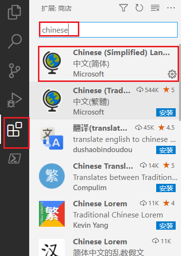

2. 右下角弹出是否重启vs，点击“yes”。 
3. 有些机器重启后如果界面没有变化，则 点击 左边栏Manage -> Command Paletet... 或者直接【Ctrl+Shift+p】。
4. 在搜索框中输入“configure display language”，回车。 
5. 打开locale.json文件，修改文件下的属性 "locale":"zh-cn"。

```js
{
// 定义 VS Code 的显示语言。
// 请参阅 https://go.microsoft.com/fwlink/?LinkId=761051，了解支持的语言列表
"locale":"zh-cn" // 更改将在重新启动 VS Code 之后生效。
}
```

6. 重启VS

#### 2.插件安装 

- 为方便后续开发，建议安装如下插件：

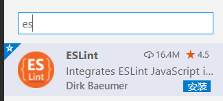

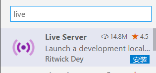

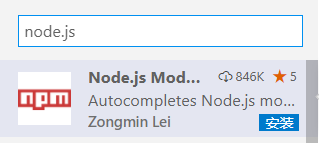


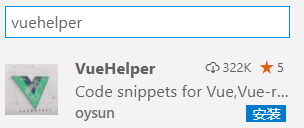

#### 3.设置字体大小 

- 左边栏Manage -> settings -> 搜索 “font” -> Font size

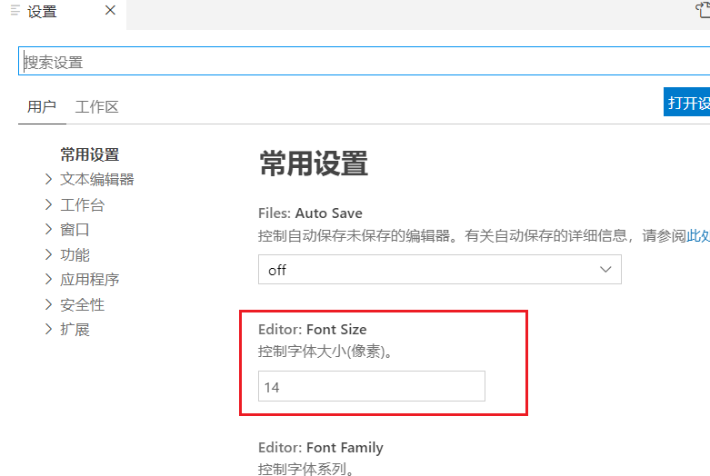

#### 4.开启完整的Emmet语法支持 

- 设置中搜索 Emmet：启用如下选项，必要时重启vs。

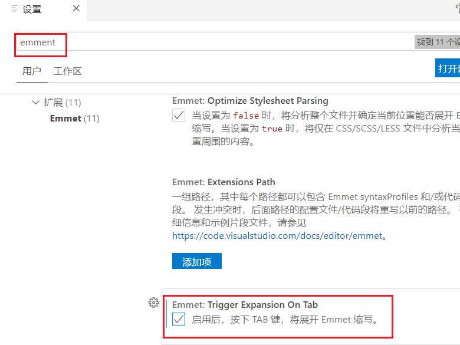

#### 5.视图 

- 查看--> 外观--> 向左移动侧边栏

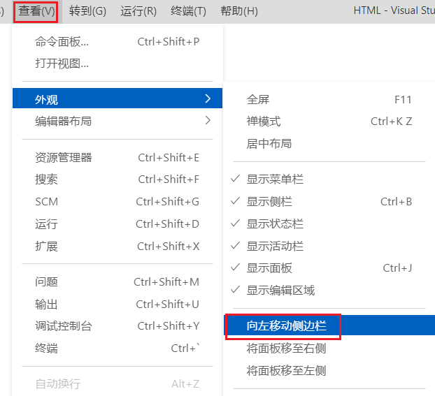

## 2.Node.js 入门

> 可以先安装python环境，后面有的依赖会需要❗❗❗

### 1.什么是Node.js

- 简单的说 Node.js 就是运行在服务端的 JavaScript。 
- Node.js是一个事件驱动I/O服务端JavaScript环境，基于Google的V8引擎，V8引擎执行Javascript的速度 非常快，性能非常好。

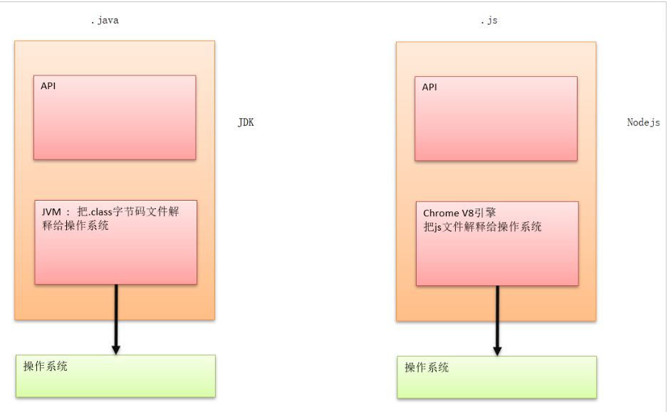

### 2.Node.js有什么用

- 如果你是一个前端程序员，你不懂得像PHP、Python或Ruby等动态编程语言，然后你想创建自己的服务，那么Node.js是一个非常好的选择。 

- Node.js 是运行在服务端的 JavaScript，如果你熟悉Javascript，那么你将会很容易的学会Node.js。 
- 当然，如果你是后端程序员，想部署一些高性能的服务，那么学习Node.js也是一个非常好的选择。

### 3.安装

- 下载：https://nodejs.org/en/ 

- 中文网：http://nodejs.cn/ 

- 版本

  - LTS：长期支持版本 
  - Current：最新版

  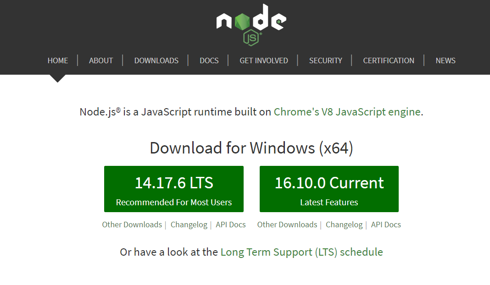

- 安装：无脑下一步。

- 查看版本

```shell
# 查看版本
node -v

# 由于新版的nodejs已经集成了npm，所以之前npm也一并安装好了。同样可以使用cmd命令行输
入“npm -v”来测试是否安装成功。
npm -v

# 安装相关环境 express快速、开放、极简的 Web 开发框架
npm install express -g

# 安装淘宝镜像，防止下载较慢
npm install -g cnpm --registry=https://registry.npm.taobao.org
```

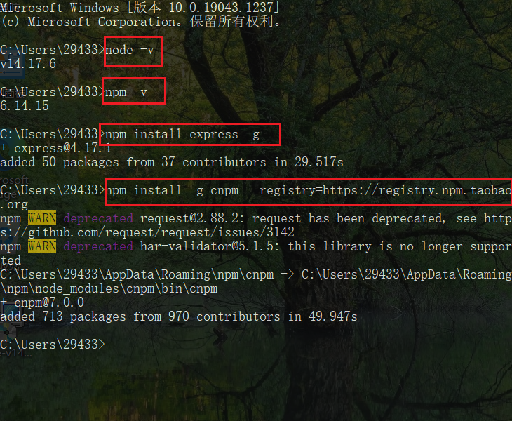

### 4.快速入门

1、创建文件夹 `node` 

2、创建 `Demo01.js`

```js
console.log('Hello Node.js')
```

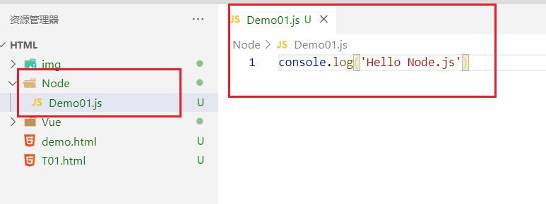

3、打开命令行终端：Ctrl + Shift + y 

4、进入到程序所在的目录，终端

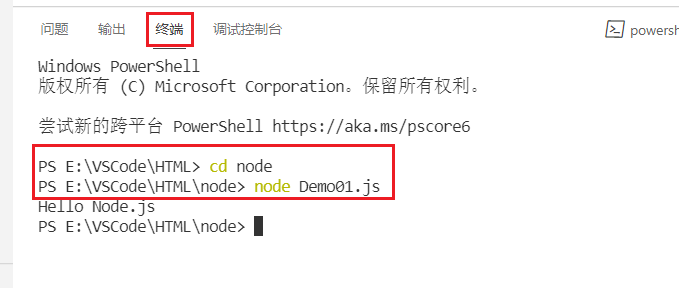

> 浏览器的内核包括两部分核心： 
>
> - DOM渲染引擎。
> - java script 解析器（js引擎）。 
> - js运行在浏览器内核中的js引擎内部。 

- Node.js是脱离浏览器环境运行的JavaScript程序，基于V8 引擎

> 报错：`Node : 无法将“Node”项识别为 cmdlet、函数、脚本文件或可运行程序的名称。请检名称的拼写，如果包括路径，请确保路径正确，然后再试一次`。

- 解决办法：
  - 重新下载node.js：https://nodejs.org/zh-cn/
  - 或者重新启动VScode就好啦！

### 5.Nodejs实现Httpserver服务

1. 创建 Demo02-server-app.js ；

```js
const http=require('http')
http.createServer(function(request,response){
    // 发送 HTTP 头部
    // HTTP 状态值：200:ok
    // 内容类型:text/plain
    response.writeHead(200,{'Content-Type':'text/plain'})
    // 发送响应数据 'Hello world'
    response.end('Hello Server')
}).listen(8888)
// 终端打印如下信息
console.log('Server running at http://127.0.0.1:8888/')
```

2. 运行服务器程序；

```js
node Demo02-server-app.js
```

3. 服务器启动成功后，在浏览器中输入：http://localhost:8888/ 查看webserver成功运行，并输出 html页面。

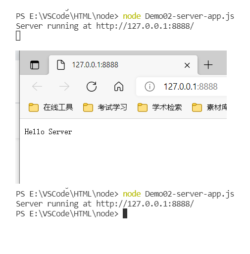

4. 停止服务：<kbd>Ctrl</kbd> +<kbd> C</kbd>

- 如果想开发更复杂的基于Node.js的应用程序后台，需要进一步学习Node.js的Web开发相关框架 express，art-template等。

### 5.Nodejs操作MySql数据库

1. 安装mysql依赖

```shell
# 使用 npm 命令来安装模块
npm install mysql
```

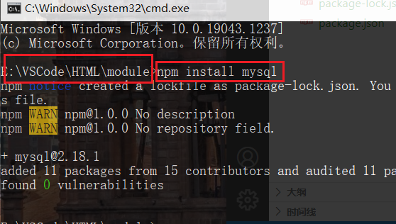

2. 定义db.js进行操作

```js
// 1.导入依赖包
var mysql = require("mysql");

// 1: 创建一个mysql的Connection对象
// 2: 配置数据连接的信息
var connection = mysql.createConnection({
    host:"127.0.0.1",
    port:3306,
    username:"root",
    password:"你的数据库密码",
    database:"你数据库的名字"
});

// 3: 开辟连接
connection.connect();

// 4: 执行curd
connection.query("select * from user",function(error,result,fields){
    // 如果查询出错，直接抛出
    if(error) throw error;
    // 查询成功
    console.log("result = ",result);
});

// 5: 关闭连接
connection.end();

// 6: 运行node db.js 查看效果
```

3. 创建数据库

```mysql
CREATE DATABASE `testdb` 

USE `testdb`;

DROP TABLE IF EXISTS `user`;

CREATE TABLE `user` (
  `id` int(20) NOT NULL AUTO_INCREMENT,
  `name` varchar(30) COLLATE utf8_bin DEFAULT NULL,
  PRIMARY KEY (`id`)
) ENGINE=InnoDB AUTO_INCREMENT=4 DEFAULT CHARSET=utf8 COLLATE=utf8_bin;

insert  into `user`(`id`,`name`) values 
(1,'夸克'),
(2,'质子'),
(3,'中子');
```

4. 测试运行

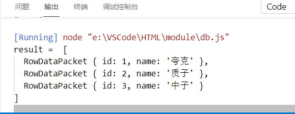

> 报错： `throw err;Error: Cannot find module 'mysql'`
>
> - 解决：切换到项目代码文件夹，`cmd`运行`npm install mysql`，进行本地安装。

## 3.ES6入门

### 1.简介

> ECMAScript 6.0（以下简称 ES6）是 JavaScript 语言的下一代标准，已经在 2015 年 6 月正式发布了。 它的目标，是使得 JavaScript 语言可以用来编写复杂的大型应用程序，成为企业级开发语言。

**ECMAScript 和 JavaScript 的关系**

- 一个常见的问题是，ECMAScript 和 JavaScript 到底是什么关系？ 
- 要讲清楚这个问题，需要回顾历史。1996 年 11 月，JavaScript 的创造者 Netscape 公司，决定将 JavaScript 提交给标准化组织 ECMA，希望这种语言能够成为国际标准。次年，ECMA 发布 262 号标准 文件（ECMA-262）的第一版，规定了浏览器脚本语言的标准，并将这种语言称为 ECMAScript，这个版 本就是 1.0 版。 
- 因此，ECMAScript 和 JavaScript 的关系是，前者是后者的规格，后者是前者的一种实现（另外的 ECMAScript 方言还有 Jscript 和 ActionScript）

**ES6 与 ECMAScript 2015 的关系**

- ECMAScript 2015（简称 ES2015）这个词，也是经常可以看到的。它与 ES6 是什么关系呢？
- 2011 年，ECMAScript 5.1 版发布后，就开始制定 6.0 版了。因此，ES6 这个词的原意，就是指 JavaScript 语言的下一个版本。 
- ES6 的第一个版本，在 2015 年 6 月发布，正式名称是《ECMAScript 2015 标准》（简称 ES2015）。 
- 2016 年 6 月，小幅修订的《ECMAScript 2016 标准》（简称 ES2016）如期发布，这个版本可以看作是 ES6.1 版，因为两者的差异非常小，基本上是同一个标准。根据计划，2017 年 6 月发布 ES2017 标准。
- 因此，ES6 既是一个历史名词，也是一个泛指，含义是 5.1 版以后的 JavaScript 的下一代标准，涵盖了 ES2015、ES2016、ES2017 等等，而 ES2015 则是正式名称，特指该年发布的正式版本的语言标准。我 们说 ES6 的地方，一般是指 ES2015 标准，但有时也是泛指“下一代 JavaScript 语言”。

**基本语法**：

- ES标准中不包含 DOM 和 BOM的定义，只涵盖基本数据类型、关键字、语句、运算符、内建对象、内 建函数等通用语法。 
- 本部分只学习我们的项目开发中ES6的最少必要知识，方便项目开发中对代码的理解。

### 2.let声明变量

> 新建文件夹 `es6`

1. 创建01-let.js

```js
// var 声明的变量没有局部的作用域
// let 声明的变量有局部作用域
{
    var a=0
    let b=1
}
console.log(a)  // 0
console.log(b)  // ReferenceError: b is not defined
```

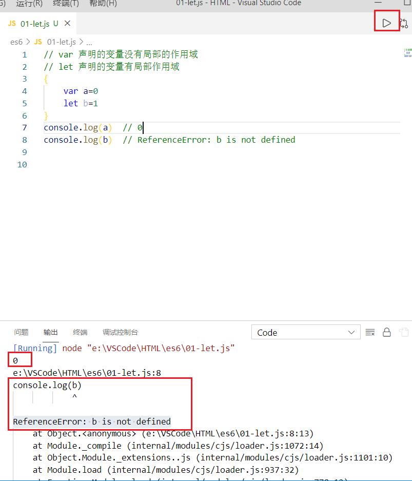

```js
// var 可以声明多次
// let 只能声明一次
var m=1
var m=2
var n=3
var n=4
console.log(m)
console.log(n)
```

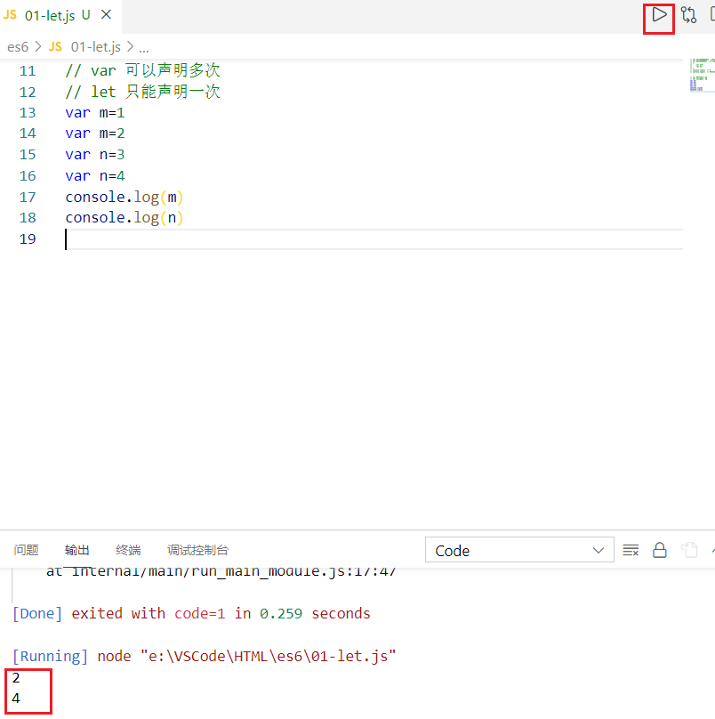

```js
// var 会变量提升
// let 不存在变量提升
console.log(x) //undefined
var x = 'apple'
console.log(y) // ReferenceError: y is not defined
let y = 'banana'
```

- 在实际开发和生产中，如果是小程序， uniapp或者一些脚手架中的，可以大胆的去使用let和 const。
- 但是如果你是web开发。建议还是使用var.因为在一些低版本的浏览器还是不支持let和const

### 3.const声明变量

> 创建`02-const.js`

```js
// 1.声明之后不允许改变
const PI = '3.1415926'
PI = 3 // TypeError: Assignment to constant variable.
```

```js
// 2.一但声明必须初始化，否则会报错
const MY_AGE // SyntaxError: Missing initializer in const declaration
```

### 4.解构赋值

> 创建 `03-解构赋值.js`

- 解构赋值是对赋值运算符的扩展。 
- 是一种针对数组或者对象进行模式匹配，然后对其中的变量进行赋值。 
- 在代码书写上简洁且易读，语义更加清晰明了；也方便了复杂对象中数据字段获取。

```js
// 1.数组解构
// 传统
let a = 1, b = 2, c = 3
console.log(a, b, c)    // 1 2 3
// ES6
let [x, y, z] = [1, 2, 3]
console.log(x, y, z)    // 1 2 3
```

```js
// 2.对象解构
let user = {name: 'subeiLY', age: 19}
// 传统
let name1 = user.name
let age1 = user.age
console.log(name1, age1)
// ES6
let { name, age } = user // 注意：解构的变量必须和user中的属性同名
console.log(name, age)
```

### 5.模板字符串

> 创建 `04-模板字符串.js` 

- 模板字符串相当于加强版的字符串，用反引号 `,除了作为普通字符串，还可以用来定义多行字符串，还可以在字符串中加入变量和表达式。

```js
// 字符串插入变量和表达式。变量名写在 ${} 中，${} 中可以放入 JavaScript 表达式。
let name = 'subei'
let age = 20
let info = `My Name is ${name},I am ${age+1} years old next year.`
console.log(info)
// My Name is subei,I am 21 years old next year.
```

### 6.声明对象简写

> 创建 `05-声明对象简写.js`

```js
const age = 16
const name = '怡宝'
// 传统
const person1 = {age: age, name: name}
console.log(person1)
// ES6
const person2 = {age, name}
console.log(person2) // {age: 16, name: '怡宝'}
```

### 7.定义方法简写

> 创建 `06-定义方法简写.js`

```js
// 传统
const person1 = {
    sayHi:function(){
        console.log('代码')
    }
}
person1.sayHi(); // '代码'
    
// ES6

const person2 = {
    sayHi(){
        console.log('代码')
    }
}
person2.sayHi() // '代码'
```

### 8.对象拓展运算符

> 创建 `07-对象拓展运算符.js` 

- 拓展运算符（...）用于取出参数对象所有可遍历属性，然后拷贝到当前对象。

```js
let person = {name: 'pig', age: 3}
let someoneOld = person // 引用赋值
let someone = { ...person } // 对拷拷贝
someoneOld.name = 'dog'
someone.name = 'cat'
console.log(person)     // { name: 'dog', age: 3 }
console.log(someoneOld) // { name: 'dog', age: 3 }
console.log(someone)    // { name: 'cat', age: 3 }
```

### 9.函数的默认参数

> 创建 `08-函数的默认参数.js`

```js
function showInfo(name, age = 17) {
    console.log(name + "," + age)
}
// 只有在未传递参数，或者参数为 undefined 时，才会使用默认参数
// null 值被认为是有效的值传递。

showInfo("kuake", 20) // kuake,20
showInfo("kuake") // kuake,17
showInfo("kuake", undefined) // kuake,17
showInfo("kuake", null) // kuake, null
```

### 10.箭头函数

> 创建 `09-箭头函数.js` 

- 箭头函数提供了一种更加简洁的函数书写方式。基本语法是：

```js
参数 => 函数体
```

- 箭头函数多用于匿名函数的定义

```js
let arr = ["10", "5", "40", "25", "1000"]
let arr1 = arr.sort()
console.log(arr1)   // [ '10', '1000', '25', '40', '5' ]
// 上面的代码没有按照数值的大小对数字进行排序，
// 要实现这一点，就必须使用一个排序函数
arr2 = arr.sort(function(a,b){
return a - b
})
// arr2 = arr.sort((a,b) => {return a - b})
// arr2 = arr.sort((a,b) => a - b)
console.log(arr2) // [ '5', '10', '25', '40', '1000' ]
```

```js
// 当箭头函数没有参数或者有多个参数，要用 () 括起来。
// 当箭头函数函数体有多行语句，用 {} 包裹起来，表示代码块，
// 当只有一行语句，并且需要返回结果时，可以省略 {} , 结果会自动返回。
var f3 = (a,b) => {
    let result = a+b
    return result
}
console.log(f3(6,2)) // 8
// 前面代码相当于：
var f4 = (a,b) => a+b
```

## 4.NPM包管理器

### 1.简介

- 官方网站：https://www.npmjs.com/
- NPM全称Node Package Manager，是Node.js包管理工具，是全球最大的模块生态系统，里面所有的 模块都是开源免费的；也是Node.js的包管理工具，相当于前端的Maven 。

```shell
# 在命令提示符输入 npm -v 可查看当前npm版本
npm -v
```

### 2.使用npm管理项目

1. 创建文件夹npm 

2. 项目初始化

```shell
# 建立一个空文件夹，在命令提示符进入该文件夹 执行命令初始化
npm init
# 按照提示输入相关信息，如果是用默认值则直接回车即可。
# name: 项目名称
# version: 项目版本号
# description: 项目描述
# keywords: {Array}关键词，便于用户搜索到我们的项目
# 最后会生成package.json文件，这个是包的配置文件，相当于maven的pom.xml
# 我们之后也可以根据需要进行修改。
```

```shell
# 如果想直接生成 package.json 文件，那么可以使用命令
npm init -y
```

### 3.修改npm镜像

1. 修改npm镜像
   1. NPM官方的管理的包都是从 http://npmjs.com下载的，但是这个网站在国内速度很慢。 
   2. 这里推荐使用淘宝 NPM 镜像 http://npm.taobao.org/
   3. 淘宝 NPM 镜像是一个完整 npmjs.com 镜像，同步频率目前为 10分钟一次，以保证尽量与官方服 务同步。

2. 设置镜像地址

```shell
#经过下面的配置，以后所有的 npm install 都会经过淘宝的镜像地址下载
npm config set registry https://registry.npm.taobao.org
#查看npm配置信息
npm config list
```

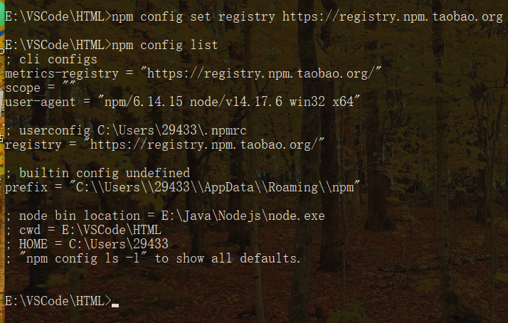

### 4.npm install

```shell
#使用 npm install 安装依赖包的最新版，
#模块安装的位置：项目目录\node_modules
#安装会自动在项目目录下添加 package-lock.json文件，这个文件帮助锁定安装包的版本
#同时package.json 文件中，依赖包会被添加到dependencies节点下，类似maven中的 <dependencies>
npm install jquery
#如果安装时想指定特定的版本
npm install jquery@2.1.x
#devDependencies节点：开发时的依赖包，项目打包到生产环境的时候不包含的依赖
#使用 -D参数将依赖添加到devDependencies节点
npm install --save-dev eslint
#或
npm install -D eslint
#全局安装
#Node.js全局安装的npm包和工具的位置：用户目录\AppData\Roaming\npm\node_modules
#一些命令行工具常使用全局安装的方式
npm install -g webpack
#npm管理的项目在备份和传输的时候一般不携带node_modules文件夹
npm install 
# 根据package.json中的配置下载依赖，初始化项目
```

### 5.其他命令

```shell
#更新包（更新到最新版本）
npm update 包名
#全局更新
npm update -g 包名
#卸载包
npm uninstall 包名
#全局卸载
npm uninstall -g 包名
```

## 5.Bable

### 1.简介

- ES6的某些高级语法在浏览器环境甚至是Node.js环境中无法执行。 
- Babel是一个广泛使用的转码器，可以将ES6代码转为ES5代码，从而在现有环境执行执行。 
- 这意味着，你可以现在就用 ES6 编写程序，而不用担心现有环境是否支持。

### 2.安装

> 安装命令行转码工具 

- Babel提供babel-cli工具，用于命令行转码。它的安装命令如下：

```shell
npm install -g babel-cli
#查看是否安装成功
babel --version
```

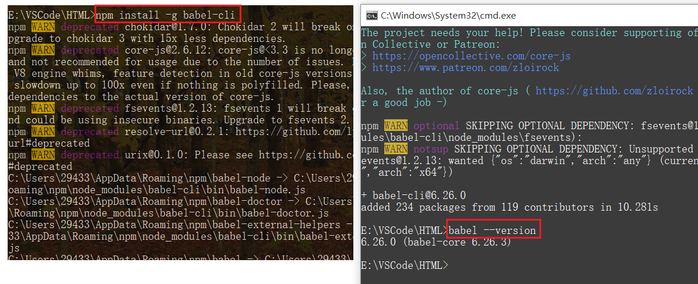

### 3.Babel的使用

1. 创建babel文件夹
2. 初始化项目

```js
npm init -y
```

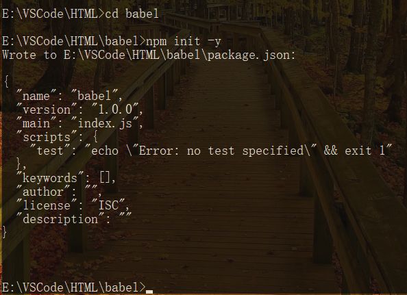

3. 创建新文件example.js，运行如下代码：

```js
// 转码前
// 定义数据
let input=[1,2,3]
// 将数组每个元素+1
input = input.map(item => item + 1)
console.log(input)  // [ 2, 3, 4 ]
```

4. 配置.babelrc

- Babel的配置文件是.babelrc，存放在项目的根目录下，该文件用来设置转码规则和插件，基本格式如下。

```js
{
    "presets": [],
    "plugins": []
}
```

- presets字段设定转码规则，将es2015规则加入 .babelrc：

```js
{
    "presets": ["es2015"],
    "plugins": []
}
```

5. 安装转码器，在项目中安装

```js
npm install --save-dev babel-preset-es2015
```

6. 转码

```shell
# npm install --save-dev csv-loader xml-loader
# 转码结果写入一个文件
mkdir dist1
# --out-file 或 -o 参数指定输出文件
babel src/example.js --out-file dist1/compiled.js
# 或者
babel src/example.js -o dist1/compiled.js
# 整个目录转码
mkdir dist2
# --out-dir 或 -d 参数指定输出目录
babel src --out-dir dist2
# 或者
babel src -d dist2
```

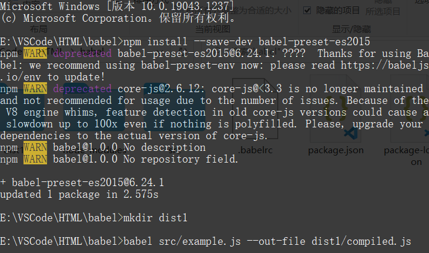

### 4.自定义脚本

1. 改写package.json

```js
{
    // ...
    "scripts": {
        // ...
    	"build": "babel src\\example.js -o dist\\compiled.js"
	},
}
```

2. 转码的时候，执行下面的命令

```shell
mkdir dist
npm run build
```

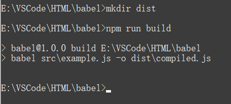

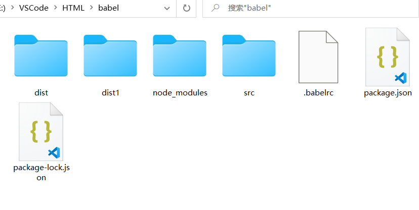

## 6.模块化

### 1.简介

- 随着网站逐渐变成"互联网应用程序"，嵌入网页的Javascript代码越来越庞大，越来越复杂。
- Javascript模块化编程，已经成为一个迫切的需求。理想情况下，开发者只需要实现核心的业务逻辑，其他都可以加载别人已经写好的模块。 
- 但是，Javascript不是一种模块化编程语言，它不支持"类"（class），包（package）等概念，也不支持"模块"（module）。

**模块化规范**

- CommonJS模块化规范
- ES6模块化规范

### 2.CommonJS规范

> ==每个文件就是一个模块，有自己的作用域==。在一个文件里面定义的变量、函数、类，都是私有的， 对其他文件不可见。

1. 创建module文件夹

2. 创建四则运算Temo.js

```js
// 定义成员
const sum=function(a,b){
    return a+b
}
const subtract=function(a,b){
    return a-b
}
const multiply=function(a,b){
    return a*b
}
const divide=function(a,b){
    return a/b
}
```

3. 导出模块中的成员

```js
// 导出成员:
module.exports={
    sum:sum,
    subtract:subtract,
    multiply:multiply,
    divide:divide
}
```

- 简写

```js
// 导出成员:
module.exports={
    sum,
    subtract,
    multiply,
    divide
}
```

4. 创建 mokuai-common-js/引入模块.js

```js
// 引入模块，注意:当前路径必须写 ./
const m = require('./mokuai-common.js')
console.log(m)

const r1=m.sum(1,6)
const r2=m.subtract(2,3)
console.log(r1,r2)
```

5. 运行程序

```shell
node 引入模块.js
```

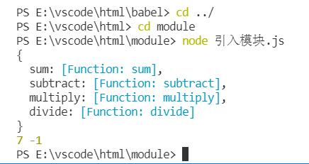

- CommonJS使用exports和require来导出、导入模块。

### 3.ES6模块化规范

- ES6使用export和import来导出、导入模块。

1. 创建mokuai-es6文件夹
2. 创建 src/userApi.js文件，导出模块。

```js
export function grtList(){
    console.log('获取数据列表')
}
export function save(){
    console.log('保存数据')
}
```

3. 创建 src/userComponent.js文件，导入模块

```js
// 只取需要的方法即可，多个方法用逗号分隔
import{ getList,save} from './userApi.js'
getList()
save()
```

> **注意：这时的程序无法运行的，因为ES6的模块化无法在Node.js中执行，需要用Babel编辑成ES5后再执行**。

4. 初始化项目

```shell
npm init -y
```

5. 配置.babelrc

```js
{
    "presets": ["es2015"],
    "plugins": []
}
```

6. 安装转码器，在项目中安装

```shell
npm install --save-dev babel-preset-es2015
```

7. 定义运行脚本，package.json中增加"build"

```js
{
    // ...
    "scripts": {
       "build": "babel src -d dist"
    }
}
```

8. 执行命令转码

```shell
npm run build
```

9. 运行程序

```shell
node dist/userComponent.js
```

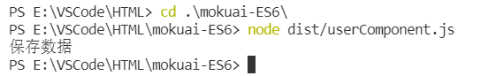

### 4.ES6模块化写法2

1. 创建 src/userApi2.js ，导出模块

```js
export default {
    getList() {
        console.log('获取数据列表2')
    },
    save() {
        console.log('保存数据2')
    }
}
```

2. 创建 src/userComponent2.js，导入模块

```js
import user from "./userApi2.js"
user.getList()
user.save()
```

3. 执行命令转码

```shell
npm run build
```

4. 运行程序

```shell
node dist/userComponent2.js
```

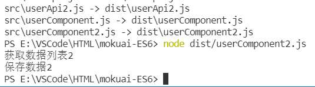

## 7.WebPack

### 1.什么是Webpack

- Webpack 是一个前端资源加载/打包工具。它将根据模块的依赖关系进行静态分析，然后将这些模块按 照指定的规则生成对应的静态资源。 
- 从下图中我们可以看出，Webpack 可以将多种静态资源 js、css、less 转换成一个静态文件，减少了页面的请求。

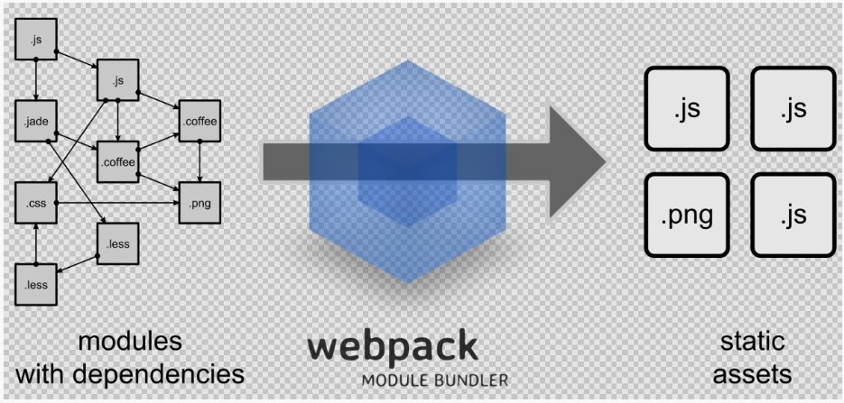

### 2.Webpack安装

1. 全局安装

```shell
npm install -g webpack webpack-cli
```

2. 安装后查看版本号

```shell
webpack -v
```


### 3.初始化项目

1. 创建webpack文件夹 

```shell
npm init -y
```

2. 创建src文件夹 
3. src下创建common.js

```js
exports.info = function (str) {
    document.write(str);
}
```

4. src下创建utils.js

```js
exports.add = function (a, b) {
    return a + b;
}
```

5. src下创建main.js

```js
const common = require('./common');
const utils = require('./utils');
common.info('Hello world!' + utils.add(400, 200));
```

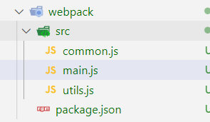

### 4.JS打包

1. webpack目录下创建配置文件webpack.config.js

```js
const path = require("path"); //Node.js内置模块
module.exports = {
    entry: './src/main.js', //配置入口文件
    output: {
        path: path.resolve(__dirname, './dist'), //输出路径，__dirname：当前文件所在路径
        filename: 'bundle.js' //输出文件
    }
}
```

> 以上配置的意思是：读取当前项目目录下src文件夹中的main.js（入口文件）内容，分析资源依赖，把相关的js文件打包，打包后的文件放入当前目录的dist文件夹下，打包后的js文件名为bundle.js

2. 命令行执行编译命令

```shell
webpack --mode=development
# 执行后查看bundle.js 里面包含了上面两个js文件的内容并进行了代码压缩
```

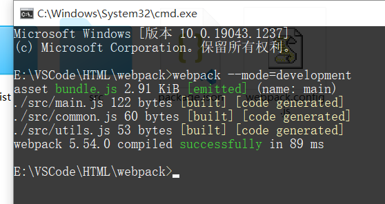

- 也可以配置项目的npm运行命令，修改package.json文件

```js
"scripts": {
    //...,
    "dev": "webpack --mode=development"
 }
```

- 运行npm命令执行打包

```shell
npm run dev 
```

3. webpack目录下创建index.html ， 引用bundle.js

```html
<!DOCTYPE html>
<html lang="en">
<head>
    <meta charset="UTF-8">
    <meta http-equiv="X-UA-Compatible" content="IE=edge">
    <meta name="viewport" content="width=device-width, initial-scale=1.0">
    <title>webpack</title>
</head>
<body>
    <script src="dist/bundle.js"></script>
</body>
</html>
```

4. 浏览器中查看index.html

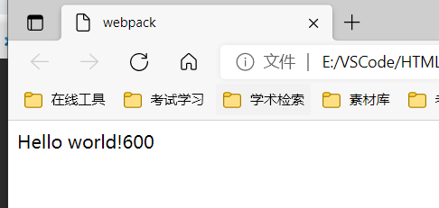

### 5.CSS打包

1. 安装style-loader和 css-loader

- Webpack 本身只能处理 JavaScript 模块，如果要处理其他类型的文件，就需要使用 loader 进行转换。
- Loader 可以理解为是模块和资源的转换器。
- 首先我们需要安装相关Loader插件：
  - css-loader 是将 css 装载到 javascript
  - style-loader 是让 javascript 认识css

```shell
npm install --save-dev style-loader css-loader
```

2. 修改webpack.config.js

```js
const path = require("path"); // Node.js内置模块
module.exports = {
    //...,
    output:{
        // 其他配置
    },
    module: {
        rules: [  
            {  
                test: /\.css$/,    //打包规则应用到以css结尾的文件上
                use: ['style-loader', 'css-loader']
            }  
        ]  
    }
}
```

3. 在src文件夹创建style.css

```css
body{
    background: coral;
}
```

4. 修改main.js，在第一行引入style.css

```js
const style = require('./style.css');
```

5. 运行编译命令

```shell
npm run dev
```

6. 浏览器中查看index.html ， 看看背景是不是变成珊瑚色啦？

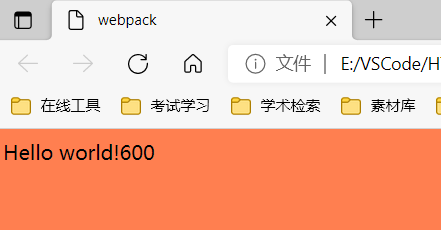

### 6.配置

- entry：入口文件，指定 WebPack 用哪个文件作为项目的入口 
- output：输出，指定 WebPack 把处理完成的文件放置到指定路径 
- module：模块，用于处理各种类型的文件 
- plugins：插件，如：热更新、代码重用等 
- resolve：设置路径指向 
- watch：监听，用于设置文件改动后直接打包

```js
module.exports = {
    entry: "",
    output: {
        path: "",
        filename: ""
    },
    module: {
        loaders: [
            {test: /\.js$/, loader: ""}
        ]
    },
    plugins: {},
    resolve: {},
    watch: true
}
```

## 8.Vue-element-admin

> [vue-element-admin](http://panjiachen.github.io/vue-element-admin) 是一个后台前端解决方案，它基于 [vue](https://github.com/vuejs/vue) 和 [element-ui](https://github.com/ElemeFE/element)实现。它使用了最新的前端技术栈，内置了 i18 国际化解决方案，动态路由，权限验证，提炼了典型的业务模型，提供了丰富的功能组件，它可以帮助你快速搭建企业级中后台产品原型。相信不管你的需求是什么，本项目都能帮助到你。

- 官网地址：https://panjiachen.github.io/vue-element-admin-site/zh/

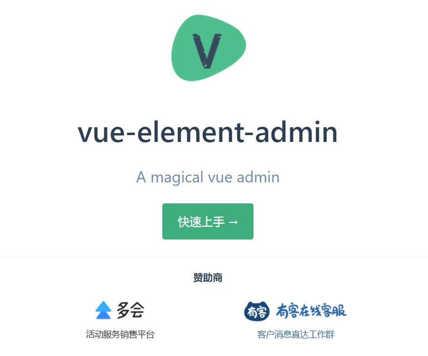

==运行工程和编译工程==

```shell
# 克隆项目
git clone https://github.com/PanJiaChen/vue-element-admin.git
# 进入项目目录
cd vue-element-admin
# 安装依赖
npm install
# 建议不要用 cnpm 安装 会有各种诡异的bug 可以通过如下操作解决 npm 下载速度慢的问题
npm install --registry=https://registry.npm.taobao.org
# 本地开发 启动项目
npm run dev
```

**注意如果老是安装失败**：

- 请删除 node-modules，然后执行`npm install`。
- 或者换个网络。

启动完成后会自动打开浏览器访问 [http://localhost:9527](http://localhost:9527/)， 你看到下面的页面就代表操作成功了。

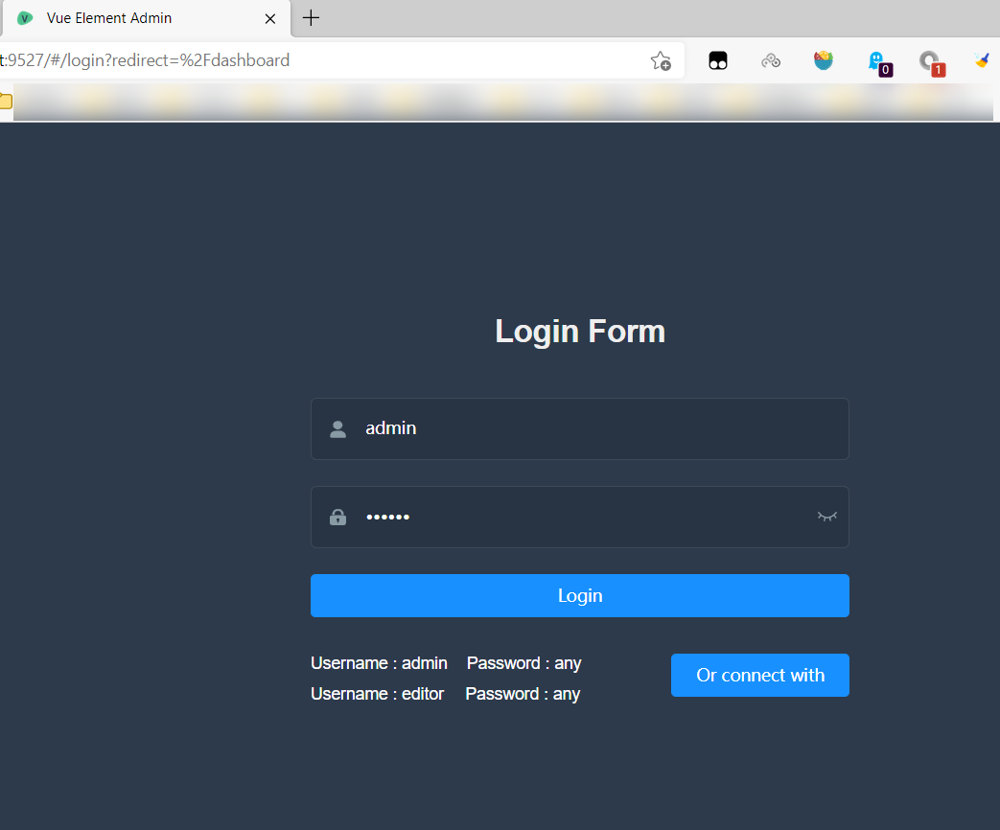


> **小结**：nodejs项目几要素：

- package.json (npm init \ npmt init -y)
- node_modules (npm install -g jquery/npm iinstall jquery)
- 运行是使用：查看官网提供 几乎所有的nodejs都启动和打包都是如下：
  - npm run dev （开发运行）
  - npm run build (打包)

## 9.探究：package.json

1. 在发布项目或者拷贝项目的时候，`node_moudles`其实是没意义的。因为它仅仅在开发和打包的时候使用。

2. 如果托管代码其实没必要，为什么。因为你package.json文件中已经记录了这些模块坐标。我们可以直接使用`npm install` 去重新安装和生成`node-modules` 。所以的nodejs项目下载以后第一个要执行的命令都是`npm install`的原因也就是如此。

3. 这也就是为什么官方不提供`node-modules`的原因。因为你可以直接用`npm install` 去下载。

# 🎉🎉🎉全剧终🎉🎉🎉 


