# Git快速入门

## 1.版本控制

> 什么是版本控制？
>
> - 版本迭代，新的版本！版本管理器。

  版本控制（Revision control）是一种在开发的过程中用于管理我们对文件、目录或工程等内容的修改历史，方便查看更改历史记录，备份以便恢复以前的版本的软件工程技术。 

- 实现跨区域多人协同开发；
- 追踪和记载一个或者多个文件的历史记录；
- 组织和保护你的源代码和文档；
- 统计工作量并行开发、提高开发效率；
- 跟踪记录整个软件的开发过程；
- 减轻开发人员的负担，节省时间，同时降低人为错误；
- 简单说就是用于管理多人协同开发项目的技术。 

  没有进行版本控制或者版本控制本身缺乏正确的流程管理，在软件开发过程中将会引入很多问题，如软件代码的一致性、软件内容的冗余、软件过程的事物性、软件开发过程中的并发性、软件源代码的安全性，以及软件的整合等问题。

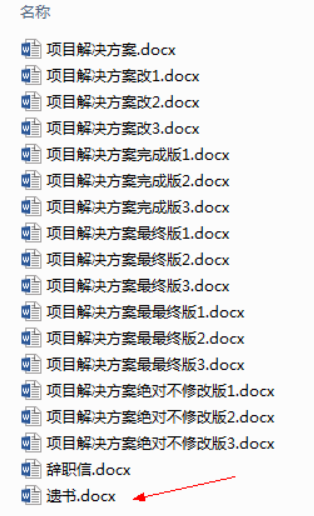

> 常见的版本控制工具

- Git
- SVN（Subversion）
- CVS（Concurrent Versions System） 
- VSS（Micorosoft Visual SourceSafe） 
- TFS（Team Foundation Server） 
- Visual Studio Online

  版本控制产品非常的多（Perforce、Rational ClearCase、RCS（GNU Revision Control System）、 Serena Dimention、SVK、BitKeeper、Monotone、Bazaar、Mercurial、SourceGear Vault），现在 影响力最大且使用最广泛的是Git与SVN。

> 版本控制分类

1. 本地版本控制

  记录文件每次的更新，可以对每个版本做一个快照，或是记录补丁文件，适合个人用，如RCS。

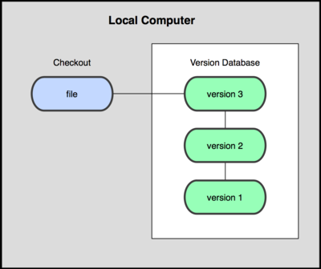

2. 集中版本控制 

  所有的版本数据都保存在服务器上，协同开发者从服务器上同步更新或上传自己的修改。


  所有的版本数据都存在服务器上，用户的本地只有自己以前所同步的版本，如果不连网的话，用户就看 不到历史版本，也无法切换版本验证问题，或在不同分支工作。而且，所有数据都保存在单一的服务器上，有很大的风险这个服务器会损坏，这样就会丢失所有的数据，当然可以定期备份。代表产品： SVN、CVS、VSS。

3. 分布式版本控制 

  所有版本信息仓库全部同步到本地的每个用户，这样就可以在本地查看所有版本历史，可以离线在本地提交，只需在连网时push到相应的服务器或其他用户那里。由于每个用户那里保存的都是所有的版本数据，只要有一个用户的设备没有问题就可以恢复所有的数据，但这增加了本地存储空间的占用。

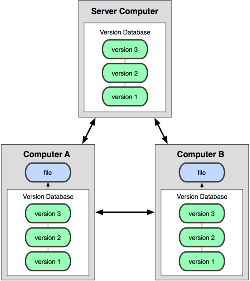

> Git与SVN最主要区别：

  SVN是集中式版本控制系统，版本库是集中放在中央服务器的，而工作的时候，用的都是自己的电脑，所以首先要从中央服务器得到最新的版本，然后工作，完成工作后，需要把自己做完的活推送到中央服务器。集中式版本控制系统是必须联网才能工作，对网络带宽要求较高。 


  Git是分布式版本控制系统，没有中央服务器，每个人的电脑就是一个完整的版本库，工作的时候不需要联网了，因为版本都在自己电脑上。协同的方法是这样的：比如说自己在电脑上改了文件A，其他人也在电脑上改了文件A，这时，你们两之间只需把各自的修改推送给对方，就可以互相看到对方的修改了。 

## 2.Git历史

  同生活中的许多伟大事物一样，Git 诞生于一个极富纷争大举创新的年代。Linux 内核开源项目有着为数众广的参与者。 绝大多数的 Linux 内核维护工作都花在了提交补丁和保存 归档的繁琐事务上(1991－2002年间)。 到 2002 年，整个项目组开始启用一个专有的分布式版本控制系 统 BitKeeper 来管理和维护代码。 
  到了 2005 年，开发 BitKeeper 的商业公司同 Linux 内核开源社区的合作关系结束，他们收回了 Linux 内核社区免费使用 BitKeeper 的权力。这就迫使 Linux 开源社区(特别是 Linux 的缔造者 Linus Torvalds)基于使用 BitKeeper 时的经验教训，开发出自己的版本系统。  也就是后来的 Git！ 
  Git是目前世界上最先进的分布式版本控制系统。 
  Git是免费、开源的，最初Git是为辅助 Linux 内核开发的，来替代 BitKeeper！ 

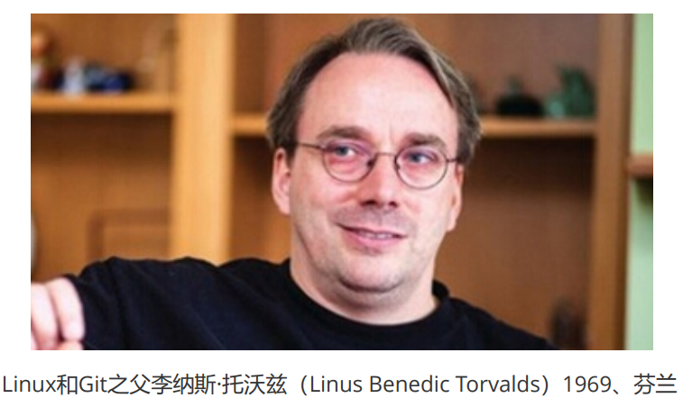

## 3.Git环境配置

> 软件下载

- 打开 [git官网] https://git-scm.com/，下载git对应操作系统的版本。
- 官网下载太慢，可以使用淘宝镜像下载：http://npm.taobao.org/mirrors/git-for-windows/

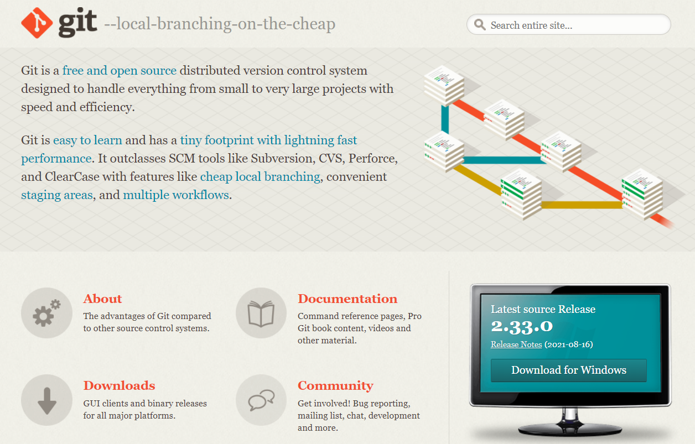

- 下载对应的版本即可安装！
- 安装：无脑下一步即可！

> 启动Git

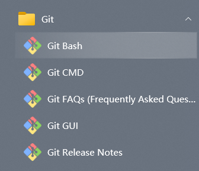

- `Git Bash`：Unix与Linux风格的命令行，使用最多，推荐最多；
- `Git CMD`：Windows风格的命令行；
- `Git GUI`：图形界面的Git，不建议初学者使用，尽量先熟悉常用命令；

> 基本的Linux命令：

1. `cd` : 改变目录。
2. `cd .` . 回退到上一个目录，直接cd进入默认目录
3. `pwd` : 显示当前所在的目录路径。
4. `ls(ll)`: 都是列出当前目录中的所有文件，只不过ll(两个ll)列出的内容更为详细。
5. `touch` : 新建一个文件 如 touch index.js 就会在当前目录下新建一个index.js文件。
6. `rm`: 删除一个文件, rm index.js 就会把index.js文件删除。
7. `mkdir`: 新建一个目录,就是新建一个文件夹。
8. `rm -r` : 删除一个文件夹, rm -r src 删除src目录
9. `mv`： 移动文件, mv index.html src index.html 是我们要移动的文件, src 是目标文件夹,当然, 这样写，必须保证文件和目标文件夹在同一目录下。
10. `reset`：重新初始化终端/清屏。
11. `clear`：清屏。
12. `history`： 查看命令历史。
13. `help`：帮助。
14. `exit`：退出。
15. `#`：表示注释

> Git配置

- 查看配置：`git config -l`

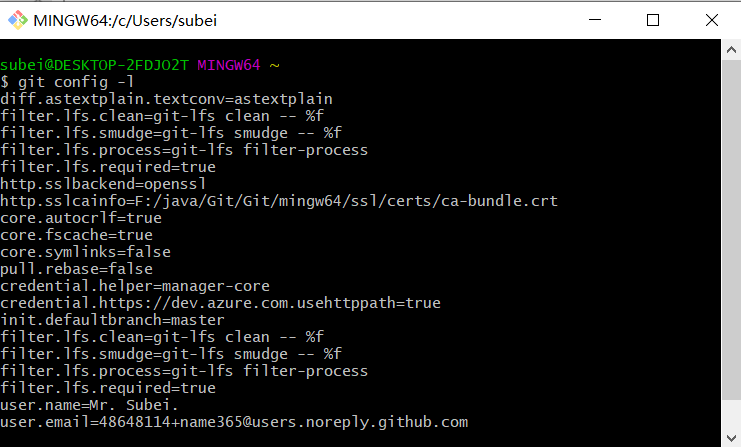

- 查看不同级别的配置文件：

```powershell
#查看系统config
git config --system --list
#查看当前用户（global）配置
git config --global --list
```

- Git相关的配置文件：
  - Git\mingw64\etc\gitconfig ： Git 安装目录下的 gitconfig --system 系统级；
  - C:\Users\Administrator\ .gitconfig 只适用于当前登录用户的配置 --global 全局；
  - 这里可以直接编辑配置文件，通过命令设置后会响应到这里。

> 设置用户名与邮箱（用户标识，必要）

  当你安装Git后首先要做的事情是设置你的用户名称和e-mail地址。这是非常重要的，因为每次Git提交都会使用该信息。它被永远的嵌入到了你的提交中：

```powershell
git config --global user.name "subeily" #名称
git config --global user.email 2943357594@qq.com #邮箱
```


  只需要做一次这个设置，如果你传递了--global 选项，因为Git将总是会使用该信息来处理你在系统中所做的一切操作。如果你希望在一个特定的项目中使用不同的名称或e-mail地址，你可以在该项目中运行该命令而不要--global选项。 总之--global为全局配置，不加为某个项目的特定配置。

## 4.Git基本理论

> 工作区域

  Git本地有三个工作区域：工作目录（Working Directory）、暂存区(Stage/Index)、资源库(Repository 或 Git Directory)。如果在加上远程的git仓库(Remote Directory)就可以分为四个工作区域。文件在这四个区域之间的转换关系如下：

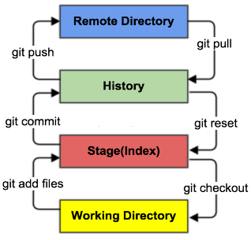

- Workspace：工作区，平时存放项目代码的地方； 
- Index / Stage：暂存区，用于临时存放你的改动，事实上它只是一个文件，保存即将提交到文件列表信息；
- Repository：仓库区（或本地仓库），就是安全存放数据的位置，这里面有你提交到所有版本的数据。其中HEAD指向最新放入仓库的版本； 
- Remote：远程仓库，托管代码的服务器，可以简单的认为是你项目组中的一台电脑用于远程数据交换。 

本地的三个区域确切的说应该是git仓库中HEAD指向的版本：

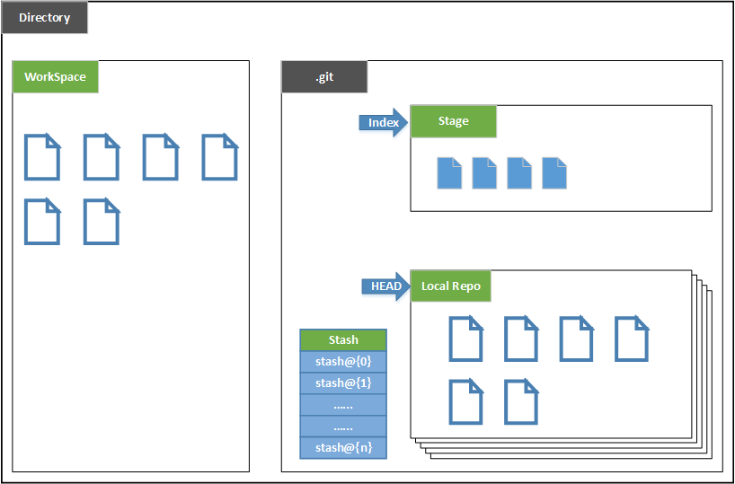

- Directory：使用Git管理的一个目录，也就是一个仓库，包含我们的工作空间和Git的管理空间。
- WorkSpace：需要通过Git进行版本控制的目录和文件，这些目录和文件组成了工作空间。
- .git：存放Git管理信息的目录，初始化仓库的时候自动创建。
- Index/Stage：暂存区，或者叫待提交更新区，在提交进入repo之前，我们可以把所有的更新放在暂存区。
- Local Repo：本地仓库，一个存放在本地的版本库；HEAD会只是当前的开发分支（branch）。
- Stash：隐藏，是一个工作状态保存栈，用于保存/恢复WorkSpace中的临时状态。

> 工作流程：

- git的工作流程一般是这样的：
  1. 在工作目录中添加、修改文件；
  2. 将需要进行版本管理的文件放入暂存区域；
  3. 将暂存区域的文件提交到git仓库。
- 因此，git管理的文件有三种状态：已修改（modified）,已暂存（staged）,已提交(committed)。


## 5.Git项目搭建

> 创建工作目录与常用指令

  工作目录（WorkSpace)一般就是你希望Git帮助你管理的文件夹，可以是你项目的目录，也可以是一个 空目录，建议不要有中文。 
日常使用只要记住下图6个命令： 

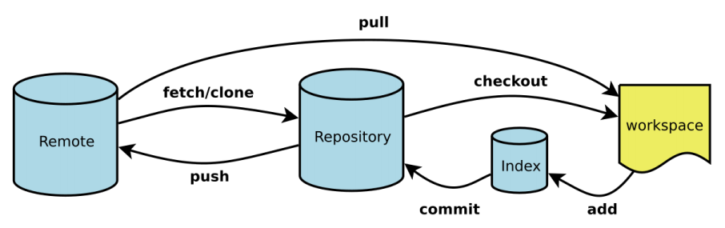

> 本地仓库搭建

- 创建本地仓库的方法有两种：一种是创建全新的仓库，另一种是克隆远程仓库。

1. 创建全新的仓库，需要用GIT管理的项目的根目录执行： 

```powershell
# 在当前目录新建一个Git代码库
$ git init 
```

2. 执行后可以看到，仅仅在项目目录多出了一个.git目录，关于版本等的所有信息都在这个目录里面。 

> 克隆远程仓库 

1. 另一种方式是克隆远程目录，由于是将远程服务器上的仓库完全镜像一份至本地！ 

```powershell
# 克隆一个项目和它的整个代码历史(版本信息) 
$ git clone [url] 
```

2. 自行去 gitee 或者 github 上克隆一个测试！ 

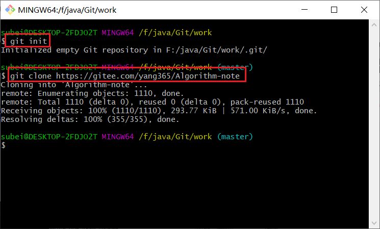

## 6.Git文件操作

> 文件4种状态 

  版本控制就是对文件的版本控制，要对文件进行修改、提交等操作，首先要知道文件当前在什么状态，不然可能会提交了现在还不想提交的文件，或者要提交的文件没提交上。 

- Untracked: 未跟踪, 此文件在文件夹中, 但并没有加入到git库, 不参与版本控制。通过`git add`状态变为`Staged`。 
- Unmodify: 文件已经入库, 未修改, 即版本库中的文件快照内容与文件夹中完全一致. 这种类型的文件有两种去处, 如果它被修改, 而变为`Modified`。如果使用      `git rm`移出版本库, 则成为`Untracked`文件。
- Modified: 文件已修改, 仅仅是修改, 并没有进行其他的操作。这个文件也有两个去处, 通过`git add`可进入暂存`staged` 状态, 使用`git checkout`则丢弃修改过, 返回到`unmodify`状态, 这个`git checkout` 即从库中取出文件, 覆盖当前修改 ! 
- Staged: 暂存状态. 执行`git commit`则将修改同步到库中, 这时库中的文件和本地文件又变为一致, 文件为`Unmodify`状态. 执行`git reset HEAD filename`取消暂存, 文件状态为`Modified`。

> 查看文件状态

- 通过如下命令可以查看到文件的状态：

```powershell
# 查看指定文件状态 
git status [filename] 
    
# 查看所有文件状态 
git status 
```

> 忽略文件

  有些时候我们不想把某些文件纳入版本控制中，比如数据库文件，临时文件，设计文件等。在主目录下建立".gitignore"文件，此文件有如下规则： 
1. 忽略文件中的空行或以井号（#）开始的行将会被忽略。 
2. 可以使用Linux通配符。例如：星号（*）代表任意多个字符，问号（？）代表一个字符，方括号（[abc]）代表可选字符范围，大括号（{string1,string2,...}）代表可选的字符串等。 
3. 如果名称的最前面有一个感叹号（!），表示例外规则，将不被忽略。 
4. 如果名称的最前面是一个路径分隔符（/），表示要忽略的文件在此目录下，而子目录中的文件不 忽略。 
5. 如果名称的最后面是一个路径分隔符（/），表示要忽略的是此目录下该名称的子目录，而非文件 （默认文件或目录都忽略）。 

```powershell
# 为注释
*.txt  # 忽略所有 .txt结尾的文件，这样的话上传就不会被选中了！
!lib.txt # 但lib.txt除外
/temp # 仅忽略项目根目录下的TODO文件,不包括其它目录temp
build/ # 忽略build/目录下的所有文件
doc/*.txt # 会忽略 doc/notes.txt 但不包括 doc/server/arch.txt
```

## 7.使用码云

> 国外的GitHub是有墙的，比较慢，国内一般使用gitee，公司中一般搭建自己的gitlab服务器。

1. 注册登录码云，完善个人信息！

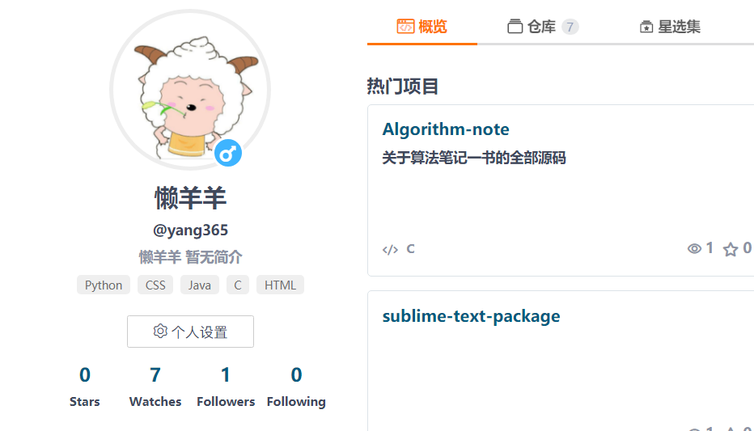

2. 设置本机绑定SSH公钥，实现免密码登录！

```powershell
# 进入 C:\Users\Administrator\.ssh 目录
# 生成公钥
# ssh-keygen -t rsa -C "xxxxx@xxxxx.com"
ssh-keygen -t rsa 
```

- 如果没有 .ssh 文件夹，可以使用命令：`ssh-keygen -t rsa` 即可自动生成。

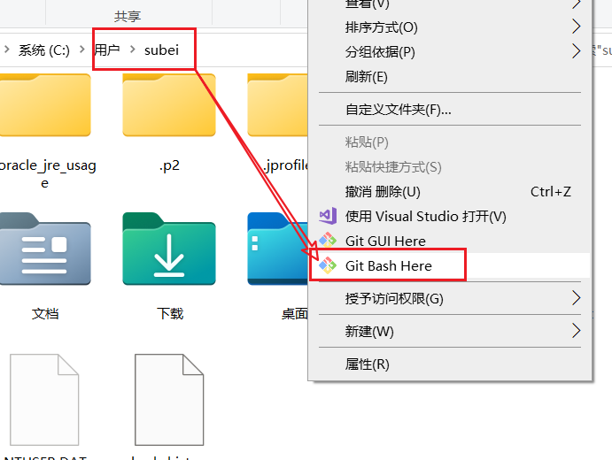

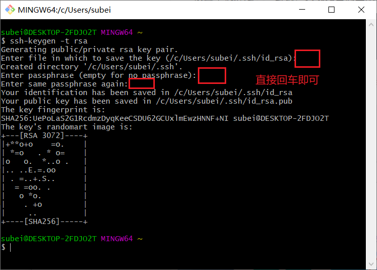

3. 将公钥信息public key 添加到码云账户中即可！

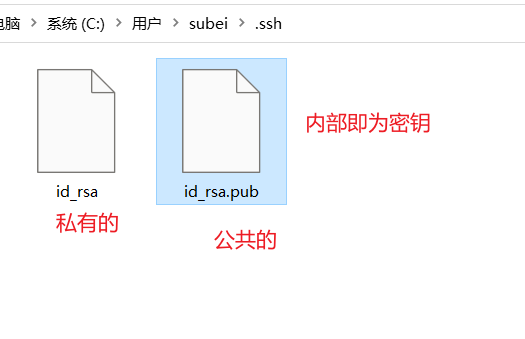

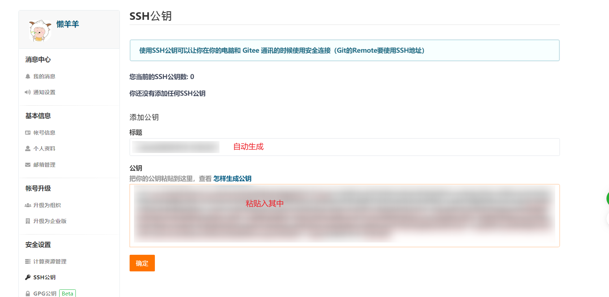


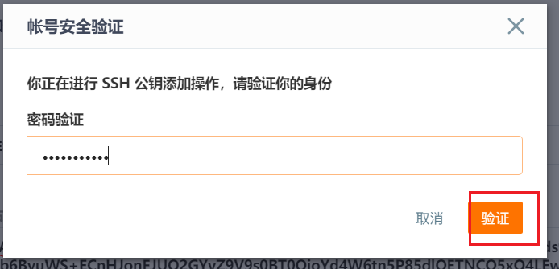

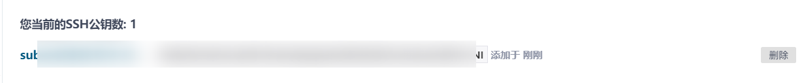

4. 使用码云创建一个自己的仓库！

- 新建一个仓库

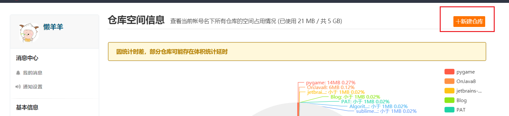

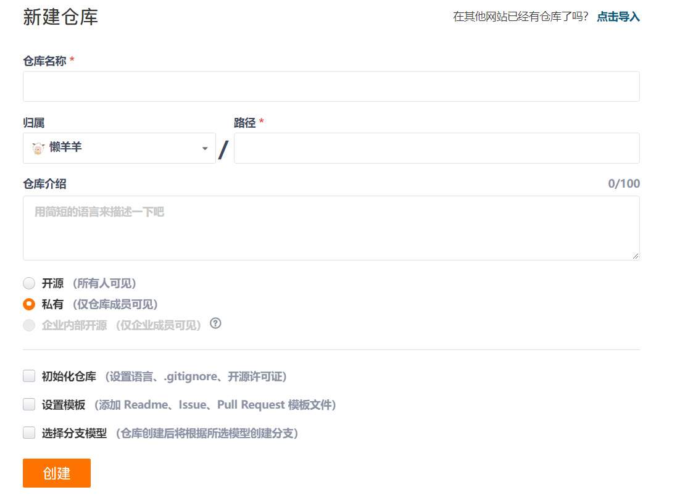

> 克隆仓库到本地

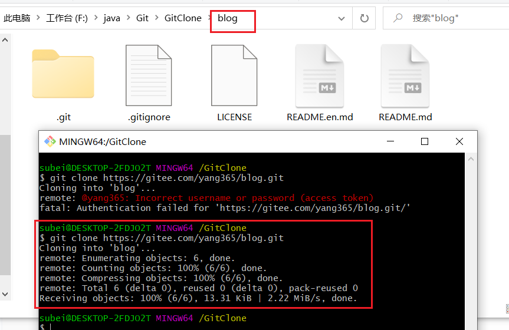

> 客户端提交到远程仓库

一个好习惯：==不管这个项目多少人参与，push之前先pull一下，看看有没有merge的代码，有merge解决merge，没有的话直接下面的命令==。

```powershell
# git pull origin master

# git add .
# git commit -m 'init'
# git push -u origin master

# git push origin master
```

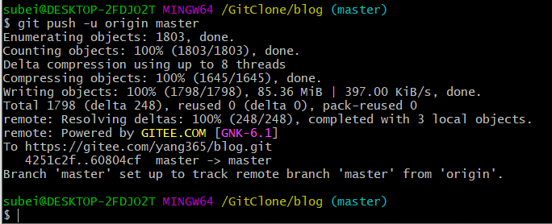

- 注：远程库的名字就是origin，这是Git默认的叫法，也可以改成别的。
- 把本地库的内容推送到远程，用git push命令，实际上是把当前分支master推送到远程。
- 由于远程库是空的，我们第一次推送master分支时，加上了-u参数，Git不但会把本地的master分支内容推送的远程新的master分支，还会把本地的master分支和远程的master分支关联起来，在以后的推送或者拉取时就可以简化命令，`git push origin master` 就行。
- 要查看远程库的信息 使用 `git remote`；
- 它会列出你指定的每一个远程服务器的简写。 如果你已经克隆了自己的仓库，那么至少应该能看到 origin——这是 Git 给你克隆的仓库服务器的默认名字。
- 要查看远程库的详细信息 使用 `git remote –v` 会显示需要读写远程仓库使用的 Git 保存的简写与其对应的 URL，如果你的远程仓库不止一个，该命令会将它们全部列出。

OK，下面我们去看下代码是不是被添加上来了~


> 解决使用git出现：The file will have its original line endings in your working directory

```powershell
# 执行以下命令即可解决

git rm -r --cached .

git config core.autocrlf false

git add .

# . 代表当前目录
```

## 8.IDEA集成Git

1. 新建项目，绑定git。

   1. 将远程git文件目录拷贝到项目中即可！

   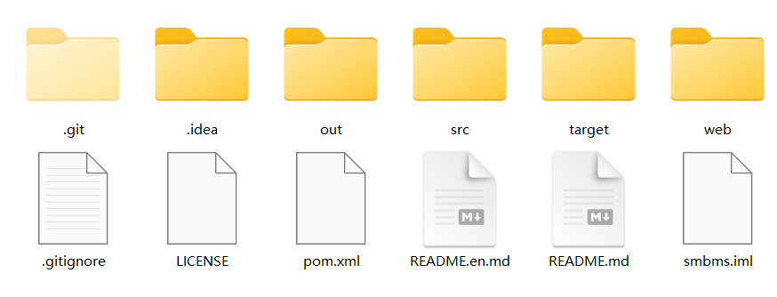

   2. 刷新IDEA项目，如下图即为成功。

   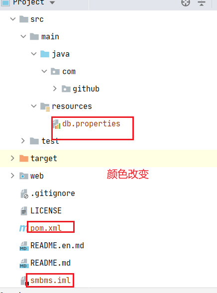

2. 修改文件，使用IDEA操作git。

   - 添加到暂存区

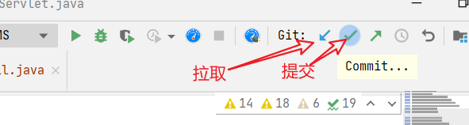

- Commit提交

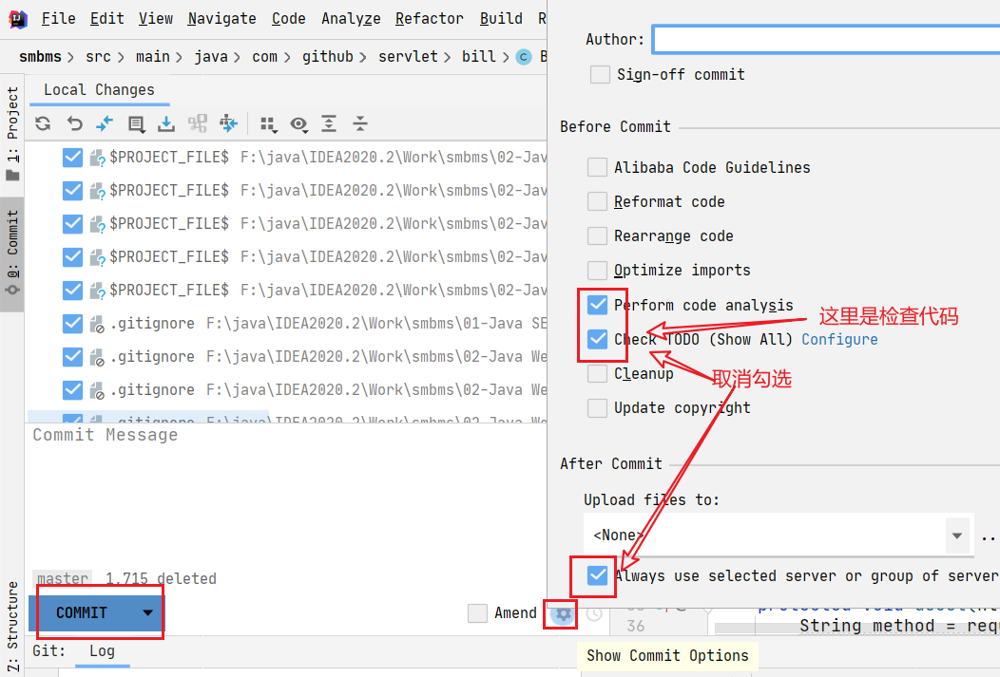


- push到远程

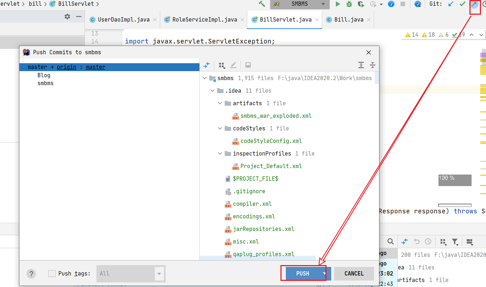

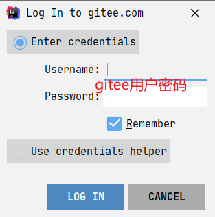

1. 提交测试。

## 9.Git分支

  分支在GIT中相对较难，分支就是科幻电影里面的平行宇宙，如果两个平行宇宙互不干扰，那对现在的你也没啥影响。不过，在某个时间点，两个平行宇宙合并了，我们就需要处理一些问题了！

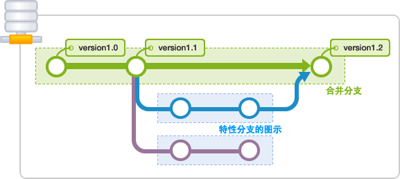

```powershell
# 列出所有本地分支
git branch
    
# 列出所有远程分支
git branch -r
    
# 新建一个分支，但依然停留在当前分支
git branch [branch-name]
    
# 新建一个分支，并切换到该分支
git checkout -b [branch]
    
# 合并指定分支到当前分支
$ git merge [branch]
    
# 删除分支
$ git branch -d [branch-name]
    
# 删除远程分支
$ git push origin --delete [branch-name]
$ git branch -dr [remote/branch]
```

  如果同一个文件在合并分支时都被修改了则会引起冲突：解决的办法是我们可以修改冲突文件后重新提交！
  master主分支应该非常稳定，用来发布新版本，一般情况下不允许在上面工作，工作一般情况下在新建的dev分支上工作，工作完后，比如上要发布，或者说dev分支代码稳定后可以合并到主分支master上来。


