# Nginx快速入门

> 在低并发的情况下，一个jar包启动应用就够了，然后内部tomcat返回内容给用户。


- 随着用户越来越多了，并发量慢慢增大了，此时一台服务器满足不了需求了。

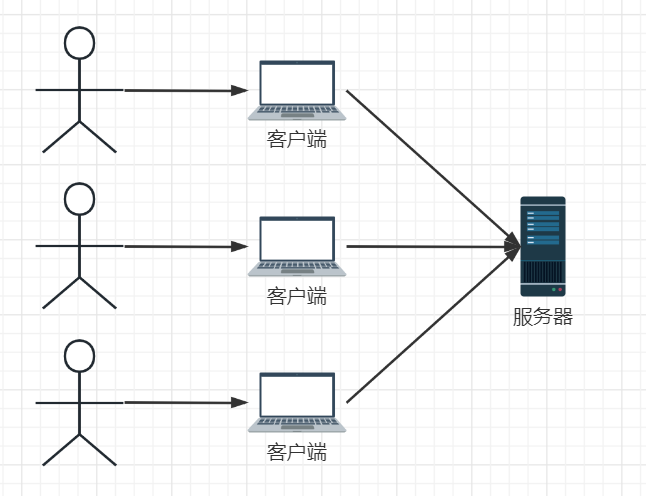

- 于是进行横向扩展，又增加了服务器。这个时候几个项目启动在不同的服务器上，用户要访问，就需要增加一个代理服务器了，通过代理服务器来帮开发者转发和处理请求。

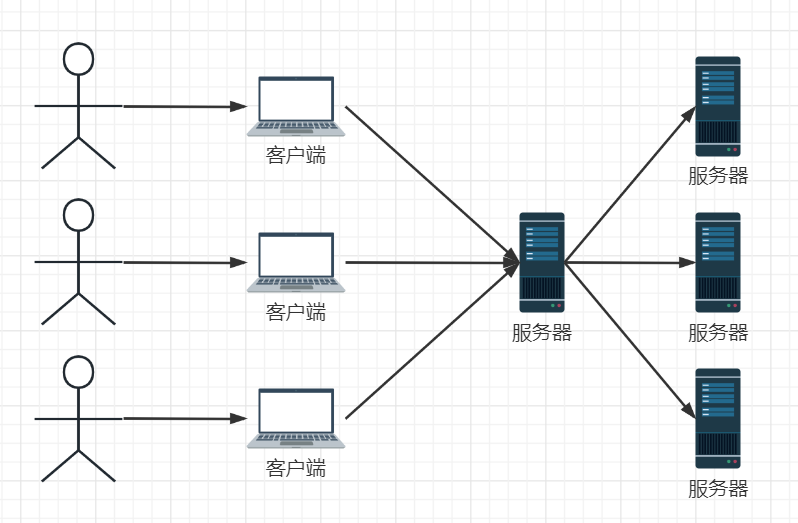

- 开发者希望这个代理服务器可以帮助开发者接收用户的请求，然后将用户的请求按照规则帮开发者转发到不同的服务器节点之上。这个过程用户是无感知的，用户并不知道是哪个服务器返回的结果，开发者还希望他可以按照服务器的性能提供不同的权重选择。保证最佳体验！所以需要使用Nginx。

## 1.什么是Nginx？

Nginx (engine x) 是一个高性能的HTTP和反向代理web服务器，同时也提供了IMAP/POP3/SMTP服务。Nginx是由伊戈尔·赛索耶夫为俄罗斯访问量第二的Rambler.ru站点（俄文：Рамблер）开发的，第一个公开版本0.1.0发布于2004年10月4日。2011年6月1日，nginx 1.0.4发布。

其特点是占有内存少，并发能力强，事实上nginx的并发能力在同类型的网页服务器中表现较好，中国大陆使用nginx网站用户有：百度、京东、新浪、网易、腾讯、淘宝等。在全球活跃的网站中有12.18%的使用比率，大约为2220万个网站。

Nginx 是一个安装非常的简单、配置文件非常简洁（还能够支持perl语法）、Bug非常少的服务。Nginx 启动特别容易，并且几乎可以做到7*24不间断运行，即使运行数个月也不需要重新启动。你还能够不间断服务的情况下进行软件版本的升级。

Nginx代码完全用C语言从头写成。官方数据测试表明能够支持高达 50,000 个并发连接数的响应。

## 2.Nginx作用？

> Http代理，反向代理：作为web服务器最常用的功能之一，尤其是反向代理。

- 正向代理
  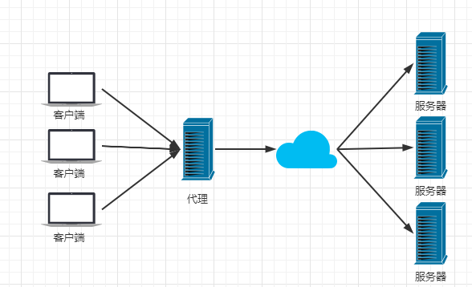

- 反向代理
  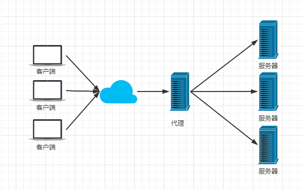

> Nginx提供的负载均衡策略有2种：内置策略和扩展策略。内置策略为轮询，加权轮询，Ip hash。扩展策略，就天马行空，只有你想不到的没有他做不到的。

- 轮询
  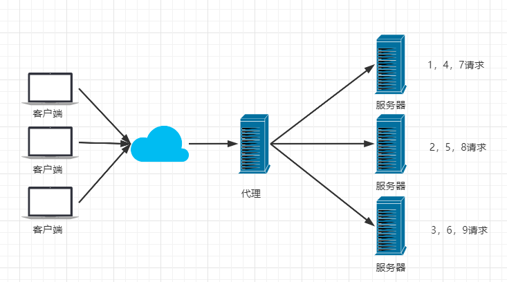

- 加权轮询
  

- iphash对客户端请求的ip进行hash操作，然后根据hash结果将同一个客户端ip的请求分发给同一台服务器进行处理，可以解决session不共享的问题。
  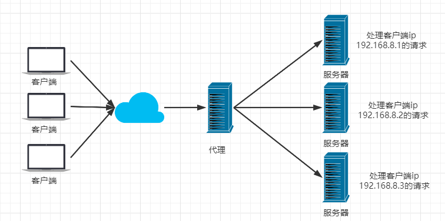

> 动静分离，在日常的软件开发中，有些请求是需要后台处理的，有些请求是不需要经过后台处理的（如：css、html、jpg、js等等文件），这些不需要经过后台处理的文件称为静态文件。让动态网站里的动态网页根据一定规则把不变的资源和经常变的资源区分开来，动静资源做好了拆分以后，开发者就可以根据静态资源的特点将其做缓存操作。提高资源响应的速度。

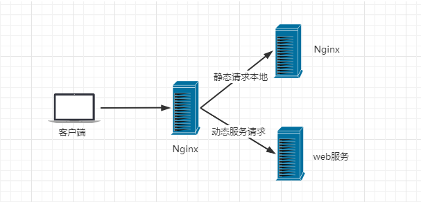

目前，通过使用Nginx大大提高了网站的响应速度，优化了用户体验，让网站的健壮性更上一层楼！

## 3.Nginx的安装

### 1.windows下安装

**1、下载nginx**

- [http://nginx.org/en/download.html](http://nginx.org/en/download.html)下载稳定版本。
- 个人网盘地址链接：[https://pan.baidu.com/s/1N2y01sWyxos34989csRQ9Q?pwd=y3zc](https://pan.baidu.com/s/1N2y01sWyxos34989csRQ9Q?pwd=y3zc ) 
- 以nginx/Windows-1.22.1为例，直接下载 nginx-1.22.1.zip。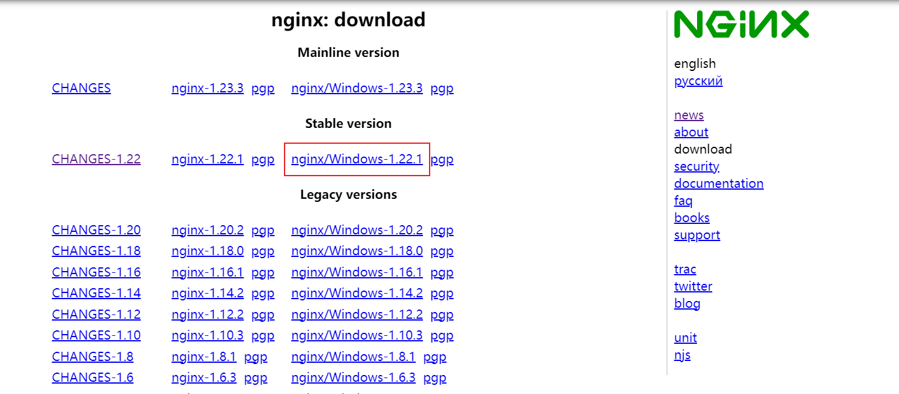
- 下载后解压，解压后如下：

**2、启动nginx**

- 有很多种方法启动nginx；

- (1)直接双击nginx.exe，双击后一个黑色的弹窗一闪而过。

- (2)打开cmd命令窗口，切换到nginx解压目录下，输入命令 `nginx.exe`，回车即可。

**3、检查nginx是否启动成功**

- 直接在浏览器地址栏输入网址 [http://localhost:80](http://localhost/) 回车，出现以下页面说明启动成功！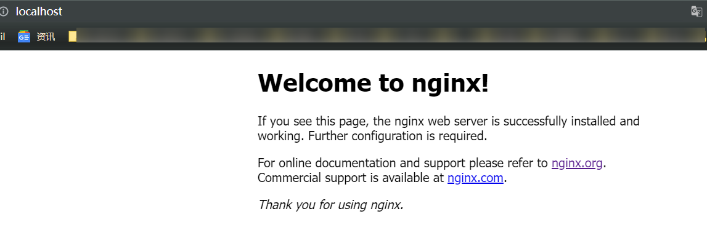

**4、配置监听**

- nginx的配置文件是conf目录下的nginx.conf，默认配置的nginx监听的端口为80，如果80端口被占用可以修改为未被占用的端口即可。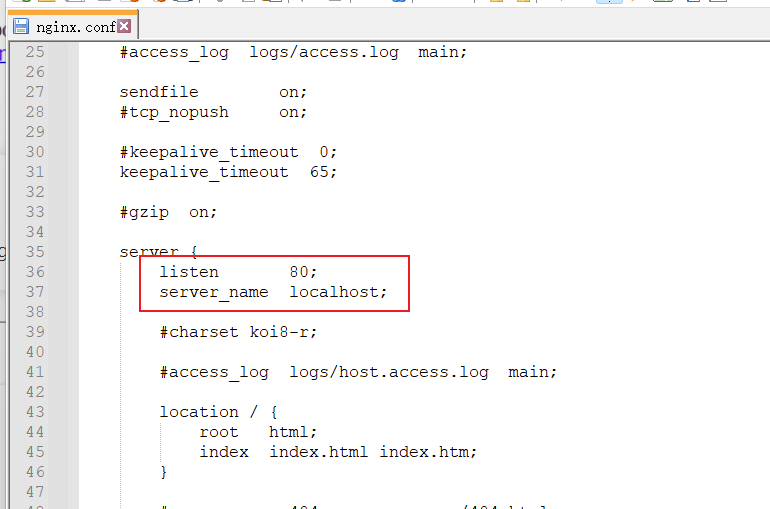

- 当我们修改了nginx的配置文件nginx.conf 时，不需要关闭nginx后重新启动nginx，只需要执行命令 `nginx -s reload` 即可让改动生效。

**5、关闭nginx**

- 如果使用cmd命令窗口启动nginx， 关闭cmd窗口是不能结束nginx进程的，可使用两种方法关闭nginx。
- (1)输入nginx命令 `nginx -s stop`(快速停止nginx) 或 `nginx -s quit`(完整有序的停止nginx)。
- (2)使用taskkill `taskkill /f /t /im nginx.exe`

```shell
taskkill是用来终止进程的。
/f是强制终止。
/t终止指定的进程和任何由此启动的子进程。
/im示指定的进程名称。
```

### 2.linux下安装

**1、安装gcc**

- 安装 nginx 需要先将官网下载的源码进行编译，编译依赖 gcc 环境，如果没有 gcc 环境，则需要安装：

```yaml
yum install gcc-c++
```

**2、PCRE pcre-devel 安装**

- PCRE(Perl Compatible Regular Expressions) 是一个Perl库，包括 perl 兼容的正则表达式库。nginx 的 http 模块使用 pcre 来解析正则表达式，所以需要在 linux 上安装 pcre 库，pcre-devel 是使用 pcre 开发的一个二次开发库。nginx也需要此库。命令：

```yaml
yum install -y pcre pcre-devel
```

**3、zlib 安装**

- zlib 库提供了很多种压缩和解压缩的方式， nginx 使用 zlib 对 http 包的内容进行 gzip ，所以需要在 Centos 上安装 zlib 库。

```yaml
yum install -y zlib zlib-devel
```

**4、OpenSSL 安装**

- OpenSSL 是一个强大的安全套接字层密码库，囊括主要的密码算法、常用的密钥和证书封装管理功能及 SSL 协议，并提供丰富的应用程序供测试或其它目的使用。
- nginx 不仅支持 http 协议，还支持 https（即在ssl协议上传输http），所以需要在 Centos 安装 OpenSSL 库。

```yaml
yum install -y openssl openssl-devel
```

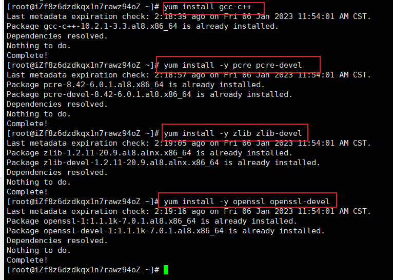

**5、下载安装包**

- 手动下载.tar.gz安装包，地址：[https://nginx.org/en/download.html](https://nginx.org/en/download.html)

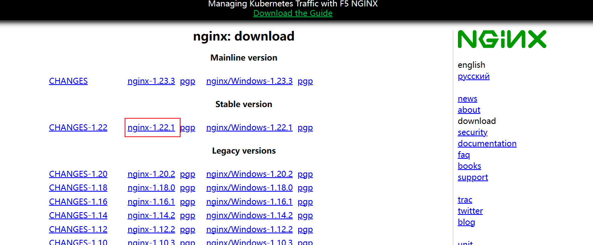

- 个人网盘地址链接：[https://pan.baidu.com/s/1TYloJ0Y5TvmOB5__0c__Ww?pwd=dxx3](https://pan.baidu.com/s/1TYloJ0Y5TvmOB5__0c__Ww?pwd=dxx3) 

- 下载完毕上传到服务器上 /root。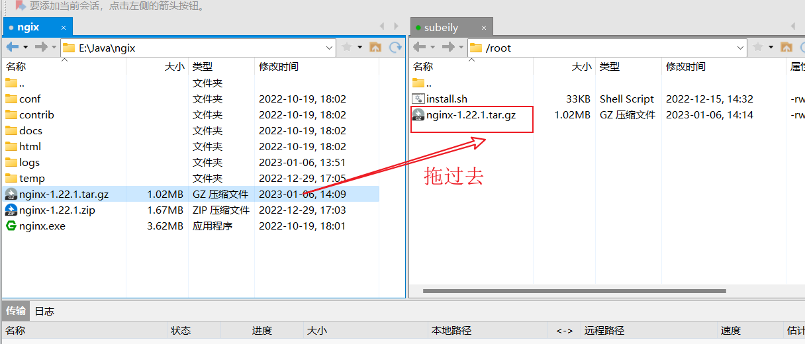

**6、解压**

```shell
tar -zxvf nginx-1.22.1.tar.gz
cd nginx-1.22.1/
ll
```

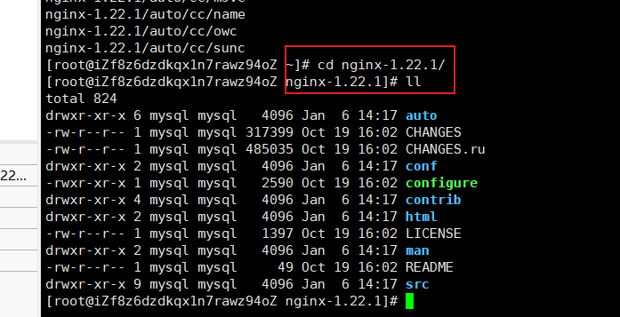

**7、配置**

- 使用默认配置，在nginx根目录下执行。

```shell
./configure # 进行配置，目的是为了创建makefile文件
make	# make编译
make install # 安装
```

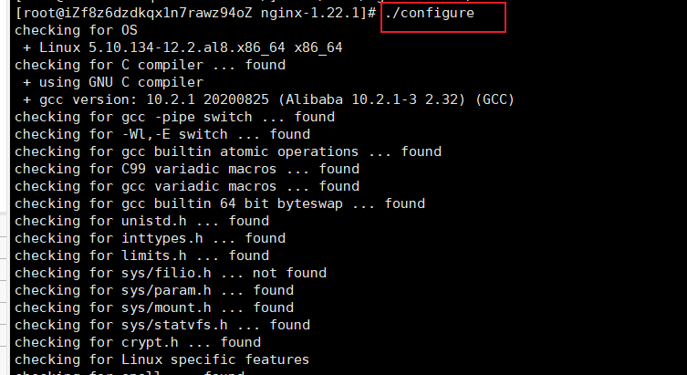

- 查找安装路径： `whereis nginx`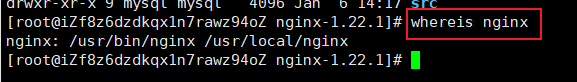

### 3.Nginx常用命令

```shell
cd /usr/local/nginx/sbin/
./nginx  启动
./nginx -s stop  停止
./nginx -s quit  安全退出
./nginx -s reload  重新加载配置文件
ps aux|grep nginx  查看nginx进程
```

- 启动成功访问，服务器ip:80

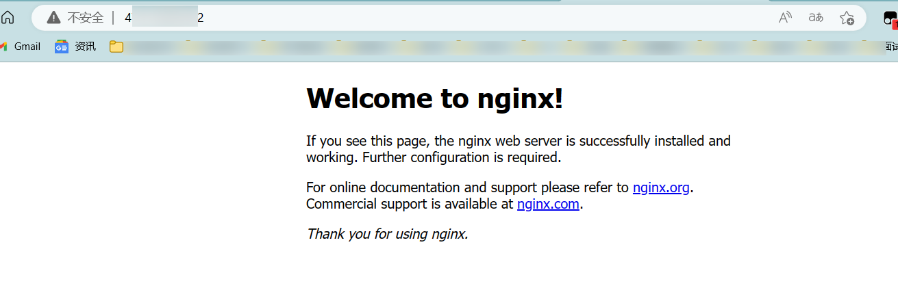

> 报错nginx: [emerg] bind() to 0.0.0.0:80 failed (98: Address already in use)解决方法

- 方法一 

  ```shell
  fuser -k 80/tcp
  ```

  - 将进程杀死后，启动nginx。

  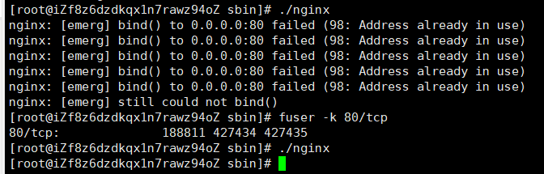

- 方法二

  ```shell
  [root@localhost /]#ps -A | grep nginx 
  [root@localhost /]#kill -9 pid1
  [root@localhost /]#kill -9 pid2
  ```

  - 将进程杀死后，启动nginx。

------

- 注意：==如何连接不上，检查阿里云安全组是否开放端口，或者服务器防火墙是否开放端口==！
- 相关命令：

```shell
# 开启
service firewalld start
# 重启
service firewalld restart
# 关闭
service firewalld stop
# 查看防火墙规则
firewall-cmd --list-all
# 查询端口是否开放
firewall-cmd --query-port=8080/tcp
# 开放80端口
firewall-cmd --permanent --add-port=80/tcp
# 移除端口
firewall-cmd --permanent --remove-port=8080/tcp
#重启防火墙(修改配置后要重启防火墙)
firewall-cmd --reload
# 参数解释
1、firwall-cmd：是Linux提供的操作firewall的一个工具；
2、--permanent：表示设置为持久；
3、--add-port：标识添加的端口；
```

## 4.演示

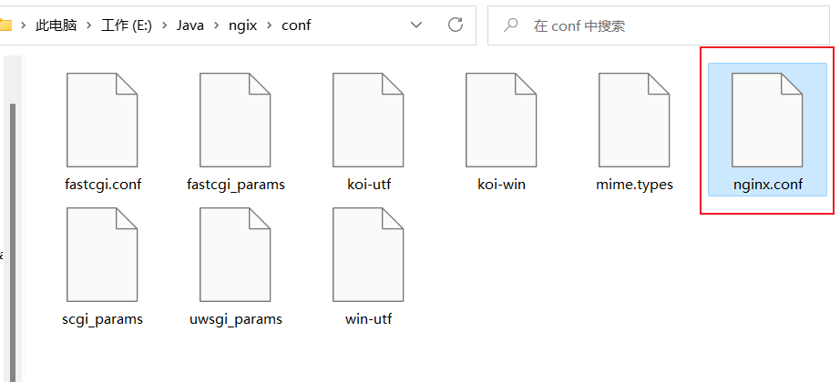

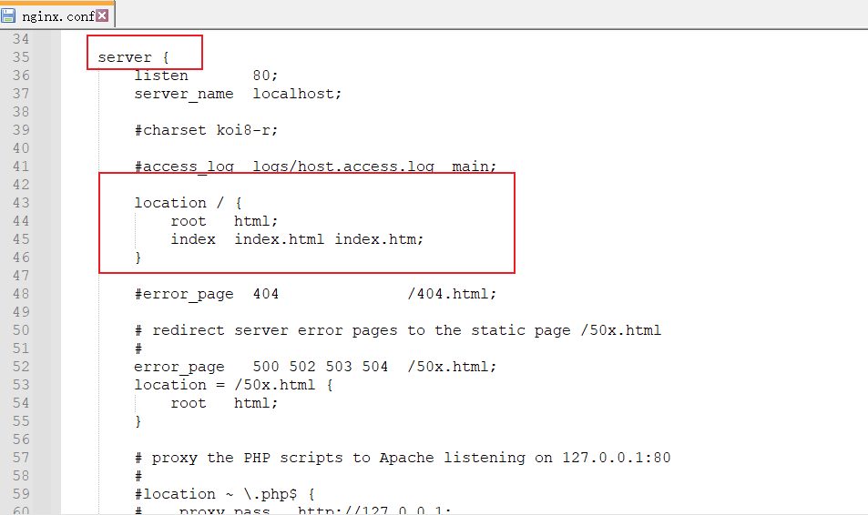

- 主要是在server这里配置需要的即可。
- 案例：

```shell
upstream lb{
    server 127.0.0.1:8080 weight=1;
    server 127.0.0.1:8081 weight=1;
}
location / {
    proxy_pass http://lb;
}
```

# 🎉结束🎉