# 服务器的环境搭建

## 1.服务器相关

> 程序员都需要一个自己的服务器!

1. 用于发布自己的网站和项目！
2. 用于操作系统的练习！
3. 将自己的远程仓库、远程数据库、远程tomcat..... 搭建在服务器上！
4. 用于Linux进行任意的环境部署操作！

> 服务器如何购买

==若果你没超过24岁==，你还可以买到免费的练习学生机，**具体方法**：阿里云搜索==学生机==即可。

- 链接地址：[https://developer.aliyun.com/plan/student](https://developer.aliyun.com/plan/student)

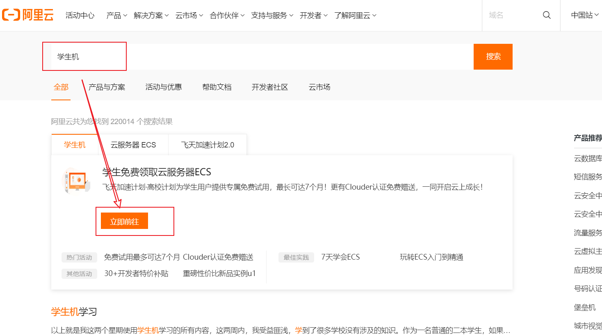


- 具体自行按步骤操作执行，即可免费获得一台自己的服务器。

> **买完服务器之后，按照如下步骤链接服务器！**

## 2.阿里云服务器使用xshell连接

下载安装xmanager软件到本地电脑。

- 下载地址：[https://www.ghxi.com/xmanagerpowersuite.html](https://www.ghxi.com/xmanagerpowersuite.html)
- 也可以自行百度官网下载！

> 阿里云服务器使用xshell连接

1. 登录阿里云控制台。找到**实例**，切到**阿里云服务器所在地址**。

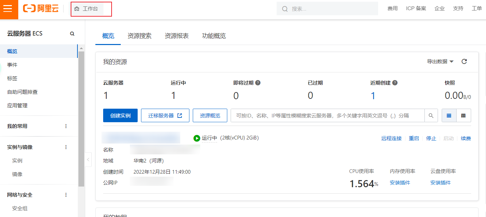

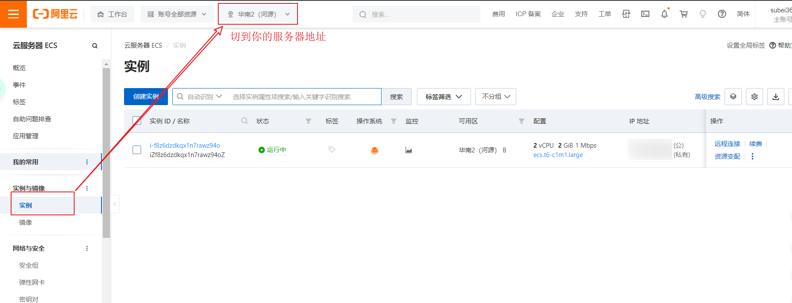

2. 复制你的**公网IP**，将来远程连接时需要使用；设置远程连接的密码，用户名默认**root**（中间需要使用支付宝认证，只需要使用手机支付宝扫描一下二维码即可）。

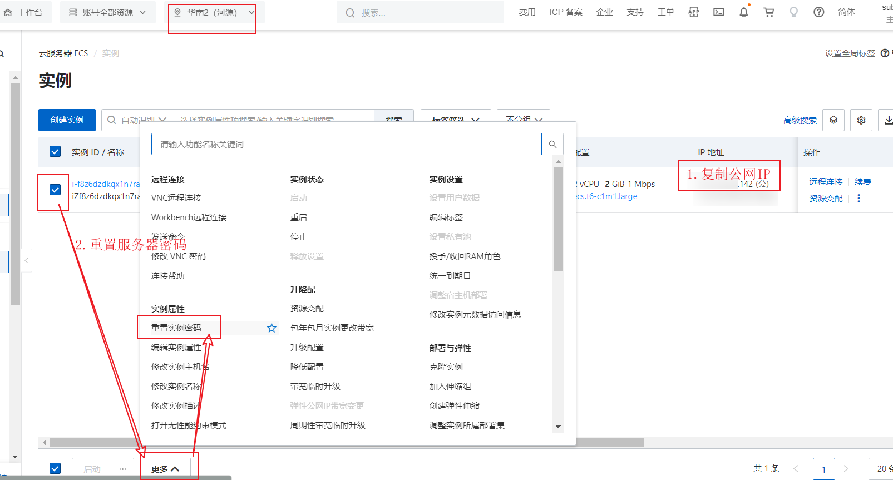

注意：==重置哪个服务器的密码，就选哪个，不要多选择==！！！！


3. 启动xshll远程连接阿里云服务器！

- 点击xshell文件-新建；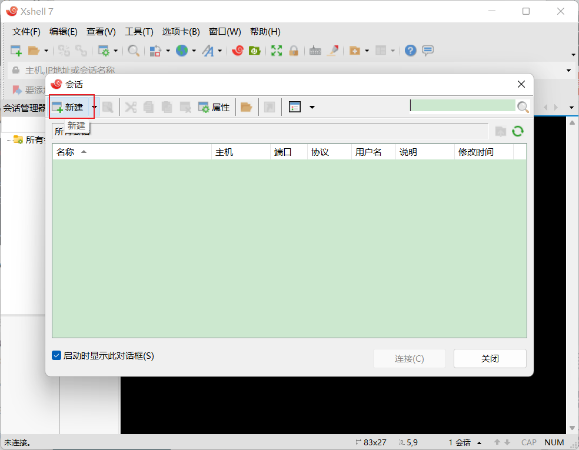
- 输入基本信息：名称（自己定义名字即可）主机（公网IP）连接，点击连接即可，此时会让你输入密码（密码就是上面重置的实例密码）

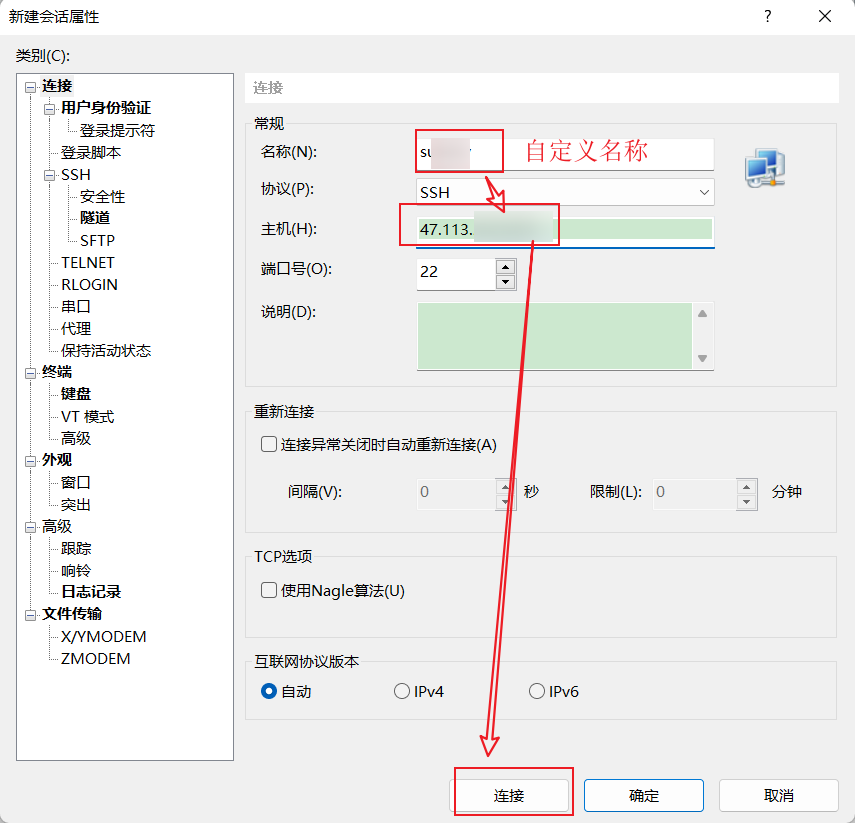

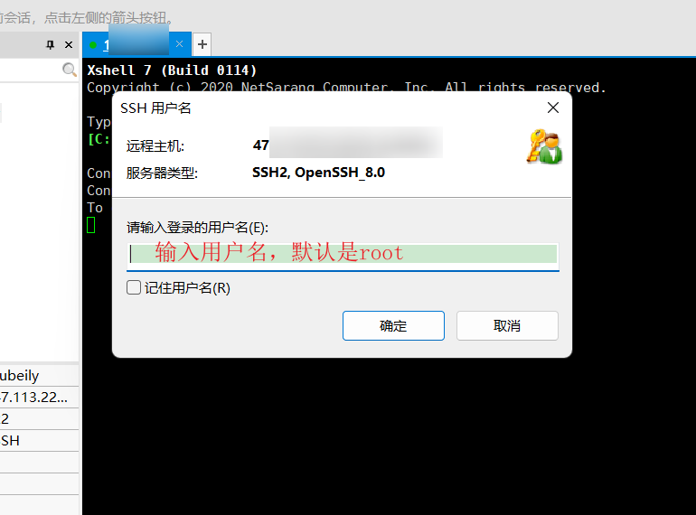

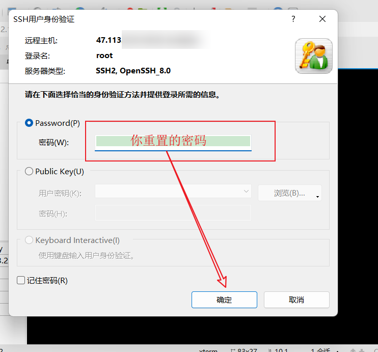

4. 至此xshell连接阿里云服务器完毕！

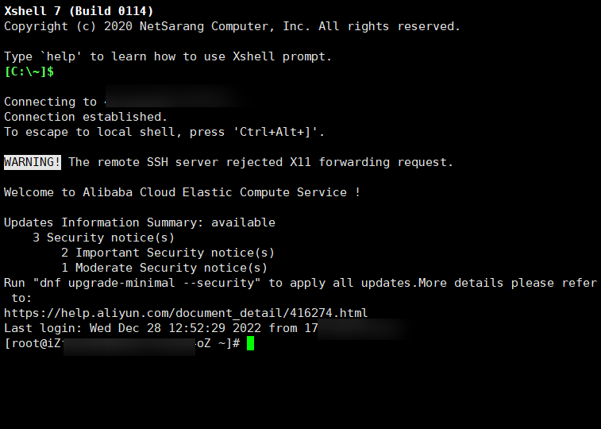

## 3.搭建环境

### 1.傻瓜式（宝塔面板）

- 宝塔面板安装教学：[https://www.bt.cn/bbs/thread-19376-1-1.html](https://www.bt.cn/bbs/thread-19376-1-1.html)

- **Centos安装命令：**

```shell
yum install -y wget && wget -O install.sh https://download.bt.cn/install/install_6.0.sh && sh install.sh 12f2c1d72
```

- 在安装期间，可以进行，按照教程进行端口打开。**以下主机商必看（开端口教程，不开不能用）：**

  - 腾讯云：https://www.bt.cn/bbs/thread-1229-1-1.html

  - 阿里云：https://www.bt.cn/bbs/thread-2897-1-1.html

  - 华为云：https://www.bt.cn/bbs/thread-3923-1-1.html

- 个人使用的是阿里云，需放行如下端口：

  - ==29485端口==
  - 8888端口
  - 20 、21、 39000-40000端口（linux 系统 ），3000-4000（windows系统）
  - 22 (SSH)
  - 80、443（网站及SSL）
  - 3306 （数据库远程连接）
  - 888 （phpmyadmin）

  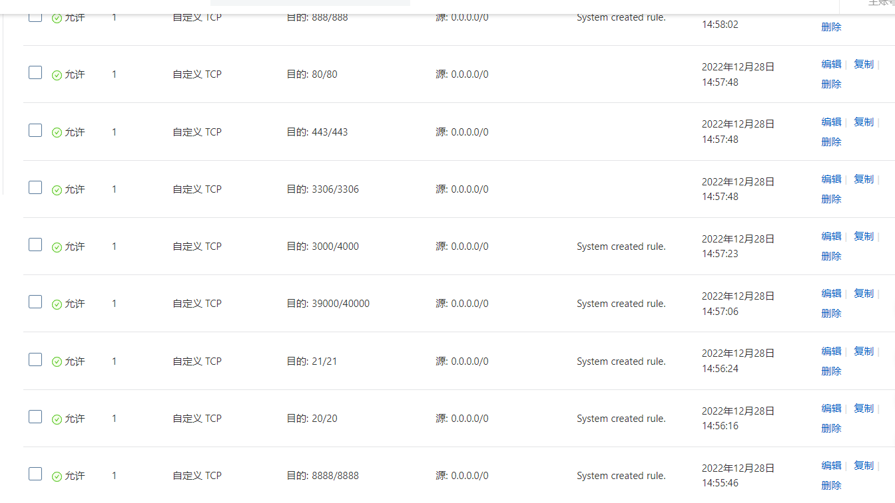

- 下载完毕之后，就可以得到一个地址：宝塔的管理面板！

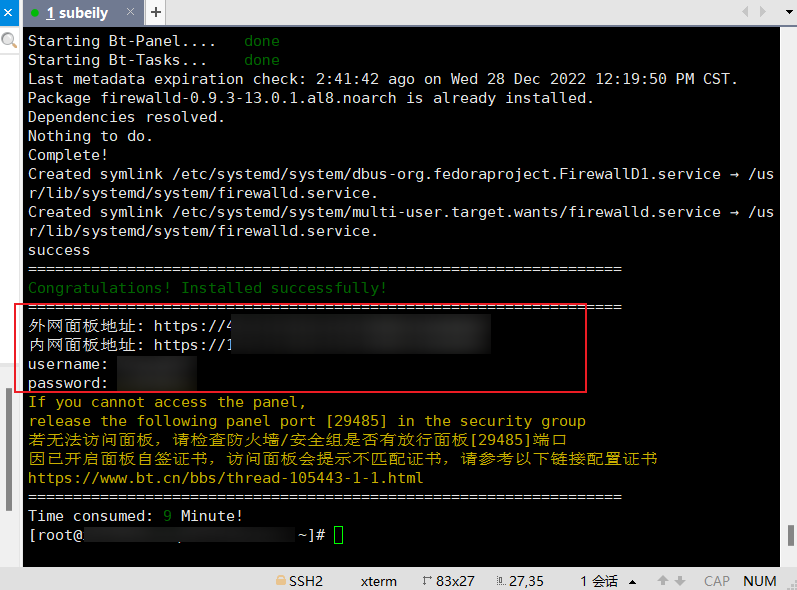

- 登录外网地址，输入用户名，密码：

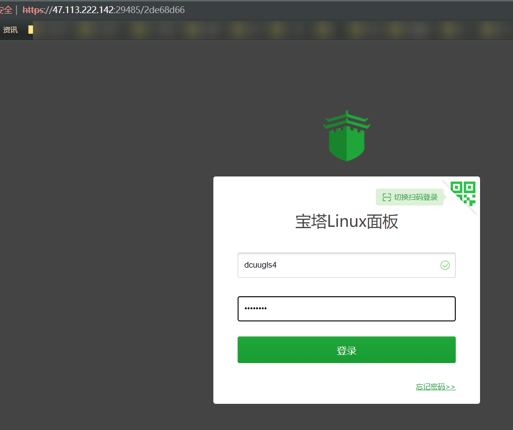

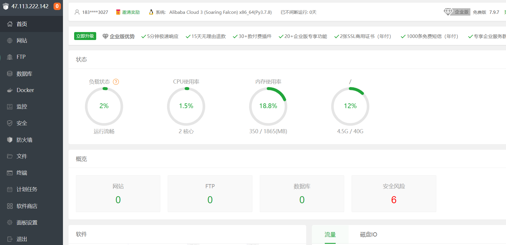

> 自定义安装服务器环境

- 可以安装个人的MySQL、nginx、tomcat、apache、redis版本即可。

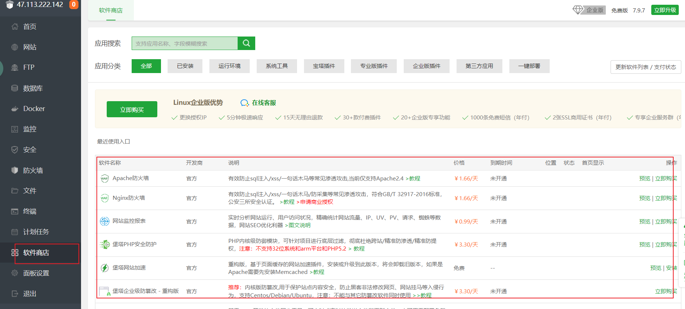

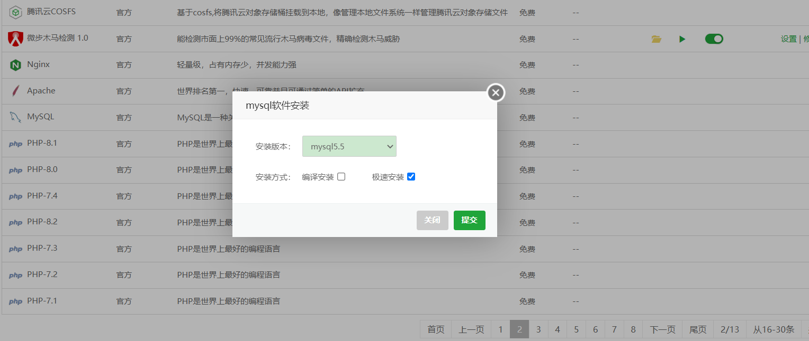

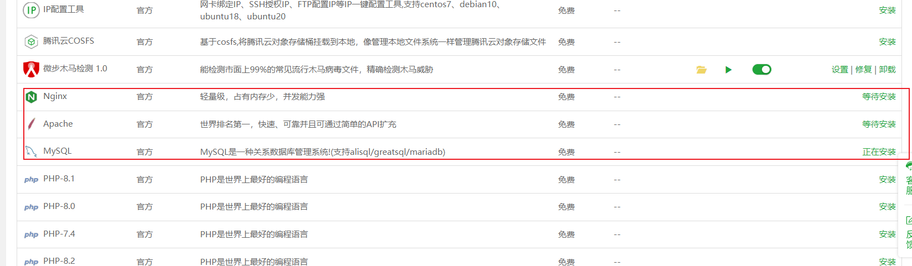

- 若安装错误，即可点击右边的==等待安装==按钮，进入消息，选择要删除的软件，进行删除，重新安装，若安装完成，点击卸载或设置即可。

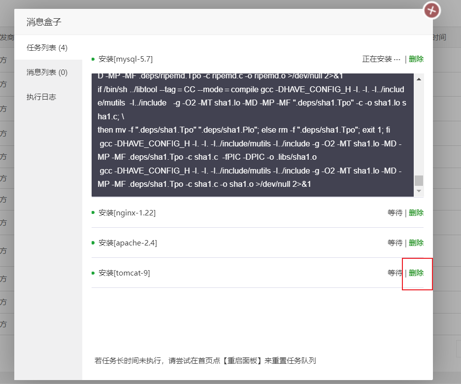

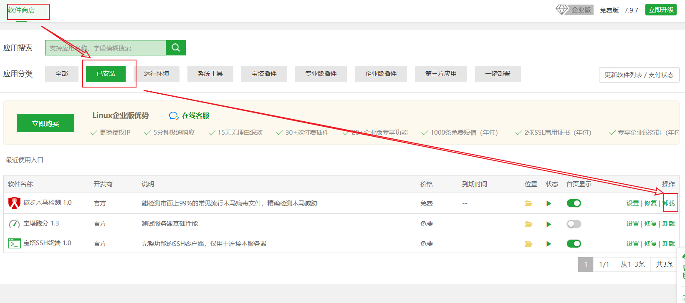

> 一键部署应用

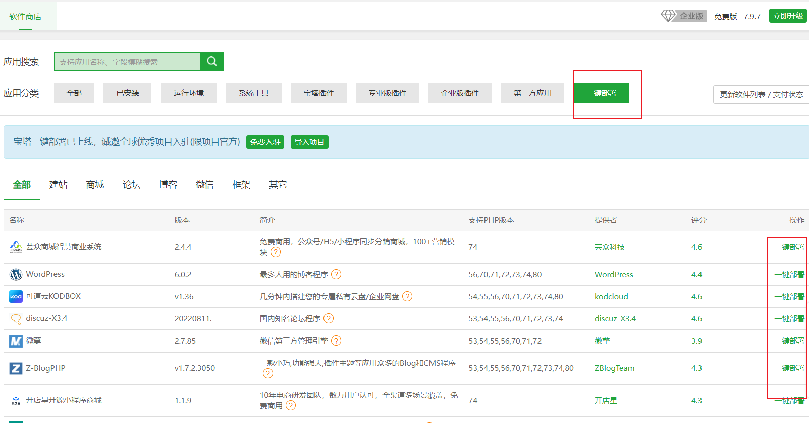

> 端口开启


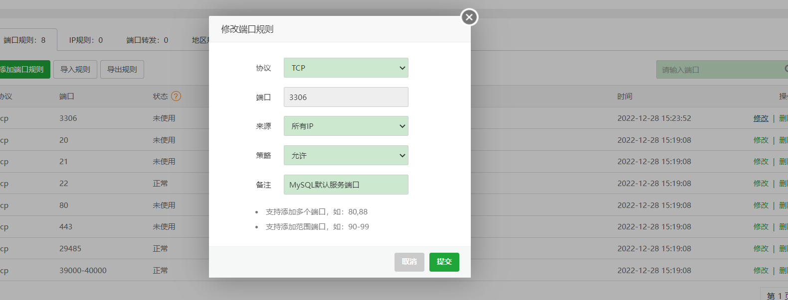

> 项目放入网站进行访问！

- 比如tomcat 就直接放到 webapps 目录下！
- 特殊的网站：开源项目，就按照个人操作来！
- ==注：上传文件尽量使用 XFTP==！

> ==网站如果访问测试失败，一定是防火墙出问题了，（原因①：Linux服务器，原因②：阿里云安全组面板！）==

- war 直接丢到 tomcat 即可；
- jar 直接用 `java -jar` 执行即可访问；

### 2.命令式(原生)

> 具体参考：从零入门Linux！

# 🎉结束🎉


