# Java SE基础

## 计算机预科

### 1.打开CMD的方式

1. 开始 + 系统 + 命令提示符。
2. Win + R 输入 CMD 打开控制台 (推荐使用)。
3. 在任意文件夹下，按住Shift键 + 鼠标右键打开命令行窗口。
4. 在资源管理器的地址栏前加上 CMD 路径。

### 2.管理员身份运行方式

- 选择以管理员方式运行。

### 3.常见的Dos命令

1. 盘符切换

   ```c
   C:\Users\subei>D
   'D' 不是内部或外部命令，也不是可运行的程序
   或批处理文件。
   
   C:\Users\subei>D:
   
   D:\>C:
   
   C:\Users\subei>F:
   
   F:\>
   ```

2. 查看当前盘符目录下的全部目录：dir

   ```c
   F:\>dir
    驱动器 F 中的卷是 工作台
    卷的序列号是 1714-20F6
   
    F:\ 的目录
   
   2021/05/17  16:15    <DIR>          BaiduNetdiskDownload
   2021/05/15  19:50    <DIR>          CloudMusic
   2021/05/14  21:19    <DIR>          Dev-Cpp
   2021/05/14  16:56    <DIR>          DTL8Folder
   2021/05/14  22:35    <DIR>          HBuilderX
   2021/05/14  22:36    <DIR>          java
   2021/05/14  17:00    <DIR>          MyDrivers
   2021/05/14  22:47    <DIR>          Notepad++
   2021/05/14  22:29    <DIR>          Sublime Text 3
   2021/05/14  18:56    <DIR>          Typora
   2021/05/17  17:53    <DIR>          VCW
   2021/05/14  21:25    <DIR>          VS2017
   2021/05/14  21:47    <DIR>          Windows Kits
                  0 个文件              0 字节
                 13 个目录 663,783,088,128 可用字节
   
   F:\>E:
   
   E:\>dir
    驱动器 E 中的卷是 数据
    卷的序列号是 3F12-1129
   
    E:\ 的目录
   
   2020/06/04  07:47       610,571,366 AI教程超级合辑.zip
   2021/05/14  13:44    <DIR>          java
   2021/05/14  21:47    <DIR>          NUT
   2021/05/14  13:45    <DIR>          Office Tool
   2021/05/05  15:18        69,730,999 Office-Tool-with-runtime-v8.1.zip
   2021/05/11  17:26    <DIR>          作业
   2021/05/14  23:15    <DIR>          工具
   2021/05/14  13:38    <DIR>          论文
   2020/10/21  21:58         1,000,218 狂神说Java全栈学习路线.jpg
                  3 个文件    681,302,583 字节
                  6 个目录 605,834,113,024 可用字节
   
   E:\>
   ```

3. 切换目录：cd change directory

   ```c
   E:\>cd /d d:
   
   d:\>cd /d d:\leven
   
   d:\LEVEN>cd ..
   
   d:\>
   ```

4. 返回上一级：cd ..

5. 清理屏幕： cls

6. 退出终端：exit

7. 查看电脑IP信息：ipconfig

8. 打开计算机：calc

9. 打开画图：mspaint

10. 打开记事本：notepad

11. ping命令：ping 网址

12. 文件操作

    ```c
    C:\Users\subei\Desktop>md test
    
    C:\Users\subei\Desktop>cd test
    
    C:\Users\subei\Desktop\test>cd>a.txt
    
    C:\Users\subei\Desktop\test>
    ```

13. 删除文件

    ```c
    C:\Users\subei\Desktop\test>del a.txt
    
    C:\Users\subei\Desktop\test>cd ..
    
    C:\Users\subei\Desktop>rd test
    
    C:\Users\subei\Desktop>
    ```

## 基础

### 1.Java简介

- java的特性和优势
  - 简单性
  - 面向对象
  - 可移植性
  - 高性能
  - 分布式
  - 动态性
  - 多线程
  - 安全性
  - 健壮性

- Java的三大版本
  - JavaSE：标准版（桌面程序，控制台开发……）
  - JavaME：嵌入式开发（手机、小家电……）
  - JavaEE：E企业级开发（Web端、服务器开发……）
- Java安装与卸载开发环境
  - [卸载JDK](https://blog.csdn.net/u010251897/article/details/106664640)
    - 删除Java安装目录；
    - 删除JAVA_HOME；
    - 删除path下关于java的目录；
    - java -version验证。
  - 下载路径：[地址](https://www.oracle.com/java/technologies/javase-downloads.html)
  - 安装教程：[传送门](https://blog.csdn.net/weixin_42132352/article/details/114348838)
    - 官网下载JDK8(选择JDK8,比较稳定)；
    - 安装JDK，步骤如上==传送门==。

### 2.Hello World

- Hello World

  1. 随便新建一个文件夹，存放代码。

  2. 新建一个Java文件

     1. 文件后缀名为.java
     2. Hello.java
     3. 注意：系统可能没有文件的后缀名，需手动打开显示文件后缀名。

  3. 编写代码

     ```java
     public class Hello {
     
     	public static void main(String[] args) {
     		System.out.println("Hello World!Java!");
     	}
     
     }
     ```

  4. 编译javac.java文件，会生成一个class文件！

  5. 运行class文件，java class文件。

     

- 可能会遇到的问题

  1. 每个单词的大小不能出现问题，==Java是大小写敏感的==；
  2. 尽量使用英文；
  3. 文件名和类名必须保证一致，并且首字母大写；
  4. 符号使用的了中文。

- Java运行机制

  - 编译型
  - 解释型

- IDEA2020.2安装

  - [传送门](https://www.jb51.net/article/194557.htm)
  
- Java中的注释有三种：

  - 单行注释：只能注释一行文字
  - 多行注释：可以注释一段文字
  - 文档注释

```java
/**
 * @author subeiLY
 * @create 2021-05-23 21:21
 */
public class Hello {
    // 单行注释

    /*
    多行注释
     */

    /**
     * 文档注释
     * @param args
     */
    public static void main(String[] args) {
        // 输出一个Hello World!
        System.out.println("Hello World!");
    }

    /**
     *    有趣的代码注释                            _(\_/)
     *                              ,((((^`\
     *                             ((((  (6 \
     *                           ,((((( ,    \
     *       ,,,_              ,(((((  /"._  ,`,
     *      ((((\\ ,...       ,((((   /    `-.-'
     *      )))  ;'    `"'"'""((((   (
     *     (((  /            (((      \
     *      )) |                      |
     *     ((  |        .       '     |
     *     ))  \     _ '      `t   ,.')
     *     (   |   y;- -,-""'"-.\   \/
     *     )   / ./  ) /         `\  \
     *        |./   ( (           / /'
     *        ||     \\          //'|
     *        ||      \\       _//'||
     *        ||       ))     |_/  ||
     *        \_\     |_/          ||
     *        `'"                  \_\
     *                             `'"
     *
     */
}
```

### 3.标识符与关键字

- 标识符
  - 所有的标识符都应该以字母(A-Z 或者 a-z)，美元符($)，或者下划线(_)开始；
  - 首字符之后可以是字母（A-Z 或者 a-z）美元符（$）、下划线（）或数字的任何字符组合；
  - 不能使用关键字作为变量名或方法名；
  - 标识符是大小写敏感的；
  - 可以使用中文命名，但是一般不建议这样去使用，也不建议使用拼音。

```java
/**
 * @author subeiLY
 * @create 2021-05-24 18:36
 */
public class Demo01 {
    public static void main(String[] args) {

        String Ahello = "subeiLY";
        String hello = "subeiLY";
        String $hello = "subeiLY";
        String _hello = "subeiLY";

        String _vvhh = "subeiLY";
        String 王者荣耀 = "subeiLY";
        
    }
}
```

- 关键字

| abstract  | boolean    | break        | byte       | case     |
| --------- | ---------- | ------------ | ---------- | -------- |
| catch     | char       | const        | class      | continue |
| default   | do         | double       | else       | extends  |
| final     | finally    | float        | for        | goto     |
| if        | implements | import       | instanceof | int      |
| interface | long       | native       | new        | package  |
| private   | protected  | public       | return     | short    |
| static    | strictfp   | super        | switch     | this     |
| throw     | throws     | transient    | try        | void     |
| volatile  | while      | synchronized |            |          |

### 4.数据类型

- 强类型语言
  - 要求变量的使用要严格符合规定，所有变量都必须先定义后才能使用。
- 弱类型语言
- 数据类型基本分类
  - 基本类型
    - 数值类型
      - 整数类型
        - byte占1字节，范围：-128 - 127
        - short占2字节，范围： **-2^15** -  **2^15-1** 
        - int占4字节，范围： **-2^31** -  **2^31 - 1** 
        - long占8字节，范围： **-2^63** -  **2^63-1**
      - 浮点类型
        - float占4字节
        - double占8字节
      - 字符类型：char占2字节
    - boolean类型：占1位其值只有tue和fase两个。
  - 引用类型
    - 类
    - 接口
    - 数组

```java
/**
 * @author subeiLY
 * @create 2021-05-24 19:06
 */
public class Demo02 {
    public static void main(String[] args) {
        // 八大基本数据类型
        
        // 整数
        int num1 = 10;  // 最常用
        byte num2 = 20;
        short num3 = 30;
        long num4 = 40L; // Long类型要在数字后面加L

        // 小数：浮点数
        float num5 = 50.1F; // float类型要在数字后面加F
        double num6 = 3.1415926534546246455;

        // 字符类型
        char name = 'A';

        // 字符串，String不是关键字，类
        String names = "subeiLY";

        // 布尔值
        boolean flag = true;
        boolean flag2 = false;
    }
}
```

- 什么是字节
  - 位（bit）：是计算机内部数据储存的最小单位，11001100是一个八位二进制数。
  - 字节（byte）：是计算机中数据处理的基本单位，习惯上用大写B来表示，1B（byte字节）=8bit（位）。
  - 字符：是指计算机中使用的字母、数字、字和符号。
    - 1bit表示1位
    - 1Byte表示一个字节1B=8b
    - 1024B=1KB
    - 1024KB=1M
    - 1024M=1G

> 数据类型扩展及面试题

```java
/**
 * @author subeiLY
 * @create 2021-05-25 9:17
 */
public class Demo03 {
    public static void main(String[] args) {
        // 整数拓展：    进制      二进制0b   十进制     八进制0    十六进制0x

        int i=10;
        int i2 = 010;   // 八进制0
        int i3 = 0x10;  // 十六进制0x

        System.out.println(i);  // 10
        System.out.println(i2); // 8
        System.out.println(i3); // 16

        System.out.println("-------------------------------------");
        //************************************************
        // 浮点数拓展
        // BigDecimal   数据工具类
        // float 有限     离散      舍入误差    大约  接近但不等于
        // 最好完全使用浮点数进行比较

        float f = 0.1f; // 0.1
        double d = 1.0/10;  // 0.1

        System.out.println(f==d);   // false

        float d1 = 2425444564215654564f;
        float d2 = d1 + 1;

        System.out.println(d1==d2); // true

        System.out.println("-------------------------------------");
        //************************************************
        // 字符拓展
        char c1 = 'a';
        char c2 = '中';

        System.out.println(c1);
        System.out.println((int)c1);    // 强制转换

        System.out.println(c2);
        System.out.println((int)c2);    // 强制转换

        // 所有字符的本质还是数字
        // 编码 Unicode   2字节    0 - 65536   Excel

        char c3 = '\u0061';

        System.out.println(c3); // a

        // 转义字符
        // \t   制表符
        // \n   换行
        // ......

        System.out.println("hello\tworld!");
        System.out.println("hello\nworld!");

        System.out.println("-------------------------------------");

        //
        String sa = new String("hello world");
        String sb = new String("hello world");
        System.out.println(sa==sb);     // false

        String sc = "hello world";
        String sd = "hello world";
        System.out.println(sc==sd);     // true

        // 布尔值扩展
        boolean flag = true;
        
        if(flag==true){}    // 新手
        if(flag){}      // 老油条
        
        // 代码要精简易读
    }
}
```

### 5.类型转换

- 由于Java是强类型语言，所以要进行有些运算的时候的，需要用到类型转换。

  ```java
  低 ------------------------------------------------> 高
  byte -> short -> char -> int -> long -> float -> double
  ```

- 运算中，不同类型的数据先转化为同一类型，然后进行运算。

```java
/**
 * @author subeiLY
 * @create 2021-05-25 9:45
 */
public class Demo04 {
    public static void main(String[] args) {
        int i = 128;
        byte b = (byte)i;   // 内存溢出
        double b1 = i;

        // 强制转换     (类型)变量名     高--低
        // 自动转换     低--高

        System.out.println(i);
        System.out.println(b);
        System.out.println(b1);

        /*
        注意点：
        1.不能对布尔类型转换
        2.不能将对象类型转换为不相干的类型
        3.在把高容量转换到低容量时，强制转换
        4.转换的时候可能存在内存溢出，或者精度问题！
         */

        System.out.println("++++++++++++++++++++++++++++++++++++");

        System.out.println((int)123.7);
        System.out.println((int)-45.89f);

        System.out.println("=======================");
        char a = 'a';
        int c = a+1;

        System.out.println(c);  // 98
        System.out.println((char)c);    // b

    }
}
```

- 常见问题

```java
/**
 * @author subeiLY
 * @create 2021-05-25 9:56
 */
public class Demo05 {
    public static void main(String[] args) {
        // 操作比较大时，注意溢出
        // JDK7新特性，数字之间可以用下划线分割
        int money = 10_0000_0000;
        System.out.println(money);

        int years = 20;
        int total = money*years;    //  -1474836480  计算时溢出
        System.out.println(total);

        long total2 = money*years;
        System.out.println(total2);    // 默认是int，转换之前已经存在问题了!!!

        long total3 = money*(long)years;
        System.out.println(total3);     // 20000000000

    }
}
```

### 6.变量与常量

- 变量：可以变化的量。
- Java是一种强类型语言，每个变量都必须声明其类型。
- Java变量是程序中最基本的存储单元，其要素包括变量名，变量类型和作用域。
- 每个变量都有类型，类型可以是基本类型，也可以是引用类型；
- 变量名必须是合法的标识符；
- 变量声明是一条完整的语句，因此每一个声明都必须以分号结束。

```java
/**
 * @author subeiLY
 * @create 2021-05-25 10:46
 */
public class Demo06 {

    static int allClicks = 0;   // 类变量
    String str = "hello world"; // 实例变量

    public void method(){
        int i = 0;  // 局部变量
    }

    public static void main(String[] args) {
        // int a,b,c;
        // int a=1,b=2,c=3;
        String name = "wahaha";
        char x = 'X';
        double pi = 3.14;

    }
}
```

```java
/**
 * @author subeiLY
 * @create 2021-05-25 10:52
 */
public class Demo07 {
    // 类变量 static
    static double salary = 2500;

    // 属性：变量

    // 实例变量:从属于对象：实例变量：从属于对象；如果不自行初始化，这个类型的默认值 0 0.0
    // 布尔值：默认是 faLse
    // 除了基本类型，其余的都是null
    String name;
    int age;

    // main 方法
    public static void main(String[] args) {
        // 局部变量：必须声明和初始化值
        int i = 10;

        System.out.println(i);

        // 变量类型 变量名字 = new Demo08();
        Demo07 demo07 = new Demo07();
        System.out.println(demo07.age);
        System.out.println(demo07.name);

        // 类变量 static
        System.out.println(salary);

    }

    // 其他方法
    public void add(int i){
        System.out.println(i);
    }
}
```

- 常量（ Constant）：初始化（ initialize）后不能再改变值！不会变动的值；
- 所谓常量可以理解成一种特殊的变量，它的值被设定后，在程序运行过程中不允许被改变。
- 常量名一般使用大写字符。

```java
/**
 * @author subeiLY
 * @create 2021-05-25 14:45
 */
public class Demo08 {
    
    // 修饰符，不存在先后顺序
    static final double PI = 3.14;

    public static void main(String[] args) {
        System.out.println(PI);
    }
}
```

- 变量的命名规范
  - 所有变量、方法、类名：见名知意；
  - 类成员变量：首字母小和驼峰原则：monthSalary；
  - 局部变量：首字母小写和驼峰原则；
  - 常量：大写字母和下划线：MAX_VALUE；
  - 类名：首字母大写和驼峰原则：Man, GoodMan；
  - 方法名：首字母小写和驼峰原则：run()，runRun()。

### 7.基本运算符

> Java语言支持如下运算符：

- 算术运算符：+，-，*，/，%，++，--
- 赋值运算符: =
- 关系运算符：>，≤，>=，<=，==，!=， instanceof
- 逻辑运算符：&&，‖，!
- 位运算符：&，|，A，~，>>，<<，>>>（了解！！！）
- 条件运算符: ？：
- 扩展赋值运算符：+=，-=，*=，/=

```java
package github.demo01;

/**
 * @author subeiLY
 * @create 2021-05-25 15:14
 */
public class Demo01 {
    public static void main(String[] args) {
        // 二元运算符
        int a = 10;
        int b = 20;
        int c = 25;
        int d = 25;

        System.out.println(a+b);
        System.out.println(a-b);
        System.out.println(a*b);
        System.out.println(a/b);
        System.out.println(a/(double)b);
    }
}
```

```java
package github.demo01;

/**
 * @author subeiLY
 * @create 2021-05-25 16:03
 */
public class Demo02 {
    public static void main(String[] args) {
        long a = 123123123123123L;
        int b = 123;
        short c = 10;
        byte d = 8;

        System.out.println(a+b+c+d);
        System.out.println(b+c+d);
        System.out.println(c+d);
    }
}
```

```java
package github.demo01;

/**
 * @author subeiLY
 * @create 2021-05-25 16:03
 */
public class Demo02 {
    public static void main(String[] args) {
        long a = 123123123123123L;
        int b = 123;
        short c = 10;
        byte d = 8;

        System.out.println(a+b+c+d);
        System.out.println(b+c+d);
        System.out.println(c+d);
        System.out.println((double)c+d);
    }
}
```

```java
package github.demo01;

/**
 * @author subeiLY
 * @create 2021-05-25 18:03
 */
public class Demo03 {
    public static void main(String[] args) {
        // 关系运算符返回的结果

        int a = 10;
        int b = 20;
        int c = 21;

        System.out.println(c%a);    // c / a 的余数

        System.out.println(a>b);
        System.out.println(a<b);
        System.out.println(a==b);
        System.out.println(a!=b);
    }
}
```

### 8.自增自减运算符、初识Math类
```java
package github.demo01;

/**
 * @author subeiLY
 * @create 2021-05-25 20:00
 */
public class Demo04 {
    public static void main(String[] args) {
        // ++ -- 自增，自减  一元运算符
        int a = 3;

        int b = a++;    // 执行完这一行代码后，先给b赋值，再自增
        System.out.println(a);
        int c = ++a;    // 执行完这一行代码前，先自增，再给c赋值

        System.out.println(a);
        System.out.println(b);
        System.out.println(c);

        // 幂运算 2^3
        double pow = Math.pow(2,3);
        System.out.println(pow);

    }
}
```

### 9.逻辑运算符、位运算符

```java
package github.demo01;

/**
 * @author subeiLY
 * @create 2021-05-25 20:10
 */
public class Demo05 {
    // 逻辑运算符
    public static void main(String[] args) {
        // 与(and)   或(or)   非(取反)
        boolean a = true;
        boolean b = false;

        System.out.println("a && b:" + (a && b));   // 逻辑与：两个变量都为真，结果才为true
        System.out.println("a || b:" + (a || b));   // 逻辑或：两个变量有一个为真，则结果才为true
        System.out.println("!(a && b):" + !(a && b));   // 取反：如果是真，则变为假；如果是假，则变为真

        // 短路运算
        int c = 5;
        boolean d = (c<4)&&(c++<4);
        System.out.println(d);
        System.out.println(c);

    }
}
```

```java
package github.demo01;

/**
 * @author subeiLY
 * @create 2021-05-26 9:11
 */
public class Demo06 {
    public static void main(String[] args) {
        /*
        A = 0011 1100
        B = 0000 1101
----------------------------------
        A&B = 0000 1100
        A|B = 0011 1101
        A^B = 0011 0001
        ~B = 1111 0010

        2*8 = 16
        << *2
        >> /2

         */

        System.out.println(2<<3);
    }
}
```

### 10.三元运算符

```java
package github.demo01;

/**
 * @author subeiLY
 * @create 2021-05-26 9:39
 */
public class Demo07 {
    public static void main(String[] args) {
        int a = 10;
        int b = 20;

        a += b; //  a = a+b
        a -= b; //  a = a-b

        System.out.println(a);

        // 字符串连接
        System.out.println(""+a+b);

        System.out.println(a+b+"");
        
    }
}
```

```java
package github.demo01;

/**
 * @author subeiLY
 * @create 2021-05-26 9:43
 */
public class Demo08 {
    public static void main(String[] args) {
        // 三元运算符
        // x ？ y : z
        // 如果x==true,则结果为y，否则结果为z

        int score = 80;
        String type = score < 60 ? "不及格" : "及格";
        System.out.println(type);
        
    }
}
```

### 11.包机制

- 为了更好地组织类，Java提供了包机制，用于区别类名的命名空间。
- 包语句的语法格式为：

```java
package pkg1[.pkg2[.pkg3……]];
```

- 一般利用公司域名倒置作为包名；
- 为了能够使用某一个包的成员，我们需要在Java程序中明确导入该包。使用" import"语句可完成此功能。

```java
import package1[.package2……].(classname | *);
```

### 12.JavaDoc

- javadoc命令是用来生成自己API文档的。
- 参数信息
  - @ author作者名
  - @ version版本号
  - @ since指明需要最早使用的jdk版本
  - @ paran参数名
  - @ return返回值情况
  - @ throws异常抛出情况

```java
package github.demo01;

/**
 * @author subeiLY
 * @create 2021-05-26 10:20
 * @version 1.0
 * @since 1.8
 */
public class Doc {
    
    String name;

    /**
     * @author 
     * @param name
     * @return
     * @throws Exception
     */
    public String test(String name) throws Exception{
        return name;
    }
}
```

```java
javadoc -encoding UTF-8 -charset UTF-8 Doc.java
```

## 流程控制

### 1.用户交互 Scanner

- 之前我们学的基本语法中我们并没有实现程序和人的交互，但是Java给我们提供了这样一个工具类，我们可以获取用户的输入。 java. util. Scanner是Java5的新特征，我们可以通过Scanner类来获取用户的输入。

- 基本语法

  ```java
  Scanner s = new Scanner(System.in);
  ```

- 通过 Scanner类的next()与 nextLine()方法获取输入的字符串，在读取前我们一般需要使用 hasNext()与 hasNextLine()判断是否还有输入的数据。

```java
package github.liuc;

import java.util.Scanner;

/**
 * @author subeiLY
 * @create 2021-05-26 10:42
 */
public class Demo01 {
    public static void main(String[] args) {
        // 创建一个扫描器对象，用于接收键盘数据
        Scanner scanner = new Scanner(System.in);

        System.out.println("使用next方法接收:");

        // 判断用户有没有输入字符串
        if(scanner.hasNext()){
            String str = scanner.next();
            System.out.println("输入的内容为:" + str);
        }

        // 凡是属于IO流的类如果不关闭会一直占用资源
        scanner.close();
    }
}
```

```java
package github.liuc;

import java.util.Scanner;

/**
 * @author subeiLY
 * @create 2021-05-26 10:48
 */
public class Demo02 {
    public static void main(String[] args) {
        // 从键盘接收数据
        Scanner scanner = new Scanner(System.in);

        System.out.println("使用nextLine方式接收:");

        // 判断是否还有输入
        if(scanner.hasNextLine()){
            String str = scanner.nextLine();
            System.out.println("输出的内容为:" + str);
        }

        scanner.close();
    }
}
```

- next()：
  - 1、一定要读取到有效字符后才可以结束输入。
  - 2、对输入有效字符之前遇到的空白，next()方法会自动将其去掉。
  - 3、只有输入有效字符后才将其后面输入的空白作为分隔符或者结束符。
  - 4、next()不能得到带有空格的字符串。
- nextLine()：
  - 1、以 Enter为结束符也就是说 nextLine()方法返回的是输入回车之前的所有字符。
  - 2、可以获得空白。

```java
package github.liuc;

import java.util.Scanner;

/**
 * @author subeiLY
 * @create 2021-05-26 10:58
 */
public class Demo04 {
    public static void main(String[] args) {
        Scanner scanner = new Scanner(System.in);

        // 从键盘接收数据
        int i = 0;
        float f = 0.0f;

        System.out.println("请输入整数:");

        // 如果……那么……
        if(scanner.hasNextInt()){
            i = scanner.nextInt();
            System.out.println("整数数据:" + i);
        }else{
            System.out.println("输入的不是整数数据！");
        }

        System.out.println("请输入小数:");

        // 如果……那么……
        if(scanner.hasNextFloat()){
            f = scanner.nextFloat();
            System.out.println("小数数据:" + f);
        }else{
            System.out.println("输入的不是小数数据！");
        }

        scanner.close();
    }
}
```

```java
package github.liuc;

import java.util.Scanner;

/**
 * @author subeiLY
 * @create 2021-05-26 14:17
 */
public class Demo05 {
    public static void main(String[] args) {
        // 求输入的数字的总和及平均数
        Scanner scanner = new Scanner(System.in);

        // 和
        double sum = 0;
        // 计算输入了多少个数字
        int m = 0;

        // 通过循环判断是否输入，并统计求和
        while(scanner.hasNextDouble()){
            double x = scanner.nextDouble();
            System.out.println("你输入了第" + m + "个数据，当前结果为sum=" + sum);
            m = m +1;
            sum = sum + x;
        }

        System.out.println(m + "个数的和为:" + sum);
        System.out.println(m + "个数的平均数是:" + (sum/m));

        scanner.close();
    }
}
```

### 2.顺序结构

- JAVA的基本结构就是顺序结构，除非特别指明，否则就按照顺序一句一句执行。
- 顺序结构是最简单的算法结构。
- 语句与语句之间，框与框之间是按从上到下的顺序进行的，它是由若干个依次执行的处理步骤组成的，==它是任何一个算法都离不开的一种基本算法结构==。

```java
package github.struct;

/**
 * @author subeiLY
 * @create 2021-05-26 14:27
 */
public class SXDemo01 {
    public static void main(String[] args) {
        System.out.println("hello1");
        System.out.println("hello2");
        System.out.println("hello3");
        System.out.println("hello4");
        System.out.println("hello5");
        System.out.println("hello6");
        System.out.println("hello7");
        System.out.println("hello8");
    }
}
```

### 3.选择结构

- if单选择结构

  - 我们很多时候需要去判断一个东西是否可行，然后我们才去执行，这样一个过程在程序中用if语句来表示。

  ```java
  if(布尔表达式){
      // 如果布尔表达式为true将执行的语句
  }
  ```

  ```java
  package github.struct;
  
  import java.util.Scanner;
  
  /**
   * @author subeiLY
   * @create 2021-05-26 14:30
   */
  public class IFDemo01 {
      public static void main(String[] args) {
          Scanner scanner = new Scanner(System.in);
  
          System.out.println("请输入内容:");
          String s = scanner.nextLine();
  
          // equals：判断字符串是否相等
          if(s.equals("Hello")){
              System.out.println(s);
          }
  
          System.out.println("End");
  
          scanner.close();
      }
  }
  ```

- if双选择结构

  ```java
  if(布尔表达式){
      // 如果布尔表达式为true
  }else{
      // 如果布尔表达式值为false
  }
  ```

  ```java
  package github.struct;
  
  import java.util.Scanner;
  
  /**
   * @author subeiLY
   * @create 2021-05-26 14:36
   */
  public class IFDemo02 {
      public static void main(String[] args) {
          // 考试分数大于60就是及格，小于60则为不及格
          Scanner scanner = new Scanner(System.in);
  
          System.out.println("请输入成绩:");
          int score = scanner.nextInt();
  
          if(score>60){
              System.out.println("及格");
          }else {
              System.out.println("不及格");
          }
  
          scanner.close();
      }
  }
  ```

- if多选择结构

```java
if(布尔表达式1){
    // 如果布尔表达式1为true执行代码
}else if(布尔表达式2){
    // 如果布尔表达式2为true执行代码
}else if(布尔表达式3){
    // 如果布尔表达式3为true执行代码
}else{
    // 如果以上布尔表达式值都不为true执行代码
}
```

```java
package github.struct;

import java.util.Scanner;

/**
 * @author subeiLY
 * @create 2021-05-26 14:41
 */
public class IFDemo03 {
    public static void main(String[] args) {
        // 考试分数大于60就是及格，小于60则为不及格
        Scanner scanner = new Scanner(System.in);

        System.out.println("请输入成绩:");
        int score = scanner.nextInt();

        if(score==100){
            System.out.println("恭喜满分！");
        }else if(score<100 && score >=90){
            System.out.println("A级");
        }else if(score<90 && score >=80){
            System.out.println("B级");
        }else if(score<80 && score >=70){
            System.out.println("C级");
        }else if(score<70 && score >=60){
            System.out.println("D级");
        }else if(score<60 && score >=0){
            System.out.println("不及格");
        }else{
            System.out.println("成绩不合法");
        }

        scanner.close();
    }
}
```

- 嵌套的f结构

  ```java
  if(布尔表达式1){
      // 如果布尔表达式1为true执行代码
  	if(布尔表达式2){
      	// 如果布尔表达式2为true执行代码
  	}
  }
  ```

- switch多选择结构
  - 多选择结构还有一个实现方式就是 switch case语句。
  - switch case语句判断一个变量与一系列值中某个值是否相等，每个值称为一个分支。

```java
package github.struct;

import java.util.Scanner;

/**
 * @author subeiLY
 * @create 2021-05-26 14:48
 */
public class IFDemo04 {
    public static void main(String[] args) {
        Scanner scanner = new Scanner(System.in);

        //
        char grade = 'K';
        switch (grade){
            case 'A':
                System.out.println("优秀");
                break;
            case 'B':
                System.out.println("良好");
                break;
            case 'C':
                System.out.println("及格");
                break;
            case 'D':
                System.out.println("再接再厉");
                break;
            case 'E':
                System.out.println("挂科");
                break;
            default:
                System.out.println("成绩错误！！！");
        }

        scanner.close();
    }
}
```

### 4.循环结构

- while循环

  ```java
  while(布尔表达式){
      // 循环内容
  }
  ```

  - 只要布尔表达式为true，循环就会一直执行下去。
  - ==我们大多数情况是会让循环停止下来的，我们需要一个让表达式失效的方式来结束循环==。
  - 少部分情况需要循环一直执行，比如服务器的请求响应监听等。
  - 循环条件一直为true就会造成无限循环【死循环】，我们正常的业务编程中应该尽量避免死循环。会影响程序性能或者造成程序卡死奔溃！

  ```java
  package github.struct;
  
  /**
   * @author subeiLY
   * @create 2021-05-26 15:06
   */
  public class WileDemo01 {
      public static void main(String[] args) {
          // 输出1~100
          int i = 0;
  
          while(i<100){
              i++;
              System.out.println(i);
          }
      }
  }
  ```

  ```java
  package github.struct;
  
  /**
   * @author subeiLY
   * @create 2021-05-26 15:07
   */
  public class WileDemo02 {
      public static void main(String[] args) {
          // 死循环
          while(true){
              // 等待客户链接
              // 定时检查
          }
      }
  }
  ```

  ```java
  package github.struct;
  
  /**
   * @author subeiLY
   * @create 2021-05-26 15:09
   */
  public class WhileDemo03 {
      public static void main(String[] args) {
          // 计算1+2+3+...+100=？
  
          int i = 0;
          int sum = 0;
  
          while(i<=100){
              sum = sum + i;
              i++;
          }
          
          System.out.println(sum);
      }
  }
  ```

- do……while循环

  ```java
  do{
      // 代码语句
  }while(布尔表达式);
  ```

  - do……while循环和 while循环相似，不同的是，do…while循环至少会执行一次。

  ```java
  package github.struct;
  
  /**
   * @author subeiLY
   * @create 2021-05-26 15:15
   */
  public class DoWhileDemo01 {
      public static void main(String[] args) {
          // 计算1+2+3+...+100=？
  
          int i = 0;
          int sum = 0;
  
          do{
              sum = sum + i;
              i++;
          }while(i<=100);
  
          System.out.println(sum);
      }
  }
  ```

  ```java
  package github.struct;
  
  /**
   * @author subeiLY
   * @create 2021-05-26 15:16
   */
  public class DoWhileDemo02 {
      public static void main(String[] args) {
          int a = 0;
          while(a<0){
              System.out.println(a);
              a++;
          }
          System.out.println("==================");
          do{
              System.out.println(a);
              a++;
          }while(a<0);
      }
  }
  ```

>
>
>- While和do- While的区别：
>  -  while先判断后执行。 do……while是先执行后判断！
>  - Do……while总是保证循环体会被至少执行一次！这是他们的主要差别。

- for循环

  - for循环语句是支持迭代的一种通用结构，是最有效、最灵活的循环结构。
  - for循环执行的次数是在执行前就确定的。语法格式如下：

  ```java
  for(初始化;布尔表达式;更新){
      // 代码语句
  }
  ```

  ```java
  package github.struct;
  
  /**
   * @author subeiLY
   * @create 2021-05-26 15:19
   */
  public class ForDemo01 {
      public static void main(String[] args) {
          int a = 1;  // 初始化条件
          while(a<=100){  // 条件判断
              System.out.println(a);  // 循环体
              a+=2;   // 迭代
          }
  
          System.out.println("while循环结束!");
  
          // 初始化 条件判断 迭代
          for(int i=1;i<=100;i++){
              System.out.println(i);
          }
  
          System.out.println("for循环结束!");
      }
  }
  ```

  - 关于for循环有以下几点说明：
    - 最先执行初始化步骤。可以声明一种类型，但可初始化一个或多个循环控制变量，也可以是空语句。
    - 然后，检测布尔表达式的值。如果为true，循环体被执行。如果为false，循环终止，开始执行循环体后面的语句。
    - 执行一次循环后，更新循环控制变量（迭代因子控制循环变量的增减）。
    - 再次检测布尔表达式，执行上面的过程。

```java
package github.struct;

/**
 * @author subeiLY
 * @create 2021-05-26 15:25
 */
public class ForDemo02 {
    public static void main(String[] args) {
        // 计算0到100之间的奇数和偶数的和

        int oddSum = 0;
        int evenSum = 0;

        for(int i = 0;i<=100;i++){
            if(i%2!=0){
                oddSum+=i;
            }else{
                evenSum+=i;
            }
        }

        System.out.println("奇数的和:" + oddSum);
        System.out.println("偶数的和:" + evenSum);
    }
}
```

```java
package github.struct;

/**
 * @author subeiLY
 * @create 2021-05-26 15:28
 */
public class ForDemo03 {
    public static void main(String[] args) {
        // 用whiLe或for循环输出1-1000之间能被5整除的数，并且每行输出3个
//        for (int i = 0; i < 1000; i++) {
//            if(i%5==0){
//                System.out.print(i + "\t");
//            }
//            if(i%(5*3)==0){ // 每行
//                System.out.println();
//                // System.out.print("\n");
//            }
//
//            /*
//            println : 输出完会换行
//            print : 输出完不会换行
//             */
//        }

        int i = 0;
        while(i<1000){
            if(i%5==0){
                System.out.print(i + "\t");
            }
            if(i%(5*3)==0){ // 每行
                System.out.println();
            }
            i++;
        }

    }
}
```

```java
package github.struct;

/**
 * @author subeiLY
 * @create 2021-05-26 15:34
 */
public class ForDemo04 {
    public static void main(String[] args) {
        // 打印9*9乘法表
        for(int i = 1;i <= 9;i++){
            for(int j = 1;j <= i;j++){
                System.out.print(i + "*" + j + "=" + i*j + "\t");
            }
            System.out.println();
        }
    }
}
```

```java
package github.struct;

/**
 * @author subeiLY
 * @create 2021-05-26 15:42
 */
public class ForDemo05 {
    public static void main(String[] args) {
        int[] numbers = {10,20,30,40,50};   // 定义一个数组

        for(int i = 0;i<5;i++){
            System.out.println(numbers[i]);
        }

        System.out.println("========================");

        // 遍历数组的元素
        for(int x:numbers){
            System.out.println(x);
        }

    }
}
```

### 5.break& continue

- break在任何循环语句的主体部分，均可用 break控制循环的流程。 ==break用于强行退出循环==，不执行循环中剩余的语句。（ break语句也在 switch语句中使用）。
- continue语句用在循环语句体中，==用于终止某次循环过程==，即跳过循环体中尚未执行的语句，接着进行下一次是否执行循环的判定。
- 关于goto关键字
  - goto关键字很早就在程序设计语言中出现。尽管goto仍是Java的一个保留字，但并未在语言中得到正式使用；Java没有goto。然而，在 breaki和 continue这两个关键字的身上，我们仍然能看出一些goto的影子---带标签的 break和continue。
  - “标签”是指后面跟一个冒号的标识符，例如：label；
  - 对Java来说唯一用到标签的地方是在循环语句之前。而在循环之前设置标签的唯一理由是：我们希望在其中嵌套另一个循环，由于 break和 continue关键字通常只中断当前循环，但若随同标签使用，它们就会中断到存在标签的地方。

```java
package github.struct;

/**
 * @author subeiLY
 * @create 2021-05-26 15:47
 */
public class BreakDemo01 {
    public static void main(String[] args) {
        int i = 0;
        while(i<100){
            i++;
            System.out.println(i);
            if(i==30){
                break;
            }
        }

        System.out.println("123");
    }
}
```

```java
package github.struct;

/**
 * @author subeiLY
 * @create 2021-05-26 15:49
 */
public class ContinueDemo {
    public static void main(String[] args) {
        int i = 0;
        while(i<100){
            i++;
            if(i%10==0){
                System.out.println();
                continue;
            }
            System.out.println(i);
        }
    }
}
```

```java
package github.struct;

/**
 * @author subeiLY
 * @create 2021-05-26 15:55
 */
public class LabelDemo {
    public static void main(String[] args) {
        // 打印101~150之间的所有质数
        // 质数是指在大的自然数中，除1和它本身以外不再有其他因数的自然数。

        int count = 0;

        outer:for(int i = 101;i<150;i++){
            for(int j = 2;j<i/2;j++){
                if(i%j==0){
                    continue outer;
                }
            }
            System.out.print(i + " ");
        }

    }
}
```

```java
package github.struct;

/**
 * @author subeiLY
 * @create 2021-05-26 15:59
 */
public class TestDemo01 {
    // 打印三角形
    public static void main(String[] args) {
        for(int i=1;i<=5;i++){
            for(int j = 5;j>=i;j--){
                System.out.print(" ");
            }
            for(int j = 1;j<=i;j++){
                System.out.print("*");
            }
            for(int j = 1;j<i;j++){
                System.out.print("*");
            }
            System.out.println();
        }
    }
}


/*
输出效果：
     *
    ***
   *****
  *******
 *********
 
 */
```

## 方法

### 1.何谓方法

- Java方法是语句的集合，它们在一起执行一个功能。
  - 方法是解决一类问题的步骤的有序组合；
  - 方法包含于类或对象中；
  - 方法在程序中被创建，在其他地方被引用。
- 设计方法的原则：方法的本意是功能块，就是实现某个功能的语句块的集合。我们设计方法的时候，最好保持方法的原子性，==就是一个方法只完成1个功能，这样利于我们后期的扩展==。

```java
package github.method;

/**
 * @author subeiLY
 * @create 2021-05-27 9:28
 */
public class Demo01 {

    // main方法
    public static void main(String[] args) {
        int sum = add(1, 2);
        System.out.println(sum);
    }

    // 加法
    public static int add(int a,int b){
        return a+b;
    }
}
```

### 2.方法的定义及调用

- Java的方法类似于其它语言的函数，是一段==用来完成特定功能的代码片段==，一般情况下，定义一个方法包含以下语法：

- ==方法包含一个方法头和一个方法体==。下面是一个方法的所有部分：

  - **修饰符**：修饰符，这是可选的，告诉编译器如何调用该方法。定义了该方法的访问类型。
  - **返回值类型**：方法可能会返回值。 returnValueType是方法返回值的数据类型。有些方法执行所需的操作，但没有返回值。在这种情况下， returnValueType是关键字void。
  - **方法名**：是方法的实际名称。方法名和参数表共同构成方法签名。
  - **参数类型**：参数像是一个占位符。当方法被调用时，传递值给参数。这个值被称为实参或变量。参数列表是指方法的参数类型、顺序和参数的个数。参数是可选的，方法可以不包含任何参数。
    - 形式参数：在方法被调用时用于接收外界输入的数据。
    - 实参：调用方法时实际传给方法的数据。
  - **方法体**：方法体包含具体的语句，定义该方法的功能。

  ```java
  修饰符 返回值类型 方法名(参数类型 参数名){
      ...
      方法体
      ...
      return 返回值;
  }
  ```

- 调用方法：对象名.方法名（实参列表）

- Java支持两种调用方法的方式，根据方法是否返回值来选择，当方法返回一个值的时候，方法调用通常被当做一个值。例如：

```java
int larger = max(30,40);
```

- 如果方法返回值是void，方法调用一定是一条语句。

```java
System.out.println("Hello,subeiLY!");
```

- 案例

```java
package github.method;

/**
 * @author subeiLY
 * @create 2021-05-27 9:46
 */
public class Demo02 {

    public static void main(String[] args) {
        int max = max(10, 20);
        System.out.println(max);
    }

    // 比大小
    public static int max(int num1,int num2){
        int result = 0;

        if(num1==num2){
            System.out.println("num1==num2");
            return 0;   // 终止方法
        }

        if(num1>num2){
            result = num1;
        } else {
            result = num2;
        }

        return result;
    }
}
```

> 课后作业：值传递和引用传递

- 方法可以修改**传递引用所对应的**变量值，而**不能修改传递值调用**所对应的变量值，这句话相当重要，这是按值调用与引用调用的根本区别，以下为分析：
- 按值调用(call by value)表示方法接受的时调用者**提供的值**。

```java
package github.method;

/**
 * @author subeiLY
 * @create 2021-05-27 9:58
 */
public class HomeWork01 {
    private static int x = 10;

    public static void updataeValue(int value){
        value = 3 * value;
        System.out.println("value的值:" + value);
    }

    public static void main(String[] args) {
        System.out.println("调用前的值:" + x);
        updataeValue(x);
        System.out.println("调用后的值:" + x);
    }

}
```


**分析**：

- 1）value被初始化为x值的一个拷贝（也就是10）
- 2）value被乘以3后等于30，但注意此时x的值仍为10！
- 3）这个方法结束后，参数变量value不再使用，被回收。

> **结论：**当传递方法参数类型为基本数据类型（数字以及布尔值）时，一个方法是不可能修改一个基本数据类型的参数。

- 按引用调用(call by reference)
- 按引用调用则表示方法接收的是**调用者提供的变量地址**(如果是C语言的话来说就是指针啦，当然java并没有指针的概念)
- 当然java中除了基本数据类型还有**引用数据类型**，也就是**对象引用**，那么对于这种数据类型又是怎么样的情况呢？我们还是一样先来看一个例子：
先声明一个User对象类型： 

```java
package github.method;

/**
 * @author subeiLY
 * @create 2021-05-27 10:07
 */
public class User {
    private String name;
    private int age;

    public User(String name, int age) {
        this.name = name;
        this.age = age;
    }

    public String getName() {
        return name;
    }

    public void setName(String name) {
        this.name = name;
    }

    public int getAge() {
        return age;
    }

    public void setAge(int age) {
        this.age = age;
    }
}
```

- 执行class

```java
package github.method;

/**
 * @author subeiLY
 * @create 2021-05-27 10:09
 */
public class HomeWork02 {

    public static void updateUser(User student){
        student.setName("subeiLY");
        student.setAge(22);
    }

    public static void main(String[] args) {
        User user = new User("SUBEI",20);
        System.out.println("调用user前的值:" + user.getName() + "," + user.getAge());
        updateUser(user);
        System.out.println("调用user后的值:" + user.getName() + "," + user.getAge());
    }
}
```


- 分析一下这个过程： 

 

**分析**：

- 1）student变量被初始化为user值的拷贝，这里是一个对象的引用。
- 2）调用student变量的set方法作用在这个引用对象上，**user和student同时引用的User对象内部值**被修改。
- 3）方法结束后，student变量不再使用，被释放，而user还是没有变，依然指向User对象。

> **结论：**显然，User的值被改变了，但是这是将最开始所对应得值改变了，把User的本身属性改变了，才会进行值得变化，虽然看似是按引用传递值，但是实际上是将值改变了。 

-  到这里估计不少人都蒙逼了，下面我们通过一个反例来说明。

```java
package github.method;

/**
 * java中的按值调用
 * @author subeiLY
 * @create 2021-05-27 10:17
 */
public class HomeWork03 {

    /**
     * 交换两个对象
     * @param x
     * @param y
     */
    public static void swap(User x,User y){
        User temp = x;
        x = y;
        y = temp;
    }

    public static void main(String[] args) {
        User user = new User("user", 26);
        User stu = new User("stu", 18);
        System.out.println("调用前user的值："+ user.getName()+","+user.getAge());
        System.out.println("调用前stu的值："+ stu.getName()+","+stu.getAge());
        swap(user, stu);
        System.out.println("调用后user的值："+ user.getName()+","+user.getAge());
        System.out.println("调用后stu的值："+  stu.getName()+","+stu.getAge());
    }

}
```

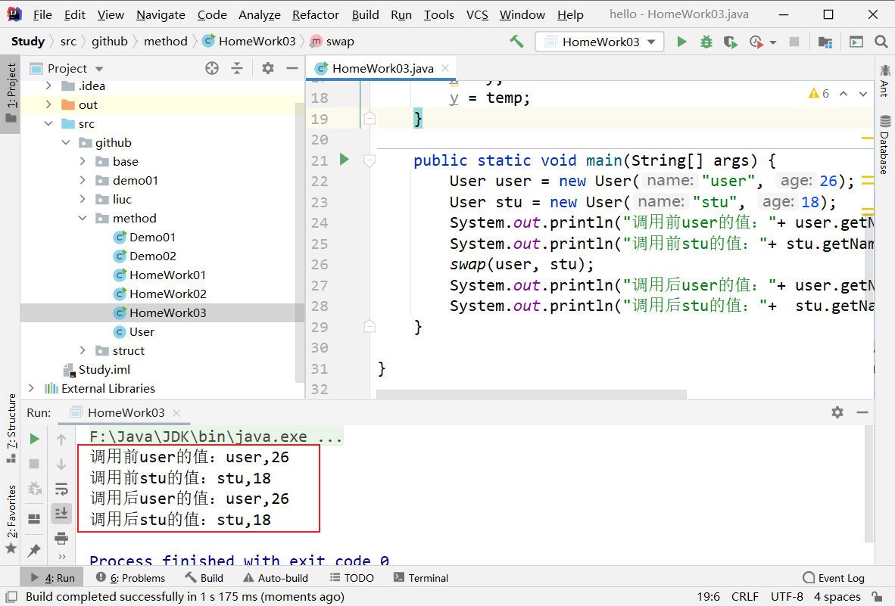

- 通过程序，会发现user和stu的值并没有发生变化，也就是方法并没有改变存储在变量user和stu中的对象引用。swap方法的参数x和y被初始化为两个对象引用的拷贝，这个方法交换的是这两个拷贝的值而已，最终，所做的事都是白费力气罢了。在方法结束后x，y将被丢弃，而原来的变量user和stu仍然引用这个方法调用之前所引用的对象。

 

- 这个过程也充分说明了java程序设计语言对对象采用的不是引用调用，实际上是**对象引用进行的是值传递**，当然在这里我们可以简单理解为这就是按值调用和引用调用的区别，而且必须明白即使java函数在传递引用数据类型时，也只是拷贝了引用的值罢了，之所以能修改引用数据是因为它们同时指向了一个对象，**但这仍然是按值调用而不是引用调用。**
- **总结**
  - 一个方法不能修改一个基本数据类型的参数（数值型和布尔型）。
  - 一个方法可以修改一个引用所指向的对象状态，但这仍然是按值调用而非引用调用。
  - 上面两种传递都进行了值拷贝的过程。

> 以上分析借鉴了[zejian_的博文](https://blog.csdn.net/javazejian/article/details/51192130) 

### 3.方法重载

- 重载就是在一个类中，有相同的函数名称，但形参不同的函数。
- 方法的重载的规则
  - 方法名称必须相同。
  - 参数列表必须不同（个数不同、或类型不同、参数排列顺序不同等）
    方法的返回类型可以相同也可以不相同。
  - 仅仅返回类型不同不足以成为方法的重载。
- 实现理论：
  - 方法名称相同时，编译器会根据调用方法的参数个数、参数类型等去逐个匹配，以选择对应的方法，如果匹配失败，则编译器报错。

```java
package github.method;

/**
 * @author subeiLY
 * @create 2021-05-27 9:46
 */
public class Demo02 {

    public static void main(String[] args) {
        int max = max(10, 20);
        System.out.println(max);

        double max2 = max2(10.0, 20.0);
        System.out.println(max);
    }

    // 比大小
    public static int max(int num1,int num2){
        int result = 0;

        if(num1==num2){
            System.out.println("num1==num2");
            return 0;   // 终止方法
        }

        if(num1>num2){
            result = num1;
        } else {
            result = num2;
        }

        return result;
    }

    // 比大小
    public static double max2(double num1,double num2){
        double result = 0;

        if(num1==num2){
            System.out.println("num1==num2");
            return 0;   // 终止方法
        }

        if(num1>num2){
            result = num1;
        } else {
            result = num2;
        }

        return result;
    }
}
```

```java
package github.method;

/**
 * @author subeiLY
 * @create 2021-05-27 9:28
 */
public class Demo01 {

    // main方法
    public static void main(String[] args) {
        int sum = add(1, 2);
        System.out.println(sum);

        int sum2 = add2(1, 2, 3);
        System.out.println(sum2);
    }

    // 加法
    public static int add(int a,int b){
        return a+b;
    }

    public static int add2(int a,int b,int c){
        return a+b+c;
    }
}
```

### 4.命令行传参

```java
package github.method;

/**
 * @author subeiLY
 * @create 2021-05-27 10:41
 */
public class Demo03 {
    public static void main(String[] args) {
        // args.length 数组长度
        for(int i=0;i < args.length;i++){
            System.out.println("args[" + i + "]:" + args[i]);
        }
    }
}
```


### 5.可变参数

- JDK1.5开始，Java支持传递同类型的可变参数给一个方法。
- 在方法声明中，在指定参数类型后加一个省略号（）。
- 一个方法中只能指定一个可变参数，它必须是方法的最后一个参数。任何普通的参数必须在它之前声明。

```java
package github.method;

/**
 * @author subeiLY
 * @create 2021-05-27 10:53
 */
public class Demo04 {

    public static void main(String[] args) {
        Demo04 demo04 = new Demo04();
        demo04.test(1,2,3,4,5);
    }

    public void test(int... i){
        System.out.println(i[0]);
        System.out.println(i[1]);
        System.out.println(i[2]);
        System.out.println(i[3]);
        System.out.println(i[4]);
    }
}
```

```java
package github.method;

/**
 * @author subeiLY
 * @create 2021-05-27 10:53
 */
public class Demo04 {

    public static void main(String[] args) {
        // 调用可变参数的方法
        printMax(34,3,3,2,56.5);
        printMax(new double[]{1,2,3});

    }

    public static void printMax(double... numbers){
        if(numbers.length==0){
            System.out.println("没有数据！");
            return;
        }

        double result = numbers[0];

        // 排序
        for(int i=1;i<numbers.length;i++){
            if(numbers[i] > result){
                result = numbers[i];
            }
        }
        System.out.println("The max Value is " + result);
    }
}
```

### 6.递归

- A方法调用B方法，我们很容易理解！
- 递归就是：A方法调用A方法！就是自己调用自己。
- 利用递归可以用简单的程序来解决一些复杂的问题。它通常把一个大型复杂的问题层层转化为一个与原问题相似的规模较小的问题来求解，递归策略只需少量的程序就可描述岀解题过程所需要的多次重复计算，大大地减少了程序的代码量。递归的能力在于用有限的语句来定义对象的无限集合。
- 递归结构包括两个部分：
  - 递归头：什么时候不调用自身方法。如果没有头，将陷入死循环；
  - 递归体：什么时候需要调用自身方法。

```java
package github.method;

import java.util.Scanner;

/**
 * @author subeiLY
 * @create 2021-05-27 12:02
 */
public class Demo05 {

    // 5! 5*4*3*2*1
    public static void main(String[] args) {
        Scanner scanner = new Scanner(System.in);
        System.out.println("请输入一个数:");
        int number = scanner.nextInt();

        int test = test(number);

        System.out.println(number + "的阶乘:" + test);
    }

    public static int test(int n){
        if(n==1){
            return 1;
        }else{
            return n*test(n-1);
        }
    }
}
```

- 写一个计算器，要求实现加减乘除功能，井且能够循环接收新的数据，通过用户交互实现。

```java
package github.method;

import java.util.Scanner;

/**
 * @author subeiLY
 * @create 2021-05-27 15:40
 */
public class HomeWork04 {
    public static void main(String[] args) {
        Scanner scanner = new Scanner(System.in);
        double sum = 0;
        while(true){
            System.out.println("请输入第一个整数:");
            double a = scanner.nextDouble();
            System.out.println("请输入第二个整数:");
            double b = scanner.nextDouble();
            System.out.println("请输入要运算的字符(+:表示加法,-:表示减法,*:表示乘法,/:表示除法)");
            String temp = scanner.next();

            switch (temp){
                case "+":
                    sum = a + b;
                    System.out.println("结果是:" + sum);
                    continue;
                case "-":
                    sum = a - b;
                    System.out.println("结果是:" + sum);
                    continue;
                case "*":
                    sum = a * b;
                    System.out.println("结果是:" + sum);
                    continue;
                case "/":
                    sum = a / b;
                    System.out.println("结果是:" + sum);
                    continue;
                default:
                    System.out.println("请输入正确的运算符号！！");
            }
        }
    }
}
```

## 数组

### 1.数组概述

- 数组是相同类型数据的有序集合。
- 数组描述的是相同类型的若干个数据按照一定的先后次序排列组合而成。
- 其中每一个数据称作一个数组元素每个数组元素可以通过一个下标来访问它们。

### 2.数组声明创建

- 首先必须声明数组变量，才能在程序中使用数组。下面是声明数组变量的语法：

```java
dataType[] arrayRefVar;	// 首选的方法
或
dataType arrayRefVar[];	// 效果相同，但不是首选方法
```

- Java语言使用new操作符来创建数组，语法如下：

```java
dataType[] arrayRefVar = new dataType[arraySize];
```

- 数组的元素是通过索引访问的，数组索引从0开始。
- 获取数组长度：`arrays. length`

```java
package github.array;

/**
 * @author subeiLY
 * @create 2021-05-27 16:08
 */
public class ArrayDemo01 {
    // 变量的类型  变量的名字  = 变量的值

    public static void main(String[] args) {
        int[] numbers;  // 1.定义

        numbers = new int[10];  // 2.创建一个数组
        // 这里面可以存放10个int型数字

        // 3.给数组赋值
        numbers[0]=1;
        numbers[1]=2;
        numbers[2]=3;
        numbers[3]=4;
        numbers[4]=5;
        numbers[5]=6;
        numbers[6]=7;
        numbers[7]=8;
        numbers[8]=9;
        numbers[9]=10;

        System.out.println(numbers[9]);
    }

}
```

```java
package github.array;

/**
 * @author subeiLY
 * @create 2021-05-27 16:08
 */
public class ArrayDemo01 {
    // 变量的类型  变量的名字  = 变量的值

    public static void main(String[] args) {
        int[] numbers;  // 1.定义

        numbers = new int[10];  // 2.创建一个数组
        // 这里面可以存放10个int型数字

        // 3.给数组赋值
        numbers[0]=1;
        numbers[1]=2;
        numbers[2]=3;
        numbers[3]=4;
        numbers[4]=5;
        numbers[5]=6;
        numbers[6]=7;
        numbers[7]=8;
        numbers[8]=9;
        numbers[9]=10;

        // 计算所有数字的和
        int sum = 0;
        // 获取数组的长度: arrays.length
        for(int i = 0;i<numbers.length;i++){
            sum = sum + numbers[i];
        }

        System.out.println(sum);
    }

}
```

> 内存分析


```java
package github.array;

/**
 * @author subeiLY
 * @create 2021-05-27 17:00
 */
public class ArrayDemo02 {
    public static void main(String[] args) {
        // 静态初始化 : 创建 + 赋值
        int[] a = {1,2,3,4,5,6,7,8};
        System.out.println(a[0]);

        // 动态初始化
        int[] b = new int[2];
        b[0]=10;

        System.out.println(b[0]);

    }
}
```

> 数组的四个基本特点：

- 其长度是确定的。数组一旦被创建，它的大小就是不可以改变的；
- 其元素必须是相同类型不允许出现混合类型。
- 数组中的元素可以是任何数据类型，包括基本类型和引用类型。
- 数组变量属引用类型，数组也可以看成是对象，数组中的每个元素相当于该对象的成员变量数组本身就是对象，Java中对象是在堆中的，因此数组无论保存原始类型还是其他对象类型，==数组对象本身是在堆中的==。

> 下标越界及小结：

- 下标的合法区间：[0, length-1]，如果越界就会报错：

```java
package github.array;

/**
 * @author subeiLY
 * @create 2021-05-27 17:42
 */
public class ArrayDemo03 {
    public static void main(String[] args) {
        int[] a = new int[2];
        System.out.println(a[2]);
    }
}
```

- ArraylndexOutofBounds Exception：数组下标越界异常！


- 数组是相同数据类型（数据类型可以为任意类型）的有序集合数组也是对象。
- 数组元素相当于对象的成员变量。
- 数组长度的确定的，不可变的。如果越界，则报：ArrayIndexOutofBounds。

### 3.数组使用

- 普通的for循环
- For-Each循环

- 数组作方法入参

- 数组作返回值

```java
package github.array;

/**
 * @author subeiLY
 * @create 2021-05-28 13:57
 */
public class ArrayDemo04 {
    public static void main(String[] args) {
        int[] arrays = {1,2,3,4,5,6};

        // JDK1.5，没有下标
//        for(int array:arrays){
//            System.out.println(array);
//        }

//        printArray(arrays);

        int[] reverse = reverse(arrays);
        printArray(reverse);

    }
    // 打印数组元素
    public static void printArray(int[] arrays){
        for(int i=0;i< arrays.length;i++){
            System.out.println(arrays[i]+"");
        }
    }

    // 反转数组
    public static int[] reverse(int[] arrays){
        int[] result = new int[arrays.length];

        // 反转的操作
        for (int i = 0,j= result.length-1; i < arrays.length; i++,j--) {
//            result[] = arrays[i];
            result[j] = arrays[i];
        }

        return result;
    }
}
```

### 4.多维数组

- 多维数组可以看成是数组的数组，比如二维数组就是一个特殊的一维数组，其每一个元素都是一个一维数组。
- 二维数组

```java
int a[][] = new int[2][5];
// 解析：以上二维数组a可以看成一个两行五列的数组
```


```java
package github.array;

/**
 * @author subeiLY
 * @create 2021-05-29 17:31
 */
public class ArrayDemo05 {
    public static void main(String[] args) {
        // [4][2]
        /*
        1,2     array[0]
        2,3     array[1]
        3,4     array[2]
        5,6     array[3]
         */
        int[][] array = {{1,2},{3,4},{5,6},{7,8}};

        // 输出单个元素
        printArray(array[0]);
        System.out.println(array[0][0]);

        System.out.println("----------------");
        
        for (int i = 0; i < array.length; i++) {
            for (int j = 0; j < array[i].length; j++){
                System.out.println(array[i][j]);
            }
        }
    }

    // 打印数组元素
    public static void printArray(int[] arrays){
        for(int i=0;i< arrays.length;i++){
            System.out.println(arrays[i]+"");
        }
    }
}
```

### 5.Arrays类

- 数组的工具类 javautil. Arrays
- 由于数组对象本身并没有什么方法可以供我们调用但AP中提供了一个工具类 Arrays供我们使用从而可以对数据对象进行一些基本的操作。
- ==查看JDK帮助文档==。
- Arrays类中的方法都是 static 修饰的静态方法在使用的时候可以直接使用类名进行调用，而"不用"使用对象来调用（注意：是“不用”而不是“不能”）。
- 具有以下常用功能：
  - 给数组赋值：通过fill方法。
  - 对数组排序：通过sort方法按升序。
  - 比较数组：通过 equals方法比较数组中元素值是否相等。
  - 查找数组元素：通过 binarySearch方法能对排序好的数组进行二分查找法操作。

```java
package github.array;

import java.util.Arrays;

/**
 * @author subeiLY
 * @create 2021-05-29 18:24
 */
public class ArrayDemo06 {
    public static void main(String[] args) {
        int[] a = {1,2,3,4,9090,543,21,3,23};

        System.out.println(a);  // 地址值：[I@14ae5a5

        // 打印数组元素Arrays.toString
        System.out.print("系统打印数组方法:");
        System.out.println(Arrays.toString(a));
        System.out.print("自定义打印数组方法:");
        printfArray(a);

        // 数组排序
        Arrays.sort(a);

        System.out.println(Arrays.toString(a));

        // 数组填充
        Arrays.fill(a,2,4,12);  // 数组2~4之间填充12
        System.out.println("数组填充:" + Arrays.toString(a));

        // 数组查找
        int i = Arrays.binarySearch(a, 23);
        System.out.println("查找的元素在数组中的位置:" + i);
    }

    public  static void printfArray(int[] a){
        for (int i = 0; i < a.length; i++) {
            if(i==0){
                System.out.print("[");
            }
            if(i==a.length-1){
                System.out.print(a[i] + "]");
            }else {
                System.out.print(a[i] + ", ");
            }
        }
        System.out.println();
    }
}
```


### 6.冒泡排序

- 冒泡排序无疑是最为出名的排序算法之一，总共有八大排序！
- 两层循环，外层冒泡轮数，里层依次比较。
- 这个算法的时间复杂度为O(n^2^)。

```java
package github.array;

import java.util.Arrays;

/**
 * @author subeiLY
 * @create 2021-05-29 21:17
 */
public class ArrayDemo07 {
    public static void main(String[] args) {
        // 调用排序
        int[] array = {12,63,1,95,44,62,78};
        System.out.println("排序前:" + Arrays.toString(array));
        int[] sort = sort(array);   // 调用自定义冒泡排序函数
        System.out.println("排序后:" + Arrays.toString(sort));

    }
    // 冒泡排序
    /*
    1.比较数组中，两个相邻的元素，如果第一个数比第二个数大，我们就交换他们的位置。
    2.每一次比较，都会产生出一个最大或最小的数。
    3.下一轮则可以少一次排序！
    4.依次循环，直到结束。
     */

    public static int[] sort(int[] array){
        // 临时变量
        int temp = 0;
        // 外层循环，判断要走多少次;
        for (int i = 0; i < array.length-1; i++) {

            boolean flag = false;   // 通过flag标识位减少没有意义的比较

            // 内层循环，比较大小，如果第一个数比第二个数大，交换位置
            for (int j = 0; j < array.length-1-i; j++) {
                if (array[j] > array[j+1]) {
                    temp = array[j];
                    array[j] = array[j + 1];
                    array[j + 1] = temp;
                    flag = true;
                }
            }
            if(flag==false){
                break;
            }
        }
        return array;
    }
}
```


### 7.稀疏数组

- 当一个数组中大部分元素为0，或者为同一值的数组时，可以使用稀疏数组来保存该数组。
- 稀疏数组的处理方式是：
  - 记录数组一共有几行几列，有多少个不同值。
  - 把具有不同值的元素和行列及值记录在一个小规模的数组中，从而缩小程序的规模。
- 如下图：左边是原始数组，右边是稀疏数组。

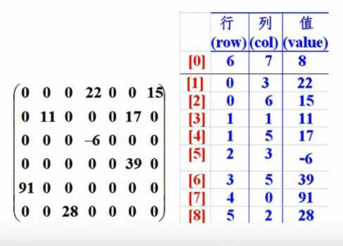

```java
package github.array;

/**
 * @author subeiLY
 * @create 2021-05-30 15:21
 */
public class ArrayDemo08 {
    public static void main(String[] args) {
        // 1.创建一个二维数组
        int[][] array1 = new int[11][11];
        array1[1][2] = 1;
        array1[2][3] = 2;
        // 输出原始数组
        System.out.println("输出原始的数组");

        for(int[] ints:array1){
            for(int anInt : ints){
                System.out.print(anInt + "\t");
            }
            System.out.println();
        }

        System.out.println("====================");

        // 转换为稀疏数组保存
        // 获取有效值的个数
        int sum = 0;
        for(int i = 0;i < 11;i++){
            for (int j = 0; j < 11; j++) {
                if(array1[i][j]!=0){
                    sum++;
                }
            }
        }
        System.out.println("有效值的个数:" + sum);

        // 2.创建一个稀疏数组的数组
        int[][] array2 = new int[sum+1][3];

        array2[0][0] = 11;
        array2[0][1] = 11;
        array2[0][2] = sum;

        // 遍历二维数组，将非零的值，存放到稀疏数组
        int count = 0;
        for (int i = 0; i < array1.length; i++) {
            for (int j = 0; j < array1[i].length; j++) {
                if(array1[i][j]!=0){
                    count++;
                    array2[count][0] = i;
                    array2[count][1] = j;
                    array2[count][2] = array1[i][j];
                }
            }
        }

        // 输出稀疏数组
        System.out.println("稀疏数组:");

        for (int i = 0; i < array2.length; i++) {
            System.out.println(array2[i][0] + "\t"
                        + array2[i][1] + "\t"
                        + array2[i][2] + "\t");
        }

        System.out.println("===========");
        System.out.println("还原");
        // 1.读取稀疏数组
        int[][] array3 = new int[array2[0][0]][array2[0][1]];
        // 2.给元素还原值
        for (int i = 1; i < array2.length; i++) {
            array3[array2[i][0]][array2[i][1]] = array2[i][2];
        }

        // 3.打印
        System.out.println("输出原始的数组:");

        for(int[] ints:array3){
            for(int anInt : ints){
                System.out.print(anInt + "\t");
            }
            System.out.println();
        }
    }
}
```

## 面向对象

### 1.初识面向对象

- 面向过程思想
  - 步骤清晰简单，第一步做什么，第二步做什么…
  - 面对过程适合处理一些较为简单的问题。
- 面向对象思想
  - 物以类聚，分类的思维模式，思考问题首先会解决问题需要哪些分类，然后对这些分类进行单独思考。最后，才对某个分类下的细节进行面向过程的思索。
  - 面向对象适合处理复杂的问题，适合处理需要多人协作的问题！
- 对于描述复杂的事物，为了从宏观上把握、从整体上合理分析，我们需要使用面向对象的思路来分析整个系统。但是，具体到微观操作，仍然需要面向过程的思路去处理。
- 面向对象编程（ Object- Oriented Programming,OOP）
- 面向对象编程的本质就是：==以类的方式组织代码，以对象的组织（封装）数据==。
- 三大特征：
  - **继承**
  - **封装**
  - **多态**
- 从认识论角度考虑是先有对象后有类。对象，是具体的事物。类，是抽象的，是对对象的抽象。
- 从代码运行角度考虑是先有类后有对象。类是对象的模板。

### 2.方法回顾和加深

- 方法的定义

  - 修饰符
  - 返回类型
  - break：跳出 switch，结束循环和 return的区别。
  - 方法名：注意规范就OK，见名知意
  - 参数列表：(参数类型，参数名) ...
  - 异常抛出：疑问，参考下文！

  ```java
  package github.oop;
  
  import java.io.IOException;
  
  /**
   * @author subeiLY
   * @create 2021-05-30 17:54
   */
  // 类
  public class Demo01 {
      // main方法
      public static void main(String[] args) {
  
      }
  
      /*
      修饰符 返回值类型 方法名(...){
          // 方法体
          return 返回值;
      }
       */
      public String sayHello(){
          return "hello,world!";
      }
  
      public int max(int a,int b){
          return a>b ? a : b; // 三元运算符
      }
  
      // 数组下标越界：Arrayindexoutofbounds
      public void readFile(String file) throws IOException{
  
      }
  }
  ```

- 方法的调用
  - 静态方法
  
  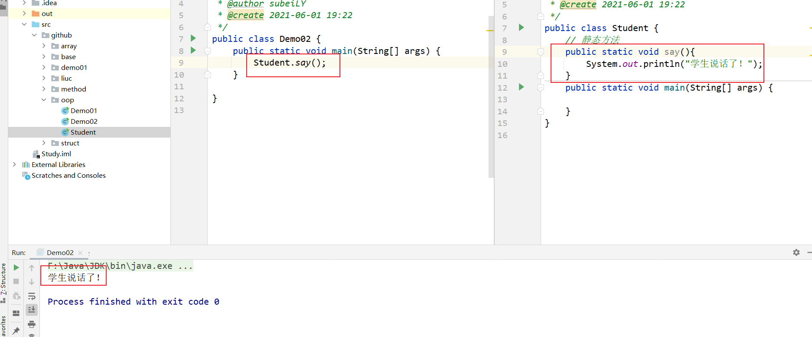
  
  - 非静态方法
  
  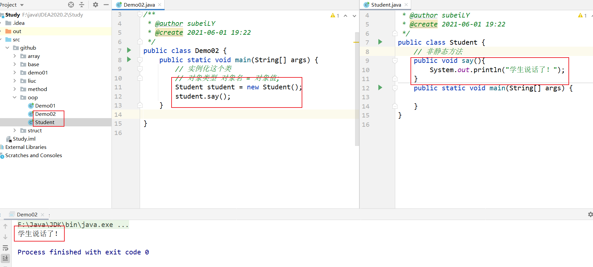
  
  - 形参和实参
  - 值传递和引用传递
  
  
  
  
  
  - this关键字


### 3.对象的创建分析

- 类是一种抽象的数据类型它是对某一类事物整体描述/定义但是并不能代表某一个具体的事物。
- 使用new关键字创建对象。
- 使用new关键字创建的时候，除了分配内存空间之外，还会给刨建好的对象进行默认的初始化以及对类中构造器的调用。
- 类中的构造器也称为构造方法，是在进行创建对象的时候必须要调用的。并且构造器有以下俩个特点：
  - 1.必须和类的名字相同；
  - 2.必须没有返回类型也不能写void。
- 构造器：
  - 1.和类名初问
  - 2.没有返回值
- 作用：
  - 1.new本质在调用构造方法；
  - 2.初始化对象的值。
- 注意：定义有参构造之后，如果想使用无参构造，显示的定义一个无参构造。


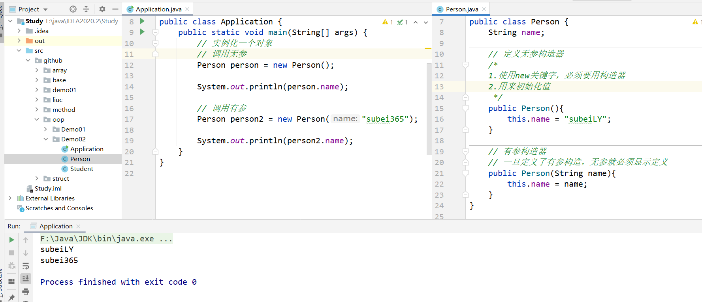

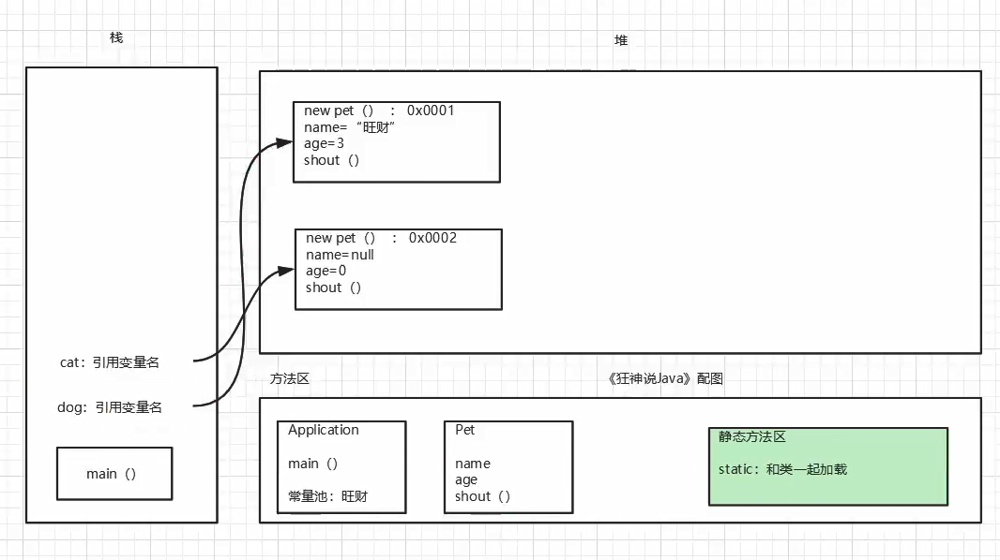

### 4.面向对象三大特性

> 封装：**属性私有，get/set**

- 程序设计要追求高内聚低耦合。高内聚就是类的内部数据操作细节自己完成，不允许外部干涉；低耦合：仅暴露少量的方法给外部使用。
- 封装（数据的隐藏）：通常，应禁止直接访问一个对象中数据的实际表示，而应该通过操作接口来访问，这称为信息隐藏。


- 封装的作用：
  - 提高了代码的安全性，保护数据；
  - 隐藏代码的实现细则；
  - 统一接口；
  - 系统可维护增加了。

>  继承：**object类、super、方法重写**

- 继承的本质是对某一批类的抽象，从而实现对现实世界更好的建模。
- extands的意思是“扩展”。子类是父类的扩展。
- JAVA中类只有单继承，没有多继承！
- 继承是类和类之间的一种关系。除此之外，类和类之间的关系还有依赖、组合、聚合等。
- 继承关系的俩个类，一个为子类（派生类），一个为父类（基类）。子类继承父类使用关键字 extends来表示。
- 子类和父类之间从意义上讲应该具有"is a"的关系。


---

- Super概述


- 私有的东西无法被继承！！！


**super注意点**：

1. super调用父类的构造方法，必须在构造方法的第一个

2. super必须只能出现在子类的方法或者构造方法中！
3. super和this不能同时调用构造方法！

**VSthis**：

- 代表的对象不同：
  - this：本身调用者这个对象；
  - super：代表父类对象的应用；
- 前提
  - this：没有继承也可以使用；
  - super：只能在继承条件才可以使用；
- 构造方法
  - this（）：本类的构造；
  - super（）：父类的构造。

----

- 方法的重写：

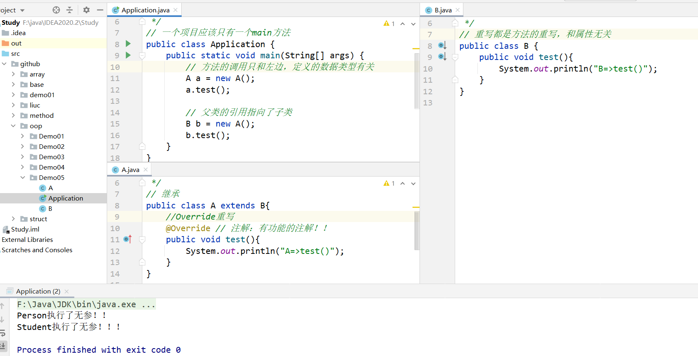

- 重写：需要有继承关系，子类重写父类的方法！

1. 方法名必须相同;
2. 参数列表列表必须相同;
3. 修饰符：范围可以扩大但不能缩小: public>Protected>Default>private
4. 抛出的异常：范围，可以被缩小，但不能扩大；ClassNotFoundException--> Exception(大)

- 重写，子类的方法和父类必要一致；方法体不同！
- 为什么需要重写：父类的功能，子类不一定需要，或者不一定满足！

> 多态：

- 即同一方法可以根据发送对象的不同而采用多种不同的行为方式。
- 一个对象的实际类型是确定的，但可以指向对象的引用的类型有很多。
- 多态存在的条件：
  - 有继承关系；
  - 子类重写父类方法；
  - 父类引用指向子类对象。


- 多态注意事项：
  1. 多态是方法的多态，属性没有多态；
  2. 父类和子类，有联系，类型转换异常！ClassCastException!
  3. 存在条件：继承条件，方法需要重写！父类引用指向子类对象！
     1. static 方法，属于类，它不属于实例
     2. final 常量；
     3. private 方法；

**instanceof**：判断一个对象是什么类型。


**static关键字**

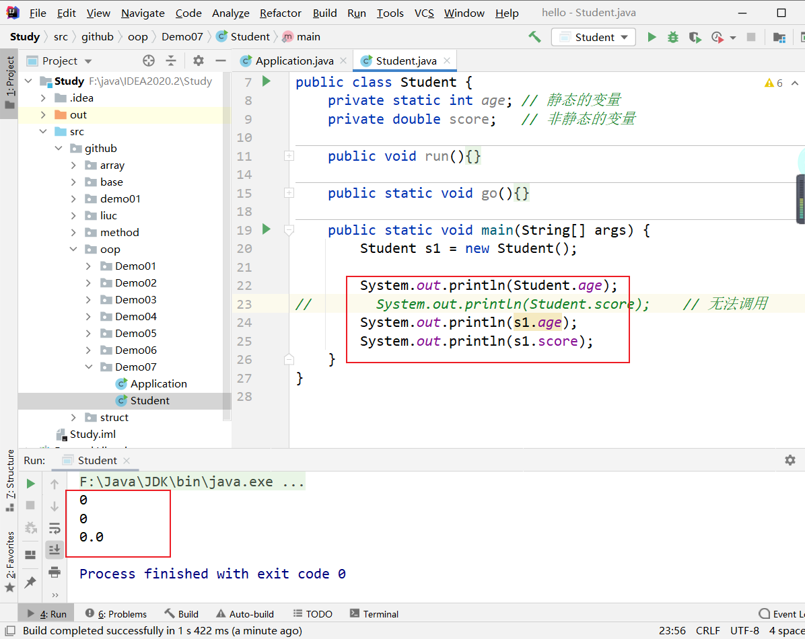


### 5.抽象类和接口

> 抽象类

- abstract修饰符可以用来修饰方法也可以修饰类如果修饰方法那么该方法就是抽象方法如果修饰类那么该类就是抽象类。
- 抽象类中可以没有抽象方法但是有抽象方法的类一定要声明为抽象类。
- 抽象类，不能使用new关键字来创建对象它是用来让子类继承的。
- 抽象方法只有方法的声明没有方法的实现它是用来让子类实现的。
- 子类继承抽象类那么就必须要实现抽象类没有实现的抽象方法否则该子类也要声明为抽象类。


> 接口

- 普通类：只有具体实现；
- 抽象类：具体实现和规范（抽象方法）都有！
- 接口：只有规范！
- 接口就是规范，定义的是一组规则，体现了现实世界中“如果你是…则必须能…”的思想。如果你是天使，则必须能飞。如果你是汽车，则必须能跑。如果你好人，则必须干掉坏人；如果你是坏人，则必须欺负好人。
- 接口的本质是契约，就像我们人间的法律一样。制定好后大家都遵守。
- OO的精髓，是对对象的抽象，最能体现这一点的就是接口。为什么我们讨论设计模式都只针对具备了抽象能力的语言（比如c++、java、c#等），就是因为设计模式所硏究的，实际上就是如何合理的去抽象。
- ==声明类的关键字是 class，声明接口的关键字是 interface==。


### 6.内部类及OOP实战

- 内部类就是在一个类的内部在定义一个类，比如，A类中定义一个B类，那么B类相对A类来说就称为内部类，而A类相对B类来说就是外部类了。
  1. 成员内部类
  2. 静态内部类
  3. 局部内部类
  4. 匿名内部类


## 异常

### 1.什么是异常

 &nbsp;  &nbsp; 实际工作中，遇到的情况不可能是非常完美的。比如：你写的某个模块，用户输入不一定符合你的要求、你的程序要打开某个文件，这个文件可能不存在或者文件格式不对，你要读取数据库的数据，数据可能是空的等。我们的程序再跑着，内存或硬盘可能满了。等等。

 &nbsp;  &nbsp; 软件程序在运行过程中，非常可能遇到刚刚提到的这些异常问题，我们叫异常，英文是：Exception，意思是例外。这些，例外情况，或者叫异常，怎么让我们写的程序做出合理的处理。而不至于程序崩溃。

 &nbsp;  &nbsp; 异常指程序运行中出现的不期而至的各种状况如：文件找不到、网络连接失败、非法参数等。异常发生在程序运行期间它影响了正常的程序执行流程。

> 要理解Java异常处理是如何工作的，需要掌握以下三种类型的异常：

- 检查性异常：最具代表的检查性异常是用户错误或问题引起的异常，这是程序员无法预见的例如要打开一个不存在文件时，一个异常就发生了，这些异常在编译时不能被简单地忽略。
- 运行时异常：运行时异常是可能被程序员避免的异常。与检查性异常相反，运行时异常可以在编译时被忽略。
- 错误==ERROR==：错误不是异常，而是脱离程序员控制的冋题。错误在代码中通常被忽略。例如，当栈溢出时，一个错误就发生了，它们在编译也检查不到的。

### 2.异常体系结构

- Java把异常当作对象来处理，并定义一个基类 java. lang.Throwable作为所有异常的超类。
- 在 Java API中已经定义了许多异常类，这些异常类分为两大类，错误Error和异常 Exception。


> Error

- Error类对象由Java虚拟机生成并抛出，大多数错误与代码编写者所执行的操作无关。
- Java虚拟机运行错误（ Virtual Machine Error），当JVM不再有继续执行操作所需的内存资源时，将出现 ==OutofMemory Error==。这些异常发生时，Java虚拟机（JVM）一般会选择线程终止。
- 还有发生在虛拟机试图执行应用时，如类定义错误（ NoClass Deffound error）、链接错误（ Linkage Error）。这些错误是不可查的，因为它们在应用程序的控制和处理能力之外，而且绝大多数是程序运行时不允许出现的状况。

> Exception

- 在 Exception分支中有一个重要的子类 Runtime Exception（运行时异常）
  - ArraylndexOutOfBoundsException（数组下标越界）
  - NullPointerException（空指针异常）
  - ArithmeticException（算术异常）
  - Missing Resource Exception（丢失资源）
  - ClassNotFound Exception（找不到类）等异常，这些异常是不检查异常，程序中可以选择捕获处理，也可以不处理。
- 这些异常一般是由程序逻辑错误引起的，程序应该从逻辑角度尽可能避免这类异常的发生； 
- Error和 Exception的区别：Error通常是灾难性的致命的错误，是程序无法控制和处理的，当出现这些异常时，Java虛拟机（JVM）一般会选择终止线程；Exception通常情况下是可以被程序处理的，并且在程序中应该尽可能的去处理这些异常。

### 3.Java异常处理机制与处理异常

- 抛出异常
- 捕获异常
- 异常处理五个关键字：
  - try、catch、 finally、throw、throws


### 4.自定义异常

- 使用Java内置的异常类可以描述在编程时岀现的大部分异常情况。除此之外，用户还可以自定义异常。用户自定义异常类，只需继承 Exception类即可。
- 在程序中使用自定义异常类，大体可分为以下几个步骤：
  1. 创建自定义异常类。
  2. 在方法中通过 throw关键字抛出异常对象。
  3. 如果在当前抛出异常的方法中处理异常，可以使用try- catch语句捕获并处理；否则在方法的声明处通过 throws关键字指明要抛岀给方法调用者的异常，继续进行下一步操作。
  4. 在出现异常方法的调用者中捕获并处理异常。


### 5.总结

- 处理运行时异常时，采用逻辑去合理规避同时辅助 try-catch ；
- 处理在多重 catch块后面，可以加一个 catch（ Exception）来处理可能会被遗漏的异常；
- 对于不确定的代码，也可以加上try- catch，处理潜在的异常；
- 尽量去处理异常，切忌只是简单地调用 printStackTrace0去打印输出；
- 具体如何处理异常，要根据不同的业务需求和异常类型去决定；
- 尽量添加 finally！语句块去释放占用的资源。

## 常用类

### 1.字符串相关的类
#### 1.String类的概述
```java
import org.junit.Test;

/**
 * String的使用
 *
 * @author subei
 * @create 2020-05-09 10:34
 */
public class StringTest {

    /**
     * String:字符串，使用一对“”引起来表示。
     * 1.String声明为final的，不可被继承
     * 2.String实现了Serializable接口：表示字符串是支持序列化的。
     *         实现了Comparable接口：表示String可以比较大小
     * 3.String内部定义了final char[] value用于存储字符串数据
     * 4.String:代表不可变的字符序列。简称：不可变性。
     *      体现：
     *
     */
    @Test
    public void Test1(){

    }
}
```
#### 2.理解String的不可变性
```java
import org.junit.Test;

/**
 * String的使用
 *
 * @author subei
 * @create 2020-05-09 10:34
 */
public class StringTest {

    /**
     * String:字符串，使用一对“”引起来表示。
     * 1.String声明为final的，不可被继承
     * 2.String实现了Serializable接口：表示字符串是支持序列化的。
     *         实现了Comparable接口：表示String可以比较大小
     * 3.String内部定义了final char[] value用于存储字符串数据
     * 4.String:代表不可变的字符序列。简称：不可变性。
     *      体现：1.当对字符串重新赋值时，需要重写指定内存区域赋值，不能使用原有的value进行赋值。
     *           2.当对现有的字符串进行连接操作时，也需要重新指定内存区域赋值，不能使用原有的value进行赋值。
     *           3.当调用String的replace()方法修改指定字符或字符串时，也需要重新指定内存区域赋值，不能使用原有的value进行赋值。
     * 5.通过字面量的方式（区别于new）给一个字符串赋值，此时的字符串值声明在字符串常量池中。
     * 6.字符串常量池中是不会存储相同内容的字符串的。
     *
     */
    @Test
    public void Test1(){
        String s1 = "abc";  //字面量的定义方式
        String s2 = "abc";
        s1 = "hello";

        System.out.println(s1 == s2);//比较s1和s2的地址值

        System.out.println(s1);//hello
        System.out.println(s2);//abc

        System.out.println("*********************");

        String s3 = "abc";
        s3 += "def";
        System.out.println(s3);//abcdef

        System.out.println("**********************");

        String s4 = "abc";
        String s5 = s4.replace('a', 'm');
        System.out.println(s4);//abc
        System.out.println(s5);//mbc
    }
}
```

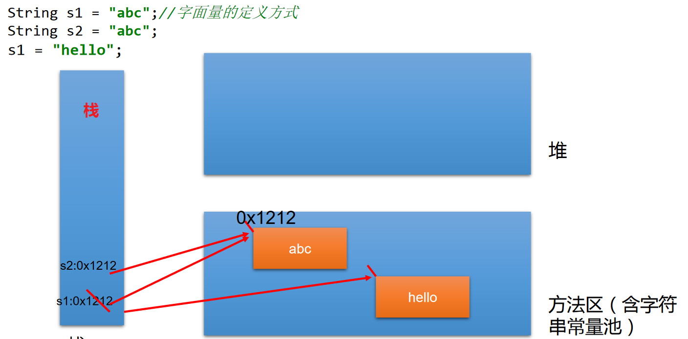
#### 3.String不同实例化方式的对比

- String对象的创建

```java
String str = "hello";

//本质上this.value = new char[0];
String  s1 = new String(); 

//this.value = original.value;
String  s2 = new String(String original); 

//this.value = Arrays.copyOf(value, value.length);
String  s3 = new String(char[] a);

String  s4 = new String(char[] a,int startIndex,int count);
```

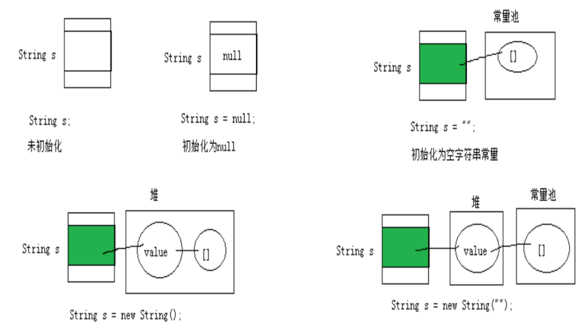

- String str1  = “abc”;与String str2 = new String(“abc”);的区别？
  - 字符串常量存储在字符串常量池，目的是共享
  - 字符串非常量对象存储在堆中。

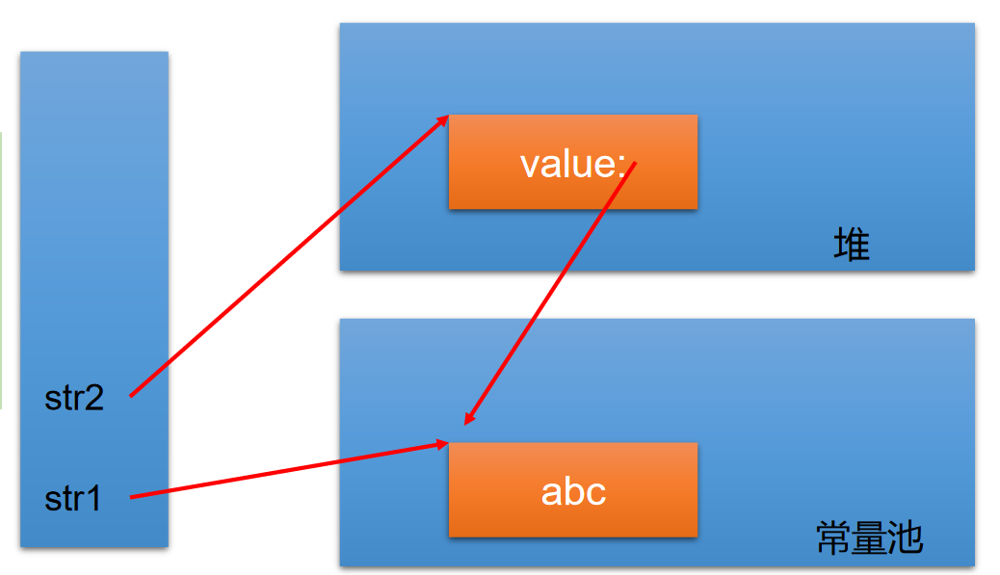

-  **练习**


```java
import org.junit.Test;

/**
 * String的使用
 *
 * @author subei
 * @create 2020-05-09 10:34
 */
public class StringTest {

    /**
     * String的实例化方式
     * 方式一：通过字面量定义的方式
     * 方式二：通过new + 构造器的方式
     *
     * 面试题：String s = new String("abc");方式创建对象，在内存中创建了几个对象？
     *      两个:一个是堆空间中new结构，另一个是char[]对应的常量池中的数据："abc"
     *
     */
    @Test
    public void test2(){
        //通过字面量定义的方式：此时的s1和s2的数据javaEE声明在方法区中的字符串常量池中。
        String s1 = "javaEE";
        String s2 = "javaEE";

        //通过new + 构造器的方式:此时的s3和s4保存的地址值，是数据在堆空间中开辟空间以后对应的地址值。
        String s3 = new String("javaEE");
        String s4 = new String("javaEE");

        System.out.println(s1 == s2);//true
        System.out.println(s1 == s3);//false
        System.out.println(s1 == s4);//false
        System.out.println(s3 == s4);//false

        System.out.println("***********************");
        Person p1 = new Person("Tom",12);
        Person p2 = new Person("Tom",12);

        System.out.println(p1.name.equals(p2.name));//true
        System.out.println(p1.name == p2.name);//true

        p1.name = "Jerry";
        System.out.println(p2.name);//Tom
    }
}
```

- Person类

```java
/**
 * @author subei
 * @create 2020-05-09 11:20
 */
public class Person {

    String name;
    int age;

    public Person(String name, int age) {
        this.name = name;
        this.age = age;
    }

    public Person() {

    }
}
```

#### 4.String不同拼接操作的对比
```java
import org.junit.Test;

/**
 * String的使用
 *
 * @author subei
 * @create 2020-05-09 10:34
 */
public class StringTest {

    /**
     * 结论
     *     1.常量与常量的拼接结果在常量池。且常量池中不会存在相同内容的常量。
     *     2.只要其中有一个是变量，结果就在堆中
     *     3.如果拼接的结果调用intern()方法，返回值就在常量池中
     *
     */
    @Test
    public void test4(){
        String s1 = "javaEEhadoop";
        String s2 = "javaEE";
        String s3 = s2 + "hadoop";
        System.out.println(s1 == s3);//false

        final String s4 = "javaEE";//s4:常量
        String s5 = s4 + "hadoop";
        System.out.println(s1 == s5);//true

    }

    @Test
    public void test3(){
        String s1 = "javaEE";
        String s2 = "hadoop";

        String s3 = "javaEEhadoop";
        String s4 = "javaEE" + "hadoop";
        String s5 = s1 + "hadoop";
        String s6 = "javaEE" + s2;
        String s7 = s1 + s2;

        System.out.println(s3 == s4);//true
        System.out.println(s3 == s5);//false
        System.out.println(s3 == s6);//false
        System.out.println(s5 == s6);//false
        System.out.println(s3 == s7);//false
        System.out.println(s5 == s6);//false
        System.out.println(s5 == s7);//false
        System.out.println(s6 == s7);//false

        String s8 = s5.intern();//返回值得到的s8使用的常量值中已经存在的“javaEEhadoop”
        System.out.println(s3 == s8);//true
    }
}
```

##### String使用陷阱

- String s1 = "a"; 

  > 说明：在字符串常量池中创建了一个字面量为"a"的字符串。

- s1 = s1 + "b"; 

  > 说明：实际上原来的“a”字符串对象已经丢弃了，现在在堆空间中产生了一个字符串s1+"b"（也就是"ab")。如果多次执行这些改变串内容的操作，会导致大量副本字符串对象存留在内存中，降低效率。如果这样的操作放到循环中，会极大影响程序的性能。

- String s2 = "ab";

  > 说明：直接在字符串常量池中创建一个字面量为"ab"的字符串。

- String s3 = "a" + "b";

  > 说明：s3指向字符串常量池中已经创建的"ab"的字符串。

- String s4 = s1.intern();

  > 说明：堆空间的s1对象在调用intern()之后，会将常量池中已经存在的"ab"字符串赋值给s4。

- 练习

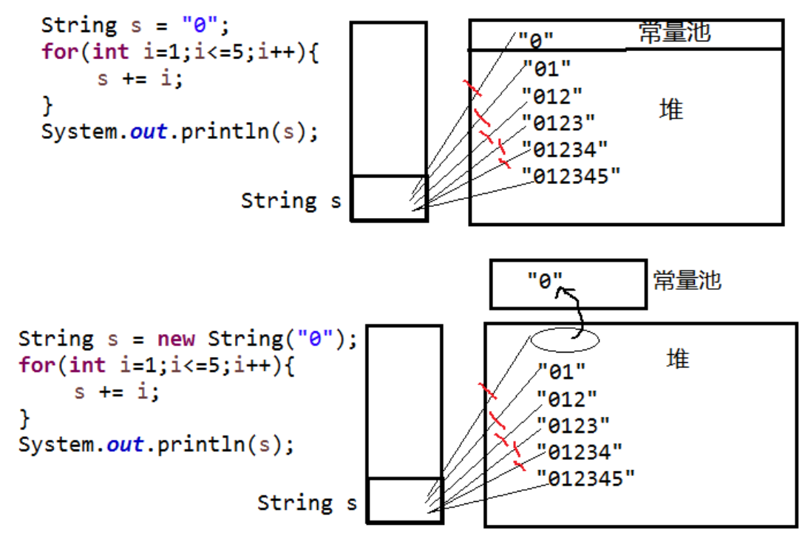

#### 5.String的一道面试题

```java
/**
 * 一道面试题
 * @author subei
 * @create 2020-05-09 11:40
 */
public class StringTest {
    String str = new String("good");
    char[] ch = { 't', 'e', 's', 't' };

    public void change(String str, char ch[]) {
        str = "test ok";
        ch[0] = 'b';
    }
    public static void main(String[] args) {
        StringTest ex = new StringTest();
        ex.change(ex.str, ex.ch);
        System.out.println(ex.str);//good
        System.out.println(ex.ch);//best
    }
}
```

#### 6.JVM中涉及字符串的内存结构


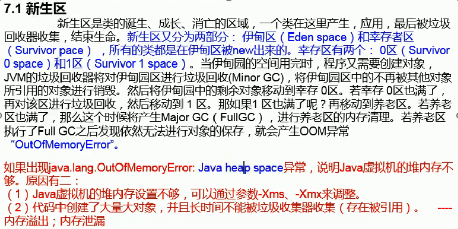


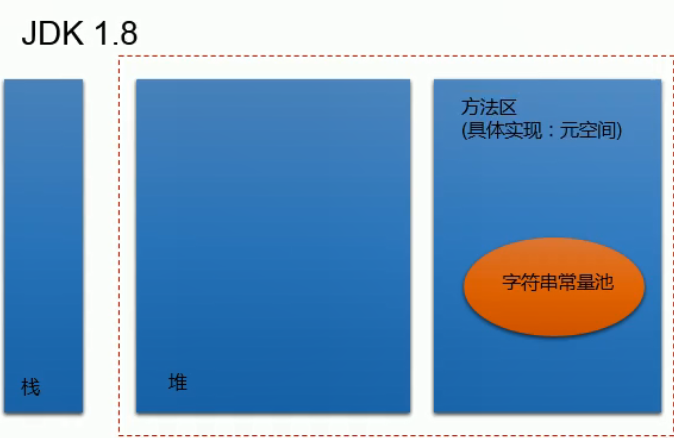

#### 7.String的常用方法1

```java
import org.junit.Test;

/**
 * @author subei
 * @create 2020-05-09 11:47
 */
public class StringMethodTest {

    /**
     * int length()：返回字符串的长度：return value.length
     * char charAt(int index)：返回某索引处的字符return value[index]
     * boolean isEmpty()：判断是否是空字符串：return value.length==0
     * String toLowerCase()：使用默认语言环境，将String中的所有字符转换为小写
     * String toUpperCase()：使用默认语言环境，将String中的所有字符转换为大写
     * String trim()：返回字符串的副本，忽略前导空白和尾部空白
     * boolean equals(Object obj)：比较字符串的内容是否相同
     * boolean equals IgnoreCase(String anotherString)：与equals方法类似，忽略大小写
     * String concat(String str)：将指定字符串连接到此字符串的结尾。等价于用“+”
     * int compareTo(String anotherString)：比较两个字符串的大小
     * String substring(int beginIndex)：返回一个新的字符串，它是此字符串的从beginIndex开始截取到最后的一个子字符串。
     * String substring(int beginIndex,int endIndex)：返回一个新字符串，它是此字符串从beginIndex开始截取到endIndex(不包含)的一个子字符串。
     */
    @Test
    public void test2(){
        String s1 = "HelloWorld";
        String s2 = "helloworld";
        System.out.println(s1.equals(s2));//false
        System.out.println(s1.equalsIgnoreCase(s2));//true
        
        String s3 = "abc";
        String s4 = s3.concat("def");
        System.out.println(s4);//abcdef

        String s5 = "abc";
        String s6 = new String("abe");
        System.out.println(s5.compareTo(s6));//-2   //涉及到字符串的排序

        String s7 = "周围好吵啊";
        String s8 = s7.substring(2);
        System.out.println(s7);
        System.out.println(s8);

        String s9 = s7.substring(0, 2);
        System.out.println(s9);
    }

    @Test
    public void Test1(){
        String s1 = "helloworld";
        System.out.println(s1.length());
        System.out.println(s1.length());
        System.out.println(s1.charAt(0));
        System.out.println(s1.charAt(9));
//        System.out.println(s1.charAt(10));
//        s1 = "";
        System.out.println(s1.isEmpty());

        String s2 = s1.toLowerCase();
        System.out.println(s1);//s1不可变的，仍然为原来的字符串
        System.out.println(s2);//改成小写以后的字符串

        String s3 = "   he  llo   world   ";
        String s4 = s3.trim();
        System.out.println("-----" + s3 + "-----");
        System.out.println("-----" + s4 + "-----");
    }

}
```

#### 8.String的常用方法2

```java
import org.junit.Test;

/**
 * @author subei
 * @create 2020-05-09 16:47
 */
public class StringMethodTest {

    /**
     * boolean endsWith(String suffix)：测试此字符串是否以指定的后缀结束
     * boolean startsWith(String prefix)：测试此字符串是否以指定的前缀开始
     * boolean startsWith(String prefix, int toffset)：测试此字符串从指定索引开始的子字符串是否以指定前缀开始
     *
     * boolean contains(CharSequence s)：当且仅当此字符串包含指定的 char 值序列时，返回 true
     * int indexOf(String str)：返回指定子字符串在此字符串中第一次出现处的索引
     * int indexOf(String str, int fromIndex)：返回指定子字符串在此字符串中第一次出现处的索引，从指定的索引开始
     * int lastIndexOf(String str)：返回指定子字符串在此字符串中最右边出现处的索引
     * int lastIndexOf(String str, int fromIndex)：返回指定子字符串在此字符串中最后一次出现处的索引，从指定的索引开始反向搜索
     *
     * 注：indexOf和lastIndexOf方法如果未找到都是返回-1
     */
    @Test
    public void test3(){
        String str1 = "helloworld";
        boolean b1 = str1.endsWith("rld");
        System.out.println(b1);

        boolean b2 = str1.startsWith("He");
        System.out.println(b2);

        boolean b3 = str1.startsWith("ll",2);
        System.out.println(b3);

        String str2 = "wor";
        System.out.println(str1.contains(str2));

        System.out.println(str1.indexOf("lo"));

        System.out.println(str1.indexOf("lo",5));

        String str3 = "hellorworld";

        System.out.println(str3.lastIndexOf("or"));
        System.out.println(str3.lastIndexOf("or",6));

        //什么情况下，indexOf(str)和lastIndexOf(str)返回值相同？
        //情况一：存在唯一的一个str。情况二：不存在str
    }
}
```

#### 9.String的常用方法3

```java
import org.junit.Test;

/**
 * @author subei
 * @create 2020-05-09 16:47
 */
public class StringMethodTest {

    /**
     * 替换：
     * String replace(char oldChar, char newChar)：返回一个新的字符串，它是通过用 newChar 替换此字符串中出现的所有 oldChar 得到的。
     * String replace(CharSequence target, CharSequence replacement)：使用指定的字面值替换序列替换此字符串所有匹配字面值目标序列的子字符串。
     * String replaceAll(String regex, String replacement)：使用给定的 replacement 替换此字符串所有匹配给定的正则表达式的子字符串。
     * String replaceFirst(String regex, String replacement)：使用给定的 replacement 替换此字符串匹配给定的正则表达式的第一个子字符串。
     *
     * 匹配:
     * boolean matches(String regex)：告知此字符串是否匹配给定的正则表达式。
     *
     * 切片：
     * String[] split(String regex)：根据给定正则表达式的匹配拆分此字符串。
     * String[] split(String regex, int limit)：根据匹配给定的正则表达式来拆分此字符串，最多不超过limit个，如果超过了，剩下的全部都放到最后一个元素中。
     *
     */
    @Test
    public void test4(){
        String str1 = "西藏布达拉宫欢迎您";
        String str2 = str1.replace('西','东');

        System.out.println(str1);
        System.out.println(str2);

        String str3 = str1.replace("北京", "南京");
        System.out.println(str3);

        System.out.println("*************************");
        String str = "12hello34world5java7891mysql456";
        //把字符串中的数字替换成,，如果结果中开头和结尾有，的话去掉
        String string = str.replaceAll("\\d+", ",").replaceAll("^,|,$", "");
        System.out.println(string);

        System.out.println("*************************");
        str = "12345";
        //判断str字符串中是否全部有数字组成，即有1-n个数字组成
        boolean matches = str.matches("\\d+");
        System.out.println(matches);
        String tel = "0571-4534289";
        //判断这是否是一个杭州的固定电话
        boolean result = tel.matches("0571-\\d{7,8}");
        System.out.println(result);

        System.out.println("*************************");
        str = "hello|world|java";
        String[] strs = str.split("\\|");
        for (int i = 0; i < strs.length; i++) {
            System.out.println(strs[i]);
        }
        System.out.println();
        str2 = "hello.world.java";
        String[] strs2 = str2.split("\\.");
        for (int i = 0; i < strs2.length; i++) {
            System.out.println(strs2[i]);
        }
    }
}
```

#### 10.回顾String与基本数据类型包装类的转换

```java
import org.junit.Test;

/**
 * 涉及到String类与其他结构之间的转换
 *
 * @author subei
 * @create 2020-05-09 18:03
 */
public class StringTest1 {

    /**
     * 复习
     *    String与基本数据类型、包装类之间的转换
     *
     *    String --> 基本数据类型、包装类：调用包装类的静态方法：parseXxx(str)
     *    基本数据类型、包装类 --> String:调用String重载的valueOf(xxx)
     */
    @Test
    public void test1(){
        String str1 = "123";
//        int num = (int)str1;//错误的
        int num = Integer.parseInt(str1);

        String str2 = String.valueOf(num);   //"123
        String str3 = num + "";

        System.out.println(str1 == str3);   //false
    }

}
```

#### 11.String与char[]之间的转换

```java
import org.junit.Test;

/**
 * 涉及到String类与其他结构之间的转换
 *
 * @author subei
 * @create 2020-05-09 18:03
 */
public class StringTest1 {

    /**
     * String 与 char[]之间的转换
     *
     * String --> char[]:调用String的toCharArray()
     * char[] --> String:调用String的构造器
     */
    @Test
    public void test2(){
        String str1 = "abc123"; //题目： a21cb3

        char[] charArray = str1.toCharArray();
        for (int i = 0; i < charArray.length; i++) {
            System.out.println(charArray[i]);
        }

        char[] arr = new char[]{'h','e','l','l','o'};
        String str2 = new String(arr);
        System.out.println(str2);
    }
}
```

#### 12.String与byte[]之间的转换

```java
import org.junit.Test;

import java.io.UnsupportedEncodingException;
import java.util.Arrays;

/**
 * 涉及到String类与其他结构之间的转换
 *
 * @author subei
 * @create 2020-05-09 18:03
 */
public class StringTest1 {

    /**
     * String 与 byte[]之间的转换
     *
     * 编码：String --> byte[]:调用String的getBytes()
     * 解码：byte[] --> String:调用String的构造器
     *
     * 编码：字符串 -->字节  (看得懂 --->看不懂的二进制数据)
     * 解码：编码的逆过程，字节 --> 字符串 （看不懂的二进制数据 ---> 看得懂）
     *
     * 说明：解码时，要求解码使用的字符集必须与编码时使用的字符集一致，否则会出现乱码。
     *
     */
    @Test
    public void test3() throws UnsupportedEncodingException {
        String str1 = "abc123重工";
        byte[] bytes = str1.getBytes();//使用默认的字符编码集,进行转换
        System.out.println(Arrays.toString(bytes));

        byte[] gbks = str1.getBytes("gbk");//使用gbk字符集进行编码。
        System.out.println(Arrays.toString(gbks));

        System.out.println("*****************************");

        String str2 = new String(bytes);//使用默认的字符集，进行解码。
        System.out.println(str2);

        String str3 = new String(gbks);
        System.out.println(str3);//出现乱码。原因：编码集和解码集不一致！

        String str4 = new String(gbks,"gbk");
        System.out.println(str4);//没有出现乱码。原因：编码集和解码集一致！
    }
}
```

#### 13.面试中String算法考查的说明

> 1.模拟一个trim方法，去除字符串两端的空格。

```java
import org.junit.Test;

/*
 * 1.模拟一个trim方法，去除字符串两端的空格。
 * 
 */
public class StringExer {

	// 第1题
	public String myTrim(String str) {
		if (str != null) {
			int start = 0;// 用于记录从前往后首次索引位置不是空格的位置的索引
			int end = str.length() - 1;// 用于记录从后往前首次索引位置不是空格的位置的索引

			while (start < end && str.charAt(start) == ' ') {
				start++;
			}

			while (start < end && str.charAt(end) == ' ') {
				end--;
			}
			if (str.charAt(start) == ' ') {
				return "";
			}

			return str.substring(start, end + 1);
		}
		return null;
	}
	
	@Test
	public void testMyTrim() {
		String str = "   a   ";
		// str = " ";
		String newStr = myTrim(str);
		System.out.println("---" + newStr + "---");
	}
}
```


> 2.将一个字符串进行反转。将字符串中指定部分进行反转。比如“abcdefg”反转为”abfedcg”

```java
import org.junit.Test;

/**
 * @author subei
 * @create 2020-05-10 10:01
 */
public class StringDemo {

    /**
     * 将一个字符串进行反转。将字符串中指定部分进行反转。比如“abcdefg”反转为”abfedcg”
     *
     * 方式一：转换为char[]
     */
    public String reverse(String str,int startIndex,int endIndex){

        if(str != null && str.length() != 0) {
            char[] arr = str.toCharArray();
            for (int x = startIndex, y = endIndex; x < y; x++, y--) {
                char temp = arr[x];
                arr[x] = arr[y];
                arr[y] = temp;
            }
            return new String(arr);
        }
        return null;
    }

    /**
     * 方式二：使用String的拼接
     */
    public String reverse2(String str, int startIndex, int endIndex) {
        if(str != null) {
            // 第一部分
            String reverStr = str.substring(0,startIndex);// ab
            // 第二部分
            for (int i = endIndex; i >= startIndex; i--) {
                reverStr += str.charAt(i);
            } // abfedc
            // 第三部分
            reverStr += str.substring(endIndex + 1);

            return reverStr;
        }
        return null;
    }

    //方式三：使用StringBuffer/StringBuilder替换String
    public String reverse3(String str, int startIndex, int endIndex) {
        StringBuilder builder = new StringBuilder(str.length());

        if(str != null) {
            //第一部分
            builder.append(str.substring(0, startIndex));

            //第二部分
            for (int i = endIndex; i >= startIndex; i--) {

                builder.append(str.charAt(i));
            }
            //第三部分
            builder.append(str.substring(endIndex + 1));

            return builder.toString();
        }
        return null;
    }

    @Test
    public void testReverse() {
        String str = "abcdefg";
        String str1 = reverse3(str, 2, 5);
        System.out.println(str1);// abfedcg

    }
}
```

> 3.获取一个字符串在另一个字符串中出现的次数。比如：获取“ ab”在“abkkcadkabkebfkabkskab” 中出现的次数

```java
import org.junit.Test;

/**
 * @author subei
 * @create 2020-05-10 10:58
 */
public class StringDemo2 {
    /**
     * 获取一个字符串在另一个字符串中出现的次数。
     * 比如：获取“ ab”在“abkkcadkabkebfkabkskab” 中出现的次数
     *
     */

    /**
     * 获取subStr在mainStr中出现的次数
     * @param mainStr
     * @param subStr
     */
    public int getCount(String mainStr,String subStr){
        int mainLength = mainStr.length();
        int subLength = subStr.length();
        int count = 0;
        int index = 0;

        if(mainLength >= subLength){

            //方式一：
//            while((index = mainStr.indexOf(subStr)) != -1){
//                count++;
//                mainStr = mainStr.substring(index + subStr.length());
//            }
            //方式二：对方式一的改进
            while((index = mainStr.indexOf(subStr,index)) != -1){
                count++;
                index += subLength;
            }

            return count;
        }else{
            return 0;
        }
    }

    @Test
    public void testGetCount(){
        String mainStr = "abkkcadkabkebfkabkskab";
        String subStr = "ab";
        int count = getCount(mainStr,subStr);
        System.out.println(count);
    }

}
```

> 4.获取两个字符串中最大相同子串。比如：
>
> str1 = "abcwerthelloyuiodef“;str2 = "cvhellobnm"
>
> 提示：将短的那个串进行长度依次递减的子串与较长的串比较。

```java
import org.junit.Test;

import java.util.Arrays;

/**
 * 说实话这题第一遍没怎么听懂！！！！
 * @author subei
 * @create 2020-05-10 11:23
 */
public class StringDemo3 {
    /**
     * 获取两个字符串中最大相同子串。比如：
     * str1 = "abcwerthelloyuiodef“;str2 = "cvhellobnm"
     * 提示：将短的那个串进行长度依次递减的子串与较长的串比较。
     */
    //前提：两个字符串中只有一个最大相同子串
    public String getMaxSameString(String str1,String str2){
        if(str1 != null && str2 != null){
            String maxStr = (str1.length() >= str2.length())? str1 : str2;
            String minStr = (str1.length() < str2.length())? str1 : str2;
            int length = minStr.length();

            for(int i = 0;i < length;i++){
                for(int x = 0,y = length - i;y <= length;x++,y++){
                    String subStr = minStr.substring(x,y);
                    if(maxStr.contains(subStr)){
                        return subStr;
                    }

                }
            }

        }
        return null;
    }

    // 如果存在多个长度相同的最大相同子串
    // 此时先返回String[]，后面可以用集合中的ArrayList替换，较方便
    public String[] getMaxSameString1(String str1, String str2) {
        if (str1 != null && str2 != null) {
            StringBuffer sBuffer = new StringBuffer();
            String maxString = (str1.length() > str2.length()) ? str1 : str2;
            String minString = (str1.length() > str2.length()) ? str2 : str1;

            int len = minString.length();
            for (int i = 0; i < len; i++) {
                for (int x = 0, y = len - i; y <= len; x++, y++) {
                    String subString = minString.substring(x, y);
                    if (maxString.contains(subString)) {
                        sBuffer.append(subString + ",");
                    }
                }
//                System.out.println(sBuffer);
                if (sBuffer.length() != 0) {
                    break;
                }
            }
            String[] split = sBuffer.toString().replaceAll(",$", "").split("\\,");
            return split;
        }

        return null;
    }

    @Test
    public void testGetMaxSameString(){
        String str1 = "abcwerthello1yuiodefabcdef";
        String str2 = "cvhello1bnmabcdef";
        String[] maxSameStrings = getMaxSameString1(str1, str2);
        System.out.println(Arrays.toString(maxSameStrings));

    }

}
```

> 5.对字符串中字符进行自然顺序排序。
>
> 提示：
>
> ​	1）字符串变成字符数组。
>
> ​	2）对数组排序，选择，冒泡，Arrays.sort();
>
> ​	3）将排序后的数组变成字符串。

```java
import org.junit.Test;
import java.util.Arrays;

/**
 *
 * 5.对字符串中字符进行自然顺序排序。"abcwerthelloyuiodef"
 * 提示：
 * 		1）字符串变成字符数组。
 * 		2）对数组排序，选择，冒泡，Arrays.sort(str.toCharArray());
 * 		3）将排序后的数组变成字符串。
 *
 */

public class StringDemo4 {

	// 第5题
	@Test
	public void testSort() {
		String str = "abcwerthelloyuiodef";
		char[] arr = str.toCharArray();
		Arrays.sort(arr);

		String newStr = new String(arr);
		System.out.println(newStr);
	}
}
```

#### 14.StringBuffer和StringBuilder的介绍

> ```java
> /**
>  * String、StringBuffer、StringBuilder三者的异同？
>  *
>  * String:不可变的字符序列；底层使用char[]存储
>  * StringBuffer:可变的字符序列；线程安全的，效率低；底层使用char[]存储
>  * StringBuilder:可变的字符序列；jdk5.0新增的，线程不安全的，效率高；底层使用char[]存储
>  *
>  */
> ```

#### 15.StringBuffer的源码分析
```java
import org.junit.Test;

/**
 * 关于StringBuffer和StringBuilder的使用
 *
 * @author subei
 * @create 2020-05-09 18:44
 */
public class StringBufferBuilderTest {
    /**
     *
     * 源码分析：
     * String str = new String();//char[] value = new char[0];
     * String str1 = new String("abc");//char[] value = new char[]{'a','b','c'};
     *
     * StringBuffer sb1 = new StringBuffer();//char[] value = new char[16];底层创建了一个长度是16的数组。
     * System.out.println(sb1.length());//
     * sb1.append('a');//value[0] = 'a';
     * sb1.append('b');//value[1] = 'b';
     *
     * StringBuffer sb2 = new StringBuffer("abc");//char[] value = new char["abc".length() + 16];
     *
     * //问题1.System.out.println(sb2.length());//3
     * //问题2.扩容问题:如果要添加的数据底层数组盛不下了，那就需要扩容底层的数组。
     *        默认情况下，扩容为原来容量的2倍 + 2，同时将原有数组中的元素复制到新的数组中。
     *
     * 意义：开发中建议大家使用：StringBuffer(int capacity) 或 StringBuilder(int capacity)
     *
     */
    @Test
    public void test1(){
        StringBuffer sb1 = new StringBuffer("abc");
        sb1.setCharAt(0,'m');
        System.out.println(sb1);

        StringBuffer sb2 = new StringBuffer();
        System.out.println(sb2.length());   //0
    }
}
```

#### 16.StringBuffer中的常用方法

```java
import org.junit.Test;

/**
 * 关于StringBuffer和StringBuilder的使用
 *
 * @author subei
 * @create 2020-05-09 18:44
 */
public class StringBufferBuilderTest {

    /**
     * StringBuffer的常用方法：
     *
     * StringBuffer append(xxx)：提供了很多的append()方法，用于进行字符串拼接
     * StringBuffer delete(int start,int end)：删除指定位置的内容
     * StringBuffer replace(int start, int end, String str)：把[start,end)位置替换为str
     * StringBuffer insert(int offset, xxx)：在指定位置插入xxx
     * StringBuffer reverse() ：把当前字符序列逆转
     * public int indexOf(String str)
     * public String substring(int start,int end):返回一个从start开始到end索引结束的左闭右开区间的子字符串
     * public int length()
     * public char charAt(int n )
     * public void setCharAt(int n ,char ch)
     *
     * 总结：
     *     增：append(xxx)
     *     删：delete(int start,int end)
     *     改：setCharAt(int n ,char ch) / replace(int start, int end, String str)
     *     查：charAt(int n )
     *     插：insert(int offset, xxx)
     *     长度：length();
     *     遍历：for() + charAt() / toString()
     *
     */
    @Test
    public void test2(){
        StringBuffer s1 = new StringBuffer("abc");
        s1.append(1);
        s1.append('1');
        System.out.println(s1);
//        s1.delete(2,4);
//        s1.replace(2,4,"hello");
//        s1.insert(2,false);
//        s1.reverse();
        String s2 = s1.substring(1,3);
        System.out.println(s1);
        System.out.println(s1.length());
        System.out.println(s2);
    }
}
```

#### 17.String、StringBuffer、StringBuilder效率对比

```java
import org.junit.Test;

/**
 * 关于StringBuffer和StringBuilder的使用
 *
 * @author subei
 * @create 2020-05-09 18:44
 */
public class StringBufferBuilderTest {

    /**
     * 对比String、StringBuffer、StringBuilder三者的效率：
     * 从高到低排列：StringBuilder > StringBuffer > String
     *
     */
    @Test
    public void test3(){
        //初始设置
        long startTime = 0L;
        long endTime = 0L;
        String text = "";
        StringBuffer buffer = new StringBuffer("");
        StringBuilder builder = new StringBuilder("");
        //开始对比
        startTime = System.currentTimeMillis();
        for (int i = 0; i < 20000; i++) {
            buffer.append(String.valueOf(i));
        }
        endTime = System.currentTimeMillis();
        System.out.println("StringBuffer的执行时间：" + (endTime - startTime));

        startTime = System.currentTimeMillis();
        for (int i = 0; i < 20000; i++) {
            builder.append(String.valueOf(i));
        }
        endTime = System.currentTimeMillis();
        System.out.println("StringBuilder的执行时间：" + (endTime - startTime));

        startTime = System.currentTimeMillis();
        for (int i = 0; i < 20000; i++) {
            text = text + i;
        }
        endTime = System.currentTimeMillis();
        System.out.println("String的执行时间：" + (endTime - startTime));

    }
}
```

### 2.JDK 8之前的日期时间API

#### 1.System类中获取时间戳的方法

> System类提供的public static long currentTimeMillis()用来返回当前时间与1970年1月1日0时0分0秒之间以毫秒为单位的时间差。

- 此方法适于计算时间差。
- 计算世界时间的主要标准有：
  - UTC(Coordinated Universal Time)
  - GMT(Greenwich Mean Time)
  - CST(Central Standard Time)

```java
import org.junit.Test;

/**
 * JDK 8之前日期和时间的API测试
 *
 * @author subei
 * @create 2020-05-09 19:58
 */
public class DateTimeTest {

    //1.System类中的currentTimeMillis()
    @Test
    public void test1(){
        long time = System.currentTimeMillis();
        //返回当前时间与1970年1月1日0时0分0秒之间以毫秒为单位的时间差。
        //称为时间戳
        System.out.println(time);
    }
}
```

#### 2.Java中两个Date类的使用

```java
import org.junit.Test;

import java.util.Date;

/**
 * JDK 8之前日期和时间的API测试
 *
 * @author subei
 * @create 2020-05-09 19:58
 */
public class DateTimeTest {

    /**
     * java.util.Date类 ---> 表示特定的瞬间，精确到毫秒
     *            |---java.sql.Date类
     *
     * 1.两个构造器的使用
     *     >构造器一：Date()：创建一个对应当前时间的Date对象
     *     >构造器二：创建指定毫秒数的Date对象
     * 2.两个方法的使用
     *     >toString():显示当前的年、月、日、时、分、秒
     *     >getTime():获取当前Date对象对应的毫秒数。（时间戳）
     *
     * 3. java.sql.Date对应着数据库中的日期类型的变量
     *     >如何实例化
     *     >如何将java.util.Date对象转换为java.sql.Date对象
     *
     */
    @Test
    public void test2(){
        //构造器一：Date()：创建一个对应当前时间的Date对象
        Date date1 = new Date();
        System.out.println(date1.toString());   //Sat May 09 20:09:11 CST 2020

        System.out.println(date1.getTime());    //1589026216998

        //构造器二：创建指定毫秒数的Date对象
        Date date2 = new Date(1589026216998L);
        System.out.println(date2.toString());

        //创建java.sql.Date对象
        java.sql.Date date3 = new java.sql.Date(35235325345L);
        System.out.println(date3);  //1971-02-13

        //如何将java.util.Date对象转换为java.sql.Date对象
        //情况一：
//        Date date4 = new java.sql.Date(2343243242323L);
//        java.sql.Date date5 = (java.sql.Date) date4;
        //情况二：
        Date date6 = new Date();
        java.sql.Date date7 = new java.sql.Date(date6.getTime());
    }
}
```

#### 3.SimpleDateFormat的使用

- Date类的API不易于国际化，大部分被废弃了，java.text.SimpleDateFormat类是一个不与语言环境有关的方式来格式化和解析日期的具体类。
- 它允许进行
  - 格式化：日期--->文本
  - 解析：文本--->日期

```java
import org.junit.Test;

import java.text.ParseException;
import java.text.SimpleDateFormat;
import java.util.Date;

/**
 * jdk 8 之前的日期时间的API测试
 * 1.System类中currentTimeMillis();
 * 2.java.util.Date和字类java.sql.Date
 * 3.SimpleDateFormat
 * 4.Calendar
 *
 * @author subei
 * @create 2020-05-10 16:13
 */
public class DateTime {
    /**
     * SimpleDateFormat的使用：SimpleDateFormat对日期Date类的格式化和解析
     * 1.两个操作
     * 1.1格式化：日期---》字符串
     * 1.2解析：格式化的逆过程，字符串---》日期
     *
     * 2.SimpleDateFormat的实例化
     */
    @Test
    public void testSimpleDateFormat() throws ParseException {
        //实例化SimpleDateFormat
        SimpleDateFormat sdf = new SimpleDateFormat();

        //格式化：日期---》字符串
        Date date = new Date();
        System.out.println(date);   //Sun May 10 16:34:30 CST 2020

        String format = sdf.format(date);
        System.out.println(format); //20-5-10 下午4:34

        //解析：格式化的逆过程，字符串---》日期
        String str = "19-12-18 上午11:43";
        Date date1 = sdf.parse(str);
        System.out.println(date1);  //Wed Dec 18 11:43:00 CST 2019

        //*************按照指定的方式格式化和解析：调用带参的构造器*****************
//        SimpleDateFormat sdf1 = new SimpleDateFormat("yyyyy.MMMMM.dd GGG hh:mm aaa");
        SimpleDateFormat sdf1 = new SimpleDateFormat("yyyyy.MMMMM.dd GGG hh:mm aaa");
        //格式化
        String format1 = sdf1.format(date);
        System.out.println(format1);    //02020.五月.10 公元 04:32 下午
        //解析:要求字符串必须是符合SimpleDateFormat识别的格式(通过构造器参数体现),
        //否则，抛异常
        Date date2 = sdf1.parse("02020.五月.10 公元 04:32 下午");
        System.out.println(date2);  //Sun May 10 16:32:00 CST 2020
    }
}
```

#### 4.SimpleDateFormat的练习

- 练习1

```java
import org.junit.Test;

import java.text.ParseException;
import java.text.SimpleDateFormat;
import java.util.Date;

/**
 * jdk 8 之前的日期时间的API测试
 * 1.System类中currentTimeMillis();
 * 2.java.util.Date和字类java.sql.Date
 * 3.SimpleDateFormat
 * 4.Calendar
 *
 * @author subei
 * @create 2020-05-10 16:13
 */
public class DateTime {

    /**
     * 练习1：字符串"2020-09-08"转换为java.sql.Date
     *
     */
    @Test
    public void testExer() throws ParseException {
        String birth = "2020-09-08";

        SimpleDateFormat sdf1 = new SimpleDateFormat("yyyy-MM-dd");
        Date date = sdf1.parse(birth);
//        System.out.println(date);

        java.sql.Date birthDate = new java.sql.Date(date.getTime());
        System.out.println(birthDate);
    }
}
```

- 练习2

```java
    /**
     * 练习二："三天打渔两天晒网"   1990-01-01  xxxx-xx-xx 打渔？晒网？
     *
     *     举例：2020-09-08 ？ 总天数
     *
     *     总天数 % 5 == 1,2,3 : 打渔
     *     总天数 % 5 == 4,0 : 晒网
     *
     *     总天数的计算？
     *     方式一：( date2.getTime() - date1.getTime()) / (1000 * 60 * 60 * 24) + 1
     *     方式二：1990-01-01  --> 2019-12-31  +  2020-01-01 -->2020-09-08
     *
     */
```

#### 5.Calendar日历类的使用

- Calendar是一个抽象基类，主用用于完成日期字段之间相互操作的功能。
- 获取Calendar实例的方法
  - 使用Calendar.getInstance()方法
  - 调用它的子类GregorianCalendar的构造器。
- 一个Calendar的实例是系统时间的抽象表示，通过get(intfield)方法来取得想要的时间信息。比如YEAR、MONTH、DAY_OF_WEEK、HOUR_OF_DAY 、MINUTE、SECOND
  - public void set(intfield,intvalue)
  - public void add(intfield,intamount)
  - public final Date getTime()
  - public final void setTime(Date date)
- 注意:
  - 获取月份时：一月是0，二月是1，以此类推，12月是11
  - 获取星期时：周日是1，周二是2，。。。。周六是7

```java
import java.util.Calendar;
import java.util.Date;

import org.junit.Test;

/**
 * jdk 8 之前的日期时间的API测试
 * 1.System类中currentTimeMillis();
 * 2.java.util.Date和字类java.sql.Date
 * 3.SimpleDateFormat
 * 4.Calendar
 *
 * @author subei
 * @create 2020-05-10 16:13
 */
public class DateTime {

    /**
     * Calendar日历类的使用
     */
    @Test
    public void testCalendar(){
        //1.实例化
        //方式一：创建其子类（GregorianCalendar）的对象
        //方式二：调用其静态方法getInstance()
        Calendar calendar = Calendar.getInstance();

//        System.out.println(calendar.getClass());    //class java.util.GregorianCalendar

        //2.常用方法
        //get()
        int days = calendar.get(Calendar.DAY_OF_MONTH);
        System.out.println(days);   //10
        System.out.println(calendar.get(Calendar.DAY_OF_YEAR)); //131,今天是这一年的131天

        //set()
        //calendar可变性
        calendar.set(Calendar.DAY_OF_MONTH,22);
        days = calendar.get(Calendar.DAY_OF_MONTH);
        System.out.println(days);   //22

        //add()
        calendar.add(Calendar.DAY_OF_MONTH,-3);
        days = calendar.get(Calendar.DAY_OF_MONTH);
        System.out.println(days);   //22-3 --》19

        //getTime():日历类---> Date
        Date date = calendar.getTime();
        System.out.println(date);   //Tue May 19 17:12:06 CST 2020

        //setTime():Date ---> 日历类
        Date date1 = new Date();
        calendar.setTime(date1);
        days = calendar.get(Calendar.DAY_OF_MONTH);
        System.out.println(days);   //10
    }
}
```

### 3.JDK8中日期时间API的介绍

- 新日期时间API出现的背景

> 如果我们可以跟别人说：“我们在1502643933071见面，别晚了！”那么就再简单不过了。但是我们希望时间与昼夜和四季有关，于是事情就变复杂了。JDK 1.0中包含了一个java.util.Date类，但是它的大多数方法已经在JDK 1.1引入Calendar类之后被弃用了。而Calendar并不比Date好多少。它们面临的问题是：
>
>>可变性：像日期和时间这样的类应该是不可变的。
>
>> 偏移性：Date中的年份是从1900开始的，而月份都从0开始。
>
>> 格式化：格式化只对Date有用，Calendar则不行。
>
>> 此外，它们也不是线程安全的；不能处理闰秒等。
>
> 总结：对日期和时间的操作一直是Java程序员最痛苦的地方之一。

```java
import org.junit.Test;
import java.util.Date;

/**
 * jdk 8中日期时间API的测试
 *
 * @author subei
 * @create 2020-05-10 17:19
 */
public class JDK8DateTimeTest {

    @Test
    public void testDate(){
        //偏移量
        Date date1 = new Date(2020,9,8);
        System.out.println(date1);  //Fri Oct 08 00:00:00 CST 3920

        Date date2 = new Date(2020 - 1900,9 - 1,8);
        System.out.println(date2); //Tue Sep 08 00:00:00 CST 2020
    }
}
```

- 第三次引入的API是成功的，并且Java 8中引入的java.time API 已经纠正了过去的缺陷，将来很长一段时间内它都会为我们服务。
- Java 8 吸收了Joda-Time 的精华，以一个新的开始为Java 创建优秀的API。新的java.time 中包含了所有关于**本地日期（LocalDate）、本地时间（LocalTime）、本地日期时间（LocalDateTime）、时区（ZonedDateTime）和持续时间（Duration）的类**。历史悠久的Date 类新增了toInstant() 方法，用于把Date 转换成新的表示形式。这些新增的本地化时间日期API 大大简化了日期时间和本地化的管理。

```java
java.time–包含值对象的基础包
java.time.chrono–提供对不同的日历系统的访问java.time.format–格式化和解析时间和日期java.time.temporal–包括底层框架和扩展特性java.time.zone–包含时区支持的类

说明：大多数开发者只会用到基础包和format包，也可能会用到temporal包。因此，尽管有68个新的公开类型，大多数开发者，大概将只会用到其中的三分之一。
```

#### 1.LocalDate、LocalTime、LocalDateTime的使用

- LocalDate、LocalTime、LocalDateTime 类是其中较重要的几个类，它们的实例是**不可变的对象**，分别表示使用ISO-8601日历系统的日期、时间、日期和时间。它们提供了简单的本地日期或时间，并不包含当前的时间信息，也不包含与时区相关的信息。
  - LocalDate代表IOS格式（yyyy-MM-dd）的日期,可以存储生日、纪念日等日期。
  - LocalTime表示一个时间，而不是日期。
  - LocalDateTime是用来表示日期和时间的，**这是一个最常用的类之一**。

- 注：ISO-8601日历系统是国际标准化组织制定的现代公民的日期和时间的表示法，也就是公历。

```java
import org.junit.Test;

import java.time.LocalDate;
import java.time.LocalDateTime;
import java.time.LocalTime;

/**
 * jdk 8中日期时间API的测试
 *
 * @author subei
 * @create 2020-05-10 17:19
 */
public class JDK8DateTimeTest {

    /**
     * LocalDate、LocalTime、LocalDateTime的使用
     *
     */
    @Test
    public void test1(){
        //now():获取当前的日期、时间、日期+时间
        LocalDate localDate = LocalDate.now();
        LocalTime localTime = LocalTime.now();
        LocalDateTime localDateTime = LocalDateTime.now();

        System.out.println(localDate);
        System.out.println(localTime);
        System.out.println(localDateTime);

        //of():设置指定的年、月、日、时、分、秒。没有偏移量
        LocalDateTime localDateTime1 = LocalDateTime.of(2020, 10, 6, 13, 23, 43);
        System.out.println(localDateTime1);

        //getXxx()：获取相关的属性
        System.out.println(localDateTime.getDayOfMonth());
        System.out.println(localDateTime.getDayOfWeek());
        System.out.println(localDateTime.getMonth());
        System.out.println(localDateTime.getMonthValue());
        System.out.println(localDateTime.getMinute());

        //体现不可变性
        //withXxx():设置相关的属性
        LocalDate localDate1 = localDate.withDayOfMonth(22);
        System.out.println(localDate);
        System.out.println(localDate1);

        LocalDateTime localDateTime2 = localDateTime.withHour(4);
        System.out.println(localDateTime);
        System.out.println(localDateTime2);

        //不可变性
        LocalDateTime localDateTime3 = localDateTime.plusMonths(3);
        System.out.println(localDateTime);
        System.out.println(localDateTime3);

        LocalDateTime localDateTime4 = localDateTime.minusDays(6);
        System.out.println(localDateTime);
        System.out.println(localDateTime4);
    }
}
```

#### 2.Instant类的使用

- Instant：时间线上的一个瞬时点。这可能被用来记录应用程序中的事件时间戳。
- 在处理时间和日期的时候，我们通常会想到年,月,日,时,分,秒。然而，这只是时间的一个模型，是面向人类的。第二种通用模型是面向机器的，或者说是连续的。在此模型中，时间线中的一个点表示为一个很大的数，这有利于计算机处理。在UNIX中，这个数从1970年开始，以秒为的单位；同样的，在Java中，也是从1970年开始，但以毫秒为单位。
- java.time包通过值类型Instant提供机器视图，不提供处理人类意义上的时间单位。Instant表示时间线上的一点，而不需要任何上下文信息，例如，时区。概念上讲，它只是简单的表示自1970年1月1日0时0分0秒（UTC）开始的秒数。因为java.time包是基于纳秒计算的，所以Instant的精度可以达到纳秒级。
- (1 ns = 10-9s)   1秒= 1000毫秒=10^6微秒=10^9纳秒


- 时间戳是指格林威治时间1970年01月01日00时00分00秒(北京时间1970年01月01日08时00分00秒)起至现在的总秒数。


```java
import org.junit.Test;

import java.time.*;

/**
 * jdk 8中日期时间API的测试
 *
 * @author subei
 * @create 2020-05-10 17:19
 */
public class JDK8DateTimeTest {

    /**
     * Instant的使用
     */
    @Test
    public void test2(){
        //now():获取本初子午线对应的标准时间
        Instant instant = Instant.now();
        System.out.println(instant);    //2020-05-10T09:55:55.561Z

        //添加时间的偏移量
        OffsetDateTime offsetDateTime = instant.atOffset(ZoneOffset.ofHours(8));//东八区
        System.out.println(offsetDateTime); //2020-05-10T18:00:00.641+08:00

        //toEpochMilli():获取自1970年1月1日0时0分0秒（UTC）开始的毫秒数  ---> Date类的getTime()
        long milli = instant.toEpochMilli();
        System.out.println(milli);  //1589104867591

        //ofEpochMilli():通过给定的毫秒数，获取Instant实例  -->Date(long millis)
        Instant instant1 = Instant.ofEpochMilli(1550475314878L);
        System.out.println(instant1);   //2019-02-18T07:35:14.878Z
    }
}
```

### 3.DateTimeFormatter的使用

> java.time.format.DateTimeFormatter 类：该类提供了三种格式化方法：

- 预定义的标准格式。如：**ISO_LOCAL_DATE_TIME;ISO_LOCAL_DATE;ISO_LOCAL_TIME**
- 本地化相关的格式。如：ofLocalizedDateTime(FormatStyle.LONG)
- **自定义的格式。如：ofPattern(“yyyy-MM-dd hh:mm:ss”)**


```java
import org.junit.Test;

import java.time.*;
import java.time.format.DateTimeFormatter;
import java.time.format.FormatStyle;
import java.time.temporal.TemporalAccessor;

/**
 * jdk 8中日期时间API的测试
 *
 * @author subei
 * @create 2020-05-10 17:19
 */
public class JDK8DateTimeTest {

    /**
     * DateTimeFormatter:格式化或解析日期、时间
     *     类似于SimpleDateFormat
     */
    @Test
    public void test3(){
        //方式一：预定义的标准格式。如：ISO_LOCAL_DATE_TIME;ISO_LOCAL_DATE;ISO_LOCAL_TIME
        DateTimeFormatter formatter = DateTimeFormatter.ISO_LOCAL_DATE_TIME;
        //格式化:日期-->字符串
        LocalDateTime localDateTime = LocalDateTime.now();
        String str1 = formatter.format(localDateTime);
        System.out.println(localDateTime);
        System.out.println(str1);//2020-05-10T18:26:40.234

        //解析：字符串 -->日期
        TemporalAccessor parse = formatter.parse("2020-05-10T18:26:40.234");
        System.out.println(parse);

        //方式二：
        //本地化相关的格式。如：ofLocalizedDateTime()
        //FormatStyle.LONG / FormatStyle.MEDIUM / FormatStyle.SHORT :适用于LocalDateTime
        DateTimeFormatter formatter1 = DateTimeFormatter.ofLocalizedDateTime(FormatStyle.LONG);
        //格式化
        String str2 = formatter1.format(localDateTime);
        System.out.println(str2);//2020年5月10日 下午06时26分40秒

        //本地化相关的格式。如：ofLocalizedDate()
        //FormatStyle.FULL / FormatStyle.LONG / FormatStyle.MEDIUM / FormatStyle.SHORT : 适用于LocalDate
        DateTimeFormatter formatter2 = DateTimeFormatter.ofLocalizedDate(FormatStyle.MEDIUM);
        //格式化
        String str3 = formatter2.format(LocalDate.now());
        System.out.println(str3);//2020-5-10


       //重点： 方式三：自定义的格式。如：ofPattern(“yyyy-MM-dd hh:mm:ss”)
        DateTimeFormatter formatter3 = DateTimeFormatter.ofPattern("yyyy-MM-dd hh:mm:ss");
        //格式化
        String str4 = formatter3.format(LocalDateTime.now());
        System.out.println(str4);//2020-05-10 06:26:40

        //解析
        TemporalAccessor accessor = formatter3.parse("2020-05-10 06:26:40");
        System.out.println(accessor);

    }
}
```

#### 4.其它日期时间相关API的使用

- ZoneId：该类中包含了所有的时区信息，一个时区的ID，如Europe/Paris
- ZonedDateTime：一个在ISO-8601日历系统时区的日期时间，如2007-12-03T10:15:30+01:00Europe/Paris。
  - 其中每个时区都对应着ID，地区ID都为“{区域}/{城市}”的格式，例如：Asia/Shanghai等

```java
import org.junit.Test;

import java.time.*;
import java.util.Set;

/**
 * jdk 8中日期时间API的测试
 *
 * @author subei
 * @create 2020-05-10 17:19
 */
public class JDK8DateTimeTest {
	
	@Test
	public void test1(){
		//ZoneId:类中包含了所有的时区信息
		// ZoneId的getAvailableZoneIds():获取所有的ZoneId
		Set<String> zoneIds= ZoneId.getAvailableZoneIds();
		for(String s: zoneIds) {
			System.out.println(s);
		}
		// ZoneId的of():获取指定时区的时间
		LocalDateTime localDateTime= LocalDateTime.now(ZoneId.of("Asia/Tokyo"));
		System.out.println(localDateTime);
		
		//ZonedDateTime:带时区的日期时间
		// ZonedDateTime的now():获取本时区的ZonedDateTime对象
		ZonedDateTime zonedDateTime= ZonedDateTime.now();
		System.out.println(zonedDateTime);
		// ZonedDateTime的now(ZoneId id):获取指定时区的ZonedDateTime对象
		ZonedDateTime zonedDateTime1= ZonedDateTime.now(ZoneId.of("Asia/Tokyo"));
		System.out.println(zonedDateTime1);
	}
}
```

- Clock：使用时区提供对当前即时、日期和时间的访问的时钟。
- 持续时间：Duration，用于计算两个“时间”间隔
- 日期间隔：Period，用于计算两个“日期”间隔
- TemporalAdjuster : 时间校正器。有时我们可能需要获取例如：将日期调整到“下一个工作日”等操作。
- TemporalAdjusters : 该类通过静态方法(firstDayOfXxx()/lastDayOfXxx()/nextXxx())提供了大量的常用TemporalAdjuster 的实现。

```java
import java.time.Duration;
import java.time.LocalDateTime;
import java.time.LocalTime;

import org.junit.Test;

public class JDK8APITest {
	
	@Test
	public void test2(){
		//Duration:用于计算两个“时间”间隔，以秒和纳秒为基准
		LocalTime localTime= LocalTime.now();
		LocalTime localTime1= LocalTime.of(15, 23, 32);
		//between():静态方法，返回Duration对象，表示两个时间的间隔
		Duration duration= Duration.between(localTime1, localTime);
		System.out.println(duration);
		
		System.out.println(duration.getSeconds());
		System.out.println(duration.getNano());
		
		LocalDateTime localDateTime= LocalDateTime.of(2016, 6, 12, 15, 23, 32);
		LocalDateTime localDateTime1= LocalDateTime.of(2017, 6, 12, 15, 23, 32);
		
		Duration duration1= Duration.between(localDateTime1, localDateTime);
		System.out.println(duration1.toDays());
	}
}
```

```java
import java.time.Period;
import org.junit.Test;

public class JDK8APITest {
	
	@Test
	public void test3(){
		//Period:用于计算两个“日期”间隔，以年、月、日衡量
		LocalDate localDate= LocalDate.now();
		LocalDate localDate1= LocalDate.of(2028, 3, 18);
		
		Period period= Period.between(localDate, localDate1);
		System.out.println(period);System.out.println(period.getYears());
		
		System.out.println(period.getMonths());
		System.out.println(period.getDays());
		
		Period period1= period.withYears(2);
		System.out.println(period1);
	}
}
```

#### 5.参考：与传统日期处理的转换

### 4.Java比较器

#### 1.概述

> ```java
> /**
> * 一、说明：Java中的对象，正常情况下，只能进行比较：==  或  != 。不能使用 > 或 < 的
> *          但是在开发场景中，我们需要对多个对象进行排序，言外之意，就需要比较对象的大小。
> *          如何实现？使用两个接口中的任何一个：Comparable 或 Comparator
> */
> ```

- Java实现对象排序的方式有两种：
  - 自然排序：java.lang.Comparable
  - 定制排序：java.util.Comparator

#### 2.Comparable自然排序举例

```java
import org.junit.Test;
import java.util.Arrays;

public class CompareTest {

    /**
     * Comparable接口的使用举例：  自然排序
     * 1.像String、包装类等实现了Comparable接口，重写了compareTo(obj)方法，给出了比较两个对象大小的方式。
     * 2.像String、包装类重写compareTo()方法以后，进行了从小到大的排列
     * 3. 重写compareTo(obj)的规则：
     *    如果当前对象this大于形参对象obj，则返回正整数，
     *    如果当前对象this小于形参对象obj，则返回负整数，
     *    如果当前对象this等于形参对象obj，则返回零。
     *
     */
    @Test
    public void test1(){
        String[] arr = new String[]{"AA","CC","KK","MM","GG","JJ","DD"};

        Arrays.sort(arr);

        System.out.println(Arrays.toString(arr));
    }

}
```

#### 2.自定义类实现Comparable自然排序

```java
import org.junit.Test;
import java.util.Arrays;

public class CompareTest {

    /**
     * 4.对于自定义类来说，如果需要排序，我们可以让自定义类实现Comparable接口，重写compareTo(obj)方法。
     *   在compareTo(obj)方法中指明如何排序
     */
    @Test
    public void test2(){
        Goods[] arr = new Goods[5];
        arr[0] = new Goods("lenovoMouse",34);
        arr[1] = new Goods("dellMouse",43);
        arr[2] = new Goods("xiaomiMouse",12);
        arr[3] = new Goods("huaweiMouse",65);
        arr[4] = new Goods("microsoftMouse",43);

        Arrays.sort(arr);

        System.out.println(Arrays.toString(arr));
    }

}
```

- Goods类

```java
/**
 * 商品类
 *
 * @author subei
 * @create 2020-05-10 19:20
 */
public class Goods implements Comparable{

    private String name;
    private double price;

    public Goods() {
    }

    public Goods(String name, double price) {
        this.name = name;
        this.price = price;
    }

    public String getName() {
        return name;
    }

    public void setName(String name) {
        this.name = name;
    }

    public double getPrice() {
        return price;
    }

    public void setPrice(double price) {
        this.price = price;
    }

    @Override
    public String toString() {
        return "Goods{" +
                "name='" + name + '\'' +
                ", price=" + price +
                '}';
    }

    //指明商品比较大小的方式:按照价格从低到高排序,再按照产品名称从高到低排序
    @Override
    public int compareTo(Object o) {
//        System.out.println("**************");
        if(o instanceof Goods){
            Goods goods = (Goods)o;
            //方式一：
            if(this.price > goods.price){
                return 1;
            }else if(this.price < goods.price){
                return -1;
            }else{
//                return 0;
                return -this.name.compareTo(goods.name);
            }
            //方式二：
//           return Double.compare(this.price,goods.price);
        }
//        return 0;
        throw new RuntimeException("传入的数据类型不一致！");
    }
}
```

#### 3.使用Comparator实现定制排序

```java
import org.junit.Test;
import java.util.Arrays;
import java.util.Comparator;

/**
 * 一、说明：Java中的对象，正常情况下，只能进行比较：==  或  != 。不能使用 > 或 < 的
 *          但是在开发场景中，我们需要对多个对象进行排序，言外之意，就需要比较对象的大小。
 *          如何实现？使用两个接口中的任何一个：Comparable 或 Comparator
 *
 * 二、Comparable接口与Comparator的使用的对比：
 *    Comparable接口的方式一旦一定，保证Comparable接口实现类的对象在任何位置都可以比较大小。
 *    Comparator接口属于临时性的比较。
 *
 * @author subei
 * @create 2020-05-10 19:11
 */
public class CompareTest {

    /**
     * Comparator接口的使用：定制排序
     *     1.背景：
     *     当元素的类型没有实现java.lang.Comparable接口而又不方便修改代码，
     *     或者实现了java.lang.Comparable接口的排序规则不适合当前的操作，
     *     那么可以考虑使用 Comparator 的对象来排序
     *     2.重写compare(Object o1,Object o2)方法，比较o1和o2的大小：
     *     如果方法返回正整数，则表示o1大于o2；
     *     如果返回0，表示相等；
     *     返回负整数，表示o1小于o2。
     */
    @Test
    public void test3(){
        String[] arr = new String[]{"AA","CC","KK","MM","GG","JJ","DD"};
        Arrays.sort(arr,new Comparator(){

            //按照字符串从大到小的顺序排列
            @Override
            public int compare(Object o1, Object o2) {
                if(o1 instanceof String && o2 instanceof  String){
                    String s1 = (String) o1;
                    String s2 = (String) o2;
                    return -s1.compareTo(s2);
                }
//                return 0;
                throw new RuntimeException("输入的数据类型不一致");
            }
        });
        System.out.println(Arrays.toString(arr));
    }

    @Test
    public void test4(){
        Goods[] arr = new Goods[6];
        arr[0] = new Goods("lenovoMouse",34);
        arr[1] = new Goods("dellMouse",43);
        arr[2] = new Goods("xiaomiMouse",12);
        arr[3] = new Goods("huaweiMouse",65);
        arr[4] = new Goods("huaweiMouse",224);
        arr[5] = new Goods("microsoftMouse",43);

        Arrays.sort(arr, new Comparator() {
            //指明商品比较大小的方式:按照产品名称从低到高排序,再按照价格从高到低排序
            @Override
            public int compare(Object o1, Object o2) {
                if(o1 instanceof Goods && o2 instanceof Goods){
                    Goods g1 = (Goods)o1;
                    Goods g2 = (Goods)o2;
                    if(g1.getName().equals(g2.getName())){
                        return -Double.compare(g1.getPrice(),g2.getPrice());
                    }else{
                        return g1.getName().compareTo(g2.getName());
                    }
                }
                throw new RuntimeException("输入的数据类型不一致");
            }
        });

        System.out.println(Arrays.toString(arr));
    }

```

-  **二、Comparable接口与Comparator的使用的对比**：
  -  Comparable接口的方式一旦一定，保证Comparable接口实现类的对象在任何位置都可以比较大小。
  -  Comparator接口属于临时性的比较。


### 5.System类、Math类、BigInteger与BigDecimal

#### 1.System类

- System类代表系统，系统级的很多属性和控制方法都放置在该类的内部。该类位于java.lang包。
- 由于该类的构造器是private的，所以无法创建该类的对象，也就是无法实例化该类。其内部的成员变量和成员方法都是static的，所以也可以很方便的进行调用。

- 成员变量

  - System类内部包含in、out和err三个成员变量，分别代表标准输入流(键盘输入)，标准输出流(显示器)和标准错误输出流(显示器)。

- 成员方法

  - native long currentTimeMillis()：

    > 该方法的作用是返回当前的计算机时间，时间的表达格式为当前计算机时间和GMT时间(格林威治时间)1970年1月1号0时0分0秒所差的毫秒数。

  - void exit(int status)：

    > 该方法的作用是退出程序。其中status的值为0代表正常退出，非零代表异常退出。使用该方法可以在图形界面编程中实现程序的退出功能等。

  - void gc()：

    > 该方法的作用是请求系统进行垃圾回收。至于系统是否立刻回收，则取决于系统中垃圾回收算法的实现以及系统执行时的情况。String 

  - getProperty(String key)：

    > 该方法的作用是获得系统中属性名为key的属性对应的值。系统中常见的属性名以及属性的作用如下表所示：


```java
import org.junit.Test;

/**
 * 其他常用类的使用
 * 1.System
 * 2.Math
 * 3.BigInteger 和 BigDecimal
 *
 * @author subei
 * @create 2020-05-10 19:43
 */
public class OtherClassTest {

    @Test
    public void test1() {
        String javaVersion = System.getProperty("java.version");
        System.out.println("java的version:" + javaVersion);

        String javaHome = System.getProperty("java.home");
        System.out.println("java的home:" + javaHome);

        String osName = System.getProperty("os.name");
        System.out.println("os的name:" + osName);

        String osVersion = System.getProperty("os.version");
        System.out.println("os的version:" + osVersion);

        String userName = System.getProperty("user.name");
        System.out.println("user的name:" + userName);

        String userHome = System.getProperty("user.home");
        System.out.println("user的home:" + userHome);

        String userDir = System.getProperty("user.dir");
        System.out.println("user的dir:" + userDir);

    }
}
```

#### 2.Math类

> java.lang.Math提供了一系列静态方法用于科学计算。其方法的参数和返回值类型一般为double型。

> abs     绝对值
>
> acos,asin,atan,cos,sin,tan  三角函数
>
> sqrt     平方根
>
> pow(double a,doble b)     a的b次幂
>
> log    自然对数
>
> exp    e为底指数
>
> max(double a,double b)
>
> min(double a,double b)
>
> random()      返回0.0到1.0的随机数
>
> long round(double a)     double型数据a转换为long型（四舍五入）
>
> toDegrees(double angrad)     弧度—>角度
>
> toRadians(double angdeg)     角度—>弧度

#### 3.BigInteger与BigDecimal

- Integer类作为int的包装类，能存储的最大整型值为2^31 -1，Long类也是有限的，最大为2^63 -1。如果要表示再大的整数，不管是基本数据类型还是他们的包装类都无能为力，更不用说进行运算了。
- java.math包的BigInteger可以表示不可变的任意精度的整数。BigInteger 提供所有Java 的基本整数操作符的对应物，并提供java.lang.Math 的所有相关方法。另外，BigInteger 还提供以下运算：模算术、GCD 计算、质数测试、素数生成、位操作以及一些其他操作。
- 构造器
  - BigInteger(String val)：根据字符串构建BigInteger对象

- 常用方法


- 一般的Float类和Double类可以用来做科学计算或工程计算，但**在商业计算中，要求数字精度比较高，故用到java.math.BigDecimal类**。
- BigDecimal类支持不可变的、任意精度的有符号十进制定点数。
- 构造器
  - public BigDecimal(double val)
  - public BigDecimal(String val)
- 常用方法
  - public BigDecimal add(BigDecimal augend)
  - public BigDecimal subtract(BigDecimal subtrahend)
  - public BigDecimal multiply(BigDecimal multiplicand)
  - public BigDecimal divide(BigDecimal divisor, int scale, int roundingMode)

```java
import org.junit.Test;

import java.math.BigDecimal;
import java.math.BigInteger;

/**
 * 其他常用类的使用
 * 1.System
 * 2.Math
 * 3.BigInteger 和 BigDecimal
 *
 * @author subei
 * @create 2020-05-10 19:43
 */
public class OtherClassTest {

    @Test
    public void test2() {
        BigInteger bi = new BigInteger("1243324112234324324325235245346567657653");
        BigDecimal bd = new BigDecimal("12435.351");
        BigDecimal bd2 = new BigDecimal("11");
        System.out.println(bi);
//         System.out.println(bd.divide(bd2));
        System.out.println(bd.divide(bd2, BigDecimal.ROUND_HALF_UP));
        System.out.println(bd.divide(bd2, 25, BigDecimal.ROUND_HALF_UP));

    }
}
```


## 集合

###  1.Java 集合框架概述
####  1.集合框架与数组的对比及概述
```java
/**
 * 一、集合的框架
 *
 * 1.集合、数组都是对多个数据进行存储操作的结构，简称Java容器。
 *   说明；此时的存储，主要是指能存层面的存储，不涉及到持久化的存储（.txt,.jpg,.avi,数据库中）
 *
 * 2.1数组在存储多个数据封面的特点：
 *      》一旦初始化以后，它的长度就确定了。
 *      》数组一旦定义好，它的数据类型也就确定了。我们就只能操作指定类型的数据了。
 *      比如：String[] arr;int[] str;
 * 2.2数组在存储多个数据方面的特点：
 *      》一旦初始化以后，其长度就不可修改。
 *      》数组中提供的方法非常有限，对于添加、删除、插入数据等操作，非常不便，同时效率不高。
 *      》获取数组中实际元素的个数的需求，数组没有现成的属性或方法可用
 *      》数组存储数据的特点：有序、可重复。对于无序、不可重复的需求，不能满足。
 *
 * @author subei
 * @create 2020-05-11 16:23
 */
```

- 集合的使用场景


#### 2.集合框架涉及到的API

- Java 集合可分为Collection 和Map 两种体系
  - Collection接口：单列数据，定义了存取一组对象的方法的集合
    - List：元素有序、可重复的集合
    - Set：元素无序、不可重复的集合
  - Map接口：双列数据，保存具有映射关系“key-value对”的集合

- **Collection接口继承树**


- **Map接口继承树**


```java
/**
 *
 * 二、集合框架
 *      &---Collection接口：单列集合，用来存储一个一个的对象
 *          &---List接口：存储有序的、可重复的数据。  -->“动态”数组
 *              &---ArrayList、LinkedList、Vector
 *
 *          &---Set接口：存储无序的、不可重复的数据   -->高中讲的“集合”
 *              &---HashSet、LinkedHashSet、TreeSet
 *
 *      &---Map接口：双列集合，用来存储一对(key - value)一对的数据   -->高中函数：y = f(x)
 *          &---HashMap、LinkedHashMap、TreeMap、Hashtable、Properties
 *
 * @author subei
 * @create 2020-05-11 16:23
 */
```

### 2.Collection接口方法

- Collection 接口是List、Set 和Queue 接口的父接口，该接口里定义的方法既可用于操作Set 集合，也可用于操作List 和Queue 集合。
- JDK不提供此接口的任何直接实现，而是提供更具体的子接口(如：Set和List)实现。
- 在Java5 之前，Java 集合会丢失容器中所有对象的数据类型，把所有对象都当成Object 类型处理；从JDK 5.0 增加了**泛型**以后，Java 集合可以记住容器中对象的数据类型。

#### Collection接口中的常用方法1

1. 添加
   - add(Objectobj)
   - addAll(Collectioncoll)
2. 获取有效元素的个数
   - intsize()
3. 清空集合
   - voidclear()
4. 是否是空集合
   - boolean isEmpty()
5. 是否包含某个元素
   - booleancontains(Objectobj)：是通过元素的equals方法来判断是否是同一个对象
   - booleancontainsAll(Collectionc)：也是调用元素的equals方法来比较的。拿两个集合的元素挨个比较。
6. 删除
   - boolean remove(Object obj) ：通过元素的equals方法判断是否是要删除的那个元素。只会删除找到的第一个元素
   - boolean removeAll(Collection coll)：取当前集合的差集
7. 取两个集合的交集
   - boolean retainAll(Collection c)：把交集的结果存在当前集合中，不影响c
8. 集合是否相等
   - boolean equals(Object obj)
9. 转成对象数组
   - Object[] toArray()
10. 获取集合对象的哈希值
    - hashCode()
11. 遍历
    - iterator()：返回迭代器对象，用于集合遍历

```java
import org.junit.Test;
import java.util.ArrayList;
import java.util.Collection;
import java.util.Date;

/**
 *
 * 三、Collection接口中的方法的使用
 *
 *
 *
 * @author subei
 * @create 2020-05-11 16:23
 */
public class CollectionTest {

    @Test
    public void test1(){
        Collection coll = new ArrayList();

        //add(Object e):将元素e添加到集合coll中
        coll.add("AA");
        coll.add("BB");
        coll.add(123);  //自动装箱
        coll.add(new Date());

        //size():获取添加的元素的个数
        System.out.println(coll.size());    //4

        //addAll(Collection coll1):将coll1集合中的元素添加到当前的集合中
        Collection coll1 = new ArrayList();
        coll1.add(456);
        coll1.add("CC");
        coll.addAll(coll1);

        System.out.println(coll.size());    //6
        System.out.println(coll);

        //clear():清空集合元素
        coll.clear();

        //isEmpty():判断当前集合是否为空
        System.out.println(coll.isEmpty());
    }
}
```

#### Collection接口中的常用方法2

- Person类

```java
import java.util.Objects;

/**
 * @author subei
 * @create 2020-05-12 10:11
 */
public class Person {

    private String name;
    private int age;

    public Person() {
        super();
    }

    public Person(String name, int age) {
        this.name = name;
        this.age = age;
    }

    public String getName() {
        return name;
    }

    public void setName(String name) {
        this.name = name;
    }

    public int getAge() {
        return age;
    }

    public void setAge(int age) {
        this.age = age;
    }

    @Override
    public String toString() {
        return "Person{" +
                "name='" + name + '\'' +
                ", age=" + age +
                '}';
    }

    @Override
    public boolean equals(Object o) {
        System.out.println("Person equals()....");
        if (this == o) return true;
        if (o == null || getClass() != o.getClass()) return false;
        Person person = (Person) o;
        return age == person.age &&
                Objects.equals(name, person.name);
    }

    @Override
    public int hashCode() {

        return Objects.hash(name, age);
    }
}
```

- 测试类

```java
import org.junit.Test;

import java.util.ArrayList;
import java.util.Arrays;
import java.util.Collection;

/**
 * Collection接口中声明的方法的测试
 *
 * 结论：
 * 向Collection接口的实现类的对象中添加数据obj时，要求obj所在类要重写equals().
 *
 * @author subei
 * @create 2020-05-12 10:06
 */
public class CollectinoTest {

    @Test
    public void test(){
        Collection coll = new ArrayList();
        coll.add(123);
        coll.add(456);

//        Person p = new Person("Jerry",20);
//        coll.add(p);
        coll.add(new Person("Jerry",20));

        coll.add(new String("Tom"));
        coll.add(false);

        //1.contains(Object obj):判断当前集合中是否包含obj
        //我们在判断时会调用obj对象所在类的equals()。
        boolean contains = coll.contains(123);
        System.out.println(contains);
        System.out.println(coll.contains(new String("Tam")));
//        System.out.println(coll.contains(p));//true
        System.out.println(coll.contains(new Person("Jerry",20)));//false -->true

        //2.containsAll(Collection coll1):判断形参coll1中的所有元素是否都存在于当前集合中。
        Collection coll1 = Arrays.asList(123,4567);
        System.out.println(coll.containsAll(coll1));
    }

}
```

#### Collection接口中的常用方法3

- Person类

```java
import java.util.Objects;

/**
 * @author subei
 * @create 2020-05-12 10:11
 */
public class Person {

    private String name;
    private int age;

    public Person() {
        super();
    }

    public Person(String name, int age) {
        this.name = name;
        this.age = age;
    }

    public String getName() {
        return name;
    }

    public void setName(String name) {
        this.name = name;
    }

    public int getAge() {
        return age;
    }

    public void setAge(int age) {
        this.age = age;
    }

    @Override
    public String toString() {
        return "Person{" +
                "name='" + name + '\'' +
                ", age=" + age +
                '}';
    }

    @Override
    public boolean equals(Object o) {
        System.out.println("Person equals()....");
        if (this == o) return true;
        if (o == null || getClass() != o.getClass()) return false;
        Person person = (Person) o;
        return age == person.age &&
                Objects.equals(name, person.name);
    }

    @Override
    public int hashCode() {

        return Objects.hash(name, age);
    }
}
```

- 测试类

```java
import org.junit.Test;

import java.util.ArrayList;
import java.util.Arrays;
import java.util.Collection;

/**
 * Collection接口中声明的方法的测试
 *
 * 结论：
 * 向Collection接口的实现类的对象中添加数据obj时，要求obj所在类要重写equals().
 *
 * @author subei
 * @create 2020-05-12 10:06
 */
public class CollectinoTest {

    @Test
    public void test2(){
        //3.remove(Object obj):从当前集合中移除obj元素。
        Collection coll = new ArrayList();
        coll.add(123);
        coll.add(456);
        coll.add(new Person("Jerry",20));
        coll.add(new String("Tom"));
        coll.add(false);

        coll.remove(1234);
        System.out.println(coll);

        coll.remove(new Person("Jerry",20));
        System.out.println(coll);

        //4. removeAll(Collection coll1):差集：从当前集合中移除coll1中所有的元素。
        Collection coll1 = Arrays.asList(123,456);
        coll.removeAll(coll1);
        System.out.println(coll);
    }

    @Test
    public void test3(){
        Collection coll = new ArrayList();
        coll.add(123);
        coll.add(456);
        coll.add(new Person("Jerry",20));
        coll.add(new String("Tom"));
        coll.add(false);

        //5.retainAll(Collection coll1):交集：获取当前集合和coll1集合的交集，并返回给当前集合
//        Collection coll1 = Arrays.asList(123,456,789);
//        coll.retainAll(coll1);
//        System.out.println(coll);

        //6.equals(Object obj):要想返回true，需要当前集合和形参集合的元素都相同。
        Collection coll1 = new ArrayList();
        coll1.add(456);
        coll1.add(123);
        coll1.add(new Person("Jerry",20));
        coll1.add(new String("Tom"));
        coll1.add(false);

        System.out.println(coll.equals(coll1));
    }

}
```

#### Collection接口中的常用方法4

- Person类

```java
import java.util.Objects;

/**
 * @author subei
 * @create 2020-05-12 10:11
 */
public class Person {

    private String name;
    private int age;

    public Person() {
        super();
    }

    public Person(String name, int age) {
        this.name = name;
        this.age = age;
    }

    public String getName() {
        return name;
    }

    public void setName(String name) {
        this.name = name;
    }

    public int getAge() {
        return age;
    }

    public void setAge(int age) {
        this.age = age;
    }

    @Override
    public String toString() {
        return "Person{" +
                "name='" + name + '\'' +
                ", age=" + age +
                '}';
    }

    @Override
    public boolean equals(Object o) {
        System.out.println("Person equals()....");
        if (this == o) return true;
        if (o == null || getClass() != o.getClass()) return false;
        Person person = (Person) o;
        return age == person.age &&
                Objects.equals(name, person.name);
    }

    @Override
    public int hashCode() {

        return Objects.hash(name, age);
    }
}
```

- 测试类

```java
import org.junit.Test;

import java.util.ArrayList;
import java.util.Arrays;
import java.util.Collection;
import java.util.List;

/**
 * Collection接口中声明的方法的测试
 *
 * 结论：
 * 向Collection接口的实现类的对象中添加数据obj时，要求obj所在类要重写equals().
 *
 * @author subei
 * @create 2020-05-12 10:06
 */
public class CollectinoTest {

    @Test
    public void test4(){
        Collection coll = new ArrayList();
        coll.add(123);
        coll.add(456);
        coll.add(new Person("Jerry",20));
        coll.add(new String("Tom"));
        coll.add(false);

        //7.hashCode():返回当前对象的哈希值
        System.out.println(coll.hashCode());

        //8.集合 --->数组：toArray()
        Object[] arr = coll.toArray();
        for(int i = 0;i < arr.length;i++){
            System.out.println(arr[i]);
        }

        //拓展：数组 --->集合:调用Arrays类的静态方法asList()
        List<String> list = Arrays.asList(new String[]{"AA", "BB", "CC"});
        System.out.println(list);

        List arr1 = Arrays.asList(123, 456);
        System.out.println(arr1);//[123, 456]

        List arr2 = Arrays.asList(new int[]{123, 456});
        System.out.println(arr2.size());//1

        List arr3 = Arrays.asList(new Integer[]{123, 456});
        System.out.println(arr3.size());//2

        //9.iterator():返回Iterator接口的实例，用于遍历集合元素。放在IteratorTest.java中测试
    }
}
```

### 3.Iterator迭代器接口

- Iterator对象称为迭代器(设计模式的一种)，主要用于遍历Collection 集合中的元素。
- GOF给迭代器模式的定义为：提供一种方法访问一个容器(container)对象中各个元素，而又不需暴露该对象的内部细节。**迭代器模式，就是为容器而生**。类似于“公交车上的售票员”、“火车上的乘务员”、“空姐”。
- Collection接口继承了java.lang.Iterable接口，该接口有一个iterator()方法，那么所有实现了Collection接口的集合类都有一个iterator()方法，用以返回一个实现了Iterator接口的对象。
- **Iterator 仅用于遍历集合**，Iterator本身并不提供承装对象的能力。如果需要创建Iterator 对象，则必须有一个被迭代的集合。
- **集合对象每次调用iterator()方法都得到一个全新的迭代器对象**，默认游标都在集合的第一个元素之前。


#### 使用Iterator遍历Collection

```java
import org.junit.Test;

import java.util.ArrayList;
import java.util.Collection;
import java.util.Iterator;

/**
 * 集合元素的遍历操作，使用迭代器Iterator接口
 * 内部的方法：hasNext()和 next()
 *
 * @author subei
 * @create 2020-05-12 12:22
 */
public class IteratorTest {

    @Test
    public void test(){
        Collection coll = new ArrayList();
        coll.add(123);
        coll.add(456);
        coll.add(new Person("Jerry",20));
        coll.add(new String("Tom"));
        coll.add(false);

        Iterator iterator = coll.iterator();

        //方式一：
//        System.out.println(iterator.next());
//        System.out.println(iterator.next());
//        System.out.println(iterator.next());
//        System.out.println(iterator.next());
//        System.out.println(iterator.next());
//        //报异常：NoSuchElementException
//        //因为：在调用it.next()方法之前必须要调用it.hasNext()进行检测。若不调用，且下一条记录无效，直接调用it.next()会抛出NoSuchElementException异常。
//        System.out.println(iterator.next());

        //方式二：不推荐
//        for(int i = 0;i < coll.size();i++){
//            System.out.println(iterator.next());
//        }

        //方式三：推荐
        while(iterator.hasNext()){
            System.out.println(iterator.next());
        }
    }
}
```

#### 迭代器Iterator的执行原理


#### Iterator遍历集合的两种错误写法

```java
import org.junit.Test;

import java.util.ArrayList;
import java.util.Collection;
import java.util.Iterator;

/**
 * 集合元素的遍历操作，使用迭代器Iterator接口
 * 1.内部的方法：hasNext()和 next()
 * 2.集合对象每次调用iterator()方法都得到一个全新的迭代器对象，默认游标都在集合的第一个元素之前。
 *
 * @author subei
 * @create 2020-05-12 12:22
 */
public class IteratorTest {

    @Test
    public void test2(){
        Collection coll = new ArrayList();
        coll.add(123);
        coll.add(456);
        coll.add(new Person("Jerry",20));
        coll.add(new String("Tom"));
        coll.add(false);

        //错误方式一：
//        Iterator iterator = coll.iterator();
//        while(iterator.next() != null){
//            System.out.println(iterator.next());
//        }

        //错误方式二：
        //集合对象每次调用iterator()方法都得到一个全新的迭代器对象，默认游标都在集合的第一个元素之前。
        while(coll.iterator().hasNext()){
            System.out.println(coll.iterator().next());
        }
    }
}
```

#### Iterator迭代器remove()的使用

```java
import org.junit.Test;

import java.util.ArrayList;
import java.util.Collection;
import java.util.Iterator;

/**
 * 集合元素的遍历操作，使用迭代器Iterator接口
 * 1.内部的方法：hasNext()和 next()
 * 2.集合对象每次调用iterator()方法都得到一个全新的迭代器对象，默认游标都在集合的第一个元素之前。
 * 3.内部定义了remove(),可以在遍历的时候，删除集合中的元素。此方法不同于集合直接调用remove()
 *
 * @author subei
 * @create 2020-05-12 12:22
 */
public class IteratorTest {

    //测试Iterator中的remove()方法
    @Test
    public void test3(){
        Collection coll = new ArrayList();
        coll.add(123);
        coll.add(456);
        coll.add(new Person("Jerry",20));
        coll.add(new String("Tom"));
        coll.add(false);

        //删除集合中”Tom”
        //如果还未调用next()或在上一次调用 next 方法之后已经调用了 remove 方法，
        // 再调用remove都会报IllegalStateException。
        Iterator iterator = coll.iterator();
        while(iterator.hasNext()){
//            iterator.remove();
            Object obj = iterator.next();
            if("Tom".equals(obj)){
                iterator.remove();
//                iterator.remove();                
            }
        }

        //遍历集合
        iterator = coll.iterator();
        while(iterator.hasNext()){
            System.out.println(iterator.next());
        }

    }
}
```

- 注意：
  - Iterator可以删除集合的元素，但是是遍历过程中通过迭代器对象的remove方法，不是集合对象的remove方法。
  - **如果还未调用next()或在上一次调用next方法之后已经调用了remove方法，再调用remove都会报IllegalStateException**。

#### 新特性foreach循环遍历集合或数组

- Java 5.0 提供了foreach循环迭代访问Collection和数组。
- 遍历操作不需获取Collection或数组的长度，无需使用索引访问元素。
- 遍历集合的底层调用Iterator完成操作。
- foreach还可以用来遍历数组。


```java
import org.junit.Test;

import java.util.ArrayList;
import java.util.Collection;

/**
 * jdk 5.0 新增了foreach循环，用于遍历集合、数组
 *
 * @author subei
 * @create 2020-05-12 16:08
 */
public class ForTest {

    @Test
    public void test(){
        Collection coll = new ArrayList();
        coll.add(123);
        coll.add(456);
        coll.add(new Person("Jerry",20));
        coll.add(new String("Tom"));
        coll.add(false);

        //for(集合元素的类型 局部变量 : 集合对象),内部仍然调用了迭代器。
        for(Object obj : coll){
            System.out.println(obj);
        }
    }

    @Test
    public void test2(){
        int[] arr = new int[]{1,2,3,4,5,6};
        //for(数组元素的类型 局部变量 : 数组对象)
        for(int i : arr){
            System.out.println(i);
        }
    }

    //练习题
    @Test
    public void test3(){
        String[] arr = new String[]{"SS","KK","RR"};

//        //方式一：普通for赋值
//        for(int i = 0;i < arr.length;i++){
//            arr[i] = "HH";
//        }

        //方式二：增强for循环
        for(String s : arr){
            s = "HH";
        }

        for(int i = 0;i < arr.length;i++){
            System.out.println(arr[i]);
        }
    }
}
```

### 4.Collection子接口之一：List接口

- 鉴于Java中数组用来存储数据的局限性，我们通常使用List替代数组
- List集合类中元素有序、且可重复，集合中的每个元素都有其对应的顺序索引。
- List容器中的元素都对应一个整数型的序号记载其在容器中的位置，可以根据序号存取容器中的元素。
- JDK API中List接口的实现类常用的有：ArrayList、LinkedList和Vector。

#### List接口常用实现类的对比

```java
/**
 * 1. List接口框架
 *
 *    |----Collection接口：单列集合，用来存储一个一个的对象
 *          |----List接口：存储有序的、可重复的数据。  -->“动态”数组,替换原有的数组
 *              |----ArrayList：作为List接口的主要实现类；线程不安全的，效率高；底层使用Object[] elementData存储
 *              |----LinkedList：对于频繁的插入、删除操作，使用此类效率比ArrayList高；底层使用双向链表存储
 *              |----Vector：作为List接口的古老实现类；线程安全的，效率低；底层使用Object[] elementData存储
 *
 *
 * 面试题：比较ArrayList、LinkedList、Vector三者的异同？
 *        同：三个类都是实现了List接口，存储数据的特点相同：存储有序的、可重复的数据
 *        不同：见上
 *
 * @author subei
 * @create 2020-05-12 20:54
 */
```

#### ArrayList的源码分析

- ArrayList是List 接口的典型实现类、主要实现类
- 本质上，ArrayList是对象引用的一个”变长”数组

> ```java
> /** 
>  * 2.ArrayList的源码分析：
>  *   2.1 jdk 7情况下
>  *      ArrayList list = new ArrayList();//底层创建了长度是10的Object[]数组elementData
>  *      list.add(123);//elementData[0] = new Integer(123);
>  *      ...
>  *      list.add(11);//如果此次的添加导致底层elementData数组容量不够，则扩容。
>  *      默认情况下，扩容为原来的容量的1.5倍，同时需要将原有数组中的数据复制到新的数组中。
>  *
>  *      结论：建议开发中使用带参的构造器：ArrayList list = new ArrayList(int capacity)
>  *
>  *   2.2 jdk 8中ArrayList的变化：
>  *      ArrayList list = new ArrayList();//底层Object[] elementData初始化为{}.并没有创建长度为10的数组
>  *
>  *      list.add(123);//第一次调用add()时，底层才创建了长度10的数组，并将数据123添加到elementData[0]
>  *      ...
>  *      后续的添加和扩容操作与jdk 7 无异。
>  *   2.3 小结：jdk7中的ArrayList的对象的创建类似于单例的饿汉式，而jdk8中的ArrayList的对象
>  *            的创建类似于单例的懒汉式，延迟了数组的创建，节省内存。
>  * 
>  */
> ```

#### LinkedList的源码分析

- 对于频繁的插入或删除元素的操作，建议使用LinkedList类，效率较高
- LinkedList：双向链表，内部没有声明数组，而是定义了Node类型的first和last，用于记录首末元素。同时，定义内部类Node，作为LinkedList中保存数据的基本结构。


> ```java
> /**
>   * 3.LinkedList的源码分析：
>   *       LinkedList list = new LinkedList(); 内部声明了Node类型的first和last属性，默认值为null
>   *       list.add(123);//将123封装到Node中，创建了Node对象。
>   *
>   *       其中，Node定义为：体现了LinkedList的双向链表的说法
>   *       private static class Node<E> {
>   *            E item;
>   *            Node<E> next;
>   *            Node<E> prev;
>   *
>   *            Node(Node<E> prev, E element, Node<E> next) {
>   *            this.item = element;
>   *            this.next = next;     //next变量记录下一个元素的位置
>   *            this.prev = prev;     //prev变量记录前一个元素的位置
>   *            }
>   *        }
>   */
> ```

#### Vector的源码分析

- Vector 是一个古老的集合，JDK1.0就有了。大多数操作与ArrayList相同，区别之处在于Vector是线程安全的。
- 在各种list中，最好把ArrayList作为缺省选择。当插入、删除频繁时，使用LinkedList；Vector总是比ArrayList慢，所以尽量避免使用。

> ```java
> /** 
>   * 4.Vector的源码分析：jdk7和jdk8中通过Vector()构造器创建对象时，底层都创建了长度为10的数组。
>   *      在扩容方面，默认扩容为原来的数组长度的2倍。
>   */    
> ```

#### List接口中的常用方法测试

- List除了从Collection集合继承的方法外，List 集合里添加了一些根据索引来操作集合元素的方法。
  - void add(intindex, Object ele):在index位置插入ele元素
  - boolean addAll(int index, Collection eles):从index位置开始将eles中的所有元素添加进来
  - Object get(int index):获取指定index位置的元素
  - int indexOf(Object obj):返回obj在集合中首次出现的位置
  - int lastIndexOf(Object obj):返回obj在当前集合中末次出现的位置
  - Object remove(int index):移除指定index位置的元素，并返回此元素
  - Object set(int index, Object ele):设置指定index位置的元素为ele
  - List subList(int fromIndex, int toIndex):返回从fromIndex到toIndex位置的子集合

```java
import org.junit.Test;
import java.util.ArrayList;
import java.util.Arrays;
import java.util.Iterator;
import java.util.List;

/**
 *
 * 5.List接口的常用方法
 *
 *
 * @author subei
 * @create 2020-05-12 20:54
 */
public class ListTest {
    /**
     *
     * void add(int index, Object ele):在index位置插入ele元素
     * boolean addAll(int index, Collection eles):从index位置开始将eles中的所有元素添加进来
     * Object get(int index):获取指定index位置的元素
     * int indexOf(Object obj):返回obj在集合中首次出现的位置
     * int lastIndexOf(Object obj):返回obj在当前集合中末次出现的位置
     * Object remove(int index):移除指定index位置的元素，并返回此元素
     * Object set(int index, Object ele):设置指定index位置的元素为ele
     * List subList(int fromIndex, int toIndex):返回从fromIndex到toIndex位置的子集合
     *
     * 总结：常用方法
     * 增：add(Object obj)
     * 删：remove(int index) / remove(Object obj)
     * 改：set(int index, Object ele)
     * 查：get(int index)
     * 插：add(int index, Object ele)
     * 长度：size()
     * 遍历：① Iterator迭代器方式
     *      ② 增强for循环
     *      ③ 普通的循环
     *
     */

    @Test
    public void test3(){
        ArrayList list = new ArrayList();
        list.add(123);
        list.add(456);
        list.add("AA");

        //方式一：Iterator迭代器方式
        Iterator iterator = list.iterator();
        while(iterator.hasNext()){
            System.out.println(iterator.next());
        }

        System.out.println("***************");

        //方式二：增强for循环
        for(Object obj : list){
            System.out.println(obj);
        }

        System.out.println("***************");

        //方式三：普通for循环
        for(int i = 0;i < list.size();i++){
            System.out.println(list.get(i));
        }
    }

    @Test
    public void tets2(){
        ArrayList list = new ArrayList();
        list.add(123);
        list.add(456);
        list.add("AA");
        list.add(new Person("Tom",12));
        list.add(456);
        //int indexOf(Object obj):返回obj在集合中首次出现的位置。如果不存在，返回-1.
        int index = list.indexOf(4567);
        System.out.println(index);

        //int lastIndexOf(Object obj):返回obj在当前集合中末次出现的位置。如果不存在，返回-1.
        System.out.println(list.lastIndexOf(456));

        //Object remove(int index):移除指定index位置的元素，并返回此元素
        Object obj = list.remove(0);
        System.out.println(obj);
        System.out.println(list);

        //Object set(int index, Object ele):设置指定index位置的元素为ele
        list.set(1,"CC");
        System.out.println(list);

        //List subList(int fromIndex, int toIndex):返回从fromIndex到toIndex位置的左闭右开区间的子集合
        List subList = list.subList(2, 4);
        System.out.println(subList);
        System.out.println(list);
    }

    @Test
    public void test(){
        ArrayList list = new ArrayList();
        list.add(123);
        list.add(456);
        list.add("AA");
        list.add(new Person("Tom",12));
        list.add(456);

        System.out.println(list);

        //void add(int index, Object ele):在index位置插入ele元素
        list.add(1,"BB");
        System.out.println(list);

        //boolean addAll(int index, Collection eles):从index位置开始将eles中的所有元素添加进来
        List list1 = Arrays.asList(1, 2, 3);
        list.addAll(list1);
//        list.add(list1);
        System.out.println(list.size());//9

        //Object get(int index):获取指定index位置的元素
        System.out.println(list.get(2));

    }
}
```

#### List的一个面试题

- 面试题1

> 请问ArrayList/LinkedList/Vector的异同？谈谈你的理解？ArrayList底层是什么？扩容机制？Vector和ArrayList的最大区别?

```java
   /**
     * 请问ArrayList/LinkedList/Vector的异同？谈谈你的理解？
     * ArrayList底层是什么？扩容机制？Vector和ArrayList的最大区别?
     * 
     * ArrayList和LinkedList的异同二者都线程不安全，相对线程安全的Vector，执行效率高。
     * 此外，ArrayList是实现了基于动态数组的数据结构，LinkedList基于链表的数据结构。
     * 对于随机访问get和set，ArrayList觉得优于LinkedList，因为LinkedList要移动指针。
     * 对于新增和删除操作add(特指插入)和remove，LinkedList比较占优势，因为ArrayList要移动数据。
     * 
     * ArrayList和Vector的区别Vector和ArrayList几乎是完全相同的,
     * 唯一的区别在于Vector是同步类(synchronized)，属于强同步类。
     * 因此开销就比ArrayList要大，访问要慢。正常情况下,
     * 大多数的Java程序员使用ArrayList而不是Vector,
     * 因为同步完全可以由程序员自己来控制。Vector每次扩容请求其大小的2倍空间，
     * 而ArrayList是1.5倍。Vector还有一个子类Stack。
     */
```

- 面试题2

```java
import org.junit.Test;

import java.util.ArrayList;
import java.util.List;

/**
 * @author subei
 * @create 2020-05-12 23:07
 */
public class ListEver {
    /**
     * 区分List中remove(int index)和remove(Object obj)
     */

    @Test
    public void testListRemove() {
        List list = new ArrayList();
        list.add(1);
        list.add(2);
        list.add(3);
        updateList(list);
        System.out.println(list);//
    }

    private void updateList(List list) {
//        list.remove(2);
        list.remove(new Integer(2));
    }
}
```

### 5.Collection子接口之二：Set接口

- Set接口是Collection的子接口，set接口没有提供额外的方法
- Set 集合不允许包含相同的元素，如果试把两个相同的元素加入同一个Set 集合中，则添加操作失败。
- Set 判断两个对象是否相同不是使用== 运算符，而是根据equals() 方法

#### Set接口实现类的对比

> ```java
> /**
>  * 1.Set接口的框架：
>  * |----Collection接口：单列集合，用来存储一个一个的对象
>  *          |----Set接口：存储无序的、不可重复的数据   -->高中讲的“集合”
>  *             |----HashSet：作为Set接口的主要实现类；线程不安全的；可以存储null值
>  *                 |----LinkedHashSet：作为HashSet的子类；遍历其内部数据时，可以按照添加的顺序遍历
>  *                                    对于频繁的遍历操作，LinkedHashSet效率高于HashSet.
>  *             |----TreeSet：可以按照添加对象的指定属性，进行排序。
>  *
>  * @author subei
>  * @create 2020-05-13 8:24
>  */
> ```

#### Set的无序性与不可重复性的理解

```java
import org.junit.Test;

import java.util.HashSet;
import java.util.Iterator;
import java.util.Set;

/**
 *
 * 1.Set接口中没有定义额外的方法，使用的都是Collection中声明过的方法。
 *
 *
 * @author subei
 * @create 2020-05-13 8:24
 */
public class SetTest {

    /**
     * 一、Set:存储无序的、不可重复的数据
     *      1.无序性：不等于随机性。存储的数据在底层数组中并非按照数组索引的顺序添加，而是根据数据的哈希值决定的。
     *
     *      2.不可重复性：保证添加的元素按照equals()判断时，不能返回true.即：相同的元素只能添加一个。
     *
     * 二、添加元素的过程：以HashSet为例：
     *
     *
     */
    @Test
    public void test(){
        Set set = new HashSet();
        set.add(123);
        set.add(456);
        set.add("fgd");
        set.add("book");
        set.add(new User("Tom",12));
        set.add(new User("Tom",12));
        set.add(129);

        Iterator iterator = set.iterator();
        while(iterator.hasNext()){
            System.out.println(iterator.next());
        }
    }
}
```

- User类

```java
/**
 *
 * @author subei
 * @create 2020-05-13 8:47
 */
public class User{
    private String name;
    private int age;

    public User() {
    }

    public User(String name, int age) {
        this.name = name;
        this.age = age;
    }

    public String getName() {
        return name;
    }

    public void setName(String name) {
        this.name = name;
    }

    public int getAge() {
        return age;
    }

    public void setAge(int age) {
        this.age = age;
    }

    @Override
    public String toString() {
        return "User{" +
                "name='" + name + '\'' +
                ", age=" + age +
                '}';
    }

    @Override
    public boolean equals(Object o) {
        System.out.println("User equals()....");
        if (this == o) return true;
        if (o == null || getClass() != o.getClass()) return false;

        User user = (User) o;

        if (age != user.age) return false;
        return name != null ? name.equals(user.name) : user.name == null;
    }

    @Override
    public int hashCode() { 
        int result = name != null ? name.hashCode() : 0;
        result = 31 * result + age;
        return result;
    }
}
```

#### HashSet中元素的添加过程

- HashSet是Set 接口的典型实现，大多数时候使用Set 集合时都使用这个实现类。
- HashSet按Hash 算法来存储集合中的元素，因此具有很好的存取、查找、删除性能。
- HashSet具有以下特点：不能保证元素的排列顺序
  - HashSet不是线程安全的
  - 集合元素可以是null
- HashSet 集合判断两个元素相等的标准：两个对象通过hashCode() 方法比较相等，并且两个对象的equals() 方法返回值也相等。
- 对于存放在Set容器中的对象，对应的类一定要重写equals()和hashCode(Object obj)方法，以实现对象相等规则。即：“**相等的对象必须具有相等的散列码**”。

> ```java
>   /**
>      * 一、Set:存储无序的、不可重复的数据
>      *      1.无序性：不等于随机性。存储的数据在底层数组中并非按照数组索引的顺序添加，而是根据数据的哈希值决定的。
>      *
>      *      2.不可重复性：保证添加的元素按照equals()判断时，不能返回true.即：相同的元素只能添加一个。
>      *
>      * 二、添加元素的过程：以HashSet为例：
>      *      我们向HashSet中添加元素a,首先调用元素a所在类的hashCode()方法，计算元素a的哈希值，
>      *      此哈希值接着通过某种算法计算出在HashSet底层数组中的存放位置（即为：索引位置），判断
>      *      数组此位置上是否已经有元素：
>      *          如果此位置上没有其他元素，则元素a添加成功。 --->情况1
>      *          如果此位置上有其他元素b(或以链表形式存在的多个元素），则比较元素a与元素b的hash值：
>      *              如果hash值不相同，则元素a添加成功。--->情况2
>      *              如果hash值相同，进而需要调用元素a所在类的equals()方法：
>      *                    equals()返回true,元素a添加失败
>      *                    equals()返回false,则元素a添加成功。--->情况2
>      *
>      *      对于添加成功的情况2和情况3而言：元素a 与已经存在指定索引位置上数据以链表的方式存储。
>      *      jdk 7 :元素a放到数组中，指向原来的元素。
>      *      jdk 8 :原来的元素在数组中，指向元素a
>      *      总结：七上八下
>      *
>      * HashSet底层：数组+链表的结构。
>      *
>      */
> ```

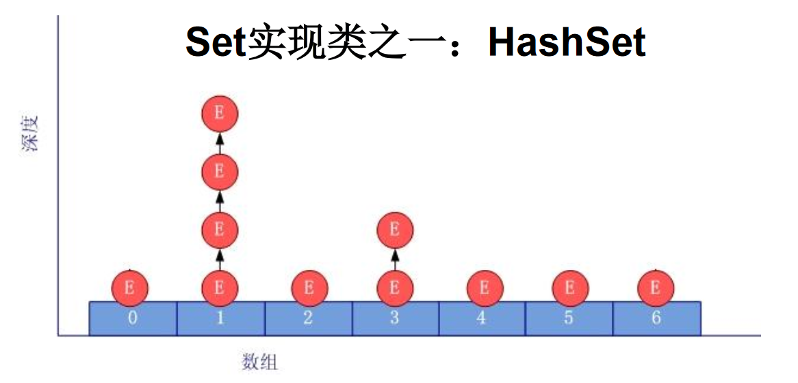

- 底层也是数组，初始容量为16，当如果使用率超过0.75，（16*0.75=12）就会扩大容量为原来的2倍。（16扩容为32，依次为64,128....等）

#### 关于hashCode()和equals()的重写

##### 重写hashCode() 方法的基本原则

- 在程序运行时，同一个对象多次调用hashCode() 方法应该返回相同的值。
- 当两个对象的equals() 方法比较返回true 时，这两个对象的hashCode() 方法的返回值也应相等。
- 对象中用作equals() 方法比较的Field，都应该用来计算hashCode 值。

##### 重写equals() 方法的基本原则

> 以自定义的Customer类为例，何时需要重写equals()？

- 当一个类有自己特有的“逻辑相等”概念,当改写equals()的时候，总是要改写hashCode()，根据一个类的equals方法（改写后），两个截然不同的实例有可能在逻辑上是相等的，但是，根据Object.hashCode()方法，它们仅仅是两个对象。
- 因此，违反了“**相等的对象必须具有相等的散列码**”。
- 结论：复写equals方法的时候一般都需要同时复写hashCode方法。通常参与计算hashCode的对象的属性也应该参与到equals()中进行计算。

##### Eclipse/IDEA工具里hashCode()的重写

> 以Eclipse/IDEA为例，在自定义类中可以调用工具自动重写equals和hashCode。问题：为什么用Eclipse/IDEA复写hashCode方法，有31这个数字？

- 选择系数的时候要选择尽量大的系数。因为如果计算出来的hash地址越大，所谓的“冲突”就越少，查找起来效率也会提高。（减少冲突）
- 并且31只占用5bits,相乘造成数据溢出的概率较小。
- 31可以由i*31== (i<<5)-1来表示,现在很多虚拟机里面都有做相关优化。（提高算法效率）
- 31是一个素数，素数作用就是如果我用一个数字来乘以这个素数，那么最终出来的结果只能被素数本身和被乘数还有1来整除！(减少冲突)

> ```java
> /**
>   * 2.要求：向Set(主要指：HashSet、LinkedHashSet)中添加的数据，其所在的类一定要重写hashCode()和equals()
>   *   要求：重写的hashCode()和equals()尽可能保持一致性：相等的对象必须具有相等的散列码
>   *        重写两个方法的小技巧：对象中用作 equals() 方法比较的 Field，都应该用来计算 hashCode 值。
>  */
> ```

#### LinkedHashSet的使用

- LinkedHashSet是HashSet的子类
- LinkedHashSet根据元素的hashCode值来决定元素的存储位置，但它同时使用双向链表维护元素的次序，这使得元素看起来是以**插入顺序保存**的。
- **LinkedHashSet插入性能略低于HashSet**，但在迭代访问Set 里的全部元素时有很好的性能。
- LinkedHashSet不允许集合元素重复。


```java
import org.junit.Test;

import java.util.Iterator;
import java.util.LinkedHashSet;
import java.util.Set;

public class SetTest {

    /**
     * LinkedHashSet的使用
     * LinkedHashSet作为HashSet的子类，在添加数据的同时，每个数据还维护了两个引用，记录此数据前一个
     * 数据和后一个数据。
     * 优点：对于频繁的遍历操作，LinkedHashSet效率高于HashSet
     */
    @Test
    public void test2(){
        Set set = new LinkedHashSet();
        set.add(456);
        set.add(123);
        set.add(123);
        set.add("AA");
        set.add("CC");
        set.add(new User("Tom",12));
        set.add(new User("Tom",12));
        set.add(129);

        Iterator iterator = set.iterator();
        while(iterator.hasNext()){
            System.out.println(iterator.next());
        }
    }
}
```

- User类

```java
/**
 *
 * @author subei
 * @create 2020-05-13 8:47
 */
public class User{
    private String name;
    private int age;

    public User() {
    }

    public User(String name, int age) {
        this.name = name;
        this.age = age;
    }

    public String getName() {
        return name;
    }

    public void setName(String name) {
        this.name = name;
    }

    public int getAge() {
        return age;
    }

    public void setAge(int age) {
        this.age = age;
    }

    @Override
    public String toString() {
        return "User{" +
                "name='" + name + '\'' +
                ", age=" + age +
                '}';
    }

    @Override
    public boolean equals(Object o) {
        System.out.println("User equals()....");
        if (this == o) return true;
        if (o == null || getClass() != o.getClass()) return false;

        User user = (User) o;

        if (age != user.age) return false;
        return name != null ? name.equals(user.name) : user.name == null;
    }

    @Override
    public int hashCode() { //return name.hashCode() + age;
        int result = name != null ? name.hashCode() : 0;
        result = 31 * result + age;
        return result;
    }
}
```

#### TreeSet的自然排序

- TreeSet是SortedSet接口的实现类，TreeSet可以确保集合元素处于排序状态。
- TreeSet底层使用**红黑树**结构存储数据
- 新增的方法如下：(了解)
  - Comparator comparator()
  - Object first()
  - Object last()
  - Object lower(Object e)
  - Object higher(Object e)
  - SortedSet subSet(fromElement, toElement)
  - SortedSet headSet(toElement)
  - SortedSet tailSet(fromElement)
- TreeSet两种排序方法：**自然排序和定制排序**。默认情况下，TreeSet采用自然排序。

- TreeSet和后面要讲的TreeMap采用红黑树的存储结构
- 特点：有序，查询速度比List快


------

- 自然排序：TreeSet会调用集合元素的compareTo(Object obj) 方法来比较元素之间的大小关系，然后将集合元素按升序(默认情况)排列。
- **如果试图把一个对象添加到TreeSet时，则该对象的类必须实现Comparable 接口**。
  - 实现Comparable 的类必须实现compareTo(Object obj) 方法，两个对象即通过compareTo(Object obj) 方法的返回值来比较大小。
- Comparable 的典型实现：
  - BigDecimal、BigInteger 以及所有的数值型对应的包装类：按它们对应的数值大小进行比较
  - Character：按字符的unicode值来进行比较
  - Boolean：true 对应的包装类实例大于false 对应的包装类实例
  - String：按字符串中字符的unicode 值进行比较
  - Date、Time：后边的时间、日期比前面的时间、日期大

- 向TreeSet中添加元素时，只有第一个元素无须比较compareTo()方法，后面添加的所有元素都会调用compareTo()方法进行比较。
- **因为只有相同类的两个实例才会比较大小，所以向TreeSet中添加的应该是同一个类的对象**。
- 对于TreeSet集合而言，它**判断两个对象是否相等的唯一标准**是：两个对象通过compareTo(Object obj) 方法比较返回值。
- 当需要把一个对象放入TreeSet中，重写该对象对应的equals() 方法时，应保证该方法与compareTo(Object obj) 方法有一致的结果：如果两个对象通过equals() 方法比较返回true，则通过compareTo(Object obj) 方法比较应返回0。否则，让人难以理解。

```java
import org.junit.Test;

import java.util.Iterator;
import java.util.TreeSet;

/**
 * 1.向TreeSet中添加的数据，要求是相同类的对象。
 * 2.两种排序方式：自然排序（实现Comparable接口） 和 定制排序（Comparator）
 * 3.自然排序中，比较两个对象是否相同的标准为：compareTo()返回0.不再是equals().
 * 4.定制排序中，比较两个对象是否相同的标准为：compare()返回0.不再是equals().
 *
 * @author subei
 * @create 2020-05-13 9:41
 */
public class TreeSetTest {

    @Test
    public void test() {
        TreeSet set = new TreeSet();

        //失败：不能添加不同类的对象
//        set.add(123);
//        set.add(456);
//        set.add("AA");
//        set.add(new User("Tom",12));

        //举例一：
//        set.add(34);
//        set.add(-34);
//        set.add(43);
//        set.add(11);
//        set.add(8);

        //举例二：
        set.add(new User("Tom",12));
        set.add(new User("Jerry",32));
        set.add(new User("Jim",2));
        set.add(new User("Mike",65));
        set.add(new User("Jack",33));
        set.add(new User("Jack",56));

        Iterator iterator = set.iterator();
        while(iterator.hasNext()){
            System.out.println(iterator.next());
        }
    }
}
```

- User类

```java
/**
 *
 * @author subei
 * @create 2020-05-13 8:47
 */
public class User implements Comparable{
    private String name;
    private int age;

    public User() {
    }

    public User(String name, int age) {
        this.name = name;
        this.age = age;
    }

    public String getName() {
        return name;
    }

    public void setName(String name) {
        this.name = name;
    }

    public int getAge() {
        return age;
    }

    public void setAge(int age) {
        this.age = age;
    }

    @Override
    public String toString() {
        return "User{" +
                "name='" + name + '\'' +
                ", age=" + age +
                '}';
    }

    @Override
    public boolean equals(Object o) {
        System.out.println("User equals()....");
        if (this == o) return true;
        if (o == null || getClass() != o.getClass()) return false;

        User user = (User) o;

        if (age != user.age) return false;
        return name != null ? name.equals(user.name) : user.name == null;
    }

    @Override
    public int hashCode() { //return name.hashCode() + age;
        int result = name != null ? name.hashCode() : 0;
        result = 31 * result + age;
        return result;
    }

    //按照姓名从大到小排列,年龄从小到大排列
    @Override
    public int compareTo(Object o) {
        if (o instanceof User) {
            User user = (User) o;
//            return this.name.compareTo(user.name);  //按照姓名从小到大排列
//            return -this.name.compareTo(user.name);  //按照姓名从大到小排列
            int compare = -this.name.compareTo(user.name);  //按照姓名从大到小排列
            if(compare != 0){   //年龄从小到大排列
                return compare;
            }else{
                return Integer.compare(this.age,user.age);
            }
        } else {
            throw new RuntimeException("输入的类型不匹配");
        }
    }
}
```

#### TreeSet的定制排序

- TreeSet的自然排序要求元素所属的类实现Comparable接口，如果元素所属的类没有实现Comparable接口，或不希望按照升序(默认情况)的方式排列元素或希望按照其它属性大小进行排序，则考虑使用定制排序。定制排序，通过Comparator接口来实现。需要重写compare(T o1,T o2)方法。
- 利用int compare(T o1,T o2)方法，比较o1和o2的大小：如果方法返回正整数，则表示o1大于o2；如果返回0，表示相等；返回负整数，表示o1小于o2。
- 要实现定制排序，需要将实现Comparator接口的实例作为形参传递给TreeSet的构造器。
- 此时，仍然只能向TreeSet中添加类型相同的对象。否则发生ClassCastException异常。
- 使用定制排序判断两个元素相等的标准是：通过Comparator比较两个元素返回了0。

```java
import org.junit.Test;

import java.util.Comparator;
import java.util.Iterator;
import java.util.TreeSet;

/**
 * 1.向TreeSet中添加的数据，要求是相同类的对象。
 * 2.两种排序方式：自然排序（实现Comparable接口） 和 定制排序（Comparator）
 * 3.自然排序中，比较两个对象是否相同的标准为：compareTo()返回0.不再是equals().
 * 4.定制排序中，比较两个对象是否相同的标准为：compare()返回0.不再是equals().
 *
 * @author subei
 * @create 2020-05-13 9:41
 */
public class TreeSetTest {

    @Test
    public void tets2(){
        Comparator com = new Comparator() {
            //按照年龄从小到大排列
            @Override
            public int compare(Object o1, Object o2) {
                if(o1 instanceof User && o2 instanceof User){
                    User u1 = (User)o1;
                    User u2 = (User)o2;
                    return Integer.compare(u1.getAge(),u2.getAge());
                }else{
                    throw new RuntimeException("输入的数据类型不匹配");
                }
            }
        };

        TreeSet set = new TreeSet(com);
        set.add(new User("Tom",12));
        set.add(new User("Jerry",32));
        set.add(new User("Jim",2));
        set.add(new User("Mike",65));
        set.add(new User("Mary",33));
        set.add(new User("Jack",33));
        set.add(new User("Jack",56));


        Iterator iterator = set.iterator();
        while(iterator.hasNext()){
            System.out.println(iterator.next());
        }
    }
}
```

- User类

```java
/**
 *
 * @author subei
 * @create 2020-05-13 8:47
 */
public class User implements Comparable{
    private String name;
    private int age;

    public User() {
    }

    public User(String name, int age) {
        this.name = name;
        this.age = age;
    }

    public String getName() {
        return name;
    }

    public void setName(String name) {
        this.name = name;
    }

    public int getAge() {
        return age;
    }

    public void setAge(int age) {
        this.age = age;
    }

    @Override
    public String toString() {
        return "User{" +
                "name='" + name + '\'' +
                ", age=" + age +
                '}';
    }

    @Override
    public boolean equals(Object o) {
        System.out.println("User equals()....");
        if (this == o) return true;
        if (o == null || getClass() != o.getClass()) return false;

        User user = (User) o;

        if (age != user.age) return false;
        return name != null ? name.equals(user.name) : user.name == null;
    }

    @Override
    public int hashCode() { //return name.hashCode() + age;
        int result = name != null ? name.hashCode() : 0;
        result = 31 * result + age;
        return result;
    }

    //按照姓名从大到小排列,年龄从小到大排列
    @Override
    public int compareTo(Object o) {
        if (o instanceof User) {
            User user = (User) o;
//            return this.name.compareTo(user.name);  //按照姓名从小到大排列
//            return -this.name.compareTo(user.name);  //按照姓名从大到小排列
            int compare = -this.name.compareTo(user.name);  //按照姓名从大到小排列
            if(compare != 0){   //年龄从小到大排列
                return compare;
            }else{
                return Integer.compare(this.age,user.age);
            }
        } else {
            throw new RuntimeException("输入的类型不匹配");
        }
    }
}
```

#### TreeSet的课后练习


- MyDate类

```java
/**
 * MyDate类包含:
 * private成员变量year,month,day；并为每一个属性定义getter,  setter 方法；
 *
 * @author subei
 * @create 2020-05-13 15:21
 */
public class MyDate implements Comparable{
    private int year;
    private int month;
    private int day;

    public int getYear() {
        return year;
    }

    public void setYear(int year) {
        this.year = year;
    }

    public int getMonth() {
        return month;
    }

    public void setMonth(int month) {
        this.month = month;
    }

    public int getDay() {
        return day;
    }

    public void setDay(int day) {
        this.day = day;
    }

    public MyDate() {
    }

    public MyDate(int year, int month, int day) {
        this.year = year;
        this.month = month;
        this.day = day;
    }

    @Override
    public String toString() {
        return "MyDate{" +
                "year=" + year +
                ", month=" + month +
                ", day=" + day +
                '}';
    }

    @Override
    public int compareTo(Object o) {
        if(o instanceof MyDate){
            MyDate m = (MyDate)o;

            //比较年
            int minusYear = this.getYear() - m.getYear();
            if(minusYear != 0){
                return minusYear;
            }
            //比较月
            int minusMonth = this.getMonth() - m.getMonth();
            if(minusMonth != 0){
                return minusMonth;
            }
            //比较日
            return this.getDay() - m.getDay();
        }

        throw new RuntimeException("传入的数据类型不一致！");

    }
}
```

- Employee类

```java
/**
 * 定义一个Employee类。
 * 该类包含：private成员变量name,age,birthday，
 * 其中birthday 为MyDate 类的对象；
 * 并为每一个属性定义getter, setter 方法；
 * 并重写toString 方法输出name, age, birthday
 *
 * @author subei
 * @create 2020-05-13 15:24
 */
public class Employee implements Comparable{
    private String name;
    private int age;
    private MyDate birthday;

    public String getName() {
        return name;
    }

    public void setName(String name) {
        this.name = name;
    }

    public int getAge() {
        return age;
    }

    public void setAge(int age) {
        this.age = age;
    }

    public MyDate getBirthday() {
        return birthday;
    }

    public void setBirthday(MyDate birthday) {
        this.birthday = birthday;
    }

    public Employee() {
    }

    public Employee(String name, int age, MyDate birthday) {
        this.name = name;
        this.age = age;
        this.birthday = birthday;
    }

    @Override
    public String toString() {
        return "Employee{" +
                "name='" + name + '\'' +
                ", age=" + age +
                ", birthday=" + birthday +
                '}';
    }

    //按name排序
    @Override
    public int compareTo(Object o){
        if(o instanceof Employee){
            Employee e = (Employee)o;
            return this.name.compareTo(e.name);
        }
//        return 0;
        throw new RuntimeException("传入的数据类型不一致");
    }
}
```

- 测试类

```java
import org.junit.Test;

import java.util.Comparator;
import java.util.Iterator;
import java.util.TreeSet;

/**
 * 创建该类的5 个对象，并把这些对象放入TreeSet 集合中
 * （下一章：TreeSet 需使用泛型来定义）分别按以下两种方式
 * 对集合中的元素进行排序，并遍历输出：
 *
 * 1). 使Employee 实现Comparable 接口，并按name 排序
 * 2). 创建TreeSet 时传入Comparator对象，按生日日期的先后排序。
 *
 * @author subei
 * @create 2020-05-13 15:30
 */
public class EmployeeTest {

    //问题二：按生日日期的先后排序
    @Test
    public void test2(){
        TreeSet set = new TreeSet(new Comparator() {
            @Override
            public int compare(Object o1, Object o2) {
                if(o1 instanceof Employee && o2 instanceof Employee){
                    Employee e1 = (Employee)o1;
                    Employee e2 = (Employee)o2;

                    MyDate b1 = e1.getBirthday();
                    MyDate b2 = e2.getBirthday();

                    //方式一：
//                    //比较年
//                    int minusYear = b1.getYear() - b2.getYear();
//                    if(minusYear != 0){
//                        return minusYear;
//                    }
//
//                    //比较月
//                    int minusMonth = b1.getMonth() - b2.getMonth();
//                    if(minusMonth != 0){
//                        return minusMonth;
//                    }
//
//                    //比较日
//                    return b1.getDay() - b2.getDay();

                    //方式二：
                    return b1.compareTo(b2);
                }
//                return 0;
                throw new RuntimeException("传入的数据类型不一致！");
            }
        });

        Employee e1 = new Employee("wangxianzhi",41,new MyDate(334,5,4));
        Employee e2 = new Employee("simaqian",43,new MyDate(-145,7,12));
        Employee e3 = new Employee("yanzhenqin",44,new MyDate(709,5,9));
        Employee e4 = new Employee("zhangqian",51,new MyDate(-179,8,12));
        Employee e5 = new Employee("quyuan",21,new MyDate(-340,12,4));

        set.add(e1);
        set.add(e2);
        set.add(e3);
        set.add(e4);
        set.add(e5);

        Iterator iterator = set.iterator();
        while (iterator.hasNext()){
            System.out.println(iterator.next());
        }
    }

    //问题一：使用自然排序
    @Test
    public void test(){
        TreeSet set = new TreeSet();

        Employee e1 = new Employee("wangxianzhi",41,new MyDate(334,5,4));
        Employee e2 = new Employee("simaqian",43,new MyDate(-145,7,12));
        Employee e3 = new Employee("yanzhenqin",44,new MyDate(709,5,9));
        Employee e4 = new Employee("zhangqian",51,new MyDate(-179,8,12));
        Employee e5 = new Employee("quyuan",21,new MyDate(-340,12,4));

        set.add(e1);
        set.add(e2);
        set.add(e3);
        set.add(e4);
        set.add(e5);

        Iterator iterator = set.iterator();
        while (iterator.hasNext()){
            System.out.println(iterator.next());
        }
    }
}
```

#### Set课后两道面试题

- 练习：在List内去除重复数字值，要求尽量简单

```java
import org.junit.Test;

import java.util.ArrayList;
import java.util.Collection;
import java.util.HashSet;
import java.util.List;

/**
 * @author subei
 * @create 2020-05-13 14:43
 */
public class CollectionTest {

    //练习：在List内去除重复数字值，要求尽量简单
    public static List duplicateList(List list) {
        HashSet set = new HashSet();
        set.addAll(list);
        return new ArrayList(set);
    }
    @Test
    public void test2(){
        List list = new ArrayList();
        list.add(new Integer(1));
        list.add(new Integer(2));
        list.add(new Integer(2));
        list.add(new Integer(4));
        list.add(new Integer(4));
        List list2 = duplicateList(list);
        for (Object integer : list2) {
            System.out.println(integer);
        }
    }
}
```

- 面试题

```java
import org.junit.Test;

import java.util.ArrayList;
import java.util.Collection;
import java.util.HashSet;
import java.util.List;

/**
 * @author subei
 * @create 2020-05-13 14:43
 */
public class CollectionTest {

    @Test
    public void test3(){
        HashSet set = new HashSet();
        Person p1 = new Person(1001,"AA");
        Person p2 = new Person(1002,"BB");

        set.add(p1);
        set.add(p2);
        System.out.println(set);

        p1.name = "CC";
        set.remove(p1);
        System.out.println(set);
        set.add(new Person(1001,"CC"));
        System.out.println(set);
        set.add(new Person(1001,"AA"));
        System.out.println(set);

    }
}
```

- Person类

```java
/**
 * @author subei
 * @create 2020-05-13 16:13
 */
public class Person {

    int id;
    String name;

    public Person(int id, String name) {
        this.id = id;
        this.name = name;
    }

    public Person() {

    }

    @Override
    public String toString() {
        return "Person{" +
                "id=" + id +
                ", name='" + name + '\'' +
                '}';
    }

    @Override
    public boolean equals(Object o) {
        if (this == o) return true;
        if (o == null || getClass() != o.getClass()) return false;

        Person person = (Person) o;

        if (id != person.id) return false;
        return name != null ? name.equals(person.name) : person.name == null;
    }

    @Override
    public int hashCode() {
        int result = id;
        result = 31 * result + (name != null ? name.hashCode() : 0);
        return result;
    }
}
```

### 6.Map接口
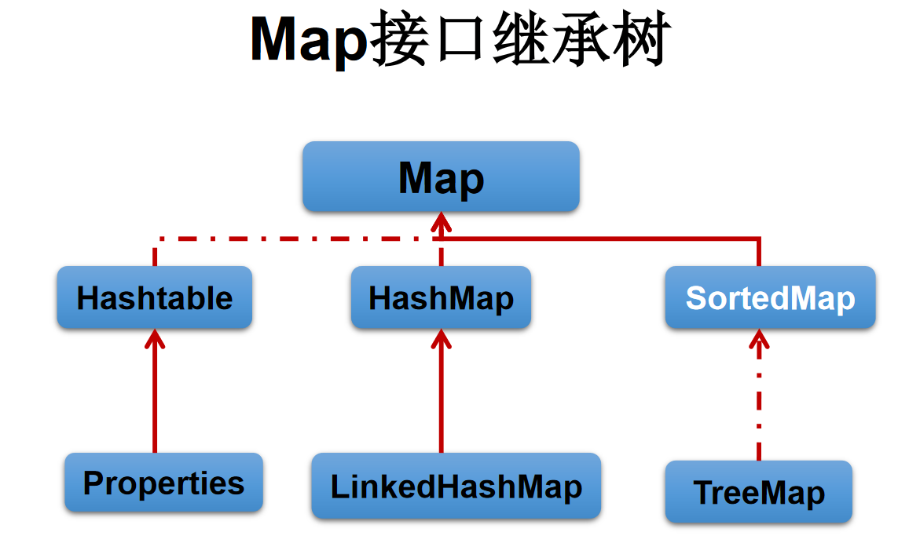

#### Map接口及其多个实现类的对比

```java
import org.junit.Test;

import java.util.HashMap;
import java.util.Map;

/**
 * 一、Map的实现类的结构：
 *  |----Map:双列数据，存储key-value对的数据   ---类似于高中的函数：y = f(x)
 *         |----HashMap:作为Map的主要实现类；线程不安全的，效率高；存储null的key和value
 *              |----LinkedHashMap:保证在遍历map元素时，可以按照添加的顺序实现遍历。
 *                      原因：在原有的HashMap底层结构基础上，添加了一对指针，指向前一个和后一个元素。
 *                      对于频繁的遍历操作，此类执行效率高于HashMap。
 *         |----TreeMap:保证按照添加的key-value对进行排序，实现排序遍历。此时考虑key的自然排序或定制排序
 *                      底层使用红黑树
 *         |----Hashtable:作为古老的实现类；线程安全的，效率低；不能存储null的key和value
 *              |----Properties:常用来处理配置文件。key和value都是String类型
 *
 *
 *      HashMap的底层：数组+链表  （jdk7及之前）
 *                    数组+链表+红黑树 （jdk 8）
 *
 *  面试题：
 *  1. HashMap的底层实现原理？
 *  2. HashMap 和 Hashtable的异同？
 *  3. CurrentHashMap 与 Hashtable的异同？（暂时不讲）
 *
 * @author subei
 * @create 2020-05-13 16:37
 */
public class MapTest {
    @Test
    public void test(){
        Map map = new HashMap();
//        map = new Hashtable();
        map.put(null,123);
    }
}
```

#### Map中存储的key-value的特点

- Map与Collection并列存在。用于保存具有映射关系的数据:key-value
- Map 中的key 和value 都可以是任何引用类型的数据
- Map 中的key 用Set来存放，不允许重复，即同一个Map 对象所对应的类，须重写hashCode()和equals()方法
- 常用String类作为Map的“键”
- key 和value 之间存在单向一对一关系，即通过指定的key 总能找到唯一的、确定的value
- Map接口的常用实现类：HashMap、TreeMap、LinkedHashMap和Properties。其中，HashMap是Map 接口使用频率最高的实现类

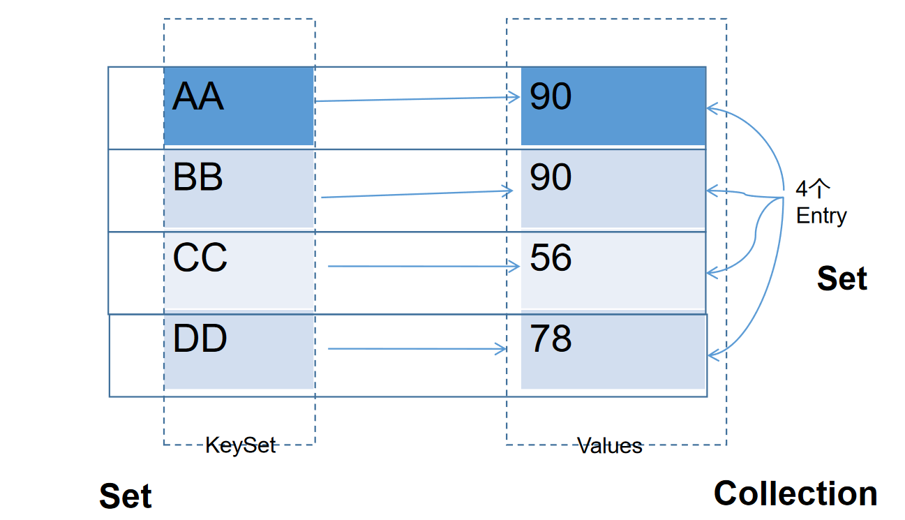

```java
 /**
   *  二、Map结构的理解：
   *    Map中的key:无序的、不可重复的，使用Set存储所有的key  ---> key所在的类要重写equals()和hashCode() （以HashMap为例）
   *    Map中的value:无序的、可重复的，使用Collection存储所有的value --->value所在的类要重写equals()
   *    一个键值对：key-value构成了一个Entry对象。
   *    Map中的entry:无序的、不可重复的，使用Set存储所有的entry
   *
   */   
```

#### Map实现类之一：HashMap

- **HashMap是Map 接口使用频率最高的实现类**。
- 允许使用null键和null值，与HashSet一样，不保证映射的顺序。
- 所有的key构成的集合是Set:无序的、不可重复的。所以，key所在的类要重写：equals()和hashCode()
- 所有的value构成的集合是Collection:无序的、可以重复的。所以，value所在的类要重写：equals()
- 一个key-value构成一个entry
- 所有的entry构成的集合是Set:无序的、不可重复的
- HashMap 判断两个key 相等的标准是：两个key 通过equals() 方法返回true，hashCode值也相等。
- HashMap判断两个value相等的标准是：两个value 通过equals() 方法返回true。

#### HashMap的底层实现原理

> JDK 7及以前版本：HashMap是数组+链表结构(即为链地址法)
>
> JDK 8版本发布以后：HashMap是数组+链表+红黑树实现。


- HashMap源码中的重要常量

```java
/*
 *      DEFAULT_INITIAL_CAPACITY : HashMap的默认容量，16
 *      DEFAULT_LOAD_FACTOR：HashMap的默认加载因子：0.75
 *      threshold：扩容的临界值，=容量*填充因子：16 * 0.75 => 12
 *      TREEIFY_THRESHOLD：Bucket中链表长度大于该默认值，转化为红黑树:8
 *      MIN_TREEIFY_CAPACITY：桶中的Node被树化时最小的hash表容量:64
*/
```

##### HashMap在JDK7中的底层实现原理

- HashMap的内部存储结构其实是**数组和链表的结合**。当实例化一个HashMap时，系统会创建一个长度为Capacity的Entry数组，这个长度在哈希表中被称为容量(Capacity)，在这个数组中可以存放元素的位置我们称之为“桶”(bucket)，每个bucket都有自己的索引，系统可以根据索引快速的查找bucket中的元素。
- 每个bucket中存储一个元素，即一个Entry对象，但每一个Entry对象可以带一个引用变量，用于指向下一个元素，因此，在一个桶中，就有可能生成一个Entry链。而且新添加的元素作为链表的head。
- 添加元素的过程：
  - 向HashMap中添加entry1(key，value)，需要首先计算entry1中key的哈希值(根据key所在类的hashCode()计算得到)，此哈希值经过处理以后，得到在底层Entry[]数组中要存储的位置i。如果位置i上没有元素，则entry1直接添加成功。如果位置i上已经存在entry2(或还有链表存在的entry3，entry4)，则需要通过循环的方法，依次比较entry1中key和其他的entry。如果彼此hash值不同，则直接添加成功。如果hash值不同，继续比较二者是否equals。如果返回值为true，则使用entry1的value去替换equals为true的entry的value。如果遍历一遍以后，发现所有的equals返回都为false,则entry1仍可添加成功。entry1指向原有的entry元素。

```java
/*
 * 三、HashMap的底层实现原理？以jdk7为例说明：
 *    HashMap map = new HashMap():
 *    在实例化以后，底层创建了长度是16的一维数组Entry[] table。
 *    ...可能已经执行过多次put...
 *    map.put(key1,value1):
 *    首先，调用key1所在类的hashCode()计算key1哈希值，此哈希值经过某种算法计算以后，得到在Entry数组中的存放位置。
 *    如果此位置上的数据为空，此时的key1-value1添加成功。 ----情况1
 *    如果此位置上的数据不为空，(意味着此位置上存在一个或多个数据(以链表形式存在)),比较key1和已经存在的一个或多个数据
 *    的哈希值：
 *           如果key1的哈希值与已经存在的数据的哈希值都不相同，此时key1-value1添加成功。----情况2
 *           如果key1的哈希值和已经存在的某一个数据(key2-value2)的哈希值相同，继续比较：调用key1所在类的equals(key2)方法，比较：
 *                如果equals()返回false:此时key1-value1添加成功。----情况3
 *                如果equals()返回true:使用value1替换value2。
 *
 *   补充：关于情况2和情况3：此时key1-value1和原来的数据以链表的方式存储。
 *
 *   在不断的添加过程中，会涉及到扩容问题，当超出临界值(且要存放的位置非空)时，扩容。默认的扩容方式：扩容为原来容量的2倍，并将原有的数据复制过来。
 *
 */
```

```java
/**
  * HashMap的扩容
  *     当HashMap中的元素越来越多的时候，hash冲突的几率也就越来越高，
  *     因为数组的长度是固定的。所以为了提高查询的效率，
  *     就要对HashMap的数组进行扩容，而在HashMap数组扩容之后，
  *     最消耗性能的点就出现了：原数组中的数据必须重新计算其在新数组中的位置，
  *     并放进去，这就是resize。
  *     
  * 那么HashMap什么时候进行扩容呢？
  *      当HashMap中的元素个数超过数组大小(数组总大小length,
  *      不是数组中个数size)*loadFactor时，就 会 进 行 数 组 扩 容，
  *      loadFactor的默认值(DEFAULT_LOAD_FACTOR)为0.75，这是一个折中的取值。
  *      也就是说，默认情况下，数组大小(DEFAULT_INITIAL_CAPACITY)为16，
  *      那么当HashMap中元素个数超过16*0.75=12（这个值就是代码中的threshold值，
  *      也叫做临界值）的时候，就把数组的大小扩展为2*16=32，即扩大一倍，
  *      然后重新计算每个元素在数组中的位置，而这是一个非常消耗性能的操作，
  *      所以如果我们已经预知HashMap中元素的个数，
  *      那么预设元素的个数能够有效的提高HashMap的性能。
  */
```

##### HashMap在JDK8中的底层实现原理

- HashMap的内部存储结构其实是数组+链表+树的结合。当实例化一个HashMap时，会初始化initialCapacity和loadFactor，在put第一对映射关系时，系统会创建一个长度为initialCapacity的Node数组，这个长度在哈希表中被称为容量(Capacity)，在这个数组中可以存放元素的位置我们称之为“桶”(bucket)，每个bucket都有自己的索引，系统可以根据索引快速的查找bucket中的元素。
- 每个bucket中存储一个元素，即一个Node对象，但每一个Node对象可以带一个引用变量next，用于指向下一个元素，因此，在一个桶中，就有可能生成一个Node链。也可能是一个一个TreeNode对象，每一个TreeNode对象可以有两个叶子结点left和right，因此，在一个桶中，就有可能生成一个TreeNode树。而新添加的元素作为链表的last，或树的叶子结点。

- **那么HashMap什么时候进行扩容和树形化呢？**

  > 当HashMap中的元素个数超过数组大小(数组总大小length,不是数组中个数size)*loadFactor时，就会进行数组扩容，loadFactor的默认值(DEFAULT_LOAD_FACTOR)为0.75，这是一个折中的取值。也就是说，默认情况下，数组大小(DEFAULT_INITIAL_CAPACITY)为16，那么当HashMap中元素个数超过16*0.75=12（这个值就是代码中的threshold值，也叫做临界值）的时候，就把数组的大小扩展为2*16=32，即扩大一倍，然后重新计算每个元素在数组中的位置，而这是一个非常消耗性能的操作，所以如果我们已经预知HashMap中元素的个数，那么预设元素的个数能够有效的提高HashMap的性能。

- 当HashMap中的其中一个链的对象个数如果达到了8个，此时如果capacity没有达到64，那么HashMap会先扩容解决，如果已经达到了64，那么这个链会变成树，结点类型由Node变成TreeNode类型。当然，如果当映射关系被移除后，下次resize方法时判断树的结点个数低于6个，也会把树再转为链表。

- **关于映射关系的key是否可以修改？answer：不要修改**

  > 映射关系存储到HashMap中会存储key的hash值，这样就不用在每次查找时重新计算每一个Entry或Node（TreeNode）的hash值了，因此如果已经put到Map中的映射关系，再修改key的属性，而这个属性又参与hashcode值的计算，那么会导致匹配不上。

```java
/* 总结：
 *   jdk8 相较于jdk7在底层实现方面的不同：
 *      1.new HashMap():底层没有创建一个长度为16的数组
 *      2.jdk 8底层的数组是：Node[],而非Entry[]
 *      3.首次调用put()方法时，底层创建长度为16的数组
 *      4.jdk7底层结构只有：数组+链表。jdk8中底层结构：数组+链表+红黑树。
 *         4.1形成链表时，七上八下（jdk7:新的元素指向旧的元素。jdk8：旧的元素指向新的元素）
 *         4.2当数组的某一个索引位置上的元素以链表形式存在的数据个数 > 8 且当前数组的长度 > 64时，此时此索引位置上的所数据改为使用红黑树存储。
 */
```

#### LinkedHashMap的底层实现原理（了解！！！）

- LinkedHashMap是HashMap的子类
- 在HashMap存储结构的基础上，使用了一对双向链表来记录添加元素的顺序
- 与LinkedHashSet类似，LinkedHashMap可以维护Map 的迭代顺序：迭代顺序与Key-Value 对的插入顺序一致

- HashMap中的内部类：Node


- LinkedHashMap中的内部类：Entry


```java
/*
 *  四、LinkedHashMap的底层实现原理（了解）
 *      源码中：
 *      static class Entry<K,V> extends HashMap.Node<K,V> {
 *            Entry<K,V> before, after;//能够记录添加的元素的先后顺序
 *            Entry(int hash, K key, V value, Node<K,V> next) {
 *               super(hash, key, value, next);
 *            }
 *        } 
 */
import org.junit.Test;

import java.util.HashMap;
import java.util.LinkedHashMap;
import java.util.Map;

public class MapTest {

    @Test
    public void test2(){
        Map map = new HashMap();
        map = new LinkedHashMap();
        map.put(123,"AA");
        map.put(345,"BB");
        map.put(12,"CC");

        System.out.println(map);
    }
}
```

#### Map中的常用方法1

```java
import org.junit.Test;

import java.util.*;
/**
 *  五、Map中定义的方法：
 *      添加、删除、修改操作：
 *      Object put(Object key,Object value)：将指定key-value添加到(或修改)当前map对象中
 *      void putAll(Map m):将m中的所有key-value对存放到当前map中
 *      Object remove(Object key)：移除指定key的key-value对，并返回value
 *      void clear()：清空当前map中的所有数据
 *      元素查询的操作：
 *      Object get(Object key)：获取指定key对应的value
 *      boolean containsKey(Object key)：是否包含指定的key
 *      boolean containsValue(Object value)：是否包含指定的value
 *      int size()：返回map中key-value对的个数
 *      boolean isEmpty()：判断当前map是否为空
 *      boolean equals(Object obj)：判断当前map和参数对象obj是否相等
 *      元视图操作的方法：
 *      Set keySet()：返回所有key构成的Set集合
 *      Collection values()：返回所有value构成的Collection集合
 *      Set entrySet()：返回所有key-value对构成的Set集合
 *
 *
 * @author subei
 * @create 2020-05-13 16:37
 */
public class MapTest {

    /**
     *  元素查询的操作：
     *  Object get(Object key)：获取指定key对应的value
     *  boolean containsKey(Object key)：是否包含指定的key
     *  boolean containsValue(Object value)：是否包含指定的value
     *  int size()：返回map中key-value对的个数
     *  boolean isEmpty()：判断当前map是否为空
     *  boolean equals(Object obj)：判断当前map和参数对象obj是否相等
     */
    @Test
    public void test4(){
        Map map = new HashMap();
        map.put("AA",123);
        map.put(45,123);
        map.put("BB",56);
        // Object get(Object key)
        System.out.println(map.get(45));
        //containsKey(Object key)
        boolean isExist = map.containsKey("BB");
        System.out.println(isExist);

        isExist = map.containsValue(123);
        System.out.println(isExist);

        map.clear();

        System.out.println(map.isEmpty());
    }

    /**
     * 添加、删除、修改操作：
     *  Object put(Object key,Object value)：将指定key-value添加到(或修改)当前map对象中
     *  void putAll(Map m):将m中的所有key-value对存放到当前map中
     *  Object remove(Object key)：移除指定key的key-value对，并返回value
     *  void clear()：清空当前map中的所有数据
     */
    @Test
    public void test3(){
        Map map = new HashMap();
        //添加
        map.put("AA",123);
        map.put(45,123);
        map.put("BB",56);
        //修改
        map.put("AA",87);

        System.out.println(map);

        Map map1 = new HashMap();
        map1.put("CC",123);
        map1.put("DD",456);
        map.putAll(map1);

        System.out.println(map);

        //remove(Object key)
        Object value = map.remove("CC");
        System.out.println(value);
        System.out.println(map);

        //clear()
        map.clear();//与map = null操作不同
        System.out.println(map.size());
        System.out.println(map);
    }
}
```

#### Map中的常用方法2

```java
import org.junit.Test;

import java.util.*;
/**
 *  五、Map中定义的方法：
 *      添加、删除、修改操作：
 *      Object put(Object key,Object value)：将指定key-value添加到(或修改)当前map对象中
 *      void putAll(Map m):将m中的所有key-value对存放到当前map中
 *      Object remove(Object key)：移除指定key的key-value对，并返回value
 *      void clear()：清空当前map中的所有数据
 *      元素查询的操作：
 *      Object get(Object key)：获取指定key对应的value
 *      boolean containsKey(Object key)：是否包含指定的key
 *      boolean containsValue(Object value)：是否包含指定的value
 *      int size()：返回map中key-value对的个数
 *      boolean isEmpty()：判断当前map是否为空
 *      boolean equals(Object obj)：判断当前map和参数对象obj是否相等
 *      元视图操作的方法：
 *      Set keySet()：返回所有key构成的Set集合
 *      Collection values()：返回所有value构成的Collection集合
 *      Set entrySet()：返回所有key-value对构成的Set集合
 *
 * 总结：常用方法：
 *    添加：put(Object key,Object value)
 *    删除：remove(Object key)
 *    修改：put(Object key,Object value)
 *    查询：get(Object key)
 *    长度：size()
 *    遍历：keySet() / values() / entrySet()
 *
 *  面试题：
 *  1. HashMap的底层实现原理？
 *  2. HashMap 和 Hashtable的异同？
 *      1.HashMap与Hashtable都实现了Map接口。由于HashMap的非线程安全性，效率上可能高于Hashtable。Hashtable的方法是Synchronize的，而HashMap不是，在多个线程访问Hashtable时，不需要自己为它的方法实现同步，而HashMap 就必须为之提供外同步。
 *      2.HashMap允许将null作为一个entry的key或者value，而Hashtable不允许。
 *      3.HashMap把Hashtable的contains方法去掉了，改成containsvalue和containsKey。因为contains方法容易让人引起误解。
 *      4.Hashtable继承自Dictionary类，而HashMap是Java1.2引进的Map interface的一个实现。
 *      5.Hashtable和HashMap采用的hash/rehash算法都大概一样，所以性能不会有很大的差异。
 *
 *  3. CurrentHashMap 与 Hashtable的异同？（暂时不讲）
 *
 * @author subei
 * @create 2020-05-13 16:37
 */
public class MapTest {

    /**
     *  元视图操作的方法：
     *  Set keySet()：返回所有key构成的Set集合
     *  Collection values()：返回所有value构成的Collection集合
     *  Set entrySet()：返回所有key-value对构成的Set集合
     */
    @Test
    public void test5(){
        Map map = new HashMap();
        map.put("AA",123);
        map.put(45,1234);
        map.put("BB",56);

        //遍历所有的key集：keySet()
        Set set = map.keySet();
        Iterator iterator = set.iterator();
        while(iterator.hasNext()){
            System.out.println(iterator.next());
        }
        System.out.println("*****************");

        //遍历所有的values集：values()
        Collection values = map.values();
        for(Object obj : values){
            System.out.println(obj);
        }
        System.out.println("***************");
        //遍历所有的key-values
        //方式一：
        Set entrySet = map.entrySet();
        Iterator iterator1 = entrySet.iterator();
        while (iterator1.hasNext()){
            Object obj = iterator1.next();
            //entrySet集合中的元素都是entry
            Map.Entry entry = (Map.Entry) obj;
            System.out.println(entry.getKey() + "---->" + entry.getValue());

        }
        System.out.println("/////////////////");

        //方式二：
        Set keySet = map.keySet();
        Iterator iterator2 = keySet.iterator();
        while(iterator2.hasNext()){
            Object key = iterator2.next();
            Object value = map.get(key);
            System.out.println(key + "=====" + value);
        }
    }
}
```

#### TreeMap两种添加方式的使用

- TreeMap存储Key-Value 对时，需要根据key-value 对进行排序。TreeMap可以保证所有的Key-Value 对处于**有序**状态。
- TreeSet底层使用**红黑树**结构存储数据
- TreeMap的Key 的排序：
  - **自然排序**：TreeMap的所有的Key 必须实现Comparable 接口，而且所有的Key 应该是同一个类的对象，否则将会抛出ClasssCastException
  - **定制排序**：创建TreeMap时，传入一个Comparator 对象，该对象负责对TreeMap中的所有key 进行排序。此时不需要Map 的Key 实现Comparable 接口
- TreeMap判断**两个key相等**的标准：两个key通过compareTo()方法或者compare()方法返回0。

- User类

```java
/**
 * @author subei
 * @create 2020-05-13 19:24
 */
public class User implements Comparable{
    private String name;
    private int age;

    public User() {
    }

    public User(String name, int age) {
        this.name = name;
        this.age = age;
    }

    public String getName() {
        return name;
    }

    public void setName(String name) {
        this.name = name;
    }

    public int getAge() {
        return age;
    }

    public void setAge(int age) {
        this.age = age;
    }

    @Override
    public String toString() {
        return "User{" +
                "name='" + name + '\'' +
                ", age=" + age +
                '}';
    }

    @Override
    public boolean equals(Object o) {
        System.out.println("User equals()....");
        if (this == o) return true;
        if (o == null || getClass() != o.getClass()) return false;

        User user = (User) o;

        if (age != user.age) return false;
        return name != null ? name.equals(user.name) : user.name == null;
    }

    @Override
    public int hashCode() { //return name.hashCode() + age;
        int result = name != null ? name.hashCode() : 0;
        result = 31 * result + age;
        return result;
    }

    //按照姓名从大到小排列,年龄从小到大排列
    @Override
    public int compareTo(Object o) {
        if(o instanceof User){
            User user = (User)o;
//            return -this.name.compareTo(user.name);
            int compare = -this.name.compareTo(user.name);
            if(compare != 0){
                return compare;
            }else{
                return Integer.compare(this.age,user.age);
            }
        }else{
            throw new RuntimeException("输入的类型不匹配");
        }

    }
}
```

- 测试类

```java
import org.junit.Test;

import java.util.*;

/**
 *
 * @author subei
 * @create 2020-05-13 19:23
 */
public class TreeMapTest {

    /**
     * 向TreeMap中添加key-value，要求key必须是由同一个类创建的对象
     * 因为要按照key进行排序：自然排序 、定制排序
     */
    //自然排序
    @Test
    public void test(){
        TreeMap map = new TreeMap();
        User u1 = new User("Tom",23);
        User u2 = new User("Jerry",32);
        User u3 = new User("Jack",20);
        User u4 = new User("Rose",18);

        map.put(u1,98);
        map.put(u2,89);
        map.put(u3,76);
        map.put(u4,100);

        Set entrySet = map.entrySet();
        Iterator iterator1 = entrySet.iterator();
        while (iterator1.hasNext()){
            Object obj = iterator1.next();
            Map.Entry entry = (Map.Entry) obj;
            System.out.println(entry.getKey() + "---->" + entry.getValue());

        }
    }

    //定制排序
    @Test
    public void test2(){
        TreeMap map = new TreeMap(new Comparator() {
            @Override
            public int compare(Object o1, Object o2) {
                if(o1 instanceof User && o2 instanceof User){
                    User u1 = (User)o1;
                    User u2 = (User)o2;
                    return Integer.compare(u1.getAge(),u2.getAge());
                }
                throw new RuntimeException("输入的类型不匹配！");
            }
        });
        User u1 = new User("Tom",23);
        User u2 = new User("Jerry",32);
        User u3 = new User("Jack",20);
        User u4 = new User("Rose",18);

        map.put(u1,98);
        map.put(u2,89);
        map.put(u3,76);
        map.put(u4,100);

        Set entrySet = map.entrySet();
        Iterator iterator1 = entrySet.iterator();
        while (iterator1.hasNext()){
            Object obj = iterator1.next();
            Map.Entry entry = (Map.Entry) obj;
            System.out.println(entry.getKey() + "---->" + entry.getValue());

        }
    }
}
```

#### Hashtable

- Hashtable是个古老的Map 实现类，JDK1.0就提供了。不同于HashMap，Hashtable是线程安全的。
- Hashtable实现原理和HashMap相同，功能相同。底层都使用哈希表结构，查询速度快，很多情况下可以互用。
- 与HashMap不同，Hashtable不允许使用null 作为key 和value
- 与HashMap一样，Hashtable也不能保证其中Key-Value 对的顺序
- Hashtable判断两个key相等、两个value相等的标准，与HashMap一致。

#### Properties处理属性文件

- Properties 类是Hashtable的子类，该对象用于处理属性文件
- 由于属性文件里的key、value 都是字符串类型，所以**Properties 里的key 和value 都是字符串类型**
- 存取数据时，建议使用setProperty(String key,Stringvalue)方法和getProperty(String key)方法

------

1. 新建jdbc.properties文件


2. 编写源代码

```java
import java.io.FileInputStream;
import java.io.IOException;
import java.util.Properties;

/**
 * @author subei
 * @create 2020-05-13 19:45
 */
public class PropertiesTest {
    //Properties:常用来处理配置文件。key和value都是String类型
    public static void main(String[] args){
        //快捷键：ALT+Shift+Z
        FileInputStream fis = null;
        try {
            Properties pros = new Properties();
            fis = new FileInputStream("jdbc.properties");
            pros.load(fis); //加载流对应文件

            String name = pros.getProperty("name");
            String password = pros.getProperty("password");

            System.out.println("name = " + name + ",password = " + password);
        } catch (IOException e) {
            e.printStackTrace();
        } finally {
            if(fis != null){
                try {
                    fis.close();
                } catch (IOException e) {
                    e.printStackTrace();
                }
            }
        }
    }
}
```

> 如果jdbc.properties文件中写入为中文；
>
> 防止jdbc.properties出现中文乱码，可根据如下解决：

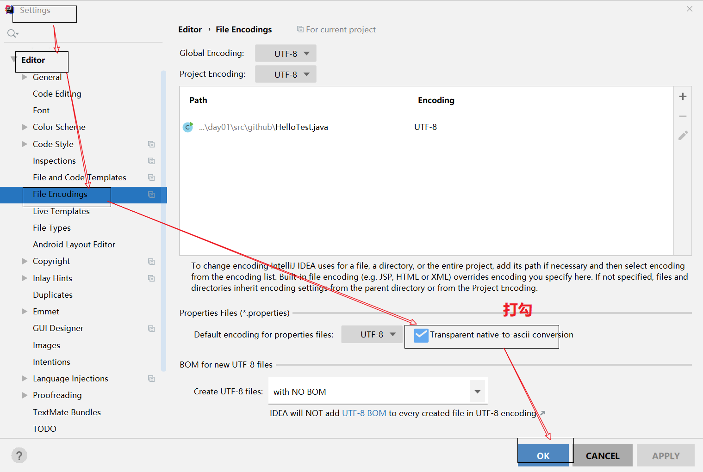

2.新建jdbc.properties


### 7.Collections工具类

- 操作数组的工具类：Arrays

- Collections 是一个操作Set、List和Map 等集合的工具类
- Collections 中提供了一系列静态的方法对集合元素进行排序、查询和修改等操作，还提供了对集合对象设置不可变、对集合对象实现同步控制等方法
- 排序操作：（均为static方法）
  - reverse(List)：反转List 中元素的顺序
  - shuffle(List)：对List集合元素进行随机排序
  - sort(List)：根据元素的自然顺序对指定List 集合元素按升序排序
  - sort(List，Comparator)：根据指定的Comparator 产生的顺序对List 集合元素进行排序
  - swap(List，int，int)：将指定list 集合中的i处元素和j 处元素进行交换

#### Collections工具类常用方法的测试

```java
import org.junit.Test;

import java.util.ArrayList;
import java.util.Arrays;
import java.util.Collections;
import java.util.List;

/**
 * Collections:操作Collection、Map的工具类
 *
 * 面试题：Collection 和 Collections的区别？
 *       Collection是集合类的上级接口，继承于他的接口主要有Set 和List.
 *       Collections是针对集合类的一个帮助类，他提供一系列静态方法实现对各种集合的搜索、排序、线程安全化等操作.
 *
 * @author subei
 * @create 2020-05-13 19:59
 */
public class CollectionTest {
    /**
     * reverse(List)：反转 List 中元素的顺序
     * shuffle(List)：对 List 集合元素进行随机排序
     * sort(List)：根据元素的自然顺序对指定 List 集合元素按升序排序
     * sort(List，Comparator)：根据指定的 Comparator 产生的顺序对 List 集合元素进行排序
     * swap(List，int， int)：将指定 list 集合中的 i 处元素和 j 处元素进行交换
     *
     * Object max(Collection)：根据元素的自然顺序，返回给定集合中的最大元素
     * Object max(Collection，Comparator)：根据 Comparator 指定的顺序，返回给定集合中的最大元素
     * Object min(Collection)
     * Object min(Collection，Comparator)
     * int frequency(Collection，Object)：返回指定集合中指定元素的出现次数
     * void copy(List dest,List src)：将src中的内容复制到dest中
     * boolean replaceAll(List list，Object oldVal，Object newVal)：使用新值替换 List 对象的所有旧值
     *
     */

    @Test
    public void test(){
        List list = new ArrayList();
        list.add(123);
        list.add(43);
        list.add(765);
        list.add(765);
        list.add(765);
        list.add(-97);
        list.add(0);

        System.out.println(list);

//        Collections.reverse(list);
//        Collections.shuffle(list);
//        Collections.sort(list);
//        Collections.swap(list,1,2);
        int frequency = Collections.frequency(list, 123);

        System.out.println(list);
        System.out.println(frequency);
    }

    @Test
    public void test2(){
        List list = new ArrayList();
        list.add(123);
        list.add(43);
        list.add(765);
        list.add(-97);
        list.add(0);

        //报异常：IndexOutOfBoundsException("Source does not fit in dest")
//        List dest = new ArrayList();
//        Collections.copy(dest,list);
        //正确的：
        List dest = Arrays.asList(new Object[list.size()]);
        System.out.println(dest.size());//list.size();
        Collections.copy(dest,list);

        System.out.println(dest);

        /**
         * Collections 类中提供了多个 synchronizedXxx() 方法，
         * 该方法可使将指定集合包装成线程同步的集合，从而可以解决
         * 多线程并发访问集合时的线程安全问题
         */
        //返回的list1即为线程安全的List
        List list1 = Collections.synchronizedList(list);
    }
}
```

#### 补充：Enumeration(了解！！！)

- Enumeration 接口是Iterator迭代器的“古老版本”


```java
Enumeration stringEnum = new StringTokenizer("a-b*c-d-e-g", "-");
    while(stringEnum.hasMoreElements()){
        Object obj= stringEnum.nextElement();System.out.println(obj); 
    }
```

##  IO 
### 1.File类的使用
#### File类的实例化

- java.io.File类：文件和文件目录路径的抽象表示形式，与平台无关
- File 能新建、删除、重命名文件和目录，但File 不能访问文件内容本身。如果需要访问文件内容本身，则需要使用输入/输出流。
- 想要在Java程序中表示一个真实存在的文件或目录，那么必须有一个File对象，但是Java程序中的一个File对象，可能没有一个真实存在的文件或目录。
- File对象可以作为参数传递给流的构造器

```java
import org.junit.Test;
import java.io.File;

/**
 * File类的使用
 *
 * 1. File类的一个对象，代表一个文件或一个文件目录(俗称：文件夹)
 * 2. File类声明在java.io包下
 *
 * @author subei
 * @create 2020-05-14 21:50
 */
public class FileTest {
    /**
     * 1.如何创建file类的实例
     *      File(String filePath):以filePath为路径创建File对象，可以是绝对路径或者相对路径
     *      File(String parentPath,String childPath):以parentPath为父路径，childPath为子路径创建File对象。
     *      File(File parentFile,String childPath):根据一个父File对象和子文件路径创建File对象
     * 2.
     *   相对路径：相较于某个路径下，指明的路径。
     *   绝对路径：包含盘符在内的文件或文件目录的路径
     *
     * 3.路径分隔符
     *      windows:\\
     *      unix:/
     * 4.Java程序支持跨平台运行，因此路径分隔符要慎用。
     *
     * 5.为了解决这个隐患，File类提供了一个常量：
     *   public  static final String separator。
     *   根据操作系统，动态的提供分隔符。
     *
     * File file1= new File("d:\\Work\\info.txt");
     * File file2= new File("d:"+ File.separator+ "Work"+ File.separator+ "info.txt");
     * File file3= new File("d:/Work");
     *
     */
    @Test
    public void test(){
        //构造器1：
        File file1 = new File("hello.txt");//相对于当前module
        File file2 = new File("F:\\java\\Work2\\JavaSenior\\day08\\num.txt");

        System.out.println(file1);
        System.out.println(file2);

        //构造器2：
        File file3 = new File("D:\\workspace_idea1","JavaSenior");
        System.out.println(file3);

        //构造器3：
        File file4 = new File(file3,"hi.txt");
        System.out.println(file4);
    }

}
```

#### File类的常用方法1

```java
import org.junit.Test;

import java.io.File;
import java.util.Date;

/**
 * File类的使用
 *
 * 1. File类的一个对象，代表一个文件或一个文件目录(俗称：文件夹)
 * 2. File类声明在java.io包下
 *
 * @author subei
 * @create 2020-05-14 21:50
 */
public class FileTest {

    /**
     * public String getAbsolutePath()：获取绝对路径
     * public String getPath() ：获取路径
     * public String getName() ：获取名称
     * public String getParent()：获取上层文件目录路径。若无，返回null
     * public long length() ：获取文件长度（即：字节数）。不能获取目录的长度。
     * public long lastModified() ：获取最后一次的修改时间，毫秒值
     *
     * 如下的两个方法适用于文件目录：
     * public String[] list() ：获取指定目录下的所有文件或者文件目录的名称数组
     * public File[] listFiles() ：获取指定目录下的所有文件或者文件目录的File数组
     */
    @Test
    public void test2(){
        File file = new File("Hello.txt");
        File file2 = new File("F:\\java\\Work2\\JavaSenior\\day08\\num.txt");

        System.out.println(file.getAbsolutePath());
        System.out.println(file.getPath());
        System.out.println(file.getName());
        System.out.println(file.getParent());
        System.out.println(file.length());
        System.out.println(new Date(file.lastModified()));

        System.out.println();

        System.out.println(file2.getAbsolutePath());
        System.out.println(file2.getPath());
        System.out.println(file2.getName());
        System.out.println(file2.getParent());
        System.out.println(file2.length());
        System.out.println(file2.lastModified());
    }

    @Test
    public void test3(){
        //文件需存在！！！
        File file = new File("F:\\java\\Work2\\JavaSenior");

        String[] list = file.list();
        for(String s : list){
            System.out.println(s);
        }

        System.out.println();

        File[] files = file.listFiles();
        for(File f : files){
            System.out.println(f);
        }
    }

    /**
     * File类的重命名功能
     *
     *  public boolean renameTo(File dest):把文件重命名为指定的文件路径
     *    比如：file1.renameTo(file2)为例：
     *         要想保证返回true,需要file1在硬盘中是存在的，且file2不能在硬盘中存在。
     */
    @Test
    public void test4(){
        File file1 = new File("hello.txt");
        File file2 = new File("D:\\book\\num.txt");

        boolean renameTo = file2.renameTo(file1);
        System.out.println(renameTo);
    }
}
```

#### File类的常用方法2


```java
import org.junit.Test;

import java.io.File;
import java.io.IOException;
import java.util.Date;

/**
 * File类的使用
 *
 * 1. File类的一个对象，代表一个文件或一个文件目录(俗称：文件夹)
 * 2. File类声明在java.io包下
 * 3. File类中涉及到关于文件或文件目录的创建、删除、重命名、修改时间、文件大小等方法，
 *    并未涉及到写入或读取文件内容的操作。如果需要读取或写入文件内容，必须使用IO流来完成。
 * 4. 后续File类的对象常会作为参数传递到流的构造器中，指明读取或写入的"终点".
 *
 * @author subei
 * @create 2020-05-14 21:50
 */
public class FileTest {

    /**
     * public boolean isDirectory()：判断是否是文件目录
     * public boolean isFile() ：判断是否是文件
     * public boolean exists() ：判断是否存在
     * public boolean canRead() ：判断是否可读
     * public boolean canWrite() ：判断是否可写
     * public boolean isHidden() ：判断是否隐藏
     */
    @Test
    public void test5(){
        File file1 = new File("hello.txt");
        file1 = new File("hello1.txt");

        System.out.println(file1.isDirectory());
        System.out.println(file1.isFile());
        System.out.println(file1.exists());
        System.out.println(file1.canRead());
        System.out.println(file1.canWrite());
        System.out.println(file1.isHidden());

        System.out.println();

        File file2 = new File("D:\\book");
        file2 = new File("D:\\book1");
        System.out.println(file2.isDirectory());
        System.out.println(file2.isFile());
        System.out.println(file2.exists());
        System.out.println(file2.canRead());
        System.out.println(file2.canWrite());
        System.out.println(file2.isHidden());
    }

    /**
     * 创建硬盘中对应的文件或文件目录
     * public boolean createNewFile() ：创建文件。若文件存在，则不创建，返回false
     * public boolean mkdir() ：创建文件目录。如果此文件目录存在，就不创建了。如果此文件目录的上层目录不存在，也不创建。
     * public boolean mkdirs() ：创建文件目录。如果此文件目录存在，就不创建了。如果上层文件目录不存在，一并创建
     *
     *     删除磁盘中的文件或文件目录
     * public boolean delete()：删除文件或者文件夹
     *     删除注意事项：Java中的删除不走回收站。
     */
    @Test
    public void test6() throws IOException {
        File file1 = new File("hi.txt");
        if(!file1.exists()){
            //文件的创建
            file1.createNewFile();
            System.out.println("创建成功");
        }else{//文件存在
            file1.delete();
            System.out.println("删除成功");
        }
    }

    @Test
    public void test7(){
        //文件目录的创建
        File file1 = new File("d:\\io\\io1\\io3");

        boolean mkdir = file1.mkdir();
        if(mkdir){
            System.out.println("创建成功1");
        }

        File file2 = new File("d:\\io\\io1\\io4");

        boolean mkdir1 = file2.mkdirs();
        if(mkdir1){
            System.out.println("创建成功2");
        }
        //要想删除成功，io4文件目录下不能有子目录或文件
        File file3 = new File("D:\\io\\io1\\io4");
        file3 = new File("D:\\io\\io1");
        System.out.println(file3.delete());
    }
}
```

#### 课后练习


1. FileTest类

```java
import org.junit.Test;

import java.io.File;
import java.io.IOException;

/**
 * 1. 利用File构造器，new一个文件目录file
 *    1)在其中创建多个文件和目录
 *    2)编写方法，实现删除file中指定文件的操作
 *
 * @author subei
 * @create 2020-05-14 22:42
 */
public class FileTest {
    @Test
    public void test() throws IOException {
        File file = new File("D:\\io\\io1\\hello.txt");
        //创建一个与file同目录下的另外一个文件，文件名为：haha.txt
        File destFile = new File(file.getParent(),"haha.txt");
        boolean newFile = destFile.createNewFile();
        if(newFile){
            System.out.println("创建成功！");
        }
    }
}
```

2. FindJPGFileTest类

```java
import org.junit.Test;

import java.io.File;
import java.io.FilenameFilter;

/**
 * 2.判断指定目录下是否有后缀名为.jpg的文件，如果有，就输出该文件名称
 *
 * @author subei
 * @create 2020-05-14 22:46
 */
public class FindJPGFileTest {
    @Test
    public void test(){
        File srcFile = new File("d:\\code");

        String[] fileNames = srcFile.list();
        for(String fileName : fileNames){
            if(fileName.endsWith(".jpg")){
                System.out.println(fileName);
            }
        }
    }

    @Test
    public void test2(){
        File srcFile = new File("d:\\code");

        File[] listFiles = srcFile.listFiles();
        for(File file : listFiles){
            if(file.getName().endsWith(".jpg")){
                System.out.println(file.getAbsolutePath());
            }
        }
    }

    /**
     * File类提供了两个文件过滤器方法
     * public String[] list(FilenameFilter filter)
     * public File[] listFiles(FileFilter filter)
     */
    @Test
    public void test3(){
        File srcFile = new File("d:\\code");

        File[] subFiles = srcFile.listFiles(new FilenameFilter() {

            @Override
            public boolean accept(File dir, String name) {
                return name.endsWith(".jpg");
            }
        });

        for(File file : subFiles){
            System.out.println(file.getAbsolutePath());
        }
    }
}
```

3. ListFilesTest类

```java
import java.io.File;

/**
 * 3. 遍历指定目录所有文件名称，包括子文件目录中的文件。
 *      拓展1：并计算指定目录占用空间的大小
 *      拓展2：删除指定文件目录及其下的所有文件
 *
 * @author subei
 * @create 2020-05-14 22:53
 */
public class ListFilesTest {
    public static void main(String[] args) {
        // 递归:文件目录
        /** 打印出指定目录所有文件名称，包括子文件目录中的文件 */

        // 1.创建目录对象
        File dir = new File("E:\\teach\\01_javaSE\\_尚硅谷Java编程语言\\3_软件");

        // 2.打印目录的子文件
        printSubFile(dir);
    }

    public static void printSubFile(File dir) {
        // 打印目录的子文件
        File[] subfiles = dir.listFiles();

        for (File f : subfiles) {
            if (f.isDirectory()) {// 文件目录
                printSubFile(f);
            } else {// 文件
                System.out.println(f.getAbsolutePath());
            }

        }
    }

    // 方式二：循环实现
    // 列出file目录的下级内容，仅列出一级的话
    // 使用File类的String[] list()比较简单
    public void listSubFiles(File file) {
        if (file.isDirectory()) {
            String[] all = file.list();
            for (String s : all) {
                System.out.println(s);
            }
        } else {
            System.out.println(file + "是文件！");
        }
    }

    // 列出file目录的下级，如果它的下级还是目录，接着列出下级的下级，依次类推
    // 建议使用File类的File[] listFiles()
    public void listAllSubFiles(File file) {
        if (file.isFile()) {
            System.out.println(file);
        } else {
            File[] all = file.listFiles();
            // 如果all[i]是文件，直接打印
            // 如果all[i]是目录，接着再获取它的下一级
            for (File f : all) {
                listAllSubFiles(f);// 递归调用：自己调用自己就叫递归
            }
        }
    }

    // 拓展1：求指定目录所在空间的大小
    // 求任意一个目录的总大小
    public long getDirectorySize(File file) {
        // file是文件，那么直接返回file.length()
        // file是目录，把它的下一级的所有大小加起来就是它的总大小
        long size = 0;
        if (file.isFile()) {
            size += file.length();
        } else {
            File[] all = file.listFiles();// 获取file的下一级
            // 累加all[i]的大小
            for (File f : all) {
                size += getDirectorySize(f);// f的大小;
            }
        }
        return size;
    }

    // 拓展2：删除指定的目录
    public void deleteDirectory(File file) {
        // 如果file是文件，直接delete
        // 如果file是目录，先把它的下一级干掉，然后删除自己
        if (file.isDirectory()) {
            File[] all = file.listFiles();
            // 循环删除的是file的下一级
            for (File f : all) {// f代表file的每一个下级
                deleteDirectory(f);
            }
        }
        // 删除自己
        file.delete();
    }
}
```

### 2.IO流原理及流的分类

#### IO流原理

- I/O是Input/Output的缩写，I/O技术是非常实用的技术，用于处理设备之间的数据传输。如读/写文件，网络通讯等。
- Java程序中，对于数据的输入/输出操作以“流(stream)”的方式进行。
- java.io包下提供了各种“流”类和接口，用以获取不同种类的数据，并通过标准的方法输入或输出数据。

- 输入input：读取外部数据（磁盘、光盘等存储设备的数据）到程序（内存）中。
- 输出output：将程序（内存）数据输出到磁盘、光盘等存储设备中。


#### 流的分类

- 按操作**数据单位**不同分为：字节流(8 bit)，字符流(16 bit)
- 按数据流的**流向**不同分为：输入流，输出流
- 按流的**角色**的不同分为：节点流，处理流

| 抽象基类 |    字节流    | 字符流 |
| :------: | :----------: | :----: |
|  输入流  | InputStream  | Reader |
|  输出流  | OutputStream | Writer |

1. Java的IO流共涉及40多个类，实际上非常规则，都是从如下4个抽象基类派生的。

2. 由这四个类派生出来的子类名称都是以其父类名作为子类名后缀。


#### IO 流体系


### 3.节点流(或文件流)

#### FileReader读入数据的基本操作

- 读取文件

```java
1.建立一个流对象，将已存在的一个文件加载进流。		
	FileReaderfr= new FileReader(new File(“Test.txt”));

2.创建一个临时存放数据的数组。
	char[] ch= new char[1024];

3.调用流对象的读取方法将流中的数据读入到数组中。		
	fr.read(ch);

4. 关闭资源。
	fr.close();
```

```java
import org.junit.Test;

import java.io.File;
import java.io.FileReader;
import java.io.IOException;

/**
 * 一、流的分类：
 * 1.操作数据单位：字节流、字符流
 * 2.数据的流向：输入流、输出流
 * 3.流的角色：节点流、处理流
 *
 * 二、流的体系结构
 * 抽象基类         节点流（或文件流）                               缓冲流（处理流的一种）
 * InputStream     FileInputStream   (read(byte[] buffer))        BufferedInputStream (read(byte[] buffer))
 * OutputStream    FileOutputStream  (write(byte[] buffer,0,len)  BufferedOutputStream (write(byte[] buffer,0,len) / flush()
 * Reader          FileReader (read(char[] cbuf))                 BufferedReader (read(char[] cbuf) / readLine())
 * Writer          FileWriter (write(char[] cbuf,0,len)           BufferedWriter (write(char[] cbuf,0,len) / flush()
 *
 *
 * @author subei
 * @create 2020-05-15 11:05
 */
public class FileReaderWriterTest {
    public static void main(String[] args) {
        File file = new File("hello.txt");//相较于当前工程
        System.out.println(file.getAbsolutePath());

        File file1 = new File("day09\\hello.txt");
        System.out.println(file1.getAbsolutePath());
    }

    /**
     * 将day09下的hello.txt文件内容读入程序中，并输出到控制台
     *
     * 说明点：
     *     1. read()的理解：返回读入的一个字符。如果达到文件末尾，返回-1
     *     2. 异常的处理：为了保证流资源一定可以执行关闭操作。需要使用try-catch-finally处理
     *     3. 读入的文件一定要存在，否则就会报FileNotFoundException。
     *
     */
    @Test
    public void test(){
        FileReader fr = null;
        try {
            //实例化File对象，指明要操作的文件
            File file = new File("hello.txt");//相较于当前的Module
            //2.提供具体的流
            fr = new FileReader(file);

            //3.数据的读入过程
            //read():返回读入的一个字符。如果达到文件末尾，返回-1.
            //方式一：
//        int data = fr.read();
//        while(data != -1){
//            System.out.print((char) data);
//            data = fr.read();
//        }

            //方式二：语法上针对于方式一的修改
            int data;
            while((data = fr.read()) != -1){
                System.out.print((char) data);
            }
        } catch (IOException e) {
            e.printStackTrace();
        }finally {
            //4.流的关闭操作
//            try {
//                if(fr != null)
//                    fr.close();
//            } catch (IOException e) {
//                e.printStackTrace();
//            }

            //或
            if(fr != null){
                try {
                    fr.close();
                } catch (IOException e) {
                    e.printStackTrace();
                }
            }

        }
    }
}
```

#### FileReader中使用read(char[] cbuf)读入数据

```java
import org.junit.Test;
import java.io.File;
import java.io.FileReader;
import java.io.IOException;

public class FileReaderWriterTest {

    //对read()操作升级：使用read的重载方法
    @Test
    public void test2(){
        FileReader fr = null;
        try {
            //1.File类的实例化
            File file = new File("hello.txt");

            //2.FileReader流的实例化
            fr = new FileReader(file);

            //3.读入的操作
            //read(char[] cbuf):返回每次读入cbuf数组中的字符的个数。如果达到文件末尾，返回-1
            char[] cbuf = new char[5];
            int len;
            fr.read(cbuf);
            while((len = fr.read(cbuf)) != -1){
                //方式一：
                //错误的写法
//                for(int i = 0;i < cbuf.length;i++){
//                    System.out.print(cbuf[i]);
//                }
                //正确的写法
//                for(int i = 0;i < len;i++){
//                    System.out.print(cbuf[i]);
//                }

                //方式二：
                //错误的写法,对应着方式一的错误的写法
//                String str = new String(cbuf);
//                System.out.print(str);
                //正确的写法
                String str = new String(cbuf,0,len);
                System.out.print(str);
            }
        } catch (IOException e) {
            e.printStackTrace();
        }finally {
            if(fr != null){
                //4.资源的关闭
                try {
                    fr.close();
                } catch (IOException e) {
                    e.printStackTrace();
                }

            }
        }

    }

}
```

#### FileWriter写出数据的操作

- 写入文件

```java
1.创建流对象，建立数据存放文件
    FileWriterfw= new FileWriter(new File(“Test.txt”));

2.调用流对象的写入方法，将数据写入流
    fw.write(“atguigu-songhongkang”);

3.关闭流资源，并将流中的数据清空到文件中。
    fw.close();
```

```java
import org.junit.Test;
import java.io.*;

public class FileReaderWriterTest {

    /**
     * 从内存中写出数据到硬盘的文件里。
     *
     * 说明：
     * 1.输出操作，对应的File可以不存在的。并不会报异常
     * 2.
     *   File对应的硬盘中的文件如果不存在，在输出的过程中，会自动创建此文件。
     *   File对应的硬盘中的文件如果存在：
     *       如果流使用的构造器是：FileWriter(file,false) / FileWriter(file):对原有文件的覆盖
     *       如果流使用的构造器是：FileWriter(file,true):不会对原有文件覆盖，而是在原有文件基础上追加内容
     */
    @Test
    public void test3(){        
        FileWriter fw = null;
        try {
            //1.提供File类的对象，指明写出到的文件
            File file = new File("hello1.txt");

            //2.提供FileWriter的对象，用于数据的写出
            fw = new FileWriter(file,false);

            //3.写出的操作
            fw.write("I have a dream!\n");
            fw.write("you need to have a dream!");
        } catch (IOException e) {
            e.printStackTrace();
        } finally {
            //4.流资源的关闭
            if(fw != null){

                try {
                    fw.close();
                } catch (IOException e) {
                    e.printStackTrace();
                }
            }
        }
    }
}
```

#### 使用FileReader和FileWriter实现文本文件的复制

```java
import org.junit.Test;
import java.io.*;

public class FileReaderWriterTest {

    @Test
    public void test4() {
        FileReader fr = null;
        FileWriter fw = null;
        try {
            //1.创建File类的对象，指明读入和写出的文件
            File srcFile = new File("hello1.txt");
            File srcFile2 = new File("hello2..txt");

            //不能使用字符流来处理图片等字节数据
//            File srcFile = new File("爱情与友情.jpg");
//            File srcFile2 = new File("爱情与友情1.jpg");

            //2.创建输入流和输出流的对象
            fr = new FileReader(srcFile);
            fw = new FileWriter(srcFile2);

            //3.数据的读入和写出操作
            char[] cbuf = new char[5];
            int len;//记录每次读入到cbuf数组中的字符的个数
            while((len = fr.read(cbuf)) != -1){
                //每次写出len个字符
                fw.write(cbuf,0,len);
            }
        } catch (IOException e) {
            e.printStackTrace();
        } finally {
            //4.关闭流资源
            //方式一：
//            try {
//                if(fw != null)
//                    fw.close();
//            } catch (IOException e) {
//                e.printStackTrace();
//            }finally{
//                try {
//                    if(fr != null)
//                        fr.close();
//                } catch (IOException e) {
//                    e.printStackTrace();
//                }
//            }
            //方式二：
            try {
                if(fw != null)
                    fw.close();
            } catch (IOException e) {
                e.printStackTrace();
            }

            try {
                if(fr != null)
                    fr.close();
            } catch (IOException e) {
                e.printStackTrace();
            }
        }
    }
}
```

#### 使用FileInputStream不能读取文本文件的测试

```java
import org.junit.Test;

import java.io.File;
import java.io.FileInputStream;
import java.io.IOException;

/**
 * 测试FileInputStream和FileOutputStream的使用
 *
 * 结论：
 *    1. 对于文本文件(.txt,.java,.c,.cpp)，使用字符流处理
 *    2. 对于非文本文件(.jpg,.mp3,.mp4,.avi,.doc,.ppt,...)，使用字节流处理
 *
 * @author subei
 * @create 2020-05-15 14:25
 */
public class FileIOPutTest {
    //使用字节流FileInputStream处理文本文件，可能出现乱码。
    @Test
    public void testFileInputStream(){
        FileInputStream fis = null;
        try {
            //1.造文件
            File file = new File("hello.txt");

            //2.造流
            fis = new FileInputStream(file);

            //3.读数据
            byte[] buffer = new byte[5];
            int len;//记录每次读取的字节的个数
            while((len = fis.read(buffer)) != -1){
                String str = new String(buffer,0,len);
                System.out.print(str);
            }
        } catch (IOException e) {
            e.printStackTrace();
        }finally {
            if(fis != null) {
                //4.关闭资源
                try {
                    fis.close();
                } catch (IOException e) {
                    e.printStackTrace();
                }
            }
        }
    }
}
```

#### 使用FileInputStream和FileOutputStream读写非文本文件

```java
import org.junit.Test;
import java.io.File;
import java.io.FileInputStream;
import java.io.FileOutputStream;
import java.io.IOException;

public class FileIOPutTest {

    /**
     * 实现对图片的复制操作
     */
    @Test
    public void testFileInputOutputStream()  {
        FileInputStream fis = null;
        FileOutputStream fos = null;
        try {
            //1.造文件
            File srcFile = new File("爱情与友情.jpg");
            File destFile = new File("爱情与友情2.jpg");

            //2.造流
            fis = new FileInputStream(srcFile);
            fos = new FileOutputStream(destFile);

            //3.复制的过程
            byte[] buffer = new byte[5];
            int len;
            //4.读数据
            while((len = fis.read(buffer)) != -1){
                fos.write(buffer,0,len);
            }
            System.out.println("复制成功");
        } catch (IOException e) {
            e.printStackTrace();
        } finally {
            if(fos != null){
                //5.关闭资源
                try {
                    fos.close();
                } catch (IOException e) {
                    e.printStackTrace();
                }
            }
            if(fis != null){
                try {
                    fis.close();
                } catch (IOException e) {
                    e.printStackTrace();
                }

            }
        }

    }
}
```

#### 使用FileInputStream和FileOutputStream复制文件的方法测试

```java
import org.junit.Test;
import java.io.File;
import java.io.FileInputStream;
import java.io.FileOutputStream;
import java.io.IOException;

public class FileIOPutTest {

    //指定路径下文件的复制
    public void copyFile(String srcPath,String destPath){
        FileInputStream fis = null;
        FileOutputStream fos = null;
        try {
            //
            File srcFile = new File(srcPath);
            File destFile = new File(destPath);

            //
            fis = new FileInputStream(srcFile);
            fos = new FileOutputStream(destFile);

            //复制的过程
            byte[] buffer = new byte[1024];
            int len;
            while((len = fis.read(buffer)) != -1){
                fos.write(buffer,0,len);
            }

        } catch (IOException e) {
            e.printStackTrace();
        } finally {
            if(fos != null){
                //
                try {
                    fos.close();
                } catch (IOException e) {
                    e.printStackTrace();
                }
            }
            if(fis != null){
                try {
                    fis.close();
                } catch (IOException e) {
                    e.printStackTrace();
                }

            }
        }
    }

    @Test
    public void testCopyFile(){

        long start = System.currentTimeMillis();

//        String srcPath = "C:\\Users\\29433\\Desktop\\164.jpg";
//        String destPath = "C:\\Users\\29433\\Desktop\\164.jpg";

        String srcPath = "hello.txt";
        String destPath = "hello3.txt";

        copyFile(srcPath,destPath);

        long end = System.currentTimeMillis();

        System.out.println("复制操作花费的时间为：" + (end - start));//1
    }
}
```

### 4.缓冲流

- 为了提高数据读写的速度，Java API提供了带缓冲功能的流类，在使用这些流类时，会创建一个内部缓冲区数组，缺省使用8192个字节(8Kb)的缓冲区。


- 缓冲流要“套接”在相应的节点流之上，根据数据操作单位可以把缓冲流分为：

  - BufferedInputStream和BufferedOutputStream
  - BufferedReader和BufferedWriter

- 当读取数据时，数据按块读入缓冲区，其后的读操作则直接访问缓冲区

- 当使用BufferedInputStream读取字节文件时，BufferedInputStream会一次性从文件中读取8192个(8Kb)，存在缓冲区中，直到缓冲区装满了，才重新从文件中读取下一个8192个字节数组。

- 向流中写入字节时，不会直接写到文件，先写到缓冲区中直到缓冲区写满，BufferedOutputStream才会把缓冲区中的数据一次性写到文件里。使用方法flush()可以强制将缓冲区的内容全部写入输出流

- 关闭流的顺序和打开流的顺序相反。只要关闭最外层流即可，关闭最外层流也会相应关闭内层节点流

- flush()方法的使用：手动将buffer中内容写入文件

- 如果是带缓冲区的流对象的close()方法，不但会关闭流，还会在关闭流之前刷新缓冲区，关闭后不能再写出。

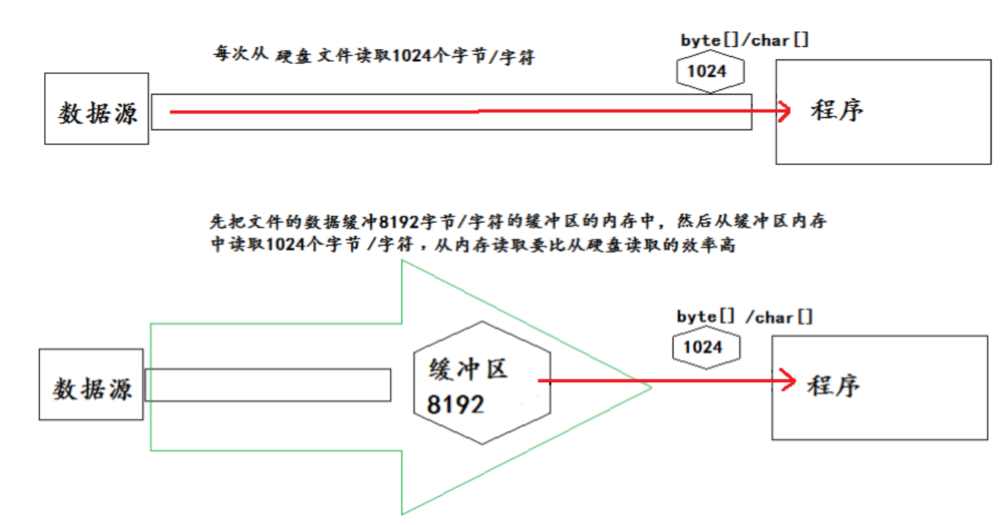

#### 缓冲流(字节型)实现非文本文件的复制

```java
import org.junit.Test;

import java.io.*;

/**
 * 处理流之一：缓冲流的使用
 *
 *  1.缓冲流：
 *  BufferedInputStream
 *  BufferedOutputStream
 *  BufferedReader
 *  BufferedWriter
 *
 * @author subei
 * @create 2020-05-15 15:14
 */
public class BufferedTest {

    /**
     * 实现非文本文件的复制
     */
    @Test
    public void BufferedStreamTest(){
        BufferedInputStream bis = null;
        BufferedOutputStream bos = null;

        try {
            //1.造文件
            File srcFile = new File("爱情与友情.jpg");
            File destFile = new File("爱情与友情3.jpg");
            //2.造流
            //2.1 造节点流
            FileInputStream fis = new FileInputStream((srcFile));
            FileOutputStream fos = new FileOutputStream(destFile);
            //2.2 造缓冲流
            bis = new BufferedInputStream(fis);
            bos = new BufferedOutputStream(fos);

            //3.复制的细节：读取、写入
            byte[] buffer = new byte[10];
            int len;
            while((len = bis.read(buffer)) != -1){
                bos.write(buffer,0,len);
//                bos.flush();//刷新缓冲区
            }
        } catch (IOException e) {
            e.printStackTrace();
        } finally {
            //4.资源关闭
            //要求：先关闭外层的流，再关闭内层的流
            if(bos != null){
                try {
                    bos.close();
                } catch (IOException e) {
                    e.printStackTrace();
                }

            }
            if(bis != null){
                try {
                    bis.close();
                } catch (IOException e) {
                    e.printStackTrace();
                }
            }
            //说明：关闭外层流的同时，内层流也会自动的进行关闭。关于内层流的关闭，我们可以省略.
//        fos.close();
//        fis.close();
        }
    }
}
```

#### 缓冲流与节点流读写速度对比

```java
import org.junit.Test;
import java.io.*;
/**
 * 处理流之一：缓冲流的使用
 *
 *  1.缓冲流：
 *  BufferedInputStream
 *  BufferedOutputStream
 *  BufferedReader
 *  BufferedWriter
 *
 *  2.作用：提供流的读取、写入的速度
 *    提高读写速度的原因：内部提供了一个缓冲区
 *
 *  3. 处理流，就是“套接”在已有的流的基础上。
 *
 */
public class BufferedTest {

    //实现文件复制的方法
    public void copyFileWithBuffered(String srcPath,String destPath){
        BufferedInputStream bis = null;
        BufferedOutputStream bos = null;

        try {
            //1.造文件
            File srcFile = new File(srcPath);
            File destFile = new File(destPath);
            //2.造流
            //2.1 造节点流
            FileInputStream fis = new FileInputStream((srcFile));
            FileOutputStream fos = new FileOutputStream(destFile);
            //2.2 造缓冲流
            bis = new BufferedInputStream(fis);
            bos = new BufferedOutputStream(fos);

            //3.复制的细节：读取、写入
            byte[] buffer = new byte[1024];
            int len;
            while((len = bis.read(buffer)) != -1){
                bos.write(buffer,0,len);
            }
        } catch (IOException e) {
            e.printStackTrace();
        } finally {
            //4.资源关闭
            //要求：先关闭外层的流，再关闭内层的流
            if(bos != null){
                try {
                    bos.close();
                } catch (IOException e) {
                    e.printStackTrace();
                }

            }
            if(bis != null){
                try {
                    bis.close();
                } catch (IOException e) {
                    e.printStackTrace();
                }

            }
            //说明：关闭外层流的同时，内层流也会自动的进行关闭。关于内层流的关闭，我们可以省略.
//        fos.close();
//        fis.close();
        }
    }

    @Test
    public void testCopyFileWithBuffered(){
        long start = System.currentTimeMillis();

        String srcPath = "C:\\Users\\29433\\Desktop\\book.flv";
        String destPath = "C:\\Users\\29433\\Desktop\\book1.flv";


        copyFileWithBuffered(srcPath,destPath);


        long end = System.currentTimeMillis();

        System.out.println("复制操作花费的时间为：" + (end - start));//1
    }

}
```


#### 缓冲流(字符型)实现文本文件的复制

```java
import org.junit.Test;
import java.io.*;

public class BufferedTest {
  /**
     * 使用BufferedReader和BufferedWriter实现文本文件的复制
     */
    @Test
    public void test4(){
        BufferedReader br = null;
        BufferedWriter bw = null;
        try {
            //创建文件和相应的流
            br = new BufferedReader(new FileReader(new File("dbcp.txt")));
            bw = new BufferedWriter(new FileWriter(new File("dbcp1.txt")));

            //读写操作
            //方式一：使用char[]数组
//            char[] cbuf = new char[1024];
//            int len;
//            while((len = br.read(cbuf)) != -1){
//                bw.write(cbuf,0,len);
//    //            bw.flush();
//            }

            //方式二：使用String
            String data;
            while((data = br.readLine()) != null){
                //方法一：
//                bw.write(data + "\n");//data中不包含换行符
                //方法二：
                bw.write(data);//data中不包含换行符
                bw.newLine();//提供换行的操作
            }

        } catch (IOException e) {
            e.printStackTrace();
        } finally {
            //关闭资源
            if(bw != null){

                try {
                    bw.close();
                } catch (IOException e) {
                    e.printStackTrace();
                }
            }
            if(br != null){
                try {
                    br.close();
                } catch (IOException e) {
                    e.printStackTrace();
                }
            }
        }
    }
}
```


#### 缓冲流课后练习


- 练习2

```java
package git;

import org.junit.Test;

import java.io.FileInputStream;
import java.io.FileOutputStream;
import java.io.IOException;

/**
 * @author subei
 * @create 2020-05-15 15:31
 */
public class PicTest {

    //图片的加密
    @Test
    public void test() {
        FileInputStream fis = null;
        FileOutputStream fos = null;
        try {
            fis = new FileInputStream("爱情与友情.jpg");
            fos = new FileOutputStream("爱情与友情secret.jpg");

            byte[] buffer = new byte[20];
            int len;
            while ((len = fis.read(buffer)) != -1) {
                //字节数组进行修改
                //错误的
                //            for(byte b : buffer){
                //                b = (byte) (b ^ 5);
                //            }

                //正确的
                for (int i = 0; i < len; i++) {
                    buffer[i] = (byte) (buffer[i] ^ 5);
                }

                fos.write(buffer, 0, len);
            }
        } catch (IOException e) {
            e.printStackTrace();
        } finally {
            if (fos != null) {
                try {
                    fos.close();
                } catch (IOException e) {
                    e.printStackTrace();
                }
            }
            if (fis != null) {
                try {
                    fis.close();
                } catch (IOException e) {
                    e.printStackTrace();
                }
            }
        }

    }

    //图片的解密
    @Test
    public void test2() {

        FileInputStream fis = null;
        FileOutputStream fos = null;
        try {
            fis = new FileInputStream("爱情与友情secret.jpg");
            fos = new FileOutputStream("爱情与友情4.jpg");

            byte[] buffer = new byte[20];
            int len;
            while ((len = fis.read(buffer)) != -1) {
                //字节数组进行修改
                //错误的
                //            for(byte b : buffer){
                //                b = (byte) (b ^ 5);
                //            }
               
                //正确的
                for (int i = 0; i < len; i++) {
                    buffer[i] = (byte) (buffer[i] ^ 5);
                }

                fos.write(buffer, 0, len);
            }
        } catch (IOException e) {
            e.printStackTrace();
        } finally {
            if (fos != null) {
                try {
                    fos.close();
                } catch (IOException e) {
                    e.printStackTrace();
                }
            }
            if (fis != null) {
                try {
                    fis.close();
                } catch (IOException e) {
                    e.printStackTrace();
                }
            }
        }
     
    }
}
```

- 练习3

```java
import org.junit.Test;

import java.io.BufferedWriter;
import java.io.FileReader;
import java.io.FileWriter;
import java.io.IOException;
import java.util.HashMap;
import java.util.Map;
import java.util.Set;

/**
 * 练习3:获取文本上字符出现的次数,把数据写入文件
 *
 * 思路：
 * 1.遍历文本每一个字符
 * 2.字符出现的次数存在Map中
 *
 * Map<Character,Integer> map = new HashMap<Character,Integer>();
 * map.put('a',18);
 * map.put('你',2);
 *
 * 3.把map中的数据写入文件
 *
 * @author subei
 * @create 2020-05-15 15:41
 */
public class WordCount {

    /**
     * 说明：如果使用单元测试，文件相对路径为当前module
     *     如果使用main()测试，文件相对路径为当前工程
     */
    @Test
    public void testWordCount() {
        FileReader fr = null;
        BufferedWriter bw = null;
        try {
            //1.创建Map集合
            Map<Character, Integer> map = new HashMap<Character, Integer>();

            //2.遍历每一个字符,每一个字符出现的次数放到map中
            fr = new FileReader("dbcp.txt");
            int c = 0;
            while ((c = fr.read()) != -1) {
                //int 还原 char
                char ch = (char) c;
                // 判断char是否在map中第一次出现
                if (map.get(ch) == null) {
                    map.put(ch, 1);
                } else {
                    map.put(ch, map.get(ch) + 1);
                }
            }

            //3.把map中数据存在文件count.txt
            //3.1 创建Writer
            bw = new BufferedWriter(new FileWriter("wordcount.txt"));

            //3.2 遍历map,再写入数据
            Set<Map.Entry<Character, Integer>> entrySet = map.entrySet();
            for (Map.Entry<Character, Integer> entry : entrySet) {
                switch (entry.getKey()) {
                    case ' ':
                        bw.write("空格=" + entry.getValue());
                        break;
                    case '\t'://\t表示tab 键字符
                        bw.write("tab键=" + entry.getValue());
                        break;
                    case '\r'://
                        bw.write("回车=" + entry.getValue());
                        break;
                    case '\n'://
                        bw.write("换行=" + entry.getValue());
                        break;
                    default:
                        bw.write(entry.getKey() + "=" + entry.getValue());
                        break;
                }
                bw.newLine();
            }
        } catch (IOException e) {
            e.printStackTrace();
        } finally {
            //4.关流
            if (fr != null) {
                try {
                    fr.close();
                } catch (IOException e) {
                    e.printStackTrace();
                }

            }
            if (bw != null) {
                try {
                    bw.close();
                } catch (IOException e) {
                    e.printStackTrace();
                }

            }
        }
    }
}
```

### 5.转换流

#### 转换流概述与InputStreamReader的使用

- 转换流提供了在字节流和字符流之间的转换
- Java API提供了两个转换流：
  - InputStreamReader：将InputStream转换为Reader
    - 实现将字节的输入流按指定字符集转换为字符的输入流。
    - 需要和InputStream“套接”。
    - 构造器
      - public InputStreamReader(InputStreamin)
      - public InputSreamReader(InputStreamin,StringcharsetName)
      - 如：Reader isr= new InputStreamReader(System.in,”gbk”);
  - OutputStreamWriter：将Writer转换为OutputStream
    - 实现将字符的输出流按指定字符集转换为字节的输出流。
    - 需要和OutputStream“套接”。
    - 构造器
      - public OutputStreamWriter(OutputStreamout)
      - public OutputSreamWriter(OutputStreamout,StringcharsetName)

- 字节流中的数据都是字符时，转成字符流操作更高效。
- 很多时候我们使用转换流来处理文件乱码问题。实现编码和解码的功能。


```java
import org.junit.Test;

import java.io.FileInputStream;
import java.io.IOException;
import java.io.InputStreamReader;

/**
 * 处理流之二：转换流的使用
 * 1.转换流：属于字符流
 *      InputStreamReader：将一个字节的输入流转换为字符的输入流
 *      OutputStreamWriter：将一个字符的输出流转换为字节的输出流
 *
 * 2.作用：提供字节流与字符流之间的转换
 *
 * 3.解码：字节、字节数组  --->字符数组、字符串
 *   编码：字符数组、字符串 ---> 字节、字节数组
 *
 * 4.字符集
 *
 * @author subei
 * @create 2020-05-15 15:57
 */
public class InputStreamReaderTest {

    /**
     * 此时处理异常的话，仍然应该使用try-catch-finally
     * InputStreamReader的使用，实现字节的输入流到字符的输入流的转换
     */
    @Test
    public void test() throws IOException {

        FileInputStream fis = new FileInputStream("dbcp.txt");
//        InputStreamReader isr = new InputStreamReader(fis);//使用系统默认的字符集
        //参数2指明了字符集，具体使用哪个字符集，取决于文件dbcp.txt保存时使用的字符集
        InputStreamReader isr = new InputStreamReader(fis,"UTF-8");//使用系统默认的字符集

        char[] cbuf = new char[20];
        int len;
        while((len = isr.read(cbuf)) != -1){
            String str = new String(cbuf,0,len);
            System.out.print(str);
        }

        isr.close();
    }

}
```

#### 转换流实现文件的读入和写出

```java
import org.junit.Test;

import java.io.*;

/**
 * 处理流之二：转换流的使用
 * 1.转换流：属于字符流
 *      InputStreamReader：将一个字节的输入流转换为字符的输入流
 *      OutputStreamWriter：将一个字符的输出流转换为字节的输出流
 *
 * 2.作用：提供字节流与字符流之间的转换
 *
 * 3.解码：字节、字节数组  --->字符数组、字符串
 *   编码：字符数组、字符串 ---> 字节、字节数组
 *
 * 4.字符集
 *
 * @author subei
 * @create 2020-05-15 15:57
 */
public class InputStreamReaderTest {
    /**
     * 此时处理异常的话，仍然应该使用try-catch-finally
     * 综合使用InputStreamReader和OutputStreamWriter
     */
    @Test
    public void test2() throws IOException {
        //1.造文件、造流
        File file1 = new File("dbcp.txt");
        File file2 = new File("dbcp_gbk.txt");

        FileInputStream fis = new FileInputStream(file1);
        FileOutputStream fos = new FileOutputStream(file2);

        InputStreamReader isr = new InputStreamReader(fis,"utf-8");
        OutputStreamWriter osw = new OutputStreamWriter(fos,"gbk");

        //2.读写过程
        char[] cbuf = new char[20];
        int len;
        while((len = isr.read(cbuf)) != -1){
            osw.write(cbuf,0,len);
        }

        //3.关闭资源
        isr.close();
        osw.close();
    }
}
```

#### 多种字符编码集的说明

- 编码表的由来

  > 计算机只能识别二进制数据，早期由来是电信号。为了方便应用计算机，让它可以识别各个国家的文字。就将各个国家的文字用数字来表示，并一一对应，形成一张表。这就是编码表。

- 常见的编码表

```java
/**
  * 4.字符集
  *  ASCII：美国标准信息交换码。
  *     用一个字节的7位可以表示。
  *  ISO8859-1：拉丁码表。欧洲码表
  *     用一个字节的8位表示。
  *  GB2312：中国的中文编码表。最多两个字节编码所有字符
  *  GBK：中国的中文编码表升级，融合了更多的中文文字符号。最多两个字节编码
  *  Unicode：国际标准码，融合了目前人类使用的所有字符。为每个字符分配唯一的字符码。所有的文字都用两个字节来表示。
  *  UTF-8：变长的编码方式，可用1-4个字节来表示一个字符。
  */
```

- Unicode不完美，这里就有三个问题，一个是，我们已经知道，英文字母只用一个字节表示就够了，第二个问题是如何才能区别Unicode和ASCII？计算机怎么知道两个字节表示一个符号，而不是分别表示两个符号呢？第三个，如果和GBK等双字节编码方式一样，用最高位是1或0表示两个字节和一个字节，就少了很多值无法用于表示字符，不够表示所有字符。Unicode在很长一段时间内无法推广，直到互联网的出现。
- 面向传输的众多UTF（UCS Transfer Format）标准出现了，顾名思义，**UTF-8就是每次8个位传输数据，而UTF-16就是每次16个位。**这是为传输而设计的编码，并使编码无国界，这样就可以显示全世界上所有文化的字符了。
- Unicode只是定义了一个庞大的、全球通用的字符集，并为每个字符规定了唯一确定的编号，具体存储成什么样的字节流，取决于字符编码方案。推荐的Unicode编码是UTF-8和UTF-16。


### 6.标准输入、输出流

- System.in和System.out分别代表了系统标准的输入和输出设备
- 默认输入设备是：键盘，输出设备是：显示器
- System.in的类型是InputStream
- System.out的类型是PrintStream，其是OutputStream的子类FilterOutputStream的子类
- 重定向：通过System类的setIn，setOut方法对默认设备进行改变。
  - public static void setIn(InputStreamin)
  - public static void setOut(PrintStreamout)

```java
import org.junit.Test;

import java.io.BufferedReader;
import java.io.IOException;
import java.io.InputStreamReader;

/**
 * 其他流的使用
 * 1.标准的输入、输出流
 * 2.打印流
 * 3.数据流
 *
 * @author subei
 * @create 2020-05-15 16:41
 */
public class OtherStreamTest {

    /**
     * 1.标准的输入、输出流
     *   1.1
     *     System.in:标准的输入流，默认从键盘输入
     *     System.out:标准的输出流，默认从控制台输出
     *   1.2
     *     System类的setIn(InputStream is) / setOut(PrintStream ps)方式重新指定输入和输出的流。
     *
     *   1.3练习：
     *     从键盘输入字符串，要求将读取到的整行字符串转成大写输出。然后继续进行输入操作，
     *     直至当输入“e”或者“exit”时，退出程序。
     *
     *   方法一：使用Scanner实现，调用next()返回一个字符串
     *   方法二：使用System.in实现。System.in  --->  转换流 ---> BufferedReader的readLine()
     */
    @Test
    public void test(){
        BufferedReader br = null;
        try {
            InputStreamReader isr = new InputStreamReader(System.in);
            br = new BufferedReader(isr);

            while (true) {
                System.out.println("请输入字符串：");
                String data = br.readLine();
                if ("e".equalsIgnoreCase(data) || "exit".equalsIgnoreCase(data)) {
                    System.out.println("程序结束");
                    break;
                }

                String upperCase = data.toUpperCase();
                System.out.println(upperCase);

            }
        } catch (IOException e) {
            e.printStackTrace();
        } finally {
            if (br != null) {
                try {
                    br.close();
                } catch (IOException e) {
                    e.printStackTrace();
                }

            }
        }
    }
}
```

### 7.打印流

- 实现将基本数据类型的数据格式转化为字符串输出
- 打印流：PrintStream和PrintWriter
  - 提供了一系列重载的print()和println()方法，用于多种数据类型的输出
  - PrintStream和PrintWriter的输出不会抛出IOException异常
  - PrintStream和PrintWriter有自动flush功能
  - PrintStream 打印的所有字符都使用平台的默认字符编码转换为字节。在需要写入字符而不是写入字节的情况下，应该使用PrintWriter 类。
  - System.out返回的是PrintStream的实例

```java
import org.junit.Test;
import java.io.*;

public class OtherStreamTest {

    /**
     * 2. 打印流：PrintStream 和PrintWriter
     *  2.1 提供了一系列重载的print() 和 println()
     *  2.2 练习：
     */
    @Test
    public void test2(){
        PrintStream ps = null;
        try {
            FileOutputStream fos = new FileOutputStream(new File("D:\\IO\\text.txt"));
            // 创建打印输出流,设置为自动刷新模式(写入换行符或字节 '\n' 时都会刷新输出缓冲区)
            ps = new PrintStream(fos, true);
            if (ps != null) {// 把标准输出流(控制台输出)改成文件
                System.setOut(ps);
            }

            for (int i = 0; i <= 255; i++) { // 输出ASCII字符
                System.out.print((char) i);
                if (i % 50 == 0) { // 每50个数据一行
                    System.out.println(); // 换行
                }
            }

        } catch (FileNotFoundException e) {
            e.printStackTrace();
        } finally {
            if (ps != null) {
                ps.close();
            }
        }
    }
}
```

### 8.数据流

- 为了方便地操作Java语言的基本数据类型和String的数据，可以使用数据流。

- 数据流有两个类：(用于读取和写出基本数据类型、String类的数据）

  - DataInputStream和DataOutputStream
  - 分别“套接”在InputStream和OutputStream子类的流上

- DataInputStream中的方法

  ```java
  boolean readBoolean()	byte readByte()
  char readChar()	float readFloat()
  double readDouble()	short readShort()
  long readLong()	int readInt()
  String readUTF()	void readFully(byte[s] b)
  ```

- DataOutputStream中的方法

  - 将上述的方法的read改为相应的write即可。

```java
import org.junit.Test;
import java.io.*;

public class OtherStreamTest {    
   /**
     * 3.数据流
     *   3.1 DataInputStream 和 DataOutputStream
     *   3.2 作用：用于读取或写出基本数据类型的变量或字符串
     *
     *   练习：将内存中的字符串、基本数据类型的变量写出到文件中。
     *
     *   注意：处理异常的话，仍然应该使用try-catch-finally.
     */
    @Test
    public void test3() throws IOException {
        //1.
        DataOutputStream dos = new DataOutputStream(new FileOutputStream("data.txt"));
        //2.
        dos.writeUTF("刘刚");
        dos.flush();//刷新操作，将内存中的数据写入文件
        dos.writeInt(23);
        dos.flush();
        dos.writeBoolean(true);
        dos.flush();
        //3.
        dos.close();
    }

    /**
     * 将文件中存储的基本数据类型变量和字符串读取到内存中，保存在变量中。
     *
     * 注意点：读取不同类型的数据的顺序要与当初写入文件时，保存的数据的顺序一致！
     */
    @Test
    public void test4() throws IOException {
        //1.
        DataInputStream dis = new DataInputStream(new FileInputStream("data.txt"));
        //2.
        String name = dis.readUTF();
        int age = dis.readInt();
        boolean isMale = dis.readBoolean();

        System.out.println("name = " + name);
        System.out.println("age = " + age);
        System.out.println("isMale = " + isMale);

        //3.
        dis.close();

    }
}
```

### 9.对象流

#### 对象序列化机制的理解

- ObjectInputStream和OjbectOutputSteam
- 用于存储和读取基本数据类型数据或对象的处理流。它的强大之处就是可以把Java中的对象写入到数据源中，也能把对象从数据源中还原回来。
- 序列化：用ObjectOutputStream类保存基本类型数据或对象的机制
- 反序列化：用ObjectInputStream类读取基本类型数据或对象的机制
- ObjectOutputStream和ObjectInputStream不能序列化static和transient修饰的成员变量
- 对象序列化机制允许把内存中的Java对象转换成平台无关的二进制流，从而允许把这种二进制流持久地保存在磁盘上，或通过网络将这种二进制流传输到另一个网络节点。//当其它程序获取了这种二进制流，就可以恢复成原来的Java对象
- 序列化的好处在于可将任何实现了Serializable接口的对象转化为字节数据，使其在保存和传输时可被还原
- 序列化是RMI（Remote Method Invoke –远程方法调用）过程的参数和返回值都必须实现的机制，而RMI 是JavaEE的基础。因此序列化机制是JavaEE平台的基础
- 如果需要让某个对象支持序列化机制，则必须让对象所属的类及其属性是可序列化的，为了让某个类是可序列化的，该类必须实现如下两个接口之一。否则，会抛出NotSerializableException异常
  - Serializable
  - Externalizable

#### 对象流序列化与反序列化字符串操作

```java
import org.junit.Test;

import java.io.*;

/**
 * 对象流的使用
 * 1.ObjectInputStream 和 ObjectOutputStream
 * 2.作用：用于存储和读取基本数据类型数据或对象的处理流。它的强大之处就是可以把Java中的对象写入到数据源中，也能把对象从数据源中还原回来。
 *
 *
 * @author subei
 * @create 2020-05-16 9:41
 */
public class ObjectTest {

    /**
     * 序列化过程：将内存中的java对象保存到磁盘中或通过网络传输出去
     * 使用ObjectOutputStream实现
     */
    @Test
    public void test(){
        ObjectOutputStream oos = null;
        try {
            //创造流
            oos = new ObjectOutputStream(new FileOutputStream("object.dat"));
            //制造对象
            oos.writeObject(new String("秦始皇陵欢迎你"));

            //刷新操作
            oos.flush();
        } catch (IOException e) {
            e.printStackTrace();
        } finally {
            if(oos != null){
                //3.关闭流
                try {
                    oos.close();
                } catch (IOException e) {
                    e.printStackTrace();
                }
            }
        }
    }

    /**
     * 反序列化：将磁盘文件中的对象还原为内存中的一个java对象
     * 使用ObjectInputStream来实现
     */
    @Test
    public void test2(){
        ObjectInputStream ois = null;
        try {
            ois = new ObjectInputStream(new FileInputStream("object.dat"));

            Object obj = ois.readObject();
            String str = (String) obj;

            System.out.println(str);
        } catch (IOException e) {
            e.printStackTrace();
        } catch (ClassNotFoundException e) {
            e.printStackTrace();
        } finally {
            if(ois != null){
                try {
                    ois.close();
                } catch (IOException e) {
                    e.printStackTrace();
                }
            }
        }
    }

}
```

#### 自定义类实现序列化与反序列化操作

- 若某个类实现了Serializable接口，该类的对象就是可序列化的：
  - 创建一个ObjectOutputStream
  - 调用ObjectOutputStream对象的writeObject(对象) 方法输出可序列化对象
  - 注意写出一次，操作flush()一次
- 反序列化
  - 创建一个ObjectInputStream调用readObject() 方法读取流中的对象
- 强调：如果某个类的属性不是基本数据类型或String  类型，而是另一个引用类型，那么这个引用类型必须是可序列化的，否则拥有该类型的Field 的类也不能序列化

- Person类

```java
import java.io.Serializable;

/**
 * Person需要满足如下的要求，方可序列化
 * 1.需要实现接口：Serializable
 *
 * @author subei
 * @create 2020-05-16 10:21
 */
public class Person implements Serializable {
    public static final long serialVersionUID = 475463534532L;

    private String name;
    private int age;

    public Person() {
    }

    public Person(String name, int age) {
        this.name = name;
        this.age = age;
    }

    @Override
    public String toString() {
        return "Person{" +
                "name='" + name + '\'' +
                ", age=" + age +
                '}';
    }

    public String getName() {
        return name;
    }

    public void setName(String name) {
        this.name = name;
    }

    public int getAge() {
        return age;
    }

    public void setAge(int age) {
        this.age = age;
    }
}
```

- 测试类

```java
import org.junit.Test;

import java.io.*;

/**
 * 对象流的使用
 * 1.ObjectInputStream 和 ObjectOutputStream
 * 2.作用：用于存储和读取基本数据类型数据或对象的处理流。它的强大之处就是可以把Java中的对象写入到数据源中，也能把对象从数据源中还原回来。
 *
 * 3.要想一个java对象是可序列化的，需要满足相应的要求。见Person.java
 *
 * 4.序列化机制：
 * 对象序列化机制允许把内存中的Java对象转换成平台无关的二进制流，从而允许把这种
 * 二进制流持久地保存在磁盘上，或通过网络将这种二进制流传输到另一个网络节点。
 * 当其它程序获取了这种二进制流，就可以恢复成原来的Java对象。
 *
 * @author subei
 * @create 2020-05-16 9:41
 */
public class ObjectTest {

    /**
     * 序列化过程：将内存中的java对象保存到磁盘中或通过网络传输出去
     * 使用ObjectOutputStream实现
     */
    @Test
    public void test(){
        ObjectOutputStream oos = null;
        try {
            //创造流
            oos = new ObjectOutputStream(new FileOutputStream("object.dat"));
            //制造对象
            oos.writeObject(new String("秦始皇陵欢迎你"));
            //刷新操作
            oos.flush();

            oos.writeObject(new Person("李时珍",65));
            oos.flush();


        } catch (IOException e) {
            e.printStackTrace();
        } finally {
            if(oos != null){
                //3.关闭流
                try {
                    oos.close();
                } catch (IOException e) {
                    e.printStackTrace();
                }
            }
        }
    }

    /**
     * 反序列化：将磁盘文件中的对象还原为内存中的一个java对象
     * 使用ObjectInputStream来实现
     */
    @Test
    public void test2(){
        ObjectInputStream ois = null;
        try {
            ois = new ObjectInputStream(new FileInputStream("object.dat"));

            Object obj = ois.readObject();
            String str = (String) obj;

            Person p = (Person) ois.readObject();

            System.out.println(str);
            System.out.println(p);
        } catch (IOException e) {
            e.printStackTrace();
        } catch (ClassNotFoundException e) {
            e.printStackTrace();
        } finally {
            if(ois != null){
                try {
                    ois.close();
                } catch (IOException e) {
                    e.printStackTrace();
                }
            }
        }
    }

}
```

#### serialVersionUID的理解

- 凡是实现Serializable接口的类都有一个表示序列化版本标识符的静态变量：
  - private static final long serialVersionUID;
  - serialVersionUID用来表明类的不同版本间的兼容性。简言之，其目的是以序列化对象进行版本控制，有关各版本反序列化时是否兼容。
  - 如果类没有显示定义这个静态常量，它的值是Java运行时环境根据类的内部细节自动生成的。若类的实例变量做了修改，serialVersionUID可能发生变化。故建议，显式声明。
- 简单来说，Java的序列化机制是通过在运行时判断类的serialVersionUID来验证版本一致性的。在进行反序列化时，JVM会把传来的字节流中的serialVersionUID与本地相应实体类的serialVersionUID进行比较，如果相同就认为是一致的，可以进行反序列化，否则就会出现序列化版本不一致的异常。(InvalidCastException)

- Person类

```java
import java.io.Serializable;

/**
 * Person需要满足如下的要求，方可序列化
 * 1.需要实现接口：Serializable
 * 2.当前类提供一个全局常量：serialVersionUID
 * 3.除了当前Person类需要实现Serializable接口之外，还必须保证其内部所有属性
 *   也必须是可序列化的。（默认情况下，基本数据类型可序列化）
 *
 *
 * 补充：ObjectOutputStream和ObjectInputStream不能序列化static和transient修饰的成员变量
 *
 * @author subei
 * @create 2020-05-16 10:21
 */
public class Person implements Serializable {
    public static final long serialVersionUID = 475463534532L;

    private String name;
    private int age;
    private int id;

    public Person() {
    }

    public Person(String name, int age, int id) {
        this.name = name;
        this.age = age;
        this.id = id;
    }

    @Override
    public String toString() {
        return "Person{" +
                "name='" + name + '\'' +
                ", age=" + age +
                ", id=" + id +
                '}';
    }

    public int getId() {
        return id;
    }

    public void setId(int id) {
        this.id = id;
    }

    public String getName() {
        return name;
    }

    public void setName(String name) {
        this.name = name;
    }

    public int getAge() {
        return age;
    }

    public void setAge(int age) {
        this.age = age;
    }
}
```

- 测试类

```java
import org.junit.Test;

import java.io.*;

/**
 * 对象流的使用
 * 1.ObjectInputStream 和 ObjectOutputStream
 * 2.作用：用于存储和读取基本数据类型数据或对象的处理流。它的强大之处就是可以把Java中的对象写入到数据源中，也能把对象从数据源中还原回来。
 *
 * 3.要想一个java对象是可序列化的，需要满足相应的要求。见Person.java
 *
 * 4.序列化机制：
 * 对象序列化机制允许把内存中的Java对象转换成平台无关的二进制流，从而允许把这种
 * 二进制流持久地保存在磁盘上，或通过网络将这种二进制流传输到另一个网络节点。
 * 当其它程序获取了这种二进制流，就可以恢复成原来的Java对象。
 *
 * @author subei
 * @create 2020-05-16 9:41
 */
public class ObjectTest {

    /**
     * 序列化过程：将内存中的java对象保存到磁盘中或通过网络传输出去
     * 使用ObjectOutputStream实现
     */
    @Test
    public void test(){
        ObjectOutputStream oos = null;
        try {
            //创造流
            oos = new ObjectOutputStream(new FileOutputStream("object.dat"));
            //制造对象
            oos.writeObject(new String("秦始皇陵欢迎你"));
            //刷新操作
            oos.flush();

            oos.writeObject(new Person("李时珍",65,0));
            oos.flush();


        } catch (IOException e) {
            e.printStackTrace();
        } finally {
            if(oos != null){
                //3.关闭流
                try {
                    oos.close();
                } catch (IOException e) {
                    e.printStackTrace();
                }
            }
        }
    }

    /**
     * 反序列化：将磁盘文件中的对象还原为内存中的一个java对象
     * 使用ObjectInputStream来实现
     */
    @Test
    public void test2(){
        ObjectInputStream ois = null;
        try {
            ois = new ObjectInputStream(new FileInputStream("object.dat"));

            Object obj = ois.readObject();
            String str = (String) obj;

            Person p = (Person) ois.readObject();

            System.out.println(str);
            System.out.println(p);
        } catch (IOException e) {
            e.printStackTrace();
        } catch (ClassNotFoundException e) {
            e.printStackTrace();
        } finally {
            if(ois != null){
                try {
                    ois.close();
                } catch (IOException e) {
                    e.printStackTrace();
                }
            }
        }
    }

}
```

#### 自定义类可序列化的其它要求

- Person类

```java
import java.io.Serializable;

/**
 * Person需要满足如下的要求，方可序列化
 * 1.需要实现接口：Serializable
 * 2.当前类提供一个全局常量：serialVersionUID
 * 3.除了当前Person类需要实现Serializable接口之外，还必须保证其内部所有属性
 *   也必须是可序列化的。（默认情况下，基本数据类型可序列化）
 *
 *
 * 补充：ObjectOutputStream和ObjectInputStream不能序列化static和transient修饰的成员变量
 *
 * @author subei
 * @create 2020-05-16 10:21
 */
public class Person implements Serializable{

    public static final long serialVersionUID = 475463534532L;

    private String name;
    private int age;
    private int id;
    private Account acct;

    public Person(String name, int age, int id) {
        this.name = name;
        this.age = age;
        this.id = id;
    }

    public Person(String name, int age, int id, Account acct) {
        this.name = name;
        this.age = age;
        this.id = id;
        this.acct = acct;
    }

    @Override
    public String toString() {
        return "Person{" +
                "name='" + name + '\'' +
                ", age=" + age +
                ", id=" + id +
                ", acct=" + acct +
                '}';
    }

    public int getId() {
        return id;
    }

    public void setId(int id) {
        this.id = id;
    }

    public String getName() {
        return name;
    }

    public void setName(String name) {
        this.name = name;
    }

    public int getAge() {
        return age;
    }

    public void setAge(int age) {
        this.age = age;
    }

    public Person(String name, int age) {

        this.name = name;
        this.age = age;
    }

    public Person() {

    }
}

class Account implements Serializable{
    public static final long serialVersionUID = 4754534532L;
    private double balance;

    @Override
    public String toString() {
        return "Account{" +
                "balance=" + balance +
                '}';
    }

    public double getBalance() {
        return balance;
    }

    public void setBalance(double balance) {
        this.balance = balance;
    }

    public Account(double balance) {

        this.balance = balance;
    }
}
```

- 测试类

```java
import org.junit.Test;

import java.io.*;

/**
 * 对象流的使用
 * 1.ObjectInputStream 和 ObjectOutputStream
 * 2.作用：用于存储和读取基本数据类型数据或对象的处理流。它的强大之处就是可以把Java中的对象写入到数据源中，也能把对象从数据源中还原回来。
 *
 * 3.要想一个java对象是可序列化的，需要满足相应的要求。见Person.java
 *
 * 4.序列化机制：
 * 对象序列化机制允许把内存中的Java对象转换成平台无关的二进制流，从而允许把这种
 * 二进制流持久地保存在磁盘上，或通过网络将这种二进制流传输到另一个网络节点。
 * 当其它程序获取了这种二进制流，就可以恢复成原来的Java对象。
 *
 * @author subei
 * @create 2020-05-16 9:41
 */
public class ObjectTest {

    /**
     * 序列化过程：将内存中的java对象保存到磁盘中或通过网络传输出去
     * 使用ObjectOutputStream实现
     */
    @Test
    public void test(){
        ObjectOutputStream oos = null;
        try {
            //创造流
            oos = new ObjectOutputStream(new FileOutputStream("object.dat"));
            //制造对象
            oos.writeObject(new String("秦始皇陵欢迎你"));
            //刷新操作
            oos.flush();

            oos.writeObject(new Person("李时珍",65));
            oos.flush();

            oos.writeObject(new Person("张学良",23,1001,new Account(5000)));
            oos.flush();
        } catch (IOException e) {
            e.printStackTrace();
        } finally {
            if(oos != null){
                //3.关闭流
                try {
                    oos.close();
                } catch (IOException e) {
                    e.printStackTrace();
                }
            }
        }
    }

    /**
     * 反序列化：将磁盘文件中的对象还原为内存中的一个java对象
     * 使用ObjectInputStream来实现
     */
    @Test
    public void test2(){
        ObjectInputStream ois = null;
        try {
            ois = new ObjectInputStream(new FileInputStream("object.dat"));

            Object obj = ois.readObject();
            String str = (String) obj;

            Person p = (Person) ois.readObject();

            System.out.println(str);
            System.out.println(p);
        } catch (IOException e) {
            e.printStackTrace();
        } catch (ClassNotFoundException e) {
            e.printStackTrace();
        } finally {
            if(ois != null){
                try {
                    ois.close();
                } catch (IOException e) {
                    e.printStackTrace();
                }
            }
        }
    }

}
```

### 10.随机存取文件流

- RandomAccessFile 声明在java.io包下，但直接继承于java.lang.Object类。并且它实现了DataInput、DataOutput这两个接口，也就意味着这个类既可以读也可以写。
- RandomAccessFile 类支持“随机访问” 的方式，程序可以直接跳到文件的任意地方来读、写文件
  - 支持只访问文件的部分内容
  - 可以向已存在的文件后追加内容
- RandomAccessFile 对象包含一个记录指针，用以标示当前读写处的位置。RandomAccessFile类对象可以自由移动记录指针：
  - long getFilePointer()：获取文件记录指针的当前位置
  - void seek(long pos)：将文件记录指针定位到pos位置

- 构造器
  - public RandomAccessFile(Filefile, Stringmode) 
  - public RandomAccessFile(Stringname, Stringmode)
- 创建RandomAccessFile类实例需要指定一个mode 参数，该参数指定RandomAccessFile的访问模式：
  - r: 以只读方式打开
  - rw：打开以便读取和写入
  - rwd:打开以便读取和写入；同步文件内容的更新
  - rws:打开以便读取和写入；同步文件内容和元数据的更新
- 如果模式为只读r。则不会创建文件，而是会去读取一个已经存在的文件，如果读取的文件不存在则会出现异常。如果模式为rw读写。如果文件不存在则会去创建文件，如果存在则不会创建。

#### RandomAccessFile实现数据的读写操作

```java
import org.junit.Test;

import java.io.File;
import java.io.IOException;
import java.io.RandomAccessFile;

/**
 * RandomAccessFile的使用
 * 1.RandomAccessFile直接继承于java.lang.Object类，实现了DataInput和DataOutput接口
 * 2.RandomAccessFile既可以作为一个输入流，又可以作为一个输出流
 * 3.如果RandomAccessFile作为输出流时，写出到的文件如果不存在，则在执行过程中自动创建。
 *   如果写出到的文件存在，则会对原有文件内容进行覆盖。（默认情况下，从头覆盖）
 *
 *
 * @author subei
 * @create 2020-05-16 11:06
 */
public class RandomAccessFileTest {

    @Test
    public void test(){

        RandomAccessFile raf1 = null;
        RandomAccessFile raf2 = null;
        try {
            raf1 = new RandomAccessFile(new File("爱情与友情.jpg"),"r");
            raf2 = new RandomAccessFile(new File("爱情与友情1.jpg"),"rw");

            byte[] buffer = new byte[1024];
            int len;
            while((len = raf1.read(buffer)) != -1){
                raf2.write(buffer,0,len);
            }
        } catch (IOException e) {
            e.printStackTrace();
        } finally {
            if(raf1 != null){
                try {
                    raf1.close();
                } catch (IOException e) {
                    e.printStackTrace();
                }

            }
            if(raf2 != null){
                try {
                    raf2.close();
                } catch (IOException e) {
                    e.printStackTrace();
                }
            }
        }

    }

    @Test
    public void test2() throws IOException {

        RandomAccessFile raf1 = new RandomAccessFile("hello.txt","rw");

        raf1.write("xyz".getBytes());

        raf1.close();

    }

}
```

#### RandomAccessFile实现数据的插入操作

```java
import org.junit.Test;

import java.io.File;
import java.io.IOException;
import java.io.RandomAccessFile;

/**
 * RandomAccessFile的使用
 * 1.RandomAccessFile直接继承于java.lang.Object类，实现了DataInput和DataOutput接口
 * 2.RandomAccessFile既可以作为一个输入流，又可以作为一个输出流
 * 3.如果RandomAccessFile作为输出流时，写出到的文件如果不存在，则在执行过程中自动创建。
 *   如果写出到的文件存在，则会对原有文件内容进行覆盖。（默认情况下，从头覆盖）
 *
 * 4.可以通过相关的操作，实现RandomAccessFile“插入”数据的效果
 *
 * @author subei
 * @create 2020-05-16 11:06
 */
public class RandomAccessFileTest {

    /**
     * 使用RandomAccessFile实现数据的插入效果
     */
    @Test
    public void test3() throws IOException {
        RandomAccessFile raf1 = new RandomAccessFile("hello.txt","rw");

        raf1.seek(3);//将指针调到角标为3的位置
        //保存指针3后面的所有数据到StringBuilder中
        StringBuilder builder = new StringBuilder((int) new File("hello.txt").length());
        byte[] buffer = new byte[20];
        int len;
        while((len = raf1.read(buffer)) != -1){
            builder.append(new String(buffer,0,len)) ;
        }
        //调回指针，写入“xyz”
        raf1.seek(3);
        raf1.write("xyz".getBytes());

        //将StringBuilder中的数据写入到文件中
        raf1.write(builder.toString().getBytes());

        raf1.close();

        //思考：将StringBuilder替换为ByteArrayOutputStream
    }

}
```

### 11.NIO.2中Path、Paths、Files类的使用

- Java NIO (New IO，Non-Blocking IO)是从Java 1.4版本开始引入的一套新的IO API，可以替代标准的Java IO API。NIO与原来的IO有同样的作用和目的，但是使用的方式完全不同，NIO支持面向缓冲区的(IO是面向流的)、基于通道的IO操作。NIO将以更加高效的方式进行文件的读写操作。

- Java API中提供了两套NIO，一套是针对标准输入输出NIO，另一套就是网络编程NIO。

  ```java
  |-----java.nio.channels.Channel
      |-----FileChannel:处理本地文件
      |-----SocketChannel：TCP网络编程的客户端的Channel
      |-----ServerSocketChannel:TCP网络编程的服务器端的Channel
      |-----DatagramChannel：UDP网络编程中发送端和接收端的Channel
  ```

- 随着JDK 7 的发布，Java对NIO进行了极大的扩展，增强了对文件处理和文件系统特性的支持，以至于我们称他们为NIO.2。因为NIO 提供的一些功能，NIO已经成为文件处理中越来越重要的部分。

- 早期的Java只提供了一个File类来访问文件系统，但File类的功能比较有限，所提供的方法性能也不高。而且，大多数方法在出错时仅返回失败，并不会提供异常信息。

- NIO. 2为了弥补这种不足，引入了Path接口，代表一个平台无关的平台路径，描述了目录结构中文件的位置。Path可以看成是File类的升级版本，实际引用的资源也可以不存在。

- 在以前IO操作都是这样写的:
  - import java.io.File;
  - File file = new File("index.html");
  
- 但在Java7 中，我们可以这样写：
  - import java.nio.file.Path;
  -  import java.nio.file.Paths;
  -  Path path = Paths.get("index.html");

- 同时，NIO.2在java.nio.file包下还提供了Files、Paths工具类，Files包含了大量静态的工具方法来操作文件；Paths则包含了两个返回Path的静态工厂方法。

- Paths 类提供的静态get() 方法用来获取Path 对象：
  - static Pathget(String first, String ... more) : 用于将多个字符串串连成路径
  - static Path get(URI uri): 返回指定uri对应的Path路径

- Path接口


- Files 类


## GUI

**组件**

- 窗口
- 弹窗
- 面板
- 文本框
- 列表框
- 按钮
- 图片
- 监听事件
- 鼠标
- 键盘事件
- 破解工具

### 1.简介

- GUI核心技术：Swing AWT
  - 界面不美观；
  - 需要JRE环境。

**为什么要学习？**

- 可以写出自己的小工具；
- 工作时，可能会维护到Swing界面；
- 了解MVC架构，了解监听。

---

### 2.AWT

#### 1.Awt介绍

- 包含了很多类和接口！GUI：图形用户界面编程。
- 元素：窗口、按钮、文本框


#### 2.组件和容器

> 1.Frame

```java
package github.GUI;

import java.awt.*;

/**
 * @author subeiLY
 * @create 2021-06-04 13:42
 */
public class TestFrame {
    public static void main(String[] args) {
        // Frame,JDK,   看源码！
        Frame frame = new Frame("我的第一个Java图形界面！");

        // 需要设置可见性
        frame.setVisible(true);

        // 设置窗口大小
        frame.setSize(600,600);
        // 设置背景颜色
        Color color = new Color(122, 123, 222);
        frame.setBackground(color);

        // 设置默认弹出的初始位置
        frame.setLocation(90,90);

        // 设置大小固定
        frame.setResizable(false);
    }
}
```

```java
package github.GUI;

import java.awt.*;

/**
 * @author subeiLY
 * @create 2021-06-04 13:53
 */
public class TestFrame2 {
    public static void main(String[] args) {
        // 展示多个窗口
        new MyFrame(100,100,400,400,Color.PINK);
        new MyFrame(500,100,400,400,Color.green);
        new MyFrame(100,500,400,400,Color.red);
        new MyFrame(500,500,400,400,Color.orange);


    }
}
class MyFrame extends Frame{
    static int id = 0;  // 可能存在多个窗口，需要一个计数器

    public MyFrame(int x,int y,int w,int h,Color color){
        super("MyFrame" + (++id));
        setBackground(color);
        setBounds(x,y,w,h);
        setVisible(true);
    }

}
```


> 2.面板Panel

```java
package github.GUI;

import java.awt.*;
import java.awt.event.WindowAdapter;
import java.awt.event.WindowEvent;

/**
 * @author subeiLY
 * @create 2021-06-04 14:04
 */
// panel 可以看成一个单独空间，但不能单独存在
public class TestPanel {
    public static void main(String[] args) {
        Frame frame = new Frame();
        // 布局的概念
        Panel panel = new Panel();

        // 设置布局
        frame.setLayout(null);

        // 坐标
        frame.setBounds(300,300,500,500);
        frame.setBackground(new Color(205, 103, 49));

        // panel设置坐标，相对于frame
        panel.setBounds(50,50,400,400);
        panel.setBackground(new Color(35, 161, 121));

        // frame.add(panel)
        frame.add(panel);

        frame.setVisible(true);

        // 监听事件，监听窗口关闭事件
        // 适配器模式
        frame.addWindowListener(new WindowAdapter() {
            // 窗口点击关闭时要做的事
            @Override
            public void windowClosing(WindowEvent e) {
                // 结束程序
                System.exit(0);
            }
        });

    }
}
```


> 3.布局管理器

- 按钮

```java
package github.GUI;

import java.awt.*;
import java.awt.event.WindowAdapter;
import java.awt.event.WindowEvent;

/**
 * @author subeiLY
 * @create 2021-06-04 15:53
 */
public class TestLowLayout {
    public static void main(String[] args) {
        Frame frame = new Frame();
        // 组件--按钮
        Button button = new Button("button");
        Button button2 = new Button("button2");
        Button button3 = new Button("button3");

        // 设置为流式布局
        frame.setLayout(new FlowLayout());
//        frame.setLayout(new FlowLayout(FlowLayout.LEFT)); // 靠左
//        frame.setLayout(new FlowLayout(FlowLayout.RIGHT)); // 靠右

        frame.setSize(200,200);

        // 把按钮添加上去
        frame.add(button);
        frame.add(button2);
        frame.add(button3);

        frame.setVisible(true);

        // 监听事件，监听窗口关闭事件
        // 适配器模式
        frame.addWindowListener(new WindowAdapter() {
            // 窗口点击关闭时要做的事
            @Override
            public void windowClosing(WindowEvent e) {
                // 结束程序
                System.exit(0);
            }
        });
    }
}
```


- 东西南北中

```java
package github.GUI;

import java.awt.*;
import java.awt.event.WindowAdapter;
import java.awt.event.WindowEvent;

/**
 * @author subeiLY
 * @create 2021-06-04 19:50
 */
public class TestBorderLayout {
    public static void main(String[] args) {
        Frame frame = new Frame("TestBorderLayout");

        Button east = new Button("East");
        Button west = new Button("West");
        Button South = new Button("South");
        Button north = new Button("North");
        Button center = new Button("Center");

        frame.add(east,BorderLayout.EAST);
        frame.add(west,BorderLayout.WEST);
        frame.add(South,BorderLayout.SOUTH);
        frame.add(center,BorderLayout.CENTER);
        frame.add(north,BorderLayout.NORTH);

        frame.setSize(200,200);
        frame.setVisible(true);

        // 监听事件，监听窗口关闭事件
        // 适配器模式
        frame.addWindowListener(new WindowAdapter() {
            // 窗口点击关闭时要做的事
            @Override
            public void windowClosing(WindowEvent e) {
                // 结束程序
                System.exit(0);
            }
        });
    }
}
```


- 表格布局

```java
package github.GUI;

import java.awt.*;
import java.awt.event.WindowAdapter;
import java.awt.event.WindowEvent;

/**
 * @author subeiLY
 * @create 2021-06-04 19:59
 */
public class TestGridLayout {
    public static void main(String[] args) {
        Frame frame = new Frame("TestGridLayout");

        Button btn1 = new Button("btn1");
        Button btn2 = new Button("btn2");
        Button btn3 = new Button("btn3");
        Button btn4 = new Button("btn4");
        Button btn5 = new Button("btn5");
        Button btn6 = new Button("btn6");

        // 表格格式间隔
        frame.setLayout(new GridLayout(3,2));

        frame.add(btn1);
        frame.add(btn2);
        frame.add(btn3);
        frame.add(btn4);
        frame.add(btn5);
        frame.add(btn6);

        frame.pack();   // Java函数
        frame.setVisible(true);

        // 监听事件，监听窗口关闭事件
        // 适配器模式
        frame.addWindowListener(new WindowAdapter() {
            // 窗口点击关闭时要做的事
            @Override
            public void windowClosing(WindowEvent e) {
                // 结束程序
                System.exit(0);
            }
        });
    }
}
```


- 小练习

```java
package github.GUI;

import java.awt.*;
import java.awt.event.WindowAdapter;
import java.awt.event.WindowEvent;

/**
 * @author subeiLY
 * @create 2021-06-04 20:06
 */
public class HWork {
    public static void main(String[] args) {
        Frame frame = new Frame("HWork");

        // 设置窗口大小
        frame.setSize(600,600);
        // 设置默认弹出的初始位置
        frame.setLocation(400,400);
        // 设置背景颜色
        frame.setBackground(new Color(255, 244, 0));
        // 表格格式间隔
        frame.setLayout(new GridLayout(2,1));

        // 布局的概念
        Panel p1 = new Panel(new BorderLayout());
        Panel p2 = new Panel(new GridLayout(2,1));
        Panel p3 = new Panel(new BorderLayout());
        Panel p4 = new Panel(new GridLayout(2,2));

        p1.add(new Button("btn1"),BorderLayout.WEST);
        p1.add(new Button("btn2"),BorderLayout.EAST);

        p2.add(new Button("btn3"));
        p2.add(new Button("btn4"));
        p1.add(p2,BorderLayout.CENTER);

        p3.add(new Button("BTN5"),BorderLayout.WEST);
        p3.add(new Button("BTN6"),BorderLayout.EAST);

        p4.add(new Button("btn7"));
        p4.add(new Button("btn8"));
        p4.add(new Button("btn9"));
        p4.add(new Button("btn10"));
        p3.add(p4,BorderLayout.CENTER);

        frame.add(p1);
        frame.add(p3);
        frame.setVisible(true);

        // 监听事件，监听窗口关闭事件
        // 适配器模式
        frame.addWindowListener(new WindowAdapter() {
            // 窗口点击关闭时要做的事
            @Override
            public void windowClosing(WindowEvent e) {
                // 结束程序
                System.exit(0);
            }
        });
    }
}
```

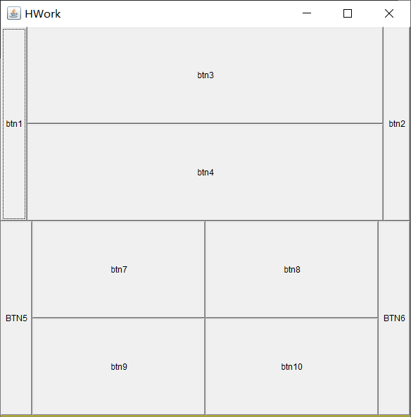

**总结**：

1. Frame是一个顶级窗口；
2. Pane无法单独显示，必须添加到某个容器中。
3. 布局管埋器
     1. 流式
     2. 东西南北中
     3. 表格
4. 大小，定位，背景颜色，可见性，监听！

> 4.事件监听

- 事件监听：当某个事情发生时，干什么？

```java
package github.GUI.Demo02;

import java.awt.*;
import java.awt.event.ActionEvent;
import java.awt.event.ActionListener;
import java.awt.event.WindowAdapter;
import java.awt.event.WindowEvent;

/**
 * @author subeiLY
 * @create 2021-06-05 10:07
 */
public class TestActionEvent {
    public static void main(String[] args) {
        // 按下按钮，触发一些事件
        Frame frame = new Frame();
        Button button = new Button();

        // 因为addActionListener需要一个ActionListener
        MyActionListenner myActionListenner = new MyActionListenner();
        button.addActionListener(myActionListenner);

        frame.add(button,BorderLayout.CENTER);
        frame.pack();

        windowClose(frame); // 关闭窗口
        frame.setVisible(true);
    }

    // 关闭窗体的事件
    private static void windowClose(Frame frame){
        frame.addWindowListener(new WindowAdapter() {
            // 窗口点击关闭时要做的事
            @Override
            public void windowClosing(WindowEvent e) {
                // 结束程序
                System.exit(0);
            }
        });
    }
}

class MyActionListenner implements ActionListener{

    @Override
    public void actionPerformed(ActionEvent e) {
        System.out.println("aaa");
    }
}
```

- 多个按钮，共享一个事件。

```java
package github.GUI.Demo02;

import java.awt.*;
import java.awt.event.ActionEvent;
import java.awt.event.ActionListener;
import java.awt.event.WindowAdapter;
import java.awt.event.WindowEvent;

/**
 * @author subeiLY
 * @create 2021-06-05 10:57
 */
public class TestActionTwo {
    public static void main(String[] args) {
        // 两个按钮，实现同一个监听
        // 开始、停止
        Frame frame = new Frame("开始-停止");
        Button start = new Button("start");
        Button stop = new Button("stop");

        /*
        可以显示的定义触发会返回的命令，如果不显示定义，则会走默认的值！
        可以多个按钮只写一个监听类！
         */
        stop.setActionCommand("button-stop");

        MyMonitor myMonitor = new MyMonitor();
        start.addActionListener(myMonitor);
        stop.addActionListener(myMonitor);

        frame.add(start,BorderLayout.NORTH);
        frame.add(stop,BorderLayout.SOUTH);

        frame.pack();
        windowClose(frame); // 关闭窗口
        frame.setVisible(true);
    }

    // 关闭窗体的事件
    private static void windowClose(Frame frame){
        frame.addWindowListener(new WindowAdapter() {
            // 窗口点击关闭时要做的事
            @Override
            public void windowClosing(WindowEvent e) {
                // 结束程序
                System.exit(0);
            }
        });
    }
}

class MyMonitor implements ActionListener{

    @Override
    public void actionPerformed(ActionEvent e) {
        // e.getActionCommand()返回按钮信息
        System.out.println("按钮被点击了！" + e.getActionCommand());
    }
}
```


> 5.输入框监听事件

```java
package github.GUI.Demo02;

import java.awt.*;
import java.awt.event.ActionEvent;
import java.awt.event.ActionListener;
import java.awt.event.WindowAdapter;
import java.awt.event.WindowEvent;

/**
 * @author subeiLY
 * @create 2021-06-05 11:15
 */
public class TestTest01 {
    public static void main(String[] args) {
        // 启动！
        MyFrame frame = new MyFrame();

        windowClose(frame); // 关闭窗口
    }
    // 关闭窗体的事件
    private static void windowClose(Frame frame){
        frame.addWindowListener(new WindowAdapter() {
            // 窗口点击关闭时要做的事
            @Override
            public void windowClosing(WindowEvent e) {
                // 结束程序
                System.exit(0);
            }
        });
    }
}

class MyFrame extends Frame {
    public MyFrame(){
        TextField textField = new TextField();
        add(textField);

        // 监听这个文本输入框输入的文字
        MyActionListener2 myActionListener2 = new MyActionListener2();
        textField.addActionListener(myActionListener2);

        // 设置替换编码
        textField.setEchoChar('*');

        setVisible(true);
        pack();
    }
}

class MyActionListener2 implements ActionListener {
    @Override
    public void actionPerformed(ActionEvent e) {
        TextField field = (TextField) e.getSource();// 获得一些资源
        System.out.println(field.getText());    // 获得输入框中的文本
        field.setText("");  // null

    }
}
```

> 6.简易计算器，组合+内部类复习！

**OOP原则：组合，大于继承！**

```java
class A extends B{
    
}
class A{
    public B b;
}
```

```java
package github.GUI.Demo02;

import java.awt.*;
import java.awt.event.ActionEvent;
import java.awt.event.ActionListener;
import java.awt.event.WindowAdapter;
import java.awt.event.WindowEvent;

/**
 * @author subeiLY
 * @create 2021-06-05 13:53
 */
public class TextCalc {
    public static void main(String[] args) {
        // 启动！
        Frame frame = new Calculator();

        windowClose(frame); // 关闭窗口

    }
    // 关闭窗体的事件
    private static void windowClose(Frame frame){
        frame.addWindowListener(new WindowAdapter() {
            // 窗口点击关闭时要做的事
            @Override
            public void windowClosing(WindowEvent e) {
                // 结束程序
                System.exit(0);
            }
        });
    }
}


// 计算器类
class Calculator extends Frame{
    public Calculator(){
        // 三个文本框
        TextField num1 = new TextField(10);    // 字符数
        TextField num2 = new TextField(10);    // 字符数
        TextField num3 = new TextField(20);    // 字符数

        // 一个按钮
        Button button = new Button("=");

        button.addActionListener(new MyCalculatorListener(num1,num2,num3));

        // 一个标签
        Label label = new Label("+");

        // 布局
        setLayout(new FlowLayout());

        add(num1);
        add(label);
        add(num2);
        add(button);
        add(num3);

        pack();
        setVisible(true);
    }
}

// 监听器类
class MyCalculatorListener implements ActionListener{
    // 获取三个变量
    private TextField num1,num2,num3;

    public MyCalculatorListener(TextField num1,TextField num2,TextField num3){
        this.num1 = num1;
        this.num2 = num2;
        this.num3 = num3;
    }

    @Override
    public void actionPerformed(ActionEvent e) {
        // 1.获得加数和倍加数
        int n1 = Integer.parseInt(num1.getText());
        int n2 = Integer.parseInt(num2.getText());

        // 2.将这个值 + 法运算后，放到第三个框
        num3.setText("" + (n1+n2));

        // 3.清楚前两个值
        num1.setText("");
        num2.setText("");

    }
}
```

- 完全改造为面向对象

```java
package github.GUI.Demo02;

import java.awt.*;
import java.awt.event.ActionEvent;
import java.awt.event.ActionListener;

/**
 * @author subeiLY
 * @create 2021-06-05 13:53
 */
public class TextCalc {
    public static void main(String[] args) {
        new Calculator().loadFrame();

    }
}


// 计算器类
class Calculator extends Frame{
    // 属性
    TextField num1,num2,num3;

    // 方法
    public void loadFrame(){
        // 三个文本框
        num1 = new TextField(10);    // 字符数
        num2 = new TextField(10);    // 字符数
        num3 = new TextField(20);    // 字符数

        // 一个按钮
        Button button = new Button("=");
        // 一个标签
        Label label = new Label("+");

        button.addActionListener(new MyCalculatorListener(this));

        // 布局
        setLayout(new FlowLayout());

        add(num1);
        add(label);
        add(num2);
        add(button);
        add(num3);

        pack();
        setVisible(true);
    }
}

// 监听器类
class MyCalculatorListener implements ActionListener{
    // 获取三个变量
    Calculator calculator = null;

    public MyCalculatorListener(Calculator calculator){
        this.calculator = calculator;
    }

    @Override
    public void actionPerformed(ActionEvent e) {
        // 1.获得加数和倍加数
        int n1 = Integer.parseInt(calculator.num1.getText());
        int n2 = Integer.parseInt(calculator.num2.getText());

        // 2.将这个值 + 法运算后，放到第三个框
        calculator.num3.setText("" + (n1+n2));

        // 3.清楚前两个值
        calculator.num1.setText("");
        calculator.num2.setText("");
    }
}
```

- 内部类

```java
package github.GUI.Demo02;

import java.awt.*;
import java.awt.event.ActionEvent;
import java.awt.event.ActionListener;

/**
 * @author subeiLY
 * @create 2021-06-05 13:53
 */
public class TextCalc {
    public static void main(String[] args) {
        new Calculator().loadFrame();
    }
}


// 计算器类
class Calculator extends Frame{
    // 属性
    TextField num1,num2,num3;

    // 方法
    public void loadFrame(){
        // 三个文本框
        num1 = new TextField(10);    // 字符数
        num2 = new TextField(10);    // 字符数
        num3 = new TextField(20);    // 字符数

        // 一个按钮
        Button button = new Button("=");
        // 一个标签
        Label label = new Label("+");

        button.addActionListener(new MyCalculatorListener());

        // 布局
        setLayout(new FlowLayout());

        add(num1);
        add(label);
        add(num2);
        add(button);
        add(num3);

        pack();
        setVisible(true);
    }

    // 监听器类
    // 内部类最大的好处，就是可以畅通无阻的访问外部属性和方法！
    private class MyCalculatorListener implements ActionListener{

        @Override
        public void actionPerformed(ActionEvent e) {
            // 1.获得加数和倍加数
            int n1 = Integer.parseInt(num1.getText());
            int n2 = Integer.parseInt(num2.getText());

            // 2.将这个值 + 法运算后，放到第三个框
            num3.setText("" + (n1+n2));

            // 3.清楚前两个值
            num1.setText("");
            num2.setText("");
        }
    }
}
```

> 画笔

```java
package github.GUI.Demo03;

import java.awt.*;

/**
 * @author subeiLY
 * @create 2021-06-05 14:39
 */
public class TestPaint {
    public static void main(String[] args) {
        new MyPaint().loadFrame();
    }
}

class MyPaint extends Frame{

    public void loadFrame(){
        setBounds(200,200,600,600);
        setVisible(true);

    }

    // 画笔
    @Override
    public void paint(Graphics g){
        // 画笔需要颜色
        g.setColor(Color.green);
//        g.drawOval(100,100,100,100);    // 画一个空心的圆
        g.fillOval(100,100,100,100);    // 画一个实心的圆

        g.setColor(Color.BLUE);
        g.fillRect(150,200,200,200);

        // 画笔用完，还原到最初的颜色
    }
}
```


> 鼠标监听

- 目的：想要实现鼠标画画。

```java
package github.GUI.Demo03;

import java.awt.*;
import java.awt.event.MouseAdapter;
import java.awt.event.MouseEvent;
import java.awt.event.WindowAdapter;
import java.awt.event.WindowEvent;
import java.util.ArrayList;
import java.util.Iterator;

/**
 * @author subeiLY
 * @create 2021-06-05 14:47
 */
// 测试鼠标监听
public class TestMouseListener {
    public static void main(String[] args) {
        MyFrame frame = new MyFrame("画图");

        windowClose(frame); // 关闭窗口
    }
    // 关闭窗体的事件
    private static void windowClose(Frame frame){
        frame.addWindowListener(new WindowAdapter() {
            // 窗口点击关闭时要做的事
            @Override
            public void windowClosing(WindowEvent e) {
                // 结束程序
                System.exit(0);
            }
        });
    }
}

// 自己的类
class MyFrame extends Frame{
    ArrayList ponits;
    // 需要监听鼠标当前位置，需要集合来存储这个点
    public MyFrame(String title){
        super(title);
        setBounds(200,200,400,300);
        // 存鼠标点击的点
        ponits = new ArrayList<>();

        setVisible(true);
        // 正对这个窗口
        this.addMouseListener(new MyMouseLintener());

    }

    @Override
    public void paint(Graphics g) {
        // 画画，监听鼠标的事件
        Iterator iterator = ponits.iterator();
        while(iterator.hasNext()){
            Point point = (Point) iterator.next();
            g.setColor(Color.orange);
            g.fillOval(point.x,point.y,10,10);
        }
    }

    // 添加一个点到界面上
    public void addPoint(Point point){
        ponits.add(point);
    }


    // 适配器模式
    private class MyMouseLintener extends MouseAdapter {

        // 鼠标按压
        @Override
        public void mousePressed(MouseEvent e) {
            MyFrame myFrame = (MyFrame) e.getSource();
            myFrame.addPoint(new Point(e.getX(),e.getY()));

            // 每次点击都需要重画一次
            myFrame.repaint();  // 刷新
        }
    }
}
```


> 窗口监听

```java
package github.GUI.Demo03;

import java.awt.*;
import java.awt.event.WindowAdapter;
import java.awt.event.WindowEvent;

/**
 * @author subeiLY
 * @create 2021-06-05 15:00
 */
public class TestWindow {
    public static void main(String[] args) {
        new WindowFrame();

    }
}

class WindowFrame extends Frame{
    public WindowFrame(){
        setBackground(Color.blue);
        setBounds(100,100,200,200);
        setVisible(true);
//        addWindowFocusListener(new MyWindowListener());

        this.addWindowListener(
                // 匿名内部类
                new WindowAdapter(){

                    // 关闭窗口
                    @Override
                    public void windowClosing(WindowEvent e) {
                        System.out.println("windowClosing");
                        System.exit(0);
                    }

                    // 激活窗口
                    @Override
                    public void windowActivated(WindowEvent e) {
                        WindowFrame source = (WindowFrame) e.getSource();
                        source.setTitle("被激活了！！！");
                        
                        System.out.println("windowActivated");
                    }
                }
        );
    }
}
```


> 键盘监听

```java
package github.GUI.Demo03;

import java.awt.*;
import java.awt.event.KeyAdapter;
import java.awt.event.KeyEvent;

/**
 * @author subeiLY
 * @create 2021-06-05 15:13
 */
// 键
public class TestKeyListener {
    public static void main(String[] args) {
        new KeyFrame();
    }
}

class KeyFrame extends Frame {
    public KeyFrame(){
        setBounds(1,2,400,300);
        setVisible(true);

        this.addKeyListener(new KeyAdapter() {
            // 键盘按下
            @Override
            public void keyPressed(KeyEvent e) {
                // 获得键盘下的键是哪一个
                int keyCode = e.getKeyCode();
                System.out.println(keyCode);
                if(keyCode == KeyEvent.VK_UP){
                    System.out.println("你按下了上键！");
                }
                // 根据按下的键不同，产生不同的结果
            }
        });

    }
}
```

### 3.Swing

#### 1.窗口、面

```java
package github.GUI.Demo04;

import javax.swing.*;
import java.awt.*;

/**
 * @author subeiLY
 * @create 2021-06-05 15:23
 */
public class JFrameDemo02 {
    public static void main(String[] args) {
        new MyJFrame().init();
    }
}

class MyJFrame extends JFrame{
    public void init(){
        this.setBounds(300,300,300,300);
        this.setVisible(true);

        // 设置显示文字
        JLabel label = new JLabel("欢迎查阅！！！");
        this.add(label);
        // 让文本居中
        label.setHorizontalAlignment(SwingConstants.CENTER);

        // 获得一个容器
        Container contentPane = this.getContentPane();
        contentPane.setBackground(Color.orange);

        // 关闭事件
        this.setDefaultCloseOperation(WindowConstants.EXIT_ON_CLOSE);

    }
}
```

#### 2.JDialog弹窗

- 默认就有了，弹出实现！

```java
package github.GUI.Demo04;

import javax.swing.*;
import java.awt.*;
import java.awt.event.ActionEvent;
import java.awt.event.ActionListener;

/**
 * @author subeiLY
 * @create 2021-06-05 15:30
 */
// 主窗口
public class DialogDemo extends JFrame {
    public DialogDemo(){
        this.setVisible(true);
        this.setSize(700,500);
        this.setDefaultCloseOperation(WindowConstants.EXIT_ON_CLOSE);

        // JFrame 放东西，容器
        Container container = this.getContentPane();
        // 绝对布局
        container.setLayout(null);

        // 按钮
        JButton button = new JButton("点击弹出一个对话框");
        button.setBounds(30,30,200,200);

        // 点击这个按钮时，弹出一个弹窗
        button.addActionListener(new ActionListener() {
            @Override
            public void actionPerformed(ActionEvent e) {
                // 弹窗
                new MyDialogDemo();
            }
        });

        container.add(button);

    }

    public static void main(String[] args) {
        new DialogDemo();
    }
}

// 弹窗的窗口
class MyDialogDemo extends JDialog{
    public MyDialogDemo(){
        this.setVisible(true);
        this.setBounds(100,100,500,500);
        this.setDefaultCloseOperation(WindowConstants.DISPOSE_ON_CLOSE);

        Container container = this.getContentPane();
        container.setLayout(null);

        container.add(new Label("Java全栈——GUI"));
    }
}
```

#### 3.标签 

```java
package github.GUI.Demo04;

import javax.swing.*;
import java.awt.*;

/**
 * @author subeiLY
 * @create 2021-06-05 15:38
 */
public class IconDemo extends JFrame implements Icon {
    private int width;
    private int height;

    public IconDemo(){}

    public IconDemo(int width, int height) {
        this.width = width;
        this.height = height;
    }

    public void init(){
        IconDemo iconDemo = new IconDemo(15, 15);
        // 图标可以放标签，也可以放在按钮上！
        JLabel label = new JLabel("icontest", iconDemo, SwingConstants.CENTER);

        Container container = getContentPane();
        container.add(label);

        this.setVisible(true);
        this.setDefaultCloseOperation(WindowConstants.EXIT_ON_CLOSE);
    }

    public static void main(String[] args) {
        new IconDemo().init();
    }

    @Override
    public void paintIcon(Component c, Graphics g, int x, int y) {
        g.fillOval(x,y,width,height);
    }

    @Override
    public int getIconWidth() {
        return this.width;
    }

    @Override
    public int getIconHeight() {
        return this.height;
    }
}
```

```java
package github.GUI.Demo04;

import javax.swing.*;
import java.awt.*;
import java.net.URL;

/**
 * @author subeiLY
 * @create 2021-06-05 15:45
 */
public class ImageIconDemo extends JFrame {
    public ImageIconDemo(){
        // 获取图片地址
        JLabel label = new JLabel("ImageIcon");
        URL url = ImageIconDemo.class.getResource("tpg.jpg");

        ImageIcon imageIcon = new ImageIcon(url);
        label.setIcon(imageIcon);
        label.setHorizontalAlignment(SwingConstants.CENTER);

        Container container = getContentPane();
        container.add(label);

        setVisible(true);
        setDefaultCloseOperation(WindowConstants.EXIT_ON_CLOSE);
        setBounds(400,400,400,400);
    }

    public static void main(String[] args) {
        new ImageIconDemo();
    }
}
```

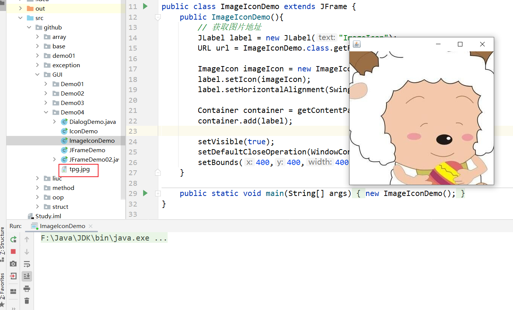

#### 4.面板

```java
package github.GUI.Demo05;

import javax.swing.*;
import java.awt.*;

/**
 * @author subeiLY
 * @create 2021-06-05 15:55
 */
public class JPaneDemo extends JFrame {
    public JPaneDemo(){
        Container container = this.getContentPane();
        container.setLayout(new GridLayout(2,1,10,10));

        JPanel panel = new JPanel(new GridLayout(1, 3));

        panel.add(new JButton("1"));
        panel.add(new JButton("1"));
        panel.add(new JButton("1"));

        container.add(panel);

        this.setVisible(true);
        this.setSize(500,500);
        this.setDefaultCloseOperation(WindowConstants.EXIT_ON_CLOSE);

    }

    public static void main(String[] args) {
        new JPaneDemo();
    }
}
```


- 边框——JScroll

```java
package github.GUI.Demo05;

import javax.swing.*;
import java.awt.*;

/**
 * @author subeiLY
 * @create 2021-06-05 16:04
 */
public class JScroPallDemo extends JFrame {

    public JScroPallDemo(){
        Container container = this.getContentPane();
        // 文本域
        JTextArea textArea = new JTextArea(20, 30);
        textArea.setText("欢迎查阅！！");

        // 面板
        JScrollPane scrollPane = new JScrollPane(textArea);
        container.add(scrollPane);

        this.setVisible(true);
        this.setBounds(200,200,300,350);
        this.setDefaultCloseOperation(WindowConstants.EXIT_ON_CLOSE);
    }

    public static void main(String[] args) {
        new JScroPallDemo();
    }
}
```

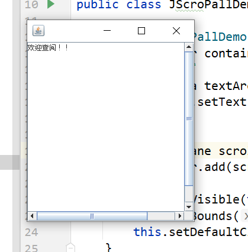

#### 5.按钮

- 图标按钮

```java
package github.GUI.Demo05;

import javax.swing.*;
import java.awt.*;
import java.net.URL;

/**
 * @author subeiLY
 * @create 2021-06-05 16:13
 */
public class JButtonDemo01 extends JFrame {

    public JButtonDemo01(){
        Container container = this.getContentPane();
        // 将一个图片变为图标
        URL resource = JButtonDemo01.class.getResource("tpg.jpg");
        Icon icon = new ImageIcon(resource);

        // 将图标放在按钮上
        JButton button = new JButton();
        button.setIcon(icon);
        button.setToolTipText("图片按钮");

        // add
        container.add(button);

        this.setVisible(true);
        this.setSize(500,300);
        this.setDefaultCloseOperation(WindowConstants.EXIT_ON_CLOSE);

    }

    public static void main(String[] args) {
        new JButtonDemo01();
    }
}
```


- 单选框和多选框

```java
package github.GUI.Demo05;

import javax.swing.*;
import java.awt.*;
import java.net.URL;

/**
 * @author subeiLY
 * @create 2021-06-05 16:13
 */
public class JButtonDemo02 extends JFrame {
    public JButtonDemo02(){
        Container container = this.getContentPane();
        // 将一个图片变为图标
        URL resource = JButtonDemo01.class.getResource("tpg.jpg");
        Icon icon = new ImageIcon(resource);

        // 单选框
        JRadioButton radioButton01 = new JRadioButton("JRadioButton01");
        JRadioButton radioButton02 = new JRadioButton("JRadioButton02");
        JRadioButton radioButton03 = new JRadioButton("JRadioButton03");

        ButtonGroup group = new ButtonGroup();
        group.add(radioButton01);
        group.add(radioButton02);
        group.add(radioButton03);

        container.add(radioButton01,BorderLayout.CENTER);
        container.add(radioButton02,BorderLayout.NORTH);
        container.add(radioButton03,BorderLayout.SOUTH);


        this.setVisible(true);
        this.setSize(500,300);
        this.setDefaultCloseOperation(WindowConstants.EXIT_ON_CLOSE);

    }

    public static void main(String[] args) {
        new JButtonDemo02();
    }
}
```


```java
package github.GUI.Demo05;

import javax.swing.*;
import java.awt.*;
import java.net.URL;

/**
 * @author subeiLY
 * @create 2021-06-05 16:13
 */

public class JButtonDemo03 extends JFrame {
    public JButtonDemo03(){
        Container container = this.getContentPane();
        // 将一个图片变为图标
        URL resource = JButtonDemo01.class.getResource("tpg.jpg");
        Icon icon = new ImageIcon(resource);

        // 多选框
        JCheckBox checkBox01 = new JCheckBox("checkBox01");
        JCheckBox checkBox02 = new JCheckBox("checkBox02");

        container.add(checkBox01,BorderLayout.NORTH);
        container.add(checkBox02,BorderLayout.SOUTH);

        this.setVisible(true);
        this.setSize(500,300);
        this.setDefaultCloseOperation(WindowConstants.EXIT_ON_CLOSE);

    }

    public static void main(String[] args) {
        new JButtonDemo03();
    }
}
```


#### 6.列表

- 下拉框

```java
package github.GUI.Demo06;

import javax.swing.*;
import java.awt.*;

/**
 * @author subeiLY
 * @create 2021-06-05 16:23
 */
public class TextComboxDemo01 extends JFrame {
    public TextComboxDemo01(){
        Container container = this.getContentPane();
        JComboBox box = new JComboBox();

        box.addItem(null);
        box.addItem("正在热映");
        box.addItem("已下架");
        box.addItem("即将上架");

        container.add(box);

        this.setVisible(true);
        this.setSize(500,500);
        this.setDefaultCloseOperation(WindowConstants.EXIT_ON_CLOSE);

    }

    public static void main(String[] args) {
        new TextComboxDemo01();
    }
}
```


- 列表框

```java
package github.GUI.Demo06;

import javax.swing.*;
import java.awt.*;
import java.util.Vector;

/**
 * @author subeiLY
 * @create 2021-06-05 16:26
 */
public class TextComboxDemo02 extends JFrame{
    public TextComboxDemo02(){
        Container container = this.getContentPane();
        // 生成列表的内容
//        String[] contents = {"1","2","3"};

        Vector vector = new Vector();

        // 列表中放入需要的内容
        JList jList = new JList(vector);

        vector.add("赵公明");
        vector.add("吕岳");
        vector.add("吴刚");

        container.add(jList);

        this.setVisible(true);
        this.setSize(500,500);
        this.setDefaultCloseOperation(WindowConstants.EXIT_ON_CLOSE);

    }

    public static void main(String[] args) {
        new TextComboxDemo02();
    }
}
```

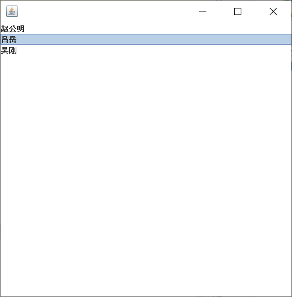

- 应用场景
  - 选择地区，或者一些单个选项；
  - 列表：展示信息，一股是动态扩容！

#### 7.文本框

```java
package github.GUI.Demo06;

import javax.swing.*;
import java.awt.*;

/**
 * @author subeiLY
 * @create 2021-06-05 16:33
 */
// 文本框
public class TestTextDemo01 extends JFrame{
    public TestTextDemo01(){
        Container container = this.getContentPane();

        JTextField textField = new JTextField("Hello");
        JTextField textField1 = new JTextField("World", 30);

        container.add(textField,BorderLayout.SOUTH);
        container.add(textField1,BorderLayout.NORTH);

        this.setVisible(true);
        this.setSize(500,500);
        this.setDefaultCloseOperation(WindowConstants.EXIT_ON_CLOSE);

    }

    public static void main(String[] args) {
        new TestTextDemo01();
    }
}
```


```java
package github.GUI.Demo06;

import javax.swing.*;
import java.awt.*;

/**
 * @author subeiLY
 * @create 2021-06-05 16:37
 */
// 密码框
public class TestTextDemo02 extends JFrame {
    public TestTextDemo02(){
        Container container = this.getContentPane();

        JPasswordField passwordField = new JPasswordField();
        passwordField.setEchoChar('*');

        container.add(passwordField);

        this.setVisible(true);
        this.setSize(500,500);
        this.setDefaultCloseOperation(WindowConstants.EXIT_ON_CLOSE);

    }

    public static void main(String[] args) {
        new TestTextDemo02();
    }
}
```


```java
package github.GUI.Demo05;

import javax.swing.*;
import java.awt.*;

/**
 * @author subeiLY
 * @create 2021-06-05 16:04
 */
// 文本域
public class JScroPallDemo extends JFrame {

    public JScroPallDemo(){
        Container container = this.getContentPane();
        // 文本域
        JTextArea textArea = new JTextArea(20, 30);
        textArea.setText("欢迎查阅！！");

        // 面板
        JScrollPane scrollPane = new JScrollPane(textArea);
        container.add(scrollPane);

        this.setVisible(true);
        this.setBounds(200,200,300,350);
        this.setDefaultCloseOperation(WindowConstants.EXIT_ON_CLOSE);
    }

    public static void main(String[] args) {
        new JScroPallDemo();
    }
}
```


### 4.贪吃蛇小游戏

> 素材链接：[https://www.yuque.com/nizhegechouloudetuboshu/library/foie2x](https://www.yuque.com/nizhegechouloudetuboshu/library/foie2x)

#### 1.静态界面绘制


- StartGame.java

```java
package github.GUI.snack;

import javax.swing.*;

/**
 * @author subeiLY
 * @create 2021-06-05 17:32
 */
public class StartGame {
    public static void main(String[] args) {
        JFrame frame = new JFrame("Java-贪吃蛇小游戏");

        frame.setBounds(10,10,915,820); // 设置窗口的位置和大小
        frame.setResizable(false);  // 窗口大小不可调整,即固定窗口大小
        frame.setDefaultCloseOperation(JFrame.EXIT_ON_CLOSE); // 设置关闭事件，游戏可以关闭

        //正常游戏界面的绘制
        frame.add(new GamePanel());

        frame.setVisible(true); // 展示窗口
    }
}
```

- Date.java

```java
package github.GUI.snack;

import javax.swing.*;
import java.net.URL;

/**
 * @author subeiLY
 * @create 2021-06-05 17:41
 */
// 数据中心
public class Data {
    //头部图片
    public static URL headerUrl = Data.class.getResource("statics/header.png");
    public static ImageIcon header = new ImageIcon(headerUrl);
    //头部：上下左右
    public static URL upUrl = Data.class.getResource("statics/up.png");
    public static URL downUrl = Data.class.getResource("statics/down.png");
    public static URL leftUrl = Data.class.getResource("statics/left.png");
    public static URL rightUrl = Data.class.getResource("statics/right.png");
    public static ImageIcon up = new ImageIcon(upUrl);
    public static ImageIcon down = new ImageIcon(downUrl);
    public static ImageIcon left = new ImageIcon(leftUrl);
    public static ImageIcon right = new ImageIcon(rightUrl);
    //身体
    public static URL bodyUrl = Data.class.getResource("statics/body.png");
    public static ImageIcon body = new ImageIcon(bodyUrl);
    //食物
    public static URL foodUrl = Data.class.getResource("statics/food.png");
    public static ImageIcon food = new ImageIcon(foodUrl);
}
```

- GamePanel.java

```java
package github.GUI.snack;

import javax.swing.*;
import java.awt.*;

/**
 * @author subeiLY
 * @create 2021-06-05 17:38
 */
public class GamePanel extends JPanel {

    // 绘制面板
    @Override
    protected void paintComponent(Graphics g) {
        super.paintComponent(g);    // 清屏
        // 绘制静态面板
        this.setBackground(Color.white);
        Data.header.paintIcon(this,g,25,10);    // 头部广告栏画上去
        g.fillRect(25,125,850,625);  // 默认的游戏界面
    }

}
```


#### 2.绘制静态小蛇

```java
package github.GUI.snack;

import javax.swing.*;
import java.awt.*;

/**
 * @author subeiLY
 * @create 2021-06-05 17:38
 */
public class GamePanel extends JPanel {

    // 定义蛇的数据结构
    int length; // 定义蛇的长度
    int[] snakeX = new int[600];  // 蛇的坐标x
    int[] snakeY = new int[500];  // 蛇的坐标y
    String fx = "R"; // 蛇的方向 ： R:右  L:左  U:上  D:下
    boolean isStart = false; // 游戏是否开始


    // 构造器
    public GamePanel(){
        init();
    }

    // 初始化方法
    public void init(){
        length = 3; // 初始小蛇有三节,包括小脑袋
        // 初始化开始的蛇,给蛇定位,
        snakeX[0] = 100; snakeY[0] = 125;
        snakeX[1] = 75; snakeY[1] = 120;
        snakeX[2] = 50; snakeY[2] = 120;

    }

    // 绘制面板
    @Override
    protected void paintComponent(Graphics g) {
        super.paintComponent(g);    // 清屏
        // 绘制静态面板
        this.setBackground(Color.white);
        Data.header.paintIcon(this,g,25,10);    // 头部广告栏画上去
        g.fillRect(25,125,850,625);  // 默认的游戏界面

        // 把小蛇画上去
        if (fx.equals("R")){ // 蛇的头通过方向变量来判断
            Data.right.paintIcon(this,g,snakeX[0],snakeY[0]);
        }else if (fx.equals("L")){
            Data.left.paintIcon(this,g,snakeX[0],snakeY[0]);
        }else if (fx.equals("U")){
            Data.up.paintIcon(this,g,snakeX[0],snakeY[0]);
        }else if (fx.equals("D")){
            Data.down.paintIcon(this,g,snakeX[0],snakeY[0]);
        }
        for (int i = 1; i < length; i++) {
            Data.body.paintIcon(this,g,snakeX[i],snakeY[i]); // 蛇的身体长度根据length来控制
        }

        // 游戏状态
        if (isStart==false){
            g.setColor(Color.white);
            g.setFont(new Font("微软雅黑",Font.BOLD,40));   // 设置字体
            g.drawString("按下空格开始游戏!",300,300);  // 文字提示
        }

    }

}
```

#### 3.小蛇开始移动

```java
package github.GUI.snack;

import javax.swing.*;
import java.awt.*;
import java.awt.event.ActionEvent;
import java.awt.event.ActionListener;
import java.awt.event.KeyEvent;
import java.awt.event.KeyListener;

/**
 * @author subeiLY
 * @create 2021-06-05 17:38
 */
public class GamePanel extends JPanel implements KeyListener, ActionListener {

    // 定义蛇的数据结构
    int length; // 定义蛇的长度
    int[] snakeX = new int[600];  // 蛇的坐标x
    int[] snakeY = new int[500];  // 蛇的坐标y
    String fx = "R"; // 蛇的方向 ： R:右  L:左  U:上  D:下
    boolean isStart = false; // 游戏是否开始

    boolean isFail = false; // 游戏是否结束

    // 定时器:第一个参数，就是定时执行时间,100毫秒执行一次
    Timer timer = new Timer(100, this);

    // 构造器
    public GamePanel(){
        init();
        // 获得焦点和键盘事件
        this.setFocusable(true); // 获取焦点事件
        this.addKeyListener(this); // 键盘监听事件
        timer.start();
    }

    // 初始化方法
    public void init(){
        length = 3; // 初始小蛇有三节,包括小脑袋
        // 初始化开始的蛇,给蛇定位,
        snakeX[0] = 100; snakeY[0] = 125;
        snakeX[1] = 75; snakeY[1] = 125;
        snakeX[2] = 50; snakeY[2] = 125;

    }

    // 绘制面板
    @Override
    protected void paintComponent(Graphics g) {
        super.paintComponent(g);    // 清屏
        // 绘制静态面板
        this.setBackground(Color.white);
        Data.header.paintIcon(this,g,25,10);    // 头部广告栏画上去
        g.fillRect(25,125,850,625);  // 默认的游戏界面

        // 把小蛇画上去
        if (fx.equals("R")){ // 蛇的头通过方向变量来判断
            Data.right.paintIcon(this,g,snakeX[0],snakeY[0]);
        }else if (fx.equals("L")){
            Data.left.paintIcon(this,g,snakeX[0],snakeY[0]);
        }else if (fx.equals("U")){
            Data.up.paintIcon(this,g,snakeX[0],snakeY[0]);
        }else if (fx.equals("D")){
            Data.down.paintIcon(this,g,snakeX[0],snakeY[0]);
        }
        for (int i = 1; i < length; i++) {
            Data.body.paintIcon(this,g,snakeX[i],snakeY[i]); // 蛇的身体长度根据length来控制
        }

        // 游戏状态
        if (isStart==false){
            g.setColor(Color.white);
            g.setFont(new Font("微软雅黑",Font.BOLD,40));   // 设置字体
            g.drawString("按下空格开始游戏!",300,300);  // 文字提示
        }

    }

    // 键盘监听事件
    @Override
    public void keyPressed(KeyEvent e) {
        int keyCode = e.getKeyCode(); // 获取按下的键盘

        if (keyCode==KeyEvent.VK_SPACE){ // 如果是空格
            isStart = !isStart; // 取反
            repaint();
        }

        // 小蛇移动
        if (keyCode==KeyEvent.VK_LEFT){
            fx = "L";
        }else if (keyCode==KeyEvent.VK_RIGHT){
            fx = "R";
        }else if (keyCode==KeyEvent.VK_UP){
            fx = "U";
        }else if (keyCode==KeyEvent.VK_DOWN){
            fx = "D";
        }

    }

    @Override
    public void keyReleased(KeyEvent e) {

    }

    @Override
    public void keyTyped(KeyEvent e) {

    }

    // 定时执行时的操作
    @Override
    public void actionPerformed(ActionEvent e) {
        if (isStart && isFail==false) {  // 如果游戏是开始状态，且没有结束，则小蛇移动
            // 右移:即让后一个移到前一个的位置即可 !
            for (int i = length - 1; i > 0; i--) { // 除了脑袋都往前移：身体移动
                snakeX[i] = snakeX[i - 1]; // 即第i节(后一节)的位置变为(i-1：前一节)节的位置！
                snakeY[i] = snakeY[i - 1];
            }
            // 通过方向控制，头部移动
            if (fx.equals("R")) {
                snakeX[0] = snakeX[0] + 25;
                if (snakeX[0] > 850) snakeX[0] = 25;    // 边界判断
            } else if (fx.equals("L")) {
                snakeX[0] = snakeX[0] - 25;
                if (snakeX[0] < 25) snakeX[0] = 850;    // 边界判断
            } else if (fx.equals("U")) {
                snakeY[0] = snakeY[0] - 25;
                if (snakeY[0] < 125) snakeY[0] = 725;    // 边界判断
            } else if (fx.equals("D")) {
                snakeY[0] = snakeY[0] + 25;
                if (snakeY[0] > 725) snakeY[0] = 125;    // 边界判断
            }
            repaint();  //重画页面
        }
        timer.start();  // 定时器开启
    }
}
```

#### 4.小蛇开始吃食物

```java
package github.GUI.snack;

import javax.swing.*;
import java.awt.*;
import java.awt.event.*;
import java.util.Random;

/**
 * @author subeiLY
 * @create 2021-06-05 17:38
 */
public class GamePanel extends JPanel implements KeyListener, ActionListener {

    // 定义蛇的数据结构
    int length; // 定义蛇的长度
    int[] snakeX = new int[600];  // 蛇的坐标x
    int[] snakeY = new int[500];  // 蛇的坐标y
    String fx = "R"; // 蛇的方向 ： R:右  L:左  U:上  D:下
    boolean isStart = false; // 游戏是否开始
    boolean isFail = false; // 游戏是否结束

    // 食物的坐标
    int foodx;
    int foody;
    Random random = new Random();

    // 定时器:第一个参数，就是定时执行时间,100毫秒执行一次
    Timer timer = new Timer(100, this);

    // 构造器
    public GamePanel(){
        init();
        // 获得焦点和键盘事件
        this.setFocusable(true); // 获取焦点事件
        this.addKeyListener(this); // 键盘监听事件
        timer.start();
    }

    // 初始化方法
    public void init(){
        length = 3; // 初始小蛇有三节,包括小脑袋
        // 初始化开始的蛇,给蛇定位,
        snakeX[0] = 100; snakeY[0] = 125;
        snakeX[1] = 75; snakeY[1] = 125;
        snakeX[2] = 50; snakeY[2] = 125;

        // 把食物随机分布到界面上
        foodx = 25 + 25 * random.nextInt(34);
        foody = 125 + 25 * random.nextInt(25);

    }

    // 绘制面板
    @Override
    protected void paintComponent(Graphics g) {
        super.paintComponent(g);    // 清屏
        // 绘制静态面板
        this.setBackground(Color.white);
        Data.header.paintIcon(this,g,25,10);    // 头部广告栏画上去
        g.fillRect(25,125,850,625);  // 默认的游戏界面

        // 把小蛇画上去
        if (fx.equals("R")){ // 蛇的头通过方向变量来判断
            Data.right.paintIcon(this,g,snakeX[0],snakeY[0]);
        }else if (fx.equals("L")){
            Data.left.paintIcon(this,g,snakeX[0],snakeY[0]);
        }else if (fx.equals("U")){
            Data.up.paintIcon(this,g,snakeX[0],snakeY[0]);
        }else if (fx.equals("D")){
            Data.down.paintIcon(this,g,snakeX[0],snakeY[0]);
        }
        for (int i = 1; i < length; i++) {
            Data.body.paintIcon(this,g,snakeX[i],snakeY[i]); // 蛇的身体长度根据length来控制
        }

        // 游戏状态
        if (isStart==false){
            g.setColor(Color.white);
            g.setFont(new Font("微软雅黑",Font.BOLD,40));   // 设置字体
            g.drawString("按下空格开始游戏!",300,300);  // 文字提示
        }

        // 画食物
        Data.food.paintIcon(this,g,foodx,foody);

    }

    // 键盘监听事件
    @Override
    public void keyPressed(KeyEvent e) {
        int keyCode = e.getKeyCode(); // 获取按下的键盘

        if (keyCode==KeyEvent.VK_SPACE){ // 如果是空格
            isStart = !isStart; // 取反
            repaint();
        }
        
        // 小蛇移动
        if (keyCode==KeyEvent.VK_LEFT){
            fx = "L";
        }else if (keyCode==KeyEvent.VK_RIGHT){
            fx = "R";
        }else if (keyCode==KeyEvent.VK_UP){
            fx = "U";
        }else if (keyCode==KeyEvent.VK_DOWN){
            fx = "D";
        }

    }

    @Override
    public void keyReleased(KeyEvent e) {

    }

    @Override
    public void keyTyped(KeyEvent e) {

    }

    // 定时执行时的操作
    @Override
    public void actionPerformed(ActionEvent e) {
        if (isStart && isFail==false) {  // 如果游戏是开始状态，且没有结束，则小蛇移动
            // 右移:即让后一个移到前一个的位置即可 !
            for (int i = length - 1; i > 0; i--) { // 除了脑袋都往前移：身体移动
                snakeX[i] = snakeX[i - 1]; // 即第i节(后一节)的位置变为(i-1：前一节)节的位置！
                snakeY[i] = snakeY[i - 1];
            }
            // 通过方向控制，头部移动
            if (fx.equals("R")) {
                snakeX[0] = snakeX[0] + 25;
                if (snakeX[0] > 850) snakeX[0] = 25;    // 边界判断
            } else if (fx.equals("L")) {
                snakeX[0] = snakeX[0] - 25;
                if (snakeX[0] < 25) snakeX[0] = 850;    // 边界判断
            } else if (fx.equals("U")) {
                snakeY[0] = snakeY[0] - 25;
                if (snakeY[0] < 125) snakeY[0] = 725;    // 边界判断
            } else if (fx.equals("D")) {
                snakeY[0] = snakeY[0] + 25;
                if (snakeY[0] > 725) snakeY[0] = 125;    // 边界判断
            }

            // 吃食物:当蛇的头和食物一样时，算吃到食物！
            if (snakeX[0]==foodx && snakeY[0]==foody){
                length++; // 1.长度加一
                // 2.重新生成食物
                foodx = 25 + 25 * random.nextInt(34);
                foody = 125 + 25 * random.nextInt(25);
            }

            repaint();  //重画页面
        }
        timer.start();  // 定时器开启
    }
}
```

#### 5.失败判定，积分系统

```java
package github.GUI.snack;

import javax.swing.*;
import java.awt.*;
import java.awt.event.*;
import java.util.Random;

/**
 * @author subeiLY
 * @create 2021-06-05 17:38
 */
public class GamePanel extends JPanel implements KeyListener, ActionListener {

    // 定义蛇的数据结构
    int length; // 定义蛇的长度
    int[] snakeX = new int[600];  // 蛇的坐标x
    int[] snakeY = new int[500];  // 蛇的坐标y
    String fx = "R"; // 蛇的方向 ： R:右  L:左  U:上  D:下
    boolean isStart = false; // 游戏是否开始
    boolean isFail = false; // 游戏是否结束

    // 食物的坐标
    int foodx;
    int foody;
    Random random = new Random();

    // 定时器:第一个参数，就是定时执行时间,100毫秒执行一次
    Timer timer = new Timer(100, this);

    int score; // 游戏分数

    // 构造器
    public GamePanel(){
        init();
        // 获得焦点和键盘事件
        this.setFocusable(true); // 获取焦点事件
        this.addKeyListener(this); // 键盘监听事件
        timer.start();
    }

    // 初始化方法
    public void init(){
        length = 3; // 初始小蛇有三节,包括小脑袋
        // 初始化开始的蛇,给蛇定位,
        snakeX[0] = 100; snakeY[0] = 125;
        snakeX[1] = 75; snakeY[1] = 125;
        snakeX[2] = 50; snakeY[2] = 125;

        // 把食物随机分布到界面上
        foodx = 25 + 25 * random.nextInt(34);
        foody = 125 + 25 * random.nextInt(25);

        score = 0; //初始化游戏分数
    }

    // 绘制面板
    @Override
    protected void paintComponent(Graphics g) {
        super.paintComponent(g);    // 清屏
        // 绘制静态面板
        this.setBackground(Color.white);
        Data.header.paintIcon(this,g,25,10);    // 头部广告栏画上去
        g.fillRect(25,125,850,625);  // 默认的游戏界面

        // 把小蛇画上去
        if (fx.equals("R")){ // 蛇的头通过方向变量来判断
            Data.right.paintIcon(this,g,snakeX[0],snakeY[0]);
        }else if (fx.equals("L")){
            Data.left.paintIcon(this,g,snakeX[0],snakeY[0]);
        }else if (fx.equals("U")){
            Data.up.paintIcon(this,g,snakeX[0],snakeY[0]);
        }else if (fx.equals("D")){
            Data.down.paintIcon(this,g,snakeX[0],snakeY[0]);
        }
        for (int i = 1; i < length; i++) {
            Data.body.paintIcon(this,g,snakeX[i],snakeY[i]); // 蛇的身体长度根据length来控制
        }

        // 游戏状态
        if (isStart==false){
            g.setColor(Color.white);
            g.setFont(new Font("微软雅黑",Font.BOLD,40));   // 设置字体
            g.drawString("按下空格开始游戏!",300,300);  // 文字提示
        }

        // 画食物
        Data.food.paintIcon(this,g,foodx,foody);

        g.setColor(Color.white);
        g.setFont(new Font("微软雅黑",Font.BOLD,18));
        g.drawString("长度: " + length,750,35);
        g.drawString("分数: " + score,750,50);

        // 游戏失败
        if(isFail){
            g.setColor(Color.RED);
            g.setFont(new Font("微软雅黑",Font.BOLD,40));
            g.drawString("失败, 按下空格重新开始",200,300);
        }
    }

    // 键盘监听事件
    @Override
    public void keyPressed(KeyEvent e) {
        int keyCode = e.getKeyCode(); // 获取按下的键盘

        if (keyCode==KeyEvent.VK_SPACE){ // 如果是空格
            if (isFail){ // 如果游戏失败,从头再来！
                isFail = false;
                init(); // 重新初始化
            }else { // 否则，暂停游戏
                isStart = !isStart; // 取反
            }
            repaint();
        }

        // 小蛇移动
        if (keyCode==KeyEvent.VK_LEFT){
            fx = "L";
        }else if (keyCode==KeyEvent.VK_RIGHT){
            fx = "R";
        }else if (keyCode==KeyEvent.VK_UP){
            fx = "U";
        }else if (keyCode==KeyEvent.VK_DOWN){
            fx = "D";
        }

    }

    @Override
    public void keyReleased(KeyEvent e) {

    }

    @Override
    public void keyTyped(KeyEvent e) {

    }

    // 定时执行时的操作
    @Override
    public void actionPerformed(ActionEvent e) {
        if (isStart && isFail==false) {  // 如果游戏是开始状态，且没有结束，则小蛇移动
            // 右移:即让后一个移到前一个的位置即可 !
            for (int i = length - 1; i > 0; i--) { // 除了脑袋都往前移：身体移动
                snakeX[i] = snakeX[i - 1]; // 即第i节(后一节)的位置变为(i-1：前一节)节的位置！
                snakeY[i] = snakeY[i - 1];
            }
            // 通过方向控制，头部移动
            if (fx.equals("R")) {
                snakeX[0] = snakeX[0] + 25;
                if (snakeX[0] > 850) snakeX[0] = 25;    // 边界判断
            } else if (fx.equals("L")) {
                snakeX[0] = snakeX[0] - 25;
                if (snakeX[0] < 25) snakeX[0] = 850;    // 边界判断
            } else if (fx.equals("U")) {
                snakeY[0] = snakeY[0] - 25;
                if (snakeY[0] < 125) snakeY[0] = 725;    // 边界判断
            } else if (fx.equals("D")) {
                snakeY[0] = snakeY[0] + 25;
                if (snakeY[0] > 725) snakeY[0] = 125;    // 边界判断
            }

            // 吃食物:当蛇的头和食物一样时，算吃到食物！
            if (snakeX[0]==foodx && snakeY[0]==foody){
                length++; // 1.长度加一
                // 2.重新生成食物
                foodx = 25 + 25 * random.nextInt(34);
                foody = 125 + 25 * random.nextInt(25);
            }

            // 结束判断，头和身体撞到了
            for (int i = 1; i < length; i++) {
                // 如果头和身体碰撞，那就说明游戏失败
                if (snakeX[i]==snakeX[0] && snakeY[i]==snakeY[0] ){
                    isFail = true;
                }
            }

            repaint();  //重画页面
        }
        timer.start();  // 定时器开启
    }
}
```

> Java版贪吃蛇开发完成！！！
>
> 可执行exe文件：https://download.csdn.net/download/m0_46153949/19552033


## 网络编程

### 1.概述

邮件：

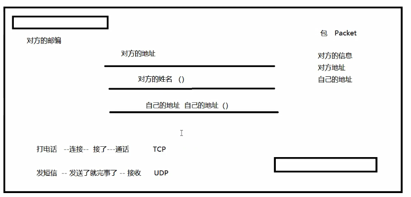

- 计算机网络： 计算机网络是指将[地理](https://baike.baidu.com/item/地理)位置不同的具有独立功能的多台[计算机](https://baike.baidu.com/item/计算机/140338)及其外部设备，通过通信线路连接起来，在[网络操作系统](https://baike.baidu.com/item/网络操作系统/3997)，[网络管理软件](https://baike.baidu.com/item/网络管理软件/6579078)及[网络通信协议](https://baike.baidu.com/item/网络通信协议/4438611)的管理和协调下，实现[资源共享](https://baike.baidu.com/item/资源共享/233480)和信息传递的计算机系统。 
- 网络编程的目的：无线电台…传播交流信息，数据交换，通信。
- **想要达到这个效果需要什么：**
  1. 如何让准确的定位网络上的一台主机 192.168.16.124：端口， 定位上这个计算机上的某个资源。
  2. 找到了这个主机，如何传输数据呢？
- Javaweb:网页编程 、 B/S架构
- 网络编程：TCP/IP 、 C/S

### 2.网络通信要素

**如何实现网络的通信？**

- 通信双方的地址：
  - ip：192.168.16.124
  - 端口：5900
- **规则：网络通信的协议**：TCP/IP

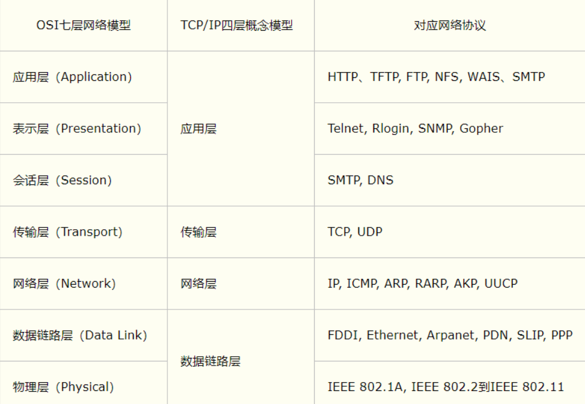

> 小结：

1. 网络编程中有两个主要的问题：
   - 如何让准确的定位到网络上的一台或多台主机；
   - 找到主机之后如何通信；
2. 网络编程中的要素：
   - IP和端口号：IP
   - 网络通信协议：UDP、TCP
3. 万物皆对象

### 3.IP

IP 地址：InetAddress

- 唯一定位一台网络上的计算机

- 127.0.0.1： 本机localhost

- ip地址的父类
  - ==IPV4==： 127.0.0.1 ,4个字节组成。，0~255， 42亿~；30亿都在北美，亚洲4亿。2011年就用尽；
  - ==IPV6==： fe80::f0e0:7383:ad8e:f32f%3 ，128位。8个无符号整数

  ```java
  2406:da18:ddf:4000:67d5:b226:cad7:125b
  ```

- 公网（互联网）--私网（局域网）

  - [ABCD地址](https://www.jb51.net/network/579228.html)

  - 192.168.xx.xx,专门给组织内部使用。

- 域名：记忆IP问题！
  
  - IP：www.vip.com

```java
package github.Web;

import java.net.InetAddress;
import java.net.UnknownHostException;

/**
 * @author subeiLY
 * @create 2021-06-06 10:09
 */
public class TestInetAddress {
    public static void main(String[] args) {
        try{
            // 查询本机地址
            InetAddress inetAddress1 = InetAddress.getByName("127.0.0.1");
            System.out.println(inetAddress1);
            InetAddress inetAddress2 = InetAddress.getByName("localhost");
            System.out.println(inetAddress2);
            InetAddress inetAddress3 = InetAddress.getLocalHost();
            System.out.println(inetAddress3);

            // 查询网站IP地址
            InetAddress inetAddress = InetAddress.getByName("www.taobao.com");
            System.out.println(inetAddress);

            // 常用方法
//            System.out.println(inetAddress.getAddress());   // 返回的是一个字节数组  无用
            System.out.println(inetAddress.getCanonicalHostName());    // 规范的名字
            System.out.println(inetAddress.getHostAddress());  // IP
            System.out.println(inetAddress.getHostName()); // 域名，或者自己电脑的名字

        }catch (UnknownHostException e) {
            e.printStackTrace();
        }

    }
}
```

### 4.端口

- 端口表示计算机上一个程序的进程；

- 不同的进程有不同的端口号！用来区分软件！

- 被规定0~65535

- TCP，UDP：65535*2个端口 tcp：80 udp：80 单个协议下，端口号不能冲突

- 端口分类
  - 共有端口 0~1023 内置的进程使用
    - HTTP：80
    - HTTP：443 如访问https：//www.baidu.com:443 访问的还是百度
    - FTP：21
    - TELENT：23
  - 程序注册端口：1014-49151，分配给用户和程序
    - Tomcat：8080
    - MySql：3306
    - Oracle：1521
  - 动态、私有端口：49152~65535

```cmd
netstat -ano #查看所有的端口
netstat -nao|findstr "7808" #查看指定的端口
tasklist|findstr "8696"
```

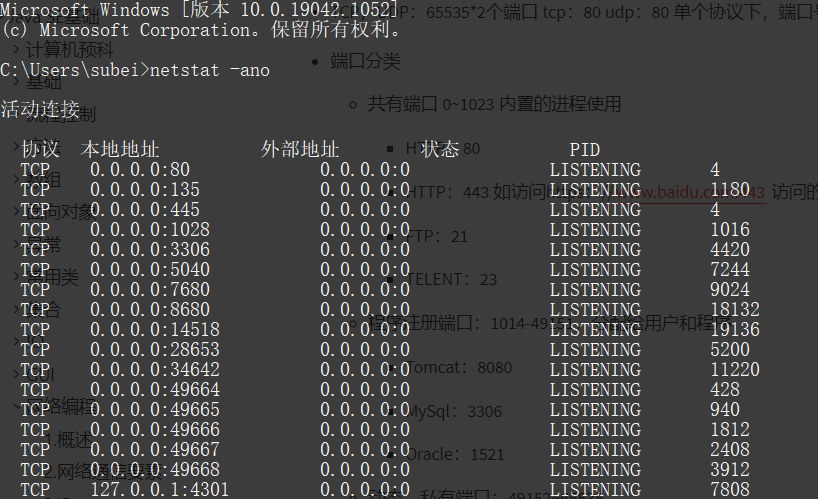

```java
package github.Web;

import java.net.InetSocketAddress;

/**
 * @author subeiLY
 * @create 2021-06-06 10:34
 */
public class TestInetSocketAddress {
    public static void main(String[] args) {
        InetSocketAddress socketAddress = new InetSocketAddress("127.0.0.1", 8080);
        InetSocketAddress socketAddress2 = new InetSocketAddress("localhost", 8080);
        System.out.println(socketAddress);
        System.out.println(socketAddress2);

        System.out.println(socketAddress.getAddress());
        System.out.println(socketAddress.getHostName());    // 地址
        System.out.println(socketAddress.getPort());    // 端口
    }
}
```


### 5.通信协议

协议：约定，就好比中国人交流说的是普通话

**网络通信协议：** 速率，传输码率，代码结构，传输控制…

**问题**：非常的复杂

大事化小：分层

**TCP/IP协议簇：实际上是一组协议**

重要：

- TCP：用户传输协议
- UDP：用户数据报协议

出名的协议：

- TCP：
- IP：网络互联协议

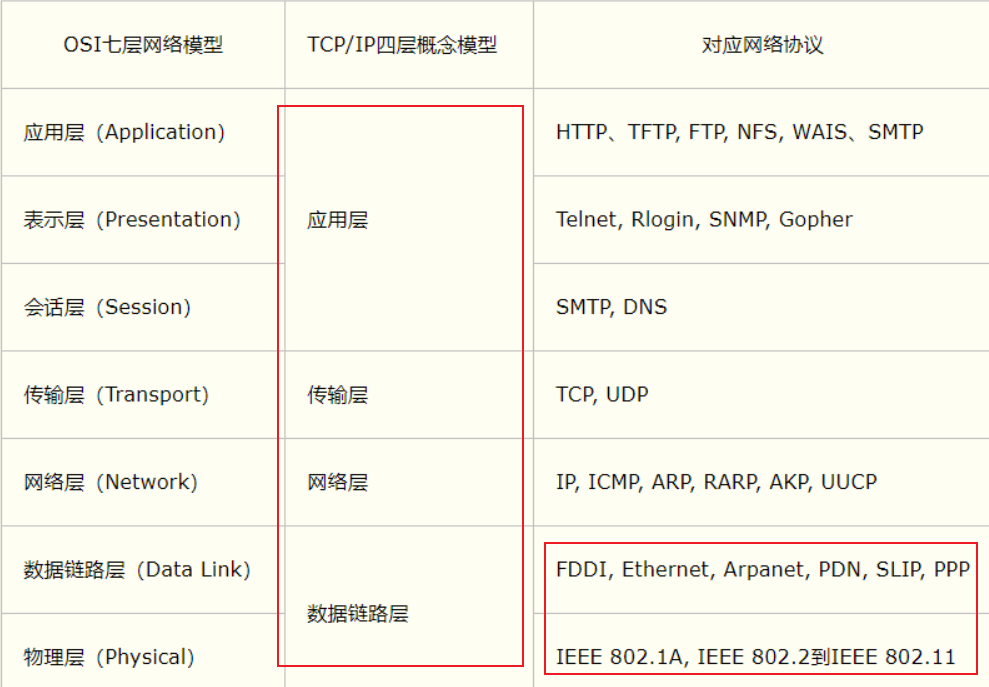

**TCP UDP 对比**

- TCP：打电话

  - 连接，稳定

  - 三次握手，四次挥手

    ```java
    最少需要三次，保证稳定连接！
    A：你瞅啥？
    B：瞅你咋地？
    A：干一场
    
    A：我要分手了
    B：我知道你要分手了
    B：你真的要分手吗？
    A：我真的要分手了
    ```

  - 客户端、服务器

  - 传输完成，释放连接，效率低

- UDP;发短信
  - 不连接，不稳定
  - 客户端、服务端：没有明确的解现
  - 不管有没有准备好，都可以发给你
  - DDOS：洪水攻击！ 发垃圾包 堵塞线路 （饱和攻击）

### 6.TCP

> **先启动服务端，再启动客户端！！！！**

**客户端**

- 连接服务器 Socket
- 发送消息

```java
package github.Web.Demo02;

import java.io.IOException;
import java.io.OutputStream;
import java.net.InetAddress;
import java.net.Socket;

/**
 * @author subeiLY
 * @create 2021-06-06 11:08
 */
// 客户端
public class TCPClientDemo01 {
    public static void main(String[] args) {
        Socket accept = null;
        OutputStream os = null;

        try {
            // 1.要知道服务器的地址
            InetAddress inetAddress = InetAddress.getByName("127.0.0.1");
            int port = 9999;
            // 2.创建一个socket链接
            accept = new Socket(inetAddress,port);
            // 3.发送信息IO流
            os = accept.getOutputStream();
            os.write("就这吧，什么鬼？".getBytes());
        }catch (Exception e){
            e.printStackTrace();
        } finally {
            // 关闭资源
            if(os != null){
                try {
                    os.close();
                } catch (IOException e) {
                    e.printStackTrace();
                }
            }
            if(accept != null){
                try {
                    accept.close();
                } catch (IOException e) {
                    e.printStackTrace();
                }
            }
        }
    }
}
```

**服务器端**

- 建立服务的端口 ServerSocket
- 等待的用户的连接 accept
- 接收用户的消息

```java
package github.Web.Demo02;

import java.io.ByteArrayOutputStream;
import java.io.IOException;
import java.io.InputStream;
import java.net.ServerSocket;
import java.net.Socket;

/**
 * @author subeiLY
 * @create 2021-06-06 11:22
 */
// 服务端
public class TCPServerDemo01 {
    public static void main(String[] args) {

        ServerSocket serverSocket = null;
        Socket socket = null;
        InputStream is = null;
        ByteArrayOutputStream baos = null;

        try{
            // 1.有一个地址
            serverSocket = new ServerSocket(9999);
            // 2.等待客户端连接过来
            socket = serverSocket.accept();
            // 3.读取客户端的消息
            is = socket.getInputStream();

           /*
           //弃用 会有中文乱码
           byte[] buffer = new byte[1024];
            int len = 0;
            while ((len = is.read(bytes)) != -1){
                String s = new String(buffer,0,len);
                System.out.println(s);
            }
            */

            // 管道流
            baos = new ByteArrayOutputStream();

            byte[] buffer = new byte[1024];
            int len = 0;
            while ((len = is.read(buffer)) != -1) {
                baos.write(buffer, 0, len);
            }
            System.out.println(baos.toString());

        } catch (IOException e) {
            e.printStackTrace();
        } finally {
            // 关闭资源
            if (baos != null) {
                try {
                    baos.close();
                } catch (IOException e) {
                    e.printStackTrace();
                }
            }
            if (is != null) {
                try {
                    is.close();
                } catch (IOException e) {
                    e.printStackTrace();
                }
            }
            if (socket != null) {
                try {
                    socket.close();
                } catch (IOException e) {
                    e.printStackTrace();
                }
            }
            if (serverSocket != null) {
                try {
                    serverSocket.close();
                } catch (IOException e) {
                    e.printStackTrace();
                }
            }
        }
    }
}
```

#### 1.文件上传

- 客户端

```java
package github.Web.Demo02;

import java.io.*;
import java.net.InetAddress;
import java.net.Socket;

/**
 * @author subeiLY
 * @create 2021-06-06 13:13
 */
// 客户端
public class TCPClientDemo02 {
    public static void main(String[] args) throws Exception {
        // 1.建立连接
        Socket socket = new Socket(InetAddress.getByName("127.0.0.1"),9000);
        // 2.创建输出流
        OutputStream os = socket.getOutputStream();
        // 3.读取文件
        FileInputStream stream = new FileInputStream(new File("subei.jpg"));
        // 4.输出测试文件
        byte[] buffer = new byte[1024];
        int len = 0;
        while((len = stream.read(buffer)) != -1){
            os.write(buffer,0,len);
        }
        // 5.通知服务器已发送完成
        socket.shutdownOutput();
        // 6.确定服务器已经收到，断开连接
        InputStream inputStream = socket.getInputStream();

        ByteArrayOutputStream byteArrayOutputStream = new ByteArrayOutputStream();
        byte[] buffer2 = new byte[1024];
        int len2 = 0;
        while((len2 = stream.read(buffer2)) != -1){
            byteArrayOutputStream.write(buffer2,0,len2);
        }

        System.out.println(byteArrayOutputStream);

        // 7.关闭流
        byteArrayOutputStream.close();
        inputStream.close();
        stream.close();
        os.close();
        socket.close();

    }
}
```

- 服务端

```java
package github.Web.Demo02;

import java.io.FileOutputStream;
import java.io.InputStream;
import java.io.OutputStream;
import java.net.ServerSocket;
import java.net.Socket;

/**
 * @author subeiLY
 * @create 2021-06-06 13:13
 */
// 服务器
public class TCPServerDemo02 {
    public static void main(String[] args) throws Exception{
        // 1.创建一个服务器地址
        ServerSocket socket = new ServerSocket(9000);
        // 2.监听客户连接
        Socket accept = socket.accept();    // 阻塞式监听，能等待用户连进来
        // 3.获取输入流
        InputStream is = accept.getInputStream();
        // 4.确定存放文件的位置
        FileOutputStream fileOutputStream = new FileOutputStream("resort.jpg");

        // 5.写入文件
        byte[] buffer = new byte[1024];
        int len = 0;
        while((len = is.read(buffer)) != -1){
            fileOutputStream.write(buffer,0,len);
        }

        // 6.通知客户端收集完毕
        OutputStream outputStream = accept.getOutputStream();
        outputStream.write("服务器已经收集成功，请断开连接！".getBytes());

        // 7.关闭流
        outputStream.close();
        fileOutputStream.close();
        is.close();
        accept.close();
        socket.close();

    }
}
```

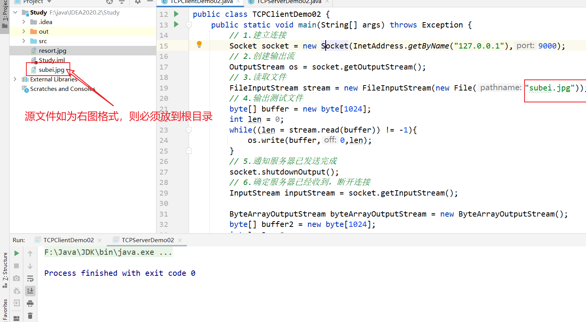

#### 2.初识Tomcat

### Tomcat

> Tomcat乱码： conf\logging.properties 把UTF-8改为GBK

服务端

- 自定义 S
- Tomcat服务器 S ：Java后台开发

客户端

- 自定义 C
- 浏览器 B

### 7.UDP

 发短信：不用连接，需要知道对方的地址 

#### 1.发送消息

```java
package github.Web.Demo03;

import java.net.DatagramPacket;
import java.net.DatagramSocket;
import java.net.InetAddress;

/**
 * @author subeiLY
 * @create 2021-06-06 13:25
 */
// 不需要连接服务器
public class UDPClientDemo01 {
    public static void main(String[] args) throws Exception{
        // 1.建立一个Socket
        DatagramSocket socket = new DatagramSocket();
        // 2.建个包
        String msg = "服务器，你好！";
        InetAddress localhost = InetAddress.getByName("localhost");
        int port = 9090;

        // 数据，数据的长度起始，要发送给谁
        DatagramPacket packet = new DatagramPacket(msg.getBytes(), 0,msg.getBytes().length,localhost,port);

        // 3.发送包
        socket.send(packet);

        // 4.关闭流
        socket.close();

    }
}
```

```java
package github.Web.Demo03;

import java.net.DatagramPacket;
import java.net.DatagramSocket;

/**
 * @author subeiLY
 * @create 2021-06-06 13:26
 */
// 还是需要客户端的链接
public class UDPServerDemo01 {
    public static void main(String[] args) throws Exception{
        // 1.开放端口
        DatagramSocket socket = new DatagramSocket(9090);
        // 2.接收数据包
        byte[] buffer = new byte[1024];
        DatagramPacket packet = new DatagramPacket(buffer, 0, buffer.length);

        socket.receive(packet); // 阻塞接受
        System.out.println(packet.getAddress().getHostAddress());
        System.out.println(new String(packet.getData()));
        // 3.关闭连接
        socket.close();

    }
}
```

#### 2.循环发送消息

```java
package github.Web.Demo03;

import java.io.BufferedReader;
import java.io.InputStreamReader;
import java.net.DatagramPacket;
import java.net.DatagramSocket;
import java.net.InetSocketAddress;

/**
 * @author subeiLY
 * @create 2021-06-06 14:06
 */
public class UDPSenderDemo01 {
    public static void main(String[] args) throws Exception{
        DatagramSocket socket = new DatagramSocket(8888);

        // 准备数据：控制台读取
        BufferedReader reader = new BufferedReader(new InputStreamReader(System.in));

        while(true) {
            String data = reader.readLine();
            byte[] buffer = data.getBytes();
            DatagramPacket packet = new DatagramPacket(buffer, 0, buffer.length, new InetSocketAddress("localhost", 9090));

            // 发送包
            socket.send(packet);
            if (data.equals("bye")) {
                break;
            }
        }

        // 关闭socket
        socket.close();

    }
}
```

```java
package github.Web.Demo03;

import java.net.DatagramPacket;
import java.net.DatagramSocket;

/**
 * @author subeiLY
 * @create 2021-06-06 14:06
 */
public class UDPReceiveDemo01 {
    public static void main(String[] args) throws Exception{
        // 开放端口
        DatagramSocket socket = new DatagramSocket(6666);

        while (true) {

            // 准备接收包裹
            byte[] container = new byte[1024];
            DatagramPacket packet = new DatagramPacket(container, 0, container.length);
            socket.receive(packet);


            byte[] data = packet.getData();
            String receiveData = new String(data);
            System.out.println(receiveData);


            if (receiveData.equals("bye")) {
                break;
            }
        }

        // 关闭socket
        socket.close();

    }
}
```


> 在线咨询： **两个人都可以是发送方，也可以是接收方(配合多线程)** 

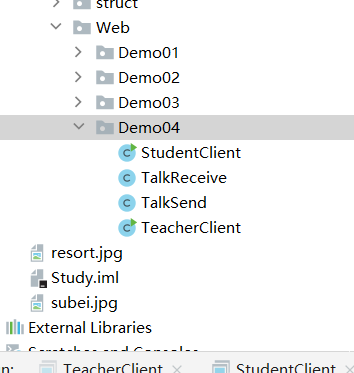

- 发信端

```java
package github.Web.Demo04;

import java.io.BufferedReader;
import java.io.IOException;
import java.io.InputStreamReader;
import java.net.DatagramPacket;
import java.net.DatagramSocket;
import java.net.InetSocketAddress;
import java.net.SocketException;

/**
 * @author subeiLY
 * @create 2021-06-06 14:22
 */
public class TalkSend implements Runnable {
    DatagramSocket socket = null;
    BufferedReader reader = null;

    private int    formPort;
    private String hostname;
    private int    toPort;

    public TalkSend(int formPort, String hostname, int toPort) {
        this.formPort = formPort;
        this.hostname = hostname;
        this.toPort = toPort;

        try {
            socket = new DatagramSocket(formPort);
            reader = new BufferedReader(new InputStreamReader(System.in));
        } catch (SocketException e) {
            e.printStackTrace();
        }
    }

    @Override
    public void run() {

        while (true) {
            try {
                String s = reader.readLine();
                byte[] buffer = s.getBytes();
                DatagramPacket packet = new DatagramPacket(buffer, 0, buffer.length,
                        new InetSocketAddress(hostname, toPort));

                // 发送包
                socket.send(packet);
                if (s.equals("bye")) {
                    break;
                }
            } catch (IOException e) {
                e.printStackTrace();
            }
        }

        // 关闭socket
        socket.close();
    }
}
```

- 接收端

```java
package github.Web.Demo04;

import java.io.IOException;
import java.net.DatagramPacket;
import java.net.DatagramSocket;
import java.net.SocketException;

/**
 * @author subeiLY
 * @create 2021-06-06 14:22
 */
public class TalkReceive implements Runnable{
    DatagramSocket socket = null;

    private int port;

    public TalkReceive(int port) {
        this.port = port;
        try {
            socket =  new DatagramSocket(port);
        } catch (SocketException e) {
            e.printStackTrace();
        }
    }

    @Override
    public void run() {
        //开放端口

        // 接收包
        while (true){
            try {
                byte[] container = new byte[1024];
                DatagramPacket packet = new DatagramPacket(container,0,container.length);

                // 接收
                socket.receive(packet);


                byte[] data = packet.getData();
                String receiveData = new String(data);
                System.out.println(Thread.currentThread().getName() + ":" + receiveData);


                if (receiveData.equals("bye")){
                    break;
                }
            } catch (IOException e) {
                e.printStackTrace();
            }
        }

        socket.close();
    }
}
```

- 教师端

```java
package github.Web.Demo04;

/**
 * @author subeiLY
 * @create 2021-06-11 18:23
 */
public class StudentClient {
    public static void main(String[] args) {
        new Thread(new TalkSend(7777,"localhost",8900)).start();
        new Thread(new TalkReceive(9999),"老师").start();

    }
}
```

- 学生端

```java
package github.Web.Demo04;

/**
 * @author subeiLY
 * @create 2021-06-11 18:23
 */
public class TeacherClient {
    public static void main(String[] args) {
        new Thread(new TalkSend(5555,"localhost",9999)).start();
        new Thread(new TalkReceive(8900),"学生").start();

    }
}
```

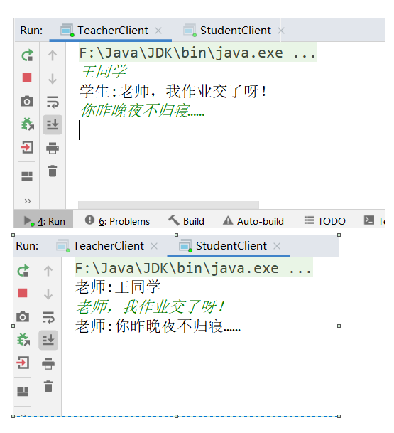

### 8.URL

- https://www.baidu.com

- 统一资源定位符：定位互联网上的某一个资源

- DNS域名解析 www.baidu.com —> xxx.xxx.xxxx.xxx…xxx

```html
协议：//ip地址：端口号/项目名/资源
```

----

```java
package github.Web.Demo05;

import java.net.MalformedURLException;
import java.net.URL;

/**
 * @author subeiLY
 * @create 2021-06-06 15:16
 */
public class URLDemo01 {
    public static void main(String[] args) throws MalformedURLException {

        URL url = new URL("http://localhost:8080/helloworld/insex" +
                ".jsp?username=subeily&password=123");

        System.out.println(url.getProtocol());  // 协议
        System.out.println(url.getHost());  // 主机IP
        System.out.println(url.getPort());  // 端口
        System.out.println(url.getPath());  // 路径
        System.out.println(url.getFile());  // 文件名
        System.out.println(url.getQuery()); // 参数

    }
}
```

- **下载网页上的文件** 

  - 1.启动tomcat服务器；
  - 2.在tomcat中放好文件；

  

  - 3.进行相关测试。

```java
package github.Web.Demo05;

import java.io.File;
import java.io.FileOutputStream;
import java.io.InputStream;
import java.net.HttpURLConnection;
import java.net.URL;

/**
 * @author subeiLY
 * @create 2021-06-06 15:16
 */
public class URLDemo02 {
    public static void main(String[] args) throws Exception{

        // 1.下载地址
        URL url = new URL("http://localhost:8080/subei/hello.html");

        // 2.连接到这个资源 HTTP
        HttpURLConnection urlConnection = (HttpURLConnection) url.openConnection();

        InputStream is = urlConnection.getInputStream();

        FileOutputStream stream = new FileOutputStream(new File("same.txt"));

        byte[] bytes = new byte[1024];
        int len = 0;
        while ((len = is.read(bytes)) != -1){
            stream.write(bytes,0,len);
        }

        stream.close();
        is.close();
        urlConnection.disconnect();

    }
}
```

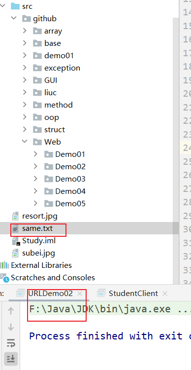

## 多线程

### 1.线程简介

#### 1.多任务


- 现实中太多这样同时做多件事情的例子了，看起来是多个任务都在做，其实本质上我们的大脑在同一时间依旧只做了一件事情。 

#### 2.多线程


- 原来是一条路，慢慢因为车太多了，道路阻塞，效率极低。为了提高使用的效率，能够充分利用道路，于是加了多个车道。从此，妈妈再也不用担心道路阻塞了。 
- 普通方法调用和多线程


#### 3.程序.进程.线程


- 一个进程可以有多个线程，如视频中同时听声音，看图像，看弹幕，等等。

#### 4.Process与Thread

- 说起进程,就不得不说下程序。**程序**是指令和数据的有序集合，其本身没有任何运行的含义，是一个静态的概念。

- 而**进程**则是执行程序的依次执行过程，它是一个动态的概念。是系统资源分配的单位。

- 通常在一个进程中可以包含若干个**线程**，当然一个进程中至少有一个线程，不然没有存在的意义。线程是CPU调度和执行的单位。

**注意**：

- 很多多线程是模拟出来的，真正的多线程是指有多个cpu，即多核，如服务器。如果是模拟出来的多线程，即在一个cpu的情况下，在同一个时间点，cpu只能执行一个代码，因为切换的很快，所以就有同时执行的错局。

#### 5.核心概念

- 线程就是独立的执行路径。
- 在程序运行时,即使没有自己创建线程,后台也会有多个线程,比如主线程,GC线程。
- main()称之为主线程,为系统的入口,用于执行整个程序。
- 在一个进程中,如果开辟了多个线程,线程的运行是由调度器（cpu）安排调度的,调度器是与操作系统紧密相关的,先后顺序是不能人为干预的。
- 对同一份资源操作时mm会存在资源抢夺的问题,需要加入并发控制。
- 线程会带来额外的开销,如CPU调度时间,并发控制开销。
- 每个线程在自己的工作内存交互,内存控制不当会造成数据不一致。

### 2.线程实现

#### 1.线程的创建(三种方式)

> 1.1 继承Thread类**（重要）**
>
> - 自定义线程类继承`Thread`类；
> - 重写`run()`方法，编写线程执行体；
> - 创建线程对象，调用`start()`方法启动线程。

```java
package github.smt.demo01;

/**
 * @author subeiLY
 * @create 2021-06-07 08:29
 */
// 创建线程方式一：继承Thread类，重写run()方法，调用start开启线程
public class TestThread extends Thread{
    // run()方法线程体
    @Override
    public void run() {
        for (int i = 0; i < 20; i++) {
            System.out.println("我在阅读代码-----" + i);
        }
    }

    // main线程
    public static void main(String[] args) {
        // 创建一个线程对象
        TestThread thread = new TestThread();
        // 调用start()开启线程
        thread.start();

        for (int i = 0; i < 200; i++) {
            System.out.println("多线程学习中……" + i);
        }
    }
}
```

- 小结：线程不一定立即执行，CPU安排调度。

```java
package github.smt.demo01;

import org.apache.commons.io.FileUtils;

import java.io.File;
import java.io.IOException;
import java.net.URL;

/**
 * @author subeiLY
 * @create 2021-06-07 08:41
 */
// 练习Thread，实现多线程同步下载图片
public class TestThread02 extends Thread{
    private String url;
    private String name;

    // 有参构造
    public TestThread02(String url,String name) {
        this.url = url;
        this.name = name;
    }

    // 下载图片的执行体
    @Override
    public void run() {
        WebDownloader webDownloader = new WebDownloader();
        webDownloader.downloader(url,name);
        System.out.println("下载的文件：" + name);
    }

    public static void main(String[] args) {
        TestThread02 t1 = new TestThread02("http://browser9.qhimg.com/bdm/768_474_0/t010824ab8b5cdfa138.jpg","str.png");
        TestThread02 t2 = new TestThread02("http://browser9.qhimg.com/bdm/768_474_0/t012468d019e3ce466b.jpg","str2.png");
        TestThread02 t3 = new TestThread02("http://browser9.qhimg.com/bdm/384_237_0/t01039b44f7c7ca5ca3.jpg","str3.png");

        t1.start();
        t2.start();
        t3.start();

    }
}
// 下载器
class WebDownloader{
    // 下载方法
    public void downloader(String url,String name){
        try {
           FileUtils.copyURLToFile(new URL(url),new File(name));
        }catch (IOException e){
            e.printStackTrace();
            System.out.println("IO异常，downloader下载方法异常");
        }
    }
}
```


- 如果没有FileUtils.copyURLToFile方法，可以在[maven官网下载jar包](https://mvnrepository.com/artifact/commons-io/commons-io/2.6)，按照下图导入即可。

  

>1.2 实现Runnable接口
>
>- **推荐使用Runnable对象,因为Java单继承的局限性**；
>- 自定义线程类实现`Runnable`接口；
>- 实现`run()`方法,编写线程执行体；
>- 创建线程对象,调用`start()`方法启动对象。

```java
package github.smt.demo01;

/**
 * @author subeiLY
 * @create 2021-06-07 08:41
 */
// 练习Thread，实现多线程同步下载图片
public class TestThread03 implements Runnable{

    @Override
    public void run() {
        // run方法线程体
        for (int i = 0; i < 20; i++) {
            System.out.println("我在看代码-----" + i);
        }
    }

    public static void main(String[] args) {
        // 创建runnable接口的实现类对象
        TestThread03 thread03 = new TestThread03();

        // 创建线程对象，通过线程对象来开启我们的线程，代理
        Thread thread = new Thread(thread03);

        // 调用start()开启线程
        thread.start();

        for (int i = 0; i < 200; i++) {
            System.out.println("我在学习多线程……" + i);
        }
    }
}
```

```java
package github.smt.demo01;

/**
 * 多个线程同时操作同一个对象  买火车票案例
 * @author subeiLY
 * @create 2021-06-07 08:51
 */
// 发现问题:多个线程操作同一个资源的情况下,线程不安全,数据紊乱
public class TestThread04 implements Runnable{
    // 票数
    private int ticketNums = 10;

    public static void main(String[] args) {
        TestThread04 thread04 = new TestThread04();
        new Thread(thread04,"张三").start();
        new Thread(thread04,"李四").start();
        new Thread(thread04,"王五").start();
        new Thread(thread04,"赵六").start();

    }

    @Override
    public void run() {
        while (true){
            if(ticketNums <= 0){
                break;
            }
            // 捕获异常
            try {
                Thread.sleep(200);
            }catch (InterruptedException e){
                e.printStackTrace();
            }
            System.out.println(Thread.currentThread().getName() + "---》拿到了第" + ticketNums-- + "张票");
        }
    }
}
```


```java
package github.smt.demo01;

/**
 * 模拟龟兔赛跑
 * @author subeiLY
 * @create 2021-06-07 08:58
 */
public class TestThread05 implements Runnable{
    // 胜利者
    private static String winner;

    public static void main(String[] args) {
        TestThread05 thread05 = new TestThread05();
        new Thread(thread05,"兔子").start();
        new Thread(thread05,"乌龟").start();
    }

    @Override
    public void run() {
        for (int i = 0; i <= 100; i++) {
            // 模拟兔子休息
            if(Thread.currentThread().getName().equals("兔子") && i%10==0){
                try {
                    Thread.sleep(1);
                }catch (InterruptedException e){
                    e.printStackTrace();
                }
            }
            // 判断比赛是否结束
            boolean flag = gameOver(i);
            // 如果比赛结束，停止程序
            if(flag){
                break;
            }
            System.out.println(Thread.currentThread().getName() + "---》跑了" + i + "步");
        }
    }

    // 判断比赛是否结束
    private boolean gameOver(int steps){
        if(winner != null){
            return true;
        }else{
            if(steps >= 100){   // 一共100步
                winner = Thread.currentThread().getName();
                System.out.println("winner is " + winner);
                return true;
            }
        }
        return false;
    }
}
```


> 1.3 实现Callable接口（了解）
>
> - 实现Callable接口，需要返回值类型；
> - 重写call方法，需要抛出异常；
> - 创建目标对象；
> - 创建执行服务：ExecutorService ser = Executors.newFixedThreadPool(1);
> - 提交执行：Future result1 = ser.submit(11);
> - 获取结果：boolean r1 = result1.get();
> - 关闭服务：ser.shutdownNow();

```java
package github.smt.demo01;

import java.util.concurrent.*;

/**
 * @author subeiLY
 * @create 2021-06-07 09:04
 */
// 图片下载案例
public class TestThread06 implements Callable<Boolean> {
    private String url;     // 网络图片地址
    private String name;    // 报错的文件名

    // 有参构造
    public TestThread06(String url,String name){
        this.url = url;
        this.name = name;
    }

    public static void main(String[] args) throws ExecutionException,InterruptedException {
        TestThread06 p1 = new TestThread06("http://browser9.qhimg.com/bdm/768_474_0/t010824ab8b5cdfa138.jpg", "ptr.png");
        TestThread06 p2 = new TestThread06("http://browser9.qhimg.com/bdm/768_474_0/t012468d019e3ce466b.jpg", "ptr02.png");
        TestThread06 p3 = new TestThread06("http://browser9.qhimg.com/bdm/384_237_0/t01039b44f7c7ca5ca3.jpg", "ptr03.png");

        // 执行服务
        ExecutorService service = Executors.newFixedThreadPool(3);

        // 提交执行
        Future<Boolean> submit = service.submit(p1);
        Future<Boolean> submit1 = service.submit(p2);
        Future<Boolean> submit2 = service.submit(p3);

        // 获取结果
        boolean aBoolean = submit.get();
        boolean aBoolean1 = submit1.get();
        boolean aBoolean2 = submit2.get();

        // 关闭服务
        service.shutdownNow();
    }

    // 下载图片线程的执行体
    @Override
    public Boolean call() throws Exception {
        WebDownloader webDownloader = new WebDownloader();
        webDownloader.downloader(url,name);
        System.out.println("下载的文件：" + name);
        return true;
    }
}
```


> 1.4Thread和Runnable对比
>
> - 继承Thred类:
>   - 子类继承Thread类具备多线程能力；
>   - 启动线程:子类对象.start()；
>   - ==不建议使用:避免OOP单继承局限性==。
>
> - 实现Runnable接口
>   - 实现接口Runnable具有多线程能力；
>   - 启动线程:传入目标对象+Thread对象.start()；
>   - ==推荐使用:避免单继承局限性,灵活方便,方便同一个对象被多个线程使用==。

#### 2.静态代理


```java
package github.smt.demo02;

/**
 * @author subeiLY
 * @create 2021-06-07 09:14
 */
public class TestStaticProxy {
    public static void main(String[] args) {
        WeddingCompany company = new WeddingCompany(new You());
        company.happyMary();
    }
}

// 结婚
interface Marry{
    void happyMary();
}

// 真实角色：你去结婚
class You implements Marry{
    @Override
    public void happyMary() {
        System.out.println("subei结婚了……");
    }
}

// 代理角色:婚庆公司帮你结婚
class WeddingCompany implements Marry{
    private Marry target;   // 代理--->真实目标角色，帮谁结婚

    public WeddingCompany(Marry target){
        this.target = target;
    }

    @Override
    public void happyMary() {
        after();
        this.target.happyMary();
        before();
    }

    private void after(){
        System.out.println("结婚前，布置现场！");
    }

    private void before(){
        System.out.println("结婚后，收尾款！");
    }
}
```

- 优化：使用线程，Lamda表达式。

```java
package github.smt.demo02;

/**
 * 线程中的代理模式
 * @author subeiLY
 * @create 2021-06-07 09:21
 */
public class TestStaticProxy02 {
    public static void main(String[] args) {
        new Thread(()-> System.out.println("因为爱情")).start();
        new WeddingCompany(new You()).happyMary();
    }
}
```

- 总结
  - 真实对象和代理对象都要实现一个接口；
  - 代理对象要代理真实角色。
- 好处
  - 代理对象可以做很多真实对象做不了的事情；
  - 真实对象专注做自己的事。

#### 3.Lambda表达式


- λ 希腊字母表中排序第十一位的字母，英语名称为 Lambda；
- 避免匿名内部类定义过多；
- 其实质属于函数式编程的概念；
- 去掉了一堆没有意义的代码,只留下核心逻辑。

> - (params)-> expression[表达式]
>
> - (params) -> statement[语句]
>
> - (params)-> {statements}
>
> ```java
> a -> System.out.println("i like lamda-->"+a)
> ```

- new Thread (()->System.out.println(“多线程学习。。。。”)).start()；
- 理解Functional Interface (函数式接口) 是学习Java 8 lambda表达式的关键

> 函数式接口的定义

- 任何接口，如果只包含唯一一个抽象方法，那么它就是一个函数式接口。

```java
public interface Runnable{
    public abstract void run();
}
```

- 对于函数式接口，我们可以通过Lambda表达式来创建该接口的对象。

> 实现：

- 案例1

```java
package github.smt.demo03;

/**
 * 推导lambda表达式
 *
 * @author subeiLY
 * @create 2021-06-07 09:34
 */
public class TestLambda {
    public static void main(String[] args) {
        // 创建接口对象
        Like like = new Like();
        like.lambda();

    }
}

// 1.定义一个函数式接口
interface ILike{
    void lambda();
}

// 2.实现类
class Like implements ILike{
    @Override
    public void lambda(){
        System.out.println("I like Lambda");
    }
}
```

- 优化一

```java
package github.smt.demo03;

/**
 * 推导lambda表达式
 *
 * @author subeiLY
 * @create 2021-06-07 09:34
 */
public class TestLambda {
    // 3.静态内部类
    static class Like implements ILike{
        @Override
        public void lambda(){
            System.out.println("I like Lambda2");
        }
    }

    public static void main(String[] args) {
        // 创建接口对象
        Like like = new Like();
        like.lambda();

    }
}

// 1.定义一个函数式接口
interface ILike{
    void lambda();
}
```
- 优化二

```java
package github.smt.demo03;

/**
 * 推导lambda表达式
 *
 * @author subeiLY
 * @create 2021-06-07 09:34
 */
public class TestLambda {

    public static void main(String[] args) {
        // 4.局部内部类
        class Like implements ILike{
            @Override
            public void lambda(){
                System.out.println("I like Lambda3");
            }
        }

        // 创建接口对象
        Like like = new Like();
        like.lambda();

    }
}

// 1.定义一个函数式接口
interface ILike{
    void lambda();
}
```
- 优化三

```java
package github.smt.demo03;

/**
 * 推导lambda表达式
 *
 * @author subeiLY
 * @create 2021-06-07 09:34
 */
public class TestLambda {

    public static void main(String[] args) {
        
        // 创建接口对象
        ILike like = new ILike() {
            // 5.匿名内部类，没有类的名称，必须借助接口或父类
            @Override
            public void lambda() {
                System.out.println("I like Lambda4");
            }
        };
        like.lambda();
    }
}

// 1.定义一个函数式接口
interface ILike{
    void lambda();
}
```
- 最终版

```java
package github.smt.demo03;

/**
 * 推导lambda表达式
 *
 * @author subeiLY
 * @create 2021-06-07 09:34
 */
public class TestLambda {

    public static void main(String[] args) {
        // 6.简化
        ILike like = () ->{
            System.out.println("I like Lambda5");
        };
        like.lambda();
    }
}

// 1.定义一个函数式接口
interface ILike{
    void lambda();
}
```

- 案例二

```java
package github.smt.demo03;

/**
 * @author subeiLY
 * @create 2021-06-07 09:44
 */
public class TestLambda02 {
    public static void main(String[] args) {
        // 1.lambda
        ILove love = (int a)->{
            System.out.println("I love you -->" + a);
        };
        // 2.lambda简化1.0
        love = (a) ->{
            System.out.println("I love you --> " + a);
        };
        // 3.lambda简化2.0
        love = a ->{
            System.out.println("I love you --> " + a);
        };
        // 4.lambda简化4.0
        love = a -> System.out.println("I love you --> " +a);

        /**
         * 总结：
         * {}简略的条件是只能有一行代码,多行{}就不能简略了
         * 前提是接口为函数式接口(只能有一个方法)
         * 多个参数也可以去掉参数类型,要去掉就都去掉,必须加上()
         */
        love.love(520);
    }
}

// 1.定义一个函数式接口
interface ILove{
    void love(int a);
}
```

### 3.线程状态

#### 1 线程的五大状态


#### 2.线程方法


> 停止线程


```java
package github.smt.demo03;

/**
 * @author subeiLY
 * @create 2021-06-07 09:58
 */

/**
 * 测试stop
 * 1.建议线程正常停止-->利用次数,不建议死循环
 * 2.建议使用标志位-->设置一个标志位
 * 3.不要使用stop或者destroy等过时或者JDK不建议使用的方法
 */

public class TestStopThread implements Runnable{
    // 1.设置一个标志位
    private boolean flag = true;

    public static void main(String[] args) {
        TestStopThread stop = new TestStopThread();
        new Thread(stop).start();
        for (int i = 0; i < 1000; i++) {
            System.out.println("main...." + i);
            if(i==900){
                // 调用stop()切换标志位,让线程终止
                stop.stop();
                System.out.println("线程该停止了");
            }
        }
    }

    @Override
    public void run() {
        int i = 0;
        while(flag){
            System.out.println("run……Thread" + i++);
        }
    }

    // 2.设置一个公开的方法停止线程，转换标志位
    public void stop(){
        this.flag = false;
    }
}
```

> 线程休眠


```java
package github.smt.demo03;

import github.smt.demo01.TestThread04;

/**
 * @author subeiLY
 * @create 2021-06-07 10:03
 */

// 模拟网络延迟:放大问题的发生性
public class TestSleepThread02 implements Runnable{
    // 票数
    private int ticketNums = 10;

    public static void main(String[] args) {
        TestThread04 thread04 = new TestThread04();
        new Thread(thread04,"张三").start();
        new Thread(thread04,"李四").start();
        new Thread(thread04,"王五").start();
        new Thread(thread04,"赵六").start();

    }

    @Override
    public void run() {
        while (true){
            if(ticketNums <= 0){
                break;
            }
            // 捕获异常
            try {
                Thread.sleep(200);
            }catch (InterruptedException e){
                e.printStackTrace();
            }
            System.out.println(Thread.currentThread().getName() + "---》拿到了第" + ticketNums-- + "张票");
        }
    }
}
```

```java
package github.smt.demo04;

/**
 * @author subeiLY
 * @create 2021-06-07 10:05
 */
public class TestSleepThread {
    public static void main(String[] args) {
        try {
            tenDown();
        } catch (InterruptedException e){
            e.printStackTrace();
        }
    }
    
    // 模拟倒计时
    public static void tenDown() throws InterruptedException{
        int num = 10;
        while(true){
            Thread.sleep(1000);
            System.out.println(num--);
            if(num<=0){
                break;
            }
        }
    }
}
```

```java
package github.smt.demo04;

import java.text.SimpleDateFormat;
import java.util.Date;

/**
 * 每一秒获取当前时间
 * @author subeiLY
 * @create 2021-06-07 10:10
 */
public class TestSleepThread02 {
    public static void main(String[] args) {
        // 获取当前系统时间
        Date date = new Date(System.currentTimeMillis());
        while(true){
            try{
                Thread.sleep(1000);
                // 更新系统时间
                System.out.println(new SimpleDateFormat("HH:mm:ss").format(date));
                date = new Date(System.currentTimeMillis());
            }catch (InterruptedException e){
                e.printStackTrace();
            }
        }
    }
}
```

> 线程礼让


```java
package github.smt.demo04;

/**
 * 测试礼让线程
 * @author subeiLY
 * @create 2021-06-07 10:15
 */
public class TestThread {
    public static void main(String[] args) {
        MyYeild myYeild = new MyYeild();
        new Thread(myYeild,"a").start();
        new Thread(myYeild,"b").start();
    }
}

class MyYeild implements Runnable{
    @Override
    public void run() {
        System.out.println(Thread.currentThread().getName() + "线程开始执行");
        Thread.yield(); // 礼让
        System.out.println(Thread.currentThread().getName() + "线程停止执行");
    }
}
```


> 线程插队


```java
package github.smt.demo04;

/**
 * 插队
 * @author subeiLY
 * @create 2021-06-07 10:23
 */
public class TestJoinThread implements Runnable{
    public static void main(String[] args) throws InterruptedException{
        // 启动线程
        TestJoinThread joinThread = new TestJoinThread();
        Thread thread = new Thread(joinThread);
        thread.start();

        // 主线程
        for (int i = 0; i < 500; i++) {
            if(i==200){
                thread.join();  // 插队
            }
            System.out.println("main" + i);
        }
    }

    @Override
    public void run() {
        for (int i = 0; i < 500; i++) {
            System.out.println("线程VIP" + i);
        }
    }
}
```

#### 3.线程状态观测


```java
package github.smt.demo05;

/**
 * 观察测试线程状态
 * @author subeiLY
 * @create 2021-06-07 10:37
 */
public class TestThreadState {
    public static void main(String[] args) throws InterruptedException{
        Thread thread = new Thread(() -> {
            for (int i = 0; i < 5; i++) {
                try {
                    Thread.sleep(1000);
                } catch (InterruptedException e){
                    e.printStackTrace();
                }
            }
            System.out.println("--------------");
        });
        // 观察状态
        Thread.State state = thread.getState();
        System.out.println(state);
        
        // 观察启动后
        thread.start();
        state = thread.getState();
        System.out.println(state);     // Run
        while (state != Thread.State.TERMINATED){
            // 只要线程不终止，就一直输出状态
            Thread.sleep(100);
            state = thread.getState();  // 更新线程状态
            System.out.println(state);
        }
        // 死亡后的线程不能再启动了，启动会报异常
//        thread.start();
    }
}
```

#### 4.线程优先级


```java
package github.smt.demo05;

/**
 * @author subeiLY
 * @create 2021-06-07 10:45
 */
public class TestThreadPriority {
    public static void main(String[] args) {
        // 主线程默认优先级
        System.out.println(Thread.currentThread().getName()
                + "-->" + Thread.currentThread().getPriority());

        MyPriority myPriority = new MyPriority();
        Thread thread1 = new Thread(myPriority);
        Thread thread2 = new Thread(myPriority);
        Thread thread3 = new Thread(myPriority);
        Thread thread4 = new Thread(myPriority);
        Thread thread5 = new Thread(myPriority);

        // 先设置优先级，再启动
        thread1.start();

        thread2.setPriority(1);
        thread2.start();

        thread3.setPriority(4);
        thread3.start();

        // MAX_PRIORITY=10
        thread4.setPriority(Thread.MAX_PRIORITY);
        thread4.start();

        thread5.setPriority(8);
        thread5.start();

    }
}

class MyPriority implements Runnable{
    @Override
    public void run() {
        System.out.println(Thread.currentThread().getName()
                + "-->" + Thread.currentThread().getPriority());
    }
}
```


#### 5.守护线程

- 线程分为**用户线程**和**守护线程**；
- 虚拟机必须确保用户线程执行完毕；
- 虚拟机不用等待守护线程执行完毕；
- 如，后台记录操作日志，监控内存垃圾回收等待……

```java
package github.smt.demo05;

/**
 * 测试守护线程
 * @author subeiLY
 * @create 2021-06-07 10:56
 */
public class TestDemoThread {
    public static void main(String[] args) {
        God god = new God();
        You you = new You();

        Thread thread = new Thread(god);
        // 默认false表示是用户线程，正常线程都是用户线程
        thread.setDaemon(true);
        // 耶稣守护线程启动
        thread.start();
        // 你 用户线程启动
        new Thread(you).start();
    }
}

class God implements Runnable{

    @Override
    public void run() {
        while (true){
            System.out.println("耶稣都救不了你！");
        }
    }
}

class You implements Runnable{

    @Override
    public void run() {
        System.out.println("------你好，世界！------");
        for (int i = 0; i < 36500; i++) {
            System.out.println("每天都很开心！");
        }
        System.out.println("------再见，世界！------");
    }
}
```

### 4.线程同步

#### 1.介绍

- **多个线程操作同一个资源 **
- 并发：同一个对象被多个线程同时操作


> 线程同步：
>
> - 现实生活中我们会遇到“同—个资源，多个人都想使用”的问题，比如食堂排队打饭，每个人都想吃饭，最天然的解決办法就是：排队，一个个来。
> - 处理多线程问题时，多个线程访问同一个对象，并且某些线程还想修改这个对象这时候我们就需要线程同步。线程同步其实就是一种等待机制，多个需要同时访问此对象的线程进入这个==对象的等待池形==成队列，等待前面线程使用完毕，下一个线程再使用。

- 队列和锁


> 线程同步：
>
> - 由于同一进程的多个线程共享同一块存储空间，在带来方便的同时，也带来了访问冲突问题，为了保证数据在方法中被访问时的正确性，在访问时加入锁机制synchronized，当一个线程获得对象的排它锁，独占资源，其他线程必须等待使用后释放锁即可。存在以下问题：
>   - 一个线程持有锁会导致其他所有需要此锁的线程挂起；
>   - 在多线程竞争下，加锁，释放锁会导致比较多的上下文切换和调度延时，引起性能问题；
>   - 如果一个优先级高的线程等待个优先级低的线程释放锁会导致优先级倒置，引起性能问题。

#### 2.不安全的线程案例

```java
package github.smt.demo05;

/**
 * 不安全买票
 * @author subeiLY
 * @create 2021-06-07 11:08
 */
public class TestUnsafeBuyTicket {
    public static void main(String[] args) {
        BuyTicket buyTicket = new BuyTicket();
        new Thread(buyTicket,"张三").start();
        new Thread(buyTicket,"李四").start();
        new Thread(buyTicket,"王五").start();
    }
}

class BuyTicket implements Runnable{
    // 票
    private int ticketNums = 10;
    boolean flag = true;

    @Override
    public void run() {
        // 买票
        while(flag){
            try{
                buy();
            } catch (Exception e){
                e.printStackTrace();
            }
        }
    }

    // 买票
    private void buy(){
        // 判断是否有票
        if(ticketNums <= 0){
            flag = false;
            return;
        }
        // 延迟
        try{
            Thread.sleep(1);
        } catch (InterruptedException e){
            e.printStackTrace();
        }

        // 买票
        System.out.println(Thread.currentThread().getName()
            + "拿到" + ticketNums--);
    }
}
```


```java
package github.smt.demo05;

/**
 * @author subeiLY
 * @create 2021-06-07 11:21
 */
public class TestUnsafeBank {
    public static void main(String[] args) {
        Account account = new Account(100, "养老基金");
        Drawing drawing = new Drawing(account, 60, "夸克");
        Drawing same = new Drawing(account, 120, "same");
        drawing.start();
        same.start();
    }
}

class Account{
    int money;  // 余额
    String cardName;    // 卡名

    public Account(int money, String cardName) {
        this.money = money;
        this.cardName = cardName;
    }
}

class Drawing extends Thread{
    Account account;    // 账户
    int drawingMoney;   // 取余额
    int nowMoney;   // 个人手里的钱

    public Drawing(Account account, int drawingMoney, String name) {
        // super(name) =  父类构造方法(name)
        super(name);
        this.account = account;
        this.drawingMoney = drawingMoney;
    }

    // 取钱
    @Override
    public void run(){
        // 判断是否有钱
        if (account.money - drawingMoney < 0) {
            System.out.println(Thread.currentThread().getName() + "余额不足,不能进行取钱");
            return;
        }
        try {
            Thread.sleep(1000); // 放大问题的发生性
        } catch (InterruptedException e) {
            e.printStackTrace();
        }
        // 卡内金额 = 余额-个人手里的钱
        account.money = account.money - drawingMoney;
        // 个人手里的钱
        nowMoney = nowMoney + drawingMoney;
        System.out.println(account.cardName + "余额为:" + account.money);
        // this.getName()==Thread.currentThread().getName()
        System.out.println(this.getName() + "手里的钱:" + nowMoney);
    }
}
```


```java
package github.smt.demo05;

import java.util.ArrayList;
import java.util.List;

/**
 * 线程不安全的集合
 * @author subeiLY
 * @create 2021-06-07 11:27
 */
public class TestUnsafeList {
    public static void main(String[] args) {
        List<String> list = new ArrayList<>();
        for (int i = 0; i < 1000; i++) {
            new Thread(() ->{
               list.add(Thread.currentThread().getName()) ;
            }).start();
        }
        try {
            Thread.sleep(3000);
        } catch (InterruptedException e) {
            e.printStackTrace();
        }
        System.out.println(list.size());
    }
}
```

#### 3.同步方法

- 由于我们可以通过 private关键字来保证数据对象只能被方法访问，所以我们只需要针对方法提岀一套机制，这套机制就是syη chronized关键字，它包括两种用法synchronized方法和 synchronized块。
  - 同步方法：public synchronized void method (int args) {}
- synchronized方法控制对“对象"的访问，每个对象对应一把锁，每个synchronized方法都必须获得调用该方法的对象的锁才能执行，否则线程会阻塞，方法一旦执行，就独占该锁，直到该方法返回才释放锁，后面被阻塞的线程才能获得这个锁，继续执行。
  - 缺陷：若将一个大的方法申明为 synchronized将会影响效率。


```java
package github.smt.demo05;

/**
 * 安全买票
 * @author subeiLY
 * @create 2021-06-07 11:08
 */
public class TestUnsafeBuyTicket {
    public static void main(String[] args) {
        BuyTicket buyTicket = new BuyTicket();
        new Thread(buyTicket,"张三").start();
        new Thread(buyTicket,"李四").start();
        new Thread(buyTicket,"王五").start();
    }
}

class BuyTicket implements Runnable{
    // 票
    private int ticketNums = 10;
    boolean flag = true;

    @Override
    public void run() {
        // 买票
        while(flag){
            try{
                buy();
            } catch (Exception e){
                e.printStackTrace();
            }
        }
    }

    // synchronized 同步方法
    // 买票
    private synchronized void buy() {
        // 判断是否有票
        if(ticketNums <= 0){
            flag = false;
            return;
        }
        // 延迟
        try{
            Thread.sleep(1);
        } catch (InterruptedException e){
            e.printStackTrace();
        }

        // 买票
        System.out.println(Thread.currentThread().getName()
            + "拿到" + ticketNums--);
    }
}
```


#### 4.同步块

- 同步块：synchronized (Obj) {}
- obj称之为同步监视器
  - Obj可以是任何对象，但是推存使用共享资源作为同步监视器。
  - 同步方法中无需指定同步监视器，因为同步方法的同步监视器就是this，就是这个对象本身，或者是class。
- 同步监视器的执行过程：
  - 1.第一个线程访问，锁定同步监视器，执行其中代码；
  - 2.第二个线程访问，发现同步监视器被锁定，无法访问；
  - 3.第一个线程访问完毕，解锁同步监视器；
  - 4.第二个线程访问，发现同步监视器没有锁，然后锁定并访问。

==锁的对象就是变量的量,需要增删改查的对象==

```java
package github.smt.demo05;

/**
 * 安全的取钱 同步块
 * @author subeiLY
 * @create 2021-06-07 11:21
 */
public class TestUnsafeBank {
    public static void main(String[] args) {
        Account account = new Account(100, "养老基金");
        Drawing drawing = new Drawing(account, 60, "夸克");
        Drawing same = new Drawing(account, 120, "same");
        drawing.start();
        same.start();
    }
}

class Account{
    int money;  // 余额
    String cardName;    // 卡名

    public Account(int money, String cardName) {
        this.money = money;
        this.cardName = cardName;
    }
}

class Drawing extends Thread{
    Account account;    // 账户
    int drawingMoney;   // 取余额
    int nowMoney;   // 个人手里的钱

    public Drawing(Account account, int drawingMoney, String name) {
        // super(name) =  父类构造方法(name)
        super(name);
        this.account = account;
        this.drawingMoney = drawingMoney;
    }

    // 取钱
    @Override
    public void run() {
        // 锁的对象就是变量的量,需要增删改查的对象
        synchronized (account) {
            // 判断是否有钱
            if (account.money - drawingMoney < 0) {
                System.out.println(Thread.currentThread().getName() + "余额不足,不能进行取钱");
                return;
            }
            try {
                Thread.sleep(1000); // 放大问题的发生性
            } catch (InterruptedException e) {
                e.printStackTrace();
            }
            // 卡内金额 = 余额 - 个人手里的钱
            account.money = account.money - drawingMoney;
            // 个人手里的钱
            nowMoney = nowMoney + drawingMoney;
            System.out.println(account.cardName + "余额为:" + account.money);
            // this.getName()==Thread.currentThread().getName()
            System.out.println(this.getName() + "手里的钱:" + nowMoney);
        }
    }
}
```


```java
package github.smt.demo05;

import java.util.ArrayList;
import java.util.List;

/**
 * 线程安全的集合 同步块
 * @author subeiLY
 * @create 2021-06-07 11:27
 */
public class TestUnsafeList {
    public static void main(String[] args) {
        List<String> list = new ArrayList<>();
        for (int i = 0; i < 1000; i++) {
            new Thread(() ->{
                synchronized (list) {
                    list.add(Thread.currentThread().getName());
                }
            }).start();
        }
        try {
            Thread.sleep(3000);
        } catch (InterruptedException e) {
            e.printStackTrace();
        }
        System.out.println(list.size());
    }
}
```

- JUC安全集合类型扩充

```java
package github.smt.demo05;

import java.util.concurrent.CopyOnWriteArrayList;

/**
 * 测试JUC安全类型的集合
 * @author subeiLY
 * @create 2021-06-07 11:36
 */
public class TestThreadJuc {
    public static void main(String[] args) {
        CopyOnWriteArrayList<String> list = new CopyOnWriteArrayList<>();
        for (int i = 0; i < 10000; i++) {
            new Thread(() -> {
                list.add(Thread.currentThread().getName());
            }).start();
        }
        try{
            Thread.sleep(3000);
        } catch (InterruptedException e){
            e.printStackTrace();
        }
        System.out.println(list.size());
    }
}
```


#### 5.死锁

- 多个线程各自占有一些共享资源，并且互相等待其他线程占有的资源才能运行，而导致两个或者多个线程都在等待对方释放资源，都停止执行的情形。某一个同步块同时拥有“两个以上对象的锁"时，就可能会发生“死锁”的问题。

```java
package github.smt.demo06;

/**
 * 死锁:多个线程互相抱着对方需要的资源,然后形成僵持
 * 解决:一个锁只锁一个对象
 * @author subeiLY
 * @create 2021-06-07 11:47
 */
public class TestDeadLock {
    public static void main(String[] args) {
        Makeup makeup = new Makeup(0, "黄焖鸡");
        Makeup makeup1 = new Makeup(1, "牛肉土豆粉");

        makeup.start();
        makeup1.start();

    }
}

// 鸭脖
class DuckNeck{}

// 土豆粉
class PotatoPowder{}

class Makeup extends Thread{
    // 需要的资源只有一份,用static保证只有一份
    static DuckNeck duckneck = new DuckNeck();
    static PotatoPowder potatoPowder = new PotatoPowder();
    int choice; // 选择
    String foodName;    // 食品名称

    public Makeup(int choice, String foodName) {
        this.choice = choice;
        this.foodName = foodName;
    }

    @Override
    public void run() {
        // 美食
        try{
            food();
        } catch (InterruptedException e){
            e.printStackTrace();
        }
    }

    private void food() throws InterruptedException{
        if(choice == 0){
            synchronized (duckneck){    // 获得鸭脖的锁
                System.out.println(this.foodName + "获得鸭脖的锁");
                Thread.sleep(1000);
                synchronized (potatoPowder){    // 一秒后想获得 土豆粉的锁
                    System.out.println(this.foodName + "获得土豆粉的锁");
                }
            }
        } else {
            synchronized (duckneck){    // 获得鸭脖的锁
                System.out.println(this.foodName + "获得鸭脖的锁");
                Thread.sleep(2000);
                synchronized (potatoPowder){    // 一秒后想获得 土豆粉的锁
                    System.out.println(this.foodName + "获得土豆粉的锁");
                }
            }
        }
    }
}
```


- 解决：

```java
package github.smt.demo06;

/**
 * 死锁:多个线程互相抱着对方需要的资源,然后形成僵持
 * 解决:一个锁只锁一个对象
 * @author subeiLY
 * @create 2021-06-07 11:47
 */
public class TestDeadLock {
    public static void main(String[] args) {
        Makeup makeup = new Makeup(0, "黄焖鸡");
        Makeup makeup1 = new Makeup(1, "牛肉土豆粉");

        makeup.start();
        makeup1.start();

    }
}

// 鸭脖
class DuckNeck{}

// 土豆粉
class PotatoPowder{}

class Makeup extends Thread{
    // 需要的资源只有一份,用static保证只有一份
    static DuckNeck duckneck = new DuckNeck();
    static PotatoPowder potatoPowder = new PotatoPowder();
    int choice; // 选择
    String foodName;    // 食品名称

    public Makeup(int choice, String foodName) {
        this.choice = choice;
        this.foodName = foodName;
    }

    @Override
    public void run() {
        // 美食
        try{
            food();
        } catch (InterruptedException e){
            e.printStackTrace();
        }
    }

    private void food() throws InterruptedException{
        if(choice == 0){
            synchronized (duckneck) {    // 获得鸭脖的锁
                System.out.println(this.foodName + "获得鸭脖的锁");
                Thread.sleep(1000);
            }
            synchronized (potatoPowder){    // 一秒后想获得 土豆粉的锁
                System.out.println(this.foodName + "获得土豆粉的锁");
            }            
        } else {
            synchronized (duckneck) {    // 获得鸭脖的锁
                System.out.println(this.foodName + "获得鸭脖的锁");
                Thread.sleep(2000);
            }
            synchronized (potatoPowder){    // 一秒后想获得 土豆粉的锁
                System.out.println(this.foodName + "获得土豆粉的锁");
            }
        }
    }
}
```

> 避免死锁的办法

- 产生死锁的四个必要条件
  - 1.互斥条件：一个资源毎次只能被一个进程使用。
  - 2.请求与保持条件：一个进程因请求资源而阻塞时，对已获得的资源保持不放。
  - 3.不剥夺条件∶进程已获得的资源，在末使用完之前，不能强行剥夺。
  - 4.循环等待条件：若干进程之间形成一种头尾相接的循环等待资源关系。
- 上面列出了死锁的四个必要条件，我们只要想办法破其中的任意一个或多个条件就可以避免死锁发生。

#### 6.Lock(锁) 

- 从JDK 5.0开始, Java提供了更强大的线程同步机制一通过显式定义同步锁对象来实现同步。同步锁使用Lock对象充当。
- java.util.concurrent.locks.Lock接口是控制多个线程对共享资源进行访问的工具。锁提供了对共享资源的独占访问，每次只能有一个线程对Lock对象加锁，线程开始访问共享资源之前应先获得Lock对象。
- ReentrantLock 类实现了 Lock，它拥有与 synchronized 相同的并发性和内存语义，在实现线程安全的控制中，比较常用的是ReentrantLock, 可以显式加锁、释放锁。

```java
class A{
    private final Reentrantlock lock new Reen TrantLock();
    public void m(){
        lock.lock();
        try{
            // 保证线程安全的代码
        }
        finally{
            lock.unlock();	// 如果同步代码有异常，要将unlock()写入finally语句块
        } 
    }
} 
```

```java
package github.smt.demo06;

import java.util.concurrent.locks.ReentrantLock;

/**
 * 测试Lock锁
 * @author subeiLY
 * @create 2021-06-07 13:09
 */
public class TestThreadLock {
    public static void main(String[] args) {
        TestLock testLock = new TestLock();
        new Thread(testLock).start();
        new Thread(testLock).start();
        new Thread(testLock).start();
    }
}

class TestLock implements Runnable{
    int tickerNums = 10;
    // 定义Lock锁
    private final ReentrantLock lock = new ReentrantLock();

    @Override
    public void run() {
        while(true){
            // 加锁
            try{
                lock.lock();
                if(tickerNums <= 0){
                    break;
                }
                try{
                    Thread.sleep(1000);
                } catch (InterruptedException e){
                    e.printStackTrace();
                }
                System.out.println(tickerNums--);
            } catch (Exception e){
                e.printStackTrace();
            } finally {
                // 解锁
                lock.unlock();
            }
        }
    }
}

```


#### 7.synchroized与Lock对比

- Lock是显式锁 (手动开启和关闭锁，别忘记关闭锁) synchronized是隐式锁, 出了作用域自动释放。
- Lock只有代码块锁, synchronized有代码块锁和方法锁。
- 使用Lock锁，JVM将花费较少的时间来调度线程, 性能更好。并且具有更好的扩展性 (提供更多的子类)。
- 优先使用顺序:
  - Lock > 同步代码块 (已经进入了方法体，分配了相应资源 $)>$ 同步方法 (在方法体之外)

### 5.线程通信问题

- 应用场景 : 生产者和消费者问题
  - 假设仓库中只能存放一件产品 , 生产者将生产出来的产品放入仓库，消费者将仓库中产品取走消费。
  - 如果仓库中没有产品 , 则生产者将产品放入仓库，否则停止生产并等待，直到仓库中的产品被消费者取走为止。
  - 如果仓库中放有产品 , 则消费者可以将产品取走消费，否则停止消费并等待，直到仓库中再次放入产品为止。


#### 1.线程通信方法

- Java提供了几个方法解决线程之间的通信问题。

|       方法名       | 作用                                                         |
| :----------------: | ------------------------------------------------------------ |
|       wait()       | 表示线程一直等待，直到其他线程通知，与sleep不同会释放锁。    |
| wait(long timeout) | 指定等待的毫秒数。                                           |
|      notify()      | 唤醒一个处于等待状态的线程。                                 |
|    notifyAll()     | 唤醒同一个对象上所有调用wait()方法的线程，优先级别高的线程优先调度。 |

- 注意：均是 Object类的方法，都只能在同步方法或者同步代码块中使用，否则会抛出异常IIIegalMonitorStateException。
- 这是一个线程同步问题，生产者和消费者共享同一个资源，并且生产者和消费者之间相互依赖，互为条件：
  - 对于生产者，没有生产产品之前，要通知消费者等待。而生产了产品之后，又需要马上通知消费者消费。
  - 对于消费者，在消费之后，要通知生产者已经结束消费，需要生产新的产品以供消费。
  - 在生产者消费者问题中，仅有 synchronized是不够的：
    - synchronized可阻止并发更新同一个共享资源，实现了同步；
    - synchronized不能用来实现不同线程之间的消息传递通信。

#### 2.线程通信问题解决方式

> 解决方式一：
>
> - 并发协作模型“生产者/消费者模式”-->管程法：
>   - 生产者∶负责生产数据的模块（可能是方法，对象，线程，进程）；
>   - 消费者：负责处理数据的模块（可能是方法，对象，线程，进程）；
>   - 缓冲区：消费者不能直接使用生产者的数据，他们之间有个“缓冲区”。
> - 生产者将生产好的数据放入缓冲区，消费者从缓冲区拿出数据。

```java
package github.smt.demo06;

/**
 * 测试:生产者消费者模型-->利用缓冲区解决:管程法
 * @author subeiLY
 * @create 2021-06-07 13:22
 */
public class TestThreadPC {
    public static void main(String[] args) {
        SynContainer synContainer = new SynContainer();
        new Producer(synContainer).start();
        new Consumer(synContainer).start();
    }
}

// 生产者
class Producer extends Thread{
    // 缓冲区
    SynContainer container;

    public Producer(SynContainer container) {
        this.container = container;
    }

    // 生产
    @Override
    public void run() {
        for (int i = 0; i < 100; i++) {
            container.push(new Product(i));
            System.out.println("生产了:" + i + "件产品。");
        }
    }
}

// 消费者
class Consumer extends Thread{
    // 缓冲区
    SynContainer container;

    public Consumer(SynContainer container) {
        this.container = container;
    }

    // 消费
    @Override
    public void run() {
        for (int i = 0; i < 100; i++) {
            System.out.println("消费了:" + container.pop().id + "件产品。");
        }
    }
}

// 产品
class Product{
    int id; // 产品编号
    public Product(int id){
        this.id = id;
    }
}

// 缓冲区
class SynContainer {
    // 需要一个容器大小
    Product[] products = new Product[10];
    // 容器计数器
    int count = 0;

    // 生产者放入产品
    public synchronized void push(Product product) {
        // 如果容器满了,需要等待消费者消费
        /*
        如果是if的话，假如消费者1消费了最后一个，
        这是index变成0此时释放锁被消费者2拿到而不是生产者拿到，
        这时消费者的wait是在if里所以它就直接去消费index-1下标越界，
        如果是while就会再去判断一下index得值是不是变成0了
        */
        while (count == products.length) {
            // 通知消费者消费,等待生产
            try {
                this.wait();
            } catch (InterruptedException e) {
                e.printStackTrace();
            }
        }
        // 如果没有满,需要丢入产品
        products[count] = product;
        count++;
        // 通知消费者消费
        this.notifyAll();
    }

    // 消费者消费产品
    public synchronized Product pop() {
        // 判断是否能消费
        while (count <= 0) {
            // 等待生产者生产
            try {
                this.wait();
            } catch (InterruptedException e) {
                e.printStackTrace();
            }
        }
        // 如果可以消费
        count--;
        Product product = products[count];
        // 吃完了 通知生产者生产
        this.notifyAll();
        return product;
    }
}
```


> 解决方式二：
>
> - 并发协作模型“生产者/消费者模式”--->信号灯法。

```java
package github.smt.demo06;

/**
 * 测试:生产者消费者模型2-->信号灯法,标志位解决
 * @author subeiLY
 * @create 2021-06-07 13:38
 */
public class TestThreadPC02 {
    public static void main(String[] args) {
        TV tv = new TV();
        new Player(tv).start();
        new Watcher(tv).start();
    }
}

// 生产者 --> 演员
class Player extends Thread{
    TV tv;

    public Player(TV tv) {
        this.tv = tv;
    }

    @Override
    public void run() {
        for (int i = 0; i < 20; i++) {
            if(i%2==0){
                this.tv.play("熊出没播放中……");
            }else{
                this.tv.play("开心消消乐……");
            }
        }
    }
}

// 消费者 --> 观众
class Watcher extends Thread{
    TV tv;

    public Watcher(TV tv) {
        this.tv = tv;
    }

    @Override
    public void run() {
        for (int i = 0; i < 20; i++) {
            tv.watch();
        }
    }
}

// 产品 --> 节目
class TV{
    /*
    演员表演，观众等待 T
    观众观看，演员等待 F
     */
    String voice; // 表演的节目
    boolean flag = true;

    // 表演
    public synchronized void play(String voice){
        if (!flag){
            try{
                this.wait();
            } catch (InterruptedException e){
                e.printStackTrace();
            }
        }

        System.out.println("演员表演了:" + voice);
        // 通知观众观看
        this.notifyAll();   // 通知唤醒
        this.voice = voice;
        this.flag = !this.flag;
    }

    // 观看
    public synchronized void watch(){
        if(flag){
            try{
                this.wait();
            } catch (InterruptedException e){
                e.printStackTrace();
            }
        }
        System.out.println("观看了:" + voice);
        // 通知演员表演
        this.notify();
        this.flag = !this.flag;
    }
}
```


### 6.线程池

- 背景：经常创建和销毁、使用量特别大的资源，比如并发情况下的线程，对性能影响很大。
- 思路：提前创建好多个线程，放入线程池中，使用时直接获取，使用完放回池中。可以避免频繁创建销毁、实现重复利用。类似生活中的公共交通工具。
- 好处：
  - 提高响应速度（减少了创建新线程的时间）；
  - 降低资源消耗（重复利用线程池中线程，不需要毎次都创建）；
  - 便于线程管理（…）
    - corePoolsize：核心池的大小；
    - maximumPoolSize：最大线程数；
    - keepAliveTime：线程没有任务时最多保持多长时间后会终止。
- JDK 5.0起提供了线程池相关AP:ExecutorService和 Executors。
- ExecutorService：真正的线程池接口。常见子类 ThreadPoolExecutor。
  - void execute（ Runnable command）：执行任务命令，没有返回值，一般用来执行 Runnable；
  - <T> Future<T> submit（ Callable<T>妇ask）：执行任务，有返回值，一般又来执行Callable；
  - void shutdown（）：关闭连接池。
- Executors：工具类、线程池的工厂类，用于创建并返回不同类型的线程池。

```java
package github.smt.demo06;

import java.util.concurrent.ExecutorService;
import java.util.concurrent.Executors;

/**
 * 测试线程池
 * @author subeiLY
 * @create 2021-06-07 13:47
 */
public class TestThreadPool {
    public static void main(String[] args) {
        // 1.创建服务,创建线程池
        // newFixedThreadPool(线程池大小)
        ExecutorService service = Executors.newFixedThreadPool(10);

        // 执行
        service.execute(new MyThread());
        service.execute(new MyThread());
        service.execute(new MyThread());
        service.execute(new MyThread());
        service.execute(new MyThread());
        service.execute(new MyThread());

        // 关闭链接
        service.shutdown();
    }
}

class MyThread implements Runnable{
    @Override
    public void run() {
        System.out.println(Thread.currentThread().getName());
    }
}
```


## 注解和反射

### 1.注解

#### 1.注解入门

- Annotation是jdk1.5开始引入的新技术。
- Annotation的作用：
  - 不是程序本身，可以对程序作出解释；
  - 可以被其他程序（例如编译器）读取。

- Annotation的格式
  - “@注解名”，也可以带参数，例如：@SuppressWarnings(value=“unchcked”)
- Annotation在哪里使用？
  - 可以附加在package、class、method、field上，相当于给它们添加了额外的辅助信息，还可以通过反射机制编程实现对这些元数据的访问。

```java
package github.Annotation;

/**
 * 什么是注解？
 * @author subeiLY
 * @create 2021-06-07 14:02
 */
public class Test01 extends Object{
    // Override 重写的注解
    @Override
    public String toString(){
        return super.toString();
    }
}
```

#### 2.内置注解

- @ Override：定义在 java. lang Override中，此注释只适用于修辞方法，表示一个方法声明打算重写超类中的另一个方法声明。
- @ Deprecated：定义在 Java. lang. Deprecated中，此注释可以用于修辞方法，属性，类，表示不鼓励程序员使用这样的元素，通常是因为它很危险或者存在更好的选择。
- @ SuppressWarnings：定义在 Java. lang. SuppressWarnings中，用来抑制编译时的警告信息。
- 与前两个注释有所不同，你需要添加一个参数才能正确使用，这些参数都是已经定义好了的，我们选择性的使用就好了。
  - @SuppressWarnings （ "all"）
  - @SuppressWarnings （unchecked"）
  - @ SuppressWarnings（value=f"unchecked"， " deprecation "）
  - 等等……

```java
package github.Annotation.Demo01;

import java.util.ArrayList;
import java.util.List;

/**
 * 什么是注解？
 * @author subeiLY
 * @create 2021-06-07 14:02
 */
public class Test01 extends Object{
    // Override 重写的注解
    @Override
    public String toString(){
        return super.toString();
    }

    // @Deprecated 不推荐使用,但可以使用,或者存在更好的更新方式
    @Deprecated
    public static void test(){
        System.out.println("Deprecated");
    }

    // @SuppressWarnings 镇压警告
    @SuppressWarnings("all")
    public void test01(){
        List<String> list = new ArrayList<>();
    }

    public static void main(String[] args) {
        test();
    }
}
```

#### 3.自定义注解

- 元注解的作用就是负责注解其他注解，Java定叉了4个标准的meta- annotation类型，他们被用来提供对其他 annotation类型作说明。
- 这些类型和它们所支持的类在 java. lang annotation包中可以找到。（@Target，@Retention，@Documented, @Inherited）
  - @ Target：用于描述注解的使用范围（即被描述的注解可以用在什么地方）。
  - @ Retention：表示需要在什么级别保存该注释信息，用于描述注解的生命周期。
    - SOURCE < CLASS < RUNTIME
  - @ Document：说明该注解将被包含在 Javadoc中。
  - @ Inherited：说明子类可以继承父类中的该注解。

```java
package github.Annotation.Demo01;

import java.lang.annotation.*;

/**
 * 测试元注解
 * @author subeiLY
 * @create 2021-06-07 14:09
 */
public class TestAnnotation {
    @MyAnnotion
    public void test(){

    }
}

// 定义一个注解
/*
Target 注解可以用在什么地方
ElementType.METHOD 方法上有效  ElementType.TYPE类上有效
 */
@Target(value = ElementType.METHOD)
/*
@Retention 在什么地方有效
RUNTIME > CLASS > SOURCES
 */
@Retention(value = RetentionPolicy.RUNTIME)
// @Documented 表示是否将我们的注解生成在Javadoc中
@Documented
// @Inherited 子类可以继承父类的注解
@Inherited
@interface MyAnnotion{

}
```

> 自定义注解

- 使用@ interface自定义注解时，自动继承了 java. lang annotation. Annotation接口。
- 分析：
  - @ interface用来声明一个注解，格式：public@ interface注解名{定义内容}
  - 其中的每一个方法实际上是声明了一个配置参数；
  - 方法的名称就是参数的名称。
  - 返回值类型就是参数的类型（返回值只能是基本类型， Class, String,enum）
  - 可以通过 defau来声明参数的默认值；
  - 如果只有一个参数成员，一般参数名为vaue；
  - 注解元素必须要有值，我们定义注解元素时，经常使用空字符串，0作为默认值

```java
package github.Annotation.Demo01;

import java.lang.annotation.ElementType;
import java.lang.annotation.Retention;
import java.lang.annotation.RetentionPolicy;
import java.lang.annotation.Target;

/**
 * 自定义注解
 * @author subeiLY
 * @create 2021-06-07 14:16
 */
public class TestCustomAnnotation {
    // 注解可以显示赋值,如果没有默认值,就必须给注解赋值
    @MyAnnotation2(name = "王五")
    public void test() {

    }
    
    @MyAnnotion3("subei")
    public void test2(){
        
    }
}

@Target(value = ElementType.METHOD)
@Retention(value = RetentionPolicy.RUNTIME)
@interface MyAnnotation2 {
    // 注解的参数: 参数类型 + 参数名()
    // String name();
    String name() default "";

    int age() default 0;

    int id() default -1; // -1代表不存在

    String[] schools() default {"暑假好长", "不想实习"};
}

@Target(value = ElementType.METHOD)
@Retention(value = RetentionPolicy.RUNTIME)
@interface MyAnnotion3{
    String value();
}
```

### 2.反射机制

#### 1.Java反射机制概念

>1. 静态 & 动态语言

- 动态语言
  - 是一类在运行时可以改变其结构的语言：例如新的函数、对象、甚至代码可以被引进，已有的函数可以被删除或是其他结构上的变化。通俗点说就是在运行时代码可以根据某些条件改变自身结构。
  - 主要动态语言：Object-C、C#、 JavaScript、PHP、 Python等。
- 静态语言
  - 与动态语言相对应的，运行时结构不可变的语言就是静态语言。如Java、C、C++。
  - Java不是动态语言，但Java可以称之为“准动态语言”。即Java有一定的动态性我们可以利用反射机制获得类似动态语言的特性。Java的动态性让编程的时候更加灵活。

> 2. 反射机制概念

- Reflection（反射）是Java被视为动态语言的关键，反射机制允许程序在执行期借助于 Reflection AP取得仼何类的内部信息，并能直接操作任意对象的内部属性及方法。
  - Class c= Class.forName("java. lang String");
- 加载完类之后，在堆內存的方法区中就产生了一个 Class类型的对象（一个类只有一个Cass对象），这个对象就包含了完整的类的结构信息。我们可以通过这个对象看到类的结构。这个对象就像一面镜子，透过这个镜子看到类的结构，所以，我们形象的称之为：反射。

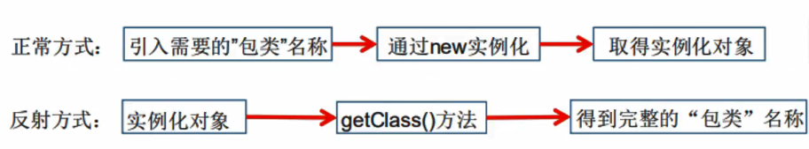

> 3. 反射机制研究与应用

- Java反射机制提供的功能
  - 在运行时判断任意一个对象所属的类；
  - 在运行时构造任意一个类的对象；
  - 在运行时判断任意一个类所具有的成员变量和方法；
  - 在运行时获取泛型信息；
  - 在运行时调用任意一个对象的成员变量和方法；
  - 在运行时处理注解；
  - 生成动态代理；
  - ……

>4. 反射机制优缺点

- 优点：
  - 可以实现动态创建对象和编译，体现出很大的灵活性。
- 缺点
  - 对性能有影响。使用反射基本上是一种解释操作，我们可以告诉JVM，我们希望做什么并且它满足我们的要求。这类操作总是慢于直接执行相同的操作。

> 5. 实现

```java
package github.Annotation.Demo01;

/**
 * 什么叫反射
 * @author subeiLY
 * @create 2021-06-07 14:23
 */
public class Test02 {
    public static void main(String[] args) throws ClassNotFoundException {
        // 通过反射获取class对象
        Class name = Class.forName("github.Annotation.Demo01.User");
        System.out.println(name);

        Class c1 = Class.forName("github.Annotation.Demo01.User");
        Class c2 = Class.forName("github.Annotation.Demo01.User");
        Class c3 = Class.forName("github.Annotation.Demo01.User");
        Class c4 = Class.forName("github.Annotation.Demo01.User");

        /*
        一个类在内存中只有一个Class对象
        一个类被加载后,类的整个结构都会被封装在Class对象中
        public native int hashCode();返回该对象的hash码值
        注：哈希值是根据哈希算法算出来的一个值，这个值跟地址值有关，但不是实际地址值。
         */

        System.out.println(c1.hashCode());
        System.out.println(c2.hashCode());
        System.out.println(c3.hashCode());
        System.out.println(c4.hashCode());
    }
}

// 实体类:pojo entity
class User{
    private int id;
    private int age;
    private String name;

    public User() {
    }

    public User(int id, int age, String name) {
        this.id = id;
        this.age = age;
        this.name = name;
    }

    public int getId() {
        return id;
    }

    public void setId(int id) {
        this.id = id;
    }

    public int getAge() {
        return age;
    }

    public void setAge(int age) {
        this.age = age;
    }

    public String getName() {
        return name;
    }

    public void setName(String name) {
        this.name = name;
    }

    @Override
    public String toString() {
        return "User{" +
                "id=" + id +
                ", age=" + age +
                ", name='" + name + '\'' +
                '}';
    }
}
```

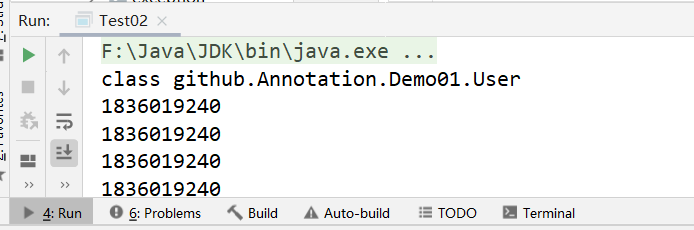

#### 2.理解Class类并获取Class实例

> 1. class类介绍

- 在 Object类中定义了以下的方法，此方法将被所有子类继承
  - public final Class getclass()
- 以上的方法返回值的类型是一个 Class类，此类是Java反射的源头，实际上所谓反射从程序的运行结果来看也很好理解，即：可以通过对象反射求出类的名称。

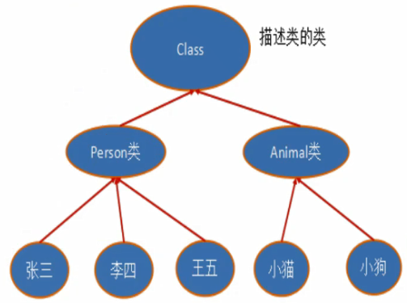

- 对象照镜子后可以得到的信息：某个类的属性、方法和构造器、某个类到底实现了哪些接口对于每个类而言，JRE都为其保留一个不变的Cass类型的对象。一个Class对象包含了特定某个结构（ class/interface/enum/annotation/ primitive type/void/[]）的有关信息。
  - Class本身也是一个类；
  - Class对象只能由系统建立对象；
  - 一个加载的类在JVM中只会有一个Class实例；
  - 一个Cass对象对应的是一个加载到JM中的一个class文件；
  - 每个类的实例都会记得自己是由哪个Class实例所生成；
  - 通过class可以完整地得到一个类中的所有被加载的结构；
  - class类是 Reflection的根源，针对任何你想动态加载、运行的类，唯有先获得相应的Class对象。

- class类的常用方法

| 方法名                                    | 功能说明                                                     |
| ----------------------------------------- | ------------------------------------------------------------ |
| static ClassforName (String name)         | 返回指定类名name的class对象                                  |
| Object newInstance ()                     | 调用缺省构造函数，返回 Class对象的一个实例                   |
| getName ()                                | 返回此Class对象所表示的实体（类，接口，数组类或void）的名称。 |
| Class getSuperClass ()                    | 返回当前class对象的父类的class对象                           |
| Class[] getinterfaces ()                  | 获取当前 Class对象的接口                                     |
| ClassLoader getclassLoader ()             | 返回该类的类加载器                                           |
| Constructor getConstructors ()            | 返回一个包含某些 Constructor对象的数组                       |
| Method getMothed (String name, Class...T) | 返回一个 Method对象，此对象的形参类型为paramType             |
| Field[] getDeclaredFields ()              | 返回Field对象的一个数组                                      |

> 2. 获取Class类的实例

- 若已知具体的类，通过类的class属性获取，该方法最为安全可靠，程序性能最高。
  - Class clazz=Person.class;
- 已知某个类的实例，调用该实例的 getclass () 方法获取Class对象。
  - Class clazz= person. getClass();
- 已知一个类的全类名，且该类在类路径下，可通过class类的静态方法 forName（获取，可能抛出 ClassNotFound Exception。
  - Class clazz Class forName（"demo01 Student");
- 内置基本数据类型可以直接用类名.Type。
- 还可以利用 Classloader。

```java
package github.Annotation.Demo01;

/**
 * 测试class类的创建方式有哪些
 * @author subeiLY
 * @create 2021-06-07 14:36
 */
public class TestCreateClass {
    public static void main(String[] args) throws ClassNotFoundException {
        Person person = new Student();
        System.out.println("这个人是:" + person);

        // 方式一:通过对象查询
        Class c1 = person.getClass();
        System.out.println(c1.hashCode());

        // 方式二:forName获得
        Class c2 = Class.forName("github.Annotation.Demo01.Student");
        System.out.println(c2.hashCode());

        // 方式三:通过类名.class获得
        Class c3 = Student.class;
        System.out.println(c3.hashCode());

        // 方式四:基本类型的包装类都有一个Type
        Class c4 = Integer.TYPE;
        System.out.println(c4);

        // 获得父类类型
        Class c5 = c1.getSuperclass();
        System.out.println(c5);

    }
}

class Person{
    String name;

    public Person() {
    }

    public Person(String name) {
        this.name = name;
    }

    @Override
    public String toString() {
        return "Person{" +
                "name='" + name + '\'' +
                '}';
    }
}

class Student extends Person{
    public Student() {
        this.name = "学生";
    }
}

class Teacher extends Person{
    public Teacher(){
        this.name = "老师";
    }
}
```

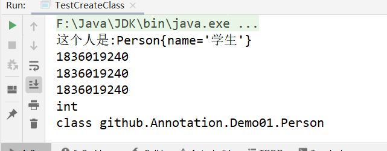

> 3. 哪些类型可以有Class对象

- class：外部类，成员（成员内部类，静态内部类），局部内部类，匿名内部类。
- interface：接口
- []：数组
- enum：枚举
- annotation：注解@interface 
- primitive type：基本数据类型
- void

```java
package github.Annotation.Demo02;

import java.lang.annotation.ElementType;

/**
 * 所有类型的Class
 * @author subeiLY
 * @create 2021-06-07 14:50
 */
public class TestAllTypeClass {
    public static void main(String[] args) {
        Class c1 = Object.class;    // 类
        Class c2 = Comparable.class;    // 接口
        Class c3 = String[].class; // 一维数组
        Class c4 = int[][].class; // 二维数组
        Class c5 = Override.class; // 注解
        Class c6 = ElementType.class; // 美剧
        Class c7 = Integer.class; // 基本数据类型
        Class c8 = void.class; // void
        Class c9 = Class.class; // class
        
        System.out.println(c1);
        System.out.println(c2);
        System.out.println(c3);
        System.out.println(c4);
        System.out.println(c5);
        System.out.println(c6);
        System.out.println(c7);
        System.out.println(c8);
        System.out.println(c9);

        // 只要元素类型与维度一样,就是同一个Class
        int[] a = new int[10];
        int[] b = new int[100];
        System.out.println(a.getClass().hashCode());
        System.out.println(b.getClass().hashCode());

    }
}
```

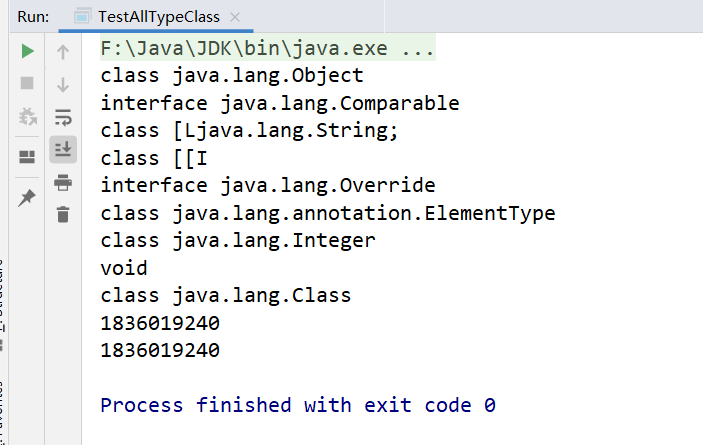

#### 3.类的加载与ClassLoader

> 1. Java内存分析

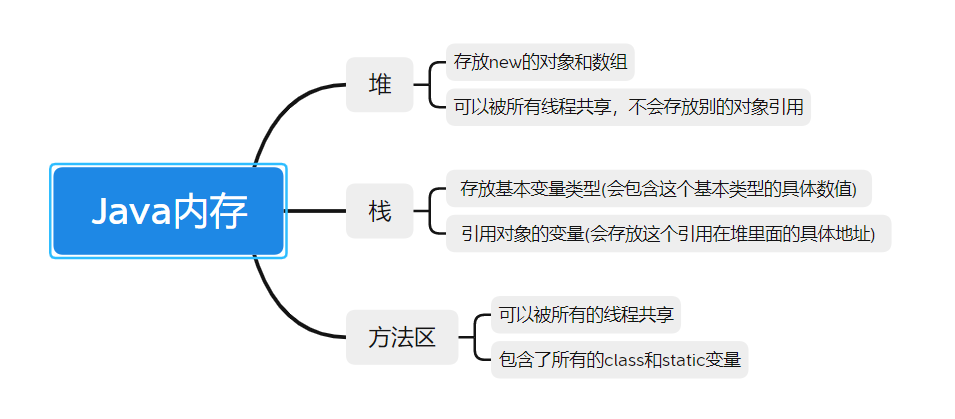

> 2. 类的加载

- 当程序主动使用某个类时，如果该类还未被加载到内存中，则系统会通过如下三个步骤来对该类进行初始化。

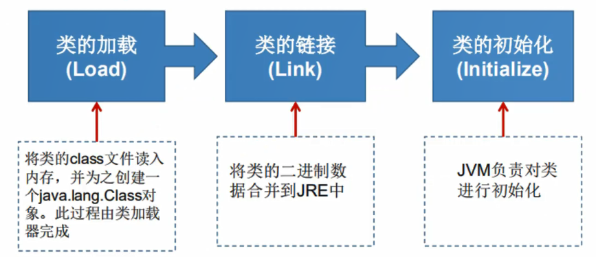

- 加载：将 class文件字节码內容加载到内存中，并将这些静态数据转换成方法区的运行时数据结构，然后生成一个代表这个类的 java. lang . Class对象。
- 链接：将Java类的二进制代码合并到JVM的运行状态之中的过程。
  - 验证：确保加载的类信息符合JVM规范，没有安全方面的问题。
  - 准备：正式为类变量（ static）分配内存并设置类变量默认初始值的阶段，这些内存都将在方法区中进行分配。
  - 解析：虚拟机常量池内的符号引用（常量名）替换为直接引用（地址）的过程。
- 初始化：
  - 执行类构造器< clinit>貟方法的过程。类构造器< clinit>O方法是由编译期自动收集类中所有类变量的赋值动作和静态代码块中的语句合并产生的。（类构造器是构造类信息的，不是构造该类对象的构造器）。
  - 当初始化一个类的时候，如果发现其父类还没有进行初始化，则需要先触发其父类的初始化。
  - 虛拟机会保证一个类的< clinit >()方法在多线程环境中被正确加锁和同步。
-  [深刻理解类加载](https://blog.csdn.net/m0_38075425/article/details/81627349) 

```java
package github.Annotation.Demo02;

/**
 * @author subeiLY
 * @create 2021-06-07 14:57
 */
public class Test05 {
    public static void main(String[] args) {
        A a = new A();
        System.out.println(A.m);
        /*
        1. 加载到内存,会产生一个类对应Class对象
        2. 链接,连接结束后m=0
        3. 初始化
           <clinit>(){
                System.out.println("A类静态代码块初始化");
                m = 300;
                m = 100;
         }
         */
    }
}
class A{
    static{
        System.out.println("A类静态代码块初始化");
        m=300;
    }

    static int m=100;

    public A(){
        System.out.println("A类无参构造初始化");
    }
}
```

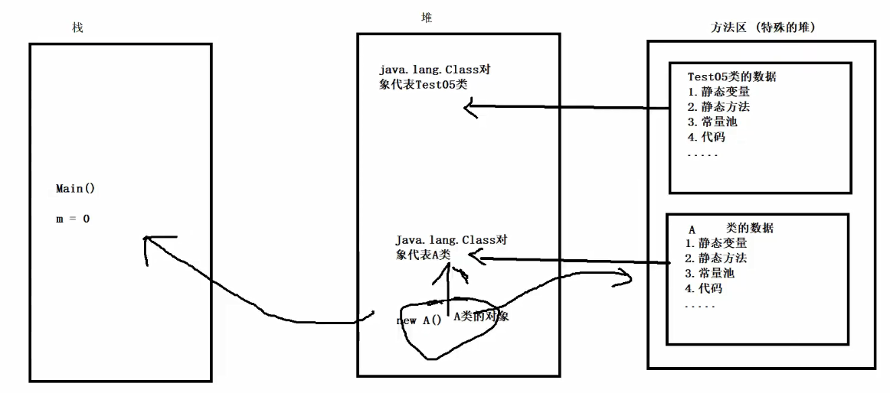

> 3. 什么时候会发生类初始化

- 类的主动引用（一定会发生类的初始化）
  - 当虚拟机启动，先初始化main方法所在的类；
  - new一个类的对象；
  - 调用类的静态成员（除了fina常量）和静态方法；
  - 使用 java. lang. reflect包的方法对类进行反射调用；
  - 当初始化一个类，如果其父类没有被初始化，则先会初始化它的父类。
- 类的被动引用（不会发生类的初始化）
  - 当访问一个静态域时，只有真正声明这个域的类才会被初始化。如：当通过子类引用父类的静态变量，不会导致子类初始化；
  - 通过数组定义类引用，不会触发此类的初始化；
  - 引用常量不会触发此类的初始化（常量在链接阶段就存入调用类的常量池中了）。

```java
package github.Annotation.Demo02;

/**
 * 测试类什么时候会初始化
 * @author subeiLY
 * @create 2021-06-07 15:07
 */
public class TestActiveReference {
    static{
        System.out.println("Main类被加载！");
    }

    public static void main(String[] args) throws ClassNotFoundException {

//        1. 主动调用
        Son son = new Son();
        
//        反射也会产生主动引用
        Class.forName("github.Annotation.Demo02.Son");

//        不会产生类的引用的方法
        System.out.println(Son.b);

        Son[] array = new Son[5];

        System.out.println(Son.a);
    }
}

class Father{
    static final int b=2;
    static {
        System.out.println("父类被加载");
    }
}

class Son extends Father{
    static {
        System.out.println("子类被加载");
        m=100;
    }

    static int m=300;
    static final int a=1;
}
```


> 4. 类加载器的作用

- 类加载的作用：将 class文件字节码内容加载到内存中，并将这些静态数据转换成方法区的运行时数据结构，然后在堆中生成一个代表这个类的 java. lang Class对象，作为方法区中类数据的访问入口。
- 类缓存：标准的 JavaSe类加载器可以按要求查找类，但一旦某个类被加载到类加载器中，它将维持加载（缓存）一段时间。不过丿M垃圾回收机制可以回收这些 Classi对象


- 类加载器作用是用来把类（αlass）装载进内存的。丿VM规范定义了如下类型的类的加载器。


- ClassLoader systemClassLoader = ClassLoader.getSystemClassLoader();//获取系统类的加载器
- ClassLoader parent = systemClassLoader.getParent();//获取系统类加载器的父类加载器–>扩展类加载器 jre1.8.0_91\lib\ext
- ClassLoader parent1 = parent.getParent();//获取扩展类加载器父类加载器–>根加载器(c/c++) jre1.8.0_91\lib\rt.jar

```java
package github.Annotation.Demo02;

/**
 * 类加载器
 * @author subeiLY
 * @create 2021-06-07 15:21
 */
public class TestClassLoader1 {
    public static void main(String[] args) throws ClassNotFoundException {
        // 获取系统类的加载器
        ClassLoader systemClassLoader = ClassLoader.getSystemClassLoader();
        System.out.println(systemClassLoader);

        // 获取系统类加载器的父类加载器-->扩展类加载器    jre1.8.0_91\lib\ext
        ClassLoader parent = systemClassLoader.getParent();
        System.out.println(parent);

        // 获取扩展类加载器父类加载器-->根加载器(c/c++)  jre1.8.0_91\lib\rt.jar
        ClassLoader parent1 = parent.getParent();
        System.out.println(parent1);

        // 测试当前类是哪个加载器加载的
        ClassLoader classLoader = Class.forName("github.Annotation.Demo02.TestClassLoader1").getClassLoader();
        System.out.println(classLoader);

        // 测试JDK内置的类是谁加载的
        classLoader = Class.forName("java.lang.Object").getClassLoader();
        System.out.println(classLoader);

        // 如何获得系统类加载器可以加载的路径
        System.out.println(System.getProperty("java.class.path"));

        // 双亲委派机制  检测安全性 你写的类和跟加载器一样的不会用你写的类
        // java.lang.String -->往上推

        /*
        F:\java\JDK\jre\lib\charsets.jar;
        F:\java\JDK\jre\lib\deploy.jar;
        F:\java\JDK\jre\lib\ext\access-bridge-64.jar;
        F:\java\JDK\jre\lib\ext\cldrdata.jar;
        F:\java\JDK\jre\lib\ext\dnsns.jar;
        F:\java\JDK\jre\lib\ext\jaccess.jar;
        F:\java\JDK\jre\lib\ext\jfxrt.jar;
        F:\java\JDK\jre\lib\ext\localedata.jar;
        F:\java\JDK\jre\lib\ext\nashorn.jar;
        F:\java\JDK\jre\lib\ext\sunec.jar;
        F:\java\JDK\jre\lib\ext\sunjce_provider.jar;
        F:\java\JDK\jre\lib\ext\sunmscapi.jar;
        F:\java\JDK\jre\lib\ext\sunpkcs11.jar;
        F:\java\JDK\jre\lib\ext\zipfs.jar;
        F:\java\JDK\jre\lib\javaws.jar;
        F:\java\JDK\jre\lib\jce.jar;
        F:\java\JDK\jre\lib\jfr.jar;
        F:\java\JDK\jre\lib\jfxswt.jar;
        F:\java\JDK\jre\lib\jsse.jar;
        F:\java\JDK\jre\lib\management-agent.jar;
        F:\java\JDK\jre\lib\plugin.jar;
        F:\java\JDK\jre\lib\resources.jar;
        F:\java\JDK\jre\lib\rt.jar;
        F:\java\IDEA2020.2\Study\out\production\Study;
        F:\java\JDK\jre\lib\commons-io-2.6.jar;
        F:\java\IDEA2020.2\IntelliJ IDEA 2020.2.2\lib\idea_rt.jar

         */
    }
}
```

#### 4.获取运行类的完整结构

- 通过反射获取运行时类的完整结构
- Field、 Method、 Constructor.、 Superclass、 Interface、 Annotation
- 实现的全部接口
- 所继承的父类
- 全部的构造器
- 全部的方法
- 全部的Feld
- 注解
- ……

```java
package github.Annotation.Demo03;

import java.lang.reflect.Constructor;
import java.lang.reflect.Field;
import java.lang.reflect.Method;

/**
 *
 * @author subeiLY
 * @create 2021-06-07 15:34
 */
public class TestClassInfo {
    public static void main(String[] args) throws ClassNotFoundException, NoSuchFieldException, NoSuchMethodException {
        Class c1 = Class.forName("github.Annotation.Demo03.User");
        User user = new User();
        c1 = user.getClass();

        // 获得类的名字
        System.out.println(c1.getName());// 获得包名 + 类名
        System.out.println(c1.getSimpleName());// 获得类名

        System.out.println("=======================");

        // 获得类的属性
        Field[] fields = c1.getFields();// 只能找到public属性
        for (Field field : fields) {
            System.out.println("getFields:" + field);
        }
        fields = c1.getDeclaredFields();// 找到全部的属性
        for (Field field : fields) {
            System.out.println("getDeclaredFields:" + field);
        }
        // 获得指定属性的值
        Field name = c1.getDeclaredField("name");
        System.out.println(name);

        System.out.println("=======================");

        // 获得类的方法
        Method[] methods = c1.getMethods(); // 获得本类及父类的全部public方法
        for (Method method : methods) {
            System.out.println("getMethods:" + method);
        }
        methods = c1.getDeclaredMethods(); // 获得本类的所有方法
        for (Method method : methods) {
            System.out.println("getDeclaredMethods:" + method);
        }
        System.out.println("=======================");
        // 获得指定的方法
        // 重载
        Method getName = c1.getMethod("getName", null);
        Method setName = c1.getMethod("setName", String.class);
        System.out.println(getName);
        System.out.println(setName);
        // 获得类的构造器
        System.out.println("=======================");
        Constructor[] constructors = c1.getConstructors();
        for (Constructor constructor : constructors) {
            System.out.println("getConstructors:" + constructor);
        }
        constructors = c1.getDeclaredConstructors();
        for (Constructor constructor : constructors) {
            System.out.println("getDeclaredConstructors:" + constructor);
        }
        // 获得指定的构造器
        Constructor declaredConstructor = c1.getDeclaredConstructor(String.class, int.class, int.class);
        System.out.println("指定构造器" + declaredConstructor);
    }
}
```

- 在实际的操作中，取得类的信息的操作代码，并不会经常开发。
- 一定要熟悉 java. lang .reflect包的作用，反射机制。
- 如何取得属性、方法、构造器的名称，修饰符等。

#### 5.调用运行时类的指定结构

> 1. 有Class对象,能做什么

- 创建类的对象：调用 Class对象的 newInstance()方法
  - 1）类必须有一个无参数的构造器。
  - 2）类的构造器的访问权限需要足够。
- 思考？难道没有无参的构造器就不能创建对象了吗？只要在操作的时候明确的调用类中的构造器，并将参数传递进去之后，才可以实例化操作。
- 步骤如下：
  - 1）通过class类的 getDeclaredConstructor（ Class…， parameterTypes）取得本类的指定形参类型的构造器；
  - 2）向构造器的形参中传递一个对象数组进去，里面包含了构造器中所需的各个参数。
  - 3）通过 Constructo实例化对象

> 2. 方法及使用

```java
package github.Annotation.Demo03;

import java.lang.reflect.Constructor;
import java.lang.reflect.Field;
import java.lang.reflect.InvocationTargetException;
import java.lang.reflect.Method;

/**
 * 动态的创建对象,通过反射
 * @author subeiLY
 * @create 2021-06-07 15:46
 */
public class TestDynamicCreateObject {
    public static void main(String[] args) throws ClassNotFoundException, IllegalAccessException, InstantiationException, NoSuchMethodException, InvocationTargetException, NoSuchFieldException {
        // 获得Class对象
        Class c1 = Class.forName("github.Annotation.Demo03.User");

        // 构造一个对象
        User user = (User) c1.newInstance();    // 本质上调用了类的无参构造器
        System.out.println(user);

        // 通过构造器创建对象
        Constructor constructor = c1.getDeclaredConstructor(String.class, int.class, int.class);
        User user1 = (User) constructor.newInstance("光荣时代",001,17);
        System.out.println(user1);

        // 通过反射调用普通方法
        User user2 = (User) c1.newInstance();
        // 通过反射获取一个方法
        Method setName = c1.getDeclaredMethod("setName", String.class);
        // invoke:激活
        // (对象,"方法值")
        setName.invoke(user2, "some");
        System.out.println(user2.getName());

        // 通过反射操作属性
        User user3 = (User) c1.newInstance();
        Field name = c1.getDeclaredField("name");

        // 不能直接操作私有属性,我们需要关闭程序的安全检测,属性或方法的setAccessible(true)
        // 设置安全检测
        name.setAccessible(true);

        name.set(user3, "some2");
        System.out.println(user3.getName());
    }
}
```


- 通过反射，调用类中的方法，通过 Method类完成。
  - ①通过Cas类的 getMethod（ String name, Class... parameterTypes）方法取得一个 Method对象，并设置此方法操作时所需要的参数类型。
  - ②之后使用 Object invoke（ Object obj，Object[] args）进行调用，并向方法中传递要设置的ob对象的参数信息。

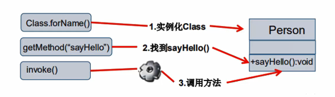

> 调用指定的方法：

- Object invoke（object obj, Object. args）
- Object对应原方法的返回值，若原方法无返回值，此时返回null；
- 若原方法若为静态方法，此时形参 Object obj可为null；
- 若原方法形参列表为空，则 Object[] args为null；
- 若原方法声明为 private，则需要在调用此 invoke（）方法前，显式调用方法对象的setAccessible（true）方法，将可访问 private的方法。

> setAccessible 

- Method和 Field、 Constructor对象都有 setAccessible()方法。
- setAccessible作用是启动和禁用访问安全检查的开关。
- 参数值为true则指示反射的对象在使用时应该取消Java语言访问检査。
  - 提高反射的效率。如果代码中必须用反射，而该句代码需要频繁的被调用，那么请设置为true；
  - 使得原本无法访问的私有成员也可以访问；
- 参数值为false则指示反射的对象应该实施Java语言访问检查。


> 3. 性能检测

```java
package github.Annotation.Demo03;

import java.lang.reflect.InvocationTargetException;
import java.lang.reflect.Method;

/**
 * 分析性能问题
 * @author subeiLY
 * @create 2021-06-07 15:59
 */
public class TestPerformance {
    // 普通方式调用
    public static void test01() {
        User user = new User();
        long startTime = System.currentTimeMillis();

        for (int i = 0; i < 1000000000; i++) {
            user.getName();
        }

        long endTime = System.currentTimeMillis();
        System.out.println("普通方式执行10亿次:" + (endTime - startTime) + "ms");
    }

    // 反射方式调用
    public static void test02() throws NoSuchMethodException, InvocationTargetException, IllegalAccessException {
        User user = new User();
        Class c1 = user.getClass();
        Method getName = c1.getDeclaredMethod("getName", null);
        long startTime = System.currentTimeMillis();

        for (int i = 0; i < 1000000000; i++) {
            getName.invoke(user,null);
        }

        long endTime = System.currentTimeMillis();
        System.out.println("反射方式执行10亿次:" + (endTime - startTime) + "ms");
    }

    // 反射方式调用,关闭检测
    public static void test03() throws NoSuchMethodException, InvocationTargetException, IllegalAccessException {
        User user = new User();
        Class c1 = user.getClass();
        Method getName = c1.getDeclaredMethod("getName", null);
        getName.setAccessible(true);
        long startTime = System.currentTimeMillis();

        for (int i = 0; i < 1000000000; i++) {
            getName.invoke(user,null);
        }

        long endTime = System.currentTimeMillis();
        System.out.println("反射方式执行10亿次,关闭检测:" + (endTime - startTime) + "ms");
    }

    public static void main(String[] args) throws NoSuchMethodException, IllegalAccessException, InvocationTargetException {
        test01();
        test02();
        test03();
    }
}
```

#### 6.反射操作泛型

- Java采用泛型擦除的机制来引入泛型，Java中的泛型仅仅是给编译器jvac使用的，确保数据的安全性和免去强制类型转换问题，但是，一旦编译完成，所有和泛型有关的类型全部擦除。
- 为了通过反射操作这些类型，Java新增了 ParameterizedType, GenericArray Type, Type Variable和 WildcardType几种类型来代表不能被归一到clas类中的类型但是又和原始类型齐名的类型。
- ParameterizedType：表示一种参数化类型，比如 Collection< String>
- GenericArray Type：表示一种元素类型是参数化类型或者类型变量的数组类型；
- Type Variable：是各种类型变量的公共父接口；
- WildcardType：代表一种通配符类型表达式。

```java
package github.Annotation.Demo03;

import java.lang.reflect.Method;
import java.lang.reflect.ParameterizedType;
import java.lang.reflect.Type;
import java.util.List;
import java.util.Map;

/**
 * 通过反射获取泛型
 * @author subeiLY
 * @create 2021-06-07 16:03
 */
public class Test01 {
    public void test02(Map<String,User> map, List<User> list){
        System.out.println("test02");
    }

    public Map<String,User> test03(){
        System.out.println("Test03");
        return null;
    }

    public static void main(String[] args) throws NoSuchMethodException {
        Method method = Test01.class.getMethod("test02", Map.class, List.class);

        Type[] genericParameterTypes = method.getGenericParameterTypes();
        for (Type genericParameterType : genericParameterTypes){
            System.out.println("#" + genericParameterType);
            if(genericParameterType instanceof ParameterizedType){
                Type[] typeArguments = ((ParameterizedType) genericParameterType).getActualTypeArguments();
                for (Type typeArgument : typeArguments){
                    System.out.println(typeArgument);
                }
            }
        }

        method = Test01.class.getMethod("test03", null);
        Type returnType = method.getGenericReturnType();
        if(returnType instanceof ParameterizedType){
            Type[] typeArguments = ((ParameterizedType) returnType).getActualTypeArguments();
            for (Type typeArgument : typeArguments){
                System.out.println(typeArgument);
            }
        }

    }
}
```

#### 7.反射操作注解

- getAnnotations 
- getAnnotation


```java
package github.Annotation.Demo03;

import java.lang.annotation.*;
import java.lang.reflect.Field;

/**
 * 练习反射操作注解
 * @author subeiLY
 * @create 2021-06-07 16:21
 */
public class TestORM {
    public static void main(String[] args) throws ClassNotFoundException, NoSuchFieldException {
        Class c1 = Class.forName("github.Annotation.Demo03.Student2");
        //通过反射获取注解
        Annotation[] annotations = c1.getAnnotations();
        for (Annotation annotation : annotations) {
            System.out.println(annotation);
        }

        //获得注解value
        TableDoris tableDoris = (TableDoris) c1.getAnnotation(TableDoris.class);
        String value = tableDoris.value();
        System.out.println(value);

        //获得类指定的注解
        Field name = c1.getDeclaredField("name");
        FiledDoris annotation = name.getAnnotation(FiledDoris.class);
        System.out.println(annotation.columnName());
        System.out.println(annotation.type());
        System.out.println(annotation.length());
    }
}

@TableDoris("db_student")
class Student2 {
    @FiledDoris(columnName = "db_id", type = "int", length = 10)
    private int id;
    @FiledDoris(columnName = "db_age", type = "int", length = 3)
    private int age;
    @FiledDoris(columnName = "db_name", type = "varchar", length = 200)
    private String name;

    public Student2() {
    }

    public Student2(int id, int age, String name) {
        this.id = id;
        this.age = age;
        this.name = name;
    }

    @Override
    public String toString() {
        return "Student2{" +
                "id=" + id +
                ", age=" + age +
                ", name='" + name + '\'' +
                '}';
    }

    public int getId() {
        return id;
    }

    public void setId(int id) {
        this.id = id;
    }

    public int getAge() {
        return age;
    }

    public void setAge(int age) {
        this.age = age;
    }

    public String getName() {
        return name;
    }

    public void setName(String name) {
        this.name = name;
    }
}

// 类名注解
@Target(ElementType.TYPE)
@Retention(RetentionPolicy.RUNTIME)
@interface TableDoris {
    String value();
}

// 属性注解
@Target(ElementType.FIELD)
@Retention(RetentionPolicy.RUNTIME)
@interface FiledDoris {
    String columnName();
    String type();

    int length();
}
```

## SE总结


## JVM入门

**面试常见**：

1. 请你谈谈你对JVM的理解?
2. java8虚拟机和之前的变化更新?
3. 什么是OOM，什么是栈溢出StackOverFlowError? 怎么分析?
4. JVM的常用调优参数有哪些?
5. 内存快照如何抓取？怎么分析Dump文件？
6. 谈谈JVM中，类加载器你的认识？

### 1.JVM的位置


**三种JVM:**

- Sun公司：HotSpot 用的最多
- BEA：JRockit
- IBM：J9VM

我们学习都是：**HotSpot**

### 2.JVM的体系结构


- **jvm调优：99%都是在方法区和堆，大部分时间调堆。** JNI（java native interface）本地方法接口。 

  

### 3.类加载器

-  作用：加载Class文件——如果new Student();（具体实例在堆里，引用变量名放栈里） 。
-  先来看看一个类加载到 JVM 的一个基本结构：


- 类是模板，对象是具体的，通过new来实例化对象。car1，car2，car3，名字在栈里面，真正的实例，具体的数据在堆里面，栈只是引用地址。

1. 虚拟机自带的加载器
2. 启动类（根）加载器
3. 扩展类加载器
4. 应用程序加载器

```java
package github.JVM.Demo01;

/**
 * @author subeiLY
 * @create 2021-06-08 07:42
 */
public class Test01 {
    public static void main(String[] args) {
        Test01 test01 = new Test01();
        Test01 test02 = new Test01();
        Test01 test03 = new Test01();

        System.out.println(test01.hashCode());
        System.out.println(test02.hashCode());
        System.out.println(test03.hashCode());
/*
1836019240
325040804
1173230247
 */

        Class<? extends Test01> aClass1 = test01.getClass();

        ClassLoader classLoader = aClass1.getClassLoader();
        System.out.println(classLoader);
        System.out.println(classLoader.getParent());
        System.out.println(classLoader.getParent().getParent());
/*
sun.misc.Launcher$AppClassLoader@18b4aac2
sun.misc.Launcher$ExtClassLoader@330bedb4
null
 */

        Class<? extends Test01> aClass2 = test02.getClass();
        Class<? extends Test01> aClass3 = test03.getClass();

        System.out.println(aClass1.hashCode());
        System.out.println(aClass2.hashCode());
        System.out.println(aClass3.hashCode());
        /*
        2133927002
        2133927002
        2133927002
         */
    }
}
```

**类加载器的分类**

- Bootstrap ClassLoader 启动类加载器
- Extention ClassLoader 标准扩展类加载器
- Application ClassLoader 应用类加载器
- User ClassLoader 用户自定义类加载器

### 4.双亲委派机制

```java
package java.lang;

/**
 * @author subeiLY
 * @create 2021-06-08 08:06
 */
public class String {
    /*
    双亲委派机制:安全
    1.APP-->EXC-->BOOT(最终执行)
    BOOT
    EXC
    APP
     */
    public String toString() {
        return "Hello";
    }

    public static void main(String[] args) {
        String s = new String();
        System.out.println(s.getClass());
        s.toString();
    }
    /*
    1.类加载器收到类加载的请求
    2.将这个请求向上委托给父类加载器去完成，一直向上委托，知道启动类加载
    3.启动加载器检查是否能够加载当前这个类，能加载就结束，使用当前的加载器，否则，抛出异常，适知子加载器进行加载
    4.重复步骤3
     */
}
```

- idea报了一个错误：


> 这是因为，在运行一个类之前，首先会在应用程序加载器(APP)中找，如果APP中有这个类，继续向上在扩展类加载器EXC中找，然后再向上，在启动类( 根 )加载器BOOT中找。如果在BOOT中有这个类的话，最终执行的就是根加载器中的。如果BOOT中没有的话，就会倒找往回找。

**过程总结**

- 1.类加载器收到类加载的请求

- 2.将这个请求向上委托给父类加载器去完成，一直向上委托，直到启动类加载器

- 3.启动类加载器检查是否能够加载当前这个类，能加载就结束，使用当前的加载器，否则，抛出异常，一层一层向下，通知子加载器进行加载

- 4.重复步骤3

- 关于**双亲委派机制**的博客：

  [你确定你真的理解“双亲委派“了吗？！](https://hollis.blog.csdn.net/article/details/112462198?utm_medium=distribute.pc_relevant.none-task-blog-2%7Edefault%7EBlogCommendFromMachineLearnPai2%7Edefault-11.control&dist_request_id=1329188.24840.16179780332075587&depth_1-utm_source=distribute.pc_relevant.none-task-blog-2%7Edefault%7EBlogCommendFromMachineLearnPai2%7Edefault-11.control) 

-----

[面试官：java双亲委派机制及作用](https://www.jianshu.com/p/1e4011617650)

- ==概念==：当某个类加载器需要加载某个.class文件时，它首先把这个任务委托给他的上级类加载器，递归这个操作，如果上级的类加载器没有加载，自己才会去加载这个类。

- ==例子==：当一个Hello.class这样的文件要被加载时。不考虑我们自定义类加载器，首先会在AppClassLoader中检查是否加载过，如果有那就无需再加载了。如果没有，那么会拿到父加载器，然后调用父加载器的loadClass方法。父类中同理也会先检查自己是否已经加载过，如果没有再往上。注意这个类似递归的过程，直到到达Bootstrap classLoader之前，都是在检查是否加载过，并不会选择自己去加载。直到BootstrapClassLoader，已经没有父加载器了，这时候开始考虑自己是否能加载了，如果自己无法加载，会下沉到子加载器去加载，一直到最底层，如果没有任何加载器能加载，就会抛出ClassNotFoundException。

 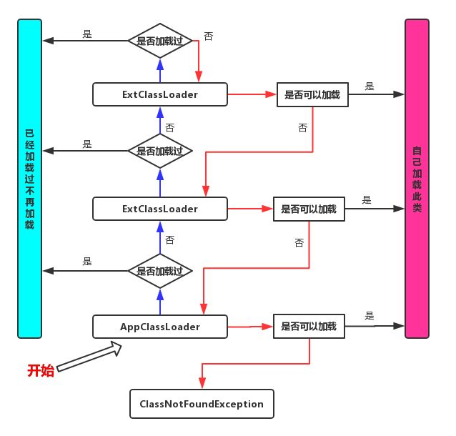 

==作用==：

1. 防止重复加载同一个.class。通过委托去向上面问一问，加载过了，就不用再加载一遍。保证数据安全。
2. 保证核心.class不能被篡改。通过委托方式，不会去篡改核心.class，即使篡改也不会去加载，即使加载也不会是同一个.class对象了。不同的加载器加载同一个.class也不是同一个Class对象。这样保证了Class执行安全。

> 比如：如果有人想替换系统级别的类：String.java。篡改它的实现，在这种机制下这些系统的类已经被Bootstrap classLoader加载过了（为什么？因为当一个类需要加载的时候，最先去尝试加载的就是BootstrapClassLoader），所以其他类加载器并没有机会再去加载，从一定程度上防止了危险代码的植入。

### 5.沙箱安全机制

	Java安全模型的核心就是Java沙箱(sandbox)，什么是沙箱?沙箱是一个限制程序运行的环境。沙箱机制就是将Java代码限定在虚拟机(JVM)特定的运行范围中，并且严格限制代码对本地系统资源访问，通过这样的措施来保证对代码的有效隔离，防止对本地系统造成破坏。沙箱**主要限制系统资源访问**，那系统资源包括什么?CPU、内存、文件系统、网络。不同级别的沙箱对这些资源访问的限制也可以不一样。
	
	所有的Java程序运行都可以指定沙箱，可以定制安全策略。
	
	在]ava中将执行程序分成本地代码和远程代码两种，本地代码默认视为可信任的，而远程代码则被看作是不受信的。对于授信的本地代码，可以访问一切本地资源。而对于非授信的远程代码在早期的ava实现中，安全依赖于沙箱(Sandbox)机制。如下图所示JDK1.0安全模型。


	 但如此严格的安全机制也给程序的功能扩展带来障碍，比如当用户希望远程代码访问本地系统的文件时候，就无法实现。因此在后续的Java1.1 版本中，针对安全机制做了改进，增加了安全策略，允许用户指定代码对本地资源的访问权限。如下图所示JDK1.1安全模型。

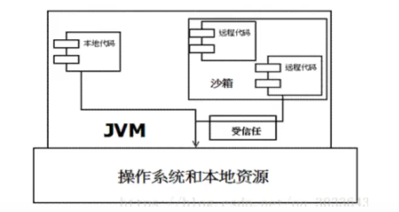

	在Java1.2版本中，再次改进了安全机制，增加了代码签名。不论本地代码或是远程代码，都会按照用户的安全策略设定，由类加载器加载到虚拟机中权限不同的运行空间，来实现差异化的代码执行权限控制。如下图所示JDK1.2安全模型。

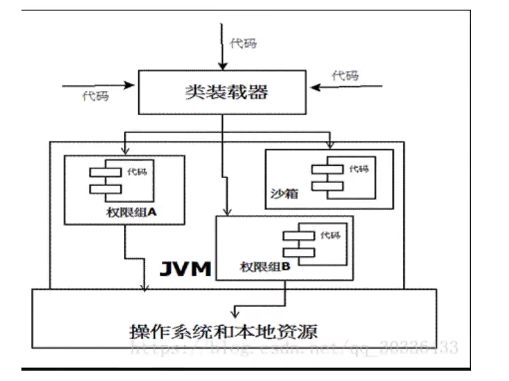

	当前最新的安全机制实现，则引入了域(Domain)的概念。虚拟机会把所有代码加载到不同的系统域和应用域，系统域部分专门负责与关键资源进行交互，而各个应用域部分则通过系统域的部分代理来对各种需要的资源进行访问。虚拟机中不同的受保护域(Protected Domain)，对应不一样的权限(Permission)。存在于不同域中的类文件就具有了当前域的全部权限，如下图所示最新的安全模型(jdk 1.6)。

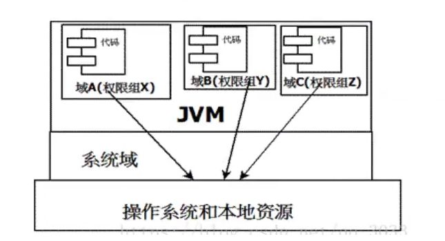

**组成沙箱的基本组件**:

- `字节码校验器`(bytecode verifier)︰确保Java类文件遵循lava语言规范。这样可以帮助lava程序实现内存保护。但并不是所有的类文件都会经过字节码校验，比如核心类。

- 类装载器(class loader) :其中类装载器在3个方面对Java沙箱起作用：

  。它防止恶意代码去干涉善意的代码;
  。它守护了被信任的类库边界;
  。它将代码归入保护域，确定了代码可以进行哪些操作。

        虚拟机为不同的类加载器载入的类提供不同的命名空间，命名空间由一系列唯一的名称组成，每一个被装载的类将有一个名字，这个命名空间是由Java虚拟机为每一个类装载器维护的，它们互相之间甚至不可见。

**类装载器采用的机制是双亲委派模式。**

1.从最内层VM自带类加载器开始加载，外层恶意同名类得不到加载从而无法使用;

2.由于严格通过包来区分了访问域，外层恶意的类通过内置代码也无法获得权限访问到内层类，破坏代码就自然无法生效。

- 存取控制器(access controller)︰存取控制器可以控制核心API对操作系统的存取权限，而这个控制的策略设定，可以由用户指定。
- 安全管理器(security manager)︰是核心API和操作系统之间的主要接口。实现权限控制，比存取控制器优先级高。
- 安全软件包(security package) : java.security下的类和扩展包下的类，允许用户为自己的应用增加新的安全特性，包括:
  - 安全提供者
  - 消息摘要
  - 数字签名
  - 加密
  - 鉴别

### 6.Native

- 编写一个多线程类启动。

```java
 public static void main(String[] args) { 
            new Thread(()->{ },"your thread name").start(); 
 }
```

- 点进去看start方法的源码：

```java
public synchronized void start() {
      
        if (threadStatus != 0)
            throw new IllegalThreadStateException();

        group.add(this);

        boolean started = false;
        try {
            start0();	// 调用了一个start0方法
            started = true;
        } finally {
            try {
                if (!started) {
                    group.threadStartFailed(this);
                }
            } catch (Throwable ignore) {
              
            }
        }
    }
	// 这个Thread是一个类，这个方法定义在这里是不是很诡异！看这个关键字native；
    private native void start0();
```

- **凡是带了native关键字的，说明 java的作用范围达不到，去调用底层C语言的库！**

- **JNI：Java Native Interface（Java本地方法接口）**

- 凡是带了native关键字的方法就会进入本地方法栈；

- **Native Method Stack** 本地方法栈

- 本地接口的作用是融合不同的编程语言为Java所用，它的初衷是融合C/C++程序，Java在诞生的时候是C/C++横行的时候，想要立足，必须有调用C、C++的程序，于是就在内存中专门开辟了一块区域处理标记为native的代码，它的具体做法是 在 Native Method Stack 中登记native方法，在 ( ExecutionEngine ) 执行引擎执行的时候加载Native Libraies。

- 目前该方法使用的越来越少了，除非是与硬件有关的应用，比如通过Java程序驱动打印机或者Java系统管理生产设备，在企业级应用中已经比较少见。因为现在的异构领域间通信很发达，比如可以使用Socket通信，也可以使用Web Service等等，不多做介绍！

### 7.PC寄存器

**程序计数器：**Program Counter Register

- 每个线程都有一个程序计数器，是线程私有的，就是一个指针，指向方法区中的方法字节码(用来存储指向像一条指令的地址，也即将要执行的指令代码)，在执行引擎读取下一条指令，是一个非常小的内存空间，几乎可以忽略不计。

### 8.方法区

**Method Area 方法区**

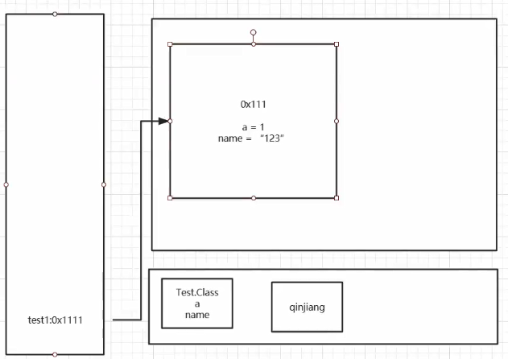

- 方法区是被所有线程共享，所有字段和方法字节码，以及一些特殊方法，如构造函数，接口代码也在此定义，简单说，所有定义的方法的信息都保存在该区域，**此区域属于共享区间;**

- ==静态变量、常量、类信息(构造方法、接口定义)、运行时的常量池存在方法区中，但是实例变量存在堆内存中，和方法区无关==。

- static ，final ，Class ，常量池~

### 9.栈

- 在计算机流传有一句废话： 程序 = 算法 + 数据结构

- 但是对于大部分同学都是： 程序 = 框架 + 业务逻辑
- 栈：后进先出 / 先进后出

- 队列：先进先出（FIFO : First Input First Output）


**栈管理程序运行**

- 存储一些基本类型的值、对象的引用、方法等。

- **栈的优势是，存取速度比堆要快，仅次于寄存器，栈数据可以共享。**

思考：为什么main方法最后执行！为什么一个test() 方法执行完了，才会继续走main方法！

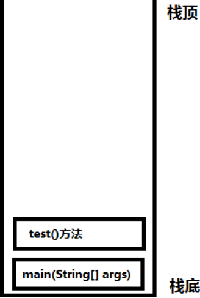

> **喝多了吐就是栈，吃多了拉就是队列**。

说明：

- 1、栈也叫栈内存，主管Java程序的运行，是在线程创建时创建，它的生命期是跟随线程的生命期，线程结束栈内存也就释放。

- 2、**对于栈来说不存在垃圾回收问题**，只要线程一旦结束，该栈就Over，生命周期和线程一致，是线程私有的。

- 3、方法自己调自己就会导致栈溢出（递归死循环测试）。

**栈里面会放什么东西那？**

- 8大基本类型 + 对象的引用 + 实例的方法

> **栈运行原理**

- Java栈的组成元素——栈帧。

- 栈帧是一种用于帮助虚拟机执行方法调用与方法执行的数据结构。他是独立于线程的，一个线程有自己的一个栈帧。封装了方法的局部变量表、动态链接信息、方法的返回地址以及操作数栈等信息。

- 第一个方法从调用开始到执行完成，就对应着一个栈帧在虚拟机栈中从入栈到出栈的过程。

> 当一个方法A被调用时就产生了一个栈帧F1，并被压入到栈中，A方法又调用了B方法，于是产生了栈帧F2也被压入栈中，B方法又调用了C方法，于是产生栈帧F3也被压入栈中	执行完毕后，先弹出F3， 然后弹出F2，在弹出F1........

- 遵循 “先进后出” / "后进先出" 的原则。


- 栈满了，抛出异常：stackOverflowError


- 对象实例化的过程。

### 10.三种JVM

- Sun公司HotSpot java Hotspot™64-Bit server vw (build 25.181-b13，mixed mode)
- BEA JRockit
- IBM 39 VM
- 我们学习都是：Hotspot

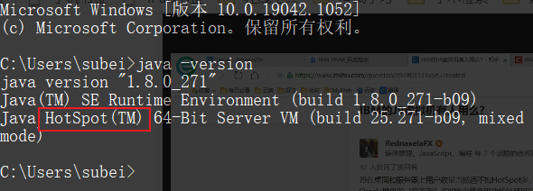

### 11.堆

**Java7**之前

- Heap 堆，一个JVM实例只存在一个堆内存，堆内存的大小是可以调节的。
- 类加载器读取了类文件后，需要把类，方法，常变量放到堆内存中，保存所有引用类型的真实信息，以方便执行器执行。
- 堆内存分为三部分：
  - 新生区 Young Generation Space Young/New
  - 养老区 Tenure generation space Old/Tenure

  - 永久区 Permanent Space Perm

- 堆内存逻辑上分为三部分：新生，养老，永久（元空间 : JDK8 以后名称）。

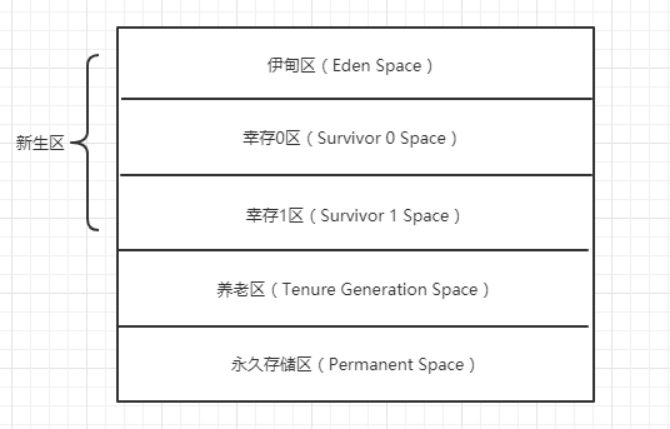

**谁空谁是to**

- **GC**垃圾回收主要是在新生区和养老区，又分为轻GC 和 重GC，如果内存不够，或者存在死循环，就会导致
- 在JDK8以后，永久存储区改了个名字(元空间)。


### 12.新生区、养老区

- 新生区是类诞生，成长，消亡的区域，一个类在这里产生，应用，最后被垃圾回收器收集，结束生命。

- 新生区又分为两部分：伊甸区（Eden Space）和幸存者区（Survivor Space），所有的类都是在伊甸区被new出来的，幸存区有两个：0区 和 1区，当伊甸园的空间用完时，程序又需要创建对象，JVM的垃圾回收器将对伊甸园区进行垃圾回收（Minor GC）。将伊甸园中的剩余对象移动到幸存0区，若幸存0区也满了，再对该区进行垃圾回收，然后移动到1区，那如果1区也满了呢？（这里幸存0区和1区是一个互相交替的过程）再移动到养老区，若养老区也满了，那么这个时候将产生MajorGC（Full GC），进行养老区的内存清理，若养老区执行了Full GC后发现依然无法进行对象的保存，就会产生OOM异常 “OutOfMemoryError ”。如果出现 java.lang.OutOfMemoryError：java heap space异常，说明Java虚拟机的堆内存不够，原因如下：
  - 1、Java虚拟机的堆内存设置不够，可以通过参数 -Xms（初始值大小），-Xmx（最大大小）来调整。

  - 2、代码中创建了大量大对象，并且长时间不能被垃圾收集器收集（存在被引用）或者死循环。

### 13.永久区（Perm）

- 永久存储区是一个常驻内存区域，用于存放JDK自身所携带的Class，Interface的元数据，也就是说它存储的是运行环境必须的类信息，被装载进此区域的数据是不会被垃圾回收器回收掉的，关闭JVM才会释放此区域所占用的内存。
- 如果出现 java.lang.OutOfMemoryError：PermGen space，说明是 Java虚拟机对永久代Perm内存设置不够。一般出现这种情况，都是程序启动需要加载大量的第三方jar包，
- 例如：在一个Tomcat下部署了太多的应用。或者大量动态反射生成的类不断被加载，最终导致Perm区被占满。

**注意：**

- JDK1.6之前： 有永久代，常量池1.6在方法区；
- JDK1.7： 有永久代，但是已经逐步 “去永久代”，常量池1.7在堆；
- JDK1.8及之后：无永久代，常量池1.8在元空间。

**熟悉三区结构后方可学习**JVM垃圾回收机制

- 实际而言，方法区（Method Area）和堆一样，是各个线程共享的内存区域，它用于存储虚拟机加载的：类信息+普通常量+静态常量+编译器编译后的代码，虽然JVM规范将方法区描述为**堆的一个逻辑部分，但它却还有一个别名，叫做Non-Heap（非堆），目的就是要和堆分开**。

- 对于HotSpot虚拟机，很多开发者习惯将方法区称之为 “永久代（Parmanent Gen）”，但严格本质上说两者不同，或者说使用永久代实现方法区而已，永久代是方法区（相当于是一个接口interface）的一个实现，Jdk1.7的版本中，已经将原本放在永久代的字符串常量池移走。

- 常量池（Constant Pool）是方法区的一部分，Class文件除了有类的版本，字段，方法，接口描述信息外，还有一项信息就是常量池，这部分内容将在类加载后进入方法区的运行时常量池中存放！

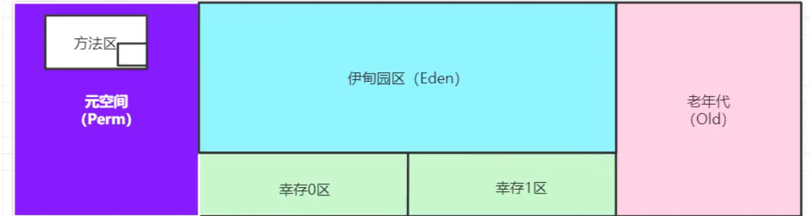

### 14.堆内存调优

- ==-Xms==：设置初始分配大小，默认为物理内存的 “1/64”。
- ==-Xmx==：最大分配内存，默认为物理内存的 “1/4”。
- ==-XX:+PrintGCDetails==：输出详细的GC处理日志。

> 测试1

**代码测试**

```java
public class Demo01 {
    public static void main(String[] args) {
        // 返回虚拟机试图使用的最大内存
        long max = Runtime.getRuntime().maxMemory();    // 字节：1024*1024
        // 返回jvm的总内存
        long total = Runtime.getRuntime().totalMemory();

        System.out.println("max=" + max + "字节\t" + (max/(double)1024/1024) + "MB");

        System.out.println("total=" + total + "字节\t" + (total/(double)1024/1024) + "MB");

        // 默认情况下:分配的总内存是电脑内存的1/4,初始化的内存是电脑的1/64

    }
}
```

- **IDEA**中进行VM调优参数设置，然后启动。

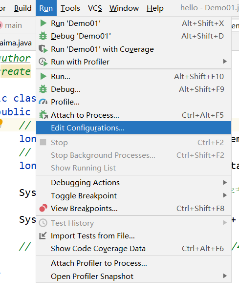


- 发现，默认的情况下分配的内存是总内存的 1/4，而初始化的内存为 1/64 ！

```java
-Xms1024m -Xmx1024m -XX:+PrintGCDetails
```

- VM参数调优：把初始内存，和总内存都调为 1024M，运行，查看结果！

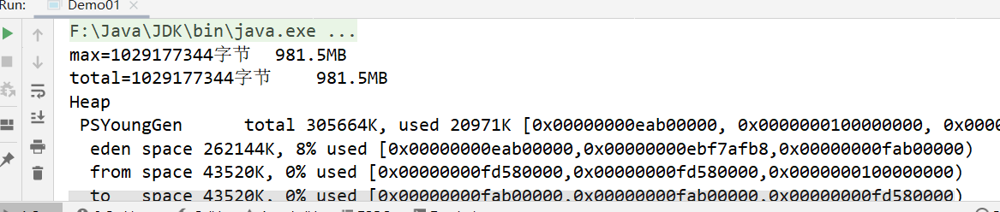

- 来大概计算分析一下！ 

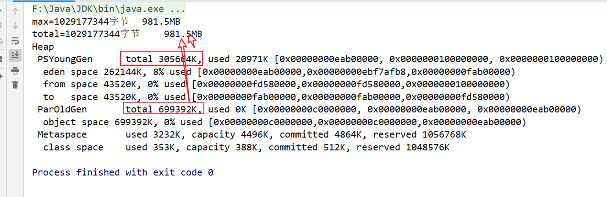

- 再次证明：元空间并不在虚拟机中，而是使用本地内存。

> 测试2

代码：

```java
package github.JVM.Demo02;

import java.util.Random;

/**
 * @author subeiLY
 * @create 2021-06-08 10:22
 */
public class Demo02 {
    public static void main(String[] args) {
        String str = "suneiLY";
        while (true) {
            str += str + new Random().nextInt(88888888)
                    + new Random().nextInt(999999999);
        }
    }
}
```

- vm参数：

```java
-Xms8m -Xmx8m -XX:+PrintGCDetails
```

- 测试，查看结果！


- 这是一个young 区域撑爆的JAVA 内存日志，其中 PSYoungGen 表示 youngGen分区的变化1536k 表示 GC 之前的大小。

- 488k 表示GC 之后的大小。

- 整个Young区域的大小从 1536K 到 672K , young代的总大小为 7680K。

   

- user – 总计本次 GC 总线程所占用的总 CPU 时间。

- sys – OS 调用 or 等待系统时间。

- real – 应用暂停时间。

- 如果GC 线程是 Serial Garbage Collector 串行搜集器的方式的话（只有一条GC线程,）， real time 等于user 和 system 时间之和。

- 通过日志发现Young的区域到最后 GC 之前后都是0，old 区域 无法释放，最后报堆溢出错误。

**其他文章链接**

- [一文读懂 - 元空间和永久代](https://juejin.cn/post/684490402096480257)
- [Java方法区、永久代、元空间、常量池详解](https://blog.csdn.net/u011635492/article/details/81046174?utm_medium=distribute.pc_relevant.none-task-blog-2%7Edefault%7EBlogCommendFromMachineLearnPai2%7Edefault-2.control&dist_request_id=1331647.219.16183160373688617&depth_1-utm_source=distribute.pc_relevant.none-task-blog-2%7Edefault%7EBlogCommendFromMachineLearnPai2%7Edefault-2.control)

### 15.GC
#### 1.Dump内存快照

        在运行java程序的时候，有时候想测试运行时占用内存情况，这时候就需要使用测试工具查看了。在eclipse里面有 **Eclipse Memory Analyzer tool(MAT)**插件可以测试，而在idea中也有这么一个插件，就是**JProfiler**，一款性能瓶颈分析工具！

**作用**：

- 分析Dump文件，快速定位内存泄漏；

- 获得堆中对象的统计数据

- 获得对象相互引用的关系

- 采用树形展现对象间相互引用的情况


> 安装JProfiler

1. IDEA插件安装


2. 安装JProfiler监控软件

- 下载地址：[https://www.ej-technologies.com/download/jprofiler/version_92](https://www.ej-technologies.com/download/jprofiler/version_92)


3. 下载完双击运行，选择自定义目录安装，点击Next。

- 注意：安装路径，**建议选择一个文件名中没有中文，没有空格的路径** ，否则识别不了。然后一直点Next。

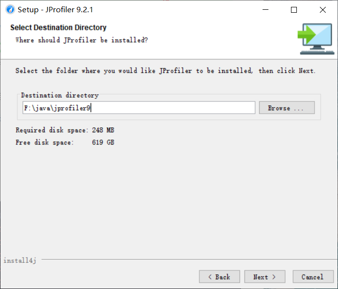

4. 注册

```java
// 注册码仅供大家参考
L-Larry_Lau@163.com#23874-hrwpdp1sh1wrn#0620
L-Larry_Lau@163.com#36573-fdkscp15axjj6#25257
L-Larry_Lau@163.com#5481-ucjn4a16rvd98#6038
L-Larry_Lau@163.com#99016-hli5ay1ylizjj#27215
L-Larry_Lau@163.com#40775-3wle0g1uin5c1#0674
```

5. 配置IDEA运行环境

- Settings–Tools–JProflier–JProflier executable选择JProfile安装可执行文件。（如果系统只装了一个版本， 启动IDEA时会默认选择）保存。

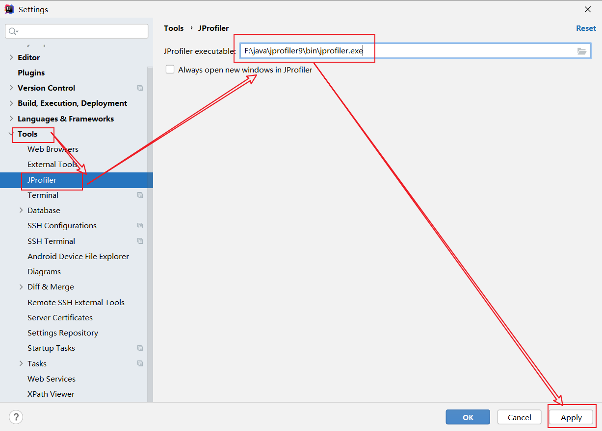

- 代码测试：

```java
package github.JVM.Demo02;

import java.util.ArrayList;

/**
 * @author subeiLY
 * @create 2021-06-08 11:13
 */
public class Demo03 {
    byte[] byteArray = new byte[1*1024*1024]; // 1M = 1024K


    public static void main(String[] args) {
        ArrayList<Demo03> list = new ArrayList<>();
        int count = 0;
        try {
            while (true) {
                list.add(new Demo03());  // 问题所在
                count = count + 1;
            }
        } catch (Error e) {
            System.out.println("count:" + count);
            e.printStackTrace();
        }
    }
}
```

- vm参数 ： `-Xms1m -Xmx8m -XX:+HeapDumpOnOutOfMemoryError`


- 寻找文件：

   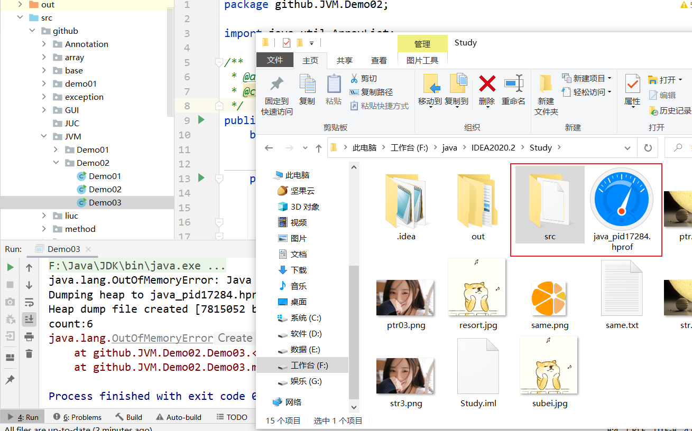

> 使用 Jprofiler 工具分析查看

双击这个文件默认使用 Jprofiler 进行 Open大的对象！


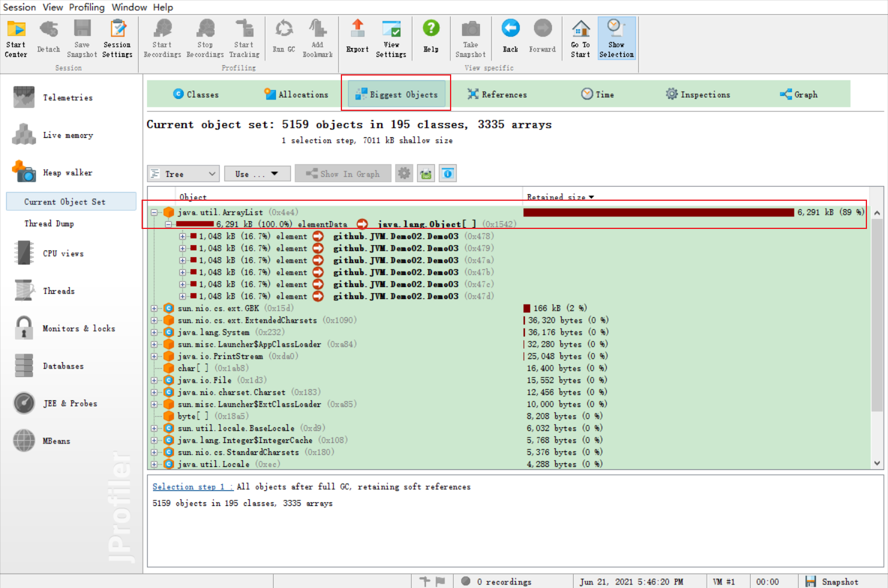

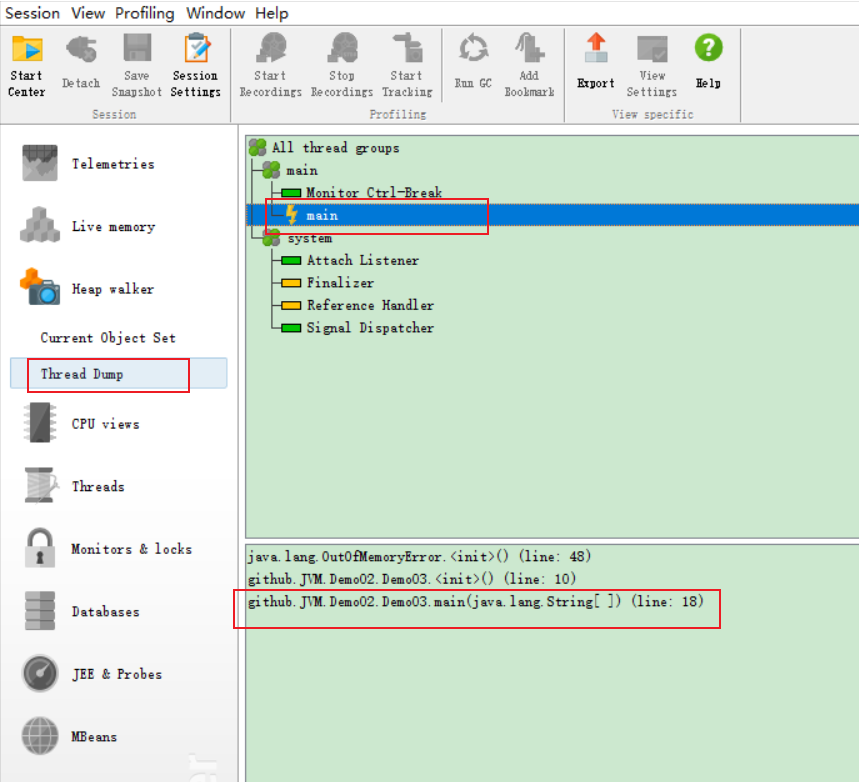

- 从软件开发的角度上，dump文件就是当程序产生异常时，用来记录当时的程序状态信息（例如堆栈的状态），用于程序开发定位问题。

#### 2.GC四大算法

##### 1.引用计数法


- 每个对象有一个引用计数器，当对象被引用一次则计数器加1，当对象引用失效一次，则计数器减1，对于计数器为0的对象意味着是垃圾对象，可以被GC回收。

- 目前虚拟机基本都是采用可达性算法，从GC  Roots  作为起点开始搜索，那么整个连通图中的对象边都是活对象，对于GC Roots 无法到达的对象变成了垃圾回收对象，随时可被GC回收。

##### 2.复制算法

- 年轻代中使用的是Minor GC，采用的就是复制算法（Copying）。

**什么是复制算法？**


- Minor GC 会把Eden中的所有活的对象都移到Survivor区域中，如果Survivor区中放不下，那么剩下的活的对象就被移动到Old generation中，**也就是说，一旦收集后，Eden就是变成空的了**

- 当对象在Eden（包括一个Survivor区域，这里假设是From区域）出生后，在经过一次Minor GC后，如果对象还存活，并且能够被另外一块Survivor区域所容纳 （上面已经假设为from区域，这里应为to区域，即to区域有足够的内存空间来存储Eden 和 From 区域中存活的对象），则使用**复制算法**将这些仍然还活着的对象复制到另外一块Survivor区域（即 to 区域）中，然后清理所使用过的Eden 以及Survivor 区域（即form区域），并且将这些对象的年龄设置为1，以后对象在Survivor区，每熬过一次MinorGC，就将这个对象的年龄 + 1，当这个对象的年龄达到某一个值的时候（默认是15岁，通过- XX:MaxTenuringThreshold 设定参数）这些对象就会成为老年代。

- `-XX:MaxTenuringThreshold`	任期门槛=>设置对象在新生代中存活的次数

> 面试题：如何判断哪个是to区呢？一句话：**谁空谁是to**


**原理解释：**

- 年轻代中的GC，主要是复制算法（Copying）

- HotSpot JVM 把年轻代分为了三部分：一个 Eden 区 和 2 个Survivor区（from区 和 to区）。默认比例为 8:1:1，一般情况下，新创建的对象都会被分配到Eden区（一些大对象特殊处理），这些对象经过第一次Minor GC后，如果仍然存活，将会被移到Survivor区，对象在Survivor中每熬过一次Minor GC ， 年龄就会增加1岁，当它的年龄增加到一定程度时，就会被移动到年老代中，因为年轻代中的对象基本上  都是朝生夕死，所以在年轻代的垃圾回收算法使用的是复制算法！复制算法的思想就是将内存分为两块，每次只用其中一块，当这一块内存用完，就将还活着的对象复制到另外一块上面。复制算法不会产  生内存碎片！


- 在GC开始的时候，对象只会在Eden区和名为 “From” 的Survivor区，Survivor区“TO” 是空的，紧接着进行GC，Eden区中所有存活的对象都会被复制到 “To”，而在 “From” 区中，仍存活的对象会更具他们的年龄值来决定去向。
- 年龄达到一定值的对象会被移动到老年代中，没有达到阈值的对象会被复制到  “To 区域”，经过这次GC后，Eden区和From区已经被清空，这个时候， “From” 和 “To” 会交换他们的角色， 也就是新的 “To” 就是GC前的“From” ， 新的 “From” 就是上次GC前的 “To”。
- 不管怎样，都会保证名为To 的Survicor区域是空的。 Minor GC会一直重复这样的过程。直到 To 区 被填满 ，“To” 区被填满之后，会将所有的对象移动到老年代中。

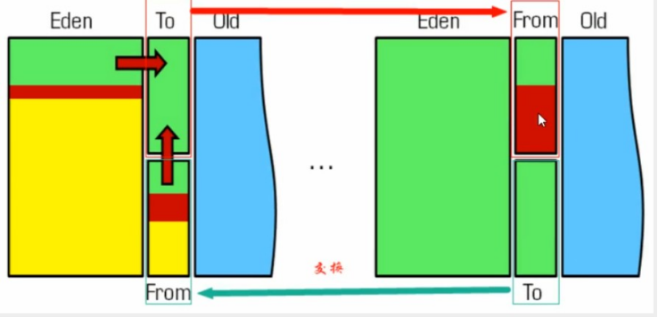

- 因为Eden区对象一般存活率较低，一般的，使用两块10%的内存作为空闲和活动区域，而另外80%的内存，则是用来给新建对象分配内存的。一旦发生GC，将10%的from活动区间与另外80%中存活的Eden 对象转移到10%的to空闲区域，接下来，将之前的90%的内存，全部释放，以此类推；

- 好处：没有内存碎片；坏处：浪费内存空间。

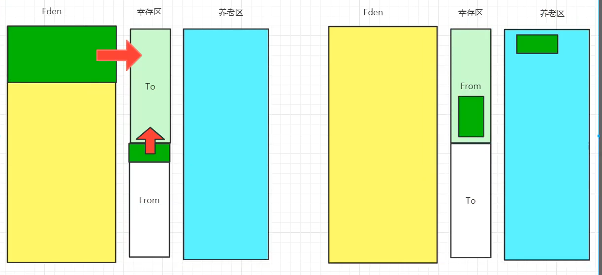

**劣势：** 

- 复制算法它的缺点也是相当明显的。
  - 1、他浪费了一半的内存，这太要命了。
  - 2、如果对象的存活率很高，我们可以极端一点，假设是100%存活，那么我们需要将所有对象都复制一遍，并将所有引用地址重置一遍。复制这一工作所花费的时间，在对象存活率达到一定程度时，将会变的不可忽视，所以从以上描述不难看出。复制算法要想使用，最起码对象的存活率要非常低才行，而且  最重要的是，我们必须要克服50%的内存浪费。

> 标记清除（Mark-Sweep）

- 回收时，对需要存活的对象进行标记； 

- 回收不是绿色的对象。

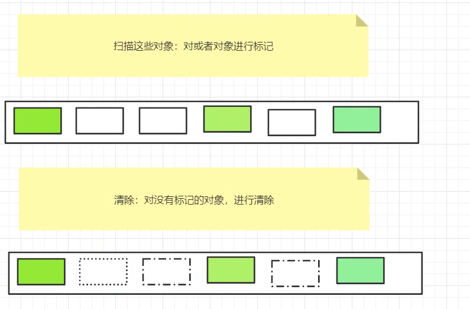

- 当堆中的有效内存空间被耗尽的时候，就会停止整个程序（也被称为stop the world），然后进行两项工作，第一项则是标记，第二项则是清除。

- 标记：从引用根节点开始标记所有被引用的对象，标记的过程其实就是遍历所有的GC  Roots  ，然后将所有GC Roots 可达的对象，标记为存活的对象。

- 清除： 遍历整个堆，把未标记的对象清除。

- 缺点：这个算法需要暂停整个应用，会产生内存碎片。两次扫描，严重浪费时间。

> 用通俗的话解释一下  标记/清除算法，就是当程序运行期间，若可以使用的内存被耗尽的时候，GC线程就会被触发并将程序暂停，随后将依旧存活的对象标记一遍，最终再将堆中所有没被标记的对象全部清  除掉，接下来便让程序恢复运行。

**劣势：**

1. 首先、它的缺点就是效率比较低（递归与全堆对象遍历），而且在进行GC的时候，需要停止应用  程序，这会导致用户体验非常差劲

2. 其次、主要的缺点则是这种方式清理出来的空闲内存是不连续的，这点不难理解，我们的死亡对象  都是随机的出现在内存的各个角落，现在把他们清除之后，内存的布局自然乱七八糟，而为了应付  这一点，JVM就不得不维持一个内存空间的空闲列表，这又是一种开销。而且在分配数组对象的时  候，寻找连续的内存空间会不太好找。

##### 3.标记压缩

- 标记整理说明：老年代一般是由标记清除或者是标记清除与标记整理的混合实现。

**什么是标记压缩？**

**原理：**

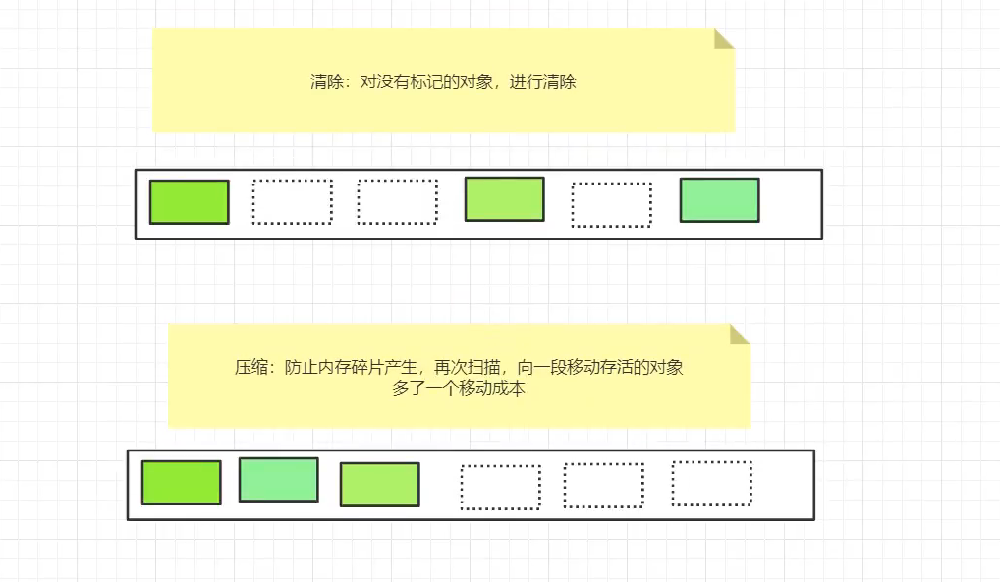

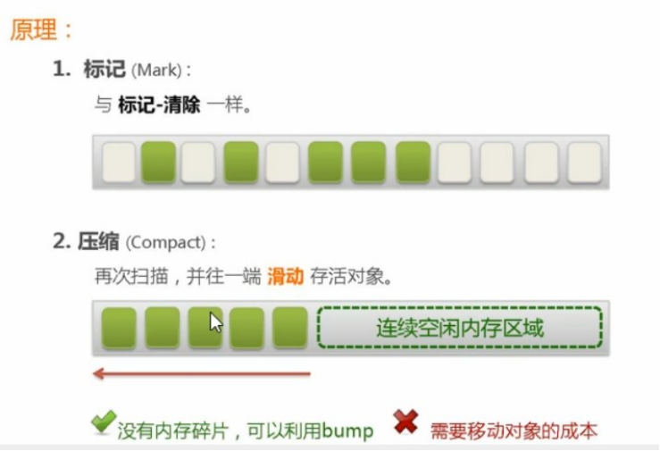

- 在整理压缩阶段，不再对标记的对象作回收，而是通过所有存活对象都像一端移动，然后直接清除边界以外的内存。可以看到，标记的存活对象将会被整理，按照内存地址依次排列，而未被标记的内存会被  清理掉，如此一来，当我们需要给新对象分配内存时，JVM只需要持有一个内存的起始地址即可，这比维护一个空闲列表显然少了许多开销。

- 标记、整理算法  不仅可以弥补  标记、清除算法当中，内存区域分散的缺点，也消除了复制算法当中，内存减半的高额代价；

##### 4.标记清除压缩

- 先标记清除几次，再压缩。


#### 3.总结

- 内存效率：复制算法 > 标记清除算法 > 标记压缩算法 （时间复杂度）； 

- 内存整齐度：复制算法 = 标记压缩算法 > 标记清除算法；
- 内存利用率：标记压缩算法 = 标记清除算法 > 复制算法；


可以看出，效率上来说，复制算法是当之无愧的老大，但是却浪费了太多内存，而为了尽量兼顾上面所  提到的三个指标，标记压缩算法相对来说更平滑一些 ， 但是效率上依然不尽如人意，它比复制算法多了一个标记的阶段，又比标记清除多了一个整理内存的过程。

> 难道就没有一种最优算法吗？
>
> 答案： 无，没有最好的算法，只有最合适的算法 。	-----------> 分代收集算法

**年轻代：**（Young Gen）

- 年轻代特点是区域相对老年代较小，对象存活低。
- 这种情况复制算法的回收整理，速度是最快的。复制算法的效率只和当前存活对象大小有关，因而很适  用于年轻代的回收。而复制算法内存利用率不高的问题，通过hotspot中的两个survivor的设计得到缓解。 

**老年代：**（Tenure Gen）

- 老年代的特点是区域较大，对象存活率高！
- 这种情况，存在大量存活率高的对象，复制算法明显变得不合适。一般是由标记清除或者是标记清除与标记整理的混合实现。Mark阶段的开销与存活对象的数量成正比，这点来说，对于老年代，标记清除或  者标记整理有一些不符，但可以通过多核多线程利用，对并发，并行的形式提标记效率。Sweep阶段的   开销与所管理里区域的大小相关，但Sweep “就地处决”  的  特点，回收的过程没有对象的移动。使其相对其他有对象移动步骤的回收算法，仍然是是效率最好的，但是需要解决内存碎片的问题。

### 16.JMM

1. 什么是JMM？

   - JMM：（java Memory Model的缩写）

2. 他干嘛的？官方，其他人的博客，对应的视频！

   - 作用：缓存一致性协议，用于定义数据读写的规则(遵守，找到这个规则)。		

   - JMM定义了线程工作内存和主内存之间的抽象关系∶线程之间的共享变量存储在主内存(Main Memory)中，每个线程都有一个私有的本地内存（Local Memory)。

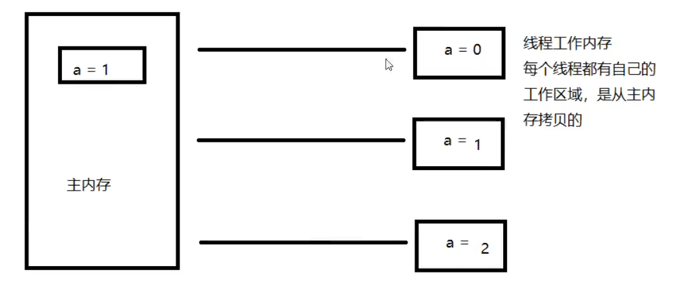

- 解决共享对象可见性这个问题：volilate

3. 它该如何学习？

   - JMM：抽象的概念，理论。

- [JMM对这八种指令的使用](https://www.cnblogs.com/null-qige/p/9481900.html)，制定了如下规则：
  - 不允许read和load、store和write操作之一单独出现。即使用了read必须load，使用了store必须write。
  - 不允许线程丢弃他最近的assign操作，即工作变量的数据改变了之后，必须告知主存。
  - 不允许一个线程将没有assign的数据从工作内存同步回主内存。
  - 一个新的变量必须在主内存中诞生，不允许工作内存直接使用一个未被初始化的变量。就是怼变量实施use、store操作之前，必须经过assign和load操作。
  - 一个变量同一时间只有一个线程能对其进行lock。多次lock后，必须执行相同次数的unlock才能解锁。
  - 如果对一个变量进行lock操作，会清空所有工作内存中此变量的值，在执行引擎使用这个变量前，必须重新load或assign操作初始化变量的值。
  - 如果一个变量没有被lock，就不能对其进行unlock操作。也不能unlock一个被其他线程锁住的变量。
  - 对一个变量进行unlock操作之前，必须把此变量同步回主内存。

　　JMM对这八种操作规则和对[volatile的一些特殊规则](https://www.cnblogs.com/null-qige/p/8569131.html)就能确定哪里操作是线程安全，哪些操作是线程不安全的了。但是这些规则实在复杂，很难在实践中直接分析。所以一般我们也不会通过上述规则进行分析。更多的时候，使用java的happen-before规则来进行分析。

## JUC


# 🎉Java SE基础结束🎉