## 多线程

### 1.线程简介

#### 1.多任务


- 现实中太多这样同时做多件事情的例子了，看起来是多个任务都在做，其实本质上我们的大脑在同一时间依旧只做了一件事情。 

#### 2.多线程


- 原来是一条路，慢慢因为车太多了，道路阻塞，效率极低。为了提高使用的效率，能够充分利用道路，于是加了多个车道。从此，妈妈再也不用担心道路阻塞了。 
- 普通方法调用和多线程

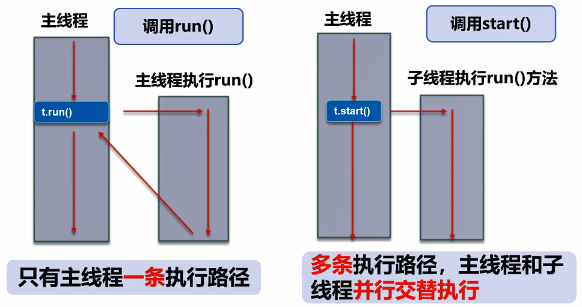

#### 3.程序.进程.线程


- 一个进程可以有多个线程，如视频中同时听声音，看图像，看弹幕，等等。

#### 4.Process与Thread

- 说起进程,就不得不说下程序。**程序**是指令和数据的有序集合，其本身没有任何运行的含义，是一个静态的概念。

- 而**进程**则是执行程序的依次执行过程，它是一个动态的概念。是系统资源分配的单位。

- 通常在一个进程中可以包含若干个**线程**，当然一个进程中至少有一个线程，不然没有存在的意义。线程是CPU调度和执行的单位。

**注意**：

- 很多多线程是模拟出来的，真正的多线程是指有多个cpu，即多核，如服务器。如果是模拟出来的多线程，即在一个cpu的情况下，在同一个时间点，cpu只能执行一个代码，因为切换的很快，所以就有同时执行的错局。

#### 5.核心概念

- 线程就是独立的执行路径。
- 在程序运行时,即使没有自己创建线程,后台也会有多个线程,比如主线程,GC线程。
- main()称之为主线程,为系统的入口,用于执行整个程序。
- 在一个进程中,如果开辟了多个线程,线程的运行是由调度器（cpu）安排调度的,调度器是与操作系统紧密相关的,先后顺序是不能人为干预的。
- 对同一份资源操作时mm会存在资源抢夺的问题,需要加入并发控制。
- 线程会带来额外的开销,如CPU调度时间,并发控制开销。
- 每个线程在自己的工作内存交互,内存控制不当会造成数据不一致。

### 2.线程实现

#### 1.线程的创建(三种方式)

> 1.1 继承Thread类**（重要）**
>
> - 自定义线程类继承`Thread`类；
> - 重写`run()`方法，编写线程执行体；
> - 创建线程对象，调用`start()`方法启动线程。

```java
package github.smt.demo01;

/**
 * @author subeiLY
 * @create 2021-06-07 08:29
 */
// 创建线程方式一：继承Thread类，重写run()方法，调用start开启线程
public class TestThread extends Thread{
    // run()方法线程体
    @Override
    public void run() {
        for (int i = 0; i < 20; i++) {
            System.out.println("我在阅读代码-----" + i);
        }
    }

    // main线程
    public static void main(String[] args) {
        // 创建一个线程对象
        TestThread thread = new TestThread();
        // 调用start()开启线程
        thread.start();

        for (int i = 0; i < 200; i++) {
            System.out.println("多线程学习中……" + i);
        }
    }
}
```

- 小结：线程不一定立即执行，CPU安排调度。

```java
package github.smt.demo01;

import org.apache.commons.io.FileUtils;

import java.io.File;
import java.io.IOException;
import java.net.URL;

/**
 * @author subeiLY
 * @create 2021-06-07 08:41
 */
// 练习Thread，实现多线程同步下载图片
public class TestThread02 extends Thread{
    private String url;
    private String name;

    // 有参构造
    public TestThread02(String url,String name) {
        this.url = url;
        this.name = name;
    }

    // 下载图片的执行体
    @Override
    public void run() {
        WebDownloader webDownloader = new WebDownloader();
        webDownloader.downloader(url,name);
        System.out.println("下载的文件：" + name);
    }

    public static void main(String[] args) {
        TestThread02 t1 = new TestThread02("http://browser9.qhimg.com/bdm/768_474_0/t010824ab8b5cdfa138.jpg","str.png");
        TestThread02 t2 = new TestThread02("http://browser9.qhimg.com/bdm/768_474_0/t012468d019e3ce466b.jpg","str2.png");
        TestThread02 t3 = new TestThread02("http://browser9.qhimg.com/bdm/384_237_0/t01039b44f7c7ca5ca3.jpg","str3.png");

        t1.start();
        t2.start();
        t3.start();

    }
}
// 下载器
class WebDownloader{
    // 下载方法
    public void downloader(String url,String name){
        try {
           FileUtils.copyURLToFile(new URL(url),new File(name));
        }catch (IOException e){
            e.printStackTrace();
            System.out.println("IO异常，downloader下载方法异常");
        }
    }
}
```

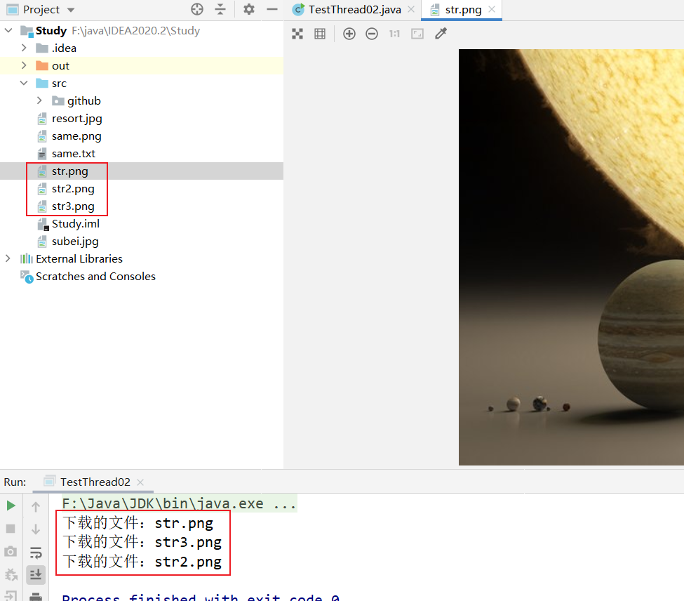

- 如果没有FileUtils.copyURLToFile方法，可以在[maven官网下载jar包](https://mvnrepository.com/artifact/commons-io/commons-io/2.6)，按照下图导入即可。

  

>1.2 实现Runnable接口
>
>- **推荐使用Runnable对象,因为Java单继承的局限性**；
>- 自定义线程类实现`Runnable`接口；
>- 实现`run()`方法,编写线程执行体；
>- 创建线程对象,调用`start()`方法启动对象。

```java
package github.smt.demo01;

/**
 * @author subeiLY
 * @create 2021-06-07 08:41
 */
// 练习Thread，实现多线程同步下载图片
public class TestThread03 implements Runnable{

    @Override
    public void run() {
        // run方法线程体
        for (int i = 0; i < 20; i++) {
            System.out.println("我在看代码-----" + i);
        }
    }

    public static void main(String[] args) {
        // 创建runnable接口的实现类对象
        TestThread03 thread03 = new TestThread03();

        // 创建线程对象，通过线程对象来开启我们的线程，代理
        Thread thread = new Thread(thread03);

        // 调用start()开启线程
        thread.start();

        for (int i = 0; i < 200; i++) {
            System.out.println("我在学习多线程……" + i);
        }
    }
}
```

```java
package github.smt.demo01;

/**
 * 多个线程同时操作同一个对象  买火车票案例
 * @author subeiLY
 * @create 2021-06-07 08:51
 */
// 发现问题:多个线程操作同一个资源的情况下,线程不安全,数据紊乱
public class TestThread04 implements Runnable{
    // 票数
    private int ticketNums = 10;

    public static void main(String[] args) {
        TestThread04 thread04 = new TestThread04();
        new Thread(thread04,"张三").start();
        new Thread(thread04,"李四").start();
        new Thread(thread04,"王五").start();
        new Thread(thread04,"赵六").start();

    }

    @Override
    public void run() {
        while (true){
            if(ticketNums <= 0){
                break;
            }
            // 捕获异常
            try {
                Thread.sleep(200);
            }catch (InterruptedException e){
                e.printStackTrace();
            }
            System.out.println(Thread.currentThread().getName() + "---》拿到了第" + ticketNums-- + "张票");
        }
    }
}
```

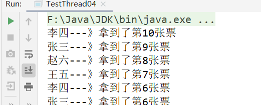

```java
package github.smt.demo01;

/**
 * 模拟龟兔赛跑
 * @author subeiLY
 * @create 2021-06-07 08:58
 */
public class TestThread05 implements Runnable{
    // 胜利者
    private static String winner;

    public static void main(String[] args) {
        TestThread05 thread05 = new TestThread05();
        new Thread(thread05,"兔子").start();
        new Thread(thread05,"乌龟").start();
    }

    @Override
    public void run() {
        for (int i = 0; i <= 100; i++) {
            // 模拟兔子休息
            if(Thread.currentThread().getName().equals("兔子") && i%10==0){
                try {
                    Thread.sleep(1);
                }catch (InterruptedException e){
                    e.printStackTrace();
                }
            }
            // 判断比赛是否结束
            boolean flag = gameOver(i);
            // 如果比赛结束，停止程序
            if(flag){
                break;
            }
            System.out.println(Thread.currentThread().getName() + "---》跑了" + i + "步");
        }
    }

    // 判断比赛是否结束
    private boolean gameOver(int steps){
        if(winner != null){
            return true;
        }else{
            if(steps >= 100){   // 一共100步
                winner = Thread.currentThread().getName();
                System.out.println("winner is " + winner);
                return true;
            }
        }
        return false;
    }
}
```

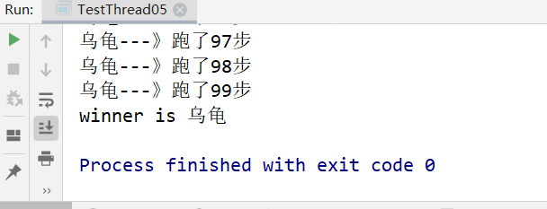

> 1.3 实现Callable接口（了解）
>
> - 实现Callable接口，需要返回值类型；
> - 重写call方法，需要抛出异常；
> - 创建目标对象；
> - 创建执行服务：ExecutorService ser = Executors.newFixedThreadPool(1);
> - 提交执行：Future result1 = ser.submit(11);
> - 获取结果：boolean r1 = result1.get();
> - 关闭服务：ser.shutdownNow();

```java
package github.smt.demo01;

import java.util.concurrent.*;

/**
 * @author subeiLY
 * @create 2021-06-07 09:04
 */
// 图片下载案例
public class TestThread06 implements Callable<Boolean> {
    private String url;     // 网络图片地址
    private String name;    // 报错的文件名

    // 有参构造
    public TestThread06(String url,String name){
        this.url = url;
        this.name = name;
    }

    public static void main(String[] args) throws ExecutionException,InterruptedException {
        TestThread06 p1 = new TestThread06("http://browser9.qhimg.com/bdm/768_474_0/t010824ab8b5cdfa138.jpg", "ptr.png");
        TestThread06 p2 = new TestThread06("http://browser9.qhimg.com/bdm/768_474_0/t012468d019e3ce466b.jpg", "ptr02.png");
        TestThread06 p3 = new TestThread06("http://browser9.qhimg.com/bdm/384_237_0/t01039b44f7c7ca5ca3.jpg", "ptr03.png");

        // 执行服务
        ExecutorService service = Executors.newFixedThreadPool(3);

        // 提交执行
        Future<Boolean> submit = service.submit(p1);
        Future<Boolean> submit1 = service.submit(p2);
        Future<Boolean> submit2 = service.submit(p3);

        // 获取结果
        boolean aBoolean = submit.get();
        boolean aBoolean1 = submit1.get();
        boolean aBoolean2 = submit2.get();

        // 关闭服务
        service.shutdownNow();
    }

    // 下载图片线程的执行体
    @Override
    public Boolean call() throws Exception {
        WebDownloader webDownloader = new WebDownloader();
        webDownloader.downloader(url,name);
        System.out.println("下载的文件：" + name);
        return true;
    }
}
```

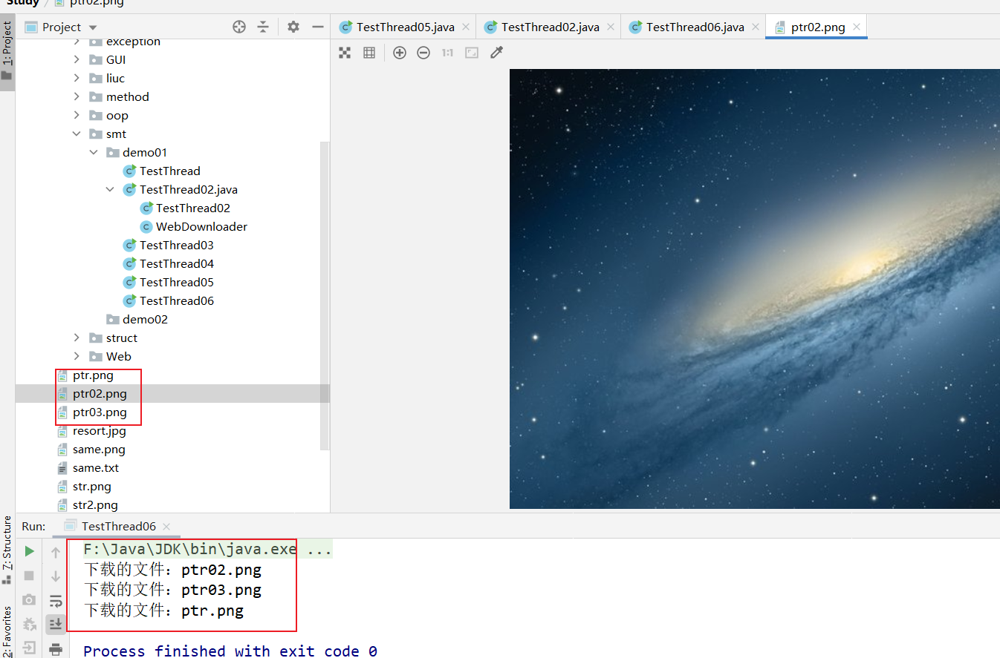

> 1.4Thread和Runnable对比
>
> - 继承Thred类:
>   - 子类继承Thread类具备多线程能力；
>   - 启动线程:子类对象.start()；
>   - ==不建议使用:避免OOP单继承局限性==。
>
> - 实现Runnable接口
>   - 实现接口Runnable具有多线程能力；
>   - 启动线程:传入目标对象+Thread对象.start()；
>   - ==推荐使用:避免单继承局限性,灵活方便,方便同一个对象被多个线程使用==。

#### 2.静态代理


```java
package github.smt.demo02;

/**
 * @author subeiLY
 * @create 2021-06-07 09:14
 */
public class TestStaticProxy {
    public static void main(String[] args) {
        WeddingCompany company = new WeddingCompany(new You());
        company.happyMary();
    }
}

// 结婚
interface Marry{
    void happyMary();
}

// 真实角色：你去结婚
class You implements Marry{
    @Override
    public void happyMary() {
        System.out.println("subei结婚了……");
    }
}

// 代理角色:婚庆公司帮你结婚
class WeddingCompany implements Marry{
    private Marry target;   // 代理--->真实目标角色，帮谁结婚

    public WeddingCompany(Marry target){
        this.target = target;
    }

    @Override
    public void happyMary() {
        after();
        this.target.happyMary();
        before();
    }

    private void after(){
        System.out.println("结婚前，布置现场！");
    }

    private void before(){
        System.out.println("结婚后，收尾款！");
    }
}
```

- 优化：使用线程，Lamda表达式。

```java
package github.smt.demo02;

/**
 * 线程中的代理模式
 * @author subeiLY
 * @create 2021-06-07 09:21
 */
public class TestStaticProxy02 {
    public static void main(String[] args) {
        new Thread(()-> System.out.println("因为爱情")).start();
        new WeddingCompany(new You()).happyMary();
    }
}
```

- 总结
  - 真实对象和代理对象都要实现一个接口；
  - 代理对象要代理真实角色。
- 好处
  - 代理对象可以做很多真实对象做不了的事情；
  - 真实对象专注做自己的事。

#### 3.Lambda表达式


- λ 希腊字母表中排序第十一位的字母，英语名称为 Lambda；
- 避免匿名内部类定义过多；
- 其实质属于函数式编程的概念；
- 去掉了一堆没有意义的代码,只留下核心逻辑。

> - (params)-> expression[表达式]
>
> - (params) -> statement[语句]
>
> - (params)-> {statements}
>
> ```java
> a -> System.out.println("i like lamda-->"+a)
> ```

- new Thread (()->System.out.println(“多线程学习。。。。”)).start()；
- 理解Functional Interface (函数式接口) 是学习Java 8 lambda表达式的关键

> 函数式接口的定义

- 任何接口，如果只包含唯一一个抽象方法，那么它就是一个函数式接口。

```java
public interface Runnable{
    public abstract void run();
}
```

- 对于函数式接口，我们可以通过Lambda表达式来创建该接口的对象。

> 实现：

- 案例1

```java
package github.smt.demo03;

/**
 * 推导lambda表达式
 *
 * @author subeiLY
 * @create 2021-06-07 09:34
 */
public class TestLambda {
    public static void main(String[] args) {
        // 创建接口对象
        Like like = new Like();
        like.lambda();

    }
}

// 1.定义一个函数式接口
interface ILike{
    void lambda();
}

// 2.实现类
class Like implements ILike{
    @Override
    public void lambda(){
        System.out.println("I like Lambda");
    }
}
```

- 优化一

```java
package github.smt.demo03;

/**
 * 推导lambda表达式
 *
 * @author subeiLY
 * @create 2021-06-07 09:34
 */
public class TestLambda {
    // 3.静态内部类
    static class Like implements ILike{
        @Override
        public void lambda(){
            System.out.println("I like Lambda2");
        }
    }

    public static void main(String[] args) {
        // 创建接口对象
        Like like = new Like();
        like.lambda();

    }
}

// 1.定义一个函数式接口
interface ILike{
    void lambda();
}
```
- 优化二

```java
package github.smt.demo03;

/**
 * 推导lambda表达式
 *
 * @author subeiLY
 * @create 2021-06-07 09:34
 */
public class TestLambda {

    public static void main(String[] args) {
        // 4.局部内部类
        class Like implements ILike{
            @Override
            public void lambda(){
                System.out.println("I like Lambda3");
            }
        }

        // 创建接口对象
        Like like = new Like();
        like.lambda();

    }
}

// 1.定义一个函数式接口
interface ILike{
    void lambda();
}
```
- 优化三

```java
package github.smt.demo03;

/**
 * 推导lambda表达式
 *
 * @author subeiLY
 * @create 2021-06-07 09:34
 */
public class TestLambda {

    public static void main(String[] args) {
        
        // 创建接口对象
        ILike like = new ILike() {
            // 5.匿名内部类，没有类的名称，必须借助接口或父类
            @Override
            public void lambda() {
                System.out.println("I like Lambda4");
            }
        };
        like.lambda();
    }
}

// 1.定义一个函数式接口
interface ILike{
    void lambda();
}
```
- 最终版

```java
package github.smt.demo03;

/**
 * 推导lambda表达式
 *
 * @author subeiLY
 * @create 2021-06-07 09:34
 */
public class TestLambda {

    public static void main(String[] args) {
        // 6.简化
        ILike like = () ->{
            System.out.println("I like Lambda5");
        };
        like.lambda();
    }
}

// 1.定义一个函数式接口
interface ILike{
    void lambda();
}
```

- 案例二

```java
package github.smt.demo03;

/**
 * @author subeiLY
 * @create 2021-06-07 09:44
 */
public class TestLambda02 {
    public static void main(String[] args) {
        // 1.lambda
        ILove love = (int a)->{
            System.out.println("I love you -->" + a);
        };
        // 2.lambda简化1.0
        love = (a) ->{
            System.out.println("I love you --> " + a);
        };
        // 3.lambda简化2.0
        love = a ->{
            System.out.println("I love you --> " + a);
        };
        // 4.lambda简化4.0
        love = a -> System.out.println("I love you --> " +a);

        /**
         * 总结：
         * {}简略的条件是只能有一行代码,多行{}就不能简略了
         * 前提是接口为函数式接口(只能有一个方法)
         * 多个参数也可以去掉参数类型,要去掉就都去掉,必须加上()
         */
        love.love(520);
    }
}

// 1.定义一个函数式接口
interface ILove{
    void love(int a);
}
```

### 3.线程状态

#### 1 线程的五大状态


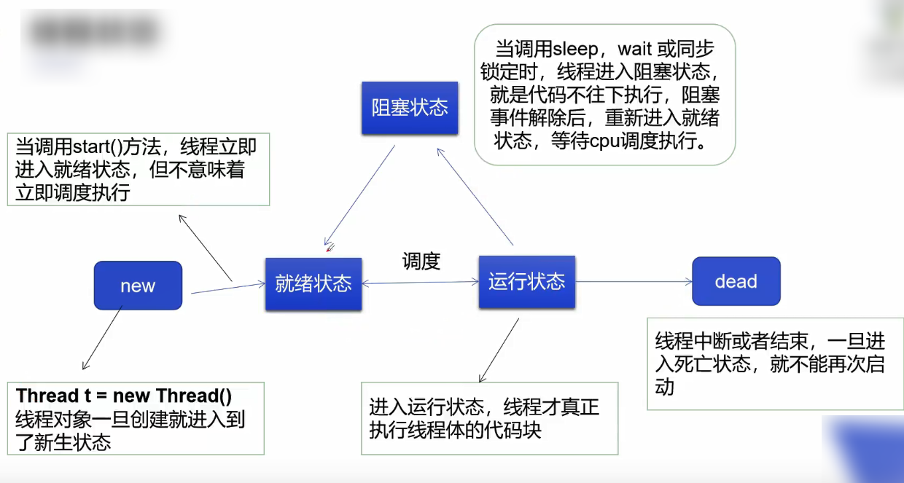

#### 2.线程方法


> 停止线程

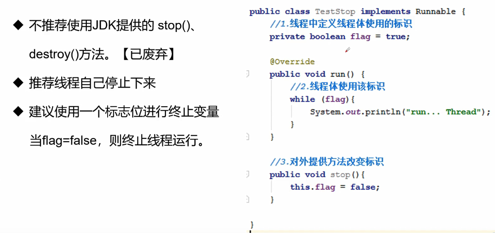

```java
package github.smt.demo03;

/**
 * @author subeiLY
 * @create 2021-06-07 09:58
 */

/**
 * 测试stop
 * 1.建议线程正常停止-->利用次数,不建议死循环
 * 2.建议使用标志位-->设置一个标志位
 * 3.不要使用stop或者destroy等过时或者JDK不建议使用的方法
 */

public class TestStopThread implements Runnable{
    // 1.设置一个标志位
    private boolean flag = true;

    public static void main(String[] args) {
        TestStopThread stop = new TestStopThread();
        new Thread(stop).start();
        for (int i = 0; i < 1000; i++) {
            System.out.println("main...." + i);
            if(i==900){
                // 调用stop()切换标志位,让线程终止
                stop.stop();
                System.out.println("线程该停止了");
            }
        }
    }

    @Override
    public void run() {
        int i = 0;
        while(flag){
            System.out.println("run……Thread" + i++);
        }
    }

    // 2.设置一个公开的方法停止线程，转换标志位
    public void stop(){
        this.flag = false;
    }
}
```

> 线程休眠


```java
package github.smt.demo03;

import github.smt.demo01.TestThread04;

/**
 * @author subeiLY
 * @create 2021-06-07 10:03
 */

// 模拟网络延迟:放大问题的发生性
public class TestSleepThread02 implements Runnable{
    // 票数
    private int ticketNums = 10;

    public static void main(String[] args) {
        TestThread04 thread04 = new TestThread04();
        new Thread(thread04,"张三").start();
        new Thread(thread04,"李四").start();
        new Thread(thread04,"王五").start();
        new Thread(thread04,"赵六").start();

    }

    @Override
    public void run() {
        while (true){
            if(ticketNums <= 0){
                break;
            }
            // 捕获异常
            try {
                Thread.sleep(200);
            }catch (InterruptedException e){
                e.printStackTrace();
            }
            System.out.println(Thread.currentThread().getName() + "---》拿到了第" + ticketNums-- + "张票");
        }
    }
}
```

```java
package github.smt.demo04;

/**
 * @author subeiLY
 * @create 2021-06-07 10:05
 */
public class TestSleepThread {
    public static void main(String[] args) {
        try {
            tenDown();
        } catch (InterruptedException e){
            e.printStackTrace();
        }
    }
    
    // 模拟倒计时
    public static void tenDown() throws InterruptedException{
        int num = 10;
        while(true){
            Thread.sleep(1000);
            System.out.println(num--);
            if(num<=0){
                break;
            }
        }
    }
}
```

```java
package github.smt.demo04;

import java.text.SimpleDateFormat;
import java.util.Date;

/**
 * 每一秒获取当前时间
 * @author subeiLY
 * @create 2021-06-07 10:10
 */
public class TestSleepThread02 {
    public static void main(String[] args) {
        // 获取当前系统时间
        Date date = new Date(System.currentTimeMillis());
        while(true){
            try{
                Thread.sleep(1000);
                // 更新系统时间
                System.out.println(new SimpleDateFormat("HH:mm:ss").format(date));
                date = new Date(System.currentTimeMillis());
            }catch (InterruptedException e){
                e.printStackTrace();
            }
        }
    }
}
```

> 线程礼让

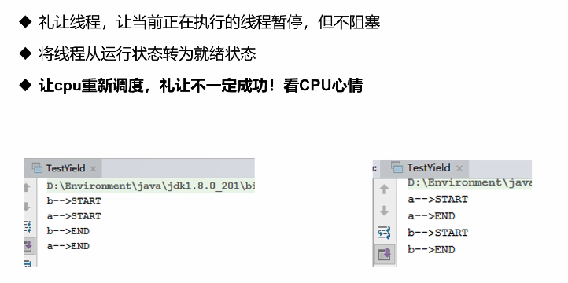

```java
package github.smt.demo04;

/**
 * 测试礼让线程
 * @author subeiLY
 * @create 2021-06-07 10:15
 */
public class TestThread {
    public static void main(String[] args) {
        MyYeild myYeild = new MyYeild();
        new Thread(myYeild,"a").start();
        new Thread(myYeild,"b").start();
    }
}

class MyYeild implements Runnable{
    @Override
    public void run() {
        System.out.println(Thread.currentThread().getName() + "线程开始执行");
        Thread.yield(); // 礼让
        System.out.println(Thread.currentThread().getName() + "线程停止执行");
    }
}
```

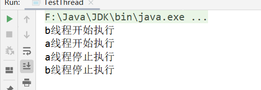

> 线程插队


```java
package github.smt.demo04;

/**
 * 插队
 * @author subeiLY
 * @create 2021-06-07 10:23
 */
public class TestJoinThread implements Runnable{
    public static void main(String[] args) throws InterruptedException{
        // 启动线程
        TestJoinThread joinThread = new TestJoinThread();
        Thread thread = new Thread(joinThread);
        thread.start();

        // 主线程
        for (int i = 0; i < 500; i++) {
            if(i==200){
                thread.join();  // 插队
            }
            System.out.println("main" + i);
        }
    }

    @Override
    public void run() {
        for (int i = 0; i < 500; i++) {
            System.out.println("线程VIP" + i);
        }
    }
}
```

#### 3.线程状态观测


```java
package github.smt.demo05;

/**
 * 观察测试线程状态
 * @author subeiLY
 * @create 2021-06-07 10:37
 */
public class TestThreadState {
    public static void main(String[] args) throws InterruptedException{
        Thread thread = new Thread(() -> {
            for (int i = 0; i < 5; i++) {
                try {
                    Thread.sleep(1000);
                } catch (InterruptedException e){
                    e.printStackTrace();
                }
            }
            System.out.println("--------------");
        });
        // 观察状态
        Thread.State state = thread.getState();
        System.out.println(state);
        
        // 观察启动后
        thread.start();
        state = thread.getState();
        System.out.println(state);     // Run
        while (state != Thread.State.TERMINATED){
            // 只要线程不终止，就一直输出状态
            Thread.sleep(100);
            state = thread.getState();  // 更新线程状态
            System.out.println(state);
        }
        // 死亡后的线程不能再启动了，启动会报异常
//        thread.start();
    }
}
```

#### 4.线程优先级

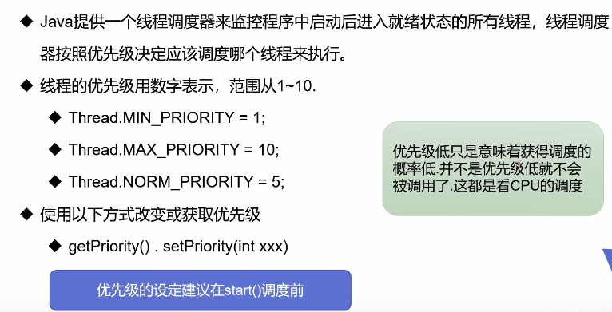

```java
package github.smt.demo05;

/**
 * @author subeiLY
 * @create 2021-06-07 10:45
 */
public class TestThreadPriority {
    public static void main(String[] args) {
        // 主线程默认优先级
        System.out.println(Thread.currentThread().getName()
                + "-->" + Thread.currentThread().getPriority());

        MyPriority myPriority = new MyPriority();
        Thread thread1 = new Thread(myPriority);
        Thread thread2 = new Thread(myPriority);
        Thread thread3 = new Thread(myPriority);
        Thread thread4 = new Thread(myPriority);
        Thread thread5 = new Thread(myPriority);

        // 先设置优先级，再启动
        thread1.start();

        thread2.setPriority(1);
        thread2.start();

        thread3.setPriority(4);
        thread3.start();

        // MAX_PRIORITY=10
        thread4.setPriority(Thread.MAX_PRIORITY);
        thread4.start();

        thread5.setPriority(8);
        thread5.start();

    }
}

class MyPriority implements Runnable{
    @Override
    public void run() {
        System.out.println(Thread.currentThread().getName()
                + "-->" + Thread.currentThread().getPriority());
    }
}
```


#### 5.守护线程

- 线程分为**用户线程**和**守护线程**；
- 虚拟机必须确保用户线程执行完毕；
- 虚拟机不用等待守护线程执行完毕；
- 如，后台记录操作日志，监控内存垃圾回收等待……

```java
package github.smt.demo05;

/**
 * 测试守护线程
 * @author subeiLY
 * @create 2021-06-07 10:56
 */
public class TestDemoThread {
    public static void main(String[] args) {
        God god = new God();
        You you = new You();

        Thread thread = new Thread(god);
        // 默认false表示是用户线程，正常线程都是用户线程
        thread.setDaemon(true);
        // 耶稣守护线程启动
        thread.start();
        // 你 用户线程启动
        new Thread(you).start();
    }
}

class God implements Runnable{

    @Override
    public void run() {
        while (true){
            System.out.println("耶稣都救不了你！");
        }
    }
}

class You implements Runnable{

    @Override
    public void run() {
        System.out.println("------你好，世界！------");
        for (int i = 0; i < 36500; i++) {
            System.out.println("每天都很开心！");
        }
        System.out.println("------再见，世界！------");
    }
}
```

### 4.线程同步

#### 1.介绍

- **多个线程操作同一个资源 **
- 并发：同一个对象被多个线程同时操作


> 线程同步：
>
> - 现实生活中我们会遇到“同—个资源，多个人都想使用”的问题，比如食堂排队打饭，每个人都想吃饭，最天然的解決办法就是：排队，一个个来。
> - 处理多线程问题时，多个线程访问同一个对象，并且某些线程还想修改这个对象这时候我们就需要线程同步。线程同步其实就是一种等待机制，多个需要同时访问此对象的线程进入这个==对象的等待池形==成队列，等待前面线程使用完毕，下一个线程再使用。

- 队列和锁

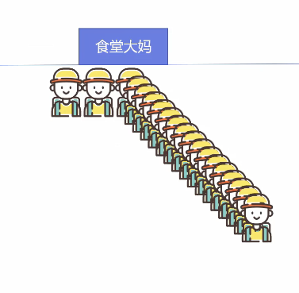

> 线程同步：
>
> - 由于同一进程的多个线程共享同一块存储空间，在带来方便的同时，也带来了访问冲突问题，为了保证数据在方法中被访问时的正确性，在访问时加入锁机制synchronized，当一个线程获得对象的排它锁，独占资源，其他线程必须等待使用后释放锁即可。存在以下问题：
>   - 一个线程持有锁会导致其他所有需要此锁的线程挂起；
>   - 在多线程竞争下，加锁，释放锁会导致比较多的上下文切换和调度延时，引起性能问题；
>   - 如果一个优先级高的线程等待个优先级低的线程释放锁会导致优先级倒置，引起性能问题。

#### 2.不安全的线程案例

```java
package github.smt.demo05;

/**
 * 不安全买票
 * @author subeiLY
 * @create 2021-06-07 11:08
 */
public class TestUnsafeBuyTicket {
    public static void main(String[] args) {
        BuyTicket buyTicket = new BuyTicket();
        new Thread(buyTicket,"张三").start();
        new Thread(buyTicket,"李四").start();
        new Thread(buyTicket,"王五").start();
    }
}

class BuyTicket implements Runnable{
    // 票
    private int ticketNums = 10;
    boolean flag = true;

    @Override
    public void run() {
        // 买票
        while(flag){
            try{
                buy();
            } catch (Exception e){
                e.printStackTrace();
            }
        }
    }

    // 买票
    private void buy(){
        // 判断是否有票
        if(ticketNums <= 0){
            flag = false;
            return;
        }
        // 延迟
        try{
            Thread.sleep(1);
        } catch (InterruptedException e){
            e.printStackTrace();
        }

        // 买票
        System.out.println(Thread.currentThread().getName()
            + "拿到" + ticketNums--);
    }
}
```

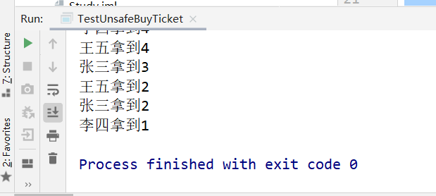

```java
package github.smt.demo05;

/**
 * @author subeiLY
 * @create 2021-06-07 11:21
 */
public class TestUnsafeBank {
    public static void main(String[] args) {
        Account account = new Account(100, "养老基金");
        Drawing drawing = new Drawing(account, 60, "夸克");
        Drawing same = new Drawing(account, 120, "same");
        drawing.start();
        same.start();
    }
}

class Account{
    int money;  // 余额
    String cardName;    // 卡名

    public Account(int money, String cardName) {
        this.money = money;
        this.cardName = cardName;
    }
}

class Drawing extends Thread{
    Account account;    // 账户
    int drawingMoney;   // 取余额
    int nowMoney;   // 个人手里的钱

    public Drawing(Account account, int drawingMoney, String name) {
        // super(name) =  父类构造方法(name)
        super(name);
        this.account = account;
        this.drawingMoney = drawingMoney;
    }

    // 取钱
    @Override
    public void run(){
        // 判断是否有钱
        if (account.money - drawingMoney < 0) {
            System.out.println(Thread.currentThread().getName() + "余额不足,不能进行取钱");
            return;
        }
        try {
            Thread.sleep(1000); // 放大问题的发生性
        } catch (InterruptedException e) {
            e.printStackTrace();
        }
        // 卡内金额 = 余额-个人手里的钱
        account.money = account.money - drawingMoney;
        // 个人手里的钱
        nowMoney = nowMoney + drawingMoney;
        System.out.println(account.cardName + "余额为:" + account.money);
        // this.getName()==Thread.currentThread().getName()
        System.out.println(this.getName() + "手里的钱:" + nowMoney);
    }
}
```


```java
package github.smt.demo05;

import java.util.ArrayList;
import java.util.List;

/**
 * 线程不安全的集合
 * @author subeiLY
 * @create 2021-06-07 11:27
 */
public class TestUnsafeList {
    public static void main(String[] args) {
        List<String> list = new ArrayList<>();
        for (int i = 0; i < 1000; i++) {
            new Thread(() ->{
               list.add(Thread.currentThread().getName()) ;
            }).start();
        }
        try {
            Thread.sleep(3000);
        } catch (InterruptedException e) {
            e.printStackTrace();
        }
        System.out.println(list.size());
    }
}
```

#### 3.同步方法

- 由于我们可以通过 private关键字来保证数据对象只能被方法访问，所以我们只需要针对方法提岀一套机制，这套机制就是syη chronized关键字，它包括两种用法synchronized方法和 synchronized块。
  - 同步方法：public synchronized void method (int args) {}
- synchronized方法控制对“对象"的访问，每个对象对应一把锁，每个synchronized方法都必须获得调用该方法的对象的锁才能执行，否则线程会阻塞，方法一旦执行，就独占该锁，直到该方法返回才释放锁，后面被阻塞的线程才能获得这个锁，继续执行。
  - 缺陷：若将一个大的方法申明为 synchronized将会影响效率。


```java
package github.smt.demo05;

/**
 * 安全买票
 * @author subeiLY
 * @create 2021-06-07 11:08
 */
public class TestUnsafeBuyTicket {
    public static void main(String[] args) {
        BuyTicket buyTicket = new BuyTicket();
        new Thread(buyTicket,"张三").start();
        new Thread(buyTicket,"李四").start();
        new Thread(buyTicket,"王五").start();
    }
}

class BuyTicket implements Runnable{
    // 票
    private int ticketNums = 10;
    boolean flag = true;

    @Override
    public void run() {
        // 买票
        while(flag){
            try{
                buy();
            } catch (Exception e){
                e.printStackTrace();
            }
        }
    }

    // synchronized 同步方法
    // 买票
    private synchronized void buy() {
        // 判断是否有票
        if(ticketNums <= 0){
            flag = false;
            return;
        }
        // 延迟
        try{
            Thread.sleep(1);
        } catch (InterruptedException e){
            e.printStackTrace();
        }

        // 买票
        System.out.println(Thread.currentThread().getName()
            + "拿到" + ticketNums--);
    }
}
```


#### 4.同步块

- 同步块：synchronized (Obj) {}
- obj称之为同步监视器
  - Obj可以是任何对象，但是推存使用共享资源作为同步监视器。
  - 同步方法中无需指定同步监视器，因为同步方法的同步监视器就是this，就是这个对象本身，或者是class。
- 同步监视器的执行过程：
  - 1.第一个线程访问，锁定同步监视器，执行其中代码；
  - 2.第二个线程访问，发现同步监视器被锁定，无法访问；
  - 3.第一个线程访问完毕，解锁同步监视器；
  - 4.第二个线程访问，发现同步监视器没有锁，然后锁定并访问。

==锁的对象就是变量的量,需要增删改查的对象==

```java
package github.smt.demo05;

/**
 * 安全的取钱 同步块
 * @author subeiLY
 * @create 2021-06-07 11:21
 */
public class TestUnsafeBank {
    public static void main(String[] args) {
        Account account = new Account(100, "养老基金");
        Drawing drawing = new Drawing(account, 60, "夸克");
        Drawing same = new Drawing(account, 120, "same");
        drawing.start();
        same.start();
    }
}

class Account{
    int money;  // 余额
    String cardName;    // 卡名

    public Account(int money, String cardName) {
        this.money = money;
        this.cardName = cardName;
    }
}

class Drawing extends Thread{
    Account account;    // 账户
    int drawingMoney;   // 取余额
    int nowMoney;   // 个人手里的钱

    public Drawing(Account account, int drawingMoney, String name) {
        // super(name) =  父类构造方法(name)
        super(name);
        this.account = account;
        this.drawingMoney = drawingMoney;
    }

    // 取钱
    @Override
    public void run() {
        // 锁的对象就是变量的量,需要增删改查的对象
        synchronized (account) {
            // 判断是否有钱
            if (account.money - drawingMoney < 0) {
                System.out.println(Thread.currentThread().getName() + "余额不足,不能进行取钱");
                return;
            }
            try {
                Thread.sleep(1000); // 放大问题的发生性
            } catch (InterruptedException e) {
                e.printStackTrace();
            }
            // 卡内金额 = 余额 - 个人手里的钱
            account.money = account.money - drawingMoney;
            // 个人手里的钱
            nowMoney = nowMoney + drawingMoney;
            System.out.println(account.cardName + "余额为:" + account.money);
            // this.getName()==Thread.currentThread().getName()
            System.out.println(this.getName() + "手里的钱:" + nowMoney);
        }
    }
}
```


```java
package github.smt.demo05;

import java.util.ArrayList;
import java.util.List;

/**
 * 线程安全的集合 同步块
 * @author subeiLY
 * @create 2021-06-07 11:27
 */
public class TestUnsafeList {
    public static void main(String[] args) {
        List<String> list = new ArrayList<>();
        for (int i = 0; i < 1000; i++) {
            new Thread(() ->{
                synchronized (list) {
                    list.add(Thread.currentThread().getName());
                }
            }).start();
        }
        try {
            Thread.sleep(3000);
        } catch (InterruptedException e) {
            e.printStackTrace();
        }
        System.out.println(list.size());
    }
}
```

- JUC安全集合类型扩充

```java
package github.smt.demo05;

import java.util.concurrent.CopyOnWriteArrayList;

/**
 * 测试JUC安全类型的集合
 * @author subeiLY
 * @create 2021-06-07 11:36
 */
public class TestThreadJuc {
    public static void main(String[] args) {
        CopyOnWriteArrayList<String> list = new CopyOnWriteArrayList<>();
        for (int i = 0; i < 10000; i++) {
            new Thread(() -> {
                list.add(Thread.currentThread().getName());
            }).start();
        }
        try{
            Thread.sleep(3000);
        } catch (InterruptedException e){
            e.printStackTrace();
        }
        System.out.println(list.size());
    }
}
```


#### 5.死锁

- 多个线程各自占有一些共享资源，并且互相等待其他线程占有的资源才能运行，而导致两个或者多个线程都在等待对方释放资源，都停止执行的情形。某一个同步块同时拥有“两个以上对象的锁"时，就可能会发生“死锁”的问题。

```java
package github.smt.demo06;

/**
 * 死锁:多个线程互相抱着对方需要的资源,然后形成僵持
 * 解决:一个锁只锁一个对象
 * @author subeiLY
 * @create 2021-06-07 11:47
 */
public class TestDeadLock {
    public static void main(String[] args) {
        Makeup makeup = new Makeup(0, "黄焖鸡");
        Makeup makeup1 = new Makeup(1, "牛肉土豆粉");

        makeup.start();
        makeup1.start();

    }
}

// 鸭脖
class DuckNeck{}

// 土豆粉
class PotatoPowder{}

class Makeup extends Thread{
    // 需要的资源只有一份,用static保证只有一份
    static DuckNeck duckneck = new DuckNeck();
    static PotatoPowder potatoPowder = new PotatoPowder();
    int choice; // 选择
    String foodName;    // 食品名称

    public Makeup(int choice, String foodName) {
        this.choice = choice;
        this.foodName = foodName;
    }

    @Override
    public void run() {
        // 美食
        try{
            food();
        } catch (InterruptedException e){
            e.printStackTrace();
        }
    }

    private void food() throws InterruptedException{
        if(choice == 0){
            synchronized (duckneck){    // 获得鸭脖的锁
                System.out.println(this.foodName + "获得鸭脖的锁");
                Thread.sleep(1000);
                synchronized (potatoPowder){    // 一秒后想获得 土豆粉的锁
                    System.out.println(this.foodName + "获得土豆粉的锁");
                }
            }
        } else {
            synchronized (duckneck){    // 获得鸭脖的锁
                System.out.println(this.foodName + "获得鸭脖的锁");
                Thread.sleep(2000);
                synchronized (potatoPowder){    // 一秒后想获得 土豆粉的锁
                    System.out.println(this.foodName + "获得土豆粉的锁");
                }
            }
        }
    }
}
```


- 解决：

```java
package github.smt.demo06;

/**
 * 死锁:多个线程互相抱着对方需要的资源,然后形成僵持
 * 解决:一个锁只锁一个对象
 * @author subeiLY
 * @create 2021-06-07 11:47
 */
public class TestDeadLock {
    public static void main(String[] args) {
        Makeup makeup = new Makeup(0, "黄焖鸡");
        Makeup makeup1 = new Makeup(1, "牛肉土豆粉");

        makeup.start();
        makeup1.start();

    }
}

// 鸭脖
class DuckNeck{}

// 土豆粉
class PotatoPowder{}

class Makeup extends Thread{
    // 需要的资源只有一份,用static保证只有一份
    static DuckNeck duckneck = new DuckNeck();
    static PotatoPowder potatoPowder = new PotatoPowder();
    int choice; // 选择
    String foodName;    // 食品名称

    public Makeup(int choice, String foodName) {
        this.choice = choice;
        this.foodName = foodName;
    }

    @Override
    public void run() {
        // 美食
        try{
            food();
        } catch (InterruptedException e){
            e.printStackTrace();
        }
    }

    private void food() throws InterruptedException{
        if(choice == 0){
            synchronized (duckneck) {    // 获得鸭脖的锁
                System.out.println(this.foodName + "获得鸭脖的锁");
                Thread.sleep(1000);
            }
            synchronized (potatoPowder){    // 一秒后想获得 土豆粉的锁
                System.out.println(this.foodName + "获得土豆粉的锁");
            }            
        } else {
            synchronized (duckneck) {    // 获得鸭脖的锁
                System.out.println(this.foodName + "获得鸭脖的锁");
                Thread.sleep(2000);
            }
            synchronized (potatoPowder){    // 一秒后想获得 土豆粉的锁
                System.out.println(this.foodName + "获得土豆粉的锁");
            }
        }
    }
}
```

> 避免死锁的办法

- 产生死锁的四个必要条件
  - 1.互斥条件：一个资源毎次只能被一个进程使用。
  - 2.请求与保持条件：一个进程因请求资源而阻塞时，对已获得的资源保持不放。
  - 3.不剥夺条件∶进程已获得的资源，在末使用完之前，不能强行剥夺。
  - 4.循环等待条件：若干进程之间形成一种头尾相接的循环等待资源关系。
- 上面列出了死锁的四个必要条件，我们只要想办法破其中的任意一个或多个条件就可以避免死锁发生。

#### 6.Lock(锁) 

- 从JDK 5.0开始, Java提供了更强大的线程同步机制一通过显式定义同步锁对象来实现同步。同步锁使用Lock对象充当。
- java.util.concurrent.locks.Lock接口是控制多个线程对共享资源进行访问的工具。锁提供了对共享资源的独占访问，每次只能有一个线程对Lock对象加锁，线程开始访问共享资源之前应先获得Lock对象。
- ReentrantLock 类实现了 Lock，它拥有与 synchronized 相同的并发性和内存语义，在实现线程安全的控制中，比较常用的是ReentrantLock, 可以显式加锁、释放锁。

```java
class A{
    private final Reentrantlock lock new Reen TrantLock();
    public void m(){
        lock.lock();
        try{
            // 保证线程安全的代码
        }
        finally{
            lock.unlock();	// 如果同步代码有异常，要将unlock()写入finally语句块
        } 
    }
} 
```

```java
package github.smt.demo06;

import java.util.concurrent.locks.ReentrantLock;

/**
 * 测试Lock锁
 * @author subeiLY
 * @create 2021-06-07 13:09
 */
public class TestThreadLock {
    public static void main(String[] args) {
        TestLock testLock = new TestLock();
        new Thread(testLock).start();
        new Thread(testLock).start();
        new Thread(testLock).start();
    }
}

class TestLock implements Runnable{
    int tickerNums = 10;
    // 定义Lock锁
    private final ReentrantLock lock = new ReentrantLock();

    @Override
    public void run() {
        while(true){
            // 加锁
            try{
                lock.lock();
                if(tickerNums <= 0){
                    break;
                }
                try{
                    Thread.sleep(1000);
                } catch (InterruptedException e){
                    e.printStackTrace();
                }
                System.out.println(tickerNums--);
            } catch (Exception e){
                e.printStackTrace();
            } finally {
                // 解锁
                lock.unlock();
            }
        }
    }
}

```

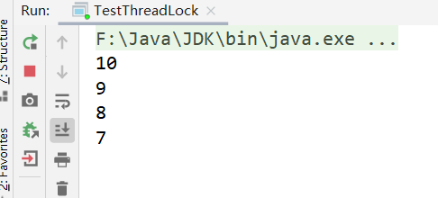

#### 7.synchroized与Lock对比

- Lock是显式锁 (手动开启和关闭锁，别忘记关闭锁) synchronized是隐式锁, 出了作用域自动释放。
- Lock只有代码块锁, synchronized有代码块锁和方法锁。
- 使用Lock锁，JVM将花费较少的时间来调度线程, 性能更好。并且具有更好的扩展性 (提供更多的子类)。
- 优先使用顺序:
  - Lock > 同步代码块 (已经进入了方法体，分配了相应资源 $)>$ 同步方法 (在方法体之外)

### 5.线程通信问题

- 应用场景 : 生产者和消费者问题
  - 假设仓库中只能存放一件产品 , 生产者将生产出来的产品放入仓库，消费者将仓库中产品取走消费。
  - 如果仓库中没有产品 , 则生产者将产品放入仓库，否则停止生产并等待，直到仓库中的产品被消费者取走为止。
  - 如果仓库中放有产品 , 则消费者可以将产品取走消费，否则停止消费并等待，直到仓库中再次放入产品为止。

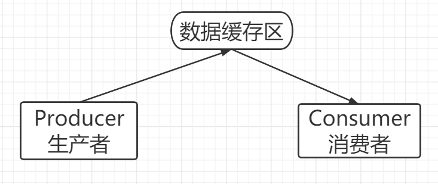

#### 1.线程通信方法

- Java提供了几个方法解决线程之间的通信问题。

|       方法名       | 作用                                                         |
| :----------------: | ------------------------------------------------------------ |
|       wait()       | 表示线程一直等待，直到其他线程通知，与sleep不同会释放锁。    |
| wait(long timeout) | 指定等待的毫秒数。                                           |
|      notify()      | 唤醒一个处于等待状态的线程。                                 |
|    notifyAll()     | 唤醒同一个对象上所有调用wait()方法的线程，优先级别高的线程优先调度。 |

- 注意：均是 Object类的方法，都只能在同步方法或者同步代码块中使用，否则会抛出异常IIIegalMonitorStateException。
- 这是一个线程同步问题，生产者和消费者共享同一个资源，并且生产者和消费者之间相互依赖，互为条件：
  - 对于生产者，没有生产产品之前，要通知消费者等待。而生产了产品之后，又需要马上通知消费者消费。
  - 对于消费者，在消费之后，要通知生产者已经结束消费，需要生产新的产品以供消费。
  - 在生产者消费者问题中，仅有 synchronized是不够的：
    - synchronized可阻止并发更新同一个共享资源，实现了同步；
    - synchronized不能用来实现不同线程之间的消息传递通信。

#### 2.线程通信问题解决方式

> 解决方式一：
>
> - 并发协作模型“生产者/消费者模式”-->管程法：
>   - 生产者∶负责生产数据的模块（可能是方法，对象，线程，进程）；
>   - 消费者：负责处理数据的模块（可能是方法，对象，线程，进程）；
>   - 缓冲区：消费者不能直接使用生产者的数据，他们之间有个“缓冲区”。
> - 生产者将生产好的数据放入缓冲区，消费者从缓冲区拿出数据。

```java
package github.smt.demo06;

/**
 * 测试:生产者消费者模型-->利用缓冲区解决:管程法
 * @author subeiLY
 * @create 2021-06-07 13:22
 */
public class TestThreadPC {
    public static void main(String[] args) {
        SynContainer synContainer = new SynContainer();
        new Producer(synContainer).start();
        new Consumer(synContainer).start();
    }
}

// 生产者
class Producer extends Thread{
    // 缓冲区
    SynContainer container;

    public Producer(SynContainer container) {
        this.container = container;
    }

    // 生产
    @Override
    public void run() {
        for (int i = 0; i < 100; i++) {
            container.push(new Product(i));
            System.out.println("生产了:" + i + "件产品。");
        }
    }
}

// 消费者
class Consumer extends Thread{
    // 缓冲区
    SynContainer container;

    public Consumer(SynContainer container) {
        this.container = container;
    }

    // 消费
    @Override
    public void run() {
        for (int i = 0; i < 100; i++) {
            System.out.println("消费了:" + container.pop().id + "件产品。");
        }
    }
}

// 产品
class Product{
    int id; // 产品编号
    public Product(int id){
        this.id = id;
    }
}

// 缓冲区
class SynContainer {
    // 需要一个容器大小
    Product[] products = new Product[10];
    // 容器计数器
    int count = 0;

    // 生产者放入产品
    public synchronized void push(Product product) {
        // 如果容器满了,需要等待消费者消费
        /*
        如果是if的话，假如消费者1消费了最后一个，
        这是index变成0此时释放锁被消费者2拿到而不是生产者拿到，
        这时消费者的wait是在if里所以它就直接去消费index-1下标越界，
        如果是while就会再去判断一下index得值是不是变成0了
        */
        while (count == products.length) {
            // 通知消费者消费,等待生产
            try {
                this.wait();
            } catch (InterruptedException e) {
                e.printStackTrace();
            }
        }
        // 如果没有满,需要丢入产品
        products[count] = product;
        count++;
        // 通知消费者消费
        this.notifyAll();
    }

    // 消费者消费产品
    public synchronized Product pop() {
        // 判断是否能消费
        while (count <= 0) {
            // 等待生产者生产
            try {
                this.wait();
            } catch (InterruptedException e) {
                e.printStackTrace();
            }
        }
        // 如果可以消费
        count--;
        Product product = products[count];
        // 吃完了 通知生产者生产
        this.notifyAll();
        return product;
    }
}
```

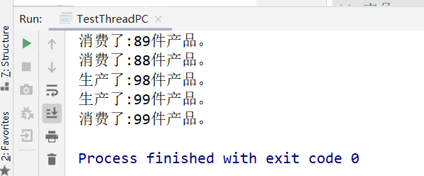

> 解决方式二：
>
> - 并发协作模型“生产者/消费者模式”--->信号灯法。

```java
package github.smt.demo06;

/**
 * 测试:生产者消费者模型2-->信号灯法,标志位解决
 * @author subeiLY
 * @create 2021-06-07 13:38
 */
public class TestThreadPC02 {
    public static void main(String[] args) {
        TV tv = new TV();
        new Player(tv).start();
        new Watcher(tv).start();
    }
}

// 生产者 --> 演员
class Player extends Thread{
    TV tv;

    public Player(TV tv) {
        this.tv = tv;
    }

    @Override
    public void run() {
        for (int i = 0; i < 20; i++) {
            if(i%2==0){
                this.tv.play("熊出没播放中……");
            }else{
                this.tv.play("开心消消乐……");
            }
        }
    }
}

// 消费者 --> 观众
class Watcher extends Thread{
    TV tv;

    public Watcher(TV tv) {
        this.tv = tv;
    }

    @Override
    public void run() {
        for (int i = 0; i < 20; i++) {
            tv.watch();
        }
    }
}

// 产品 --> 节目
class TV{
    /*
    演员表演，观众等待 T
    观众观看，演员等待 F
     */
    String voice; // 表演的节目
    boolean flag = true;

    // 表演
    public synchronized void play(String voice){
        if (!flag){
            try{
                this.wait();
            } catch (InterruptedException e){
                e.printStackTrace();
            }
        }

        System.out.println("演员表演了:" + voice);
        // 通知观众观看
        this.notifyAll();   // 通知唤醒
        this.voice = voice;
        this.flag = !this.flag;
    }

    // 观看
    public synchronized void watch(){
        if(flag){
            try{
                this.wait();
            } catch (InterruptedException e){
                e.printStackTrace();
            }
        }
        System.out.println("观看了:" + voice);
        // 通知演员表演
        this.notify();
        this.flag = !this.flag;
    }
}
```


### 6.线程池

- 背景：经常创建和销毁、使用量特别大的资源，比如并发情况下的线程，对性能影响很大。
- 思路：提前创建好多个线程，放入线程池中，使用时直接获取，使用完放回池中。可以避免频繁创建销毁、实现重复利用。类似生活中的公共交通工具。
- 好处：
  - 提高响应速度（减少了创建新线程的时间）；
  - 降低资源消耗（重复利用线程池中线程，不需要毎次都创建）；
  - 便于线程管理（…）
    - corePoolsize：核心池的大小；
    - maximumPoolSize：最大线程数；
    - keepAliveTime：线程没有任务时最多保持多长时间后会终止。
- JDK 5.0起提供了线程池相关AP:ExecutorService和 Executors。
- ExecutorService：真正的线程池接口。常见子类 ThreadPoolExecutor。
  - void execute（ Runnable command）：执行任务命令，没有返回值，一般用来执行 Runnable；
  - <T> Future<T> submit（ Callable<T>妇ask）：执行任务，有返回值，一般又来执行Callable；
  - void shutdown（）：关闭连接池。
- Executors：工具类、线程池的工厂类，用于创建并返回不同类型的线程池。

```java
package github.smt.demo06;

import java.util.concurrent.ExecutorService;
import java.util.concurrent.Executors;

/**
 * 测试线程池
 * @author subeiLY
 * @create 2021-06-07 13:47
 */
public class TestThreadPool {
    public static void main(String[] args) {
        // 1.创建服务,创建线程池
        // newFixedThreadPool(线程池大小)
        ExecutorService service = Executors.newFixedThreadPool(10);

        // 执行
        service.execute(new MyThread());
        service.execute(new MyThread());
        service.execute(new MyThread());
        service.execute(new MyThread());
        service.execute(new MyThread());
        service.execute(new MyThread());

        // 关闭链接
        service.shutdown();
    }
}

class MyThread implements Runnable{
    @Override
    public void run() {
        System.out.println(Thread.currentThread().getName());
    }
}
```

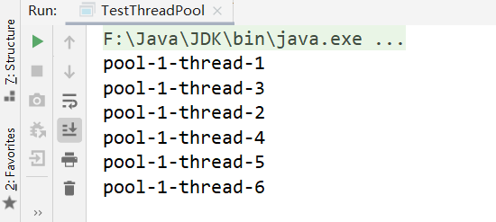